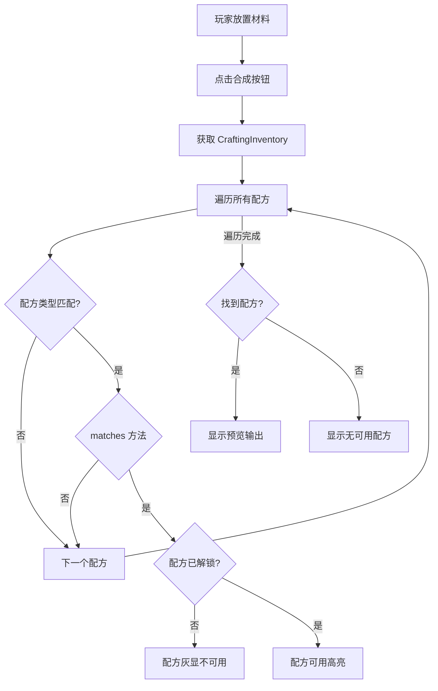
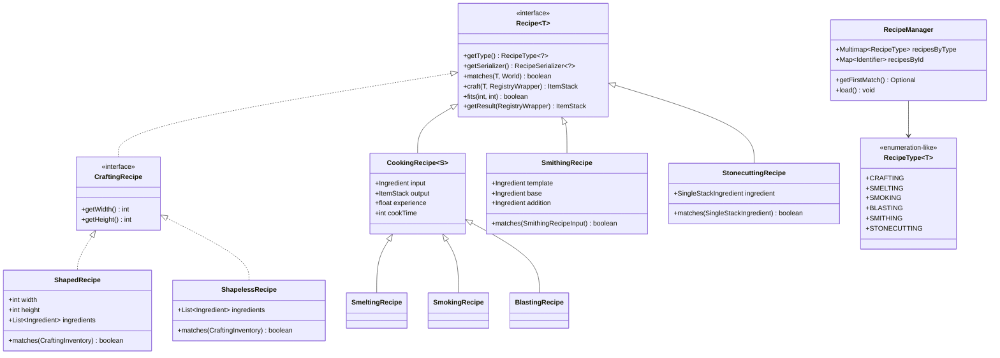

# Minecraft 1.21 配方系统

> 基于 CFR 0.2.2 反编译源代码的配方系统完整分析
> 版本信息: Protocol 767, World Version 3953

---

## 1. 概述

配方系统（Crafting System）是 Minecraft 物品加工的核心机制，涵盖合成、熔炉烧制、锻造、切石、酿造等多种物品转换方式。系统采用数据驱动的 JSON 格式，支持数据包扩展和 Mod 自定义配方。

### 1.1 配方系统架构

```
┌─────────────────────────────────────────────────────────────┐
│                    配方系统核心架构                            │
├─────────────────────────────────────────────────────────────┤
│                                                             │
│  ┌──────────────────┐   ┌──────────────────────────────┐   │
│  │   Recipe          │   │     RecipeType               │   │
│  │   (配方接口)       │◄──│     (配方类型)                │   │
│  └────────┬─────────┘   └──────────────┬─────────────┘   │
│           │                              │                  │
│           ▼                              ▼                  │
│  ┌──────────────────┐   ┌──────────────────────────────┐   │
│  │  RecipeSerializer │   │    RecipeManager             │   │
│  │  (序列化器)        │   │    (配方管理器)               │   │
│  └──────────────────┘   └──────────────────────────────┘   │
│                                                             │
│  ┌──────────────────────────────────────────────────────┐  │
│  │                    配方类型继承树                        │  │
│  │                                                        │  │
│  │  Recipe~I~                                            │  │
│  │     │                                                 │  │
│  │     ├── CraftingRecipe                               │  │
│  │     │     ├── ShapedRecipe                          │  │
│  │     │     └── ShapelessRecipe                       │  │
│  │     │                                                 │  │
│  │     ├── CookingRecipe                                │  │
│  │     │     ├── SmeltingRecipe                       │  │
│  │     │     ├── SmokingRecipe                        │  │
│  │     │     └── BlastingRecipe                       │  │
│  │     │                                                 │  │
│  │     ├── SmithingRecipe                               │  │
│  │     └── StonecuttingRecipe                           │  │
│  │                                                        │  │
│  └──────────────────────────────────────────────────────┘  │
│                                                             │
└─────────────────────────────────────────────────────────────┘
```

---

## 2. 核心类详解

### 2.1 Recipe 接口

```net/minecraft/recipe/Recipe.java
public interface Recipe<T extends RecipeInput> extends IdentifierPredicate {
    // 配方类型
    RecipeType<?> getType();

    // 序列化器
    RecipeSerializer<?> getSerializer();

    // 检查材料是否匹配
    boolean matches(T input, World world);

    // 制作物品
    ItemStack craft(T input, RegistryWrapper.WrapperLookup registries);

    // 是否适合指定网格大小
    boolean fits(int width, int height);

    // 获取输出
    ItemStack getResult(RegistryWrapper.WrapperLookup registries);

    // 获取 ID
    Identifier getId();
}
```

### 2.2 RecipeInput 接口

```net/minecraft/recipe/RecipeInput.java
public interface RecipeInput {
    // 获取指定槽位的物品
    ItemStack getStack(int slot);

    // 获取槽位数量
    int getSize();

    // 获取所有物品（作为流）
    default Stream<ItemStack> getStacksInInput() {
        return IntStream.range(0, this.getSize())
            .mapToObj(this::getStack);
    }
}
```

### 2.3 CraftingInventory - 合成格子

```net/minecraft/inventory/CraftingInventory.java
public class CraftingInventory implements RecipeInput {
    // 合成格子（3x3 = 9 槽）
    private final int width;
    private final int height;
    private final List<ItemStack> stacks;

    @Override
    public ItemStack getStack(int slot) {
        return this.stacks.get(slot);
    }

    @Override
    public int getSize() {
        return this.stacks.size();
    }

    // 获取宽度
    public int getWidth() {
        return this.width;
    }

    // 获取高度
    public int getHeight() {
        return this.height;
    }

    // 检查非空槽位
    public IntStream getNonEmptySlots() {
        return IntStream.range(0, this.stacks.size())
            .filter(i -> !this.stacks.get(i).isEmpty());
    }
}
```

### 2.4 RecipeType - 配方类型枚举

```net/minecraft/recipe/RecipeType.java
public class RecipeType<T extends Recipe> {
    public static final RecipeType<CraftingRecipe> CRAFTING = new RecipeType<>("crafting");
    public static final RecipeType<SmeltingRecipe> SMELTING = new RecipeType<>("smelting");
    public static final RecipeType<SmokingRecipe> SMOKING = new RecipeType<>("smoking");
    public static final RecipeType<BlastingRecipe> BLASTING = new RecipeType<>("blasting");
    public static final RecipeType<StonecuttingRecipe> STONECUTTING = new RecipeType<>("stonecutting");
    public static final RecipeType<SmithingRecipe> SMITHING = new RecipeType<>("smithing");
    public static final RecipeType<BrewingRecipe> BREWING = new RecipeType<>("brewing");

    private final String id;
}
```

### 2.5 RecipeSerializer - 序列化器

```net/minecraft/recipe/Serializer.java
public interface RecipeSerializer<T extends Recipe<?>> extends FabricRegistrySync,
                                                             FabricDataCodecAcceptor {
    // 写入数据包
    void write(PacketByteBuf buf, T recipe);

    // 读取数据包
    T read(PacketByteBuf buf);

    // 从 JSON 读取
    T fromJson(Identifier id, JsonObject json);

    // 写入 JSON
    JsonObject toJson(T recipe);
}
```

---

## 3. 有形状合成 - ShapedRecipe

### 3.1 ShapedRecipe 类

```net/minecraft/recipe/ShapedRecipe.java
public class ShapedRecipe implements CraftingRecipe {
    private final Identifier id;
    private final int width;
    private final int height;
    private final List<Ingredient> ingredients;
    private final ItemStack output;
    private final String group;
    private final boolean showNotification;
    private final RecipeSerializer<ShapedRecipe> serializer;

    @Override
    public boolean matches(CraftingInventory inventory, World world) {
        // 从左上角开始匹配
        for (int y = 0; y <= inventory.getHeight() - this.height; y++) {
            for (int x = 0; x <= inventory.getWidth() - this.width; x++) {
                if (this.matchesPattern(inventory, x, y)) {
                    return true;
                }
            }
        }
        return false;
    }

    private boolean matchesPattern(CraftingInventory inventory, int offsetX, int offsetY) {
        for (int y = 0; y < this.height; y++) {
            for (int x = 0; x < this.width; x++) {
                int slot = (y + offsetY) * inventory.getWidth() + (x + offsetX);
                ItemStack inputStack = inventory.getStack(slot);
                Ingredient ingredient = this.ingredients.get(y * this.width + x);

                // 检查空格
                if (ingredient.isEmpty()) {
                    if (!inputStack.isEmpty()) {
                        return false;
                    }
                } else {
                    if (!ingredient.test(inputStack)) {
                        return false;
                    }
                }
            }
        }
        return true;
    }

    @Override
    public ItemStack craft(CraftingInventory inventory, RegistryWrapper.WrapperLookup registries) {
        ItemStack output = this.output.copy();
        if (this.showNotification) {
            // 标记显示通知
        }
        return output;
    }

    @Override
    public int getWidth() {
        return this.width;
    }

    @Override
    public int getHeight() {
        return this.height;
    }
}
```

### 3.2 JSON 格式

```json
{
    "type": "minecraft:crafting_shaped",
    "group": "planks",
    "category": "building_blocks",
    "pattern": [
        "#",
        "#"
    ],
    "key": {
        "#": {
            "item": "minecraft:oak_log"
        }
    },
    "result": {
        "item": "minecraft:oak_planks",
        "count": 4
    }
}
```

### 3.3 支持镜像

```java
// 水平镜像
"pattern": [
    "##",
    " #"
]
// 匹配:
// XX     XX
//  X  或  X
```

---

## 4. 无形状合成 - ShapelessRecipe

### 4.1 ShapelessRecipe 类

```net/minecraft/recipe/ShapelessRecipe.java
public class ShapelessRecipe implements CraftingRecipe {
    private final Identifier id;
    private final String group;
    private final ItemStack output;
    private final List<Ingredient> ingredients;
    private final RecipeSerializer<ShapelessRecipe> serializer;

    @Override
    public boolean matches(CraftingInventory inventory, World world) {
        // 创建输入物品列表
        List<ItemStack> inputItems = new ArrayList<>();
        for (int i = 0; i < inventory.getSize(); i++) {
            ItemStack stack = inventory.getStack(i);
            if (!stack.isEmpty()) {
                inputItems.add(stack);
            }
        }

        // 检查材料数量
        if (inputItems.size() != this.ingredients.size()) {
            return false;
        }

        // 检查每个材料是否匹配
        List<Ingredient> remaining = new ArrayList<>(this.ingredients);
        for (ItemStack inputStack : inputItems) {
            boolean found = false;
            for (Iterator<Ingredient> it = remaining.iterator(); it.hasNext(); ) {
                if (it.next().test(inputStack)) {
                    it.remove();
                    found = true;
                    break;
                }
            }
            if (!found) {
                return false;
            }
        }

        return remaining.isEmpty();
    }

    @Override
    public ItemStack craft(CraftingInventory inventory, RegistryWrapper.WrapperLookup registries) {
        return this.output.copy();
    }
}
```

### 4.2 JSON 格式

```json
{
    "type": "minecraft:crafting_shapeless",
    "group": "dyes",
    "category": "misc",
    "ingredients": [
        {"item": "minecraft:white_dye"},
        {"item": "minecraft:blue_dye"}
    ],
    "result": {
        "item": "minecraft:light_blue_dye",
        "count": 2
    }
}
```

---

## 5. 烹饪配方 - CookingRecipe

### 5.1 CookingRecipe 基类

```net/minecraft/recipe/CookingRecipe.java
public class CookingRecipe<S extends CookingRecipe<S>> implements Recipe<FurnaceIngredient> {
    private final Identifier id;
    private final String group;
    private final Ingredient input;
    private final ItemStack output;
    private final float experience;
    private final int cookTime;
    private final RecipeSerializer<S> serializer;
    private final RecipeType<S> type;
}
```

### 5.2 SmeltingRecipe - 熔炉烧制

```net/minecraft/recipe/SmeltingRecipe.java
public class SmeltingRecipe implements CookingRecipe<SmeltingRecipe> {
    public static final RecipeSerializer<SmeltingRecipe> SERIALIZER =
        new CookingRecipeSerializer<>(
            "smelting",
            SmeltingRecipe::new,
            SmeltingRecipe::stream
        );

    // 默认烧制时间：200 ticks (10秒)
    public static final int DEFAULT_COOK_TIME = 200;

    // 默认经验：0.1
    public static final float DEFAULT_EXPERIENCE = 0.1f;
}
```

### 5.3 SmokingRecipe - 烟熏炉

```net/minecraft/recipe/SmokingRecipe.java
public class SmokingRecipe implements CookingRecipe<SmokingRecipe> {
    public static final RecipeSerializer<SmokingRecipe> SERIALIZER =
        new CookingRecipeSerializer<>(
            "smoking",
            SmokingRecipe::new,
            SmokingRecipe::stream
        );

    // 烟熏时间：100 ticks (5秒)
    public static final int DEFAULT_COOK_TIME = 100;
}
```

### 5.4 BlastingRecipe - 高炉

```net/minecraft/recipe/BlastingRecipe.java
public class BlastingRecipe implements CookingRecipe<BlastingRecipe> {
    public static final RecipeSerializer<BlastingRecipe> SERIALIZER =
        new CookingRecipeSerializer<>(
            "blasting",
            BlastingRecipe::new,
            BlastingRecipe::stream
        );

    // 高炉时间：100 ticks (5秒)
    public static final int DEFAULT_COOK_TIME = 100;
}
```

### 5.5 JSON 格式

```json
{
    "type": "minecraft:smelting",
    "group": "food",
    "ingredient": {
        "item": "minecraft:potato"
    },
    "result": "minecraft:baked_potato",
    "experience": 0.35,
    "cookingtime": 200
}
```

---

## 6. 锻造配方 - SmithingRecipe

### 6.1 SmithingRecipe 类

```net/minecraft/recipe/SmithingRecipe.java
public class SmithingRecipe implements Recipe<SmithingRecipeInput> {
    private final Identifier id;
    private final Ingredient template;
    private final Ingredient base;
    private final Ingredient addition;
    private final ItemStack result;
    private final RecipeSerializer<SmithingRecipe> serializer;

    @Override
    public boolean matches(SmithingRecipeInput input, World world) {
        return this.base.test(input.getBaseItem())
            && this.addition.test(input.getAdditionItem())
            && (this.template.isEmpty() || this.template.test(input.getTemplateItem()));
    }

    @Override
    public ItemStack craft(SmithingRecipeInput input, RegistryWrapper.WrapperLookup registries) {
        ItemStack result = this.result.copy();
        // 应用 NBT 数据
        // ...
        return result;
    }
}
```

### 6.2 JSON 格式

```json
{
    "type": "minecraft:smithing_transform",
    "template": "minecraft:netherite_upgrade_smithing_template",
    "base": {
        "item": "minecraft:diamond_sword"
    },
    "addition": {
        "item": "minecraft:netherite_ingot"
    },
    "result": {
        "item": "minecraft:netherite_sword"
    }
}
```

---

## 7. 切石配方 - StonecuttingRecipe

### 7.1 StonecuttingRecipe 类

```net/minecraft/recipe/StonecuttingRecipe.java
public class StonecuttingRecipe implements Recipe<SingleStackIngredient> {
    private final Identifier id;
    private final String group;
    private final SingleStackIngredient ingredient;
    private final ItemStack result;
    private final RecipeSerializer<StonecuttingRecipe> serializer;
}
```

### 7.2 JSON 格式

```json
{
    "type": "minecraft:stonecutting",
    "group": "wooden_blocks",
    "ingredient": {
        "item": "minecraft:oak_log"
    },
    "result": "minecraft:oak_planks",
    "count": 4
}
```

---

## 8. 配方管理器

### 8.1 RecipeManager 类

```net/minecraft/recipe/RecipeManager.java
public class RecipeManager implements JsonDataLoader {
    // 按类型索引的配方
    private Multimap<RecipeType<?>, RecipeEntry<?>> recipesByType;

    // 按 ID 索引的配方
    private Map<Identifier, RecipeEntry<?>> recipesById;

    // 加载配方
    public void load(RegistryWrapper<Recipe<?>> registry, Map<Identifier, JsonElement> jsons) {
        for (Map.Entry<Identifier, JsonElement> entry : jsons.entrySet()) {
            Identifier id = entry.getKey();
            JsonObject json = entry.getValue().getAsJsonObject();
            RecipeEntry<?> recipe = this.deserialize(id, json, registry);
            this.addRecipe(recipe);
        }
    }

    // 添加配方
    private <T extends Recipe<?>> void addRecipe(RecipeEntry<T> recipe) {
        this.recipesById.put(recipe.id(), recipe);
        this.recipesByType.put(recipe.value().getType(), recipe);
    }

    // 查找匹配配方
    public <I extends RecipeInput, T extends Recipe<I>> Optional<RecipeEntry<T>>
            getFirstMatch(RecipeType<T> type, I input, World world) {
        Iterable<RecipeEntry<T>> recipes = this.get(type);
        for (RecipeEntry<T> entry : recipes) {
            if (entry.value().matches(input, world)) {
                return Optional.of(entry);
            }
        }
        return Optional.empty();
    }

    // 获取所有匹配配方
    public <I extends RecipeInput, T extends Recipe<I>> List<RecipeEntry<T>>
            getAllMatches(RecipeType<T> type, I input, World world) {
        List<RecipeEntry<T>> results = new ArrayList<>();
        for (RecipeEntry<T> entry : this.get(type)) {
            if (entry.value().matches(input, world)) {
                results.add(entry);
            }
        }
        return results;
    }

    // 获取指定类型的配方
    public <T extends Recipe<?>> Iterable<RecipeEntry<T>> get(RecipeType<T> type) {
        return (Iterable<RecipeEntry<T>>) (Iterable<?>) this.recipesByType.get(type);
    }
}
```

---

## 9. 配方发现与配方书

### 9.1 PlayerRecipeBook - 配方书

```net/minecraft/client/recipe/ClientRecipeBook.java
public class ClientRecipeBook {
    // 已解锁配方
    private final Set<Identifier> unlockedRecipes = new HashSet<>();

    // 需插入的配方
    private final List<RecipeEntry<?>> toInsert = new ArrayList<>();

    // 是否可见
    private boolean isVisible = false;

    // 解锁配方
    public void unlock(RecipeEntry<?> recipe) {
        this.unlockedRecipes.add(recipe.id());
    }

    // 检查是否解锁
    public boolean isUnlocked(Identifier recipeId) {
        return this.unlockedRecipes.contains(recipeId);
    }

    // 标记需插入
    public void markNew(RecipeEntry<?> recipe) {
        this.toInsert.add(recipe);
    }
}
```

### 9.2 服务器同步

```java
// 服务器通知客户端配方解锁
public class S2CRecipeUpdatePacket implements Packet<ClientPlayPacketListener> {
    private final List<RecipeEntry<?>> recipes;
    private final boolean init;

    public void apply(ClientPlayPacketListener listener) {
        listener.onRecipeUpdate(this);
    }
}
```

---

## 10. 酿造系统（NeoForge 扩展）

### 10.1 IBrewingRecipe 接口

```net/minecraftforge/common/brewing/IBrewingRecipe.java
public interface IBrewingRecipe {
    // 判断是否为有效输入（下层槽位，如水瓶）
    boolean isInput(ItemStack input);

    // 判断是否为有效成分（上层槽位，如地狱疣）
    boolean isIngredient(ItemStack ingredient);

    // 获取酿造输出
    ItemStack getOutput(ItemStack input, ItemStack ingredient);
}
```

### 10.2 BrewingRecipeRegistry

```net/minecraftforge/common/brewing/BrewingRecipeRegistry.java
public class BrewingRecipeRegistry {
    // 标准酿造配方
    public static void addRecipe(IBrewingRecipe recipe) {
        // 添加到配方列表
    }

    // 获取输出
    public static ItemStack getOutput(ItemStack input, ItemStack ingredient) {
        for (IBrewingRecipe recipe : recipes) {
            if (recipe.isInput(input) && recipe.isIngredient(ingredient)) {
                ItemStack output = recipe.getOutput(input, ingredient);
                if (!output.isEmpty()) {
                    return output;
                }
            }
        }
        return ItemStack.EMPTY;
    }
}
```

### 10.3 酿造事件

```java
// 注册酿造配方事件
@SubscribeEvent
public static void registerBrewingRecipes(RegisterBrewingRecipesEvent event) {
    // 添加自定义药水配方
    event.addRecipe(
        new IBrewingRecipe() {
            @Override
            public boolean isInput(ItemStack stack) {
                return stack.isOf(Items.POTION)
                    && PotionUtil.getPotion(stack) == Potions.AWKWARD;
            }

            @Override
            public boolean isIngredient(ItemStack stack) {
                return stack.isOf(Items.GHAST_TEAR);
            }

            @Override
            public ItemStack getOutput(ItemStack input, ItemStack ingredient) {
                return PotionUtil.setPotion(
                    input.copy(),
                    Potions.REGENERATION
                );
            }
        }
    );
}
```

---

## 11. 自定义成分系统

### 11.1 ICustomIngredient 接口

```net/minecraftforge/common/brewing/ICustomIngredient.java
public interface ICustomIngredient extends Ingredient {
    // 测试物品是否匹配
    boolean test(ItemStack stack);

    // 获取所有可能的物品
    Stream<Holder<Item>> items();

    // 是否为简单成分
    boolean isSimple();

    // 获取成分类型
    IngredientType<?> getType();
}
```

### 11.2 内置自定义成分类型

```java
// 逻辑"或"（任一匹配）
new CompoundIngredient(List.of(
    Ingredient.of(Items.DIAMOND),
    Ingredient.of(Items.EMERALD)
));

// 逻辑"与"（全部匹配）
new IntersectionIngredient(List.of(
    Ingredient.of(Items.DIAMOND_SWORD),
    Ingredient.ofTag(Tags.Items.ENCHANTMENT)
));

// 排除部分
new DifferenceIngredient(
    Ingredient.ofTag(Tags.Items.GEMS),
    Ingredient.of(Items.DIAMOND)
);

// 带数量成分
new SizedIngredient(ingredient, 3);
```

---

## 12. 配方查找流程



---

## 13. 类图总结



---

## 14. 总结

| 配方类型 | JSON ID | 用途 |
|---------|---------|------|
| 有形状合成 | `crafting_shaped` | 按图案排列 |
| 无形状合成 | `crafting_shapeless` | 任意排列 |
| 熔炉烧制 | `smelting` | 200 ticks |
| 烟熏炉 | `smoking` | 100 ticks |
| 高炉 | `blasting` | 100 ticks |
| 锻造 | `smithing_transform` | 升级装备 |
| 切石 | `stonecutting` | 切石加工 |

配方系统遵循 **材料放置 → 配方匹配 → 物品合成 → 配方解锁** 的流程，通过 JSON 实现数据驱动的配方配置。

---

## 显式覆盖文件

### recipe/ 目录（54 个文件）

#### 核心接口与基类

| 文件名 | 说明 |
|--------|------|
| `Recipe.java` | 配方接口 |
| `RecipeInput.java` | 配方输入接口 |
| `RecipeEntry.java` | 配方条目 |
| `RecipeType.java` | 配方类型 |
| `RecipeSerializer.java` | 配方序列化器 |
| `RecipeManager.java` | 配方管理器 |
| `RecipeCache.java` | 配方缓存 |
| `RecipeMatcher.java` | 配方匹配器 |
| `RecipeGridAligner.java` | 配方网格对齐器 |
| `RecipeBook.java` | 配方书 |
| `RecipeBookCategory.java` | 配方书分类 |
| `RecipeBookOptions.java` | 配方书选项 |
| `RecipeCategory.java` | 配方分类 |
| `RecipeInputProvider.java` | 配方输入提供者 |
| `RecipeUnlocker.java` | 配方解锁器 |
| `InputSlotFiller.java` | 输入槽填充器 |

#### 合成配方 (Crafting)

| 文件名 | 说明 |
|--------|------|
| `CraftingRecipe.java` | 合成配方接口 |
| `CraftingRecipeInput.java` | 合成配方输入 |
| `CraftingRecipeCategory.java` | 合成配方分类 |
| `ShapedRecipe.java` | 有形状合成配方 |
| `ShapelessRecipe.java` | 无形状合成配方 |
| `RawShapedRecipe.java` | 原始有形状配方 |
| `CraftingDecoratedPotRecipe.java` | 装饰陶罐合成 |
| `ArmorDyeRecipe.java` | 盔甲染色配方 |
| `BannerDuplicateRecipe.java` | 旗帜复制配方 |
| `BookCloningRecipe.java` | 书克隆配方 |
| `FireworkRocketRecipe.java` | 烟花火箭配方 |
| `FireworkStarRecipe.java` | 烟花之星配方 |
| `FireworkStarFadeRecipe.java` | 烟花褪色配方 |
| `MapCloningRecipe.java` | 地图克隆配方 |
| `MapExtendingRecipe.java` | 地图延伸配方 |
| `ShieldDecorationRecipe.java` | 盾牌装饰配方 |
| `ShulkerBoxColoringRecipe.java` | 潜影盒染色配方 |
| `SpecialCraftingRecipe.java` | 特殊合成配方 |
| `SpecialRecipeSerializer.java` | 特殊配方序列化器 |
| `RepairItemRecipe.java` | 物品修复配方 |

#### 烹饪配方 (Cooking)

| 文件名 | 说明 |
|--------|------|
| `AbstractCookingRecipe.java` | 抽象烹饪配方 |
| `CookingRecipe.java` | 烹饪配方接口 |
| `CookingRecipeSerializer.java` | 烹饪配方序列化器 |
| `CookingRecipeCategory.java` | 烹饪配方分类 |
| `SmeltingRecipe.java` | 熔炉烧制配方 |
| `SmokingRecipe.java` | 烟熏配方 |
| `BlastingRecipe.java` | 高炉配方 |
| `CampfireCookingRecipe.java` | 营火烹饪配方 |

#### 锻造配方 (Smithing)

| 文件名 | 说明 |
|--------|------|
| `SmithingRecipe.java` | 锻造配方 |
| `SmithingRecipeInput.java` | 锻造配方输入 |
| `SmithingTransformRecipe.java` | 锻造转换配方 |
| `SmithingTrimRecipe.java` | 锻造修剪配方 |

#### 其他配方

| 文件名 | 说明 |
|--------|------|
| `StonecuttingRecipe.java` | 切石配方 |
| `BrewingRecipeRegistry.java` | 酿造配方注册表 |
| `CuttingRecipe.java` | 切割配方 |
| `SuspiciousStewRecipe.java` | 谜之炖菜配方 |
| `TippedArrowRecipe.java` | 药箭配方 |
| `Ingredient.java` | 成分接口 |
| `SingleStackRecipeInput.java` | 单槽配方输入 |

#### 内部类

| 文件名 | 说明 |
|--------|------|
| `RawShapedRecipe` | 原始有形状配方内部表示 |
