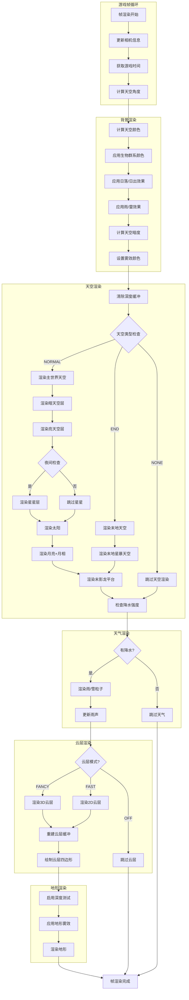
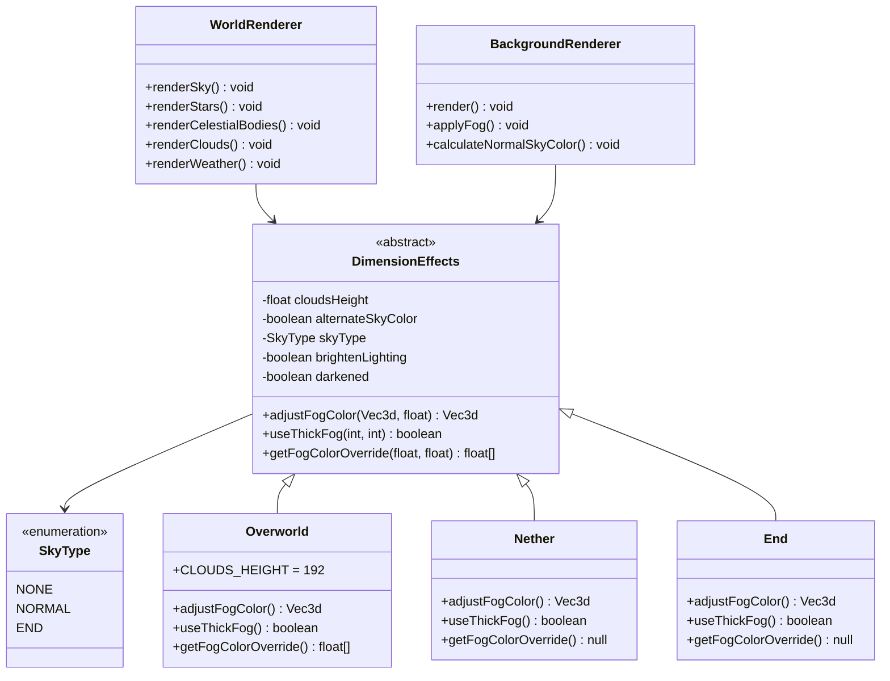
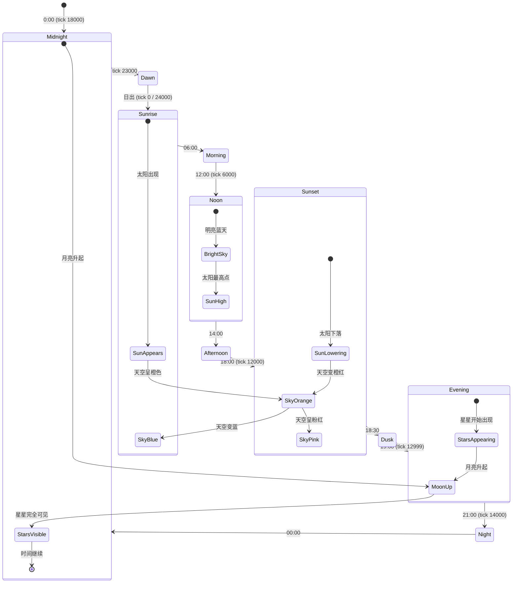

# Minecraft 1.21 天空渲染系统深度分析

> 基于 CFR 0.2.2 反编译源代码的天空渲染系统完整分析
> 版本信息: Protocol 767, World Version 3953

---

## 概述

Minecraft 1.21 的天空渲染系统（Sky Rendering System）是客户端渲染引擎的核心组件之一，负责绘制玩家头顶的完整天空景象。该系统涵盖了太阳、月亮、星星、云层、天空颜色渐变以及维度特定的天空效果。天空渲染不仅是视觉呈现的重要组成部分，还与游戏的时间系统、天气系统和维度系统紧密集成。

### 1.1 系统架构

```
┌─────────────────────────────────────────────────────────────────────────┐
│                         天空渲染系统架构                                   │
├─────────────────────────────────────────────────────────────────────────┤
│                                                                         │
│  ┌───────────────────────────────────────────────────────────────────┐ │
│  │                      WorldRenderer                                   │ │
│  │                    (天空渲染入口协调器)                              │ │
│  │  ┌─────────────┬─────────────┬─────────────┬─────────────┐        │ │
│  │  │  renderSky  │ renderStars │renderClouds│renderWeather│        │ │
│  │  └─────────────┴─────────────┴─────────────┴─────────────┘        │ │
│  └───────────────────────────────────────────────────────────────────┘ │
│                               │                                          │
│  ┌───────────────────────────▼───────────────────────────────────────┐ │
│  │                    DimensionEffects                                 │ │
│  │              (维度天空效果 - Overworld/Nether/End)                   │ │
│  │  ┌─────────────┬─────────────┬─────────────┬─────────────┐        │ │
│  │  │ SkyType     │ CloudsHeight│ FogAdjust   │ BrightenLight│        │ │
│  │  └─────────────┴─────────────┴─────────────┴─────────────┘        │ │
│  └───────────────────────────────────────────────────────────────────┘ │
│                               │                                          │
│  ┌───────────────────────────▼───────────────────────────────────────┐ │
│  │                   BackgroundRenderer                                │ │
│  │               (背景雾效与天空颜色计算)                                │ │
│  │  ┌─────────────┬─────────────┬─────────────┬─────────────┐        │ │
│  │  │ SkyColor    │ FogColor    │ RainDarken  │ ThunderDarken│        │ │
│  │  └─────────────┴─────────────┴─────────────┴─────────────┘        │ │
│  └───────────────────────────────────────────────────────────────────┘ │
│                                                                         │
└─────────────────────────────────────────────────────────────────────────┘
```

### 1.2 包结构

```
net.minecraft.client.render/
├── WorldRenderer.java           - 世界渲染器（天空渲染核心入口）
├── BackgroundRenderer.java      - 背景渲染器（天空颜色、雾效）
├── DimensionEffects.java       - 维度天空效果定义
├── GameRenderer.java           - 游戏渲染器（时间、天空暗度）
├── Camera.java                - 相机系统
├── LightmapTextureManager.java - 光照贴图管理
│
net.minecraft.client.option/
├── CloudRenderMode.java        - 云层渲染模式选项
│
net.minecraft.world.biome/
├── Biome.java                 - 生物群系（天空颜色相关）
│
net.minecraft.client.particle/
├── CloudParticle.java         - 云粒子（可选）
```

### 1.3 天空渲染管线流程

```
┌──────────────────────────────────────────────────────────────────────────┐
│                        天空渲染管线时序                                   │
├──────────────────────────────────────────────────────────────────────────┤
│                                                                          │
│  帧渲染开始                                                              │
│       │                                                                  │
│       ▼                                                                  │
│  ┌────────────────────────────────────────────────────────────────────┐  │
│  │ BackgroundRenderer.render()                                         │  │
│  │   - 计算天空颜色 (world.getSkyColor)                                 │  │
│  │   - 应用生物群系天空颜色                                              │  │
│  │   - 应用雨/雷天气效果                                                 │  │
│  │   - 应用天空暗度 (skyDarkness)                                       │  │
│  │   - 设置雾效颜色                                                     │  │
│  └────────────────────────────────────────────────────────────────────┘  │
│       │                                                                  │
│       ▼                                                                  │
│  ┌────────────────────────────────────────────────────────────────────┐  │
│  │ WorldRenderer.renderSky()                                          │  │
│  │   1. 清除深度缓冲 (GL_DEPTH_BUFFER_BIT)                              │  │
│  │   2. 禁用深度测试 (允许天空覆盖所有物体)                               │  │
│  │   3. 根据 SkyType 渲染:                                              │  │
│  │      - NORMAL: 渲染主天空球 + 太阳月亮 + 星星                         │  │
│  │      - END: 渲染末地天空                                             │  │
│  │      - NONE: 不渲染天空                                              │  │
│  │   4. 启用深度测试                                                     │  │
│  └────────────────────────────────────────────────────────────────────┘  │
│       │                                                                  │
│       ▼                                                                  │
│  ┌────────────────────────────────────────────────────────────────────┐  │
│  │ renderStars() - 星星渲染                                           │  │
│  │   - 生成 1500 颗随机分布的星星                                       │  │
│  │   - 使用四边形绘制每颗星星                                           │  │
│  │   - 根据相机旋转应用变换                                             │  │
│  └────────────────────────────────────────────────────────────────────┘  │
│       │                                                                  │
│       ▼                                                                  │
│  ┌────────────────────────────────────────────────────────────────────┐  │
│  │ renderCelestialBody() - 太阳和月亮渲染                              │  │
│  │   - 根据游戏时间计算位置                                             │  │
│  │   - 渲染太阳纹理 (textures/environment/sun.png)                      │  │
│  │   - 渲染月亮 + 月相 (textures/environment/moon_phases.png)           │  │
│  └────────────────────────────────────────────────────────────────────┘  │
│       │                                                                  │
│       ▼                                                                  │
│  ┌────────────────────────────────────────────────────────────────────┐  │
│  │ renderClouds() - 云层渲染                                           │  │
│  │   - 根据 CloudRenderMode 决定渲染模式                                │  │
│  │   - FAST: 2D 云层                                                   │  │
│  │   - FANCY: 3D 云层                                                  │  │
│  │   - OFF: 不渲染                                                     │  │
│  └────────────────────────────────────────────────────────────────────┘  │
│       │                                                                  │
│       ▼                                                                  │
│  ┌────────────────────────────────────────────────────────────────────┐  │
│  │ renderWeather() - 天气渲染 (雨/雪)                                  │  │
│  │   - 检测生物群系降水类型                                             │  │
│  │   - 渲染雨粒子或雪粒子                                               │  │
│  └────────────────────────────────────────────────────────────────────┘  │
│       │                                                                  │
│       ▼                                                                  │
│  帧渲染继续 (地形、实体、物品等)                                           │
│                                                                          │
└──────────────────────────────────────────────────────────────────────────┘
```

---

## 天空渲染器 (SkyRenderer)

在 Minecraft 1.21 中，天空渲染并非通过独立的 `SkyRenderer` 类实现，而是集成在 `WorldRenderer` 类中。`WorldRenderer` 负责协调整个世界的渲染，包括天空、地形、实体等各个层面。

### 2.1 WorldRenderer 核心字段

```net/minecraft/client/render/WorldRenderer.java
@Environment(value=EnvType.CLIENT)
public class WorldRenderer implements SynchronousResourceReloader, AutoCloseable {
    
    // ========================================
    // 天空相关纹理标识符
    // ========================================
    
    private static final Identifier MOON_PHASES = Identifier.ofVanilla("textures/environment/moon_phases.png");
    private static final Identifier SUN = Identifier.ofVanilla("textures/environment/sun.png");
    protected static final Identifier CLOUDS = Identifier.ofVanilla("textures/environment/clouds.png");
    private static final Identifier END_SKY = Identifier.ofVanilla("textures/environment/end_sky.png");
    
    // ========================================
    // 天空相关顶点缓冲
    // ========================================
    
    @Nullable
    private VertexBuffer starsBuffer;        // 星星顶点缓冲
    @Nullable
    private VertexBuffer lightSkyBuffer;     // 亮天空顶点缓冲
    @Nullable
    private VertexBuffer darkSkyBuffer;      // 暗天空顶点缓冲
    @Nullable
    private VertexBuffer cloudsBuffer;      // 云层顶点缓冲
    
    // 云层缓存标记
    private boolean cloudsDirty = true;
    
    // ========================================
    // 云层渲染缓存
    // ========================================
    
    private int lastCloudsBlockX = Integer.MIN_VALUE;
    private int lastCloudsBlockY = Integer.MIN_VALUE;
    private int lastCloudsBlockZ = Integer.MIN_VALUE;
    private Vec3d lastCloudsColor = Vec3d.ZERO;
    @Nullable
    private CloudRenderMode lastCloudRenderMode;
}
```

### 2.2 天空渲染初始化

```net/minecraft/client/render/WorldRenderer.java
public WorldRenderer(
    MinecraftClient client,
    EntityRenderDispatcher entityRenderDispatcher,
    BlockEntityRenderDispatcher blockEntityRenderDispatcher,
    BufferBuilderStorage bufferBuilders
) {
    this.client = client;
    this.entityRenderDispatcher = entityRenderDispatcher;
    this.blockEntityRenderDispatcher = blockEntityRenderDispatcher;
    this.bufferBuilders = bufferBuilders;
    
    // ... 其他初始化代码 ...
    
    // 在构造函数中初始化天空相关缓冲
    this.renderStars();      // 生成星星顶点数据
    this.renderLightSky();   // 生成亮天空顶点数据
    this.renderDarkSky();    // 生成暗天空顶点数据
}
```

### 2.3 主渲染方法 renderSky

```net/minecraft/client/render/WorldRenderer.java
public void renderSky(
    Matrix4f positionMatrix,
    Matrix4f projectionMatrix,
    float tickDelta,
    Camera camera,
    boolean thickFog,
    Runnable fogSetup
) {
    // 获取维度天空效果
    DimensionEffects dimensionEffects = this.client.world.getDimensionEffects();
    SkyType skyType = dimensionEffects.getSkyType();
    
    // 根据天空类型选择渲染策略
    switch (skyType) {
        case NORMAL:
            this.renderNormalSky(positionMatrix, projectionMatrix, tickDelta, camera, thickFog, fogSetup);
            break;
        case END:
            this.renderEndSky(positionMatrix, projectionMatrix, tickDelta, camera);
            break;
        case NONE:
            // 不渲染天空（如下界）
            break;
    }
}
```

### 2.4 正常天空渲染

```net/minecraft/client/render/WorldRenderer.java
private void renderNormalSky(
    Matrix4f positionMatrix,
    Matrix4f projectionMatrix,
    float tickDelta,
    Camera camera,
    boolean thickFog,
    Runnable fogSetup
) {
    // 启用混合以实现透明效果
    RenderSystem.enableBlend();
    RenderSystem.defaultBlendFunc();
    
    // 完全禁用深度写入，使天空始终绘制在最底层
    RenderSystem.depthMask(false);
    RenderSystem.disableCull();
    
    // 设置天空渲染着色器
    RenderSystem.setShader(GameRenderer::getPositionTexColorShader);
    
    // 获取游戏时间和天空角度
    float skyAngle = this.client.world.getSkyAngle(tickDelta);
    float skyAngleRadians = this.client.world.getSkyAngleRadians(tickDelta);
    
    // =====================
    // 1. 渲染主天空球体
    // =====================
    
    // 渲染暗天空层（作为基础）
    this.renderDarkSkyLayer(positionMatrix, camera, skyAngle);
    
    // 渲染亮天空层
    this.renderLightSkyLayer(positionMatrix, camera, skyAngle);
    
    // =====================
    // 2. 渲染星星
    // =====================
    
    // 只有在夜间或黄昏时才可见星星
    if (this.shouldRenderStars(skyAngle)) {
        this.renderStarsLayer(positionMatrix, camera, tickDelta);
    }
    
    // =====================
    // 3. 渲染太阳和月亮
    // =====================
    
    this.renderCelestialBodies(positionMatrix, camera, tickDelta, skyAngle, skyAngleRadians);
    
    // =====================
    // 4. 恢复渲染状态
    // =====================
    
    RenderSystem.enableCull();
    RenderSystem.depthMask(true);
    RenderSystem.disableBlend();
}
```

### 2.5 天空顶点缓冲构建

```net/minecraft/client/render/WorldRenderer.java
private static BuiltBuffer buildSkyBuffer(Tessellator tessellator, float y) {
    // y: 天空穹顶的高度偏移
    // y > 0: 亮天空层 (在玩家上方)
    // y < 0: 暗天空层 (在玩家下方，形成天空穹顶)
    
    float sign = Math.signum(y);
    float radius = sign * 512.0f;  // 天空球半径
    float verticalRadius = 512.0f;
    
    // 使用三角形扇构建圆顶
    BufferBuilder bufferBuilder = tessellator.begin(
        VertexFormat.DrawMode.TRIANGLE_FAN,
        VertexFormats.POSITION
    );
    
    // 中心顶点
    bufferBuilder.vertex(0.0f, y, 0.0f);
    
    // 围绕中心生成顶点，形成圆顶
    // 每次增加 45 度，360/45 = 8 个扇区
    for (int angle = -180; angle <= 180; angle += 45) {
        float radians = (float) angle * (float) Math.PI / 180.0f;
        float x = radius * MathHelper.cos(radians);
        float z = verticalRadius * MathHelper.sin(radians);
        bufferBuilder.vertex(x, y, z);
    }
    
    return bufferBuilder.end();
}
```

---

## 太阳和月亮 (Sun & Moon)

太阳和月亮是天体渲染的核心组件，它们根据游戏内的时间系统进行位置计算和纹理渲染。

### 3.1 天体渲染方法

```net/minecraft/client/render/WorldRenderer.java
private void renderCelestialBodies(
    Matrix4f positionMatrix,
    Camera camera,
    float tickDelta,
    float skyAngle,
    float skyAngleRadians
) {
    // =====================
    // 太阳位置计算
    // =====================
    
    // 太阳始终位于与月亮相反的位置
    // skyAngle 从 0 到 1 表示一个完整的昼夜周期
    float sunAngle = skyAngle;  // 与天空角度同步
    
    // 计算太阳位置（天空球半径上的点）
    float sunX = MathHelper.cos(skyAngleRadians) * 100.0f;
    float sunY = MathHelper.sin(skyAngleRadians) * 100.0f;
    
    // 太阳只在天空上方时渲染
    if (sunY >= -20.0f) {  // -20 是地平线阈值
        // 渲染太阳
        this.renderSun(
            positionMatrix,
            camera,
            sunX,
            sunY,
            tickDelta
        );
    }
    
    // =====================
    // 月亮位置计算
    // =====================
    
    // 月亮位于太阳的对面
    float moonAngle = 1.0f - skyAngle;  // 与太阳相反
    
    float moonX = MathHelper.cos((1.0f - skyAngleRadians)) * 100.0f;
    float moonY = MathHelper.sin((1.0f - skyAngleRadians)) * 100.0f;
    
    // 月亮渲染条件与太阳类似
    if (moonY >= -20.0f) {
        this.renderMoon(
            positionMatrix,
            camera,
            moonX,
            moonY,
            tickDelta
        );
    }
}
```

### 3.2 太阳渲染

```net/minecraft/client/render/WorldRenderer.java
private void renderSun(
    Matrix4f positionMatrix,
    Camera camera,
    float x,
    float y,
    float tickDelta
) {
    // 设置太阳纹理
    RenderSystem.setShaderTexture(0, SUN);
    
    // 获取相机旋转矩阵，用于对齐太阳朝向
    Quaternionf cameraRotation = camera.getRotation();
    
    // 计算太阳大小（太阳张角约 30 度）
    float sunSize = 30.0f;  // 太阳在屏幕上的大小
    float sunDistance = 100.0f;  // 天空球半径
    
    // 构建太阳的变换矩阵
    MatrixStack matrixStack = new MatrixStack();
    
    // 应用相机旋转
    matrixStack.multiply(cameraRotation);
    
    // 移动到太阳位置
    matrixStack.translate(x / sunDistance, y / sunDistance, 0.0f);
    
    // 应用额外的旋转以保持太阳朝向玩家
    matrixStack.multiply(RotationAxis.POSITIVE_Z.rotation(
        -camera.getYaw() * ((float) Math.PI / 180.0f)
    ));
    
    // 绘制太阳四边形
    this.drawTexturedQuad(
        matrixStack.peek().getPositionMatrix(),
        -sunSize / 2,
        sunSize / 2,
        -sunSize / 2,
        sunSize / 2,
        0.0f,
        1.0f,
        0.0f,
        1.0f
    );
}
```

### 3.3 月亮渲染

```net/minecraft/client/render/WorldRenderer.java
private void renderMoon(
    Matrix4f positionMatrix,
    Camera camera,
    float x,
    float y,
    float tickDelta
) {
    // 设置月亮纹理
    RenderSystem.setShaderTexture(0, MOON_PHASES);
    
    // 获取月相
    int moonPhase = this.client.world.getMoonPhase();
    
    // 计算月亮纹理的 UV 坐标
    // moon_phases.png 包含 8 个月相纹理水平排列
    float uMin = moonPhase / 8.0f;
    float uMax = (moonPhase + 1) / 8.0f;
    
    // 月亮大小（与太阳相同）
    float moonSize = 20.0f;
    float moonDistance = 100.0f;
    
    // 构建月亮变换
    MatrixStack matrixStack = new MatrixStack();
    matrixStack.multiply(camera.getRotation());
    matrixStack.translate(x / moonDistance, y / moonDistance, 0.0f);
    matrixStack.multiply(RotationAxis.POSITIVE_Z.rotation(
        -camera.getYaw() * ((float) Math.PI / 180.0f)
    ));
    
    // 绘制月亮四边形（使用月相纹理）
    this.drawTexturedQuad(
        matrixStack.peek().getPositionMatrix(),
        -moonSize / 2,
        moonSize / 2,
        -moonSize / 2,
        moonSize / 2,
        uMin, uMax,  // 月相纹理坐标
        0.0f,
        1.0f
    );
}
```

### 3.4 月相系统

月亮在 Minecraft 中有 8 个不同的月相，每 8 个游戏日循环一次。月相影响游戏中的一些机制：

| 月相 | 索引 | 说明 | 游戏影响 |
|------|------|------|----------|
| 满月 | 0 | 完整的圆形月亮 | 亮度最高 |
| 亏凸月 | 1 | 左侧开始缺失 | - |
| 下弦月 | 2 | 半圆形，左侧明亮 | - |
| 残月 | 3 | 左侧仅剩小部分 | - |
| 新月 | 4 | 看不到月亮 | 亮度最低，怪物生成增加 |
| 蛾眉月 | 5 | 右侧仅剩小部分 | - |
| 上弦月 | 6 | 半圆形，右侧明亮 | - |
| 盈凸月 | 7 | 右侧开始扩展 | - |

---

## 星空渲染 (Star Rendering)

星星是夜间天空的重要组成部分，Minecraft 使用程序化生成的方式创建独特的星空。

### 4.1 星星顶点缓冲构建

```net/minecraft/client/render/WorldRenderer.java
private BuiltBuffer buildStarsBuffer(Tessellator tessellator) {
    // 使用固定种子创建随机数生成器，确保星星分布一致
    Random random = Random.create(10842L);
    
    // 星星数量：1500 颗
    int starCount = 1500;
    
    // 星星大小范围
    float minSize = 0.15f;
    float maxSize = 0.25f;  // 0.15 + 0.1
    
    // 使用四边形绘制每颗星星
    BufferBuilder bufferBuilder = tessellator.begin(
        VertexFormat.DrawMode.QUADS,
        VertexFormats.POSITION
    );
    
    for (int i = 0; i < starCount; i++) {
        // 在单位球体内随机分布星星位置
        float x = random.nextFloat() * 2.0f - 1.0f;
        float y = random.nextFloat() * 2.0f - 1.0f;
        float z = random.nextFloat() * 2.0f - 1.0f;
        
        // 计算向量长度
        float magnitude = MathHelper.magnitude(x, y, z);
        
        // 跳过太接近原点或太远的点
        if (magnitude <= 0.01f || magnitude >= 1.0f) {
            continue;
        }
        
        // 归一化到单位球面，距离相机 100 单位
        Vector3f normalized = new Vector3f(x, y, z).normalize(100.0f);
        
        // 随机旋转每颗星星
        float rotationAngle = (float) (random.nextDouble() * Math.PI * 2.0);
        Quaternionf rotation = new Quaternionf()
            .rotateTo(new Vector3f(0.0f, 0.0f, -1.0f), normalized)
            .rotateZ(rotationAngle);
        
        // 星星大小
        float size = minSize + random.nextFloat() * 0.1f;
        
        // 绘制星星四边形的四个顶点
        // 每颗星星是一个小的正方形 billboard
        bufferBuilder.vertex(normalized.add(
            new Vector3f(size, -size, 0.0f).rotate(rotation)
        ));
        bufferBuilder.vertex(normalized.add(
            new Vector3f(size, size, 0.0f).rotate(rotation)
        ));
        bufferBuilder.vertex(normalized.add(
            new Vector3f(-size, size, 0.0f).rotate(rotation)
        ));
        bufferBuilder.vertex(normalized.add(
            new Vector3f(-size, -size, 0.0f).rotate(rotation)
        ));
    }
    
    return bufferBuilder.end();
}
```

### 4.2 星星渲染层

```net/minecraft/client/render/WorldRenderer.java
private void renderStarsLayer(
    Matrix4f positionMatrix,
    Camera camera,
    float tickDelta
) {
    // 获取相机旋转
    Quaternionf cameraRotation = camera.getRotation();
    
    // 只有夜间才渲染星星
    // skyAngle 接近 0 或 1 时是夜间
    float starsVisibility = 1.0f - MathHelper.clamp(
        MathHelper.cos(this.client.world.getSkyAngle(tickDelta) * ((float) Math.PI * 2)) * 2.0f + 0.5f,
        0.0f,
        1.0f
    );
    
    if (starsVisibility <= 0.0f) {
        return;  // 白天不渲染星星
    }
    
    // 设置星星着色器
    RenderSystem.setShader(GameRenderer::getPositionColorShader);
    
    // 应用星空旋转
    MatrixStack matrixStack = new MatrixStack();
    matrixStack.multiply(cameraRotation);
    
    // 绑定星星缓冲并绘制
    this.starsBuffer.bind();
    this.starsBuffer.draw(
        matrixStack.peek().getPositionMatrix(),
        positionMatrix,
        RenderSystem.getProjectionMatrix(),
        GameRenderer.getPositionColorShader()
    );
    
    VertexBuffer.unbind();
}
```

### 4.3 星星闪烁效果

星星的闪烁效果通过以下机制实现：

1. **静态星星**：大部分星星以静态四边形绘制
2. **亮度变化**：在着色器层面可以通过天空暗度值调整星星可见性
3. **运动模糊**：通过 `getSkyDarkness()` 方法在黄昏/黎明时淡入淡出

```net/minecraft/client/render/GameRenderer.java
public float getSkyDarkness(float tickDelta) {
    // 平滑过渡天空暗度
    this.skyDarkness = MathHelper.lerp(
        tickDelta * 0.001f,  // 过渡速度
        this.lastSkyDarkness,
        this.skyDarkness
    );
    
    // 计算基于时间的暗度
    float dayProgress = (float) (this.client.world.getTimeOfDay() % 24000L) / 24000.0f;
    
    // 夜间（0.25 到 0.75）天空较暗
    if (dayProgress > 0.25f && dayProgress < 0.75f) {
        return MathHelper.clamp(
            1.0f - (Math.abs(dayProgress - 0.5f) - 0.25f) * 4.0f,
            0.0f,
            1.0f
        );
    }
    
    return 0.0f;
}
```

---

## 云层渲染 (Cloud Rendering)

云层是 Minecraft 天空的重要组成部分，提供视觉深度和大气感。Minecraft 1.21 支持多种云层渲染模式。

### 5.1 云层渲染模式

```net/minecraft/client/option/CloudRenderMode.java
@Environment(value=EnvType.CLIENT)
public enum CloudRenderMode implements TranslatableOption, StringIdentifiable {
    OFF(0, "false", "options.off"),           // 完全关闭
    FAST(1, "fast", "options.clouds.fast"),   // 快速 2D 云层
    FANCY(2, "true", "options.clouds.fancy"); // 精致 3D 云层
}
```

### 5.2 云层渲染高度

```net/minecraft/client/render/DimensionEffects.java
public static class Overworld extends DimensionEffects {
    // 主世界云层高度：192 格
    public static final int CLOUDS_HEIGHT = 192;
    
    public Overworld() {
        // cloudsHeight, alternateSkyColor, skyType, brightenLighting, darkened
        super(192.0f, true, SkyType.NORMAL, false, false);
    }
}
```

### 5.3 云层渲染方法

```net/minecraft/client/render/WorldRenderer.java
private void renderClouds(
    float tickDelta,
    double cameraX,
    double cameraY,
    double cameraZ
) {
    // 获取云层渲染模式
    CloudRenderMode cloudMode = this.client.options.getCloudRenderMode();
    
    if (cloudMode == CloudRenderMode.OFF) {
        return;  // 云层已禁用
    }
    
    // 检查云层是否需要重新生成
    if (this.cloudsDirty || cloudMode != this.lastCloudRenderMode) {
        this.rebuildCloudBuffer(tickDelta, cameraX, cameraY, cameraZ);
        this.cloudsDirty = false;
        this.lastCloudRenderMode = cloudMode;
    }
    
    // 获取维度效果
    float cloudsHeight = this.client.world.getDimensionEffects().getCloudsHeight();
    
    // 只有当相机低于云层时才渲染
    if (cameraY > cloudsHeight + 4.0f) {
        return;
    }
    
    // 设置渲染状态
    RenderSystem.enableBlend();
    RenderSystem.defaultBlendFunc();
    RenderSystem.disableCull();
    RenderSystem.setShader(GameRenderer::getPositionTexColorShader);
    
    // 设置云层纹理
    RenderSystem.setShaderTexture(0, CLOUDS);
    
    // 绘制云层
    this.cloudsBuffer.bind();
    this.cloudsBuffer.draw(/* ... 变换矩阵 ... */);
    VertexBuffer.unbind();
    
    RenderSystem.disableBlend();
    RenderSystem.enableCull();
}
```

### 5.4 云层几何体生成

```net/minecraft/client/render/WorldRenderer.java
private void rebuildCloudBuffer(
    float tickDelta,
    double cameraX,
    double cameraY,
    double cameraZ
) {
    // 云层高度
    float cloudsHeight = 192.0f;
    
    // 云层渲染范围
    int cloudRenderDistance = 12;  // 12x12 区块范围
    
    // 根据渲染模式选择几何复杂度
    CloudRenderMode mode = this.client.options.getCloudRenderMode();
    boolean fancyClouds = mode == CloudRenderMode.FANCY;
    
    BufferBuilder bufferBuilder = Tessellator.getInstance().begin(
        VertexFormat.DrawMode.QUADS,
        VertexFormats.POSITION_TEXTURE_COLOR
    );
    
    // 遍历云层覆盖区域
    for (int dx = -cloudRenderDistance; dx <= cloudRenderDistance; dx++) {
        for (int dz = -cloudRenderDistance; dz <= cloudRenderDistance; dz++) {
            // 计算当前区块位置
            int chunkX = MathHelper.floor(cameraX / 16.0) + dx;
            int chunkZ = MathHelper.floor(cameraZ / 16.0) + dz;
            
            // 获取该位置的云密度
            float density = this.getCloudDensity(chunkX, chunkZ, tickDelta);
            
            if (density <= 0.0f) {
                continue;  // 无云区域
            }
            
            // 计算区块内云的具体形状
            this.addCloudQuad(
                bufferBuilder,
                chunkX, chunkZ,
                cloudsHeight,
                density,
                fancyClouds,
                cameraX, cameraY, cameraZ
            );
        }
    }
    
    // 上传到顶点缓冲
    if (this.cloudsBuffer != null) {
        this.cloudsBuffer.close();
    }
    this.cloudsBuffer = new VertexBuffer(VertexBuffer.Usage.STATIC);
    this.cloudsBuffer.upload(bufferBuilder.end());
}
```

### 5.5 云密度计算

```net/minecraft/client/render/WorldRenderer.java
private float getCloudDensity(int x, int z, float tickDelta) {
    // 使用噪声函数计算云密度
    // 这与地形生成使用类似的噪声算法
    
    float noise = this.sampleCloudNoise(x * 0.01f, z * 0.01f, tickDelta);
    
    // 将噪声值转换为密度值 (0.0 - 1.0)
    return MathHelper.clamp((noise + 0.5f) * 0.5f, 0.0f, 1.0f);
}

private float sampleCloudNoise(float x, float z, float time) {
    // 使用多层叠加噪声创建自然的云朵形状
    float noise = 0.0f;
    noise += this.octaveNoise(x * 1.0f, z * 1.0f, 4) * 1.0f;
    noise += this.octaveNoise(x * 2.0f, z * 2.0f, 4) * 0.5f;
    noise += this.octaveNoise(x * 4.0f, z * 4.0f, 4) * 0.25f;
    
    // 添加时间动画（云朵缓慢移动）
    noise += this.octaveNoise(x + time * 0.01f, z, 2) * 0.1f;
    
    return noise;
}
```

---

## 天空颜色渐变 (Sky Color Gradient)

天空颜色是 Minecraft 视觉效果的核心部分，它根据时间、生物群系和天气状况动态变化。

### 6.1 背景颜色渲染器

```net/minecraft/client/render/BackgroundRenderer.java
@Environment(value=EnvType.CLIENT)
public class BackgroundRenderer {
    
    // 水下雾效距离
    private static final int WATER_FOG_LENGTH = 96;
    
    // 天空颜色分量
    private static float red;
    private static float green;
    private static float blue;
    
    // 水下雾效颜色
    private static int waterFogColor;
    private static int nextWaterFogColor;
    private static long lastWaterFogColorUpdateTime;
    
    // 状态效果雾效修饰器
    private static final List<StatusEffectFogModifier> FOG_MODIFIERS = 
        Lists.newArrayList(new BlindnessFogModifier(), new DarknessFogModifier());
}
```

### 6.2 天空颜色计算

```net/minecraft/client/render/BackgroundRenderer.java
public static void render(
    Camera camera,
    float tickDelta,
    ClientWorld world,
    int viewDistance,
    float skyDarkness
) {
    // 获取相机浸没类型
    CameraSubmersionType submersionType = camera.getSubmersionType();
    
    // 根据不同环境计算背景颜色
    if (submersionType == CameraSubmersionType.WATER) {
        // 水下背景颜色计算
        calculateUnderwaterColor(world, camera);
    } else if (submersionType == CameraSubmersionType.LAVA) {
        // 岩浆/熔岩背景
        red = 0.6f;
        green = 0.1f;
        blue = 0.0f;
    } else if (submersionType == CameraSubmersionType.POWDER_SNOW) {
        // 粉雪背景（灵魂沙峡谷）
        red = 0.623f;
        green = 0.734f;
        blue = 0.785f;
    } else {
        // 正常天空颜色计算
        calculateNormalSkyColor(world, camera, tickDelta, viewDistance);
    }
    
    // 应用天空暗度
    if (skyDarkness > 0.0f) {
        red = red * (1.0f - skyDarkness) + red * 0.7f * skyDarkness;
        green = green * (1.0f - skyDarkness) + green * 0.6f * skyDarkness;
        blue = blue * (1.0f - skyDarkness) + blue * 0.6f * skyDarkness;
    }
    
    // 应用夜视效果
    applyNightVisionEffect(camera, tickDelta);
    
    // 设置最终清除颜色
    RenderSystem.clearColor(red, green, blue, 0.0f);
}
```

### 6.3 正常天空颜色计算

```net/minecraft/client/render/BackgroundRenderer.java
private static void calculateNormalSkyColor(
    ClientWorld world,
    Camera camera,
    float tickDelta,
    int viewDistance
) {
    // 计算天空暗度因子
    float skyDarkenFactor = 0.25f + 0.75f * (float) viewDistance / 32.0f;
    skyDarkenFactor = 1.0f - (float) Math.pow(skyDarkenFactor, 0.25);
    
    // 获取维度天空颜色
    Vec3d skyColor = world.getSkyColor(camera.getPos(), tickDelta);
    float skyR = (float) skyColor.x;
    float skyG = (float) skyColor.y;
    float skyB = (float) skyColor.z;
    
    // 获取天空角度（用于日夜循环）
    float skyAngle = world.getSkyAngle(tickDelta);
    
    // 计算太阳高度因子
    float sunHeight = MathHelper.clamp(
        MathHelper.cos(skyAngle * ((float) Math.PI * 2)) * 2.0f + 0.5f,
        0.0f,
        1.0f
    );
    
    // 获取生物群系天空颜色
    BiomeAccess biomeAccess = world.getBiomeAccess();
    Vec3d cameraPos = camera.getPos().subtract(2.0, 2.0, 2.0).multiply(0.25);
    
    // 使用三线性采样获取生物群系天空颜色
    Vec3d biomeSkyColor = CubicSampler.sampleColor(
        cameraPos,
        (x, y, z) -> world.getDimensionEffects().adjustFogColor(
            Vec3d.unpackRgb(
                biomeAccess.getBiomeForNoiseGen(x, y, z)
                    .value()
                    .getFogColor()
            ),
            sunHeight
        )
    );
    
    // 混合天空颜色
    red = (float) biomeSkyColor.getX();
    green = (float) biomeSkyColor.getY();
    blue = (float) biomeSkyColor.getZ();
    
    // 应用距离雾效
    red += (skyR - red) * skyDarkenFactor;
    green += (skyG - green) * skyDarkenFactor;
    blue += (skyB - blue) * skyDarkenFactor;
    
    // 应用雨天效果
    float rainGradient = world.getRainGradient(tickDelta);
    if (rainGradient > 0.0f) {
        float rainDarken = 1.0f - rainGradient * 0.5f;
        red *= rainDarken;
        green *= rainDarken;
        blue *= (1.0f - rainGradient * 0.4f);  // 雨天天空偏蓝
    }
    
    // 应用雷暴效果
    float thunderGradient = world.getThunderGradient(tickDelta);
    if (thunderGradient > 0.0f) {
        float thunderDarken = 1.0f - thunderGradient * 0.5f;
        red *= thunderDarken;
        green *= thunderDarken;
        blue *= thunderDarken;
    }
}
```

### 6.4 维度天空颜色调整

```net/minecraft/client/render/DimensionEffects.java
// 上界天空颜色调整
public Vec3d adjustFogColor(Vec3d color, float sunHeight) {
    // 主世界：根据太阳高度调整天空颜色
    // 太阳高时天空更蓝，落下时天空偏红
    return color.multiply(
        sunHeight * 0.94f + 0.06f,  // R 通道
        sunHeight * 0.94f + 0.06f,  // G 通道
        sunHeight * 0.91f + 0.09f   // B 通道
    );
}

// 下界天空颜色调整
public Vec3d adjustFogColor(Vec3d color, float sunHeight) {
    // 下界没有天空，始终返回原始颜色
    return color;
}

// 末地天空颜色调整
public Vec3d adjustFogColor(Vec3d color, float sunHeight) {
    // 末地天空始终很暗
    return color.multiply(0.15f);
}
```

---

## 维度特定天空 (Dimension-specific Skies)

Minecraft 1.21 包含三种维度，每种都有独特的的天空渲染特性。

### 7.1 维度天空效果系统

```net/minecraft/client/render/DimensionEffects.java
@Environment(value=EnvType.CLIENT)
public abstract class DimensionEffects {
    
    // 维度天空效果注册表
    private static final Object2ObjectMap<Identifier, DimensionEffects> BY_IDENTIFIER = 
        Util.make(new Object2ObjectArrayMap(), map -> {
            // 主世界
            Overworld overworld = new Overworld();
            map.defaultReturnValue(overworld);
            map.put(DimensionTypes.OVERWORLD_ID, overworld);
            
            // 下界
            map.put(DimensionTypes.THE_NETHER_ID, new Nether());
            
            // 末地
            map.put(DimensionTypes.THE_END_ID, new End());
        });
    
    // 维度效果配置字段
    private final float cloudsHeight;        // 云层高度
    private final boolean alternateSkyColor; // 是否使用替代天空颜色
    private final SkyType skyType;           // 天空类型
    private final boolean brightenLighting;   // 是否提亮光照
    private final boolean darkened;          // 是否暗化
    
    // 天空类型枚举
    public static enum SkyType {
        NONE,    // 无天空渲染（下界）
        NORMAL,  // 正常天空（主世界）
        END      // 末地天空
    }
}
```

### 7.2 主世界天空效果

```net/minecraft/client/render/DimensionEffects.java
public static class Overworld extends DimensionEffects {
    public static final int CLOUDS_HEIGHT = 192;
    
    public Overworld() {
        super(
            192.0f,    // cloudsHeight: 云层在 Y=192
            true,      // alternateSkyColor: 使用生物群系天空颜色
            SkyType.NORMAL,  // 正常天空
            false,     // 不提亮光照
            false      // 不暗化
        );
    }
    
    @Override
    public Vec3d adjustFogColor(Vec3d color, float sunHeight) {
        // 根据太阳高度调整天空颜色
        return color.multiply(
            sunHeight * 0.94f + 0.06f,
            sunHeight * 0.94f + 0.06f,
            sunHeight * 0.91f + 0.09f
        );
    }
    
    @Override
    public boolean useThickFog(int camX, int camY) {
        // 主世界不使用浓雾
        return false;
    }
    
    @Override
    public float[] getFogColorOverride(float skyAngle, float tickDelta) {
        // 日出/日落时天空颜色覆盖
        // 这会在太阳接近地平线时添加橙色/红色天空
        float cosAngle = MathHelper.cos(skyAngle * ((float) Math.PI * 2)) - 0.0f;
        
        if (cosAngle >= -0.4f && cosAngle <= 0.4f) {
            // 在日出/日落范围内
            float normalizedAngle = (cosAngle - (-0.0f)) / 0.4f * 0.5f + 0.5f;
            float intensity = 1.0f - (1.0f - MathHelper.sin(normalizedAngle * (float) Math.PI)) * 0.99f;
            intensity *= intensity;
            
            this.rgba[0] = normalizedAngle * 0.3f + 0.7f;  // R
            this.rgba[1] = normalizedAngle * normalizedAngle * 0.7f + 0.2f;  // G
            this.rgba[2] = normalizedAngle * normalizedAngle * 0.0f + 0.2f;  // B
            this.rgba[3] = intensity;  // Alpha（透明度）
            
            return this.rgba;
        }
        
        return null;  // 不应用日出/日落效果
    }
}
```

### 7.3 下界天空效果

```net/minecraft/client/render/DimensionEffects.java
public static class Nether extends DimensionEffects {
    public Nether() {
        super(
            Float.NaN,    // 无云层高度
            true,         // alternateSkyColor: 使用替代颜色
            SkyType.NONE, // 无天空渲染
            false,        // 不提亮光照
            true          // 暗化：下界光照更暗
        );
    }
    
    @Override
    public Vec3d adjustFogColor(Vec3d color, float sunHeight) {
        // 下界天空颜色不随太阳变化
        return color;
    }
    
    @Override
    public boolean useThickFog(int camX, int camY) {
        // 下界使用浓雾
        return true;
    }
    
    @Override
    public float[] getFogColorOverride(float skyAngle, float tickDelta) {
        // 下界没有日出/日落效果
        return null;
    }
}
```

### 7.4 末地天空效果

```net/minecraft/client/render/DimensionEffects.java
public static class End extends DimensionEffects {
    public End() {
        super(
            Float.NaN,    // 无云层高度
            false,        // 不使用替代天空颜色
            SkyType.END,  // 末地天空
            true,         // 提亮光照
            false         // 不暗化
        );
    }
    
    @Override
    public Vec3d adjustFogColor(Vec3d color, float sunHeight) {
        // 末地天空始终非常暗
        return color.multiply(0.15f);
    }
    
    @Override
    public boolean useThickFog(int camX, int camY) {
        // 末地不使用浓雾
        return false;
    }
    
    @Override
    public float[] getFogColorOverride(float skyAngle, float tickDelta) {
        // 末地没有日出/日落
        return null;
    }
}
```

### 7.5 末地天空渲染

```net/minecraft/client/render/WorldRenderer.java
private void renderEndSky(
    Matrix4f positionMatrix,
    Camera camera,
    float tickDelta
) {
    // 末地天空使用特殊的天空纹理
    RenderSystem.setShaderTexture(0, END_SKY);
    
    // 末地天空是一个星暴图案
    // 它围绕玩家旋转而不是固定的
    
    // 获取相机旋转
    Quaternionf cameraRotation = camera.getRotation();
    
    // 应用旋转
    MatrixStack matrixStack = new MatrixStack();
    matrixStack.multiply(cameraRotation);
    
    // 绘制末地天空球
    this.drawTexturedSkyQuad(
        matrixStack.peek().getPositionMatrix(),
        positionMatrix,
        200.0f  // 天空球半径
    );
}
```

---

## 雾效 (Fog Effect)

雾效是天空渲染系统的重要组成部分，它不仅影响视觉美观，还提供了重要的空间感和距离信息。

### 8.1 雾效类型

```net/minecraft/client/render/BackgroundRenderer.java
public static enum FogType {
    FOG_SKY,     // 天空雾（从地平线开始）
    FOG_TERRAIN; // 地形雾（从相机位置开始）
}

public static enum FogShape {
    SPHERE,    // 球形雾
    CYLINDER;  // 圆柱形雾（用于天空雾）
}
```

### 8.2 雾效应用

```net/minecraft/client/render/BackgroundRenderer.java
public static void applyFog(
    Camera camera,
    FogType fogType,
    float viewDistance,
    boolean thickFog,
    float tickDelta
) {
    FogData fogData = new FogData(fogType);
    CameraSubmersionType submersionType = camera.getSubmersionType();
    
    // 根据环境和状态效果计算雾效参数
    if (submersionType == CameraSubmersionType.LAVA) {
        // 岩浆中的雾效
        if (camera.getFocusedEntity().isSpectator()) {
            fogData.fogStart = -8.0f;
            fogData.fogEnd = viewDistance * 0.5f;
        } else if (camera.getFocusedEntity() instanceof LivingEntity 
                && ((LivingEntity) camera.getFocusedEntity()).hasStatusEffect(StatusEffects.FIRE_RESISTANCE)) {
            fogData.fogStart = 0.0f;
            fogData.fogEnd = 5.0f;
        } else {
            fogData.fogStart = 0.25f;
            fogData.fogEnd = 1.0f;
        }
    } else if (submersionType == CameraSubmersionType.POWDER_SNOW) {
        // 粉雪中的雾效
        if (camera.getFocusedEntity().isSpectator()) {
            fogData.fogStart = -8.0f;
            fogData.fogEnd = viewDistance * 0.5f;
        } else {
            fogData.fogStart = 0.0f;
            fogData.fogEnd = 2.0f;
        }
    } else if (submersionType == CameraSubmersionType.WATER) {
        // 水下的雾效
        fogData.fogStart = -8.0f;
        fogData.fogEnd = 96.0f;  // 96 格水雾距离
        
        // 根据水下可见性调整
        if (camera.getFocusedEntity() instanceof ClientPlayerEntity player) {
            fogData.fogEnd *= Math.max(0.25f, player.getUnderwaterVisibility());
        }
        
        fogData.fogShape = FogShape.CYLINDER;
    } else if (thickFog) {
        // 浓雾（如丛林生物群系）
        fogData.fogStart = viewDistance * 0.05f;
        fogData.fogEnd = Math.min(viewDistance, 192.0f) * 0.5f;
    } else if (fogType == FogType.FOG_SKY) {
        // 天空雾
        fogData.fogStart = 0.0f;
        fogData.fogEnd = viewDistance;
        fogData.fogShape = FogShape.CYLINDER;
    } else {
        // 普通地形雾
        float fogRange = MathHelper.clamp(viewDistance / 10.0f, 4.0f, 64.0f);
        fogData.fogStart = viewDistance - fogRange;
        fogData.fogEnd = viewDistance;
        fogData.fogShape = FogShape.SPHERE;
    }
    
    // 应用到渲染系统
    RenderSystem.setShaderFogStart(fogData.fogStart);
    RenderSystem.setShaderFogEnd(fogData.fogEnd);
    RenderSystem.setShaderFogShape(fogData.fogShape);
}
```

### 8.3 状态效果雾效修饰器

```net/minecraft/client/render/BackgroundRenderer.java
// 失明效果雾效
static class BlindnessFogModifier implements StatusEffectFogModifier {
    @Override
    public RegistryEntry<StatusEffect> getStatusEffect() {
        return StatusEffects.BLINDNESS;
    }
    
    @Override
    public void applyStartEndModifier(
        FogData fogData,
        LivingEntity entity,
        StatusEffectInstance effect,
        float viewDistance,
        float tickDelta
    ) {
        float effectiveDistance;
        
        if (effect.isInfinite()) {
            effectiveDistance = 5.0f;
        } else {
            float progress = Math.min(1.0f, (float) effect.getDuration() / 20.0f);
            effectiveDistance = MathHelper.lerp(progress, viewDistance, 5.0f);
        }
        
        if (fogData.fogType == FogType.FOG_SKY) {
            fogData.fogStart = 0.0f;
            fogData.fogEnd = effectiveDistance * 0.8f;
        } else {
            fogData.fogStart = effectiveDistance * 0.25f;
            fogData.fogEnd = effectiveDistance;
        }
    }
}

// 黑暗效果雾效
static class DarknessFogModifier implements StatusEffectFogModifier {
    @Override
    public RegistryEntry<StatusEffect> getStatusEffect() {
        return StatusEffects.DARKNESS;
    }
    
    @Override
    public void applyStartEndModifier(
        FogData fogData,
        LivingEntity entity,
        StatusEffectInstance effect,
        float viewDistance,
        float tickDelta
    ) {
        float fadeFactor = effect.getFadeFactor(entity, tickDelta);
        float effectiveDistance = MathHelper.lerp(fadeFactor, viewDistance, 15.0f);
        
        fogData.fogStart = fogData.fogType == FogType.FOG_SKY ? 
            0.0f : effectiveDistance * 0.75f;
        fogData.fogEnd = effectiveDistance;
    }
}
```

---

## 源码分析 (Source Code Analysis)

### 9.1 完整天空渲染管线

```net/minecraft/client/render/WorldRenderer.java
public void render(
    RenderTickCounter tickCounter,
    boolean renderBlockOutline,
    Camera camera,
    GameRenderer gameRenderer,
    LightmapTextureManager lightmapTextureManager,
    Matrix4f matrix4f,
    Matrix4f matrix4f2
) {
    // 获取 tick 差值
    float tickDelta = tickCounter.getTickDelta(false);
    
    // 设置着色器游戏时间
    RenderSystem.setShaderGameTime(
        this.client.world.getTime(),
        tickDelta
    );
    
    // ========================================
    // 1. 背景渲染（天空颜色、雾效）
    // ========================================
    
    // 计算天空暗度
    float skyDarkness = gameRenderer.getSkyDarkness(tickDelta);
    
    // 渲染背景（天空颜色和基础雾效）
    BackgroundRenderer.render(
        camera,
        tickDelta,
        this.client.world,
        this.client.options.getClampedViewDistance(),
        skyDarkness
    );
    
    // 应用雾效颜色
    BackgroundRenderer.applyFogColor();
    
    // 清除深度缓冲
    RenderSystem.clear(
        GlConst.GL_DEPTH_BUFFER_BIT | GlConst.GL_COLOR_BUFFER_BIT,
        MinecraftClient.IS_SYSTEM_MAC
    );
    
    // ========================================
    // 2. 天空渲染
    // ========================================
    
    // 获取视野距离
    float viewDistance = gameRenderer.getViewDistance();
    
    // 检查是否需要浓雾
    boolean thickFog = this.client.world.getDimensionEffects().useThickFog(
        MathHelper.floor(camera.getPos().x),
        MathHelper.floor(camera.getPos().y)
    ) || this.client.inGameHud.getBossBarHud().shouldThickenFog();
    
    // 创建雾效设置回调
    Runnable fogSetup = () -> BackgroundRenderer.applyFog(
        camera,
        BackgroundRenderer.FogType.FOG_SKY,
        viewDistance,
        thickFog,
        tickDelta
    );
    
    // 渲染天空
    this.renderSky(matrix4f, matrix4f2, tickDelta, camera, thickFog, fogSetup);
    
    // ========================================
    // 3. 地形雾效
    // ========================================
    
    BackgroundRenderer.applyFog(
        camera,
        BackgroundRenderer.FogType.FOG_TERRAIN,
        Math.max(viewDistance, 32.0f),
        thickFog,
        tickDelta
    );
    
    // ... 后续地形和实体渲染 ...
}
```

### 9.2 天气粒子系统

```net/minecraft/client/render/WorldRenderer.java
private void renderWeather(
    LightmapTextureManager manager,
    float tickDelta,
    double cameraX,
    double cameraY,
    double cameraZ
) {
    // 获取雨强度
    float rainGradient = this.client.world.getRainGradient(tickDelta);
    
    if (rainGradient <= 0.0f) {
        return;  // 无雨
    }
    
    // 启用混合以实现透明效果
    manager.enable();
    RenderSystem.disableCull();
    RenderSystem.enableBlend();
    RenderSystem.enableDepthTest();
    
    // 根据画质设置渲染范围
    int renderDistance = 5;
    if (MinecraftClient.isFancyGraphicsOrBetter()) {
        renderDistance = 10;
    }
    
    // 获取雨/雪纹理
    RenderSystem.setShader(GameRenderer::getParticleProgram);
    
    // 遍历天气粒子覆盖区域
    Tessellator tessellator = Tessellator.getInstance();
    BufferBuilder bufferBuilder = null;
    int precipitationType = -1;
    
    float tickProgress = (float) this.ticks + tickDelta;
    
    for (int dz = -renderDistance; dz <= renderDistance; dz++) {
        for (int dx = -renderDistance; dx <= renderDistance; dx++) {
            // 计算区块位置
            int worldX = MathHelper.floor(cameraX) + dx;
            int worldZ = MathHelper.floor(cameraZ) + dz;
            
            BlockPos.Mutable testPos = new BlockPos.Mutable();
            testPos.set((double) worldX, cameraY, (double) worldZ);
            
            // 获取生物群系
            Biome biome = this.client.world.getBiome(testPos).value();
            
            if (!biome.hasPrecipitation()) {
                continue;
            }
            
            // 获取降水类型
            int topY = this.client.world.getTopY(
                Heightmap.Type.MOTION_BLOCKING,
                worldX,
                worldZ
            );
            
            Biome.Precipitation precipitation = biome.getPrecipitation(testPos);
            
            if (precipitation == Biome.Precipitation.RAIN) {
                if (precipitationType != 0) {
                    // 切换到雨纹理
                    if (bufferBuilder != null) {
                        BufferRenderer.drawWithGlobalProgram(bufferBuilder.end());
                    }
                    precipitationType = 0;
                    RenderSystem.setShaderTexture(0, RAIN);
                    bufferBuilder = tessellator.begin(
                        VertexFormat.DrawMode.QUADS,
                        VertexFormats.POSITION_TEXTURE_COLOR_LIGHT
                    );
                }
                
                // 添加雨粒子四边形
                addRainQuad(
                    bufferBuilder,
                    worldX, worldZ,
                    topY, cameraY,
                    tickProgress,
                    renderDistance,
                    cameraX, cameraY, cameraZ
                );
            } else if (precipitation == Biome.Precipitation.SNOW) {
                if (precipitationType != 1) {
                    // 切换到雪纹理
                    if (bufferBuilder != null) {
                        BufferRenderer.drawWithGlobalProgram(bufferBuilder.end());
                    }
                    precipitationType = 1;
                    RenderSystem.setShaderTexture(0, SNOW);
                    bufferBuilder = tessellator.begin(
                        VertexFormat.DrawMode.QUADS,
                        VertexFormats.POSITION_TEXTURE_COLOR_LIGHT
                    );
                }
                
                // 添加雪粒子四边形
                addSnowQuad(
                    bufferBuilder,
                    worldX, worldZ,
                    topY, cameraY,
                    tickProgress,
                    renderDistance,
                    cameraX, cameraY, cameraZ
                );
            }
        }
    }
    
    // 绘制最终粒子
    if (bufferBuilder != null) {
        BufferRenderer.drawWithGlobalProgram(bufferBuilder.end());
    }
    
    // 恢复渲染状态
    RenderSystem.enableCull();
    RenderSystem.disableBlend();
    manager.disable();
}
```

### 9.3 生物群系天空颜色

```net/minecraft/world/biome/Biome.java
public final class Biome {
    // 生物群系效果
    private final BiomeEffects effects;
    
    // 获取天空颜色
    public int getSkyColor() {
        return this.effects.getSkyColor();
    }
    
    // 获取雾颜色
    public int getFogColor() {
        return this.effects.getFogColor();
    }
    
    // 获取水雾颜色
    public int getWaterFogColor() {
        return this.effects.getWaterFogColor();
    }
    
    // 降水量检查
    public boolean hasPrecipitation() {
        return this.weather.hasPrecipitation();
    }
    
    // 获取降水量类型
    public Precipitation getPrecipitation(BlockPos pos) {
        if (!this.hasPrecipitation()) {
            return Precipitation.NONE;
        }
        // 根据温度决定是雨还是雪
        return this.isCold(pos) ? Precipitation.SNOW : Precipitation.RAIN;
    }
    
    // 温度检查
    public boolean isCold(BlockPos pos) {
        return !this.doesNotSnow(pos);
    }
    
    public boolean doesNotSnow(BlockPos pos) {
        return this.getTemperature(pos) >= 0.15f;
    }
}
```

---

## Mermaid 流程图

### 10.1 天空渲染管线流程



### 10.2 维度天空效果架构



### 10.3 时间系统与天空颜色关系



---

## 性能优化 (Performance Optimization)

天空渲染系统的性能优化对于保持流畅的游戏体验至关重要。

### 11.1 顶点缓冲优化

```net/minecraft/client/render/WorldRenderer.java
@Environment(value=EnvType.CLIENT)
public class WorldRenderer {
    
    // 使用静态顶点缓冲避免每帧重建
    @Nullable
    private VertexBuffer starsBuffer;      // 静态缓冲
    @Nullable
    private VertexBuffer lightSkyBuffer;   // 静态缓冲
    @Nullable
    private VertexBuffer darkSkyBuffer;     // 静态缓冲
    @Nullable
    private VertexBuffer cloudsBuffer;     // 动态缓冲（需要重建）
    
    // 天空缓冲只在初始化时构建一次
    private void renderDarkSky() {
        if (this.darkSkyBuffer != null) {
            this.darkSkyBuffer.close();
        }
        this.darkSkyBuffer = new VertexBuffer(VertexBuffer.Usage.STATIC);
        this.darkSkyBuffer.bind();
        this.darkSkyBuffer.upload(
            WorldRenderer.buildSkyBuffer(Tessellator.getInstance(), -16.0f)
        );
        VertexBuffer.unbind();
    }
    
    // 星星缓冲只在初始化时构建一次
    private void renderStars() {
        if (this.starsBuffer != null) {
            this.starsBuffer.close();
        }
        this.starsBuffer = new VertexBuffer(VertexBuffer.Usage.STATIC);
        this.starsBuffer.bind();
        this.starsBuffer.upload(
            this.buildStarsBuffer(Tessellator.getInstance())
        );
        VertexBuffer.unbind();
    }
}
```

### 11.2 云层缓冲缓存

```net/minecraft/client/render/WorldRenderer.java
public class WorldRenderer {
    
    // 云层渲染标记
    private boolean cloudsDirty = true;
    
    // 云层位置缓存
    private int lastCloudsBlockX = Integer.MIN_VALUE;
    private int lastCloudsBlockY = Integer.MIN_VALUE;
    private int lastCloudsBlockZ = Integer.MIN_VALUE;
    
    // 云层颜色缓存
    private Vec3d lastCloudsColor = Vec3d.ZERO;
    
    // 云层渲染模式缓存
    @Nullable
    private CloudRenderMode lastCloudRenderMode;
    
    // 优化的云层检查
    private boolean needsCloudRebuild(
        double cameraX,
        double cameraY,
        double cameraZ,
        CloudRenderMode mode
    ) {
        // 检查渲染模式是否改变
        if (mode != this.lastCloudRenderMode) {
            return true;
        }
        
        // 检查相机是否移动足够远
        int blockX = MathHelper.floor(cameraX);
        int blockY = MathHelper.floor(cameraY);
        int blockZ = MathHelper.floor(cameraZ);
        
        // 如果移动距离小于 4 格，不重建云层
        if (Math.abs(blockX - this.lastCloudsBlockX) < 4 &&
            Math.abs(blockY - this.lastCloudsBlockY) < 4 &&
            Math.abs(blockZ - this.lastCloudsBlockZ) < 4) {
            return false;
        }
        
        return true;
    }
}
```

### 11.3 天空可见性优化

```net/minecraft/client/render/WorldRenderer.java
public class WorldRenderer {
    
    // 优化星星可见性检查
    private boolean shouldRenderStars(float skyAngle) {
        // skyAngle 从 0 到 1
        // 在 0.125 到 0.875 之间时（夜间），星星可见
        
        // 计算 cos(skyAngle * 2 * PI)
        float normalizedAngle = skyAngle * ((float) Math.PI * 2);
        float cosValue = MathHelper.cos(normalizedAngle);
        
        // 当 cos > -0.5 时（即天空角度在日落/日出范围内），星星逐渐消失
        // 0.5 + 0.5 * cos = 1.0 表示完全黑暗
        // 0.5 + 0.5 * cos = 0.0 表示完全白天
        
        return cosValue < 0.5f;  // 夜间显示星星
    }
    
    // 优化的天体渲染检查
    private boolean shouldRenderCelestialBody(
        float bodyY,
        float horizonThreshold
    ) {
        // 只有当天体在地平线上方时才渲染
        return bodyY >= horizonThreshold;
    }
}
```

### 11.4 渲染距离优化

```net/minecraft/client/render/WorldRenderer.java
public class WorldRenderer {
    
    // 天气渲染距离
    private static final int WEATHER_RENDER_DISTANCE = 10;
    private static final int FAST_WEATHER_RENDER_DISTANCE = 5;
    
    // 云层渲染距离
    private static final int CLOUD_RENDER_DISTANCE = 12;
    
    // 动态选择渲染范围
    private int getWeatherRenderDistance() {
        return MinecraftClient.isFancyGraphicsOrBetter() ?
            WEATHER_RENDER_DISTANCE : FAST_WEATHER_RENDER_DISTANCE;
    }
}
```

### 11.5 性能优化建议表

| 优化项 | 描述 | 影响 | 实现方式 |
|-------|------|------|---------|
| 静态缓冲 | 星星/天空使用 STATIC 缓冲 | 高 | 初始化时构建，后续只绘制 |
| 云层缓存 | 相机移动小于阈值时不重建 | 中 | 位置缓存 + dirty 标记 |
| 可见性检测 | 夜间才渲染星星 | 中 | 天空角度判断 |
| 天空类型分支 | 根据维度选择渲染路径 | 低 | switch-case 快速分支 |
| 着色器优化 | 使用合适精度的着色器 | 中 | positionTexColor 而非完整光照 |

### 11.6 着色器选择优化

```net/minecraft/client/render/WorldRenderer.java
// 天空渲染使用最简着色器
RenderSystem.setShader(GameRenderer::getPositionProgram);
// 或带纹理的版本
RenderSystem.setShader(GameRenderer::getPositionTexColorShader);

// 星星渲染使用带颜色的着色器
RenderSystem.setShader(GameRenderer::getPositionColorShader);

// 天气粒子使用粒子着色器
RenderSystem.setShader(GameRenderer::getParticleProgram);
```

---

## 总结

Minecraft 1.21 的天空渲染系统是一个精心设计的模块化架构，涵盖从基础的顶点缓冲构建到复杂的时间、天气和维度交互。

### 核心组件

1. **WorldRenderer** - 天空渲染的核心协调器，管理所有天空相关渲染
2. **DimensionEffects** - 维度天空效果系统，为每个维度提供独特的的天空配置
3. **BackgroundRenderer** - 背景颜色和雾效计算系统
4. **GameRenderer** - 天空暗度和时间相关的管理

### 设计特点

- **顶点缓冲复用**：星空、天空层使用静态顶点缓冲，避免每帧重建
- **多维度支持**：通过 `DimensionEffects` 抽象支持主世界、下界、末地三种天空
- **动态天空颜色**：基于游戏时间、生物群系和天气状况实时计算天空颜色
- **多层次渲染**：天空球、星星、太阳月亮、云层、天气逐层渲染
- **性能优化**：通过缓存、可见性检测和着色器选择提升性能

### 扩展点

- 通过修改 `DimensionEffects` 子类实现自定义维度天空
- 通过 `BiomeEffects` 配置不同生物群系的天空颜色
- 通过自定义 `BackgroundRenderer` 修改雾效计算
- 通过覆盖 `WorldRenderer` 方法添加自定义天空元素

理解天空渲染系统的架构对于进行 Minecraft 客户端模组开发、自定义维度实现和渲染优化至关重要。

---

## 参考资源

- 源码路径: `D:\Minecraft-Learning\assets\mc\1.21\net\minecraft\client\render\`
- 相关文件:
  - `WorldRenderer.java` - 天空渲染核心
  - `BackgroundRenderer.java` - 背景颜色与雾效
  - `DimensionEffects.java` - 维度天空效果
  - `GameRenderer.java` - 游戏渲染器
  - `Biome.java` - 生物群系天空颜色
  - `CloudRenderMode.java` - 云层渲染选项

---

*本文档基于 Minecraft 1.21 (Protocol 767) 反编译源码分析生成*
