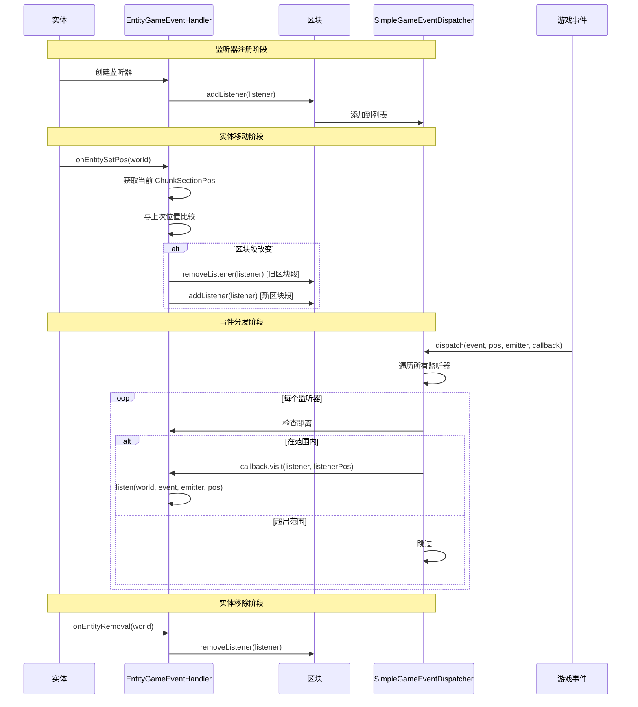

# Minecraft 1.21 游戏事件系统 (GameEvent System)

> 基于 CFR 0.2.2 反编译源代码的游戏事件系统完整分析
> 版本信息: Protocol 767, World Version 3953

---

## 1. 概述

游戏事件系统（GameEvent System）是 Minecraft 1.21 中用于处理世界中各种事件通知的核心子系统。该系统采用了**观察者模式**的实现方式，允许方块、实体和其他游戏元素监听并响应世界中发生的事件。游戏事件系统是**颤抖（Vibrations）**机制和**幽匿感测体（Sculk Sensor）**的基础。

### 1.1 游戏事件系统的核心职责

| 职责 | 说明 |
|------|------|
| **事件定义** | 定义游戏中所有可被监听的事件类型 |
| **事件分发** | 将事件从源头分发到所有注册的监听器 |
| **距离计算** | 计算事件源与监听器之间的距离 |
| **震动传播** | 实现基于频率的震动信号传播机制 |
| **碰撞检测** | 检测震动信号是否被方块阻挡 |

### 1.2 架构总览

```
┌─────────────────────────────────────────────────────────────────────────────┐
│                        游戏事件系统核心架构                                    │
├─────────────────────────────────────────────────────────────────────────────┤
│                                                                             │
│  ┌──────────────────────────────────────────────────────────────────────┐   │
│  │                      事件注册表 (Registry)                            │   │
│  │   GameEvent.Blocks_Activate / Block_Close / Entity_Die / ...        │   │
│  └──────────────────────────────────────────────────────────────────────┘   │
│                                    │                                         │
│                                    ▼                                         │
│  ┌──────────────────────────────────────────────────────────────────────┐   │
│  │                      事件分发管理器                                    │   │
│  │                    GameEventDispatchManager                           │   │
│  │  - 按区块段分发事件                                                     │   │
│  │  - 按距离排序监听器                                                     │   │
│  └──────────────────────────────────────────────────────────────────────┘   │
│                                    │                                         │
│                                    ▼                                         │
│  ┌──────────────────────────────────────────────────────────────────────┐   │
│  │                    事件分发器 (Per Chunk Section)                      │   │
│  │                    SimpleGameEventDispatcher                          │   │
│  │  - 管理区块段内的监听器列表                                             │   │
│  │  - 处理监听器的添加/移除                                                │   │
│  └──────────────────────────────────────────────────────────────────────┘   │
│                                    │                                         │
│                                    ▼                                         │
│  ┌──────────────────────────────────────────────────────────────────────┐   │
│  │                      事件监听器                                        │   │
│  │         GameEventListener / VibrationListener                          │   │
│  │  - 获取位置源 (PositionSource)                                         │   │
│  │  - 判断是否接受事件                                                    │   │
│  │  - 触发回调 (Callback)                                                 │   │
│  └──────────────────────────────────────────────────────────────────────┘   │
│                                                                             │
│  ┌──────────────────────────────────────────────────────────────────────┐   │
│  │                      震动系统 (Vibrations)                            │   │
│  │  - 震动监听器 (VibrationListener)                                      │   │
│  │  - 震动数据 (ListenerData)                                             │   │
│  │  - 震动选择器 (VibrationSelector)                                       │   │
│  └──────────────────────────────────────────────────────────────────────┘   │
│                                                                             │
└─────────────────────────────────────────────────────────────────────────────┘
```

---

## 2. 核心类结构

### 2.1 GameEvent - 游戏事件定义

`GameEvent.java` 是一个 **record** 类型的类，用于定义游戏事件。核心源码如下：

```net/minecraft/world/event/GameEvent.java
public record GameEvent(int notificationRadius) {
    public static final RegistryEntry.Reference<GameEvent> BLOCK_ACTIVATE = 
        GameEvent.register("block_activate");
    public static final RegistryEntry.Reference<GameEvent> BLOCK_CLOSE = 
        GameEvent.register("block_close");
    public static final RegistryEntry.Reference<GameEvent> BLOCK_OPEN = 
        GameEvent.register("block_open");
    public static final RegistryEntry.Reference<GameEvent> BLOCK_PLACE = 
        GameEvent.register("block_place");
    public static final RegistryEntry.Reference<GameEvent> BLOCK_DESTROY = 
        GameEvent.register("block_destroy");
    public static final RegistryEntry.Reference<GameEvent> ENTITY_DIE = 
        GameEvent.register("entity_die");
    public static final RegistryEntry.Reference<GameEvent> EXPLODE = 
        GameEvent.register("explode");
    public static final RegistryEntry.Reference<GameEvent> TELEPORT = 
        GameEvent.register("teleport");
    public static final RegistryEntry.Reference<GameEvent> STEP = 
        GameEvent.register("step");
    public static final RegistryEntry.Reference<GameEvent> SWIM = 
        GameEvent.register("swim");
    // ... 更多事件定义
    
    public static final int DEFAULT_RANGE = 16;
    public static final Codec<RegistryEntry<GameEvent>> CODEC = 
        RegistryFixedCodec.of(RegistryKeys.GAME_EVENT);

    private static RegistryEntry.Reference<GameEvent> register(String id) {
        return GameEvent.register(id, 16);  // 默认通知半径 16 格
    }

    private static RegistryEntry.Reference<GameEvent> register(String id, int range) {
        return Registry.registerReference(
            Registries.GAME_EVENT, 
            Identifier.ofVanilla(id), 
            new GameEvent(range)
        );
    }
}
```

#### GameEvent.Message - 事件消息

```net/minecraft/world/event/GameEvent.java
public record GameEvent(int notificationRadius) {
    // ...
    
    public record Message(
        RegistryEntry<GameEvent> event,    // 事件
        Vec3d emitterPos,                   // 发射器位置
        Emitter emitter,                    // 发射器信息
        GameEventListener listener,         // 监听器
        double distanceTraveled             // 传播距离
    ) implements Comparable<Message> {
        
        @Override
        public int compareTo(Message message) {
            // 按距离升序排列（距离近的优先）
            return Double.compare(this.distanceTraveled, message.distanceTraveled);
        }
    }

    // Emitter - 事件发射器
    public record Emitter(
        @Nullable Entity sourceEntity,      // 源实体
        @Nullable BlockState affectedState  // 受影响的方块状态
    ) {
        public static Emitter of(@Nullable Entity sourceEntity) {
            return new Emitter(sourceEntity, null);
        }

        public static Emitter of(@Nullable BlockState affectedState) {
            return new Emitter(null, affectedState);
        }
    }
}
```

### 2.2 GameEventListener - 游戏事件监听器接口

`GameEventListener.java` 是事件监听器的核心接口：

```net/minecraft/world/event/listener/GameEventListener.java
/**
 * A game event listener listens to game events from {@link GameEventDispatcher}s.
 */
public interface GameEventListener {
    /**
     * Returns the position source of this listener.
     * 获取监听器的位置源
     */
    PositionSource getPositionSource();

    /**
     * Returns the range, in blocks, of the listener.
     * 获取监听器的感知范围
     */
    int getRange();

    /**
     * Listens to an incoming game event.
     * 处理到来的游戏事件
     * 
     * @return {@code true} if the game event has been accepted by this listener
     */
    boolean listen(ServerWorld world, RegistryEntry<GameEvent> event, 
                   GameEvent.Emitter emitter, Vec3d emitterPos);

    /**
     * 获取触发顺序
     */
    default TriggerOrder getTriggerOrder() {
        return TriggerOrder.UNSPECIFIED;
    }

    public enum TriggerOrder {
        UNSPECIFIED,   // 无序触发
        BY_DISTANCE;   // 按距离排序后触发
    }

    public interface Holder<T extends GameEventListener> {
        T getEventListener();
    }
}
```

### 2.3 GameEventDispatcher - 事件分发器接口

```net/minecraft/world/event/listener/GameEventDispatcher.java
/**
 * A game event dispatcher dispatches game events to its listeners.
 */
public interface GameEventDispatcher {
    /**
     * An unmodifiable, empty (non-operative) dispatcher.
     */
    GameEventDispatcher EMPTY = new GameEventDispatcher() {
        @Override
        public boolean isEmpty() { return true; }
        @Override
        public void addListener(GameEventListener listener) {}
        @Override
        public void removeListener(GameEventListener listener) {}
        @Override
        public boolean dispatch(RegistryEntry<GameEvent> event, Vec3d pos, 
                                GameEvent.Emitter emitter, DispatchCallback callback) {
            return false;
        }
    };

    boolean isEmpty();
    
    void addListener(GameEventListener listener);
    
    void removeListener(GameEventListener listener);
    
    /**
     * Dispatches an event to all the listeners in this dispatcher.
     */
    boolean dispatch(RegistryEntry<GameEvent> event, Vec3d pos, 
                     GameEvent.Emitter emitter, DispatchCallback callback);

    @FunctionalInterface
    interface DispatchCallback {
        void visit(GameEventListener listener, Vec3d listenerPos);
    }
}
```

### 2.4 SimpleGameEventDispatcher - 简单事件分发器实现

`SimpleGameEventDispatcher` 是 `GameEventDispatcher` 的主要实现，用于每个区块段：

```net/minecraft/world/event/listener/SimpleGameEventDispatcher.java
/**
 * A simple game event dispatcher implementation that has hooks to
 * debug info senders.
 * 
 * @apiNote Vanilla Minecraft creates it on a per-chunk-section basis.
 */
public class SimpleGameEventDispatcher implements GameEventDispatcher {
    private final List<GameEventListener> listeners = Lists.newArrayList();
    private final Set<GameEventListener> toRemove = Sets.newHashSet();
    private final List<GameEventListener> toAdd = Lists.newArrayList();
    private boolean dispatching;
    private final ServerWorld world;
    private final int ySectionCoord;
    private final DisposalCallback disposalCallback;

    @Override
    public void addListener(GameEventListener listener) {
        if (this.dispatching) {
            // 分发过程中添加，暂存到待添加列表
            this.toAdd.add(listener);
        } else {
            this.listeners.add(listener);
        }
        DebugInfoSender.sendGameEventListener(this.world, listener);
    }

    @Override
    public boolean dispatch(RegistryEntry<GameEvent> event, Vec3d pos, 
                           GameEvent.Emitter emitter, GameEventDispatcher.DispatchCallback callback) {
        this.dispatching = true;
        boolean handled = false;
        try {
            Iterator<GameEventListener> iterator = this.listeners.iterator();
            while (iterator.hasNext()) {
                GameEventListener gameEventListener = iterator.next();
                
                // 处理待移除的监听器
                if (this.toRemove.remove(gameEventListener)) {
                    iterator.remove();
                    continue;
                }
                
                // 检查距离并分发
                Optional<Vec3d> optional = SimpleGameEventDispatcher.dispatchTo(
                    this.world, pos, gameEventListener);
                if (optional.isPresent()) {
                    callback.visit(gameEventListener, optional.get());
                    handled = true;
                }
            }
        } finally {
            this.dispatching = false;
        }
        
        // 处理待添加和待移除列表
        if (!this.toAdd.isEmpty()) {
            this.listeners.addAll(this.toAdd);
            this.toAdd.clear();
        }
        if (!this.toRemove.isEmpty()) {
            this.listeners.removeAll(this.toRemove);
            this.toRemove.clear();
        }
        return handled;
    }

    private static Optional<Vec3d> dispatchTo(ServerWorld world, Vec3d listenerPos, 
                                               GameEventListener listener) {
        Optional<Vec3d> optional = listener.getPositionSource().getPos(world);
        if (optional.isEmpty()) {
            return Optional.empty();
        }
        
        double squaredDistance = BlockPos.ofFloored(optional.get())
            .getSquaredDistance(BlockPos.ofFloored(listenerPos));
        
        // 检查是否在监听器范围内
        int range = listener.getRange();
        if (squaredDistance > (double)(range * range)) {
            return Optional.empty();
        }
        return optional;
    }
}
```

---

## 3. 事件类型详解

### 3.1 内置事件完整列表

Minecraft 1.21 共定义了 **60+** 种游戏事件，按类别分组如下：

#### 方块相关事件 (Block Events)

| 事件名称 | 触发条件 | 默认范围 |
|---------|---------|---------|
| `block_activate` | 激活红石元件、按钮等 | 16 |
| `block_attach` | 方块附着到另一方块 | 16 |
| `block_change` | 方块状态改变 | 16 |
| `block_close` | 门、活板门关闭 | 16 |
| `block_deactivate` | 红石元件失活 | 16 |
| `block_destroy` | 破坏方块 | 16 |
| `block_detach` | 方块从依附物分离 | 16 |
| `block_open` | 门、活板门打开 | 16 |
| `block_place` | 放置方块 | 16 |

#### 容器相关事件 (Container Events)

| 事件名称 | 触发条件 | 默认范围 |
|---------|---------|---------|
| `container_close` | 打开容器关闭 | 16 |
| `container_open` | 打开容器 | 16 |

#### 实体相关事件 (Entity Events)

| 事件名称 | 触发条件 | 默认范围 |
|---------|---------|---------|
| `entity_action` | 实体执行动作 | 16 |
| `entity_damage` | 实体受到伤害 | 16 |
| `entity_die` | 实体死亡 | 16 |
| `entity_dismount` | 实体下骑乘物 | 16 |
| `entity_interact` | 实体交互 | 16 |
| `entity_mount` | 实体骑上骑乘物 | 16 |
| `entity_place` | 实体放置 | 16 |
| `teleport` | 实体传送 | 16 |

#### 物品相关事件 (Item Events)

| 事件名称 | 触发条件 | 默认范围 |
|---------|---------|---------|
| `drink` | 饮用液体 | 16 |
| `eat` | 吃东西 | 16 |
| `equip` | 装备物品 | 16 |
| `unequip` | 卸下装备 | 16 |
| `item_interact_finish` | 物品交互完成 | 16 |
| `item_interact_start` | 物品交互开始 | 16 |
| `shear` | 使用剪刀 | 16 |

#### 移动相关事件 (Movement Events)

| 事件名称 | 触发条件 | 默认范围 |
|---------|---------|---------|
| `step` | 行走 | 16 |
| `swim` | 游泳 | 16 |
| `hit_ground` | 落地 | 16 |
| `flap` | 翅膀拍动（鹦鹉） | 16 |
| `elytra_glide` | 鞘翅滑翔 | 16 |
| `splash` | 溅水 | 16 |
| `projectile_land` | 抛射物落地 | 16 |
| `projectile_shoot` | 发射抛射物 | 16 |

#### 音乐相关事件 (Music Events)

| 事件名称 | 触发条件 | 默认范围 |
|---------|---------|---------|
| `instrument_play` | 演奏乐器 | 16 |
| `jukebox_play` | 唱片机播放 | **10** |
| `jukebox_stop_play` | 唱片机停止 | **10** |
| `note_block_play` | 音符盒播放 | 16 |

#### 其他事件 (Miscellaneous Events)

| 事件名称 | 触发条件 | 默认范围 |
|---------|---------|---------|
| `explode` | 爆炸 | 16 |
| `lightning_strike` | 闪电击中 | 16 |
| `prime_fuse` | 引爆TNT | 16 |
| `fluid_pickup` | 拾取流体 | 16 |
| `fluid_place` | 放置流体 | 16 |

#### 幽匿系统事件 (Sculk Events)

| 事件名称 | 触发条件 | 默认范围 |
|---------|---------|---------|
| `sculk_sensor_tendrils_clicking` | 幽匿传感器震动 | 16 |
| `shriek` | 尖啸（阴影Bundles） | **32** |
| `resonate_*` (1-15) | 共鸣事件 | 16 |

### 3.2 事件频率映射

震动系统为不同事件分配了不同的**频率等级**（0-15），用于在多个事件同时发生时确定优先级：

```net/minecraft/world/event/Vibrations.java
public static final ToIntFunction<RegistryKey<GameEvent>> FREQUENCIES = 
    Util.make(new Reference2IntOpenHashMap(), frequencies -> {
        frequencies.defaultReturnValue(0);
        
        // 频率 1 - 轻微移动
        frequencies.put(GameEvent.STEP.registryKey(), 1);
        frequencies.put(GameEvent.SWIM.registryKey(), 1);
        frequencies.put(GameEvent.FLAP.registryKey(), 1);
        
        // 频率 2 - 碰撞
        frequencies.put(GameEvent.PROJECTILE_LAND.registryKey(), 2);
        frequencies.put(GameEvent.HIT_GROUND.registryKey(), 2);
        frequencies.put(GameEvent.SPLASH.registryKey(), 2);
        
        // 频率 3 - 交互完成
        frequencies.put(GameEvent.ITEM_INTERACT_FINISH.registryKey(), 3);
        frequencies.put(GameEvent.PROJECTILE_SHOOT.registryKey(), 3);
        frequencies.put(GameEvent.INSTRUMENT_PLAY.registryKey(), 3);
        
        // 频率 4 - 特殊动作
        frequencies.put(GameEvent.ENTITY_ACTION.registryKey(), 4);
        frequencies.put(GameEvent.ELYTRA_GLIDE.registryKey(), 4);
        frequencies.put(GameEvent.UNEQUIP.registryKey(), 4);
        
        // 频率 5 - 骑乘相关
        frequencies.put(GameEvent.ENTITY_DISMOUNT.registryKey(), 5);
        frequencies.put(GameEvent.EQUIP.registryKey(), 5);
        
        // 频率 6 - 交互
        frequencies.put(GameEvent.ENTITY_INTERACT.registryKey(), 6);
        frequencies.put(GameEvent.SHEAR.registryKey(), 6);
        frequencies.put(GameEvent.ENTITY_MOUNT.registryKey(), 6);
        
        // 频率 7 - 伤害
        frequencies.put(GameEvent.ENTITY_DAMAGE.registryKey(), 7);
        
        // 频率 8 - 消耗
        frequencies.put(GameEvent.DRINK.registryKey(), 8);
        frequencies.put(GameEvent.EAT.registryKey(), 8);
        
        // 频率 9 - 关闭
        frequencies.put(GameEvent.CONTAINER_CLOSE.registryKey(), 9);
        frequencies.put(GameEvent.BLOCK_CLOSE.registryKey(), 9);
        frequencies.put(GameEvent.BLOCK_DEACTIVATE.registryKey(), 9);
        frequencies.put(GameEvent.BLOCK_DETACH.registryKey(), 9);
        
        // 频率 10 - 打开
        frequencies.put(GameEvent.CONTAINER_OPEN.registryKey(), 10);
        frequencies.put(GameEvent.BLOCK_OPEN.registryKey(), 10);
        frequencies.put(GameEvent.BLOCK_ACTIVATE.registryKey(), 10);
        frequencies.put(GameEvent.BLOCK_ATTACH.registryKey(), 10);
        frequencies.put(GameEvent.PRIME_FUSE.registryKey(), 10);
        frequencies.put(GameEvent.NOTE_BLOCK_PLAY.registryKey(), 10);
        
        // 频率 11 - 状态改变
        frequencies.put(GameEvent.BLOCK_CHANGE.registryKey(), 11);
        
        // 频率 12 - 破坏/拾取
        frequencies.put(GameEvent.BLOCK_DESTROY.registryKey(), 12);
        frequencies.put(GameEvent.FLUID_PICKUP.registryKey(), 12);
        
        // 频率 13 - 放置
        frequencies.put(GameEvent.BLOCK_PLACE.registryKey(), 13);
        frequencies.put(GameEvent.FLUID_PLACE.registryKey(), 13);
        
        // 频率 14 - 重要放置/死亡
        frequencies.put(GameEvent.ENTITY_PLACE.registryKey(), 14);
        frequencies.put(GameEvent.LIGHTNING_STRIKE.registryKey(), 14);
        frequencies.put(GameEvent.TELEPORT.registryKey(), 14);
        
        // 频率 15 - 最重要
        frequencies.put(GameEvent.ENTITY_DIE.registryKey(), 15);
        frequencies.put(GameEvent.EXPLODE.registryKey(), 15);
    });
```

---

## 4. 监听器机制

### 4.1 监听器注册流程

```
┌─────────────────────────────────────────────────────────────────────────────┐
│                        监听器注册与分发流程                                   │
├─────────────────────────────────────────────────────────────────────────────┤
│                                                                             │
│  1. 创建监听器                                                               │
│  ┌─────────────────────────────────────────────────────────────────────┐   │
│  │  EntityGameEventHandler<T extends GameEventListener>                  │   │
│  │  - 持有 GameEventListener 实例                                        │   │
│  │  - 监听实体的位置变化                                                  │   │
│  └─────────────────────────────────────────────────────────────────────┘   │
│                                    │                                         │
│                                    ▼                                         │
│  2. 实体位置更新时                                                            │
│  ┌─────────────────────────────────────────────────────────────────────┐   │
│  │  onEntitySetPos(ServerWorld world)                                   │   │
│  │  - 获取当前位置对应的 ChunkSectionPos                                 │   │
│  │  - 与上次位置比较                                                      │   │
│  │  - 如果区块段改变：                                                     │   │
│  │    - 从旧区块段移除监听器                                              │   │
│  │    - 向新区块段添加监听器                                              │   │
│  └─────────────────────────────────────────────────────────────────────┘   │
│                                    │                                         │
│                                    ▼                                         │
│  3. 添加到区块段分发器                                                        │
│  ┌─────────────────────────────────────────────────────────────────────┐   │
│  │  SimpleGameEventDispatcher.addListener(listener)                     │   │
│  │  - 检查是否正在分发（dispatching 标志）                               │   │
│  │  - 同步添加到 listeners 列表                                          │   │
│  │  - 或异步添加到 toAdd 列表                                             │   │
│  └─────────────────────────────────────────────────────────────────────┘   │
│                                                                             │
└─────────────────────────────────────────────────────────────────────────────┘
```

### 4.2 EntityGameEventHandler - 实体事件处理器

```net/minecraft/world/event/listener/EntityGameEventHandler.java
/**
 * A game event handler for an entity so that the listener stored can be
 * moved to the correct dispatcher or unregistered as the entity moves or
 * gets removed.
 */
public class EntityGameEventHandler<T extends GameEventListener> {
    private final T listener;
    @Nullable
    private ChunkSectionPos sectionPos;  // 上次注册的区块段位置

    public void onEntitySetPos(ServerWorld world) {
        this.listener.getPositionSource().getPos(world)
            .map(ChunkSectionPos::from)
            .ifPresent(sectionPos -> {
                if (this.sectionPos == null || !this.sectionPos.equals(sectionPos)) {
                    // 从旧区块段移除
                    updateDispatcher(world, this.sectionPos, 
                        dispatcher -> dispatcher.removeListener(this.listener));
                    
                    // 更新当前位置
                    this.sectionPos = sectionPos;
                    
                    // 添加到新区块段
                    updateDispatcher(world, this.sectionPos, 
                        dispatcher -> dispatcher.addListener(this.listener));
                }
            });
    }

    private static void updateDispatcher(WorldView world, @Nullable ChunkSectionPos sectionPos,
                                         Consumer<GameEventDispatcher> dispatcherConsumer) {
        if (sectionPos == null) {
            return;
        }
        Chunk chunk = world.getChunk(
            sectionPos.getSectionX(), 
            sectionPos.getSectionZ(), 
            ChunkStatus.FULL, 
            false
        );
        if (chunk != null) {
            dispatcherConsumer.accept(chunk.getGameEventDispatcher(sectionPos.getSectionY()));
        }
    }
}
```

### 4.3 事件分发流程

```net/minecraft/world/event/listener/GameEventDispatchManager.java
/**
 * Dispatches game events to {@link GameEventDispatcher} instance in the applicable
 * chunk sections.
 */
public class GameEventDispatchManager {
    private final ServerWorld world;

    public void dispatch(RegistryEntry<GameEvent> event, Vec3d emitterPos, 
                         GameEvent.Emitter emitter) {
        int notificationRadius = event.value().notificationRadius();
        BlockPos blockPos = BlockPos.ofFloored(emitterPos);
        
        // 计算需要检查的区块段范围
        int minX = ChunkSectionPos.getSectionCoord(blockPos.getX() - notificationRadius);
        int minY = ChunkSectionPos.getSectionCoord(blockPos.getY() - notificationRadius);
        int minZ = ChunkSectionPos.getSectionCoord(blockPos.getZ() - notificationRadius);
        int maxX = ChunkSectionPos.getSectionCoord(blockPos.getX() + notificationRadius);
        int maxY = ChunkSectionPos.getSectionCoord(blockPos.getY() + notificationRadius);
        int maxZ = ChunkSectionPos.getSectionCoord(blockPos.getZ() + notificationRadius);
        
        ArrayList<GameEvent.Message> distanceSortedMessages = new ArrayList<>();
        
        GameEventDispatcher.DispatchCallback dispatchCallback = (listener, listenerPos) -> {
            if (listener.getTriggerOrder() == GameEventListener.TriggerOrder.BY_DISTANCE) {
                // 按距离排序的事件先收集
                distanceSortedMessages.add(new GameEvent.Message(
                    event, emitterPos, emitter, listener, listenerPos
                ));
            } else {
                // 无序事件立即触发
                listener.listen(this.world, event, emitter, emitterPos);
            }
        };
        
        boolean anyHandled = false;
        
        // 遍历所有相关区块段
        for (int x = minX; x <= maxX; x++) {
            for (int z = minZ; z <= maxZ; z++) {
                WorldChunk chunk = this.world.getChunkManager().getWorldChunk(x, z);
                if (chunk == null) continue;
                
                for (int y = minY; y <= maxY; y++) {
                    anyHandled |= chunk.getGameEventDispatcher(y)
                        .dispatch(event, emitterPos, emitter, dispatchCallback);
                }
            }
        }
        
        // 按距离排序后分发
        if (!distanceSortedMessages.isEmpty()) {
            this.dispatchListenersByDistance(distanceSortedMessages);
        }
        
        // 调试信息
        if (anyHandled) {
            DebugInfoSender.sendGameEvent(this.world, event, emitterPos);
        }
    }

    private void dispatchListenersByDistance(List<GameEvent.Message> messages) {
        Collections.sort(messages);
        for (GameEvent.Message message : messages) {
            message.getListener()
                .listen(this.world, message.getEvent(), message.getEmitter(), 
                        message.getEmitterPos());
        }
    }
}
```

---

## 5. 震动系统 (Vibration System)

震动系统是游戏事件系统的重要扩展，专门用于实现幽匿感测体（Sculk Sensor）和相关功能。

### 5.1 Vibrations 接口

```net/minecraft/world/event/Vibrations.java
public interface Vibrations {
    /**
     * 获取事件的信号强度
     * 距离越近，信号越强（15 = 最近，1 = 最远）
     */
    static int getSignalStrength(float distance, int range) {
        double ratio = 15.0 / (double)range;
        return Math.max(1, 15 - MathHelper.floor(ratio * (double)distance));
    }

    /**
     * 获取事件的频率
     */
    static int getFrequency(RegistryEntry<GameEvent> gameEvent) {
        return gameEvent.getKey().map(Vibrations::getFrequency).orElse(0);
    }

    public interface Callback {
        int getRange();
        PositionSource getPositionSource();
        
        boolean accepts(ServerWorld world, BlockPos pos, 
                        RegistryEntry<GameEvent> event, GameEvent.Emitter emitter);
        
        void accept(ServerWorld world, BlockPos pos, 
                    RegistryEntry<GameEvent> event, @Nullable Entity source,
                    @Nullable Entity owner, float distance);

        default TagKey<GameEvent> getTag() {
            return GameEventTags.VIBRATIONS;  // 默认只接收 VIBRATIONS 标签的事件
        }

        default int getDelay(float distance) {
            return MathHelper.floor(distance);  // 延迟 = 距离（刻）
        }

        default boolean canAccept(RegistryEntry<GameEvent> gameEvent, 
                                  GameEvent.Emitter emitter) {
            // 检查事件是否在震动标签中
            if (!gameEvent.isIn(this.getTag())) {
                return false;
            }
            
            Entity entity = emitter.sourceEntity();
            if (entity != null) {
                // 旁观者模式不产生震动
                if (entity.isSpectator()) {
                    return false;
                }
                
                // 检查是否忽略震动
                if (entity.bypassesSteppingEffects() && 
                    gameEvent.isIn(GameEventTags.IGNORE_VIBRATIONS_SNEAKING)) {
                    return false;
                }
                
                // 检查是否阻挡震动信号
                if (entity.occludeVibrationSignals()) {
                    return false;
                }
            }
            
            // 检查方块是否阻尼震动
            if (emitter.affectedState() != null) {
                return !emitter.affectedState()
                    .isIn(BlockTags.DAMPENS_VIBRATIONS);
            }
            return true;
        }
    }
}
```

### 5.2 VibrationListener - 震动监听器

```net/minecraft/world/event/Vibrations.java
public static class VibrationListener implements GameEventListener {
    private final Vibrations receiver;

    @Override
    public boolean listen(ServerWorld world, RegistryEntry<GameEvent> event,
                          GameEvent.Emitter emitter, Vec3d emitterPos) {
        ListenerData listenerData = this.receiver.getVibrationListenerData();
        Callback callback = this.receiver.getVibrationCallback();
        
        // 如果已有待处理的震动，拒绝新事件
        if (listenerData.getVibration() != null) {
            return false;
        }
        
        // 检查是否可以接受
        if (!callback.canAccept(event, emitter)) {
            return false;
        }
        
        // 获取监听器位置
        Optional<Vec3d> listenerPosOpt = callback.getPositionSource().getPos(world);
        if (listenerPosOpt.isEmpty()) {
            return false;
        }
        
        Vec3d listenerPos = listenerPosOpt.get();
        BlockPos listenerBlockPos = BlockPos.ofFloored(listenerPos);
        
        // 检查是否在范围内
        if (!callback.accepts(world, listenerBlockPos, event, emitter)) {
            return false;
        }
        
        // 检查震动是否被阻挡
        if (VibrationListener.isOccluded(world, emitterPos, listenerPos)) {
            return false;
        }
        
        // 注册震动
        this.listen(world, listenerData, event, emitter, emitterPos, listenerPos);
        return true;
    }

    private void listen(ServerWorld world, ListenerData listenerData,
                        RegistryEntry<GameEvent> event, GameEvent.Emitter emitter,
                        Vec3d emitterPos, Vec3d listenerPos) {
        Vibration vibration = new Vibration(
            event,
            (float)emitterPos.distanceTo(listenerPos),
            emitterPos,
            emitter.sourceEntity()
        );
        listenerData.vibrationSelector.tryAccept(vibration, world.getTime());
    }

    /**
     * 检测震动是否被方块阻挡
     */
    private static boolean isOccluded(World world, Vec3d emitterPos, Vec3d listenerPos) {
        Vec3d emitterCenter = new Vec3d(
            MathHelper.floor(emitterPos.x) + 0.5,
            MathHelper.floor(emitterPos.y) + 0.5,
            MathHelper.floor(emitterPos.z) + 0.5
        );
        Vec3d listenerCenter = new Vec3d(
            MathHelper.floor(listenerPos.x) + 0.5,
            MathHelper.floor(listenerPos.y) + 0.5,
            MathHelper.floor(listenerPos.z) + 0.5
        );
        
        // 从6个方向发射射线检测
        for (Direction direction : Direction.values()) {
            Vec3d offset = emitterCenter.offset(direction, 1.0E-5f);
            HitResult hitResult = world.raycast(new BlockStateRaycastContext(
                offset, 
                listenerCenter, 
                state -> state.isIn(BlockTags.OCCLUDES_VIBRATION_SIGNALS)
            ));
            
            // 如果某个方向没有被阻挡，说明震动可以传播
            if (hitResult.getType() != HitResult.Type.BLOCK) {
                return false;
            }
        }
        return true;
    }

    public static float getTravelDelay(BlockPos emitterPos, BlockPos listenerPos) {
        return (float)Math.sqrt(emitterPos.getSquaredDistance(listenerPos));
    }
}
```

### 5.3 Vibration - 震动数据

```net/minecraft/world/event/listener/Vibration.java
public record Vibration(
    RegistryEntry<GameEvent> gameEvent,     // 事件类型
    float distance,                          // 传播距离
    Vec3d pos,                              // 震动位置
    @Nullable UUID uuid,                    // 源实体UUID
    @Nullable UUID projectileOwnerUuid,     // 抛射物所有者UUID
    @Nullable Entity entity                 // 源实体
) {
    public Optional<Entity> getEntity(ServerWorld world) {
        // 优先使用缓存的实体，否则通过UUID查找
        return Optional.ofNullable(this.entity)
            .or(() -> Optional.ofNullable(this.uuid).map(world::getEntity));
    }

    public Optional<Entity> getOwner(ServerWorld world) {
        // 获取抛射物所有者
        return this.getEntity(world)
            .filter(entity -> entity instanceof ProjectileEntity)
            .map(entity -> (ProjectileEntity)entity)
            .map(ProjectileEntity::getOwner)
            .or(() -> Optional.ofNullable(this.projectileOwnerUuid)
                .map(world::getEntity));
    }
}
```

### 5.4 VibrationSelector - 震动选择器

当多个震动同时到达时，选择器决定接受哪个震动：

```net/minecraft/world/event/listener/VibrationSelector.java
/**
 * Selects a vibration to accept in case multiple ones are received at the same tick.
 */
public class VibrationSelector {
    private Optional<Pair<Vibration, Long>> current;

    /**
     * 尝试接受新的震动
     * 选择规则：
     * 1. 如果当前没有震动，接受新的
     * 2. 如果在同一刻，选择距离更近的
     * 3. 如果距离相同，选择频率更高的
     */
    public void tryAccept(Vibration vibration, long tick) {
        if (this.shouldSelect(vibration, tick)) {
            this.current = Optional.of(Pair.of(vibration, tick));
        }
    }

    private boolean shouldSelect(Vibration vibration, long tick) {
        if (this.current.isEmpty()) {
            return true;  // 没有现有震动，接受新的
        }
        
        Pair<Vibration, Long> pair = this.current.get();
        
        // 不在同一刻，不替换
        if (tick != pair.getRight()) {
            return false;
        }
        
        Vibration existing = pair.getLeft();
        
        // 距离更近，替换
        if (vibration.distance() < existing.distance()) {
            return true;
        }
        
        // 距离更远，不替换
        if (vibration.distance() > existing.distance()) {
            return false;
        }
        
        // 距离相同，选择频率更高的
        return Vibrations.getFrequency(vibration.gameEvent()) > 
               Vibrations.getFrequency(existing.gameEvent());
    }

    /**
     * 获取可以被触发的震动
     */
    public Optional<Vibration> getVibrationToTick(long currentTick) {
        if (this.current.isEmpty()) {
            return Optional.empty();
        }
        
        // 只有当震动到达时间已过，才返回
        if (this.current.get().getRight() < currentTick) {
            return Optional.of(this.current.get().getLeft());
        }
        return Optional.empty();
    }
}
```

---

## 6. 位置源系统 (Position Source)

### 6.1 PositionSource 接口

```net/minecraft/world/event/PositionSource.java
/**
 * A position source is a property of a game event listener.
 */
public interface PositionSource {
    /**
     * 获取当前位置
     */
    Optional<Vec3d> getPos(World world);

    /**
     * 获取位置源类型
     */
    PositionSourceType<? extends PositionSource> getType();

    // 编解码器
    Codec<PositionSource> CODEC = Registries.POSITION_SOURCE_TYPE.getCodec()
        .dispatch(PositionSource::getType, PositionSourceType::getCodec);
}
```

### 6.2 BlockPositionSource - 方块位置源

```net/minecraft/world/event/BlockPositionSource.java
public class BlockPositionSource implements PositionSource {
    private final BlockPos pos;

    @Override
    public Optional<Vec3d> getPos(World world) {
        // 返回方块中心位置
        return Optional.of(Vec3d.ofCenter(this.pos));
    }

    @Override
    public PositionSourceType<BlockPositionSource> getType() {
        return PositionSourceType.BLOCK;
    }
}
```

### 6.3 EntityPositionSource - 实体位置源

```net/minecraft/world/event/EntityPositionSource.java
public class EntityPositionSource implements PositionSource {
    private Either<Entity, Either<UUID, Integer>> source;
    private final float yOffset;

    @Override
    public Optional<Vec3d> getPos(World world) {
        // 如果没有缓存的实体，尝试在世界查找
        if (this.source.left().isEmpty()) {
            this.findEntityInWorld(world);
        }
        
        // 返回实体位置 + Y偏移
        return this.source.left()
            .map(entity -> entity.getPos().add(0.0, this.yOffset, 0.0));
    }

    private void findEntityInWorld(World world) {
        this.source.map(Optional::of, entityId -> Optional.ofNullable(
            entityId.map(uuid -> {
                if (world instanceof ServerWorld) {
                    return ((ServerWorld)world).getEntity(uuid);
                }
                return world.getEntityById(uuid);
            }, world::getEntityById)
        )).ifPresent(entity -> {
            this.source = Either.left(entity);
        });
    }
}
```

---

## 7. 事件流程 Mermaid 图

### 7.1 游戏事件传播流程图

```mermaid
flowchart TD
    subgraph EventFlow["事件传播流程"]
        A["事件触发\nEvent Source"] --> B["创建 Emitter"]
        B --> C["计算通知范围\nnotificationRadius"]
        C --> D{"遍历相关\nChunk Section"}
        
        D -->|每个 Section| E["获取 GameEventDispatcher"]
        E --> F["dispatch 方法"]
        
        F --> G{"检查距离\nSquaredDistance ≤ Range²?"}
        G -->|否| H["跳过该监听器"]
        G -->|是| I{"检查遮挡\nisOccluded?"}
        
        I -->|是| H
        I -->|否| J{"监听器触发顺序\nTriggerOrder?"}
        
        J -->|UNSPECIFIED| K["立即触发 listen()"]
        J -->|BY_DISTANCE| L["收集到消息列表"]
        
        H --> M{"还有更多\n监听器?"}
        M -->|是| E
        M -->|否| N{"有待排序消息?"}
        
        L --> N
        N -->|是| O["按距离排序"]
        O --> P["依次触发"]
        P --> Q["事件处理完成"]
        K --> Q
    end

    subgraph VibrationFlow["震动系统流程"]
        R["震动事件到达"] --> S["检查 canAccept()"]
        S --> T{"在震动标签中?"}
        T -->|否| U["拒绝"]
        T -->|是| V{"实体状态检查"}
        
        V -->|旁观者| U
        V -->|阻尼方块| U
        V -->|通过| W["创建 Vibration"]
        W --> X{"选择器检查\nshouldSelect?"}
        
        X -->|是| Y["保存震动"]
        X -->|否| Z["丢弃"]
        
        Y --> AA["生成粒子效果"]
        AA --> AB["延迟 tick"]
        AB --> AC{"延迟结束?"}
        AC -->|否| AD["等待"]
        AC -->|是| AE["触发回调 accept()"]
    end
```



### 7.2 监听器生命周期图



---

## 8. 源码分析

### 8.1 事件触发的完整流程

以下是 ServerWorld 中事件触发的核心方法分析：

```java
// ServerWorld 中的事件分发调用
public void emitGameEvent(RegistryEntry<GameEvent> event, Vec3d pos, 
                          GameEvent.Emitter emitter) {
    // 1. 获取事件分发管理器
    GameEventDispatchManager dispatchManager = this.getGameEventDispatcher();
    
    // 2. 分发事件
    dispatchManager.dispatch(event, pos, emitter);
}
```

### 8.2 方块事件触发示例

幽匿传感器方块如何触发 `sculk_sensor_tendrils_clicking` 事件：

```java
// SculkSensorBlock.java 伪代码
public class SculkSensorBlock extends Block {
    @Override
    public void onSteppedOn(World world, BlockPos pos, BlockState state, 
                            Entity entity) {
        if (world instanceof ServerWorld serverWorld) {
            // 检测到振动
            if (this.isActive(state, world.getTime())) {
                // 触发游戏事件
                serverWorld.emitGameEvent(
                    GameEvent.SCULK_SENSOR_TENDRILS_CLICKING,
                    Vec3d.ofCenter(pos),
                    GameEvent.Emitter.of(entity)
                );
            }
        }
    }
}
```

### 8.3 实体移动时震动传播分析

```java
// Vibrations.Ticker - 震动 Tick 处理
public static void tick(World world, ListenerData listenerData, 
                        Callback callback) {
    if (!(world instanceof ServerWorld)) {
        return;  // 只在服务端处理
    }
    
    ServerWorld serverWorld = (ServerWorld)world;
    
    // 1. 尝试接收新的震动
    if (listenerData.vibration == null) {
        Ticker.tryListen(serverWorld, listenerData, callback);
    }
    
    // 2. 如果没有震动待处理，返回
    if (listenerData.vibration == null) {
        return;
    }
    
    // 3. 生成震动粒子
    boolean wasDelayed = listenerData.getDelay() > 0;
    Ticker.spawnVibrationParticle(serverWorld, listenerData, callback);
    
    // 4. 减少延迟
    listenerData.tickDelay();
    
    // 5. 延迟结束后触发回调
    if (listenerData.getDelay() <= 0) {
        wasDelayed = Ticker.accept(serverWorld, listenerData, callback, 
                                  listenerData.vibration);
    }
    
    // 6. 通知监听器
    if (wasDelayed) {
        callback.onListen();
    }
}
```

---

## 9. 自定义事件

### 9.1 注册自定义游戏事件

```java
// 在你的 Mod 初始化中
public class MyModEvents {
    // 1. 定义自定义事件（可指定通知范围）
    public static final RegistryEntry.Reference<GameEvent> MY_CUSTOM_EVENT = 
        GameEvent.register("my_custom_event", 20);  // 20 格范围
    
    // 2. 或者使用默认范围
    public static final RegistryEntry.Reference<GameEvent> ANOTHER_EVENT = 
        GameEvent.register("another_event");  // 默认 16 格
}
```

### 9.2 监听自定义事件

```java
// 实现 GameEventListener 接口
public class MyBlockEntity implements GameEventListener {
    private final BlockPos pos;
    private final BlockPositionSource positionSource;
    
    public MyBlockEntity(BlockPos pos) {
        this.pos = pos;
        this.positionSource = new BlockPositionSource(pos);
    }
    
    @Override
    public PositionSource getPositionSource() {
        return this.positionSource;
    }
    
    @Override
    public int getRange() {
        return 16;  // 感知范围 16 格
    }
    
    @Override
    public boolean listen(ServerWorld world, RegistryEntry<GameEvent> event,
                         GameEvent.Emitter emitter, Vec3d emitterPos) {
        // 检查事件类型
        if (event.matchesKey(MyModEvents.MY_CUSTOM_EVENT.registryKey())) {
            // 处理自定义事件
            this.onCustomEvent(emitter);
            return true;
        }
        
        return false;
    }
    
    private void onCustomEvent(GameEvent.Emitter emitter) {
        // 自定义处理逻辑
        Entity source = emitter.sourceEntity();
        if (source != null) {
            // 对源实体执行操作
        }
    }
}
```

### 9.3 触发自定义事件

```java
// 在任意位置触发事件
public class MyModClass {
    public void triggerEvent(ServerWorld world, Vec3d pos, Entity source) {
        // 创建发射器
        GameEvent.Emitter emitter = GameEvent.Emitter.of(source);
        
        // 触发事件
        world.emitGameEvent(
            MyModEvents.MY_CUSTOM_EVENT,
            pos,
            emitter
        );
    }
}
```

### 9.4 完整的自定义 Sculk Sensor 实现

```java
// 完整的震动监听器实现
public class MyVibrationBlockEntity extends BlockEntity implements Vibrations {
    private final ListenerData listenerData = new ListenerData();
    
    @Override
    public ListenerData getVibrationListenerData() {
        return this.listenerData;
    }
    
    @Override
    public Callback getVibrationCallback() {
        return new Callback() {
            @Override
            public int getRange() {
                return 8;  // 8 格范围
            }
            
            @Override
            public PositionSource getPositionSource() {
                return new BlockPositionSource(MyVibrationBlockEntity.this.pos);
            }
            
            @Override
            public boolean accepts(ServerWorld world, BlockPos pos,
                                   RegistryEntry<GameEvent> event,
                                   GameEvent.Emitter emitter) {
                // 自定义接受逻辑
                return true;
            }
            
            @Override
            public void accept(ServerWorld world, BlockPos pos,
                              RegistryEntry<GameEvent> event,
                              @Nullable Entity source,
                              @Nullable Entity owner,
                              float distance) {
                // 震动到达时的处理
                MyVibrationBlockEntity.this.onVibrationReceived(
                    event, source, distance
                );
            }
            
            @Override
            public TagKey<GameEvent> getTag() {
                // 只接收标签为 VIBRATIONS 的事件
                return GameEventTags.VIBRATIONS;
            }
        };
    }
    
    private void onVibrationReceived(RegistryEntry<GameEvent> event,
                                     @Nullable Entity source,
                                     float distance) {
        // 处理震动
        if (source != null) {
            // 对振动源执行操作
        }
    }
    
    public static void tick(ServerWorld world, BlockPos pos, 
                           BlockState state, MyVibrationBlockEntity blockEntity) {
        // 每刻调用震动 Tick 处理
        Vibrations.Ticker.tick(world, blockEntity.listenerData, 
                               blockEntity.getVibrationCallback());
    }
}
```

---

## 10. 与旧版本对比 (1.20 vs 1.21)

### 10.1 主要变化

| 特性 | 1.20.x | 1.21 |
|------|--------|------|
| 事件定义方式 | 静态常量 | RegistryEntry.Reference |
| 事件范围 | 硬编码 16 | 可在注册时指定 |
| 震动频率 | 无 | 16 级频率映射 |
| 共鸣事件 | 无 | 15 个共鸣频率 |
| 位置源 | 仅有方块 | 方块 + 实体 |
| 实体监听器 | 无专用处理 | EntityGameEventHandler |
| 触发顺序 | 无序 | 支持按距离排序 |
| 震动遮挡 | 基础检测 | 6 向射线检测 |

### 10.2 新增事件

| 事件 | 说明 |
|------|------|
| `sculk_sensor_tendrils_clicking` | 幽匿传感器震动 |
| `shriek` | 尖啸声（阴影Bundles） |
| `resonate_*` | 共鸣事件（1-15） |
| `hit_ground` | 实体落地 |
| `item_interact_start/finish` | 物品交互 |
| `flap` | 鹦鹉翅膀拍动 |

### 10.3 架构改进

```
1.20.x 架构:
┌─────────────────────┐
│   GameEventDispatcher   │
│   (简单列表)              │
└──────────┬──────────┘
           │
           ▼
┌─────────────────────┐
│   直接遍历监听器         │
└─────────────────────┘

1.21 架构:
┌─────────────────────────────────┐
│   GameEventDispatchManager      │
│   (跨区块协调)                    │
└─────────────────┬───────────────┘
                  │
                  ▼
┌─────────────────────────────────┐
│   SimpleGameEventDispatcher     │
│   (按区块段分发)                   │
│   - 延迟添加/移除                  │
│   - 距离检查优化                   │
└─────────────────┬───────────────┘
                  │
                  ▼
┌─────────────────────────────────┐
│   EntityGameEventHandler        │
│   (实体位置跟踪)                   │
└─────────────────────────────────┘
```

---

## 11. 核心类速查表

| 类名 | 文件路径 | 职责 |
|------|---------|------|
| `GameEvent` | `net/minecraft/world/event/GameEvent.java` | 事件定义 record |
| `GameEvent.Emitter` | 同上 | 事件发射器 |
| `GameEvent.Message` | 同上 | 带距离的事件消息 |
| `GameEventListener` | `net/minecraft/world/event/listener/GameEventListener.java` | 监听器接口 |
| `GameEventDispatcher` | `net/minecraft/world/event/listener/GameEventDispatcher.java` | 分发器接口 |
| `SimpleGameEventDispatcher` | 同上 | 分发器实现 |
| `GameEventDispatchManager` | 同上 | 跨区块分发管理 |
| `EntityGameEventHandler` | 同上 | 实体监听器管理 |
| `Vibrations` | `net/minecraft/world/event/Vibrations.java` | 震动系统接口 |
| `Vibrations.Listener` | 同上 | 震动监听器实现 |
| `Vibrations.ListenerData` | 同上 | 震动数据存储 |
| `Vibration` | `net/minecraft/world/event/listener/Vibration.java` | 震动数据 record |
| `VibrationSelector` | 同上 | 震动选择器 |
| `PositionSource` | `net/minecraft/world/event/PositionSource.java` | 位置源接口 |
| `BlockPositionSource` | 同上 | 方块位置源 |
| `EntityPositionSource` | 同上 | 实体位置源 |
| `PositionSourceType` | 同上 | 位置源类型注册 |

---

## 12. 总结

游戏事件系统是 Minecraft 1.21 中一个精心设计的子系统，它：

1. **统一的事件定义** - 所有游戏事件通过 Registry 统一管理，支持自定义扩展
2. **高效的分发机制** - 基于区块段的懒加载分发器，避免了全世界扫描
3. **精确的距离感知** - 支持按距离排序的事件处理，确保最近优先
4. **完善的震动系统** - 16 级频率映射、碰撞检测、粒子效果
5. **灵活的扩展性** - 通过接口和回调机制，支持各种自定义监听器

理解这个系统对于开发需要感知世界变化的模组（如新的传感器方块、实体交互系统）至关重要。

---

*文档版本: 1.0*
*更新时间: 2026-03-25*
*基于 Minecraft 1.21 源码 (Protocol 767)*
