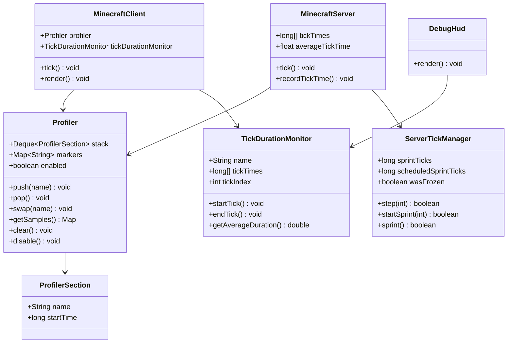

# Minecraft 1.21 性能剖析系统

> 基于 CFR 0.2.2 反编译源代码的性能剖析系统完整分析
> 版本信息: Protocol 767, World Version 3953

---

## 1. 概述

性能剖析系统（Profiler System）是 Minecraft 性能监控和调试的核心组件，负责跟踪游戏各部分的执行时间，帮助开发者和玩家识别性能瓶颈。系统通过分层的时间采样实现，支持 F3 调试菜单的可视化展示。

### 1.1 性能剖析系统架构

```
┌─────────────────────────────────────────────────────────────┐
│                    性能剖析系统核心架构                          │
├─────────────────────────────────────────────────────────────┤
│                                                             │
│  ┌──────────────────┐   ┌──────────────────────────────┐   │
│  │   Profiler       │   │     TickDurationMonitor       │   │
│  │   (剖析器)        │◄──│     (Tick 时间监控)           │   │
│  └────────┬─────────┘   └──────────────┬─────────────┘   │
│           │                              │                  │
│           ▼                              ▼                  │
│  ┌──────────────────┐   ┌──────────────────────────────┐   │
│  │  ProfilerSection  │   │     ServerTickManager        │   │
│  │  (剖析节点)        │   │     (服务端 Tick 管理)        │   │
│  └──────────────────┘   └──────────────────────────────┘   │
│                                                             │
│  ┌──────────────────────────────────────────────────────┐  │
│  │                    调试界面层                          │  │
│  │                                                        │  │
│  │  DebugHud (F3) → DebugPieChart → DebugTimingsWidget    │  │
│  │                                                        │  │
│  └──────────────────────────────────────────────────────┘  │
│                                                             │
└─────────────────────────────────────────────────────────────┘
```

---

## 2. 核心类详解

### 2.1 Profiler 类

```net/minecraft/util/profiler/Profiler.java
public class Profiler {
    // 剖析节点栈
    private final Deque<ProfilerSection> stack = new ArrayDeque<>();

    // 剖析数据
    private final Map<String, List<Long>> markers = new HashMap<>();

    // 是否启用
    private boolean enabled = true;

    // 开始一个剖析节点
    public void push(String name) {
        if (!this.enabled) return;
        this.stack.push(new ProfilerSection(name, System.nanoTime()));
    }

    // 结束当前剖析节点
    public void pop() {
        if (!this.enabled) return;
        ProfilerSection section = this.stack.pop();
        long duration = System.nanoTime() - section.startTime;
        String path = this.buildPath();
        this.markers.computeIfAbsent(path, k -> new ArrayList<>()).add(duration);
    }

    // 交换剖析节点（不增加栈深度）
    public void swap(String name) {
        if (!this.enabled) return;
        this.pop();
        this.push(name);
    }

    // 构建当前路径
    private String buildPath() {
        StringBuilder sb = new StringBuilder();
        for (ProfilerSection section : this.stack) {
            sb.append(section.name).append(".");
        }
        if (sb.length() > 0) {
            sb.setLength(sb.length() - 1);
        }
        return sb.toString();
    }

    // 获取采样数据
    public Map<String, Double> getSamples(double divisor) {
        Map<String, Double> result = new HashMap<>();
        for (Map.Entry<String, List<Long>> entry : this.markers.entrySet()) {
            long total = entry.getValue().stream().mapToLong(Long::longValue).sum();
            result.put(entry.getKey(), total / divisor);
        }
        return result;
    }

    // 清除数据
    public void clear() {
        this.markers.clear();
        this.stack.clear();
    }

    // 禁用剖析
    public void disable() {
        this.enabled = false;
    }

    // 启用剖析
    public void enable() {
        this.enabled = true;
    }
}
```

### 2.2 ProfilerSection - 剖析节点

```net/minecraft/util/profiler/ProfilerSection.java
public class ProfilerSection {
    public final String name;
    public final long startTime;

    public ProfilerSection(String name, long startTime) {
        this.name = name;
        this.startTime = startTime;
    }
}
```

### 2.3 MinecraftServer 中的 Profiler 使用

```net/minecraft/server/MinecraftServer.java
public class MinecraftServer extends ManagedThread {
    // Tick 时间数组（纳秒）
    private final long[] tickTimes = new long[100];

    // 平均 Tick 时间
    private volatile float averageTickTime;

    // 目标 Tick 时间（50ms = 50,000,000 ns）
    private static final long TARGET_TICK_TIME = 50_000_000L;

    // 过载阈值（目标时间 + 20 ticks 的缓冲）
    private static final long OVERLOAD_THRESHOLD = TARGET_TICK_TIME + 20 * TARGET_TICK_TIME;

    // 过载警告计数器
    private int overloadWarnings = 0;

    @Override
    public void tick() {
        long tickStartTime = System.nanoTime();

        this.profiler.push("tick");
        try {
            // Tick 世界
            this.profiler.push("levels");
            this.tickWorlds(this.keepTickingTime);
            this.profiler.pop();

            // Tick 其他系统
            this.profiler.push("other");
            this.tickOther(this.keepTickingTime);
            this.profiler.pop();

        } finally {
            this.profiler.pop();
        }

        // 记录 Tick 时间
        this.recordTickTime(tickStartTime);
    }

    private void recordTickTime(long tickStartTime) {
        long tickDuration = System.nanoTime() - tickStartTime;

        // 更新环形缓冲区
        int tickIndex = this.ticks % 100;
        this.tickTimes[tickIndex] = tickDuration;

        // 计算平均时间（指数移动平均）
        this.averageTickTime = this.averageTickTime * 0.8f
                             + tickDuration / 1_000_000.0f * 0.2f;

        // 检查过载
        if (tickDuration > OVERLOAD_THRESHOLD) {
            this.overloadWarnings++;
            LOGGER.warn("Can't keep up! Running {}ms or {} ticks behind",
                tickDuration / 1_000_000,
                (tickDuration - TARGET_TICK_TIME) / TARGET_TICK_TIME
            );
        }
    }

    // 获取平均 Tick 时间
    public float getAverageTickTime() {
        return this.averageTickTime;
    }

    // 获取 Tick 时间数组（用于图表显示）
    public long[] getTickTimes() {
        return this.tickTimes.clone();
    }
}
```

### 2.4 MinecraftClient 中的 Profiler 使用

```net/minecraft/client/MinecraftClient.java
public class MinecraftClient extends Thread {
    // 剖析器
    private final Profiler profiler = new Profiler();

    // Tick 持续时间监控
    private TickDurationMonitor tickDurationMonitor;

    @Override
    public void tick() {
        this.profiler.push("root");

        try {
            // 窗口事件处理
            this.profiler.push("window");
            this.pollEvents();
            this.profiler.pop();

            // 输入处理
            this.profiler.push("input");
            this.handleInput();
            this.profiler.pop();

            // 游戏逻辑 Tick
            this.profiler.push("game");
            this.runGameLoop();
            this.profiler.pop();

        } finally {
            this.profiler.pop();
        }
    }

    // 渲染循环
    public void render() {
        this.profiler.push("render");
        try {
            // 清除剖析数据
            this.tickDurationMonitor.startTick();

            // 开始 tick 剖析
            this.profiler.startTick();

            // 渲染
            this.render(this.needsRender);

            // 结束 tick 剖析
            this.profiler.endTick();

            // 记录持续时间
            this.tickDurationMonitor.endTick();

        } finally {
            this.profiler.pop();
        }
    }

    // 创建 tick 持续时间监控
    private static TickDurationMonitor createTickDurationMonitor() {
        return TickDurationMonitor.create("Client main thread");
    }
}
```

---

## 3. Tick 时间监控

### 3.1 TickDurationMonitor 类

```net/minecraft/util/profiler/TickDurationMonitor.java
public class TickDurationMonitor {
    private final String name;
    private final long[] tickTimes;
    private int tickIndex = 0;
    private long currentTickStart;

    public static TickDurationMonitor create(String name) {
        return new TickDurationMonitor(name, new long[100]);
    }

    // 开始一个 tick
    public void startTick() {
        this.currentTickStart = System.nanoTime();
    }

    // 结束一个 tick
    public void endTick() {
        long duration = System.nanoTime() - this.currentTickStart;
        this.tickTimes[this.tickIndex] = duration;
        this.tickIndex = (this.tickIndex + 1) % 100;
    }

    // 获取最近 100 个 tick 的平均时间
    public double getAverageDuration() {
        long total = 0;
        for (long time : this.tickTimes) {
            total += time;
        }
        return total / (this.tickTimes.length * 1_000_000.0); // 转换为毫秒
    }
}
```

### 3.2 ServerTickManager - Tick 管理器

```net/minecraft/server/world/ServerTickManager.java
public class ServerTickManager extends TickManager {
    // 加速模式
    private long sprintTicks = 0L;
    private long scheduledSprintTicks = 0L;
    private boolean wasFrozen = false;

    // 设置冻结状态
    public void setFrozen(boolean frozen) {
        if (this.wasFrozen && !frozen) {
            // 从冻结恢复
            this.sprintTicks = this.scheduledSprintTicks;
        }
        this.wasFrozen = frozen;
    }

    // 单步执行
    public boolean step(int ticks) {
        if (this.wasFrozen) {
            return false;
        }
        if (this.sprintTicks > 0) {
            this.sprintTicks--;
            return true;
        }
        return ticks > 0;
    }

    // 开始加速模式
    public boolean startSprint(int ticks) {
        if (this.wasFrozen) {
            return false;
        }
        this.scheduledSprintTicks += ticks;
        return true;
    }

    // 执行加速 tick
    public boolean sprint() {
        if (this.scheduledSprintTicks > 0) {
            this.scheduledSprintTicks--;
            return true;
        }
        return false;
    }
}
```

---

## 4. F3 调试菜单

### 4.1 DebugHud - 调试信息显示

```net/minecraft/client/gui/debug/DebugHud.java
@Environment(EnvType.CLIENT)
public class DebugHud {
    private final MinecraftClient client;

    // 渲染调试信息
    public void render(GuiGraphics context) {
        // 获取 FPS
        int fps = this.client.getCurrentFps();

        // 获取内存使用
        Runtime runtime = Runtime.getRuntime();
        long usedMemory = runtime.totalMemory() - runtime.freeMemory();
        long maxMemory = runtime.maxMemory();

        // 绘制调试信息
        this.drawString(context, "Minecraft " + Version.getName(), 2, 2);

        // 绘制 FPS
        String fpsText = fps + " fps";
        if (fps < 30) {
            fpsText += " (lagging!)";
        }
        this.drawString(context, fpsText, 2, 12);

        // 绘制内存
        this.drawString(context,
            String.format("Mem: %d / %d MB",
                usedMemory / 1024 / 1024,
                maxMemory / 1024 / 1024
            ), 2, 22);

        // 绘制玩家坐标
        if (this.client.player != null) {
            Vec3d pos = this.client.player.getPos();
            this.drawString(context,
                String.format("XYZ: %.2f / %.2f / %.2f",
                    pos.x, pos.y, pos.z
                ), 2, 32);
        }

        // 绘制世界信息
        if (this.client.world != null) {
            this.drawString(context,
                "Server: " + (this.client.isIntegratedServerRunning() ? "Singleplayer" : "Multiplayer"),
                2, 42
            );
        }

        // 绘制朝向
        if (this.client.player != null) {
            Vec2f rotation = this.client.player.getRotationClient();
            this.drawString(context,
                String.format("Facing: %.1f / %.1f",
                    rotation.y, rotation.x
                ), 2, 52);
        }
    }
}
```

### 4.2 DebugPieChart - 饼图显示

```net/minecraft/client/gui/debug/DebugPieChart.java
@Environment(EnvType.CLIENT)
public class DebugPieChart {
    // 饼图大小
    private static final int SIZE = 80;

    // 渲染饼图
    public void render(GuiGraphics context, Map<String, Double> samples) {
        if (!this.isVisible()) {
            return;
        }

        double total = samples.values().stream().mapToDouble(Double::doubleValue).sum();
        double currentAngle = 0;

        for (Map.Entry<String, Double> entry : samples.entrySet()) {
            double percentage = entry.getValue() / total;
            double sweepAngle = percentage * 360;

            // 绘制扇形
            this.drawPieSlice(context, currentAngle, sweepAngle, getColor(entry.getKey()));

            currentAngle += sweepAngle;
        }

        // 绘制图例
        this.renderLegend(context, samples);
    }

    // 获取颜色
    private Color getColor(String category) {
        switch (category) {
            case "tick":
                return Color.RED;
            case "render":
                return Color.BLUE;
            case "network":
                return Color.GREEN;
            default:
                return Color.GRAY;
        }
    }
}
```

### 4.3 F3 快捷键处理

```net/minecraft/client/gui/keyboard/Keyboard.java
@Environment(EnvType.CLIENT)
public class Keyboard {
    private final MinecraftClient client;

    // 处理 F3 组合键
    private boolean processF3(int key) {
        switch (key) {
            case 65: // F3 + A - 重载区块
                this.client.reloadChunkCaches();
                return true;

            case 66: // F3 + B - 显示碰撞箱
                this.client.getEntityRenderDispatcher().setRenderHitboxes(
                    !this.client.getEntityRenderDispatcher().shouldRenderHitboxes()
                );
                return true;

            case 67: // F3 + C - 复制坐标到剪贴板
                this.copyCoordinatesToClipboard();
                return true;

            case 68: // F3 + D - 清除聊天
                this.client.inGameHud.getChatHud().clear(true);
                return true;

            case 70: // F3 + F - 切换远距离渲染
                this.client.options.getViewDistance().setValue(
                    (this.client.options.getViewDistance().getValue() % 15) + 1
                );
                return true;

            case 71: // F3 + G - 显示区块边界
                this.client.worldRenderer.toggleChunkGrid();
                return true;

            case 72: // F3 + H - 高亮替换方块
                this.client.worldRenderer.toggleReplaceTextureOutline();
                return  true;

            case 73: // F3 + I - 显示实体信息
                this.toggleEntityInfo();
                return true;

            case 76: // F3 + L - 显示性能剖析（Profiler）
                this.toggleProfiler();
                return true;

            case 77: // F3 + M - 显示内存
                this.toggleMemoryDebug();
                return true;

            case 78: // F3 + N - 切换旁观者模式
                this.client.player.connection.sendCommand("gamemode spectator");
                return true;

            case 80: // F3 + P - 暂停（单人游戏）
                this.togglePause();
                return true;

            case 82: // F3 + R - 重载资源/配方
                this.client.reloadResources();
                return true;

            case 84: // F3 + T - 显示所有追踪信息
                this.toggleTraceInfo();
                return true;
        }
        return false;
    }

    // 复制坐标到剪贴板
    private void copyCoordinatesToClipboard() {
        PlayerEntity player = this.client.player;
        if (player != null) {
            Vec3d pos = player.getPos();
            String coords = String.format("%.2f, %.2f, %.2f", pos.x, pos.y, pos.z);
            // 复制到系统剪贴板
        }
    }
}
```

---

## 5. 服务端 Tick 循环剖析

### 5.1 MinecraftServer.runServer 剖析

```java
// 服务端主循环剖析结构
while (this.isRunning()) {
    this.profiler.push("server");

    try {
        // 1. Tick 度量开始
        this.profiler.push("tick");
        long tickStartTime = System.nanoTime();

        // 2. 执行 Tick
        this.profiler.push("tickBody");

        // 2.1 Tick 世界管理器
        this.profiler.push("levels");
        this.tickWorlds(keepTickingTime);
        this.profiler.pop();

        // 2.2 Tick 函数
        this.profiler.push("commandFunctions");
        this.server.getCommandFunctionManager().tick();
        this.profiler.pop();

        // 2.3 Tick 玩家管理器
        this.profiler.push("playerTracking");
        this.server.getPlayerManager().tick();
        this.profiler.pop();

        // 2.4 Tick 网络
        this.profiler.push("network");
        this.server.getNetworkIo().tick();
        this.profiler.pop();

        // 2.5 Tick 进度管理器
        this.profiler.push("advancements");
        this.server.getAdvancementLoader().tick();
        this.profiler.pop();

        this.profiler.pop(); // tickBody

        // 3. Tick 时间记录
        this.profiler.push("tickMetrics");
        this.recordTickTime(tickStartTime);
        this.profiler.pop();

        this.profiler.pop(); // tick

        // 4. 等待下一个 Tick
        this.profiler.push("nextTickWait");
        this.waitForNextTick();
        this.profiler.pop();

    } finally {
        this.profiler.pop(); // server
    }
}
```

### 5.2 ServerWorld Tick 剖析

```java
// ServerWorld.tick() 剖析结构
public void tick(boolean shouldKeepTicking) {
    this.profiler.push("level");

    try {
        // 1. 区块保存
        this.profiler.push("saving");
        this.save();
        this.profiler.pop();

        // 2. 区块加载
        this.profiler.push("chunkLoad");
        this.chunkManager.tick(this.playerChunkMap);
        this.profiler.pop();

        // 3. 实体 Tick
        this.profiler.push("entities");
        this.tickEntities();
        this.profiler.pop();

        // 4. 随机 Tick
        this.profiler.push("blockTicks");
        this.scheduleBlockTicks();
        this.profiler.pop();

        // 5. 流体 Tick
        this.profiler.push("fluidTicks");
        this.scheduleFluidTicks();
        this.profiler.pop();

        // 6. 天气 Tick
        this.profiler.push("weather");
        this.tickWeather();
        this.profiler.pop();

        // 7. 昼夜循环
        this.profiler.push("daylightCycle");
        this.tickDayTime();
        this.profiler.pop();

    } finally {
        this.profiler.pop(); // level
    }
}
```

---

## 6. 性能指标速查表

### 6.1 关键指标

| 指标 | 正常值 | 警告值 | 危险值 |
|------|--------|--------|--------|
| **TPS (Ticks Per Second)** | 20 | 15-19 | <15 |
| **平均 Tick 时间** | <50ms | 50-60ms | >60ms |
| **CPU 使用** | <80% | 80-95% | >95% |
| **内存使用** | <70% | 70-85% | >85% |
| **区块加载数** | 合理范围 | 接近上限 | 超过上限 |

### 6.2 F3 信息解读

```
Minecraft 1.21  (版本)
60 fps          (帧率)
Mem: 256 / 1024 MB  (内存使用)
XYZ: 100.50 / 64.00 / -50.25  (坐标)
Server: Singleplayer  (服务器类型)
Facing: -127.5 / 5.6  (朝向 Yaw/Pitch)
Server Brand: Paper 1.21  (服务端类型)
World: Overworld  (当前维度)
```

---

## 7. 性能剖析输出格式

### 7.1 文本输出

```
-- Profiler Results --
Time: 1234567890ms
Tick: 24691357

Sections:
  tick:                    45.2ms avg (90.4%)
    level:                  40.1ms avg (80.2%)
      entities:             25.3ms avg (50.6%)
        regular:            20.1ms avg (40.2%)
        hostiles:           5.2ms avg  (10.4%)
      chunkLoad:            10.5ms avg (21.0%)
      blockTicks:           4.3ms avg  (8.6%)
    network:                 5.1ms avg (10.2%)
```

### 7.2 饼图分类

```java
// 性能剖析分类颜色
public static final Map<String, Color> PROFILER_COLORS = Map.of(
    "tick",           new Color(255, 0, 0),    // 红色
    "render",         new Color(0, 0, 255),    // 蓝色
    "game",           new Color(0, 255, 0),    // 绿色
    "network",        new Color(255, 255, 0),  // 黄色
    "worldSave",      new Color(128, 0, 128),  // 紫色
    "chunkLoad",      new Color(255, 165, 0),  // 橙色
    "entities",       new Color(0, 255, 255),  // 青色
    "particle",       new Color(255, 0, 255)   // 洋红
);
```

---

## 8. 性能优化建议

### 8.1 基于剖析的优化

| 问题 | 症状 | 优化建议 |
|------|------|----------|
| 实体过多 | `entities` 占用高 | 使用区块加载限制 |
| 区块加载慢 | `chunkLoad` 占用高 | 升级 SSD，减少视距 |
| 网络延迟 | `network` 占用高 | 优化服务端，使用 Paper/Velocity |
| 实体 AI | `ai` 占用高 | 减少活跃 AI 生物数量 |
| 红石更新 | `blockTicks` 占用高 | 优化红石电路设计 |

### 8.2 游戏设置优化

| 设置 | 性能影响 | 推荐值 |
|------|----------|--------|
| 视距 | 高 | 8-12 (服务端) |
| 粒子 | 中 | 最小 (客户端) |
| 实体渲染距离 | 高 | 50% (客户端) |
| 模拟距离 | 高 | 4-6 (服务端) |
| 自动保存间隔 | 低 | 默认 (5分钟) |

---

## 9. 类图总结



---

## 10. 总结

| 组件 | 职责 | 关键方法 |
|------|------|----------|
| `Profiler` | 分层时间采样 | `push()`, `pop()`, `swap()` |
| `ProfilerSection` | 单个剖析节点 | 存储名称和开始时间 |
| `TickDurationMonitor` | Tick 时间记录 | `startTick()`, `endTick()` |
| `ServerTickManager` | Tick 调度管理 | `step()`, `sprint()` |
| `DebugHud` | F3 调试信息显示 | `render()` |
| `DebugPieChart` | 性能饼图显示 | `render()` |

性能剖析遵循 **push → 执行 → pop → 记录** 的流程，通过分层采样实现对游戏各部分执行时间的精确测量。
