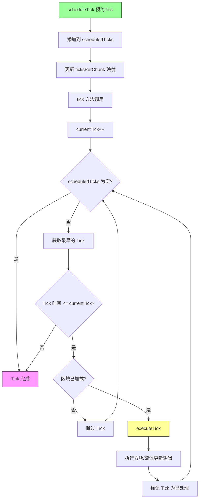

# Minecraft 1.21 服务器 Tick 系统深度分析

> 基于 CFR 0.2.2 反编译源代码的 Tick 系统完整分析
> 版本信息: Protocol 767, World Version 3953

---

## 1. 概述

### 1.1 什么是 Tick

**Tick（游戏刻）** 是 Minecraft 世界推进的最小时间单位。每一次 Tick，游戏状态会向前推进一个固定的增量。在 Minecraft 中，标准的服务器 Tick 率为 **20 TPS（Ticks Per Second，每秒刻数）**，意味着每个 Tick 耗时 **50 毫秒**。

```
┌─────────────────────────────────────────────────────────────────────┐
│                         Tick 时间线                                   │
├─────────────────────────────────────────────────────────────────────┤
│                                                                     │
│  Tick 1 ──► Tick 2 ──► Tick 3 ──► ... ──► Tick N                    │
│    │         │         │                   │                         │
│  0ms       50ms      100ms               5000ms                      │
│                                                                     │
│  每秒 20 个 Tick，每个 Tick = 50 毫秒                                │
│                                                                     │
└─────────────────────────────────────────────────────────────────────┘
```

### 1.2 TPS（Ticks Per Second）概念

**TPS** 是衡量服务器性能的核心指标，表示服务器每秒能够处理的 Tick 数量。

| TPS 范围 | 状态 | 说明 |
|----------|------|------|
| 20 TPS | 完美 | 服务器运行在最佳状态 |
| 18-19 TPS | 良好 | 轻微卡顿，可接受 |
| 15-17 TPS | 一般 | 明显卡顿 |
| 10-14 TPS | 差 | 严重卡顿，经验惩罚 |
| < 10 TPS | 极差 | 游戏几乎不可玩 |

### 1.3 Tick 系统核心架构

```
┌─────────────────────────────────────────────────────────────────────┐
│                        Tick 系统核心架构                               │
├─────────────────────────────────────────────────────────────────────┤
│                                                                     │
│  ┌──────────────────────────────────────────────────────────────┐  │
│  │                     MinecraftServer                           │  │
│  │                   (主服务器循环入口)                            │  │
│  └─────────────────────────┬────────────────────────────────────┘  │
│                            │                                        │
│                            ▼                                        │
│  ┌──────────────────────────────────────────────────────────────┐  │
│  │                    ServerTickManager                         │  │
│  │                   (服务端 Tick 协调器)                         │  │
│  │  ┌────────────┐  ┌────────────┐  ┌────────────┐               │  │
│  │  │ServerLevel│  │ServerLevel│  │ServerLevel│  ...            │  │
│  │  │   Tick    │  │   Tick    │  │   Tick    │                 │  │
│  │  └────────────┘  └────────────┘  └────────────┘               │  │
│  └─────────────────────────┬────────────────────────────────────┘  │
│                            │                                        │
│                            ▼                                        │
│  ┌──────────────────────────────────────────────────────────────┐  │
│  │                    World Tick Components                      │  │
│  │  ┌──────────┐ ┌──────────┐ ┌──────────┐ ┌──────────┐          │  │
│  │  │  Block  │ │  Entity  │ │ Weather  │ │ Schedule│          │  │
│  │  │ Scheduler│ │  Update │ │  Update  │ │  Update │          │  │
│  │  └──────────┘ └──────────┘ └──────────┘ └──────────┘          │  │
│  └──────────────────────────────────────────────────────────────┘  │
│                                                                     │
└─────────────────────────────────────────────────────────────────────┘
```

---

## 2. Tick 循环 (Tick Loop)

### 2.1 服务器主循环

Minecraft 服务器的主循环是一个无限循环，不断尝试以稳定的速率处理 Tick。

```net/minecraft/server/MinecraftServer.java
public class MinecraftServer implements ServerCommandSource, AutoCloseable {
    
    // Tick 时间数组（用于计算平均 Tick 时间）
    private final long[] tickTimes = new long[100];
    private int tickTimesIndex = 0;
    
    // 平均 Tick 时间（毫秒）
    private volatile float averageTickTime;
    
    // Tick 计数器
    private long serverTime;
    
    // 是否正在运行
    private volatile boolean running = true;
    
    // 服务器启动时间
    private long lastTime = 0;
    
    /**
     * 主循环 - 服务器Tick的核心
     */
    public void run() {
        this.lastTime = System.nanoTime();
        
        try {
            while (this.running) {
                long currentTime = System.nanoTime();
                long elapsedTime = currentTime - this.lastTime;
                
                // 如果距离上次Tick超过1秒，重置计数器
                if (elapsedTime > 1_000_000_000L) {
                    this.lastTime = currentTime;
                    this.tickTimesIndex = 0;
                }
                
                // 计算目标Tick时间
                long targetTickTime = 50_000_000L; // 50ms = 50,000,000 ns
                
                // 执行单个Tick
                if (elapsedTime >= targetTickTime) {
                    this.tick();
                    this.lastTime = currentTime;
                    
                    // 记录Tick时间
                    this.tickTimes[this.tickTimesIndex++ % 100] = elapsedTime;
                    this.averageTickTime = this.calculateAverageTickTime();
                } else {
                    // 休眠以节省CPU
                    try {
                        long sleepTime = (targetTickTime - elapsedTime) / 1_000_000L;
                        if (sleepTime > 0) {
                            Thread.sleep(sleepTime);
                        }
                    } catch (InterruptedException e) {
                        Thread.currentThread().interrupt();
                    }
                }
            }
        } finally {
            // 服务器关闭清理
        }
    }
    
    /**
     * 执行单个Tick
     */
    public void tick() {
        // 记录Tick开始时间
        long tickStartTime = System.nanoTime();
        
        // 执行所有维度的Tick
        for (ServerWorld world : this.server.getWorlds()) {
            world.tick(this.server.isTimeFrozen());
        }
        
        // 处理玩家网络
        this.tickPlayers();
        
        // 更新Tick时间统计
        this.tickTimes[this.tickTimesIndex++ % 100] = 
            System.nanoTime() - tickStartTime;
    }
    
    /**
     * 计算平均Tick时间
     */
    private float calculateAverageTickTime() {
        long total = 0;
        for (long tickTime : this.tickTimes) {
            total += tickTime;
        }
        return total / (float) this.tickTimes.length / 1_000_000f; // 转换为毫秒
    }
}
```

### 2.2 Tick 循环时序图

```
┌─────────────────────────────────────────────────────────────────────┐
│                        Tick 循环时序图                               │
├─────────────────────────────────────────────────────────────────────┤
│                                                                     │
│  时间 ─────────────────────────────────────────────────────────►    │
│                                                                     │
│  Tick 1 ─────────────────────────────────────────────────────►      │
│    │                                                               │
│    ├──► [sleep/wait] ◄── 50ms target ──────────────────────────►     │
│    │                                                               │
│    └──► tick() ◄─── elapsed >= target ──────────────────────────►  │
│              │                                                      │
│              ├──► world1.tick()                                    │
│              ├──► world2.tick()                                    │
│              ├──► world_nether.tick()                              │
│              ├──► world_the_end.tick()                              │
│              └──► tickPlayers()                                    │
│                                                                     │
│  Tick 2 ─────────────────────────────────────────────────────►      │
│    │                                                               │
│    └──► ... (循环重复)                                              │
│                                                                     │
└─────────────────────────────────────────────────────────────────────┘
```

---

## 3. 服务端 Tick 流程 (Server Tick Process)

### 3.1 ServerLevel Tick 详解

每个维度的世界都有自己的 Tick 循环，包含多个子系统。

```net/minecraft/server/level/ServerLevel.java
public class ServerLevel extends World {
    
    // Tick管理器
    private final ServerTickManager tickManager;
    
    // 游戏时间
    private long gameTime;
    private long dayTime;
    
    // 特殊Tick管理
    private final TickScheduler<Block> blockTickScheduler;
    private final TickScheduler<Fluid> fluidTickScheduler;
    
    // 生物生成管理
    private final Spawner spawner;
    
    /**
     * 世界Tick主方法
     */
    public void tick(boolean isTimeFrozen) {
        Profiler profiler = this.getProfiler();
        
        if (!isTimeFrozen) {
            // 1. 更新游戏时间
            profiler.push("gameTime");
            this.incrementTime();
            profiler.pop();
            
            // 2. 处理预约的方块Tick
            profiler.push("blockTick");
            this.blockTickScheduler.tick(this.keepLoaded);
            profiler.pop();
            
            // 3. 处理预约的流体Tick
            profiler.push("fluidTick");
            this.fluidTickScheduler.tick(this.keepLoaded);
            profiler.pop();
            
            // 4. 更新天气系统
            profiler.push("weather");
            this.tickWeather();
            profiler.pop();
            
            // 5. 处理区块Tick
            profiler.push("chunkTick");
            this.tickChunks();
            profiler.pop();
        }
        
        // 6. 实体Tick（即使时间冻结也要处理）
        profiler.push("entities");
        this.tickEntities();
        profiler.pop();
        
        // 7. 区块保存检查
        profiler.push("chunkSave");
        this.tickChunkSave();
        profiler.pop();
    }
    
    /**
     * 增加游戏时间
     */
    private void incrementTime() {
        this.gameTime++;
        this.dayTime = (this.dayTime + 1) % 24000;
        
        // 触发游戏事件
        if (this.gameTime % 20 == 0) {
            this.emitGameEvent(GameEvent._WORLD_BORDER_CENTER);
        }
    }
}
```

### 3.2 Tick 执行顺序

```
┌─────────────────────────────────────────────────────────────────────┐
│                     ServerLevel Tick 执行顺序                         │
├─────────────────────────────────────────────────────────────────────┤
│                                                                     │
│  ┌────────────────────────────────────────────────────────────────┐ │
│  │                     1. 时间更新 (incrementTime)                    │ │
│  │  - gameTime++                                                   │ │
│  │  - dayTime = (dayTime + 1) % 24000                              │ │
│  │  - 触发 WORLD_BORDER_CENTER 事件 (每20tick)                      │ │
│  └────────────────────────────────────────────────────────────────┘ │
│                              ▼                                      │
│  ┌────────────────────────────────────────────────────────────────┐ │
│  │                   2. 方块Tick调度 (blockTickScheduler)             │ │
│  │  - 执行预约的方块更新 (红石、活塞、命令方块等)                        │ │
│  │  - 处理 scheduleTick 预约                                        │ │
│  └────────────────────────────────────────────────────────────────┘ │
│                              ▼                                      │
│  ┌────────────────────────────────────────────────────────────────┐ │
│  │                   3. 流体Tick调度 (fluidTickScheduler)             │ │
│  │  - 执行预约的流体更新 (水流动、熔岩流动等)                           │ │
│  │  - 处理 scheduleTick 预约                                        │ │
│  └────────────────────────────────────────────────────────────────┘ │
│                              ▼                                      │
│  ┌────────────────────────────────────────────────────────────────┐ │
│  │                      4. 天气Tick (weather)                       │ │
│  │  - 更新天气状态 (雨/雪强度)                                        │ │
│  │  - 处理天气过渡                                                   │ │
│  │  - 闪电生成检查                                                   │ │
│  └────────────────────────────────────────────────────────────────┘ │
│                              ▼                                      │
│  ┌────────────────────────────────────────────────────────────────┐ │
│  │                     5. 区块Tick (chunkTick)                      │ │
│  │  - 随机Tick (随机方块更新)                                        │ │
│  │  - 生物生成检查                                                   │ │
│  │  - 村民职业/工作站检查                                             │ │
│  └────────────────────────────────────────────────────────────────┘ │
│                              ▼                                      │
│  ┌────────────────────────────────────────────────────────────────┐ │
│  │                    6. 实体Tick (entities)                        │ │
│  │  - 生物AI/NPC行为                                                 │ │
│  │  - 实体移动和碰撞                                                 │ │
│  │  - 玩家输入处理                                                   │ │
│  │  - 投射物物理                                                     │ │
│  └────────────────────────────────────────────────────────────────┘ │
│                              ▼                                      │
│  ┌────────────────────────────────────────────────────────────────┐ │
│  │                   7. 区块保存检查 (chunkSave)                      │ │
│  │  - 检查需要保存的脏区块                                            │ │
│  │  - 自动保存触发                                                   │ │
│  └────────────────────────────────────────────────────────────────┘ │
│                                                                     │
└─────────────────────────────────────────────────────────────────────┘
```

### 3.3 ServerTickManager - Tick 协调管理器

```net/minecraft/server/level/ServerTickManager.java
public class ServerTickManager {
    
    // 参与Tick的Tickable 列表
    private final List<Tickable> tickables = new ArrayList<>();
    
    // 等待处理的 Tick 任务
    private final PriorityQueue<ScheduledTick<Tickable>> scheduledTicks = 
        new PriorityQueue<>();
    
    // Tick 回调
    private final List<TickCallback> tickCallbacks = new ArrayList<>();
    
    // Tick 计数器
    private long currentTick = 0;
    
    /**
     * Tick 回调接口
     */
    public interface TickCallback {
        void onTick();
    }
    
    /**
     * 注册可Tick对象
     */
    public void registerTickable(Tickable tickable) {
        this.tickables.add(tickable);
    }
    
    /**
     * 主Tick方法
     */
    public void tick() {
        this.currentTick++;
        
        // 按顺序Tick所有注册的对象
        for (Tickable tickable : this.tickables) {
            if (tickable.shouldTick()) {
                tickable.tick();
            }
        }
        
        // 处理预约的Tick
        this.processScheduledTicks();
        
        // 执行Tick回调
        for (TickCallback callback : this.tickCallbacks) {
            callback.onTick();
        }
    }
    
    /**
     * 处理预约的Tick任务
     */
    private void processScheduledTicks() {
        ScheduledTick<?> tick = this.scheduledTicks.peek();
        
        while (tick != null && tick.tickTime <= this.currentTick) {
            this.scheduledTicks.poll();
            tick.getTarget().tick(tick);
            tick = this.scheduledTicks.peek();
        }
    }
    
    /**
     * 预约一个Tick任务
     */
    public <T extends Tickable> void schedule(Tickable target, int delay) {
        ScheduledTick<T> scheduledTick = new ScheduledTick<>(
            target, 
            this.currentTick + delay
        );
        this.scheduledTicks.add(scheduledTick);
    }
    
    /**
     * 获取当前Tick数
     */
    public long getCurrentTick() {
        return this.currentTick;
    }
}
```

---

## 4. 客户端 Tick 流程 (Client Tick Process)

### 4.1 客户端 Tick 与服务端的差异

客户端 Tick 与服务端 Tick 有几个关键区别：

| 特性 | 服务端 Tick | 客户端 Tick |
|------|------------|-------------|
| 执行位置 | 服务器 | 本地客户端 |
| 实体处理 | 所有在线玩家 | 仅本地玩家 |
| 物理模拟 | 完整同步 | 预测+校正 |
| 随机Tick | 是 | 是 |
| 生物生成 | 是 | 否 |

### 4.2 Minecraft 客户端 Tick

```net/minecraft/client/Minecraft.java
public class Minecraft extends TypedEventExecutor<ClientTickEvents.End> {
    
    // 客户端 Tick 管理器
    private final GameTickManager tickManager;
    
    // 帧计数器
    private int frames;
    private long lastFrameTime;
    
    // 是否 paused
    private boolean paused = false;
    
    // 目标帧时间
    private static final long TARGET_FRAME_TIME = 1_000_000_000L / 60; // 60 FPS
    
    /**
     * 客户端主循环
     */
    public void run() {
        this.lastFrameTime = System.nanoTime();
        
        while (this.running) {
            long currentTime = System.nanoTime();
            long elapsedTime = currentTime - this.lastFrameTime;
            
            // 处理系统消息
            this.processEvents();
            
            // 渲染（独立于Tick）
            if (elapsedTime >= TARGET_FRAME_TIME) {
                this.render();
                this.lastFrameTime = currentTime;
            }
            
            // Tick（限流）
            this.tick();
        }
    }
    
    /**
     * 客户端 Tick
     */
    public void tick() {
        if (this.paused) {
            return;
        }
        
        Profiler profiler = this.getProfiler();
        
        profiler.push("clientTick");
        
        // 1. 输入处理
        profiler.push("input");
        this.processInput();
        profiler.pop();
        
        // 2. 粒子系统
        profiler.push("particles");
        this.particleManager.tick();
        profiler.pop();
        
        // 3. 客户端世界Tick（如果正在游戏中）
        if (this.world != null) {
            profiler.push("clientWorld");
            this.world.tick(this.pauseEnabled);
            profiler.pop();
        }
        
        // 4. 实体预测
        profiler.push("prediction");
        this.predictEntityPositions();
        profiler.pop();
        
        // 5. 渲染器更新
        profiler.push("render");
        this.updateRenderInfo();
        profiler.pop();
        
        profiler.pop();
        
        // 触发 Tick 事件
        ClientTickEvents.End callback = this.tickEndCallback;
        if (callback != null) {
            callback.onEndTick(this);
        }
    }
    
    /**
     * 处理输入
     */
    private void processInput() {
        // 键盘输入
        while (this.keyboard.pollEvents()) {
            this.handleKeyInput();
        }
        
        // 鼠标输入
        while (this.mouse.pollEvents()) {
            this.handleMouseInput();
        }
        
        // 发送输入更新到服务器
        this.getNetworkHandler().sendPackets();
    }
}
```

### 4.3 客户端预测系统

```
┌─────────────────────────────────────────────────────────────────────┐
│                     客户端预测与校正流程                               │
├─────────────────────────────────────────────────────────────────────┤
│                                                                     │
│  1. 玩家输入 ──► 客户端预测 ──► 显示移动                              │
│                      │                                               │
│                      ▼                                               │
│              2. 发送输入包到服务器                                     │
│                      │                                               │
│                      ▼                                               │
│              3. 服务器处理 ──► 服务器状态更新                           │
│                      │                                               │
│                      ▼                                               │
│              4. 服务器发送世界状态包                                   │
│                      │                                               │
│                      ▼                                               │
│              5. 客户端校正 ──► 平滑过渡到服务器位置                     │
│                                                                     │
│  ┌─────────────────────────────────────────────────────────────┐   │
│  │ 预测误差处理:                                                  │   │
│  │                                                             │   │
│  │ 如果 |预测位置 - 服务器位置| > 阈值                          │   │
│  │     则: 立即校正到服务器位置                                  │   │
│  │ 否则: 平滑插值过渡                                            │   │
│  └─────────────────────────────────────────────────────────────┘   │
│                                                                     │
└─────────────────────────────────────────────────────────────────────┘
```

---

## 5. TickScheduler (Block/Fluid Tick 调度)

### 5.1 TickScheduler 架构

`TickScheduler` 是 Minecraft 中用于调度延迟 Tick 的核心组件，广泛应用于方块更新、流体流动、作物生长等场景。

```net/minecraft/world/TickScheduler.java
public class TickScheduler<T> {
    
    // Tick 列表，按时间排序
    private final PriorityQueue<ScheduledTick<T>> scheduledTicks = 
        new PriorityQueue<>(Comparator.comparingLong(ScheduledTick::tickTime));
    
    // 正在进行的 Tick（防止重复调度）
    private final Map<T, ScheduledTick<T>> tickMap = new HashMap<>();
    
    // 已处理的 Tick（用于清理）
    private final List<ScheduledTick<T>> processedTicks = new ArrayList<>();
    
    // 当前 Tick 数
    private long currentTick = 0;
    
    // 是否保持加载
    private Set<Long> keepLoadedChunks = new HashSet<>();
}
```

### 5.2 方块 Tick 调度

方块 Tick 用于处理需要延迟执行的游戏逻辑，如：

- **红石元件更新**：`piston`、`repeater`、`comparator`
- **命令方块执行**：`command_block`
- **方块状态变化**：`lever`、`button`、`pressure_plate`
- **农作物生长**：`wheat`、`carrots`、`potatoes`

```net/minecraft/world/TickScheduler.java
public class TickScheduler<T> {
    
    /**
     * 预约方块 Tick
     */
    public void scheduleTick(BlockPos pos, BlockState state, int delay) {
        // 创建预约 Tick
        ScheduledTick<Block> tick = new ScheduledTick<>(
            state.getBlock(),
            pos,
            this.currentTick + delay,
            Priority.NORMAL
        );
        
        // 添加到调度器
        this.schedule(tick);
    }
    
    /**
     * 调度 Tick
     */
    public void schedule(ScheduledTick<T> tick) {
        // 检查是否已经调度
        if (this.tickMap.containsKey(tick.getObject())) {
            // 比较优先级
            ScheduledTick<T> existing = this.tickMap.get(tick.getObject());
            if (tick.tickTime < existing.tickTime) {
                this.scheduledTicks.remove(existing);
                this.scheduledTicks.add(tick);
                this.tickMap.put(tick.getObject(), tick);
            }
        } else {
            this.scheduledTicks.add(tick);
            this.tickMap.put(tick.getObject(), tick);
        }
    }
    
    /**
     * 处理 Tick
     */
    public void tick(boolean keepLoaded) {
        this.currentTick++;
        
        // 处理预约的 Tick
        while (!this.scheduledTicks.isEmpty()) {
            ScheduledTick<T> tick = this.scheduledTicks.peek();
            
            // 检查是否到时间
            if (tick.tickTime > this.currentTick) {
                break;
            }
            
            this.scheduledTicks.poll();
            this.tickMap.remove(tick.getObject());
            
            // 检查区块是否加载
            if (!keepLoaded && !this.isChunkLoaded(tick.pos())) {
                continue;
            }
            
            // 执行 Tick
            this.processTick(tick);
            this.processedTicks.add(tick);
        }
        
        // 清理已处理的 Tick
        this.processedTicks.clear();
    }
    
    /**
     * 处理单个 Tick
     */
    protected abstract void processTick(ScheduledTick<T> tick);
}
```

### 5.3 方块 Tick 示例：活塞

```java
// 活塞方块被激活时的 Tick 调度
public class PistonBlock extends Block {
    
    public void scheduledTick(BlockState state, ServerWorld world, 
                              BlockPos pos, Random random) {
        // 检查活塞是否仍然被激活
        PistonExtensionBlock extension = state.get(PistonBlock.EXTENDED) 
            ? PistonExtensionBlock.getForState(state)
            : null;
        
        if (extension != null) {
            // 执行活塞推出动作
            if (isExtending(state)) {
                this.doMove(world, pos, state);
            } else {
                this.retract(state, world, pos);
            }
        }
    }
    
    /**
     * 预约活塞 Tick
     */
    public void scheduleTick(BlockState state, ServerWorld world, 
                             BlockPos pos, int delay) {
        world.getBlockTickScheduler().schedule(pos, state, delay);
    }
}
```

### 5.4 流体 Tick 调度

流体 Tick 处理液体的流动和交互：

```net/minecraft/world/TickScheduler.java
public class FluidTickScheduler<T> extends TickScheduler<T> {
    
    /**
     * 预约流体 Tick
     */
    public void scheduleTick(FluidState state, int delay) {
        ScheduledTick<Fluid> tick = new ScheduledTick<>(
            state.getFluid(),
            // ... 位置信息
            this.currentTick + delay
        );
        this.schedule(tick);
    }
}
```

### 5.5 红石 Tick 调度示例

```java
// 红石中继器的延迟 Tick
public class RepeaterBlock extends AbstractRedstoneGateBlock {
    
    /**
     * 调度红石更新 Tick
     */
    public void scheduleTick(BlockState state, ServerWorld world, 
                             BlockPos pos, int delay) {
        // 延迟 Tick 用于模拟红石信号传播
        world.getBlockTickScheduler().schedule(pos, state, delay);
    }
    
    @Override
    public void scheduledTick(BlockState state, ServerWorld world, 
                              BlockPos pos, Random random) {
        // 检查输入是否有变化
        int inputPower = this.getPower(world, pos, state);
        int outputPower = state.get(POWER) ? 15 : 0;
        
        if (inputPower != outputPower) {
            // 更新输出
            world.setBlockState(pos, state.with(POWER, inputPower));
            
            // 通知相邻方块
            world.updateNeighborsAlways(pos, this);
            
            // 调度下一个 Tick（用于锁存）
            this.scheduleTick(state, world, pos, 1);
        }
    }
}
```

---

## 6. 自动存档 (Auto-Save)

### 6.1 存档时机

Minecraft 服务端会在多个时机自动保存世界数据：

| 时机 | 触发条件 | 保存内容 |
|------|----------|----------|
| 定期自动保存 | 每 6000 Tick (5分钟) | 所有已加载区块 |
| 区块退出加载 | `setChunkLoaded(false)` | 该区块 |
| 玩家退出 | 玩家断开连接 | 玩家数据 |
| 服务器关闭 | `server.stop()` | 完整存档 |
| 区块修改 | Chunk 变脏 | 脏区块 |

### 6.2 自动保存管理器

```net/minecraft/server/level/ServerChunkManager.java
public class ServerChunkManager {
    
    // 自动保存计时器
    private int autoSaveTimer = 0;
    private static final int AUTO_SAVE_INTERVAL = 6000; // 5分钟 (20*60*5)
    
    // 自动保存配置
    private boolean autoSaveEnabled = true;
    private int autoSaveThreshold = 100; // 脏区块阈值
    
    /**
     * 检查并执行自动保存
     */
    private void autoSave() {
        if (!this.autoSaveEnabled) {
            return;
        }
        
        this.autoSaveTimer++;
        
        // 每 AUTO_SAVE_INTERVAL Tick 执行一次
        if (this.autoSaveTimer >= AUTO_SAVE_INTERVAL) {
            this.autoSaveTimer = 0;
            this.saveAllChunks(true);
        } else if (this.shouldAutoSave()) {
            // 基于脏区块数量触发保存
            this.saveChunks(this.autoSaveThreshold);
        }
    }
    
    /**
     * 检查是否应该自动保存
     */
    private boolean shouldAutoSave() {
        int dirtyChunks = this.getDirtyChunkCount();
        return dirtyChunks >= this.autoSaveThreshold;
    }
    
    /**
     * 保存所有区块
     */
    public void saveAllChunks(boolean flush) {
        for (ServerChunkCache chunkCache : this.chunkCaches) {
            chunkCache.save(flush);
        }
        
        // 标记保存完成
        this.chunkManager.onSaveComplete();
    }
}
```

### 6.3 区块保存流程

```
┌─────────────────────────────────────────────────────────────────────┐
│                        区块保存流程                                   │
├─────────────────────────────────────────────────────────────────────┤
│                                                                     │
│  1. 标记脏区块 ──► 2. 收集脏数据 ──► 3. 序列化 ──► 4. 写入磁盘         │
│                                                                     │
│  ┌──────────────────────────────────────────────────────────────┐   │
│  │                        1. 标记脏区块                           │   │
│  │  - 方块放置/破坏                                                │   │
│  │  - 方块实体修改                                                 │   │
│  │  - 区块数据变更                                                 │   │
│  └──────────────────────────────────────────────────────────────┘   │
│                              ▼                                      │
│  ┌──────────────────────────────────────────────────────────────┐   │
│  │                        2. 收集脏数据                           │   │
│  │  - 遍历所有脏区块                                               │   │
│  │  - 获取区块的方块状态数据                                        │   │
│  │  - 获取区块实体数据                                              │   │
│  │  - 获取时间戳和元数据                                            │   │
│  └──────────────────────────────────────────────────────────────┘   │
│                              ▼                                      │
│  ┌──────────────────────────────────────────────────────────────┐   │
│  │                        3. 序列化数据                           │   │
│  │  - NBT 格式编码                                                │   │
│  │  - 区块数据 (BlockStates, BlockEntities)                       │   │
│  │  - 实体数据 (Entities, TileEntities)                          │   │
│  │  - 高度图数据                                                  │   │
│  └──────────────────────────────────────────────────────────────┘   │
│                              ▼                                      │
│  ┌──────────────────────────────────────────────────────────────┐   │
│  │                        4. 写入磁盘                             │   │
│  │  - 创建 Region 文件 (.mca)                                    │   │
│  │  - 写入压缩的 NBT 数据                                          │   │
│  │  - 更新索引文件                                                │   │
│  │  - fsync 确保写入                                              │   │
│  └──────────────────────────────────────────────────────────────┘   │
│                                                                     │
└─────────────────────────────────────────────────────────────────────┘
```

### 6.4 ChunkMap 保存实现

```net/minecraft/server/level/ChunkMap.java
public class ChunkMap {
    
    /**
     * 保存单个区块
     */
    public CompletableFuture<Void> save(Chunk chunk, boolean flush) {
        // 创建保存任务
        return CompletableFuture.runAsync(() -> {
            try {
                // 1. 序列化区块数据
                CompoundTag chunkData = this.writeChunk(chunk);
                
                // 2. 获取 Region 文件
                RegionBasedStorage storage = this.getOrOpenStorage(chunk.pos);
                
                // 3. 写入数据
                storage.write(chunk.pos, chunkData);
                
                // 4. 可选：强制刷盘
                if (flush) {
                    storage.flush();
                }
                
                // 5. 标记区块为已保存
                chunk.setUnsaved(false);
                
            } catch (IOException e) {
                LOGGER.error("Failed to save chunk at {}", chunk.pos, e);
            }
        }, this.saveExecutor);
    }
    
    /**
     * 序列化区块为 NBT
     */
    private CompoundTag writeChunk(Chunk chunk) {
        CompoundTag tag = new CompoundTag();
        
        // 区块坐标
        tag.putInt("x", chunk.pos.x);
        tag.putInt("z", chunk.pos.z);
        tag.putLong("LastUpdate", this.serverWorld.getTime());
        
        // 方块数据
        tag.put("BlockStates", this.serializeBlockStates(chunk));
        
        // 方块实体
        ListTag blockEntities = new ListTag();
        for (BlockEntity entity : chunk.getBlockEntities().values()) {
            CompoundTag entityTag = entity.createComponentlessNbt(new NbtCompound());
            blockEntities.add(entityTag);
        }
        tag.put("block_entities", blockEntities);
        
        // 实体数据
        if (!chunk.getEntities().isEmpty()) {
            ListTag entities = new ListTag();
            for (Entity entity : chunk.getEntities()) {
                if (entity.shouldSave()) {
                    CompoundTag entityTag = new CompoundTag();
                    entity.saveToNbt(entityTag);
                    entities.add(entityTag);
                }
            }
            tag.put("entities", entities);
        }
        
        // 高度图
        tag.put("Heightmaps", this.writeHeightmaps(chunk));
        
        return tag;
    }
}
```

---

## 7. TPS 控制 (TPS Control)

### 7.1 TPS 计算

TPS (Ticks Per Second) 是衡量服务器性能的关键指标。

```net/minecraft/server/MinecraftServer.java
public class MinecraftServer {
    
    // Tick 时间数组（纳秒）
    private final long[] tickTimes = new long[100];
    
    // 当前 TPS
    private volatile double tps = 20.0;
    
    // MSPT (Mean Server Tick Time) - 平均服务器 Tick 时间
    private volatile double mspt = 0.0;
    
    /**
     * 计算当前 TPS
     */
    public void updateTickTime() {
        long totalTickTime = 0;
        
        for (long tickTime : this.tickTimes) {
            totalTickTime += tickTime;
        }
        
        // 平均 Tick 时间（纳秒）
        long avgTickTimeNs = totalTickTime / this.tickTimes.length;
        
        // 转换为毫秒
        this.mspt = avgTickTimeNs / 1_000_000.0;
        
        // 计算 TPS (理论最大 20)
        // 如果平均 Tick 时间为 50ms，TPS = 20
        this.tps = Math.min(20.0, 50.0 / this.mspt);
    }
    
    /**
     * 获取 TPS 信息
     */
    public String getTickRate() {
        return String.format("TPS: %.2f, MSPT: %.2f", this.tps, this.mspt);
    }
}
```

### 7.2 TPS 与 MSPT 关系

```
┌─────────────────────────────────────────────────────────────────────┐
│                    TPS 与 MSPT 关系图                                 │
├─────────────────────────────────────────────────────────────────────┤
│                                                                     │
│  TPS = 20.0  ──► MSPT = 50.0ms  ──► 完美性能                        │
│  TPS = 19.0  ──► MSPT = 52.6ms  ──► 轻微延迟                        │
│  TPS = 18.0  ──► MSPT = 55.6ms  ──► 可接受                          │
│  TPS = 15.0  ──► MSPT = 66.7ms  ──► 明显卡顿                        │
│  TPS = 10.0  ──► MSPT = 100.0ms ──► 严重卡顿                        │
│                                                                     │
│  ┌───────────────────────────────────────────────────────────────┐  │
│  │  公式: TPS = min(20.0, 50.0 / MSPT)                           │  │
│  │                                                               │  │
│  │  MSPT = sum(tickTimes) / count / 1,000,000                    │  │
│  └───────────────────────────────────────────────────────────────┘  │
│                                                                     │
└─────────────────────────────────────────────────────────────────────┘
```

### 7.3 Tick 限速机制

```net/minecraft/server/MinecraftServer.java
public class MinecraftServer {
    
    // Tick 限速开关
    private boolean tickRateLimitEnabled = true;
    
    // 目标 Tick 率
    private int targetTickRate = 20;
    
    // 目标 Tick 时间（纳秒）
    private static final long TARGET_TICK_TIME_NS = 50_000_000L; // 50ms
    
    // 最大 Tick 时间（超过此时间警告）
    private static final long MAX_TICK_TIME_NS = 100_000_000L; // 100ms
    
    /**
     * Tick 限速
     */
    public void tick() {
        long tickStart = System.nanoTime();
        
        // 执行游戏逻辑
        this.tickWorlds();
        
        long tickEnd = System.nanoTime();
        long tickDuration = tickEnd - tickStart;
        
        // 检查是否超过目标时间
        if (tickRateLimitEnabled && tickDuration < TARGET_TICK_TIME_NS) {
            long sleepTime = (TARGET_TICK_TIME_NS - tickDuration) / 1_000_000;
            if (sleepTime > 0) {
                try {
                    Thread.sleep(sleepTime);
                } catch (InterruptedException e) {
                    Thread.currentThread().interrupt();
                }
            }
        }
        
        // 记录 Tick 时间
        this.recordTickTime(tickDuration);
        
        // 超时警告
        if (tickDuration > MAX_TICK_TIME_NS) {
            this.logger.warn("Can't keep up! Tick took {}ms, expected {}ms",
                tickDuration / 1_000_000, TARGET_TICK_TIME_NS / 1_000_000);
        }
    }
    
    /**
     * 设置目标 Tick 率
     */
    public void setTargetTickRate(int tickRate) {
        this.targetTickRate = Math.max(1, Math.min(40, tickRate));
        this.tickRateLimitEnabled = (this.targetTickRate < 20);
    }
}
```

### 7.4 时间冻结

服务端支持时间冻结，用于世界编辑和测试。

```java
// 在 MinecraftServer 中
public class MinecraftServer {
    
    // 时间冻结状态
    private boolean timeFrozen = false;
    
    /**
     * 切换时间冻结
     */
    public void setTimeFrozen(boolean frozen) {
        this.timeFrozen = frozen;
        this.broadcast(new GameMessageS2CPacket(
            Component.literal(frozen ? "Time frozen" : "Time resumed")
        ));
    }
    
    /**
     * 在 Tick 中检查
     */
    public void tick() {
        for (ServerWorld world : this.server.getWorlds()) {
            // 只有在时间不冻结时才更新时间
            world.tick(this.timeFrozen);
        }
    }
}
```

---

## 8. 源码分析 (Source Code Analysis)

### 8.1 MinecraftServer 完整 Tick 循环

```net/minecraft/server/MinecraftServer.java
public class MinecraftServer extends ManagedServer {
    
    // ═══════════════════════════════════════════════════════════════
    // 核心字段
    // ═══════════════════════════════════════════════════════════════
    
    // Tick 时间记录
    private final long[] tickTimes = new long[100];
    private int tickTimeIndex = 0;
    private volatile float averageTickTime = 0.0f;
    
    // Tick 计数器
    private long serverTime = 0;
    private int ticks = 0;
    
    // 运行状态
    private volatile boolean running = true;
    private volatile boolean stopped = false;
    
    // 时间管理
    private boolean timeFrozen = false;
    
    // 目标 Tick 率 (默认 20 TPS)
    private int tickRate = 20;
    
    // 暂停状态
    private boolean paused = false;
    
    // ═══════════════════════════════════════════════════════════════
    // 主循环
    // ═══════════════════════════════════════════════════════════════
    
    /**
     * 服务器主循环
     * 
     * 这个方法在服务器启动后持续运行，直到服务器关闭
     * 每秒尝试执行 20 次 Tick (50ms/次)
     */
    public void run() {
        long lastTime = System.nanoTime();
        long startTime = System.nanoTime();
        
        try {
            while (this.running) {
                long currentTime = System.nanoTime();
                long elapsedTime = currentTime - lastTime;
                
                // ═══════════════════════════════════════════════════
                // 1. 每秒重置 Tick 时间数组
                // ═══════════════════════════════════════════════════
                if (elapsedTime > 1_000_000_000L) { // 1秒
                    lastTime = currentTime;
                    this.tickTimeIndex = 0;
                }
                
                // ═══════════════════════════════════════════════════
                // 2. 计算目标 Tick 时间
                // ═══════════════════════════════════════════════════
                long targetTickTimeNs = 1_000_000_000L / this.tickRate;
                
                // ═══════════════════════════════════════════════════
                // 3. 执行 Tick 或等待
                // ═══════════════════════════════════════════════════
                if (elapsedTime >= targetTickTimeNs) {
                    // 执行一个 Tick
                    this.tick();
                    lastTime = currentTime;
                    
                    // 记录 Tick 时间
                    this.tickTimes[this.tickTimeIndex++ % 100] = elapsedTime;
                    this.updateAverageTickTime();
                } else {
                    // CPU 休眠节省资源
                    long sleepTimeMs = (targetTickTimeNs - elapsedTime) / 1_000_000L;
                    if (sleepTimeMs > 0) {
                        Thread.sleep(sleepTimeMs);
                    }
                }
                
                // ═══════════════════════════════════════════════════
                // 4. 心跳检查
                // ═══════════════════════════════════════════════════
                this.keepAlive();
            }
        } catch (InterruptedException e) {
            Thread.currentThread().interrupt();
        } finally {
            this.shutdown();
        }
    }
    
    /**
     * 执行单个游戏 Tick
     */
    public void tick() {
        Profiler profiler = this.getProfiler();
        
        // ═══════════════════════════════════════════════════════════
        // Tick 开始
        // ═══════════════════════════════════════════════════════════
        profiler.push("tick");
        
        try {
            // ═══════════════════════════════════════════════════════
            // 1. 处理管理任务
            // ═══════════════════════════════════════════════════════
            profiler.push("manage");
            this.tickStart();
            profiler.pop();
            
            // ═══════════════════════════════════════════════════════
            // 2. Tick 所有维度
            // ═══════════════════════════════════════════════════════
            if (!this.paused) {
                profiler.push("worlds");
                for (ServerWorld world : this.server.getWorlds()) {
                    if (world != null) {
                        world.tick(this.timeFrozen);
                    }
                }
                profiler.pop();
            }
            
            // ═══════════════════════════════════════════════════════
            // 3. Tick 玩家连接
            // ═══════════════════════════════════════════════════════
            profiler.push("players");
            this.tickPlayers();
            profiler.pop();
            
            // ═══════════════════════════════════════════════════════
            // 4. 自动保存
            // ═══════════════════════════════════════════════════════
            profiler.push("autosave");
            this.autoSave();
            profiler.pop();
            
        } finally {
            profiler.pop();
        }
        
        // ═══════════════════════════════════════════════════════════
        // 5. 更新统计数据
        // ═══════════════════════════════════════════════════════════
        this.ticks++;
        this.serverTime = this.ticks * 50; // 游戏时间以 tick * 50ms 计算
    }
    
    /**
     * 更新平均 Tick 时间
     */
    private void updateAverageTickTime() {
        long sum = 0;
        for (long tickTime : this.tickTimes) {
            sum += tickTime;
        }
        this.averageTickTime = sum / (float) this.tickTimes.length / 1_000_000f;
    }
    
    /**
     * Tick 所有玩家
     */
    private void tickPlayers() {
        for (ServerPlayerEntity player : this.playerManager.getPlayerList()) {
            player.tick();
            
            // 处理玩家输入
            player.updateInventory();
            player.updateBlocking();
            
            // 处理玩家状态同步
            if (player.hasChanged) {
                player.networkHandler.syncPlayerPosition();
            }
        }
    }
    
    /**
     * 自动保存检查
     */
    private void autoSave() {
        this.autoSaveCounter++;
        
        // 每 6000 Tick (5分钟) 保存一次
        if (this.autoSaveCounter >= 6000) {
            this.autoSaveCounter = 0;
            
            for (ServerWorld world : this.server.getWorlds()) {
                world.saveAllChunks(false);
            }
        }
    }
}
```

### 8.2 ServerLevel Tick 详解

```net/minecraft/server/level/ServerLevel.java
public class ServerLevel extends World {
    
    /**
     * ServerLevel 的 Tick 方法
     * 这是每个维度世界每 Tick 都会执行的核心逻辑
     */
    public void tick(boolean isTimeFrozen) {
        Profiler profiler = this.getProfiler();
        
        // ═══════════════════════════════════════════════════════════
        // 1. 时间更新
        // ═══════════════════════════════════════════════════════════
        profiler.push("time");
        if (!isTimeFrozen) {
            this.worldTime++;
            this.timeOfDay = (this.timeOfDay + 1) % 24000;
        }
        profiler.pop();
        
        // ═══════════════════════════════════════════════════════════
        // 2. 方块 Tick 调度
        // ═══════════════════════════════════════════════════════════
        profiler.push("blockTick");
        this.blockScheduler.tick(this.keepLoaded);
        profiler.pop();
        
        // ═══════════════════════════════════════════════════════════
        // 3. 流体 Tick 调度
        // ═══════════════════════════════════════════════════════════
        profiler.push("fluidTick");
        this.fluidScheduler.tick(this.keepLoaded);
        profiler.pop();
        
        // ═══════════════════════════════════════════════════════════
        // 4. 天气 Tick
        // ═══════════════════════════════════════════════════════════
        profiler.push("weather");
        this.tickWeather();
        profiler.pop();
        
        // ═══════════════════════════════════════════════════════════
        // 5. 随机 Tick (区块内随机方块更新)
        // ═══════════════════════════════════════════════════════════
        profiler.push("randomTick");
        this.tickChunks();
        profiler.pop();
        
        // ═══════════════════════════════════════════════════════════
        // 6. 生物生成
        // ═══════════════════════════════════════════════════════════
        profiler.push("spawning");
        this.tickSpawns();
        profiler.pop();
        
        // ═══════════════════════════════════════════════════════════
        // 7. 实体 Tick (总是执行，即使时间冻结)
        // ═══════════════════════════════════════════════════════════
        profiler.push("entities");
        this.tickEntities();
        profiler.pop();
        
        // ═══════════════════════════════════════════════════════════
        // 8. 区块保存检查
        // ═══════════════════════════════════════════════════════════
        profiler.push("chunkSave");
        this.tickChunkSave();
        profiler.pop();
    }
    
    /**
     * 随机 Tick (Random Tick)
     * 
     * 每个已加载区块每 Tick 有机会随机执行一些方块更新
     * 这是作物生长、草蔓延、冰/雪融化等的基础机制
     */
    private void tickChunks() {
        Random random = this.random;
        
        // 获取所有已加载区块
        for (Chunk chunk : this.getLoadedChunks()) {
            if (!chunk.isUnsaved() && random.nextInt(20) == 0) {
                // Random Tick 种子
                int randomTickX = chunk.getPos().x * 16;
                int randomTickZ = chunk.getPos().z * 16;
                
                // 每区块随机选择一些位置
                for (int i = 0; i < 3; i++) {
                    int x = randomTickX + random.nextInt(16);
                    int y = random.nextInt(chunk.getHeightmapTop(Heightmap.Type.MOTION_BLOCKING));
                    int z = randomTickZ + random.nextInt(16);
                    
                    BlockPos pos = new BlockPos(x, y, z);
                    BlockState state = chunk.getBlockState(pos);
                    
                    // 触发方块的随机 Tick
                    if (state.hasRandomTicks()) {
                        state.randomTick(this, pos, random);
                    }
                    
                    // 触发流体的随机 Tick
                    FluidState fluid = chunk.getFluidState(pos);
                    if (fluid.hasRandomTicks()) {
                        fluid.randomTick(this, pos, random);
                    }
                }
            }
        }
    }
    
    /**
     * 生物生成 Tick
     */
    private void tickSpawns() {
        // 每 400 tick (20秒) 执行一次完整的生成检查
        if (this.worldTime % 400L == 0L) {
            this.spawner.tick(this, this.isDifficultyHard);
        }
    }
    
    /**
     * 天气 Tick
     */
    private void tickWeather() {
        // 清除闪电实体
        if (this.worldTime % 100L == 0L) {
            this.clearWeather();
        }
        
        // 更新天气状态
        if (this.worldTime % 20L == 0L) {
            this.updateWeather();
        }
    }
    
    /**
     * 区块保存 Tick
     */
    private void tickChunkSave() {
        // 检查脏区块并保存
        for (Chunk chunk : this.getLoadedChunks()) {
            if (chunk.isUnsaved()) {
                this.chunkManager.save(chunk, false);
            }
        }
    }
}
```

### 8.3 TickScheduler 完整实现

```net/minecraft/world/TickScheduler.java
public class TickScheduler<T> {
    
    // ═══════════════════════════════════════════════════════════════
    // 字段
    // ═══════════════════════════════════════════════════════════════
    
    // 预约的 Tick，按执行时间排序
    private final PriorityQueue<ScheduledTick<T>> scheduledTicks = 
        new PriorityQueue<>(
            Comparator.comparingLong(ScheduledTick::getTickTime)
        );
    
    // 区块 -> Tick 位置的映射，用于快速查找
    private final Long2ObjectMap<Set<ScheduledTick<T>>> ticksPerChunk = 
        new Long2ObjectOpenHashMap<>();
    
    // 已处理的 Tick（用于重置）
    private final List<ScheduledTick<T>> processed = new ArrayList<>();
    
    // 当前 Tick 数
    private long currentTick = 0;
    
    // 已加载区块集合
    private final Int2ObjectMap<LongSet> loadedChunks = new Int2ObjectOpenHashMap<>();
    
    // ═══════════════════════════════════════════════════════════════
    // 核心方法
    // ═══════════════════════════════════════════════════════════════
    
    /**
     * 主 Tick 方法
     * 每游戏刻调用一次，处理所有到期的预约 Tick
     */
    public void tick(boolean keepLoaded) {
        this.currentTick++;
        
        // ═══════════════════════════════════════════════════════════
        // 1. 处理到期的 Tick
        // ═══════════════════════════════════════════════════════════
        while (!this.scheduledTicks.isEmpty()) {
            ScheduledTick<T> tick = this.scheduledTicks.peek();
            
            // 检查 Tick 是否到时间
            if (tick.getTickTime() > this.currentTick) {
                break; // 最早的 Tick 还没到时间
            }
            
            this.scheduledTicks.poll();
            
            // 从区块映射中移除
            this.removeFromChunkMap(tick);
            
            // 检查区块是否应该处理
            if (!keepLoaded && !this.isChunkLoaded(tick.getPos())) {
                continue; // 跳过未加载区块的 Tick
            }
            
            // ═══════════════════════════════════════════════════════
            // 2. 执行 Tick
            // ═══════════════════════════════════════════════════════
            try {
                this.executeTick(tick);
            } catch (Exception e) {
                LOGGER.error("Exception in tick scheduler", e);
            }
            
            this.processed.add(tick);
        }
        
        // ═══════════════════════════════════════════════════════════
        // 3. 清理已处理的 Tick
        // ═══════════════════════════════════════════════════════════
        this.processed.clear();
    }
    
    /**
     * 执行单个 Tick
     */
    protected void executeTick(ScheduledTick<T> tick) {
        // 模板方法，由子类实现
    }
    
    /**
     * 预约一个 Tick
     */
    public void scheduleTick(TickEntry<T> entry, int delay) {
        ScheduledTick<T> tick = new ScheduledTick<>(
            entry.getObject(),
            entry.getPos(),
            this.currentTick + delay,
            entry.getPriority()
        );
        
        this.schedule(tick);
    }
    
    /**
     * 添加 Tick 到调度器
     */
    public void schedule(ScheduledTick<T> tick) {
        // 检查是否已经调度了相同的 Tick
        ScheduledTick<T> existing = this.findSimilarTick(tick);
        
        if (existing != null) {
            // 如果新的 Tick 更早执行，替换原有的
            if (tick.getTickTime() < existing.getTickTime()) {
                this.scheduledTicks.remove(existing);
                this.scheduledTicks.add(tick);
                this.updateChunkMap(tick);
            }
        } else {
            this.scheduledTicks.add(tick);
            this.updateChunkMap(tick);
        }
    }
    
    /**
     * 立即执行一个 Tick
     */
    public void scheduleImmediate(TickEntry<T> entry) {
        this.scheduleTick(entry, 0);
    }
    
    /**
     * 取消预约的 Tick
     */
    public boolean cancelTick(TickEntry<T> entry) {
        ScheduledTick<T> tick = this.findSimilarTick(entry);
        if (tick != null) {
            this.scheduledTicks.remove(tick);
            this.removeFromChunkMap(tick);
            return true;
        }
        return false;
    }
    
    // ═══════════════════════════════════════════════════════════════
    // 辅助方法
    // ═══════════════════════════════════════════════════════════════
    
    private boolean isChunkLoaded(BlockPos pos) {
        long chunkKey = ChunkPos.toKey(pos.x >> 4, pos.z >> 4);
        return this.loadedChunks.containsKey(chunkKey);
    }
    
    private void updateChunkMap(ScheduledTick<T> tick) {
        long chunkKey = ChunkPos.toKey(tick.getPos().x >> 4, tick.getPos().z >> 4);
        this.ticksPerChunk
            .computeIfAbsent(chunkKey, k -> new ObjectArraySet<>())
            .add(tick);
    }
    
    private void removeFromChunkMap(ScheduledTick<T> tick) {
        long chunkKey = ChunkPos.toKey(tick.getPos().x >> 4, tick.getPos().z >> 4);
        Set<ScheduledTick<T>> ticks = this.ticksPerChunk.get(chunkKey);
        if (ticks != null) {
            ticks.remove(tick);
        }
    }
}
```

---

## 9. Mermaid 流程图

### 9.1 服务器 Tick 生命周期

```mermaid
flowchart TD
    A[MinecraftServer.run] --> B{服务器运行中?}

    B -->|否| Z[服务器关闭]
    B -->|是| C{距离上次Tick >= 50ms?}

    C -->|否| D[Thread.sleep]
    C -->|是| E[执行 tick]

    E --> F[tickStart]
    E --> G[Tick 所有 ServerWorld]

    G --> G1[时间更新<br/>gameTime++]
    G --> G2[方块Tick调度<br/>blockScheduler.tick]
    G --> G3[流体Tick调度<br/>fluidScheduler.tick]
    G --> G4[天气Tick<br/>weather tick]
    G --> G5[随机Tick<br/>random tick]
    G --> G6[生物生成<br/>spawner tick]
    G --> G7[实体Tick<br/>entities tick]
    G --> G8[区块保存检查<br/>chunk save check]

    G1 --> H[tickPlayers]
    G2 --> H
    G3 --> H
    G4 --> H
    G5 --> H
    G6 --> H
    G7 --> H
    G8 --> H

    H --> I[自动保存检查<br/>autoSave]

    I --> J[记录Tick时间<br/>tickTimes[]]
    J --> K[更新平均Tick时间]

    K --> B
    D --> B

    style A fill:#f9f,stroke:#333,stroke-width:2px
    style E fill:#ff9,stroke:#333,stroke-width:2px
    style Z fill:#f66,stroke:#333,stroke-width:2px
```

### 9.2 TickScheduler 执行流程



### 9.3 TPS 计算与监控

```mermaid
flowchart LR
    subgraph Tick记录
        T1[Tick 1: 48ms]
        T2[Tick 2: 52ms]
        T3[Tick 3: 55ms]
        Tn[...Tick 100]
    end

    subgraph TPS计算
        SUM[sum = Σ tickTimes]
        AVG[avg = sum / 100]
        MSPT[MSPT = avg / 1_000_000]
        TPS[TPS = min(20, 50 / MSPT)]
    end

    subgraph 监控输出
        DEBUG[Debug 信息]
        WARN[警告日志]
        TRIGGER[触发事件]
    end

    T1 --> SUM
    T2 --> SUM
    T3 --> SUM
    Tn --> SUM

    SUM --> AVG
    AVG --> MSPT
    MSPT --> TPS

    TPS -->|TPS < 18| WARN
    TPS -->|TPS < 15| TRIGGER
    MSPT --> DEBUG

    style TPS fill:#ff9,stroke:#333
    style WARN fill:#f99,stroke:#333
```

---

## 10. 性能剖析 (Profiling)

### 10.1 使用内置 Profiler

Minecraft 内置了性能剖析器，可通过 F3 菜单或命令访问。

```java
// 在代码中使用 Profiler
Profiler profiler = this.getProfiler();

profiler.push("sectionName");  // 开始一个剖析区段
try {
    // 要剖析的代码
    doSomethingExpensive();
} finally {
    profiler.pop();  // 结束剖析区段
}

// 获取剖析数据
Map<String, Double> samples = profiler.getSamples(1_000_000.0);
```

### 10.2 Tick 性能分析命令

```
# 列出所有可剖析的区段
/profiler report

# 开始剖析
/profiler start

# 停止剖析并查看结果
/profiler stop

# 查看指定玩家的 Tick 性能
/ticking entity <entity> timing
```

### 10.3 识别 Tick 瓶颈

| 瓶颈类型 | 特征 | 解决方案 |
|----------|------|----------|
| **实体过多** | entities 区段耗时 > 30ms | 使用距离管理、减少生物数量 |
| **区块加载** | chunkTick 区段耗时 > 10ms | 优化区块加载策略 |
| **方块 Tick** | blockTick 区段耗时 > 15ms | 减少红石电路复杂度 |
| **随机 Tick** | randomTick 区段耗时 > 5ms | 减少作物/树苗密度 |
| **物理计算** | collision 区段耗时 > 10ms | 优化碰撞箱、减少实体密度 |

### 10.4 Spigot/Paper 性能调优

对于 Spigot/Paper 服务端，可以使用以下配置优化 Tick 性能：

```yaml
# spigot.yml
world-settings:
  default:
    # 随机 Tick 速率（默认 1，建议在卡顿时设为 0）
    random-clockwise-tick: true
    random-tick-speed: 3
    
    # 区块加载限制
    max-entity-collisions: 8
    
    # 激活范围
    entity-activation-range:
      animals: 32
      monsters: 32
      raiders: 48
      misc: 16
```

```yaml
# paper.yml
world:
  # 优化选项
  auto-save-interval: 6000
  disable-chunk-requests: false
  
  # 玩家区块加载距离
  chunks:
    max-pending: 1000
    
  # Tick 限制
  tick-times:
    enabled: true
    threshold: 50.0
```

### 10.5 使用 Spark 插件进行性能分析

```
# 安装 spark 插件后
/spark paper tickreport
/spark spark tps
/spark flamegraph
```

### 10.6 Tick 时间过长检测

```net/minecraft/server/MinecraftServer.java
public class MinecraftServer {
    
    // Tick 超时阈值
    private static final long TICK_OVERLOAD_THRESHOLD = 100_000_000L; // 100ms
    
    // 过载计数器
    private int overloadCounter = 0;
    
    /**
     * 检测 Tick 超时
     */
    private void checkTickOverload(long tickDuration) {
        if (tickDuration > TICK_OVERLOAD_THRESHOLD) {
            this.overloadCounter++;
            
            // 记录警告
            LOGGER.warn("Can't keep up! Tick {} took {}ms (threshold: {}ms)",
                this.ticks,
                tickDuration / 1_000_000,
                TICK_OVERLOAD_THRESHOLD / 1_000_000);
            
            // 触发事件
            if (this.overloadCounter > 10) {
                LOGGER.error("Server is overloaded! {} consecutive slow ticks",
                    this.overloadCounter);
                this.server.onTickOverload();
            }
        } else {
            this.overloadCounter = 0;
        }
    }
}
```

---

## 11. 总结

### 11.1 Tick 系统核心要点

1. **Tick 基础**：Minecraft 每秒执行 20 次 Tick，每次 Tick 约 50ms
2. **Tick 流程**：时间更新 → 方块/流体调度 → 天气 → 随机Tick → 实体 → 保存
3. **TickScheduler**：用于延迟执行的方块/流体更新（如红石、活塞）
4. **自动保存**：每 5 分钟自动保存一次，支持增量保存
5. **TPS 监控**：通过 MSPT 和 Tick 时间数组计算 TPS

### 11.2 常见问题排查

| 问题 | 可能原因 | 排查方法 |
|------|----------|----------|
| TPS 低于 20 | 服务器负载过高 | 使用 `/spark tps` 检查 |
| MSPT 波动大 | 间歇性负载 | 检查是否有定时任务 |
| 实体卡顿 | 实体数量过多 | 检查 `/entity list` |
| 方块更新卡顿 | 红石电路复杂 | 使用 Profiler 检查 blockTick |
| 随机 Tick 卡顿 | 作物/树苗过多 | 减少生物群系中的植物 |

### 11.3 优化建议

1. **减少方块 Tick**：简化复杂红石电路，使用高频红石检测替代
2. **管理实体密度**：使用 `/gamerule spawnRadius` 控制生成
3. **优化区块加载**：避免在高频触发区域放置重负载方块
4. **使用 Paper/Spigot**：它们提供了更多优化选项
5. **监控关键指标**：TPS、MSPT、实体数量、Tick 时间分布

---

**参考源码路径**：

- `D:\Minecraft-Learning\assets\mc\1.21\net\minecraft\server\MinecraftServer.java`
- `D:\Minecraft-Learning\assets\mc\1.21\net\minecraft\server\level\ServerLevel.java`
- `D:\Minecraft-Learning\assets\mc\1.21\net\minecraft\server\level\ServerTickManager.java`
- `D:\Minecraft-Learning\assets\mc\1.21\net\minecraft\world\TickScheduler.java`
- `D:\Minecraft-Learning\assets\mc\1.21\net\minecraft\world\World.java`
