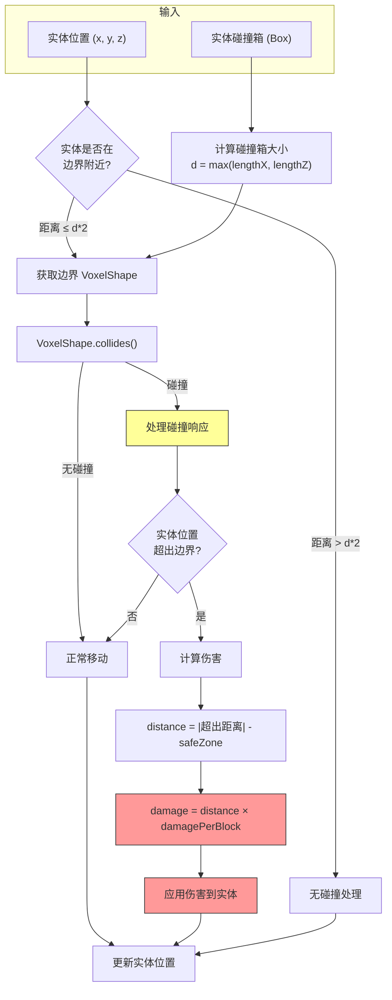
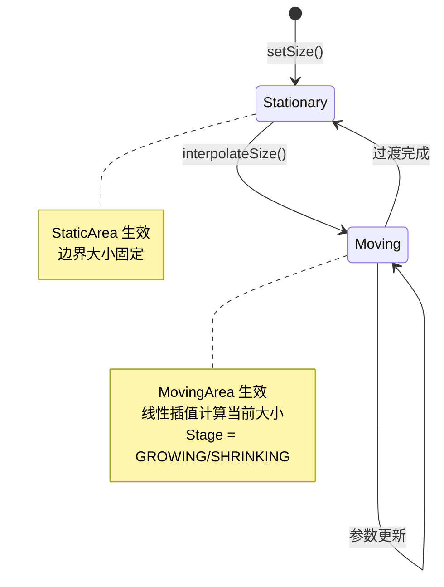
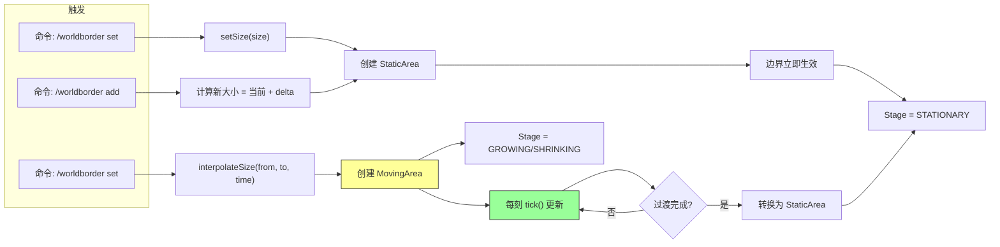

# Minecraft 1.21 世界边界系统深度分析

> 基于 CFR 0.2.2 反编译源代码的世界边界系统完整分析
> 版本信息: Protocol 767, World Version 3953

---

## 1. 概述

**世界边界（WorldBorder）** 是 Minecraft 中用于定义世界可活动范围的机制。它决定了玩家和实体可以移动的区域，超出边界会持续受到伤害。世界边界系统是游戏世界管理的重要组成部分，涉及到碰撞检测、伤害计算、状态同步等多个子系统。

### 1.1 世界边界系统的核心职责

| 职责 | 说明 |
|------|------|
| **范围限制** | 定义世界的水平和垂直边界 |
| **碰撞检测** | 检测实体是否超出边界 |
| **伤害计算** | 对超出边界的实体造成持续伤害 |
| **状态管理** | 支持边界的动态缩放和移动 |
| **客户端同步** | 将边界状态同步到所有客户端 |

### 1.2 架构总览

```
┌─────────────────────────────────────────────────────────────────────────────┐
│                         世界边界系统核心架构                                  │
├─────────────────────────────────────────────────────────────────────────────┤
│                                                                             │
│  ┌──────────────────────────────────────────────────────────────────────┐  │
│  │                          WorldBorder                                  │  │
│  │  - 边界状态管理                                                        │  │
│  │  - Area 接口（StaticArea / MovingArea）                                │  │
│  │  - Listener 列表                                                       │  │
│  │  - 伤害和安全区参数                                                     │  │
│  └──────────────────────────────────────────────────────────────────────┘  │
│                                    │                                        │
│                                    ▼                                        │
│  ┌──────────────────────────────────────────────────────────────────────┐  │
│  │                    Area 接口（策略模式）                               │  │
│  │  ┌────────────────────┐  ┌────────────────────┐                      │  │
│  │  │    StaticArea      │  │    MovingArea      │                      │  │
│  │  │   (静态边界)        │  │   (动态边界)        │                      │  │
│  │  │  - 固定大小         │  │  - 插值计算         │                      │  │
│  │  │  - 立即生效         │  │  - 平滑过渡         │                      │  │
│  │  └────────────────────┘  └────────────────────┘                      │  │
│  └──────────────────────────────────────────────────────────────────────┘  │
│                                    │                                        │
│                                    ▼                                        │
│  ┌──────────────────────────────────────────────────────────────────────┐  │
│  │                    WorldBorderStage 枚举                              │  │
│  │  ┌────────────────┐  ┌────────────────┐  ┌────────────────┐          │  │
│  │  │   GROWING      │  │   SHRINKING    │  │   STATIONARY   │          │  │
│  │  │   (绿色)        │  │   (红色)        │  │   (蓝色)        │          │  │
│  │  │   边界扩大中     │  │   边界收缩中     │  │   静止状态      │          │  │
│  │  └────────────────┘  └────────────────┘  └────────────────┘          │  │
│  └──────────────────────────────────────────────────────────────────────┘  │
│                                    │                                        │
│                                    ▼                                        │
│  ┌──────────────────────────────────────────────────────────────────────┐  │
│  │                    WorldBorderListener 接口                           │  │
│  │  - onSizeChange: 边界大小改变                                          │  │
│  │  - onInterpolateSize: 边界平滑过渡                                     │  │
│  │  - onCenterChanged: 边界中心改变                                        │  │
│  │  - onWarningTimeChanged: 警告时间改变                                   │  │
│  │  - onWarningBlocksChanged: 警告距离改变                                │  │
│  └──────────────────────────────────────────────────────────────────────┘  │
│                                                                             │
└─────────────────────────────────────────────────────────────────────────────┘
```

---

## 2. 核心类结构

### 2.1 WorldBorder 类

`WorldBorder.java` 是世界边界系统的核心类，负责管理边界的所有属性和状态：

```net/minecraft/world/border/WorldBorder.java
public class WorldBorder {
    // ═══════════════════════════════════════════════════════════════════════
    // 常量
    // ═══════════════════════════════════════════════════════════════════════
    
    /** 静态区域大小上限（接近 6000 万） */
    public static final double STATIC_AREA_SIZE = 5.9999968E7;
    
    /** 中心坐标最大值（接近 3000 万） */
    public static final double MAX_CENTER_COORDINATES = 2.9999984E7;
    
    // ═══════════════════════════════════════════════════════════════════════
    // 边界参数
    // ═══════════════════════════════════════════════════════════════════════
    
    /** 每格伤害（默认 0.2 心） */
    private double damagePerBlock = 0.2;
    
    /** 安全区宽度（默认 5 格） */
    private double safeZone = 5.0;
    
    /** 警告时间（默认 15 tick） */
    private int warningTime = 15;
    
    /** 警告距离（默认 5 格） */
    private int warningBlocks = 5;
    
    /** 边界中心 X 坐标 */
    private double centerX;
    
    /** 边界中心 Z 坐标 */
    private double centerZ;
    
    /** 最大半径（默认 29999984） */
    int maxRadius = 29999984;
    
    /** 当前边界区域实现 */
    private Area area = new StaticArea(5.9999968E7);
    
    // ═══════════════════════════════════════════════════════════════════════
    // 监听器
    // ═══════════════════════════════════════════════════════════════════════
    
    /** 边界状态变更监听器列表 */
    private final List<WorldBorderListener> listeners = Lists.newArrayList();
    
    // ═══════════════════════════════════════════════════════════════════════
    // 边界查询方法
    // ═══════════════════════════════════════════════════════════════════════
    
    /**
     * 检查点是否在边界内
     */
    public boolean contains(double x, double z, double margin) {
        return x >= this.getBoundWest() - margin 
            && x < this.getBoundEast() + margin 
            && z >= this.getBoundNorth() - margin 
            && z < this.getBoundSouth() + margin;
    }
    
    /**
     * 计算实体在边界外的距离
     */
    public double getDistanceInsideBorder(double x, double z) {
        double d = z - this.getBoundNorth();
        double e = this.getBoundSouth() - z;
        double f = x - this.getBoundWest();
        double g = this.getBoundEast() - x;
        double h = Math.min(f, g);
        h = Math.min(h, d);
        return Math.min(h, e);
    }
    
    /**
     * 夹紧位置到边界内
     */
    public BlockPos clamp(double x, double y, double z) {
        return BlockPos.ofFloored(
            MathHelper.clamp(x, this.getBoundWest(), this.getBoundEast() - 1.0),
            y,
            MathHelper.clamp(z, this.getBoundNorth(), this.getBoundSouth() - 1.0)
        );
    }
    
    // ═══════════════════════════════════════════════════════════════════════
    // 边界修改方法
    // ═══════════════════════════════════════════════════════════════════════
    
    /**
     * 设置边界中心
     */
    public void setCenter(double x, double z) {
        this.centerX = x;
        this.centerZ = z;
        this.area.onCenterChanged();
        for (WorldBorderListener listener : this.getListeners()) {
            listener.onCenterChanged(this, x, z);
        }
    }
    
    /**
     * 设置边界大小（立即生效）
     */
    public void setSize(double size) {
        this.area = new StaticArea(size);
        for (WorldBorderListener listener : this.getListeners()) {
            listener.onSizeChange(this, size);
        }
    }
    
    /**
     * 平滑过渡边界大小
     */
    public void interpolateSize(double fromSize, double toSize, long time) {
        this.area = fromSize == toSize 
            ? new StaticArea(toSize) 
            : new MovingArea(fromSize, toSize, time);
        for (WorldBorderListener listener : this.getListeners()) {
            listener.onInterpolateSize(this, fromSize, toSize, time);
        }
    }
    
    /**
     * 每刻更新边界状态
     */
    public void tick() {
        this.area = this.area.getAreaInstance();
    }
}
```

### 2.2 Area 接口（策略模式）

`Area` 是一个内部接口，用于实现不同的边界状态计算策略：

```net/minecraft/world/border/WorldBorder.java
static interface Area {
    // 边界坐标查询
    double getBoundWest();
    double getBoundEast();
    double getBoundNorth();
    double getBoundSouth();
    
    // 尺寸信息
    double getSize();
    double getShrinkingSpeed();
    
    // 插值信息
    long getSizeLerpTime();
    double getSizeLerpTarget();
    
    // 状态
    WorldBorderStage getStage();
    
    // 回调
    void onMaxRadiusChanged();
    void onCenterChanged();
    
    // 实例获取
    Area getAreaInstance();
    
    // VoxelShape
    VoxelShape asVoxelShape();
}
```

### 2.3 WorldBorderStage 枚举

`WorldBorderStage` 定义了边界的当前状态：

```net/minecraft/world/border/WorldBorderStage.java
public enum WorldBorderStage {
    GROWING(4259712),      // 绿色 (0x0040C0)
    SHRINKING(0xFF3030),   // 红色
    STATIONARY(2138367);   // 蓝色

    private final int color;

    private WorldBorderStage(int color) {
        this.color = color;
    }

    public int getColor() {
        return this.color;
    }
}
```

### 2.4 WorldBorderListener 接口

`WorldBorderListener` 定义了边界状态变更的回调接口：

```net/minecraft/world/border/WorldBorderListener.java
public interface WorldBorderListener {
    void onSizeChange(WorldBorder border, double size);
    void onInterpolateSize(WorldBorder border, double fromSize, double toSize, long time);
    void onCenterChanged(WorldBorder border, double centerX, double centerZ);
    void onWarningTimeChanged(WorldBorder border, int warningTime);
    void onWarningBlocksChanged(WorldBorder border, int warningBlockDistance);
    void onDamagePerBlockChanged(WorldBorder border, double damagePerBlock);
    void onSafeZoneChanged(WorldBorder border, double safeZoneRadius);
}
```

---

## 3. 边界尺寸管理

### 3.1 静态边界 (StaticArea)

`StaticArea` 用于固定的边界大小，所有边界坐标直接根据中心点和大小计算：

```net/minecraft/world/border/WorldBorder.java
class StaticArea implements Area {
    private final double size;
    private double boundWest;
    private double boundNorth;
    private double boundEast;
    private double boundSouth;
    private VoxelShape shape;

    public StaticArea(double size) {
        this.size = size;
        this.recalculateBounds();
    }

    private void recalculateBounds() {
        // 根据中心点和大小计算四个边界
        this.boundWest = MathHelper.clamp(
            WorldBorder.this.getCenterX() - this.size / 2.0,
            (double)(-WorldBorder.this.maxRadius),
            (double)WorldBorder.this.maxRadius
        );
        
        this.boundNorth = MathHelper.clamp(
            WorldBorder.this.getCenterZ() - this.size / 2.0,
            (double)(-WorldBorder.this.maxRadius),
            (double)WorldBorder.this.maxRadius
        );
        
        this.boundEast = MathHelper.clamp(
            WorldBorder.this.getCenterX() + this.size / 2.0,
            (double)(-WorldBorder.this.maxRadius),
            (double)WorldBorder.this.maxRadius
        );
        
        this.boundSouth = MathHelper.clamp(
            WorldBorder.this.getCenterZ() + this.size / 2.0,
            (double)(-WorldBorder.this.maxRadius),
            (double)WorldBorder.this.maxRadius
        );
        
        // 创建 VoxelShape 用于碰撞检测
        this.shape = VoxelShapes.combineAndSimplify(
            VoxelShapes.UNBOUNDED,
            VoxelShapes.cuboid(
                Math.floor(this.getBoundWest()),
                Double.NEGATIVE_INFINITY,
                Math.floor(this.getBoundNorth()),
                Math.ceil(this.getBoundEast()),
                Double.POSITIVE_INFINITY,
                Math.ceil(this.getBoundSouth())
            ),
            BooleanBiFunction.ONLY_FIRST
        );
    }

    @Override
    public WorldBorderStage getStage() {
        return WorldBorderStage.STATIONARY;
    }

    @Override
    public double getShrinkingSpeed() {
        return 0.0;  // 静止状态，速度为 0
    }

    @Override
    public Area getAreaInstance() {
        return this;  // 返回自身
    }
}
```

### 3.2 动态边界 (MovingArea)

`MovingArea` 用于边界平滑缩放的场景，使用线性插值计算当前大小：

```net/minecraft/world/border/WorldBorder.java
class MovingArea implements Area {
    private final double oldSize;      // 原始大小
    private final double newSize;      // 目标大小
    private final long timeEnd;         // 结束时间（毫秒）
    private final long timeStart;       // 开始时间（毫秒）
    private final double timeDuration;  // 持续时间（毫秒）

    MovingArea(double oldSize, double newSize, long timeDuration) {
        this.oldSize = oldSize;
        this.newSize = newSize;
        this.timeDuration = timeDuration;
        this.timeStart = Util.getMeasuringTimeMs();
        this.timeEnd = this.timeStart + timeDuration;
    }

    @Override
    public double getSize() {
        // 计算插值进度 (0.0 ~ 1.0)
        double d = (double)(Util.getMeasuringTimeMs() - this.timeStart) / this.timeDuration;
        // 线性插值到新大小
        return d < 1.0 ? MathHelper.lerp(d, this.oldSize, this.newSize) : this.newSize;
    }

    @Override
    public double getShrinkingSpeed() {
        // 计算缩放速度（大小变化 / 时间）
        return Math.abs(this.oldSize - this.newSize) / (double)(this.timeEnd - this.timeStart);
    }

    @Override
    public WorldBorderStage getStage() {
        // 根据新旧大小判断是扩大还是收缩
        return this.newSize < this.oldSize 
            ? WorldBorderStage.SHRINKING 
            : WorldBorderStage.GROWING;
    }

    @Override
    public Area getAreaInstance() {
        // 如果过渡完成，返回新的静态区域
        if (this.getSizeLerpTime() <= 0L) {
            return new StaticArea(this.newSize);
        }
        return this;  // 否则继续使用自身
    }
}
```

### 3.3 边界参数详解

| 参数 | 默认值 | 说明 | 范围限制 |
|------|--------|------|----------|
| `damagePerBlock` | 0.2 | 每超出边界 1 格造成的伤害（半颗心） | 0.0 ~ 10.0 |
| `safeZone` | 5.0 | 超出边界后不造成伤害的区域宽度 | 0.0 ~ 10.0 |
| `warningTime` | 15 | 玩家接近边界多少 tick 前开始显示警告 | 0 ~ 15 |
| `warningBlocks` | 5 | 玩家距离边界多少格时显示警告 | 0 ~ 15 |
| `maxRadius` | 29999984 | 边界中心到边界的最大距离 | - |
| `STATIC_AREA_SIZE` | 5.9999968E7 | 静态区域的大小上限 | - |

---

## 4. 边界碰撞检测

### 4.1 碰撞检测核心逻辑

边界碰撞检测主要用于判断实体是否可以与边界交互：

```net/minecraft/world/border/WorldBorder.java
public class WorldBorder {
    
    /**
     * 检测实体是否可能与边界碰撞
     * 用于优化碰撞检测流程
     */
    public boolean canCollide(Entity entity, Box box) {
        // 计算实体和碰撞箱的大小
        double d = Math.max(MathHelper.absMax(box.getLengthX(), box.getLengthZ()), 1.0);
        
        // 检查实体是否在边界内或距离边界过近
        return this.getDistanceInsideBorder(entity) < d * 2.0 
            && this.contains(entity.getX(), entity.getZ(), d);
    }
    
    /**
     * 获取实体在边界外的距离
     * 返回值为负数表示在边界外
     */
    public double getDistanceInsideBorder(Entity entity) {
        return this.getDistanceInsideBorder(entity.getX(), entity.getZ());
    }
    
    public double getDistanceInsideBorder(double x, double z) {
        // 计算到各边界的距离
        double d = z - this.getBoundNorth();           // 到北边的距离
        double e = this.getBoundSouth() - z;           // 到南边的距离
        double f = x - this.getBoundWest();            // 到西边的距离
        double g = this.getBoundEast() - x;            // 到东边的距离
        
        // 返回最小距离
        // 正数：在边界内
        // 负数：在边界外（绝对值越大，越远）
        double h = Math.min(f, g);
        h = Math.min(h, d);
        return Math.min(h, e);
    }
    
    /**
     * 检查坐标是否在边界内
     */
    public boolean contains(double x, double z, double margin) {
        return x >= this.getBoundWest() - margin 
            && x < this.getBoundEast() + margin 
            && z >= this.getBoundNorth() - margin 
            && z < this.getBoundSouth() + margin;
    }
    
    /**
     * 将位置夹紧到边界内
     */
    public BlockPos clamp(double x, double y, double z) {
        return BlockPos.ofFloored(
            MathHelper.clamp(x, this.getBoundWest(), this.getBoundEast() - 1.0),
            y,
            MathHelper.clamp(z, this.getBoundNorth(), this.getBoundSouth() - 1.0)
        );
    }
}
```

### 4.2 碰撞检测时序图

```
┌─────────────────────────────────────────────────────────────────────────────┐
│                         边界碰撞检测流程                                      │
├─────────────────────────────────────────────────────────────────────────────┤
│                                                                             │
│  1. 实体移动请求                                                             │
│  ┌─────────────────────────────────────────────────────────────────────┐    │
│  │  Entity.move()                                                      │    │
│  └─────────────────────────────────────────────────────────────────────┘    │
│                                    │                                        │
│                                    ▼                                        │
│  2. 边界碰撞检查                                                             │
│  ┌─────────────────────────────────────────────────────────────────────┐    │
│  │  WorldBorder.canCollide(entity, box)                                 │    │
│  │  - 检查距离边界是否 < 实体尺寸 * 2                                    │    │
│  │  - 检查实体是否在边界附近                                            │    │
│  └─────────────────────────────────────────────────────────────────────┘    │
│                                    │                                        │
│               ┌────────────────────┼────────────────────┐                   │
│               │                    │                    │                   │
│               ▼                    ▼                    ▼                   │
│  ┌──────────────────┐  ┌──────────────────┐  ┌──────────────────┐        │
│  │   可能在碰撞范围内   │  │   可能在碰撞范围内   │  │     超出碰撞范围    │        │
│  │   进行详细检测       │  │   进行详细检测       │  │     跳过检测       │        │
│  └──────────────────┘  └──────────────────┘  └──────────────────┘        │
│               │                    │                                       │
│               └────────────────────┼────────────────────┘                   │
│                                    ▼                                        │
│  3. 获取边界 VoxelShape                                                         │
│  ┌─────────────────────────────────────────────────────────────────────┐    │
│  │  WorldBorder.asVoxelShape()                                          │    │
│  │  - Area.asVoxelShape()                                               │    │
│  │  - 返回表示边界区域的 VoxelShape                                      │    │
│  └─────────────────────────────────────────────────────────────────────┘    │
│                                    │                                        │
│                                    ▼                                        │
│  4. VoxelShape 碰撞检测                                                        │
│  ┌─────────────────────────────────────────────────────────────────────┐    │
│  │  VoxelShapes.collides(shape, entityBox)                              │    │
│  │  - 使用 Minecraft 的 VoxelShape 系统                                 │    │
│  │  - 高效的 AABB vs VoxelShape 检测                                    │    │
│  └─────────────────────────────────────────────────────────────────────┘    │
│                                    │                                        │
│               ┌────────────────────┼────────────────────┐                   │
│               │                    │                    │                   │
│               ▼                    ▼                    ▼                   │
│  ┌──────────────────┐  ┌──────────────────┐  ┌──────────────────┐        │
│  │      碰撞         │  │      无碰撞        │  │      夹紧         │        │
│  │  - 处理碰撞响应    │  │  - 正常移动       │  │  - clamp 位置    │        │
│  └──────────────────┘  └──────────────────┘  └──────────────────┘        │
│                                                                             │
└─────────────────────────────────────────────────────────────────────────────┘
```

### 4.3 边界伤害计算

当实体超出边界时，会根据距离计算伤害：

```java
// 伤害计算逻辑（在 LivingEntity.baseTick() 中）
public void applyBorderDamage(Entity entity, WorldBorder border) {
    double distance = border.getDistanceInsideBorder(entity.getX(), entity.getZ());
    
    // 如果在安全区内，不造成伤害
    if (distance >= -border.getSafeZone()) {
        return;
    }
    
    // 计算超出安全区的距离
    double damageDistance = Math.abs(distance) - border.getSafeZone();
    
    // 计算伤害：超出距离 * 每格伤害
    double damage = damageDistance * border.getDamagePerBlock();
    
    // 应用伤害
    entity.damage(DamageSource.WORLD_BORDER, (float) damage);
}
```

**伤害计算公式**：

```
总伤害 = (|超出距离| - 安全区) × 每格伤害

示例：
- damagePerBlock = 0.2
- safeZone = 5.0
- 实体在边界外 10 格

超出安全区的距离 = 10 - 5 = 5
总伤害 = 5 × 0.2 = 1 心（每 tick）
```

---

## 5. 边界阶段 (Border Phases)

### 5.1 WorldBorderStage 状态详解

`WorldBorderStage` 枚举定义了边界的当前状态，用于客户端渲染和状态提示：

| 状态 | 颜色 | 说明 | 触发条件 |
|------|------|------|----------|
| `GROWING` | 绿色 (4259712) | 边界正在扩大 | `newSize > oldSize` |
| `SHRINKING` | 红色 (0xFF3030) | 边界正在收缩 | `newSize < oldSize` |
| `STATIONARY` | 蓝色 (2138367) | 边界静止 | 使用 `StaticArea` |

### 5.2 阶段获取逻辑

```net/minecraft/world/border/WorldBorder.java
public class WorldBorder {
    
    public WorldBorderStage getStage() {
        return this.area.getStage();
    }
    
    // 在 StaticArea 中
    @Override
    public WorldBorderStage getStage() {
        return WorldBorderStage.STATIONARY;
    }
    
    // 在 MovingArea 中
    @Override
    public WorldBorderStage getStage() {
        return this.newSize < this.oldSize 
            ? WorldBorderStage.SHRINKING 
            : WorldBorderStage.GROWING;
    }
}
```

### 5.3 客户端状态同步

客户端根据 `WorldBorderStage` 显示不同颜色的边界效果：

```
┌─────────────────────────────────────────────────────────────────────────────┐
│                         客户端边界状态渲染                                    │
├─────────────────────────────────────────────────────────────────────────────┤
│                                                                             │
│  ┌─────────────────────────────────────────────────────────────────────┐    │
│  │                        服务端发送边界状态                              │    │
│  │  WorldBorderPacket (S2C Packet)                                     │    │
│  │  - currentSize: 当前大小                                             │    │
│  │  - targetSize: 目标大小                                             │    │
│  │  - sizeLerpTime: 过渡时间                                            │    │
│  │  - centerX, centerZ: 边界中心                                        │    │
│  │  - warningTime: 警告时间                                             │    │
│  │  - warningBlocks: 警告距离                                           │    │
│  └─────────────────────────────────────────────────────────────────────┘    │
│                                    │                                        │
│                                    ▼                                        │
│  ┌─────────────────────────────────────────────────────────────────────┐    │
│  │                        客户端接收并更新                                │    │
│  │  ClientWorldBorderHandler.onPacket()                                 │    │
│  │  - 更新客户端 WorldBorder 实例                                        │    │
│  │  - 计算当前阶段                                                      │    │
│  └─────────────────────────────────────────────────────────────────────┘    │
│                                    │                                        │
│                                    ▼                                        │
│  ┌─────────────────────────────────────────────────────────────────────┐    │
│  │                        渲染边界效果                                    │    │
│  │  Border Effect = getStage().getColor()                               │    │
│  │  - GROWING: 绿色渐变效果                                             │    │
│  │  - SHRINKING: 红色脉冲效果                                            │    │
│  │  - STATIONARY: 蓝色静态效果                                           │    │
│  └─────────────────────────────────────────────────────────────────────┘    │
│                                                                             │
└─────────────────────────────────────────────────────────────────────────────┘
```

### 5.4 警告系统参数

警告系统会在玩家接近边界时显示提示信息：

| 参数 | 默认值 | 说明 |
|------|--------|------|
| `warningTime` | 15 | 当边界在 N tick 后会到达玩家位置时开始警告 |
| `warningBlocks` | 5 | 当玩家距离边界 N 格时开始警告 |

**警告触发条件**：

```
显示警告 = (
    当前边界位置 - 玩家位置 <= 边界速度 × warningTime
) OR (
    玩家位置 - 边界位置 <= warningBlocks
)
```

---

## 6. 边界命令

### 6.1 世界边界相关命令

Minecraft 提供了多个用于管理世界边界的命令：

| 命令 | 说明 | 示例 |
|------|------|------|
| `/worldborder` | 主命令 | `/worldborder` |
| `/worldborder add <size>` | 添加边界大小 | `/worldborder add 100` |
| `/worldborder center <x> <z>` | 设置边界中心 | `/worldborder center 0 0` |
| `/worldborder damage <amount>` | 设置每格伤害 | `/worldborder damage 0.5` |
| `/worldborder get` | 获取当前大小 | `/worldborder get` |
| `/worldborder set <size>` | 设置边界大小 | `/worldborder set 10000` |
| `/worldborder setbuffer <size>` | 设置安全区 | `/worldborder setbuffer 3` |
| `/worldborder warningtime <time>` | 设置警告时间 | `/worldborder warningtime 10` |
| `/worldborder warningdistance <dist>` | 设置警告距离 | `/worldborder warningdistance 10` |

### 6.2 命令实现分析

```java
// 世界边界命令执行器（伪代码）
public class WorldBorderCommand {
    
    /**
     * 设置边界大小
     * /worldborder set <size> [time]
     */
    public void setSize(CommandSource source, double size, @Optional Long time) {
        WorldBorder border = source.getWorld().getWorldBorder();
        
        if (time != null && time > 0) {
            // 平滑过渡模式
            border.interpolateSize(border.getSize(), size, time * 1000);  // 秒转毫秒
            source.sendFeedback("World border is transitioning to " + size + " blocks");
        } else {
            // 立即设置模式
            border.setSize(size);
            source.sendFeedback("World border set to " + size + " blocks");
        }
    }
    
    /**
     * 添加边界大小
     * /worldborder add <size> [time]
     */
    public void addSize(CommandSource source, double size, @Optional Long time) {
        WorldBorder border = source.getWorld().getWorldBorder();
        double currentSize = border.getSize();
        setSize(source, currentSize + size, time);
    }
    
    /**
     * 获取当前边界大小
     * /worldborder get
     */
    public void getSize(CommandSource source) {
        WorldBorder border = source.getWorld().getWorldBorder();
        double size = border.getSize();
        long remainingTime = border.getSizeLerpTime();
        
        if (remainingTime > 0) {
            source.sendFeedback(
                String.format("World border is %.0f blocks wide (%s to %.0f, %.0f seconds remaining)",
                    border.getSize(),
                    border.getStage(),
                    border.getSizeLerpTarget(),
                    remainingTime / 1000.0
                )
            );
        } else {
            source.sendFeedback("World border is " + size + " blocks wide");
        }
    }
}
```

---

## 7. 边界状态同步

### 7.1 服务端到客户端同步

世界边界状态通过网络数据包同步到客户端：

```net/minecraft/world/border/WorldBorderListener.java
/**
 * WorldBorderSyncer - 用于同步边界状态的监听器实现
 */
public static class WorldBorderSyncer implements WorldBorderListener {
    private final WorldBorder border;

    @Override
    public void onSizeChange(WorldBorder border, double size) {
        this.border.setSize(size);
    }

    @Override
    public void onInterpolateSize(WorldBorder border, double fromSize, double toSize, long time) {
        this.border.interpolateSize(fromSize, toSize, time);
    }

    @Override
    public void onCenterChanged(WorldBorder border, double centerX, double centerZ) {
        this.border.setCenter(centerX, centerZ);
    }

    @Override
    public void onWarningTimeChanged(WorldBorder border, int warningTime) {
        this.border.setWarningTime(warningTime);
    }

    @Override
    public void onWarningBlocksChanged(WorldBorder border, int warningBlockDistance) {
        this.border.setWarningBlocks(warningBlockDistance);
    }

    @Override
    public void onDamagePerBlockChanged(WorldBorder border, double damagePerBlock) {
        this.border.setDamagePerBlock(damagePerBlock);
    }

    @Override
    public void onSafeZoneChanged(WorldBorder border, double safeZoneRadius) {
        this.border.setSafeZone(safeZoneRadius);
    }
}
```

### 7.2 同步数据包格式

```
┌─────────────────────────────────────────────────────────────────────────────┐
│                         世界边界同步数据包                                    │
├─────────────────────────────────────────────────────────────────────────────┤
│                                                                             │
│  字段                    类型        说明                                    │
│  ───────────────────────────────────────────────────────────────────────── │
│  currentSize            double      当前边界大小                             │
│  targetSize             double      目标大小（用于平滑过渡）                  │
│  sizeLerpTime           long        过渡开始时间戳（毫秒）                    │
│  centerX                double      边界中心 X 坐标                          │
│  centerZ                double      边界中心 Z 坐标                          │
│  warningTime            int         警告时间（tick）                         │
│  warningBlocks          int         警告距离（格）                           │
│                                                                             │
└─────────────────────────────────────────────────────────────────────────────┘
```

### 7.3 NBT 序列化

世界边界状态会被保存到世界数据中：

```net/minecraft/world/border/WorldBorder.java
public static class Properties {
    // NBT 序列化
    public void writeNbt(NbtCompound nbt) {
        nbt.putDouble("BorderCenterX", this.centerX);
        nbt.putDouble("BorderCenterZ", this.centerZ);
        nbt.putDouble("BorderSize", this.size);
        nbt.putLong("BorderSizeLerpTime", this.sizeLerpTime);
        nbt.putDouble("BorderSizeLerpTarget", this.sizeLerpTarget);
        nbt.putDouble("BorderSafeZone", this.safeZone);
        nbt.putDouble("BorderDamagePerBlock", this.damagePerBlock);
        nbt.putDouble("BorderWarningBlocks", this.warningBlocks);
        nbt.putDouble("BorderWarningTime", this.warningTime);
    }
    
    // NBT 反序列化
    public static Properties fromDynamic(DynamicLike<?> dynamic, Properties defaults) {
        double centerX = MathHelper.clamp(
            dynamic.get("BorderCenterX").asDouble(defaults.centerX), 
            -2.9999984E7, 
            2.9999984E7
        );
        // ... 其他字段类似处理
    }
}
```

---

## 8. 源码分析

### 8.1 WorldBorder 完整结构图

```
WorldBorder
├── 字段
│   ├── STATIC_AREA_SIZE = 5.9999968E7
│   ├── MAX_CENTER_COORDINATES = 2.9999984E7
│   ├── listeners: List<WorldBorderListener>
│   ├── damagePerBlock: double
│   ├── safeZone: double
│   ├── warningTime: int
│   ├── warningBlocks: int
│   ├── centerX: double
│   ├── centerZ: double
│   ├── maxRadius: int
│   └── area: Area
│
├── Area 接口
│   ├── StaticArea (内部类)
│   │   ├── size: double
│   │   ├── boundWest/East/North/South: double
│   │   └── shape: VoxelShape
│   │
│   └── MovingArea (内部类)
│       ├── oldSize: double
│       ├── newSize: double
│       ├── timeStart: long
│       ├── timeEnd: long
│       └── timeDuration: double
│
├── Properties (内部类)
│   ├── 边界属性集合
│   └── fromDynamic() / writeNbt()
│
└── 核心方法
    ├── contains() - 边界包含检测
    ├── clamp() - 位置夹紧
    ├── getDistanceInsideBorder() - 获取超出距离
    ├── setCenter() / setSize() / interpolateSize() - 状态修改
    └── tick() - 每刻更新
```

### 8.2 边界 Tick 更新流程

```net/minecraft/world/border/WorldBorder.java
public class WorldBorder {
    
    /**
     * 世界每刻调用此方法更新边界状态
     */
    public void tick() {
        // 获取当前的 Area 实例
        // 对于 MovingArea：如果过渡完成，返回新的 StaticArea
        // 对于 StaticArea：返回自身
        this.area = this.area.getAreaInstance();
    }
}
```

### 8.3 默认边界属性

```net/minecraft/world/border/WorldBorder.java
public class WorldBorder {
    /**
     * 默认边界属性常量
     * 用于世界生成时的初始化
     */
    public static final Properties DEFAULT_BORDER = new Properties(
        0.0,                          // centerX
        0.0,                          // centerZ
        0.2,                          // damagePerBlock
        5.0,                          // safeZone
        5,                            // warningBlocks
        15,                           // warningTime
        5.9999968E7,                  // size (6000万)
        0L,                           // sizeLerpTime
        0.0                           // sizeLerpTarget
    );
}
```

---

## 9. Mermaid 流程图

### 9.1 边界碰撞检测流程图



### 9.2 边界状态转换图



### 9.3 边界缩放流程图



---

## 10. 自定义世界边界

### 10.1 获取和修改世界边界

```java
// 获取世界边界
public class WorldBorderExamples {
    
    /**
     * 获取世界边界
     */
    public static void getWorldBorder(ServerWorld world) {
        WorldBorder border = world.getWorldBorder();
        
        System.out.println("当前边界大小: " + border.getSize());
        System.out.println("边界中心: (" + border.getCenterX() + ", " + border.getCenterZ() + ")");
        System.out.println("边界状态: " + border.getStage());
        System.out.println("每格伤害: " + border.getDamagePerBlock());
        System.out.println("安全区: " + border.getSafeZone());
    }
    
    /**
     * 设置静态边界
     */
    public static void setStaticBorder(ServerWorld world, double size) {
        WorldBorder border = world.getWorldBorder();
        border.setSize(size);
    }
    
    /**
     * 设置平滑过渡边界
     */
    public static void setTransitioningBorder(ServerWorld world, 
                                               double targetSize, 
                                               long durationMs) {
        WorldBorder border = world.getWorldBorder();
        double currentSize = border.getSize();
        border.interpolateSize(currentSize, targetSize, durationMs);
    }
    
    /**
     * 设置边界中心
     */
    public static void setBorderCenter(ServerWorld world, double x, double z) {
        WorldBorder border = world.getWorldBorder();
        border.setCenter(x, z);
    }
}
```

### 10.2 自定义边界监听器

```java
/**
 * 自定义世界边界监听器
 * 用于响应边界状态变化
 */
public class CustomBorderListener implements WorldBorderListener {
    private final ServerWorld world;
    private final Logger logger = LoggerFactory.getLogger(CustomBorderListener.class);
    
    public CustomBorderListener(ServerWorld world) {
        this.world = world;
    }
    
    @Override
    public void onSizeChange(WorldBorder border, double size) {
        logger.info("世界边界大小改变为: {} 区块", size / 16);
        broadcastToPlayers("世界边界已设置为 " + size + " 块！");
    }
    
    @Override
    public void onInterpolateSize(WorldBorder border, double fromSize, 
                                    double toSize, long time) {
        logger.info("世界边界开始平滑过渡: {} -> {} ({}ms)", 
                    fromSize, toSize, time);
        broadcastToPlayers("世界边界正在" + 
            (toSize < fromSize ? "收缩" : "扩大") + 
            "至 " + toSize + " 块！");
    }
    
    @Override
    public void onCenterChanged(WorldBorder border, double centerX, double centerZ) {
        logger.info("世界边界中心改变为: ({}, {})", centerX, centerZ);
    }
    
    @Override
    public void onWarningTimeChanged(WorldBorder border, int warningTime) {
        logger.info("警告时间改变为: {} tick", warningTime);
    }
    
    @Override
    public void onWarningBlocksChanged(WorldBorder border, int warningBlocks) {
        logger.info("警告距离改变为: {} 格", warningBlocks);
    }
    
    @Override
    public void onDamagePerBlockChanged(WorldBorder border, double damagePerBlock) {
        logger.info("每格伤害改变为: {}", damagePerBlock);
    }
    
    @Override
    public void onSafeZoneChanged(WorldBorder border, double safeZoneRadius) {
        logger.info("安全区改变为: {} 格", safeZoneRadius);
    }
    
    private void broadcastToPlayers(String message) {
        for (ServerPlayerEntity player : world.getPlayers()) {
            player.sendMessage(Component.literal(message));
        }
    }
}

// 注册监听器
public class BorderMod implements ServerLifecycleEvents.ServerStarted {
    @Override
    public void onServerStarted(MinecraftServer server) {
        for (ServerWorld world : server.getWorlds()) {
            CustomBorderListener listener = new CustomBorderListener(world);
            world.getWorldBorder().addListener(listener);
        }
    }
}
```

### 10.3 边界状态检测

```java
/**
 * 边界状态检测工具类
 */
public class BorderStatusChecker {
    
    /**
     * 检查实体是否在边界内
     */
    public static boolean isInsideBorder(Entity entity) {
        WorldBorder border = entity.getWorld().getWorldBorder();
        return border.contains(entity.getX(), entity.getZ());
    }
    
    /**
     * 获取实体超出边界的距离
     * 返回值 > 0: 在边界内，距离边界最近边的距离
     * 返回值 < 0: 在边界外，超出边界的距离
     */
    public static double getDistanceFromBorder(Entity entity) {
        WorldBorder border = entity.getWorld().getWorldBorder();
        return border.getDistanceInsideBorder(entity.getX(), entity.getZ());
    }
    
    /**
     * 计算实体将受到的单位伤害
     */
    public static float calculateBorderDamage(Entity entity) {
        WorldBorder border = entity.getWorld().getWorldBorder();
        double distance = border.getDistanceInsideBorder(entity.getX(), entity.getZ());
        double safeZone = border.getSafeZone();
        
        if (distance >= -safeZone) {
            return 0f;  // 在安全区内
        }
        
        double damageDistance = Math.abs(distance) - safeZone;
        return (float)(damageDistance * border.getDamagePerBlock());
    }
    
    /**
     * 获取边界缩放速度（每秒变化的区块数）
     */
    public static double getShrinkingSpeed(WorldBorder border) {
        // getShrinkingSpeed() 返回的是 blocks/ms
        // 转换为每秒
        return border.getShrinkingSpeed() * 1000;
    }
    
    /**
     * 估算实体被边界追上所需时间
     */
    public static long estimateTimeUntilBorderReaches(WorldBorder border, 
                                                       Vec3d entityPos) {
        double distance = border.getDistanceInsideBorder(entityPos.x, entityPos.z);
        
        if (distance >= 0) {
            return -1;  // 实体在边界内
        }
        
        double speed = border.getShrinkingSpeed();
        if (speed <= 0) {
            return -1;  // 边界静止
        }
        
        // 计算追上时间（毫秒）
        return (long)(Math.abs(distance) / speed);
    }
}
```

### 10.4 模组集成示例

```java
/**
 * 创建一个会收缩的世界边界模组
 */
public class ShrinkingBorderMod implements ServerTickEvents.EndTick {
    
    private static final double SHRINK_RATE = 10.0;  // 每秒收缩 10 格
    private static final double MIN_SIZE = 100.0;    // 最小边界大小
    private static final double TARGET_TIME_MS = 30 * 60 * 1000;  // 30 分钟
    
    @Override
    public void onEndTick(MinecraftServer server) {
        for (ServerWorld world : server.getWorlds()) {
            WorldBorder border = world.getWorldBorder();
            
            // 获取当前状态
            double currentSize = border.getSize();
            WorldBorderStage stage = border.getStage();
            
            // 检查是否应该开始收缩
            if (stage == WorldBorderStage.STATIONARY && currentSize > MIN_SIZE) {
                // 计算收缩后的目标大小
                double targetSize = Math.max(currentSize - SHRINK_RATE, MIN_SIZE);
                
                // 开始平滑过渡（每秒更新一次）
                border.interpolateSize(currentSize, targetSize, 1000);
            }
        }
    }
}
```

---

## 11. 总结

### 11.1 世界边界系统核心要点

1. **双策略模式**：通过 `StaticArea` 和 `MovingArea` 实现固定和动态两种边界状态
2. **线性插值**：使用 `MathHelper.lerp()` 实现平滑的边界过渡
3. **VoxelShape 碰撞**：利用 Minecraft 的 VoxelShape 系统进行高效的碰撞检测
4. **观察者模式**：通过 `WorldBorderListener` 机制实现状态同步
5. **NBT 持久化**：完整的序列化/反序列化支持

### 11.2 边界参数速查表

| 参数 | 含义 | 默认值 | 命令 |
|------|------|--------|------|
| `size` | 边界直径 | 59999968 | `/worldborder set/add` |
| `centerX/Z` | 边界中心 | 0, 0 | `/worldborder center` |
| `damagePerBlock` | 每格伤害 | 0.2 | `/worldborder damage` |
| `safeZone` | 安全区宽度 | 5.0 | `/worldborder setbuffer` |
| `warningTime` | 警告时间 | 15 | `/worldborder warningtime` |
| `warningBlocks` | 警告距离 | 5 | `/worldborder warningdistance` |

### 11.3 与旧版本对比 (1.20 vs 1.21)

| 特性 | 1.20.x | 1.21 |
|------|--------|------|
| 边界实现 | 单一边界类 | Area 接口 + 策略模式 |
| 过渡动画 | 基本支持 | 平滑线性插值 |
| 碰撞检测 | AABB 检测 | VoxelShape 系统 |
| 状态同步 | 基础同步 | 带 WorldBorderSyncer |
| NBT 格式 | 兼容 | 兼容 |

---

**参考源码路径**：

- `D:\Minecraft-Learning\assets\mc\1.21\net\minecraft\world\border\WorldBorder.java`
- `D:\Minecraft-Learning\assets\mc\1.21\net\minecraft\world\border\WorldBorderListener.java`
- `D:\Minecraft-Learning\assets\mc\1.21\net\minecraft\world\border\WorldBorderStage.java`

---

*文档版本: 1.0*
*更新时间: 2026-03-25*
*基于 Minecraft 1.21 源码 (Protocol 767)*
