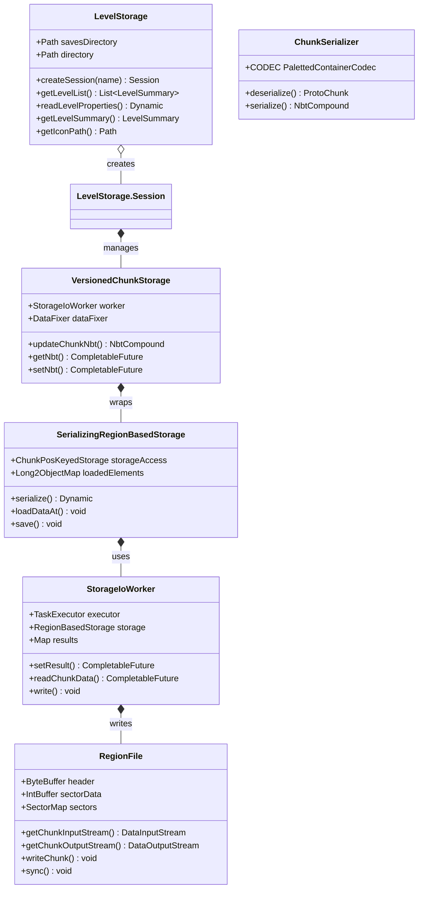
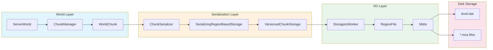
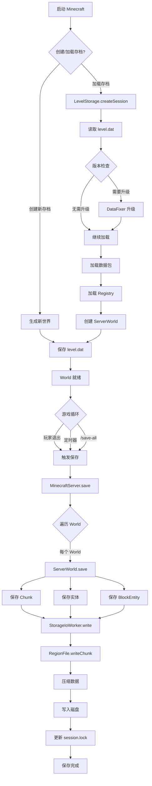
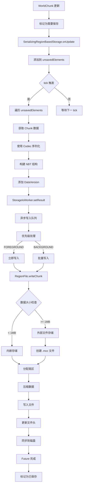
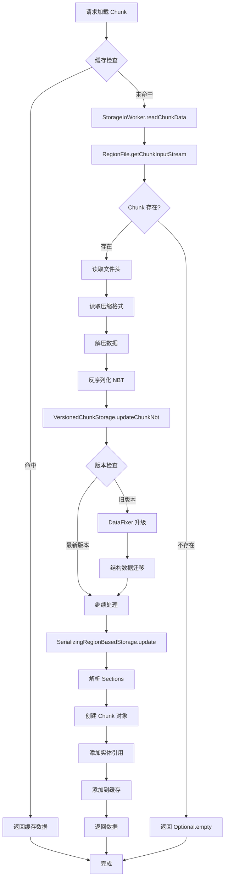

# Minecraft 1.21 存档系统 (World Save System)

> 基于 CFR 0.2.2 反编译源代码的存档系统完整分析
> 版本信息: Protocol 767, World Version 3953

---

## 1. 概述 (Overview)

Minecraft 的存档系统（World Save System）是游戏的核心子系统之一，负责将游戏世界的所有数据持久化到磁盘，并在下次启动时完整恢复。本章将深入分析 1.21 版本中存档系统的架构设计、核心组件和数据流。

### 1.1 存档系统架构

```
┌─────────────────────────────────────────────────────────────────────┐
│                        存档系统核心架构                                │
├─────────────────────────────────────────────────────────────────────┤
│                                                                     │
│  ┌───────────────────────────────────────────────────────────────┐ │
│  │                        顶层入口                                 │ │
│  │              MinecraftServer / IntegratedServer                │ │
│  └─────────────────────────┬─────────────────────────────────────┘ │
│                            │                                        │
│  ┌─────────────────────────┼─────────────────────────────────────┐ │
│  │                         ▼                                     │ │
│  │                    SaveLoading                                 │ │
│  │               (存档加载/保存的编排层)                            │ │
│  └─────────────────────────┬─────────────────────────────────────┘ │
│                            │                                        │
│  ┌─────────────────────────┼─────────────────────────────────────┐ │
│  │                         ▼                                     │ │
│  │                    LevelStorage                               │ │
│  │               (存档目录管理层)                                  │ │
│  └─────────────────────────┬─────────────────────────────────────┘ │
│                            │                                        │
│          ┌─────────────────┼─────────────────┐                    │
│          ▼                 ▼                 ▼                     │
│  ┌───────────────┐ ┌───────────────┐ ┌───────────────┐            │
│  │  World Data   │ │  Chunk Data   │ │ Player Data   │            │
│  │ (level.dat)  │ │ (Region File) │ │  (player/)   │            │
│  └───────────────┘ └───────────────┘ └───────────────┘            │
│                                                                     │
│  ┌───────────────────────────────────────────────────────────────┐ │
│  │                       存储技术栈                               │ │
│  ├───────────────────────────────────────────────────────────────┤ │
│  │  NBT (Named Binary Tag)  │  GZIP/DEFLATE/LZ4  │  Anvil Format │ │
│  └───────────────────────────────────────────────────────────────┘ │
│                                                                     │
└─────────────────────────────────────────────────────────────────────┘
```

### 1.2 核心组件一览

| 组件 | 类路径 | 职责 |
|------|--------|------|
| SaveLoading | `net.minecraft.server.SaveLoading` | 存档加载/保存的编排层 |
| LevelStorage | `net.minecraft.world.level.storage.*` | 存档目录管理和会话管理 |
| VersionedChunkStorage | `net.minecraft.world.storage.VersionedChunkStorage` | Chunk 数据的版本管理 |
| SerializingRegionBasedStorage | `net.minecraft.world.storage.SerializingRegionBasedStorage` | Region 格式的序列化/反序列化 |
| StorageIoWorker | `net.minecraft.world.storage.StorageIoWorker` | 异步 IO 工作器 |
| RegionFile | `net.minecraft.world.storage.RegionFile` | 单个 Region 文件操作 |
| NbtIo | `net.minecraft.nbt.NbtIo` | NBT 格式读写工具 |
| ChunkSerializer | `net.minecraft.world.ChunkSerializer` | Chunk 数据序列化 |

---

## 2. 存档目录结构 (Save Directory Structure)

### 2.1 标准存档目录布局

```
saves/
└── MyWorld/                          # 存档根目录
    ├── level.dat                     # 主世界配置 (GZIP压缩的NBT)
    ├── level.dat_old                 # 上一次存档的备份
    ├── levelname.txt                 # 显示名称
    ├── icon.png                      # 存档图标
    ├── session.lock                  # 会话锁文件
    │
    ├── data/                         # 游戏数据目录
    │   ├── capabilities.json         # 玩家能力数据
    │   ├── advancements/             # 进度数据
    │   │   └── *.json
    │   ├── stats/                    # 统计数据
    │   │   └── *.json
    │   └── custombossevents/         # 自定义Boss事件
    │       └── *.json
    │
    ├── advancements/                # 进度定义 (旧格式)
    ├── stats/                        # 统计定义 (旧格式)
    │
    ├── playerdata/                   # 玩家数据目录
    │   └── <uuid>.dat                # 每个玩家的数据文件
    │
    ├── serverconfig/                 # 服务器配置
    │   └── *.json
    │
    ├── resources.zip                # 资源包 (可选)
    │
    ├── DIM1/                        # 下界 (The Nether)
    │   └── region/
    │       └── r.<x>.<z>.mca        # Region 文件
    │
    ├── DIM-1/                       # 末地 (The End)
    │   └── region/
    │       └── r.<x>.<z>.mca
    │
    └── region/                       # 主世界 Region 文件
        ├── r.0.0.mca
        ├── r.0.1.mca
        ├── r.1.0.mca
        └── ...
```

### 2.2 level.dat 结构

`level.dat` 是存档的核心配置文件，包含世界的所有基本设置：

```java
// net.minecraft.world.SaveProperties
public interface SaveProperties {
    // 存储格式标识
    public static final int ANVIL_FORMAT_ID = 19133;    // Anvil 格式 (当前)
    public static final int MCREGION_FORMAT_ID = 19132;  // McRegion 格式 (旧版)
    
    // 核心属性
    public LevelInfo getLevelInfo();           // 世界信息
    public ServerWorldProperties getMainWorldProperties();  // 服务器世界属性
    public GeneratorOptions getGeneratorOptions();  // 生成器选项
    public GameRules getGameRules();           // 游戏规则
    
    // 游戏状态
    public boolean isHardcore();               // 是否硬核模式
    public GameMode getGameMode();              // 游戏模式
    public Difficulty getDifficulty();           // 难度等级
    public long getGameTime();                 // 游戏时间
    public long getTimeOfDay();                // 一天中的时间
    
    // 特殊数据
    public NbtCompound getPlayerData();        // 玩家数据
    public EnderDragonFight.Data getDragonFight();  // 龙战数据
}
```

### 2.3 Region 文件命名规则

Region 文件使用 Anvil 格式，命名规则如下：

```
r.<regionX>.<regionZ>.mca
```

- `regionX = floor(chunkX / 32)`
- `regionZ = floor(chunkZ / 32)`
- 每个 Region 文件包含 32x32 = 1024 个 Chunk

### 2.4 存储键 (StorageKey)

```java
// net.minecraft.world.storage.StorageKey
public record StorageKey(StorageKey.Type type) {
    public enum Type {
        CHUNK_DATA,          // Chunk 主体数据
        ENTITY_DATA,         // 实体数据
        POI_DATA,           // 兴趣点数据
        STRUCTURE_DATA      // 结构数据
    }
}
```

---

## 3. 保存流程 (Save Process)

### 3.1 整体保存流程

```
┌─────────────────────────────────────────────────────────────────────┐
│                         存档保存完整流程                              │
├─────────────────────────────────────────────────────────────────────┤
│                                                                     │
│  1. 触发保存                                                         │
│  ┌─────────────────────────────────────────────────────────────┐   │
│  │  触发条件:                                                   │   │
│  │  - 玩家退出游戏 /allChunks save                             │   │
│  │  - 定时自动保存 (默认 5 分钟)                                 │   │
│  │  - /save-all 命令                                            │   │
│  └─────────────────────────────────────────────────────────────┘   │
│                            │                                        │
│                            ▼                                        │
│  2. MinecraftServer.save()                                          │
│  ┌─────────────────────────────────────────────────────────────┐   │
│  │  save(boolean suppressLogs, boolean flush)                   │   │
│  │                                                             │   │
│  │  - 遍历所有 World (主世界、下界、末地)                         │   │
│  │  - 调用 ServerWorld.save()                                   │   │
│  └─────────────────────────────────────────────────────────────┘   │
│                            │                                        │
│          ┌─────────────────┼─────────────────┐                    │
│          ▼                 ▼                 ▼                     │
│  3. ServerWorld.save()                                            │
│  ┌───────────────┐ ┌───────────────┐ ┌───────────────┐            │
│  │ 保存 Chunk    │ │ 保存实体      │ │ 保存玩家      │            │
│  │ 数据          │ │ 数据          │ │ 数据          │            │
│  └───────┬───────┘ └───────┬───────┘ └───────┬───────┘            │
│          │                 │                 │                      │
│          └─────────────────┼─────────────────┘                    │
│                            ▼                                        │
│  4. SerializingRegionBasedStorage.save()                          │
│  ┌─────────────────────────────────────────────────────────────┐   │
│  │  - 遍历所有未保存的 Chunk                                     │   │
│  │  - 使用 Codec 序列化数据                                     │   │
│  │  - 调用 StorageIoWorker.write()                             │   │
│  └─────────────────────────────────────────────────────────────┘   │
│                            │                                        │
│                            ▼                                        │
│  5. StorageIoWorker.write()                                        │
│  ┌─────────────────────────────────────────────────────────────┐   │
│  │  - 将数据写入缓冲区                                          │   │
│  │  - 异步执行写入操作                                          │   │
│  │  - 支持优先级队列 (FOREGROUND/BACKGROUND)                     │   │
│  └─────────────────────────────────────────────────────────────┘   │
│                            │                                        │
│                            ▼                                        │
│  6. RegionFile.writeChunk()                                        │
│  ┌─────────────────────────────────────────────────────────────┐   │
│  │  - 压缩数据 (使用配置的压缩格式)                               │   │
│  │  - 写入扇区                                                  │   │
│  │  - 更新文件头                                                │   │
│  │  - 同步刷新到磁盘 (DSYNC)                                     │   │
│  └─────────────────────────────────────────────────────────────┘   │
│                                                                     │
└─────────────────────────────────────────────────────────────────────┘
```

### 3.2 Chunk 保存源码分析

```java
// SerializingRegionBasedStorage.java
private <T> Dynamic<T> serialize(ChunkPos chunkPos, DynamicOps<T> ops) {
    HashMap map = Maps.newHashMap();
    
    // 遍历所有区块段落 (Section)
    for (int i = this.world.getBottomSectionCoord(); 
         i < this.world.getTopSectionCoord(); ++i) {
        long l = SerializingRegionBasedStorage.chunkSectionPosAsLong(chunkPos, i);
        
        // 从未保存队列中移除
        this.unsavedElements.remove(l);
        
        // 获取加载的数据
        Optional optional = (Optional)this.loadedElements.get(l);
        if (optional == null || optional.isEmpty()) continue;
        
        // 使用 Codec 编码
        DataResult<T> dataResult = this.codecFactory.apply(() -> this.onUpdate(l))
            .encodeStart(ops, optional.get());
        
        String string = Integer.toString(i);
        dataResult.resultOrPartial(LOGGER::error)
            .ifPresent(object -> map.put(ops.createString(string), object));
    }
    
    // 创建包含版本信息的 NBT 结构
    return new Dynamic<T>(ops, ops.createMap(ImmutableMap.of(
        ops.createString(SECTIONS_KEY), ops.createMap(map),
        ops.createString("DataVersion"), 
            ops.createInt(SharedConstants.getGameVersion().getSaveVersion().getId())
    )));
}
```

### 3.3 StorageIoWorker 异步写入

```java
// StorageIoWorker.java
public class StorageIoWorker implements NbtScannable, AutoCloseable {
    private final TaskExecutor<TaskQueue.PrioritizedTask> executor;
    private final RegionBasedStorage storage;
    private final Map<ChunkPos, Result> results = Maps.newLinkedHashMap();
    
    // 优先级队列
    static enum Priority {
        FOREGROUND,   // 前台任务 - 立即执行
        BACKGROUND,   // 后台任务 - 批量执行
        SHUTDOWN;     // 关闭任务 - 最后执行
    }
    
    // 异步设置 Chunk 结果
    public CompletableFuture<Void> setResult(ChunkPos pos, @Nullable NbtCompound nbt) {
        return this.run(() -> {
            Result result = this.results.computeIfAbsent(pos, pos2 -> new Result(nbt));
            result.nbt = nbt;
            return Either.left(result.future);
        }).thenCompose(Function.identity());
    }
    
    // 异步写入
    private <T> CompletableFuture<T> run(Supplier<Either<T, Exception>> task) {
        return this.executor.askFallible(listener -> 
            new TaskQueue.PrioritizedTask(Priority.FOREGROUND.ordinal(), () -> {
                if (!this.closed.get()) {
                    listener.send((Either)((Supplier)task).get());
                }
                this.writeRemainingResults();  // 触发后台写入
            })
        );
    }
}
```

---

## 4. 加载流程 (Load Process)

### 4.1 整体加载流程

```
┌─────────────────────────────────────────────────────────────────────┐
│                         存档加载完整流程                              │
├─────────────────────────────────────────────────────────────────────┤
│                                                                     │
│  1. 启动服务器                                                       │
│  ┌─────────────────────────────────────────────────────────────┐   │
│  │  MinecraftServer.main() / IntegratedServer.start()          │   │
│  └─────────────────────────────────────────────────────────────┘   │
│                            │                                        │
│                            ▼                                        │
│  2. SaveLoading.load()                                            │
│  ┌─────────────────────────────────────────────────────────────┐   │
│  │  - 加载数据包 (DataPacks)                                    │   │
│  │  - 加载动态注册表 (Dynamic Registries)                       │   │
│  │  - 创建 LoadContext                                          │   │
│  └─────────────────────────────────────────────────────────────┘   │
│                            │                                        │
│                            ▼                                        │
│  3. LevelStorage.createSession()                                   │
│  ┌─────────────────────────────────────────────────────────────┐   │
│  │  - 锁定会话 (session.lock)                                   │   │
│  │  - 读取 level.dat                                           │   │
│  │  - 验证存档版本                                              │   │
│  └─────────────────────────────────────────────────────────────┘   │
│                            │                                        │
│                            ▼                                        │
│  4. 加载 World 属性                                                 │
│  ┌─────────────────────────────────────────────────────────────┐   │
│  │  LevelProperties properties = session.readLevelProperties() │   │
│  │                                                             │   │
│  │  - 读取 DataVersion                                         │   │
│  │  - 应用 DataFixer 升级 (如果需要)                             │   │
│  │  - 解析所有世界设置                                          │   │
│  └─────────────────────────────────────────────────────────────┘   │
│                            │                                        │
│                            ▼                                        │
│  5. 初始化 World                                                   │
│  ┌─────────────────────────────────────────────────────────────┐   │
│  │  ServerWorld world = new ServerWorld(...)                   │   │
│  │                                                             │   │
│  │  - 初始化 ChunkManager                                      │   │
│  │  - 初始化 DimensionManager                                  │   │
│  │  - 加载或生成 Chunk                                          │   │
│  └─────────────────────────────────────────────────────────────┘   │
│                            │                                        │
│                            ▼                                        │
│  6. 加载 Player 数据                                               │
│  ┌─────────────────────────────────────────────────────────────┐   │
│  │  - 遍历 playerdata/ 目录                                    │   │
│  │  - 为每个玩家加载 .dat 文件                                   │   │
│  │  - 应用 DataFixer 升级                                       │   │
│  │  - 创建 ServerPlayerEntity                                  │   │
│  └─────────────────────────────────────────────────────────────┘   │
│                                                                     │
└─────────────────────────────────────────────────────────────────────┘
```

### 4.2 level.dat 加载源码分析

```java
// IntegratedServerLoader.java
private void start(LevelStorage.Session session, Runnable onCancel) {
    this.client.setScreenAndRender(
        new MessageScreen(Text.translatable("selectWorld.data_read")));
    
    try {
        // 读取 level.dat
        Dynamic<?> dynamic = session.readLevelProperties();
        
        // 获取存档摘要
        LevelSummary levelSummary = session.getLevelSummary(dynamic);
        
        // 检查版本兼容性
        if (!levelSummary.isVersionAvailable()) {
            // 显示版本不兼容提示
            return;
        }
        
        // 检查是否需要备份
        LevelSummary.ConversionWarning warning = levelSummary.getConversionWarning();
        if (warning.promptsBackup()) {
            // 显示备份提示
            return;
        }
        
        // 开始加载
        this.start(session, dynamic, false, onCancel);
        
    } catch (Exception e) {
        // 尝试恢复损坏的存档
        this.client.setScreen(new RecoverWorldScreen(...));
    }
}
```

### 4.3 Chunk 加载源码分析

```java
// SerializingRegionBasedStorage.java
private void loadDataAt(ChunkPos pos) {
    // 异步读取 NBT 数据
    Optional<NbtCompound> optional = this.loadNbt(pos).join();
    
    // 创建 Registry 操作上下文
    RegistryOps<NbtElement> registryOps = this.registryManager.getOps(NbtOps.INSTANCE);
    
    // 更新内存中的数据
    this.update(pos, registryOps, optional.orElse(null));
}

private void update(ChunkPos pos, RegistryOps<NbtElement> ops, @Nullable NbtCompound nbt) {
    if (nbt == null) {
        // 无数据，标记为空
        for (int i = this.world.getBottomSectionCoord(); 
             i < this.world.getTopSectionCoord(); ++i) {
            this.loadedElements.put(
                SerializingRegionBasedStorage.chunkSectionPosAsLong(pos, i), 
                Optional.empty()
            );
        }
    } else {
        // 获取数据版本
        Dynamic<NbtElement> dynamic2 = new Dynamic<NbtElement>(ops, nbt);
        int dataVersion = SerializingRegionBasedStorage.getDataVersion(dynamic2);
        int currentVersion = SharedConstants.getGameVersion().getSaveVersion().getId();
        
        // 检查是否需要升级
        boolean needsUpgrade = dataVersion != currentVersion;
        
        // 应用数据修复 (如果需要)
        Dynamic<NbtElement> dynamic22 = this.storageAccess.update(dynamic2, dataVersion);
        
        // 解析 Sections
        OptionalDynamic<NbtElement> optionalDynamic = dynamic22.get(SECTIONS_KEY);
        for (int l = this.world.getBottomSectionCoord(); 
             l < this.world.getTopSectionCoord(); ++l) {
            long m = chunkSectionPosAsLong(pos, l);
            
            // 使用 Codec 反序列化
            Optional optional = optionalDynamic.get(Integer.toString(l))
                .result()
                .flatMap(dynamic -> 
                    this.codecFactory.apply(() -> this.onUpdate(m))
                        .parse(dynamic)
                        .resultOrPartial(LOGGER::error)
                );
            
            this.loadedElements.put(m, (Optional<R>)optional);
            
            // 触发加载回调
            optional.ifPresent(sections -> {
                this.onLoad(m);
                if (needsUpgrade) {
                    this.onUpdate(m);  // 标记需要重新保存
                }
            });
        }
    }
}
```

---

## 5. LevelStorage 存储管理 (LevelStorage)

### 5.1 LevelStorage 类结构

```java
// net.minecraft.world.level.storage.LevelStorage
public class LevelStorage {
    private final Path savesDirectory;
    private final DataFixer dataFixer;
    private final WrapperLookup registryLookup;
    
    // 创建会话
    public Session createSession(String name) throws IOException {
        // 验证存档名称
        // 创建/打开存档目录
        // 创建 Session 对象
        return new Session(this, directory, options, lockFile);
    }
    
    // 列出所有存档
    public List<LevelSummary> getLevelList() {
        // 扫描 savesDirectory
        // 读取 level.dat
        // 返回存档摘要列表
    }
    
    public static class Session implements AutoCloseable {
        private final LevelStorage storage;
        private final Path directory;
        private final LevelStorageSource levelStorageSource;
        private final Path iconFile;
        
        // 读取 level.dat
        public Dynamic<?> readLevelProperties() throws IOException {
            // 使用 NbtIo 读取
            // 应用 DataFixer
            return parseLevelNbt(rootTag);
        }
        
        // 获取存档摘要
        public LevelSummary getLevelSummary(Dynamic<?> properties) {
            // 解析属性
            // 计算转换警告
            return new LevelSummary(...);
        }
        
        // 打开 World 目录
        public Path getDirectory(WorldSavePath path) {
            return directory.resolve(path.getRelativePath());
        }
    }
}
```

### 5.2 LevelSummary 存档摘要

```java
// net.minecraft.world.level.storage.LevelSummary
public record LevelSummary(
    LevelInfo levelInfo,           // 世界信息
    int dataVersion,               // 数据版本
    boolean valid,                 // 是否有效
    boolean requiresUpgrade,       // 是否需要升级
    ConversionWarning warning,     // 转换警告
    String version,                 // 格式化版本字符串
    long lastPlayed                // 最后游玩时间
) {
    
    // 转换警告级别
    public enum ConversionWarning {
        NONE,           // 无警告
        UPGRADE,        // 需要升级 (旧版本)
        EXPERIMENTAL,   // 实验性功能
        BETA,           // Beta 版本
        ALPHA;          // Alpha 版本
        
        public boolean promptsBackup() {
            return this != NONE;
        }
        
        public boolean isDangerous() {
            return this == BETA || this == ALPHA;
        }
    }
}
```

---

## 6. Chunk 存档 (Chunk Saving)

### 6.1 Anvil 格式结构

Anvil 格式是 Minecraft 当前的 Chunk 存储格式，特点：

| 特性 | 说明 |
|------|------|
| 文件格式 | `.mca` (Minecraft Anvil) |
| 单文件大小 | 32x32 Chunks |
| 压缩 | 可配置 (GZIP/DEFLATE/LZ4) |
| 最大支持 | 单 Chunk 超过 1MB 时使用外部文件 |

### 6.2 RegionFile 源码分析

```java
// net.minecraft.world.storage.RegionFile
public class RegionFile implements AutoCloseable {
    private static final int SECTOR_SIZE = 4096;  // 4KB 扇区
    private static final int CHUNKS_PER_REGION = 32 * 32;  // 1024 chunks
    
    private final ByteBuffer header = ByteBuffer.allocateDirect(8192);
    private final IntBuffer sectorData;    // Chunk 偏移表 (4KB)
    private final IntBuffer saveTimes;     // 保存时间戳 (4KB)
    private final SectorMap sectors;       // 扇区分配表
    
    // Chunk 数据格式:
    // [4 bytes: 大小][1 byte: 压缩格式][N bytes: 数据]
    // 大小不包含这 5 字节头部
    
    public DataOutputStream getChunkOutputStream(ChunkPos pos) throws IOException {
        return new DataOutputStream(this.compressionFormat.wrap(new ChunkBuffer(pos)));
    }
    
    @Nullable
    public DataInputStream getChunkInputStream(ChunkPos pos) throws IOException {
        int sectorInfo = this.getSectorData(pos);
        if (sectorInfo == 0) return null;  // Chunk 不存在
        
        int offset = RegionFile.getOffset(sectorInfo);
        int size = RegionFile.getSize(sectorInfo);
        int byteSize = size * SECTOR_SIZE;
        
        ByteBuffer buffer = ByteBuffer.allocate(byteSize);
        this.channel.read(buffer, offset * SECTOR_SIZE);
        buffer.flip();
        
        // 读取头部
        int chunkSize = buffer.getInt();
        byte compressionType = buffer.get();
        
        // 解压数据
        return decompress(pos, compressionType, 
            RegionFile.getInputStream(buffer, chunkSize - 1));
    }
    
    protected synchronized void writeChunk(ChunkPos pos, ByteBuffer buf) 
            throws IOException {
        int index = RegionFile.getIndex(pos);
        int oldSectorInfo = this.sectorData.get(index);
        
        int byteSize = buf.remaining();
        int sectorsNeeded = RegionFile.getSectorCount(byteSize);
        
        // 超大 Chunk 写入外部文件
        if (sectorsNeeded >= 256) {
            Path path = this.getExternalChunkPath(pos);
            int sector = this.sectors.allocate(1);
            this.writeSafely(path, buf);
            // 写入指针到主文件
            this.channel.write(this.getHeaderBuf(), sector * SECTOR_SIZE);
        } else {
            // 正常写入
            int sector = this.sectors.allocate(sectorsNeeded);
            this.channel.write(buf, sector * SECTOR_SIZE);
        }
        
        // 更新扇区表
        this.sectorData.put(index, this.packSectorData(sector, sectorsNeeded));
        this.saveTimes.put(index, RegionFile.getEpochTimeSeconds());
        this.writeHeader();
        
        // 释放旧扇区
        if (oldSectorInfo != 0) {
            this.sectors.free(RegionFile.getOffset(oldSectorInfo), 
                            RegionFile.getSize(oldSectorInfo));
        }
    }
}
```

### 6.3 Chunk 压缩格式

```java
// net.minecraft.world.storage.ChunkCompressionFormat
public class ChunkCompressionFormat {
    // 支持的压缩格式
    public static final ChunkCompressionFormat GZIP     = add(...);  // ID: 1
    public static final ChunkCompressionFormat DEFLATE  = add(...);  // ID: 2 (默认)
    public static final ChunkCompressionFormat UNCOMPRESSED = add(...); // ID: 3
    public static final ChunkCompressionFormat LZ4      = add(...);  // ID: 4
    
    public static final ChunkCompressionFormat DEFAULT_FORMAT;
    
    // 配置优先级: LZ4 > DEFLATE > GZIP
    static {
        currentFormat = DEFAULT_FORMAT = DEFLATE;
    }
    
    // 可在 server.properties 中配置:
    // region-file-compression=deflate
}
```

### 6.4 ChunkSerializer 序列化

```java
// net.minecraft.world.ChunkSerializer
public class ChunkSerializer {
    public static ProtoChunk deserialize(ServerWorld world, 
                                        PointOfInterestStorage poiStorage,
                                        StorageKey key,
                                        ChunkPos chunkPos, 
                                        NbtCompound nbt) {
        // 验证 Chunk 位置
        ChunkPos filePos = new ChunkPos(nbt.getInt("xPos"), nbt.getInt("zPos"));
        if (!Objects.equals(chunkPos, filePos)) {
            LOGGER.error("Chunk file at {} is in the wrong location", chunkPos);
        }
        
        // 读取升级数据
        UpgradeData upgradeData = nbt.contains("UpgradeData", COMPOUND) ?
            new UpgradeData(nbt.getCompound("UpgradeData"), world) :
            UpgradeData.NO_UPGRADE_DATA;
        
        // 读取 Sections
        NbtList sections = nbt.getList("sections", COMPOUND);
        for (NbtCompound sectionNbt : sections) {
            byte y = sectionNbt.getByte("Y");
            
            // 读取方块状态
            PalettedContainer<BlockState> blockStates = ...
            
            // 读取生物群系
            ReadableContainer<RegistryEntry.Reference<Biome>> biomes = ...
            
            // 读取光照数据
            if (sectionNbt.contains("BlockLight", BYTE_ARRAY)) {
                lightingProvider.enqueueSectionData(LightType.BLOCK, ...);
            }
        }
        
        // 创建 Chunk 对象
        if (chunkType == ChunkType.LEVELCHUNK) {
            return new WorldChunk(world, chunkPos, upgradeData, ...);
        } else {
            return new ProtoChunk(chunkPos, upgradeData, ...);
        }
    }
    
    public static NbtCompound serialize(ServerWorld world, 
                                        Chunk chunk, 
                                        Consumer<ChunkTracker> chunkTrackerConsumer) {
        NbtCompound nbt = new NbtCompound();
        
        // 基本信息
        nbt.putInt("xPos", chunk.getPos().x);
        nbt.putInt("zPos", chunk.getPos().z);
        nbt.putLong("InhabitedTime", chunk.getInhabitedTime());
        
        // 写入 Sections
        NbtList sections = new NbtList();
        for (ChunkSection section : chunk.getSections()) {
            if (section == null) continue;
            
            NbtCompound sectionNbt = new NbtCompound();
            sectionNbt.putByte("Y", (byte) world.indexToSectionCoord(
                chunk.getSectionIndex(section)));
            
            // 方块状态
            sectionNbt.put("block_states", CODEC.encodeStart(NbtOps.INSTANCE, 
                section.getBlockStatePalette()).getValue());
            
            // 生物群系
            sectionNbt.put("biomes", BIOME_CODEC.encodeStart(NbtOps.INSTANCE,
                section.getBiomeContainer()).getValue());
            
            sections.add(sectionNbt);
        }
        nbt.put("sections", sections);
        
        // 高度图
        NbtCompound heightmaps = new NbtCompound();
        for (Heightmap.Type type : chunk.getStatus().getHeightmapTypes()) {
            heightmaps.putLongArray(type.getName(), chunk.getHeightmap(type).getRawData());
        }
        nbt.put("Heightmaps", heightmaps);
        
        // 结构数据
        nbt.put("structures", writeStructures(chunk.getStructureStarts(), ...));
        
        // 实体数据 (仅 ProtoChunk)
        if (chunk instanceof ProtoChunk protoChunk) {
            nbt.put("entities", writeEntities(protoChunk.getEntities()));
            nbt.put("block_entities", writeBlockEntities(chunk.getBlockEntityNbts()));
        }
        
        nbt.putInt("DataVersion", SharedConstants.getGameVersion()
            .getSaveVersion().getId());
        
        return nbt;
    }
}
```

---

## 7. PlayerData 存储 (PlayerData Storage)

### 7.1 玩家数据目录结构

```
playerdata/
├── <uuid1>.dat           # 玩家数据文件 (压缩的 NBT)
├── <uuid1>.dat_old       # 备份
├── <uuid2>.dat
└── ...
```

### 7.2 玩家数据内容

玩家数据包含以下信息：

| 字段 | 类型 | 说明 |
|------|------|------|
| DataVersion | int | 数据版本 |
| PlayerUUID | string | 玩家 UUID |
| Pos | list | 位置坐标 |
| Motion | list | 速度向量 |
| Rotation | list | 视角旋转 |
| FallDistance | float | 掉落距离 |
| Fire | short | 燃烧时间 |
| Air | short | 空气时间 |
| OnGround | byte | 是否在地面上 |
| Dimension | int | 当前维度 |
| SpawnX/Y/Z | int | 设置的复活点 |
| inventory | list | 物品栏 |
| EnderItems | list | 末影箱物品 |
| abilities | compound | 玩家能力 |
|XpSeed | int | 经验种子 |
| Score | int | 分数 |
| recipeUsed | list | 使用的配方 |
| advancement | compound | 进度数据 |
| stats | compound | 统计数据 |

### 7.3 玩家数据加载

```java
// PlayerManager.java
public class PlayerManager {
    private final Map<UUID, ServerPlayerEntity> players;
    
    public ServerPlayerEntity createPlayer(ServerLoginHandler loginHandler, 
                                          PlayerProfile profile) {
        // 创建玩家数据
        ServerPlayerEntity player = new ServerPlayerEntity(server, world, profile);
        
        // 加载玩家数据 (如果存在)
        UUID uuid = profile.getId();
        File playerFile = this.playerDataStorage.getPlayerFile(uuid);
        if (playerFile.exists()) {
            NbtCompound nbt = NbtIo.readCompressed(playerFile);
            
            // 应用数据修复
            nbt = this.dataFixer.update(nbt, dataVersion, currentVersion);
            
            // 恢复玩家状态
            player.readNbt(nbt);
        }
        
        return player;
    }
    
    public void savePlayerData(ServerPlayerEntity player) {
        UUID uuid = player.getUuid();
        
        // 创建玩家数据 NBT
        NbtCompound nbt = new NbtCompound();
        player.writeNbt(nbt);
        
        // 写入文件
        File playerFile = this.playerDataStorage.getPlayerFile(uuid);
        File backupFile = new File(playerFile.getParent(), uuid + ".dat_old");
        
        // 备份旧文件
        if (playerFile.exists()) {
            Files.move(playerFile, backupFile);
        }
        
        // 写入新文件
        NbtIo.writeCompressed(nbt, playerFile);
        
        // 清理备份
        if (backupFile.exists()) {
            backupFile.delete();
        }
    }
}
```

---

## 8. 自动存档 (Auto-Save)

### 8.1 自动存档触发机制

```java
// MinecraftServer.java
public class MinecraftServer {
    // 自动存档间隔 (默认 5 分钟)
    private final long autoSaveInterval;
    
    private boolean save(boolean suppressLogs, boolean flush) {
        // 禁用自动保存期间的通知
        boolean oldAutosave = this.autosaveEnabled;
        if (suppressLogs) {
            this.autosaveEnabled = false;
        }
        
        try {
            // 保存所有世界
            for (ServerWorld world : this.worlds) {
                if (flush) {
                    // 强制保存所有 Chunks
                    world.saveLevel();
                }
                
                // 保存世界 (包含自动保存逻辑)
                world.save(Supplier...);
            }
            
            // 保存玩家数据
            this.playerManager.saveAllPlayerData();
            
        } finally {
            this.autosaveEnabled = oldAutosave;
        }
        
        return true;
    }
}
```

### 8.2 自动保存配置

```yaml
# server.properties
# 自动存档间隔 (单位: 游戏刻, 20 ticks = 1 秒)
# 默认 6000 = 5 分钟
auto-save-interval=6000
```

### 8.3 World 层级保存

```java
// ServerWorld.java
public void save(@Nullable Runnable callback, boolean flush) {
    // 保存 Chunk 数据
    if (this.chunkManager != null) {
        this.chunkManager.save();
    }
    
    // 保存实体
    this.saveEntities();
    
    // 保存方块实体
    this.saveBlockEntities();
    
    // 保存时间
    this.worldProperties.setTime(this.time + 1);
    this.worldProperties.setTimeOfDay(this.dimension.getTimeOfDay());
    
    // 保存到 level.dat
    this.saveLevelData();
    
    // 触发回调
    if (callback != null) {
        callback.run();
    }
}
```

---

## 9. 数据修复 (DataFixing)

### 9.1 DataFixer 概述

Minecraft 使用 Mojang 的 DataFixerUpper 框架进行数据版本迁移。当游戏更新时，旧版本的存档数据需要升级到新版本。

```java
// net.minecraft.world.storage.VersionedChunkStorage
public class VersionedChunkStorage implements AutoCloseable {
    public static final int FEATURE_UPDATING_VERSION = 1493;
    
    private final StorageIoWorker worker;
    protected final DataFixer dataFixer;
    
    // Chunk NBT 升级
    public NbtCompound updateChunkNbt(RegistryKey<World> worldKey,
                                      Supplier<PersistentStateManager> stateManagerFactory,
                                      NbtCompound nbt,
                                      Optional<RegistryKey<MapCodec<? extends ChunkGenerator>>> generatorCodecKey) {
        int oldVersion = VersionedChunkStorage.getDataVersion(nbt);
        int currentVersion = SharedConstants.getGameVersion().getSaveVersion().getId();
        
        if (oldVersion == currentVersion) {
            return nbt;  // 无需升级
        }
        
        // 1. 升级到 1493 (特性更新版本)
        if (oldVersion < 1493) {
            nbt = DataFixTypes.CHUNK.update(this.dataFixer, nbt, oldVersion, 1493);
            
            // 处理旧版结构数据
            if (nbt.getCompound("Level").getBoolean("hasLegacyStructureData")) {
                FeatureUpdater featureUpdater = this.getFeatureUpdater(worldKey, stateManagerFactory);
                nbt = featureUpdater.getUpdatedReferences(nbt);
            }
        }
        
        // 2. 保存上下文到 NBT
        VersionedChunkStorage.saveContextToNbt(nbt, worldKey, generatorCodecKey);
        
        // 3. 升级到当前版本
        nbt = DataFixTypes.CHUNK.update(this.dataFixer, nbt, 
            Math.max(1493, oldVersion), currentVersion);
        
        // 4. 移除上下文
        VersionedChunkStorage.removeContext(nbt);
        
        // 5. 更新 DataVersion
        NbtHelper.putDataVersion(nbt);
        
        return nbt;
    }
}
```

### 9.2 PersistentState 数据修复

```java
// net.minecraft.world.PersistentStateManager
public class PersistentStateManager {
    public NbtCompound readNbt(String id, DataFixTypes dataFixTypes, 
                             int currentSaveVersion) throws IOException {
        File file = this.getFile(id);
        
        try (FileInputStream inputStream = new FileInputStream(file)) {
            NbtCompound nbtCompound;
            
            // 检测压缩格式并读取
            if (this.isCompressed(pushbackInputStream)) {
                nbtCompound = NbtIo.readCompressed(inputStream, 
                    NbtSizeTracker.ofUnlimitedBytes());
            } else {
                nbtCompound = NbtIo.readCompound(dataInputStream);
            }
            
            // 获取数据版本
            int savedVersion = NbtHelper.getDataVersion(nbtCompound, 1343);
            
            // 应用 DataFixer
            nbtCompound = dataFixTypes.update(this.dataFixer, nbtCompound, 
                savedVersion, currentSaveVersion);
            
            return nbtCompound;
        }
    }
    
    // 保存状态
    public void save() {
        this.loadedStates.forEach((id, state) -> {
            if (state != null) {
                state.save(this.getFile(id), this.registryLookup);
            }
        });
    }
}
```

### 9.3 数据版本历史

| 版本范围 | 重大变更 |
|----------|----------|
| < 1343 | 远古版本 |
| 1343-1493 | 区块格式早期 |
| 1493 | 结构数据重写 |
| 19133+ | Anvil 格式引入 |

---

## 10. 源码分析 (Source Code Analysis)

### 10.1 核心类图



### 10.2 数据流图



### 10.3 关键源码片段

#### StorageKey 存储键

```java
// net.minecraft.world.storage.StorageKey
public record StorageKey(Type type) {
    public enum Type {
        CHUNK_DATA,      // 主 Chunk 数据
        ENTITY_DATA,     // 实体数据
        POI_DATA,        // 兴趣点数据
        STRUCTURE_DATA   // 结构数据
    }
}
```

#### NbtIo NBT 读写

```java
// net.minecraft.nbt.NbtIo
public class NbtIo {
    private static final OpenOption[] OPEN_OPTIONS = 
        new OpenOption[]{StandardOpenOption.SYNC, StandardOpenOption.WRITE, 
                         StandardOpenOption.CREATE, StandardOpenOption.TRUNCATE_EXISTING};
    
    // 读取压缩的 NBT
    public static NbtCompound readCompressed(Path path, NbtSizeTracker tagSizeTracker) 
            throws IOException {
        try (InputStream inputStream = Files.newInputStream(path)) {
            return NbtIo.readCompressed(inputStream, tagSizeTracker);
        }
    }
    
    // 写入压缩的 NBT
    public static void writeCompressed(NbtCompound nbt, Path path) throws IOException {
        try (OutputStream outputStream = Files.newOutputStream(path, OPEN_OPTIONS)) {
            NbtIo.writeCompressed(nbt, outputStream);
        }
    }
}
```

---

## 11. Mermaid 流程图

### 11.1 存档保存/加载总流程



### 11.2 Chunk 数据保存流程



### 11.3 Chunk 数据加载流程



---

## 12. 故障排查 (Troubleshooting)

### 12.1 常见问题与解决方案

#### 1. 存档损坏

```
症状: 无法加载存档，提示 " Corruption in level.dat"
```

**解决方案:**
```bash
# 1. 备份存档
cp -r MyWorld MyWorld_backup

# 2. 尝试修复 level.dat
# 删除损坏的文件，让游戏重新生成
rm MyWorld/level.dat

# 3. 或者使用备份恢复
cp MyWorld_backup/level.dat MyWorld/
```

#### 2. Chunk 加载失败

```
症状: "Could not load chunk" 或 "Chunk file is in wrong location"
```

**原因:** Chunk 文件位置与预期不符

**解决方案:**
```java
// Minecraft 会自动修复位置问题
// 如果问题持续，检查磁盘空间
if (diskSpace < 1GB) {
    // 清理空间或移动存档到其他磁盘
}
```

#### 3. 数据版本不兼容

```
症状: "Data version is more recent than expected"
```

**解决方案:**
```bash
# 方法1: 使用官方工具转换
# 将存档放入 1.21 版本的 Minecraft 中打开

# 方法2: 编辑 level.dat 修改版本号 (风险高)
# 不推荐，可能导致数据丢失
```

#### 4. 存档占用空间过大

```
诊断: 分析存档大小
```

**优化方法:**
```bash
# 1. 使用 LZ4 压缩格式 (server.properties)
region-file-compression=lz4

# 2. 清理未使用的结构数据
# 使用 MCEdit 或 Carburetor 等工具

# 3. 删除废弃维度
rm -rf DIM10 DIM11 DIM12
```

### 12.2 调试技巧

#### 启用保存调试日志

```properties
# log4j2.xml
<Logger name="net.minecraft.world.storage" level="DEBUG"/>
<Logger name="net.minecraft.nbt" level="DEBUG"/>
```

#### 手动触发完整保存

```bash
# 在游戏中执行
/save-all

# 或者在服务器控制台执行
save-all flush
```

#### 验证存档完整性

```java
// 使用 RegionFile 检查 Chunk 完整性
public boolean validateRegionFile(Path regionPath) {
    try (RegionFile region = new RegionFile(..., regionPath, ...)) {
        for (int x = 0; x < 32; x++) {
            for (int z = 0; z < 32; z++) {
                ChunkPos pos = new ChunkPos(x, z);
                if (!region.isChunkValid(pos)) {
                    LOGGER.warn("Invalid chunk at {}", pos);
                    return false;
                }
            }
        }
        return true;
    }
}
```

### 12.3 性能优化建议

| 优化项 | 配置方法 | 效果 |
|--------|----------|------|
| 压缩格式 | `region-file-compression=lz4` | 读写速度提升 |
| 异步写入 | 默认启用 | 减少卡顿 |
| 保存批次 | `auto-save-interval` | 平衡性能与安全 |
| 磁盘类型 | SSD > HDD | 显著提升 |

### 12.4 存档迁移

```bash
# 从 Windows 迁移到 Linux
# 1. 压缩存档
cd saves
tar -czvf MyWorld.tar.gz MyWorld/

# 2. 传输
scp MyWorld.tar.gz user@server:/path/to/minecraft/saves/

# 3. 解压
ssh user@server
cd saves
tar -xzvf MyWorld.tar.gz
rm MyWorld.tar.gz
```

---

## 13. 总结

Minecraft 1.21 的存档系统是一个复杂但设计精良的数据持久化系统，主要特点：

1. **分层架构**: 从 World 层到 IO 层职责分明
2. **异步优先**: 使用 `StorageIoWorker` 实现非阻塞 IO
3. **版本兼容**: 通过 DataFixer 支持跨版本存档升级
4. **灵活压缩**: 支持 GZIP/DEFLATE/LZ4 多种压缩格式
5. **Anvil 格式**: 高效存储 32x32 Chunk 的 Region 文件

理解存档系统对于模组开发、服务器运维和问题诊断都有重要意义。
