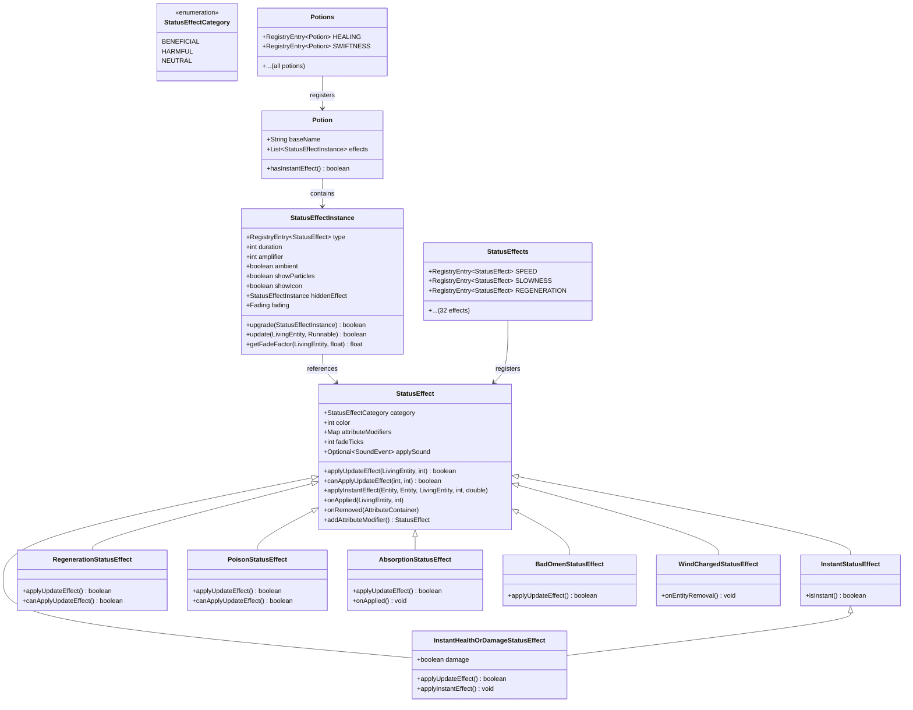
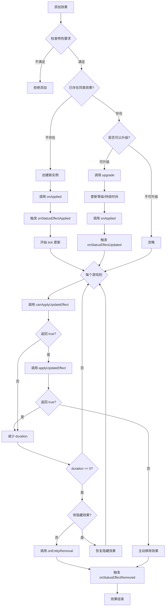
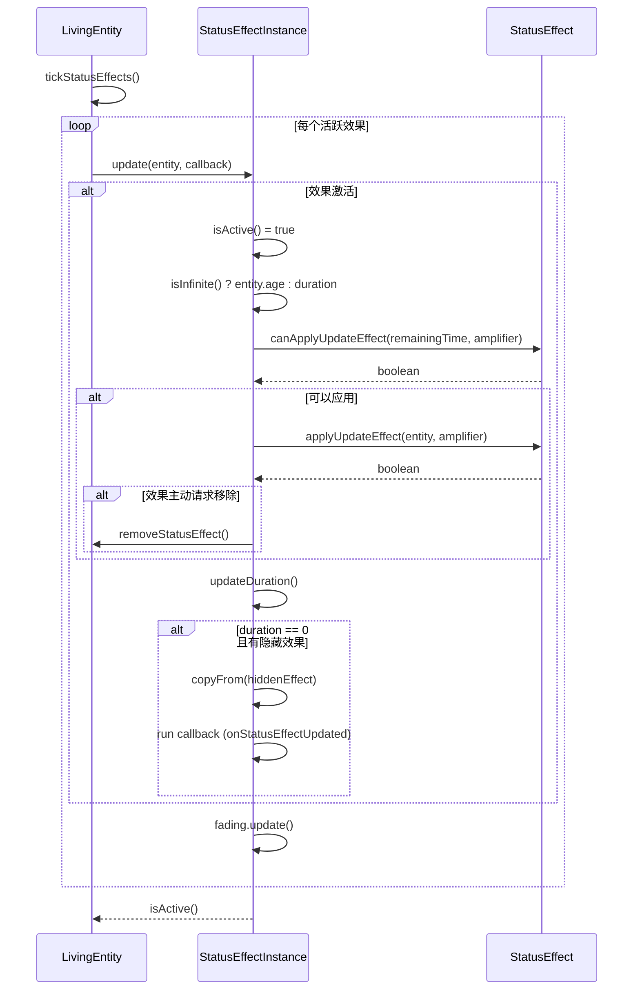

# Minecraft 1.21 状态效果系统 (Status Effect System)

> 基于 CFR 0.2.2 反编译源代码的状态效果系统完整分析
> 版本信息: Protocol 767, World Version 3953

---

## 1. 概述 (Overview)

Minecraft 的状态效果系统（Status Effect System）是游戏核心子系统之一，负责为生物（包括玩家和怪物）提供各种临时或永久的增益与减益效果。从简单的速度提升到复杂的凋零伤害，从即时治疗到隐身效果，状态效果系统构成了游戏玩法的基石。

### 1.1 系统架构总览

```
┌─────────────────────────────────────────────────────────────────────┐
│                        状态效果系统架构                                │
├─────────────────────────────────────────────────────────────────────┤
│                                                                     │
│  ┌───────────────────────────────────────────────────────────────┐ │
│  │                        顶层 API 层                             │ │
│  │         LivingEntity.addStatusEffect() / removeStatusEffect()  │ │
│  └─────────────────────────┬─────────────────────────────────────┘ │
│                            │                                        │
│  ┌─────────────────────────┼─────────────────────────────────────┐ │
│  │                    实例管理层                                  │ │
│  │              StatusEffectInstance / MobEffectInstance           │ │
│  │         (持续时间、等级、粒子、淡入淡出)                          │ │
│  └─────────────────────────┬─────────────────────────────────────┘ │
│                            │                                        │
│  ┌─────────────────────────┼─────────────────────────────────────┐ │
│  │                    效果类型层                                   │ │
│  │                  StatusEffect / MobEffect                        │ │
│  │           (属性修改、伤害计算、粒子生成)                          │ │
│  └─────────────────────────┬─────────────────────────────────────┘ │
│                            │                                        │
│  ┌─────────────────────────┼─────────────────────────────────────┐ │
│  │                    注册表层                                     │ │
│  │                  StatusEffects / Registries                     │ │
│  │               (32 种内置效果 + 模组扩展)                        │ │
│  └───────────────────────────────────────────────────────────────┘ │
│                                                                     │
└─────────────────────────────────────────────────────────────────────┘
```

### 1.2 核心组件一览

| 组件 | 类路径 | 职责 |
|------|--------|------|
| StatusEffect | `net.minecraft.entity.effect.StatusEffect` | 效果类型定义和更新逻辑 |
| StatusEffectInstance | `net.minecraft.entity.effect.StatusEffectInstance` | 效果实例（持续时间、等级等） |
| StatusEffects | `net.minecraft.entity.effect.StatusEffects` | 32 种内置效果的注册表 |
| StatusEffectCategory | `net.minecraft.entity.effect.StatusEffectCategory` | 效果分类（有益/有害/中性） |
| StatusEffectUtil | `net.minecraft.entity.effect.StatusEffectUtil` | 工具类方法 |
| Potion | `net.minecraft.potion.Potion` | 药水配方定义 |
| Potions | `net.minecraft.potion.Potions` | 内置药水配方注册表 |

---

## 2. 核心类详解 (Core Classes)

### 2.1 StatusEffect - 效果类型基类

`StatusEffect` 是所有状态效果类型的基类，定义了效果的基本属性和行为。

```java
// D:\Minecraft-Learning\assets\mc\1.21\net\minecraft\entity\effect\StatusEffect.java
public class StatusEffect implements ToggleableFeature {
    // 属性修饰符映射表
    private final Map<RegistryEntry<EntityAttribute>, EffectAttributeModifierCreator> 
        attributeModifiers = new Object2ObjectOpenHashMap<>();
    
    // 效果分类（有益/有害/中性）
    private final StatusEffectCategory category;
    
    // 颜色值（用于粒子和 HUD 显示）
    private final int color;
    
    // 粒子工厂函数
    private final Function<StatusEffectInstance, ParticleEffect> particleFactory;
    
    // 淡入淡出刻数
    private int fadeTicks;
    
    // 应用时的音效
    private Optional<SoundEvent> applySound = Optional.empty();
    
    // 所需特性标志
    private FeatureSet requiredFeatures = FeatureFlags.VANILLA_FEATURES;
}
```

#### 2.1.1 构造函数与初始化

```java
// 基础构造函数 - 使用默认粒子
protected StatusEffect(StatusEffectCategory category, int color) {
    this.category = category;
    this.color = color;
    // 粒子透明度：环境效果（如龙息）透明度为 38.25，否则为 255
    this.particleFactory = effect -> {
        int alpha = effect.isAmbient() ? 340 ? 255 : AMBIENT_PARTICLE_ALPHA;
        return EntityEffectParticleEffect.create(
            ParticleTypes.ENTITY_EFFECT, 
            ColorHelper.Argb.withAlpha(alpha, color)
        );
    };
}

// 自定义粒子构造函数
protected StatusEffect(StatusEffectCategory category, int color, 
                       ParticleEffect particleEffect) {
    this.category = category;
    this.color = color;
    this.particleFactory = effect -> particleEffect;
}
```

#### 2.1.2 核心方法

```java
// 应用更新效果 - 每个游戏刻调用一次
public boolean applyUpdateEffect(LivingEntity entity, int amplifier) {
    return true;  // 默认返回 true 表示继续应用
}

// 检查是否可以应用更新效果
public boolean canApplyUpdateEffect(int duration, int amplifier) {
    return false;  // 默认不应用
}

// 即时效果应用（用于治疗/伤害药水）
public void applyInstantEffect(@Nullable Entity source, @Nullable Entity attacker, 
                               LivingEntity target, int amplifier, double proximity) {
    this.applyUpdateEffect(target, amplifier);
}

// 效果被应用时调用
public void onApplied(LivingEntity entity, int amplifier) {
}

// 实体被移除时调用
public void onEntityRemoval(LivingEntity entity, int amplifier, Entity.RemovalReason reason) {
}

// 实体受到伤害时调用
public void onEntityDamage(LivingEntity entity, int amplifier, DamageSource source, float amount) {
}

// 属性修饰符管理
public void onApplied(AttributeContainer attributeContainer, int amplifier) {
    for (Map.Entry<RegistryEntry<EntityAttribute>, EffectAttributeModifierCreator> entry : 
         this.attributeModifiers.entrySet()) {
        EntityAttributeInstance instance = attributeContainer.getCustomInstance(entry.getKey());
        if (instance != null) {
            instance.removeModifier(entry.getValue().id());  // 移除旧修饰符
            instance.addPersistentModifier(entry.getValue().createAttributeModifier(amplifier));
        }
    }
}
```

#### 2.1.3 属性修饰符辅助类

```java
// 内部 record 类，用于创建基于等级的属性修饰符
record EffectAttributeModifierCreator(Identifier id, double baseValue, 
                                       EntityAttributeModifier.Operation operation) {
    public EntityAttributeModifier createAttributeModifier(int amplifier) {
        // 修饰符值 = 基础值 * (等级 + 1)
        return new EntityAttributeModifier(
            this.id, 
            this.baseValue * (double)(amplifier + 1), 
            this.operation
        );
    }
}

// 添加属性修饰符的便捷方法
public StatusEffect addAttributeModifier(
    RegistryEntry<EntityAttribute> attribute, 
    Identifier id, 
    double amount, 
    EntityAttributeModifier.Operation operation
) {
    this.attributeModifiers.put(attribute, 
        new EffectAttributeModifierCreator(id, amount, operation));
    return this;
}
```

### 2.2 StatusEffectInstance - 效果实例

`StatusEffectInstance` 代表应用于某个实体的具体效果实例，包含持续时间、等级等信息。

```java
// D:\Minecraft-Learning\assets\mc\1.21\net\minecraft\entity\effect\StatusEffectInstance.java
public class StatusEffectInstance implements Comparable<StatusEffectInstance> {
    // 常量定义
    public static final int INFINITE = -1;           // 无限持续
    public static final int MIN_AMPLIFIER = 0;       // 最小等级
    public static final int MAX_AMPLIFIER = 255;     // 最大等级
    
    // 编解码器
    public static final Codec<StatusEffectInstance> CODEC = ...;
    public static final PacketCodec<RegistryByteBuf, StatusEffectInstance> PACKET_CODEC = ...;
    
    // 实例字段
    private final RegistryEntry<StatusEffect> type;      // 效果类型
    private int duration;                                 // 剩余持续时间（刻）
    private int amplifier;                               // 效果等级 (0 = I, 1 = II, ...)
    private boolean ambient;                             // 是否为环境效果（如龙息）
    private boolean showParticles;                        // 是否显示粒子
    private boolean showIcon;                            // 是否显示图标
    
    // 隐藏效果（用于效果升级时的过渡）
    @Nullable
    private StatusEffectInstance hiddenEffect;
    
    // 淡入淡出状态
    private final Fading fading = new Fading();
}
```

#### 2.2.1 构造函数

```java
// 基础构造函数
public StatusEffectInstance(RegistryEntry<StatusEffect> effect) {
    this(effect, 0, 0);
}

// 带持续时间构造函数
public StatusEffectInstance(RegistryEntry<StatusEffect> effect, int duration) {
    this(effect, duration, 0);
}

// 带等级构造函数
public StatusEffectInstance(RegistryEntry<StatusEffect> effect, int duration, int amplifier) {
    this(effect, duration, amplifier, false, true);  // 默认：非环境、显示粒子
}

// 全参数构造函数
public StatusEffectInstance(RegistryEntry<StatusEffect> effect, int duration, int amplifier, 
                            boolean ambient, boolean showParticles, boolean showIcon) {
    this.type = effect;
    this.duration = duration;
    this.amplifier = MathHelper.clamp(amplifier, 0, 255);
    this.ambient = ambient;
    this.showParticles = showParticles;
    this.showIcon = showIcon;
}
```

#### 2.2.2 效果升级逻辑

当实体获得更高等级或更长时间的效果时，`upgrade()` 方法处理效果的合并：

```java
public boolean upgrade(StatusEffectInstance that) {
    if (!this.type.equals(that.type)) {
        LOGGER.warn("This method should only be called for matching effects!");
    }
    boolean updated = false;
    
    // 情况1: 新效果等级更高
    if (that.amplifier > this.amplifier) {
        if (that.lastsShorterThan(this)) {
            // 新效果持续时间更短，将当前效果存入隐藏效果栈
            StatusEffectInstance oldHidden = this.hiddenEffect;
            this.hiddenEffect = new StatusEffectInstance(this);
            this.hiddenEffect.hiddenEffect = oldHidden;
        }
        this.amplifier = that.amplifier;
        this.duration = that.duration;
        updated = true;
    } 
    // 情况2: 新效果持续时间更长
    else if (this.lastsShorterThan(that)) {
        if (that.amplifier == this.amplifier) {
            // 同等级但时间更长，直接更新
            this.duration = that.duration;
            updated = true;
        } else if (this.hiddenEffect == null) {
            // 更高等级效果，更新隐藏效果
            this.hiddenEffect = new StatusEffectInstance(that);
        } else {
            // 递归更新隐藏效果
            this.hiddenEffect.upgrade(that);
        }
    }
    
    // 更新非等级属性
    if (!that.ambient && this.ambient || updated) {
        this.ambient = that.ambient;
        updated = true;
    }
    if (that.showParticles != this.showParticles) {
        this.showParticles = that.showParticles;
        updated = true;
    }
    if (that.showIcon != this.showIcon) {
        this.showIcon = that.showIcon;
        updated = true;
    }
    
    return updated;
}
```

#### 2.2.3 淡入淡出系统 (Fading)

效果应用和移除时的视觉过渡：

```java
static class Fading {
    private float factor;      // 当前过渡因子
    private float prevFactor;  // 上一帧的过渡因子
    
    public void update(StatusEffectInstance effect) {
        this.prevFactor = this.factor;
        int fadeTicks = Fading.getFadeTicks(effect);
        
        if (fadeTicks == 0) {
            this.factor = 1.0f;  // 无过渡
            return;
        }
        
        float target = Fading.getTarget(effect);
        if (this.factor != target) {
            // 每帧平滑过渡，最大变化量为 1/fadeTicks
            float step = 1.0f / (float)fadeTicks;
            this.factor += MathHelper.clamp(target - this.factor, -step, step);
        }
    }
    
    private static float getTarget(StatusEffectInstance effect) {
        // 持续时间大于淡入淡出时间时，目标为 1.0
        boolean fullFade = !effect.isDurationBelow(Fading.getFadeTicks(effect));
        return fullFade ? 1.0f : 0.0f;
    }
    
    // 计算当前插值因子
    public float calculate(LivingEntity entity, float tickDelta) {
        if (entity.isRemoved()) {
            this.prevFactor = this.factor;
        }
        return MathHelper.lerp(tickDelta, this.prevFactor, this.factor);
    }
}
```

#### 2.2.4 序列化与反序列化

```java
// 写入 NBT
public NbtElement writeNbt() {
    return CODEC.encodeStart(NbtOps.INSTANCE, this).getOrThrow();
}

// 从 NBT 读取
@Nullable
public static StatusEffectInstance fromNbt(NbtCompound nbt) {
    return CODEC.parse(NbtOps.INSTANCE, nbt)
        .resultOrPartial(LOGGER::error)
        .orElse(null);
}

// NBT 参数结构
record Parameters(
    int amplifier, 
    int duration, 
    boolean ambient, 
    boolean showParticles, 
    boolean showIcon, 
    Optional<Parameters> hiddenEffect
) {
    // Codec 定义处理默认值和可选字段
}
```

### 2.3 StatusEffectCategory - 效果分类

```java
// D:\Minecraft-Learning\assets\mc\1.21\net\minecraft\entity\effect\StatusEffectCategory.java
public enum StatusEffectCategory {
    BENEFICIAL(Formatting.BLUE),   // 有益效果 - 蓝色
    HARMFUL(Formatting.RED),       // 有害效果 - 红色
    NEUTRAL(Formatting.BLUE);      // 中性效果 - 蓝色
    
    private final Formatting formatting;
    
    public Formatting getFormatting() {
        return this.formatting;
    }
}
```

---

## 3. 效果类型详解 (Effect Types)

### 3.1 效果分类总览

Minecraft 1.21 共有 **32 种**内置状态效果：

| ID | 名称 | 分类 | 特殊类型 |
|----|------|------|----------|
| 1 | speed | BENEFICIAL | 属性修饰符 |
| 2 | slowness | HARMFUL | 属性修饰符 |
| 3 | haste | BENEFICIAL | 属性修饰符 |
| 4 | mining_fatigue | HARMFUL | 属性修饰符 |
| 5 | strength | BENEFICIAL | 属性修饰符 |
| 6 | instant_health | BENEFICIAL | 即时效果 |
| 7 | instant_damage | HARMFUL | 即时效果 |
| 8 | jump_boost | BENEFICIAL | 属性修饰符 |
| 9 | nausea | HARMFUL | - |
| 10 | regeneration | BENEFICIAL | 周期性 |
| 11 | resistance | BENEFICIAL | - |
| 12 | fire_resistance | BENEFICIAL | - |
| 13 | water_breathing | BENEFICIAL | - |
| 14 | invisibility | BENEFICIAL | - |
| 15 | blindness | HARMFUL | - |
| 16 | night_vision | BENEFICIAL | - |
| 17 | hunger | HARMFUL | 周期性 |
| 18 | weakness | HARMFUL | 属性修饰符 |
| 19 | poison | HARMFUL | 周期性 |
| 20 | wither | HARMFUL | 周期性 |
| 21 | health_boost | BENEFICIAL | 属性修饰符 |
| 22 | absorption | BENEFICIAL | 属性修饰符 |
| 23 | saturation | BENEFICIAL | 即时效果 |
| 24 | glowing | NEUTRAL | - |
| 25 | levitation | HARMFUL | - |
| 26 | luck | BENEFICIAL | 属性修饰符 |
| 27 | unluck | HARMFUL | 属性修饰符 |
| 28 | slow_falling | BENEFICIAL | - |
| 29 | conduit_power | BENEFICIAL | - |
| 30 | dolphins_grace | BENEFICIAL | - |
| 31 | bad_omen | NEUTRAL | 触发型 |
| 32 | hero_of_the_village | BENEFICIAL | - |

### 3.2 周期性效果 (Periodic Effects)

#### 3.2.1 再生效果 (Regeneration)

```java
// D:\Minecraft-Learning\assets\mc\1.21\net\minecraft\entity\effect\RegenerationStatusEffect.java
class RegenerationStatusEffect extends StatusEffect {
    @Override
    public boolean applyUpdateEffect(LivingEntity entity, int amplifier) {
        // 每 tick 检查生命值
        if (entity.getHealth() < entity.getMaxHealth()) {
            entity.heal(1.0f);  // 治疗 1 点生命
        }
        return true;
    }
    
    @Override
    public boolean canApplyUpdateEffect(int duration, int amplifier) {
        // 基础间隔：50 ticks
        // 每提升一级，时间减半
        int tickInterval = 50 >> amplifier;
        if (tickInterval > 0) {
            return duration % tickInterval == 0;
        }
        return true;  // 0 ticks 间隔意味着每 tick
    }
}
```

**效果计算：**
- I 级：每 50 tick (2.5 秒) 治疗 1 HP
- II 级：每 25 tick (1.25 秒) 治疗 1 HP
- III 级：每 12 tick (0.6 秒) 治疗 1 HP
- 以此类推...

#### 3.2.2 中毒效果 (Poison)

```java
// D:\Minecraft-Learning\assets\mc\1.21\net\minecraft\entity\effect\PoisonStatusEffect.java
class PoisonStatusEffect extends StatusEffect {
    @Override
    public boolean applyUpdateEffect(LivingEntity entity, int amplifier) {
        // 不低于 1 HP 时造成伤害
        if (entity.getHealth() > 1.0f) {
            entity.damage(entity.getDamageSources().magic(), 1.0f);
        }
        return true;
    }
    
    @Override
    public boolean canApplyUpdateEffect(int duration, int amplifier) {
        // 基础间隔：25 ticks
        int tickInterval = 25 >> amplifier;
        if (tickInterval > 0) {
            return duration % tickInterval == 0;
        }
        return true;
    }
}
```

**特殊机制：** 中毒效果有最低生命值保护（1 HP），不会将实体直接杀死。

#### 3.2.3 凋零效果 (Wither)

```java
// D:\Minecraft-Learning\assets\mc\1.21\net\minecraft\entity\effect\WitherStatusEffect.java
class WitherStatusEffect extends StatusEffect {
    @Override
    public boolean applyUpdateEffect(LivingEntity entity, int amplifier) {
        // 凋零伤害，无最低生命值保护
        entity.damage(entity.getDamageSources().wither(), 1.0f);
        return true;
    }
    
    @Override
    public boolean canApplyUpdateEffect(int duration, int amplifier) {
        // 基础间隔：40 ticks
        int tickInterval = 40 >> amplifier;
        if (tickInterval > 0) {
            return duration % tickInterval == 0;
        }
        return true;
    }
}
```

**与中毒的区别：** 凋零没有最低生命值保护，可以直接杀死实体。

#### 3.2.4 饥饿效果 (Hunger)

```java
// D:\Minecraft-Learning\assets\mc\1.21\net\minecraft\entity\effect\HungerStatusEffect.java
class HungerStatusEffect extends StatusEffect {
    @Override
    public boolean applyUpdateEffect(LivingEntity entity, int amplifier) {
        if (entity instanceof PlayerEntity) {
            PlayerEntity player = (PlayerEntity)entity;
            // 每 tick 增加饥饿值
            // 基础值：0.005 * (等级 + 1)
            player.addExhaustion(0.005f * (float)(amplifier + 1));
        }
        return true;
    }
    
    @Override
    public boolean canApplyUpdateEffect(int duration, int amplifier) {
        return true;  // 每 tick 都触发
    }
}
```

### 3.3 即时效果 (Instant Effects)

```java
// D:\Minecraft-Learning\assets\mc\1.21\net\minecraft\entity\effect\InstantStatusEffect.java
public class InstantStatusEffect extends StatusEffect {
    @Override
    public boolean isInstant() {
        return true;
    }
    
    @Override
    public boolean canApplyUpdateEffect(int duration, int amplifier) {
        return duration >= 1;
    }
}
```

#### 3.3.1 即时治疗/伤害

```java
// D:\Minecraft-Learning\assets\mc\1.21\net\minecraft\entity\effect\InstantHealthOrDamageStatusEffect.java
class InstantHealthOrDamageStatusEffect extends InstantStatusEffect {
    private final boolean damage;  // true = 伤害, false = 治疗
    
    @Override
    public boolean applyUpdateEffect(LivingEntity entity, int amplifier) {
        // 僵尸猪灵等生物有反向治愈/伤害效果
        if (this.damage == entity.hasInvertedHealingAndHarm()) {
            entity.heal(4 << amplifier);  // 治疗
        } else {
            entity.damage(entity.getDamageSources().magic(), 6 << amplifier);  // 伤害
        }
        return true;
    }
    
    @Override
    public void applyInstantEffect(@Nullable Entity source, @Nullable Entity attacker, 
                                   LivingEntity target, int amplifier, double proximity) {
        // 用于药水投掷物等
        if (this.damage == target.hasInvertedHealingAndHarm()) {
            int amount = (int)(proximity * (double)(4 << amplifier) + 0.5);
            target.heal(amount);
        } else {
            int amount = (int)(proximity * (double)(6 << amplifier) + 0.5);
            DamageSource damageSource = source == null ? 
                target.getDamageSources().magic() : 
                target.getDamageSources().indirectMagic(source, attacker);
            target.damage(damageSource, amount);
        }
    }
}
```

**伤害/治疗计算：**
- I 级：6 点伤害 或 4 点治疗
- II 级：12 点伤害 或 8 点治疗
- 每提升一级，数值翻倍

### 3.4 属性修饰符效果 (Attribute Modifier Effects)

许多效果通过 `addAttributeModifier()` 方法直接修改实体属性：

```java
// 速度效果
public static final RegistryEntry<StatusEffect> SPEED = StatusEffects.register("speed", 
    new StatusEffect(StatusEffectCategory.BENEFICIAL, 3402751)
        .addAttributeModifier(
            EntityAttributes.GENERIC_MOVEMENT_SPEED,  // 属性
            Identifier.ofVanilla("effect.speed"),       // 修饰符 ID
            0.2f,                                      // 基础值
            EntityAttributeModifier.Operation.ADD_MULTIPLIED_TOTAL  // 操作类型
        ));

// 缓慢效果
public static final RegistryEntry<StatusEffect> SLOWNESS = StatusEffects.register("slowness", 
    new StatusEffect(StatusEffectCategory.HARMFUL, 9154528)
        .addAttributeModifier(
            EntityAttributes.GENERIC_MOVEMENT_SPEED,
            Identifier.ofVanilla("effect.slowness"),
            -0.15f,
            EntityAttributeModifier.Operation.ADD_MULTIPLIED_TOTAL
        ));

// 力量效果
public static final RegistryEntry<StatusEffect> STRENGTH = StatusEffects.register("strength", 
    new StatusEffect(StatusEffectCategory.BENEFICIAL, 16762624)
        .addAttributeModifier(
            EntityAttributes.GENERIC_ATTACK_DAMAGE,
            Identifier.ofVanilla("effect.strength"),
            3.0,  // 每级 +3 攻击力
            EntityAttributeModifier.Operation.ADD_VALUE
        ));
```

### 3.5 吸收效果 (Absorption)

```java
// D:\Minecraft-Learning\assets\mc\1.21\net\minecraft\entity\effect\AbsorptionStatusEffect.java
class AbsorptionStatusEffect extends StatusEffect {
    @Override
    public boolean applyUpdateEffect(LivingEntity entity, int amplifier) {
        // 当还有吸收生命或在世界客户端时继续
        return entity.getAbsorptionAmount() > 0.0f || entity.getWorld().isClient;
    }
    
    @Override
    public void onApplied(LivingEntity entity, int amplifier) {
        super.onApplied(entity, amplifier);
        // 设置吸收生命：4 * (等级 + 1)
        entity.setAbsorptionAmount(Math.max(
            entity.getAbsorptionAmount(), 
            (float)(4 * (1 + amplifier))
        ));
    }
}
```

### 3.6 触发型效果 (Trigger Effects)

#### 3.6.1 灾厄效果 (Bad Omen)

```java
// D:\Minecraft-Learning\assets\mc\1.21\net\minecraft\entity\effect\BadOmenStatusEffect.java
class BadOmenStatusEffect extends StatusEffect {
    @Override
    public boolean applyUpdateEffect(LivingEntity entity, int amplifier) {
        if (entity instanceof ServerPlayerEntity) {
            ServerPlayerEntity player = (ServerPlayerEntity)entity;
            ServerWorld world = player.getServerWorld();
            
            // 检查触发条件
            if (!player.isSpectator() && 
                world.getDifficulty() != Difficulty.PEACEFUL &&
                world.isNearOccupiedPointOfInterest(player.getBlockPos())) {
                
                Raid raid = world.getRaidAt(player.getBlockPos());
                // 检查是否满足袭击条件
                if (raid == null || raid.getBadOmenLevel() < raid.getMaxAcceptableBadOmenLevel()) {
                    // 添加袭击征兆效果
                    player.addStatusEffect(new StatusEffectInstance(
                        StatusEffects.RAID_OMEN, 600, amplifier
                    ));
                    player.setStartRaidPos(player.getBlockPos());
                    return false;  // 移除灾厄效果
                }
            }
        }
        return true;
    }
}
```

### 3.7 死亡触发效果 (Death Trigger Effects)

#### 3.7.1 风暴充能效果 (Wind Charged)

```java
// D:\Minecraft-Learning\assets\mc\1.21\net\minecraft\entity\effect\WindChargedStatusEffect.java
class WindChargedStatusEffect extends StatusEffect {
    @Override
    public void onEntityRemoval(LivingEntity entity, int amplifier, Entity.RemovalReason reason) {
        // 仅当实体被杀死时触发
        if (reason == Entity.RemovalReason.KILLED && entity.getWorld() instanceof ServerWorld) {
            ServerWorld world = (ServerWorld)entity.getWorld();
            // 创建爆炸
            world.createExplosion(
                entity, null, AbstractWindChargeEntity.EXPLOSION_BEHAVIOR,
                entity.getX(), entity.getY() + entity.getHeight() / 2, entity.getZ(),
                3.0f + world.getRandom().nextFloat() * 2.0f,  // 爆炸威力
                false, World.ExplosionSourceType.TRIGGER
            );
        }
    }
}
```

#### 3.7.2 蛛网效果 (Weaving)

```java
// D:\Minecraft-Learning\assets\mc\1.21\net\minecraft\entity\effect\WeavingStatusEffect.java
class WeavingStatusEffect extends StatusEffect {
    private final ToIntFunction<Random> cobwebChanceFunction;
    
    @Override
    public void onEntityRemoval(LivingEntity entity, int amplifier, Entity.RemovalReason reason) {
        // 仅当实体被杀死且满足条件时
        if (reason == Entity.RemovalReason.KILLED && 
            (entity instanceof PlayerEntity || 
             entity.getWorld().getGameRules().getBoolean(GameRules.DO_MOB_GRIEFING))) {
            this.tryPlaceCobweb(entity.getWorld(), entity.getRandom(), entity.getSteppingPos());
        }
    }
}
```

#### 3.7.3 滴落效果 (Oozing)

```java
// D:\Minecraft-Learning\assets\mc\1.21\net\minecraft\entity\effect\OozingStatusEffect.java
class OozingStatusEffect extends StatusEffect {
    @Override
    public void onEntityRemoval(LivingEntity entity, int amplifier, Entity.RemovalReason reason) {
        // 仅当实体被杀死时触发
        if (reason != Entity.RemovalReason.KILLED) return;
        
        // 生成史莱姆
        int slimeCount = this.slimeCountFunction.applyAsInt(entity.getRandom());
        World world = entity.getWorld();
        int maxEntity = world.getGameRules().getInt(GameRules.MAX_ENTITY_CRAMMING);
        
        int toSpawn = getSlimesToSpawn(maxEntity, SlimeCounter.around(entity), slimeCount);
        for (int i = 0; i < toSpawn; i++) {
            this.spawnSlime(world, entity.getX(), entity.getY() + 0.5, entity.getZ());
        }
    }
}
```

#### 3.7.4 侵染效果 (Infested)

```java
// D:\Minecraft-Learning\assets\mc\1.21\net\minecraft\entity\effect\InfestedStatusEffect.java
class InfestedStatusEffect extends StatusEffect {
    private final float silverfishChance;
    
    @Override
    public void onEntityDamage(LivingEntity entity, int amplifier, DamageSource source, float amount) {
        // 当实体受伤时有几率生成蠹虫
        if (entity.getRandom().nextFloat() <= this.silverfishChance) {
            int count = this.silverfishCountFunction.applyAsInt(entity.getRandom());
            for (int i = 0; i < count; i++) {
                this.spawnSilverfish(entity.getWorld(), entity, ...);
            }
        }
    }
}
```

---

## 4. 药水系统 (Potion System)

### 4.1 Potion 类

```java
// D:\Minecraft-Learning\assets\mc\1.21\net\minecraft\potion\Potion.java
public class Potion implements ToggleableFeature {
    @Nullable
    private final String baseName;  // 基础药水名称（用于生成变体名称）
    
    private final List<StatusEffectInstance> effects;  // 效果列表
    private FeatureSet requiredFeatures = FeatureFlags.VANILLA_FEATURES;
    
    public Potion(StatusEffectInstance ... effects) {
        this(null, effects);
    }
    
    public Potion(@Nullable String baseName, StatusEffectInstance ... effects) {
        this.baseName = baseName;
        this.effects = List.of(effects);
    }
    
    public List<StatusEffectInstance> getEffects() {
        return this.effects;
    }
    
    public boolean hasInstantEffect() {
        for (StatusEffectInstance effect : this.effects) {
            if (effect.getEffectType().value().isInstant()) {
                return true;
            }
        }
        return false;
    }
}
```

### 4.2 内置药水配方

```java
// D:\Minecraft-Learning\assets\mc\1.21\net\minecraft\potion\Potions.java
public class Potions {
    // 基础药水
    public static final RegistryEntry<Potion> WATER = register("water", new Potion());
    public static final RegistryEntry<Potion> MUNDANE = register("mundane", new Potion());
    public static final RegistryEntry<Potion> THICK = register("thick", new Potion());
    public static final RegistryEntry<Potion> AWKWARD = register("awkward", new Potion());
    
    // 治疗药水
    public static final RegistryEntry<Potion> HEALING = register("healing", 
        new Potion(new StatusEffectInstance(StatusEffects.INSTANT_HEALTH, 1)));
    public static final RegistryEntry<Potion> STRONG_HEALING = register("strong_healing", 
        new Potion("healing", new StatusEffectInstance(StatusEffects.INSTANT_HEALTH, 1, 1)));
    
    // 伤害药水
    public static final RegistryEntry<Potion> HARMING = register("harming", 
        new Potion(new StatusEffectInstance(StatusEffects.INSTANT_DAMAGE, 1)));
    
    // 速度药水
    public static final RegistryEntry<Potion> SWIFTNESS = register("swiftness", 
        new Potion(new StatusEffectInstance(StatusEffects.SPEED, 3600)));
    public static final RegistryEntry<Potion> LONG_SWIFTNESS = register("long_swiftness", 
        new Potion("swiftness", new StatusEffectInstance(StatusEffects.SPEED, 9600)));
    public static final RegistryEntry<Potion> STRONG_SWIFTNESS = register("strong_swiftness", 
        new Potion("swiftness", new StatusEffectInstance(StatusEffects.SPEED, 1800, 1)));
    
    // 缓慢药水
    public static final RegistryEntry<Potion> SLOWNESS = register("slowness", 
        new Potion(new StatusEffectInstance(StatusEffects.SLOWNESS, 1800)));
    
    // 海龟大师药水（双效果）
    public static final RegistryEntry<Potion> TURTLE_MASTER = register("turtle_master", 
        new Potion("turtle_master", 
            new StatusEffectInstance(StatusEffects.SLOWNESS, 400, 3),
            new StatusEffectInstance(StatusEffects.RESISTANCE, 400, 2)));
    
    // 1.21 新增药水
    public static final RegistryEntry<Potion> WIND_CHARGED = register("wind_charged", 
        new Potion("wind_charged", new StatusEffectInstance(StatusEffects.WIND_CHARGED, 3600)));
    public static final RegistryEntry<Potion> WEAVING = register("weaving", 
        new Potion("weaving", new StatusEffectInstance(StatusEffects.WEAVING, 3600)));
    public static final RegistryEntry<Potion> OOZING = register("oozing", 
        new Potion("oozing", new StatusEffectInstance(StatusEffects.OOZING, 3600)));
    public static final RegistryEntry<Potion> INFESTED = register("infested", 
        new Potion("infested", new StatusEffectInstance(StatusEffects.INFESTED, 3600)));
}
```

### 4.3 药水持续时间表

| 药水类型 | 普通 | 延长 | 加强 |
|----------|------|------|------|
| 速度/跳跃/力量等 | 3:00 (3600) | 8:00 (9600) | 1:30 (1800) +1级 |
| 缓慢 | 1:30 (1800) | 4:00 (4800) | 0:20 (400) +3级 |
| 中毒 | 0:45 (900) | 1:30 (1800) | 0:22 (432) +1级 |
| 再生 | 0:45 (900) | 1:30 (1800) | 0:22 (450) +1级 |
| 治疗/伤害 | 即时 | - | 即时 +1级 |
| 虚弱 | 1:30 (1800) | 4:00 (4800) | - |

---

## 5. 效果应用流程 (Effect Application Flow)

### 5.1 效果添加

```java
// LivingEntity 中的效果管理
public class LivingEntity extends Entity {
    // 效果映射表
    private final Map<RegistryEntry<StatusEffect>, StatusEffectInstance> 
        activeStatusEffects = new LinkedHashMap<>();
    
    // 添加效果
    public boolean addStatusEffect(RegistryEntry<StatusEffect> effect, 
                                   @Nullable Entity source) {
        return this.addStatusEffect(new StatusEffectInstance(effect), source);
    }
    
    public boolean addStatusEffect(StatusEffectInstance effect, 
                                  @Nullable Entity source) {
        // 获取效果类型
        StatusEffect statusEffect = effect.getEffectType().value();
        
        // 检查特性要求
        if (!this.getWorld().getEnabledFeatures().containsAll(
                statusEffect.getRequiredFeatures())) {
            return false;
        }
        
        // 调用原效果
        StatusEffectInstance existingEffect = this.activeStatusEffects.get(
            effect.getEffectType());
        
        // 尝试升级或添加
        if (existingEffect != null) {
            if (existingEffect.upgrade(effect)) {
                // 触发更新回调
                existingEffect.onApplied(this);
                this.onStatusEffectUpdated(effect.getEffectType());
            }
        } else {
            // 添加新效果
            this.activeStatusEffects.put(effect.getEffectType(), effect);
            effect.onApplied(this);
            this.onStatusEffectApplied(effect.getEffectType(), effect);
        }
        
        return true;
    }
    
    // 移除效果
    public boolean removeStatusEffect(RegistryEntry<StatusEffect> effect) {
        StatusEffectInstance removed = this.activeStatusEffects.remove(effect);
        if (removed != null) {
            removed.onEntityRemoval(this, Entity.RemovalReason.DISCARDED);
            this.onStatusEffectRemoved(effect);
            return true;
        }
        return false;
    }
}
```

### 5.2 效果更新Tick

```java
// LivingEntity 的 tick 方法中调用
public void tick() {
    // 处理状态效果
    this.tickStatusEffects();
}

private void tickStatusEffects() {
    // 获取需要更新的迭代器
    Iterator<StatusEffectInstance> iterator = this.activeStatusEffects.values()
        .iterator();
    
    while (iterator.hasNext()) {
        StatusEffectInstance effectInstance = iterator.next();
        
        // 更新效果实例（减少持续时间、调用应用更新效果）
        if (!effectInstance.update(this, () -> {
            // 效果被升级时的回调
            this.onStatusEffectUpdated(effectInstance.getEffectType());
        })) {
            // 效果结束
            iterator.remove();
            this.onStatusEffectRemoved(effectInstance.getEffectType());
        }
    }
}
```

### 5.3 StatusEffectInstance.update()

```java
public boolean update(LivingEntity entity, Runnable overwriteCallback) {
    if (this.isActive()) {
        // 获取剩余时间
        int remainingTime = this.isInfinite() ? 
            entity.age : this.duration;
        
        // 检查是否可以应用更新
        if (this.type.value().canApplyUpdateEffect(remainingTime, this.amplifier) &&
            !this.type.value().applyUpdateEffect(entity, this.amplifier)) {
            // 效果主动请求移除
            entity.removeStatusEffect(this.type);
        }
        
        // 减少持续时间
        this.updateDuration();
        
        // 检查隐藏效果
        if (this.duration == 0 && this.hiddenEffect != null) {
            // 恢复隐藏效果
            this.copyFrom(this.hiddenEffect);
            this.hiddenEffect = this.hiddenEffect.hiddenEffect;
            overwriteCallback.run();
        }
    }
    
    // 更新淡入淡出状态
    this.fading.update(this);
    
    return this.isActive();
}
```

---

## 6. 源码分析 (Source Code Analysis)

### 6.1 完整类图



### 6.2 状态效果生命周期



### 6.3 效果应用时机



---

## 7. 性能考虑 (Performance Considerations)

### 7.1 效果查询优化

```java
// 使用 LinkedHashMap 保持插入顺序，便于排序显示
private final Map<RegistryEntry<StatusEffect>, StatusEffectInstance> 
    activeStatusEffects = new LinkedHashMap<>();

// 快速检查是否存在某效果
public boolean hasStatusEffect(RegistryEntry<StatusEffect> effect) {
    return this.activeStatusEffects.containsKey(effect);
}

// 获取效果实例
public StatusEffectInstance getStatusEffect(RegistryEntry<StatusEffect> effect) {
    return this.activeStatusEffects.get(effect);
}

// 获取所有效果（用于 UI 显示）
public Collection<StatusEffectInstance> getStatusEffects() {
    return this.activeStatusEffects.values();
}
```

### 7.2 Tick 优化

#### 7.2.1 周期性效果的间隔检查

```java
// Regeneration: 50 >> amplifier
// 50 >> 0 = 50   (每 50 tick)
// 50 >> 1 = 25   (每 25 tick)
// 50 >> 2 = 12   (每 12 tick)
// ...

// 这比每次都执行效果更高效
public boolean canApplyUpdateEffect(int duration, int amplifier) {
    int interval = 50 >> amplifier;
    return duration % interval == 0;
}
```

#### 7.2.2 即时效果的优化

```java
// InstantStatusEffect 几乎不做任何 tick 处理
public boolean canApplyUpdateEffect(int duration, int amplifier) {
    return duration >= 1;  // 只需要检查是否还有时间
}
```

### 7.3 属性修饰符缓存

```java
// StatusEffect 预计算修饰符
private final Map<RegistryEntry<EntityAttribute>, EffectAttributeModifierCreator> 
    attributeModifiers = new Object2ObjectOpenHashMap<>();

// 实际修饰符在需要时动态创建
public void forEachAttributeModifier(int amplifier, 
    BiConsumer<RegistryEntry<EntityAttribute>, EntityAttributeModifier> consumer) {
    this.attributeModifiers.forEach((attribute, modifierCreator) -> {
        consumer.accept(attribute, modifierCreator.createAttributeModifier(amplifier));
    });
}
```

### 7.4 粒子性能

```java
// 环境效果的粒子透明度降低
private static final int AMBIENT_PARTICLE_ALPHA = MathHelper.floor(38.25f);

// 粒子工厂延迟创建
private final Function<StatusEffectInstance, ParticleEffect> particleFactory;

public ParticleEffect createParticle(StatusEffectInstance effect) {
    return this.particleFactory.apply(effect);
}
```

---

## 8. 工具类 (Utility Classes)

### 8.1 StatusEffectUtil

```java
// D:\Minecraft-Learning\assets\mc\1.21\net\minecraft\entity\effect\StatusEffectUtil.java
public final class StatusEffectUtil {
    // 获取效果持续时间文本
    public static Text getDurationText(StatusEffectInstance effect, 
                                       float multiplier, float tickRate) {
        if (effect.isInfinite()) {
            return Text.translatable("effect.duration.infinite");
        }
        int ticks = MathHelper.floor((float)effect.getDuration() * multiplier);
        return Text.literal(StringHelper.formatTicks(ticks, tickRate));
    }
    
    // 检查是否拥有急迫效果
    public static boolean hasHaste(LivingEntity entity) {
        return entity.hasStatusEffect(StatusEffects.HASTE) || 
               entity.hasStatusEffect(StatusEffects.CONDUIT_POWER);
    }
    
    // 获取急迫效果等级（考虑潮涌能量）
    public static int getHasteAmplifier(LivingEntity entity) {
        int hasteAmp = 0;
        int conduitAmp = 0;
        if (entity.hasStatusEffect(StatusEffects.HASTE)) {
            hasteAmp = entity.getStatusEffect(StatusEffects.HASTE).getAmplifier();
        }
        if (entity.hasStatusEffect(StatusEffects.CONDUIT_POWER)) {
            conduitAmp = entity.getStatusEffect(StatusEffects.CONDUIT_POWER).getAmplifier();
        }
        return Math.max(hasteAmp, conduitAmp);
    }
    
    // 检查是否拥有水下呼吸
    public static boolean hasWaterBreathing(LivingEntity entity) {
        return entity.hasStatusEffect(StatusEffects.WATER_BREATHING) || 
               entity.hasStatusEffect(StatusEffects.CONDUIT_POWER);
    }
    
    // 向范围内的玩家添加效果
    public static List<ServerPlayerEntity> addEffectToPlayersWithinDistance(
            ServerWorld world, @Nullable Entity source, Vec3d origin, double range,
            StatusEffectInstance effect, int duration) {
        
        RegistryEntry<StatusEffect> effectType = effect.getEffectType();
        
        // 过滤符合条件的玩家
        List<ServerPlayerEntity> players = world.getPlayers(player -> {
            // 排除旁观者
            if (player.interactionManager.isSurvivalLike() == false) return false;
            // 排除队友
            if (source != null && source.isTeammate(player)) return false;
            // 检查范围
            if (!origin.isInRange(player.getPos(), range)) return false;
            // 检查已有效果
            if (player.hasStatusEffect(effectType)) {
                StatusEffectInstance existing = player.getStatusEffect(effectType);
                return existing.getAmplifier() < effect.getAmplifier() ||
                       existing.isDurationBelow(duration - 1);
            }
            return true;
        });
        
        // 添加效果
        players.forEach(player -> 
            player.addStatusEffect(new StatusEffectInstance(effect), source));
        
        return players;
    }
}
```

---

## 9. 模组开发指南 (Mod Development Guide)

### 9.1 注册自定义效果

```java
// 创建自定义效果类
public class MyCustomEffect extends StatusEffect {
    public MyCustomEffect() {
        super(StatusEffectCategory.BENEFICIAL, 0x00FF00);  // 绿色
    }
    
    @Override
    public boolean applyUpdateEffect(LivingEntity entity, int amplifier) {
        // 自定义逻辑
        entity.heal(0.5f * (amplifier + 1));
        return true;
    }
    
    @Override
    public boolean canApplyUpdateEffect(int duration, int amplifier) {
        // 每 40 tick 应用一次
        return duration % 40 == 0;
    }
}

// 在初始化时注册
public static final RegistryEntry<StatusEffect> MY_CUSTOM_EFFECT = 
    Registry.registerReference(
        Registries.STATUS_EFFECT,
        Identifier.of("mymod", "my_custom_effect"),
        new MyCustomEffect()
    );
```

### 9.2 创建自定义药水

```java
public static final RegistryEntry<Potion> MY_POTION = 
    Registry.registerReference(
        Registries.POTION,
        Identifier.of("mymod", "my_potion"),
        new Potion(new StatusEffectInstance(MY_CUSTOM_EFFECT, 3600))
    );

// 延长版药水
public static final RegistryEntry<Potion> LONG_MY_POTION = 
    Registry.registerReference(
        Registries.POTION,
        Identifier.of("mymod", "long_my_potion"),
        new Potion("my_potion", new StatusEffectInstance(MY_CUSTOM_EFFECT, 9600))
    );

// 加强版药水
public static final RegistryEntry<Potion> STRONG_MY_POTION = 
    Registry.registerReference(
        Registries.POTION,
        Identifier.of("mymod", "strong_my_potion"),
        new Potion("my_potion", new StatusEffectInstance(MY_CUSTOM_EFFECT, 1800, 1))
    );
```

### 9.3 效果属性修饰符

```java
// 添加属性修饰符
public static final RegistryEntry<StatusEffect> MY_STRENGTH_EFFECT = 
    StatusEffects.register("my_strength",
        new StatusEffect(StatusEffectCategory.BENEFICIAL, 0xFF0000)
            .addAttributeModifier(
                EntityAttributes.GENERIC_ATTACK_DAMAGE,
                Identifier.of("mymod", "effect.my_strength"),
                5.0,  // 基础值
                EntityAttributeModifier.Operation.ADD_VALUE
            ));

// 带等级缩放的修饰符
public static final RegistryEntry<StatusEffect> MY_SPEED_EFFECT = 
    StatusEffects.register("my_speed",
        new StatusEffect(StatusEffectCategory.BENEFICIAL, 0x00FF00)
            .addAttributeModifier(
                EntityAttributes.GENERIC_MOVEMENT_SPEED,
                Identifier.of("mymod", "effect.my_speed"),
                0.1,  // 基础值
                EntityAttributeModifier.Operation.ADD_MULTIPLIED_TOTAL
            )
            // 每级增加 0.1 倍移速
    );
```

---

## 10. 总结

Minecraft 1.21 的状态效果系统是一个设计精良的子系统，具有以下特点：

### 10.1 架构特点

1. **分层设计**：效果类型（StatusEffect）与效果实例（StatusEffectInstance）分离
2. **可扩展性**：通过继承 StatusEffect 可以轻松添加自定义效果
3. **属性驱动**：通过属性系统实现效果对实体的修改
4. **事件驱动**：通过回调方法实现效果的各个生命周期阶段

### 10.2 核心机制

1. **周期性效果**：通过 `canApplyUpdateEffect()` 实现间隔性效果应用
2. **即时效果**：通过 `applyInstantEffect()` 实现瞬时效果
3. **属性修饰符**：通过 `ADD_VALUE`、`ADD_MULTIPLIED_TOTAL` 等操作修改属性
4. **效果升级**：通过 `hiddenEffect` 机制实现平滑的效果等级切换
5. **淡入淡出**：通过 `Fading` 类实现视觉效果过渡

### 10.3 性能优化

1. **间隔检查**：周期性效果使用位运算快速判断
2. **即时效果**：最小化 tick 处理
3. **属性缓存**：修饰符预计算，按需创建
4. **粒子优化**：环境效果使用低透明度粒子

理解状态效果系统对于游戏玩法实现、模组开发和性能优化都有重要意义。

---

## 参考文件

| 文件 | 路径 |
|------|------|
| StatusEffect.java | `D:\Minecraft-Learning\assets\mc\1.21\net\minecraft\entity\effect\StatusEffect.java` |
| StatusEffectInstance.java | `D:\Minecraft-Learning\assets\mc\1.21\net\minecraft\entity\effect\StatusEffectInstance.java` |
| StatusEffects.java | `D:\Minecraft-Learning\assets\mc\1.21\net\minecraft\entity\effect\StatusEffects.java` |
| StatusEffectCategory.java | `D:\Minecraft-Learning\assets\mc\1.21\net\minecraft\entity\effect\StatusEffectCategory.java` |
| StatusEffectUtil.java | `D:\Minecraft-Learning\assets\mc\1.21\net\minecraft\entity\effect\StatusEffectUtil.java` |
| RegenerationStatusEffect.java | `D:\Minecraft-Learning\assets\mc\1.21\net\minecraft\entity\effect\RegenerationStatusEffect.java` |
| PoisonStatusEffect.java | `D:\Minecraft-Learning\assets\mc\1.21\net\minecraft\entity\effect\PoisonStatusEffect.java` |
| InstantHealthOrDamageStatusEffect.java | `D:\Minecraft-Learning\assets\mc\1.21\net\minecraft\entity\effect\InstantHealthOrDamageStatusEffect.java` |
| AbsorptionStatusEffect.java | `D:\Minecraft-Learning\assets\mc\1.21\net\minecraft\entity\effect\AbsorptionStatusEffect.java` |
| BadOmenStatusEffect.java | `D:\Minecraft-Learning\assets\mc\1.21\net\minecraft\entity\effect\BadOmenStatusEffect.java` |
| WindChargedStatusEffect.java | `D:\Minecraft-Learning\assets\mc\1.21\net\minecraft\entity\effect\WindChargedStatusEffect.java` |
| WeavingStatusEffect.java | `D:\Minecraft-Learning\assets\mc\1.21\net\minecraft\entity\effect\WeavingStatusEffect.java` |
| OozingStatusEffect.java | `D:\Minecraft-Learning\assets\mc\1.21\net\minecraft\entity\effect\OozingStatusEffect.java` |
| InfestedStatusEffect.java | `D:\Minecraft-Learning\assets\mc\1.21\net\minecraft\entity\effect\InfestedStatusEffect.java` |
| Potion.java | `D:\Minecraft-Learning\assets\mc\1.21\net\minecraft\potion\Potion.java` |
| Potions.java | `D:\Minecraft-Learning\assets\mc\1.21\net\minecraft\potion\Potions.java` |
