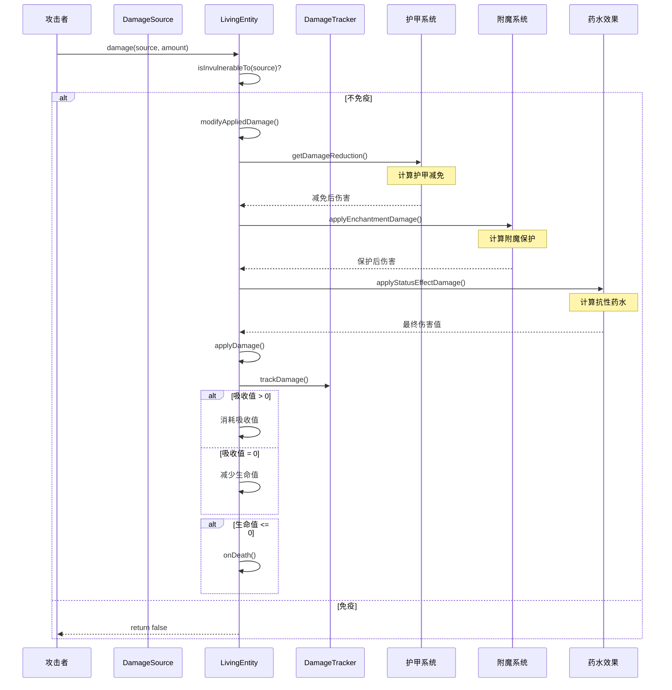
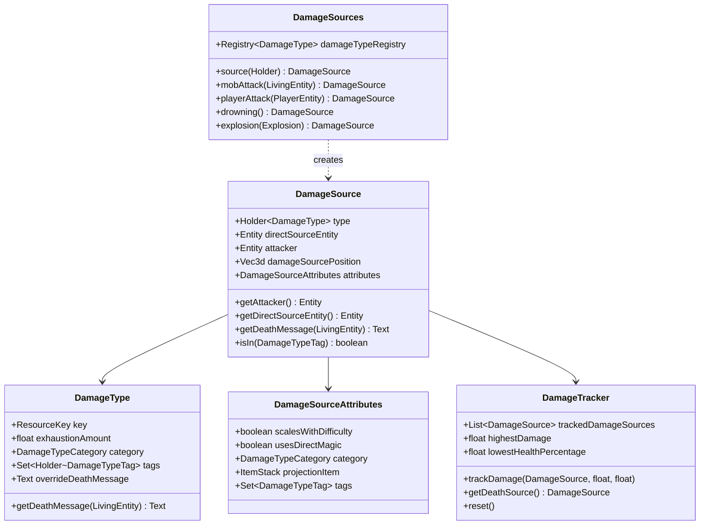
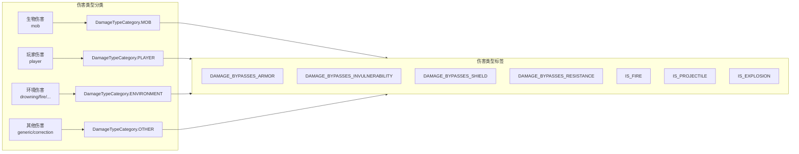

# Minecraft 1.21 伤害系统深度分析

> 基于 CFR 0.2.2 反编译源代码的伤害系统完整分析
> 版本信息: Protocol 767, World Version 3953

---

## 1. 概述

### 1.1 伤害系统的重要性

伤害系统是 Minecraft 中最核心的机制之一，它决定了玩家和生物如何受到伤害、如何计算防御、以及死亡如何被处理。一个完善的伤害系统需要处理：

- **多种伤害来源**：物理攻击、魔法伤害、环境伤害、投射物等
- **防御机制**：护甲、韧性、附魔保护、药水效果
- **特殊状态**：无敌帧、伤害免疫、吸收值
- **死亡处理**：掉落物品、经验值、死亡消息

```
┌─────────────────────────────────────────────────────────────────────┐
│                         伤害系统架构图                                 │
├─────────────────────────────────────────────────────────────────────┤
│                                                                     │
│   伤害来源 ──► 伤害类型 ──► 伤害计算 ──► 伤害应用 ──► 死亡判定       │
│      │            │            │            │            │        │
│      ▼            ▼            ▼            ▼            ▼        │
│   ┌──────┐    ┌──────┐    ┌──────┐    ┌──────┐    ┌──────┐       │
│   │攻击者│    │类型标签│   │护甲计算│   │应用生命值│  │掉落物品│       │
│   │环境  │    │伤害来源│   │保护附魔│   │吸收值处理│  │经验值  │       │
│   │投射物│    │特殊标记│   │韧性减免│   │无敌时间  │  │死亡消息│       │
│   └──────┘    └──────┘    └──────┘    └──────┘    └──────┘       │
│                                                                     │
└─────────────────────────────────────────────────────────────────────┘
```

### 1.2 核心类结构

| 类名 | 职责 | 包路径 |
|------|------|--------|
| `DamageSource` | 表示一次伤害的来源和属性 | `net.minecraft.entity.damage` |
| `DamageType` | 1.19+ 伤害类型定义，包含分类和死亡消息 | `net.minecraft.entity.damage` |
| `DamageSources` | 伤害源工厂，提供各种伤害类型的创建方法 | `net.minecraft.world` |
| `DamageTracker` | 追踪实体受到的伤害记录 | `net.minecraft.entity.damage` |
| `LivingEntity` | 包含伤害计算和应用的核心逻辑 | `net.minecraft.entity` |

### 1.3 伤害流程总览

```
伤害发生
    │
    ▼
┌────────────────────────────┐
│ 1. 检查伤害类型是否有效      │
└────────────────────────────┘
    │
    ▼
┌────────────────────────────┐
│ 2. 检查实体是否免疫该伤害类型 │
└────────────────────────────┘
    │
    ▼
┌────────────────────────────┐
│ 3. 计算伤害值              │
│    - 护甲减免              │
│    - 韧性减免              │
│    - 附魔保护计算          │
│    - 药水效果加成/减免     │
└────────────────────────────┘
    │
    ▼
┌────────────────────────────┐
│ 4. 应用伤害                │
│    - 吸收值处理            │
│    - 更新生命值            │
│    - 更新伤害追踪器        │
│    - 设置无敌时间          │
└────────────────────────────┘
    │
    ▼
┌────────────────────────────┐
│ 5. 触发副作用              │
│    - 播放受伤动画          │
│    - 播放受伤音效          │
│    - 触发游戏事件          │
└────────────────────────────┘
    │
    ▼
┌────────────────────────────┐
│ 6. 检查死亡条件            │
└────────────────────────────┘
```

---

## 2. 伤害来源 (DamageSource)

### 2.1 DamageSource 类概述

`DamageSource` 是 Minecraft 伤害系统的核心类，它封装了一次伤害的所有相关信息，包括：

- **伤害来源类型**：谁造成了这次伤害
- **直接伤害来源**：如火焰、虚空、窒息等
- **攻击者引用**：造成伤害的实体（如果有）
- **伤害类型引用**：1.19+ 引入的类型系统

```net/minecraft/entity/damage/DamageSource.java
public class DamageSource {
    // 伤害类型引用 (1.19+)
    private final Holder<DamageType> type;
    
    // 造成伤害的直接来源（可以是null）
    @Nullable
    private final Entity directSourceEntity;
    
    // 攻击者实体（可以是null，如环境伤害）
    @Nullable
    private final Entity attacker;
    
    // 伤害位置（用于爆炸等效果）
    private final Vec3d damageSourcePosition;
    
    // 特殊标记
    private final DamageSourceAttributes attributes;
}
```

### 2.2 DamageSourceAttributes 属性系统

```net/minecraft/entity/damage/DamageSource.java
public class DamageSource {
    // 标记类
    public static class DamageSourceAttributes {
        // 是否是魔法伤害（护甲保护不生效）
        private final boolean scalesWithDifficulty;
        
        // 是否使用创造模式玩家的伤害加成
        private final boolean usesDirectMagic;
        
        // 伤害类型分类
        private final DamageTypeCategory category;
        
        // 弹药类型（用于箭矢等投射物）
        @Nullable
        private final ItemStack projectionItem;
        
        // 特殊标记
        private final Set<DamageTypeTags> damageTypeTags;
    }
}
```

### 2.3 常见伤害来源类型

| 伤害来源 | 说明 | 是否需要攻击者 |
|---------|------|---------------|
| `mob` | 生物攻击 | 是 |
| `player` | 玩家攻击 | 是 |
| `projectile` | 投射物攻击 | 是 |
| `thorns` | 荆棘反伤 | 是 |
| `fireball` | 火球攻击 | 是 |
| `wither` | 凋零效果 | 否 |
| `drowning` | 溺水 | 否 |
| `burning` | 燃烧 | 否 |
| `fall` | 摔落 | 否 |
| `fallingBlock` | 掉落方块 | 否 |
| `sting` | 蜜蜂蛰伤 | 是 |
| `flyIntoWall` | 飞行撞墙 | 否 |
| `hotFloor` | 热地板（岩浆块） | 否 |
| `inWall` | 墙内窒息 | 否 |
| `cramming` | 挤压伤害 | 否 |
| `dryout` | 干渴 | 否 |
| `freeze` | 冻结 | 否 |
| `lightningBolt` | 闪电 | 否 |
| `magic` | 魔法伤害 | 否 |
| `witherSkull` | 凋零骷髅头 | 是 |
| `dragonBreath` | 龙息 | 否 |
| `sweetBerryBush` | 甜浆果丛 | 否 |
| `freeze` | 冻结伤害 | 否 |
| `explosion` | 爆炸 | 可选 |
| `generic` | 通用伤害 | 否 |
| `starve` | 饥饿伤害 | 否 |
| `cactus` | 仙人掌 | 否 |
| `fallingAnvil` | 掉落铁砧 | 否 |
| `fallingStalactite` | 掉落钟乳石 | 否 |
| `stalagmite` | 石笋 | 否 |

### 2.4 DamageSources 工厂类

`DamageSources` 是服务端创建各种 `DamageSource` 的工厂类：

```net/minecraft/world/DamageSources.java
public class DamageSources {
    // 数据驱动伤害类型注册表
    private final Registry<DamageType> damageTypeRegistry;
    
    // 伤害源缓存（优化性能）
    private final Map<Holder<DamageType>, DamageSource> cache = new Object2ObjectOpenHashMap<>();
    
    // 创建通用伤害源
    public DamageSource source(Holder<DamageType> type) {
        return this.cache.computeIfAbsent(type, type2 -> new DamageSource(type2));
    }
    
    // 创建带攻击者的伤害源
    public DamageSource source(Entity attacker, Holder<DamageType> type) {
        return new DamageSource(type, attacker, attacker);
    }
    
    // 创建投射物伤害源
    public DamageSource source(Entity directSource, Entity attacker, Holder<DamageType> type) {
        return new DamageSource(type, directSource, attacker);
    }
    
    // 常用伤害源方法
    public DamageSource mobAttack(LivingEntity attacker) {
        return this.source(attacker, Registries.DAMAGE_TYPE.getOrThrow(DamageTypes.MOB_ATTACK));
    }
    
    public DamageSource playerAttack(PlayerEntity attacker) {
        return Registries.DAMAGE_TYPE.getOrThrow(DamageTypes.PLAYER_ATTACK).containsTag(DamageTypeTags.BYPASSES_INVULNERABILITY)
            ? this.indirect(attacker, attacker, Registries.DAMAGE_TYPE.getOrThrow(DamageTypes.PLAYER_ATTACK))
            : this.source(attacker, Registries.DAMAGE_TYPE.getOrThrow(DamageTypes.PLAYER_ATTACK));
    }
    
    public DamageSource drowning() {
        return this.source(Registries.DAMAGE_TYPE.getOrThrow(DamageTypes.DROWN));
    }
    
    public DamageSource inWall() {
        return this.source(Registries.DAMAGE_TYPE.getOrThrow(DamageTypes.IN_WALL));
    }
    
    public DamageSource starve() {
        return this.source(Registries.DAMAGE_TYPE.getOrThrow(DamageTypes.STARVE));
    }
    
    public DamageSource onFire() {
        return this.source(Registries.DAMAGE_TYPE.getOrThrow(DamageTypes.ON_FIRE));
    }
    
    public DamageSource generic() {
        return this.source(Registries.DAMAGE_TYPE.getOrThrow(DamageTypes.GENERIC));
    }
    
    public DamageSource magic() {
        return this.source(Registries.DAMAGE_TYPE.getOrThrow(DamageTypes.MAGIC));
    }
    
    public DamageSource wither(float amount) {
        return this.wither(amount, 1.0f);
    }
    
    public DamageSource wither(float amount, float ratio) {
        DamageSource source = this.source(Registries.DAMAGE_TYPE.getOrThrow(DamageTypes.WITHER));
        return new WitherDamageSource(source, amount, ratio);
    }
    
    public DamageSource arrow(ProjectileEntity projectile, @Nullable Entity attacker) {
        return this.indirect(projectile, attacker, Registries.DAMAGE_TYPE.getOrThrow(DamageTypes.ARROW));
    }
    
    public DamageSource explosion(@Nullable Explosion explosion) {
        if (explosion == null) {
            return this.generic();
        }
        Entity entity = explosion.getEntity();
        return entity != null ? this.source(entity, Registries.DAMAGE_TYPE.getOrThrow(DamageTypes.EXPLOSION)) : this.source(Registries.DAMAGE_TYPE.getOrThrow(DamageTypes.EXPLOSION));
    }
    
    public DamageSource explosion(ProjectileImpl source, @Nullable LivingEntity attacker) {
        return this.indirect(source, attacker, Registries.DAMAGE_TYPE.getOrThrow(DamageTypes.EXPLOSION));
    }
    
    public DamageSource fireball(ProjectileImpl fireball, @Nullable Entity attacker) {
        if (attacker != null) {
            return this.indirect(fireball, attacker, Registries.DAMAGE_TYPE.getOrThrow(DamageTypes.FIREBALL));
        }
        return this.source(Registries.DAMAGE_TYPE.getOrThrow(DamageTypes.FIREBALL));
    }
    
    // 间接伤害源创建
    public DamageSource indirect(Entity source, @Nullable Entity attacker, Holder<DamageType> type) {
        return new IndirectDamageSource(type, source, attacker, this.damageSourcePosition(source));
    }
    
    private Vec3d damageSourcePosition(@Nullable Entity entity) {
        return entity != null ? entity.getPos() : Vec3d.ZERO;
    }
}
```

### 2.5 DamageSource 的核心方法

```net/minecraft/entity/damage/DamageSource.java
public class DamageSource {
    
    // 获取伤害来源的显示名称
    public Text getDeathMessage(LivingEntity entity) {
        return this.type.value().getDeathMessage(entity);
    }
    
    // 获取攻击者实体
    @Nullable
    public Entity getAttacker() {
        return this.attacker;
    }
    
    // 获取直接伤害来源
    @Nullable
    public Entity getDirectSourceEntity() {
        return this.directSourceEntity;
    }
    
    // 获取伤害类型
    public Holder<DamageType> getDamageType() {
        return this.type;
    }
    
    // 检查是否使用魔法伤害计算
    public boolean isSource() {
        return this.attributes.usesDirectMagic();
    }
    
    // 检查伤害是否使用特定标签
    public boolean isIn(DamageTypeTags tag) {
        return this.type.value().is(tag);
    }
    
    // 获取伤害来源位置
    public Vec3d getSourcePosition() {
        return this.damageSourcePosition;
    }
    
    // 获取弹药类型（用于投射物）
    @Nullable
    public ItemStack getProjectionItem() {
        return this.attributes.getProjectionItem();
    }
}
```

---

## 3. 伤害类型 (DamageType)

### 3.1 1.19+ 伤害类型系统

从 Minecraft 1.19 开始，引入了数据驱动的 `DamageType` 系统，允许通过数据包定义新的伤害类型。这是一个重大的架构改进，使得 mod 开发者可以更加灵活地添加自定义伤害类型。

```net/minecraft/entity/damage/DamageType.java
public class DamageType {
    // 伤害类型注册表键
    private final ResourceKey<DamageType> key;
    
    // 伤害缩放因子（与难度相关）
    private final float exhaustionAmount;
    
    // 死亡消息参数
    @Nullable
    private final String deathMessageType;
    
    // 伤害类型分类
    private final DamageTypeCategory category;
    
    // 伤害类型标签
    private final Set<Holder<DamageTypeTag>> tags;
    
    // 消息覆盖
    @Nullable
    private final Text overrideDeathMessage;
}
```

### 3.2 伤害类型分类 (DamageTypeCategory)

```net/minecraft/entity/damage/DamageType.java
public class DamageType {
    // 伤害类型分类枚举
    public enum DamageTypeCategory {
        OTHER,           // 其他
        MOB,              // 生物
        PLAYER,           // 玩家
        ENVIRONMENT       // 环境
    }
}
```

### 3.3 伤害类型标签 (DamageTypeTag)

伤害类型标签用于标记具有相同特性的伤害类型，用于附魔保护等系统的判断：

```net/minecraft/tags/DamageTypeTags.java
public class DamageTypeTags {
    // 附魔保护相关的标签
    public static final TagKey<DamageType> IS_FIRE = TagKey.of(Registries.DAMAGE_TYPE, Identifier.ofVanilla("is_fire"));
    public static final TagKey<DamageType> IS_PROJECTILE = TagKey.of(Registries.DAMAGE_TYPE, Identifier.ofVanilla("is_projectile"));
    public static final TagKey<DamageType> DAMAGE_HURTS_ARMOR = TagKey.of(Registries.DAMAGE_TYPE, Identifier.ofVanilla("damage_hurts_armor"));
    public static final TagKey<DamageType> DAMAGE_BYPASSES_ARMOR = TagKey.of(Registries.DAMAGE_TYPE, Identifier.ofVanilla("damage_bypasses_armor"));
    public static final TagKey<DamageType> DAMAGE_BYPASSES_INVULNERABILITY = TagKey.of(Registries.DAMAGE_TYPE, Identifier.ofVanilla("damage_bypasses_invulnerability"));
    public static final TagKey<DamageType> DAMAGE_BYPASSES_SHIELD = TagKey.of(Registries.DAMAGE_TYPE, Identifier.ofVanilla("damage_bypasses_shield"));
    public static final TagKey<DamageType> DAMAGE_BYPASSES_RESISTANCE = TagKey.of(Registries.DAMAGE_TYPE, Identifier.ofVanilla("damage_bypasses_resistance"));
    public static final TagKey<DamageType> DAMAGE_IS_CORRECTION = TagKey.of(Registries.DAMAGE_TYPE, Identifier.ofVanilla("damage_is_correction"));
    
    // 特殊伤害标记
    public static final TagKey<DamageType> IS_LIGHTNING = TagKey.of(Registries.DAMAGE_TYPE, Identifier.ofVanilla("is_lightning"));
    public static final TagKey<DamageType> IS_EXPLOSION = TagKey.of(Registries.DAMAGE_TYPE, Identifier.ofVanilla("is_explosion"));
}
```

### 3.4 数据驱动伤害类型定义

伤害类型通过 JSON 数据包定义：

```json
{
  "exhaustion": 0.1,
  "death_message_type": "default",
  "message_id": "arrow",
  "scaling": "when_caused_by_living_non_player",
  "tags": ["bypasses_armor", "projectile"]
}
```

**字段说明：**

| 字段 | 类型 | 说明 |
|------|------|------|
| `exhaustion` | float | 每次伤害造成的饥饿消耗 |
| `death_message_type` | string | 死亡消息类型 |
| `message_id` | string | 消息标识符 |
| `scaling` | string | 伤害缩放策略 |
| `tags` | array | 伤害类型标签 |

**Scaling 选项：**

| 值 | 说明 |
|----|------|
| `never` | 不缩放（总是造成固定伤害） |
| `when_caused_by_non_player` | 非玩家造成时缩放 |
| `when_caused_by_player` | 玩家造成时缩放 |
| `when_caused_by_living_non_player` | 生物（非玩家）造成时缩放 |
| `always` | 总是缩放 |

---

## 4. 伤害计算 (Damage Calculation)

### 4.1 伤害计算流程

Minecraft 的伤害计算是一个多阶段的过程，每一阶段都会对伤害值进行调整：

```
原始伤害
    │
    ▼
┌────────────────────────────┐
│ 阶段1: 难度缩放             │
│ (Difficulty Scaling)        │
└────────────────────────────┘
    │
    ▼
┌────────────────────────────┐
│ 阶段2: 护甲减免             │
│ (Armor Protection)          │
└────────────────────────────┘
    │
    ▼
┌────────────────────────────┐
│ 阶段3: 韧性减免             │
│ (Toughness Reduction)      │
└────────────────────────────┘
    │
    ▼
┌────────────────────────────┐
│ 阶段4: 附魔保护             │
│ (Enchantment Protection)   │
└────────────────────────────┘
    │
    ▼
┌────────────────────────────┐
│ 阶段5: 药水效果调整         │
│ (Status Effect Modifier)    │
└────────────────────────────┘
    │
    ▼
┌────────────────────────────┐
│ 阶段6: Resistance药水效果   │
│ (Resistance Effect)         │
└────────────────────────────┘
    │
    ▼
    最终伤害
```

### 4.2 LivingEntity 伤害入口

```net/minecraft/entity/LivingEntity.java
public abstract class LivingEntity extends Entity implements Attackable {
    
    // 数据追踪：生命值
    protected static final TrackedData<Float> HEALTH = 
        DataTracker.registerData(LivingEntity.class, TrackedDataHandlerRegistry.FLOAT);
    
    // 吸收值
    protected float absorptionAmount;
    
    // 无敌时间相关
    protected int invulnerableTimer;
    private static final int INVULNERABLE_TIME = 20;  // 10秒无敌时间
    
    // 造成伤害的公开方法
    public boolean damage(DamageSource source, float amount) {
        // 1. 检查实体是否对该伤害免疫
        if (this.isInvulnerableTo(source)) {
            return false;
        }
        
        // 2. 如果在睡觉则唤醒
        if (this.isSleeping() && !this.getWorld().isClient) {
            this.wakeUp();
        }
        
        // 3. 确保属性修饰符已应用
        this.applyAttributesModifiersIfMoved();
        
        // 4. 计算实际伤害值
        float damage = amount;
        damage = this.modifyAppliedDamage(source, damage);
        
        // 5. 如果伤害<=0则返回失败
        if (damage <= 0.0f) {
            return false;
        }
        
        // 6. 应用伤害
        return this.applyDamage(source, damage);
    }
    
    // 修改伤害值（由子类覆盖，如玩家）
    protected float modifyAppliedDamage(DamageSource source, float damage) {
        // 计算护甲和韧性减免后的伤害
        damage = this.getDamageReduction(source, damage);
        
        // 应用附魔保护
        damage = this.applyEnchantmentDamage(source, damage);
        
        // 应用药水效果修改
        damage = this.applyStatusEffectDamage(source, damage);
        
        return damage;
    }
    
    // 获取护甲减免
    private float getDamageReduction(DamageSource source, float damage) {
        // 如果伤害类型标签包含 DAMAGE_BYPASSES_ARMOR，直接返回
        if (source.isIn(DamageTypeTags.DAMAGE_BYPASSES_ARMOR)) {
            return damage;
        }
        
        // 获取护甲值和韧性值
        float armor = (float)this.getAttributeValue(EntityAttributes.GENERIC_ARMOR);
        float toughness = (float)this.getAttributeValue(EntityAttributes.GENERIC_ARMOR_TOUGHNESS);
        
        // 计算护甲减免
        // 公式: reduction = (armor * 0.04) / (1 + armor * 0.04 + (toughness * 0.04)^2)
        float reduction = (armor * 4.0f) / (20.0f + armor * 4.0f + toughness * toughness);
        
        return damage * (1.0f - reduction);
    }
}
```

### 4.3 护甲计算详解

#### 4.3.1 护甲属性

```net/minecraft/entity/attribute/EntityAttributes.java
public class EntityAttributes {
    // 护甲值
    public static final EntityAttribute GENERIC_ARMOR = ...
    
    // 护甲韧性
    public static final EntityAttribute GENERIC_ARMOR_TOUGHNESS = ...
}
```

#### 4.3.2 护甲减免公式

Minecraft 的护甲减免公式相对复杂，设计上是为了让高护甲在面对高伤害时有更好的减免效果：

```
护甲减免百分比 = (20 × armor + 4 × armor²) / (armor × (armor + 5) + 100)
```

简化版本：

```
damageReduction = (armor × 4) / (20 + armor × 4 + toughness²)
```

**示例计算：**

| 护甲值 | 韧性值 | 减免百分比（面对10点伤害） |
|--------|--------|---------------------------|
| 0 | 0 | 0%（10点伤害） |
| 10 | 0 | 16.7%（8.3点伤害） |
| 20 | 0 | 28.6%（7.1点伤害） |
| 20 | 8 | 47.1%（5.3点伤害） |
| 30 | 0 | 37.5%（6.25点伤害） |
| 30 | 12 | 57.9%（4.2点伤害） |
| 40 | 0 | 44.4%（5.6点伤害） |

**护甲减免的特点：**

1. **收益递减**：护甲值越高，每增加一点护甲的效果越小
2. **韧性平衡高护甲**：高韧性可以显著提高高护甲的价值
3. **上限封顶**：实际减免最高约为80%（20护甲 + 20韧性时面对大伤害）

### 4.4 附魔保护计算

附魔保护是一种非常有效的伤害减免机制，每个保护附魔针对特定类型的伤害提供保护：

```net/minecraft/enchantment/EnchantmentHelper.java
public class EnchantmentHelper {
    
    // 保护附魔对伤害的减免
    public static float getProtectionAmount(EnchantmentHelper.EntityEquipment equipment, DamageSource source) {
        // 计算保护等级总和
        int protection = 0;
        
        for (ItemStack itemStack : equipment.getEquipped()) {
            for (EnchantmentLevelBased effect : EnchantmentHelper.getEnchantments(itemStack)) {
                if (effect instanceof ProtectionEnchantment protectionEnchantment) {
                    protection += protectionEnchantment.getProtectionAmount(source);
                }
            }
        }
        
        return (float) protection;
    }
    
    // 应用保护到伤害
    public static float applyProtection(DamageSource source, float damage) {
        if (source.isIn(DamageTypeTags.DAMAGE_BYPASSES_ARMOR)) {
            return damage;
        }
        
        // 获取装备的保护等级
        int protectionLevel = ...; // 从装备计算
        
        if (protectionLevel <= 0) {
            return damage;
        }
        
        // 计算减免值
        float reduction = (float) EnchantmentHelper.getDamageReduction(EnchantmentHelper.getProtectionAmount(equipment, source), damage);
        
        return Math.max(damage - reduction, damage * 0.1f); // 最低保留10%伤害
    }
}
```

#### 4.4.1 各类保护附魔

| 附魔 | 标签 | 每级减免 | 最大减免 |
|------|------|---------|----------|
| 保护 (Protection) | 无特定标签 | 1.5 + level × 0.5 | 80%（20级） |
| 火焰保护 (Fire Protection) | `is_fire` | 2 + level × 0.5 | 80%（20级） |
| 摔落保护 (Feather Falling) | `is_fall` | 3 + level × 1.5 | 80%（12级） |
| 爆炸保护 (Blast Protection) | `is_explosion` | 2 + level × 0.5 | 80%（20级） |
| 弹射物保护 (Projectile Protection) | `is_projectile` | 1.5 + level × 0.5 | 80%（20级） |

#### 4.4.2 保护计算公式

```
reduction = (protectionLevel × 0.15 + 0.15) × 伤害
```

实际实现中，保护计算使用以下公式：

```java
// 简化计算
float reduction = (float) getProtectionAmount(equipment, source);
float damageReduction = getDamageReduction(reduction, damage);

// 核心减免公式
float reductionAmount = (float) (protectionLevel * 0.15 + protectionLevel * 0.15 * (1.0 + protectionLevel / 2.0));
float newDamage = damage - reductionAmount;
```

### 4.5 药水效果对伤害的影响

```net/minecraft/entity/LivingEntity.java
public abstract class LivingEntity extends Entity implements Attackable {
    
    // 应用药水效果的伤害修改
    protected float applyStatusEffectDamage(DamageSource source, float damage) {
        // 抗性药水效果 (Resistance)
        if (this.hasStatusEffect(StatusEffects.RESISTANCE)) {
            StatusEffectInstance effect = this.getStatusEffect(StatusEffects.RESISTANCE);
            int amplifier = effect.getAmplifier();
            
            // 每级抗性减少20%伤害
            float reduction = (float) ((amplifier + 1) * 0.2);
            
            // 最低保留10%伤害
            damage = Math.max(damage - damage * reduction, damage * 0.1f);
        }
        
        return damage;
    }
}
```

**抗性药水效果：**

| 等级 | 伤害减免 |
|------|----------|
| I | 20% |
| II | 40% |
| III | 60% |
| IV | 80% |

### 4.6 吸收值处理

吸收值（Absorption）是额外的临时生命值，会在普通生命值之前被消耗：

```net/minecraft/entity/LivingEntity.java
protected boolean applyDamage(DamageSource source, float damage) {
    this.getWorld().getProfiler().push("damage");
    
    // 1. 首先处理吸收值
    if (damage < this.absorptionAmount) {
        // 伤害被吸收值完全吸收
        this.absorptionAmount -= damage;
        damage = 0.0f;
    } else {
        // 吸收值不足以完全吸收
        damage -= this.absorptionAmount;
        this.setAbsorptionAmount(0.0f);
    }
    
    // 2. 更新伤害追踪器
    this.getDamageTracker().trackDamage(source, this.health, damage);
    
    // 3. 减少生命值
    this.health = this.health - damage;
    
    // 4. 更新吸收值上限
    this.setAbsorptionAmount(this.getAttributeValue(EntityAttributes.GENERIC_MAX_ABSORPTION));
    
    // 5. 触发视觉效果
    this.setHurtTime(this.maxHurtTime);
    this.hurtTime = this.maxHurtTime;
    this.lastDamageSource = source;
    this.lastDamageTime = this.age;
    
    this.getWorld().getProfiler().pop();
    return true;
}
```

---

## 5. 护甲系统 (Armor System)

### 5.1 护甲物品

护甲是一种特殊的装备，提供防御能力：

```java
// 护甲物品基类
public abstract class ArmorItem extends Equipable {
    
    // 护甲材质
    private final ArmorMaterial material;
    
    // 护甲类型
    private final EquipmentSlot.Type slotType;
    private final EquipmentSlot slot;
    
    // 护甲提供的属性
    public Multimap<EntityAttribute, EntityAttributeModifier> getAttributeModifiers(EquipmentSlot slot) {
        if (slot == this.slot) {
            return this.material.getAttributeModifiers(this.slotType);
        }
        return ImmutableMultimap.of();
    }
}
```

### 5.2 护甲材质

```java
// 护甲材质接口
public interface ArmorMaterial {
    // 获取护甲值
    int getDurability(EquipmentSlot slot);
    
    // 获取护甲值
    int getProtection(EquipmentSlot slot);
    
    // 获取附魔价值
    int getEnchantability();
    
    // 获取装备音效
    SoundEvent getEquipSound();
    
    // 获取修复材料
    Ingredient getRepairIngredient();
    
    // 获取材质名称
    String getName();
    
    // 获取韧性值
    float getToughness();
    
    // 获取击退抗性
    float getKnockbackResistance();
}
```

### 5.3 内置护甲材质

| 材质 | 头盔 | 胸甲 | 护腿 | 靴子 | 总计 | 韧性 |
|------|------|------|------|------|------|------|
| Leather | 1 | 3 | 2 | 1 | 7 | 0 |
| Iron | 2 | 6 | 4 | 2 | 14 | 0 |
| Gold | 2 | 5 | 3 | 1 | 11 | 0 |
| Diamond | 3 | 8 | 6 | 3 | 20 | 2 |
| Netherite | 3 | 8 | 6 | 3 | 20 | 3 |
| Turtle | 2 | 6 | 5 | 2 | 15 | 0 |
| Chainmail | 2 | 5 | 4 | 2 | 13 | 0 |

### 5.4 护甲属性应用

```net/minecraft/item/ItemStack.java
// 护甲物品应用属性
public Multimap<EntityAttribute, EntityAttributeModifier> getAttributeModifiers(EquipmentSlot slot) {
    if (slot == this.slot) {
        return this.material.getAttributeModifiers(this.slotType);
    }
    return ImmutableMultimap.of();
}

// 默认护甲材质实现
public class DefaultArmorMaterials {
    
    // 钻石护甲材质
    DIAMOND(new ArmorMaterial() {
        // ...
        public Multimap<EntityAttribute, EntityAttributeModifier> getAttributeModifiers(EquipmentSlot.Type type) {
            ImmutableMultimap.Builder<EntityAttribute, EntityAttributeModifier> builder = ImmutableMultimap.builder();
            
            // 添加护甲值
            builder.put(EntityAttributes.GENERIC_ARMOR, 
                new EntityAttributeModifier(
                    ARMOR_MODIFIER_ID_BY_SLOT[type.getEntitySlotId()],
                    "Armor modifier",
                    this.getProtection(type),
                    EntityAttributeModifier.Operation.ADD_VALUE
                )
            );
            
            // 添加韧性值
            builder.put(EntityAttributes.GENERIC_ARMOR_TOUGHNESS, 
                new EntityAttributeModifier(
                    TOUGHNESS_MODIFIER_ID_BY_SLOT[type.getEntitySlotId()],
                    "Armor toughness",
                    this.getToughness(),
                    EntityAttributeModifier.Operation.ADD_VALUE
                )
            );
            
            return builder.build();
        }
    });
}
```

---

## 6. 伤害追踪 (Damage Tracker)

### 6.1 DamageTracker 类

`DamageTracker` 负责追踪实体受到的伤害历史，用于生成死亡消息和统计：

```net/minecraft/entity/damage/DamageTracker.java
public class DamageTracker {
    // 最近的伤害来源列表
    private final List<DamageSource> trackedDamageSources = new ArrayList<>();
    
    // 最高伤害记录
    private DamageSource highestDamageSource;
    private float highestDamage = 0.0f;
    
    // 生命值百分比最低点
    private float lowestHealthPercentage = 1.0f;
    
    // 最后一次伤害来源
    @Nullable
    private DamageSource lastDamageSource;
    
    // 追踪伤害
    public void trackDamage(DamageSource source, float currentHealth, float damage) {
        // 添加到追踪列表
        this.trackedDamageSources.add(source);
        
        // 记录最高伤害
        if (damage > this.highestDamage) {
            this.highestDamage = damage;
            this.highestDamageSource = source;
        }
        
        // 记录最低生命值百分比
        float healthPercentage = currentHealth / this.getMaxHealth(); // 需要获取最大值
        if (healthPercentage < this.lowestHealthPercentage) {
            this.lowestHealthPercentage = healthPercentage;
        }
        
        // 更新最后伤害来源
        this.lastDamageSource = source;
    }
    
    // 获取死亡消息来源
    @Nullable
    public DamageSource getDeathSource() {
        return this.lastDamageSource;
    }
    
    // 获取最高伤害来源
    @Nullable
    public DamageSource getHighestDamageSource() {
        return this.highestDamageSource;
    }
    
    // 获取生命值最低时的伤害来源
    public DamageSource getDeathMessageSource() {
        if (!this.trackedDamageSources.isEmpty()) {
            // 返回导致致命伤害的来源
            return this.trackedDamageSources.get(this.trackedDamageSources.size() - 1);
        }
        return this.highestDamageSource;
    }
    
    // 重置追踪器
    public void reset() {
        this.trackedDamageSources.clear();
        this.highestDamage = 0.0f;
        this.highestDamageSource = null;
        this.lowestHealthPercentage = 1.0f;
        this.lastDamageSource = null;
    }
}
```

### 6.2 伤害追踪的使用

```net/minecraft/entity/LivingEntity.java
public abstract class LivingEntity extends Entity implements Attackable {
    
    // 获取伤害追踪器
    public DamageTracker getDamageTracker() {
        return this.damageTracker;
    }
    
    // 在应用伤害时更新追踪器
    protected boolean applyDamage(DamageSource source, float damage) {
        // ...
        this.getDamageTracker().trackDamage(source, this.health, damage);
        // ...
        return true;
    }
    
    // 在死亡时使用追踪信息
    public void onDeath(DamageSource source) {
        // 获取导致死亡的伤害来源
        DamageSource deathSource = this.getDamageTracker().getDeathMessageSource();
        
        // 生成死亡消息
        if (deathSource != null) {
            Text deathMessage = deathSource.getDeathMessage(this);
            // 发送死亡消息给玩家
        }
    }
}
```

---

## 7. 死亡处理 (Death Handling)

### 7.1 死亡判定

```net/minecraft/entity/LivingEntity.java
public abstract class LivingEntity extends Entity implements Attackable {
    
    // 无敌时间检查
    public boolean isInvulnerableTo(DamageSource source) {
        if (this.invulnerableTimer > 0) {
            // 在无敌时间内，大多数伤害被忽略
            if (!source.isIn(DamageTypeTags.DAMAGE_BYPASSES_INVULNERABILITY)) {
                return true;
            }
        }
        
        // 检查特殊免疫
        if (this.isInvulnerable(source)) {
            return true;
        }
        
        return false;
    }
    
    // 通用无敌检查
    protected boolean isInvulnerable(DamageSource source) {
        // 检查各种无敌状态
        return false;
    }
    
    // 检查是否死亡
    public boolean isDead() {
        return this.health <= 0.0f;
    }
}
```

### 7.2 死亡流程

```net/minecraft/entity/LivingEntity.java
public abstract class LivingEntity extends Entity implements Attackable {
    
    // 死亡方法
    public void onDeath(DamageSource damageSource) {
        // 确保只调用一次
        if (this.isDead()) {
            return;
        }
        
        this.getWorld().getProfiler().push("entityDeath");
        
        // 1. 标记为死亡
        this.dead = true;
        
        // 2. 触发游戏事件
        this.emitGameEvent(GameEvent.ENTITY_DIE);
        
        // 3. 处理掉落物
        this.drop(damageSource);
        
        // 4. 处理经验值掉落
        if (this instanceof ServerPlayerEntity) {
            // 玩家经验值处理
        } else if (this instanceof ExperienceDropEntity experienceDropEntity) {
            // 生物经验值掉落
            this.dropXp();
        }
        
        // 5. 更新统计信息
        this.updateStat(damageSource);
        
        // 6. 处理成就
        this.updateAdvancementTracker(damageSource);
        
        // 7. 标记仇恨目标丢失
        this.stopTrackingAttackTarget();
        
        // 8. 移除所有药水效果
        this.clearStatusEffects();
        
        // 9. 清除所有 passengers
        this.getPassengerList().forEach(Entity::stopRiding);
        if (this.getVehicle() != null) {
            this.stopRiding();
        }
        
        this.getWorld().getProfiler().pop();
    }
    
    // 掉落物品（由子类实现）
    protected abstract void drop(DamageSource damageSource);
    
    // 掉落经验值
    protected void dropXp() {
        // 根据实体类型掉落经验
    }
}
```

### 7.3 死亡消息生成

```net/minecraft/entity/damage/DamageType.java
public class DamageType {
    
    // 生成死亡消息
    public Text getDeathMessage(LivingEntity entity) {
        if (this.overrideDeathMessage != null) {
            return this.overrideDeathMessage;
        }
        
        // 根据死亡消息类型生成
        switch (this.deathMessageType) {
            case "default":
                return Text.translatable("death.attack." + this.getMessageId(), entity.getDisplayName());
            case "projectile":
                return Text.translatable("death.attack." + this.getMessageId(), entity.getDisplayName(), this.attacker.getDisplayName());
            case "indirect_projectile":
                return Text.translatable("death.attack." + this.getMessageId() + ".item", 
                    entity.getDisplayName(), this.attacker.getDisplayName(), this.projectionItem.getName());
            default:
                return Text.translatable("death.attack." + this.getMessageId(), entity.getDisplayName());
        }
    }
}
```

### 7.4 死亡消息示例

| 伤害类型 | 消息键 | 示例 |
|---------|--------|------|
| 通用 | `death.attack.generic` | `%s died` |
| 玩家攻击 | `death.attack.player` | `%s was slain by %s` |
| 箭矢 | `death.attack.arrow` | `%s was shot by %s` |
| 箭矢+物品 | `death.attack.arrow.item` | `%s was shot by %s using %s` |
| 火焰 | `death.attack.onFire` | `%s burned to death` |
| 熔岩 | `death.attack.lava` | `%s tried to swim in lava` |
| 溺水 | `death.attack.drown` | `%s drowned` |
| 摔落 | `death.attack.fall` | `%s hit the ground too hard` |
| 饥饿 | `death.attack.starve` | `%s starved to death` |
| 仙人掌 | `death.attack.cactus` | `%s was pricked to death` |
| 虚空 | `death.attack.outOfWorld` | `%s fell out of the world` |
| 凋零 | `death.attack.wither` | `%s withered away` |
| 爆炸 | `death.attack.explosion` | `%s exploded` |
| 爆炸(玩家) | `death.attack.explosion.player` | `%s was blown up by %s` |
| 闪电 | `death.attack.lightningBolt` | `%s was struck by lightning` |
| 床 | `death.attack.badRespawnPoint` | `%s was killed by [Intentional Game Design]` |

---

## 8. 源码分析 (Source Code Analysis)

### 8.1 伤害流程时序图



### 8.2 伤害系统类图



### 8.3 关键代码路径

```
造成伤害流程：

1. PlayerEntity.attack()
   │
   ▼
2. LivingEntity.damage(DamageSource, float)
   │
   ├──► isInvulnerableTo() - 检查无敌时间
   │
   ├──► modifyAppliedDamage()
   │     │
   │     ├──► getDamageReduction() - 护甲计算
   │     │
   │     ├──► applyEnchantmentDamage() - 附魔保护
   │     │
   │     └──► applyStatusEffectDamage() - 药水效果
   │
   └──► applyDamage()
         │
         ├──► 处理吸收值
         │
         ├──► trackDamage() - 伤害追踪
         │
         ├──► health -= damage - 减少生命
         │
         └──► setHurtTime() - 受伤动画
              │
              ▼
         检查 isDead()
              │
              ▼
         onDeath() - 死亡处理
```

---

## 9. Mermaid 图表 - 伤害计算流程

### 9.1 完整伤害计算流程图

```mermaid
flowchart TD
    Start["伤害发生"] --> CheckImmune{"检查免疫"}
    
    CheckImmune -->|"无敌时间内| NoDamage["返回 false<br/>无伤害"]
    CheckImmune -->|"非无敌| Next1
    
    Next1["modifyAppliedDamage()"] --> CheckArmor{"DAMAGE_BYPASSES<br/>ARMOR?"}
    
    CheckArmor -->|"是| SkipArmor["跳过护甲"]
    CheckArmor -->|"否| CalcArmor["计算护甲减免"]
    
    CalcArmor --> GetArmor["获取 armor 值"]
    GetArmor --> GetToughness["获取 toughness 值"]
    GetToughness --> Formula["公式计算"]
    Formula --> Reduction["减免百分比"]
    Reduction --> FinalDamage1["中间伤害值"]
    
    SkipArmor --> FinalDamage1
    
    FinalDamage1 --> CheckProtection{"DAMAGE_BYPASSES<br/>ARMOR?"}
    
    CheckProtection -->|"是| SkipProtection["跳过保护"]
    CheckProtection -->|"否| CalcProtection["计算附魔保护"]
    
    CalcProtection --> GetProtection["获取保护等级"]
    GetProtection --> CalcReduction["计算减免"]
    CalcReduction --> MinDamage["maxdamage - reduction<br/>min: damage × 0.1"]
    MinDamage --> FinalDamage2["最终伤害值"]
    
    SkipProtection --> FinalDamage2
    
    FinalDamage2 --> CheckResistance{"有 Resistance?"}
    
    CheckResistance -->|"是| CalcResistance["计算抗性减免"]
    CalcResistance --> MinDamage2["maxdamage × 0.9<br/>min: damage × 0.1"]
    MinDamage2 --> FinalDamage3["最终伤害值"]
    
    CheckResistance -->|"否| FinalDamage3
    
    FinalDamage3 --> applyDamage["applyDamage()"]
    
    applyDamage --> CheckAbsorption{"damage <<br/>absorptionAmount?"}
    
    CheckAbsorption -->|"是| UseAbsorption["消耗吸收值"]
    UseAbsorption --> NoHealthLoss["不减少生命"]
    NoHealthLoss --> End1["返回 true"]
    
    CheckAbsorption -->|"否| UsePartial["部分消耗吸收值"]
    UsePartial --> ReduceAbsorption["absorption = 0"]
    ReduceAbsorption --> ReduceHealth["health -= remaining"]
    
    ReduceHealth --> TrackDamage["trackDamage()"]
    TrackDamage --> SetHurtTime["setHurtTime()"]
    SetHurtTime --> CheckDead{"health <= 0?"}
    
    CheckDead -->|"是| onDeath["onDeath()"]
    CheckDead -->|"否| End2["返回 true"]
    
    onDeath --> DropItems["drop()"]
    DropItems --> DropXP["dropXp()"]
    DropXP --> RemoveEffects["clearStatusEffects()"]
    RemoveEffects --> RemoveRiding["移除骑乘"]
    RemoveRiding --> Final["死亡完成"]
```

### 9.2 伤害类型分类图



---

## 10. 性能考虑 (Performance)

### 10.1 性能优化策略

Minecraft 伤害系统在设计上考虑了性能因素：

#### 10.1.1 伤害源缓存

```net/minecraft/world/DamageSources.java
public class DamageSources {
    // 伤害源缓存
    private final Map<Holder<DamageType>, DamageSource> cache = new Object2ObjectOpenHashMap<>();
    
    public DamageSource source(Holder<DamageType> type) {
        return this.cache.computeIfAbsent(type, type2 -> new DamageSource(type2));
    }
}
```

**优化原理：**
- 相同的伤害类型创建多个 `DamageSource` 实例时会复用缓存
- 减少对象创建频率，降低 GC 压力
- 特别适用于高频伤害来源（如环境伤害）

#### 10.1.2 快速路径跳过

```net/minecraft/entity/LivingEntity.java
public boolean damage(DamageSource source, float amount) {
    // 1. 最快路径：无敌时间检查
    if (this.invulnerableTimer > 0 && !source.isIn(DamageTypeTags.DAMAGE_BYPASSES_INVULNERABILITY)) {
        return false;
    }
    
    // 2. 次快路径：伤害为0
    if (amount <= 0) {
        return false;
    }
    
    // 3. 完整计算路径...
}
```

#### 10.1.3 批量属性计算

```net/minecraft/entity/attribute/AttributeContainer.java
public class AttributeContainer {
    private final Map<RegistryEntry<EntityAttribute>, EntityAttributeInstance> instances;
    
    // 批量应用修饰符
    public void addTemporaryModifiers(Iterable<EntityAttributeModifier> modifiers) {
        for (EntityAttributeModifier modifier : modifiers) {
            // ...
        }
    }
}
```

### 10.2 需要注意的性能问题

| 问题 | 影响 | 解决方案 |
|------|------|----------|
| 高频伤害检测 | 每tick检查可能导致性能下降 | 使用空间分区优化碰撞检测 |
| 大量附魔计算 | 每次伤害遍历所有装备 | 缓存附魔计算结果 |
| 复杂死亡消息 | NBT序列化耗时 | 预先生成消息模板 |
| 伤害追踪列表膨胀 | 长时间存活实体列表过长 | 限制追踪历史长度 |

### 10.3 优化建议

1. **避免高频小伤害**：连续的小伤害（如岩浆块）会累积大量追踪记录
2. **合理使用附魔**：保护附魔在低伤害时效果不明显，高伤害时效果显著
3. **护甲与韧性平衡**：单纯堆护甲不如护甲+韧性效果好
4. **吸收值谨慎使用**：大量吸收值会影响服务器性能

---

## 11. 总结

Minecraft 1.21 的伤害系统是一个精心设计的复杂系统：

1. **数据驱动架构**：通过 `DamageType` 数据包系统，实现了伤害类型的可扩展性

2. **多层防护机制**：
   - 护甲提供基础防御
   - 韧性平衡高护甲价值
   - 附魔保护针对特定伤害
   - 药水效果提供额外减免

3. **性能优化**：
   - 伤害源缓存机制
   - 快速路径跳过
   - 批量属性计算

4. **灵活的死亡系统**：
   - 详细的死亡消息
   - 完整的掉落机制
   - 经验值系统集成

5. **可扩展性**：
   - 支持 mod 添加自定义伤害类型
   - 支持自定义附魔保护
   - 支持自定义药水效果

理解伤害系统对于 mod 开发、服务器优化和游戏机制研究都有重要意义。

---

## 参考文件

| 文件路径 | 说明 |
|----------|------|
| `D:\Minecraft-Learning\assets\mc\1.21\net\minecraft\entity\LivingEntity.java` | 伤害应用核心逻辑 |
| `D:\Minecraft-Learning\assets\mc\1.21\net\minecraft\entity\damage\DamageSource.java` | 伤害来源类 |
| `D:\Minecraft-Learning\assets\mc\1.21\net\minecraft\entity\damage\DamageType.java` | 伤害类型定义 |
| `D:\Minecraft-Learning\assets\mc\1.21\net\minecraft\entity\damage\DamageTracker.java` | 伤害追踪器 |
| `D:\Minecraft-Learning\assets\mc\1.21\net\minecraft\world\DamageSources.java` | 伤害源工厂 |
| `D:\Minecraft-Learning\assets\mc\1.21\net\minecraft\enchantment\EnchantmentHelper.java` | 附魔效果计算 |
