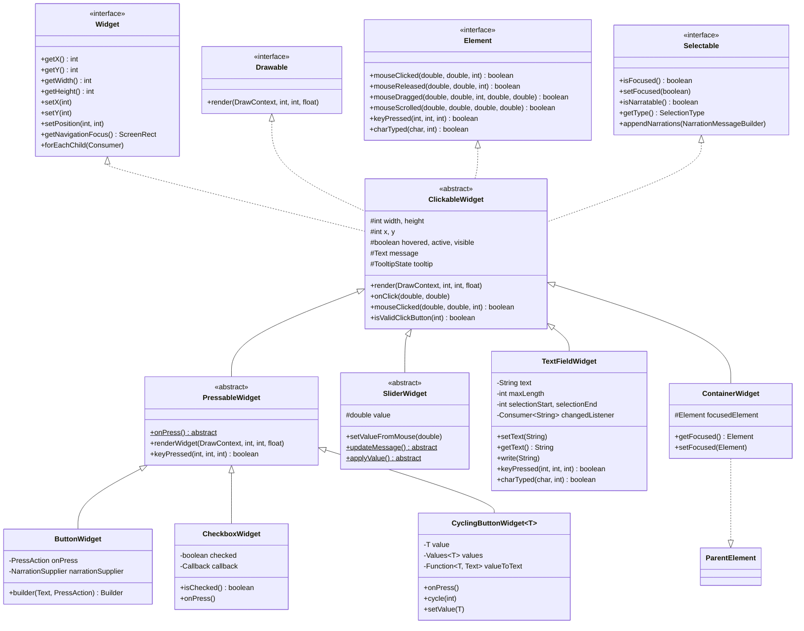

# GUI组件系统 (GUI Widget System)

> 分析基于 Minecraft 1.21 反编译源代码 (CFR 0.2.2)
> 包路径: `net.minecraft.client.gui.widget`

---

## 1. 概述 (Overview)

Minecraft 1.21 的 GUI Widget 系统是客户端用户界面的核心组件框架，提供了一套完整的可交互 UI 组件体系。该系统采用了经典的组合模式 (Composite Pattern) 和策略模式 (Strategy Pattern)，使得各种 UI 组件能够以统一的方式进行处理，同时保持高度的可扩展性。

### 1.1 设计目标

GUI Widget 系统的核心设计目标包括：

1. **统一接口**: 所有组件都实现 `Widget` 接口，提供一致的位置和尺寸操作方法
2. **事件处理**: 支持鼠标、键盘和游戏手柄等多种输入方式
3. **组合能力**: 通过 `LayoutWidget` 支持嵌套布局，实现复杂的 UI 结构
4. **无障碍支持**: 内置屏幕阅读器 narration 功能
5. **主题兼容**: 通过纹理系统支持不同视觉风格

### 1.2 核心接口层次

```
Widget (interface)
├── ClickableWidget (abstract class)
│   ├── PressableWidget (abstract class)
│   │   ├── ButtonWidget
│   │   ├── CheckboxWidget
│   │   └── CyclingButtonWidget<T>
│   ├── SliderWidget (abstract class)
│   │   └── OptionSliderWidget
│   ├── TextFieldWidget
│   ├── ContainerWidget
│   │   └── EntryListWidget
│   └── ToggleButtonWidget
├── LayoutWidget (interface)
│   ├── WrapperWidget (abstract class)
│   │   ├── GridWidget
│   │   └── SimplePositioningWidget
│   └── DirectionalLayoutWidget
└── TextWidget / IconWidget / EmptyWidget
```

### 1.3 源码路径

```
D:\Minecraft-Learning\assets\mc\1.21\net\minecraft\client\gui\widget\Widget.java
D:\Minecraft-Learning\assets\mc\1.21\net\minecraft\client\gui\widget\ClickableWidget.java
D:\Minecraft-Learning\assets\mc\1.21\net\minecraft\client\gui\widget\ButtonWidget.java
D:\Minecraft-Learning\assets\mc\1.21\net\minecraft\client\gui\widget\TextFieldWidget.java
D:\Minecraft-Learning\assets\mc\1.21\net\minecraft\client\gui\widget\SliderWidget.java
D:\Minecraft-Learning\assets\mc\1.21\net\minecraft\client\gui\widget\GridWidget.java
```

---

## 2. 组件基类 (Widget Base)

### 2.1 Widget 接口

`Widget` 接口是所有 GUI 组件的根接口，定义了组件的基本属性和操作方法。

```33:36:D:\Minecraft-Learning\assets\mc\1.21\net\minecraft\client\gui\widget\Widget.java
public interface Widget {
    public void setX(int var1);
    public void setY(int var1);
    public int getX();
    public int getY();
    public int getWidth();
    public int getHeight();

    default public ScreenRect getNavigationFocus() {
        return new ScreenRect(this.getX(), this.getY(), this.getWidth(), this.getHeight());
    }

    default public void setPosition(int x, int y) {
        this.setX(x);
        this.setY(y);
    }

    public void forEachChild(Consumer<ClickableWidget> var1);
}
```

**核心方法说明**：

| 方法 | 功能 | 返回值 |
|------|------|--------|
| `getX/getY` | 获取组件左上角坐标 | int |
| `setX/setY` | 设置组件位置 | void |
| `getWidth/getHeight` | 获取组件尺寸 | int |
| `getNavigationFocus` | 获取导航焦点区域 | ScreenRect |
| `setPosition` | 批量设置位置 | void |
| `forEachChild` | 遍历子组件 | void |

### 2.2 ClickableWidget 抽象类

`ClickableWidget` 是所有可点击组件的基类，实现了 `Drawable`、`Element`、`Widget` 和 `Selectable` 四个接口。

```38:65:D:\Minecraft-Learning\assets\mc\1.21\net\minecraft\client\gui\widget\ClickableWidget.java
@Environment(value=EnvType.CLIENT)
public abstract class ClickableWidget
implements Drawable,
Element,
Widget,
Selectable {
    private static final double field_43055 = 0.5;
    private static final double field_43056 = 3.0;
    protected int width;
    protected int height;
    private int x;
    private int y;
    private Text message;
    protected boolean hovered;
    public boolean active = true;
    public boolean visible = true;
    protected float alpha = 1.0f;
    private int navigationOrder;
    private boolean focused;
    private final TooltipState tooltip = new TooltipState();

    public ClickableWidget(int x, int y, int width, int height, Text message) {
        this.x = x;
        this.y = y;
        this.width = width;
        this.height = height;
        this.message = message;
    }
```

**关键属性**：

| 属性 | 类型 | 说明 |
|------|------|------|
| `width/height` | int | 组件尺寸 |
| `x/y` | int | 组件位置 |
| `message` | Text | 显示的文本消息 |
| `hovered` | boolean | 鼠标悬停状态 |
| `active` | boolean | 是否激活（可交互） |
| `visible` | boolean | 是否可见 |
| `alpha` | float | 透明度 (0.0-1.0) |
| `focused` | boolean | 键盘焦点状态 |
| `tooltip` | TooltipState | 提示框状态 |

### 2.3 渲染流程

`ClickableWidget` 的渲染采用模板方法模式，核心渲染逻辑如下：

```73:80:D:\Minecraft-Learning\assets\mc\1.21\net\minecraft\client\gui\widget\ClickableWidget.java
@Override
public final void render(DrawContext context, int mouseX, int mouseY, float delta) {
    if (!this.visible) {
        return;
    }
    this.hovered = context.scissorContains(mouseX, mouseY) && mouseX >= this.getX() && mouseY >= this.getY() && mouseX < this.getX() + this.width && mouseY < this.getY() + this.height;
    this.renderWidget(context, mouseX, mouseY, delta);
    this.tooltip.render(this.isHovered(), this.isFocused(), this.getNavigationFocus());
}
```

渲染流程分为三个步骤：
1. **可见性检查**: 如果 `visible` 为 `false`，直接返回
2. **悬停状态更新**: 通过 scissor 测试和坐标比较确定是否悬停
3. **子类渲染**: 调用 `renderWidget` 进行实际绘制
4. **提示框渲染**: 如果有提示信息，在组件上方显示

### 2.4 鼠标事件处理

ClickableWidget 提供了完整的鼠标事件处理机制：

```144:181:D:\Minecraft-Learning\assets\mc\1.21\net\minecraft\client\gui\widget\ClickableWidget.java
@Override
public boolean mouseClicked(double mouseX, double mouseY, int button) {
    boolean bl;
    if (!this.active || !this.visible) {
        return false;
    }
    if (this.isValidClickButton(button) && (bl = this.clicked(mouseX, mouseY))) {
        this.playDownSound(MinecraftClient.getInstance().getSoundManager());
        this.onClick(mouseX, mouseY);
        return true;
    }
    return false;
}

protected boolean clicked(double mouseX, double mouseY) {
    return this.active && this.visible && mouseX >= (double)this.getX() && mouseY >= (double)this.getY() && mouseX < (double)(this.getX() + this.getWidth()) && mouseY < (double)(this.getY() + this.getHeight());
}

public void onClick(double mouseX, double mouseY) {
}
```

**事件处理方法**：

| 方法 | 说明 | 可重写 |
|------|------|--------|
| `mouseClicked` | 鼠标按下事件 | 否 |
| `mouseReleased` | 鼠标释放事件 | 可 |
| `mouseDragged` | 鼠标拖拽事件 | 可 |
| `onClick` | 点击回调 | 是 |
| `onRelease` | 释放回调 | 是 |
| `onDrag` | 拖拽回调 | 是 |

### 2.5 DrawableWidget 机制

虽然 `Drawable` 是一个标记接口，但它定义了渲染的统一入口：

```java
public interface Drawable {
    void render(DrawContext context, int mouseX, int mouseY, float delta);
}
```

所有 Widget 都实现了这个接口，确保它们可以被统一渲染。

---

## 3. 按钮组件 (Button Widget)

### 3.1 ButtonWidget 类结构

`ButtonWidget` 是 Minecraft 中最常用的按钮组件，继承自 `PressableWidget`。

```17:36:D:\Minecraft-Learning\assets\mc\1.21\net\minecraft\client\gui\widget\ButtonWidget.java
@Environment(value=EnvType.CLIENT)
public class ButtonWidget
extends PressableWidget {
    public static final int DEFAULT_WIDTH_SMALL = 120;
    public static final int DEFAULT_WIDTH = 150;
    public static final int field_49479 = 200;
    public static final int DEFAULT_HEIGHT = 20;
    public static final int field_46856 = 8;
    protected static final NarrationSupplier DEFAULT_NARRATION_SUPPLIER = textSupplier -> (MutableText)textSupplier.get();
    protected final PressAction onPress;
    protected final NarrationSupplier narrationSupplier;

    public static Builder builder(Text message, PressAction onPress) {
        return new Builder(message, onPress);
    }

    protected ButtonWidget(int x, int y, int width, int height, Text message, PressAction onPress, NarrationSupplier narrationSupplier) {
        super(x, y, width, height, message);
        this.onPress = onPress;
        this.narrationSupplier = narrationSupplier;
    }
```

**默认尺寸常量**：

| 常量 | 值 | 用途 |
|------|-----|------|
| `DEFAULT_WIDTH_SMALL` | 120 | 小按钮宽度 |
| `DEFAULT_WIDTH` | 150 | 默认按钮宽度 |
| `DEFAULT_HEIGHT` | 20 | 默认按钮高度 |

### 3.2 Builder 模式

`ButtonWidget` 使用 Builder 模式创建实例，提供了流畅的 API：

```54:106:D:\Minecraft-Learning\assets\mc\1.21\net\minecraft\client\gui\widget\ButtonWidget.java
@Environment(value=EnvType.CLIENT)
public static class Builder {
    private final Text message;
    private final PressAction onPress;
    @Nullable
    private Tooltip tooltip;
    private int x;
    private int y;
    private int width = 150;
    private int height = 20;
    private NarrationSupplier narrationSupplier = DEFAULT_NARRATION_SUPPLIER;

    public Builder(Text message, PressAction onPress) {
        this.message = message;
        this.onPress = onPress;
    }

    public Builder position(int x, int y) { ... }
    public Builder width(int width) { ... }
    public Builder size(int width, int height) { ... }
    public Builder dimensions(int x, int y, int width, int height) { ... }
    public Builder tooltip(@Nullable Tooltip tooltip) { ... }
    public Builder narrationSupplier(NarrationSupplier narrationSupplier) { ... }
    public ButtonWidget build() { ... }
}
```

**使用示例**：

```java
ButtonWidget button = ButtonWidget.builder(Text.literal("Click Me"), buttonWidget -> {
    // 处理点击事件
    System.out.println("Button clicked!");
})
.dimensions(100, 100, 150, 20)
.tooltip(Tooltip.of(Text.literal("This is a hint")))
.build();
```

### 3.3 PressableWidget 基类

`PressableWidget` 是可按下组件的抽象基类，处理键盘交互：

```24:68:D:\Minecraft-Learning\assets\mc\1.21\net\minecraft\client\gui\widget\PressableWidget.java
@Environment(value=EnvType.CLIENT)
public abstract class PressableWidget
extends ClickableWidget {
    protected static final int field_43050 = 2;
    private static final ButtonTextures TEXTURES = new ButtonTextures(
        Identifier.ofVanilla("widget/button"),
        Identifier.ofVanilla("widget/button_disabled"),
        Identifier.ofVanilla("widget/button_highlighted")
    );

    public abstract void onPress();

    @Override
    protected void renderWidget(DrawContext context, int mouseX, int mouseY, float delta) {
        MinecraftClient minecraftClient = MinecraftClient.getInstance();
        context.setShaderColor(1.0f, 1.0f, 1.0f, this.alpha);
        RenderSystem.enableBlend();
        RenderSystem.enableDepthTest();
        context.drawGuiTexture(TEXTURES.get(this.active, this.isSelected()), this.getX(), this.getY(), this.getWidth(), this.getHeight());
        context.setShaderColor(1.0f, 1.0f, 1.0f, 1.0f);
        int i = this.active ? 0xFFFFFF : 0xA0A0A0;
        this.drawMessage(context, minecraftClient.textRenderer, i | MathHelper.ceil(this.alpha * 255.0f) << 24);
    }

    @Override
    public boolean keyPressed(int keyCode, int scanCode, int modifiers) {
        if (!this.active || !this.visible) {
            return false;
        }
        if (KeyCodes.isToggle(keyCode)) {
            this.playDownSound(MinecraftClient.getInstance().getSoundManager());
            this.onPress();
            return true;
        }
        return false;
    }
}
```

**键盘支持**：
- 当组件获得焦点时，按下 **Enter** 或 **Space** 键会触发 `onPress()` 方法
- `KeyCodes.isToggle()` 用于检测触发键

### 3.4 其他按钮类型

#### 3.4.1 CheckboxWidget

复选框组件，用于布尔选项：

```23:43:D:\Minecraft-Learning\assets\mc\1.21\net\minecraft\client\gui\widget\CheckboxWidget.java
@Environment(value=EnvType.CLIENT)
public class CheckboxWidget
extends PressableWidget {
    private static final Identifier SELECTED_HIGHLIGHTED_TEXTURE = Identifier.ofVanilla("widget/checkbox_selected_highlighted");
    private static final Identifier SELECTED_TEXTURE = Identifier.ofVanilla("widget/checkbox_selected");
    private static final Identifier HIGHLIGHTED_TEXTURE = Identifier.ofVanilla("widget/checkbox_highlighted");
    private static final Identifier TEXTURE = Identifier.ofVanilla("widget/checkbox");
    private boolean checked;
    private final Callback callback;

    @Override
    public void onPress() {
        this.checked = !this.checked;
        this.callback.onValueChange(this, this.checked);
    }
}
```

#### 3.4.2 CyclingButtonWidget

循环按钮，用于在多个值之间切换：

```25:50:D:\Minecraft-Learning\assets\mc\1.21\net\minecraft\client\gui\widget\CyclingButtonWidget.java
@Environment(value=EnvType.CLIENT)
public class CyclingButtonWidget<T>
extends PressableWidget {
    public static final BooleanSupplier HAS_ALT_DOWN = Screen::hasAltDown;
    private static final List<Boolean> BOOLEAN_VALUES = ImmutableList.of(Boolean.TRUE, Boolean.FALSE);
    private final Text optionText;
    private int index;
    private T value;
    private final Values<T> values;
    private final Function<T, Text> valueToText;
    private final UpdateCallback<T> callback;

    @Override
    public void onPress() {
        if (Screen.hasShiftDown()) {
            this.cycle(-1);
        } else {
            this.cycle(1);
        }
    }

    public boolean mouseScrolled(double mouseX, double mouseY, double horizontalAmount, double verticalAmount) {
        if (verticalAmount > 0.0) {
            this.cycle(-1);
        } else if (verticalAmount < 0.0) {
            this.cycle(1);
        }
        return true;
    }
}
```

**使用示例**：

```java
CyclingButtonWidget<Boolean> toggle = CyclingButtonWidget.onOffBuilder()
    .initially(true)
    .build(Text.literal("Auto-Jump"), (button, value) -> {
        // 处理值变化
    });
```

#### 3.4.3 ToggleButtonWidget

开关按钮组件：

```17:54:D:\Minecraft-Learning\assets\mc\1.21\net\minecraft\client\gui\widget\ToggleButtonWidget.java
@Environment(value=EnvType.CLIENT)
public class ToggleButtonWidget
extends ClickableWidget {
    @Nullable
    protected ButtonTextures textures;
    protected boolean toggled;

    public ToggleButtonWidget(int x, int y, int width, int height, boolean toggled) {
        super(x, y, width, height, ScreenTexts.EMPTY);
        this.toggled = toggled;
    }

    public void setToggled(boolean toggled) {
        this.toggled = toggled;
    }

    public boolean isToggled() {
        return this.toggled;
    }
}
```

---

## 4. 文本框组件 (TextField Widget)

### 4.1 TextFieldWidget 类结构

`TextFieldWidget` 是单行文本输入框组件，功能完善：

```35:68:D:\Minecraft-Learning\assets\mc\1.21\net\minecraft\client\gui\widget\TextFieldWidget.java
@Environment(value=EnvType.CLIENT)
public class TextFieldWidget
extends ClickableWidget
implements Drawable {
    private static final ButtonTextures TEXTURES = new ButtonTextures(
        Identifier.ofVanilla("widget/text_field"),
        Identifier.ofVanilla("widget/text_field_highlighted")
    );
    private static final int VERTICAL_CURSOR_COLOR = -3092272;
    private static final String HORIZONTAL_CURSOR = "_";
    public static final int DEFAULT_EDITABLE_COLOR = 0xE0E0E0;
    private final TextRenderer textRenderer;
    private String text = "";
    private int maxLength = 32;
    private boolean drawsBackground = true;
    private boolean focusUnlocked = true;
    private boolean editable = true;
    private int firstCharacterIndex;
    private int selectionStart;
    private int selectionEnd;
    private int editableColor = 0xE0E0E0;
    private int uneditableColor = 0x707070;
    @Nullable
    private String suggestion;
    @Nullable
    private Consumer<String> changedListener;
    private Predicate<String> textPredicate = Objects::nonNull;
    private BiFunction<String, Integer, OrderedText> renderTextProvider = (string, firstCharacterIndex) -> OrderedText.styledForwardsVisitedString(string, Style.EMPTY);
    @Nullable
    private Text placeholder;
    private long lastSwitchFocusTime = Util.getMeasuringTimeMs();
```

### 4.2 核心功能

#### 4.2.1 文本操作

```100:154:D:\Minecraft-Learning\assets\mc\1.21\net\minecraft\client\gui\widget\TextFieldWidget.java
public void setText(String text) {
    if (!this.textPredicate.test(text)) {
        return;
    }
    this.text = text.length() > this.maxLength ? text.substring(0, this.maxLength) : text;
    this.setCursorToEnd(false);
    this.setSelectionEnd(this.selectionStart);
    this.onChanged(text);
}

public String getText() {
    return this.text;
}

public String getSelectedText() {
    int i = Math.min(this.selectionStart, this.selectionEnd);
    int j = Math.max(this.selectionStart, this.selectionEnd);
    return this.text.substring(i, j);
}

public void write(String text) {
    String string2;
    int i = Math.min(this.selectionStart, this.selectionEnd);
    int j = Math.max(this.selectionStart, this.selectionEnd);
    int k = this.maxLength - this.text.length() - (i - j);
    if (k <= 0) {
        return;
    }
    String string = StringHelper.stripInvalidChars(text);
    int l = string.length();
    if (k < l) {
        if (Character.isHighSurrogate(string.charAt(k - 1))) {
            --k;
        }
        string = string.substring(0, k);
        l = k;
    }
    if (!this.textPredicate.test(string2 = new StringBuilder(this.text).replace(i, j, string).toString())) {
        return;
    }
    this.text = string2;
    this.setSelectionStart(i + l);
    this.setSelectionEnd(this.selectionStart);
    this.onChanged(this.text);
}
```

#### 4.2.2 键盘处理

```264:329:D:\Minecraft-Learning\assets\mc\1.21\net\minecraft\client\gui\widget\TextFieldWidget.java
@Override
public boolean keyPressed(int keyCode, int scanCode, int modifiers) {
    if (!this.isNarratable() || !this.isFocused()) {
        return false;
    }
    switch (keyCode) {
        case 263: {  // Left Arrow
            if (Screen.hasControlDown()) {
                this.setCursor(this.getWordSkipPosition(-1), Screen.hasShiftDown());
            } else {
                this.moveCursor(-1, Screen.hasShiftDown());
            }
            return true;
        }
        case 262: {  // Right Arrow
            if (Screen.hasControlDown()) {
                this.setCursor(this.getWordSkipPosition(1), Screen.hasShiftDown());
            } else {
                this.moveCursor(1, Screen.hasShiftDown());
            }
            return true;
        }
        case 259: {  // Backspace
            if (this.editable) {
                this.erase(-1);
            }
            return true;
        }
        case 261: {  // Delete
            if (this.editable) {
                this.erase(1);
            }
            return true;
        }
        case 268: {  // Home
            this.setCursorToStart(Screen.hasShiftDown());
            return true;
        }
        case 269: {  // End
            this.setCursorToEnd(Screen.hasShiftDown());
            return true;
        }
    }
    if (Screen.isSelectAll(keyCode)) { ... }
    if (Screen.isCopy(keyCode)) { ... }
    if (Screen.isPaste(keyCode)) { ... }
    if (Screen.isCut(keyCode)) { ... }
    return false;
}
```

**支持的快捷键**：

| 快捷键 | 功能 |
|--------|------|
| `Ctrl + Left/Right` | 按单词移动光标 |
| `Left/Right` | 按字符移动光标 |
| `Backspace/Delete` | 删除字符 |
| `Ctrl + Backspace/Delete` | 删除单词 |
| `Home/End` | 移动到行首/行尾 |
| `Ctrl + A` | 全选 |
| `Ctrl + C` | 复制 |
| `Ctrl + V` | 粘贴 |
| `Ctrl + X` | 剪切 |

#### 4.2.3 字符输入

```336:347:D:\Minecraft-Learning\assets\mc\1.21\net\minecraft\client\gui\widget\TextFieldWidget.java
@Override
public boolean charTyped(char chr, int modifiers) {
    if (!this.isActive()) {
        return false;
    }
    if (StringHelper.isValidChar(chr)) {
        if (this.editable) {
            this.write(Character.toString(chr));
        }
        return true;
    }
    return false;
}
```

### 4.3 光标和选择渲染

```364:413:D:\Minecraft-Learning\assets\mc\1.21\net\minecraft\client\gui\widget\TextFieldWidget.java
@Override
public void renderWidget(DrawContext context, int mouseX, int mouseY, float delta) {
    if (!this.isVisible()) {
        return;
    }
    if (this.drawsBackground()) {
        Identifier identifier = TEXTURES.get(this.isNarratable(), this.isFocused());
        context.drawGuiTexture(identifier, this.getX(), this.getY(), this.getWidth(), this.getHeight());
    }
    int i = this.editable ? this.editableColor : this.uneditableColor;
    int j = this.selectionStart - this.firstCharacterIndex;
    String string = this.textRenderer.trimToWidth(this.text.substring(this.firstCharacterIndex), this.getInnerWidth());
    boolean bl = j >= 0 && j <= string.length();
    boolean bl2 = this.isFocused() && (Util.getMeasuringTimeMs() - this.lastSwitchFocusTime) / 300L % 2L == 0L && bl;
    // ... 文本渲染逻辑 ...
    if (bl2) {
        if (bl3) {
            context.fill(RenderLayer.getGuiOverlay(), o, l - 1, o + 1, l + 1 + this.textRenderer.fontHeight, -3092272);
        } else {
            context.drawTextWithShadow(this.textRenderer, HORIZONTAL_CURSOR, o, l, i);
        }
    }
    if (n != j) {
        int p = k + this.textRenderer.getWidth(string.substring(0, n));
        this.drawSelectionHighlight(context, o, l - 1, p - 1, l + 1 + this.textRenderer.fontHeight);
    }
}
```

**渲染特性**：
- 光标闪烁频率: 300ms (通过 `lastSwitchFocusTime` 实现)
- 文本水平滚动: 当文本超出宽度时自动滚动
- 选择高亮: 蓝色半透明背景

### 4.4 EditBoxWidget 多行文本框

`EditBoxWidget` 是 `TextFieldWidget` 的多行版本：

```29:52:D:\Minecraft-Learning\assets\mc\1.21\net\minecraft\client\gui\widget\EditBoxWidget.java
@Environment(value=EnvType.CLIENT)
public class EditBoxWidget
extends ScrollableWidget {
    private static final int CURSOR_COLOR = -3092272;
    private static final int FOCUSED_BOX_TEXT_COLOR = -2039584;
    private static final int UNFOCUSED_BOX_TEXT_COLOR = -857677600;
    private static final int CURSOR_BLINK_INTERVAL = 300;
    private final TextRenderer textRenderer;
    private final Text placeholder;
    private final EditBox editBox;

    public EditBoxWidget(TextRenderer textRenderer, int x, int y, int width, int height, Text placeholder, Text message) {
        super(x, y, width, height, message);
        this.textRenderer = textRenderer;
        this.placeholder = placeholder;
        this.editBox = new EditBox(textRenderer, width - this.getPaddingDoubled());
        this.editBox.setCursorChangeListener(this::onCursorChange);
    }
```

---

## 5. 滑块组件 (Slider Widget)

### 5.1 SliderWidget 类结构

`SliderWidget` 是滑块组件的抽象基类：

```24:40:D:\Minecraft-Learning\assets\mc\1.21\net\minecraft\client\gui\widget\SliderWidget.java
@Environment(value=EnvType.CLIENT)
public abstract class SliderWidget
extends ClickableWidget {
    private static final Identifier TEXTURE = Identifier.ofVanilla("widget/slider");
    private static final Identifier HIGHLIGHTED_TEXTURE = Identifier.ofVanilla("widget/slider_highlighted");
    private static final Identifier HANDLE_TEXTURE = Identifier.ofVanilla("widget/slider_handle");
    private static final Identifier HANDLE_HIGHLIGHTED_TEXTURE = Identifier.ofVanilla("widget/slider_handle_highlighted");
    protected static final int field_43054 = 2;
    private static final int field_41790 = 8;
    private static final int field_41789 = 4;
    protected double value;

    public SliderWidget(int x, int y, int width, int height, Text text, double value) {
        super(x, y, width, height, text);
        this.value = value;
    }
```

### 5.2 值控制

```130:164:D:\Minecraft-Learning\assets\mc\1.21\net\minecraft\client\gui\widget\SliderWidget.java
private void setValueFromMouse(double mouseX) {
    this.setValue((mouseX - (double)(this.getX() + 4)) / (double)(this.width - 8));
}

private void setValue(double value) {
    double d = this.value;
    this.value = MathHelper.clamp(value, 0.0, 1.0);
    if (d != this.value) {
        this.applyValue();
    }
    this.updateMessage();
}

@Override
protected void onDrag(double mouseX, double mouseY, double deltaX, double deltaY) {
    this.setValueFromMouse(mouseX);
    super.onDrag(mouseX, mouseY, deltaX, deltaY);
}

@Override
public void onClick(double mouseX, double mouseY) {
    this.setValueFromMouse(mouseX);
}

protected abstract void updateMessage();
protected abstract void applyValue();
```

**子类需要实现**：
- `updateMessage()`: 更新滑块上显示的文本
- `applyValue()`: 应用值变化到实际配置

### 5.3 键盘导航

```105:120:D:\Minecraft-Learning\assets\mc\1.21\net\minecraft\client\gui\widget\SliderWidget.java
@Override
public boolean keyPressed(int keyCode, int scanCode, int modifiers) {
    if (KeyCodes.isToggle(keyCode)) {
        this.sliderFocused = !this.sliderFocused;
        return true;
    }
    if (this.sliderFocused) {
        boolean bl;
        boolean bl2 = bl = keyCode == GLFW.GLFW_KEY_LEFT;
        if (bl || keyCode == GLFW.GLFW_KEY_RIGHT) {
            float f = bl ? -1.0f : 1.0f;
            this.setValue(this.value + (double)(f / (float)(this.width - 8)));
            return true;
        }
    }
    return false;
}
```

### 5.4 OptionSliderWidget

`OptionSliderWidget` 是与游戏选项系统集成的滑块：

```13:21:D:\Minecraft-Learning\assets\mc\1.21\net\minecraft\client\gui\widget\OptionSliderWidget.java
@Environment(value=EnvType.CLIENT)
public abstract class OptionSliderWidget
extends SliderWidget {
    protected final GameOptions options;

    protected OptionSliderWidget(GameOptions options, int x, int y, int width, int height, double value) {
        super(x, y, width, height, ScreenTexts.EMPTY, value);
        this.options = options;
    }
}
```

---

## 6. 组件布局 (Widget Layout)

### 6.1 LayoutWidget 接口

`LayoutWidget` 接口定义了布局容器的行为：

```13:30:D:\Minecraft-Learning\assets\mc\1.21\net\minecraft\client\gui\widget\LayoutWidget.java
@Environment(value=EnvType.CLIENT)
public interface LayoutWidget
extends Widget {
    public void forEachElement(Consumer<Widget> var1);

    @Override
    default public void forEachChild(Consumer<ClickableWidget> consumer) {
        this.forEachElement(element -> element.forEachChild(consumer));
    }

    default public void refreshPositions() {
        this.forEachElement(element -> {
            if (element instanceof LayoutWidget) {
                LayoutWidget layoutWidget = (LayoutWidget)element;
                layoutWidget.refreshPositions();
            }
        });
    }
}
```

### 6.2 GridWidget - 网格布局

`GridWidget` 实现了二维网格布局：

```24:60:D:\Minecraft-Learning\assets\mc\1.21\net\minecraft\client\gui\widget\GridWidget.java
@Environment(value=EnvType.CLIENT)
public class GridWidget
extends WrapperWidget {
    private final List<Widget> children = new ArrayList<Widget>();
    private final List<Element> grids = new ArrayList<Element>();
    private final Positioner mainPositioner = Positioner.create();
    private int rowSpacing = 0;
    private int columnSpacing = 0;

    public <T extends Widget> T add(T widget, int row, int column) {
        return this.add(widget, row, column, this.copyPositioner());
    }

    public <T extends Widget> T add(T widget, int row, int column, int occupiedRows, int occupiedColumns) {
        return this.add(widget, row, column, occupiedRows, occupiedColumns, this.copyPositioner());
    }

    public GridWidget setColumnSpacing(int columnSpacing) { ... }
    public GridWidget setRowSpacing(int rowSpacing) { ... }
    public GridWidget setSpacing(int spacing) { ... }

    public Adder createAdder(int columns) {
        return new Adder(columns);
    }
}
```

**GridWidget.Element 内部类**：

```157:178:D:\Minecraft-Learning\assets\mc\1.21\net\minecraft\client\gui\widget\GridWidget.java
@Environment(value=EnvType.CLIENT)
static class Element
extends WrapperWidget.WrappedElement {
    final int row;
    final int column;
    final int occupiedRows;
    final int occupiedColumns;

    Element(Widget widget, int row, int column, int occupiedRows, int occupiedColumns, Positioner positioner) {
        super(widget, positioner.toImpl());
        this.row = row;
        this.column = column;
        this.occupiedRows = occupiedRows;
        this.occupiedColumns = occupiedColumns;
    }

    public int getRowEnd() {
        return this.row + this.occupiedRows - 1;
    }

    public int getColumnEnd() {
        return this.column + this.occupiedColumns - 1;
    }
}
```

### 6.3 DirectionalLayoutWidget - 方向布局

`DirectionalLayoutWidget` 实现单方向（水平或垂直）布局：

```24:138:D:\Minecraft-Learning\assets\mc\1.21\net\minecraft\client\gui\widget\DirectionalLayoutWidget.java
@Environment(value=EnvType.CLIENT)
public class DirectionalLayoutWidget
implements LayoutWidget {
    private final GridWidget grid;
    private final DisplayAxis axis;
    private int currentIndex = 0;

    public DirectionalLayoutWidget(int x, int y, DisplayAxis axis) {
        this.grid = new GridWidget(x, y);
        this.axis = axis;
    }

    public DirectionalLayoutWidget spacing(int spacing) {
        this.axis.setSpacing(this.grid, spacing);
        return this;
    }

    public <T extends Widget> T add(T widget) {
        return this.add(widget, this.copyPositioner());
    }

    public static DirectionalLayoutWidget vertical() { ... }
    public static DirectionalLayoutWidget horizontal() { ... }

    @Environment(value=EnvType.CLIENT)
    public static enum DisplayAxis {
        HORIZONTAL,
        VERTICAL;

        void setSpacing(GridWidget grid, int spacing) { ... }
        public <T extends Widget> T add(GridWidget grid, T widget, int index, Positioner positioner) { ... }
    }
}
```

### 6.4 ThreePartsLayoutWidget - 三段布局

`ThreePartsLayoutWidget` 实现头部-主体-底部三段布局，常用于设置界面：

```19:70:D:\Minecraft-Learning\assets\mc\1.21\net\minecraft\client\gui\widget\ThreePartsLayoutWidget.java
@Environment(value=EnvType.CLIENT)
public class ThreePartsLayoutWidget
implements LayoutWidget {
    public static final int DEFAULT_HEADER_FOOTER_HEIGHT = 33;
    private static final int FOOTER_MARGIN_TOP = 30;
    private final SimplePositioningWidget header = new SimplePositioningWidget();
    private final SimplePositioningWidget footer = new SimplePositioningWidget();
    private final SimplePositioningWidget body = new SimplePositioningWidget();
    private final Screen screen;
    private int headerHeight;
    private int footerHeight;

    public <T extends Widget> T addHeader(T widget) { ... }
    public <T extends Widget> T addFooter(T widget) { ... }
    public <T extends Widget> T addBody(T widget) { ... }

    @Override
    public void refreshPositions() {
        int i = this.getHeaderHeight();
        int j = this.getFooterHeight();
        this.header.setMinWidth(this.screen.width);
        this.header.setMinHeight(i);
        this.header.setPosition(0, 0);
        this.header.refreshPositions();
        this.footer.setMinWidth(this.screen.width);
        this.footer.setMinHeight(j);
        this.footer.refreshPositions();
        this.footer.setY(this.screen.height - j);
        // ...
    }
}
```

### 6.5 Positioner - 定位器

`Positioner` 用于精细控制组件在布局中的位置和对齐：

```10:65:D:\Minecraft-Learning\assets\mc\1.21\net\minecraft\client\gui\widget\Positioner.java
@Environment(value=EnvType.CLIENT)
public interface Positioner {
    public Positioner margin(int var1);
    public Positioner margin(int var1, int var2);
    public Positioner margin(int var1, int var2, int var3, int var4);
    public Positioner marginLeft(int var1);
    public Positioner marginTop(int var1);
    public Positioner marginRight(int var1);
    public Positioner marginBottom(int var1);
    public Positioner marginX(int var1);
    public Positioner marginY(int var1);
    public Positioner relative(float var1, float var2);
    public Positioner relativeX(float var1);
    public Positioner relativeY(float var1);

    default public Positioner alignLeft() { return this.relativeX(0.0f); }
    default public Positioner alignHorizontalCenter() { return this.relativeX(0.5f); }
    default public Positioner alignRight() { return this.relativeX(1.0f); }
    default public Positioner alignTop() { return this.relativeY(0.0f); }
    default public Positioner alignVerticalCenter() { return this.relativeY(0.5f); }
    default public Positioner alignBottom() { return this.relativeY(1.0f); }

    public Positioner copy();
    public Impl toImpl();
}
```

**使用示例**：

```java
GridWidget grid = new GridWidget(0, 0);
ButtonWidget button = grid.add(new ButtonWidget(...), 0, 0, positioner -> {
    positioner.relative(0.5f, 0.5f)  // 居中
              .margin(10);             // 10像素边距
});
```

---

## 7. 事件处理 (Event Handling)

### 7.1 事件接口层次

```
Element (interface)
├── mouseClicked
├── mouseReleased
├── mouseDragged
├── mouseScrolled
├── keyPressed
├── charTyped
└── ...

ParentElement (interface)
├── children: List<Element>
├── getNavigationPath
└── ...

Selectable (interface)
├── SelectionType
├── isFocused
├── isNarratable
└── appendNarrations
```

### 7.2 焦点管理

`ClickableWidget` 实现了 `Selectable` 接口，支持焦点状态：

```230:261:D:\Minecraft-Learning\assets\mc\1.21\net\minecraft\client\gui\widget\ClickableWidget.java
@Override
public boolean isFocused() {
    return this.focused;
}

public boolean isHovered() {
    return this.hovered;
}

public boolean isSelected() {
    return this.isHovered() || this.isFocused();
}

@Override
public Selectable.SelectionType getType() {
    if (this.isFocused()) {
        return Selectable.SelectionType.FOCUSED;
    }
    if (this.hovered) {
        return Selectable.SelectionType.HOVERED;
    }
    return Selectable.SelectionType.NONE;
}
```

### 7.3 容器焦点管理

`ContainerWidget` 管理其子元素的焦点：

```17:85:D:\Minecraft-Learning\assets\mc\1.21\net\minecraft\client\gui\widget\ContainerWidget.java
@Environment(value=EnvType.CLIENT)
public abstract class ContainerWidget
extends ClickableWidget
implements ParentElement {
    @Nullable
    private Element focusedElement;
    private boolean dragging;

    @Override
    @Nullable
    public Element getFocused() {
        return this.focusedElement;
    }

    @Override
    public void setFocused(@Nullable Element focused) {
        if (this.focusedElement != null) {
            this.focusedElement.setFocused(false);
        }
        if (focused != null) {
            focused.setFocused(true);
        }
        this.focusedElement = focused;
    }
}
```

### 7.4 导航系统集成

Widget 支持游戏手柄/键盘导航：

```183:193:D:\Minecraft-Learning\assets\mc\1.21\net\minecraft\client\gui\widget\ClickableWidget.java
@Override
@Nullable
public GuiNavigationPath getNavigationPath(GuiNavigation navigation) {
    if (!this.active || !this.visible) {
        return null;
    }
    if (!this.isFocused()) {
        return GuiNavigationPath.of(this);
    }
    return null;
}

@Override
public int getNavigationOrder() {
    return this.navigationOrder;
}

public void setNavigationOrder(int navigationOrder) {
    this.navigationOrder = navigationOrder;
}
```

---

## 8. 无障碍支持 (Accessibility)

### 8.1 Narration 系统

Widget 内置了屏幕阅读器 narration 功能：

```264:280:D:\Minecraft-Learning\assets\mc\1.21\net\minecraft\client\gui\widget\ClickableWidget.java
@Override
public final void appendNarrations(NarrationMessageBuilder builder) {
    this.appendClickableNarrations(builder);
    this.tooltip.appendNarrations(builder);
}

protected abstract void appendClickableNarrations(NarrationMessageBuilder var1);

protected void appendDefaultNarrations(NarrationMessageBuilder builder) {
    builder.put(NarrationPart.TITLE, (Text)this.getNarrationMessage());
    if (this.active) {
        if (this.isFocused()) {
            builder.put(NarrationPart.USAGE, (Text)Text.translatable("narration.button.usage.focused"));
        } else {
            builder.put(NarrationPart.USAGE, (Text)Text.translatable("narration.button.usage.hovered"));
        }
    }
}
```

### 8.2 组件特定叙述

每种组件都有其独特的叙述消息：

```java
// ButtonWidget
protected MutableText getNarrationMessage() {
    return ClickableWidget.getNarrationMessage(this.getMessage());
}

// TextFieldWidget
protected MutableText getNarrationMessage() {
    Text text = this.getMessage();
    return Text.translatable("gui.narrate.editBox", text, this.text);
}

// SliderWidget
protected MutableText getNarrationMessage() {
    return Text.translatable("gui.narrate.slider", this.getMessage());
}

// CheckboxWidget
protected void appendClickableNarrations(NarrationMessageBuilder builder) {
    builder.put(NarrationPart.TITLE, (Text)this.getNarrationMessage());
    if (this.active) {
        if (this.isFocused()) {
            builder.put(NarrationPart.USAGE, (Text)Text.translatable("narration.checkbox.usage.focused"));
        } else {
            builder.put(NarrationPart.USAGE, (Text)Text.translatable("narration.checkbox.usage.hovered"));
        }
    }
}
```

---

## 9. 源码分析 (Source Code Analysis)

### 9.1 关键源码文件

| 文件 | 行数 | 主要功能 |
|------|------|----------|
| `Widget.java` | 36 | 核心接口定义 |
| `ClickableWidget.java` | 338 | 可点击组件基类 |
| `PressableWidget.java` | 68 | 可按下组件基类 |
| `ButtonWidget.java` | 117 | 按钮实现 |
| `TextFieldWidget.java` | 546 | 文本输入框 |
| `SliderWidget.java` | 164 | 滑块基类 |
| `CheckboxWidget.java` | 173 | 复选框 |
| `CyclingButtonWidget.java` | 311 | 循环按钮 |
| `GridWidget.java` | 226 | 网格布局 |
| `DirectionalLayoutWidget.java` | 138 | 方向布局 |
| `ThreePartsLayoutWidget.java` | 147 | 三段布局 |
| `Positioner.java` | 232 | 定位器 |

### 9.2 设计模式分析

#### 9.2.1 模板方法模式

`ClickableWidget.render()` 使用模板方法模式：

```java
public final void render(DrawContext context, int mouseX, int mouseY, float delta) {
    if (!this.visible) return;
    this.hovered = ...;
    this.renderWidget(context, mouseX, mouseY, delta);  // 子类实现
    this.tooltip.render(...);
}
```

#### 9.2.2 Builder 模式

`ButtonWidget.Builder` 使用 Builder 模式：

```java
ButtonWidget button = ButtonWidget.builder(message, onPress)
    .position(x, y)
    .size(width, height)
    .tooltip(tooltip)
    .build();
```

#### 9.2.3 组合模式

`LayoutWidget` 使用组合模式支持嵌套：

```java
public interface LayoutWidget extends Widget {
    void forEachElement(Consumer<Widget> var1);
    default void forEachChild(Consumer<ClickableWidget> consumer) {
        this.forEachElement(element -> element.forEachChild(consumer));
    }
}
```

#### 9.2.4 策略模式

`Positioner` 使用策略模式进行布局计算：

```java
public void setX(int left, int right) {
    float f = this.positioner.marginLeft;
    float g = right - this.widget.getWidth() - this.positioner.marginRight;
    int i = (int)MathHelper.lerp(this.positioner.relativeX, f, g);
    this.widget.setX(i + left);
}
```

---

## 10. Mermaid 类图

### 10.1 Widget 继承层次



### 10.2 布局系统类图

```mermaid
classDiagram
    class Widget {
        <<interface>>
    }

    class LayoutWidget {
        <<interface>>
        +forEachElement(Consumer~Widget~)
        +refreshPositions()
    }

    class WrapperWidget {
        <<abstract>>
        #int x, y, width, height
        +setX(int)
        +setY(int)
        +forEachElement(Consumer~Widget~)
    }

    class GridWidget {
        -List~Widget~ children
        -List~Element~ grids
        -Positioner mainPositioner
        -int rowSpacing, columnSpacing
        +add(Widget, int, int) T
        +setSpacing(int) GridWidget
        +createAdder(int) Adder
        +refreshPositions()
    }

    class DirectionalLayoutWidget {
        -GridWidget grid
        -DisplayAxis axis
        +add(T widget) T
        +spacing(int) DirectionalLayoutWidget
        +vertical() DirectionalLayoutWidget
        +horizontal() DirectionalLayoutWidget
    }

    class ThreePartsLayoutWidget {
        -SimplePositioningWidget header
        -SimplePositioningWidget body
        -SimplePositioningWidget footer
        -int headerHeight, footerHeight
        +addHeader(T) T
        +addBody(T) T
        +addFooter(T) T
        +refreshPositions()
    }

    class SimplePositioningWidget {
        +add(T widget) T
        +setMinWidth(int)
        +setMinHeight(int)
        +getMainPositioner() Positioner
    }

    class Positioner {
        <<interface>>
        +margin(int) Positioner
        +marginLeft/Top/Right/Bottom(int) Positioner
        +relative(float, float) Positioner
        +alignLeft/Center/Right() Positioner
        +copy() Positioner
    }

    class Positioner$Impl {
        +int marginLeft, marginTop, marginRight, marginBottom
        +float relativeX, relativeY
        +margin(int...) Positioner$Impl
        +relative(float, float) Positioner$Impl
    }

    Widget <|.. LayoutWidget
    Widget <|.. WrapperWidget
    LayoutWidget <|.. WrapperWidget
    LayoutWidget <|.. DirectionalLayoutWidget
    LayoutWidget <|.. ThreePartsLayoutWidget

    WrapperWidget <|-- GridWidget
    WrapperWidget <|-- SimplePositioningWidget

    DirectionalLayoutWidget o-- GridWidget
    ThreePartsLayoutWidget o-- SimplePositioningWidget

    Positioner <|.. Positioner$Impl
```

---

## 11. 性能考虑 (Performance)

### 11.1 渲染优化

1. **可见性检查**: `ClickableWidget.render()` 首先检查 `visible` 标志
2. **Scissor 测试**: 使用 GPU scissor 裁剪避免不必要的绘制
3. **Alpha 通道**: 支持透明度减少混合开销

### 11.2 事件处理优化

```java
@Override
public boolean mouseClicked(double mouseX, double mouseY, int button) {
    if (!this.active || !this.visible) {
        return false;  // 快速返回
    }
    if (this.isValidClickButton(button) && this.clicked(mouseX, mouseY)) {
        // ...
    }
}
```

### 11.3 布局缓存

`GridWidget.refreshPositions()` 使用缓存机制避免重复计算：

```41:91:D:\Minecraft-Learning\assets\mc\1.21\net\minecraft\client\gui\widget\GridWidget.java
@Override
public void refreshPositions() {
    super.refreshPositions();
    // 计算所有元素的最终位置
    // 使用累加器避免重复遍历
}
```

### 11.4 最佳实践

1. **避免过度嵌套**: 深度嵌套的布局会影响性能
2. **合理使用可见性**: 不需要的组件应设置 `visible = false`
3. **批量更新**: 使用 `refreshPositions()` 批量更新布局
4. **谨慎使用动态内容**: 频繁变化的文本会影响渲染性能

---

## 12. 总结

Minecraft 1.21 的 GUI Widget 系统是一个设计精良的 UI 框架，具有以下特点：

### 12.1 核心优势

| 特性 | 描述 |
|------|------|
| **统一接口** | `Widget` 接口提供一致的组件操作 |
| **组合设计** | 支持嵌套布局，构建复杂界面 |
| **多模输入** | 支持鼠标、键盘、游戏手柄 |
| **无障碍** | 内置屏幕阅读器支持 |
| **灵活样式** | 通过纹理系统支持主题 |

### 12.2 组件类型

| 类型 | 组件 | 用途 |
|------|------|------|
| 交互 | `ButtonWidget` | 可点击按钮 |
| 交互 | `CheckboxWidget` | 布尔选项 |
| 交互 | `CyclingButtonWidget` | 多值切换 |
| 交互 | `SliderWidget` | 数值滑块 |
| 输入 | `TextFieldWidget` | 单行文本 |
| 输入 | `EditBoxWidget` | 多行文本 |
| 容器 | `GridWidget` | 网格布局 |
| 容器 | `DirectionalLayoutWidget` | 方向布局 |

### 12.3 设计模式

- **模板方法**: `ClickableWidget.render()`
- **Builder**: `ButtonWidget.Builder`
- **组合**: `LayoutWidget`
- **策略**: `Positioner`

这套系统为 Minecraft 的 UI 开发提供了坚实的基础，使得游戏界面既美观又高效。
