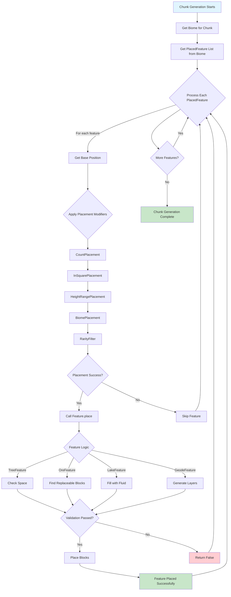
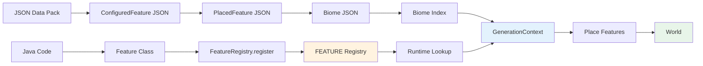
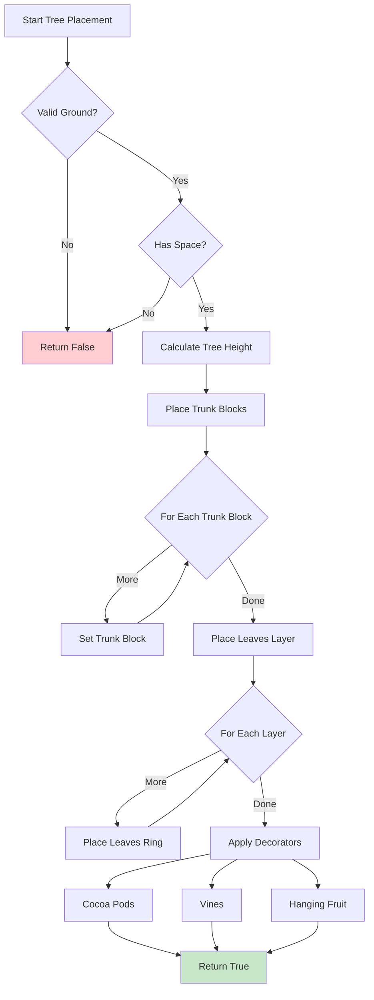

# 生成特征系统 (World Generation Feature System)

## 概述

Minecraft 的生成特征（Feature）系统是世界中生成各种结构和装饰物的核心机制。从树木、花草到矿石矿脉、地牢宝箱，这些元素都是通过 Feature 系统实现的。该系统设计得非常灵活，允许通过配置文件定义特征的生成参数，并在世界中放置这些特征。

特征系统位于 `net.minecraft.world.gen.feature` 包中，是世界生成流水线的最后阶段之一。它与地形生成（Terrain Generation）和结构生成（Structure Generation）紧密配合，共同构建完整的游戏世界。

```
┌─────────────────────────────────────────────────────────────┐
│                    World Generation Pipeline                  │
├─────────────────────────────────────────────────────────────┤
│  1. Noise Generation (Base Terrain)                          │
│  2. Carving (Caves, Ravines)                                 │
│  3. Surface (Grass, Sand, etc.)                              │
│  4. Features ← HERE                                          │
│  5. Structures (Villages, Mineshafts)                        │
│  6. Lakes & Oceans                                            │
│  7. Underground Structures (Dungeons)                        │
│  8. Mobs Spawning                                            │
│  9. Final Processing                                         │
└─────────────────────────────────────────────────────────────┘
```

## 核心类 (Core Classes)

### Feature<T extends FeatureConfig>

`Feature` 是所有生成特征的基类，是一个泛型类，接受 `FeatureConfig` 作为配置类型。

```java
public class Feature<T extends FeatureConfig> implements HolderGetterCodec<T> {
    private final Codec<T> configCodec;
    
    public Feature(Codec<T> configCodec) {
        this.configCodec = configCodec;
    }
    
    public boolean place(WorldGenLevel world, ChunkGenerator generator,
                         RandomSource random, BlockPos origin, T config) {
        // 子类实现具体的生成逻辑
        return false;
    }
}
```

**关键方法**:
- `place()` - 执行特征生成的核心方法
- `configCodec()` - 返回配置的编解码器

**特征注册**:

```java
public static final RegistryEntry<Feature<NoneFeatureConfig>> AIR = 
    FeatureRegistry.register("air", new Feature<>(NoneFeatureConfig.CODEC));

public static final RegistryEntry<Feature<OreConfiguration>> ORE = 
    FeatureRegistry.register("ore", new OreFeature(OreConfiguration.CODEC));
```

### PlacedFeature

`PlacedFeature` 表示一个已配置的、准备放置的特征。它包含了特征本身以及决定在哪里放置、如何放置的所有配置。

```java
public class PlacedFeature {
    private final Holder<ConfiguredFeature<?, ?>> feature;
    private final List<PlacementModifier> placementModifiers;
    
    public boolean place(WorldGenLevel level, ChunkGenerator generator,
                         GenerationContext context, BlockPos pos) {
        // 应用放置修饰符链
        // 调用底层特征的 place 方法
    }
}
```

**放置修饰符（PlacementModifier）**:
- `CountPlacement` - 放置数量控制
- `InSquarePlacement` - 分布范围
- `HeightRangePlacement` - 高度范围
- `BiomePlacement` - 生物群系过滤
- `RarityFilter` - 稀有度控制
- `SurfaceRelativeThresholdFilter` - 表面相对阈值

### FeatureRegistry

`FeatureRegistry` 是特征的注册表，维护所有已注册特征的全局注册表。

```java
public class FeatureRegistry {
    public static final Registry<Feature<?>> FEATURE = 
        FabricRegistryBuilder.createDefaulted(RegistryKeys.FEATURE, "feature");
    
    public static <F extends Feature<?>> RegistryEntry<F> register(
            String id, F feature) {
        // 注册特征到全局注册表
    }
}
```

### ConfiguredFeature<C extends FeatureConfig, F extends Feature<C>>

`ConfiguredFeature` 将特征与其配置绑定，形成一个完整的配置单元。

```java
public class ConfiguredFeature<C extends FeatureConfig, F extends Feature<C>> {
    private final F feature;
    private final C config;
    
    public static <C extends FeatureConfig, F extends Feature<C>> 
    ConfiguredFeature<C, F> create(F feature, C config) {
        return new ConfiguredFeature<>(feature, config);
    }
}
```

## 特征类型 (Feature Types)

Minecraft 1.21 包含多种内置特征类型，覆盖了游戏中几乎所有可生成的元素。

### 结构类特征 (Structure Features)

#### TreeFeature

树木生成是最复杂的特征之一，支持多种树木变体。

```java
public class TreeFeature extends Feature<TreeConfiguration> {
    @Override
    public boolean place(WorldGenLevel world, ChunkGenerator generator,
                         RandomSource random, BlockPos origin, 
                         TreeConfiguration config) {
        // 1. 检查空间是否足够
        if (!isSpaceAvailable(world, origin, config)) {
            return false;
        }
        
        // 2. 放置树干
        placeTrunk(world, origin, config);
        
        // 3. 放置树叶
        placeLeaves(world, origin, config);
        
        // 4. 放置装饰（花、蘑菇等）
        placeDecorations(world, origin, config);
        
        return true;
    }
}
```

**TreeConfiguration 参数**:
```java
public record TreeConfiguration(
    BlockState trunkProvider,      // 树干方块提供器
    BlockState leavesProvider,     // 树叶方块提供器
    BlockState dirtProvider,       // 泥土方块提供器
    int minimumSize,               // 最小尺寸
    boolean vines,                // 是否生成藤蔓
    boolean leaves,               // 是否生成树叶
    boolean flowers,              // 是否生成花
    int height,                   // 树干高度
    List<TreeDecorator> decorators // 装饰器列表
) {}
```

**TreeDecorator 类型**:
- `CocoaDecorator` - 可可果装饰
- `LeaveVineDecorator` - 藤蔓装饰
- `TrunkVineDecorator` - 树干藤蔓
- `LeaveAndHangingFruitDecorator` - 悬挂水果
- `AttachedToLeavesDecorator` - 树叶附件
- `GlowLichenDecorator` - 发光地衣

#### RandomSelectorFeature

随机选择器允许在同一位置选择不同类型的树木。

```java
public class RandomSelectorFeature extends Feature<RandomFeatureConfiguration> {
    @Override
    public boolean place(WorldGenLevel world, ChunkGenerator generator,
                         RandomSource random, BlockPos origin,
                         RandomFeatureConfiguration config) {
        // 从候选项中随机选择一个
        Holder<PlacedFeature> selected = config.features().getRandom(random);
        return selected.value().place(world, generator, context, origin);
    }
}
```

### 矿物类特征 (Ore Features)

#### OreFeature

矿石生成使用特殊的放置算法来创建矿脉。

```java
public class OreFeature extends Feature<OreConfiguration> {
    @Override
    public boolean place(WorldGenLevel world, ChunkGenerator generator,
                         RandomSource random, BlockPos origin,
                         OreConfiguration config) {
        float pdfValue = 0.0f;
        BlockPos.MutableBlockPos mutable = new BlockPos.MutableBlockPos();
        
        // 使用泊松分布放置矿石块
        for (int i = 0; i < config.size(); i++) {
            // 生成随机位置
            int x = random.nextInt(16);
            int y = random.nextInt(config.height().maxInclusive() - 
                                   config.height().minInclusive()) + 
                   config.height().minInclusive();
            int z = random.nextInt(16);
            
            mutable.set(origin.getX() + x, y, origin.getZ() + z);
            
            // 检查并放置
            if (canReplace(world.getBlockState(mutable), config.target(), 
                           config.floor(), config.ceil())) {
                world.setBlock(mutable, config.state(), 2);
            }
        }
        return true;
    }
}
```

**OreConfiguration 参数**:

```java
public record OreConfiguration(
    List<OreConfiguration.TargetBlockState> targetStates, // 替换目标
    int size,                     // 矿脉大小（块数）
    IntProvider height,           // 生成高度范围
    RuleTest veinFillType         // 矿脉填充规则
) {
    public record TargetBlockState(RuleTest test, BlockState state) {}
}
```

**矿石类型配置示例**:

```json
{
    "type": "minecraft:ore",
    "config": {
        "size": 9,
        "discard_chance_on_air_exposure": 0.0,
        "targets": [
            { "target": { "type": "minecraft:stone_ore_replaceables" }, 
              "state": { "Name": "minecraft:coal_ore" } },
            { "target": { "type": "minecraft:deepslate_ore_replaceables" }, 
              "state": { "Name": "minecraft:deepslate_coal_ore" } }
        ]
    }
}
```

### 水体类特征 (Water Features)

#### LakeFeature

湖泊生成在指定位置创建水体。

```java
public class LakeFeature extends Feature<LakeConfiguration> {
    @Override
    public boolean place(WorldGenLevel world, ChunkGenerator generator,
                         RandomSource random, BlockPos origin,
                         LakeConfiguration config) {
        // 填充一个区域为液体
        BlockPos.MutableBlockPos mutable = new BlockPos.MutableBlockPos();
        
        for (int x = 0; x < 16; x++) {
            for (int z = 0; z < 16; z++) {
                for (int y = world.getMinY(); y < world.getMaxY(); y++) {
                    mutable.setWithOffset(origin, x, y, z);
                    BlockState state = world.getBlockState(mutable);
                    
                    if (config.fluid().getFluid().isSource(mutable)) {
                        continue;
                    }
                    
                    if (config.barrier().is(state)) {
                        continue;
                    }
                    
                    // 检查是否为可替换方块
                    if (config.fill().test(state)) {
                        world.setBlock(mutable, config.fluid().getFluid()
                            .defaultFluidState().createLegacyBlock(), 2);
                    }
                }
            }
        }
        return true;
    }
}
```

### 地牢类特征 (Dungeon Features)

#### DesertPyramidFeature

沙漠神殿是较复杂的地牢特征，包含内部结构和战利品。

```java
public class DesertPyramidFeature extends Feature<NoneFeatureConfig> {
    @Override
    public boolean place(WorldGenLevel world, ChunkGenerator generator,
                         RandomSource random, BlockPos origin,
                         NoneFeatureConfig config) {
        // 1. 放置基座平台
        placeBasePlatform(world, origin, random);
        
        // 2. 构建主体结构
        buildMainStructure(world, origin, random);
        
        // 3. 添加内部装饰
        addInteriorDecorations(world, origin, random);
        
        // 4. 放置战利品容器
        placeLootChests(world, origin, random);
        
        return true;
    }
}
```

### 装饰类特征 (Decoration Features)

#### FlowerFeature

花朵生成，支持多种类型的花朵。

```java
public class FlowerFeature extends Feature<FlowerConfiguration> {
    @Override
    public boolean place(WorldGenLevel world, ChunkGenerator generator,
                         RandomSource random, BlockPos origin,
                         FlowerConfiguration config) {
        BlockPos pos = origin.above();
        BlockState ground = world.getBlockState(pos.below());
        
        // 检查是否可以放置
        if (!config.ground().test(ground)) {
            return false;
        }
        
        // 随机选择花类型
        BlockState flower = config.flowers().getRandom(random)
            .orElse(config.flowers().get(0));
        
        world.setBlock(pos, flower, 2);
        return true;
    }
}
```

#### GlowLichenFeature

发光地衣生成，一个区块级别的装饰特征。

```java
public class GlowLichenFeature extends Feature<GlowLichenConfiguration> {
    @Override
    public boolean place(WorldGenLevel world, ChunkGenerator generator,
                         RandomSource random, BlockPos origin,
                         GlowLichenConfiguration config) {
        // 从边界开始向内蔓延
        Direction[] directions = Direction.values();
        
        for (int i = 0; i < config.spreads(); i++) {
            BlockPos current = getRandomSpreadPosition(random, origin, config);
            
            // 限制蔓延尝试次数
            for (int j = 0; j < config.spreadAttempts(); j++) {
                Direction dir = directions[random.nextInt(directions.length)];
                current = current.relative(dir);
                
                if (canPlace(world, current, config)) {
                    placeGlowLichen(world, current, dir, config);
                }
            }
        }
        return true;
    }
}
```

### 特殊特征 (Special Features)

#### GeodeFeature

晶洞生成，创造地下宝石洞穴。

```java
public class GeodeFeature extends Feature<GeodeConfiguration> {
    @Override
    public boolean place(WorldGenLevel world, ChunkGenerator generator,
                         RandomSource random, BlockPos origin,
                         GeodeConfiguration config) {
        // 1. 计算晶洞位置
        BlockPos center = findValidPosition(random, origin, config);
        if (center == null) return false;
        
        // 2. 生成层状结构
        generateLayers(center, world, random, config);
        
        // 3. 填充内部宝石
        fillGemPockets(center, world, random, config);
        
        // 4. 生成外部裂纹
        generateCracks(center, world, random, config);
        
        return true;
    }
}
```

**GeodeConfiguration**:

```java
public record GeodeConfiguration(
    BlockState fluid,                     // 内部流体
    BlockState invalidBlocksFluid,        // 无效方块替换
    IntProvider minRadius,                // 最小半径
    IntProvider maxRadius,                // 最大半径
    int shellRadius,                      // 外壳半径
    float mergeRadiusPercentage,         // 合并半径百分比
    List<BlockState> providers,           // 各层方块
    List<RuleTest> canGenerate,           // 可生成位置规则
    int noiseOffset,                      // 噪声偏移
    float noiseMultiplier,               // 噪声乘数
    int baseCrystalCount                  // 基础晶体数量
) {}
```

## PlacedFeature - 特征的放置配置

`PlacedFeature` 是理解 Minecraft 世界生成的关键概念。它代表一个已配置的、可放置的特征，结合了 `ConfiguredFeature` 和一系列 `PlacementModifier`。

### 放置修饰符链

放置修饰符决定了特征在何处以及如何分布。每个 `PlacedFeature` 包含一个修饰符列表，这些修饰符按顺序应用。

```java
public class PlacedFeature {
    private final Holder<ConfiguredFeature<?, ?>> feature;
    private final List<PlacementModifier> placementModifiers;
    
    public boolean place(WorldGenLevel level, ChunkGenerator generator,
                         GenerationContext context, BlockPos pos) {
        // 从初始位置开始
        BlockPos currentPos = pos;
        
        // 应用每个修饰符
        for (PlacementModifier modifier : this.placementModifiers) {
            currentPos = modifier.getPositions(
                new PlacementContext(level, generator, context), 
                currentPos
            );
            
            // 如果位置为null，跳过此位置
            if (currentPos == null) {
                return false;
            }
        }
        
        // 调用底层特征的 place 方法
        return this.feature.value().place(
            level, generator, context, currentPos
        );
    }
}
```

### 内置放置修饰符

| 修饰符 | 功能 |
|--------|------|
| `CountPlacement` | 指定放置数量 |
| `InSquarePlacement` | 将位置分散到更大的正方形区域 |
| `HeightRangePlacement` | 限制生成高度范围 |
| `BiomePlacement` | 只在特定生物群系中生成 |
| `RarityFilter` | 根据稀有度决定是否生成 |
| `SurfaceRelativeThresholdPlacement` | 相对于地形表面放置 |
| `SolidPlacement` | 放置在固体方块上 |
| `WaterlevelThreshold` | 只在水位以上/以下放置 |

### 放置修饰符详解

#### CountPlacement

控制放置的特征数量。

```json
{
    "type": "minecraft:count",
    "count": 10
}
```

#### InSquarePlacement

将放置位置分散到更大的正方形区域（默认为 16x16 的区块内）。

```json
{
    "type": "minecraft:in_square"
}
```

#### HeightRangePlacement

限制生成的高度范围。

```json
{
    "type": "minecraft:height_range",
    "height": {
        "type": "minecraft:uniform",
        "min_inclusive": 0,
        "max_inclusive": 320
    }
}
```

支持的分布类型：
- `uniform` - 均匀分布
- `trapezoid` - 梯形分布（用于矿石）
- `constant` - 固定高度
- `biased` - 偏向某一边

#### BiomePlacement

生物群系过滤，只在匹配的生物群系中生成。

```json
{
    "type": "minecraft:biome"
}
```

#### RarityFilter

稀有度控制，通过概率决定是否放置。

```json
{
    "type": "minecraft:rarity_filter",
    "chance": 32
}
```
`chance: 32` 表示大约 1/32 的机会生成。

## 生成流程 (Generation Flow)

### 世界生成阶段

特征生成是世界生成流水线的关键阶段，与其他系统紧密协作：

```
┌─────────────────────────────────────────────────────────────┐
│                  Chunk Generation Pipeline                    │
├─────────────────────────────────────────────────────────────┤
│  Phase 1: Terrain Generation                                 │
│  ├─ Noise-based terrain                                     │
│  ├─ Default terrain                                          │
│  └─ Amplified terrain                                       │
│                                                              │
│  Phase 2: Carvers (Caves & Ravines)                         │
│  ├─ Cave carver                                             │
│  └─ Ravine carver                                           │
│                                                              │
│  Phase 3: Surface (Features pass 1)                         │
│  ├─ Iceberg                                                 │
│  ├─ Blue ice                                                │
│  └─ Sea pickles                                             │
│                                                              │
│  Phase 4: Features (Main feature placement)                │
│  ├─ Trees (Oaks, Birches, Spruces, etc.)                   │
│  ├─ Large trees                                             │
│  ├─ Flowers & Grass                                         │
│  ├─ Mushrooms                                               │
│  └─ Other decorations                                       │
│                                                              │
│  Phase 5: Structures                                         │
│  ├─ Villages                                                │
│  ├─ Desert temples                                          │
│  └─ Witch huts                                              │
│                                                              │
│  Phase 6: Underground features                              │
│  ├─ Ores                                                    │
│  ├─ Lakes                                                   │
│  └─ Dungeons                                                │
│                                                              │
│  Phase 7: Surface (Features pass 2)                        │
│  ├─ Ice                                                   │
│  ├─ Snow                                                   │
│  └─ Water                                                   │
│                                                              │
│  Phase 8: Final surface                                     │
│  └─ Grass, mycelium, etc.                                  │
└─────────────────────────────────────────────────────────────┘
```

### 特征生成时机

特征在区块生成时被放置。世界会分批处理特征，使用 `PlacementModifier` 控制生成顺序和位置。

```java
public class ChunkGenerator {
    public void applyBiomeDecoration(ChunkAccess chunk, 
                                     GenerationContext context,
                                     StructureManager structureManager) {
        // 获取该区块的生物群系
        Biome biome = context.getBiome(chunk.getPos());
        
        // 获取该生物群系的特征列表
        List<Holder<PlacedFeature>> features = biome.getFeatureSettings();
        
        // 应用每个特征
        for (Holder<PlacedFeature> featureHolder : features) {
            PlacedFeature feature = featureHolder.value();
            
            // 在区块范围内尝试放置
            feature.placeWithContext(context);
        }
    }
}
```

### 位置查找流程

特征放置时，系统会查找合适的放置位置：

```java
public class PlacementHelper {
    public static Stream<BlockPos> getFeaturePositions(
            PlacementContext context,
            PlacementModifier... modifiers) {
        
        // 从修饰符链中获取目标位置
        Stream<BlockPos> positions = Stream.of(
            new BlockPos(context.chunkPos().getMinX(), 
                        context.chunkGenerator().getGenDepth(),
                        context.chunkPos().getMinZ())
        );
        
        // 依次应用每个修饰符
        for (PlacementModifier modifier : modifiers) {
            positions = modifier.getPositions(context, positions);
        }
        
        return positions;
    }
}
```

## 配置参数 (Feature Configuration)

### 常见配置参数

不同特征有不同的配置参数，但大多数都遵循相似的模式。

#### 矿石配置 (OreConfiguration)

```json
{
    "size": 9,
    "discard_chance_on_air_exposure": 0.0,
    "targets": [
        {
            "target": {
                "type": "minecraft:tag_match",
                "tag": "minecraft:stone_ore_replaceables"
            },
            "state": {
                "Name": "minecraft:iron_ore"
            }
        },
        {
            "target": {
                "type": "minecraft:tag_match",
                "tag": "minecraft:deepslate_ore_materials"
            },
            "state": {
                "Name": "minecraft:deepslate_iron_ore"
            }
        }
    ]
}
```

#### 树木配置 (TreeConfiguration)

```json
{
    "trunk_provider": {
        "type": "minecraft:simple_state_provider",
        "state": {
            "Name": "minecraft:oak_log",
            "Properties": {
                "axis": "y"
            }
        }
    },
    "leaves_provider": {
        "type": "minecraft:simple_state_provider",
        "state": {
            "Name": "minecraft:oak_leaves",
            "Properties": {
                "distance": "7",
                "persistent": "false",
                "waterlogged": "false"
            }
        }
    },
    "ignore_vines": false,
    "force_dirt": false,
    "minimum_size": {
        "type": "minecraft:two_layers_feature_size",
        "limit": 1,
        "lower_size": 0,
        "upper_size": 1
    },
    "soil_provider": {
        "type": "minecraft:simple_state_provider",
        "state": {
            "Name": "minecraft:dirt"
        }
    },
    "height": 5,
    "decorators": [
        {
            "type": "minecraft:leave_vine"
        },
        {
            "type": "minecraft:trunk_vine"
        }
    ]
}
```

#### 湖泊配置 (LakeConfiguration)

```json
{
    "fluid": {
        "type": "minecraft:simple_state_provider",
        "state": {
            "Name": "minecraft:water",
            "Properties": {
                "level": "0"
            }
        }
    },
    "barrier": {
        "type": "minecraft:simple_state_provider",
        "state": {
            "Name": "minecraft:cave_air"
        }
    },
    "fill": {
        "type": "minecraft:tag_match",
        "tag": "minecraft:lakes"
    }
}
```

### RuleTest 系统

`RuleTest` 用于确定特征可以替换哪些方块。常见的实现包括：

| RuleTest 类型 | 描述 |
|--------------|------|
| `BlockStateMatchTest` | 匹配特定方块状态 |
| `TagMatchTest` | 匹配方块标签 |
| `SolidFillRuleTest` | 填充所有固体方块 |
| `AlwaysTrueTest` | 匹配所有方块 |

```java
public interface RuleTest extends io.netty.handler.codec.Decoder {
    boolean test(BlockState state, RandomSource random);
    
    Codec<? extends RuleTest> getCodec();
}
```

## 自定义特征 (Custom Features)

### 创建自定义特征的步骤

#### 1. 定义 FeatureConfig

```java
public class MyFeatureConfig implements FeatureConfig {
    public static final Codec<MyFeatureConfig> CODEC = RecordCodecBuilder.create(
        instance -> instance.group(
            IntProvider.CODEC.fieldOf("count").forGetter(MyFeatureConfig::count),
            BlockState.CODEC.fieldOf("block").forGetter(MyFeatureConfig::block),
            IntProvider.CODEC.fieldOf("spread").forGetter(MyFeatureConfig::spread)
        ).apply(instance, MyFeatureConfig::new)
    );
    
    private final IntProvider count;
    private final BlockState block;
    private final IntProvider spread;
    
    public MyFeatureConfig(IntProvider count, BlockState block, IntProvider spread) {
        this.count = count;
        this.block = block;
        this.spread = spread;
    }
    
    // Getters...
}
```

#### 2. 创建 Feature 类

```java
public class MyCustomFeature extends Feature<MyFeatureConfig> {
    public MyCustomFeature(Codec<MyFeatureConfig> codec) {
        super(codec);
    }
    
    @Override
    public boolean place(WorldGenLevel world, ChunkGenerator generator,
                         RandomSource random, BlockPos origin,
                         MyFeatureConfig config) {
        // 获取放置位置
        BlockPos.MutableBlockPos mutable = new BlockPos.MutableBlockPos();
        
        // 生成随机数量
        int count = config.count().getValue(random);
        
        for (int i = 0; i < count; i++) {
            // 生成随机偏移
            int x = random.nextInt(config.spread().getValue(random)) 
                   - config.spread().getValue(random) / 2;
            int y = random.nextInt(config.spread().getValue(random)) 
                   - config.spread().getValue(random) / 2;
            int z = random.nextInt(config.spread().getValue(random)) 
                   - config.spread().getValue(random) / 2;
            
            mutable.setWithOffset(origin, x, y, z);
            
            // 检查条件
            if (world.isEmptyBlock(mutable)) {
                world.setBlock(mutable, config.block(), 2);
            }
        }
        
        return true;
    }
}
```

#### 3. 注册 Feature

```java
public class MyMod implements ModInitializer {
    public static final Feature<MyFeatureConfig> MY_FEATURE = 
        new MyCustomFeature(MyFeatureConfig.CODEC);
    
    public static final RegistryEntry<Feature<MyFeatureConfig>> MY_FEATURE_KEY = 
        FeatureRegistry.register("my_feature", MY_FEATURE);
    
    @Override
    public void onInitialize() {
        // 注册完成
    }
}
```

#### 4. 在数据pack中配置

创建 `data/modid/worldgen/configured_feature/my_feature.json`:

```json
{
    "type": "modid:my_feature",
    "config": {
        "count": {
            "type": "minecraft:uniform",
            "value": {
                "min_inclusive": 5,
                "max_inclusive": 15
            }
        },
        "block": "minecraft:diamond_block",
        "spread": {
            "type": "minecraft:constant",
            "value": 3
        }
    }
}
```

创建 `data/modid/worldgen/placed_feature/my_feature.json`:

```json
{
    "feature": "modid:my_feature",
    "placement": [
        {
            "type": "minecraft:count",
            "count": 1
        },
        {
            "type": "minecraft:in_square"
        },
        {
            "type": "minecraft:height_range",
            "height": {
                "type": "minecraft:uniform",
                "min_inclusive": 0,
                "max_inclusive": 60
            }
        },
        {
            "type": "minecraft:biome"
        }
    ]
}
```

## 源码分析 (Source Code Analysis)

### 核心文件结构

```
net.minecraft.world.gen.feature/
├── Feature.java                      # 基础特征类
├── ConfiguredFeature.java            # 配置后的特征
├── PlacedFeature.java               # 已放置的特征
├── FeatureConfig.java                # 特征配置接口
├── FeatureRegistry.java              # 特征注册表
│
├── feature/                          # 特征实现
│   ├── TreeFeature.java             # 树木生成
│   ├── OreFeature.java              # 矿石生成
│   ├── LakeFeature.java             # 湖泊生成
│   ├── GeodeFeature.java            # 晶洞生成
│   ├── FlowerFeature.java           # 花朵生成
│   ├── GrassFeature.java            # 草生成
│   ├── CoralFeature.java            # 珊瑚生成
│   ├── CoralMushroomFeature.java    # 珊瑚蘑菇生成
│   ├── CoralClawFeature.java        # 珊瑚爪生成
│   ├── CoralFeature.java           # 珊瑚特征
│   ├── BlockPileFeature.java        # 方块堆特征
│   ├── EndSpikeFeature.java         # 末地尖刺
│   ├── EndGatewayFeature.java       # 末地传送门
│   ├── EndIslandFeature.java        # 末地岛屿
│   ├── FillEndGatewayFeature.java   # 填充末地传送门
│   ├── RandomBooleanFeature.java    # 随机布尔特征
│   ├── RandomFeature.java           # 随机选择特征
│   ├── RandomSelectorFeature.java   # 随机选择器
│   ├── SimpleBlockFeature.java      # 简单方块特征
│   ├── ReplaceBlobsFeature.java    # 替换斑点特征
│   ├── ReplaceSingleBlockFeature.java # 替换单方块特征
│   ├── FillLayerFeature.java        # 填充层特征
│   ├── ReplaceToBiomeTagFeature.java # 替换为生物群系标签
│   ├── SpringFeature.java           # 泉水特征
│   ├── VoidStartPlatformFeature.java # 虚空起点平台
│   ├── BonusChestFeature.java       # 奖励箱子
│   ├── DungeonFeature.java          # 地牢特征
│   ├── FossilsFeature.java         # 化石特征
│   ├── IcebergFeature.java         # 冰山特征
│   ├── BlueIceFeature.java         # 蓝冰特征
│   ├── GlowLichenFeature.java      # 发光地衣特征
│   ├── VinesFeature.java            # 藤蔓特征
│   ├── HugeMushroomFeature.java    # 大型蘑菇特征
│   ├── HugeFungusFeature.java      # 大型真菌特征
│   ├── GlowItemFrameFeature.java   # 发光物品框特征
│   ├── SeaPickleFeature.java       # 海黄瓜特征
│   ├── SeagrassFeature.java        # 海草特征
│   ├── KelpFeature.java            # 海带特征
│   ├── WeepingVinesFeature.java    # 垂泪藤特征
│   ├── TwistingVinesFeature.java    # 扭曲藤特征
│   ├── VineFeature.java            # 藤蔓特征
│   ├── SpikeFeature.java           # 尖刺特征
│   ├── HugeDripstoneFeature.java   # 大型滴水石特征
│   ├── DripstoneClusterFeature.java # 滴水石簇特征
│   ├── PointedDripstoneFeature.java # 尖滴水石特征
│   ├── DiskOreFeature.java          # 盘状矿石特征
│   └── MultifaceGrowthFeature.java # 多面生长特征
│
├── placement/                       # 放置系统
│   ├── PlacementModifier.java      # 放置修饰符
│   ├── PlacementModifierType.java  # 放置修饰符类型
│   ├── PlacementContext.java       # 放置上下文
│   ├── CountPlacement.java         # 数量放置
│   ├── InSquarePlacement.java       # 正方形分布
│   ├── HeightRangePlacement.java    # 高度范围
│   ├── BiomePlacement.java         # 生物群系放置
│   ├── RarityFilterPlacement.java   # 稀有度过滤
│   ├── SurfaceRelativeThresholdFilter.java # 表面相对阈值
│   ├── SolidPlacement.java         # 固体放置
│   └── WaterlevelThreshold.java     # 水位阈值
│
└── decorator/                      # 装饰器
    ├── TreeDecorator.java          # 树木装饰器基类
    ├── LeaveVineDecorator.java      # 树叶藤蔓装饰
    ├── TrunkVineDecorator.java      # 树干藤蔓装饰
    ├── CocoaDecorator.java          # 可可果装饰
    ├── LeaveAndHangingFruitDecorator.java # 悬挂水果装饰
    └── GlowLichenDecorator.java     # 发光地衣装饰
```

### 关键代码分析

#### Feature.place 方法的核心实现

```java
// 位置: net.minecraft.world.gen.feature.Feature
public abstract class Feature<T extends FeatureConfig> {
    // 这是每个特征必须实现的核心方法
    public abstract boolean place(WorldGenLevel world, 
                                   ChunkGenerator generator,
                                   RandomSource random, 
                                   BlockPos origin, 
                                   T config);
}
```

#### OreFeature 的生成算法

矿石生成使用改进的泊松分布来模拟自然的矿石矿脉：

```java
// 位置: net.minecraft.world.gen.feature.OreFeature
public class OreFeature extends Feature<OreConfiguration> {
    @Override
    public boolean place(WorldGenLevel world, ChunkGenerator generator,
                         RandomSource random, BlockPos origin,
                         OreConfiguration config) {
        // 获取放置修饰符提供的随机位置
        float replacementChance = random.nextFloat();
        int rangeY = config.height().maxInclusive() - 
                     config.height().minInclusive();
        
        BlockPos.MutableBlockPos mutablePos = new BlockPos.MutableBlockPos();
        boolean placed = false;
        
        // 在指定大小范围内生成矿石块
        for (int i = 0; i < config.size(); i++) {
            mutablePos.setWithOffset(origin,
                random.nextInt(16),
                config.height().minInclusive() + 
                    random.nextInt(rangeY == 0 ? 1 : rangeY),
                random.nextInt(16)
            );
            
            // 检查每个目标条件
            for (OreConfiguration.TargetBlockState target : config.targets()) {
                if (target.test().test(world.getBlockState(mutablePos), random)) {
                    world.setBlock(mutablePos, target.state(), 2);
                    placed = true;
                    break;
                }
            }
        }
        
        return placed;
    }
}
```

#### TreeFeature 的空间检查

```java
// 位置: net.minecraft.world.gen.feature.TreeFeature
private boolean isSpaceAvailable(WorldGenLevel world, BlockPos pos,
                                   TreeConfiguration config) {
    int height = config.height();
    
    // 检查从地面到树干顶部的高度是否足够
    for (int y = 0; y <= height + 1; y++) {
        // 不同高度需要不同的空间
        int requiredSpace = getRequiredSpaceAt(world, pos, y, config);
        
        if (!hasRequiredSpace(world, pos, y, requiredSpace, config)) {
            return false;
        }
    }
    
    return true;
}
```

## Mermaid Diagram

### 特征生成流程图



### 特征注册系统



### 树木生成详细流程



## 性能考虑 (Performance)

### 特征生成的开销

特征生成是世界中计算量最大的部分之一，特别是在高生物群系密度的区域。

#### 主要性能瓶颈

| 瓶颈 | 影响 | 优化建议 |
|------|------|---------|
| 树木生成 | 大量方块操作 | 限制树木数量 |
| 矿石生成 | 多次查找和替换 | 使用高效的数据结构 |
| 珊瑚生成 | 大量方块设置 | 批量设置方块 |
| 晶洞生成 | 复杂几何计算 | 预计算距离场 |

### 优化策略

#### 1. 批量方块操作

```java
// 使用区块批量更新而不是逐个设置
public class OptimizedFeature extends Feature<MyConfig> {
    @Override
    public boolean place(WorldGenLevel world, ChunkGenerator generator,
                         RandomSource random, BlockPos origin,
                         MyConfig config) {
        List<Pair<BlockPos, BlockState>> blocksToPlace = new ArrayList<>();
        
        // 收集所有要放置的方块
        for (int i = 0; i < config.count(); i++) {
            BlockPos pos = calculatePosition(random, origin, config);
            blocksToPlace.add(Pair.of(pos, config.block()));
        }
        
        // 批量设置
        ChunkAccess chunk = world.getChunk(origin);
        for (Pair<BlockPos, BlockState> pair : blocksToPlace) {
            chunk.setBlockState(pair.getFirst(), pair.getSecond(), 2);
        }
        
        return true;
    }
}
```

#### 2. 提前终止检查

```java
public boolean place(WorldGenLevel world, ChunkGenerator generator,
                     RandomSource random, BlockPos origin,
                     TreeConfiguration config) {
    // 提前检查关键条件，避免无效计算
    if (!isValidGround(world.getBlockState(origin.below()))) {
        return false;
    }
    
    if (!hasMinimumSpace(world, origin, config)) {
        return false;
    }
    
    // 只有通过前置检查才执行完整的生成逻辑
    return generateTree(world, random, origin, config);
}
```

#### 3. 使用缓存

```java
public class FeatureUtils {
    // 缓存常用的检查结果
    private static final Map<Block, Boolean> BLOCK_SOLIDITY_CACHE = 
        new ConcurrentHashMap<>();
    
    public static boolean isSolid(Block block) {
        return BLOCK_SOLIDITY_CACHE.computeIfAbsent(block, 
            b -> b.defaultState().isSolid());
    }
}
```

#### 4. 限制检查范围

```java
// 不要检查整个世界，只检查相关区域
private static final int MAX_CHECK_RADIUS = 16;

public boolean place(WorldGenLevel world, ChunkGenerator generator,
                     RandomSource random, BlockPos origin,
                     MyConfig config) {
    // 只在合理范围内检查
    int startX = Math.max(origin.getX() - MAX_CHECK_RADIUS, 
                          world.getMinX());
    int endX = Math.min(origin.getX() + MAX_CHECK_RADIUS, 
                        world.getMaxX());
    
    // ... 执行检查
}
```

### 服务器性能建议

1. **合理配置生成选项** - 减少不必要的特征数量
2. **使用性能优化mod** - 如 Sodium, Lithium 等
3. **预生成区块** - 使用 chunk pre-generator 减少实时生成压力
4. **限制世界大小** - 避免过大的世界增加存储和生成负担
5. **使用 SSD** - 世界生成需要频繁的磁盘I/O

### 生成时间分析

在高性能服务器上，不同特征的相对生成时间：

```
特征类型          | 相对时间 | 说明
-----------------|---------|----------------------------------
简单方块          | 1x      | 基准
草丛/花           | 1-2x    | 少量方块操作
矿石              | 2-5x    | 多次替换检查
湖泊              | 5-10x   | 大面积填充
树木              | 10-50x  | 大量方块和装饰器
晶洞              | 20-30x  | 复杂几何和宝石填充
珊瑚礁            | 30-100x | 大量分支结构
森林              | 50-200x | 多个树木 + 地面装饰
```

## 总结

Minecraft 的生成特征系统是一个精心设计的模块化系统，提供了极大的灵活性和可扩展性。理解这个系统对于：

1. **模组开发** - 创建自定义的世界生成元素
2. **数据包制作** - 自定义世界生成配置
3. **性能优化** - 理解和优化世界生成过程
4. **调试问题** - 解决生成相关的bug和问题

核心要点：
- `Feature` 类定义生成逻辑
- `FeatureConfig` 定义生成参数
- `PlacedFeature` 结合特征和放置规则
- `PlacementModifier` 控制放置位置和分布
- 系统高度可配置，支持复杂的世界生成规则

通过合理使用这个系统，可以创建出丰富多样的游戏世界，同时保持良好的性能表现。
