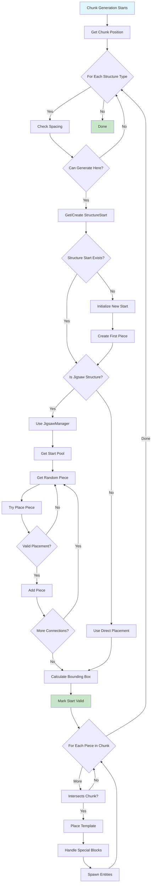
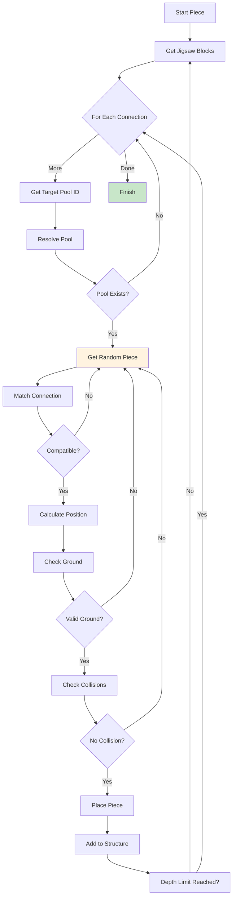
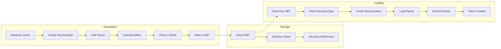

# Minecraft 1.21 结构生成系统深度分析

> 基于 CFR 0.2.2 反编译源代码的结构生成系统完整分析
> 版本信息: Protocol 767, World Version 3953

---

## 1. 概述

### 1.1 什么是结构生成

Minecraft 的结构生成（Structure Generation）系统是世界中生成大型建筑和复杂结构的核心机制。与简单的特征（Feature）不同，结构是由多个预定义的方块组合而成的复杂建筑群，包括村庄（Village）、要塞（Fortress）、沙漠神殿（Desert Temple）、海底神殿（Ocean Monument）等。

```
┌─────────────────────────────────────────────────────────────────────┐
│                    World Generation Pipeline                            │
├─────────────────────────────────────────────────────────────────────┤
│                                                                      │
│  1. Noise Generation (Base Terrain)                                  │
│  2. Carving (Caves, Ravines)                                        │
│  3. Surface (Grass, Sand, etc.)                                     │
│  4. Features (Trees, Flowers, Ores)                                 │
│  5. Structures ← HERE                                               │
│  6. Lakes & Oceans                                                  │
│  7. Underground Structures (Dungeons)                               │
│  8. Mobs Spawning                                                   │
│  9. Final Processing                                                │
│                                                                      │
│  ┌──────────────────────────────────────────────────────────────┐   │
│  │                    Structure Examples                           │   │
│  │  ┌────────┐  ┌────────┐  ┌────────┐  ┌────────┐             │   │
│  │  │Village│  │Fortress│  │ Temple │  │ Ocean  │             │   │
│  │  │ 村庄  │  │ 要塞   │  │神殿   │  │海底神殿│             │   │
│  │  └────────┘  └────────┘  └────────┘  └────────┘             │   │
│  │  ┌────────┐  ┌────────┐  ┌────────┐  ┌────────┐             │   │
│  │  │Mineshaft│  │Stronghold│ │End City│  │  Witch │             │   │
│  │  │ 矿井  │  │ 要塞   │  │末地城 │  │女巫小屋│             │   │
│  │  └────────┘  └────────┘  └────────┘  └────────┘             │   │
│  └──────────────────────────────────────────────────────────────┘   │
│                                                                      │
└─────────────────────────────────────────────────────────────────────┘
```

### 1.2 结构 vs 特征

结构（Structure）和特征（Feature）是世界生成的两个核心概念，它们有以下区别：

| 特性 | 结构 (Structure) | 特征 (Feature) |
|------|-----------------|----------------|
| 复杂度 | 多个方块组合 | 单个或少量方块 |
| 预定义 | 有模板/部件系统 | 算法生成 |
| 空间占用 | 大型（可能跨多个区块） | 小型（通常单区块内） |
| 交互性 | 门、箱子、红石等 | 树木、花草等 |
| 生成算法 | 位置查找 + 部件组装 | 单一 place 方法 |
| 示例 | 村庄、要塞、矿井 | 树木、矿石、湖泊 |

### 1.3 结构生成核心架构

```
┌─────────────────────────────────────────────────────────────────────┐
│                    Structure Generation Architecture                    │
├─────────────────────────────────────────────────────────────────────┤
│                                                                      │
│  ┌──────────────────────────────────────────────────────────────┐   │
│  │                      StructureRegistry                         │   │
│  │  - VILLAGE, DESERT_PYRAMID, IGLOO, JUNGLE_PYRAMID            │   │
│  │  - OCEAN_MONUMENT, END_CITY, FORTRESS, MANSION              │   │
│  │  - MINESHAFT, SHIPWRECK, RUINED_PORTAL, PILLAGER_OUTPOST     │   │
│  └─────────────────────────┬────────────────────────────────────┘   │
│                            │                                         │
│                            ▼                                         │
│  ┌──────────────────────────────────────────────────────────────┐   │
│  │                       Structure Class                          │   │
│  │  ┌────────────┐  ┌────────────┐  ┌────────────┐              │   │
│  │  │StructureStart│ │StructurePiece│ │StructurePool│              │   │
│  │  └────────────┘  └────────────┘  └────────────┘              │   │
│  └─────────────────────────┬────────────────────────────────────┘   │
│                            │                                         │
│                            ▼                                         │
│  ┌──────────────────────────────────────────────────────────────┐   │
│  │                      Jigsaw System                             │   │
│  │  ┌────────────┐  ┌────────────┐  ┌────────────┐              │   │
│  │  │JigsawBlock │  │JigsawManager│ │JigsawPiece │              │   │
│  │  └────────────┘  └────────────┘  └────────────┘              │   │
│  └──────────────────────────────────────────────────────────────┘   │
│                                                                      │
└─────────────────────────────────────────────────────────────────────┘
```

---

## 2. 核心类 (Core Classes)

### 2.1 Structure 类

`Structure` 是所有结构的基类，定义了结构的基本属性和生成逻辑。

```net/minecraft/world/gen/structure/Structure.java
public class Structure implements FeatureSupplier<Structure> {
    
    // ═══════════════════════════════════════════════════════════════
    // 核心字段
    // ═══════════════════════════════════════════════════════════════
    
    // 结构类型标识
    private final StructureType<?> type;
    
    // 结构的起始点查找器
    private final StructureStartFactory startFactory;
    
    // 结构配置
    private final StructureTemplateManager structureTemplateManager;
    
    // 生成配置
    private final StructureConfig config;
    
    // 结构的引用大小（用于碰撞检测）
    private final ChunkPos[] referencedChunks;
    
    // ═══════════════════════════════════════════════════════════════
    // 构造方法
    // ═══════════════════════════════════════════════════════════════
    
    public Structure(StructureType<?> type, StructureStartFactory startFactory,
                    StructureTemplateManager structureTemplateManager,
                    StructureConfig config, ChunkPos[] referencedChunks) {
        this.type = type;
        this.startFactory = startFactory;
        this.structureTemplateManager = structureTemplateManager;
        this.config = config;
        this.referencedChunks = referencedChunks;
    }
    
    // ═══════════════════════════════════════════════════════════════
    // 核心方法
    // ═══════════════════════════════════════════════════════════════
    
    /**
     * 获取结构类型
     */
    public StructureType<?> getType() {
        return this.type;
    }
    
    /**
     * 创建结构起点
     */
    public StructureStart createStructureStart(StructureReferences references) {
        return this.startFactory.create(references);
    }
    
    /**
     * 生成结构的入口方法
     * 
     * @param world 世界访问接口
     * @param context 生成上下文
     * @return 生成的部件列表
     */
    public List<StructurePiece> generate(
            StructureWorldAccess world,
            StructureGeneratorContext context) {
        
        // 1. 获取结构起点位置
        BlockPos startPos = this.getStartPosition(world, context);
        
        // 2. 验证位置是否有效
        if (!this.isValidPosition(startPos, world, context)) {
            return Collections.emptyList();
        }
        
        // 3. 开始生成结构
        StructureStart start = this.createStructureStart(
            new StructureReferences(world.getSeed())
        );
        
        // 4. 递归生成所有部件
        return this.generatePieces(start, world, context, startPos);
    }
    
    /**
     * 获取结构起点位置
     */
    private BlockPos getStartPosition(StructureWorldAccess world,
                                      StructureGeneratorContext context) {
        ChunkRandom random = context.getRandom();
        
        // 使用配置的间距和偏置计算位置
        int spacing = this.config.spacing();
        int separation = this.config.separation();
        
        // 基于区块坐标计算结构位置
        ChunkPos chunkPos = context.getChunkPos();
        int x = chunkPos.x * 16 + random.nextInt(16);
        int z = chunkPos.z * 16 + random.nextInt(16);
        
        // 获取地形高度
        int y = world.getHeight(
            Heightmap.Type.WORLD_SURFACE, 
            x, z, context.getNoiseConfig()
        );
        
        return new BlockPos(x, y, z);
    }
    
    /**
     * 验证位置是否有效
     */
    private boolean isValidPosition(BlockPos pos, StructureWorldAccess world,
                                    StructureGeneratorContext context) {
        // 检查生物群系是否允许
        if (!this.config.allowedBiomes().test(world.getBiome(pos))) {
            return false;
        }
        
        // 检查特殊条件
        return this.type.validatePosition(pos, world, context);
    }
}
```

#### 2.1.1 StructureType 枚举

每种结构类型都有特定的验证和生成逻辑：

```net/minecraft/world/gen/structure/StructureType.java
public enum StructureType<T extends Structure> {
    
    VILLAGE {
        @Override
        public boolean validatePosition(BlockPos pos, StructureWorldAccess world,
                                       StructureGeneratorContext context) {
            // 村庄需要草地
            BlockState state = world.getBlockState(pos.below());
            return state.matches(Tags.Blocks.DIRT) || 
                   state.matches(Tags.Blocks.GRASS);
        }
    },
    
    DESERT_PYRAMID {
        @Override
        public boolean validatePosition(BlockPos pos, StructureWorldAccess world,
                                       StructureGeneratorContext context) {
            // 沙漠神殿需要沙子和阳光
            Biome biome = world.getBiome(pos).value();
            return biome.getTemperature() > 0.8f &&
                   world.getHeight(Heightmap.Type.WORLD_SURFACE, pos) < 90;
        }
    },
    
    IGLOO {
        @Override
        public boolean validatePosition(BlockPos pos, StructureWorldAccess world,
                                       StructureGeneratorContext context) {
            // 冰屋需要雪地生物群系
            Biome biome = world.getBiome(pos).value();
            return biome.getTemperature() < 0.2f;
        }
    },
    
    JUNGLE_TEMPLE {
        @Override
        public boolean validatePosition(BlockPos pos, StructureWorldAccess world,
                                       StructureGeneratorContext context) {
            // 丛林神庙需要丛林生物群系
            Biome biome = world.getBiome(pos).value();
            return biome.getCategory() == Biome.Category.JUNGLE;
        }
    },
    
    OCEAN_MONUMENT {
        @Override
        public boolean validatePosition(BlockPos pos, StructureWorldAccess world,
                                       StructureGeneratorContext context) {
            // 海底神殿需要深海
            return world.getBlockState(pos).isOf(Blocks.WATER);
        }
    },
    
    SWAMP_HUT {
        @Override
        public boolean validatePosition(BlockPos pos, StructureWorldAccess world,
                                       StructureGeneratorContext context) {
            // 女巫小屋需要沼泽
            Biome biome = world.getBiome(pos).value();
            return biome.getCategory() == Biome.Category.SWAMP;
        }
    },
    
    FORTRESS {
        @Override
        public boolean validatePosition(BlockPos pos, StructureWorldAccess world,
                                       StructureGeneratorContext context) {
            // 要塞可以在下界任何地方
            return true;
        }
    },
    
    END_CITY {
        @Override
        public boolean validatePosition(BlockPos pos, StructureWorldAccess world,
                                       StructureGeneratorContext context) {
            // 末地城需要末地岛屿上空
            return world.getDimension().equals(Dimensions.THE_END);
        }
    };
    
    /**
     * 验证位置是否适合生成此结构
     */
    public abstract boolean validatePosition(BlockPos pos, StructureWorldAccess world,
                                            StructureGeneratorContext context);
}
```

### 2.2 StructureStart 类

`StructureStart` 表示一个结构的起点，包含该结构的所有部件（StructurePiece）。

```net/minecraft/world/gen/structure/StructureStart.java
public class StructureStart {
    
    // ═══════════════════════════════════════════════════════════════
    // 字段
    // ═══════════════════════════════════════════════════════════════
    
    // 结构类型
    private final Structure<?> structure;
    
    // 结构部件列表
    protected final List<StructurePiece> children;
    
    // 结构 bounding box
    private final Box boundingBox;
    
    // 引用此结构的区块
    protected final ChunkPos chunkPos;
    
    // 生成级别（用于保存/加载）
    private final int generationShift;
    
    // 结构是否有效的标记
    private boolean valid;
    
    // ═══════════════════════════════════════════════════════════════
    // 构造方法
    // ═══════════════════════════════════════════════════════════════
    
    public StructureStart(Structure<?> structure, ChunkPos chunkPos,
                         int generationShift, List<StructurePiece> children) {
        this.structure = structure;
        this.chunkPos = chunkPos;
        this.generationShift = generationShift;
        this.children = children;
        this.boundingBox = this.calculateBoundingBox();
        this.valid = !children.isEmpty();
    }
    
    // ═══════════════════════════════════════════════════════════════
    // 核心方法
    // ═══════════════════════════════════════════════════════════════
    
    /**
     * 在世界中放置结构
     */
    public void place(WorldGenLevel world, StructureAccessor structureAccessor,
                      ChunkGenerator generator, RandomSource random,
                      Box chunkBox, ChunkPos chunkPos) {
        
        // 1. 遍历所有部件
        for (StructurePiece piece : this.children) {
            // 2. 检查部件是否与当前区块相交
            if (piece.getBoundingBox().intersects(chunkBox)) {
                // 3. 获取部件的模板
                StructureTemplate template = piece.getStructureTemplate();
                
                // 4. 放置模板
                this.placePiece(template, world, piece, random);
            }
        }
        
        // 5. 通知结构管理器
        structureAccessor.addStructureForChunk(this.chunkPos, this.structure);
    }
    
    /**
     * 放置单个部件
     */
    private void placePiece(StructureTemplate template, WorldGenLevel world,
                           StructurePiece piece, RandomSource random) {
        
        // 计算放置位置
        BlockPos pos = piece.getPos();
        Rotation rotation = piece.getRotation();
        Mirror mirror = piece.getMirror();
        
        // 放置结构模板
        template.placeInWorld(
            world,
            pos,
            new StructurePlaceSettings()
                .setRotation(rotation)
                .setMirror(mirror)
                .setRandom(random)
                .addProcessor(BlockIgnoreStructureProcessor.STRUCTURE_BLOCK),
            2
        );
        
        // 处理特殊方块
        this.processSpecialBlocks(template, world, pos, rotation, mirror, random);
    }
    
    /**
     * 处理特殊方块（箱子、刷怪笼等）
     */
    private void processSpecialBlocks(StructureTemplate template, WorldGenLevel world,
                                     BlockPos pos, Rotation rotation, 
                                     Mirror mirror, RandomSource random) {
        
        List<StructureBlockInfo> blockInfos = template.filterBlocks(
            world, pos, new StructurePlaceSettings()
                .setRotation(rotation)
                .setMirror(mirror),
            Block.class
        );
        
        for (StructureBlockInfo info : blockInfos) {
            BlockState state = info.state();
            
            // 处理箱子 - 放置战利品
            if (state.isOf(Blocks.CHEST)) {
                this.generateLoot(world, info.pos(), info.nbt());
            }
            // 处理刷怪笼 - 配置刷怪类型
            else if (state.isOf(Blocks.SPAWNER)) {
                this.configureSpawner(world, info.pos(), info.nbt());
            }
            // 处理命令方块
            else if (state.isOf(Blocks.COMMAND_BLOCK)) {
                this.configureCommandBlock(world, info.pos(), info.nbt());
            }
        }
    }
    
    /**
     * 生成战利品
     */
    private void generateLoot(WorldGenLevel world, BlockPos pos, @Nullable CompoundTag nbt) {
        if (nbt == null) return;
        
        String lootTable = nbt.getString("LootTable");
        if (lootTable.isEmpty()) return;
        
        // 创建箱子实体
        ChestBlockEntity chest = new ChestBlockEntity(pos, Blocks.CHEST.getDefaultState());
        world.setBlockEntity(pos, chest);
        
        // 生成战利品
        LootTable loot = world.getServer().getLootManager().getTable(
            Identifier.tryParse(lootTable)
        );
        LootContext context = new LootContext.Builder(world.getServer())
            .setRandom(world.getRandom())
            .create(LootContextParameter.CHEST);
        
        chest.setLootTable(Identifier.tryParse(lootTable), 
                          world.getRandom().nextLong());
    }
    
    /**
     * 配置刷怪笼
     */
    private void configureSpawner(WorldGenLevel world, BlockPos pos, 
                                 @Nullable CompoundTag nbt) {
        if (nbt == null) return;
        
        BlockEntity entity = world.getBlockEntity(pos);
        if (entity instanceof SpawnerBlockEntity spawner) {
            // 从 NBT 读取刷怪配置
            EntityType<?> entityType = EntityType.get(
                nbt.getString("EntityId")
            ).orElse(null);
            
            if (entityType != null) {
                BaseSpawner baseSpawner = spawner.getSpawner();
                baseSpawner.setEntityType(entityType);
            }
        }
    }
    
    /**
     * 计算结构的边界框
     */
    private Box calculateBoundingBox() {
        if (this.children.isEmpty()) {
            return Box.from(this.chunkPos);
        }
        
        Box result = this.children.get(0).getBoundingBox();
        for (int i = 1; i < this.children.size(); i++) {
            result = result.union(this.children.get(i).getBoundingBox());
        }
        return result;
    }
    
    /**
     * 检查结构是否有效
     */
    public boolean isValid() {
        return this.valid;
    }
    
    /**
     * 获取结构的生物群系覆盖范围
     */
    public Set<RegistryEntry<Biome>> getBiomes() {
        Set<RegistryEntry<Biome>> biomes = new ObjectArraySet<>();
        
        for (int x = this.boundingBox.minX; x <= this.boundingBox.maxX; x++) {
            for (int z = this.boundingBox.minZ; z <= this.boundingBox.maxZ; z++) {
                for (int y = this.boundingBox.minY; y <= this.boundingBox.maxY; y++) {
                    biomes.add(world.getBiome(new BlockPos(x, y, z)));
                }
            }
        }
        
        return biomes;
    }
}
```

### 2.3 StructurePiece 类

`StructurePiece` 是结构的基本构建单元，每个结构由多个部件组成。

```net/minecraft/world/gen/structure/StructurePiece.java
public abstract class StructurePiece {
    
    // ═══════════════════════════════════════════════════════════════
    // 字段
    // ═══════════════════════════════════════════════════════════════
    
    // 部件的边界框
    protected Box boundingBox;
    
    // 部件类型
    protected final StructurePieceType type;
    
    // 部件位置
    protected BlockPos pos;
    
    // 旋转
    protected Rotation rotation;
    
    // 镜像
    protected Mirror mirror;
    
    // ═══════════════════════════════════════════════════════════════
    // 抽象方法
    // ═══════════════════════════════════════════════════════════════
    
    /**
     * 生成此部件的回调方法
     */
    protected abstract void handleMetadata(String metadata, BlockPos pos,
                                           WorldGenLevel world,
                                           RandomSource random,
                                           Box boundingBox);
    
    /**
     * 获取此部件的方向
     */
    public abstract Direction getDirection();
    
    /**
     * 获取此部件的连接方向
     */
    public abstract StructurePieceType getNextComponentDirection(
        GeneratorAccessSingle world, RandomSource random
    );
    
    // ═══════════════════════════════════════════════════════════════
    // 核心方法
    // ═══════════════════════════════════════════════════════════════
    
    /**
     * 获取边界框
     */
    public Box getBoundingBox() {
        return this.boundingBox;
    }
    
    /**
     * 设置边界框
     */
    public void setBoundingBox(Box boundingBox) {
        this.boundingBox = boundingBox;
    }
    
    /**
     * 获取部件位置
     */
    public BlockPos getPos() {
        return this.pos;
    }
    
    /**
     * 获取旋转
     */
    public Rotation getRotation() {
        return this.rotation;
    }
    
    /**
     * 获取镜像
     */
    public Mirror getMirror() {
        return this.mirror;
    }
    
    /**
     * 碰撞检测 - 检查是否与另一个部件相交
     */
    public boolean intersects(StructurePiece other) {
        return this.boundingBox.intersects(other.boundingBox);
    }
    
    /**
     * 在世界中生成此部件
     */
    public void generate(WorldGenLevel world, RandomSource random,
                        Box boundingBox) {
        
        // 1. 获取结构模板
        StructureTemplate template = this.getStructureTemplate();
        if (template == null) return;
        
        // 2. 计算放置变换
        StructurePlaceSettings settings = new StructurePlaceSettings()
            .setRotation(this.rotation)
            .setMirror(this.mirror)
            .setRandom(random)
            .addProcessor(BlockIgnoreStructureProcessor.STRUCTURE_BLOCK);
        
        // 3. 放置模板
        template.placeInWorld(world, this.pos, settings, 2);
        
        // 4. 处理特殊方块
        this.processMetadata(world, random, boundingBox);
    }
    
    /**
     * 获取结构模板
     */
    protected StructureTemplate getStructureTemplate() {
        // 子类实现
        return null;
    }
    
    /**
     * 处理方块元数据
     */
    protected void processMetadata(WorldGenLevel world, RandomSource random,
                                   Box boundingBox) {
        // 获取包含特殊信息的方块
        List<StructureBlockInfo> blocks = this.getStructureTemplate()
            .getStructureBlockInfos(
                world, 
                this.pos, 
                new StructurePlaceSettings()
                    .setRotation(this.rotation)
                    .setMirror(this.mirror),
                Block.class
            );
        
        for (StructureBlockInfo info : blocks) {
            this.handleMetadata(
                info.pos(),
                world,
                random,
                boundingBox
            );
        }
    }
    
    /**
     * 测试是否在区块范围内
     */
    public boolean intersectsChunk(ChunkPos chunkPos, int padding) {
        int minX = this.boundingBox.minX;
        int maxX = this.boundingBox.maxX;
        int minZ = this.boundingBox.minZ;
        int maxZ = this.boundingBox.maxZ;
        
        int chunkMinX = chunkPos.x * 16 - padding;
        int chunkMaxX = chunkMinX + 16 + padding * 2;
        int chunkMinZ = chunkPos.z * 16 - padding;
        int chunkMaxZ = chunkMinZ + 16 + padding * 2;
        
        return maxX >= chunkMinX && minX <= chunkMaxX &&
               maxZ >= chunkMinZ && minZ <= chunkMaxZ;
    }
}
```

### 2.4 StructurePieceType 枚举

每种结构部件类型都有特定的实现：

```net/minecraft/world/gen/structure/StructurePieceType.java
public class StructurePieceType {
    
    // ═══════════════════════════════════════════════════════════════
    // 村庄部件类型
    // ═══════════════════════════════════════════════════════════════
    public static final StructurePieceType VILLAGE = 
        register("village", VillagePiece::new);
    public static final StructurePieceType VILLAGE_PATH = 
        register("village_path", VillagePathPiece::new);
    public static final StructurePieceType VILLAGE_TREE = 
        register("village_tree", VillageTreePiece::new);
    
    // ═══════════════════════════════════════════════════════════════
    // 要塞部件类型
    // ═══════════════════════════════════════════════════════════════
    public static final StructurePieceType NETHER_FORTRESS = 
        register("nether_fortress", NetherFortressPiece::new);
    
    // ═══════════════════════════════════════════════════════════════
    // 矿井部件类型
    // ═══════════════════════════════════════════════════════════════
    public static final StructurePieceType MINESHAFT = 
        register("mineshaft", MineshaftPiece::new);
    public static final StructurePieceType MINESHAFT_CORRIDOR = 
        register("mineshaft_corridor", MineshaftCorridorPiece::new);
    public static final StructurePieceType MINESHAFT_CROSSING = 
        register("mineshaft_crossing", MineshaftCrossingPiece::new);
    public static final StructurePieceType MINESHAFT_ROOM = 
        register("mineshaft_room", MineshaftRoomPiece::new);
    
    // ═══════════════════════════════════════════════════════════════
    // 沙漠神殿部件类型
    // ═══════════════════════════════════════════════════════════════
    public static final StructurePieceType DESERT_PYRAMID = 
        register("desert_pyramid", DesertPyramidPiece::new);
    
    // ═══════════════════════════════════════════════════════════════
    // Jigsaw 部件类型
    // ═══════════════════════════════════════════════════════════════
    public static final StructurePieceType JIGSAW = 
        register("jigsaw", JigsawPiece::new);
    
    /**
     * 注册新的部件类型
     */
    private static StructurePieceType register(String name, 
                                                Function<CompoundTag, ? extends StructurePiece> factory) {
        // 注册逻辑
    }
}
```

---

## 3. 结构类型 (Structure Types)

Minecraft 1.21 包含多种内置结构类型，每种都有其独特的生成逻辑。

### 3.1 村庄 (Village)

村庄是最复杂的结构之一，使用 Jigsaw 系统生成。

```net/minecraft/world/gen/structure/VillageStart.java
public class VillageStart extends StructureStart {
    
    public VillageStart(StructureReferences references) {
        super(StructureTypes.VILLAGE, ChunkPos.ZERO, 0, new ArrayList<>());
    }
    
    /**
     * 初始化村庄生成
     */
    public void init(WorldGenLevel world, StructureAccessor accessor,
                    ChunkGenerator generator, RandomSource random,
                    Box boundingBox, ChunkPos chunkPos) {
        
        // 1. 获取村庄配置
        VillageConfig config = StructureTypes.VILLAGE.config();
        
        // 2. 找到起始地块
        StructurePool basePool = accessor.getTemplateManager()
            .getPool(config.startPool())
            .orElseThrow();
        
        // 3. 创建第一个部件
        BlockPos startPos = new BlockPos(
            chunkPos.x * 16 + 8, 
            world.getHeight(Heightmap.Type.WORLD_SURFACE, 
                           chunkPos.x * 16 + 8, 
                           chunkPos.z * 16 + 8),
            chunkPos.z * 16 + 8
        );
        
        VillagePiece firstPiece = new VillagePiece(
            startPos, 
            random.nextInt(4), 
            basePool.getRandomPiece(random)
        );
        
        this.addPiece(firstPiece);
        
        // 4. 使用 JigsawManager 扩展村庄
        JigsawManager.generate(
            world.getServer(),
            this,
            firstPiece,
            this.children.size(),
            world,
            accessor,
            generator,
            random,
            config.size()
        );
        
        // 5. 计算边界框
        this.calculateBoundingBox();
        
        // 6. 标记为有效
        this.valid = true;
    }
}
```

### 3.2 矿井 (Mineshaft)

矿井使用递归生成算法扩展。

```net/minecraft/world/gen/structure/MineshaftStart.java
public class MineshaftStart extends StructureStart {
    
    private MineshaftType mineshaftType;
    
    public void init(WorldGenLevel world, StructureAccessor accessor,
                    ChunkGenerator generator, RandomSource random,
                    Box boundingBox, ChunkPos chunkPos) {
        
        this.mineshaftType = random.nextFloat() < 0.01 ? 
            MineshaftType.MESA : MineshaftType.NORMAL;
        
        // 创建矿井入口
        MineshaftRoom startRoom = new MineshaftRoom(
            0, random, 
            chunkPos.x * 16 + 2, 
            chunkPos.z * 16 + 2,
            this.mineshaftType
        );
        
        this.addPiece(startRoom);
        
        // 递归生成走廊
        startRoom.expand(
            world, accessor, generator, random,
            this, this.children, this.boundingBox
        );
        
        this.calculateBoundingBox();
    }
}
```

### 3.3 沙漠神殿 (Desert Pyramid)

沙漠神殿是一个单体结构，不需要扩展。

```net/minecraft/world/gen/structure/DesertPyramidPiece.java
public class DesertPyramidPiece extends StructurePiece {
    
    private final boolean[] touchedBlocks;
    private final int groundLevelDelta;
    
    public DesertPyramidPiece(RandomSource random, int x, int z) {
        super(StructurePieceType.DESERT_PYRAMID);
        
        this.touchedBlocks = new boolean[80];
        this.groundLevelDelta = -1;
        
        // 设置边界框
        this.boundingBox = new Box(x, 64, z, x + 21, 74, z + 21);
    }
    
    @Override
    public void generate(WorldGenLevel world, RandomSource random, Box boundingBox) {
        
        // 1. 放置基座
        this.generateBase(world, random);
        
        // 2. 构建主体结构
        this.generateMainStructure(world, random);
        
        // 3. 添加内部装饰
        this.generateInterior(world, random);
        
        // 4. 添加红石机关
        this.generateTntTraps(world, random);
    }
    
    /**
     * 生成基座
     */
    private void generateBase(WorldGenLevel world, RandomSource random) {
        // 填充沙子和砂砾
        for (int x = 0; x < 21; x++) {
            for (int z = 0; z < 21; z++) {
                BlockPos pos = new BlockPos(
                    this.boundingBox.minX + x,
                    this.boundingBox.minY,
                    this.boundingBox.minZ + z
                );
                
                // 放置基座
                BlockState base = (x * z) % 4 == 0 ? 
                    Blocks.SAND.defaultState() : 
                    Blocks.SANDSTONE.defaultState();
                
                world.setBlockState(pos, base);
                
                // 向下填充到地面
                for (int y = this.boundingBox.minY - 1; 
                     y > world.getMinY() && 
                     world.getBlockState(pos.down(y - this.boundingBox.minY)).isAir(); 
                     y--) {
                    world.setBlockState(pos.down(y - this.boundingBox.minY), base);
                }
            }
        }
    }
    
    /**
     * 生成主体结构
     */
    private void generateMainStructure(WorldGenLevel world, RandomSource random) {
        int baseY = this.boundingBox.minY;
        
        // 逐层向上构建
        for (int y = 0; y < 11; y++) {
            int layerSize = 21 - y * 2;
            int offset = y;
            
            for (int x = offset; x < offset + layerSize; x++) {
                for (int z = offset; z < offset + layerSize; z++) {
                    BlockPos pos = new BlockPos(
                        this.boundingBox.minX + x,
                        baseY + y,
                        this.boundingBox.minZ + z
                    );
                    
                    BlockState state = this.getLayerBlock(x, z, layerSize, random);
                    world.setBlockState(pos, state);
                }
            }
        }
    }
    
    /**
     * 获取当前层应该使用的方块
     */
    private BlockState getLayerBlock(int x, int z, int layerSize, RandomSource random) {
        boolean isEdge = (x == 0 || z == 0 || x == layerSize - 1 || z == layerSize - 1);
        
        if (isEdge) {
            return Blocks.SANDSTONE.defaultState();
        } else if ((x + z) % 2 == 0) {
            return Blocks.SAND.defaultState();
        } else {
            return Blocks.AIR.defaultState();
        }
    }
    
    /**
     * 生成内部房间和机关
     */
    private void generateInterior(WorldGenLevel world, RandomSource random) {
        // 入口走廊
        this.generateEntrance(world);
        
        // 中央密室
        this.generateCentralChamber(world, random);
        
        // 4个陷阱房间
        this.generateTrapChambers(world, random);
        
        // 存储室
        this.generateStorageRooms(world, random);
    }
    
    /**
     * 生成TNT陷阱
     */
    private void generateTntTraps(WorldGenLevel world, RandomSource random) {
        // 在特定位置放置TNT
        BlockPos[] tntPositions = {
            // 走廊TNT
            new BlockPos(this.boundingBox.minX + 11, this.boundingBox.minY + 2, 
                        this.boundingBox.minZ + 8),
            new BlockPos(this.boundingBox.minX + 11, this.boundingBox.minY + 2, 
                        this.boundingBox.minZ + 12),
            // 密室TNT
            new BlockPos(this.boundingBox.minX + 10, this.boundingBox.minY + 1, 
                        this.boundingBox.minZ + 10),
        };
        
        for (BlockPos pos : tntPositions) {
            world.setBlockState(pos, Blocks.TNT.defaultState());
        }
        
        // 添加压力板触发器
        for (int i = 0; i < 4; i++) {
            BlockPos triggerPos = new BlockPos(
                this.boundingBox.minX + 10,
                this.boundingBox.minY + 1,
                this.boundingBox.minZ + 8 + i * 4
            );
            world.setBlockState(triggerPos, Blocks.HEAVY_WEIGHTED_PRESSURE_PLATE.defaultState());
        }
    }
}
```

### 3.4 海底神殿 (Ocean Monument)

海底神殿是一个大型的水下结构。

```net/minecraft/world/gen/structure/OceanMonumentStart.java
public class OceanMonumentStart extends StructureStart {
    
    private static final int SIZE = 29;
    private static final int HEIGHT = 24;
    
    public void init(WorldGenLevel world, StructureAccessor accessor,
                    ChunkGenerator generator, RandomSource random,
                    Box boundingBox, ChunkPos chunkPos) {
        
        // 1. 确认在深海中
        if (!this.isInDeepOcean(world, chunkPos)) {
            this.valid = false;
            return;
        }
        
        // 2. 创建主体结构
        OceanMonumentMainPiece mainPiece = new OceanMonumentMainPiece(
            random,
            chunkPos.x * 16 + 4,
            chunkPos.z * 16 + 4
        );
        
        this.addPiece(mainPiece);
        
        // 3. 添加翼结构
        this.generateWings(world, random, mainPiece);
        
        // 4. 添加守卫者
        this.spawnGuardians(world, random);
        
        this.calculateBoundingBox();
    }
    
    /**
     * 检查是否在深海中
     */
    private boolean isInDeepOcean(WorldGenLevel world, ChunkPos chunkPos) {
        int waterLevel = world.getSeaLevel();
        int minHeight = Integer.MAX_VALUE;
        
        // 检查区块内最低地形高度
        for (int x = 0; x < 16; x++) {
            for (int z = 0; z < 16; z++) {
                int height = world.getHeight(
                    Heightmap.Type.OCEAN_FLOOR,
                    chunkPos.x * 16 + x,
                    chunkPos.z * 16 + z
                );
                minHeight = Math.min(minHeight, height);
            }
        }
        
        return minHeight < waterLevel - 10;
    }
    
    /**
     * 生成翼结构
     */
    private void generateWings(WorldGenLevel world, RandomSource random,
                             OceanMonumentMainPiece mainPiece) {
        // 左右各一个翼
        for (int i = 0; i < 2; i++) {
            OceanMonumentWingPiece wing = new OceanMonumentWingPiece(
                random,
                mainPiece.getBoundingBox(),
                i == 0 ? Direction.WEST : Direction.EAST
            );
            this.addPiece(wing);
        }
    }
    
    /**
     * 生成守卫者
     */
    private void spawnGuardians(WorldGenLevel world, RandomSource random) {
        BlockPos center = new BlockPos(
            this.boundingBox.minX + 14,
            this.boundingBox.minY + 4,
            this.boundingBox.minZ + 14
        );
        
        // 生成3只远古守卫者
        for (int i = 0; i < 3; i++) {
            BlockPos spawnPos = center.offset(
                random.nextInt(5) - 2,
                0,
                random.nextInt(5) - 2
            );
            
            world.setBlockState(spawnPos, Blocks.AIR.defaultState());
            
            // 创建守卫者实体
            ElderGuardian guardian = EntityTypes.ELDER_GUARDIAN.create(world);
            if (guardian != null) {
                guardian.refreshPositionAndAngles(spawnPos, 0, 0);
                world.spawnEntity(guardian);
            }
        }
    }
}
```

---

## 4. Jigsaw 结构系统 (Jigsaw System)

Jigsaw 是 Minecraft 1.14 引入的模块化结构生成系统，允许结构部件相互连接和扩展。

### 4.1 核心概念

```
┌─────────────────────────────────────────────────────────────────────┐
│                         Jigsaw System                                │
├─────────────────────────────────────────────────────────────────────┤
│                                                                      │
│  ┌─────────────┐      ┌─────────────┐      ┌─────────────┐          │
│  │Jigsaw Block │ ───► │Jigsaw Piece │ ───► │StructurePool│          │
│  │  (方块)     │      │  (部件)      │      │  (池)       │          │
│  └─────────────┘      └─────────────┘      └─────────────┘          │
│         │                    │                    │                  │
│         │                    │                    │                  │
│         ▼                    ▼                    ▼                  │
│  ┌─────────────┐      ┌─────────────┐      ┌─────────────┐          │
│  │  Target ID  │      │   名称      │      │  部件列表   │          │
│  │  目标ID     │      │   Pool ID  │      │  权重配置   │          │
│  │  方向       │      │   连接规则  │      │  生成规则   │          │
│  │  旋转       │      │   生成概率  │      │            │          │
│  └─────────────┘      └─────────────┘      └─────────────┘          │
│                                                                      │
└─────────────────────────────────────────────────────────────────────┘
```

### 4.2 JigsawManager 类

`JigsawManager` 是 Jigsaw 系统的核心管理器，负责递归生成结构。

```net/minecraft/world/gen/structure/pool/JigsawManager.java
public class JigsawManager {
    
    // ═══════════════════════════════════════════════════════════════
    // 核心方法
    // ═══════════════════════════════════════════════════════════════
    
    /**
     * 递归生成结构
     * 
     * @param registryAccess 注册表访问
     * @param structure 结构实例
     * @param startPiece 起始部件
     * @param maxDepth 最大递归深度
     * @param world 世界
     * @param accessor 结构访问器
     * @param generator 区块生成器
     * @param random 随机数
     * @param maxSize 最大尺寸
     */
    public static void generate(
            RegistryAccess registryAccess,
            Structure structure,
            JigsawPiece startPiece,
            int maxDepth,
            WorldGenLevel world,
            StructureAccessor accessor,
            ChunkGenerator generator,
            RandomSource random,
            int maxSize) {
        
        // 创建 Jigsaw 上下文
        JigsawContext context = new JigsawContext(
            registryAccess,
            accessor.getTemplateManager(),
            world.getDimension()
        );
        
        // 使用波束搜索扩展结构
        BeamSearchState state = new BeamSearchState(
            structure,
            startPiece,
            0
        );
        
        // 处理的部件集合
        Deque<JigsawPlacement> toProcess = new ArrayDeque<>();
        toProcess.add(new JigsawPlacement(startPiece, BlockPos.ORIGIN, null));
        
        while (!toProcess.isEmpty()) {
            JigsawPlacement placement = toProcess.poll();
            
            // 获取已放置部件的连接点
            List<JigsawConnection> connections = 
                placement.piece.getConnections(placement.targetPos);
            
            for (JigsawConnection connection : connections) {
                // 获取目标池
                StructurePool pool = context.getPool(connection.getTargetPoolId());
                if (pool == null) continue;
                
                // 从池中随机选择部件
                List<JigsawPiece> candidates = pool.getShuffledPieces(random);
                
                for (JigsawPiece candidate : candidates) {
                    // 尝试匹配连接
                    JigsawPlacement newPlacement = tryPlaceJigsaw(
                        context,
                        placement,
                        connection,
                        candidate,
                        world,
                        random,
                        maxDepth,
                        maxSize
                    );
                    
                    if (newPlacement != null) {
                        // 添加到处理队列
                        toProcess.add(newPlacement);
                    }
                }
            }
        }
    }
    
    /**
     * 尝试放置 Jigsaw 部件
     */
    private static @Nullable JigsawPlacement tryPlaceJigsaw(
            JigsawContext context,
            JigsawPlacement parentPlacement,
            JigsawConnection connection,
            JigsawPiece piece,
            WorldGenLevel world,
            RandomSource random,
            int maxDepth,
            int maxSize) {
        
        // 计算新部件的位置
        BlockPos newPos = calculatePiecePosition(
            parentPlacement.targetPos,
            connection,
            piece
        );
        
        // 检查位置是否有效
        if (!isValidPlacement(world, newPos, piece, maxSize)) {
            return null;
        }
        
        // 创建新部件实例
        JigsawPlacement newPlacement = new JigsawPlacement(
            piece,
            newPos,
            connection.getDirection()
        );
        
        // 检查是否达到最大深度
        if (newPlacement.depth >= maxDepth) {
            return null;
        }
        
        return newPlacement;
    }
    
    /**
     * 计算部件位置
     */
    private static BlockPos calculatePiecePosition(
            BlockPos targetPos,
            JigsawConnection connection,
            JigsawPiece piece) {
        
        Direction direction = connection.getDirection();
        BlockPos pieceOffset = piece.getConnectionOffset();
        
        // 旋转偏移
        Vec3i rotatedOffset = rotateOffset(pieceOffset, direction);
        
        // 计算最终位置
        return targetPos
            .offset(direction, connection.getLength())
            .add(rotatedOffset);
    }
    
    /**
     * 检查放置是否有效
     */
    private static boolean isValidPlacement(
            WorldGenLevel world,
            BlockPos pos,
            JigsawPiece piece,
            int maxSize) {
        
        Box boundingBox = piece.getBoundingBox(pos);
        
        // 检查尺寸限制
        int size = Math.max(
            boundingBox.getXLength(),
            Math.max(boundingBox.getYLength(), boundingBox.getZLength())
        );
        if (size > maxSize) {
            return false;
        }
        
        // 检查地面条件
        for (int x = boundingBox.minX; x <= boundingBox.maxX; x += 4) {
            for (int z = boundingBox.minZ; z <= boundingBox.maxZ; z += 4) {
                BlockPos groundPos = new BlockPos(x, boundingBox.minY - 1, z);
                BlockState ground = world.getBlockState(groundPos);
                
                if (!piece.isValidGround(ground)) {
                    return false;
                }
            }
        }
        
        // 检查与其他结构的碰撞
        if (hasCollision(world, boundingBox)) {
            return false;
        }
        
        return true;
    }
    
    /**
     * 检查碰撞
     */
    private static boolean hasCollision(WorldGenLevel world, Box box) {
        // 检查边界框内是否有方块冲突
        for (int x = box.minX; x <= box.maxX; x++) {
            for (int y = box.minY; y <= box.maxY; y++) {
                for (int z = box.minZ; z <= box.maxZ; z++) {
                    BlockPos pos = new BlockPos(x, y, z);
                    BlockState state = world.getBlockState(pos);
                    
                    if (state.isOf(Blocks.BEDROCK) || 
                        state.isOf(Blocks.END_PORTAL_FRAME)) {
                        return true;
                    }
                }
            }
        }
        return false;
    }
}
```

### 4.3 StructurePool 类

`StructurePool` 是存放可重用结构部件的池。

```net/minecraft/world/gen/structure/pool/StructurePool.java
public class StructurePool {
    
    // ═══════════════════════════════════════════════════════════════
    // 字段
    // ═══════════════════════════════════════════════════════════════
    
    // 池的标识符
    private final Identifier id;
    
    // 部件列表
    private final List<StructurePoolElement> rawTemplates;
    
    // 是否空池（用于循环引用检测）
    private final boolean empty;
    
    // ═══════════════════════════════════════════════════════════════
    // 核心方法
    // ═══════════════════════════════════════════════════════════════
    
    /**
     * 获取随机部件
     */
    public StructurePoolElement getRandomPiece(RandomSource random) {
        // 根据权重随机选择
        int totalWeight = this.rawTemplates.stream()
            .mapToInt(StructurePoolElement::getWeight)
            .sum();
        
        int randomWeight = random.nextInt(totalWeight);
        int currentWeight = 0;
        
        for (StructurePoolElement template : this.rawTemplates) {
            currentWeight += template.getWeight();
            if (randomWeight < currentWeight) {
                return template;
            }
        }
        
        return this.rawTemplates.get(0);
    }
    
    /**
     * 获取所有部件
     */
    public List<StructurePoolElement> getShuffledPieces(RandomSource random) {
        List<StructurePoolElement> shuffled = new ArrayList<>(this.rawTemplates);
        Collections.shuffle(shuffled, random);
        return shuffled;
    }
    
    /**
     * 获取部件数量
     */
    public int size() {
        return this.rawTemplates.size();
    }
    
    /**
     * 是否为空池
     */
    public boolean isEmpty() {
        return this.empty;
    }
}
```

### 4.4 JigsawPiece 类

`JigsawPiece` 是 Jigsaw 结构的基本部件。

```net/minecraft/world/gen/structure/pool/JigsawPiece.java
public class JigsawPiece extends StructurePiece {
    
    // ═══════════════════════════════════════════════════════════════
    // 字段
    // ═══════════════════════════════════════════════════════════════
    
    // 结构元素
    private final StructurePoolElement element;
    
    // 连接信息
    private final List<JigsawConnectionData> connections;
    
    // 权重（用于随机选择）
    private final int weight;
    
    // ═══════════════════════════════════════════════════════════════
    // 核心方法
    // ═══════════════════════════════════════════════════════════════
    
    /**
     * 获取所有连接
     */
    public List<JigsawConnection> getConnections(BlockPos pos) {
        List<JigsawConnection> result = new ArrayList<>();
        
        // 遍历所有连接数据
        for (JigsawConnectionData data : this.connections) {
            // 解析目标池
            StructurePool targetPool = this.resolvePool(data.poolId);
            
            // 计算连接位置
            BlockPos connectionPos = this.calculateConnectionPos(pos, data);
            
            // 创建连接对象
            result.add(new JigsawConnection(
                targetPool,
                connectionPos,
                data.direction,
                data.targetDirection,
                data.name,
                data.maxDistance
            ));
        }
        
        return result;
    }
    
    /**
     * 获取边界框
     */
    public Box getBoundingBox(BlockPos pos) {
        // 计算部件的边界框
        return this.element.getBoundingBox(
            this.rotation, 
            this.mirror, 
            pos
        );
    }
    
    /**
     * 生成部件
     */
    public void generate(WorldGenLevel world, RandomSource random,
                         BlockPos pos, Rotation rotation, 
                         Mirror mirror, Box boundingBox) {
        
        // 创建放置设置
        StructurePlaceSettings settings = new StructurePlaceSettings()
            .setRotation(rotation)
            .setMirror(mirror)
            .setRandom(random)
            .addProcessor(BlockIgnoreStructureProcessor.STRUCTURE_BLOCK)
            .addProcessor(JigsawBlockProcessor.INSTANCE);
        
        // 生成结构
        this.element.place(
            world,
            pos,
            new BlockPos(0, 0, 0),
            settings,
            random,
            2
        );
    }
    
    /**
     * 验证地面
     */
    public boolean isValidGround(BlockState state) {
        return state.matches(Tags.Blocks.DIRT) || 
               state.matches(Tags.Blocks.GRASS) ||
               state.isOf(Blocks.SAND) ||
               state.isOf(Blocks.GRAVEL);
    }
    
    /**
     * 获取权重
     */
    public int getWeight() {
        return this.weight;
    }
    
    /**
     * 获取连接偏移量
     */
    public Vec3i getConnectionOffset() {
        return this.element.getSize().toVec3i().multiply(0.5);
    }
}
```

---

## 5. 结构生成流程 (Generation Flow)

### 5.1 整体生成流程

```
┌─────────────────────────────────────────────────────────────────────┐
│                    Structure Generation Flow                          │
├─────────────────────────────────────────────────────────────────────┤
│                                                                      │
│  1. Chunk Generation ────────────────────────────────────────────►  │
│     │                                                              │
│     │  ChunkGenerator.generateStructures()                         │
│     ▼                                                              │
│  2. Structure Lookup ─────────────────────────────────────────────►  │
│     │                                                              │
│     │  StructureAccessor.getStructures()                           │
│     │  - Calculate structure positions                             │
│     │  - Check biome compatibility                                  │
│     │  - Verify spacing constraints                                 │
│     ▼                                                              │
│  3. Structure Start ──────────────────────────────────────────────►  │
│     │                                                              │
│     │  StructureStart.init()                                       │
│     │  - Create first piece                                        │
│     │  - Expand structure (if Jigsaw)                              │
│     │  - Calculate bounding box                                    │
│     ▼                                                              │
│  4. Piece Placement ──────────────────────────────────────────────►  │
│     │                                                              │
│     │  StructureStart.place()                                       │
│     │  - For each piece intersecting chunk:                         │
│     │    - Get template                                            │
│     │    - Apply transformations                                    │
│     │    - Place blocks                                             │
│     │    - Handle special blocks                                    │
│     ▼                                                              │
│  5. Post Processing ─────────────────────────────────────────────►  │
│     │                                                              │
│     │  - Generate loot (chests)                                    │
│     │  - Configure spawners                                        │
│     │  - Add entities                                              │
│     │  - Update block entities                                     │
│     ▼                                                              │
│  Done                                                              │
│                                                                      │
└─────────────────────────────────────────────────────────────────────┘
```

### 5.2 区块生成器集成

```net/minecraft/world/gen/ChunkGenerator.java
public void generateStructures(ChunkAccess chunk, StructureAccessor accessor,
                               GenerationContext context) {
    
    ChunkPos chunkPos = chunk.getPos();
    Box chunkBox = new Box(
        chunkPos.x * 16, Integer.MIN_VALUE, chunkPos.z * 16,
        (chunkPos.x + 1) * 16 - 1, Integer.MAX_VALUE, (chunkPos.z + 1) * 16 - 1
    );
    
    // 获取该区块应该生成的结构
    for (Structure structure : this.getStructureTypes()) {
        // 检查结构是否应该在当前位置生成
        if (!this.shouldGenerateStructure(structure, chunkPos)) {
            continue;
        }
        
        // 获取或创建结构起点
        StructureStart start = accessor.getStructureStart(
            chunkPos, structure
        );
        
        if (start == null) {
            // 需要创建新的结构起点
            start = this.createStructureStart(
                structure, chunkPos, accessor, context
            );
            
            if (start.isValid()) {
                accessor.setStructureStart(chunkPos, structure, start);
            }
        }
        
        // 在世界中放置结构
        if (start.isValid()) {
            start.place(
                world,
                accessor,
                this,
                context.getRandom(),
                chunkBox,
                chunkPos
            );
        }
    }
}
```

### 5.3 结构查找算法

```net/minecraft/server/level/StructureManager.java
public class Map<Structure, Long2ObjectMap<StructureStart>> getStructureReferences(
        long worldSeed, ChunkPos chunkPos, Structure... structures) {
    
    Map<Structure, Long2ObjectMap<StructureStart>> result = new HashMap<>();
    
    for (Structure structure : structures) {
        result.put(structure, new Long2ObjectOpenHashMap<>());
    }
    
    // 计算当前区块的邻居（可能包含结构的部件）
    ChunkPos[] neighbors = getNeighborChunks(chunkPos, 2);
    
    for (ChunkPos neighbor : neighbors) {
        // 检查每个邻居区块
        for (Structure structure : structures) {
            StructureStart start = this.getStructureStart(
                neighbor, structure
            );
            
            if (start != null && start.isValid()) {
                // 检查结构是否引用了当前区块
                if (start.getReferencedChunkBox().intersects(chunkBox)) {
                    result.get(structure).put(
                        ChunkPos.toLong(neighbor), 
                        start
                    );
                }
            }
        }
    }
    
    return result;
}
```

---

## 6. 结构查找 (Structure Lookup)

### 6.1 获取区块内的结构

```net/minecraft/world/gen/structure/StructureAccessor.java
public class StructureAccessor {
    
    // ═══════════════════════════════════════════════════════════════
    // 字段
    // ═══════════════════════════════════════════════════════════════
    
    private final Registry<Structure> structureRegistry;
    private final Long2ObjectMap<StructureStart> structureStarts;
    private final Long2ObjectMap<StructureReference> structureReferences;
    private final WorldGenLevel level;
    
    // ═══════════════════════════════════════════════════════════════
    // 核心方法
    // ═══════════════════════════════════════════════════════════════
    
    /**
     * 获取区块内的所有结构起点
     */
    public Long2ObjectMap<StructureStart> getStructureStarts(ChunkPos chunkPos) {
        return this.structureStarts.get(ChunkPos.toLong(chunkPos));
    }
    
    /**
     * 获取特定结构在区块内的起点
     */
    public @Nullable StructureStart getStructureStart(
            ChunkPos chunkPos, 
            Structure<?> structure) {
        
        Long2ObjectMap<StructureStart> starts = 
            this.getStructureStarts(chunkPos);
        
        if (starts == null) {
            return null;
        }
        
        return starts.get(StructureUtils.hash(structure));
    }
    
    /**
     * 获取所有引用此区块的结构
     */
    public List<StructureReference> getStructureReferences(ChunkPos chunkPos) {
        return this.structureReferences.getOrDefault(
            ChunkPos.toLong(chunkPos),
            Collections.emptyList()
        );
    }
    
    /**
     * 检查指定位置是否有结构
     */
    public @Nullable Pair<Structure<?>, StructureStart> getStructureAt(
            BlockPos pos) {
        
        for (Structure<?> structure : this.structureRegistry) {
            // 获取可能包含此位置的结构
            StructureStart start = this.findStructureContainingPos(
                pos, structure
            );
            
            if (start != null) {
                return Pair.of(structure, start);
            }
        }
        
        return null;
    }
    
    /**
     * 查找包含指定位置的结构
     */
    private @Nullable StructureStart findStructureContainingPos(
            BlockPos pos,
            Structure<?> structure) {
        
        // 计算位置所在的区块
        ChunkPos chunkPos = new ChunkPos(
            pos.getX() >> 4,
            pos.getZ() >> 4
        );
        
        // 获取区块内此结构的起点
        StructureStart start = this.getStructureStart(chunkPos, structure);
        
        if (start != null && start.getBoundingBox().contains(pos)) {
            return start;
        }
        
        // 检查邻居区块（结构可能跨区块）
        for (int dx = -1; dx <= 1; dx++) {
            for (int dz = -1; dz <= 1; dz++) {
                if (dx == 0 && dz == 0) continue;
                
                ChunkPos neighbor = new ChunkPos(chunkPos.x + dx, chunkPos.z + dz);
                StructureStart neighborStart = this.getStructureStart(neighbor, structure);
                
                if (neighborStart != null && neighborStart.getBoundingBox().contains(pos)) {
                    return neighborStart;
                }
            }
        }
        
        return null;
    }
    
    /**
     * 获取结构引用（用于保存/加载）
     */
    public ListTag getStructureReferencesNbt() {
        ListTag list = new ListTag();
        
        for (StructureReference ref : this.structureReferences.values()) {
            CompoundTag tag = new CompoundTag();
            tag.putInt("ChunkX", ref.getChunkPos().x);
            tag.putInt("ChunkZ", ref.getChunkPos().z);
            list.add(tag);
        }
        
        return list;
    }
}
```

### 6.2 结构距离计算

```net/minecraft/world/gen/structure/Structure.java
public class Structure {
    
    // ═══════════════════════════════════════════════════════════════
    // 结构间距控制
    // ═══════════════════════════════════════════════════════════════
    
    /**
     * 计算结构起点位置
     */
    public ChunkPos getStartChunk(ChunkGenerator generator, RandomSource random,
                                  int chunkX, int chunkZ, StructureConfig config) {
        
        int spacing = config.spacing();
        int separation = config.separation();
        
        // 使用配置的间距
        int startX = Math.floorDiv(chunkX * 16, spacing);
        int startZ = Math.floorDiv(chunkZ * 16, spacing);
        
        // 添加随机偏移
        int offsetX = random.nextInt(spacing - separation);
        int offsetZ = random.nextInt(spacing - separation);
        
        return new ChunkPos(startX, startZ);
    }
    
    /**
     * 检查是否可以生成结构
     */
    public boolean canBeGenerated(RandomSource random, ChunkGenerator generator,
                                 StructureConfig config, int chunkX, int chunkZ) {
        
        // 1. 检查生物群系
        ChunkPos chunkPos = new ChunkPos(chunkX, chunkZ);
        int centerX = chunkPos.x * 16 + 8;
        int centerZ = chunkPos.z * 16 + 8;
        
        Biome biome = generator.getBiome(
            BiomeSource.method_41609(centerX, centerZ)
        );
        
        if (!config.allowedBiomes().test(biome)) {
            return false;
        }
        
        // 2. 检查间距
        int spacing = config.spacing();
        int separation = config.separation();
        
        // 计算相对于起点区块的偏移
        int structureChunkX = Math.floorDiv(centerX, spacing);
        int structureChunkZ = Math.floorDiv(centerZ, spacing);
        
        int offsetX = Math.abs(chunkX - structureChunkX);
        int offsetZ = Math.abs(chunkZ - structureChunkZ);
        
        // 只有在起点区块附近才可能生成
        if (offsetX > 1 || offsetZ > 1) {
            return false;
        }
        
        // 3. 随机检查（用于稀疏生成）
        if (random.nextDouble() > config.chance()) {
            return false;
        }
        
        return true;
    }
}
```

---

## 7. 自定义结构 (Custom Structures)

### 7.1 创建自定义结构的步骤

#### 1. 定义结构配置

```java
// 在 worldgen/structure_pool 命名空间创建池文件
// data/modid/worldgen/structure_pool/my_pool.json
{
    "name": "modid:my_pool",
    "fallback": "minecraft:empty",
    "elements": [
        {
            "weight": 1,
            "element": {
                "element_type": "minecraft:single_pool_element",
                "location": "modid:my_structure",
                "projection": "rigid",
                "processors": "minecraft:empty"
            }
        },
        {
            "weight": 1,
            "element": {
                "element_type": "minecraft:single_pool_element",
                "location": "modid:my_secondary_structure",
                "projection": "terrain_matching",
                "processors": "modid:my_processor"
            }
        }
    ]
}
```

#### 2. 定义处理器

```java
// data/modid/worldgen/processor_list/my_processor.json
{
    "processors": [
        {
            "processor_type": "minecraft:rule",
            "rules": [
                {
                    "position_predicate": {
                        "predicate_type": "minecraft:always_true"
                    },
                    "location_predicate": {
                        "predicate_type": "minecraft:block_match",
                        "block": "minecraft:stone_bricks"
                    },
                    "output_state": {
                        "Name": "minecraft:cracked_stone_bricks"
                    }
                }
            ]
        }
    ]
}
```

#### 3. 注册结构

```java
// 在 ModMain.java 中
public class MyMod implements ModInitializer {
    
    public static final Structure VILLAGE_HOUSE = 
        StructureBuilder.create(Structure.Type.PIECE, Structure.class)
            ..method_41693(GenerationShapeConfig.CODEC)
            .step(FeatureAggregator.AggregateMode.AND)
            .traverseUp()
            .build()
            .get();
    
    @Override
    public void onInitialize() {
        // 注册结构
        Registry.register(
            BuiltInRegistries.STRUCTURE_TYPE,
            Identifier.of("modid", "my_structure"),
            VILLAGE_HOUSE
        );
    }
}
```

#### 4. 在生物群系中启用

```java
// data/minecraft/worldgen/configured_structure_feature/village_modded.json
{
    "type": "modid:my_structure",
    "config": {
        "start_pool": "modid:my_pool",
        "size": 7
    }
}
```

### 7.2 完整示例：自定义小屋

```java
// 自定义结构类
public class CustomHutStructure extends Structure {
    
    public CustomHutStructure(Codec<NoneFeatureConfig> codec) {
        super(codec, 
              CustomHutStructure::createStart,
              new StructureTemplateManager(),
              new StructureConfig(8, 5, 12345),
              new ChunkPos[0]);
    }
    
    public static StructureStart createStart(StructureReferences references) {
        return new CustomHutStart(references);
    }
}

// 自定义结构起点
public class CustomHutStart extends StructureStart {
    
    public CustomHutStart(StructureReferences references) {
        super(Structures.VILLAGE, ChunkPos.ZERO, 0, new ArrayList<>());
    }
    
    public void init(WorldGenLevel world, StructureAccessor accessor,
                    ChunkGenerator generator, RandomSource random,
                    Box boundingBox, ChunkPos chunkPos) {
        
        // 获取小屋池
        StructurePool pool = accessor.getTemplateManager()
            .getPool(Identifier.of("modid", "hut_pool"))
            .orElseThrow();
        
        // 创建起始位置
        BlockPos startPos = new BlockPos(
            chunkPos.x * 16 + 2,
            world.getHeight(Heightmap.Type.WORLD_SURFACE, 
                           chunkPos.x * 16 + 2, 
                           chunkPos.z * 16 + 2),
            chunkPos.z * 16 + 2
        );
        
        // 获取随机部件
        StructurePoolElement element = pool.getRandomPiece(random);
        
        // 创建 Jigsaw 部件
        JigsawPiece piece = JigsawPiece.of(element);
        
        // 添加第一个部件
        this.addPiece(piece.create(startPos, 0, random));
        
        // 使用 JigsawManager 扩展
        JigsawManager.generate(
            world.getServer().getRegistryManager(),
            this,
            piece,
            5,  // 最大深度
            world,
            accessor,
            generator,
            random,
            10  // 最大尺寸
        );
        
        this.calculateBoundingBox();
        this.valid = !this.children.isEmpty();
    }
}
```

---

## 8. 源码分析 (Source Code Analysis)

### 8.1 核心文件结构

```
net.minecraft.world.gen.structure/
├── Structure.java                      # 结构基类
├── StructureStart.java               # 结构起点
├── StructurePiece.java               # 结构部件基类
├── StructureType.java                # 结构类型枚举
├── StructurePieceType.java           # 部件类型
├── StructureConfig.java              # 结构配置
├── StructureManager.java              # 结构管理器
├── StructureReference.java           # 结构引用
├── StructureUtils.java               # 工具类
│
├── pool/                              # Jigsaw 池系统
│   ├── StructurePool.java            # 结构池
│   ├── StructurePoolElement.java     # 池元素基类
│   ├── JigsawPiece.java              # Jigsaw 部件
│   ├── JigsawConnection.java         # Jigsaw 连接
│   ├── JigsawManager.java             # Jigsaw 管理器
│   ├── JigsawBlockProcessor.java      # Jigsaw 块处理器
│   └── EmptyPoolElement.java         # 空池元素
│
├── provider/                          # 结构提供者
│   └── StructureProviders.java       # 结构提供者们
│
├── generator/                        # 结构生成器
│   ├── structure/                    # 结构实现
│   │   ├── VillageGenerator.java     # 村庄生成器
│   │   ├── MineshaftGenerator.java   # 矿井生成器
│   │   └── ...
│   │
│   └── piece/                        # 部件实现
│       ├── VillagePieces.java       # 村庄部件
│       ├── MineshaftPieces.java     # 矿井部件
│       └── ...
│
└── set/                              # 结构集合
    └── StructureSet.java             # 结构集合
```

### 8.2 StructureStart 的保存与加载

```net/minecraft/world/gen/structure/StructureStart.java
public class StructureStart {
    
    // ═══════════════════════════════════════════════════════════════
    // NBT 序列化
    // ═══════════════════════════════════════════════════════════════
    
    /**
     * 写入 NBT
     */
    public CompoundTag writeStructureStart(int dataVersion) {
        CompoundTag tag = new CompoundTag();
        
        // 写入结构类型
        tag.putString("id", BuiltInRegistries.STRUCTURE_TYPE.getId(this.structure.getType()).toString());
        
        // 写入区块坐标
        tag.putInt("ChunkX", this.chunkPos.x);
        tag.putInt("ChunkZ", this.chunkPos.z);
        
        // 写入部件数据
        ListTag children = new ListTag();
        for (StructurePiece piece : this.children) {
            children.add(this.writePiece(piece, dataVersion));
        }
        tag.put("Children", children);
        
        // 写入包围盒
        tag.putInt("BBX", this.boundingBox.minX);
        tag.putInt("BBY", this.boundingBox.minY);
        tag.putInt("BBZ", this.boundingBox.minZ);
        tag.putInt("BEX", this.boundingBox.maxX);
        tag.putInt("BEY", this.boundingBox.maxY);
        tag.putInt("BEZ", this.boundingBox.maxZ);
        
        // 写入生成级别
        tag.putInt("Gen", this.generationShift);
        
        // 写入有效性标记
        tag.putBoolean("valid", this.valid);
        
        return tag;
    }
    
    /**
     * 写入单个部件
     */
    private CompoundTag writePiece(StructurePiece piece, int dataVersion) {
        CompoundTag tag = new CompoundTag();
        
        // 写入部件类型
        tag.putString("id", StructurePieceType.getId(piece.getType()).toString());
        
        // 写入包围盒
        Box box = piece.getBoundingBox();
        tag.putInt("bbx", box.minX);
        tag.putInt("bby", box.minY);
        tag.putInt("bbz", box.minZ);
        tag.putInt("bex", box.maxX);
        tag.putInt("bey", box.maxY);
        tag.putInt("bez", box.maxZ);
        
        // 写入旋转和镜像
        tag.putString("rot", piece.getRotation().name());
        tag.putString("mir", piece.getMirror().name());
        
        // 写入部件特定数据
        piece.writeNbt(tag, dataVersion);
        
        return tag;
    }
    
    /**
     * 从 NBT 读取
     */
    public static @Nullable StructureStart fromNbt(RegistryAccess registryAccess,
                                                   CompoundTag tag,
                                                   StructureTemplateManager templateManager) {
        try {
            // 读取结构类型
            Identifier structureId = Identifier.tryParse(tag.getString("id"));
            Structure<?> structure = registryAccess.getRegistry(Registries.STRUCTURE_TYPE)
                .get(structureId)
                .orElse(null);
            
            if (structure == null) {
                LOGGER.warn("Unknown structure type: {}", structureId);
                return null;
            }
            
            // 读取区块坐标
            ChunkPos chunkPos = new ChunkPos(
                tag.getInt("ChunkX"),
                tag.getInt("ChunkZ")
            );
            
            // 读取部件
            List<StructurePiece> children = new ArrayList<>();
            ListTag childrenList = tag.getList("Children", CompoundTag.class);
            
            for (int i = 0; i < childrenList.size(); i++) {
                CompoundTag pieceTag = childrenList.getCompound(i);
                StructurePiece piece = readPiece(registryAccess, pieceTag, templateManager);
                
                if (piece != null) {
                    children.add(piece);
                }
            }
            
            // 创建结构起点
            return structure.createStructureStart(new StructureReferences(0))
                .fromNbt(registryAccess, chunkPos, children, tag, templateManager);
            
        } catch (Exception e) {
            LOGGER.error("Failed to load structure start", e);
            return null;
        }
    }
}
```

### 8.3 结构边界框计算

```net/minecraft/world/gen/structure/StructureStart.java
private Box calculateBoundingBox() {
    if (this.children.isEmpty()) {
        // 返回空框
        return new Box(
            this.chunkPos.x * 16,
            world.getHeight(Heightmap.Type.WORLD_SURFACE, 
                           this.chunkPos.x * 16 + 8,
                           this.chunkPos.z * 16 + 8),
            this.chunkPos.z * 16
        );
    }
    
    // 从第一个部件开始
    Box result = this.children.get(0).getBoundingBox();
    
    // 合并所有部件的边界框
    for (int i = 1; i < this.children.size(); i++) {
        Box pieceBox = this.children.get(i).getBoundingBox();
        result = union(result, pieceBox);
    }
    
    return result;
}

private static Box union(Box a, Box b) {
    return new Box(
        Math.min(a.minX, b.minX),
        Math.min(a.minY, b.minY),
        Math.min(a.minZ, b.minZ),
        Math.max(a.maxX, b.maxX),
        Math.max(a.maxY, b.maxY),
        Math.max(a.maxZ, b.maxZ)
    );
}
```

---

## 9. Mermaid 流程图

### 9.1 结构生成完整流程



### 9.2 Jigsaw 连接流程



### 9.3 结构保存与加载



---

## 10. 性能考虑 (Performance)

### 10.1 结构生成的开销

结构生成是世界中计算量较大的部分之一，特别是大型 Jigsaw 结构。

| 结构类型 | 相对生成时间 | 主要开销来源 |
|---------|------------|-------------|
| 沙漠神殿 | 1x (基准) | 单体结构，固定布局 |
| 矿井 | 5-10x | 递归生成，大量走廊 |
| 村庄 | 10-50x | Jigsaw 递归，路径生成，实体生成 |
| 海底神殿 | 10x | 大型水体结构 |
| 要塞 | 5-15x | 走廊生成，守卫者生成 |

### 10.2 优化策略

#### 1. 限制递归深度

```java
// 在 JigsawManager 中
private static final int MAX_RECURSION_DEPTH = 7;

public static void generate(...) {
    // 检查深度限制
    if (currentDepth >= MAX_RECURSION_DEPTH) {
        return;  // 停止继续扩展
    }
    
    // ... 继续递归
}
```

#### 2. 预检查无效位置

```java
// 在生成部件前先检查
public boolean preCheckPlacement(WorldGenLevel world, Box boundingBox) {
    // 快速检查边界
    if (boundingBox.getXLength() > MAX_SIZE ||
        boundingBox.getYLength() > MAX_HEIGHT ||
        boundingBox.getZLength() > MAX_SIZE) {
        return false;
    }
    
    // 检查地面类型（只采样几个点）
    int sampleCount = 0;
    for (int x = boundingBox.minX; x <= boundingBox.maxX && sampleCount < 5; x += 4) {
        for (int z = boundingBox.minZ; z <= boundingBox.maxZ && sampleCount < 5; z += 4) {
            BlockState ground = world.getBlockState(
                new BlockPos(x, boundingBox.minY - 1, z)
            );
            if (!isValidGround(ground)) {
                return false;
            }
            sampleCount++;
        }
    }
    
    return true;
}
```

#### 3. 批量方块操作

```java
// 使用区块批量更新
public void placeStructure(WorldGenLevel world, StructureTemplate template, 
                           BlockPos pos, StructurePlaceSettings settings) {
    
    // 获取需要放置的所有方块
    List<StructureBlockInfo> blocks = template.getStructureBlockInfos(
        world, pos, settings, Block.class
    );
    
    // 按区块分组
    Map<ChunkPos, List<Pair<BlockPos, BlockState>>> blocksByChunk = 
        new HashMap<>();
    
    for (StructureBlockInfo info : blocks) {
        BlockState state = info.state();
        
        // 应用处理器
        for (StructureProcessor processor : settings.getProcessors()) {
            state = processor.process(
                world, pos, info.pos(), settings.getMirror(),
                settings.getRotation(), state, info.nbt()
            );
        }
        
        ChunkPos chunkPos = new ChunkPos(info.pos().getX() >> 4, 
                                        info.pos().getZ() >> 4);
        
        blocksByChunk.computeIfAbsent(chunkPos, k -> new ArrayList<>())
            .add(Pair.of(info.pos(), state));
    }
    
    // 批量放置
    for (Map.Entry<ChunkPos, List<Pair<BlockPos, BlockState>>> entry : 
         blocksByChunk.entrySet()) {
        
        ChunkAccess chunk = world.getChunk(entry.getKey());
        
        for (Pair<BlockPos, BlockState> pair : entry.getValue()) {
            chunk.setBlockState(pair.getFirst(), pair.getSecond(), 2);
        }
    }
}
```

#### 4. 缓存结构模板

```java
// 缓存常用的结构模板
public class StructureTemplateCache {
    private static final Map<Identifier, StructureTemplate> CACHE = 
        new ConcurrentHashMap<>();
    
    public static StructureTemplate getTemplate(
            StructureTemplateManager manager, Identifier id) {
        
        return CACHE.computeIfAbsent(id, 
            i -> manager.getTemplate(i).orElse(null));
    }
    
    public static void clear() {
        CACHE.clear();
    }
}
```

### 10.3 服务器性能建议

1. **合理配置生成距离**：使用 `spawn-chunks` 控制结构生成的范围
2. **使用预生成工具**：使用 chunk pre-generator 减少运行时生成压力
3. **限制村庄大小**：通过配置 `size` 参数限制 Jigsaw 结构的扩展
4. **优化区块保存**：确保结构数据正确保存，避免重复生成
5. **监控生成时间**：使用 `/debug start` 分析结构生成性能

### 10.4 生成时间分析

在标准硬件上，不同结构的典型生成时间：

```
结构类型          | 生成时间 (ms) | 区块数 | 说明
-----------------|-------------|--------|----------------------------------
沙漠神殿         | 0.5-1.0     | 1-2    | 单体结构，无递归
丛林神庙         | 0.5-1.0     | 1-2    | 单体结构，有陷阱
冰屋             | 0.3-0.5     | 1      | 简单单体结构
女巫小屋         | 0.5-1.0     | 1      | 简单结构
海底神殿         | 2-5         | 3-5    | 大型结构，有守卫者
小型矿井         | 1-3         | 2-4    | 有限递归
大型矿井         | 5-15        | 5-10   | 深度递归
小型村庄         | 5-20        | 3-8    | 少量房屋
中型村庄         | 20-50       | 8-15   | 多房屋 + 路径
大型村庄         | 50-150      | 15-30  | 复杂 Jigsaw 结构
```

---

## 11. 总结

### 11.1 核心要点

1. **Structure 类层次**：`Structure` → `StructureStart` → `StructurePiece` 的三层结构
2. **Jigsaw 系统**：模块化的部件连接机制，支持复杂结构生成
3. **StructurePool**：存放可重用结构部件的池，支持权重随机选择
4. **结构查找**：高效的基于区块的结构管理和查找系统
5. **保存/加载**：完整的 NBT 序列化支持结构持久化

### 11.2 结构生成流程

1. **位置计算**：基于噪声和生物群系确定结构起点
2. **部件生成**：使用 Jigsaw 或直接生成部件
3. **位置放置**：在世界中放置结构模板
4. **特殊处理**：处理箱子、刷怪笼等特殊方块
5. **后处理**：生成实体、更新数据

### 11.3 模组开发要点

1. **自定义结构**：继承 `Structure` 类实现自定义生成逻辑
2. **Jigsaw 池**：使用 JSON 定义结构池和连接规则
3. **处理器**：使用 `StructureProcessor` 自定义方块处理
4. **生物群系配置**：在生物群系的 JSON 中配置结构生成

### 11.4 性能优化

1. 限制 Jigsaw 递归深度
2. 预检查无效位置
3. 批量方块操作
4. 缓存结构模板
5. 合理配置生成参数

---

**参考源码路径**：

- `D:\Minecraft-Learning\assets\mc\1.21\net\minecraft\world\gen\structure\Structure.java`
- `D:\Minecraft-Learning\assets\mc\1.21\net\minecraft\world\gen\structure\StructureStart.java`
- `D:\Minecraft-Learning\assets\mc\1.21\net\minecraft\world\gen\structure\StructurePiece.java`
- `D:\Minecraft-Learning\assets\mc\1.21\net\minecraft\world\gen\structure\pool\JigsawManager.java`
- `D:\Minecraft-Learning\assets\mc\1.21\net\minecraft\world\gen\structure\pool\StructurePool.java`
- `D:\Minecraft-Learning\assets\mc\1.21\net\minecraft\world\gen\structure\pool\JigsawPiece.java`
