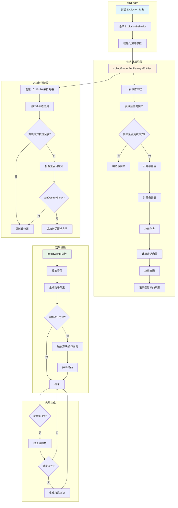

# Minecraft 1.21 爆炸系统深度分析

> 基于 CFR 0.2.2 反编译源代码的爆炸系统完整分析
> 版本信息: Protocol 767, World Version 3953

---

## 1. 概述

### 1.1 什么是爆炸系统

**爆炸系统（Explosion System）** 是 Minecraft 中处理各类爆炸事件的核心模块。它负责计算爆炸伤害、方块破坏、粒子效果和音效等。爆炸在游戏中无处不在，从玩家使用的 TNT、爬行者的自爆，到恶魂的火球和凋灵BOSS的诅咒爆炸，都是由这一系统驱动的。

Minecraft 的爆炸系统具有高度的可扩展性，通过 `ExplosionBehavior` 接口允许不同的实体自定义爆炸行为。这种设计使得每种爆炸源都可以拥有独特的属性，如爆炸威力、是否生成火焰、破坏方块的模式等。

### 1.2 爆炸系统核心特性

| 特性 | 说明 |
|------|------|
| 伤害计算 | 基于距离和暴露值的动态伤害系统 |
| 方块破坏 | 支持多种破坏模式（保留、破坏、衰减破坏） |
| 粒子效果 | 客户端粒子和发射器粒子双重渲染 |
| 音效系统 | 完整的爆炸音效播放机制 |
| 火焰生成 | 可选的火焰蔓延效果 |
| 爆炸抗性 | 每种方块和流体都有独立的抗爆属性 |
| 击退效果 | 基于爆炸抗性和距离的实体击退 |

### 1.3 爆炸类型分类

Minecraft 中的爆炸可以分为以下几类：

```
┌─────────────────────────────────────────────────────────────────────┐
│                         爆炸类型分类                                   │
├─────────────────────────────────────────────────────────────────────┤
│                                                                     │
│  ┌─────────────────┐  ┌─────────────────┐  ┌─────────────────┐    │
│  │   玩家爆炸       │  │   生物爆炸       │  │   物品爆炸       │    │
│  │  (TNT, 苦力怕)   │  │ (恶魂, 凋灵, 风弹)│  │  (末影水晶)      │    │
│  └────────┬────────┘  └────────┬────────┘  └────────┬────────┘    │
│           │                    │                    │               │
│           └────────────────────┼────────────────────┘               │
│                                ▼                                     │
│                    ┌─────────────────────┐                           │
│                    │   爆炸核心系统       │                           │
│                    │  (Explosion 类)     │                           │
│                    └─────────────────────┘                           │
│                                │                                     │
│           ┌────────────────────┼────────────────────┐               │
│           ▼                    ▼                    ▼               │
│    ┌─────────────┐     ┌─────────────┐     ┌─────────────┐        │
│    │ 伤害计算     │     │ 方块破坏    │     │ 粒子/音效   │        │
│    └─────────────┘     └─────────────┘     └─────────────┘        │
│                                                                     │
└─────────────────────────────────────────────────────────────────────┘
```

---

## 2. 核心类详解

### 2.1 Explosion 类

`Explosion` 类是爆炸系统的核心，封装了爆炸的所有属性和行为。

```12:50:D:\Minecraft-Learning\assets\mc\1.21\net\minecraft\world\explosion\Explosion.java
public class Explosion {
    private static final ExplosionBehavior DEFAULT_BEHAVIOR = new ExplosionBehavior();
    private static final int field_30960 = 16;
    private final boolean createFire;
    private final DestructionType destructionType;
    private final Random random = Random.create();
    private final World world;
    private final double x;
    private final double y;
    private final double z;
    @Nullable
    private final Entity entity;
    private final float power;
    private final DamageSource damageSource;
    private final ExplosionBehavior behavior;
    private final ParticleEffect particle;
    private final ParticleEffect emitterParticle;
    private final RegistryEntry<SoundEvent> soundEvent;
    private final ObjectArrayList<BlockPos> affectedBlocks = new ObjectArrayList();
    private final Map<PlayerEntity, Vec3d> affectedPlayers = Maps.newHashMap();
```

#### 核心字段说明

| 字段 | 类型 | 说明 |
|------|------|------|
| `power` | float | 爆炸威力，决定伤害范围和破坏力 |
| `createFire` | boolean | 是否在爆炸位置生成火焰 |
| `destructionType` | DestructionType | 方块破坏模式枚举 |
| `behavior` | ExplosionBehavior | 爆炸行为处理器 |
| `affectedBlocks` | ObjectArrayList | 爆炸影响的方块列表 |
| `affectedPlayers` | Map | 受爆炸影响的玩家及其击退向量 |

#### 构造函数重载

Explosion 类提供了多个构造函数，以适应不同的使用场景：

```76:88:D:\Minecraft-Learning\assets\mc\1.21\net\minecraft\world\explosion\Explosion.java
public Explosion(World world, @Nullable Entity entity, double x, double y, double z, float power, List<BlockPos> affectedBlocks, DestructionType destructionType, ParticleEffect particle, ParticleEffect emitterParticle, RegistryEntry<SoundEvent> soundEvent) {
    this(world, entity, Explosion.createDamageSource(world, entity), null, x, y, z, power, false, destructionType, particle, emitterParticle, soundEvent);
    this.affectedBlocks.addAll((Collection<BlockPos>)affectedBlocks);
}

public Explosion(World world, @Nullable Entity entity, double x, double y, double z, float power, boolean createFire, DestructionType destructionType) {
    this(world, entity, Explosion.createDamageSource(world, entity), null, x, y, z, power, createFire, destructionType, ParticleTypes.EXPLOSION, ParticleTypes.EXPLOSION_EMITTER, SoundEvents.ENTITY_GENERIC_EXPLODE);
}
```

### 2.2 DestructionType 枚举

破坏类型枚举定义了方块在爆炸中的行为模式：

```346:351:D:\Minecraft-Learning\assets\mc\1.21\net\minecraft\world\explosion\Explosion.java
public static enum DestructionType {
    KEEP,              // 保留方块，不破坏
    DESTROY,           // 破坏方块
    DESTROY_WITH_DECAY,// 破坏方块（带衰减效果）
    TRIGGER_BLOCK;     // 触发方块（如压力板）
}
```

### 2.3 ExplosionBehavior 类

`ExplosionBehavior` 是爆炸行为的抽象接口，允许不同实体自定义爆炸效果：

```15:42:D:\Minecraft-Learning\assets\mc\1.21\net\minecraft\world\explosion\ExplosionBehavior.java
public class ExplosionBehavior {
    public Optional<Float> getBlastResistance(Explosion explosion, BlockView world, BlockPos pos, BlockState blockState, FluidState fluidState) {
        if (blockState.isAir() && fluidState.isEmpty()) {
            return Optional.empty();
        }
        return Optional.of(Float.valueOf(Math.max(blockState.getBlock().getBlastResistance(), fluidState.getBlastResistance())));
    }

    public boolean canDestroyBlock(Explosion explosion, BlockView world, BlockPos pos, BlockState state, float power) {
        return true;
    }

    public boolean shouldDamage(Explosion explosion, Entity entity) {
        return true;
    }

    public float getKnockbackModifier(Entity entity) {
        return 1.0f;
    }

    public float calculateDamage(Explosion explosion, Entity entity) {
        float f = explosion.getPower() * 2.0f;
        Vec3d vec3d = explosion.getPosition();
        double d = Math.sqrt(entity.squaredDistanceTo(vec3d)) / (double)f;
        double e = (1.0 - d) * (double)Explosion.getExposure(vec3d, entity);
        return (float)((e * e + e) / 2.0 * 7.0 * (double)f + 1.0);
    }
}
```

#### 核心方法说明

| 方法 | 说明 |
|------|------|
| `getBlastResistance()` | 获取指定方块的爆炸抗性 |
| `canDestroyBlock()` | 判断爆炸是否可以破坏指定方块 |
| `shouldDamage()` | 判断爆炸是否应该伤害实体 |
| `getKnockbackModifier()` | 获取击退修正系数 |
| `calculateDamage()` | 计算对实体的伤害值 |

---

## 3. 爆炸伤害计算

### 3.1 伤害计算公式

爆炸伤害的计算是爆炸系统的核心算法之一。伤害值由以下几个因素决定：

1. **基础威力**：爆炸威力的两倍 (`power * 2.0f`)
2. **距离衰减**：实体到爆炸中心的距离与爆炸半径的比值
3. **暴露值（Exposure）**：实体被爆炸"看见"的程度
4. **击退抗性**：实体属性中的爆炸抗性

```35:41:D:\Minecraft-Learning\assets\mc\1.21\net\minecraft\world\explosion\ExplosionBehavior.java
public float calculateDamage(Explosion explosion, Entity entity) {
    float f = explosion.getPower() * 2.0f;  // 爆炸半径
    Vec3d vec3d = explosion.getPosition();  // 爆炸中心
    double d = Math.sqrt(entity.squaredDistanceTo(vec3d)) / (double)f;  // 距离比
    double e = (1.0 - d) * (double)Explosion.getExposure(vec3d, entity);  // 暴露调整
    return (float)((e * e + e) / 2.0 * 7.0 * (double)f + 1.0);  // 最终伤害
}
```

### 3.2 暴露值计算

暴露值是一个 0.0 到 1.0 之间的浮点数，表示实体相对于爆炸的"可见程度"。这个值通过射线检测计算：

```110:137:D:\Minecraft-Learning\assets\mc\1.21\net\minecraft\world\explosion\Explosion.java
public static float getExposure(Vec3d source, Entity entity) {
    Box box = entity.getBoundingBox();
    double d = 1.0 / ((box.maxX - box.minX) * 2.0 + 1.0);
    double e = 1.0 / ((box.maxY - box.minY) * 2.0 + 1.0);
    double f = 1.0 / ((box.maxZ - box.minZ) * 2.0 + 1.0);
    // ... 对实体边界进行采样 ...
    for (double k = 0.0; k <= 1.0; k += d) {
        for (double l = 0.0; l <= 1.0; l += e) {
            for (double m = 0.0; m <= 1.0; m += f) {
                // 从实体表面采样点向爆炸中心发射射线
                // 如果射线未击中任何方块，则增加计数
            }
        }
    }
    return (float)i / (float)j;  // 命中数 / 总采样数
}
```

暴露值计算的原理：

```
┌─────────────────────────────────────────────────────────────────────┐
│                        暴露值计算示意图                                │
├─────────────────────────────────────────────────────────────────────┤
│                                                                     │
│                        爆炸中心 (E)                                   │
│                            ●                                        │
│                           ╱ ╲                                       │
│                          ╱   ╲                                      │
│                         ╱     ╲                                     │
│              ┌─────────┐       ┌─────────┐                          │
│              │  实体   │       │ 方块墙   │                          │
│              │   A     │       │   B     │                          │
│              │ 暴露=1  │       │ 暴露=0  │                          │
│              └─────────┘       └─────────┘                          │
│                                                                     │
│  实体 A：爆炸可以直接"看到"实体表面的大部分区域                         │
│         → 暴露值接近 1.0 → 受到全额爆炸伤害                           │
│                                                                     │
│  实体 B：方块墙阻挡了爆炸的直接"视线"                                  │
│         → 暴露值接近 0.0 → 伤害大幅降低                               │
│                                                                     │
└─────────────────────────────────────────────────────────────────────┘
```

### 3.3 伤害计算流程

```147:226:D:\Minecraft-Learning\assets\mc\1.21\net\minecraft\world\explosion\Explosion.java
public void collectBlocksAndDamageEntities() {
    // 1. 发出游戏事件
    this.world.emitGameEvent(this.entity, GameEvent.EXPLODE, new Vec3d(this.x, this.y, this.z));
    
    // 2. 计算受影响的实体包围盒
    float q = this.power * 2.0f;
    int k = MathHelper.floor(this.x - (double)q - 1.0);
    int l = MathHelper.floor(this.x + (double)q + 1.0);
    // ... 其他维度 ...
    
    // 3. 获取范围内所有实体
    List<Entity> list = this.world.getOtherEntities(this.entity, new Box(k, r, t, l, s, u));
    
    // 4. 对每个实体计算伤害和击退
    for (Entity entity : list) {
        // 检查是否免疫爆炸
        if (entity.isImmuneToExplosion(this)) continue;
        
        // 计算距离
        double v = Math.sqrt(entity.squaredDistanceTo(vec3d)) / (double)q;
        if (v > 1.0) continue;  // 超出范围
        
        // 计算伤害
        if (this.behavior.shouldDamage(this, entity)) {
            entity.damage(this.damageSource, this.behavior.calculateDamage(this, entity));
        }
        
        // 计算击退
        double aa = (1.0 - v) * (double)Explosion.getExposure(vec3d, entity) 
                    * (double)this.behavior.getKnockbackModifier(entity);
        
        // 应用爆炸抗性属性
        if (entity instanceof LivingEntity) {
            ab = aa * (1.0 - livingEntity.getAttributeValue(EntityAttributes.GENERIC_EXPLOSION_KNOCKBACK_RESISTANCE));
        }
        
        // 应用击退速度
        entity.setVelocity(entity.getVelocity().add(vec3d2));
        
        // 记录受影响的玩家
        if (entity instanceof PlayerEntity && !playerEntity.isSpectator()) {
            this.affectedPlayers.put(playerEntity, vec3d2);
        }
    }
}
```

---

## 4. 方块破坏计算

### 4.1 方块破坏流程

方块破坏是爆炸系统的重要组成部分。Minecraft 使用射线投射的方法来检测可能被破坏的方块。

```147:187:D:\Minecraft-Learning\assets\mc\1.21\net\minecraft\world\explosion\Explosion.java
public void collectBlocksAndDamageEntities() {
    HashSet<BlockPos> set = Sets.newHashSet();
    int i = 16;
    
    // 16x16x16 的立方体网格采样
    for (int j = 0; j < 16; ++j) {
        for (int k = 0; k < 16; ++k) {
            block2: for (int l = 0; l < 16; ++l) {
                // 只在立方体的表面采样（16个采样点）
                if (j != 0 && j != 15 && k != 0 && k != 15 && l != 0 && l != 15) continue;
                
                // 计算射线方向
                double d = (float)j / 15.0f * 2.0f - 1.0f;
                double e = (float)k / 15.0f * 2.0f - 1.0f;
                double f = (float)l / 15.0f * 2.0f - 1.0f;
                double g = Math.sqrt(d * d + e * e + f * f);
                d /= g; e /= g; f /= g;  // 归一化
                
                // 沿射线方向步进
                for (float h = this.power * (0.7f + this.world.random.nextFloat() * 0.6f); h > 0.0f; h -= 0.22500001f) {
                    BlockPos blockPos = BlockPos.ofFloated(m, n, o);
                    BlockState blockState = this.world.getBlockState(blockPos);
                    
                    // 获取爆炸抗性
                    Optional<Float> optional = this.behavior.getBlastResistance(this, this.world, blockPos, blockState, fluidState);
                    if (optional.isPresent()) {
                        h -= (optional.get().floatValue() + 0.3f) * 0.3f;
                    }
                    
                    // 判断是否可以破坏
                    if (h > 0.0f && this.behavior.canDestroyBlock(this, this.world, blockPos, blockState, h)) {
                        set.add(blockPos);
                    }
                    
                    // 步进到下一个位置
                    m += d * 0.3;
                    n += e * 0.3;
                    o += f * 0.3;
                }
            }
        }
    }
    this.affectedBlocks.addAll(set);
}
```

### 4.2 爆炸抗性

每种方块都有其独特的爆炸抗性值，这决定了它能承受多大的爆炸威力：

| 方块类型 | 爆炸抗性 | 备注 |
|----------|----------|------|
| 虚空空气 | 0.0 | 无抗性 |
| 石头 | 6.0 | 中等抗性 |
| 铁块 | 6.0 | 虽然耐久高，但抗性一般 |
| 黑曜石 | 6000.0 | 极高抗性，末地传送门框架为 1800.0 |
| 床（主世界） | 1.0 | 爆炸时会产生特殊效果 |
| 龍蛋 | 1.0 | 极低抗性 |

### 4.3 破坏执行

```231:258:D:\Minecraft-Learning\assets\mc\1.21\net\minecraft\world\explosion\Explosion.java
public void affectWorld(boolean particles) {
    // 客户端播放音效
    if (this.world.isClient) {
        this.world.playSound(this.x, this.y, this.z, this.soundEvent.value(), 
            SoundCategory.BLOCKS, 4.0f, ...);
    }
    
    boolean bl = this.shouldDestroy();
    
    if (particles) {
        // 根据爆炸威力选择粒子类型
        ParticleEffect particleEffect = this.power < 2.0f || !bl 
            ? this.particle : this.emitterParticle;
        this.world.addParticle(particleEffect, this.x, this.y, this.z, 1.0, 0.0, 0.0);
    }
    
    if (bl) {
        // 随机打乱顺序（防止总是同一顺序破坏）
        Util.shuffle(this.affectedBlocks, this.world.random);
        
        // 触发方块破坏
        for (BlockPos blockPos : this.affectedBlocks) {
            this.world.getBlockState(blockPos).onExploded(this.world, blockPos, this, 
                (stack, pos) -> Explosion.tryMergeStack(list, stack, pos));
        }
        
        // 掉落物品
        for (Pair pair : list) {
            Block.dropStack(this.world, (BlockPos)pair.getSecond(), (ItemStack)pair.getFirst());
        }
    }
    
    // 生成火焰
    if (this.createFire) {
        for (BlockPos blockPos2 : this.affectedBlocks) {
            if (this.random.nextInt(3) != 0) continue;
            // ... 检查条件后生成火焰 ...
        }
    }
}
```

---

## 5. 粒子和音效

### 5.1 粒子系统

爆炸产生两种粒子效果：

| 粒子类型 | 触发条件 | 视觉效果 |
|----------|----------|----------|
| `EXPLOSION` | 爆炸威力 < 2.0 或 `destructionType` 为 `KEEP` | 普通爆炸粒子 |
| `EXPLOSION_EMITTER` | 爆炸威力 >= 2.0 且会破坏方块 | 更大的发射器粒子 |

```237:238:D:\Minecraft-Learning\assets\mc\1.21\net\minecraft\world\explosion\Explosion.java
ParticleEffect particleEffect = this.power < 2.0f || !bl ? this.particle : this.emitterParticle;
this.world.addParticle(particleEffect, this.x, this.y, this.z, 1.0, 0.0, 0.0);
```

### 5.2 音效系统

```231:234:D:\Minecraft-Learning\assets\mc\1.21\net\minecraft\world\explosion\Explosion.java
if (this.world.isClient) {
    this.world.playSound(this.x, this.y, this.z, this.soundEvent.value(), 
        SoundCategory.BLOCKS, 4.0f, 
        (1.0f + (this.world.random.nextFloat() - this.world.random.nextFloat()) * 0.2f) * 0.7f, 
        false);
}
```

音效参数：
- **音量**：4.0f（较大范围可听）
- **音调**：0.7f * (1.0 ± 0.2)，略有随机变化

---

## 6. 爆炸子类实现

### 6.1 EntityExplosionBehavior

当爆炸与特定实体关联时使用此行为类：

```15:32:D:\Minecraft-Learning\assets\mc\1.21\net\minecraft\world\explosion\EntityExplosionBehavior.java
public class EntityExplosionBehavior extends ExplosionBehavior {
    private final Entity entity;

    @Override
    public Optional<Float> getBlastResistance(Explosion explosion, BlockView world, BlockPos pos, BlockState blockState, FluidState fluidState) {
        return super.getBlastResistance(explosion, world, pos, blockState, fluidState)
            .map(max -> Float.valueOf(this.entity.getEffectiveExplosionResistance(
                explosion, world, pos, blockState, fluidState, max.floatValue())));
    }

    @Override
    public boolean canDestroyBlock(Explosion explosion, BlockView world, BlockPos pos, BlockState state, float power) {
        return this.entity.canExplosionDestroyBlock(explosion, world, pos, state, power);
    }
}
```

### 6.2 AdvancedExplosionBehavior

高级爆炸行为类，提供更精细的控制：

```18:73:D:\Minecraft-Learning\assets\mc\1.21\net\minecraft\world\explosion\AdvancedExplosionBehavior.java
public class AdvancedExplosionBehavior extends ExplosionBehavior {
    private final boolean destroyBlocks;
    private final boolean damageEntities;
    private final Optional<Float> knockbackModifier;
    private final Optional<RegistryEntryList<Block>> immuneBlocks;

    @Override
    public Optional<Float> getBlastResistance(Explosion explosion, BlockView world, BlockPos pos, BlockState blockState, FluidState fluidState) {
        if (this.immuneBlocks.isPresent()) {
            if (blockState.isIn(this.immuneBlocks.get())) {
                return Optional.of(Float.valueOf(3600000.0f));  // 免疫方块
            }
            return Optional.empty();
        }
        return super.getBlastResistance(explosion, world, pos, blockState, fluidState);
    }

    @Override
    public boolean canDestroyBlock(Explosion explosion, BlockView world, BlockPos pos, BlockState state, float power) {
        return this.destroyBlocks;
    }

    @Override
    public boolean shouldDamage(Explosion explosion, Entity entity) {
        return this.damageEntities;
    }
}
```

---

## 7. 爆炸流程 Mermaid 图



---

## 8. 性能考虑

### 8.1 性能瓶颈分析

1. **16x16x16 网格采样**：每次爆炸需要 4096 次采样点计算
2. **射线检测**：每个采样点需要发射射线检测方块
3. **暴露值计算**：对实体的多维度采样，涉及多次射线检测

### 8.2 优化策略

| 优化点 | 说明 |
|--------|------|
| 采样步长 | 使用 0.3 单位的固定步长，平衡精度和性能 |
| 包围盒检测 | 预先使用 AABB 过滤不在范围内的实体 |
| 抗性缓存 | 相同方块类型的抗性值被重复使用 |
| 随机化 | 使用随机因子防止每次爆炸完全相同 |

### 8.3 游戏规则影响

爆炸行为受多个游戏规则控制：

```336:344:D:\Minecraft-Learning\assets\mc\1.21\net\minecraft\world\explosion\Explosion.java
public boolean canTriggerBlocks() {
    if (this.destructionType != DestructionType.TRIGGER_BLOCK || this.world.isClient()) {
        return false;
    }
    if (this.entity != null && this.entity.getType() == EntityType.BREEZE_WIND_CHARGE) {
        return this.world.getGameRules().getBoolean(GameRules.DO_MOB_GRIEFING);
    }
    return true;
}
```

---

## 9. 源码文件路径

本分析基于以下源文件：

```
D:\Minecraft-Learning\assets\mc\1.21\net\minecraft\world\explosion\
├── Explosion.java              # 爆炸核心类
├── ExplosionBehavior.java      # 爆炸行为接口
├── AdvancedExplosionBehavior.java  # 高级爆炸行为
└── EntityExplosionBehavior.java # 实体爆炸行为
```

---

## 10. 总结

Minecraft 1.21 的爆炸系统是一个设计精良的模块化系统，具有以下特点：

1. **高度解耦**：通过 `ExplosionBehavior` 接口实现不同爆炸类型的差异化处理
2. **精确计算**：暴露值算法确保伤害计算的公平性和真实性
3. **灵活配置**：多种破坏类型和可选效果满足不同场景需求
4. **性能优化**：合理的采样策略和缓存机制确保性能可控

理解爆炸系统的核心算法对于 Mod 开发、服务器优化和问题排查都有重要意义。
