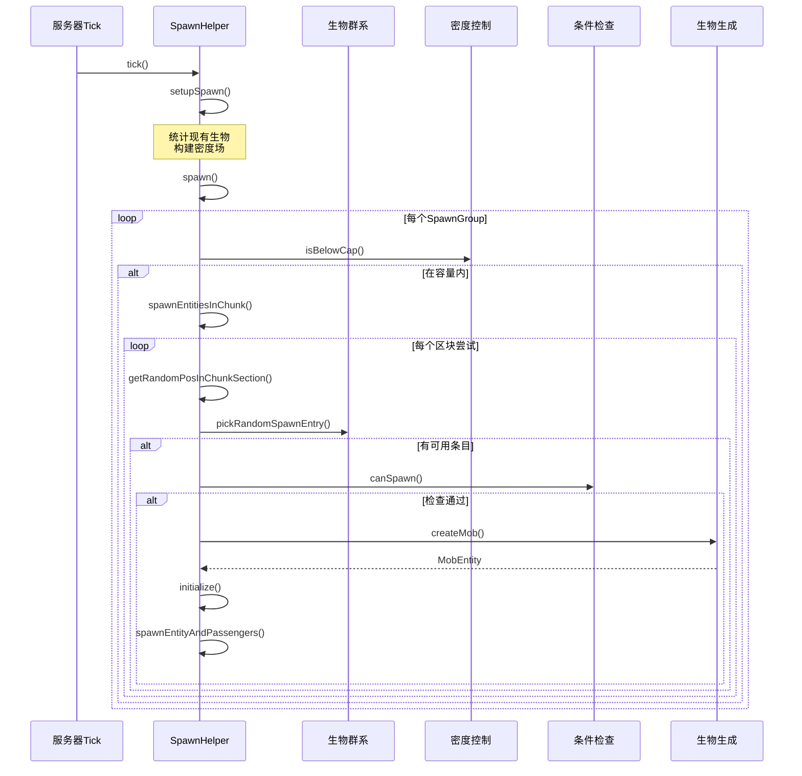
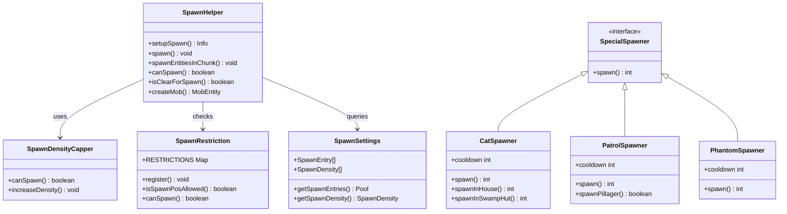
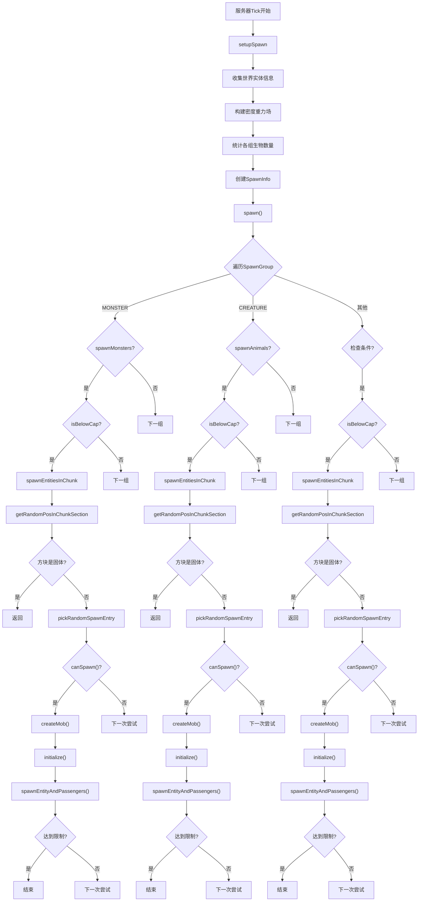
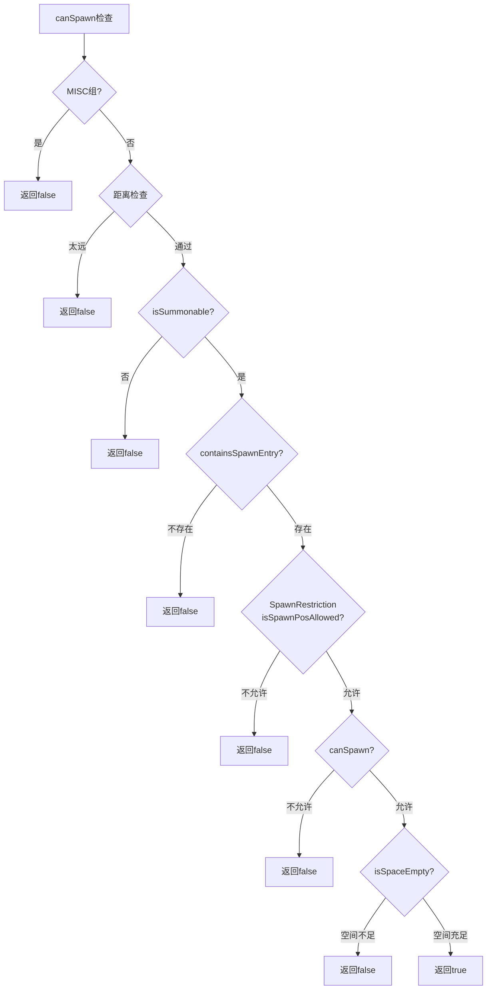
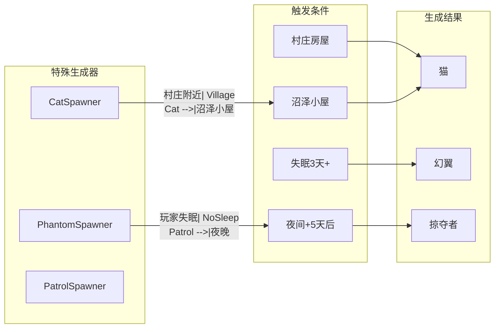

# Minecraft 1.21 生物生成系统深度分析

> 基于 CFR 0.2.2 反编译源代码的生物生成系统完整分析
> 版本信息: Protocol 767, World Version 3953

---

## 1. 概述

### 1.1 生物生成系统的重要性

生物生成系统是 Minecraft 世界活力的核心，它决定了游戏中各种生物的出现方式、频率和条件。一个完善的生成系统需要平衡游戏的挑战性、生存难度和玩家体验。

```
┌─────────────────────────────────────────────────────────────────────────────┐
│                          生物生成系统架构图                                      │
├─────────────────────────────────────────────────────────────────────────────┤
│                                                                             │
│   生成类型 ──► 生成条件 ──► 生成算法 ──► 密度控制 ──► 特殊生成              │
│      │            │            │            │            │                 │
│      ▼            ▼            ▼            ▼            ▼                 │
│   ┌──────┐    ┌──────┐    ┌──────┐    ┌──────┐    ┌──────┐              │
│   │自然生成│   │生物群系│   │循环扫描│   │容量限制│   │刷怪笼 │              │
│   │特殊生成│   │亮度检查│   │分组生成│   │距离衰减│   │袭击  │              │
│   │结构生成│   │距离检查│   │碰撞检测│   │重力场  │   │村庄生物│              │
│   └──────┘    └──────┘    └──────┘    └──────┘    └──────┘              │
│                                                                             │
└─────────────────────────────────────────────────────────────────────────────┘
```

### 1.2 核心类结构

| 类名 | 职责 | 包路径 |
|------|------|--------|
| `SpawnHelper` | 自然生成的中心调度器 | `net.minecraft.world` |
| `SpawnRestriction` | 定义每个生物类型的生成限制 | `net.minecraft.entity` |
| `SpawnDensityCapper` | 控制区域内的生物密度上限 | `net.minecraft.world` |
| `SpecialSpawner` | 特殊生物生成的接口 | `net.minecraft.world.spawner` |
| `CatSpawner` | 猫的特殊生成逻辑 | `net.minecraft.world.spawner` |
| `PatrolSpawner` | 掠夺者巡逻队生成 | `net.minecraft.world.spawner` |
| `PhantomSpawner` | 幻翼生成逻辑 | `net.minecraft.world.spawner` |
| `SpawnSettings` | 生物群系生成配置 | `net.minecraft.world.biome` |

### 1.3 生成流程总览

```
世界tick开始
    │
    ▼
┌────────────────────────────────────┐
│ 1. 准备生成信息 (setupSpawn)        │
│    - 统计现有生物数量              │
│    - 构建密度重力场                │
│    - 初始化密度限制器              │
└────────────────────────────────────┘
    │
    ▼
┌────────────────────────────────────┐
│ 2. 对每个加载的区块进行生成 (spawn)  │
│    - 按SpawnGroup遍历              │
│    - 检查游戏规则                  │
│    - 检查容量上限                  │
└────────────────────────────────────┘
    │
    ▼
┌────────────────────────────────────┐
│ 3. 生成实体 (spawnEntitiesInChunk)  │
│    - 随机选择区块内位置            │
│    - 选择生物类型                  │
│    - 检查生成条件                  │
│    - 创建并放置实体                │
└────────────────────────────────────┘
    │
    ▼
┌────────────────────────────────────┐
│ 4. 特殊生成 (SpecialSpawner)        │
│    - 猫生成                        │
│    - 幻翼生成                      │
│    - 掠夺者巡逻队生成              │
└────────────────────────────────────┘
```

---

## 2. 自然生成 (Natural Spawning)

### 2.1 自然生成概述

自然生成是 Minecraft 世界中最常见的生物出现方式，它发生在玩家附近的区块被加载时。每个游戏刻（tick），服务器会检查需要生成生物的区块，并尝试在每个区块中生成一定数量的生物。

自然生成由 `SpawnHelper` 类管理，它负责协调整个生成过程：

```net/minecraft/world/SpawnHelper.java
public final class SpawnHelper {
    private static final int MIN_SPAWN_DISTANCE = 24;
    public static final int field_30972 = 8;
    public static final int field_30973 = 128;
    static final int CHUNK_AREA = (int)Math.pow(17.0, 2.0);
    private static final SpawnGroup[] SPAWNABLE_GROUPS = (SpawnGroup[])Stream.of(SpawnGroup.values())
        .filter(spawnGroup -> spawnGroup != SpawnGroup.MISC)
        .toArray(SpawnGroup[]::new);
    
    public static void spawn(ServerWorld world, WorldChunk chunk, Info info, 
                             boolean spawnAnimals, boolean spawnMonsters, boolean rareSpawn) {
        world.getProfiler().push("spawner");
        for (SpawnGroup spawnGroup : SPAWNABLE_GROUPS) {
            // 检查各种条件后进行生成
            if (!info.isBelowCap(spawnGroup, chunk.getPos())) continue;
            SpawnHelper.spawnEntitiesInChunk(spawnGroup, world, chunk, info::test, info::run);
        }
        world.getProfiler().pop();
    }
}
```

### 2.2 生物群系与生成

每个生物群系（Biome）都定义了可以在其中生成的生物列表。这个定义存储在 `SpawnSettings` 中：

```net/minecraft/world/biome/SpawnSettings.java
public class SpawnSettings {
    private final float creatureSpawnProbability;
    private final Map<SpawnGroup, Pool<SpawnEntry>> spawners;
    private final Map<EntityType<?>, SpawnDensity> spawnCosts;
    
    public Pool<SpawnEntry> getSpawnEntries(SpawnGroup spawnGroup) {
        return this.spawners.getOrDefault(spawnGroup, EMPTY_ENTRY_POOL);
    }
    
    public record SpawnDensity(double gravityLimit, double mass) {
        // 用于密度控制的参数
    }
    
    public static class SpawnEntry extends Weighted.Absent {
        public final EntityType<?> type;
        public final int minGroupSize;
        public final int maxGroupSize;
    }
}
```

#### 2.2.1 生成条目配置

每个生物群系的生成配置包含：

| 字段 | 说明 | 示例 |
|------|------|------|
| `creature_spawn_probability` | 区块生成生物的概率 | 0.1 (10%) |
| `spawners` | 每个 SpawnGroup 的生成列表 | 见下文 |
| `spawn_costs` | 生物密度消耗配置 | 控制密度上限 |

#### 2.2.2 SpawnGroup 分组

```net/minecraft/entity/SpawnGroup.java
public enum SpawnGroup {
    MONSTER(10, "monster"),      // 怪物：僵尸、骷髅、蜘蛛等
    CREATURE(5, "creature"),    // 动物：牛、猪、羊等
    AMBIENT(10, "ambient"),      // 环境生物：蝙蝠
    WATER_CREATURE(5, "water_creature"),  // 水生生物：海豚、鱿鱼
    WATER_AMBIENT(10, "water_ambient"),   // 水中生物：鱼
    MISC(0, "misc");             // 杂项：不参与自然生成
    
    private final int immediateDespawnRange;
    private final int capacity;
    private final String name;
}
```

### 2.3 亮度检查

亮度是自然生成的关键条件之一。不同的生物有不同的亮度要求：

```net/minecraft/entity/mob/HostileEntity.java
public class HostileEntity extends MobEntity {
    
    // 检查是否可以在暗处生成（怪物默认行为）
    public static boolean canSpawnInDark(EntityType<HostileEntity> type, 
                                          ServerWorldAccess world, 
                                          SpawnReason reason, 
                                          BlockPos pos, Random random) {
        // 检查亮度等级
        if (world.getLightLevel(pos) > random.nextInt(11)) {
            return false;
        }
        // 检查SpawnRestriction
        return SpawnRestriction.canSpawn(type, world, reason, pos, random);
    }
    
    // 检查是否忽略亮度（火焰怪等）
    public static boolean canSpawnIgnoreLightLevel(EntityType<HostileEntity> type, 
                                                    ServerWorldAccess world, 
                                                    SpawnReason reason, 
                                                    BlockPos pos, 
                                                    Random random) {
        return SpawnRestriction.canSpawn(type, world, reason, pos, random);
    }
}
```

#### 2.3.1 亮度与生成关系

| 生物类型 | 生成亮度要求 | 说明 |
|---------|-------------|------|
| 僵尸/骷髅 | ≤7 | 必须在阴暗处生成 |
| 史莱姆 | ≤7 | 在特定高度和亮度 |
| 蜘蛛 | ≤7 | 与亮度无关，但需要暗处 |
| 苦力怕 | ≤7 | 需要阴暗环境 |
| 女巫 | ≤7 | 需要阴暗环境 |
| 烈焰人 | 任意 | 忽略亮度检查 |
| 僵尸猪人 | 任意 | 在下界中生成 |

### 2.4 距离检查

生成位置与玩家的距离是另一个重要因素：

```net/minecraft/world/SpawnHelper.java
private static boolean isAcceptableSpawnPosition(ServerWorld world, Chunk chunk, 
                                                  BlockPos.Mutable pos, double squaredDistance) {
    // 1. 不能在玩家附近生成（防止突然出现）
    if (squaredDistance <= 576.0) {  // 24 * 24 = 576
        return false;
    }
    
    // 2. 不能在世界出生点附近生成
    if (world.getSpawnPos().isWithinDistance(
            new Vec3d((double)pos.getX() + 0.5, pos.getY(), (double)pos.getZ() + 0.5), 24.0)) {
        return false;
    }
    
    // 3. 必须在当前区块或待处理区块中
    return Objects.equals(new ChunkPos(pos), chunk.getPos()) || world.shouldTick(pos);
}
```

---

## 3. 刷怪笼 (Mob Spawner)

### 3.1 刷怪笼概述

刷怪笼（Mob Spawner）是游戏中一种特殊的方块，可以不断地在指定位置生成特定类型的生物。刷怪笼的行为由服务端控制，每个刻都会尝试生成生物。

刷怪笼的核心逻辑涉及以下方面：

1. **激活范围**：玩家需要在16格范围内才能激活刷怪笼
2. **生成延迟**：每次生成后有延迟，可以被红石信号修改
3. **生物类型**：默认生成猪（空的刷怪笼），可以设置为任何生物
4. **特殊效果**：显示粒子效果指示正在生成

### 3.2 刷怪笼生成条件

刷怪笼生成生物需要满足以下条件：

```net/minecraft/world/SpawnHelper.java
private static boolean canSpawn(ServerWorld world, SpawnGroup group, 
                                 StructureAccessor structureAccessor, 
                                 ChunkGenerator chunkGenerator, 
                                 SpawnSettings.SpawnEntry spawnEntry, 
                                 BlockPos.Mutable pos, double squaredDistance) {
    EntityType<?> entityType = spawnEntry.type;
    
    // 1. 不能是MISC组
    if (entityType.getSpawnGroup() == SpawnGroup.MISC) {
        return false;
    }
    
    // 2. 检查与玩家的距离
    if (!entityType.isSpawnableFarFromPlayer() && 
        squaredDistance > (double)(entityType.getSpawnGroup().getImmediateDespawnRange() * 
                                   entityType.getSpawnGroup().getImmediateDespawnRange())) {
        return false;
    }
    
    // 3. 检查是否可召唤
    if (!entityType.isSummonable()) {
        return false;
    }
    
    // 4. 检查生成条目是否存在于当前位置
    if (!SpawnHelper.containsSpawnEntry(world, structureAccessor, chunkGenerator, 
                                         group, spawnEntry, pos)) {
        return false;
    }
    
    // 5. 检查SpawnRestriction
    if (!SpawnRestriction.isSpawnPosAllowed(entityType, world, pos)) {
        return false;
    }
    
    // 6. 检查实体特定的生成条件
    if (!SpawnRestriction.canSpawn(entityType, world, SpawnReason.NATURAL, pos, world.random)) {
        return false;
    }
    
    // 7. 检查空间是否为空
    return world.isSpaceEmpty(entityType.getSpawnBox((double)pos.getX() + 0.5, 
                                                      pos.getY(), 
                                                      (double)pos.getZ() + 0.5));
}
```

### 3.3 刷怪笼与自然生成的差异

| 特性 | 刷怪笼 | 自然生成 |
|------|--------|----------|
| 生成位置 | 固定在刷怪笼位置 | 区块内随机位置 |
| 亮度要求 | 使用SpawnRestriction检查 | 特定亮度条件 |
| 生物群系 | 不依赖 | 完全依赖 |
| 密度上限 | 无限制 | 受容量和密度控制 |
| 组队大小 | 可配置 | 生物群系定义 |

---

## 4. 生成条件 (Spawn Conditions)

### 4.1 SpawnRestriction 系统

`SpawnRestriction` 类定义了每种生物类型的生成限制规则：

```net/minecraft/entity/SpawnRestriction.java
public class SpawnRestriction {
    private static final Map<EntityType<?>, Entry> RESTRICTIONS = Maps.newHashMap();
    
    public static <T extends MobEntity> void register(EntityType<T> type, 
                                                        SpawnLocation location, 
                                                        Heightmap.Type heightmapType, 
                                                        SpawnPredicate<T> predicate) {
        Entry entry = RESTRICTIONS.put(type, new Entry(heightmapType, location, predicate));
        if (entry != null) {
            throw new IllegalStateException("Duplicate registration for type " + 
                                            String.valueOf(Registries.ENTITY_TYPE.getId(type)));
        }
    }
    
    record Entry(Heightmap.Type heightmapType, SpawnLocation location, SpawnPredicate<?> predicate) {
    }
    
    @FunctionalInterface
    public static interface SpawnPredicate<T extends Entity> {
        public boolean test(EntityType<T> var1, ServerWorldAccess var2, 
                           SpawnReason var3, BlockPos var4, Random var5);
    }
}
```

### 4.2 生成位置类型

```net/minecraft/entity/SpawnLocationTypes.java
public class SpawnLocationTypes {
    // 在地面上生成
    public static final SpawnLocation ON_GROUND = ...
    
    // 在水中生成
    public static final SpawnLocation IN_WATER = ...
    
    // 在熔岩中生成（岩浆怪）
    public static final SpawnLocation IN_LAVA = ...
    
    // 无限制（可以在任何位置）
    public static final SpawnLocation UNRESTRICTED = ...
}
```

### 4.3 注册的生成限制

```net/minecraft/entity/SpawnRestriction.java
static {
    // 水生生物
    SpawnRestriction.register(EntityType.AXOLOTL, SpawnLocationTypes.IN_WATER, 
                              Heightmap.Type.MOTION_BLOCKING_NO_LEAVES, AxolotlEntity::canSpawn);
    SpawnRestriction.register(EntityType.DOLPHIN, SpawnLocationTypes.IN_WATER, 
                              Heightmap.Type.MOTION_BLOCKING_NO_LEAVES, WaterCreatureEntity::canSpawn);
    SpawnRestriction.register(EntityType.SQUID, SpawnLocationTypes.IN_WATER, 
                              Heightmap.Type.MOTION_BLOCKING_NO_LEAVES, WaterCreatureEntity::canSpawn);
    
    // 动物
    SpawnRestriction.register(EntityType.COW, SpawnLocationTypes.ON_GROUND, 
                              Heightmap.Type.MOTION_BLOCKING_NO_LEAVES, AnimalEntity::isValidNaturalSpawn);
    SpawnRestriction.register(EntityType.PIG, SpawnLocationTypes.ON_GROUND, 
                              Heightmap.Type.MOTION_BLOCKING_NO_LEAVES, AnimalEntity::isValidNaturalSpawn);
    SpawnRestriction.register(EntityType.SHEEP, SpawnLocationTypes.ON_GROUND, 
                              Heightmap.Type.MOTION_BLOCKING_NO_LEAVES, AnimalEntity::isValidNaturalSpawn);
    
    // 怪物
    SpawnRestriction.register(EntityType.ZOMBIE, SpawnLocationTypes.ON_GROUND, 
                              Heightmap.Type.MOTION_BLOCKING_NO_LEAVES, HostileEntity::canSpawnInDark);
    SpawnRestriction.register(EntityType.SKELETON, SpawnLocationTypes.ON_GROUND, 
                              Heightmap.Type.MOTION_BLOCKING_NO_LEAVES, HostileEntity::canSpawnInDark);
    SpawnRestriction.register(EntityType.CREEPER, SpawnLocationTypes.ON_GROUND, 
                              Heightmap.Type.MOTION_BLOCKING_NO_LEAVES, HostileEntity::canSpawnInDark);
    
    // 特殊生物
    SpawnRestriction.register(EntityType.BLAZE, SpawnLocationTypes.ON_GROUND, 
                              Heightmap.Type.MOTION_BLOCKING_NO_LEAVES, 
                              HostileEntity::canSpawnIgnoreLightLevel);
    SpawnRestriction.register(EntityType.GHAST, SpawnLocationTypes.ON_GROUND, 
                              Heightmap.Type.MOTION_BLOCKING_NO_LEAVES, GhastEntity::canSpawn);
    SpawnRestriction.register(EntityType.WARDEN, SpawnLocationTypes.UNRESTRICTED, 
                              Heightmap.Type.MOTION_BLOCKING_NO_LEAVES, MobEntity::canMobSpawn);
}
```

### 4.4 高度图类型

生成位置使用不同的高度图来确定Y坐标：

```net/minecraft/world/Heightmap.java
public enum Type {
    // 运动阻挡（包括树叶）
    MOTION_BLOCKING,
    
    // 运动阻挡（不包括树叶）
    MOTION_BLOCKING_NO_LEAVES,
    
    // 世界表面
    WORLD_SURFACE,
    
    // 海洋表面
    OCEAN_SURFACE;
}
```

---

## 5. 生成算法 (Spawning Algorithm)

### 5.1 区块内生成流程

`SpawnHelper.spawnEntitiesInChunk` 是核心生成方法：

```net/minecraft/world/SpawnHelper.java
public static void spawnEntitiesInChunk(SpawnGroup group, ServerWorld world, 
                                         WorldChunk chunk, Info info, 
                                         boolean spawnAnimals, boolean spawnMonsters, boolean rareSpawn) {
    // 1. 在区块中获取随机位置
    BlockPos blockPos = SpawnHelper.getRandomPosInChunkSection(world, chunk);
    if (blockPos.getY() < world.getBottomY() + 1) {
        return;
    }
    
    // 2. 调用详细生成方法
    SpawnHelper.spawnEntitiesInChunk(group, world, chunk, blockPos, info::test, info::run);
}

private static BlockPos getRandomPosInChunkSection(World world, WorldChunk chunk) {
    ChunkPos chunkPos = chunk.getPos();
    int i = chunkPos.getStartX() + world.random.nextInt(16);
    int j = chunkPos.getStartZ() + world.random.nextInt(16);
    int k = chunk.sampleHeightmap(Heightmap.Type.WORLD_SURFACE, i, j) + 1;
    int l = MathHelper.nextBetween(world.random, world.getBottomY(), k);
    return new BlockPos(i, l, j);
}
```

### 5.2 实体生成详细流程

```net/minecraft/world/SpawnHelper.java
public static void spawnEntitiesInChunk(SpawnGroup group, ServerWorld world, 
                                         Chunk chunk, BlockPos pos, 
                                         Checker checker, Runner runner) {
    StructureAccessor structureAccessor = world.getStructureAccessor();
    ChunkGenerator chunkGenerator = world.getChunkManager().getChunkGenerator();
    
    // 1. 检查基础方块
    BlockState blockState = chunk.getBlockState(pos);
    if (blockState.isSolidBlock(chunk, pos)) {
        return;  // 不能在实心方块中生成
    }
    
    BlockPos.Mutable mutable = new BlockPos.Mutable();
    int spawnCount = 0;
    
    // 2. 最多尝试3次生成循环
    block0: for (int k = 0; k < 3; ++k) {
        int baseX = pos.getX();
        int baseZ = pos.getZ();
        
        // 3. 每次循环尝试4次实体生成
        int groupSize = MathHelper.ceil(world.random.nextFloat() * 4.0f);
        int successfulSpawns = 0;
        
        for (int q = 0; q < groupSize; ++q) {
            // 随机偏移位置
            mutable.set(
                baseX += world.random.nextInt(6) - world.random.nextInt(6),
                pos.getY(),
                baseZ += world.random.nextInt(6) - world.random.nextInt(6)
            );
            
            double d = (double)baseX + 0.5;
            double e = (double)baseZ + 0.5;
            
            // 4. 检查与玩家的距离
            PlayerEntity playerEntity = world.getClosestPlayer(d, pos.getY(), e, -1.0, false);
            if (playerEntity == null || 
                !SpawnHelper.isAcceptableSpawnPosition(world, chunk, mutable, 
                                                       playerEntity.squaredDistanceTo(d, pos.getY(), e))) {
                continue;
            }
            
            // 5. 选择生物类型
            if (spawnEntry == null) {
                Optional<SpawnSettings.SpawnEntry> optional = 
                    SpawnHelper.pickRandomSpawnEntry(world, structureAccessor, 
                                                    chunkGenerator, group, 
                                                    world.random, mutable);
                if (optional.isEmpty()) continue block0;
                spawnEntry = optional.get();
                groupSize = spawnEntry.minGroupSize + 
                           world.random.nextInt(1 + spawnEntry.maxGroupSize - spawnEntry.minGroupSize);
            }
            
            // 6. 检查生成条件
            if (!SpawnHelper.canSpawn(world, group, structureAccessor, chunkGenerator, 
                                      spawnEntry, mutable, f) || 
                !checker.test(spawnEntry.type, mutable, chunk)) {
                continue;
            }
            
            // 7. 创建实体
            MobEntity mobEntity = SpawnHelper.createMob(world, spawnEntry.type);
            if (mobEntity == null) {
                return;
            }
            
            // 8. 设置位置和角度
            mobEntity.refreshPositionAndAngles(d, pos.getY(), e, 
                                                world.random.nextFloat() * 360.0f, 0.0f);
            
            // 9. 验证生成
            if (!SpawnHelper.isValidSpawn(world, mobEntity, f)) {
                continue;
            }
            
            // 10. 初始化并生成
            entityData = mobEntity.initialize(world, world.getLocalDifficulty(mobEntity.getBlockPos()), 
                                              SpawnReason.NATURAL, entityData);
            ++successfulSpawns;
            world.spawnEntityAndPassengers(mobEntity);
            runner.run(mobEntity, chunk);
            
            // 11. 检查每区块数量限制
            if (++spawnCount >= mobEntity.getLimitPerChunk()) {
                return;
            }
            
            // 12. 检查组队大小限制
            if (mobEntity.spawnsTooManyForEachTry(successfulSpawns)) {
                continue block0;
            }
        }
    }
}
```

### 5.3 生成组选择逻辑

```net/minecraft/world/SpawnHelper.java
private static Optional<SpawnSettings.SpawnEntry> pickRandomSpawnEntry(
        ServerWorld world, StructureAccessor structureAccessor, 
        ChunkGenerator chunkGenerator, SpawnGroup spawnGroup, 
        Random random, BlockPos pos) {
    
    RegistryEntry<Biome> registryEntry = world.getBiome(pos);
    
    // 特殊处理：减少水生生物在特定生物群系中的生成
    if (spawnGroup == SpawnGroup.WATER_AMBIENT && 
        registryEntry.isIn(BiomeTags.REDUCE_WATER_AMBIENT_SPAWNS) && 
        random.nextFloat() < 0.98f) {
        return Optional.empty();
    }
    
    // 从生物群系获取可用的生成条目
    return SpawnHelper.getSpawnEntries(world, structureAccessor, chunkGenerator, 
                                       spawnGroup, pos, registryEntry).getOrEmpty(random);
}

private static Pool<SpawnSettings.SpawnEntry> getSpawnEntries(
        ServerWorld world, StructureAccessor structureAccessor, 
        ChunkGenerator chunkGenerator, SpawnGroup spawnGroup, 
        BlockPos pos, @Nullable RegistryEntry<Biome> biomeEntry) {
    
    // 特殊情况：下界要塞的怪物生成
    if (SpawnHelper.shouldUseNetherFortressSpawns(pos, world, spawnGroup, structureAccessor)) {
        return NetherFortressStructure.MONSTER_SPAWNS;
    }
    
    // 从区块生成器获取生物群系的生成列表
    return chunkGenerator.getEntitySpawnList(
        biomeEntry != null ? biomeEntry : world.getBiome(pos), 
        structureAccessor, spawnGroup, pos);
}
```

---

## 6. 特殊生成 (Special Spawning)

### 6.1 SpecialSpawner 接口

特殊生成器接口定义了非自然生成的生物生成方式：

```net/minecraft/world/spawner/SpecialSpawner.java
public interface SpecialSpawner {
    /**
     * 在世界中生成实体
     * @return 生成的实体数量
     */
    public int spawn(ServerWorld var1, boolean var2, boolean var3);
}
```

### 6.2 猫生成器 (CatSpawner)

猫有两种特殊的生成方式：村庄房屋和沼泽小屋：

```net/minecraft/world/spawner/CatSpawner.java
public class CatSpawner implements SpecialSpawner {
    private static final int SPAWN_INTERVAL = 1200;
    private int cooldown;
    
    @Override
    public int spawn(ServerWorld world, boolean spawnMonsters, boolean spawnAnimals) {
        // 1. 检查游戏规则
        if (!spawnAnimals || !world.getGameRules().getBoolean(GameRules.DO_MOB_SPAWNING)) {
            return 0;
        }
        
        // 2. 检查冷却时间
        --this.cooldown;
        if (this.cooldown > 0) {
            return 0;
        }
        this.cooldown = 1200;
        
        // 3. 获取随机玩家
        ServerPlayerEntity playerEntity = world.getRandomAlivePlayer();
        if (playerEntity == null) {
            return 0;
        }
        
        // 4. 计算生成位置（玩家周围8-32格）
        Random random = world.random;
        int i = (8 + random.nextInt(24)) * (random.nextBoolean() ? -1 : 1);
        int j = (8 + random.nextInt(24)) * (random.nextBoolean() ? -1 : 1);
        BlockPos blockPos = playerEntity.getBlockPos().add(i, 0, j);
        
        // 5. 检查位置是否有效
        if (!world.isRegionLoaded(blockPos.getX() - 10, blockPos.getZ() - 10, 
                                   blockPos.getX() + 10, blockPos.getZ() + 10)) {
            return 0;
        }
        
        // 6. 根据位置类型生成猫
        if (SpawnRestriction.isSpawnPosAllowed(EntityType.CAT, world, blockPos)) {
            if (world.isNearOccupiedPointOfInterest(blockPos, 2)) {
                return this.spawnInHouse(world, blockPos);
            }
            if (world.getStructureAccessor().getStructureContaining(
                    blockPos, StructureTags.CATS_SPAWN_IN).hasChildren()) {
                return this.spawnInSwampHut(world, blockPos);
            }
        }
        return 0;
    }
    
    // 村庄房屋中生成猫
    private int spawnInHouse(ServerWorld world, BlockPos pos) {
        List<CatEntity> list;
        // 需要超过4张被占用的床
        if (world.getPointOfInterestStorage().count(
                entry -> entry.matchesKey(PointOfInterestTypes.HOME), 
                pos, 48, PointOfInterestStorage.OccupationStatus.IS_OCCUPIED) > 4L && 
            (list = world.getNonSpectatingEntities(CatEntity.class, 
                new Box(pos).expand(48.0, 8.0, 48.0))).size() < 5) {
            return this.spawn(pos, world);
        }
        return 0;
    }
    
    // 沼泽小屋中生成猫
    private int spawnInSwampHut(ServerWorld world, BlockPos pos) {
        List<CatEntity> list = world.getNonSpectatingEntities(
            CatEntity.class, new Box(pos).expand(16.0, 8.0, 16.0));
        if (list.size() < 1) {
            return this.spawn(pos, world);
        }
        return 0;
    }
}
```

### 6.3 幻翼生成器 (PhantomSpawner)

幻翼的生成与玩家的失眠时间相关：

```net/minecraft/world/spawner/PhantomSpawner.java
public class PhantomSpawner implements SpecialSpawner {
    private int cooldown;
    
    @Override
    public int spawn(ServerWorld world, boolean spawnMonsters, boolean spawnAnimals) {
        // 1. 检查失眠游戏规则
        if (!spawnMonsters || !world.getGameRules().getBoolean(GameRules.DO_INSOMNIA)) {
            return 0;
        }
        
        // 2. 冷却时间
        --this.cooldown;
        if (this.cooldown > 0) {
            return 0;
        }
        this.cooldown += (60 + world.random.nextInt(60)) * 20;
        
        // 3. 检查环境亮度
        if (world.getAmbientDarkness() < 5 && world.getDimension().hasSkyLight()) {
            return 0;
        }
        
        int spawnedCount = 0;
        
        // 4. 对每个玩家检查
        for (ServerPlayerEntity serverPlayerEntity : world.getPlayers()) {
            if (serverPlayerEntity.isSpectator()) continue;
            
            BlockPos blockPos = serverPlayerEntity.getBlockPos();
            
            // 5. 检查玩家位置
            if (world.getDimension().hasSkyLight() && 
                (blockPos.getY() < world.getSeaLevel() || 
                 !world.isSkyVisible(blockPos)) {
                continue;
            }
            
            LocalDifficulty localDifficulty = world.getLocalDifficulty(blockPos);
            
            // 6. 检查难度
            if (!localDifficulty.isHarderThan(world.random.nextFloat() * 3.0f)) {
                continue;
            }
            
            // 7. 检查失眠时间
            ServerStatHandler serverStatHandler = serverPlayerEntity.getStatHandler();
            int timeSinceRest = MathHelper.clamp(
                serverStatHandler.getStat(Stats.CUSTOM.getOrCreateStat(Stats.TIME_SINCE_REST)), 
                1, Integer.MAX_VALUE);
            
            // 失眠时间越短，越容易生成幻翼
            if (world.random.nextInt(timeSinceRest) >= 72000) {
                continue;
            }
            
            // 8. 在玩家上方生成幻翼
            BlockPos spawnPos = blockPos.up(20 + world.random.nextInt(15))
                                     .east(-10 + world.random.nextInt(21))
                                     .south(-10 + world.random.nextInt(21));
            
            if (!SpawnHelper.isClearForSpawn(world, spawnPos, 
                                             world.getBlockState(spawnPos), 
                                             world.getFluidState(spawnPos), 
                                             EntityType.PHANTOM)) {
                continue;
            }
            
            // 9. 生成1到多个幻翼
            EntityData entityData = null;
            int phantomsToSpawn = 1 + world.random.nextInt(
                localDifficulty.getGlobalDifficulty().getId() + 1);
            
            for (int m = 0; m < phantomsToSpawn; ++m) {
                PhantomEntity phantomEntity = EntityType.PHANTOM.create(world);
                if (phantomEntity != null) {
                    phantomEntity.refreshPositionAndAngles(spawnPos, 0.0f, 0.0f);
                    entityData = phantomEntity.initialize(world, localDifficulty, 
                                                          SpawnReason.NATURAL, entityData);
                    world.spawnEntityAndPassengers(phantomEntity);
                    ++spawnedCount;
                }
            }
        }
        return spawnedCount;
    }
}
```

### 6.4 掠夺者巡逻队生成器 (PatrolSpawner)

掠夺者巡逻队在夜晚生成：

```net/minecraft/world/spawner/PatrolSpawner.java
public class PatrolSpawner implements SpecialSpawner {
    private int cooldown;
    
    @Override
    public int spawn(ServerWorld world, boolean spawnMonsters, boolean spawnAnimals) {
        // 1. 检查游戏规则
        if (!spawnMonsters || 
            !world.getGameRules().getBoolean(GameRules.DO_PATROL_SPAWNING)) {
            return 0;
        }
        
        // 2. 冷却时间（较长）
        --this.cooldown;
        if (this.cooldown > 0) {
            return 0;
        }
        this.cooldown += 12000 + world.random.nextInt(1200);
        
        // 3. 检查游戏时间（至少5天后才能生成）
        long day = world.getTimeOfDay() / 24000L;
        if (day < 5L || !world.isDay()) {
            return 0;
        }
        
        // 4. 随机跳过（增加不规律性）
        if (world.random.nextInt(5) != 0) {
            return 0;
        }
        
        // 5. 选择玩家
        int playerCount = world.getPlayers().size();
        if (playerCount < 1) {
            return 0;
        }
        PlayerEntity playerEntity = world.getPlayers().get(world.random.nextInt(playerCount));
        if (playerEntity.isSpectator()) {
            return 0;
        }
        
        // 6. 不能在村庄附近生成
        if (world.isNearOccupiedPointOfInterest(playerEntity.getBlockPos(), 2)) {
            return 0;
        }
        
        // 7. 计算生成位置
        int offsetX = (24 + world.random.nextInt(24)) * (world.random.nextBoolean() ? -1 : 1);
        int offsetZ = (24 + world.random.nextInt(24)) * (world.random.nextInt(5) - world.random.nextInt(5));
        BlockPos.Mutable spawnPos = playerEntity.getBlockPos().mutableCopy()
                                                       .move(offsetX, 0, offsetZ);
        
        // 8. 检查区块加载和生物群系
        if (!world.isRegionLoaded(spawnPos.getX() - 10, spawnPos.getZ() - 10, 
                                   spawnPos.getX() + 10, spawnPos.getZ() + 10)) {
            return 0;
        }
        
        RegistryEntry<Biome> biome = world.getBiome(spawnPos);
        if (biome.isIn(BiomeTags.WITHOUT_PATROL_SPAWNS)) {
            return 0;
        }
        
        // 9. 根据难度决定巡逻队大小
        int patrolSize = (int)Math.ceil(world.getLocalDifficulty(spawnPos)
                                                 .getLocalDifficulty()) + 1;
        int spawnedCount = 0;
        for (int p = 0; p < patrolSize; ++p) {
            ++spawnedCount;
            spawnPos.setY(world.getTopPosition(Heightmap.Type.MOTION_BLOCKING_NO_LEAVES, spawnPos)
                                 .getY());
            
            if (p == 0) {
                // 第一个是巡逻队长
                if (!this.spawnPillager(world, spawnPos, world.random, true)) {
                    break;
                }
            } else {
                this.spawnPillager(world, spawnPos, world.random, false);
            }
            
            // 随机偏移下一个位置
            spawnPos.setX(spawnPos.getX() + world.random.nextInt(5) - world.random.nextInt(5));
            spawnPos.setZ(spawnPos.getZ() + world.random.nextInt(5) - world.random.nextInt(5));
        }
        return spawnedCount;
    }
    
    private boolean spawnPillager(ServerWorld world, BlockPos pos, Random random, boolean captain) {
        BlockState blockState = world.getBlockState(pos);
        if (!SpawnHelper.isClearForSpawn(world, pos, blockState, 
                                         blockState.getFluidState(), EntityType.PILLAGER)) {
            return false;
        }
        if (!PatrolEntity.canSpawn(EntityType.PILLAGER, world, SpawnReason.PATROL, pos, random)) {
            return false;
        }
        
        PatrolEntity patrolEntity = EntityType.PILLAGER.create(world);
        if (patrolEntity != null) {
            if (captain) {
                patrolEntity.setPatrolLeader(true);
                patrolEntity.setRandomPatrolTarget();
            }
            patrolEntity.setPosition(pos.getX(), pos.getY(), pos.getZ());
            patrolEntity.initialize(world, world.getLocalDifficulty(pos), 
                                    SpawnReason.PATROL, null);
            world.spawnEntityAndPassengers(patrolEntity);
            return true;
        }
        return false;
    }
}
```

---

## 7. 密度控制 (Spawn Density Control)

### 7.1 密度上限系统

Minecraft 使用复杂的密度控制来限制区域内的生物数量：

```net/minecraft/world/SpawnDensityCapper.java
public class SpawnDensityCapper {
    private final Long2ObjectMap<List<ServerPlayerEntity>> chunkPosToMobSpawnablePlayers = 
        new Long2ObjectOpenHashMap<>();
    private final Map<ServerPlayerEntity, DensityCap> playersToDensityCap = Maps.newHashMap();
    private final ServerChunkLoadingManager chunkLoadingManager;
    
    public boolean canSpawn(SpawnGroup spawnGroup, ChunkPos chunkPos) {
        for (ServerPlayerEntity serverPlayerEntity : this.getMobSpawnablePlayers(chunkPos)) {
            DensityCap densityCap = this.playersToDensityCap.get(serverPlayerEntity);
            if (densityCap != null && !densityCap.canSpawn(spawnGroup)) continue;
            return true;
        }
        return false;
    }
    
    static class DensityCap {
        private final Object2IntMap<SpawnGroup> spawnGroupsToDensity = 
            new Object2IntOpenHashMap<>(SpawnGroup.values().length);
        
        public boolean canSpawn(SpawnGroup spawnGroup) {
            return this.spawnGroupsToDensity.getOrDefault((Object)spawnGroup, 0) 
                   < spawnGroup.getCapacity();
        }
    }
}
```

### 7.2 容量计算

```net/minecraft/world/SpawnHelper.java
public static class Info {
    boolean isBelowCap(SpawnGroup group, ChunkPos chunkPos) {
        // 计算该区块的容量
        int capacity = group.getCapacity() * this.spawningChunkCount / CHUNK_AREA;
        
        // 检查数量是否超过容量
        if (this.groupToCount.getInt(group) >= capacity) {
            return false;
        }
        
        // 检查密度上限
        return this.densityCapper.canSpawn(group, chunkPos);
    }
}
```

### 7.3 密度与重力场

```net/minecraft/world/SpawnHelper.java
public static Info setupSpawn(int spawningChunkCount, Iterable<Entity> entities, 
                               ChunkSource chunkSource, SpawnDensityCapper densityCapper) {
    GravityField gravityField = new GravityField();
    Object2IntOpenHashMap<SpawnGroup> object2IntOpenHashMap = 
        new Object2IntOpenHashMap<>();
    
    for (Entity entity : entities) {
        // 忽略持久化和无法消失的生物
        if (entity instanceof MobEntity && 
            ((MobEntity)entity).isPersistent() || 
            ((MobEntity)entity).cannotDespawn()) {
            continue;
        }
        
        BlockPos blockPos = entity.getBlockPos();
        chunkSource.query(ChunkPos.toLong(blockPos), chunk -> {
            // 获取生物的密度质量
            SpawnSettings.SpawnDensity spawnDensity = 
                SpawnHelper.getBiomeDirectly(blockPos, chunk)
                           .getSpawnSettings()
                           .getSpawnDensity(entity.getType());
            
            if (spawnDensity != null) {
                gravityField.addPoint(entity.getBlockPos(), spawnDensity.mass());
            }
            
            // 增加密度计数
            if (entity instanceof MobEntity) {
                densityCapper.increaseDensity(chunk.getPos(), spawnGroup);
            }
            
            object2IntOpenHashMap.addTo(spawnGroup, 1);
        });
    }
    return new Info(spawningChunkCount, object2IntOpenHashMap, 
                    gravityField, densityCapper);
}
```

---

## 8. 源码分析 (Source Code Analysis)

### 8.1 生成流程时序图



### 8.2 生成系统类图



---

## 9. Mermaid 图表 - 生成流程

### 9.1 完整生成流程图



### 9.2 生成条件检查流程



### 9.3 特殊生成器关系图



---

## 10. 性能考虑 (Performance)

### 10.1 性能优化策略

Minecraft 的生成系统在设计上考虑了多种性能优化：

#### 10.1.1 区块级批处理

```net/minecraft/world/SpawnHelper.java
public static void spawn(ServerWorld world, WorldChunk chunk, Info info, ...) {
    world.getProfiler().push("spawner");
    // 批量处理整个区块的生成
    for (SpawnGroup spawnGroup : SPAWNABLE_GROUPS) {
        if (!spawnAnimals && spawnGroup.isPeaceful() || 
            !spawnMonsters && !spawnGroup.isPeaceful() || 
            !rareSpawn && spawnGroup.isRare()) {
            continue;
        }
        // 使用批处理接口
        SpawnHelper.spawnEntitiesInChunk(spawnGroup, world, chunk, info::test, info::run);
    }
    world.getProfiler().pop();
}
```

#### 10.1.2 早期退出

```net/minecraft/world/SpawnHelper.java
private static boolean isAcceptableSpawnPosition(...) {
    // 1. 首先检查与玩家的距离（最快的检查）
    if (squaredDistance <= 576.0) {  // 24*24
        return false;
    }
    
    // 2. 然后检查世界出生点距离
    if (world.getSpawnPos().isWithinDistance(...)) {
        return false;
    }
    
    // 3. 最后检查区块状态
    return Objects.equals(new ChunkPos(pos), chunk.getPos()) || world.shouldTick(pos);
}
```

#### 10.1.3 冷却时间

```net/minecraft/world/spawner/CatSpawner.java
--this.cooldown;
if (this.cooldown > 0) {
    return 0;  // 冷却中直接跳过
}
this.cooldown = 1200;  // 设置1分钟的冷却
```

### 10.2 性能瓶颈分析

| 阶段 | 潜在瓶颈 | 优化方法 |
|------|----------|----------|
| 区块扫描 | 频繁的高度图查询 | 使用采样而非完整扫描 |
| 密度计算 | 实体遍历 | 空间分区优化 |
| 条件检查 | 多次碰撞检测 | 缓存检测结果 |
| 实体创建 | 对象分配 | 对象池复用 |

### 10.3 服务器配置建议

1. **合理设置 `view-distance`**：降低视图距离可减少同时处理的区块数
2. **调整 `spawn-radius`**：影响自然生成的激活范围
3. **使用 `doMobSpawning=false`**：完全禁用自然生成（用于测试）
4. **合理使用游戏规则**：
   - `doMobSpawning`：控制总开关
   - `doInsomnia`：禁用幻翼生成
   - `doPatrolSpawning`：禁用掠夺者巡逻

---

## 11. 总结

Minecraft 1.21 的生物生成系统是一个精心设计的多层次系统：

1. **分层架构**：
   - `SpawnHelper`：核心调度器
   - `SpawnRestriction`：个体限制
   - `SpawnDensityCapper`：全局密度控制
   - `SpecialSpawner`：特殊生成接口

2. **多样化生成机制**：
   - 自然生成：基于生物群系和区块
   - 刷怪笼生成：固定位置可控生成
   - 特殊生成：猫、幻翼、掠夺者等

3. **完善的条件检查**：
   - 亮度检查
   - 距离检查
   - 空间检查
   - 生物群系检查
   - 密度上限检查

4. **性能优化**：
   - 冷却时间控制
   - 早期退出策略
   - 批处理接口
   - 空间分区

理解生成系统对于服务器优化、模组开发和游戏机制研究都有重要意义。

---

## 参考文件

| 文件路径 | 说明 |
|----------|------|
| `D:\Minecraft-Learning\assets\mc\1.21\net\minecraft\world\SpawnHelper.java` | 自然生成核心逻辑 |
| `D:\Minecraft-Learning\assets\mc\1.21\net\minecraft\entity\SpawnRestriction.java` | 生成限制注册 |
| `D:\Minecraft-Learning\assets\mc\1.21\net\minecraft\world\SpawnDensityCapper.java` | 密度上限控制 |
| `D:\Minecraft-Learning\assets\mc\1.21\net\minecraft\world\spawner\SpecialSpawner.java` | 特殊生成接口 |
| `D:\Minecraft-Learning\assets\mc\1.21\net\minecraft\world\spawner\CatSpawner.java` | 猫生成器 |
| `D:\Minecraft-Learning\assets\mc\1.21\net\minecraft\world\spawner\PatrolSpawner.java` | 掠夺者生成器 |
| `D:\Minecraft-Learning\assets\mc\1.21\net\minecraft\world\spawner\PhantomSpawner.java` | 幻翼生成器 |
| `D:\Minecraft-Learning\assets\mc\1.21\net\minecraft\world\biome\SpawnSettings.java` | 生物群系生成配置 |
