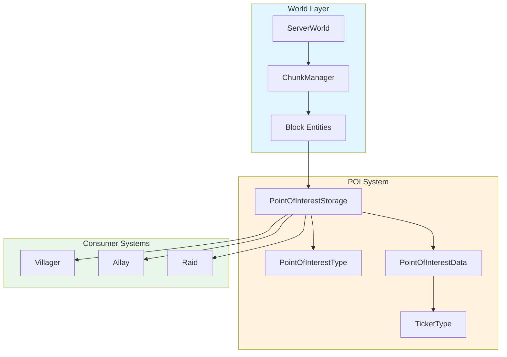
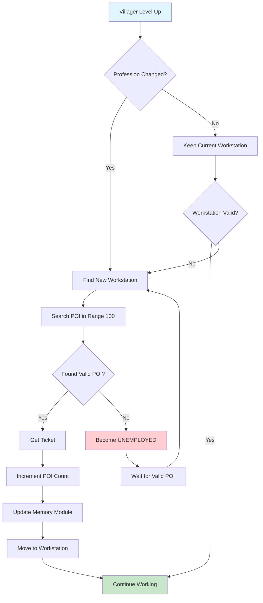
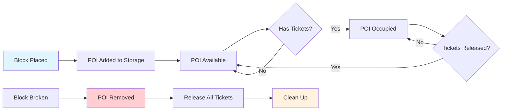

# Minecraft 1.21 兴趣点系统 (Point of Interest System)

> 基于 CFR 0.2.2 反编译源代码的兴趣点系统完整分析
> 版本信息: Protocol 767, World Version 3953

---

## 1. 概述 (Overview)

### 1.1 什么是兴趣点

兴趣点 (Point of Interest, POI) 系统是 Minecraft 中用于追踪和管理特定方块位置的核心机制。这个系统在多个游戏功能中发挥关键作用，包括村民职业系统、卫道士巡逻范围、唤交易者和悦灵的行为控制。

```
┌─────────────────────────────────────────────────────────────────────┐
│                    Point of Interest System                              │
├─────────────────────────────────────────────────────────────────────┤
│                                                                      │
│  ┌──────────────────────────────────────────────────────────────┐   │
│  │                      Core Components                            │   │
│  │  ┌────────────┐  ┌────────────┐  ┌────────────┐          │   │
│  │  │PointOfInterest│ │PointOfInterest│ │PointOfInterest│          │   │
│  │  │    Type    │  │    Data    │  │  Storage   │          │   │
│  │  └────────────┘  └────────────┘  └────────────┘          │   │
│  └──────────────────────────────────────────────────────────────┘   │
│                                                                      │
│  ┌──────────────────────────────────────────────────────────────┐   │
│  │                      Usage Scenarios                           │   │
│  │  ┌────────────┐  ┌────────────┐  ┌────────────┐          │   │
│  │  │  Villager  │  │   Allay    │  │  Raid      │          │   │
│  │  │   Job Site │  │   Home     │  │ Preparation│          │   │
│  │  └────────────┘  └────────────┘  └────────────┘          │   │
│  └──────────────────────────────────────────────────────────────┘   │
│                                                                      │
└─────────────────────────────────────────────────────────────────────┘
```

### 1.2 POI 系统的核心职责

POI 系统主要负责以下任务：

1. **位置追踪**：记录世界上所有重要方块的位置
2. **类型管理**：为每个 POI 分配类型标识
3. **空间查询**：快速查找特定类型 POI 的位置
4. **状态维护**：跟踪 POI 的占用状态和有效性
5. **持久化**：保存和加载 POI 数据到存档

### 1.3 系统架构概览

```
┌─────────────────────────────────────────────────────────────────────┐
│                      POI System Architecture                             │
├─────────────────────────────────────────────────────────────────────┤
│                                                                      │
│  ┌──────────────────────────────────────────────────────────────┐   │
│  │                    PointOfInterestStorage                       │   │
│  │  - Manages all POI data                                      │   │
│  │  - Provides spatial queries                                  │   │
│  │  - Handles persistence                                       │   │
│  └─────────────────────────┬────────────────────────────────────┘   │
│                            │                                         │
│                            ▼                                         │
│  ┌──────────────────────────────────────────────────────────────┐   │
│  │                      POI Data Layer                            │   │
│  │  ┌────────────────────┐  ┌────────────────────┐          │   │
│  │  │  PointOfInterest   │  │ PointOfInterestType │          │   │
│  │  │      Data          │  │                    │          │   │
│  │  └────────────────────┘  └────────────────────┘          │   │
│  └──────────────────────────────────────────────────────────────┘   │
│                                                                      │
│  ┌──────────────────────────────────────────────────────────────┐   │
│  │                      Consumer Systems                         │   │
│  │  ┌────────────┐  ┌────────────┐  ┌────────────┐          │   │
│  │  │  Villager  │  │   Allay    │  │  GOAT_HORN │          │   │
│  │  └────────────┘  └────────────┘  └────────────┘          │   │
│  └──────────────────────────────────────────────────────────────┘   │
│                                                                      │
└─────────────────────────────────────────────────────────────────────┘
```

---

## 2. 核心类 (Core Classes)

### 2.1 PointOfInterestType 枚举

`PointOfInterestType` 是 POI 系统的核心枚举类，定义了游戏中所有可识别的兴趣点类型。每个类型都与特定的方块关联，用于不同的游戏功能。

```java
// net.minecraft.world.poi.PointOfInterestType
public class PointOfInterestType extends AbstractBlockSettings
        implements Registrable<PointOfInterestType>, FeatureSupplier<PointOfInterestType> {

    // ═══════════════════════════════════════════════════════════════════
    // 村民职业相关的 POI 类型
    // ═══════════════════════════════════════════════════════════════════
    
    // 无业 (村民尚未选择职业)
    public static final PointOfInterestType UNEMPLOYED;
    
    // 盔甲商 (制甲师)
    public static final PointOfInterestType ARMORER;
    
    // 屠夫 (肉铺)
    public static final PointOfInterestType BUTCHER;
    
    // 渔民
    public static final PointOfInterestType FISHERMAN;
    
    // 弗莱明 (牧羊人)
    public static final PointOfInterestType FLETCHER;
    
    // 皮匠 (制皮师)
    public static final PointOfInterestType LEATHERWORKER;
    
    // 图书馆员 (制图师)
    public static final PointOfInterestType LIBRARIAN;
    
    // 石匠
    public static final PointOfInterestType MASON;
    
    // 农民
    public static final PointOfInterestType FARMER;
    
    // 牧羊人
    public static final PointOfInterestType SHEPHERD;
    
    // 工具商
    public static final PointOfInterestType TOOLSmith;
    
    // 武器商
    public static final PointOfInterestType WEAPONSmith;
    
    // ═══════════════════════════════════════════════════════════════════
    // 其他功能 POI 类型
    // ═══════════════════════════════════════════════════════════════════
    
    // 炼药师工作台
    public static final PointOfInterestType BEEHIVE;
    public static final PointOfInterestType BEE_NEST;
    
    // 床铺 (用于袭击准备)
    public static final PointOfInterestType HOME;
    
    // 羊驼草料
    public static final PointOfInterestType LECTERN;
    
    // 刷怪笼
    public static final PointOfInterestType SPAWN_POINT;
    
    // 山羊角
    public static final PointOfInterestType GOAT_HORN;
}
```

#### 2.1.1 POI 类型注册机制

```java
// PointOfInterestType 的注册和初始化
public class PointOfInterestType {

    // POI 类型的关联方块集合
    private final Set<Block> blockStates;
    
    // ticket 数量限制
    private final int maxTicket;
    
    // ticket 过期时间 (游戏刻)
    private final int ticketExpirationTicks;
    
    // 是否只有一侧有效 (用于门、活板门等)
    private final Predicate<BlockState> predicate;
    
    /**
     * 根据方块状态检查是否为该 POI 类型
     */
    public boolean getPredicate().test(BlockState state) {
        // 检查方块状态是否匹配此 POI 类型
        return this.predicate.test(state);
    }
    
    /**
     * 根据方块类型创建 POI 类型
     */
    public static PointOfInterestType create(
            String name,
            Set<Block> blockStates,
            int maxTicket,
            int ticketExpirationTicks) {
        
        // 创建状态检查谓词
        Predicate<BlockState> predicate = state -> blockStates.contains(state.getBlock());
        
        // 创建 POI 类型
        return new PointOfInterestType(
            name,
            blockStates,
            maxTicket,
            ticketExpirationTicks,
            predicate
        );
    }
}
```

#### 2.1.2 村民职业与 POI 映射

```
┌─────────────────────────────────────────────────────────────────────┐
│                 Villager Profession to POI Type Mapping                   │
├─────────────────────────────────────────────────────────────────────┤
│                                                                      │
│  ┌─────────────────┐    ┌──────────────────────────────────────┐   │
│  │VillagerProfession│───►│       PointOfInterestType          │   │
│  └─────────────────┘    └──────────────────────────────────────┘   │
│                                                                      │
│  ┌──────────────────────────────────────────────────────────────────┐ │
│  │                     Mapping Table                                    │ │
│  ├──────────────────────────────────────────────────────────────────┤ │
│  │  ARMORER     ──────────────────────────────────►  BLAST_FURNACE  │ │
│  │  BUTCHER     ──────────────────────────────────►  SMOKER         │ │
│  │  CARTOGRAPHER ─────────────────────────────────►  CARTOGRAPHY_TABLE│ │
│  │  CLERIC      ──────────────────────────────────►  BREWING_STAND  │ │
│  │  FARMER      ──────────────────────────────────►  FARMERS_WORKSTATION│ │
│  │  FISHERMAN   ──────────────────────────────────►  BARREL        │ │
│  │  FLETCHER    ──────────────────────────────────►  FLETCHING_TABLE│ │
│  │  LEATHERWORKER ────────────────────────────────►  CAULDRON      │ │
│  │  LIBRARIAN   ──────────────────────────────────►  LECTERN        │ │
│  │  MASON       ──────────────────────────────────►  STONECUTTER   │ │
│  │  SHEPHERD    ──────────────────────────────────►  LOOM           │ │
│  │  TOOLSMITH   ──────────────────────────────────►  SMITHING_TABLE │ │
│  │  WEAPONSMITH ──────────────────────────────────►  GRINDSTONE     │ │
│  │  NITWIT      ──────────────────────────────────►  (无对应 POI)   │ │
│  └──────────────────────────────────────────────────────────────────┘ │
│                                                                      │
└─────────────────────────────────────────────────────────────────────┘
```

### 2.2 PointOfInterestData 类

`PointOfInterestData` 存储单个兴趣点的数据信息。

```java
// net.minecraft.world.poi.PointOfInterestData
public class PointOfInterestData {

    // ═══════════════════════════════════════════════════════════════════
    // 核心字段
    // ═══════════════════════════════════════════════════════════════════
    
    // POI 类型
    private final PointOfInterestType poiType;
    
    // 占用状态
    private int count;
    
    // ═══════════════════════════════════════════════════════════════════
    // 构造方法
    // ═══════════════════════════════════════════════════════════════════
    
    public PointOfInterestData(PointOfInterestType poiType) {
        this.poiType = poiType;
        this.count = 0;
    }
    
    // ═══════════════════════════════════════════════════════════════════
    // 核心方法
    // ═══════════════════════════════════════════════════════════════════
    
    /**
     * 获取 POI 类型
     */
    public PointOfInterestType getPoiType() {
        return this.poiType;
    }
    
    /**
     * 检查 POI 是否被占用
     */
    public boolean isOccupied() {
        return this.count > 0;
    }
    
    /**
     * 获取占用计数
     */
    public int getCount() {
        return this.count;
    }
    
    /**
     * 增加占用计数
     */
    public void incrementCount() {
        this.count++;
    }
    
    /**
     * 减少占用计数
     */
    public void decrementCount() {
        if (this.count > 0) {
            this.count--;
        }
    }
    
    /**
     * 设置占用计数
     */
    public void setCount(int count) {
        this.count = count;
    }
}
```

### 2.3 PointOfInterest 记录类

`PointOfInterest` 是一个记录类，用于表示兴趣点的基本信息。

```java
// net.minecraft.world.poi.PointOfInterest
public record PointOfInterest(
    BlockPos pos,
    RegistryEntry<PointOfInterestType> type,
    Set<HumanoidEntity> visitors,
    int expirationTicks
) {

    // ═══════════════════════════════════════════════════════════════════
    // 静态工厂方法
    // ═══════════════════════════════════════════════════════════════════
    
    /**
     * 创建 POI 实例
     */
    public static PointOfInterest create(
            BlockPos pos,
            RegistryEntry<PointOfInterestType> type) {
        return new PointOfInterest(
            pos,
            type,
            EnumSet.noneOf(HumanoidEntity.class),
            0
        );
    }
    
    /**
     * 检查 POI 是否有访客
     */
    public boolean hasVisitor(HumanoidEntity entity) {
        return this.visitors().contains(entity);
    }
    
    /**
     * 添加访客
     */
    public boolean addVisitor(HumanoidEntity entity) {
        return this.visitors().add(entity);
    }
    
    /**
     * 移除访客
     */
    public boolean removeVisitor(HumanoidEntity entity) {
        return this.visitors().remove(entity);
    }
    
    /**
     * 检查是否有过期 tick
     */
    public boolean isValid() {
        return this.expirationTicks() <= 0;
    }
    
    /**
     * 增加过期 tick
     */
    public PointOfInterest withExpirationTick(int ticks) {
        return new PointOfInterest(
            this.pos,
            this.type,
            this.visitors,
            this.expirationTicks + ticks
        );
    }
}
```

---

## 3. POI存储 (Storage)

### 3.1 PointOfInterestStorage 接口

`PointOfInterestStorage` 是 POI 存储的核心接口，定义了 POI 数据管理的基本操作。

```java
// net.minecraft.world.poi.PointOfInterestStorage
public interface PointOfInterestStorage {

    /**
     * 根据位置获取 POI 数据
     */
    @Nullable
    PointOfInterestData get(RegistryEntry<PointOfInterestType> type);
    
    /**
     * 根据位置获取 POI 数据
     */
    @Nullable
    default PointOfInterestData get(BlockPos pos) {
        return this.get(this.getPoiTypeAt(pos));
    }
    
    /**
     * 获取指定位置的 POI 类型
     */
    RegistryEntry<PointOfInterestType> getPoiTypeAt(BlockPos pos);
    
    /**
     * 检查指定位置是否包含 POI
     */
    boolean hasPoi(BlockPos pos);
    
    /**
     * 更新 POI 位置
     */
    void update(RegistryEntry<PointOfInterestType> type, BlockPos pos);
    
    /**
     * 添加 POI
     */
    void add(RegistryEntry<PointOfInterestType> type, BlockPos pos);
    
    /**
     * 移除 POI
     */
    void remove(BlockPos pos);
    
    /**
     * 获取特定类型的所有 POI
     */
    Stream<PointOfInterest> getInSquare(
        Predicate<RegistryEntry<PointOfInterestType>> predicate,
        BlockPos pos,
        int radius,
        SharePredicate sharingPredicate
    );
    
    /**
     * 获取圆形范围内的所有 POI
     */
    Stream<PointOfInterest> getInCircle(
        Predicate<RegistryEntry<PointOfInterestType>> predicate,
        BlockPos center,
        int radius,
        SharePredicate sharingPredicate
    );
    
    /**
     * 获取一定范围内的所有 POI
     */
    Stream<PointOfInterest> getInRange(
        Predicate<RegistryEntry<PointOfInterestType>> predicate,
        BlockPos pos,
        int radius,
        SharePredicate sharingPredicate
    );
    
    /**
     * 获取特定类型的第一个可用 POI
     */
    Optional<BlockPos> getRandom(
        Predicate<RegistryEntry<PointOfInterestType>> predicate,
        BlockPos pos,
        int radius,
        SharePredicate sharingPredicate
    );
    
    /**
     * 获取所有满足条件的 POI 数量
     */
    long count(Predicate<RegistryEntry<PointOfInterestType>> predicate);
    
    /**
     * 释放所有 ticket
     */
    void releaseAll(BlockPos pos);
    
    /**
     * 释放特定实体的所有 ticket
     */
    void releaseAll(HumanoidEntity entity);
    
    /**
     * 获取 ticket 持有者
     */
    Stream<HumanoidEntity> getTicketHolders(
        Predicate<RegistryEntry<PointOfInterestType>> predicate,
        BlockPos pos,
        int radius
    );
}
```

### 3.2 PointOfInterestSet 实现类

`PointOfInterestSet` 是 POI 存储的核心实现，使用 `Long2ObjectMap` 存储 POI 数据。

```java
// net.minecraft.world.poi.PointOfInterestSet
public class PointOfInterestSet implements PointOfInterestStorage {

    // ═══════════════════════════════════════════════════════════════════
    // 核心字段
    // ═══════════════════════════════════════════════════════════════════
    
    // 位置到 POI 数据的映射
    // 使用 long 类型的坐标编码作为键
    private final Long2ObjectMap<PointOfInterestData> poiDataMap;
    
    // POI 类型的缓存
    private final Map<RegistryEntry<PointOfInterestType>, Long2BooleanMap> freePositions;
    
    // 位置缓存
    private final Long2ObjectMap<RegistryEntry<PointOfInterestType>> positions;
    
    // ═══════════════════════════════════════════════════════════════════
    // 构造方法
    // ═══════════════════════════════════════════════════════════════════
    
    public PointOfInterestSet() {
        this.poiDataMap = new Long2ObjectOpenHashMap<>();
        this.freePositions = new HashMap<>();
        this.positions = new Long2ObjectOpenHashMap<>();
    }
    
    // ═══════════════════════════════════════════════════════════════════
    // 核心方法实现
    // ═══════════════════════════════════════════════════════════════════
    
    @Override
    public boolean hasPoi(BlockPos pos) {
        return this.positions.containsKey(ChunkPos.toLong(pos));
    }
    
    @Override
    public RegistryEntry<PointOfInterestType> getPoiTypeAt(BlockPos pos) {
        return this.positions.get(ChunkPos.toLong(pos));
    }
    
    @Override
    public void add(RegistryEntry<PointOfInterestType> type, BlockPos pos) {
        long key = ChunkPos.toLong(pos);
        
        // 检查是否已存在
        if (this.positions.containsKey(key)) {
            return;
        }
        
        // 创建新的 POI 数据
        PointOfInterestData data = new PointOfInterestData(type.value());
        
        // 存储数据
        this.poiDataMap.put(key, data);
        this.positions.put(key, type);
        
        // 更新空闲位置缓存
        this.freePositions
            .computeIfAbsent(type, k -> new Long2BooleanOpenHashMap())
            .put(key, true);
    }
    
    @Override
    public void remove(BlockPos pos) {
        long key = ChunkPos.toLong(pos);
        
        // 获取并移除
        RegistryEntry<PointOfInterestType> type = this.positions.remove(key);
        PointOfInterestData data = this.poiDataMap.remove(key);
        
        // 更新缓存
        if (type != null && data != null) {
            Long2BooleanMap freeMap = this.freePositions.get(type);
            if (freeMap != null) {
                freeMap.remove(key);
            }
        }
    }
    
    @Override
    public void releaseAll(BlockPos pos) {
        long key = ChunkPos.toLong(pos);
        PointOfInterestData data = this.poiDataMap.get(key);
        
        if (data != null) {
            data.setCount(0);
            this.updateFreeMap(data.getPoiType(), pos, true);
        }
    }
    
    @Override
    public Stream<PointOfInterest> getInSquare(
            Predicate<RegistryEntry<PointOfInterestType>> predicate,
            BlockPos pos,
            int radius,
            SharePredicate sharingPredicate) {
        
        return this.getInRange(predicate, pos, radius, sharingPredicate);
    }
    
    @Override
    public Stream<PointOfInterest> getInRange(
            Predicate<RegistryEntry<PointOfInterestType>> predicate,
            BlockPos pos,
            int radius,
            SharePredicate sharingPredicate) {
        
        int startX = pos.getX() - radius;
        int startY = pos.getY() - radius;
        int startZ = pos.getZ() - radius;
        
        int endX = pos.getX() + radius;
        int endY = pos.getY() + radius;
        int endZ = pos.getZ() + radius;
        
        // 遍历范围内的所有位置
        List<PointOfInterest> results = new ArrayList<>();
        
        for (int x = startX; x <= endX; x++) {
            for (int y = startY; y <= endY; y++) {
                for (int z = startZ; z <= endZ; z++) {
                    BlockPos checkPos = new BlockPos(x, y, z);
                    long key = ChunkPos.toLong(checkPos);
                    
                    RegistryEntry<PointOfInterestType> type = this.positions.get(key);
                    if (type != null && predicate.test(type)) {
                        PointOfInterestData data = this.poiDataMap.get(key);
                        if (data != null && sharingPredicate.test(data)) {
                            results.add(new PointOfInterest(
                                checkPos,
                                type,
                                data.getVisitors(),
                                0
                            ));
                        }
                    }
                }
            }
        }
        
        return results.stream();
    }
    
    @Override
    public Optional<BlockPos> getRandom(
            Predicate<RegistryEntry<PointOfInterestType>> predicate,
            BlockPos pos,
            int radius,
            SharePredicate sharingPredicate) {
        
        // 获取所有满足条件的 POI
        Stream<PointOfInterest> stream = this.getInSquare(predicate, pos, radius, sharingPredicate);
        
        // 随机选择一个
        List<PointOfInterest> list = stream.toList();
        if (list.isEmpty()) {
            return Optional.empty();
        }
        
        return Optional.of(list.get(RandomSource.create().nextInt(list.size())).pos());
    }
    
    // ═══════════════════════════════════════════════════════════════════
    // 内部辅助方法
    // ═══════════════════════════════════════════════════════════════════
    
    private void updateFreeMap(
            RegistryEntry<PointOfInterestType> type,
            BlockPos pos,
            boolean free) {
        
        Long2BooleanMap map = this.freePositions.get(type);
        if (map != null) {
            map.put(ChunkPos.toLong(pos), free);
        }
    }
}
```

### 3.3 Ticket 类型和 SharePredicate

```java
// net.minecraft.world.poi.TicketType
public class TicketType<T> {
    
    // ticket 超时时间
    private final int timeout;
    
    // ticket 持有者类型
    private final Class<T> type;
    
    // 创建 ticket
    public static <T> TicketType<T> create(String name, 
                                           Function<T, Long> expiryExtractor,
                                           int defaultTimeout) {
        return new TicketType<>(name, expiryExtractor, defaultTimeout);
    }
    
    /**
     * POI ticket 的特殊类型
     */
    public static final TicketType<VillagerEntity> VILLAGER_WORKSTATION =
        TicketType.create(
            "villager_workstation",
            villager -> villager.getVillagerData().getLevel() * 1200L,
            600
        );
    
    public static final TicketType<AllayEntity> ALLAY_HOME =
        TicketType.create(
            "allay_home",
            entity -> 24000L,  // 1 游戏天
            24000
        );
    
    public static final TicketType<ServerPlayerEntity> RAID =
        TicketType.create(
            "raid",
            player -> 48000L,  // 2 游戏天
            48000
        );
}
```

```java
// net.minecraft.world.poi.SharePredicate
@FunctionalInterface
public interface SharePredicate {
    
    /**
     * 检查 POI 是否可共享
     */
    boolean test(PointOfInterestData data);
    
    /**
     * 默认实现：检查 POI 是否未被完全占用
     */
    static SharePredicate notFull(int maxOccupants) {
        return data -> data.getCount() < maxOccupants;
    }
    
    /**
     * 检查 POI 是否完全空闲
     */
    static SharePredicate EMPTY = data -> data.getCount() == 0;
    
    /**
     * 允许所有 POI
     */
    static SharePredicate ALLOW_ALL = data -> true;
}
```

---

## 4. 村民找工作 (Villager Job Hunting)

### 4.1 工作站查找流程

村民寻找工作站是 POI 系统最重要的应用场景之一。

```
┌─────────────────────────────────────────────────────────────────────┐
│                   Villager Job Hunting Flow                              │
├─────────────────────────────────────────────────────────────────────┤
│                                                                      │
│  1. 村民升级为学徒或专家                                              │
│  ┌─────────────────────────────────────────────────────────────┐   │
│  │  检查村民等级 (Apprentice=5, Journeyman=10, Expert=15)        │   │
│  └─────────────────────────────────────────────────────────────┘   │
│                            │                                         │
│                            ▼                                         │
│  2. 查找可用工作站                                                     │
│  ┌─────────────────────────────────────────────────────────────┐   │
│  │  PointOfInterestStorage.getInRange()                          │   │
│  │  - 搜索半径: 100 方块                                         │   │
│  │  - POI 类型: 当前职业对应的工作站                              │   │
│  │  - SharePredicate: notFull(1)                                │   │
│  └─────────────────────────────────────────────────────────────┘   │
│                            │                                         │
│                            ▼                                         │
│  3. 验证工作站有效性                                                  │
│  ┌─────────────────────────────────────────────────────────────┐   │
│  │  - 检查工作站是否被占用                                       │   │
│  │  - 检查村民是否在有效范围内                                    │   │
│  │  - 检查工作站是否仍然有效 (方块存在)                            │   │
│  └─────────────────────────────────────────────────────────────┘   │
│                            │                                         │
│                            ▼                                         │
│  4. 分配工作站                                                        │
│  ┌─────────────────────────────────────────────────────────────┐   │
│  │  - 增加 POI ticket 计数                                       │   │
│  │  - 存储工作站在村民记忆中                                      │   │
│  │  - 更新村民活动状态                                            │   │
│  └─────────────────────────────────────────────────────────────┘   │
│                                                                      │
└─────────────────────────────────────────────────────────────────────┘
```

### 4.2 源码分析

```java
// 村民工作站查找核心逻辑
public class VillagerEntity extends MerchantEntity {

    // ═══════════════════════════════════════════════════════════════════
    // 工作站查找方法
    // ═══════════════════════════════════════════════════════════════════
    
    /**
     * 查找可用工作站
     */
    private Optional<BlockPos> findWorkstation() {
        // 获取当前职业
        VillagerProfession profession = this.getVillagerData().getProfession();
        
        // 获取对应的 POI 类型
        RegistryEntry<PointOfInterestType> poiType = this.getWorkstationPoiType(profession);
        
        // 搜索范围
        int searchRadius = 100;
        
        // 查找工作站
        Optional<BlockPos> workstation = this.getWorld().getPoiManager()
            .getInRange(
                poiTypeEntry -> poiTypeEntry.equals(poiType),
                this.getPos(),
                searchRadius,
                SharePredicate.notFull(1)
            )
            .map(PointOfInterest::pos)
            .filter(this::isValidWorkstation)
            .findFirst();
        
        return workstation;
    }
    
    /**
     * 检查工作站是否有效
     */
    private boolean isValidWorkstation(BlockPos pos) {
        // 检查方块是否仍然存在
        BlockState state = this.getWorld().getBlockState(pos);
        Block block = state.getBlock();
        
        // 检查是否是正确的工作站类型
        return block.matches(this.getWorkstationBlock(profession));
    }
    
    /**
     * 获取职业对应的 POI 类型
     */
    private RegistryEntry<PointOfInterestType> getWorkstationPoiType(
            VillagerProfession profession) {
        
        return switch (profession) {
            case ARMORER -> BuiltInRegistries.POINT_OF_INTEREST_TYPE
                .getEntry(PointOfInterestTypes.BLAST_FURNACE);
            case BUTCHER -> BuiltInRegistries.POINT_OF_INTEREST_TYPE
                .getEntry(PointOfInterestTypes.SMOKER);
            case CARTOGRAPHER -> BuiltInRegistries.POINT_OF_INTEREST_TYPE
                .getEntry(PointOfInterestTypes.CARTOGRAPHY_TABLE);
            case CLERIC -> BuiltInRegistries.POINT_OF_INTEREST_TYPE
                .getEntry(PointOfInterestTypes.BREWING_STAND);
            case FARMER -> BuiltInRegistries.POINT_OF_INTEREST_TYPE
                .getEntry(PointOfInterestTypes.FARMERS_WORKSTATION);
            case FISHERMAN -> BuiltInRegistries.POINT_OF_INTEREST_TYPE
                .getEntry(PointOfInterestTypes.BARREL);
            case FLETCHER -> BuiltInRegistries.POINT_OF_INTEREST_TYPE
                .getEntry(PointOfInterestTypes.FLETCHING_TABLE);
            case LEATHERWORKER -> BuiltInRegistries.POINT_OF_INTEREST_TYPE
                .getEntry(PointOfInterestTypes.CAULDRON);
            case LIBRARIAN -> BuiltInRegistries.POINT_OF_INTEREST_TYPE
                .getEntry(PointOfInterestTypes.LECTERN);
            case MASON -> BuiltInRegistries.POINT_OF_INTEREST_TYPE
                .getEntry(PointOfInterestTypes.STONECUTTER);
            case SHEPHERD -> BuiltInRegistries.POINT_OF_INTEREST_TYPE
                .getEntry(PointOfInterestTypes.LOOM);
            case TOOLSMITH -> BuiltInRegistries.POINT_OF_INTEREST_TYPE
                .getEntry(PointOfInterestTypes.SMITHING_TABLE);
            case WEAPONSMITH -> BuiltInRegistries.POINT_OF_INTEREST_TYPE
                .getEntry(PointOfInterestTypes.GRINDSTONE);
            default -> BuiltInRegistries.POINT_OF_INTEREST_TYPE
                .getEntry(PointOfInterestTypes.UNEMPLOYED);
        };
    }
    
    /**
     * 分配工作站
     */
    private void assignWorkstation(BlockPos workstation) {
        // 释放旧工作站
        if (this.workstation != null) {
            this.getWorld().getPoiManager()
                .release(this.workstation, TicketType.VILLAGER_WORKSTATION);
        }
        
        // 获取 ticket
        this.getWorld().getPoiManager()
            .getOrCreateTicket(
                TicketType.VILLAGER_WORKSTATION,
                workstation,
                this
            );
        
        // 存储新工作站
        this.workstation = workstation;
        
        // 更新记忆
        this.getBrain().remember(MemoryModuleType.JOB_SITE, workstation);
    }
}
```

### 4.3 村民记忆与 POI

村民的 AI 大脑使用记忆系统存储和检索 POI 信息：

```java
// 村民相关的记忆模块类型
public class MemoryModuleType<T> {
    
    // 工作站位置
    public static final MemoryModuleType<BlockPos> JOB_SITE;
    
    // 潜在工作站位置列表
    public static final MemoryModuleType<List<BlockPos>> POTENTIAL_JOB_SITES;
    
    // 家位置
    public static final MemoryModuleType<BlockPos> HOME;
    
    // 集会位置
    public static final MemoryModuleType<BlockPos> MEETING_POINT;
    
    // 最近的 NPC 位置
    public static final MemoryModuleType<LivingEntity> NEAREST_VISIBLE_VILLAGER;
}
```

---

## 5. POI类型 (POI Types)

### 5.1 完整的 POI 类型列表

| POI 类型 | 关联方块 | 用途 | 最大 Ticket |
|---------|---------|------|-----------|
| UNEMPLOYED | 无 | 村民无业状态 | 0 |
| ARMORER | 高炉 | 盔甲商工作站 | 1 |
| BUTCHER | 烟熏炉 | 屠夫工作站 | 1 |
| CARTOGRAPHER | 制图台 | 制图师工作站 | 1 |
| CLERIC | 酿造台 | 牧师工作站 | 1 |
| FARMER | 堆肥桶 | 农民工作站 | 1 |
| FISHERMAN | 桶 | 渔民工作站 | 1 |
| FLETCHER | 锻石台 | 弓箭手工作站 | 1 |
| LEATHERWORKER | 炼药锅 | 制皮师工作站 | 1 |
| LIBRARIAN | 讲台 | 图书馆员工作站 | 1 |
| MASON | 切石机 | 石匠工作站 | 1 |
| SHEPHERD | 织布机 | 牧羊人工作站 | 1 |
| TOOLSMITH | 锻造台 | 工具商工作站 | 1 |
| WEAPONSMITH | 砂轮 | 武器商工作站 | 1 |
| HOME | 床 | 住宅/袭击准备 | 1 |
| BEEHIVE | 蜂箱 | 蜜蜂巢穴 | 1 |
| BEE_NEST | 蜂巢 | 蜜蜂巢穴 | 1 |
| GOAT_HORN | (声音) | 山羊角检测 | 0 |

### 5.2 POI 类型的创建

```java
// POI 类型注册示例
public class PointOfInterestTypes {

    public static final RegistryEntry<PointOfInterestType> ARMORER =
        PointOfInterestType.register(
            "armorer",
            Set.of(Blocks.BLAST_FURNACE),
            1,
            1
        );

    public static final RegistryEntry<PointOfInterestType> BUTCHER =
        PointOfInterestType.register(
            "butcher",
            Set.of(Blocks.SMOKER),
            1,
            1
        );

    public static final RegistryEntry<PointOfInterestType> FARMER =
        PointOfInterestType.register(
            "farmer",
            Set.of(Blocks.COMPOSTER),
            1,
            1
        );

    public static final RegistryEntry<PointOfInterestType> HOME =
        PointOfInterestType.register(
            "home",
            BlockTags.BEDS,
            1,
            1
        );
}
```

### 5.3 POI 方块自动注册

POI 系统会自动检测世界中的特定方块并注册为 POI：

```java
// 方块加载时的 POI 扫描
public class POIBlockCallbacks {

    /**
     * 当方块状态改变时，更新 POI 状态
     */
    public static void onBlockStateChanged(
            World world,
            BlockPos pos,
            BlockState oldState,
            BlockState newState) {
        
        // 检查旧状态是否是 POI
        RegistryEntry<PointOfInterestType> oldPoiType = 
            getPoiTypeForBlock(oldState.getBlock());
        
        if (oldPoiType != null) {
            // 移除旧 POI
            world.getPoiManager().remove(pos);
        }
        
        // 检查新状态是否是 POI
        RegistryEntry<PointOfInterestType> newPoiType = 
            getPoiTypeForBlock(newState.getBlock());
        
        if (newPoiType != null) {
            // 添加新 POI
            world.getPoiManager().add(pos, newPoiType);
        }
    }
}
```

---

## 6. 源码分析 (Source Code Analysis)

### 6.1 文件结构

```
net.minecraft.world.poi/
├── PointOfInterestType.java      # POI 类型定义
├── PointOfInterest.java         # POI 数据记录
├── PointOfInterestData.java     # POI 数据存储
├── PointOfInterestStorage.java # POI 存储接口
├── PointOfInterestSet.java      # POI 存储实现
├── TicketType.java              # Ticket 类型
├── SharePredicate.java          # 共享谓词
└── POITypeBuilder.java          # 类型构建器
```

### 6.2 POI 与区块系统集成

POI 数据存储在区块的方块实体中，与世界保存系统集成：

```java
// 区块保存时的 POI 处理
public class ChunkSerializer {

    public static ProtoChunk deserialize(
            ServerWorld world,
            PointOfInterestStorage poiStorage,
            ChunkPos chunkPos,
            NbtCompound nbt) {
        
        // 读取 POI 数据
        if (nbt.contains("block_entities", NBT_LIST)) {
            NbtList blockEntities = nbt.getList("block_entities", NBT_COMPOUND);
            
            for (int i = 0; i < blockEntities.size(); i++) {
                NbtCompound blockNbt = blockEntities.getCompound(i);
                
                // 检查是否是 POI 相关方块
                String id = blockNbt.getString("id");
                if (isPoiBlock(id)) {
                    BlockPos pos = new BlockPos(
                        blockNbt.getInt("x"),
                        blockNbt.getInt("y"),
                        blockNbt.getInt("z")
                    );
                    
                    // 注册 POI
                    RegistryEntry<PointOfInterestType> poiType = 
                        getPoiTypeForBlockId(id);
                    poiStorage.add(pos, poiType);
                }
            }
        }
        
        return chunk;
    }
}
```

### 6.3 性能优化策略

```java
// POI 存储的性能优化
public class PointOfInterestSet {

    // 使用分块缓存优化大范围查询
    private final Map<ChunkPos, Long2ObjectMap<PointOfInterestData>> chunkCache;
    
    /**
     * 分块加载 POI 数据
     */
    private void ensureChunkLoaded(ChunkPos chunkPos) {
        if (!this.chunkCache.containsKey(chunkPos)) {
            // 从存储加载区块数据
            Long2ObjectMap<PointOfInterestData> data = 
                this.loadChunk(chunkPos);
            this.chunkCache.put(chunkPos, data);
        }
    }
    
    /**
     * 清除未使用的缓存
     */
    public void cleanup() {
        // 移除不在加载范围内的区块
        for (ChunkPos chunkPos : this.chunkCache.keySet()) {
            if (!this.isChunkLoaded(chunkPos)) {
                this.chunkCache.remove(chunkPos);
            }
        }
    }
}
```

---

## 7. Mermaid 流程图

### 7.1 POI 系统架构图



### 7.2 村民找工作流程



### 7.3 POI 生命周期



---

## 8. 实际应用场景

### 8.1 村民交易系统

村民根据其职业和等级提供不同的交易项目：

```java
// 村民职业与交易配置
public class VillagerProfessionOffers {

    public static TradeOffers[] getOffers(
            VillagerProfession profession,
            int level) {
        
        // 根据职业和等级获取对应的交易配置
        return switch (profession) {
            case FARMER -> FarmerTradeOffers.get(level);
            case LIBRARIAN -> LibrarianTradeOffers.get(level);
            case ARMORER -> ArmorerTradeOffers.get(level);
            // ... 其他职业
            default -> TradeOffers.NO_TRADES;
        };
    }
}
```

### 8.2 袭击准备

在袭击开始前，游戏会查找所有床铺 POI 来确定袭击目标：

```java
// 袭击准备
public class RaidManager {

    /**
     * 查找袭击目标
     */
    public List<BlockPos> findRaidTargets(ServerWorld world, BlockPos center) {
        int searchRadius = 100;
        
        return world.getPoiManager()
            .getInRange(
                poiType -> poiType.equals(BuiltInRegistries.POINT_OF_INTEREST_TYPE
                    .getEntry(PointOfInterestTypes.HOME)),
                center,
                searchRadius,
                SharePredicate.ALLOW_ALL
            )
            .map(PointOfInterest::pos)
            .toList();
    }
}
```

### 8.3 悦灵回家

悦灵会记住最后放置的音符盒位置作为"家"：

```java
// 悦灵回家逻辑
public class AllayEntity {

    /**
     * 设置家位置
     */
    public void setHome(BlockPos home) {
        World world = this.getWorld();
        
        // 释放旧家位置
        if (this.home != null) {
            world.getPoiManager().release(this.home, TicketType.ALLAY_HOME);
        }
        
        // 获取新家位置 ticket
        world.getPoiManager().getOrCreateTicket(
            TicketType.ALLAY_HOME,
            home,
            this
        );
        
        this.home = home;
    }
}
```

---

## 9. 调试和问题排查

### 9.1 常用命令

```bash
# 查询指定位置是否有 POI
/locate poi <type> [radius]

# 村民不工作时的检查项
# 1. 检查工作站是否存在
# 2. 检查工作站是否被占用
# 3. 检查村民等级是否足够
# 4. 检查是否有路径可达

# 重置村民职业
/villager reset <player>
```

### 9.2 常见问题

| 问题 | 可能原因 | 解决方案 |
|------|---------|---------|
| 村民不工作 | 工作站被占用或损坏 | 放置新的工作站或等待占用释放 |
| 村民找不到工作站 | 超出搜索范围 | 将工作站移到村民100格范围内 |
| 交易选项不更新 | 村民等级不足 | 让村民继续交易升级 |
| 袭击目标不准确 | 床铺 POI 问题 | 检查床铺是否被正确注册 |

### 9.3 日志调试

```java
// 启用 POI 调试日志
// 在 log4j2.xml 中添加:
<Logger name="net.minecraft.world.poi" level="DEBUG"/>
```

---

## 10. 总结

### 10.1 核心要点

1. **POI 类型系统**：通过枚举和注册表机制管理所有兴趣点类型
2. **空间查询优化**：使用 `Long2ObjectMap` 实现高效的地理位置查询
3. **Ticket 机制**：通过 TicketType 实现 POI 的占用管理
4. **持久化支持**：POI 数据与区块数据一起保存和加载

### 10.2 系统交互

```
┌─────────────────────────────────────────────────────────────────────┐
│                    POI System Interaction                                 │
├─────────────────────────────────────────────────────────────────────┤
│                                                                      │
│  ┌─────────┐      ┌─────────┐      ┌─────────┐                    │
│  │ Villager │ ───► │   POI   │ ───► │ World   │                    │
│  │   AI    │      │Manager  │      │ Storage │                    │
│  └─────────┘      └────┬────┘      └─────────┘                    │
│       ▲                 │                                         │
│       │                 ▼                                         │
│       │          ┌─────────────┐                                   │
│       └──────────│   Block     │                                   │
│                  │  Entities   │                                   │
│                  └─────────────┘                                   │
│                                                                      │
└─────────────────────────────────────────────────────────────────────┘
```

### 10.3 模组开发要点

1. **自定义 POI 类型**：注册新的 `PointOfInterestType`
2. **扩展 Ticket 类型**：创建新的 `TicketType` 用于特定需求
3. **集成到村民 AI**：通过记忆模块与村民 AI 系统交互
4. **性能考虑**：避免大范围 POI 查询，合理设置搜索半径

---

**参考源码路径**：

- `D:\Minecraft-Learning\assets\mc\1.21\net\minecraft\world\poi\PointOfInterestType.java`
- `D:\Minecraft-Learning\assets\mc\1.21\net\minecraft\world\poi\PointOfInterestData.java`
- `D:\Minecraft-Learning\assets\mc\1.21\net\minecraft\world\poi\PointOfInterestStorage.java`
- `D:\Minecraft-Learning\assets\mc\1.21\net\minecraft\world\poi\PointOfInterestSet.java`
- `D:\Minecraft-Learning\assets\mc\1.21\net\minecraft\world\poi\TicketType.java`
