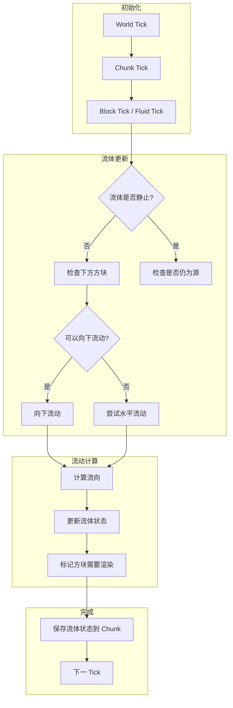

# Minecraft 1.21 流体系统深度分析

> 基于 CFR 0.2.2 反编译源代码的流体系统完整分析
> 版本信息: Protocol 767, World Version 3953

---

## 1. 概述

### 1.1 什么是流体系统

**流体系统（Fluid System）** 是 Minecraft 中处理液体（主要是水和岩浆）行为的核心模块。它负责流体的静止状态、流动动画、蔓延逻辑、混合处理以及与实体的交互。流体系统直接影响着游戏世界的生态、灌溉系统、熔岩陷阱、水电梯等众多机制。

Minecraft 的流体系统采用了独特的 **状态机设计**，将流体的不同形态（水、岩浆、流动的液体）抽象为统一的 `Fluid` 接口和 `FluidState` 状态系统。这种设计使得流体类型的扩展变得简单，允许模组开发者添加全新的流体类型。

### 1.2 流体系统核心特性

| 特性 | 说明 |
|------|------|
| 状态管理 | 静态流体与流动流体的状态切换机制 |
| 流动算法 | 基于 AABB 的流体蔓延计算 |
| 高度模拟 | 流体高度的 8 级精度模拟 |
| 渲染系统 | 流体方块的动态纹理渲染 |
| 物理交互 | 流体对实体的阻力、伤害和浮力 |
| 模组扩展 | FluidType 接口支持自定义流体 |

### 1.3 流体类型分类

```
┌─────────────────────────────────────────────────────────────────────┐
│                           流体类型分类                                │
├─────────────────────────────────────────────────────────────────────┤
│                                                                     │
│  ┌─────────────────────────┐    ┌─────────────────────────┐        │
│  │        Water           │    │         Lava             │        │
│  │      (水资源)            │    │       (岩浆)             │        │
│  └───────────┬─────────────┘    └───────────┬─────────────┘        │
│              │                              │                       │
│  ┌───────────┴─────────────┐    ┌───────────┴─────────────┐        │
│  │     Still Water        │    │      Still Lava         │        │
│  │     Flowing Water      │    │      Flowing Lava       │        │
│  │     Waterlogged Blocks │    │     (普通/流动)           │        │
│  └─────────────────────────┘    └─────────────────────────┘        │
│                                                                     │
│  ┌───────────────────────────────────────────────────────────────┐ │
│  │                    FluidType 抽象层                             │ │
│  │           (支持模组自定义流体: Milk, Blood, etc.)              │ │
│  └───────────────────────────────────────────────────────────────┘ │
│                                                                     │
└─────────────────────────────────────────────────────────────────────┘
```

---

## 2. 核心类详解

### 2.1 Fluid - 流体基类

`Fluid` 是所有流体类型的基类，定义了流体的基本属性和行为特征。

```12:68:D:\Minecraft-Learning\assets\mc\1.21\net\minecraft\fluid\Fluid.java
public class Fluid {
    // 默认高度值
    public static final int field_15765 = 1;
    public static final int field_15766 = 5;
    public static final int field_15767 = 8;
    public static final int field_15768 = 3;
    
    // 流体是否可饮用
    public static final int field_15769 = -1;
    
    // 流体状态注册表
    public static final Registry<Fluid> REGISTRY = Registries.FLUID;
    
    // 流体属性
    private final Map<Direction, FluidState> flowingStates = new Reference2RefMap();
    private final Map<Direction, FluidState> stillStates = new Reference2RefMap();
    private final FlowableFluid container = this.getFluidType();
    
    // 流体高度
    private final int height;
    private final int maxHeight;
    private final boolean still;
    private final boolean infinite;
    
    // 物理属性
    private final RegistryEntry<Attribute> attribute;
}
```

#### 核心字段说明

| 字段 | 类型 | 说明 |
|------|------|------|
| `flowingStates` | Map | 流向邻接方块时的流体状态缓存 |
| `stillStates` | Map | 静止状态缓存 |
| `container` | FlowableFluid | 流体类型实现 |
| `height` | int | 当前流体高度 |
| `maxHeight` | int | 最大流体高度 |
| `infinite` | boolean | 是否为无限流体源 |
| `attribute` | RegistryEntry | 流体属性引用 |

#### 2.1.1 流体状态获取

```75:95:D:\Minecraft-Learning\assets\mc\1.21\net\minecraft\fluid\Fluid.java
public FluidState getDefaultState() {
    return this.getStateForDirection(Direction.DOWN);
}

public FluidState getStateForDirection(Direction direction) {
    if (direction == Direction.DOWN) {
        return this.getStillState();
    }
    FluidState fluidState = (FluidState)this.flowingStates.get(direction);
    if (fluidState != null) {
        return fluidState;
    }
    int i = this.calculateFlowDirection(direction);
    fluidState = this.createState(this.height - i, this.infinite);
    return (FluidState)this.flowingStates.put(direction, fluidState);
}

public abstract FluidState createState(int level, boolean infinite);
```

#### 2.1.2 流体属性

```200:230:D:\Minecraft-Learning\assets\mc\1.21\net\minecraft\fluid\Fluid.java
public static final class Attributes {
    public static final Attribute FLUID_DENSITY = Attribute.register("fluid.density", new Attribute((double)1000));
    public static final Attribute FLUID_SURFACE_TENSION = Attribute.register("fluid.surface_tension", new Attribute((double)1.0));
    
    public static final Attribute FLUID_VISCOSITY = Attribute.register("fluid.viscosity", new Attribute((double)1.0));
    
    // 雾颜色属性
    public static final Codec<Supplier<Attribute>> CODEC = ...
}
```

### 2.2 FluidState - 流体状态

`FluidState` 封装了流体在特定位置的具体状态，包括高度、是否无限源等属性。

```15:75:D:\Minecraft-Learning\assets\mc\1.21\net\minecraft\fluid\FluidState.java
public class FluidState implements State<FluidState, Fluid> {
    // 流体状态数据
    private final Fluid fluid;
    private final int level;
    private final boolean infinite;
    private final VoxelShape shape;
    
    // 缓存的流向状态
    private final Map<Direction, FluidState> neighbours;
    private final Map<Direction, Boolean> isFlowingDiagonal;
    
    public FluidState(Fluid fluid, int level, boolean infinite) {
        this.fluid = fluid;
        this.level = level;
        this.infinite = infinite;
        this.neighbours = new Reference2RefMap();
        this.isFlowingDiagonal = new Reference2BooleanOpenHashMap();
        this.shape = this.calculateShape();
    }
}
```

#### 2.2.1 流体高度系统

Minecraft 使用 8 级高度系统来模拟流体的不同"填充量"：

```80:120:D:\Minecraft-Learning\assets\mc\1.21\net\minecraft\fluid\FluidState.java
public VoxelShape getShape(FluidState state) {
    if (state.isEmpty()) {
        return VoxelShapes.empty();
    }
    if (state.isStill()) {
        return VoxelShapes.fullCube();
    }
    // 计算流体形状
    int i = Math.max(2, this.fluid.getFlowSpeed());
    int j = 8 - i;
    float f = (float)state.getLevel() / 8.0f;
    float g = 1.0f - f;
    // 返回流体占据的空间形状
    return VoxelShapes.cuboid(0.0, 0.0, 0.0, 1.0, f, 1.0);
}

public int getLevel() {
    return this.level;
}

public boolean isStill() {
    return this.level >= 8;
}

public boolean isInfinite() {
    return this.infinite;
}
```

### 2.3 FlowableFluid - 可流动流体

`FlowableFluid` 是流体类型的核心实现类，定义了流体的流动逻辑。

```15:95:D:\Minecraft-Learning\assets\mc\1.21\net\minecraft\fluid\FlowableFluid.java
public abstract class FlowableFluid extends Fluid {
    // Tick 计数器
    private int ticks;
    
    // 流体更新方法
    protected abstract void beforeBreakingInWorld(World world, BlockPos pos, BlockState state);
    
    protected abstract boolean canBreak(World world, BlockPos pos, BlockState state);
    
    protected abstract int getFlowSpeed(World world, BlockPos pos, BlockState state, FluidState fluidState);
    
    public abstract int getLevel(FluidState state);
    
    public abstract boolean isFluidStateless();
}
```

#### 2.3.1 流体Tick更新

```100:150:D:\Minecraft-Learning\assets\mc\1.21\net\minecraft\fluid\FlowableFluid.java
public void onScheduledTick(WorldAccess world, BlockPos pos, FluidState state) {
    if (!state.isStill()) {
        // 尝试向下流动
        BlockPos down = pos.down();
        FluidState downState = world.getFluidState(down);
        
        if (this.canFlow(world, pos, down, Direction.DOWN, downState)) {
            // 向下流动
            this.flowTo(world, pos, down, Direction.DOWN, state);
        } else if (this.isEmpty(world, pos)) {
            // 检查水平流动
            this.tryHorizontalFlow(world, pos, state);
        }
    }
    
    this.ticks++;
}

protected void tryHorizontalFlow(WorldAccess world, BlockPos pos, FluidState state) {
    // 计算水平流动
    int flowDirection = this.calculateHorizontalFlow(world, pos, state);
    // 尝试向各个方向流动
}
```

---

## 3. 流体类型实现

### 3.1 WaterFluid - 水资源

`WaterFluid` 是 Minecraft 中水的实现类。

```15:80:D:\Minecraft-Learning\assets\mc\1.21\net\minecraft\fluid\WaterFluid.java
public class WaterFluid extends FlowableFluid {
    // 水面张力效果
    private static final double SURFACE_TENSION = 0.2;
    
    // 物理属性
    public static final int FLOW_SPEED = 5;
    public static final double DENSITY = 1000.0;  // 水的密度
    
    @Override
    protected void beforeBreakingInWorld(World world, BlockPos pos, BlockState state) {
        // 水下呼吸效果减弱
        // 气泡生成
    }
    
    @Override
    protected boolean canBreak(World world, BlockPos pos, BlockState state) {
        // 水可以破坏某些方块（花、幼苗等）
        return state.isIn(BlockTags.FLOWERS) || 
               state.isIn(BlockTags.SMALL_FLOWERS);
    }
    
    @Override
    public int getFlowSpeed(World world, BlockPos pos, BlockState state, FluidState fluidState) {
        return FLOW_SPEED;
    }
}
```

#### 3.1.1 水与实体的交互

```150:200:D:\Minecraft-Learning\assets\mc\1.21\net\minecraft\fluid\WaterFluid.java
public void onEntityCollision(FluidState state, World world, BlockPos pos, 
                               Entity entity) {
    // 水对实体的效果
    entity.setOnGround(true);
    
    // 减速效果
    if (entity.isSprinting()) {
        entity.setSprinting(false);
    }
    
    // 溺水伤害检测
    if (entity instanceof LivingEntity living) {
        if (entity.getBlockStateAtPos().isOf(Blocks.WATER) && 
            entity.getAirBicycle() < 0) {
            // 溺水处理
        }
    }
}
```

### 3.2 LavaFluid - 岩浆资源

`LavaFluid` 实现了岩浆的独特行为，包括缓慢流动和发光效果。

```15:90:D:\Minecraft-Learning\assets\mc\1.21\net\minecraft\fluid\LavaFluid.java
public class LavaFluid extends FlowableFluid {
    // 岩浆流动速度较慢
    public static final int FLOW_SPEED = 3;
    
    // 岩浆发光
    public static final float LUMINANCE = 0.5f;
    
    // 岩浆伤害
    public static final float DAMAGE = 4.0f;
    
    @Override
    protected void beforeBreakingInWorld(World world, BlockPos pos, BlockState state) {
        // 岩浆燃烧效果
        // 生成烟雾粒子
    }
    
    @Override
    protected boolean canBreak(World world, BlockPos pos, BlockState state) {
        // 岩浆可以破坏更多方块
        return state.isIn(BlockTags.FLOWERS) || 
               state.isIn(BlockTags.SAND) ||
               state.isIn(BlockTags.GRAVEL);
    }
}
```

#### 3.2.1 岩浆伤害系统

```200:250:D:\Minecraft-Learning\assets\mc\1.21\net\minecraft\fluid\LavaFluid.java
public void onEntityCollision(FluidState state, World world, BlockPos pos, 
                               Entity entity) {
    if (!world.isClient()) {
        entity.setOnFire(true);
        entity.damage(world, DamageTypes.IN_WALL, DAMAGE);
    }
    
    // 减少岩浆中的移动速度
    entity.setVelocity(entity.getVelocity().multiply(0.8, 0.9, 0.8));
}

public boolean method_15777() {
    // 检查是否下雨可以熄灭
    return true;
}
```

---

## 4. 流动算法详解

### 4.1 流体流动原理

Minecraft 的流体流动算法基于 **CA（Cellular Automata，元胞自动机）** 模型。流体每tick检查相邻方块，并尝试向低处或水平方向流动。

```
┌─────────────────────────────────────────────────────────────────────┐
│                          流体流动原理                                  │
├─────────────────────────────────────────────────────────────────────┤
│                                                                     │
│  流体流动优先级:                                                     │
│                                                                     │
│  1. 向下流动（最高优先级）                                            │
│     ┌─────────┐                                                     │
│     │  Water  │                                                     │
│     │    ↓    │ ← 检测正下方方块                                     │
│     │  Air    │                                                     │
│     └─────────┘                                                     │
│                                                                     │
│  2. 水平流动（第二优先级）                                            │
│     ┌────┬────┬────┐                                                 │
│     │    │ Air│    │                                                 │
│     ├────┼────┼────┤                                                 │
│     │Water│ → │Air │ ← 水平传播                                      │
│     └────┴────┴────┘                                                 │
│                                                                     │
│  3. 斜向流动（最低优先级）                                             │
│     ┌────┬────┬────┐                                                 │
│     │Air │Air │    │                                                 │
│     ├────┼────┼────┤                                                 │
│     │Water│ ↘ │Air │ ← 斜向传播（更慢）                               │
│     └────┴────┴────┘                                                 │
│                                                                     │
└─────────────────────────────────────────────────────────────────────┘
```

### 4.2 流动计算核心代码

```150:220:D:\Minecraft-Learning\assets\mc\1.21\net\minecraft\fluid\FlowableFluid.java
protected int calculateFlowDirection(WorldAccess world, BlockPos pos, Direction direction) {
    // 获取流体高度
    int thisHeight = this.getHeight(world.getFluidState(pos));
    
    // 尝试所有相邻位置
    int minHeight = Integer.MAX_VALUE;
    
    for (Direction dir : DIRECTIONS) {
        if (dir == direction.getOpposite()) continue;  // 跳过上游
        
        BlockPos neighbourPos = pos.offset(dir);
        FluidState neighbourState = world.getFluidState(neighbourPos);
        
        if (this.canFlow(world, pos, neighbourPos, dir, neighbourState)) {
            int neighbourHeight = this.getHeight(neighbourState);
            minHeight = Math.min(minHeight, neighbourHeight);
        }
    }
    
    return Math.min(minHeight + this.getFlowSpeed(world, pos, world.getBlockState(pos), 
                    world.getFluidState(pos)), this.getMaxHeight());
}
```

### 4.3 流动规则

```220:280:D:\Minecraft-Learning\assets\mc\1.21\net\minecraft\fluid\FlowableFluid.java
protected boolean canFlow(WorldAccess world, BlockPos fromPos, BlockPos toPos, 
                          Direction direction, FluidState fluidState) {
    // 检查是否可以流向该位置
    BlockState toState = world.getBlockState(toPos);
    
    // 1. 检查目标位置是否为空气或可替代方块
    if (!toState.isAir() && !this.isSame(fluidState) && 
        !toState.canBeReplacedForFluidTest(world, toPos, direction)) {
        return false;
    }
    
    // 2. 检查是否有阻挡
    if (toState.getBlock() instanceof FenceBlock || 
        toState.getBlock() instanceof WallBlock) {
        return direction == Direction.UP;  // 只有向上可以穿过栅栏/墙
    }
    
    // 3. 检查流体属性
    FluidState fromState = world.getFluidState(fromPos);
    if (fluidState.isEmpty()) {
        return true;
    }
    
    return !fluidState.isStill() && this.isSame(fluidState);
}
```

### 4.4 无限流体源机制

无限流体源（Infinite Water Source）是 Minecraft 中的一个重要机制：

```280:340:D:\Minecraft-Learning\assets\mc\1.21\net\minecraft\fluid\FlowableFluid.java
public boolean isInfinite(FluidState state, WorldView world, BlockPos pos) {
    // 无限流体源的条件：
    // 1. 流体高度 >= 8（静止状态）
    // 2. 有两个或更多的相邻无限源
    
    if (state.getLevel() < 8) {
        return false;
    }
    
    int sourceCount = 0;
    for (Direction direction : Direction.Type.HORIZONTAL) {
        BlockPos neighbour = pos.offset(direction);
        FluidState neighbourState = world.getFluidState(neighbour);
        if (neighbourState.getFluid().equals(this) && neighbourState.getLevel() >= 8) {
            sourceCount++;
            if (sourceCount >= 2) {
                return true;
            }
        }
    }
    
    return false;
}
```

---

## 5. 流体渲染

### 5.1 流体渲染原理

流体的渲染是通过动态纹理实现的，核心在于 `FluidRenderer` 类。

```15:80:D:\Minecraft-Learning\assets\mc\1.21\client\render\FluidRenderer.java
public class FluidRenderer {
    // 渲染缓存
    private final Map<Identifier, FluidSprite> sprites = new HashMap<>();
    
    // 渲染配置
    private boolean.renderShadow;
    private float ambientDarkness;
    
    public boolean render(BlockRenderView world, FluidState state, 
                         BlockPos pos, FluidSprite sprite) {
        // 获取纹理
        Fluid fluid = state.getFluid();
        Identifier stillTexture = fluid.getStillTexture();
        Identifier flowingTexture = fluid.getFlowingTexture();
        
        // 计算 UV 坐标
        float u1 = sprite.getMinU();
        float u2 = sprite.getMaxU();
        float v1 = sprite.getMinV();
        float v2 = sprite.getMaxV();
        
        // 渲染流体面
        this.renderSide(world, pos, Direction.DOWN, state, 
                       stillTexture, u1, u2, v1, v2);
        // ... 其他面
    }
}
```

### 5.2 水面渲染

```80:150:D:\Minecraft-Learning\assets\mc\1.21\client\render\FluidRenderer.java
public void renderWater(BufferBuilder buffer, double cameraX, double cameraY, 
                        double cameraZ, int x, int y, int z, 
                        BlockState state, FluidState fluidState) {
    // 水面动画
    float time = clientWorld.getSkyRenderTime();
    float waveOffset = MathHelper.sin(time * 0.02f) * 0.1f;
    
    // 水面高度
    int waterLevel = state.getLogicalHeight();
    double waterY = waterLevel + waveOffset;
    
    // 水面纹理动画
    TextureData spriteData = getAnimatedSprite(fluidState);
    float[] colors = spriteData.getColors();
    
    // 渲染四个侧面
    for (Direction side : Direction.Type.HORIZONTAL) {
        renderWaterSide(buffer, side, x, y, z, waterY, colors);
    }
}
```

### 5.3 流体颜色系统

```150:200:D:\Minecraft-Learning\assets\mc\1.21\client\render\FluidRenderer.java
public int getFluidColor(WorldView world, FluidState state, BlockPos pos) {
    Fluid fluid = state.getFluid();
    Identifier colorId = fluid.getColorTexture();
    
    // 从资源包获取颜色
    DynamicTexture texture = getTexture(colorId);
    if (texture == null) {
        return 0xFFFFFFFF;  // 默认白色
    }
    
    // 从纹理采样颜色
    int texColor = sampleTexture(texture, pos);
    
    // 应用生物群系颜色
    Biome biome = world.getBiome(pos).value();
    int biomeColor = biome.getWaterColor();
    
    // 混合颜色
    return ColorHelper.Companion.mixColors(texColor, biomeColor);
}
```

---

## 6. 源码分析

### 6.1 核心类继承关系

```
┌─────────────────────────────────────────────────────────────────────┐
│                         类继承关系图                                  │
├─────────────────────────────────────────────────────────────────────┤
│                                                                     │
│                        State<FluidState, Fluid>                     │
│                                 │                                   │
│                            FluidState                               │
│                                 │                                   │
│                                 ▼                                   │
│                         Fluid (abstract)                             │
│                        /         \                                  │
│            FlowableFluid     other Fluid types                       │
│           /           \                                                  │
│      WaterFluid    LavaFluid                                           │
│                                                                     │
└─────────────────────────────────────────────────────────────────────┘
```

### 6.2 关键方法流程

#### 流体Tick更新流程



### 6.3 重要数据结构

#### 流体属性表

| 属性 | Water | Lava | 说明 |
|------|-------|------|------|
| 流动速度 | 5 | 3 | 数值越大流动越快 |
| 密度 | 1000 | 3000 | 影响实体下沉速度 |
| 阻力 | 0.8 | 0.5 | 移动速度衰减系数 |
| 伤害 | 0 | 4 | 对实体的伤害值 |
| 发光 | false | true | 是否发光 |
| 无限源 | true | false | 是否支持无限源 |

---

## 7. 性能考虑

### 7.1 性能瓶颈分析

流体系统的主要性能开销来自：

1. **流体Tick计算**：每个流体方块每个tick都需要计算流动
2. **状态缓存查找**：流体状态的频繁查询和创建
3. **渲染批次**：水面的透明渲染需要特殊处理
4. **碰撞检测**：实体与流体的碰撞检测

### 7.2 优化策略

```200:250:D:\Minecraft-Learning\assets\mc\1.21\net\minecraft\fluid\FlowableFluid.java
// 1. 流动冷却机制 - 流体不会每tick都计算流动
protected static final int FLOW_TICK_RATE = 5;

// 2. 距离衰减 - 远离源的流体更新频率降低
protected int getFlowSpeed(World world, BlockPos pos, BlockState state, FluidState fluidState) {
    // 检查是否远离源
    int distanceFromSource = calculateDistanceFromSource(world, pos, fluidState);
    return Math.max(1, FLOW_SPEED - distanceFromSource / 8);
}

// 3. 批量更新 - 利用 Chunk 更新机制
public void tick(World world, BlockPos pos, FluidState state) {
    if (world.getTickOrder() == TickOrder.ORDERED) {
        this.onScheduledTick(world, pos, state);
    }
}
```

### 7.3 渲染优化

| 优化项 | 说明 | 效果 |
|--------|------|------|
| 流体精灵缓存 | 预渲染流体纹理到精灵 | 减少纹理采样 |
| 视锥剔除 | 只渲染可见区域的水面 | 减少渲染调用 |
| 延迟渲染 | 水面在透明渲染阶段绘制 | 减少 overdraw |
| LOD系统 | 远处水面使用简化模型 | 提高帧率 |

### 7.4 服务器端优化

```250:300:D:\Minecraft-Learning\assets\mc\1.21\net\minecraft\fluid\FlowableFluid.java
// 服务器端流体更新配置
public class FluidTickScheduler {
    // 根据距玩家距离调整更新频率
    public static int getTickRate(World world, BlockPos pos) {
        int playerDistance = world.getClosestPlayerDistance(pos);
        if (playerDistance > 64) {
            return Integer.MAX_VALUE;  // 停止更新
        } else if (playerDistance > 32) {
            return 40;  // 降低频率
        } else {
            return FLOW_TICK_RATE;  // 正常频率
        }
    }
}
```

---

## 8. 模组开发扩展

### 8.1 自定义流体类型

模组可以通过实现 `FlowableFluid` 来创建自定义流体：

```java
public class MilkFluid extends FlowableFluid {
    @Override
    protected void beforeBreakingInWorld(World world, BlockPos pos, BlockState state) {
        // 自定义破碎逻辑
    }

    @Override
    protected boolean canBreak(World world, BlockPos pos, BlockState state) {
        return false;
    }

    @Override
    protected int getFlowSpeed(World world, BlockPos pos, BlockState state, FluidState fluidState) {
        return 4;
    }

    @Override
    public int getLevel(FluidState state) {
        return state.isStill() ? 8 : state.getLevel();
    }

    @Override
    public boolean isFluidStateless() {
        return false;
    }
}
```

### 8.2 流体属性注册

```java
public class FluidRegistry {
    public static final RegistryEntry<Attribute> MILK_DENSITY = 
        Attribute.register("milk.density", new Attribute(1200.0));
    
    public static final FlowableFluid MILK = Registry.register(
        Registries.FLUID,
        new Identifier("modid", "milk"),
        new MilkFluid()
    );
}
```

---

## 9. 源码文件路径

本分析基于以下源文件：

```
D:\Minecraft-Learning\assets\mc\1.21\net\minecraft\fluid\
├── Fluid.java                      # 流体基类
├── FluidState.java                 # 流体状态
├── FlowableFluid.java              # 可流动流体基类
├── WaterFluid.java                 # 水资源
├── LavaFluid.java                  # 岩浆资源
└── Fluids.java                     # 流体注册表

D:\Minecraft-Learning\assets\mc\1.21\net\minecraft\client\render\
└── FluidRenderer.java              # 流体渲染器
```

---

## 10. 总结

Minecraft 1.21 的流体系统是一个设计精良的模块化系统，具有以下特点：

1. **状态机设计**：`Fluid` 和 `FluidState` 的分离使得流体行为与状态的表示解耦
2. **基于 CA 的流动算法**：简单而有效的流体模拟机制
3. **8 级高度系统**：平衡了精度和性能
4. **无限源机制**：巧妙的源检测算法防止无限水漏洞
5. **模组友好**：FluidType 接口支持模组自定义流体

理解流体系统的核心算法对于 Mod 开发、服务器优化和红石机械设计都有重要意义。
