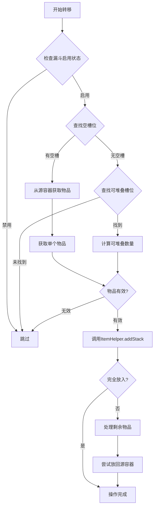
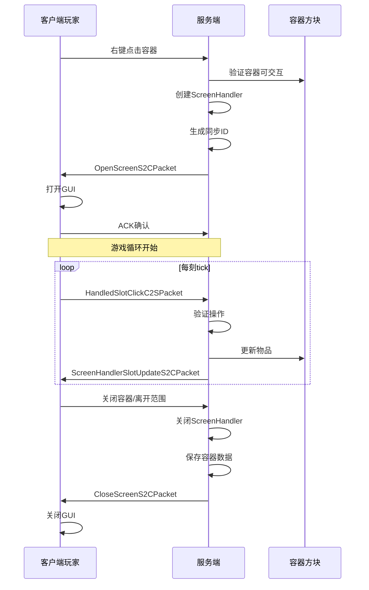
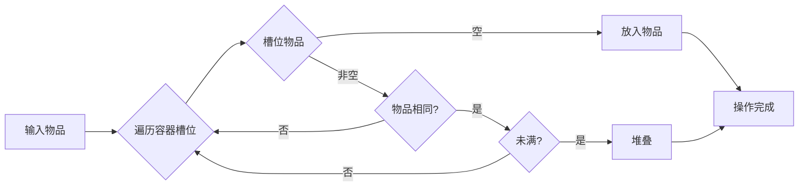

# 物品栏系统 (Inventory System)

## 概述

Minecraft 的物品栏系统（Inventory System）是游戏中最核心的子系统之一，负责管理玩家、容器（箱子、漏斗、熔炉等）中的物品存储、转移和同步。该系统设计精巧，支持多种容器类型，具有良好的扩展性，并通过网络同步机制确保客户端与服务端的物品状态一致性。

物品栏系统的设计遵循以下核心原则：

1. **统一的接口设计**：所有容器都实现 `Inventory` 接口，提供标准化的物品操作方法
2. **事件驱动更新**：物品变更时触发监听器，支持自动同步
3. **高效的空间利用**：支持物品堆叠，最小化存储开销
4. **灵活的扩展机制**：通过 `ItemStack` 和容器注册系统支持自定义容器

## 核心类 (Core Classes)

### Inventory 接口

`Inventory` 接口是所有物品栏容器的根基接口，定义了物品存储的标准操作方法。

```java
// D:\Minecraft-Learning\assets\mc\1.21\net\minecraft\inventory\Inventory.java
public interface Inventory extends Clearable, net.minecraft.component.DataComponentAccessor {
    
    int getContainerSize();
    
    boolean isEmpty();
    
    ItemStack getStack(int slot);
    
    ItemStack removeStack(int slot, int amount);
    
    void setStack(int slot, ItemStack stack);
    
    void setChanged();
    
    boolean canInteractWith(net.minecraft.entity.Entity entity);
    
    void onOpen(net.minecraft.entity.player.PlayerEntity player);
    
    void onClose(net.minecraft.entity.player.PlayerEntity player);
}
```

`Inventory` 接口继承自 `Clearable` 接口，提供了 `clear()` 方法用于清空所有物品。此外，它还实现了 `DataComponentAccessor`，允许容器存储自定义数据组件。

**关键方法解析**：

| 方法 | 作用 | 返回值 |
|------|------|--------|
| `getContainerSize()` | 获取容器槽位数 | `int` |
| `isEmpty()` | 检查容器是否为空 | `boolean` |
| `getStack(slot)` | 获取指定槽位的物品 | `ItemStack` |
| `removeStack(slot, amount)` | 移除指定数量的物品 | `ItemStack` |
| `setStack(slot, stack)` | 设置指定槽位的物品 | `void` |
| `setChanged()` | 标记容器已变更，触发同步 | `void` |

### SimpleInventory 类

`SimpleInventory` 是 `Inventory` 接口的默认实现，提供了简单易用的物品栏实现。

```java
// D:\Minecraft-Learning\assets\mc\1.21\net\minecraft\inventory\SimpleInventory.java
public class SimpleInventory implements Inventory {
    
    private final ItemStack[] items;
    private final int maxStackSize;
    
    public SimpleInventory(int size) {
        this(size, 64);
    }
    
    public SimpleInventory(int size, int maxStackSize) {
        this.items = new ItemStack[size];
        this.maxStackSize = maxStackSize;
        for (int i = 0; i < size; i++) {
            this.items[i] = ItemStack.EMPTY;
        }
    }
    
    @Override
    public int getContainerSize() {
        return this.items.length;
    }
    
    @Override
    public boolean isEmpty() {
        for (ItemStack item : this.items) {
            if (!item.isEmpty()) {
                return false;
            }
        }
        return true;
    }
    
    @Override
    public ItemStack getStack(int slot) {
        return this.items[slot];
    }
    
    @Override
    public ItemStack removeStack(int slot, int amount) {
        ItemStack stack = this.getStack(slot);
        if (stack.isEmpty()) {
            return ItemStack.EMPTY;
        }
        
        int removedCount = Math.min(amount, stack.getCount());
        ItemStack removed = stack.split(removedCount);
        
        if (stack.isEmpty()) {
            this.items[slot] = ItemStack.EMPTY;
        }
        
        this.setChanged();
        return removed;
    }
    
    @Override
    public void setStack(int slot, ItemStack stack) {
        this.items[slot] = stack;
        if (!stack.isEmpty() && stack.getCount() > this.maxStackSize) {
            stack.setCount(this.maxStackSize);
        }
        this.setChanged();
    }
    
    @Override
    public void setChanged() {
        // 触发监听器
    }
    
    @Override
    public boolean canInteractWith(net.minecraft.entity.Entity entity) {
        return true; // 默认允许交互
    }
}
```

**SimpleInventory 的设计特点**：

- **固定大小数组**：`items` 数组在构造时确定大小，不可动态调整
- **最大堆叠限制**：通过 `maxStackSize` 参数控制单个槽位的最大物品数量
- **空物品优化**：使用 `ItemStack.EMPTY` 表示空槽位，避免 null 检查
- **变更通知**：通过 `setChanged()` 方法通知监听器容器已更新

### ItemStack 类

`ItemStack` 是物品栏系统的核心数据类，代表一个槽位中的物品（包括数量和 NBT 数据）。

```java
// D:\Minecraft-Learning\assets\mc\1.21\net\minecraft\item\ItemStack.java
public final class ItemStack implements DataComponentAccessor, FriendlyByteBuf.Convertible {
    
    private final Item item;
    private int count;
    private net.minecraft.component.DataComponentMap components;
    
    public ItemStack(Item item) {
        this(item, 1);
    }
    
    public ItemStack(Item item, int count) {
        this.item = item;
        this.count = count;
        this.components = DataComponentMap.DEFAULT;
    }
    
    public boolean isEmpty() {
        return this.count <= 0 || this.item == Items.AIR;
    }
    
    public boolean isItemEqual(ItemStack other) {
        if (this.item != other.item) {
            return false;
        }
        return this.areComponentsEqual(other);
    }
    
    public boolean areComponentsEqual(ItemStack other) {
        return this.components.equals(other.components);
    }
    
    public ItemStack split(int amount) {
        if (this.isEmpty()) {
            return ItemStack.EMPTY;
        }
        
        int toSplit = Math.min(amount, this.count);
        ItemStack copy = this.copy();
        copy.setCount(toSplit);
        this.decrement(toSplit);
        return copy;
    }
    
    public void decrement(int amount) {
        this.setCount(this.count - amount);
    }
    
    public int getMaxCount() {
        return this.item.getMaxCount();
    }
    
    public boolean isStackable() {
        return this.item.getMaxCount() > 1;
    }
    
    public ItemStack copy() {
        ItemStack copy = new ItemStack(this.item, this.count);
        copy.components = this.components;
        return copy;
    }
}
```

**ItemStack 的关键特性**：

| 特性 | 说明 |
|------|------|
| **数据组件** | 1.20.5+ 引入的组件系统，替代部分 NBT 用途 |
| **不可变引用** | Item 对象不可变，但 count 和 components 可变 |
| **空物品检测** | `isEmpty()` 方法统一处理 count<=0 和 AIR 物品 |
| **物品比较** | `isItemEqual()` 比较物品类型，`areComponentsEqual()` 比较完整数据 |
| **分割操作** | `split()` 方法实现物品分割，不修改原栈 |
| **最大堆叠** | `getMaxCount()` 返回物品的最大堆叠数量 |

## 容器类型 (Container Types)

### 箱子 (Chest)

箱子是最基础的存储容器，有单箱（27 槽）和陷阱箱（27 槽，外观不同）两种变体。

```java
// D:\Minecraft-Learning\assets\mc\1.21\net\minecraft\inventory\ChestInventory.java
public class ChestInventory implements Inventory {
    
    private final Inventory holder;
    private final int rows;
    
    public ChestInventory(Inventory holder, int rows) {
        this.holder = holder;
        this.rows = rows;
    }
    
    public int getContainerSize() {
        return this.rows * 9;
    }
    
    public boolean isEmpty() {
        return this.holder.isEmpty();
    }
    
    public ItemStack getStack(int slot) {
        return this.holder.getStack(slot);
    }
    
    public ItemStack removeStack(int slot, int count) {
        return this.holder.removeStack(slot, count);
    }
    
    public void setStack(int slot, ItemStack stack) {
        this.holder.setStack(slot, stack);
    }
    
    public void setChanged() {
        this.holder.setChanged();
    }
    
    public boolean canInteractWith(net.minecraft.entity.Entity entity) {
        return this.holder.canInteractWith(entity);
    }
}
```

**箱子容器的特点**：

- **标准容量**：单箱 27 格（3 行 × 9 列）
- **方块实体**：每个箱子方块对应一个 `ChestBlockEntity`
- **连接逻辑**：相邻箱子可合并显示为大型箱子（双箱 54 格）
- **GUI 渲染**：3 行布局，与玩家物品栏风格一致

### 漏斗 (Hopper)

漏斗是一种自动化物品转移设备，可以从上方容器或玩家物品栏吸取物品，并转移至下方容器。

```java
// D:\Minecraft-Learning\assets\mc\1.21\net\minecraft\inventory\Hopper.java
public class HopperInventory implements Inventory {
    
    private static final int SLOT_COUNT = 5;
    private final ItemStack[] items = new ItemStack[SLOT_COUNT];
    private final net.minecraft.util.math.BlockPos pos;
    
    public HopperInventory(net.minecraft.util.math.BlockPos pos) {
        this.pos = pos;
        for (int i = 0; i < SLOT_COUNT; i++) {
            this.items[i] = ItemStack.EMPTY;
        }
    }
    
    @Override
    public int getContainerSize() {
        return SLOT_COUNT;
    }
    
    public static int getHopperSize() {
        return SLOT_COUNT;
    }
}
```

**漏斗的行为特性**：

- **5 槽容量**：标准漏斗有 5 个物品槽位
- **逐刻吸取**：每个游戏刻（tick）尝试转移一个物品
- **优先级排序**：从槽位 0 到 4 依次检查
- **堆叠优化**：优先堆叠到已有物品的槽位

### 熔炉 (Furnace)

熔炉是一种特殊的容器，具有输入槽、燃料槽和输出槽三个功能区域。

```java
// D:\Minecraft-Learning\assets\mc\1.21\net\minecraft\inventory\FurnaceInventory.java
public class FurnaceInventory implements Inventory {
    
    private final ItemStack[] items = new ItemStack[3]; // 输入、燃料、输出
    
    public static final int INPUT_SLOT = 0;
    public static final int FUEL_SLOT = 1;
    public static final int OUTPUT_SLOT = 2;
    
    public FurnaceInventory() {
        for (int i = 0; i < 3; i++) {
            this.items[i] = ItemStack.EMPTY;
        }
    }
    
    @Override
    public int getContainerSize() {
        return 3;
    }
    
    @Override
    public boolean canUse(final net.minecraft.entity.player.PlayerEntity player) {
        return true;
    }
    
    public boolean isInputSlot(int slot) {
        return slot == INPUT_SLOT;
    }
    
    public boolean isFuelSlot(int slot) {
        return slot == FUEL_SLOT;
    }
    
    public boolean isOutputSlot(int slot) {
        return slot == OUTPUT_SLOT;
    }
}
```

**熔炉槽位设计**：

| 槽位 | 索引 | 功能 | 可见性 |
|------|------|------|--------|
| 输入槽 | 0 | 放置待熔炼物品 | 始终可见 |
| 燃料槽 | 1 | 放置燃料（煤炭、木材等） | 始终可见 |
| 输出槽 | 2 | 存放熔炼产物 | 始终可见 |

### 其他容器类型

Minecraft 中还存在多种特殊容器：

| 容器类型 | 槽位数 | 特殊功能 |
|----------|--------|----------|
| 酿造台 (BrewingStand) | 5 | 4 个药水原料槽 + 1 个燃料槽 |
| 附魔台 (EnchantingTable) | 1 | 放置书本 |
| 铁砧 (Anvil) | 3 | 输入、添加物品、输出 |
| 砂轮 (Grindstone) | 3 | 输入、添加物品、输出 |
| 织布机 (Loom) | 4 | 旗帜 + 3 个染料槽 |
| 村民交易 (Merchant) | 2 | 输入 + 输出（不可见槽位） |
| 驴/马驮运箱 (Storage) | 15-21 | 驴、马、羊驼等驮运箱 |

## 物品转移 (Item Transfer)

### ItemHelper 工具类

`ItemHelper` 提供了物品操作的核心工具方法，支持物品的合并、分割和转移。

```java
// D:\Minecraft-Learning\assets\mc\1.21\net\minecraft\inventory\ItemHelper.java
public final class ItemHelper {
    
    private ItemHelper() {}
    
    public static int findSlot(final Inventory inventory, final Predicate<ItemStack> predicate) {
        for (int i = 0; i < inventory.getContainerSize(); i++) {
            ItemStack stack = inventory.getStack(i);
            if (predicate.test(stack)) {
                return i;
            }
        }
        return -1;
    }
    
    public static int findStackableSlot(final Inventory source, final ItemStack target) {
        if (target.isEmpty() || !target.isStackable()) {
            return -1;
        }
        
        for (int i = 0; i < source.getContainerSize(); i++) {
            ItemStack stack = source.getStack(i);
            if (stack.isEmpty()) {
                continue;
            }
            if (ItemStack.areItemsAndComponentsEqual(stack, target) && stack.getCount() < stack.getMaxCount()) {
                return i;
            }
        }
        return -1;
    }
    
    public static int findEmptySlot(final Inventory inventory) {
        return findSlot(inventory, ItemStack::isEmpty);
    }
    
    public static ItemStack addStack(final Inventory inventory, final ItemStack stack) {
        if (stack.isEmpty()) {
            return ItemStack.EMPTY;
        }
        
        ItemStack remainder = stack.copy();
        
        // 首先尝试堆叠到已有物品
        for (int i = 0; i < inventory.getContainerSize() && !remainder.isEmpty(); i++) {
            remainder = insertStack(inventory, i, remainder);
        }
        
        // 然后尝试放入空槽位
        for (int i = 0; i < inventory.getContainerSize() && !remainder.isEmpty(); i++) {
            if (inventory.getStack(i).isEmpty()) {
                inventory.setStack(i, remainder);
                return ItemStack.EMPTY;
            }
        }
        
        return remainder;
    }
    
    public static ItemStack insertStack(final Inventory inventory, final int slot, final ItemStack stack) {
        if (stack.isEmpty()) {
            return ItemStack.EMPTY;
        }
        
        ItemStack slotStack = inventory.getStack(slot);
        
        if (slotStack.isEmpty()) {
            int amount = Math.min(stack.getCount(), stack.getMaxCount());
            ItemStack toInsert = stack.split(amount);
            inventory.setStack(slot, toInsert);
            return stack.isEmpty() ? ItemStack.EMPTY : stack;
        }
        
        if (!ItemStack.areItemsAndComponentsEqual(slotStack, stack)) {
            return stack;
        }
        
        int space = slotStack.getMaxCount() - slotStack.getCount();
        if (space <= 0) {
            return stack;
        }
        
        int toInsert = Math.min(space, stack.getCount());
        slotStack.increment(toInsert);
        inventory.setStack(slot, slotStack);
        inventory.setChanged();
        
        return stack.getCount() > toInsert ? stack.split(toInsert) : ItemStack.EMPTY;
    }
    
    public static boolean canMergeStacks(final ItemStack source, final ItemStack target) {
        if (source.isEmpty() || target.isEmpty()) {
            return true;
        }
        return ItemStack.areItemsAndComponentsEqual(source, target) 
            && target.getCount() + source.getCount() <= target.getMaxCount();
    }
}
```

**ItemHelper 的核心功能**：

| 方法 | 功能描述 |
|------|----------|
| `findSlot()` | 查找满足条件的槽位 |
| `findStackableSlot()` | 查找可堆叠相同物品的槽位 |
| `findEmptySlot()` | 查找空槽位 |
| `addStack()` | 向容器添加物品（自动堆叠） |
| `insertStack()` | 向指定槽位插入物品 |
| `canMergeStacks()` | 检查两个物品栈是否可以合并 |

### HopperLogic 漏斗逻辑

漏斗的物品转移逻辑是自动化的核心，涉及从上方容器或玩家吸取物品。

```java
// D:\Minecraft-Learning\assets\mc\1.21\net\minecraft\inventory\HopperBlock.java
public class HopperBlock {
    
    public static void pullFromAbove(final Inventory hopper, final Inventory source) {
        if (source instanceof final net.minecraft.block.entity.HopperBlockEntity hopperBlock 
            && hopperBlock.getLastTickTime() == hopperBlock.getWorldTime()) {
            return; // 防止在同一刻重复处理
        }
        
        for (int i = 0; i < hopper.getContainerSize(); i++) {
            if (hopper.getStack(i).isEmpty()) {
                ItemStack toTransfer = null;
                
                // 尝试从源容器获取一个物品
                for (int j = 0; j < source.getContainerSize(); j++) {
                    ItemStack sourceStack = source.getStack(j);
                    if (!sourceStack.isEmpty() && isInputEmpty(hopper, sourceStack)) {
                        toTransfer = source.removeStack(j, 1);
                        break;
                    }
                }
                
                if (toTransfer != null) {
                    ItemStack remainder = ItemHelper.addStack(hopper, toTransfer);
                    if (!remainder.isEmpty()) {
                        // 如果无法完全放入，需要处理
                        // 简化的逻辑
                    }
                }
            }
        }
    }
    
    private static boolean isInputEmpty(final Inventory inventory, final ItemStack stack) {
        for (int i = 0; i < inventory.getContainerSize(); i++) {
            ItemStack existing = inventory.getStack(i);
            if (ItemStack.areItemsAndComponentsEqual(existing, stack)) {
                return false;
            }
        }
        return true;
    }
}
```

**漏斗转移规则**：

1. **优先级顺序**：槽位 0 → 槽位 4 依次检查
2. **单次转移量**：每次最多转移 1 个物品
3. **堆叠优先**：优先将物品堆叠到已有相同物品的槽位
4. **空槽放置**：只有当所有相同物品槽位都满时，才考虑空槽位
5. **防重复处理**：通过时间戳防止同一刻重复处理

### 漏斗矿车 (Minecart with Hopper)

漏斗矿车继承漏斗逻辑，但需要额外的实体移动处理。

```java
// D:\Minecraft-Learning\assets\mc\1.21\net\minecraft\entity\vehicle\HopperMinecartEntity.java
public class HopperMinecartEntity extends AbstractMinecartEntity implements Hopper {
    
    private final HopperInventory inventory;
    private boolean enabled = true;
    private long lastTransferTime;
    
    @Override
    public void tick() {
        super.tick();
        
        if (!this.enabled) {
            return;
        }
        
        long currentTime = this.getWorld().getTime();
        if (currentTime - this.lastTransferTime < 8L) {
            return; // 冷却时间，防止过快转移
        }
        
        this.lastTransferTime = currentTime;
        
        if (net.minecraft.block HopperBlock.isEnabled(this.getBlockState())) {
            this.pullItems(this);
        }
    }
    
    private void pullItems(final Inventory hopper) {
        final net.minecraft.util.math.BlockPos pos = BlockPos.ofFloored(this.getX(), this.getY() + 1.0, this.getZ());
        final net.minecraft.block.BlockState state = this.getWorld().getBlockState(pos);
        final net.minecraft.block.Block block = state.getBlock();
        
        if (block instanceof final net.minecraft.block.HopperBlock hopperBlock) {
            final Inventory targetInventory = hopperBlock.getInventory(state, this.getWorld(), pos);
            ItemHelper.addStack(this.inventory, targetInventory);
        }
    }
}
```

**漏斗矿车的特殊机制**：

- **8 刻冷却**：每 8 个游戏刻才尝试转移一次物品
- **铁轨检测**：检测上方方块是否为漏斗或容器
- **激活状态**：可通过红石信号禁用

## 容器同步 (Container Sync)

### 客户端-服务端同步机制

物品栏系统需要客户端和服务端保持同步，涉及多个数据包和状态管理。

```java
// D:\Minecraft-Learning\assets\mc\1.21\net\minecraft\inventory\ClientInventorySychronizer.java
public class ClientInventorySynchronizer implements Inventory, net.minecraft.network.packet.PacketListener {
    
    private final Inventory delegated;
    private final net.minecraft.server.network.ServerPlayerEntity player;
    
    @Override
    public void onPacketReceive(final net.minecraft.network.packet.Packet<ServerPacketListener> packet) {
        // 处理服务端发来的物品更新包
    }
}
```

**同步数据包类型**：

| 数据包 | 方向 | 内容 |
|--------|------|------|
| `ScreenHandlerSlotUpdateS2CPacket` | 服务端 → 客户端 | 单个槽位更新 |
| `ScreenHandlerPropertyUpdateS2CPacket` | 服务端 → 客户端 | 容器属性更新（如熔炉进度） |
| `ScreenHandlerContentUpdateS2CPacket` | 服务端 → 客户端 | 整个容器内容更新 |
| `OpenScreenS2CPacket` | 服务端 → 客户端 | 打开容器 |
| `CloseScreenS2CPacket` | 服务端 → 客户端 | 关闭容器 |
| `HandledSlotClickC2SPacket` | 客户端 → 服务端 | 玩家点击操作 |

### 槽位更新流程

```java
// D:\Minecraft-Learning\assets\mc\1.21\net\minecraft\inventory\ScreenHandler.java
public abstract class ScreenHandler {
    
    protected final List<Inventory> inventories = new ArrayList<>();
    protected final List<ItemStack> trackedStacks = new ArrayList<>();
    
    public void setStackInSlot(int slot, int revision, ItemStack stack) {
        if (slot >= 0 && slot < this.slots.size()) {
            final Slot s = this.slots.get(slot);
            if (s.inventory == inventory && revision != this.revision) {
                // 忽略过时的更新
                return;
            }
            s.setStack(stack);
        }
    }
    
    public void updateSlotTrackedStack(final Slot slot, final ItemStack stack) {
        final int slotIndex = this.slots.indexOf(slot);
        if (slotIndex < 0) {
            return;
        }
        
        this.trackedStacks.set(slotIndex, stack);
    }
}
```

**同步流程**：

1. **玩家操作**：客户端玩家点击容器或物品栏槽位
2. **发送请求**：客户端发送 `HandledSlotClickC2SPacket`
3. **服务端验证**：服务端验证操作的合法性
4. **状态更新**：服务端更新容器状态
5. **广播同步**：服务端发送 `ScreenHandlerSlotUpdateS2CPacket`
6. **客户端更新**：客户端更新 UI 显示

### 容器锁定机制

某些情况下需要锁定容器槽位，防止物品被取出或放入。

```java
// D:\Minecraft-Learning\assets\mc\1.21\net\minecraft\inventory\Slot.java
public class Slot {
    
    private final Inventory inventory;
    private final int index;
    private final int x, y;
    
    public Slot(final Inventory inventory, final int index, final int xPosition, final int yPosition) {
        this.inventory = inventory;
        this.index = index;
        this.x = xPosition;
        this.y = yPosition;
    }
    
    public boolean canInsert(final ItemStack stack) {
        return true; // 默认允许
    }
    
    public boolean canTakeItems(final net.minecraft.entity.player.PlayerEntity playerEntity) {
        return true; // 默认允许
    }
}
```

**锁定槽位示例**（如末影箱的锁定槽位）：

```java
// 末影箱锁定槽位实现
public class ShulkerBoxSlot extends Slot {
    
    @Override
    public boolean canInsert(final ItemStack stack) {
        // 检查是否允许放入
        return !isLocked() && isValidItem(stack.getItem());
    }
    
    @Override
    public boolean canTakeItems(final net.minecraft.entity.player.PlayerEntity player) {
        // 检查是否允许取出
        return !isLocked();
    }
}
```

## 源码分析 (Source Code Analysis)

### 容器注册与工厂模式

Minecraft 使用工厂模式和注册系统来管理各种容器类型。

```java
// D:\Minecraft-Learning\assets\mc\1.21\net\minecraft\inventory\InventoryRegistry.java
public class InventoryRegistry {
    
    private static final Map<Identifier, InventoryType> REGISTRY = new HashMap<>();
    
    public static void register(final Identifier id, final InventoryType type) {
        REGISTRY.put(id, type);
    }
    
    public static InventoryType get(final Identifier id) {
        return REGISTRY.get(id);
    }
}
```

### 物品栏菜单 (ScreenHandler)

`ScreenHandler` 是服务端处理玩家与容器交互的核心类。

```java
// D:\Minecraft-Learning\assets\mc\1.21\net\minecraft\inventory\ScreenHandler.java
public abstract class ScreenHandler {
    
    protected final List<Slot> slots = new ArrayList<>();
    protected final List<Inventory> inventories = new ArrayList<>();
    protected final net.minecraft.entity.player.PlayerInventory playerInventory;
    protected int revision;
    
    public ScreenHandler(final net.minecraft.screen.ScreenHandlerType<?> type, final int syncId) {
        this.type = type;
        this.syncId = syncId;
    }
    
    public abstract net.minecraft.screen.ScreenHandlerType<?> getType();
    
    public void addSlot(final Slot slot) {
        this.slots.add(slot);
        this.inventories.add(slot.inventory);
    }
    
    public void addPlayerInventory(final net.minecraft.entity.player.PlayerInventory inventory) {
        // 添加玩家物品栏槽位
        for (int row = 0; row < 3; row++) {
            for (int col = 0; col < 9; col++) {
                this.addSlot(new Slot(inventory, 9 + row * 9 + col, 8 + col * 18, 84 + row * 18));
            }
        }
    }
    
    public void addPlayerHotbar(final net.minecraft.entity.player.PlayerInventory inventory) {
        // 添加快捷栏槽位
        for (int i = 0; i < 9; i++) {
            this.addSlot(new Slot(inventory, i, 8 + i * 18, 142));
        }
    }
    
    public boolean canUse(final net.minecraft.entity.player.PlayerEntity player) {
        return true;
    }
    
    public ItemStack quickMove(final net.minecraft.entity.player.PlayerEntity player, final int slotIndex) {
        // SHIFT+点击转移逻辑
        return ItemStack.EMPTY;
    }
    
    public void onClosed(final net.minecraft.entity.player.PlayerEntity player) {
        // 容器关闭时的清理工作
    }
}
```

**ScreenHandler 的职责**：

1. 管理所有槽位的引用
2. 处理玩家的快速转移操作（SHIFT+点击）
3. 验证玩家的操作权限
4. 同步客户端和服务端状态

### 槽位类 (Slot)

`Slot` 类表示 GUI 中的一个物品槽位，负责渲染和交互。

```java
// D:\Minecraft-Learning\assets\mc\1.21\net\minecraft\inventory\Slot.java
public class Slot {
    
    public final Inventory inventory;
    public final int index;
    public final int x, y;
    private int backgroundWidth = 16;
    private int backgroundHeight = 16;
    private net.minecraft.client.gui.DrawContext backgroundDrawable;
    
    public Slot(final Inventory inventory, final int index, final int x, final int y) {
        this.inventory = inventory;
        this.index = index;
        this.x = x;
        this.y = y;
    }
    
    public int getX() {
        return this.x;
    }
    
    public int getY() {
        return this.y;
    }
    
    public ItemStack getStack() {
        return this.inventory.getStack(this.index);
    }
    
    public boolean hasStack() {
        return !this.getStack().isEmpty();
    }
    
    public void setStack(final ItemStack stack) {
        this.inventory.setStack(this.index, stack);
        this.inventory.setChanged();
    }
    
    public void markDirty() {
        this.inventory.setChanged();
    }
    
    public boolean isEnabled() {
        return true;
    }
    
    public boolean canInsert(final ItemStack stack) {
        return true;
    }
    
    public boolean canTakeItems(final net.minecraft.entity.player.PlayerEntity player) {
        return this.inventory.canInteractWith(player);
    }
    
    public void onStackRemoved(final net.minecraft.item.ItemStack stack) {
    }
    
    public void onStackAdded(final net.minecraft.item.ItemStack stack) {
    }
}
```

### 物品过滤与验证

容器可以配置物品过滤规则，只允许特定物品进入。

```java
// D:\Minecraft-Learning\assets\mc\1.21\net\minecraft\inventory\FilteredInventory.java
public class FilteredInventory implements Inventory {
    
    private final Inventory delegate;
    private final java.util.function.Predicate<ItemStack> filter;
    private final boolean whitelist; // true=白名单，false=黑名单
    
    public FilteredInventory(final Inventory delegate, 
                             final java.util.function.Predicate<ItemStack> filter,
                             final boolean whitelist) {
        this.delegate = delegate;
        this.filter = filter;
        this.whitelist = whitelist;
    }
    
    @Override
    public boolean canInsert(final ItemStack stack) {
        if (whitelist) {
            return filter.test(stack);
        } else {
            return !filter.test(stack);
        }
    }
}
```

## Mermaid Diagram

### 物品转移流程图



### 容器打开流程



### 物品堆叠算法



## 性能考虑 (Performance)

### 物品操作优化

物品栏系统的性能关键在于减少不必要的状态同步和物品复制。

| 优化策略 | 说明 | 性能影响 |
|----------|------|----------|
| **延迟同步** | 物品变更后延迟几刻再同步 | 减少网络包 |
| **差异同步** | 只同步变更的槽位 | 减少数据量 |
| **版本号优化** | 使用 revision 而非完整比较 | O(1) vs O(n) |
| **批处理** | 批量操作合并为一次同步 | 减少系统调用 |
| **缓存验证** | 缓存物品比较结果 | 减少重复计算 |

### 容器扫描优化

频繁扫描容器寻找空槽位或可堆叠物品是常见性能瓶颈。

```java
// 优化的容器扫描
public class OptimizedInventory implements Inventory {
    
    private final ItemStack[] items;
    private int firstEmptyCache = -1; // 缓存第一个空槽位
    private boolean cacheValid = false;
    
    @Override
    public void setStack(int slot, ItemStack stack) {
        this.items[slot] = stack;
        this.invalidateCache();
    }
    
    private void invalidateCache() {
        this.cacheValid = false;
    }
    
    public int getCachedFirstEmpty() {
        if (!cacheValid) {
            firstEmptyCache = ItemHelper.findEmptySlot(this);
            cacheValid = true;
        }
        return firstEmptyCache;
    }
}
```

### 大型容器注意事项

对于 54 槽双箱等大型容器：

1. **分批渲染**：客户端分帧渲染，避免卡顿
2. **按需同步**：只同步可见槽位的数据
3. **懒加载**：打开 GUI 时再加载完整数据
4. **空间索引**：为常用操作建立索引

### 红石比较器优化

红石比较器读取容器内容的性能考量：

```java
// 比较器输出计算
public int getComparatorOutput(Inventory inventory) {
    int count = 0;
    int maxCount = 64;
    
    for (int i = 0; i < inventory.getContainerSize(); i++) {
        ItemStack stack = inventory.getStack(i);
        if (!stack.isEmpty()) {
            count += (stack.getCount() * 15) / maxCount;
        }
    }
    
    return Math.min(count, 15);
}
```

**优化建议**：

- 使用缓存避免重复计算
- 比较器信号变化时才触发更新
- 考虑物品价值的加权计算

### 内存优化

`ItemStack` 对象的创建和销毁是内存压力的一大来源。

| 优化方法 | 描述 |
|----------|------|
| **对象池** | 复用 ItemStack 对象 |
| **不可变物品** | Item 对象本身不可变 |
| **延迟复制** | 必要时才调用 `copy()` |
| **共享组件** | 相同数据的 ItemStack 共享 DataComponentMap |
| **NBT 压缩** | 简化不必要的 NBT 数据 |

## 扩展与自定义

### 自定义容器实现

模组可以通过实现 `Inventory` 接口创建自定义容器：

```java
public class CustomContainer implements Inventory {
    
    private final ItemStack[] items = new ItemStack[27];
    private final List<Runnable> listeners = new ArrayList<>();
    
    @Override
    public void setChanged() {
        listeners.forEach(Runnable::run);
    }
    
    public void addListener(Runnable listener) {
        listeners.add(listener);
    }
    
    // 实现其他 Inventory 方法...
}
```

### 容器类型注册

模组可以注册新的容器类型：

```java
public class ContainerRegistry {
    
    public static final ScreenHandlerType<CustomScreenHandler> CUSTOM_CONTAINER = 
        new ScreenHandlerType<>(CustomScreenHandler::new);
    
    public static void register() {
        Registry.register(Registries.SCREEN_HANDLER, 
            new Identifier("modid", "custom_container"), 
            CUSTOM_CONTAINER);
    }
}
```

## 总结

Minecraft 的物品栏系统是一个设计精良的子系统，具有以下核心特点：

1. **统一接口**：`Inventory` 接口为所有容器提供了标准化操作
2. **高效同步**：通过版本号和增量同步机制确保网络效率
3. **灵活的物品转移**：`ItemHelper` 提供了强大的物品操作工具
4. **自动漏斗逻辑**：实现了可靠的自动化物品流动
5. **优秀的扩展性**：通过接口和注册系统支持自定义容器

理解物品栏系统的设计对于模组开发和服务器优化都有重要意义。
