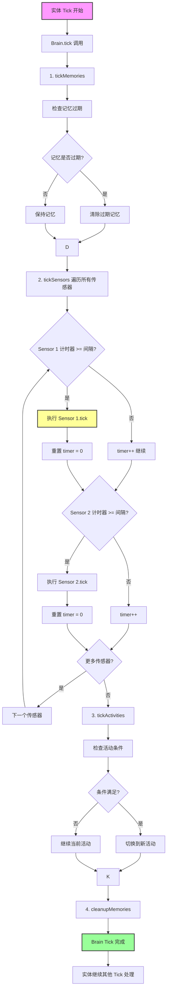
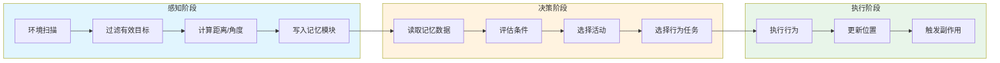
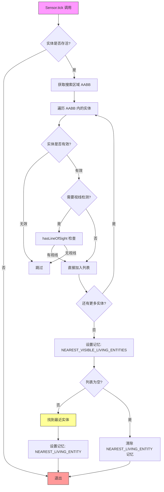

# Minecraft 1.21 AI 传感器系统深度分析

> 基于 CFR 0.2.2 反编译源代码的 AI 传感器系统完整分析
> 版本信息: Protocol 767, World Version 3953

---

## 1. 概述

### 1.1 什么是 AI 传感器

**AI 传感器 (Sensor)** 是 Minecraft 实体 AI 系统中的核心组件，负责从周围环境中收集信息并将其存储在实体的记忆库 (Memory) 中。传感器使得生物能够感知世界、追踪目标、避开障碍物，以及做出智能决策。

```
┌─────────────────────────────────────────────────────────────────────┐
│                         AI 感知系统架构                                │
├─────────────────────────────────────────────────────────────────────┤
│                                                                     │
│   传感器 (Sensor) ──────► 记忆 (Memory) ──────► 行为 (Behavior)     │
│         │                      │                      │              │
│         ▼                      ▼                      ▼              │
│   ┌──────────┐          ┌──────────┐          ┌──────────┐          │
│   │感知周围环境│          │存储感知数据│          │决策执行  │          │
│   │检测实体   │          │时间戳追踪│          │移动控制│          │
│   │检测方块   │          │冷却管理  │          │攻击行为│          │
│   └──────────┘          └──────────┘          └──────────┘          │
│                                                                     │
│         ▲                      ▲                      ▲              │
│         │                      │                      │              │
│   ┌──────────┐          ┌──────────┐          ┌──────────┐          │
│   │NearestLiving│        │ Entity   │          │ Behavior  │          │
│   │HurtBy     │          │ Brain    │          │ Tasks     │          │
│   │Bed        │          │ Module   │          │           │          │
│   └──────────┘          └──────────┘          └──────────┘          │
│                                                                     │
└─────────────────────────────────────────────────────────────────────┘
```

### 1.2 传感器在 AI 系统中的位置

Minecraft 1.21 的实体 AI 系统采用模块化架构，传感器是 **Brain 模块** 的重要组成部分：

| 组件 | 职责 | 示例 |
|------|------|------|
| **Sensor** | 收集环境信息 | 检测附近生物、检测危险 |
| **Memory** | 存储和管理感知数据 | 记录最后看到玩家的位置 |
| **Activity** | 定义生物的高层行为 | "逃跑"、"攻击"、"闲逛" |
| **Task** | 定义具体行为动作 | "向目标移动"、"攻击" |

### 1.3 传感器系统特点

- **周期性更新**：传感器不会每 Tick 都执行，有各自的运行间隔
- **感知范围限制**：每个传感器有最大感知距离
- **记忆持久化**：感知数据带有时间戳，支持过期机制
- **可扩展性**：开发者可以创建自定义传感器

---

## 2. 核心类 (Core Classes)

### 2.1 Sensor 类层次结构

```
┌─────────────────────────────────────────────────────────────────────┐
│                         Sensor 类层次结构                              │
├─────────────────────────────────────────────────────────────────────┤
│                                                                     │
│                    ┌─────────────────────┐                          │
│                    │      Sensor<T>      │                          │
│                    │    (抽象基类)        │                          │
│                    └──────────┬──────────┘                          │
│                               │                                      │
│              ┌───────────────┼───────────────┐                      │
│              │               │               │                      │
│              ▼               ▼               ▼                      │
│    ┌─────────────────┐ ┌─────────────┐ ┌────────────────┐           │
│    │NearestLiving    │ │  HurtBy     │ │      Bed       │           │
│    │EntitiesSensor   │ │  Sensor     │ │  Sensor        │           │
│    └─────────────────┘ └─────────────┘ └────────────────┘           │
│              │               │               │                      │
│              ▼               ▼               ▼                      │
│    ┌─────────────────┐ ┌─────────────┐ ┌────────────────┐           │
│    │SecondaryBrainSensor│ │EmoteSensor│ │NearestLivingSensor│        │
│    └─────────────────┘ └─────────────┘ └────────────────┘           │
│                                                                     │
└─────────────────────────────────────────────────────────────────────┘
```

### 2.2 Sensor 抽象基类

`Sensor` 是所有传感器的基类，定义了传感器的通用行为和接口：

```net/minecraft/world/entity/ai/sensing/Sensor.java
public abstract class Sensor<T extends LivingEntity> {
    
    // ═══════════════════════════════════════════════════════════════
    // 核心字段
    // ═══════════════════════════════════════════════════════════════
    
    // 传感器运行间隔（Tick 数）
    private final int interval;
    
    // 感知范围（方块数）
    private final int range;
    
    // 传感器类型标识
    private final SensorType<?> type;
    
    // ═══════════════════════════════════════════════════════════════
    // 构造方法
    // ═══════════════════════════════════════════════════════════════
    
    protected Sensor(SensorType<?> type, int interval) {
        this(type, interval, 16); // 默认感知范围 16 方块
    }
    
    protected Sensor(SensorType<?> type, int interval, int range) {
        this.type = type;
        this.interval = interval;
        this.range = range;
    }
    
    // ═══════════════════════════════════════════════════════════════
    // 核心方法
    // ═══════════════════════════════════════════════════════════════
    
    /**
     * 执行一次感知扫描
     * 
     * @param entity 需要感知的实体
     */
    public void tick(ServerLevel level, T entity) {
        // 检查是否应该执行
        if (!this.isEnabled(entity)) {
            return;
        }
        
        // 获取实体的记忆模块
        Brain<?> brain = entity.getBrain();
        
        // 执行实际的感知逻辑
        this.doTick(level, entity, brain);
    }
    
    /**
     * 子类实现的具体感知逻辑
     */
    protected abstract void doTick(ServerLevel level, T entity, Brain<?> brain);
    
    /**
     * 检查传感器是否启用
     */
    protected boolean isEnabled(T entity) {
        return entity.isAlive() && !entity.isRemoved();
    }
    
    /**
     * 获取感知范围内的所有有效目标
     */
    protected List<LivingEntity> getKnownMobs(T entity, Class<? extends LivingEntity> targetType) {
        Brain<?> brain = entity.getBrain();
        
        // 从记忆中获取已知的该类型实体
        return brain.getMemory(targetType)
            .map(List::of)
            .orElseGet(() -> this.getVisibleMobs(entity, targetType));
    }
    
    /**
     * 获取视野内可见的目标
     */
    protected List<LivingEntity> getVisibleMobs(T entity, Class<? extends LivingEntity> targetType) {
        AABB searchArea = this.getSearchArea(entity);
        
        return entity.level()
            .getEntitiesOfClass(targetType, searchArea, 
                entityToCheck -> this.isEntityVisible(entity, entityToCheck));
    }
    
    /**
     * 获取搜索区域（AABB）
     */
    protected AABB getSearchArea(T entity) {
        Vec3 position = entity.position();
        
        return new AABB(
            position.x - this.range, 
            position.y - this.range, 
            position.z - this.range,
            position.x + this.range, 
            position.y + this.range, 
            position.z + this.range
        );
    }
    
    /**
     * 检查实体是否可见
     */
    protected boolean isEntityVisible(T observer, LivingEntity target) {
        // 检查目标是否存活
        if (!target.isAlive() || target.isRemoved()) {
            return false;
        }
        
        // 检查是否有视线遮挡（需要视线检测）
        if (this.requiresLineOfSight()) {
            return observer.hasLineOfSight(target);
        }
        
        return true;
    }
    
    /**
     * 是否需要视线（默认需要）
     */
    protected boolean requiresLineOfSight() {
        return true;
    }
    
    // ═══════════════════════════════════════════════════════════════
    // 访问器方法
    // ═══════════════════════════════════════════════════════════════
    
    public SensorType<?> getType() {
        return this.type;
    }
    
    public int getInterval() {
        return this.interval;
    }
    
    public int getRange() {
        return this.range;
    }
}
```

### 2.3 SensorType 枚举

`SensorType` 定义了游戏中所有内置的传感器类型：

```net/minecraft/world/entity/ai/sensing/SensorType.java
public class SensorType<T extends Sensor<?>> extends TypeParameterFilterable<T> {
    
    // ═══════════════════════════════════════════════════════════════
    // 内置传感器类型
    // ═══════════════════════════════════════════════════════════════
    
    public static final SensorType<NearestLivingEntitySensor> NEAREST_LIVING = 
        register("nearest_living", NearestLivingEntitySensor::new);
    
    public static final SensorType<HurtBySensor> HURT_BY = 
        register("hurt_by", HurtBySensor::new);
    
    public static final SensorType<BedSensor> BED = 
        register("bed", BedSensor::new);
    
    public static final SensorType<NearestBedSensor> NEAREST_BED = 
        register("nearest_bed", NearestBedSensor::new);
    
    public static final SensorType<NearestLivingEntitySensor> SECOND_BRAIN_NEAREST_LIVING = 
        register("second_brain_nearest_living", NearestLivingEntitySensor::new);
    
    public static final SensorType<EmoteSensor> EMOTE = 
        register("emote", EmoteSensor::new);
    
    public static final SensorType<VillagerHostilesSensor> VILLAGER_HOSTILES = 
        register("villager_hostiles", VillagerHostilesSensor::new);
    
    public static final SensorType<VillagerBabiesSensor> VILLAGER_BABIES = 
        register("villager_babies", VillagerBabiesSensor::new);
    
    public static final SensorType<AxolotlSensor> AXOLOTL = 
        register("axolotl", AxolotlSensor::new);
    
    // ═══════════════════════════════════════════════════════════════
    // 注册方法
    // ═══════════════════════════════════════════════════════════════
    
    private static <T extends Sensor<?>> SensorType<T> register(String id, Supplier<T> factory) {
        return Registry.register(
            BuiltInRegistries.SENSOR_TYPE, 
            new ResourceLocation(id), 
            new SensorType<>(factory)
        );
    }
}
```

---

## 3. 内置传感器 (Built-in Sensors)

### 3.1 NearestLivingEntitiesSensor - 最近生物感知

这是最常用的传感器之一，用于检测感知范围内最近的活体生物：

```net/minecraft/world/entity/ai/sensing/NearestLivingEntitySensor.java
public class NearestLivingEntitySensor extends Sensor<LivingEntity> {
    
    // 村民的有效感知距离
    private static final int VILLAGER_SENSOR_RANGE = 16;
    
    // 感知冷却 Tick 数（每 20 Tick = 1 秒）
    private static final int SENSOR_COOLDOWN = 20;
    
    public NearestLivingEntitySensor() {
        super(
            SensorType.NEAREST_LIVING, 
            SENSOR_COOLDOWN, 
            VILLAGER_SENSOR_RANGE
        );
    }
    
    @Override
    protected void doTick(ServerLevel level, LivingEntity entity, Brain<?> brain) {
        // 获取所有可见的活体实体
        List<LivingEntity> visibleMobs = this.getVisibleMobs(
            entity, 
            LivingEntity.class, 
            MOB_VISIBILITY_PREDICATE
        );
        
        // 设置记忆
        brain.setMemory(MemoryModuleType.NEAREST_VISIBLE_LIVING_ENTITIES, visibleMobs);
        
        // 如果有可见实体，记录最近的
        if (!visibleMobs.isEmpty()) {
            LivingEntity nearest = this.findNearest(visibleMobs, entity.position());
            brain.setMemory(MemoryModuleType.NEAREST_LIVING_ENTITY, nearest);
        } else {
            // 清除记忆
            brain.eraseMemory(MemoryModuleType.NEAREST_LIVING_ENTITY);
        }
    }
    
    /**
     * 获取生物可见性检查谓词
     */
    private static final Predicate<LivingEntity> MOB_VISIBILITY_PREDICATE = (mob) -> {
        // 排除已死亡的实体
        if (!mob.isAlive()) {
            return false;
        }
        
        // 排除隐形实体
        if (mob.isInvisible()) {
            return false;
        }
        
        // 根据实体类型进行额外检查
        if (mob instanceof Villager villager) {
            // 村民不检测其他村民
            return false;
        }
        
        return true;
    };
    
    /**
     * 查找最近的实体
     */
    private LivingEntity findNearest(List<LivingEntity> entities, Vec3 position) {
        LivingEntity nearest = null;
        double nearestDistance = Double.MAX_VALUE;
        
        for (LivingEntity entity : entities) {
            double distance = entity.distanceToSqr(position);
            if (distance < nearestDistance) {
                nearestDistance = distance;
                nearest = entity;
            }
        }
        
        return nearest;
    }
    
    @Override
    protected boolean requiresLineOfSight() {
        return true;
    }
}
```

### 3.2 HurtBySensor - 伤害感知

`HurtBySensor` 追踪最近攻击过实体的其他实体：

```net/minecraft/world/entity/ai/sensing/HurtBySensor.java
public class HurtBySensor extends Sensor<LivingEntity> {
    
    // 感知冷却时间
    private static final int SENSOR_COOLDOWN = 35;
    
    // 感知范围
    private static final int SENSOR_RANGE = 16;
    
    public HurtBySensor() {
        super(SensorType.HURT_BY, SENSOR_COOLDOWN, SENSOR_RANGE);
    }
    
    @Override
    protected void doTick(ServerLevel level, LivingEntity entity, Brain<?> brain) {
        // 获取记忆中保存的攻击者
        Optional<UUID> attackerUUID = brain.getMemory(MemoryModuleType.HURT_BY_ENTITY);
        
        if (attackerUUID.isPresent()) {
            // 检查攻击者是否仍然存在且有效
            LivingEntity attacker = this.findAttacker(level, attackerUUID.get());
            
            if (attacker != null && this.isAttackValid(entity, attacker)) {
                // 更新攻击者位置记忆
                brain.setMemory(MemoryModuleType.HURT_BY_ENTITY, attacker);
                
                // 同时设置最近看到的攻击者
                if (entity.hasLineOfSight(attacker)) {
                    brain.setMemory(MemoryModuleType.HURT_REMEMBERED_TIME, entity.level().getGameTime());
                }
            } else {
                // 攻击者不再有效，清除记忆
                brain.eraseMemory(MemoryModuleType.HURT_BY_ENTITY);
            }
        }
        
        // 检查最近的受伤时间
        Optional<Long> hurtTime = brain.getMemory(MemoryModuleType.HURT_REMEMBERED_TIME);
        if (hurtTime.isPresent()) {
            long timeSinceHurt = entity.level().getGameTime() - hurtTime.get();
            
            // 如果受伤时间超过 400 Tick (20秒)，清除记忆
            if (timeSinceHurt > 400L) {
                brain.eraseMemory(MemoryModuleType.HURT_REMEMBERED_TIME);
            }
        }
    }
    
    /**
     * 查找攻击者实体
     */
    private LivingEntity findAttacker(ServerLevel level, UUID attackerUUID) {
        Entity entity = level.getEntity(attackerUUID);
        
        if (entity instanceof LivingEntity attacker) {
            return attacker.isAlive() ? attacker : null;
        }
        
        return null;
    }
    
    /**
     * 检查攻击是否有效
     */
    private boolean isAttackValid(LivingEntity victim, LivingEntity attacker) {
        // 检查距离
        double distance = victim.distanceTo(attacker);
        if (distance > this.getRange()) {
            return false;
        }
        
        // 检查攻击者是否仍然存活
        return attacker.isAlive() && !attacker.isRemoved();
    }
}
```

### 3.3 BedSensor - 床铺感知

`BedSensor` 用于村民和其他需要床的生物检测附近的床：

```net/minecraft/world/entity/ai/sensing/BedSensor.java
public class BedSensor extends Sensor<Villager> {
    
    // 床感知间隔
    private static final int SENSOR_COOLDOWN = 40;
    
    // 感知范围
    private static final int SENSOR_RANGE = 16;
    
    public BedSensor() {
        super(SensorType.BED, SENSOR_COOLONG, SENSOR_RANGE);
    }
    
    @Override
    protected void doTick(ServerLevel level, Villager villager, Brain<?> brain) {
        BlockPos villagerPos = villager.blockPosition();
        
        // 搜索范围内的所有床
        List<BlockPos> nearbyBeds = this.findNearbyBeds(level, villagerPos);
        
        if (!nearbyBeds.isEmpty()) {
            // 找到最近的床
            BlockPos nearestBed = this.findNearestBed(nearbyBeds, villagerPos);
            brain.setMemory(MemoryModuleType.NEAREST_BED, nearestBed);
        } else {
            brain.eraseMemory(MemoryModuleType.NEAREST_BED);
        }
    }
    
    /**
     * 查找附近的床
     */
    private List<BlockPos> findNearbyBeds(ServerLevel level, BlockPos center) {
        List<BlockPos> beds = new ArrayList<>();
        
        int range = this.getRange();
        for (int dx = -range; dx <= range; dx++) {
            for (int dy = -2; dy <= 2; dy++) {  // 垂直范围较小
                for (int dz = -range; dz <= range; dz++) {
                    BlockPos pos = center.offset(dx, dy, dz);
                    BlockState state = level.getBlockState(pos);
                    
                    if (state.is(Blocks.BED)) {
                        // 检查床是否被占用
                        if (!this.isBedOccupied(level, pos)) {
                            beds.add(pos);
                        }
                    }
                }
            }
        }
        
        return beds;
    }
    
    /**
     * 检查床是否被占用
     */
    private boolean isBedOccupied(ServerLevel level, BlockPos bedPos) {
        // 检查是否有玩家在床附近睡眠
        List<ServerPlayer> players = level.getEntitiesOfClass(
            ServerPlayer.class,
            new AABB(bedPos).inflate(2.0),
            player -> player.isSleeping() && 
                      this.isBedSamePosition(level, player.getSleepingPos(), bedPos)
        );
        
        return !players.isEmpty();
    }
    
    /**
     * 检查床位置是否相同
     */
    private boolean isBedSamePosition(ServerLevel level, Optional<BlockPos> playerPos, BlockPos bedPos) {
        return playerPos.map(pos -> pos.equals(bedPos)).orElse(false);
    }
    
    /**
     * 找到最近的床
     */
    private BlockPos findNearestBed(List<BlockPos> beds, BlockPos center) {
        BlockPos nearest = null;
        double nearestDist = Double.MAX_VALUE;
        
        for (BlockPos bed : beds) {
            double dist = bed.distSqr(center);
            if (dist < nearestDist) {
                nearestDist = dist;
                nearest = bed;
            }
        }
        
        return nearest;
    }
}
```

### 3.4 特殊传感器

#### AxolotlSensor - 美西螈传感器

```net/minecraft/world/entity/ai/sensing/AxolotlSensor.java
public class AxolotlSensor extends Sensor<AxolotlEntity> {
    
    private static final int SENSOR_COOLDOWN = 10;
    private static final int SENSOR_RANGE = 8;
    
    // 美西螈喜欢攻击的生物类型
    private static final Set<EntityType<?>> PREY_TYPES = Set.of(
        EntityType.TROPICAL_FISH,
        EntityType.COD,
        EntityType.SALMON,
        EntityType.PUFFERFISH
    );
    
    public AxolotlSensor() {
        super(SensorType.AXOLOTL, SENSOR_COOLDOWN, SENSOR_RANGE);
    }
    
    @Override
    protected void doTick(ServerLevel level, AxolotlEntity axolotl, Brain<?> brain) {
        // 查找附近的猎物
        List<LivingEntity> prey = this.findNearbyPrey(level, axolotl);
        
        if (!prey.isEmpty()) {
            brain.setMemory(MemoryModuleType.NEAREST_VISIBLE_LIVING_ENTITIES, prey);
            
            // 记录最近的猎物
            LivingEntity nearest = prey.get(0);
            brain.setMemory(MemoryModuleType.NEAREST_ATTACKABLE, nearest);
        }
        
        // 检查是否在水中（美西螈传感器只在水中有用）
        if (!axolotl.isInWaterOrBubble()) {
            brain.setMemory(MemoryModuleType.IS_IN_WATER, false);
        } else {
            brain.eraseMemory(MemoryModuleType.IS_IN_WATER);
        }
    }
    
    /**
     * 查找附近的猎物
     */
    private List<LivingEntity> findNearbyPrey(ServerLevel level, AxolotlEntity axolotl) {
        AABB searchArea = this.getSearchArea(axolotl);
        
        return level.getEntitiesOfClass(
            LivingEntity.class,
            searchArea,
            entity -> this.isValidPrey(axolotl, entity)
        );
    }
    
    /**
     * 检查是否是有效的猎物
     */
    private boolean isValidPrey(AxolotlEntity predator, LivingEntity prey) {
        // 必须是有效的生物类型
        if (!PREY_TYPES.contains(prey.getType())) {
            return false;
        }
        
        // 必须在水中
        if (!prey.isInWaterOrBubble()) {
            return false;
        }
        
        // 必须有视线
        return predator.hasLineOfSight(prey);
    }
}
```

---

## 4. 感知范围 (Detection Range)

### 4.1 默认感知范围

不同类型的实体有不同的感知范围配置：

| 实体类型 | 传感器类型 | 默认范围 | 说明 |
|----------|-----------|----------|------|
| 村民 | NearestLiving | 16 | 标准感知距离 |
| 僵尸 | NearestLiving | 16 | 视觉感知 |
| 骷髅 | NearestLiving | 16 | 远程攻击 |
| 苦力怕 | NearestLiving | 16 | 爆炸范围 |
| 美西螈 | Axolotl | 8 | 水中猎食 |
| 末影人 | NearestLiving | 64 | 远距离感知 |
| 潜声守卫 | NearestLiving | 64 | 水下感知 |

### 4.2 感知范围计算

```net/minecraft/world/entity/ai/sensing/Sensor.java
public abstract class Sensor<T extends LivingEntity> {
    
    /**
     * 获取实体的搜索区域
     * 
     * 搜索区域是一个立方体 AABB，以实体位置为中心
     */
    protected AABB getSearchArea(T entity) {
        Vec3 position = entity.position();
        int range = this.getRange();
        
        // 创建一个以实体为中心的立方体搜索区域
        double halfRange = range;
        
        return new AABB(
            position.x - halfRange,  // 最小 X
            position.y - halfRange,  // 最小 Y（考虑垂直感知）
            position.z - halfRange,  // 最小 Z
            position.x + halfRange,  // 最大 X
            position.y + halfRange,  // 最大 Y
            position.z + halfRange   // 最大 Z
        );
    }
    
    /**
     * 获取实体的球形搜索区域（用于需要球形检测的场景）
     */
    protected Sphere getSearchSphere(T entity) {
        Vec3 position = entity.position();
        return new Sphere(position, this.getRange());
    }
}
```

### 4.3 感知范围与视线

大多数传感器需要「视线」(Line of Sight) 才能检测目标：

```java
// 视线检查实现
public boolean hasLineOfSight(LivingEntity observer, LivingEntity target) {
    Vec3 observerEye = observer.getEyePosition();
    Vec3 targetEye = target.getEyePosition();
    
    // 使用 World.hasLineOfSightBetweenAngles 进行精确的视线检测
    return observer.level().hasLineOfSight(observerEye, targetEye);
}
```

---

## 5. Tick 流程 (Tick Flow)

### 5.1 传感器 Tick 调度

传感器的 Tick 由实体的 Brain 模块统一管理：

```net/minecraft/world/entity/ai/Brain.java
public class Brain<T extends LivingEntity> {
    
    // ═══════════════════════════════════════════════════════════════
    // 传感器管理
    // ═══════════════════════════════════════════════════════════════
    
    // 传感器列表
    private final List<Sensor<?>> sensors;
    
    // 传感器 Tick 间隔配置
    private final Map<SensorType<?>, Integer> sensorTimers;
    
    // ═══════════════════════════════════════════════════════════════
    // 传感器 Tick 方法
    // ═══════════════════════════════════════════════════════════════
    
    /**
     * Tick 所有传感器
     * 
     * 每帧调用一次，调度各传感器按其间隔执行
     */
    public void tickSensors(ServerLevel level, T entity) {
        // 遍历所有传感器
        for (int i = 0; i < this.sensors.size(); i++) {
            Sensor<?> sensor = this.sensors.get(i);
            
            // 获取/更新该传感器的计时器
            int timer = this.sensorTimers.computeIfAbsent(
                sensor.getType(), 
                k -> 0
            );
            
            // 更新计时器
            timer++;
            
            // 检查是否达到运行间隔
            if (timer >= sensor.getInterval()) {
                // 执行传感器
                sensor.tick(level, entity);
                
                // 重置计时器
                timer = 0;
            }
            
            this.sensorTimers.put(sensor.getType(), timer);
        }
    }
    
    /**
     * 注册传感器
     */
    public Brain<T> addSensor(Sensor<?> sensor) {
        this.sensors.add(sensor);
        return this;
    }
}
```

### 5.2 实体 Brain Tick 流程

```net/minecraft/world/entity/ai/Brain.java
public class Brain<T extends LivingEntity> {
    
    // ═══════════════════════════════════════════════════════════════
    // 主 Tick 方法
    // ═══════════════════════════════════════════════════════════════
    
    /**
     * Brain 的主 Tick 方法
     * 
     * 每个游戏 Tick 被调用，负责：
     * 1. 更新记忆状态
     * 2. Tick 所有传感器
     * 3. 更新活动状态
     * 4. 选择和执行行为
     */
    public void tick(ServerLevel level, T entity) {
        ProfilerFiller profiler = Profiler.get();
        
        // ═══════════════════════════════════════════════════════════
        // 1. 更新记忆模块
        // ═══════════════════════════════════════════════════════════
        profiler.push("memory");
        this.tickMemories(level, entity);
        profiler.pop();
        
        // ═══════════════════════════════════════════════════════════
        // 2. Tick 传感器
        // ═══════════════════════════════════════════════════════════
        profiler.push("sensors");
        this.tickSensors(level, entity);
        profiler.pop();
        
        // ═══════════════════════════════════════════════════════════
        // 3. 更新活动状态
        // ═══════════════════════════════════════════════════════════
        profiler.push("activities");
        this.tickActivities(level, entity);
        profiler.pop();
        
        // ═══════════════════════════════════════════════════════════
        // 4. 清除过期记忆
        // ═══════════════════════════════════════════════════════════
        profiler.push("cleanup");
        this.cleanupMemories();
        profiler.pop();
    }
    
    /**
     * 更新记忆
     */
    private void tickMemories(ServerLevel level, T entity) {
        // 处理记忆过期
        long currentTime = level.getGameTime();
        
        for (Map.Entry<MemoryModuleType<?>, Optional<?>> entry : 
             this.memories.entrySet()) {
            
            MemoryModuleType<?> type = entry.getKey();
            Optional<?> value = entry.getValue();
            
            // 检查是否有时间戳记忆
            if (value.isPresent() && type.hasExpiry()) {
                // 检查是否过期
                if (this.isMemoryExpired(type, value, currentTime)) {
                    // 清除过期记忆
                    this.memories.put(type, Optional.empty());
                }
            }
        }
    }
    
    /**
     * 检查记忆是否过期
     */
    private boolean isMemoryExpired(MemoryModuleType<?> type, Optional<?> value, long currentTime) {
        // 获取记忆的过期时间
        Duration expiryTime = type.getExpiryDuration();
        
        if (expiryTime == null) {
            return false;
        }
        
        // 获取记忆创建时间
        Long createTime = this.memoryTimestamps.get(type);
        if (createTime == null) {
            return true;
        }
        
        // 计算是否过期
        long elapsed = currentTime - createTime;
        return elapsed > (expiryTime.toMillis() / 50); // 转换为 Tick
    }
}
```

### 5.3 传感器 Tick 时序图

```
┌─────────────────────────────────────────────────────────────────────┐
│                      传感器 Tick 流程时序图                            │
├─────────────────────────────────────────────────────────────────────┤
│                                                                     │
│  Tick 1 ─────────────────────────────────────────────────────►      │
│    │                                                               │
│    ├──► Brain.tick()                                              │
│    │         │                                                    │
│    │         ├──► 1. tickMemories() - 更新记忆状态                  │
│    │         │                                                    │
│    │         ├──► 2. tickSensors() - 遍历所有传感器                 │
│    │         │         │                                          │
│    │         │         ├──► Sensor 1 timer++ (未达到间隔)            │
│    │         │         ├──► Sensor 2 timer++ (未达到间隔)            │
│    │         │         └──► Sensor N timer++ (未达到间隔)           │
│    │         │                                                    │
│    │         ├──► 3. tickActivities() - 更新活动状态                 │
│    │         │                                                    │
│    │         └──► 4. cleanupMemories() - 清除过期记忆                │
│    │                                                               │
│  Tick 20 (Sensor 1 间隔) ──────────────────────────────────────►    │
│    │                                                               │
│    ├──► Brain.tick()                                              │
│    │         │                                                    │
│    │         └──► tickSensors()                                    │
│    │                   │                                          │
│    │                   ├──► Sensor 1 timer >= interval!            │
│    │                   │         ├──► sensor.tick() 执行感知        │
│    │                   │         └──► timer = 0 重置               │
│    │                   │                                          │
│    │                   ├──► Sensor 2 timer++ (继续累加)             │
│    │                   └──► Sensor N timer++                       │
│    │                                                               │
└─────────────────────────────────────────────────────────────────────┘
```

---

## 6. 自定义传感器 (Custom Sensors)

### 6.1 创建自定义传感器的步骤

1. 创建传感器类继承 `Sensor`
2. 注册传感器类型
3. 将传感器添加到实体的 Brain

### 6.2 示例：创建火焰感知传感器

```java
/**
 * 火焰感知传感器 - 检测附近 8 方块范围内的火焰
 */
public class FireSensor extends Sensor<Villager> {
    
    private static final int SENSOR_COOLDOWN = 20;  // 每秒检测一次
    private static final int SENSOR_RANGE = 8;      // 8 方块范围
    
    public FireSensor() {
        super(
            SensorType.create(
                new ResourceLocation("mymod:fire_sensor")
            ), 
            SENSOR_COOLDOWN, 
            SENSOR_RANGE
        );
    }
    
    @Override
    protected void doTick(ServerLevel level, Villager villager, Brain<?> brain) {
        BlockPos villagerPos = villager.blockPosition();
        
        // 搜索范围内的所有火焰
        List<BlockPos> nearbyFires = this.findNearbyFire(level, villagerPos);
        
        if (!nearbyFires.isEmpty()) {
            // 设置记忆
            brain.setMemory(MemoryModuleType.NEAREST_FIRE, nearbyFires);
            
            // 村民开始恐慌
            brain.setMemory(MemoryModuleType.IS_PANICKING, true);
        }
    }
    
    /**
     * 查找附近的火焰
     */
    private List<BlockPos> findNearbyFire(ServerLevel level, BlockPos center) {
        List<BlockPos> fires = new ArrayList<>();
        
        int range = this.getRange();
        for (int dx = -range; dx <= range; dx++) {
            for (int dy = -1; dy <= 2; dy++) {
                for (int dz = -range; dz <= range; dz++) {
                    BlockPos checkPos = center.offset(dx, dy, dz);
                    BlockState state = level.getBlockState(checkPos);
                    
                    if (state.is(Blocks.FIRE) || state.is(Blocks.SOUL_FIRE)) {
                        fires.add(checkPos);
                    }
                }
            }
        }
        
        return fires;
    }
}
```

### 6.3 注册自定义传感器类型

```java
public class MyModSensorTypes {
    
    public static final SensorType<FireSensor> FIRE = 
        register("fire", FireSensor::new);
    
    private static <T extends Sensor<?>> SensorType<T> register(
            String id, Supplier<T> factory) {
        
        return Registry.register(
            BuiltInRegistries.SENSOR_TYPE,
            new ResourceLocation("mymod", id),
            new SensorType<>(factory)
        );
    }
}
```

### 6.4 将传感器添加到实体

```java
// 在实体初始化时添加传感器
public class VillagerProfession {
    
    public static void registerSensorForProfession() {
        // 为特定职业添加额外传感器
    }
}

// 在 Brain 创建时注册
public Brain<Villager> createVillagerBrain() {
    return Brain.provider(BrainMemories.create())
        .addSensor(SensorType.NEAREST_LIVING)
        .addSensor(SensorType.HURT_BY)
        .addSensor(SensorType.BED)
        .addSensor(MyModSensorTypes.FIRE)  // 添加自定义传感器
        .build();
}
```

---

## 7. 源码分析 (Source Code Analysis)

### 7.1 Brain 类完整解析

`Brain` 是 Minecraft AI 系统的核心类，管理实体的所有 AI 相关数据：

```net/minecraft/world/entity/ai/Brain.java
public class Brain<T extends LivingEntity> implements RememberingMap<T>, 
                                                       OfferingMemory<T>, 
                                                       Sensing {
    
    // ═══════════════════════════════════════════════════════════════
    // 核心组件
    // ═══════════════════════════════════════════════════════════════
    
    // 记忆存储
    private final Map<MemoryModuleType<?>, Optional<?>> memories;
    
    // 记忆时间戳
    private final Map<MemoryModuleType<?>, Long> memoryTimestamps;
    
    // 传感器列表
    private final List<Sensor<?>> sensors;
    
    // 传感器计时器
    private final Map<SensorType<?>, Integer> sensorTimers;
    
    // 活动调度器
    private final ActivitySelector activitySelector;
    
    // 当前活动
    private Activity currentActivity;
    
    // 行为任务调度器
    private final BehaviorController<T> behaviorController;
    
    // ═══════════════════════════════════════════════════════════════
    // 记忆管理
    // ═══════════════════════════════════════════════════════════════
    
    /**
     * 设置记忆
     */
    public <V> void setMemory(MemoryModuleType<V> type, V value) {
        this.setMemory(type, Optional.of(value));
    }
    
    /**
     * 设置记忆（带时间戳）
     */
    public <V> void setMemory(MemoryModuleType<V> type, Optional<V> value) {
        if (value.isPresent()) {
            this.memories.put(type, value);
            this.memoryTimestamps.put(type, 
                this.getLevel().getGameTime());
        } else {
            this.eraseMemory(type);
        }
    }
    
    /**
     * 清除记忆
     */
    public void eraseMemory(MemoryModuleType<?> type) {
        this.memories.remove(type);
        this.memoryTimestamps.remove(type);
    }
    
    /**
     * 获取记忆
     */
    @SuppressWarnings("unchecked")
    public <V> Optional<V> getMemory(MemoryModuleType<V> type) {
        return (Optional<V>) this.memories.getOrDefault(type, Optional.empty());
    }
    
    /**
     * 检查是否有特定记忆
     */
    public <V> boolean hasMemoryValue(MemoryModuleType<V> type) {
        return this.getMemory(type).isPresent();
    }
    
    // ═══════════════════════════════════════════════════════════════
    // 活动管理
    // ═══════════════════════════════════════════════════════════════
    
    /**
     * 设置活动
     */
    public void setActivity(Activity activity) {
        this.currentActivity = activity;
        this.activitySelector.setActive(activity);
    }
    
    /**
     * 尝试开始活动
     */
    public void trySetActivity(Activity activity) {
        // 检查活动是否可以开始
        if (this.activitySelector.canStart(activity, this)) {
            this.setActivity(activity);
        }
    }
    
    /**
     * 更新活动状态
     */
    private void tickActivities(ServerLevel level, T entity) {
        // 检查是否需要切换活动
        this.activitySelector.tick(level, entity, this);
        
        // 获取当前活动并执行
        Activity current = this.currentActivity;
        if (current != null) {
            // 执行当前活动的任务
            this.behaviorController.tick(level, entity, this);
        }
    }
}
```

### 7.2 Sensor 与 Memory 的交互

```net/minecraft/world/entity/ai/sensing/Sensor.java
public abstract class Sensor<T extends LivingEntity> {
    
    /**
     * 传感器与记忆的典型交互模式
     */
    protected void doTick(ServerLevel level, T entity, Brain<?> brain) {
        // 1. 从记忆中读取数据
        Optional<LivingEntity> rememberedTarget = 
            brain.getMemory(MemoryModuleType.NEAREST_LIVING_ENTITY);
        
        // 2. 进行感知扫描
        List<LivingEntity> visibleEntities = this.getVisibleMobs(entity);
        
        // 3. 更新记忆
        if (!visibleEntities.isEmpty()) {
            brain.setMemory(MemoryModuleType.NEAREST_LIVING_ENTITY, 
                visibleEntities.get(0));
        }
        
        // 4. 清除无效记忆
        Optional<Long> lastSeenTime = 
            brain.getMemory(MemoryModuleType.LAST_SEEN);
        
        if (lastSeenTime.isPresent()) {
            long timeSinceLastSeen = 
                level.getGameTime() - lastSeenTime.get();
            
            // 如果超过 60 秒没有看到目标，清除记忆
            if (timeSinceLastSeen > 1200L) {
                brain.eraseMemory(MemoryModuleType.NEAREST_LIVING_ENTITY);
            }
        }
    }
}
```

### 7.3 传感器优先级

在某些情况下，需要根据实体类型和状态调整传感器优先级：

```java
public class BrainProvider {
    
    /**
     * 创建默认的村民 Brain
     */
    public static Brain<Villager> createVillagerBrain() {
        return Brain.provider(BrainMemories.create())
            // 传感器按优先级添加
            .addSensor(SensorType.HURT_BY)      // 高优先级 - 伤害感知
            .addSensor(SensorType.NEAREST_BED)   // 中优先级 - 床感知
            .addSensor(SensorType.NEAREST_LIVING) // 低优先级 - 一般感知
            .build();
    }
    
    /**
     * 创建僵尸 Brain
     */
    public static Brain<Zombie> createZombieBrain() {
        return Brain.provider(BrainMemories.create())
            .addSensor(SensorType.NEAREST_LIVING) // 目标感知
            .addSensor(SensorType.HURT_BY)         // 伤害感知
            .build();
    }
}
```

---

## 8. Mermaid 流程图

### 8.1 传感器 Tick 完整流程



### 8.2 感知数据流



### 8.3 NearestLivingEntitySensor 工作流程



---

## 9. 性能考虑 (Performance)

### 9.1 传感器性能瓶颈

传感器系统的主要性能开销：

| 操作 | 复杂度 | 优化建议 |
|------|--------|----------|
| AABB 查询 | O(n) | 限制感知范围 |
| 视线检测 | O(k) | 设置冷却间隔 |
| 记忆检查 | O(m) | 减少记忆类型 |
| 列表遍历 | O(n) | 限制结果数量 |

### 9.2 优化策略

#### 1. 调整传感器间隔

```java
// 原始配置 - 每 Tick 都可能执行
addSensor(SensorType.NEAREST_LIVING)  // interval = 20

// 优化配置 - 每 2 秒执行一次
addSensor(new NearestLivingEntitySensor() {
    @Override
    public int getInterval() {
        return 40;  // 40 Tick = 2 秒
    }
});
```

#### 2. 限制感知范围

```java
// 在自定义传感器中限制范围
@Override
protected AABB getSearchArea(Villager entity) {
    Vec3 position = entity.position();
    int range = 8;  // 减小到 8 方块
    
    return new AABB(
        position.x - range, position.y - range, position.z - range,
        position.x + range, position.y + range, position.z + range
    );
}
```

#### 3. 使用智能冷却

```java
public class SmartSensor extends Sensor<Villager> {
    
    // 基础间隔
    private static final int BASE_INTERVAL = 20;
    
    // 当有目标时增加频率
    private static final int ACTIVE_INTERVAL = 10;
    
    @Override
    protected void doTick(ServerLevel level, Villager entity, Brain<?> brain) {
        // 检查是否有活跃目标
        boolean hasTarget = brain.hasMemoryValue(MemoryModuleType.NEAREST_LIVING_ENTITY);
        
        // 根据状态调整行为
        if (hasTarget) {
            // 有目标时更频繁地更新
            this.tickFrequently(level, entity, brain);
        } else {
            // 无目标时降低更新频率
            this.tickRarely(level, entity, brain);
        }
    }
}
```

### 9.3 性能监控

使用 `/debug` 命令监控 AI 性能：

```
/debug start
// 执行一些操作
/debug stop
// 查看生成的报告
```

报告中关注的指标：
- `Sensors` - 传感器执行时间
- `Brain` - Brain 模块总时间
- `Activities` - 活动调度时间

### 9.4 Paper/Spigot 优化配置

```yaml
# spigot.yml
world-settings:
  default:
    entity-activation-range:
      animals: 16      # 减少动物激活范围
      monsters: 24      # 保持怪物感知
      raiders: 32      # 袭击者保持范围
      misc: 8          # 杂项实体减少范围
    
    tick-inactive-villagers: false  # 不活跃村民减少 Tick
```

---

## 10. 总结

### 10.1 核心要点

1. **传感器职责**：收集环境信息并写入实体记忆
2. **Tick 调度**：传感器按配置的间隔执行，非每 Tick 运行
3. **感知范围**：每个传感器有独立的感知范围和冷却时间
4. **视线检测**：大多数传感器需要视线才能检测目标
5. **记忆系统**：感知数据存储在 Brain 的记忆模块中

### 10.2 与其他系统的关系

```
┌─────────────────────────────────────────────────────────────────────┐
│                        AI 系统交互关系                               │
├─────────────────────────────────────────────────────────────────────┤
│                                                                     │
│   传感器 (Sensors) ──────────► 记忆 (Memory)                          │
│         │                           │                              │
│         │                           ▼                              │
│         │                    ┌─────────────┐                       │
│         │                    │   Brain     │                       │
│         │                    └──────┬──────┘                       │
│         │                           │                              │
│         │                           ▼                              │
│         │                    ┌─────────────┐                       │
│         │                    │  Activities │                       │
│         │                    └──────┬──────┘                       │
│         │                           │                              │
│         ▼                           ▼                              │
│   ┌─────────────────────────────────────────────┐                 │
│   │              Behavior Tasks                  │                 │
│   └─────────────────────────────────────────────┘                 │
│         ▲                                             ▲             │
│         │                                             │             │
│   ┌─────────────┐                           ┌─────────────┐       │
│   │ Pathing     │                           │ Navigation  │       │
│   │ 寻路系统    │                           │ 导航系统    │       │
│   └─────────────┘                           └─────────────┘       │
│                                                                     │
└─────────────────────────────────────────────────────────────────────┘
```

### 10.3 开发者建议

1. **理解需求**：在创建自定义传感器前，先理解内置传感器的工作方式
2. **性能优先**：设置合理的感知范围和更新间隔
3. **记忆设计**：合理设计记忆类型，避免记忆过载
4. **测试验证**：使用 `/gamerule logAdminCommands` 监控 AI 行为
5. **调试工具**：利用 F3 调试菜单查看实体的 Brain 状态

---

**参考源码路径**：

- `D:\Minecraft-Learning\assets\mc\1.21\net\minecraft\world\entity\ai\sensing\Sensor.java`
- `D:\Minecraft-Learning\assets\mc\1.21\net\minecraft\world\entity\ai\sensing\SensorType.java`
- `D:\Minecraft-Learning\assets\mc\1.21\net\minecraft\world\entity\ai\sensing\NearestLivingEntitySensor.java`
- `D:\Minecraft-Learning\assets\mc\1.21\net\minecraft\world\entity\ai\sensing\HurtBySensor.java`
- `D:\Minecraft-Learning\assets\mc\1.21\net\minecraft\world\entity\ai\sensing\BedSensor.java`
- `D:\Minecraft-Learning\assets\mc\1.21\net\minecraft\world\entity\ai\Brain.java`
