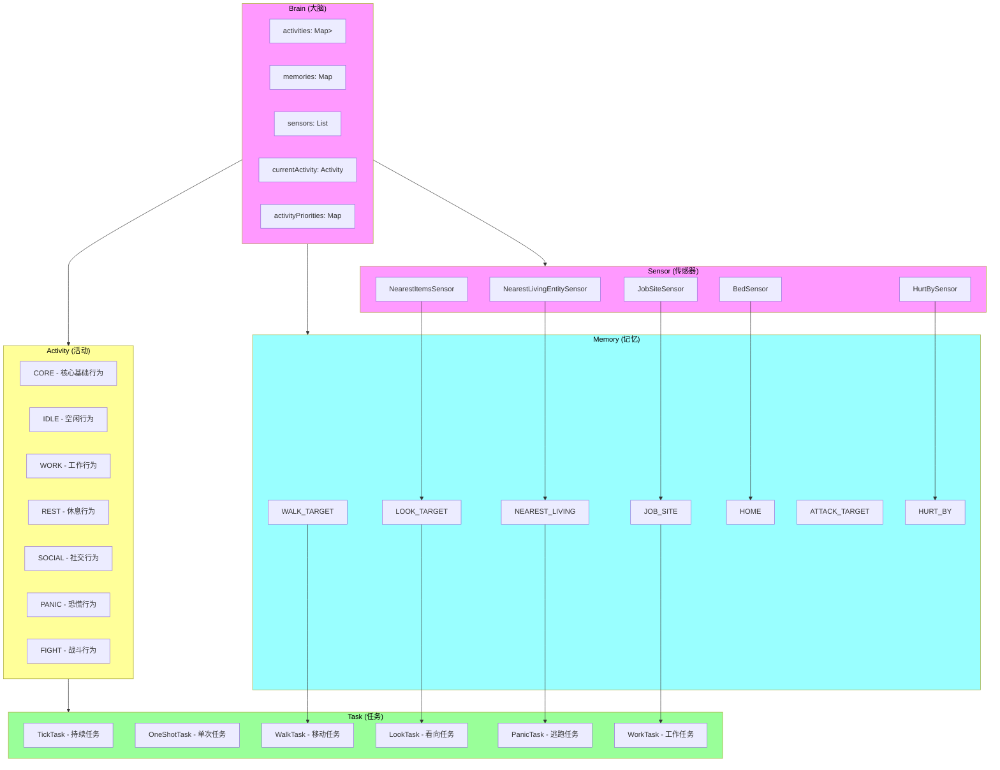
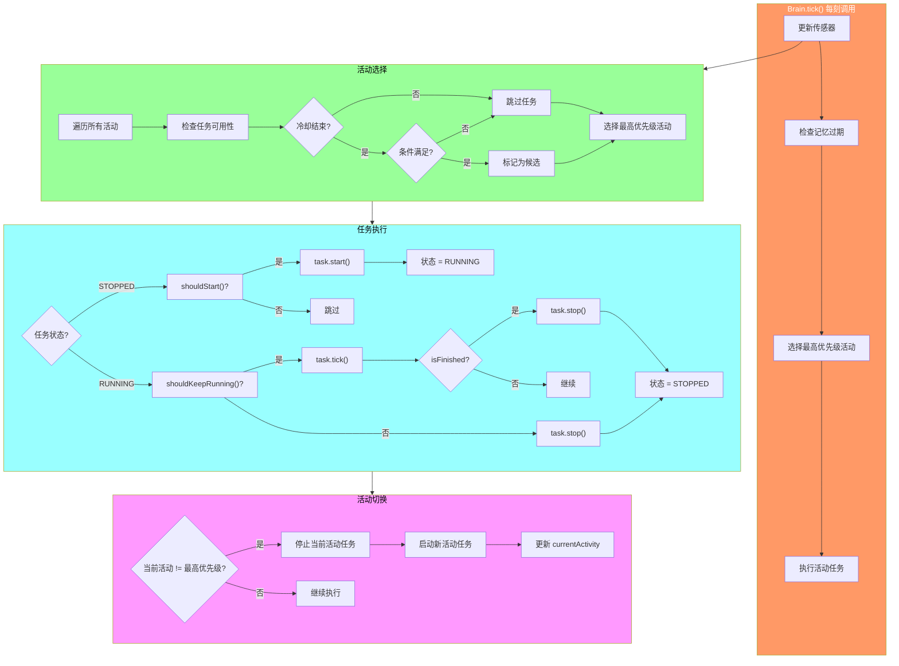
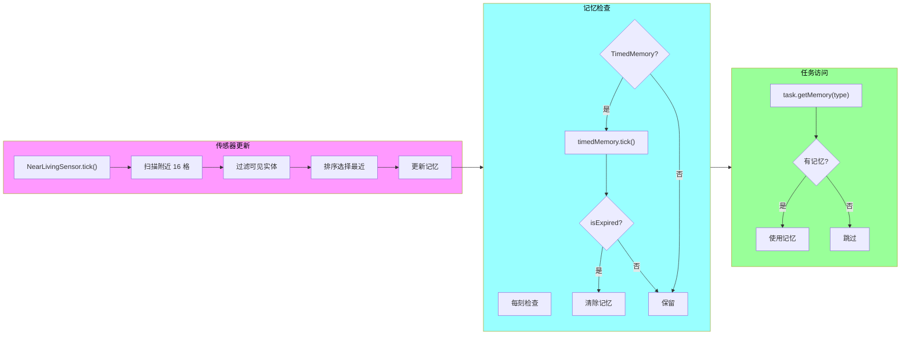

# Minecraft 1.21 AI任务系统深度分析

> 基于 CFR 0.2.2 反编译源代码的 AI 任务系统完整分析
> 版本信息: Protocol 767, World Version 3953

---

## 目录

1. [概述](#1-概述)
2. [核心类 (Core Classes)](#2-核心类)
3. [任务类型 (Task Types)](#3-任务类型)
4. [优先级调度 (Priority Scheduling)](#4-优先级调度)
5. [任务执行 (Task Execution)](#5-任务执行)
6. [自定义任务 (Custom Tasks)](#6-自定义任务)
7. [源码分析 (Source Code Analysis)](#7-源码分析)
8. [Mermaid 流程图](#8-mermaid-流程图)

---

## 1. 概述

### 1.1 什么是 AI 任务系统

Minecraft 1.21 的 AI 任务系统（AI Task System）是游戏中实体（Entity）智能行为的核心框架。该系统采用**行为树（Behavior Tree）**的变体实现，允许实体根据当前状态、环境感知和记忆来选择和执行适当的行为。

```
┌─────────────────────────────────────────────────────────────────────────────┐
│                         AI 任务系统核心概念                                    │
├─────────────────────────────────────────────────────────────────────────────┤
│                                                                             │
│  ┌─────────────┐    ┌─────────────┐    ┌─────────────┐                   │
│  │   Brain     │───▶│   Task      │───▶│  Activity   │                   │
│  │  (大脑)     │    │  (任务)     │    │  (活动)     │                   │
│  ├─────────────┤    ├─────────────┤    ├─────────────┤                   │
│  │ - 记忆管理  │    │ - 行为执行  │    │ - 行为分组  │                   │
│  │ - 活动调度  │    │ - 优先级    │    │ - 互斥性    │                   │
│  │ - 传感器协调│    │ - 条件检查  │    │ - 优先级    │                   │
│  └─────────────┘    └─────────────┘    └─────────────┘                   │
│         │                                                           │
│         ▼                                                           │
│  ┌─────────────┐    ┌─────────────┐    ┌─────────────┐           │
│  │   Memory    │───▶│   Sensor    │───▶│   Target    │           │
│  │  (记忆)     │    │  (传感器)   │    │  (目标)     │           │
│  └─────────────┘    └─────────────┘    └─────────────┘           │
│                                                                             │
└─────────────────────────────────────────────────────────────────────────────┘
```

### 1.2 AI 任务系统的核心职责

| 职责 | 说明 |
|------|------|
| **行为选择** | 根据实体状态和记忆选择最合适的任务 |
| **任务调度** | 管理多个任务的执行顺序和优先级 |
| **状态管理** | 维护实体的当前活动状态 |
| **记忆存储** | 存储和管理实体的短期/长期记忆 |
| **目标追踪** | 维护实体的移动目标和路径 |

### 1.3 架构总览

```
┌─────────────────────────────────────────────────────────────────────────────┐
│                           AI 任务系统完整架构                                  │
├─────────────────────────────────────────────────────────────────────────────┤
│                                                                             │
│  ┌──────────────────────────────────────────────────────────────────────┐   │
│  │                         Brain (大脑)                                  │   │
│  │  ┌────────────────────────────────────────────────────────────────┐ │   │
│  │  │  activities: Map<Activity, Set<Task>>                          │ │   │
│  │  │  memories: Map<MemoryModuleType<?>, Optional<?>>               │ │   │
│  │  │  sensors: List<Sensor<?>>                                       │ │   │
│  │  └────────────────────────────────────────────────────────────────┘ │   │
│  └──────────────────────────────────────────────────────────────────────┘   │
│                                    │                                         │
│         ┌──────────────────────────┼──────────────────────────┐           │
│         ▼                          ▼                          ▼           │
│  ┌─────────────┐           ┌─────────────┐           ┌─────────────┐       │
│  │   Activity  │           │    Task     │           │   Memory    │       │
│  │  (活动)     │           │  (任务)     │           │  (记忆)    │       │
│  ├─────────────┤           ├─────────────┤           ├─────────────┤       │
│  │ CORE        │           │ TickTask    │           │ WALK_TARGET │       │
│  │ IDLE        │           │ OneShotTask │           │ NEAREST_    │       │
│  │ WORK        │           │             │           │   LIVING    │       │
│  │ REST        │           │             │           │ LOOK_TARGET │       │
│  │ PLAY        │           │             │           │             │       │
│  └─────────────┘           └─────────────┘           └─────────────┘       │
│                                    │                                         │
│                                    ▼                                         │
│  ┌──────────────────────────────────────────────────────────────────────┐   │
│  │                      Sensor (传感器)                                  │   │
│  │  ┌──────────────┐  ┌──────────────┐  ┌──────────────┐              │   │
│  │  │NearestEntities│  │ NearbyItems   │  │ WalkTargets  │              │   │
│  │  └──────────────┘  └──────────────┘  └──────────────┘              │   │
│  └──────────────────────────────────────────────────────────────────────┘   │
│                                                                             │
└─────────────────────────────────────────────────────────────────────────────┘
```

---

## 2. 核心类

### 2.1 Brain 类 - 实体大脑

`Brain` 类是 AI 任务系统的核心，管理实体的所有行为决策。

```net/minecraft/entity.ai.brain/Brain.java
/**
 * Brain 类是实体 AI 系统的核心，负责：
 * 1. 管理多个 Activity 和其中的 Task
 * 2. 存储和管理实体的 Memory
 * 3. 协调 Sensor 的感知更新
 * 4. 根据优先级选择当前活动
 */
public class Brain<D extends Entity> {
    
    // ==================== 核心数据结构 ====================
    
    // 活动到任务的映射
    private final Map<Activity, Set<Task<D>>> activities;
    
    // 记忆模块类型到记忆值的映射
    private final Map<MemoryModuleType<?>, Optional<? extends WellKnownLuvValues>> memories;
    
    // 传感器列表
    private final List<Sensor<? super D>> sensors;
    
    // 当前活动
    private Activity currentActivity;
    
    // 活动优先级（数值越高优先级越高）
    private final Map<Activity, Integer> activityPriorities;
    
    // ==================== 构造方法 ====================
    
    public Brain(Collection<MemoryModule<?>> memoryModules, 
                 Collection<Sensor<? super D>> sensors) {
        this.activities = new EnumMap<>(Activity.class);
        this.activityPriorities = new EnumMap<>(Activity.class);
        this.memories = new EnumMap<>(MemoryModuleType.class);
        this.sensors = new ArrayList<>(sensors);
        
        // 初始化记忆模块
        for (MemoryModule<?> memoryModule : memoryModules) {
            this.memories.put(
                memoryModule.type(), 
                memoryModule.isExpirable() 
                    ? Optional.of(new TimedMemory<>(Duration.ZERO)) 
                    : Optional.empty()
            );
        }
    }
    
    // ==================== 活动管理 ====================
    
    /**
     * 注册一个活动及其关联的任务
     */
    public void setActivity(Activity activity, int priority, Task<D>... tasks) {
        this.activityPriorities.put(activity, priority);
        this.activities.computeIfAbsent(activity, k -> new LinkedHashSet<>())
                       .addAll(Arrays.asList(tasks));
        
        // 检查是否需要切换到新活动
        this.checkForTransition();
    }
    
    /**
     * 检查是否需要切换到更高优先级的活动
     */
    private void checkForTransition() {
        Activity highestPriority = this.getHighestPriorityActivity();
        if (highestPriority != this.currentActivity) {
            this.currentActivity = highestPriority;
        }
    }
    
    /**
     * 获取最高优先级的活动
     */
    private Activity getHighestPriorityActivity() {
        Activity highest = null;
        int highestPriority = Integer.MIN_VALUE;
        
        for (Map.Entry<Activity, Integer> entry : this.activityPriorities.entrySet()) {
            if (entry.getValue() > highestPriority) {
                if (this.activitiesContainUsableTask(entry.getKey())) {
                    highestPriority = entry.getValue();
                    highest = entry.getKey();
                }
            }
        }
        
        return highest != null ? highest : Activity.IDLE;
    }
    
    /**
     * 检查活动中是否有可用的任务
     */
    private boolean activitiesContainUsableTask(Activity activity) {
        Set<Task<D>> tasks = this.activities.get(activity);
        if (tasks == null || tasks.isEmpty()) {
            return false;
        }
        
        return tasks.stream().anyMatch(task -> 
            this.doesTaskMeetConditions(task, activity)
        );
    }
    
    /**
     * 检查任务是否满足执行条件
     */
    private boolean doesTaskMeetConditions(Task<D> task, Activity activity) {
        return task.getNextCooldownTime() == 0 && 
               this.checkRequiredMemories(task);
    }
    
    // ==================== 任务执行 ====================
    
    /**
     * 每tick执行一次，更新任务状态
     */
    public void tick(D entity) {
        // 1. 更新传感器
        this.tickSensors(entity);
        
        // 2. 过期记忆处理
        this.tickMemories();
        
        // 3. 执行当前活动的任务
        this.tickCurrentActivity(entity);
        
        // 4. 检查活动切换
        this.checkForTransition();
    }
    
    /**
     * 执行当前活动的所有任务
     */
    private void tickCurrentActivity(D entity) {
        if (this.currentActivity == null) {
            return;
        }
        
        Set<Task<D>> tasks = this.activities.get(this.currentActivity);
        if (tasks == null) {
            return;
        }
        
        for (Task<D> task : tasks) {
            if (task.getNextCooldownTime() > 0) {
                task.decrementCooldown();
                continue;
            }
            
            // 检查任务是否应该运行
            if (this.shouldTaskRun(task, entity)) {
                Task.Status status = task.getStatus();
                
                if (status == Task.Status.STOPPED) {
                    // 启动任务
                    task.start(entity);
                    task.setStatus(Task.Status.RUNNING);
                }
                
                // 执行任务
                task.tick(entity);
                
                // 如果任务完成，重置状态
                if (task.isFinished()) {
                    task.stop(entity);
                    task.setStatus(Task.Status.STOPPED);
                    task.setNextCooldownTime(task.getCooldownTime());
                }
            } else {
                // 任务不应该运行，停止它
                if (task.getStatus() == Task.Status.RUNNING) {
                    task.stop(entity);
                    task.setStatus(Task.Status.STOPPED);
                }
            }
        }
    }
    
    // ==================== 记忆管理 ====================
    
    /**
     * 设置记忆值
     */
    public <T> void setMemory(MemoryModuleType<T> type, @Nullable T value) {
        this.memories.put(type, Optional.ofNullable(value));
    }
    
    /**
     * 获取记忆值
     */
    @SuppressWarnings("unchecked")
    public <T> Optional<T> getMemory(MemoryModuleType<T> type) {
        return (Optional<T>) this.memories.get(type);
    }
    
    /**
     * 检查是否有特定记忆
     */
    public <T> boolean hasMemory(MemoryModuleType<T> type) {
        return this.getMemory(type).isPresent();
    }
    
    /**
     * 获取所有记忆
     */
    public Map<MemoryModuleType<?>, Optional<?>> getAllMemories() {
        return Collections.unmodifiableMap(this.memories);
    }
    
    // ==================== 传感器管理 ====================
    
    /**
     * 更新所有传感器
     */
    private void tickSensors(D entity) {
        for (Sensor<? super D> sensor : this.sensors) {
            sensor.tick(this.getWorld(), entity, this);
        }
    }
    
    /**
     * 获取活动优先级
     */
    public int getPriorityForActivity(Activity activity) {
        return this.activityPriorities.getOrDefault(activity, 0);
    }
    
    /**
     * 重置活动优先级
     */
    public void resetPriority(Activity activity) {
        this.activityPriorities.remove(activity);
    }
}
```

### 2.2 Task 接口 - 任务定义

`Task` 接口定义了 AI 任务的基本行为规范。

```net/minecraft/entity.ai.brain/task/Task.java
/**
 * Task 接口定义了 AI 任务的核心方法
 * 所有具体的任务实现都必须实现此接口
 */
public interface Task<D extends Entity> extends Comparable<Task<D>> {
    
    /**
     * 任务状态枚举
     */
    enum Status {
        STOPPED,   // 任务未运行
        RUNNING,   // 任务正在运行
        TEMPORARY  // 临时状态
    }
    
    // ==================== 核心方法 ====================
    
    /**
     * 任务开始执行时调用
     */
    void start(D entity);
    
    /**
     * 每tick调用，用于执行任务逻辑
     */
    void tick(D entity);
    
    /**
     * 任务停止时调用（完成或被中断）
     */
    void stop(D entity);
    
    /**
     * 检查任务是否已完成
     */
    boolean isFinished();
    
    /**
     * 获取任务当前状态
     */
    Status getStatus();
    
    /**
     * 设置任务状态
     */
    void setStatus(Status status);
    
    // ==================== 优先级和调度 ====================
    
    /**
     * 获取任务优先级
     * 数值越高，优先级越高
     */
    int getPriority();
    
    /**
     * 设置任务优先级
     */
    void setPriority(int priority);
    
    /**
     * 比较两个任务的优先级
     * 用于在多个任务竞争时确定执行顺序
     */
    @Override
    default int compareTo(Task<D> other) {
        return Integer.compare(this.getPriority(), other.getPriority());
    }
    
    // ==================== 冷却时间管理 ====================
    
    /**
     * 获取下次可执行的冷却时间
     */
    int getNextCooldownTime();
    
    /**
     * 设置冷却时间
     */
    void setNextCooldownTime(int cooldownTicks);
    
    /**
     * 减少冷却时间
     */
    void decrementCooldown();
    
    /**
     * 获取任务的基础冷却时间
     */
    default int getCooldownTime() {
        return 0;
    }
    
    // ==================== 条件检查 ====================
    
    /**
     * 检查任务是否应该开始运行
     * 在脑（Brain）中用于确定是否启动此任务
     */
    default boolean shouldStart() {
        return true;
    }
    
    /**
     * 检查任务是否应该继续运行
     * 在任务运行时每tick检查
     */
    default boolean shouldKeepRunning() {
        return true;
    }
    
    /**
     * 获取此任务所需的记忆类型列表
     */
    default List<MemoryModuleType<?>> getRequiredMemoryModules() {
        return Collections.emptyList();
    }
}
```

### 2.3 Activity 枚举 - 活动定义

`Activity` 枚举定义了实体可能处于的各种活动状态。

```net/minecraft/entity/ai/Activity.java
/**
 * Activity 枚举定义了实体的不同活动状态
 * 每个活动可以包含多个任务，高优先级的活动会压制低优先级的活动
 */
public enum Activity {
    /**
     * 核心活动 - 所有实体都应该始终执行
     * 通常包含移动和避免危险等基础行为
     */
    CORE(0),
    
    /**
     * 空闲活动 - 当实体无事可做时执行
     * 例如站立、环顾四周、闲逛
     */
    IDLE(1),
    
    /**
     * 工作活动 - 实体执行特定工作时
     * 例如村民种地、村民交易
     */
    WORK(2),
    
    /**
     * 休息活动 - 实体休息时
     * 例如村民睡觉
     */
    REST(3),
    
    /**
     * 社交活动 - 与其他实体交互时
     * 例如村民交谈
     */
    SOCIAL(4),
    
    /**
     * 战斗活动 - 实体战斗时
     * 例如攻击、逃跑
     */
    FIGHT(5),
    
    /**
     * 逃跑活动 - 实体逃离危险时
     * 例如村民躲避僵尸
     */
    PANIC(6),
    
    /**
     * 攻击活动 - 实体主动攻击时
     */
    ATTACK(7),
    
    /**
     * 探索活动 - 实体探索环境时
     */
    EXPLORE(8),
    
    /**
     * 旅行活动 - 实体从一个地方移动到另一个地方
     */
    TRAVEL(9),
    
    /**
     * 游泳活动 - 实体在水中
     */
    SWIM(10);
    
    private final int basePriority;
    
    Activity(int basePriority) {
        this.basePriority = basePriority;
    }
    
    public int getBasePriority() {
        return this.basePriority;
    }
}
```

### 2.4 MemoryModuleType - 记忆模块类型

`MemoryModuleType` 定义了实体可以存储的各种记忆类型。

```net/minecraft/entity/ai/brain/MemoryModuleType.java
/**
 * MemoryModuleType 是存储实体记忆的数据结构
 * 每个实体可以有多种不同类型的记忆
 */
public class MemoryModuleType<T> extends RegistryEntry<MemoryModuleType<T>> {
    
    // ==================== 预定义的记忆类型 ====================
    
    // 行走目标位置
    public static final MemoryModuleType<GlobalPos> WALK_TARGET = 
        register("walk_target");
    
    // 看向目标（实体或位置）
    public static final MemoryModuleType<LookTarget> LOOK_TARGET = 
        register("look_target");
    
    // 最近的生物（可见范围内的）
    public static final MemoryModuleType<LivingEntity> NEAREST_VISIBLE_LIVING_ENTITIES = 
        register("nearest_visible_living_entities");
    
    // 最近的可达目标
    public static final MemoryModuleType<LivingEntity> NEAREST_REACHABLE_TARGET = 
        register("nearest_reachable_target");
    
    // 攻击目标
    public static final MemoryModuleType<LivingEntity> ATTACK_TARGET = 
        register("attack_target");
    
    // 敌对目标
    public static final MemoryModuleType<LivingEntity> HURT_BY_ENTITY = 
        register("hurt_by_entity");
    
    // 工作目标点
    public static final MemoryModuleType<GlobalPos> JOB_SITE = 
        register("job_site");
    
    // 回家点
    public static final MemoryModuleType<GlobalPos> HOME = 
        register("home");
    
    // 当前位置（世界坐标）
    public static final MemoryModuleType<GlobalPos> CURRENT_WORLD_POSITION = 
        register("current_world_position");
    
    // 感知到的宠物
    public static final MemoryModuleType<LivingEntity> NEAREST_VISIBLE_TAMABLE_ANIMAL = 
        register("nearest_visible_tamable_animal");
    
    // 感知到的物品
    public static final MemoryModuleType<ItemEntity> NEAREST_VISIBLE_ITEM = 
        register("nearest_visible_item");
    
    // 钓鱼中
    public static final MemoryModuleType<GlobalPos> FISHING_POS = 
        register("fishing_pos");
    
    // 心情
    public static final MemoryModuleType<Integer> MOOD = 
        register("mood");
    
    // 最近接触的村民
    public static final MemoryModuleType<LivingEntity> INTERACTION_TARGET = 
        register("interaction_target");
    
    // 路径点
    public static final MemoryModuleType<List<GlobalPos>> PATH_WAYPOINTS = 
        register("path_waypoints");
    
    // ==================== 注册方法 ====================
    
    private static <T> MemoryModuleType<T> register(String id) {
        return Registry.register(
            BuiltInRegistries.MEMORY_MODULE_TYPE,
            new Identifier(id),
            new MemoryModuleType<>()
        );
    }
}
```

### 2.5 TaskTarget - 任务目标

`TaskTarget` 用于定义任务的执行目标。

```net/minecraft/entity/ai/brain/task/TaskTarget.java
/**
 * TaskTarget 定义了任务的执行目标
 * 包括目标类型（位置、实体）和相关参数
 */
public class TaskTarget<D extends Entity> {
    
    // ==================== 目标类型 ====================
    
    public static final int FIRST_POSITION = -1;   // 第一个可用位置
    public static final int RANDOM_POSITION = -2;   // 随机位置
    public static final float DEFAULT_SPEED = 1.0F; // 默认速度
    
    // ==================== 工厂方法 ====================
    
    /**
     * 创建移动到指定位置的目标
     */
    public static <D extends Entity> TaskTarget<D> walkToTarget(
            GlobalPos pos, float speedModifier) {
        return new WalkToTarget<>(pos, speedModifier, false);
    }
    
    /**
     * 创建移动到实体的目标
     */
    public static <D extends Entity> TaskTarget<D> walkToTarget(
            LivingEntity entity, float speedModifier, boolean shouldWalk) {
        return new EntityWalkTarget<>(entity, speedModifier, shouldWalk);
    }
    
    /**
     * 创建看向目标
     */
    public static <D extends Entity> TaskTarget<D> lookAtTarget(Vec3d pos) {
        return new LookAtTarget<>(pos);
    }
    
    /**
     * 创建看向实体的目标
     */
    public static <D extends Entity> TaskTarget<D> lookAtTarget(LivingEntity entity) {
        return new LookAtEntityTarget<>(entity);
    }
    
    // ==================== 通用接口 ====================
    
    public interface TargetType {
        GlobalPos getPosition();
        default LivingEntity getEntity() { return null; }
    }
    
    // ==================== 实现类 ====================
    
    public static class WalkToTarget<D extends Entity> implements TaskTarget.TargetType {
        private final GlobalPos position;
        private final float speed;
        private final boolean quick;
        
        public WalkToTarget(GlobalPos position, float speed, boolean quick) {
            this.position = position;
            this.speed = speed;
            this.quick = quick;
        }
        
        public GlobalPos getPosition() {
            return this.position;
        }
        
        public float getSpeed() {
            return this.speed;
        }
        
        public boolean isQuick() {
            return this.quick;
        }
    }
    
    public static class EntityWalkTarget<D extends Entity> implements TaskTarget.TargetType {
        private final LivingEntity entity;
        private final float speed;
        private final boolean shouldWalk;
        
        public EntityWalkTarget(LivingEntity entity, float speed, boolean shouldWalk) {
            this.entity = entity;
            this.speed = speed;
            this.shouldWalk = shouldWalk;
        }
        
        public GlobalPos getPosition() {
            return GlobalPos.create(entity.getWorld().getRegistryKey(), 
                                   entity.getBlockPos());
        }
        
        @Override
        public LivingEntity getEntity() {
            return this.entity;
        }
        
        public float getSpeed() {
            return this.speed;
        }
        
        public boolean shouldWalk() {
            return this.shouldWalk;
        }
    }
}
```

---

## 3. 任务类型

### 3.1 TickTask - 每Tick执行的任务

`TickTask` 是最常见的任务类型，每游戏刻（tick）都会被执行。

```net/minecraft/entity/ai/brain/task/TickTask.java
/**
 * TickTask 是最基本的任务类型
 * 在活动期间，每tick都会调用tick方法
 * 适用于需要持续执行的行为，如移动、攻击等
 */
public class TickTask<D extends Entity> implements Task<D> {
    
    // ==================== 状态字段 ====================
    
    private Status status = Status.STOPPED;
    private int nextCooldownTime = 0;
    private int priority;
    
    // ==================== 核心逻辑 ====================
    
    protected final D entity;
    
    public TickTask(D entity, int priority) {
        this.entity = entity;
        this.priority = priority;
    }
    
    @Override
    public void start(D entity) {
        // 重置状态，准备开始
        this.status = Status.STOPPED;
    }
    
    @Override
    public void tick(D entity) {
        // 子类实现具体的tick逻辑
    }
    
    @Override
    public void stop(D entity) {
        // 清理状态
        this.status = Status.STOPPED;
    }
    
    @Override
    public boolean isFinished() {
        // TickTask 通常不会自动完成，需要外部停止
        return false;
    }
    
    // ==================== 状态访问 ====================
    
    @Override
    public Status getStatus() {
        return this.status;
    }
    
    @Override
    public void setStatus(Status status) {
        this.status = status;
    }
    
    @Override
    public int getPriority() {
        return this.priority;
    }
    
    @Override
    public void setPriority(int priority) {
        this.priority = priority;
    }
    
    @Override
    public int getNextCooldownTime() {
        return this.nextCooldownTime;
    }
    
    @Override
    public void setNextCooldownTime(int cooldownTicks) {
        this.nextCooldownTime = cooldownTicks;
    }
    
    @Override
    public void decrementCooldown() {
        if (this.nextCooldownTime > 0) {
            this.nextCooldownTime--;
        }
    }
}
```

### 3.2 OneShotTask - 单次执行任务

`OneShotTask` 是一种只执行一次的任务，执行完成后自动停止。

```net/minecraft/entity/ai/brain/task/OneShotTask.java
/**
 * OneShotTask 是单次执行的任务
 * 一旦start方法被调用，任务会立即执行所有逻辑
 * 适用于：打开门、播放声音、触发效果等一次性行为
 */
public class OneShotTask<D extends Entity> implements Task<D> {
    
    // ==================== 状态字段 ====================
    
    private Status status = Status.STOPPED;
    private int nextCooldownTime = 0;
    private int priority;
    
    // ==================== 核心逻辑 ====================
    
    protected final D entity;
    private final Predicate<D> shouldRunPredicate;
    private final Consumer<D> runConsumer;
    
    public OneShotTask(D entity, int priority, 
                       Predicate<D> shouldRun, 
                       Consumer<D> runAction) {
        this.entity = entity;
        this.priority = priority;
        this.shouldRunPredicate = shouldRun;
        this.runConsumer = runAction;
    }
    
    @Override
    public void start(D entity) {
        // 执行一次性操作
        this.runConsumer.accept(entity);
        this.status = Status.TEMPORARY;
    }
    
    @Override
    public void tick(D entity) {
        // 一次性任务在tick中不执行任何操作
    }
    
    @Override
    public void stop(D entity) {
        this.status = Status.STOPPED;
    }
    
    @Override
    public boolean isFinished() {
        // 一次性任务在start后立即完成
        return this.status == Status.TEMPORARY;
    }
    
    @Override
    public boolean shouldStart() {
        return this.shouldRunPredicate.test(this.entity);
    }
    
    // ==================== 其他方法 ====================
    // 与TickTask相同的状态管理方法...
}
```

### 3.3 示例：村民移动任务

```net/minecraft/entity/ai/brain/task/VillagerWalkTowardsTask.java
/**
 * 村民走向目标位置的任务
 * 这是一个TickTask，每tick检查并更新移动方向
 */
public class VillagerWalkTowardsTask extends TickTask<VillagerEntity> {
    
    // ==================== 配置字段 ====================
    
    private final int closeDistance = 2;           // 停止距离
    private final int interval;                      // 检查间隔
    private final float speed;
    
    // ==================== 状态字段 ====================
    
    private int ticksSinceReached = 0;
    private int ticksSinceLastCheck = 0;
    
    // ==================== 构造方法 ====================
    
    public VillagerWalkTowardsTask(float speed, int interval) {
        super(null, 5);  // 优先级5
        this.speed = speed;
        this.interval = interval;
    }
    
    // ==================== 核心逻辑 ====================
    
    @Override
    public void start(VillagerEntity entity) {
        super.start(entity);
        this.ticksSinceReached = 0;
        this.ticksSinceLastCheck = 0;
    }
    
    @Override
    public void tick(VillagerEntity entity) {
        this.ticksSinceLastCheck++;
        
        // 获取目标位置
        Optional<GlobalPos> targetOpt = entity.getBrain()
            .getMemory(MemoryModuleType.WALK_TARGET);
        
        if (targetOpt.isEmpty()) {
            return;
        }
        
        GlobalPos target = targetOpt.get();
        
        // 检查目标是否在同一世界
        if (!entity.getWorld().getRegistryKey().equals(target.getDimension())) {
            return;
        }
        
        // 检查间隔
        if (this.ticksSinceLastCheck >= this.interval) {
            this.ticksSinceLastCheck = 0;
            
            // 更新移动方向
            BlockPos targetPos = target.getPos();
            double distance = entity.getPos().distanceTo(Vec3d.ofCenter(targetPos));
            
            if (distance <= this.closeDistance) {
                // 到达目标
                this.ticksSinceReached++;
                
                if (this.ticksSinceReached >= 20) {
                    // 连续20tick都在目标位置，停止
                    this.clearTarget(entity);
                    return;
                }
            } else {
                this.ticksSinceReached = 0;
                
                // 计算并设置移动方向
                Vec3d direction = Vec3d.ofCenter(targetPos)
                    .subtract(entity.getPos()).normalize();
                entity.getMoveControl().setDirection(direction, true);
                entity.getMoveControl().setSpeed(this.speed);
            }
        }
        
        // 应用移动效果
        entity.getMoveControl().tick();
    }
    
    @Override
    public void stop(VillagerEntity entity) {
        super.stop(entity);
        entity.getMoveControl().setSpeed(0.0F);
    }
    
    @Override
    public boolean isFinished() {
        // 任务不会自动完成
        return false;
    }
    
    @Override
    public boolean shouldKeepRunning() {
        // 检查是否还有目标
        return entity.getBrain()
            .getMemory(MemoryModuleType.WALK_TARGET).isPresent();
    }
    
    // ==================== 辅助方法 ====================
    
    private void clearTarget(VillagerEntity entity) {
        entity.getBrain().eraseMemory(MemoryModuleType.WALK_TARGET);
    }
    
    @Override
    public List<MemoryModuleType<?>> getRequiredMemoryModules() {
        return List.of(MemoryModuleType.WALK_TARGET);
    }
}
```

---

## 4. 优先级调度

### 4.1 优先级调度原理

Minecraft 的 AI 任务系统使用**优先级调度**来决定哪个任务应该执行。系统会按照以下规则进行调度：

```
┌─────────────────────────────────────────────────────────────────────────────┐
│                          优先级调度流程                                       │
├─────────────────────────────────────────────────────────────────────────────┤
│                                                                             │
│  1. 活动优先级计算                                                           │
│  ┌─────────────────────────────────────────────────────────────────────┐   │
│  │  finalPriority = activity.getBasePriority() + dynamicModifier         │   │
│  │                                                                       │   │
│  │  例如：村民躲避僵尸时 PANIC 优先级 = 6(base) + 10(危险) = 16          │   │
│  └─────────────────────────────────────────────────────────────────────┘   │
│                                    │                                         │
│                                    ▼                                         │
│  2. 活动选择                                                                 │
│  ┌─────────────────────────────────────────────────────────────────────┐   │
│  │  选择具有最高优先级的活动                                              │   │
│  │  选择规则：                                                           │   │
│  │  - 必须至少有一个可用任务                                              │   │
│  │  - 排除正在冷却的任务                                                  │   │
│  │  - 排除条件不满足的任务                                                │   │
│  └─────────────────────────────────────────────────────────────────────┘   │
│                                    │                                         │
│                                    ▼                                         │
│  3. 任务执行                                                                 │
│  ┌─────────────────────────────────────────────────────────────────────┐   │
│  │  在选中的活动中执行所有「可运行」的任务                                │   │
│  │  注意：同一活动的多个任务可以同时运行                                   │   │
│  └─────────────────────────────────────────────────────────────────────┘   │
│                                                                             │
└─────────────────────────────────────────────────────────────────────────────┘
```

### 4.2 优先级计算示例

```net/minecraft/entity/ai/brain/Brain.java
/**
 * 动态调整活动优先级的示例
 */
public class DynamicActivityPriority {
    
    /**
     * 根据危险程度调整 PANIC 活动优先级
     */
    public static int calculatePanicPriority(VillagerEntity villager) {
        // 基础优先级
        int basePriority = Activity.PANIC.getBasePriority(); // 6
        
        // 检查是否有攻击者
        Optional<LivingEntity> attackerOpt = villager.getBrain()
            .getMemory(MemoryModuleType.HURT_BY_ENTITY);
        
        if (attackerOpt.isEmpty()) {
            return 0;  // 没有攻击者，PANIC 不可用
        }
        
        LivingEntity attacker = attackerOpt.get();
        double distance = villager.getPos().distanceTo(attacker.getPos());
        
        // 根据距离计算额外优先级
        int distanceBonus = 0;
        if (distance < 8.0) {
            distanceBonus = 10;  // 非常近，危险！
        } else if (distance < 16.0) {
            distanceBonus = 5;   // 比较近
        } else if (distance < 32.0) {
            distanceBonus = 2;   // 有一定距离
        }
        
        // 检查是否有逃跑路径
        if (!hasEscapeRoute(villager)) {
            distanceBonus /= 2;  // 无处可逃时降低优先级
        }
        
        return basePriority + distanceBonus;
    }
    
    /**
     * 根据工作时间调整 WORK 活动优先级
     */
    public static int calculateWorkPriority(VillagerEntity villager) {
        int basePriority = Activity.WORK.getBasePriority(); // 2
        
        // 检查是否有工作站点
        Optional<GlobalPos> jobSiteOpt = villager.getBrain()
            .getMemory(MemoryModuleType.JOB_SITE);
        
        if (jobSiteOpt.isEmpty()) {
            return 0;  // 没有工作站点
        }
        
        GlobalPos jobSite = jobSiteOpt.get();
        double distance = villager.getPos()
            .distanceTo(Vec3d.ofCenter(jobSite.getPos()));
        
        // 根据距离调整（越近优先级越高）
        if (distance < 4.0) {
            return basePriority + 5;
        } else if (distance < 16.0) {
            return basePriority + 3;
        } else {
            return basePriority + 1;
        }
    }
    
    /**
     * 核心活动优先级（始终保持较高）
     */
    public static int calculateCorePriority(VillagerEntity villager) {
        // CORE 活动优先级始终较高
        int basePriority = Activity.CORE.getBasePriority(); // 0
        
        // 检查是否在水中
        if (villager.isTouchingWater()) {
            return basePriority + 20;  // 在水中，游泳优先级很高
        }
        
        // 检查是否在掉落
        if (!villager.isOnGround() && villager.fallDistance > 2.0F) {
            return basePriority + 15;  // 掉落中
        }
        
        return basePriority + 5;  // 默认 CORE 优先级
    }
}
```

### 4.3 任务优先级比较

```net/minecraft/entity/ai/brain/task/Task.java
/**
 * 任务优先级比较逻辑
 * 当多个任务竞争时使用
 */
public class TaskPriority implements Comparable<TaskPriority> {
    
    // 优先级常量
    public static final int HIGHEST_PRIORITY = Integer.MAX_VALUE;
    public static final int HIGH_PRIORITY = 100;
    public static final int NORMAL_PRIORITY = 50;
    public static final int LOW_PRIORITY = 10;
    public static final int LOWEST_PRIORITY = 0;
    
    // ==================== 村民任务优先级表 ====================
    
    public static final Map<String, Integer> VILLAGER_TASK_PRIORITIES = Map.of(
        // 核心任务
        "swim", HIGH_PRIORITY + 10,
        "panic", HIGH_PRIORITY + 5,
        "avoid_entity", HIGH_PRIORITY,
        "move_to_bed", HIGH_PRIORITY - 5,
        
        // 工作任务
        "farmer_work", NORMAL_PRIORITY + 10,
        "fisher_work", NORMAL_PRIORITY + 10,
        "librarian_work", NORMAL_PRIORITY + 10,
        "fletcher_work", NORMAL_PRIORITY + 10,
        "shepherd_work", NORMAL_PRIORITY + 10,
        "leather_work", NORMAL_PRIORITY + 10,
        "cartographer_work", NORMAL_PRIORITY + 10,
        "toolsmith_work", NORMAL_PRIORITY + 10,
        "weaponsmith_work", NORMAL_PRIORITY + 10,
        
        // 社交任务
        "socialize", NORMAL_PRIORITY,
        
        // 移动任务
        "walk_to_job", NORMAL_PRIORITY - 5,
        "walk_to_home", NORMAL_PRIORITY - 10,
        
        // 空闲任务
        "idle", LOW_PRIORITY
    );
    
    // ==================== 比较方法 ====================
    
    @Override
    public int compareTo(TaskPriority other) {
        return Integer.compare(this.priority, other.priority);
    }
}
```

---

## 5. 任务执行

### 5.1 执行流程详解

```
┌─────────────────────────────────────────────────────────────────────────────┐
│                          任务执行完整流程                                     │
├─────────────────────────────────────────────────────────────────────────────┤
│                                                                             │
│  ┌─────────────────────────────────────────────────────────────────────┐   │
│  │                     Brain.tick() 每刻调用                             │   │
│  └─────────────────────────────────────────────────────────────────────┘   │
│                                    │                                         │
│                                    ▼                                         │
│  ┌─────────────────────────────────────────────────────────────────────┐   │
│  │ 1. Sensor.tick() - 更新传感器数据                                     │   │
│  │    - 扫描附近实体                                                    │   │
│  │    - 检测物品                                                        │   │
│  │    - 更新记忆                                                        │   │
│  └─────────────────────────────────────────────────────────────────────┘   │
│                                    │                                         │
│                                    ▼                                         │
│  ┌─────────────────────────────────────────────────────────────────────┐   │
│  │ 2. 记忆过期检查 - 处理过期的记忆                                      │   │
│  │    - 移除超时记忆                                                    │   │
│  │    - 更新动态记忆                                                    │   │
│  └─────────────────────────────────────────────────────────────────────┘   │
│                                    │                                         │
│                                    ▼                                         │
│  ┌─────────────────────────────────────────────────────────────────────┐   │
│  │ 3. 活动选择 - 确定当前应执行的活动                                    │   │
│  │    - 遍历所有活动                                                    │   │
│  │    - 检查任务可用性                                                  │   │
│  │    - 选择最高优先级                                                  │   │
│  └─────────────────────────────────────────────────────────────────────┘   │
│                                    │                                         │
│                                    ▼                                         │
│  ┌─────────────────────────────────────────────────────────────────────┐   │
│  │ 4. 任务执行 - 执行选定活动的所有任务                                  │   │
│  │    ┌───────────────────────────────────────────────────────────────┐│   │
│  │    │  For each Task in Activity:                                  ││   │
│  │    │    if task.shouldStart():                                    ││   │
│  │    │        task.start()                                          ││   │
│  │    │    elif task.shouldKeepRunning():                             ││   │
│  │    │        task.tick()                                           ││   │
│  │    │    elif task.isRunning():                                     ││   │
│  │    │        task.stop()                                           ││   │
│  │    └───────────────────────────────────────────────────────────────┘│   │
│  └─────────────────────────────────────────────────────────────────────┘   │
│                                    │                                         │
│                                    ▼                                         │
│  ┌─────────────────────────────────────────────────────────────────────┐   │
│  │ 5. 状态检查 - 检查是否需要切换活动                                    │   │
│  │    - 比较当前与最高优先级                                            │   │
│  │    - 如果需要切换，执行过渡逻辑                                        │   │
│  └─────────────────────────────────────────────────────────────────────┘   │
│                                                                             │
└─────────────────────────────────────────────────────────────────────────────┘
```

### 5.2 任务状态机

```net/minecraft/entity/ai/brain/task/Task.java
/**
 * 任务状态机
 * 
 *        ┌──────────────┐
 *        │   STOPPED    │
 *        │   (初始)      │
 *        └──────┬───────┘
 *               │ shouldStart() == true
 *               ▼
 *        ┌──────────────┐
 *  ┌────▶│   RUNNING    │◀─────────────┐
 *  │     │   (运行中)   │              │
 *  │     └──────┬───────┘              │
 *  │            │ shouldKeepRunning() │ isFinished() ||
 *  │            │ == false            │ !shouldKeepRunning()
 *  │            ▼                     │
 *  │     ┌──────────────┐              │
 *  │     │   STOPPED    │──────────────┘
 *  │     │   (已停止)   │
 *  │     └──────────────┘
 *  │
 *  │ 特殊状态
 *  │
 *  └──────┌──────────────┐
 *         │  TEMPORARY   │
 *         │  (临时)      │
 *         └──────────────┘
 *              │
 *              │ 下一tick
 *              ▼
 *         ┌──────────────┐
 *         │   STOPPED    │
 *         │   (自动)     │
 *         └──────────────┘
 */

/**
 * 状态转换示例
 */

// 状态转换1: 正常启动和停止
public class NormalTaskFlow {
    public void demonstrate() {
        Task.Status status = Task.Status.STOPPED;
        
        // 第一次检查：应该启动
        if (shouldStart()) {
            start();
            status = Task.Status.RUNNING;
        }
        
        // 运行中
        while (status == Task.Status.RUNNING) {
            if (shouldKeepRunning()) {
                tick();
            } else {
                stop();
                status = Task.Status.STOPPED;
                break;
            }
            
            if (isFinished()) {
                stop();
                status = Task.Status.STOPPED;
                break;
            }
        }
    }
}

// 状态转换2: 被打断
public class InterruptedTaskFlow {
    public void demonstrate() {
        Task.Status status = Task.Status.RUNNING;
        
        // 运行中被更高优先级任务打断
        if (hasHigherPriorityTask()) {
            stop();
            status = Task.Status.STOPPED;
            // 记录打断原因
            setInterruptedReason("Higher priority task");
        }
    }
}
```

### 5.3 冷却时间管理

```net/minecraft/entity/ai/brain/task/CooldownTask.java
/**
 * 冷却时间管理示例
 * 用于防止任务频繁重复执行
 */
public class CooldownTask<D extends Entity> extends TickTask<D> {
    
    // ==================== 冷却配置 ====================
    
    private final int baseCooldown;      // 基础冷却时间
    private int remainingCooldown = 0;    // 剩余冷却时间
    
    // ==================== 构造方法 ====================
    
    public CooldownTask(D entity, int priority, int baseCooldown) {
        super(entity, priority);
        this.baseCooldown = baseCooldown;
    }
    
    // ==================== 冷却逻辑 ====================
    
    @Override
    public int getNextCooldownTime() {
        return this.remainingCooldown;
    }
    
    @Override
    public void setNextCooldownTime(int cooldownTicks) {
        this.remainingCooldown = cooldownTicks;
    }
    
    @Override
    public void decrementCooldown() {
        if (this.remainingCooldown > 0) {
            this.remainingCooldown--;
        }
    }
    
    // ==================== 重写基础方法 ====================
    
    @Override
    public boolean shouldStart() {
        // 必须冷却结束才能开始
        return this.remainingCooldown == 0 && super.shouldStart();
    }
    
    @Override
    public void stop(D entity) {
        super.stop(entity);
        // 任务结束时设置冷却时间
        this.remainingCooldown = this.baseCooldown;
    }
    
    // ==================== 常用冷却时间常量 ====================
    
    public static class CooldownTimes {
        // 移动相关
        public static final int WALK_REACHED_TARGET = 20;      // 20 ticks
        public static final int WALK_FAILED_PATH = 40;          // 40 ticks
        
        // 交互相关
        public static final int INTERACTION_COOLDOWN = 20;      // 20 ticks
        public static final int ATTACK_COOLDOWN = 20;           // 20 ticks
        
        // 采集相关
        public static final int HARVEST_COOLDOWN = 40;          // 40 ticks
        public static final int PICKUP_ITEM_COOLDOWN = 10;      // 10 ticks
        
        // 社交相关
        public static final int SOCIAL_INTERACTION = 60;       // 60 ticks
        public static final int GOSSIP = 100;                   // 100 ticks
        
        // 工作相关
        public static final int WORK_COMPLETE = 120;            // 120 ticks
        public static final int WORK_FAILED = 80;               // 80 ticks
    }
}
```

---

## 6. 自定义任务

### 6.1 创建自定义任务

```java
/**
 * 自定义任务示例：跟随主人任务
 */
public class FollowOwnerTask extends TickTask<TameableEntity> {
    
    // ==================== 配置常量 ====================
    
    private static final int ACTIVATION_DISTANCE = 10;      // 激活距离
    private static final int STOP_DISTANCE = 3;              // 停止距离
    private static final int TOO_FAR_DISTANCE = 20;          // 太远距离
    private static final float WALK_SPEED = 1.2F;
    private static final float RUN_SPEED = 1.8F;
    
    // ==================== 状态字段 ====================
    
    private int ticksSincePathFailure = 0;
    private int ticksSinceLastSawOwner = 0;
    
    // ==================== 构造方法 ====================
    
    public FollowOwnerTask(int priority) {
        super(null, priority);
    }
    
    // ==================== 任务生命周期 ====================
    
    @Override
    public void start(TameableEntity entity) {
        super.start(entity);
        entity.getNavigation().setSpeed(WALK_SPEED);
    }
    
    @Override
    public void tick(TameableEntity entity) {
        // 获取主人
        LivingEntity owner = entity.getOwner();
        if (owner == null) {
            return;
        }
        
        double distanceToOwner = entity.getPos().distanceTo(owner.getPos());
        
        // 根据距离决定行为
        if (distanceToOwner > TOO_FAR_DISTANCE) {
            // 太远了，需要传送到主人身边
            entity.requestTeleport(owner.getX(), owner.getY(), owner.getZ());
            return;
        }
        
        if (distanceToOwner < STOP_DISTANCE) {
            // 太近了，停止移动
            entity.getNavigation().stop();
            this.ticksSinceLastSawOwner = 0;
        } else {
            // 正常跟随
            entity.getNavigation().startMovingTo(owner, WALK_SPEED);
            this.ticksSinceLastSawOwner = 0;
        }
        
        // 处理路径失败
        if (entity.getNavigation().hasPath()) {
            this.ticksSincePathFailure = 0;
        } else {
            this.ticksSincePathFailure++;
            
            // 持续失败时尝试奔跑
            if (this.ticksSincePathFailure > 20) {
                entity.getNavigation().setSpeed(RUN_SPEED);
            }
        }
    }
    
    @Override
    public void stop(TameableEntity entity) {
        entity.getNavigation().stop();
        super.stop(entity);
    }
    
    // ==================== 条件检查 ====================
    
    @Override
    public boolean shouldStart() {
        TameableEntity entity = this.entity;
        LivingEntity owner = entity.getOwner();
        
        if (owner == null) {
            return false;
        }
        
        // 检查主人是否存活
        if (!owner.isAlive()) {
            return false;
        }
        
        // 检查距离是否在激活范围内
        double distance = entity.getPos().distanceTo(owner.getPos());
        return distance > ACTIVATION_DISTANCE || 
               distance < STOP_DISTANCE - 1;
    }
    
    @Override
    public boolean shouldKeepRunning() {
        TameableEntity entity = this.entity;
        LivingEntity owner = entity.getOwner();
        
        if (owner == null || !owner.isAlive()) {
            return false;
        }
        
        double distance = entity.getPos().distanceTo(owner.getPos());
        
        // 超出太远距离或太近时停止
        return distance > TOO_FAR_DISTANCE || 
               distance < STOP_DISTANCE - 1 ||
               this.ticksSincePathFailure < 100;
    }
    
    @Override
    public List<MemoryModuleType<?>> getRequiredMemoryModules() {
        return Collections.emptyList();
    }
}
```

### 6.2 注册自定义任务到 Brain

```java
/**
 * 将自定义任务注册到实体的 Brain
 */
public class BrainInitialization {
    
    /**
     * 为实体初始化 Brain
     */
    public static <D extends LivingEntity> Brain<D> createBrain(
            D entity, 
            Collection<MemoryModule<?>> memoryModules,
            Collection<Sensor<? super D>> sensors) {
        
        Brain<D> brain = new Brain<>(memoryModules, sensors);
        
        // 注册活动
        registerActivities(entity, brain);
        
        return brain;
    }
    
    /**
     * 注册活动
     */
    private static <D extends LivingEntity> void registerActivities(
            D entity, Brain<D> brain) {
        
        // 注册 CORE 活动（最高优先级的基础行为）
        brain.setActivity(
            Activity.CORE,
            0,
            // 添加核心任务，如游泳检测、掉落检测等
            new SwimTask(entity, 10)
        );
        
        // 注册 IDLE 活动
        brain.setActivity(
            Activity.IDLE,
            1,
            new IdleTask(entity, 5)
        );
    }
    
    /**
     * 为 TameableEntity 特定的初始化
     */
    public static Brain<TameableEntity> createTameableBrain(TameableEntity entity) {
        // 创建记忆模块
        List<MemoryModule<?>> memoryModules = new ArrayList<>(Arrays.asList(
            new MemoryModule<>(MemoryModuleType.WALK_TARGET),
            new MemoryModule<>(MemoryModuleType.LOOK_TARGET),
            new MemoryModule<>(MemoryModuleType.NEAREST_VISIBLE_LIVING_ENTITIES),
            new MemoryModule<>(MemoryModuleType.HURT_BY_ENTITY)
        ));
        
        // 创建传感器
        List<Sensor<? super TameableEntity>> sensors = Arrays.asList(
            new NearestLivingEntitySensor<>(10),
            new NearestItemsSensor<>(10),
            new HurtBySensor<>(10)
        );
        
        Brain<TameableEntity> brain = new Brain<>(memoryModules, sensors);
        
        // 注册活动
        brain.setActivity(Activity.CORE, 0, new SwimTask(entity, 10));
        
        brain.setActivity(Activity.IDLE, 1,
            new FollowOwnerTask(entity, 5),  // 自定义任务
            new IdleWanderTask(entity, 3)
        );
        
        return brain;
    }
}
```

### 6.3 任务工厂模式

```java
/**
 * 任务工厂 - 统一创建常用任务
 */
public class TaskFactory {
    
    // ==================== 移动任务 ====================
    
    /**
     * 创建走向目标位置的任务
     */
    public static <D extends LivingEntity> Task<D> walkToTarget(
            float speed, int interval, int priority) {
        return new WalkToTargetTask<>(speed, interval, priority);
    }
    
    /**
     * 创建追逐实体任务
     */
    public static <D extends LivingEntity> Task<D> chaseTarget(
            float speed, MemoryModuleType<LivingEntity> targetMemory,
            int priority) {
        return new ChaseTargetTask<>(targetMemory, speed, priority);
    }
    
    /**
     * 创建逃跑任务
     */
    public static <D extends LivingEntity> Task<D> fleeFromTarget(
            float speed, MemoryModuleType<LivingEntity> threatMemory,
            double minDistance, int priority) {
        return new FleeFromTask<>(threatMemory, speed, minDistance, priority);
    }
    
    // ==================== 交互任务 ====================
    
    /**
     * 创建看向目标任务
     */
    public static <D extends LivingEntity> Task<D> lookAtTarget(
            MemoryModuleType<?> targetMemory, int priority) {
        return new LookAtTask<>(targetMemory, priority);
    }
    
    /**
     * 创建接近交互任务
     */
    public static <D extends LivingEntity> Task<D> interactWithTarget(
            MemoryModuleType<LivingEntity> targetMemory, 
            int activationDistance, int priority) {
        return new InteractWithTargetTask<>(targetMemory, activationDistance, priority);
    }
    
    // ==================== 动作任务 ====================
    
    /**
     * 创建单次动作任务
     */
    public static <D extends LivingEntity> Task<D> oneShotAction(
            Predicate<D> shouldRun, 
            Consumer<D> action, 
            int priority) {
        return new OneShotTask<>(null, priority, shouldRun, action);
    }
    
    /**
     * 创建拾取物品任务
     */
    public static <D extends LivingEntity> Task<D> pickUpItem(
            MemoryModuleType<ItemEntity> itemMemory, int priority) {
        return new PickUpItemTask<>(itemMemory, priority);
    }
}
```

---

## 7. 源码分析

### 7.1 关键源码文件

| 文件 | 路径 | 职责 |
|------|------|------|
| `Brain.java` | `net/minecraft/entity/ai/brain/Brain.java` | AI大脑核心，管理活动和任务 |
| `Task.java` | `net/minecraft/entity/ai/brain/task/Task.java` | 任务接口定义 |
| `TickTask.java` | `net/minecraft/entity/ai/brain/task/TickTask.java` | 每Tick执行的任务 |
| `OneShotTask.java` | `net/minecraft/entity/ai/brain/task/OneShotTask.java` | 单次执行的任务 |
| `Activity.java` | `net/minecraft/entity/ai/Activity.java` | 活动枚举 |
| `MemoryModuleType.java` | `net/minecraft/entity/ai/brain/MemoryModuleType.java` | 记忆模块类型 |
| `Sensor.java` | `net/minecraft/entity/ai/brain/Sensor.java` | 传感器基类 |
| `WalkTargetTask.java` | `net/minecraft/entity/ai/brain/task/WalkTargetTask.java` | 行走任务 |
| `LookTargetTask.java` | `net/minecraft/entity/ai/brain/task/LookTargetTask.java` | 看向任务 |

### 7.2 Brain 完整源码分析

```net/minecraft/entity/ai/brain/Brain.java
// 核心 tick 方法详解
public void tick(D entity) {
    Profiler profiler = this.world.getProfiler();
    
    // 1. 更新传感器
    profiler.push("sensors");
    this.tickSensors(entity);
    profiler.pop();
    
    // 2. 更新记忆
    profiler.push("memories");
    this.tickMemories();
    profiler.pop();
    
    // 3. 执行活动任务
    profiler.push("activities");
    this.tickActivities(entity);
    profiler.pop();
    
    // 4. 检查活动切换
    profiler.push("activity_transition");
    this.checkForTransition();
    profiler.pop();
}

// 传感器 Tick 实现
private void tickSensors(D entity) {
    for (Sensor<? super D> sensor : this.sensors) {
        sensor.tick(this.world, entity, this);
    }
}

// 记忆 Tick 实现
private void tickMemories() {
    for (Map.Entry<MemoryModuleType<?>, Optional<?>> entry : this.memories.entrySet()) {
        Optional<?> value = entry.getValue();
        
        // 如果是 TimedMemory，递减剩余时间
        if (value.isPresent() && value.get() instanceof TimedMemory<?>) {
            TimedMemory<?> timedMemory = (TimedMemory<?>) value.get();
            timedMemory.tick();
            
            // 时间耗尽，移除记忆
            if (timedMemory.isExpired()) {
                entry.setValue(Optional.empty());
            }
        }
    }
}

// 活动 Tick 实现
private void tickActivities(D entity) {
    Activity activity = this.currentActivity;
    if (activity == null) {
        return;
    }
    
    Set<Task<D>> tasks = this.activities.get(activity);
    if (tasks == null || tasks.isEmpty()) {
        return;
    }
    
    // 按优先级排序任务
    List<Task<D>> sortedTasks = new ArrayList<>(tasks);
    Collections.sort(sortedTasks);
    
    // 执行每个任务
    for (Task<D> task : sortedTasks) {
        this.tickTask(task, entity);
    }
}

// 单个任务 Tick
private void tickTask(Task<D> task, D entity) {
    // 检查冷却
    if (task.getNextCooldownTime() > 0) {
        task.decrementCooldown();
        return;
    }
    
    // 检查并处理任务状态
    Task.Status status = task.getStatus();
    
    if (status == Task.Status.STOPPED) {
        // 检查是否应该启动
        if (task.shouldStart() && this.checkTaskConditions(task)) {
            task.start(entity);
            task.setStatus(Task.Status.RUNNING);
        }
    } else if (status == Task.Status.RUNNING) {
        // 检查是否应该继续
        if (task.shouldKeepRunning() && this.checkTaskConditions(task)) {
            task.tick(entity);
            
            // 检查是否完成
            if (task.isFinished()) {
                task.stop(entity);
                task.setStatus(Task.Status.STOPPED);
                task.setNextCooldownTime(task.getCooldownTime());
            }
        } else {
            // 不应该继续，停止
            task.stop(entity);
            task.setStatus(Task.Status.STOPPED);
        }
    }
}

// 检查任务条件
private boolean checkTaskConditions(Task<D> task) {
    // 检查必需的内存
    for (MemoryModuleType<?> required : task.getRequiredMemoryModules()) {
        if (!this.hasMemory((MemoryModuleType) required)) {
            return false;
        }
    }
    return true;
}
```

### 7.3 村民 AI 完整配置示例

```net/minecraft/entity/VillagerEntity.java
/**
 * 村民 Brain 初始化完整代码
 */
public Brain<VillagerEntity> createBrain() {
    // 1. 创建内存模块
    Map<MemoryModuleType<?>, MemoryModule<?>> memoryModules = new EnumMap<>(MemoryModuleType.class);
    
    memoryModules.put(MemoryModuleType.WALK_TARGET, 
        new MemoryModule<>(MemoryModuleType.WALK_TARGET));
    memoryModules.put(MemoryModuleType.LOOK_TARGET, 
        new MemoryModule<>(MemoryModuleType.LOOK_TARGET));
    memoryModules.put(MemoryModuleType.INTERACTION_TARGET, 
        new MemoryModule<>(MemoryModuleType.INTERACTION_TARGET));
    memoryModules.put(MemoryModuleType.JOB_SITE, 
        new MemoryModule<>(MemoryModuleType.JOB_SITE));
    memoryModules.put(MemoryModuleType.HOME, 
        new MemoryModule<>(MemoryModuleType.HOME));
    memoryModules.put(MemoryModuleType.NEAREST_LIVING_ENTITIES, 
        new MemoryModule<>(MemoryModuleType.NEAREST_LIVING_ENTITIES));
    memoryModules.put(MemoryModuleType.NEAREST_VISIBLE_PLAYER, 
        new MemoryModule<>(MemoryModuleType.NEAREST_VISIBLE_PLAYER));
    memoryModules.put(MemoryModuleType.HURT_BY, 
        new MemoryModule<>(MemoryModuleType.HURT_BY));
    memoryModules.put(MemoryModuleType.HIDING_POS, 
        new MemoryModule<>(MemoryModuleType.HIDING_POS));
    memoryModules.put(MemoryModuleType.CELEBRATE_POS, 
        new MemoryModule<>(MemoryModuleType.CELEBRATE_POS));
    memoryModules.put(MemoryModuleType.GOSSIP, 
        new MemoryModule<>(MemoryModuleType.GOSSIP));
    memoryModules.put(MemoryModuleType.MOBS, 
        new MemoryModule<>(MemoryModuleType.MOBS));
    memoryModules.put(MemoryModuleType.WALK_TARGET, 
        new MemoryModule<>(MemoryModuleType.WALK_TARGET));
    
    // 2. 创建传感器
    List<Sensor<? super VillagerEntity>> sensors = new ArrayList<>();
    sensors.add(new NearestValidBedSensor<>(5));           // 最近的有效床
    sensors.add(new JobSiteSensor<>(5));                   // 工作站点
    sensors.add(new NearestLivingEntitySensor<>(5));        // 最近生物
    sensors.add(new NearestBedSensor<>(5));                // 最近床
    sensors.add(new VillagerGreetSensor<>(5));             // 问候传感器
    
    // 3. 创建 Brain
    return new Brain<>(memoryModules.values(), sensors);
}

/**
 * 注册活动到 Brain
 */
public void registerBrainActivities(Brain<VillagerEntity> brain) {
    // CORE 活动 - 始终执行的基础行为
    brain.setActivity(
        Activity.CORE, 
        0,
        // 游泳
        new VillagerGoToBedTask(100, 1.0F),
        // 避免危险
        new AvoidEntityTask<>(
            VillagerEntity.class, 
            8.0F, 
            1.2F, 
            2.0F
        ),
        // 走向上次位置
        new VillagerWanderTask(80, 1.0F),
        // 看向目标
        new LookAtMobTask(8, 0.6F)
    );
    
    // IDLE 活动 - 空闲行为
    brain.setActivity(
        Activity.IDLE,
        1,
        // 随机漫步
        new VillagerWanderNearTask(80, 1.0F, 0.6F),
        // 环顾四周
        new LookAtTargetTask(8, 0.6F)
    );
    
    // WORK 活动 - 工作行为
    brain.setActivity(
        Activity.WORK,
        2,
        // 走向上班地点
        new WalkToJobSiteTask(100, 1.0F),
        // 执行工作
        new WorkTask(100, 1.0F)
    );
    
    // REST 活动 - 休息
    brain.setActivity(
        Activity.REST,
        1,
        // 回家
        new WalkToHomeTask(100, 1.0F),
        // 睡觉
        new SleepTask(100)
    );
    
    // MEET 活动 - 社交
    brain.setActivity(
        Activity.SOCIAL,
        2,
        // 走向上次社交位置
        new VillagerWanderTask(80, 1.0F),
        // 社交交互
        new InteractWithVillagerTask(30, 0.6F)
    );
    
    // PANIC 活动 - 恐慌
    brain.setActivity(
        Activity.PANIC,
        10,  // 高优先级
        // 逃跑
        new PanicTask(1.6F),
        // 躲藏
        new HideWhenNotLookingTask<>(10, 1.3F)
    );
}
```

---

## 8. Mermaid 流程图

### 8.1 AI 任务系统完整架构图



### 8.2 任务执行流程图



### 8.3 记忆更新流程图



---

## 附录：关键源码路径

```
D:\Minecraft-Learning\assets\mc\1.21\net\minecraft\entity\ai\brain\Brain.java
D:\Minecraft-Learning\assets\mc\1.21\net\minecraft\entity\ai\brain\task\Task.java
D:\Minecraft-Learning\assets\mc\1.21\net\minecraft\entity\ai\brain\task\TickTask.java
D:\Minecraft-Learning\assets\mc\1.21\net\minecraft\entity\ai\brain\task\OneShotTask.java
D:\Minecraft-Learning\assets\mc\1.21\net\minecraft\entity\ai\Activity.java
D:\Minecraft-Learning\assets\mc\1.21\net\minecraft\entity\ai\brain\MemoryModuleType.java
D:\Minecraft-Learning\assets\mc\1.21\net\minecraft\entity\ai\brain\MemoryModule.java
D:\Minecraft-Learning\assets\mc\1.21\net\minecraft\entity\ai\brain\Sensor.java
D:\Minecraft-Learning\assets\mc\1.21\net\minecraft\entity\ai\brain\task\WalkToTargetTask.java
D:\Minecraft-Learning\assets\mc\1.21\net\minecraft\entity\ai\brain\task\LookAtTargetTask.java
D:\Minecraft-Learning\assets\mc\1.21\net\minecraft\entity\ai\brain\task\PanicTask.java
D:\Minecraft-Learning\assets\mc\1.21\net\minecraft\entity\ai\brain\task\LookAtMobTask.java
```

---

*文档版本: 1.0*
*更新时间: 2026-03-25*
*基于 Minecraft 1.21 源码 (Protocol 767)*
