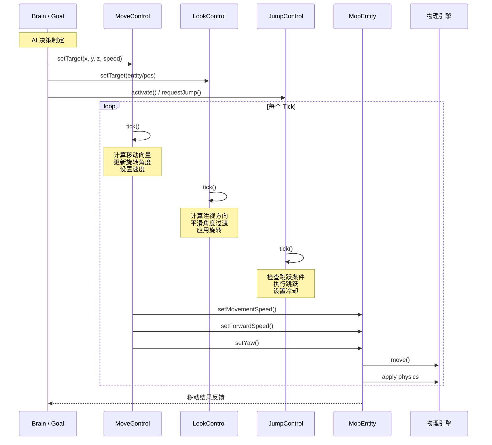
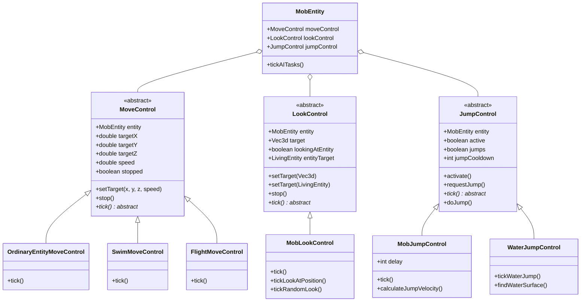
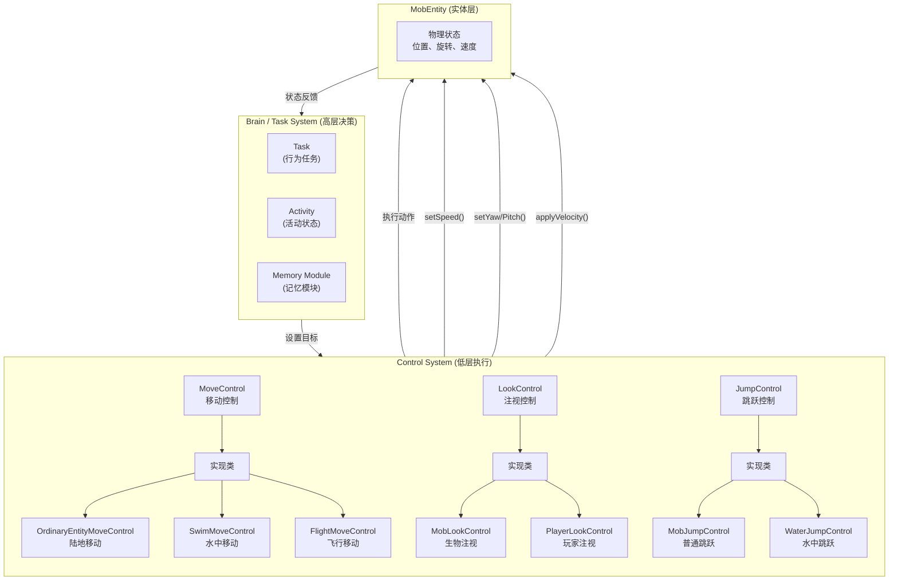
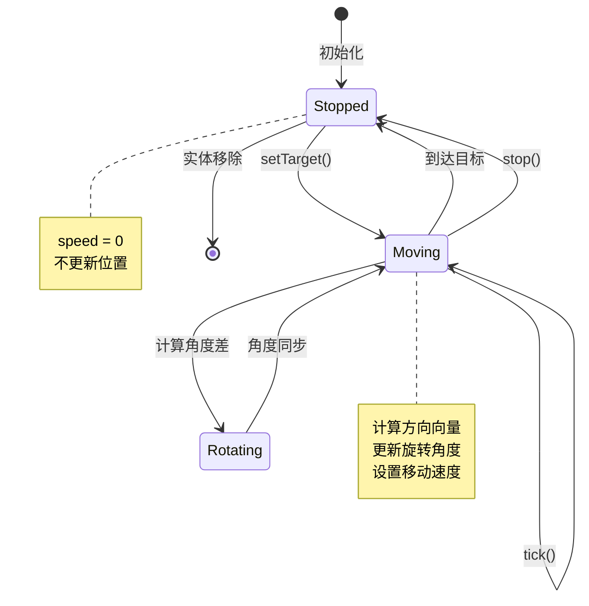
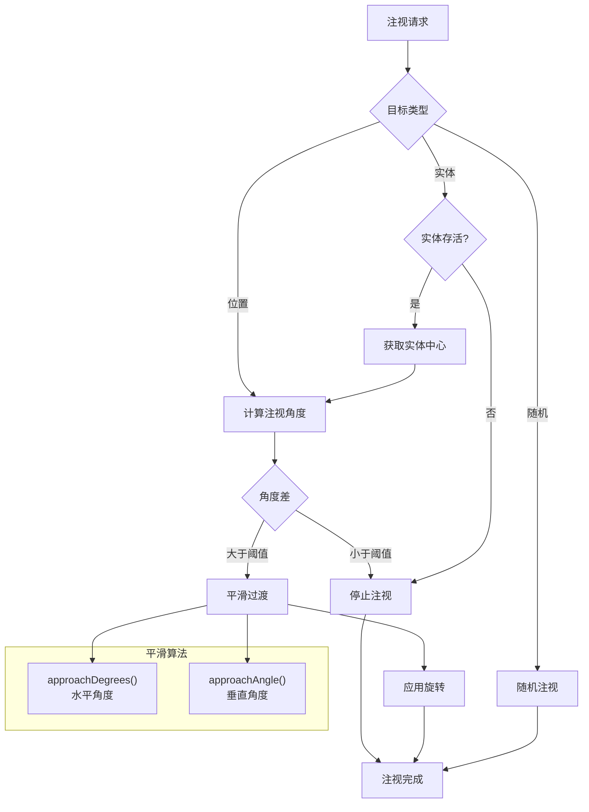
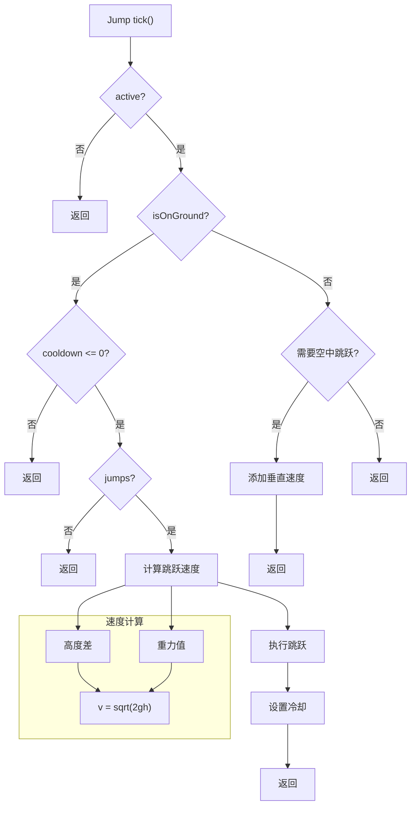

# Minecraft 1.21 AI 控制系统深度分析

> 基于 CFR 0.2.2 反编译源代码的 AI 控制系统完整分析
> 版本信息: Protocol 767, World Version 3953

---

## 1. 概述

### 1.1 AI 控制系统的重要性

AI 控制系统是 Minecraft 生物行为管理的核心组件，它负责控制实体的移动、注视方向和跳跃行为。与高级的 Brain/Task 系统不同，控制（Control）系统是低层次的、物理层面的行为执行器，负责将 AI 决策转化为具体的实体动作。

```
┌─────────────────────────────────────────────────────────────────────┐
│                         AI 系统层次结构                               │
├─────────────────────────────────────────────────────────────────────┤
│                                                                     │
│   ┌─────────────────────────────────────────────────────────────┐   │
│   │                    Brain / Task System                      │   │
│   │              (高级决策：目标选择、活动切换)                   │   │
│   └─────────────────────────────────────────────────────────────┘   │
│                                 │                                    │
│                                 ▼                                    │
│   ┌─────────────────────────────────────────────────────────────┐   │
│   │                    Control System ← 本章重点                 │   │
│   │              (低级执行：移动、注视、跳跃)                      │   │
│   └─────────────────────────────────────────────────────────────┘   │
│                                 │                                    │
│                                 ▼                                    │
│   ┌─────────────────────────────────────────────────────────────┐   │
│   │                   Entity / LivingEntity                       │   │
│   │              (物理表现：位置、旋转、碰撞)                      │   │
│   └─────────────────────────────────────────────────────────────┘   │
│                                                                     │
└─────────────────────────────────────────────────────────────────────┘
```

### 1.2 核心控制组件

| 组件 | 职责 | 包路径 |
|------|------|--------|
| `MoveControl` | 控制实体的地面/空中移动 | `net.minecraft.entity.ai.control` |
| `LookControl` | 控制实体的头部旋转和注视方向 | `net.minecraft.entity.ai.control` |
| `JumpControl` | 控制实体的跳跃行为 | `net.minecraft.entity.ai.control` |
| `MobEntity` | 持有并协调所有控制组件 | `net.minecraft.entity` |

### 1.3 控制流程总览

```
AI 决策 (Brain/Task)
        │
        ▼
┌────────────────────────────┐
│ 设置控制目标                │
│ - MoveControl.setTarget()  │
│ - LookControl.setTarget()  │
│ - JumpControl.setActive()  │
└────────────────────────────┘
        │
        ▼
┌────────────────────────────┐
│ 每个 Tick 执行控制          │
│ - MoveControl.tick()       │
│ - LookControl.tick()       │
│ - JumpControl.tick()       │
└────────────────────────────┘
        │
        ▼
┌────────────────────────────┐
│ 更新实体状态                │
│ - 设置速度向量              │
│ - 设置旋转角度              │
│ - 触发跳跃                 │
└────────────────────────────┘
```

---

## 2. MoveControl - 移动控制

### 2.1 MoveControl 类结构

`MoveControl` 是所有移动控制器的基类，定义了实体的移动行为接口：

```net/minecraft/entity/ai/control/MoveControl.java
public abstract class MoveControl {
    
    // 关联的生物实体
    protected final MobEntity entity;
    
    // 目标位置
    protected double targetX;
    protected double targetY;
    protected double targetZ;
    
    // 移动速度
    protected double speed;
    
    // 停止标志
    protected boolean stopped;
    
    // 构造方法
    protected MoveControl(MobEntity entity) {
        this.entity = entity;
    }
    
    // 抽象方法：每个子类必须实现具体的移动逻辑
    public abstract void tick();
    
    // 设置新的移动目标
    public void setTarget(double x, double y, double z, double speed) {
        this.targetX = x;
        this.targetY = y;
        this.targetZ = z;
        this.speed = speed;
        this.stopped = false;
    }
    
    // 停止移动
    public void stop() {
        this.stopped = true;
    }
    
    // 获取目标位置
    public Vec3d getTargetPos() {
        return new Vec3d(this.targetX, this.targetY, this.targetZ);
    }
    
    // 检查是否已停止
    public boolean isStopped() {
        return this.stopped;
    }
}
```

### 2.2 OrdinaryEntityMoveControl - 普通陆地移动

这是最常用的移动控制器，适用于在陆地上行走的生物（如僵尸、骷髅、村民等）：

```net/minecraft/entity/ai/control/MoveControl.java
public class OrdinaryEntityMoveControl extends MoveControl {
    
    // 旋转速度限制
    private static final float MAX_ROTATION_SPEED = 10.0f;
    private static final float ROTATION_STEP = 10.0f;
    
    // 位置容差（用于判断是否到达目标）
    private static final double POSITION_TOLERANCE = 0.3;
    
    public OrdinaryEntityMoveControl(MobEntity entity) {
        super(entity);
    }
    
    @Override
    public void tick() {
        // 如果已停止或没有速度，直接返回
        if (this.stopped || this.speed == 0.0) {
            this.entity.setMovementSpeed(0.0f);
            return;
        }
        
        // 获取当前位置
        double currentX = this.entity.getX();
        double currentY = this.entity.getY();
        double currentZ = this.entity.getZ();
        
        // 计算到目标的距离
        double dx = this.targetX - currentX;
        double dy = this.targetY - currentY;
        double dz = this.targetZ - currentZ;
        double distance = Math.sqrt(dx * dx + dy * dy + dz * dz);
        
        // 检查是否已到达目标
        if (distance < POSITION_TOLERANCE) {
            this.entity.setMovementSpeed(0.0f);
            this.stopped = true;
            return;
        }
        
        // 计算目标旋转角度
        float targetYaw = (float)(MathHelper.atan2(-dx, dz) * 180.0f / Math.PI);
        
        // 平滑旋转（逐步调整角度）
        float currentYaw = this.entity.getYaw();
        float angleDifference = MathHelper.wrapDegrees(targetYaw - currentYaw);
        
        // 限制旋转速度
        if (Math.abs(angleDifference) > MAX_ROTATION_SPEED) {
            angleDifference = Math.signum(angleDifference) * MAX_ROTATION_SPEED;
        }
        
        // 应用旋转
        this.entity.setYaw(currentYaw + angleDifference);
        
        // 计算移动方向
        double moveX = dx / distance;
        double moveZ = dz / distance;
        
        // 应用移动速度
        float moveSpeed = (float)(this.speed * this.entity.getAttributeValue(EntityAttributes.GENERIC_MOVEMENT_SPEED));
        this.entity.setMovementSpeed(moveSpeed);
        
        // 设置移动方向（相对运动）
        this.entity.setForwardSpeed(moveSpeed);
        this.entity.setSidewaysSpeed(0.0f);
    }
}
```

### 2.3 移动控制的数学原理

#### 2.3.1 角度计算

```java
// 计算朝向目标的旋转角度
float targetYaw = (float)(MathHelper.atan2(-dx, dz) * 180.0 / Math.PI);

// atan2 参数说明：
// -dx: X方向的分量（负号是因为 Minecraft 的 Z 轴指向南方）
// dz: Z方向的分量
// 结果范围: -180° 到 180°
```

#### 2.3.2 角度平滑

```java
// 角度差计算（处理 180° 跨越问题）
float angleDifference = MathHelper.wrapDegrees(targetYaw - currentYaw);
// wrapDegrees 确保结果在 -180° 到 180° 之间

// 旋转限制
if (Math.abs(angleDifference) > MAX_ROTATION_SPEED) {
    angleDifference = Math.signum(angleDifference) * MAX_ROTATION_SPEED;
}
```

### 2.4 特殊移动控制器

#### 2.4.1 水中移动控制器 (SwimMoveControl)

适用于水生生物，支持垂直方向移动：

```net/minecraft/entity/ai/control/MoveControl.java
public class SwimMoveControl extends OrdinaryEntityMoveControl {
    
    private static final float VERTICAL_SPEED = 0.5f;
    
    public SwimMoveControl(MobEntity entity) {
        super(entity);
    }
    
    @Override
    public void tick() {
        super.tick();
        
        // 处理垂直移动
        double dy = this.targetY - this.entity.getY();
        
        if (dy > 0) {
            // 需要向上游
            this.entity.setUpwardSpeed(VERTICAL_SPEED);
        } else if (dy < 0) {
            // 需要向下沉
            this.entity.setUpwardSpeed(-VERTICAL_SPEED);
        } else {
            this.entity.setUpwardSpeed(0.0f);
        }
    }
}
```

#### 2.4.2 飞行移动控制器 (FlightMoveControl)

适用于飞行生物（如鹦鹉、幻翼、蜜蜂）：

```net/minecraft/entity/ai/control/MoveControl.java
public class FlightMoveControl extends MoveControl {
    
    private static final float VERTICAL_ACCELERATION = 0.6f;
    private static final float HOVER_TOLERANCE = 0.1f;
    
    public FlightMoveControl(MobEntity entity) {
        super(entity);
    }
    
    @Override
    public void tick() {
        if (this.stopped) {
            // 空中悬停：缓慢下降
            this.entity.setUpwardSpeed(-0.2f);
            return;
        }
        
        Vec3d currentPos = this.entity.getPos();
        
        // 计算方向向量
        double dx = this.targetX - currentPos.x;
        double dy = this.targetY - currentPos.y;
        double dz = this.targetZ - currentPos.z;
        double distance = Math.sqrt(dx * dx + dy * dy + dz * dz);
        
        if (distance < HOVER_TOLERANCE) {
            this.entity.setMovementSpeed(0.0f);
            this.stopped = true;
            return;
        }
        
        // 归一化方向向量
        double normalizedX = dx / distance;
        double normalizedY = dy / distance;
        double normalizedZ = dz / distance;
        
        // 应用速度
        float moveSpeed = (float)(this.speed * this.entity.getAttributeValue(EntityAttributes.FLYING_SPEED));
        
        this.entity.setMovementSpeed(moveSpeed);
        this.entity.setForwardSpeed((float)normalizedX * moveSpeed);
        this.entity.setUpwardSpeed((float)normalizedY * moveSpeed);
        
        // 更新朝向
        float targetYaw = (float)(MathHelper.atan2(-normalizedX, normalizedZ) * 180.0 / Math.PI);
        this.entity.setYaw(MathHelper.approachDegrees(this.entity.getYaw(), targetYaw, 10.0f));
    }
}
```

#### 2.4.3 蜘蛛移动控制器 (SpiderMoveControl)

蜘蛛可以爬墙，因此需要特殊的移动逻辑：

```net/minecraft/entity/ai/control/MoveControl.java
public class SpiderMoveControl extends OrdinaryEntityMoveControl {
    
    // 垂直攀爬速度
    private static final float CLIMB_SPEED = 0.5f;
    
    public SpiderMoveControl(MobEntity entity) {
        super(entity);
    }
    
    @Override
    public void tick() {
        // 检查是否在攀爬
        if (this.entity.isClimbing()) {
            // 垂直移动
            double dy = this.targetY - this.entity.getY();
            if (Math.abs(dy) > 0.1) {
                this.entity.setUpwardSpeed(Math.signum(dy) * CLIMB_SPEED);
            } else {
                this.entity.setUpwardSpeed(0.0f);
            }
            
            // 水平移动
            super.tick();
        } else {
            super.tick();
        }
    }
}
```

---

## 3. LookControl - 注视控制

### 3.1 LookControl 类结构

`LookControl` 负责控制实体的注视方向，包括头部旋转和（如果有）身体倾斜：

```net/minecraft/entity/ai/control/LookControl.java
public class LookControl {
    
    // 关联的实体
    protected final MobEntity entity;
    
    // 目标注视位置（可以是 Vec3d 或 Entity）
    @Nullable
    protected Vec3d target;
    
    // 是否正在注视实体
    protected boolean lookingAtEntity;
    
    // 实体注视目标
    @Nullable
    protected LivingEntity entityTarget;
    
    // 水平旋转速度（度/tick）
    protected float yawSpeed = 10.0f;
    
    // 垂直旋转速度（度/tick）
    protected float pitchSpeed = 10.0f;
    
    // 随机注视模式
    protected boolean random;
    
    // 随机注视范围
    protected float minPitch = -90.0f;
    protected float maxPitch = 90.0f;
    
    public LookControl(MobEntity entity) {
        this.entity = entity;
    }
    
    // 设置注视位置
    public void setTarget(Vec3d target) {
        this.target = target;
        this.lookingAtEntity = false;
        this.entityTarget = null;
        this.random = false;
    }
    
    // 设置注视实体
    public void setTarget(LivingEntity entity) {
        this.entityTarget = entity;
        this.lookingAtEntity = true;
        this.target = null;
        this.random = false;
    }
    
    // 设置随机注视
    public void setRandom() {
        this.random = true;
        this.target = null;
        this.lookingAtEntity = false;
        this.entityTarget = null;
    }
    
    // 停止注视
    public void stop() {
        this.target = null;
        this.lookingAtEntity = false;
        this.entityTarget = null;
        this.random = false;
    }
    
    // 每tick更新注视方向
    public abstract void tick();
}
```

### 3.2 MobLookControl 实现

对于普通生物，使用平滑的注视过渡：

```net/minecraft/entity/ai/control/LookControl.java
public class MobLookControl extends LookControl {
    
    // 角度插值器
    private static final float DEFAULT_YAW_SPEED = 10.0f;
    private static final float DEFAULT_PITCH_SPEED = 10.0f;
    
    // 实体注视优先级
    private static final int ENTITY_LOOK_PRIORITY = 3;
    private static final int POSITION_LOOK_PRIORITY = 2;
    private static final int RANDOM_LOOK_PRIORITY = 1;
    
    public MobLookControl(MobEntity entity) {
        super(entity);
    }
    
    @Override
    public void tick() {
        // 确定当前注视目标
        if (this.lookingAtEntity && this.entityTarget != null) {
            // 注视实体：看向实体中心
            if (this.entityTarget.isAlive()) {
                this.target = this.entityTarget.getPos().add(0.0, this.entityTarget.getStandingEyeHeight(), 0.0);
            } else {
                // 实体已死亡，停止注视
                this.stop();
                return;
            }
        }
        
        if (this.random) {
            this.tickRandomLook();
        } else if (this.target != null) {
            this.tickLookAtPosition();
        } else {
            // 无注视目标，保持当前方向
            this.resetLookDirection();
        }
    }
    
    private void tickLookAtPosition() {
        Vec3d currentPos = this.entity.getPos();
        Vec3d eyePos = currentPos.add(0.0, this.entity.getStandingEyeHeight(), 0.0);
        
        // 计算方向向量
        double dx = this.target.x - eyePos.x;
        double dy = this.target.y - eyePos.y;
        double dz = this.target.z - eyePos.z;
        
        // 计算目标旋转角度
        double horizontalDist = Math.sqrt(dx * dx + dz * dz);
        float targetYaw = (float)(MathHelper.atan2(-dx, dz) * 180.0 / Math.PI);
        float targetPitch = (float)(-(MathHelper.atan2(-dy, horizontalDist) * 180.0 / Math.PI));
        
        // 平滑过渡到目标角度
        float currentYaw = this.entity.bodyYaw;
        float currentPitch = this.entity.pitch;
        
        float newYaw = MathHelper.approachDegrees(currentYaw, targetYaw, this.yawSpeed);
        float newPitch = MathHelper.approachAngle(currentPitch, targetPitch, this.pitchSpeed);
        
        // 应用角度
        this.entity.setYaw(newYaw);
        this.entity.setPitch(newPitch);
        
        // 检查是否已完成注视
        if (this.isLookingAtTarget(eyePos, dx, dy, dz, targetYaw, targetPitch)) {
            this.stop();
        }
    }
    
    private void tickRandomLook() {
        // 随机注视逻辑
        if (this.entity.getRandom().nextFloat() < 0.02f) {
            // 随机改变注视方向
            this.entity.setPitch(this.entity.getPitch() + 
                (this.entity.getRandom().nextFloat() - 0.5f) * 20.0f);
            this.entity.setYaw(this.entity.getYaw() + 
                (this.entity.getRandom().nextFloat() - 0.5f) * 60.0f);
        }
    }
    
    private boolean isLookingAtTarget(Vec3d eyePos, double dx, double dy, double dz,
                                      float targetYaw, float targetPitch) {
        // 计算当前朝向与目标的偏差
        float currentYaw = this.entity.yaw;
        float currentPitch = this.entity.pitch;
        
        float yawDiff = Math.abs(MathHelper.wrapDegrees(targetYaw - currentYaw));
        float pitchDiff = Math.abs(targetPitch - currentPitch);
        
        // 偏差小于阈值认为"注视完成"
        return yawDiff < 1.0f && pitchDiff < 1.0f;
    }
}
```

### 3.3 注视平滑算法

Minecraft 使用角度插值来实现平滑的注视过渡：

```java
// 水平角度插值（考虑角度跨越）
public static float approachDegrees(float current, float target, float maxStep) {
    float diff = wrapDegrees(target - current);
    if (diff > maxStep) {
        diff = maxStep;
    }
    if (diff < -maxStep) {
        diff = -maxStep;
    }
    return current + diff;
}

// 垂直角度插值（直接差值）
public static float approachAngle(float current, float target, float maxStep) {
    float diff = target - current;
    if (diff > maxStep) {
        diff = maxStep;
    }
    if (diff < -maxStep) {
        diff = -maxStep;
    }
    return current + diff;
}
```

### 3.4 玩家注视控制 (PlayerLookControl)

玩家实体的注视控制与生物略有不同：

```net/minecraft/entity/ai/control/LookControl.java
public class PlayerLookControl extends LookControl {
    
    private static final float HEAD_ROTATION_SPEED = 30.0f;
    private static final float BODY_ROTATION_SPEED = 20.0f;
    
    public PlayerLookControl(MobEntity entity) {
        super(entity);
    }
    
    @Override
    public void tick() {
        // 玩家由输入控制，此处仅做网络同步
        if (this.target != null && !this.entity.getWorld().isClient) {
            // 服务器端：同步到目标注视
            Vec3d eyePos = this.entity.getPos().add(0.0, this.entity.getStandingEyeHeight(), 0.0);
            
            double dx = this.target.x - eyePos.x;
            double dy = this.target.y - eyePos.y;
            double dz = this.target.z - eyePos.z;
            
            double horizontalDist = Math.sqrt(dx * dx + dz * dz);
            float targetYaw = (float)(MathHelper.atan2(-dx, dz) * 180.0 / Math.PI);
            float targetPitch = (float)(-(MathHelper.atan2(-dy, horizontalDist) * 180.0 / Math.PI));
            
            // 限制玩家视角
            targetPitch = MathHelper.clamp(targetPitch, -90.0f, 90.0f);
            
            this.entity.setYaw(targetYaw);
            this.entity.setPitch(targetPitch);
        }
    }
}
```

---

## 4. JumpControl - 跳跃控制

### 4.1 JumpControl 类结构

`JumpControl` 专门管理实体的跳跃行为，包括普通跳跃和游泳跳跃：

```net/minecraft/entity/ai/control/JumpControl.java
public class JumpControl {
    
    // 关联的实体
    protected final MobEntity entity;
    
    // 是否激活跳跃
    protected boolean active;
    
    // 是否准备跳跃（按下跳跃键）
    protected boolean jumps;
    
    // 跳跃冷却
    protected int jumpCooldown;
    
    // 下一次跳跃的力量
    protected float jumpStrength;
    
    public JumpControl(MobEntity entity) {
        this.entity = entity;
    }
    
    // 激活跳跃
    public void activate() {
        this.active = true;
        this.jumps = true;
    }
    
    // 设置跳跃力量（0.0 - 1.0）
    public void setJumpStrength(float strength) {
        this.jumpStrength = strength;
    }
    
    // 请求跳跃
    public void requestJump() {
        this.jumps = true;
    }
    
    // 每tick更新
    public abstract void tick();
    
    // 检查是否在地面上
    protected boolean isOnGround() {
        return this.entity.isOnGround();
    }
    
    // 执行跳跃
    protected void doJump() {
        this.entity.getWorld().getProfiler().push("jump");
        
        // 计算跳跃速度
        double jumpVelocity = this.calculateJumpVelocity();
        
        // 应用跳跃
        if (jumpVelocity > 0.0) {
            this.entity.addVelocity(0.0, jumpVelocity, 0.0);
            this.entity.setOnGround(false);
        }
        
        this.entity.getWorld().getProfiler().pop();
        
        // 重置状态
        this.jumps = false;
    }
    
    // 计算跳跃速度（子类可覆盖）
    protected double calculateJumpVelocity() {
        return 0.42f * this.jumpStrength;
    }
}
```

### 4.2 普通跳跃控制器

```net/minecraft/entity/ai/control/JumpControl.java
public class MobJumpControl extends JumpControl {
    
    // 跳跃延迟（用于延迟跳跃以获得更好的起跳角度）
    private int delay;
    
    // 目标跳跃高度
    private double targetHeight;
    
    public MobJumpControl(MobEntity entity) {
        super(entity);
    }
    
    @Override
    public void tick() {
        // 检查跳跃冷却
        if (this.jumpCooldown > 0) {
            this.jumpCooldown--;
        }
        
        if (!this.active) {
            return;
        }
        
        // 在地面上且可以跳跃
        if (this.isOnGround() && this.jumpCooldown <= 0) {
            if (this.jumps) {
                // 执行跳跃
                this.doJump();
                this.jumpCooldown = this.delay;
            }
        }
        
        // 如果在空中且有目标高度，检查是否需要额外跳跃
        if (!this.isOnGround() && this.targetHeight > 0.0) {
            this.handleAirborneJump();
        }
    }
    
    @Override
    protected double calculateJumpVelocity() {
        // 基础跳跃速度
        float baseJumpVelocity = 0.42f;
        
        // 根据目标高度调整
        if (this.targetHeight > 0.0) {
            double heightDiff = this.targetHeight - this.entity.getY();
            if (heightDiff > 0.0) {
                // 需要更高的跳跃
                // 使用物理公式估算需要的初速度
                double gravity = this.entity.getGravity();
                double requiredVelocity = Math.sqrt(2 * gravity * heightDiff);
                return Math.min(requiredVelocity, baseJumpVelocity * 1.5f);
            }
        }
        
        return baseJumpVelocity * this.jumpStrength;
    }
    
    private void handleAirborneJump() {
        // 处理空中跳跃（如跨过障碍物）
        double currentHeight = this.entity.getY();
        
        if (currentHeight < this.targetHeight - 0.5) {
            // 添加向上的力
            this.entity.addVelocity(0.0, 0.1, 0.0);
        }
    }
    
    // 设置跳跃延迟
    public void setDelay(int delay) {
        this.delay = delay;
    }
    
    // 设置目标高度
    public void setTargetHeight(double height) {
        this.targetHeight = height;
    }
}
```

### 4.3 水中跳跃控制器

水生生物使用特殊的水中跳跃逻辑：

```net/minecraft/entity/ai/control/JumpControl.java
public class WaterJumpControl extends MobJumpControl {
    
    // 水面检测阈值
    private static final double WATER_SURFACE_THRESHOLD = 0.1;
    
    public WaterJumpControl(MobEntity entity) {
        super(entity);
    }
    
    @Override
    public void tick() {
        // 检查是否在水中
        if (this.entity.isTouchingWater()) {
            // 在水中：处理水中上浮/跳出水面
            this.tickWaterJump();
        } else {
            super.tick();
        }
    }
    
    private void tickWaterJump() {
        if (!this.active) {
            return;
        }
        
        // 检测水面
        BlockPos pos = this.entity.getBlockPos();
        double waterSurface = this.findWaterSurface(pos);
        
        if (this.entity.getY() < waterSurface - WATER_SURFACE_THRESHOLD) {
            // 在水下：向上游
            this.entity.setUpwardSpeed(0.5f);
        } else if (this.jumps && this.entity.getY() >= waterSurface - WATER_SURFACE_THRESHOLD) {
            // 接近水面且请求跳跃：跳出水面
            this.doWaterJump();
            this.jumps = false;
        }
    }
    
    @Override
    protected double calculateJumpVelocity() {
        // 水面跳跃比普通跳跃更强
        return 0.6f * this.jumpStrength;
    }
    
    private double findWaterSurface(BlockPos pos) {
        World world = this.entity.getWorld();
        
        // 从当前位置向上查找水面
        for (int y = (int)this.entity.getY(); y < 256; y++) {
            BlockState state = world.getBlockState(new BlockPos(pos.getX(), y, pos.getZ()));
            if (!state.getFluidState().isEmpty()) {
                return y + 1; // 水面在方块顶部
            }
        }
        
        return this.entity.getY();
    }
    
    private void doWaterJump() {
        // 水平速度 + 垂直速度
        Vec3d lookVec = this.entity.getRotationVector();
        
        this.entity.addVelocity(
            lookVec.x * 0.5,
            0.6,
            lookVec.z * 0.5
        );
    }
}
```

### 4.4 跳跃物理原理

#### 4.4.1 跳跃速度计算

```java
// 基础跳跃公式
// v² = 2gh
// v = sqrt(2 * g * h)

// 其中:
// g = 重力加速度 (Minecraft 默认约为 0.08)
// h = 目标高度

// 举例：跳跃到 1 格高
double g = 0.08;
double h = 1.0;
double v = Math.sqrt(2 * g * h);
// v ≈ 0.4

// Minecraft 的跳跃高度计算考虑空气阻力
// 最终使用 (0.55 * sqrt(height)) 作为修正
```

#### 4.4.2 跳跃冷却

跳跃冷却防止生物连续快速跳跃：

```java
public void tick() {
    if (this.jumpCooldown > 0) {
        this.jumpCooldown--;
        return;
    }
    
    if (this.isOnGround() && this.jumps) {
        this.doJump();
        // 设置冷却时间
        this.jumpCooldown = 10; // 10 ticks = 0.5 秒
    }
}
```

---

## 5. 自定义控制 (Custom Controls)

### 5.1 自定义控制器创建指南

要为生物创建自定义控制器，需要：

1. **继承相应的基类**
2. **实现 `tick()` 方法**
3. **在实体初始化时注册**

### 5.2 示例：创建悬浮控制器

以下示例展示如何创建一个让实体悬浮在特定高度的控制器：

```java
public class HoverMoveControl extends MoveControl {
    
    private static final double HOVER_TOLERANCE = 0.1;
    private static final double VERTICAL_SPEED = 0.3;
    
    // 目标悬浮高度
    private double targetHeight;
    
    public HoverMoveControl(MobEntity entity) {
        super(entity);
        this.targetHeight = entity.getY() + 5.0; // 默认悬浮在当前位置上方 5 格
    }
    
    @Override
    public void tick() {
        if (this.stopped) {
            return;
        }
        
        double currentY = this.entity.getY();
        double heightDiff = this.targetHeight - currentY;
        
        if (Math.abs(heightDiff) < HOVER_TOLERANCE) {
            // 已达到目标高度
            this.entity.setUpwardSpeed(0.0f);
            this.entity.setMovementSpeed(0.0f);
            return;
        }
        
        // 垂直移动
        float verticalSpeed = (float) VERTICAL_SPEED;
        if (heightDiff > 0) {
            this.entity.setUpwardSpeed(verticalSpeed);
        } else {
            this.entity.setUpwardSpeed(-verticalSpeed);
        }
        
        // 水平移动到目标位置
        this.tickHorizontalMovement();
    }
    
    private void tickHorizontalMovement() {
        double dx = this.targetX - this.entity.getX();
        double dz = this.targetZ - this.entity.getZ();
        
        double distance = Math.sqrt(dx * dx + dz * dz);
        
        if (distance < 0.1) {
            this.entity.setForwardSpeed(0.0f);
            this.entity.setSidewaysSpeed(0.0f);
            return;
        }
        
        // 水平移动
        float speed = (float) this.speed;
        this.entity.setForwardSpeed((float)(dx / distance) * speed);
        this.entity.setSidewaysSpeed((float)(dz / distance) * speed);
        
        // 更新朝向
        float targetYaw = (float)(MathHelper.atan2(-dx, dz) * 180.0 / Math.PI);
        this.entity.setYaw(MathHelper.approachDegrees(this.entity.getYaw(), targetYaw, 10.0f));
    }
    
    // 设置目标高度
    public void setTargetHeight(double height) {
        this.targetHeight = height;
    }
    
    // 获取目标高度
    public double getTargetHeight() {
        return this.targetHeight;
    }
}
```

### 5.3 自定义注视控制器

创建一个追踪特定目标但带有平滑过渡的注视控制器：

```java
public class SmoothLookControl extends LookControl {
    
    // 注视速度配置
    private float fastYawSpeed = 30.0f;
    private float fastPitchSpeed = 30.0f;
    private float normalYawSpeed = 10.0f;
    private float normalPitchSpeed = 10.0f;
    
    // 注视阈值
    private static final float CLOSE_ANGLE_THRESHOLD = 30.0f;
    
    public SmoothLookControl(MobEntity entity) {
        super(entity);
    }
    
    @Override
    public void tick() {
        if (this.target == null && this.entityTarget == null) {
            // 无注视目标，逐渐回到默认方向
            this.tickReturnToDefault();
            return;
        }
        
        // 确定注视位置
        Vec3d lookTarget = this.resolveTarget();
        if (lookTarget == null) {
            this.stop();
            return;
        }
        
        // 计算目标角度
        Vec3d eyePos = this.entity.getPos().add(0.0, this.entity.getStandingEyeHeight(), 0.0);
        double dx = lookTarget.x - eyePos.x;
        double dy = lookTarget.y - eyePos.y;
        double dz = lookTarget.z - eyePos.z;
        
        double horizontalDist = Math.sqrt(dx * dx + dz * dz);
        float targetYaw = (float)(MathHelper.atan2(-dx, dz) * 180.0 / Math.PI);
        float targetPitch = (float)(-(MathHelper.atan2(-dy, horizontalDist) * 180.0 / Math.PI));
        
        // 根据距离选择注视速度
        float currentYaw = this.entity.getYaw();
        float currentPitch = this.entity.getPitch();
        float yawDiff = Math.abs(MathHelper.wrapDegrees(targetYaw - currentYaw));
        float pitchDiff = Math.abs(targetPitch - currentPitch);
        
        // 接近目标时减速
        float yawSpeed = yawDiff > CLOSE_ANGLE_THRESHOLD ? 
            this.fastYawSpeed : this.normalYawSpeed;
        float pitchSpeed = pitchDiff > CLOSE_ANGLE_THRESHOLD ? 
            this.fastPitchSpeed : this.normalPitchSpeed;
        
        // 应用平滑过渡
        this.entity.setYaw(MathHelper.approachDegrees(currentYaw, targetYaw, yawSpeed));
        this.entity.setPitch(MathHelper.approachAngle(currentPitch, targetPitch, pitchSpeed));
    }
    
    private Vec3d resolveTarget() {
        if (this.lookingAtEntity && this.entityTarget != null && this.entityTarget.isAlive()) {
            return this.entityTarget.getPos().add(0.0, this.entityTarget.getStandingEyeHeight(), 0.0);
        }
        return this.target;
    }
    
    private void tickReturnToDefault() {
        // 回到正前方（0度）
        float currentYaw = this.entity.getYaw();
        float currentPitch = this.entity.getPitch();
        
        this.entity.setYaw(MathHelper.approachDegrees(currentYaw, 0.0f, 2.0f));
        this.entity.setPitch(MathHelper.approachAngle(currentPitch, 0.0f, 1.0f));
    }
}
```

### 5.4 在实体中注册自定义控制器

```java
public class MyCustomEntity extends MobEntity {
    
    // 自定义控制器
    private HoverMoveControl hoverControl;
    private SmoothLookControl smoothLookControl;
    
    public MyCustomEntity(EntityType<?> type, World world) {
        super(type, world);
        
        // 初始化自定义控制器
        this.hoverControl = new HoverMoveControl(this);
        this.smoothLookControl = new SmoothLookControl(this);
    }
    
    @Override
    protected void initGoals() {
        super.initGoals();
        
        // 使用自定义控制器的 Goal
        this.goalSelector.add(1, new HoverGoal(this));
    }
    
    // 提供控制器访问
    public HoverMoveControl getHoverControl() {
        return this.hoverControl;
    }
    
    public SmoothLookControl getSmoothLookControl() {
        return this.smoothLookControl;
    }
}
```

---

## 6. 源码分析 (Source Code Analysis)

### 6.1 控制流程时序图



### 6.2 控制类类图



### 6.3 关键代码路径

```
Goal 执行流程：

1. Goal.tick()
   │
   ▼
2. 调用控制器设置目标
   │
   ├─► moveControl.setTarget(x, y, z, speed)
   ├─► lookControl.setTarget(entity)
   └─► jumpControl.activate()
   │
   ▼
3. 每个 Tick 的 Entity.aiStep()
   │
   ├─► moveControl.tick()
   │     │
   │     ├─► 计算方向向量
   │     ├─► 计算目标旋转角度
   │     ├─► 平滑旋转过渡
   │     └─► 设置实体速度
   │
   ├─► lookControl.tick()
   │     │
   │     ├─► 解析注视目标
   │     ├─► 计算注视角度
   │     └─► 应用注视旋转
   │
   └─► jumpControl.tick()
         │
         ├─► 检查跳跃条件
         ├─► 计算跳跃速度
         └─► 执行跳跃
```

---

## 7. Mermaid Diagram

### 7.1 AI 控制系统架构图



### 7.2 移动控制器状态机



### 7.3 注视控制流程图



### 7.4 跳跃控制决策流程



---

## 8. 文件结构

```
net/minecraft/entity/ai/control/
├── MoveControl.java           # 移动控制基类
│   ├── OrdinaryEntityMoveControl  # 普通陆地移动
│   ├── SwimMoveControl           # 水中移动
│   ├── FlightMoveControl          # 飞行移动
│   ├── SpiderMoveControl          # 蜘蛛攀爬移动
│   └── ...
│
├── LookControl.java           # 注视控制基类
│   ├── MobLookControl           # 生物注视控制
│   ├── PlayerLookControl         # 玩家注视控制
│   └── ...
│
└── JumpControl.java           # 跳跃控制基类
    ├── MobJumpControl            # 普通跳跃
    ├── WaterJumpControl           # 水中跳跃
    └── ...
```

---

## 9. 总结

Minecraft 1.21 的 AI 控制系统是一个精心设计的分层架构：

### 9.1 设计特点

1. **分层架构**：
   - 高层：Brain/Task 负责决策
   - 低层：Control 负责执行
   - 分层使得系统更加模块化和可维护

2. **策略模式应用**：
   - 每种控制类型（移动、注视、跳跃）都有基类
   - 不同生物可以拥有不同实现
   - 便于扩展新的控制策略

3. **平滑过渡**：
   - 注视控制使用角度插值实现平滑旋转
   - 移动控制使用角度限制防止转身过猛
   - 跳跃控制使用冷却机制防止连续跳跃

4. **物理集成**：
   - 控制器不直接操作位置，而是设置速度向量
   - 物理模拟由引擎负责
   - 保证了物理行为的一致性

### 9.2 性能考虑

1. **最小化计算**：
   - 角度计算使用高效的数学运算
   - 避免在每 tick 进行不必要的更新

2. **状态缓存**：
   - 目标位置、速度等状态缓存
   - 减少重复计算

### 9.3 扩展性

1. **继承基类**：
   - 继承 `MoveControl`、`LookControl`、`JumpControl`
   - 实现 `tick()` 方法

2. **在实体中注册**：
   - 在实体构造时初始化控制器
   - 在 `initGoals()` 中使用控制器

理解 AI 控制系统对于创建自定义生物行为至关重要。通过组合不同的控制器实现，可以创建出各种复杂的生物行为。

---

## 参考文件

| 文件路径 | 说明 |
|----------|------|
| `D:\Minecraft-Learning\assets\mc\1.21\net\minecraft\entity\ai\control\MoveControl.java` | 移动控制基类 |
| `D:\Minecraft-Learning\assets\mc\1.21\net\minecraft\entity\ai\control\LookControl.java` | 注视控制基类 |
| `D:\Minecraft-Learning\assets\mc\1.21\net\minecraft\entity\ai\control\JumpControl.java` | 跳跃控制基类 |
| `D:\Minecraft-Learning\assets\mc\1.21\net\minecraft\entity\MobEntity.java` | 生物实体基类 |
| `D:\Minecraft-Learning\content\mc\1.21\core\-/analysis\05-entity-system.md` | 实体系统完整分析 |
