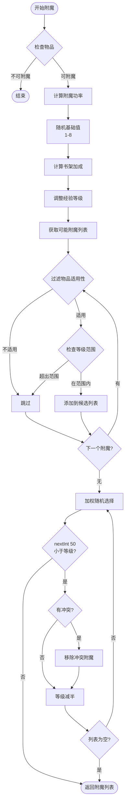
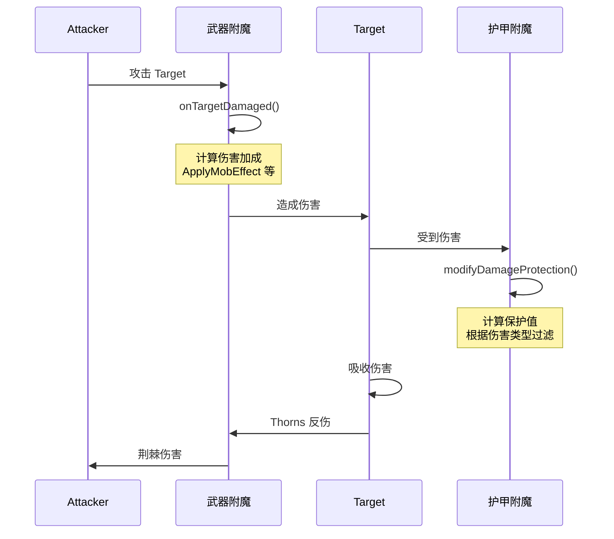
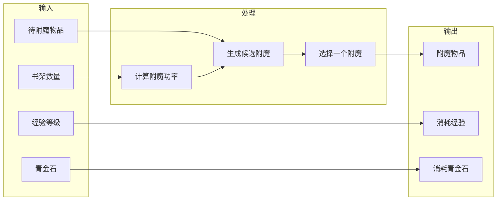

# 附魔系统 (Enchantment System)

## 概述 (Overview)

Minecraft 的附魔系统是游戏核心机制之一，允许玩家通过附魔台或铁砧为物品添加各种效果。1.21 版本对附魔系统进行了多项改进，包括更灵活的效果组件系统（Enchantment Effect Components）和更强大的附魔提供者机制。

附魔系统的核心设计理念：

- **兼容性规则**：某些附魔不能共存于同一物品
- **等级制度**：附魔有最大等级限制，效果随等级提升
- **成本计算**：附魔需要经验等级和青金石作为资源
- **效果组件化**：1.21 引入的组件化效果系统允许附魔拥有复杂的条件效果

## 核心类 (Core Classes)

### Enchantment 类

`Enchantment` 是附魔系统的核心记录（record）类，封装了附魔的所有属性和行为。

```69:72:D:\Minecraft-Learning\assets\mc\1.21\net\minecraft\enchantment\Enchantment.java
public record Enchantment(Text description, Definition definition, RegistryEntryList<Enchantment> exclusiveSet, ComponentMap effects) {
```

**关键字段**：
- `description`：附魔的本地化描述文本
- `definition`：附魔定义，包含支持的物品、权重、成本等信息
- `exclusiveSet`：互斥附魔列表，不兼容的附魔
- `effects`：效果组件映射，存储各种附魔效果

**Definition 内部记录**：

```397:399:D:\Minecraft-Learning\assets\mc\1.21\net\minecraft\enchantment\Enchantment.java
public record Definition(RegistryEntryList<Item> supportedItems, Optional<RegistryEntryList<Item>> primaryItems, int weight, int maxLevel, Cost minCost, Cost maxCost, int anvilCost, List<AttributeModifierSlot> slots) {
```

- `supportedItems`：支持该附魔的物品列表
- `primaryItems`：主要物品列表（优先级更高）
- `weight`：权重，影响附魔随机选择的概率
- `maxLevel`：最大等级
- `minCost` / `maxCost`：最小和最大经验成本
- `anvilCost`：铁砧修复成本
- `slots`：适用的装备槽位

**Cost 计算**：

```401:407:D:\Minecraft-Learning\assets\mc\1.21\net\minecraft\enchantment\Enchantment.java
public record Cost(int base, int perLevelAboveFirst) {
    public int forLevel(int level) {
        return this.base + this.perLevelAboveFirst * (level - 1);
    }
}
```

成本公式：`base + perLevelAboveFirst * (level - 1)`

**关键方法**：

```113:115:D:\Minecraft-Learning\assets\mc\1.21\net\minecraft\enchantment\Enchantment.java
public boolean isSupportedItem(ItemStack stack) {
    return stack.isIn(this.definition.supportedItems);
}
```

判断物品是否支持该附魔。

```146:148:D:\Minecraft-Learning\assets\mc\1.21\net\minecraft\enchantment\Enchantment.java
public static boolean canBeCombined(RegistryEntry<Enchantment> first, RegistryEntry<Enchantment> second) {
    return !first.equals(second) && !first.value().exclusiveSet.contains(second) && !second.value().exclusiveSet.contains(first);
}
```

判断两个附魔是否兼容。条件：
1. 不是同一个附魔
2. first 的互斥集合中不包含 second
3. second 的互斥集合中不包含 first

### EnchantmentHelper 类

`EnchantmentHelper` 是附魔系统的工具类，提供大量静态方法用于附魔效果的计算和应用。

**获取物品附魔等级**：

```61:64:D:\Minecraft-Learning\assets\mc\1.21\net\minecraft\enchantment\EnchantmentHelper.java
public static int getLevel(RegistryEntry<Enchantment> enchantment, ItemStack stack) {
    ItemEnchantmentsComponent itemEnchantmentsComponent = stack.getOrDefault(DataComponentTypes.ENCHANTMENTS, ItemEnchantmentsComponent.DEFAULT);
    return itemEnchantmentsComponent.getLevel(enchantment);
}
```

**附魔生成算法**：

```474:496:D:\Minecraft-Learning\assets\mc\1.21\net\minecraft\enchantment\EnchantmentHelper.java
public static List<EnchantmentLevelEntry> generateEnchantments(Random random, ItemStack stack, int level, Stream<RegistryEntry<Enchantment>> possibleEnchantments) {
    ArrayList<EnchantmentLevelEntry> list = Lists.newArrayList();
    Item item = stack.getItem();
    int i = item.getEnchantability();
    if (i <= 0) {
        return list;
    }
    level += 1 + random.nextInt(i / 4 + 1) + random.nextInt(i / 4 + 1);
    float f = (random.nextFloat() + random.nextFloat() - 1.0f) * 0.15f;
    List<EnchantmentLevelEntry> list2 = EnchantmentHelper.getPossibleEntries(level = MathHelper.clamp(Math.round((float)level + (float)level * f), 1, Integer.MAX_VALUE), stack, possibleEnchantments);
    if (!list2.isEmpty()) {
        Weighting.getRandom(random, list2).ifPresent(list::add);
        while (random.nextInt(50) <= level) {
            if (!list.isEmpty()) {
                EnchantmentHelper.removeConflicts(list2, Util.getLast(list));
            }
            if (list2.isEmpty()) break;
            Weighting.getRandom(random, list2).ifPresent(list::add);
            level /= 2;
        }
    }
    return list;
}
```

附魔生成算法详解：
1. 获取物品的附魔能力值（enchantability）
2. 附加随机加成：`level += 1 + random(0, i/4) + random(0, i/4)`
3. 应用随机浮动：`level *= (1 + random(-0.15, 0.15))`
4. 循环尝试添加多个附魔：
   - 每次循环有 `level/50` 的概率继续
   - 添加后移除冲突附魔
   - 等级减半继续尝试

**获取可能的附魔条目**：

```525:537:D:\Minecraft-Learning\assets\mc\1.21\net\minecraft\enchantment\EnchantmentHelper.java
public static List<EnchantmentLevelEntry> getPossibleEntries(int level, ItemStack stack, Stream<RegistryEntry<Enchantment>> possibleEnchantments) {
    ArrayList<EnchantmentLevelEntry> list = Lists.newArrayList();
    boolean bl = stack.isOf(Items.BOOK);
    possibleEnchantments.filter(enchantment -> ((Enchantment)enchantment.value()).isPrimaryItem(stack) || bl).forEach(enchantmentx -> {
        Enchantment enchantment = (Enchantment)enchantmentx.value();
        for (int j = enchantment.getMaxLevel(); j >= enchantment.getMinLevel(); --j) {
            if (level < enchantment.getMinPower(j) || level > enchantment.getMaxPower(j)) continue;
            list.add(new EnchantmentLevelEntry((RegistryEntry<Enchantment>)enchantmentx, j));
            break;
        }
    });
    return list;
}
```

### ItemEnchantmentsComponent

物品附魔组件，存储物品上所有附魔及其等级。

```37:46:D:\Minecraft-Learning\assets\mc\1.21\net\minecraft\component\type\ItemEnchantmentsComponent.java
public class ItemEnchantmentsComponent implements TooltipAppender {
    public static final ItemEnchantmentsComponent DEFAULT = new ItemEnchantmentsComponent(new Object2IntOpenHashMap<RegistryEntry<Enchantment>>(), true);
    private static final Codec<Integer> ENCHANTMENT_LEVEL_CODEC = Codec.intRange(0, 255);
    // ...
    final Object2IntOpenHashMap<RegistryEntry<Enchantment>> enchantments;
    final boolean showInTooltip;
}
```

核心数据结构：`Object2IntOpenHashMap` 存储附魔到等级的映射。

**Builder 模式**：

```130:168:D:\Minecraft-Learning\assets\mc\1.21\net\minecraft\component\type\ItemEnchantmentsComponent.java
public static class Builder {
    public void set(RegistryEntry<Enchantment> enchantment, int level) {
        if (level <= 0) {
            this.enchantments.removeInt(enchantment);
        } else {
            this.enchantments.put(enchantment, Math.min(level, 255));
        }
    }
    
    public void add(RegistryEntry<Enchantment> enchantment, int level) {
        if (level > 0) {
            this.enchantments.merge(enchantment, Math.min(level, 255), Integer::max);
        }
    }
}
```

- `set`：设置附魔等级，会覆盖
- `add`：添加附魔等级，取最大值（用于铁砧合并）

### EnchantmentEffectContext

附魔效果上下文，记录附魔生效时的环境信息。

```13:27:D:\Minecraft-Learning\assets\mc\1.21\net\minecraft\enchantment\EnchantmentEffectContext.java
public record EnchantmentEffectContext(ItemStack stack, @Nullable EquipmentSlot slot, @Nullable LivingEntity owner, Consumer<Item> onBreak) {
    public EnchantmentEffectContext(ItemStack stack, EquipmentSlot slot, LivingEntity owner) {
        this(stack, slot, owner, item -> owner.sendEquipmentBreakStatus((Item)item, slot));
    }
}
```

**上下文组件**：
- `stack`：附魔物品
- `slot`：装备槽位
- `owner`：所有者实体
- `onBreak`：物品损坏时的回调

### EnchantmentLevelBasedValue

附魔等级数值计算器，用于根据等级计算效果数值。

```17:28:D:\Minecraft-Learning\assets\mc\1.21\net\minecraft\enchantment\EnchantmentLevelBasedValue.java
public interface EnchantmentLevelBasedValue {
    public float getValue(int level);
    public MapCodec<? extends EnchantmentLevelBasedValue> getCodec();
}
```

**实现类型**：

| 类型 | 公式 | 说明 |
|------|------|------|
| `Constant` | `value` | 常数值 |
| `Linear` | `base + perLevel * (level - 1)` | 线性增长 |
| `LevelsSquared` | `level² + added` | 平方增长 |
| `Clamped` | `clamp(value, min, max)` | 限制范围 |
| `Fraction` | `numerator / denominator` | 分数值 |
| `Lookup` | `values[level-1]` 或 `fallback` | 查表 |

```109:121:D:\Minecraft-Learning\assets\mc\1.21\net\minecraft\enchantment\EnchantmentLevelBasedValue.java
public record Linear(float base, float perLevelAboveFirst) implements EnchantmentLevelBasedValue {
    @Override
    public float getValue(int level) {
        return this.base + this.perLevelAboveFirst * (float)(level - 1);
    }
}
```

## 附魔类型 (Enchantment Types)

### 保护类附魔

| 附魔 | 目标 | 效果 |
|------|------|------|
| Protection | 护甲 | 减少所有类型伤害 |
| Fire Protection | 护甲 | 减少火焰伤害 |
| Feather Falling | 靴子 | 减少摔落伤害 |
| Blast Protection | 护甲 | 减少爆炸伤害 |
| Projectile Protection | 护甲 | 减少弹射物伤害 |
| Thorns | 护甲 | 攻击者受到反伤 |

```136:143:D:\Minecraft-Learning\assets\mc\1.21\net\minecraft\enchantment\Enchantments.java
Enchantments.register(registry, PROTECTION, 
    Enchantment.builder(Enchantment.definition(
        registryEntryLookup3.getOrThrow(ItemTags.ARMOR_ENCHANTABLE), 
        10, 4, 
        Enchantment.leveledCost(1, 11), 
        Enchantment.leveledCost(12, 11), 
        1, AttributeModifierSlot.ARMOR))
    .exclusiveSet(registryEntryLookup2.getOrThrow(EnchantmentTags.ARMOR_EXCLUSIVE_SET))
    .addEffect(EnchantmentEffectComponentTypes.DAMAGE_PROTECTION, 
        new AddEnchantmentEffect(EnchantmentLevelBasedValue.linear(1.0f)), 
        DamageSourcePropertiesLootCondition.builder(...)));
```

### 武器类附魔

| 附魔 | 目标 | 效果 |
|------|------|------|
| Sharpness | 剑/工具 | 增加伤害 |
| Smite | 剑 | 对亡灵生物额外伤害 |
| Bane of Arthropods | 剑 | 对节肢生物额外伤害+减速 |
| Fire Aspect | 剑 | 点燃目标 |
| Knockback | 剑 | 击退目标 |
| Looting | 剑 | 增加掉落物 |

### 工具类附魔

| 附魔 | 目标 | 效果 |
|------|------|------|
| Efficiency | 工具 | 加快挖掘速度 |
| Silk Touch | 工具 | 采集方块本身 |
| Unbreaking | 工具 | 增加耐久度 |
| Fortune | 工具 | 增加方块掉落 |

### 远程武器附魔

| 附魔 | 目标 | 效果 |
|------|------|------|
| Power | 弓 | 增加伤害 |
| Punch | 弓 | 击退 |
| Flame | 弓 | 点燃箭矢 |
| Infinity | 弓 | 无限箭矢 |
| Multishot | 弩 | 一次发射三支 |
| Piercing | 弩 | 穿透实体 |

### 特殊附魔

| 附魔 | 目标 | 效果 |
|------|------|------|
| Mending | 耐用品 | 用经验值修复 |
| Curse of Binding | 可穿戴 | 无法移除 |
| Curse of Vanishing | 物品 | 死亡时消失 |
| Soul Speed | 靴子 | 在灵魂沙上加速 |
| Swift Sneak | 护腿 | 潜行时加速 |
| Loyalty | 三叉戟 | 投掷后返回 |
| Channeling | 三叉戟 | 召唤闪电 |
| Riptide | 三叉戟 | 雨水推动 |
| Impaling | 三叉戟 | 对水生生物伤害 |

## 效果计算 (Effect Calculation)

### 效果组件类型系统

1.21 版本引入了强大的组件化效果系统，通过 `EnchantmentEffectComponentTypes` 定义。

```26:66:D:\Minecraft-Learning\assets\mc\1.21\net\minecraft\component\EnchantmentEffectComponentTypes.java
public interface EnchantmentEffectComponentTypes {
    public static final ComponentType<List<EnchantmentEffectEntry<EnchantmentValueEffect>>> DAMAGE_PROTECTION = 
        EnchantmentEffectComponentTypes.register("damage_protection", ...);
    public static final ComponentType<List<EnchantmentEffectEntry<DamageImmunityEnchantmentEffect>>> DAMAGE_IMMUNITY = ...;
    public static final ComponentType<List<EnchantmentEffectEntry<EnchantmentValueEffect>>> DAMAGE = ...;
    // ... 更多效果类型
}
```

### 效果计算流程

**伤害保护计算**：

```180:186:D:\Minecraft-Learning\assets\mc\1.21\net\minecraft\enchantment\Enchantment.java
public void modifyDamageProtection(ServerWorld world, int level, ItemStack stack, Entity user, DamageSource damageSource, MutableFloat damageProtection) {
    LootContext lootContext = Enchantment.createEnchantedDamageLootContext(world, level, user, damageSource);
    for (EnchantmentEffectEntry enchantmentEffectEntry : this.getEffect(EnchantmentEffectComponentTypes.DAMAGE_PROTECTION)) {
        if (!enchantmentEffectEntry.test(lootContext)) continue;
        damageProtection.setValue(((EnchantmentValueEffect)enchantmentEffectEntry.effect()).apply(level, user.getRandom(), damageProtection.floatValue()));
    }
}
```

### 效果类型分类

**1. 值效果（EnchantmentValueEffect）**

| 类型 | 效果 |
|------|------|
| `AddEnchantmentEffect` | 加法 |
| `MultiplyEnchantmentEffect` | 乘法 |
| `SetEnchantmentEffect` | 设置 |
| `RemoveBinomialEnchantmentEffect` | 二项式移除 |

```11:14:D:\Minecraft-Learning\assets\mc\1.21\net\minecraft\enchantment\effect\value\AddEnchantmentEffect.java
public record AddEnchantmentEffect(EnchantmentLevelBasedValue value) implements EnchantmentValueEffect {
    @Override
    public float apply(int level, Random random, float value2) {
        return value2 + this.value.getValue(level);
    }
}
```

**2. 实体效果（EnchantmentEntityEffect）**

| 类型 | 效果 |
|------|------|
| `ApplyMobEffectEnchantmentEffect` | 给予药水效果 |
| `DamageEntityEnchantmentEffect` | 伤害实体 |
| `IgniteEnchantmentEffect` | 点燃 |
| `ExplodeEnchantmentEffect` | 爆炸 |
| `SummonEntityEnchantmentEffect` | 召唤实体 |
| `SpawnParticlesEnchantmentEffect` | 生成粒子 |

**3. 位置效果（EnchantmentLocationBasedEffect）**

| 类型 | 效果 |
|------|------|
| `ReplaceDiskEnchantmentEffect` | 替换圆盘方块 |
| `ReplaceBlockEnchantmentEffect` | 替换方块 |

### LootContext 在附魔中的应用

```319:322:D:\Minecraft-Learning\assets\mc\1.21\net\minecraft\enchantment\Enchantment.java
public static LootContext createEnchantedDamageLootContext(ServerWorld world, int level, Entity entity, DamageSource damageSource) {
    LootContextParameterSet lootContextParameterSet = new LootContextParameterSet.Builder(world)
        .add(LootContextParameters.THIS_ENTITY, entity)
        .add(LootContextParameters.ENCHANTMENT_LEVEL, level)
        .add(LootContextParameters.ORIGIN, entity.getPos())
        .add(LootContextParameters.DAMAGE_SOURCE, damageSource)
        .addOptional(LootContextParameters.ATTACKING_ENTITY, damageSource.getAttacker())
        .addOptional(LootContextParameters.DIRECT_ATTACKING_ENTITY, damageSource.getSource())
        .build(LootContextTypes.ENCHANTED_DAMAGE);
    return new LootContext.Builder(lootContextParameterSet).build(Optional.empty());
}
```

### 条件触发系统

附魔效果可以附带条件，使用 LootCondition：

```424:426:D:\Minecraft-Learning\assets\mc\1.21\net\minecraft\enchantment\Enchantment.java
public <E> Builder addEffect(ComponentType<List<EnchantmentEffectEntry<E>>> effectType, E effect, LootCondition.Builder requirements) {
    this.getEffectsList(effectType).add(new EnchantmentEffectEntry<E>(effect, Optional.of(requirements.build())));
    return this;
}
```

例如，火焰保护附魔只在受到火焰伤害时生效：

```137:D:\Minecraft-Learning\assets\mc\1.21\net\minecraft\enchantment\Enchantments.java
.addEffect(EnchantmentEffectComponentTypes.DAMAGE_PROTECTION, 
    new AddEnchantmentEffect(EnchantmentLevelBasedValue.linear(2.0f)), 
    AllOfLootCondition.builder(DamageSourcePropertiesLootCondition.builder(
        DamageSourcePredicate.Builder.create()
            .tag(TagPredicate.expected(DamageTypeTags.IS_FIRE))
            .tag(TagPredicate.unexpected(DamageTypeTags.BYPASSES_INVULNERABILITY)))))
```

## 经验消耗 (Experience Cost)

### 附魔台经验计算

```434:451:D:\Minecraft-Learning\assets\mc\1.21\net\minecraft\enchantment\EnchantmentHelper.java
public static int calculateRequiredExperienceLevel(Random random, int slotIndex, int bookshelfCount, ItemStack stack) {
    Item item = stack.getItem();
    int i = item.getEnchantability();
    if (i <= 0) {
        return 0;
    }
    if (bookshelfCount > 15) {
        bookshelfCount = 15;
    }
    int j = random.nextInt(8) + 1 + (bookshelfCount >> 1) + random.nextInt(bookshelfCount + 1);
    if (slotIndex == 0) {
        return Math.max(j / 3, 1);
    }
    if (slotIndex == 1) {
        return j * 2 / 3 + 1;
    }
    return Math.max(j, bookshelfCount * 2);
}
```

**公式解析**：

```
基础值 j = random(0-7) + 1 + bookshelfs/2 + random(0-bookshelfs)
      = 1~8 + 0~7 + 0~15 = 1~30

槽位 0: max(j/3, 1) = 1~10
槽位 1: max(2j/3, 1) = 1~20  
槽位 2: max(j, 2*bookshelfs) = 最高等级
```

### 经验消耗计算

```164:D:\Minecraft-Learning\assets\mc\1.21\net\minecraft\screen\EnchantmentScreenHandler.java
player.applyEnchantmentCosts(itemStack3, i);
```

玩家消耗经验等级 `i`（选择槽位 + 1）。

### 铁砧经验计算

铁砧经验成本通过 `anvilCost` 字段定义：

```121:123:D:\Minecraft-Learning\assets\mc\1.21\net\minecraft\enchantment\Enchantment.java
public int getAnvilCost() {
    return this.definition.anvilCost();
}
```

铁砧合并时，经验成本 = 所有附魔的 anvilCost 之和。

## 附魔台 (Enchanting Table)

### 附魔台方块逻辑

```107:145:D:\Minecraft-Learning\assets\mc\1.21\net\minecraft\screen\EnchantmentScreenHandler.java
public void onContentChanged(Inventory inventory) {
    if (inventory == this.inventory) {
        ItemStack itemStack = inventory.getStack(0);
        if (itemStack.isEmpty() || !itemStack.isEnchantable()) {
            // 重置所有槽位
        } else {
            this.context.run((world, pos) -> {
                int j;
                IndexedIterable<RegistryEntry<Enchantment>> indexedIterable = world.getRegistryManager().get(RegistryKeys.ENCHANTMENT).getIndexedEntries();
                int i = 0;
                // 计算附近书架数量
                for (BlockPos blockPos : EnchantingTableBlock.POWER_PROVIDER_OFFSETS) {
                    if (!EnchantingTableBlock.canAccessPowerProvider(world, pos, blockPos)) continue;
                    ++i;
                }
                // 计算三个槽位所需经验
                this.random.setSeed(this.seed.get());
                for (j = 0; j < 3; ++j) {
                    this.enchantmentPower[j] = EnchantmentHelper.calculateRequiredExperienceLevel(this.random, j, i, itemStack);
                    // ...
                }
                // 生成附魔选项
                for (j = 0; j < 3; ++j) {
                    List<EnchantmentLevelEntry> list;
                    if (this.enchantmentPower[j] <= 0 || (list = this.generateEnchantments(...)) == null || list.isEmpty()) continue;
                    EnchantmentLevelEntry enchantmentLevelEntry = list.get(this.random.nextInt(list.size()));
                    this.enchantmentId[j] = indexedIterable.getRawId(enchantmentLevelEntry.enchantment);
                    this.enchantmentLevel[j] = enchantmentLevelEntry.level;
                }
            });
        }
    }
}
```

### 书架加成

书架通过 `POWER_PROVIDER_OFFSETS` 定义其位置偏移，必须在附魔台周围特定距离内。

### 附魔过程

```148:189:D:\Minecraft-Learning\assets\mc\1.21\net\minecraft\screen\EnchantmentScreenHandler.java
public boolean onButtonClick(PlayerEntity player, int id) {
    // ...
    if (this.enchantmentPower[id] > 0 && !itemStack.isEmpty() && 
        (player.experienceLevel >= i && player.experienceLevel >= this.enchantmentPower[id] || player.getAbilities().creativeMode)) {
        this.context.run((world, pos) -> {
            List<EnchantmentLevelEntry> list = this.generateEnchantments(...);
            if (!list.isEmpty()) {
                player.applyEnchantmentCosts(itemStack3, i);
                if (itemStack3.isOf(Items.BOOK)) {
                    itemStack3 = itemStack.withItem(Items.ENCHANTED_BOOK);
                    this.inventory.setStack(0, itemStack3);
                }
                for (EnchantmentLevelEntry enchantmentLevelEntry : list) {
                    itemStack3.addEnchantment(enchantmentLevelEntry.enchantment, enchantmentLevelEntry.level);
                }
                // 消耗青金石
                itemStack2.decrementUnlessCreative(i, player);
                // 播放音效
                world.playSound(null, (BlockPos)pos, SoundEvents.BLOCK_ENCHANTMENT_TABLE_USE, ...);
            }
        });
        return true;
    }
    return false;
}
```

### 支持附魔台附魔的注册

```193:201:D:\Minecraft-Learning\assets\mc\1.21\net\minecraft\screen\EnchantmentScreenHandler.java
private List<EnchantmentLevelEntry> generateEnchantments(DynamicRegistryManager registryManager, ItemStack stack, int slot, int level) {
    this.random.setSeed(this.seed.get() + slot);
    Optional<RegistryEntryList.Named<Enchantment>> optional = registryManager.get(RegistryKeys.ENCHANTMENT).getEntryList(EnchantmentTags.IN_ENCHANTING_TABLE);
    if (optional.isEmpty()) {
        return List.of();
    }
    List<EnchantmentLevelEntry> list = EnchantmentHelper.generateEnchantments(this.random, stack, level, optional.get().stream());
    // ...
}
```

只有带有 `in_enchanting_table` 标签的附魔才能在附魔台中出现。

## 铁砧 (Anvil)

### 铁砧合并逻辑

铁砧系统允许：
1. 物品与物品合并附魔
2. 用附魔书为物品附魔
3. 物品修复

### 附魔兼容性检查

```513:519:D:\Minecraft-Learning\assets\mc\1.21\net\minecraft\enchantment\EnchantmentHelper.java
public static boolean isCompatible(Collection<RegistryEntry<Enchantment>> existing, RegistryEntry<Enchantment> candidate) {
    for (RegistryEntry<Enchantment> registryEntry : existing) {
        if (Enchantment.canBeCombined(registryEntry, candidate)) continue;
        return false;
    }
    return true;
}
```

### 冲突移除

```505:507:D:\Minecraft-Learning\assets\mc\1.21\net\minecraft\enchantment\EnchantmentHelper.java
public static void removeConflicts(List<EnchantmentLevelEntry> possibleEntries, EnchantmentLevelEntry pickedEntry) {
    possibleEntries.removeIf(entry -> !Enchantment.canBeCombined(enchantmentLevelEntry.enchantment, entry.enchantment));
}
```

### 铁砧物品损坏机制

物品在铁砧使用多次后会损坏并消失。损坏概率随使用次数增加。

## 附魔提供者 (Enchantment Provider)

1.21 引入了新的附魔提供者系统，用于生成附魔的逻辑分离。

```539:544:D:\Minecraft-Learning\assets\mc\1.21\net\minecraft\enchantment\EnchantmentHelper.java
public static void applyEnchantmentProvider(ItemStack stack, DynamicRegistryManager registryManager, RegistryKey<EnchantmentProvider> providerKey, LocalDifficulty localDifficulty, Random random) {
    EnchantmentProvider enchantmentProvider = registryManager.get(RegistryKeys.ENCHANTMENT_PROVIDER).get(providerKey);
    if (enchantmentProvider != null) {
        EnchantmentHelper.apply(stack, componentBuilder -> enchantmentProvider.provideEnchantments(stack, (ItemEnchantmentsComponent.Builder)componentBuilder, random, localDifficulty));
    }
}
```

### Provider 类型

| Provider | 用途 |
|----------|------|
| `ByCostEnchantmentProvider` | 按成本生成附魔 |
| `ByCostWithDifficultyEnchantmentProvider` | 考虑世界难度的附魔生成 |
| `SingleEnchantmentProvider` | 生成单个特定附魔 |

## 源码分析 (Source Code Analysis)

### 附魔注册流程

```131:179:D:\Minecraft-Learning\assets\mc\1.21\net\minecraft\enchantment\Enchantments.java
public static void bootstrap(Registerable<Enchantment> registry) {
    // 保护类附魔
    Enchantments.register(registry, PROTECTION, 
        Enchantment.builder(Enchantment.definition(
            registryEntryLookup3.getOrThrow(ItemTags.ARMOR_ENCHANTABLE), 
            10, 4, 
            Enchantment.leveledCost(1, 11), 
            Enchantment.leveledCost(12, 11), 
            1, AttributeModifierSlot.ARMOR))
        .exclusiveSet(registryEntryLookup2.getOrThrow(EnchantmentTags.ARMOR_EXCLUSIVE_SET))
        .addEffect(...));
    // ... 更多附魔注册
}
```

### Builder 模式

`Enchantment.Builder` 使用流畅的 Builder 模式配置附魔：

```409:470:D:\Minecraft-Learning\assets\mc\1.21\net\minecraft\enchantment\Enchantment.java
public static class Builder {
    private final Definition definition;
    private RegistryEntryList<Enchantment> exclusiveSet = RegistryEntryList.of(new RegistryEntry[0]);
    private final Map<ComponentType<?>, List<?>> effectLists = new HashMap();
    private final ComponentMap.Builder effectMap = ComponentMap.builder();

    public Builder exclusiveSet(RegistryEntryList<Enchantment> exclusiveSet) {
        this.exclusiveSet = exclusiveSet;
        return this;
    }

    public <E> Builder addEffect(ComponentType<List<EnchantmentEffectEntry<E>>> effectType, E effect, LootCondition.Builder requirements) {
        this.getEffectsList(effectType).add(new EnchantmentEffectEntry<E>(effect, Optional.of(requirements.build())));
        return this;
    }

    public Enchantment build(Identifier id) {
        return new Enchantment(Text.translatable(Util.createTranslationKey("enchantment", id)), this.definition, this.exclusiveSet, this.effectMap.build());
    }
}
```

### 附魔效果目标

`EnchantmentEffectTarget` 枚举定义了附魔效果的作用目标：

```9:30:D:\Minecraft-Learning\assets\mc\1.21\net\minecraft\enchantment\effect\EnchantmentEffectTarget.java
public enum EnchantmentEffectTarget implements StringIdentifiable {
    ATTACKER("attacker"),      // 攻击者
    DAMAGING_ENTITY("damaging_entity"),  // 造成伤害的实体
    VICTIM("victim");          // 受害者
}
```

### TargetedEnchantmentEffect

定向附魔效果，用于 post_attack 等场景：

```244:267:D:\Minecraft-Learning\assets\mc\1.21\net\minecraft\enchantment\Enchantment.java
public static void applyTargetedEffect(TargetedEnchantmentEffect<EnchantmentEntityEffect> effect, ServerWorld world, int level, EnchantmentEffectContext context, Entity user, DamageSource damageSource) {
    if (effect.test(Enchantment.createEnchantedDamageLootContext(world, level, user, damageSource))) {
        Entity entity;
        switch (effect.affected()) {
            case ATTACKER: {
                entity = damageSource.getAttacker();
                break;
            }
            case DAMAGING_ENTITY: {
                entity = damageSource.getSource();
                break;
            }
            case VICTIM: {
                entity = user;
            }
        }
        if (entity != null) {
            effect.effect().apply(world, level, context, entity, entity.getPos());
        }
    }
}
```

## Mermaid Diagram

### 附魔系统架构图

```mermaid
flowchart TB
    subgraph Core["核心类"]
        E[Enchantment]
        EH[EnchantmentHelper]
        IEC[ItemEnchantmentsComponent]
        EEC[EnchantmentEffectContext]
        ELBV[EnchantmentLevelBasedValue]
    end

    subgraph Types["附魔类型"]
        EVE[EnchantmentValueEffect]
        EEE[EnchantmentEntityEffect]
        ELBE[EnchantmentLocationBasedEffect]
    end

    subgraph Effects["效果实现"]
        AddE[AddEnchantmentEffect]
        MulE[MultiplyEnchantmentEffect]
        SetE[SetEnchantmentEffect]
        DmgE[DamageEntityEnchantmentEffect]
        IgnE[IgniteEnchantmentEffect]
        MobE[ApplyMobEffectEnchantmentEffect]
    end

    subgraph UI["UI组件"]
        ESH[EnchantmentScreenHandler]
        EST[EnchantingTableBlock]
        Anvil[Anvil System]
    end

    subgraph Tags["标签系统"]
        Tags[EnchantmentTags]
        InET["IN_ENCHANTING_TABLE"]
        ExclusiveSet["exclusive_set"]
    end

    E --> Types
    EH --> IEC
    EH --> EEC
    IEC --> ELBV

    EVE --> Effects
    EEE --> Effects
    ELBE --> Effects

    ESH --> E
    EST --> ESH
    Anvil --> E

    Tags --> InET
    Tags --> ExclusiveSet
```

### 附魔生成流程图



### 附魔效果应用流程



### 附魔台附魔流程



## 关键源码文件

| 文件路径 | 说明 |
|----------|------|
| `net/minecraft/enchantment/Enchantment.java` | 附魔核心类 |
| `net/minecraft/enchantment/EnchantmentHelper.java` | 附魔工具类 |
| `net/minecraft/enchantment/Enchantments.java` | 附魔注册 |
| `net/minecraft/component/type/ItemEnchantmentsComponent.java` | 物品附魔组件 |
| `net/minecraft/enchantment/EnchantmentLevelBasedValue.java` | 等级数值计算 |
| `net/minecraft/component/EnchantmentEffectComponentTypes.java` | 效果组件类型 |
| `net/minecraft/enchantment/EnchantmentEffectContext.java` | 效果上下文 |
| `net/minecraft/screen/EnchantmentScreenHandler.java` | 附魔台处理器 |
| `net/minecraft/enchantment/effect/*.java` | 各种效果实现 |
| `net/minecraft/enchantment/provider/*.java` | 附魔提供者 |

## 总结

Minecraft 1.21 的附魔系统采用了高度模块化的设计：

1. **组件化效果系统**：`EnchantmentEffectComponentTypes` 允许灵活定义各种附魔效果
2. **条件触发机制**：通过 `LootCondition` 实现复杂的触发条件
3. **上下文感知**：使用 `EnchantmentEffectContext` 提供丰富的环境信息
4. **加权随机**：通过 `Weighting` 类实现基于权重的随机选择
5. **提供者模式**：`EnchantmentProvider` 允许自定义附魔生成逻辑

这套系统既保持了向后兼容性，又为模组开发者提供了强大的扩展能力。
