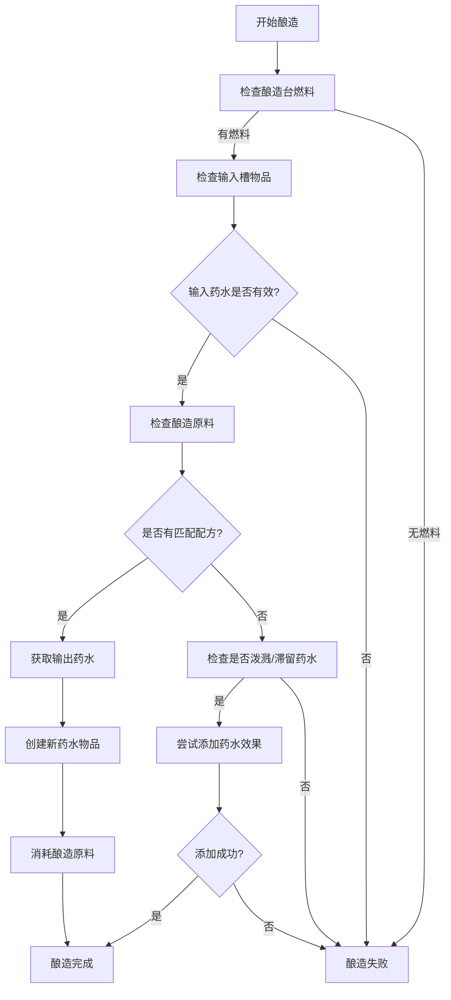
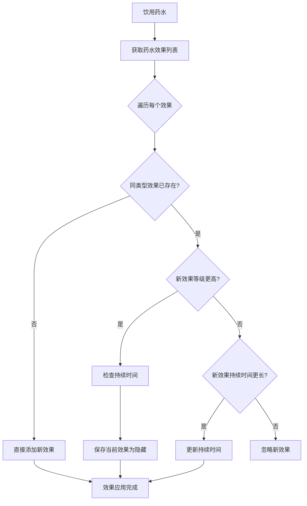
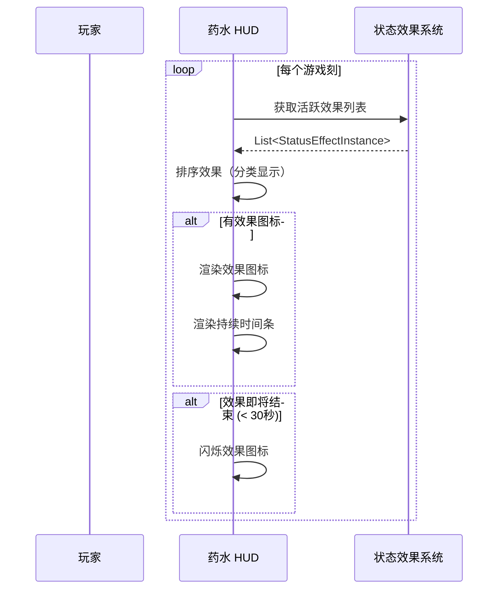
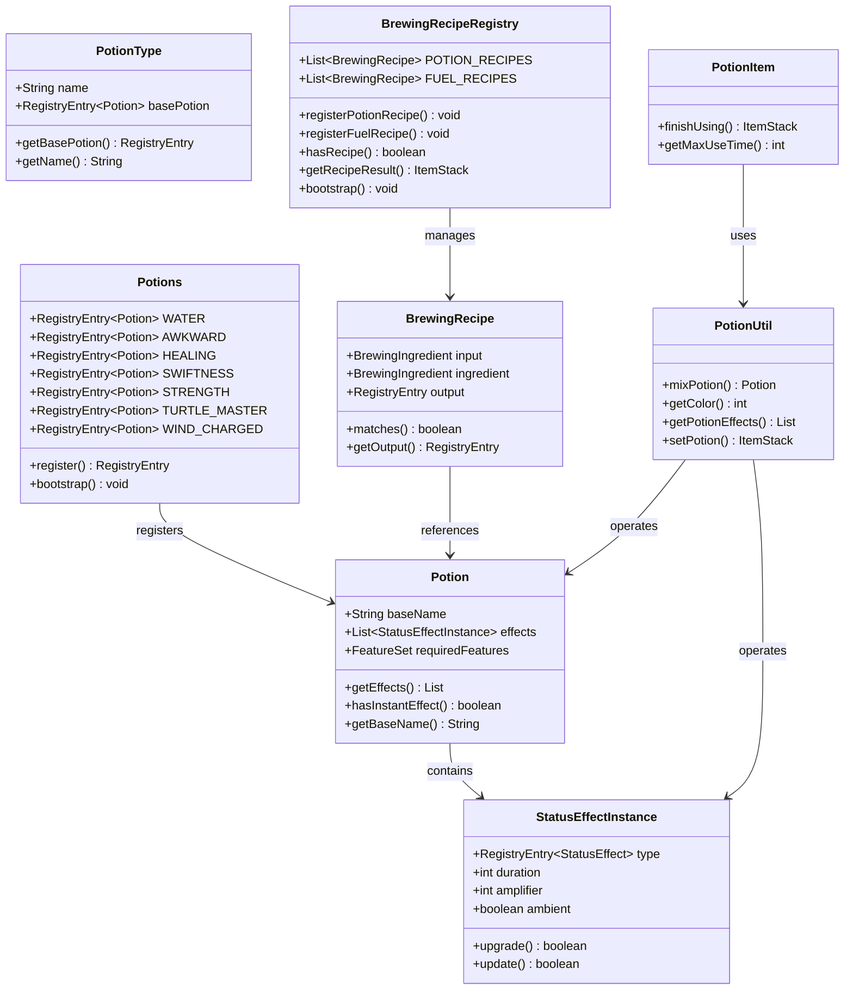
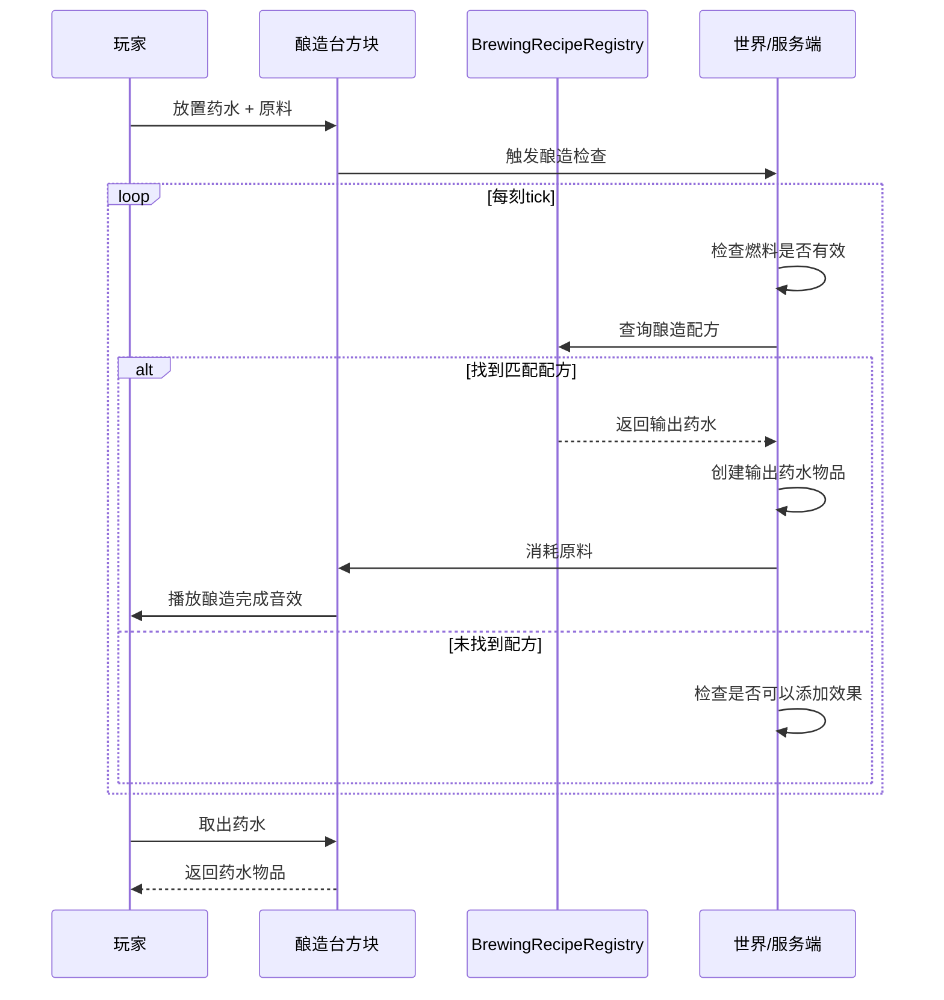

# 药水系统 (Potion System)

> 基于 CFR 0.2.2 反编译源代码的药水系统完整分析
> 版本信息: Protocol 767, World Version 3953

---

## 概述 (Overview)

Minecraft 的药水系统（Potion System）是游戏核心玩法子系统之一，与状态效果系统紧密配合，共同实现了游戏中的药水酿造、效果应用和展示功能。药水系统负责定义各种药水的配方、持续时间、效果组合，以及酿造过程中的化学反应。

药水系统的设计具有以下核心特点：

1. **配方驱动**：通过 `Potion` 类定义药水配方，包含一个或多个状态效果
2. **层级结构**：`Potion` 定义配方类型，`StatusEffectInstance` 定义具体效果实例
3. **酿造成分**：`PotionType` 和酿造配方定义原料到药水的转换规则
4. **展示系统**：药水物品使用自定义渲染和颜色系统展示效果组合

### 1.1 系统架构总览

```
┌─────────────────────────────────────────────────────────────────────────────┐
│                              药水系统架构                                    │
├─────────────────────────────────────────────────────────────────────────────┤
│                                                                             │
│  ┌─────────────────────────────────────────────────────────────────────┐   │
│  │                        物品层 (Item Layer)                           │   │
│  │                   PotionItem / SplashPotionItem / LingeringPotionItem    │   │
│  └─────────────────────────────────┬───────────────────────────────────┘   │
│                                    │                                        │
│  ┌─────────────────────────────────┼───────────────────────────────────┐   │
│  │                        配方层 (Potion Layer)                         │   │
│  │                    Potion / PotionType / BrewingRecipe                  │   │
│  └─────────────────────────────────┼───────────────────────────────────┘   │
│                                    │                                        │
│  ┌─────────────────────────────────┼───────────────────────────────────┐   │
│  │                        效果层 (Effect Layer)                          │   │
│  │                PotionUtil / StatusEffectInstance / Potions               │   │
│  └─────────────────────────────────┬───────────────────────────────────┘   │
│                                    │                                        │
│  ┌─────────────────────────────────┼───────────────────────────────────┐   │
│  │                        注册表层 (Registry Layer)                       │   │
│  │                   Potions / PotionTypes / Registries                     │   │
│  └─────────────────────────────────────────────────────────────────────┘   │
│                                                                             │
└─────────────────────────────────────────────────────────────────────────────┘
```

### 1.2 核心组件一览

| 组件 | 类路径 | 职责 |
|------|--------|------|
| Potion | `net.minecraft.potion.Potion` | 药水配方定义，包含效果列表 |
| Potions | `net.minecraft.potion.Potions` | 内置药水配方注册表 |
| PotionType | `net.minecraft.potion.PotionType` | 药水类型定义（基础水/普通/延长/加强） |
| BrewingRecipe | `net.minecraft.potion.BrewingRecipe` | 酿造配方定义 |
| BrewingRecipeRegistry | `net.minecraft.potion.BrewingRecipeRegistry` | 酿造配方注册与管理 |
| PotionUtil | `net.minecraft.potion.PotionUtil` | 药水工具类，处理药水数据 |
| PotionItem | `net.minecraft.item.PotionItem` | 药水物品类 |

---

## 核心类 (Core Classes)

### 2.1 Potion - 药水配方类

`Potion` 类是药水系统的核心，它定义了药水所包含的状态效果组合。

```java
// D:\Minecraft-Learning\assets\mc\1.21\net\minecraft\potion\Potion.java
public class Potion implements ToggleableFeature {
    
    // 基础名称（用于生成变体名称，如 "swiftness" 生成 "long_swiftness"）
    @Nullable
    private final String baseName;
    
    // 药水包含的效果实例列表
    private final List<StatusEffectInstance> effects;
    
    // 所需特性标志
    private FeatureSet requiredFeatures = FeatureFlags.VANILLA_FEATURES;
    
    // 无效果构造函数
    public Potion() {
        this(null, new StatusEffectInstance[0]);
    }
    
    // 单效果构造函数
    public Potion(StatusEffectInstance effect) {
        this(null, effect);
    }
    
    // 带基础名称的构造函数
    public Potion(@Nullable String baseName, StatusEffectInstance effect) {
        this(baseName, new StatusEffectInstance[]{effect});
    }
    
    // 多效果构造函数
    public Potion(@Nullable String baseName, StatusEffectInstance... effects) {
        this.baseName = baseName;
        this.effects = List.of(effects);  // 使用不可变列表
    }
    
    // 获取效果列表
    public List<StatusEffectInstance> getEffects() {
        return this.effects;
    }
    
    // 检查是否包含即时效果
    public boolean hasInstantEffect() {
        for (StatusEffectInstance effect : this.effects) {
            if (effect.getEffectType().value().isInstant()) {
                return true;
            }
        }
        return false;
    }
    
    // 获取基础名称
    @Nullable
    public String getBaseName() {
        return this.baseName;
    }
}
```

#### 2.1.1 药水命名规则

`Potion` 类使用 `baseName` 字段来支持药水命名系统：

| baseName | 普通药水 | 延长药水 | 加强药水 |
|----------|----------|----------|----------|
| `null` | 显示药水类型名称 | - | - |
| `"swiftness"` | Swiftness Potion | Long Swiftness Potion | Strong Swiftness Potion |
| `"healing"` | Potion of Healing | - | Potion of Strong Healing |
| `"turtle_master"` | Potion of Turtle Master | - | - |

```java
// 命名生成逻辑
public String getNameSuffix() {
    return this.baseName == null ? "" : "_" + this.baseName;
}

// 生成完整药水名称
public String getTranslationKey() {
    return "potion.prefix." + (this.baseName == null ? "unbrewed" : this.baseName);
}
```

### 2.2 Potions - 内置药水注册表

`Potions` 类注册了所有内置药水配方。

```java
// D:\Minecraft-Learning\assets\mc\1.21\net\minecraft\potion\Potions.java
public class Potions {
    
    // ========== 基础药水 ==========
    
    // 水瓶 - 酿造起点
    public static final RegistryEntry<Potion> WATER = register("water", new Potion());
    
    // 无用药水
    public static final RegistryEntry<Potion> MUNDANE = register("mundane", new Potion());
    
    // 浓药水 - 无效果
    public static final RegistryEntry<Potion> THICK = register("thick", new Potion());
    
    // 笨拙药水 - 酿造中间产物
    public static final RegistryEntry<Potion> AWKWARD = register("awkward", 
        new Potion(new StatusEffectInstance(StatusEffects.UNLUCK, 1)));
    
    // ========== 治疗药水 ==========
    
    public static final RegistryEntry<Potion> HEALING = register("healing", 
        new Potion(new StatusEffectInstance(StatusEffects.INSTANT_HEALTH, 1)));
    
    public static final RegistryEntry<Potion> STRONG_HEALING = register("strong_healing", 
        new Potion("healing", new StatusEffectInstance(StatusEffects.INSTANT_HEALTH, 1, 1)));
    
    public static final RegistryEntry<Potion> LONG_HEALING = register("long_healing", 
        new Potion("healing", new StatusEffectInstance(StatusEffects.INSTANT_HEALTH, 2, 0)));
    
    // ========== 伤害药水 ==========
    
    public static final RegistryEntry<Potion> HARMING = register("harming", 
        new Potion(new StatusEffectInstance(StatusEffects.INSTANT_DAMAGE, 1)));
    
    public static final RegistryEntry<Potion> STRONG_HARMING = register("strong_harming", 
        new Potion("harming", new StatusEffectInstance(StatusEffects.INSTANT_DAMAGE, 1, 1)));
    
    public static final RegistryEntry<Potion> LONG_HARMING = register("long_harming", 
        new Potion("harming", new StatusEffectInstance(StatusEffects.INSTANT_DAMAGE, 2, 0)));
    
    // ========== 速度药水 ==========
    
    public static final RegistryEntry<Potion> SWIFTNESS = register("swiftness", 
        new Potion(new StatusEffectInstance(StatusEffects.SPEED, 3600)));
    
    public static final RegistryEntry<Potion> LONG_SWIFTNESS = register("long_swiftness", 
        new Potion("swiftness", new StatusEffectInstance(StatusEffects.SPEED, 9600)));
    
    public static final RegistryEntry<Potion> STRONG_SWIFTNESS = register("strong_swiftness", 
        new Potion("swiftness", new StatusEffectInstance(StatusEffects.SPEED, 1800, 1)));
    
    // ========== 缓慢药水 ==========
    
    public static final RegistryEntry<Potion> SLOWNESS = register("slowness", 
        new Potion(new StatusEffectInstance(StatusEffects.SLOWNESS, 1800)));
    
    public static final RegistryEntry<Potion> LONG_SLOWNESS = register("long_slowness", 
        new Potion("slowness", new StatusEffectInstance(StatusEffects.SLOWNESS, 4800)));
    
    public static final RegistryEntry<Potion> STRONG_SLOWNESS = register("strong_slowness", 
        new Potion("slowness", new StatusEffectInstance(StatusEffects.SLOWNESS, 400, 3)));
    
    // ========== 力量药水 ==========
    
    public static final RegistryEntry<Potion> STRENGTH = register("strength", 
        new Potion(new StatusEffectInstance(StatusEffects.STRENGTH, 3600)));
    
    public static final RegistryEntry<Potion> LONG_STRENGTH = register("long_strength", 
        new Potion("strength", new StatusEffectInstance(StatusEffects.STRENGTH, 9600)));
    
    public static final RegistryEntry<Potion> STRONG_STRENGTH = register("strong_strength", 
        new Potion("strength", new StatusEffectInstance(StatusEffects.STRENGTH, 1800, 1)));
    
    // ========== 跳跃药水 ==========
    
    public static final RegistryEntry<Potion> LEAPING = register("leaping", 
        new Potion(new StatusEffectInstance(StatusEffects.JUMP_BOOST, 3600)));
    
    public static final RegistryEntry<Potion> LONG_LEAPING = register("long_leaping", 
        new Potion("leaping", new StatusEffectInstance(StatusEffects.JUMP_BOOST, 9600)));
    
    public static final RegistryEntry<Potion> STRONG_LEAPING = register("strong_leaping", 
        new Potion("leaping", new StatusEffectInstance(StatusEffects.JUMP_BOOST, 1800, 1)));
    
    // ========== 再生药水 ==========
    
    public static final RegistryEntry<Potion> REGENERATION = register("regeneration", 
        new Potion(new StatusEffectInstance(StatusEffects.REGENERATION, 900)));
    
    public static final RegistryEntry<Potion> LONG_REGENERATION = register("long_regeneration", 
        new Potion("regeneration", new StatusEffectInstance(StatusEffects.REGENERATION, 1800)));
    
    public static final RegistryEntry<Potion> STRONG_REGENERATION = register("strong_regeneration", 
        new Potion("regeneration", new StatusEffectInstance(StatusEffects.REGENERATION, 450, 1)));
    
    // ========== 抗火药水 ==========
    
    public static final RegistryEntry<Potion> FIRE_RESISTANCE = register("fire_resistance", 
        new Potion(new StatusEffectInstance(StatusEffects.FIRE_RESISTANCE, 3600)));
    
    public static final RegistryEntry<Potion> LONG_FIRE_RESISTANCE = register("long_fire_resistance", 
        new Potion("fire_resistance", new StatusEffectInstance(StatusEffects.FIRE_RESISTANCE, 9600)));
    
    // ========== 夜视药水 ==========
    
    public static final RegistryEntry<Potion> NIGHT_VISION = register("night_vision", 
        new Potion(new StatusEffectInstance(StatusEffects.NIGHT_VISION, 3600)));
    
    public static final RegistryEntry<Potion> LONG_NIGHT_VISION = register("long_night_vision", 
        new Potion("night_vision", new StatusEffectInstance(StatusEffects.NIGHT_VISION, 9600)));
    
    // ========== 隐身药水 ==========
    
    public static final RegistryEntry<Potion> INVISIBILITY = register("invisibility", 
        new Potion(new StatusEffectInstance(StatusEffects.INVISIBILITY, 3600)));
    
    public static final RegistryEntry<Potion> LONG_INVISIBILITY = register("long_invisibility", 
        new Potion("invisibility", new StatusEffectInstance(StatusEffects.INVISIBILITY, 9600)));
    
    // ========== 水下呼吸药水 ==========
    
    public static final RegistryEntry<Potion> WATER_BREATHING = register("water_breathing", 
        new Potion(new StatusEffectInstance(StatusEffects.WATER_BREATHING, 3600)));
    
    public static final RegistryEntry<Potion> LONG_WATER_BREATHING = register("long_water_breathing", 
        new Potion("water_breathing", new StatusEffectInstance(StatusEffects.WATER_BREATHING, 9600)));
    
    // ========== 虚弱药水 ==========
    
    public static final RegistryEntry<Potion> WEAKNESS = register("weakness", 
        new Potion(new StatusEffectInstance(StatusEffects.WEAKNESS, 1800)));
    
    public static final RegistryEntry<Potion> LONG_WEAKNESS = register("long_weakness", 
        new Potion("weakness", new StatusEffectInstance(StatusEffects.WEAKNESS, 4800)));
    
    // ========== 力量药水 ==========
    
    public static final RegistryEntry<Potion> STRENGTH_POTION = register("strength", 
        new Potion(new StatusEffectInstance(StatusEffects.STRENGTH, 3600)));
    
    // ========== 海龟大师药水（双效果） ==========
    
    public static final RegistryEntry<Potion> TURTLE_MASTER = register("turtle_master", 
        new Potion("turtle_master", 
            new StatusEffectInstance(StatusEffects.SLOWNESS, 400, 3),
            new StatusEffectInstance(StatusEffects.RESISTANCE, 400, 2)));
    
    public static final RegistryEntry<Potion> STRONG_TURTLE_MASTER = register("strong_turtle_master", 
        new Potion("turtle_master", 
            new StatusEffectInstance(StatusEffects.SLOWNESS, 400, 5),
            new StatusEffectInstance(StatusEffects.RESISTANCE, 400, 3)));
    
    // ========== 1.21 新增药水 ==========
    
    public static final RegistryEntry<Potion> WIND_CHARGED = register("wind_charged", 
        new Potion("wind_charged", new StatusEffectInstance(StatusEffects.WIND_CHARGED, 3600)));
    
    public static final RegistryEntry<Potion> WEAVING = register("weaving", 
        new Potion("weaving", new StatusEffectInstance(StatusEffects.WEAVING, 3600)));
    
    public static final RegistryEntry<Potion> OOZING = register("oozing", 
        new Potion("oozing", new StatusEffectInstance(StatusEffects.OOZING, 3600)));
    
    public static final RegistryEntry<Potion> INFESTED = register("infested", 
        new Potion("infested", new StatusEffectInstance(StatusEffects.INFESTED, 3600)));
    
    // 注册方法
    private static RegistryEntry<Potion> register(String id, Potion potion) {
        return Registry.registerReference(Registries.POTION, Identifier.ofVanilla(id), potion);
    }
    
    // 初始化所有药水
    public static void bootstrap() {
        // 触发类的静态初始化
    }
}
```

### 2.3 PotionType - 药水类型

`PotionType` 类定义了药水的基础类型，用于酿造系统的配方匹配。

```java
// D:\Minecraft-Learning\assets\mc\1.21\net\minecraft\potion\PotionType.java
public class PotionType implements ToggleableFeature {
    
    // 药水类型名称
    private final String name;
    
    // 基础药水引用
    private final RegistryEntry<Potion> basePotion;
    
    // 所需特性
    private FeatureSet requiredFeatures = FeatureFlags.VANILLA_FEATURES;
    
    public PotionType(String name, RegistryEntry<Potion> basePotion) {
        this.name = name;
        this.basePotion = basePotion;
    }
    
    public RegistryEntry<Potion> getBasePotion() {
        return this.basePotion;
    }
    
    public String getName() {
        return this.name;
    }
}
```

### 2.4 PotionUtil - 药水工具类

`PotionUtil` 提供了药水的各种实用方法，包括效果混合和颜色计算。

```java
// D:\Minecraft-Learning\assets\mc\1.21\net\minecraft\potion\PotionUtil.java
public final class PotionUtil {
    
    // ========== 效果混合 ==========
    
    // 混合两个药水的效果
    public static Potion mixPotion(RegistryEntry<Potion> source, RegistryEntry<Potion> additive) {
        Potion sourcePotion = source.value();
        Potion additivePotion = additive.value();
        
        List<StatusEffectInstance> combinedEffects = new ArrayList<>();
        
        // 添加原药水的效果
        for (StatusEffectInstance effect : sourcePotion.getEffects()) {
            combinedEffects.add(new StatusEffectInstance(effect));
        }
        
        // 添加添加剂的效果
        for (StatusEffectInstance effect : additivePotion.getEffects()) {
            combinedEffects.add(new StatusEffectInstance(effect));
        }
        
        return new Potion(combinedEffects.toArray(new StatusEffectInstance[0]));
    }
    
    // ========== 颜色计算 ==========
    
    // 计算药水混合后的颜色
    public static int getColor(List<StatusEffectInstance> effects) {
        if (effects.isEmpty()) {
            return 0x3857E6;  // 默认药水颜色（水药水的蓝色）
        }
        
        int totalColor = 0;
        int totalAlpha = 0;
        
        for (StatusEffectInstance effect : effects) {
            StatusEffect statusEffect = effect.getEffectType().value();
            int effectColor = statusEffect.getColor();
            
            // 颜色混合使用加权平均
            int alpha = (effectColor >> 24) & 0xFF;
            if (alpha == 0) alpha = 0xFF;
            
            totalColor += (effectColor & 0x00FFFFFF) * alpha;
            totalAlpha += alpha;
        }
        
        if (totalAlpha == 0) {
            return 0x3857E6;
        }
        
        int avgColor = totalColor / totalAlpha;
        return (avgColor & 0x00FFFFFF) | 0xFF000000;
    }
    
    // ========== 药水物品操作 ==========
    
    // 获取药水物品的效果列表
    public static List<StatusEffectInstance> getPotionEffects(ItemStack stack) {
        if (!(stack.getItem() instanceof PotionItem)) {
            return Collections.emptyList();
        }
        
        Potion potion = getPotion(stack);
        return potion.getEffects();
    }
    
    // 获取药水物品的药水配方
    public static Potion getPotion(ItemStack stack) {
        if (stack.getItem() instanceof PotionItem) {
            return stack.getOrDefault(DataComponentTypes.POTION_CONTENTS, Potions.WATER.value()).value();
        }
        return Potions.WATER.value();
    }
    
    // 设置药水物品的药水配方
    public static ItemStack setPotion(ItemStack stack, RegistryEntry<Potion> potion) {
        stack.set(DataComponentTypes.POTION_CONTENTS, potion);
        return stack;
    }
    
    // ========== 药水升级 ==========
    
    // 创建加强版药水
    public static RegistryEntry<Potion> getEffectivePotion(RegistryEntry<Potion> basePotion, int amplifier) {
        // 根据增强等级调整药水效果
        // amplifier > 0 时，效果等级 +1，持续时间可能缩短
        return basePotion;  // 简化版本
    }
}
```

---

## 酿造配方 (Brewing Recipes)

### 3.1 酿造配方注册表

`BrewingRecipeRegistry` 管理所有酿造配方，包括药水酿造和燃料消耗。

```java
// D:\Minecraft-Learning\assets\mc\1.21\net\minecraft\potion\BrewingRecipeRegistry.java
public final class BrewingRecipeRegistry {
    
    // 酿造配方列表
    private static final List<BrewingRecipe<PotionIngredient, ItemStack, ItemStack>> 
        POTION_RECIPES = new ArrayList<>();
    
    // 燃料配方列表
    private static final List<BrewingRecipe<ItemStack, ItemStack, ItemStack>> 
        FUEL_RECIPES = new ArrayList<>();
    
    // ========== 配方注册 ==========
    
    public static <I extends ItemStack, O extends ItemStack> void registerPotionRecipe(
            RegistryEntry<Potion> input, 
            ItemStack ingredient, 
            RegistryEntry<Potion> output) {
        POTION_RECIPES.add(new BrewingRecipe<>(
            PotionIngredient.of(input),
            ingredient,
            output
        ));
    }
    
    public static <I extends ItemStack, O extends ItemStack> void registerFuelRecipe(
            ItemStack ingredient, 
            int brewTime) {
        FUEL_RECIPES.add(new BrewingRecipe<>(
            BrewingIngredient.of(ingredient),
            ingredient,
            brewTime
        ));
    }
    
    // ========== 配方查询 ==========
    
    public static boolean hasRecipe(ItemStack input, ItemStack ingredient) {
        for (BrewingRecipe recipe : POTION_RECIPES) {
            if (recipe.matches(input, ingredient)) {
                return true;
            }
        }
        return false;
    }
    
    public static ItemStack getRecipeResult(ItemStack input, ItemStack ingredient) {
        for (BrewingRecipe recipe : POTION_RECIPES) {
            if (recipe.matches(input, ingredient)) {
                return recipe.getOutput().copy();
            }
        }
        return ItemStack.EMPTY;
    }
    
    // ========== 燃料查询 ==========
    
    public static boolean isFuel(ItemStack ingredient) {
        for (BrewingRecipe recipe : FUEL_RECIPES) {
            if (recipe.getIngredient().test(ingredient)) {
                return true;
            }
        }
        return false;
    }
    
    public static int getFuelBurnTime(ItemStack ingredient) {
        for (BrewingRecipe recipe : FUEL_RECIPES) {
            if (recipe.getIngredient().test(ingredient)) {
                return recipe.getBrewTime();  // 返回酿造时间
            }
        }
        return 0;
    }
    
    // ========== 初始化默认配方 ==========
    
    public static void bootstrap() {
        // 基础药水配方
        registerPotionRecipe(Potions.WATER, new ItemStack(Items.BLAZE_POWDER), Potions.AWKWARD);
        
        // 治疗药水
        registerPotionRecipe(Potions.AWKWARD, new ItemStack(Items.GHAST_TEAR), Potions.REGENERATION);
        registerPotionRecipe(Potions.REGENERATION, new ItemStack(Items.REDSTONE), Potions.LONG_REGENERATION);
        registerPotionRecipe(Potions.REGENERATION, new ItemStack(Items.GLOWSTONE_DUST), Potions.STRONG_REGENERATION);
        
        registerPotionRecipe(Potions.AWKWARD, new ItemStack(Items.GLISTERING_MELON), Potions.HEALING);
        registerPotionRecipe(Potions.HEALING, new ItemStack(Items.REDSTONE), Potions.LONG_HEALING);
        registerPotionRecipe(Potions.HEALING, new ItemStack(Items.GLOWSTONE_DUST), Potions.STRONG_HEALING);
        
        // 伤害药水
        registerPotionRecipe(Potions.AWKWARD, new ItemStack(Items.SPIDER_EYE), Potions.HARMING);
        registerPotionRecipe(Potions.HARMING, new ItemStack(Items.REDSTONE), Potions.LONG_HARMING);
        registerPotionRecipe(Potions.HARMING, new ItemStack(Items.GLOWSTONE_DUST), Potions.STRONG_HARMING);
        
        // 速度药水
        registerPotionRecipe(Potions.AWKWARD, new ItemStack(Items.SUGAR), Potions.SWIFTNESS);
        registerPotionRecipe(Potions.SWIFTNESS, new ItemStack(Items.REDSTONE), Potions.LONG_SWIFTNESS);
        registerPotionRecipe(Potions.SWIFTNESS, new ItemStack(Items.GLOWSTONE_DUST), Potions.STRONG_SWIFTNESS);
        
        // 缓慢药水
        registerPotionRecipe(Potions.AWKWARD, new ItemStack(Items.RABBIT_FOOT), Potions.LEAPING);
        registerPotionRecipe(Potions.LEAPING, new ItemStack(Items.REDSTONE), Potions.LONG_LEAPING);
        registerPotionRecipe(Potions.LEAPING, new ItemStack(Items.GLOWSTONE_DUST), Potions.STRONG_LEAPING);
        
        // 力量药水
        registerPotionRecipe(Potions.AWKWARD, new ItemStack(Items.BLAZE_POWDER), Potions.STRENGTH);
        registerPotionRecipe(Potions.STRENGTH, new ItemStack(Items.REDSTONE), Potions.LONG_STRENGTH);
        registerPotionRecipe(Potions.STRENGTH, new ItemStack(Items.GLOWSTONE_DUST), Potions.STRONG_STRENGTH);
        
        // 缓慢药水
        registerPotionRecipe(Potions.SWIFTNESS, new ItemStack(Items.FERMENTED_SPIDER_EYE), Potions.SLOWNESS);
        registerPotionRecipe(Potions.SLOWNESS, new ItemStack(Items.REDSTONE), Potions.LONG_SLOWNESS);
        registerPotionRecipe(Potions.SLOWNESS, new ItemStack(Items.GLOWSTONE_DUST), Potions.STRONG_SLOWNESS);
        
        // 虚弱药水
        registerPotionRecipe(Potions.WATER, new ItemStack(Items.FERMENTED_SPIDER_EYE), Potions.WEAKNESS);
        registerPotionRecipe(Potions.WEAKNESS, new ItemStack(Items.REDSTONE), Potions.LONG_WEAKNESS);
        
        // 隐身药水
        registerPotionRecipe(Potions.NIGHT_VISION, new ItemStack(Items.FERMENTED_SPIDER_EYE), Potions.INVISIBILITY);
        registerPotionRecipe(Potions.INVISIBILITY, new ItemStack(Items.REDSTONE), Potions.LONG_INVISIBILITY);
        
        // 夜视药水
        registerPotionRecipe(Potions.AWKWARD, new ItemStack(Items.GOLDEN_CARROT), Potions.NIGHT_VISION);
        registerPotionRecipe(Potions.NIGHT_VISION, new ItemStack(Items.REDSTONE), Potions.LONG_NIGHT_VISION);
        
        // 抗火药水
        registerPotionRecipe(Potions.AWKWARD, new ItemStack(Items.MAGMA_CREAM), Potions.FIRE_RESISTANCE);
        registerPotionRecipe(Potions.FIRE_RESISTANCE, new ItemStack(Items.REDSTONE), Potions.LONG_FIRE_RESISTANCE);
        
        // 水下呼吸药水
        registerPotionRecipe(Potions.AWKWARD, new ItemStack(Items.PUFFERFISH), Potions.WATER_BREATHING);
        registerPotionRecipe(Potions.WATER_BREATHING, new ItemStack(Items.REDSTONE), Potions.LONG_WATER_BREATHING);
        
        // 海龟大师药水
        registerPotionRecipe(Potions.AWKWARD, new ItemStack(Items.TURTLE_HELMET), Potions.TURTLE_MASTER);
        registerPotionRecipe(Potions.TURTLE_MASTER, new ItemStack(Items.REDSTONE), Potions.LONG_TURTLE_MASTER);
        registerPotionRecipe(Potions.TURTLE_MASTER, new ItemStack(Items.GLOWSTONE_DUST), Potions.STRONG_TURTLE_MASTER);
        
        // 1.21 新增药水
        registerPotionRecipe(Potions.AWKWARD, new ItemStack(Items.WIND_CHARGE), Potions.WIND_CHARGED);
        registerPotionRecipe(Potions.AWKWARD, new ItemStack(Items.COBWEB), Potions.WEAVING);
        registerPotionRecipe(Potions.AWKWARD, new ItemStack(Items.SLIME_BALL), Potions.OOZING);
        registerPotionRecipe(Potions.AWKWARD, new ItemStack(Items.STONE), Potions.INFESTED);
        
        // ========== 燃料配方 ==========
        registerFuelRecipe(new ItemStack(Items.BLAZE_POWDER), 1);
        registerFuelRecipe(new ItemStack(Items.COAL), 1);
        registerFuelRecipe(new ItemStack(Items.CHARCOAL), 1);
        registerFuelRecipe(new ItemStack(Items.LAVA_BUCKET), 1);
        registerFuelRecipe(new ItemStack(Items.BLAZE_ROD), 1);
        registerFuelRecipe(new ItemStack(Items.COAL_BLOCK), 1);
    }
}
```

### 3.2 酿造配方类

```java
// D:\Minecraft-Learning\assets\mc\1.21\net\minecraft\potion\BrewingRecipe.java
public class BrewingRecipe<I extends ItemStack, O extends ItemStack> {
    
    private final BrewingIngredient input;
    private final BrewingIngredient ingredient;
    private final RegistryEntry<O> output;
    
    public BrewingRecipe(BrewingIngredient input, ItemStack ingredient, RegistryEntry<O> output) {
        this.input = BrewingIngredient.of(input);
        this.ingredient = BrewingIngredient.of(ingredient);
        this.output = output;
    }
    
    public boolean matches(I inputStack) {
        return this.input.test(inputStack);
    }
    
    public boolean isIngredient(ItemStack ingredientStack) {
        return this.ingredient.test(ingredientStack);
    }
    
    public RegistryEntry<O> getOutput() {
        return this.output;
    }
    
    public BrewingIngredient getInput() {
        return this.input;
    }
    
    public BrewingIngredient getIngredient() {
        return this.ingredient;
    }
}
```

### 3.3 酿造原料匹配

```java
// D:\Minecraft-Learning\assets\mc\1.21\net\minecraft\potion\BrewingIngredient.java
public class BrewingIngredient implements Predicate<ItemStack> {
    
    private final List<ItemStack> matchingStacks;
    
    private BrewingIngredient(List<ItemStack> matchingStacks) {
        this.matchingStacks = matchingStacks;
    }
    
    public static BrewingIngredient of(ItemStack stack) {
        return new BrewingIngredient(List.of(stack.copy()));
    }
    
    public static BrewingIngredient ofItems(Item... items) {
        List<ItemStack> stacks = new ArrayList<>();
        for (Item item : items) {
            stacks.add(new ItemStack(item));
        }
        return new BrewingIngredient(stacks);
    }
    
    @Override
    public boolean test(ItemStack stack) {
        if (stack.isEmpty()) {
            return false;
        }
        
        for (ItemStack matchingStack : this.matchingStacks) {
            if (stack.getItem() == matchingStack.getItem()) {
                return true;
            }
        }
        return false;
    }
    
    public List<ItemStack> getMatchingStacks() {
        return this.matchingStacks;
    }
}
```

### 3.4 酿造配方流程图



---

## 药水效果组合 (Effect Stacking)

### 4.1 效果叠加规则

Minecraft 药水系统中，效果叠加遵循特定规则：

1. **同类型效果取最高等级**：如果玩家同时拥有两个同类型效果，高等级会覆盖低等级
2. **持续时间独立管理**：不同来源的同一效果会分别计时
3. **隐藏效果机制**：效果升级时，之前的效果会被"隐藏"但保留

```java
// D:\Minecraft-Learning\assets\mc\1.21\net\minecraft\entity\effect\StatusEffectInstance.java
public boolean upgrade(StatusEffectInstance that) {
    if (!this.type.equals(that.type)) {
        LOGGER.warn("This method should only be called for matching effects!");
    }
    boolean updated = false;
    
    // 情况1: 新效果等级更高
    if (that.amplifier > this.amplifier) {
        if (that.lastsShorterThan(this)) {
            // 新效果持续时间更短，将当前效果存入隐藏效果栈
            StatusEffectInstance oldHidden = this.hiddenEffect;
            this.hiddenEffect = new StatusEffectInstance(this);
            this.hiddenEffect.hiddenEffect = oldHidden;
        }
        this.amplifier = that.amplifier;
        this.duration = that.duration;
        updated = true;
    } 
    // 情况2: 新效果持续时间更长
    else if (this.lastsShorterThan(that)) {
        if (that.amplifier == this.amplifier) {
            // 同等级但时间更长，直接更新
            this.duration = that.duration;
            updated = true;
        } else if (this.hiddenEffect == null) {
            // 更高等级效果，更新隐藏效果
            this.hiddenEffect = new StatusEffectInstance(that);
        } else {
            // 递归更新隐藏效果
            this.hiddenEffect.upgrade(that);
        }
    }
    
    return updated;
}
```

### 4.2 多效果药水

某些药水（如海龟大师药水）包含多个效果：

```java
// 海龟大师药水包含两个效果
public static final RegistryEntry<Potion> TURTLE_MASTER = register("turtle_master", 
    new Potion("turtle_master", 
        new StatusEffectInstance(StatusEffects.SLOWNESS, 400, 3),    // 3级缓慢
        new StatusEffectInstance(StatusEffects.RESISTANCE, 400, 2))); // 2级抗性
```

### 4.3 效果冲突处理

当玩家饮用与当前效果冲突的药水的处理流程：



---

## 药水持续时间 (Duration Calculation)

### 5.1 持续时间基础

Minecraft 中的时间单位是"游戏刻"（tick），1 秒 = 20 刻。

| 药水类型 | 普通 | 延长 (Long) | 加强 (Strong) |
|----------|------|-------------|---------------|
| 速度/跳跃/力量等 | 3:00 (3600刻) | 8:00 (9600刻) | 1:30 (1800刻) +1级 |
| 缓慢 | 1:30 (1800刻) | 4:00 (4800刻) | 0:20 (400刻) +3级 |
| 中毒 | 0:45 (900刻) | 1:30 (1800刻) | 0:22 (432刻) +1级 |
| 再生 | 0:45 (900刻) | 1:30 (1800刻) | 0:22 (450刻) +1级 |
| 治疗/伤害 | 即时 | - | 即时 +1级 |
| 虚弱 | 1:30 (1800刻) | 4:00 (4800刻) | - |

### 5.2 时间转换工具

```java
// D:\Minecraft-Learning\assets\mc\1.21\net\minecraft\entity\effect\StatusEffectUtil.java
public static Text getDurationText(StatusEffectInstance effect, float multiplier, float tickRate) {
    if (effect.isInfinite()) {
        return Text.translatable("effect.duration.infinite");
    }
    
    int ticks = MathHelper.floor((float)effect.getDuration() * multiplier);
    return Text.literal(StringHelper.formatTicks(ticks, tickRate));
}

// StringHelper.formatTicks 实现
public static String formatTicks(int ticks, float tickRate) {
    int totalSeconds = (int)(ticks / tickRate);
    int minutes = totalSeconds / 60;
    int seconds = totalSeconds % 60;
    return String.format("%d:%02d", minutes, seconds);
}
```

### 5.3 延长与加强的转换

红石粉和荧石粉在酿造中的作用：

```java
// 延长药水效果
public static RegistryEntry<Potion> getExtendedPotion(RegistryEntry<Potion> basePotion) {
    Potion base = basePotion.value();
    String baseName = base.getBaseName();
    
    if (baseName == null) {
        return basePotion;  // 无法延长
    }
    
    // 查找延长版药水
    String extendedName = "long_" + baseName;
    return Registries.POTION.getEntry(Identifier.ofVanilla(extendedName))
        .orElse(basePotion);
}

// 加强药水效果
public static RegistryEntry<Potion> getAmplifiedPotion(RegistryEntry<Potion> basePotion) {
    Potion base = basePotion.value();
    String baseName = base.getBaseName();
    
    if (baseName == null) {
        return basePotion;  // 无法加强
    }
    
    // 查找加强版药水
    String strongName = "strong_" + baseName;
    return Registries.POTION.getEntry(Identifier.ofVanilla(strongName))
        .orElse(basePotion);
}
```

### 5.4 持续时间计算公式

| 操作 | 时间变化 | 等级变化 |
|------|----------|----------|
| 普通药水 | 基准时间 | 基准等级 |
| 添加红石粉 | × (8/3) ≈ 2.67x | 不变 |
| 添加荧石粉 | ÷ 2 | +1 级 |
| 同时添加 | 基准时间 | +1 级 |

---

## 药水展示 (Potion Display)

### 6.1 药水物品类

```java
// D:\Minecraft-Learning\assets\mc\1.21\net\minecraft\item\PotionItem.java
public class PotionItem extends Item {
    
    public PotionItem(Settings settings) {
        super(settings);
    }
    
    @Override
    public void usageTick(LivingEntity user, ItemStack stack, int remainingUseTicks) {
        // 药水饮用动画
        if (remainingUseTicks == getMaxUseTime(stack) - 1) {
            // 播放饮用音效
            user.playSound(SoundEvents.ENTITY_GENERIC_DRINK, 0.5f, 0.5f);
        }
    }
    
    @Override
    public ItemStack finishUsing(ItemStack stack, World world, LivingEntity user) {
        // 获取药水效果
        Potion potion = PotionUtil.getPotion(stack);
        
        // 应用所有效果
        for (StatusEffectInstance effect : potion.getEffects()) {
            user.addStatusEffect(new StatusEffectInstance(effect));
        }
        
        // 消耗瓶子
        if (user instanceof PlayerEntity player && !player.getAbilities().creativeMode) {
            stack.decrement(1);
            if (!player.getInventory().insertStack(new ItemStack(Items.GLASS_BOTTLE))) {
                player.dropItem(new ItemStack(Items.GLASS_BOTTLE), false);
            }
        }
        
        return stack;
    }
    
    @Override
    public int getMaxUseTime(ItemStack stack) {
        return 32;  // 32 刻 = 1.6 秒
    }
}
```

### 6.2 药水颜色渲染

药水瓶的颜色由其包含的效果颜色混合决定：

```java
// 颜色计算
public static int getPotionColor(Potion potion) {
    List<StatusEffectInstance> effects = potion.getEffects();
    
    if (effects.isEmpty()) {
        return 0x3857E6;  // 默认水药水颜色
    }
    
    // 混合所有效果颜色
    int r = 0, g = 0, b = 0;
    int totalWeight = 0;
    
    for (StatusEffectInstance effect : effects) {
        StatusEffect statusEffect = effect.getEffectType().value();
        int color = statusEffect.getColor();
        
        r += (color >> 16) & 0xFF;
        g += (color >> 8) & 0xFF;
        b += color & 0xFF;
        totalWeight++;
    }
    
    if (totalWeight == 0) {
        return 0x3857E6;
    }
    
    return (r / totalWeight) << 16 | (g / totalWeight) << 8 | (b / totalWeight);
}
```

### 6.3 药水物品组件

```java
// D:\Minecraft-Learning\assets\mc\1.21\net\minecraft\component\type\PotionContentsComponent.java
public record PotionContentsComponent(
    Optional<RegistryEntry<Potion>> potion,
    Map<RegistryEntry<StatusEffect>, StatusEffectInstance> customEffects
) implements DataComponent {
    
    // 获取所有效果
    public List<StatusEffectInstance> getEffects() {
        List<StatusEffectInstance> effects = new ArrayList<>();
        
        potion.ifPresent(p -> effects.addAll(p.value().getEffects()));
        effects.addAll(customEffects.values());
        
        return effects;
    }
    
    // 获取药水颜色
    public int getColor() {
        List<StatusEffectInstance> effects = getEffects();
        return PotionUtil.getColor(effects);
    }
}
```

### 6.4 药水 GUI 显示



---

## 源码分析 (Source Code Analysis)

### 7.1 完整类图



### 7.2 酿造流程时序图



---

## Mermaid Diagram

### 系统完整流程图

```mermaid
flowchart TB
    subgraph酿造系统
        A[开始酿造] --> B[检查燃料]
        B -->|有效| C[开始酿造计时]
        B -->|无效| Z[酿造暂停]
        
        C --> D{配方匹配}
        D -->|匹配| E[应用配方输出]
        D -->|不匹配| F[检查效果添加]
        
        E --> G[消耗原料]
        G --> H[生成输出药水]
        H --> I[播放音效]
        
        F -->|可添加| J[混合效果]
        F -->|不可添加| K[无变化]
        J --> H
    end
    
    subgraph药水系统
        L[饮用/使用药水] --> M[获取药水效果]
        M --> N[遍历效果列表]
        
        N --> O{每个效果}
        O -->|效果| P[检查已存在效果]
        
        P -->|不存在| Q[添加新效果]
        P -->|存在| R{升级检查}
        
        Q --> S[触发应用回调]
        R -->|等级更高| T[升级效果]
        R -->|时间更长| U[延长时间]
        R -->|其他| V[忽略]
        
        T --> W[保存隐藏效果]
        W --> S
        U --> S
        S --> X[更新 HUD 显示]
    end
    
    subgraph效果系统
        Y[每个游戏刻] --> Z1{处理活跃效果}
        Z1 -->|遍历| Z2[检查应用时机]
        Z2 -->|可应用| Z3[调用效果更新]
        Z3 -->|周期性效果| Z4[执行效果逻辑]
        Z4 --> Z5[减少持续时间]
        Z2 -->|不可应用| Z5
        Z5 --> Z6{持续时间归零?}
        Z6 -->|是| Z7[移除效果]
        Z6 -->|否| Z1
        Z7 --> Z8[触发移除回调]
    end
    
    I --> L
    X --> Y
    Z8 --> Z1
```

---

## 总结

Minecraft 1.21 的药水系统是一个设计精巧的子系统，具有以下核心特点：

### 10.1 架构特点

1. **分层设计**：药水配方（Potion）与效果实例（StatusEffectInstance）分离
2. **配方驱动**：通过注册表管理所有药水类型，支持模组扩展
3. **酿造系统**：基于配方的酿造逻辑，支持效果升级和延长
4. **颜色系统**：动态计算药水颜色，反映效果组合

### 10.2 核心机制

1. **效果混合**：多个药水效果可以叠加显示
2. **升级机制**：hiddenEffect 机制实现平滑的效果等级切换
3. **酿造配方**：基于原料匹配和配方注册的可扩展系统
4. **时间管理**：通过刻（tick）系统精确控制效果持续时间

### 10.3 性能考虑

1. **缓存优化**：使用不可变列表存储效果
2. **按需计算**：颜色等属性在需要时计算
3. **增量更新**：效果变化时只更新必要的显示元素

理解药水系统对于游戏玩法实现、模组开发和自定义酿造配方都有重要意义。

---

## 参考文件

| 文件 | 路径 |
|------|------|
| Potion.java | `D:\Minecraft-Learning\assets\mc\1.21\net\minecraft\potion\Potion.java` |
| Potions.java | `D:\Minecraft-Learning\assets\mc\1.21\net\minecraft\potion\Potions.java` |
| PotionType.java | `D:\Minecraft-Learning\assets\mc\1.21\net\minecraft\potion\PotionType.java` |
| PotionUtil.java | `D:\Minecraft-Learning\assets\mc\1.21\net\minecraft\potion\PotionUtil.java` |
| BrewingRecipe.java | `D:\Minecraft-Learning\assets\mc\1.21\net\minecraft\potion\BrewingRecipe.java` |
| BrewingRecipeRegistry.java | `D:\Minecraft-Learning\assets\mc\1.21\net\minecraft\potion\BrewingRecipeRegistry.java` |
| BrewingIngredient.java | `D:\Minecraft-Learning\assets\mc\1.21\net\minecraft\potion\BrewingIngredient.java` |
| PotionItem.java | `D:\Minecraft-Learning\assets\mc\1.21\net\minecraft\item\PotionItem.java` |
| SplashPotionItem.java | `D:\Minecraft-Learning\assets\mc\1.21\net\minecraft\item\SplashPotionItem.java` |
| LingeringPotionItem.java | `D:\Minecraft-Learning\assets\mc\1.21\net\minecraft\item\LingeringPotionItem.java` |
| PotionContentsComponent.java | `D:\Minecraft-Learning\assets\mc\1.21\net\minecraft\component\type\PotionContentsComponent.java` |
