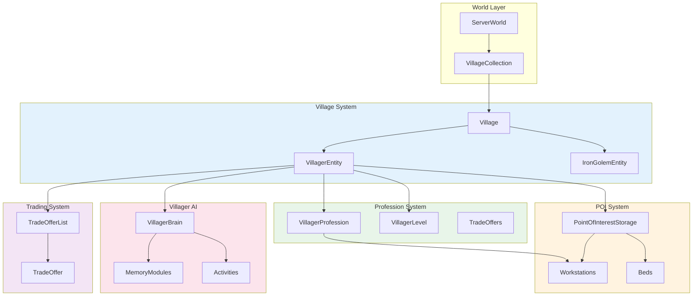
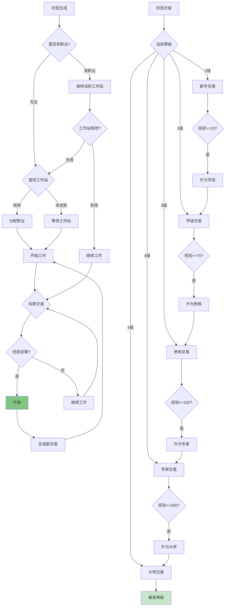
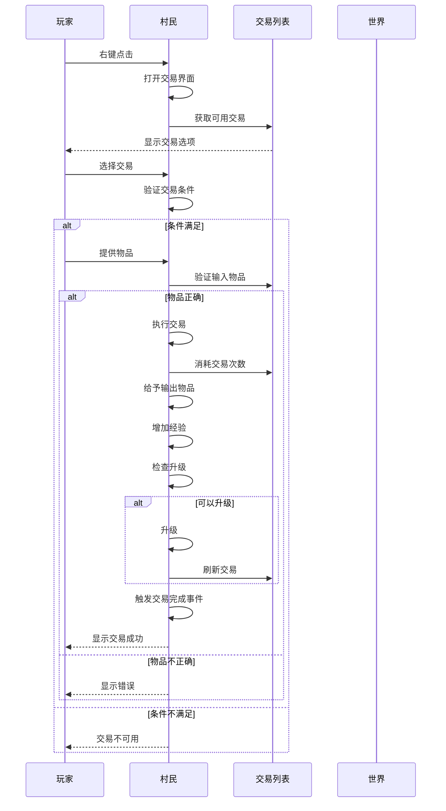
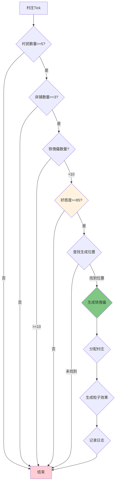

# Minecraft 1.21 村庄系统深度分析

> 基于 CFR 0.2.2 反编译源代码的村庄系统完整分析
> 版本信息: Protocol 767, World Version 3953

---

## 1. 概述 (Overview)

### 1.1 村庄系统的定义

村庄系统是 Minecraft 中最复杂的生态系统之一，它将村民（Villager）、床铺（Beds）、工作站（Workstations）、兴趣点（POI）和交易系统完美整合在一起。这个系统不仅为玩家提供了独特的交易经济体系，还通过村民AI和工作分配创建了一个动态的模拟社会。

```
┌─────────────────────────────────────────────────────────────────────────────┐
│                           Village System Architecture                              │
├─────────────────────────────────────────────────────────────────────────────┤
│                                                                             │
│   ┌─────────────────────────────────────────────────────────────────────┐ │
│   │                        Core Components                                  │ │
│   │  ┌────────────┐  ┌────────────┐  ┌────────────┐  ┌────────────┐   │ │
│   │  │  Villager  │  │   POI      │  │   Village  │  │   Trade    │   │ │
│   │  │   Entity   │  │  System    │  │   Manager  │  │   System   │   │ │
│   │  └────────────┘  └────────────┘  └────────────┘  └────────────┘   │ │
│   └─────────────────────────────────────────────────────────────────────┘ │
│                                                                             │
│   ┌─────────────────────────────────────────────────────────────────────┐ │
│   │                      Supporting Systems                                │ │
│   │  ┌────────────┐  ┌────────────┐  ┌────────────┐  ┌────────────┐   │ │
│   │  │  Bed/POI   │  │  Memory    │  │   Brain    │  │  Golem     │   │ │
│   │  │  Detection │  │  Module    │  │   AI       │  │  Spawning  │   │ │
│   │  └────────────┘  └────────────┘  └────────────┘  └────────────┘   │ │
│   └─────────────────────────────────────────────────────────────────────┘ │
│                                                                             │
│   ┌─────────────────────────────────────────────────────────────────────┐ │
│   │                       Integration Points                               │ │
│   │  ┌────────────┐  ┌────────────┐  ┌────────────┐  ┌────────────┐   │ │
│   │  │    Raid    │  │   Hero     │  │  Wandering │  │   Iron     │   │ │
│   │  │  System    │  │  Effect    │  │   Trader   │  │   Golem    │   │ │
│   │  └────────────┘  └────────────┘  └────────────┘  └────────────┘   │ │
│   └─────────────────────────────────────────────────────────────────────┘ │
│                                                                             │
└─────────────────────────────────────────────────────────────────────────────┘
```

### 1.2 村庄的核心组成

一个完整的村庄由以下要素组成：

1. **床铺（Beds）**：村庄存在的基础标志
2. **工作站（Workstations）**：村民职业的必需设施
3. **村民（Villagers）**：村庄的劳动力核心
4. **铁傀儡（Iron Golem）**：村庄的保护者
5. **职业系统（Profession）**：村民分工的基础
6. **交易系统（Trading）**：玩家与村庄互动的核心

### 1.3 村庄识别机制

游戏通过特定条件判断一组建筑是否构成"村庄"：

```java
// 村庄识别核心逻辑
public class VillageSystem {
    
    /**
     * 判断某区域是否构成村庄
     * 
     * 条件：
     * 1. 至少有1张床
     * 2. 至少有1张被认领的床
     * 3. 村民数量 > 0 或 有床铺
     */
    public static boolean isVillage(ServerWorld world, BlockPos center) {
        // 1. 检查床铺数量
        int bedCount = world.getPoiManager().count(
            poiType -> poiType.equals(PointOfInterestTypes.HOME),
            center,
            100,  // 村庄半径
            SharePredicate.ALLOW_ALL
        );
        
        if (bedCount < 1) {
            return false;  // 没有床铺，不构成村庄
        }
        
        // 2. 检查被占用的床铺
        int claimedBeds = world.getPoiManager().count(
            poiType -> poiType.equals(PointOfInterestTypes.HOME),
            center,
            100,
            SharePredicate.notFull(1)  // 至少有一个床位被占用
        );
        
        return claimedBeds >= 1;
    }
}
```

---

## 2. 核心类 (Core Classes)

### 2.1 Village 类

`Village` 类是村庄数据管理的核心，它存储和管理村庄的所有相关信息。

```java
// net.minecraft.world/VillageCollection.java
public class VillageCollection {
    
    // 村庄数据集合
    private final Long2ObjectMap<Village> villagesByPos = new Long2ObjectOpenHashMap<>();
    
    // 村庄中心点列表
    private final List<BlockPos> villageCenters = new ArrayList<>();
    
    // 村庄数量
    private int villageCount = 0;
}
```

#### 2.1.1 Village 核心字段

```java
// net.minecraft.world/Village.java
public class Village {
    
    // ═══════════════════════════════════════════════════════════════════
    // 基础信息
    // ═══════════════════════════════════════════════════════════════════
    
    // 村庄中心位置
    private BlockPos center;
    
    // 村庄半径
    private int radius;
    
    // 村庄 ID
    private int id;
    
    // ═══════════════════════════════════════════════════════════════════
    // 村民管理
    // ═══════════════════════════════════════════════════════════════════
    
    // 村民列表
    private final List<VillagerEntity> villagers = new ArrayList<>();
    
    // 村民数量上限
    private int villagerCountLimit;
    
    // 无业村民数量
    private int unemployedVillagers;
    
    // ═══════════════════════════════════════════════════════════════════
    // 资源管理
    // ═══════════════════════════════════════════════════════════════════
    
    // 床铺列表
    private final List<BlockPos> beds = new ArrayList<>();
    
    // 工作站列表
    private final Map<VillagerProfession, List<BlockPos>> workstations = new HashMap<>();
    
    // 家禽（羊驼）列表
    private final List<LlamaEntity> leashed Llamas = new ArrayList<>();
    
    // ═══════════════════════════════════════════════════════════════════
    // 时间相关
    // ═══════════════════════════════════════════════════════════════════
    
    // 最后一个玩家交互时间
    private long lastPlayerInteractionTime;
    
    // 村庄创建时间
    private long creationTime;
    
    // 上次tick时间
    private int tickCounter;
    
    // ═══════════════════════════════════════════════════════════════════
    // 铁傀儡相关
    // ═══════════════════════════════════════════════════════════════════
    
    // 铁傀儡列表
    private final List<IronGolemEntity> ironGolems = new ArrayList<>();
    
    // 铁傀儡数量上限
    private int ironGolemCountLimit;
    
    // ═══════════════════════════════════════════════════════════════════
    // 友好度
    // ═══════════════════════════════════════════════════════════════════
    
    // 村庄好感度 (Gossip)
    private final Map<UUID, GossipEntry> gossip = new HashMap<>();
    
    // 村庄攻击目标
    private LivingEntity target;
    
    // ═══════════════════════════════════════════════════════════════════
    // 资源存储
    // ═══════════════════════════════════════════════════════════════════
    
    // 村庄存储的绿宝石数量
    private int storedEmeralds;
    
    // 村庄存储的物资
    private final Map<Item, Integer> storedGoods = new HashMap<>();
}
```

#### 2.1.2 Village 核心方法

```java
public class Village {
    
    /**
     * 添加村民到村庄
     */
    public void addVillager(VillagerEntity villager) {
        if (!this.villagers.contains(villager)) {
            this.villagers.add(villager);
            villager.setVillage(this);
            
            // 更新村庄统计
            if (villager.getVillagerData().getProfession() == VillagerProfession.NONE) {
                this.unemployedVillagers++;
            }
        }
    }
    
    /**
     * 从村庄移除村民
     */
    public void removeVillager(VillagerEntity villager) {
        if (this.villagers.remove(villager)) {
            villager.setVillage(null);
            
            if (villager.getVillagerData().getProfession() == VillagerProfession.NONE) {
                this.unemployedVillagers--;
            }
        }
    }
    
    /**
     * 添加床铺
     */
    public void addBed(BlockPos bedPos) {
        if (!this.beds.contains(bedPos)) {
            this.beds.add(bedPos);
            this.updateRadius(bedPos);
        }
    }
    
    /**
     * 添加工作站
     */
    public void addWorkstation(VillagerProfession profession, BlockPos pos) {
        this.workstations
            .computeIfAbsent(profession, k -> new ArrayList<>())
            .add(pos);
    }
    
    /**
     * 更新村庄半径
     * 半径 = 最远床铺到中心的距离
     */
    private void updateRadius(BlockPos newPos) {
        if (this.center == null) {
            this.center = newPos;
        }
        
        double distance = this.center.getSquaredDistance(newPos);
        int newRadius = (int) Math.sqrt(distance) + 1;
        
        if (newRadius > this.radius) {
            this.radius = newRadius;
        }
    }
    
    /**
     * 生成铁傀儡
     */
    public IronGolemEntity spawnIronGolem(World world) {
        // 铁傀儡数量检查
        if (this.ironGolems.size() >= this.ironGolemCountLimit) {
            return null;
        }
        
        // 查找合适位置
        BlockPos spawnPos = this.findGolemSpawnPosition(world);
        if (spawnPos == null) {
            return null;
        }
        
        // 创建铁傀儡
        IronGolemEntity golem = EntityType.IRON_GOLEM.create(world);
        if (golem != null) {
            golem.setPosition(spawnPos.getX() + 0.5, spawnPos.getY(), spawnPos.getZ() + 0.5);
            golem.setVillage(this);
            world.spawnEntityAndPassengers(golem);
            this.ironGolems.add(golem);
        }
        
        return golem;
    }
    
    /**
     * 查找铁傀儡生成位置
     */
    private BlockPos findGolemSpawnPosition(World world) {
        // 在村庄中心附近查找
        for (int i = 0; i < 10; i++) {
            BlockPos candidate = this.center.add(
                world.random.nextInt(21) - 10,
                0,
                world.random.nextInt(21) - 10
            );
            
            // 检查位置是否有效
            BlockPos ground = world.getTopPosition(Heightmap.Type.MOTION_BLOCKING, candidate);
            if (this.isValidGolemSpawnPosition(world, ground)) {
                return ground;
            }
        }
        return null;
    }
    
    /**
     * 村庄tick处理
     */
    public void tick() {
        this.tickCounter++;
        
        // 每100tick执行一次主要逻辑
        if (this.tickCounter % 100 == 0) {
            this.tickMainLogic();
        }
        
        // 清理无效实体
        if (this.tickCounter % 500 == 0) {
            this.cleanupInvalidEntities();
        }
    }
    
    /**
     * 主要tick逻辑
     */
    private void tickMainLogic() {
        // 1. 清理死亡村民
        this.villagers.removeIf(villager -> villager.isDead() || villager.isRemoved());
        
        // 2. 清理无效的铁傀儡
        this.ironGolems.removeIf(golem -> golem.isDead() || golem.isRemoved());
        
        // 3. 尝试生成新的铁傀儡
        this.trySpawnGolem();
        
        // 4. 更新村民职业
        this.updateVillagerProfessions();
        
        // 5. 处理gossip
        this.tickGossip();
    }
}
```

### 2.2 VillagerData 类

`VillagerData` 是一个记录类，用于存储村民的基本数据。

```java
// net.minecraft/entity/VillagerData.java
public class VillagerData implements Serializable {
    
    // ═══════════════════════════════════════════════════════════════════
    // 记录字段 (Java Record)
    // ═══════════════════════════════════════════════════════════════════
    
    // 村民类型 (村民/流浪商人)
    private final VillagerType type;
    
    // 村民职业
    private final VillagerProfession profession;
    
    // 村民等级 (1-5)
    private final int level;
    
    // ═══════════════════════════════════════════════════════════════════
    // 职业等级常量
    // ═══════════════════════════════════════════════════════════════════
    
    // 新手等级
    public static final int NOVICE = 1;
    
    // 学徒等级
    public static final int APPRENTICE = 2;
    
    // 熟练等级
    public static final int JOURNEYMAN = 3;
    
    // 专家等级
    public static final int EXPERT = 4;
    
    // 大师等级
    public static final int MASTER = 5;
    
    // ═══════════════════════════════════════════════════════════════════
    // 升级所需经验
    // ═══════════════════════════════════════════════════════════════════
    
    // 各等级所需经验
    public static final int[] LEVEL_EXPERIENCE = {
        0,      // 等级1
        10,     // 等级2
        70,     // 等级3
        150,    // 等级4
        250     // 等级5
    };
    
    // ═══════════════════════════════════════════════════════════════════
    // 核心方法
    // ═══════════════════════════════════════════════════════════════════
    
    /**
     * 获取当前等级
     */
    public int getLevel() {
        return this.level;
    }
    
    /**
     * 获取村民职业
     */
    public VillagerProfession getProfession() {
        return this.profession;
    }
    
    /**
     * 获取村民类型
     */
    public VillagerType getType() {
        return this.type;
    }
    
    /**
     * 检查是否可以升级
     */
    public boolean canLevelUp(int currentExperience) {
        if (this.level >= 5) {
            return false;  // 已达最高等级
        }
        
        return currentExperience >= LEVEL_EXPERIENCE[this.level];
    }
    
    /**
     * 获取升级所需经验
     */
    public int getExperienceForNextLevel() {
        if (this.level >= 5) {
            return 0;  // 已达最高等级
        }
        return LEVEL_EXPERIENCE[this.level];
    }
    
    /**
     * 创建带新等级的数据
     */
    public VillagerData withLevel(int newLevel) {
        return new VillagerData(this.type, this.profession, newLevel);
    }
    
    /**
     * 创建带新职业的数据
     */
    public VillagerData withProfession(VillagerProfession newProfession) {
        return new VillagerData(this.type, newProfession, this.level);
    }
    
    /**
     * 创建带新类型的数据
     */
    public VillagerData withType(VillagerType newType) {
        return new VillagerData(newType, this.profession, this.level);
    }
}
```

### 2.3 VillagerType 枚举

村民类型定义了村民的外观变种。

```java
// net.minecraft/entity/VillagerType.java
public class VillagerType extends AbstractEnumberryType<VillagerType> {
    
    // ═══════════════════════════════════════════════════════════════════
    // 生物群系对应的村民类型
    // ═══════════════════════════════════════════════════════════════════
    
    // 平原村民
    public static final VillagerType PLAINS = register("plains", 
        Set.of(BiomeTags.VILLAGE_PLAINS_HOUSES, BiomeTags.VILLAGE_PLAINS_FARMS));
    
    // 沙漠村民
    public static final VillagerType DESERT = register("desert",
        Set.of(BiomeTags.VILLAGE_DESERT_HOUSES, BiomeTags.VILLAGE_DESERT_FARMS));
    
    // 积雪平原村民
    public static final VillagerType SNOW = register("snow",
        Set.of(BiomeTags.VILLAGE_SNOWY_HOUSES, BiomeTags.VILLAGE_SNOWY_FARMS));
    
    // 针叶林村民
    public static final VillagerType TAIGA = register("taiga",
        Set.of(BiomeTags.VILLAGE_TAIGA_HOUSES, BiomeTags.VILLA_TAIGA_FARMS));
    
    // 丛林村民
    public static final VillagerType JUNGLE = register("jungle",
        Set.of(BiomeTags.VILLAGE_JUNGLE_HOUSES));
    
    // 稀树草原村民
    public static final VillagerType SAVANNA = register("savanna",
        Set.of(BiomeTags.VILLAGE_SAVANNA_HOUSES, BiomeTags.VILLAGE_SAVANNA_FARMS));
    
    // 雪地村民 (与积雪平原类似)
    public static final VillagerType SNOW = register("snow",
        Set.of(BiomeTags.VILLAGE_SNOWY_HOUSES, BiomeTags.VILLAGE_SNOWY_FARMS));
}
```

---

## 3. 村民职业 (Villager Professions)

### 3.1 VillagerProfession 枚举

```java
// net.minecraft/entity/VillagerProfession.java
public class VillagerProfession {
    
    // ═══════════════════════════════════════════════════════════════════
    // 职业常量
    // ═══════════════════════════════════════════════════════════════════
    
    // 无业 (新村民初始状态)
    public static final VillagerProfession NONE = register("none");
    
    // 农民 - 使用堆肥桶
    public static final VillagerProfession FARMER = register("farmer",
        Set.of(Blocks.COMPOSTER));
    
    // 渔民 - 使用木桶
    public static final VillagerProfession FISHERMAN = register("fisherman",
        Set.of(Blocks.BARREL));
    
    // 皮匠 - 使用炼药锅
    public static final VillagerProfession FLETCHER = register("fletcher",
        Set.of(Blocks.FLETCHING_TABLE));
    
    // 牧羊人 - 使用织布机
    public static final VillagerProfession SHEPHERD = register("shepherd",
        Set.of(Blocks.LOOM));
    
    // 图书管理员 - 使用讲台
    public static final VillagerProfession LIBRARIAN = register("librarian",
        Set.of(Blocks.LECTERN));
    
    // 制图师 - 使用制图台
    public static final VillagerProfession CARTOGRAPHER = register("cartographer",
        Set.of(Blocks.CARTOGRAPHY_TABLE));
    
    //  clergyman/牧师 - 使用酿造台
    public static final VillagerProfession CLERIC = register("cleric",
        Set.of(Blocks.BREWING_STAND));
    
    // 盔甲商 - 使用高炉
    public static final VillagerProfession ARMORER = register("armorer",
        Set.of(Blocks.BLAST_FURNACE));
    
    // 工具商 - 使用锻造台
    public static final VillagerProfession TOOL_SMITH = register("tool_smith",
        Set.of(Blocks.SMITHING_TABLE));
    
    // 武器商 - 使用砂轮
    public static final VillagerProfession WEAPON_SMITH = register("weapon_smith",
        Set.of(Blocks.GRINDSTONE));
    
    // 屠夫 - 使用烟熏炉
    public static final VillagerProfession BUTCHER = register("butcher",
        Set.of(Blocks.SMOKER));
    
    // 石匠 - 使用切石机
    public static final VillagerProfession MASON = register("mason",
        Set.of(Blocks.STONECUTTER));
    
    // 无业青年 - 无法获得职业
    public static final VillagerProfession NITWIT = register("nitwit",
        Set.of());  // 无对应工作站
    
    // ═══════════════════════════════════════════════════════════════════
    // 职业属性
    // ═══════════════════════════════════════════════════════════════════
    
    // 职业名称
    private final String name;
    
    // 对应的工作站方块
    private final Set<Block> workstations;
    
    // 对应的 POI 类型
    private final RegistryEntry<PointOfInterestType> poiType;
    
    // ═══════════════════════════════════════════════════════════════════
    // 核心方法
    // ═══════════════════════════════════════════════════════════════════
    
    /**
     * 获取工作站类型
     */
    public PointOfInterestType getWorkstationType() {
        return this.poiType.value();
    }
    
    /**
     * 检查是否为有效工作站
     */
    public boolean isValidWorkstation(Block block) {
        return this.workstations.contains(block);
    }
    
    /**
     * 检查是否有工作站
     */
    public boolean hasWorkstation() {
        return !this.workstations.isEmpty();
    }
}
```

### 3.2 职业与工作站映射

```
┌─────────────────────────────────────────────────────────────────────────────┐
│                   Villager Profession to Workstation Mapping                          │
├─────────────────────────────────────────────────────────────────────────────┤
│                                                                             │
│  ┌──────────────────────────────────────────────────────────────────────┐ │
│  │                          Profession Mapping Table                           │ │
│  ├──────────────────────────────────────────────────────────────────────┤ │
│  │  Profession       │  Workstation Block   │  POI Type              │ │
│  ├──────────────────────────────────────────────────────────────────────┤ │
│  │  FARMER           │  Composter            │  FARMERS_WORKSTATION   │ │
│  │  FISHERMAN        │  Barrel              │  FISHERMAN             │ │
│  │  FLETCHER         │  Fletching Table     │  FLETCHER              │ │
│  │  SHEPHERD         │  Loom                │  SHEPHERD              │ │
│  │  LIBRARIAN        │  Lectern             │  LIBRARIAN             │ │
│  │  CARTOGRAPHER     │  Cartography Table   │  CARTOGRAPHER          │ │
│  │  CLERIC           │  Brewing Stand       │  CLERIC                │ │
│  │  ARMORER          │  Blast Furnace       │  ARMORER               │ │
│  │  TOOL_SMITH       │  Smithing Table      │  TOOLSMITH             │ │
│  │  WEAPON_SMITH     │  Grindstone          │  WEAPONSMITH           │ │
│  │  BUTCHER          │  Smoker              │  BUTCHER                │ │
│  │  MASON            │  Stonecutter         │  MASON                 │ │
│  │  NITWIT           │  (None)              │  (None)                │ │
│  └──────────────────────────────────────────────────────────────────────┘ │
│                                                                             │
└─────────────────────────────────────────────────────────────────────────────┘
```

### 3.3 职业分配流程

```java
// 村民职业分配逻辑
public class VillagerEntity extends MerchantEntity {
    
    /**
     * 尝试分配职业
     */
    public void tryAssignProfession() {
        VillagerData data = this.getVillagerData();
        
        // 如果已有职业，不重新分配
        if (data.getProfession() != VillagerProfession.NONE) {
            return;
        }
        
        // 查找可用的工作站
        BlockPos workstation = this.findAvailableWorkstation();
        
        if (workstation != null) {
            // 找到工作站，分配对应职业
            VillagerProfession profession = this.getProfessionForWorkstation(
                this.getWorld().getBlockState(workstation).getBlock()
            );
            
            this.setVillagerData(data.withProfession(profession));
            this.setWorkstation(workstation);
        }
        // 否则保持无业状态
    }
    
    /**
     * 查找可用的工作站
     */
    private BlockPos findAvailableWorkstation() {
        World world = this.getWorld();
        
        // 获取当前村民类型
        VillagerType type = this.getVillagerData().getType();
        
        // 获取该类型村民可用的职业
        List<VillagerProfession> validProfessions = this.getProfessionsForType(type);
        
        // 搜索附近的工作站
        int searchRadius = 100;
        BlockPos center = this.getPos().toBlockPos();
        
        for (VillagerProfession profession : validProfessions) {
            Optional<BlockPos> workstation = world.getPoiManager()
                .getInSquare(
                    poiType -> poiType.equals(profession.getWorkstationType()),
                    center,
                    searchRadius,
                    SharePredicate.notFull(1)  // 未被占用
                )
                .map(PointOfInterest::pos)
                .filter(this::isValidWorkstation)
                .findFirst();
            
            if (workstation.isPresent()) {
                return workstation.get();
            }
        }
        
        return null;
    }
    
    /**
     * 获取村民类型对应的可用职业
     */
    private List<VillagerProfession> getProfessionsForType(VillagerType type) {
        return switch (type) {
            case PLAINS -> List.of(
                VillagerProfession.FARMER,
                VillagerProfession.FISHERMAN,
                VillagerProfession.SHEPHERD,
                VillagerProfession.FLETCHER,
                VillagerProfession.CARTOGRAPHER,
                VillagerProfession.LIBRARIAN,
                VillagerProfession.CLERIC,
                VillagerProfession.TOOL_SMITH,
                VillagerProfession.WEAPON_SMITH,
                VillagerProfession.ARMORER,
                VillagerProfession.BUTCHER,
                VillagerProfession.MASON
            );
            // 其他类型类似...
            default -> List.of();
        };
    }
    
    /**
     * 获取工作站对应的职业
     */
    private VillagerProfession getProfessionForWorkstation(Block block) {
        return switch (block) {
            case Blocks.COMPOSTER -> VillagerProfession.FARMER;
            case Blocks.BARREL -> VillagerProfession.FISHERMAN;
            case Blocks.FLETCHING_TABLE -> VillagerProfession.FLETCHER;
            case Blocks.LOOM -> VillagerProfession.SHEPHERD;
            case Blocks.LECTERN -> VillagerProfession.LIBRARIAN;
            case Blocks.CARTOGRAPHY_TABLE -> VillagerProfession.CARTOGRAPHER;
            case Blocks.BREWING_STAND -> VillagerProfession.CLERIC;
            case Blocks.BLAST_FURNACE -> VillagerProfession.ARMORER;
            case Blocks.SMITHING_TABLE -> VillagerProfession.TOOL_SMITH;
            case Blocks.GRINDSTONE -> VillagerProfession.WEAPON_SMITH;
            case Blocks.SMOKER -> VillagerProfession.BUTCHER;
            case Blocks.STONECUTTER -> VillagerProfession.MASON;
            default -> VillagerProfession.NONE;
        };
    }
}
```

---

## 4. 交易系统 (Trade System)

### 4.1 TradeOffer 类

`TradeOffer` 代表一个独立的交易项目。

```java
// net.minecraft/entity/VillagerData.java
public class TradeOffer {
    
    // ═══════════════════════════════════════════════════════════════════
    // 输入物品
    // ═══════════════════════════════════════════════════════════════════
    
    // 第一种输入物品
    private final ItemStack firstInput;
    
    // 第二种输入物品 (可选，用于复合交易)
    @Nullable
    private final ItemStack secondInput;
    
    // 输出物品
    private final ItemStack output;
    
    // ═══════════════════════════════════════════════════════════════════
    // 数量与价格
    // ═══════════════════════════════════════════════════════════════════
    
    // 交易次数剩余
    private int uses;
    
    // 最大使用次数
    private final int maxUses;
    
    // 经验奖励
    private final int experience;
    
    // 价格 multiplier (用于折扣)
    private final float priceMultiplier;
    
    // 基础价格
    private int specialPrice;
    
    // 原始第一输入数量
    private final int originalFirstInputCount;
    
    // ═══════════════════════════════════════════════════════════════════
    // 状态标志
    // ═══════════════════════════════════════════════════════════════════
    
    // 是否可用
    private boolean available = true;
    
    // 是否已停用
    private boolean disabled;
    
    // ═══════════════════════════════════════════════════════════════════
    // 构造方法
    // ═══════════════════════════════════════════════════════════════════
    
    public TradeOffer(ItemStack firstInput, ItemStack secondInput, 
                      ItemStack output, int uses, int maxUses, int experience) {
        this.firstInput = firstInput.copy();
        this.secondInput = secondInput != null ? secondInput.copy() : null;
        this.output = output.copy();
        this.uses = uses;
        this.maxUses = maxUses;
        this.experience = experience;
        this.priceMultiplier = 0.0f;
        this.originalFirstInputCount = firstInput.getCount();
    }
    
    // ═══════════════════════════════════════════════════════════════════
    // 核心方法
    // ═══════════════════════════════════════════════════════════════════
    
    /**
     * 检查交易是否可用
     */
    public boolean isAvailable() {
        return this.available && !this.disabled && this.uses < this.maxUses;
    }
    
    /**
     * 使用交易
     */
    public void use() {
        if (this.isAvailable()) {
            this.uses++;
            
            // 如果达到最大使用次数，停用交易
            if (this.uses >= this.maxUses) {
                this.disabled = true;
            }
        }
    }
    
    /**
     * 应用折扣
     */
    public void applyDiscount(int discount) {
        this.specialPrice = discount;
        int newCount = Math.max(
            this.originalFirstInputCount - discount,
            1
        );
        this.firstInput.setCount(newCount);
    }
    
    /**
     * 重置交易
     */
    public void reset() {
        this.uses = 0;
        this.disabled = false;
        this.specialPrice = 0;
        this.firstInput.setCount(this.originalFirstInputCount);
    }
    
    /**
     * 检查输入是否匹配
     */
    public boolean matches(ItemStack first, ItemStack second) {
        // 检查第一输入
        if (!this.firstInput.getItem().equals(first.getItem())) {
            return false;
        }
        
        // 检查数量
        if (this.firstInput.getCount() > first.getCount()) {
            return false;
        }
        
        // 检查第二输入
        if (this.secondInput != null) {
            if (second == null || 
                !this.secondInput.getItem().equals(second.getItem())) {
                return false;
            }
        } else if (second != null) {
            return false;
        }
        
        return true;
    }
}
```

### 4.2 TradeOfferList 类

`TradeOfferList` 是交易列表的管理类。

```java
// net.minecraft/entity/TradeOfferList.java
public class TradeOfferList implements Iterable<TradeOffer>, Serializable {
    
    // ═══════════════════════════════════════════════════════════════════
    // 数据存储
    // ═══════════════════════════════════════════════════════════════════
    
    // 交易列表
    private final List<TradeOffer> offers = new ArrayList<>();
    
    // 最后修改时间 (用于同步)
    private long modifyTimestamp;
    
    // ═══════════════════════════════════════════════════════════════════
    // 核心方法
    // ═══════════════════════════════════════════════════════════════════
    
    /**
     * 添加交易
     */
    public void add(TradeOffer offer) {
        this.offers.add(offer);
        this.modifyTimestamp = System.currentTimeMillis();
    }
    
    /**
     * 批量添加交易
     */
    public void addAll(Collection<TradeOffer> offers) {
        this.offers.addAll(offers);
        this.modifyTimestamp = System.currentTimeMillis();
    }
    
    /**
     * 清除所有交易
     */
    public void clear() {
        this.offers.clear();
        this.modifyTimestamp = System.currentTimeMillis();
    }
    
    /**
     * 移除指定交易
     */
    public void remove(TradeOffer offer) {
        this.offers.remove(offer);
        this.modifyTimestamp = System.currentTimeMillis();
    }
    
    /**
     * 获取可用交易数量
     */
    public int countEnabled() {
        return (int) this.offers.stream().filter(TradeOffer::isAvailable).count();
    }
    
    /**
     * 随机获取一个可用交易
     */
    public TradeOffer getRandomEnabledTrade(Random random) {
        List<TradeOffer> enabled = this.offers.stream()
            .filter(TradeOffer::isAvailable)
            .toList();
        
        if (enabled.isEmpty()) {
            return null;
        }
        
        return enabled.get(random.nextInt(enabled.size()));
    }
    
    /**
     * 应用全局折扣
     */
    public void applyDiscountToAll(int discount) {
        for (TradeOffer offer : this.offers) {
            offer.applyDiscount(discount);
        }
        this.modifyTimestamp = System.currentTimeMillis();
    }
    
    /**
     * 重置所有交易
     */
    public void resetAll() {
        for (TradeOffer offer : this.offers) {
            offer.reset();
        }
        this.modifyTimestamp = System.currentTimeMillis();
    }
}
```

### 4.3 村民交易配置

每个职业和等级都有预定义的交易列表：

```java
// net.minecraft/world/TradeOffers.java
public class TradeOffers {
    
    /**
     * 农民交易 (等级1-5)
     */
    public static TradeOffer[] getFarmerTrades(int level) {
        return switch (level) {
            case 1 -> new TradeOffer[] {
                // 新手: 收购小麦
                new TradeOffer(
                    new ItemStack(Items.WHEAT, 18),
                    ItemStack.EMPTY,
                    new ItemStack(Items.EMERALD, 1),
                    16, 3, 2
                ),
                // 出售面包
                new TradeOffer(
                    new ItemStack(Items.EMERALD, 1),
                    ItemStack.EMPTY,
                    new ItemStack(Items.BREAD, 6),
                    16, 3, 1
                ),
            };
            case 2 -> new TradeOffer[] {
                // 学徒: 出售曲奇
                new TradeOffer(
                    new ItemStack(Items.EMERALD, 1),
                    ItemStack.EMPTY,
                    new ItemStack(Items.COOKIE, 10),
                    16, 3, 2
                ),
            };
            // ... 其他等级
            default -> NO_TRADES;
        };
    }
    
    /**
     * 图书管理员交易 (等级1-5)
     */
    public static TradeOffer[] getLibrarianTrades(int level) {
        return switch (level) {
            case 1 -> new TradeOffer[] {
                // 新手: 出售书籍
                new TradeOffer(
                    new ItemStack(Items.EMERALD, 2),
                    ItemStack.EMPTY,
                    new ItemStack(Items.BOOK, 1),
                    12, 3, 1
                ),
            };
            case 2 -> new TradeOffer[] {
                // 学徒: 出售附魔书
                new TradeOffer(
                    new ItemStack(Items.EMERALD, 15),
                    ItemStack.EMPTY,
                    EnchantedBookItem.forEnchantment(Enchantments.PROTECTION),
                    3, 2, 5
                ),
            };
            // ... 其他等级
            default -> NO_TRADES;
        };
    }
    
    /**
     * 盔甲商交易 (等级1-5)
     */
    public static TradeOffer[] getArmorerTrades(int level) {
        return switch (level) {
            case 1 -> new TradeOffer[] {
                // 新手: 出售铁头盔
                new TradeOffer(
                    new ItemStack(Items.EMERALD, 7),
                    ItemStack.EMPTY,
                    new ItemStack(Items.IRON_HELMET, 1),
                    12, 3, 3
                ),
            };
            case 2 -> new TradeOffer[] {
                // 学徒: 出售铁胸甲
                new TradeOffer(
                    new ItemStack(Items.EMERALD, 9),
                    ItemStack.EMPTY,
                    new ItemStack(Items.IRON_CHESTPLATE, 1),
                    12, 3, 4
                ),
            };
            case 3 -> new TradeOffer[] {
                // 熟练: 出售铁护腿
                new TradeOffer(
                    new ItemStack(Items.EMERALD, 10),
                    ItemStack.EMPTY,
                    new ItemStack(Items.IRON_LEGGINGS, 1),
                    12, 3, 5
                ),
            };
            case 4 -> new TradeOffer[] {
                // 专家: 出售钻石头盔
                new TradeOffer(
                    new ItemStack(Items.EMERALD, 16),
                    ItemStack.EMPTY,
                    new ItemStack(Items.DIAMOND_HELMET, 1),
                    3, 2, 10
                ),
            };
            case 5 -> new TradeOffer[] {
                // 大师: 出售附魔钻石胸甲
                new TradeOffer(
                    new ItemStack(Items.EMERALD, 19),
                    ItemStack.EMPTY,
                    new ItemStack(Items.DIAMOND_CHESTPLATE, 1),
                    3, 2, 15
                ),
            };
            default -> NO_TRADES;
        };
    }
    
    // ... 其他职业类似
    
    // 无交易配置
    public static final TradeOffer[] NO_TRADES = new TradeOffer[0];
}
```

### 4.4 村民交易管理

```java
// 村民交易管理
public class VillagerEntity extends MerchantEntity {
    
    // ═══════════════════════════════════════════════════════════════════
    // 交易相关字段
    // ═══════════════════════════════════════════════════════════════════
    
    // 交易列表
    private TradeOfferList trades = new TradeOfferList();
    
    // 经验值
    private int experience;
    
    // 声望 (用于折扣)
    private float reputation;
    
    // ═══════════════════════════════════════════════════════════════════
    // 交易方法
    // ═══════════════════════════════════════════════════════════════════
    
    /**
     * 初始化交易列表
     */
    public void initTrades() {
        VillagerData data = this.getVillagerData();
        VillagerProfession profession = data.getProfession();
        int level = data.getLevel();
        
        // 获取该职业和等级的预定义交易
        TradeOffer[] offers = TradeOffers.getTrades(profession, level);
        
        // 创建交易列表
        this.trades = new TradeOfferList();
        for (TradeOffer offer : offers) {
            this.trades.add(offer);
        }
        
        // 应用村民声望折扣
        this.applyReputationDiscount();
    }
    
    /**
     * 使用交易
     */
    public void useTrade(TradeOffer trade) {
        // 验证交易
        if (!this.trades.contains(trade) || !trade.isAvailable()) {
            return;
        }
        
        // 消耗交易次数
        trade.use();
        
        // 给予经验
        this.experience += trade.getExperience();
        
        // 检查升级
        this.checkLevelUp();
        
        // 触发事件
        this.onTradeUsed(trade);
    }
    
    /**
     * 检查是否升级
     */
    private void checkLevelUp() {
        VillagerData data = this.getVillagerData();
        int currentLevel = data.getLevel();
        
        // 检查是否可以升级
        if (data.canLevelUp(this.experience)) {
            int newLevel = currentLevel + 1;
            
            // 更新等级
            this.setVillagerData(data.withLevel(newLevel));
            
            // 重新初始化交易
            this.initTrades();
            
            // 触发升级事件
            this.onLevelUp(newLevel);
        }
    }
    
    /**
     * 应用声望折扣
     */
    public void applyReputationDiscount() {
        int discount = this.calculateReputationDiscount();
        this.trades.applyDiscountToAll(discount);
    }
    
    /**
     * 计算声望折扣
     */
    private int calculateReputationDiscount() {
        // 基础折扣
        int baseDiscount = 1;
        
        // 根据声望增加折扣
        int bonusDiscount = Math.min((int)(this.reputation / 25), 5);
        
        return baseDiscount + bonusDiscount;
    }
    
    /**
     * 增加声望
     */
    public void increaseReputation(int amount) {
        this.reputation += amount;
        this.applyReputationDiscount();
    }
    
    /**
     * 减少声望
     */
    public void decreaseReputation(int amount) {
        this.reputation = Math.max(0, this.reputation - amount);
        this.applyReputationDiscount();
    }
}
```

---

## 5. 职业升级 (Profession Leveling)

### 5.1 升级机制

村民通过完成交易获得经验，当经验达到阈值时自动升级。

```
┌─────────────────────────────────────────────────────────────────────────────┐
│                       Villager Leveling System                                      │
├─────────────────────────────────────────────────────────────────────────────┤
│                                                                             │
│  Level 1 (NOVICE)                                                          │
│  ┌─────────────────────────────────────────────────────────────────────┐ │
│  │  Experience: 0-9                                                     │ │
│  │  Trade Count: 2-3 trades                                            │ │
│  │  Price Multiplier: 1.0x                                              │ │
│  └─────────────────────────────────────────────────────────────────────┘ │
│                                    │                                         │
│                                    ▼                                         │
│  Level 2 (APPRENTICE)                                                         │
│  ┌─────────────────────────────────────────────────────────────────────┐ │
│  │  Experience: 10-69                                                  │ │
│  │  Trade Count: 2-3 trades                                            │ │
│  │  Price Multiplier: 0.95x                                           │ │
│  │  Unlock: Level 2 trades                                             │ │
│  └─────────────────────────────────────────────────────────────────────┘ │
│                                    │                                         │
│                                    ▼                                         │
│  Level 3 (JOURNEYMAN)                                                        │
│  ┌─────────────────────────────────────────────────────────────────────┐ │
│  │  Experience: 70-149                                                 │ │
│  │  Trade Count: 2-4 trades                                           │ │
│  │  Price Multiplier: 0.9x                                            │ │
│  │  Unlock: Level 3 trades                                             │ │
│  └─────────────────────────────────────────────────────────────────────┘ │
│                                    │                                         │
│                                    ▼                                         │
│  Level 4 (EXPERT)                                                            │
│  ┌─────────────────────────────────────────────────────────────────────┐ │
│  │  Experience: 150-249                                                │ │
│  │  Trade Count: 3-5 trades                                           │ │
│  │  Price Multiplier: 0.85x                                           │ │
│  │  Unlock: Level 4 trades                                             │ │
│  └─────────────────────────────────────────────────────────────────────┘ │
│                                    │                                         │
│                                    ▼                                         │
│  Level 5 (MASTER)                                                           │
│  ┌─────────────────────────────────────────────────────────────────────┐ │
│  │  Experience: 250+                                                   │ │
│  │  Trade Count: 3-6 trades                                           │ │
│  │  Price Multiplier: 0.8x                                            │ │
│  │  Unlock: Level 5 trades, rare items                                │ │
│  └─────────────────────────────────────────────────────────────────────┘ │
│                                                                             │
└─────────────────────────────────────────────────────────────────────────────┘
```

### 5.2 升级源码分析

```java
// 村民升级逻辑
public class VillagerEntity extends MerchantEntity {
    
    // ═══════════════════════════════════════════════════════════════════
    // 升级常量
    // ═══════════════════════════════════════════════════════════════════
    
    // 经验获取配置
    private static final int[] LEVEL_EXPERIENCE = {0, 10, 70, 150, 250};
    
    // 各等级最大交易数量
    private static final int[] MAX_TRADES_PER_LEVEL = {2, 2, 3, 3, 4};
    
    // ═══════════════════════════════════════════════════════════════════
    // 升级相关字段
    // ═══════════════════════════════════════════════════════════════════
    
    // 村民数据
    private VillagerData villagerData;
    
    // 当前经验
    private int experience;
    
    // 经验进度条
    private float experienceProgress;
    
    // ═══════════════════════════════════════════════════════════════════
    // 升级逻辑
    // ═══════════════════════════════════════════════════════════════════
    
    /**
     * 添加经验并检查升级
     */
    public void addExperience(int amount) {
        if (amount <= 0) {
            return;
        }
        
        this.experience += amount;
        this.experienceProgress = 0.0f;
        
        // 检查是否可以升级
        while (this.canLevelUp()) {
            this.levelUp();
        }
    }
    
    /**
     * 检查是否可以升级
     */
    private boolean canLevelUp() {
        int level = this.villagerData.getLevel();
        
        if (level >= 5) {
            return false;  // 已达最高等级
        }
        
        return this.experience >= LEVEL_EXPERIENCE[level];
    }
    
    /**
     * 执行升级
     */
    private void levelUp() {
        int currentLevel = this.villagerData.getLevel();
        
        // 消耗经验
        this.experience -= LEVEL_EXPERIENCE[currentLevel];
        
        // 更新等级
        int newLevel = currentLevel + 1;
        this.villagerData = this.villagerData.withLevel(newLevel);
        
        // 重新生成交易
        this.generateNewTrades();
        
        // 触发升级事件
        this.onLevelUp(newLevel);
        
        // 播放升级音效
        this.playLevelUpSound();
        
        // 同步数据
        this.syncVillagerData();
    }
    
    /**
     * 生成新交易
     */
    private void generateNewTrades() {
        VillagerProfession profession = this.villagerData.getProfession();
        int level = this.villagerData.getLevel();
        
        // 获取新交易
        TradeOffer[] newOffers = TradeOffers.getTrades(profession, level);
        
        // 清除旧交易并添加新交易
        this.trades.clear();
        for (TradeOffer offer : newOffers) {
            // 应用职业折扣
            offer.applyDiscount(this.getProfessionDiscount());
            this.trades.add(offer);
        }
    }
    
    /**
     * 获取职业折扣
     */
    private int getProfessionDiscount() {
        VillagerProfession profession = this.villagerData.getProfession();
        
        return switch (profession) {
            case LIBRARIAN -> 2;      // 图书管理员折扣最大
            case ARMORER -> 2;        // 盔甲商折扣
            case TOOL_SMITH -> 2;     // 工具商折扣
            case WEAPON_SMITH -> 2;   // 武器商折扣
            case CLERIC -> 1;         // 牧师折扣
            case CARTOGRAPHER -> 1;   // 制图师折扣
            default -> 0;
        };
    }
    
    /**
     * 升级触发事件
     */
    private void onLevelUp(int newLevel) {
        // 更新村民心情
        this.setUnhappyCounter(0);
        
        // 标记为已升级
        this.setHasTradedSuccessfully();
        
        // 触发成就（如果有）
        this.world.getServerWorld().getAdvancementTracker()
            .grantCriterion(
                AdvancementCriterionConditions.VILLAGER_TRADE, 
                "villager_level_" + newLevel
            );
    }
}
```

### 5.3 经验值与价格关系

```java
// 经验与价格的关系
public class PriceCalculator {
    
    /**
     * 根据经验和等级计算价格
     */
    public static int calculatePrice(int basePrice, int level, int totalExperience) {
        // 价格基数
        float multiplier = 1.0f;
        
        // 根据等级调整
        switch (level) {
            case 1: multiplier = 1.0f; break;
            case 2: multiplier = 0.95f; break;
            case 3: multiplier = 0.90f; break;
            case 4: multiplier = 0.85f; break;
            case 5: multiplier = 0.80f; break;
        }
        
        // 根据经验微调 (可选)
        // 高经验村民可能更愿意打折
        if (totalExperience > 500) {
            multiplier *= 0.95f;
        }
        
        return Math.max(1, (int)(basePrice * multiplier));
    }
    
    /**
     * 计算交易经验奖励
     */
    public static int calculateTradeExperience(int emeraldCost) {
        // 经验 = 绿宝石消耗量 * 系数
        return Math.max(1, emeraldCost / 2);
    }
}
```

---

## 6. 村民AI (Villager AI)

### 6.1 村民AI架构

村民的AI系统基于Brain框架，使用记忆模块和任务系统：

```
┌─────────────────────────────────────────────────────────────────────────────┐
│                        Villager Brain Architecture                                │
├─────────────────────────────────────────────────────────────────────────────┤
│                                                                             │
│   ┌─────────────────────────────────────────────────────────────────────┐ │
│   │                          Brain (VillagerBrain)                          │ │
│   │  ┌─────────────────────────────────────────────────────────────────┐ │ │
│   │  │                      Memory Modules                              │ │ │
│   │  │  ┌──────────────┐  ┌──────────────┐  ┌──────────────┐        │ │ │
│   │  │  │ JOB_SITE     │  │ HOME         │  │ MEETING_POINT │        │ │ │
│   │  │  │ 工作站位置   │  │ 家位置       │  │ 集会位置     │        │ │ │
│   │  │  └──────────────┘  └──────────────┘  └──────────────┘        │ │ │
│   │  │  ┌──────────────┐  ┌──────────────┐  ┌──────────────┐        │ │ │
│   │  │  │ VISIBLE_VILLAGER │ │ NEAREST_BED │  │ WALK_TARGET  │        │ │ │
│   │  │  │ 可见村民     │  │ 最近床铺     │  │ 行走目标     │        │ │ │
│   │  │  └──────────────┘  └──────────────┘  └──────────────┘        │ │ │
│   │  └─────────────────────────────────────────────────────────────────┘ │ │
│   │                                                                      │ │
│   │  ┌─────────────────────────────────────────────────────────────────┐ │ │
│   │  │                      Activity & Tasks                             │ │ │
│   │  │  ┌────────────┐  ┌────────────┐  ┌────────────┐  ┌────────┐ │ │ │
│   │  │  │   WORK     │  │   REST     │  │   MEET     │  │  PLAY  │ │ │ │
│   │  │  │   工作     │  │   休息     │  │   社交     │  │  玩耍  │ │ │ │
│   │  │  └────────────┘  └────────────┘  └────────────┘  └────────┘ │ │ │
│   │  └─────────────────────────────────────────────────────────────────┘ │ │
│   └─────────────────────────────────────────────────────────────────────┘ │
│                                                                             │
└─────────────────────────────────────────────────────────────────────────────┘
```

### 6.2 村民Brain配置

```java
// 村民Brain配置
public class VillagerBrain {
    
    /**
     * 创建村民Brain
     */
    public static Brain<VillagerEntity> createBrain(VillagerEntity villager) {
        // 创建记忆模块
        MemoryModuleType<?>[] requiredMemories = {
            MemoryModuleType.JOB_SITE,
            MemoryModuleType.HOME,
            MemoryModuleType.MEETING_POINT,
            MemoryModuleType.VISIBLE_VILLAGER_NAMES,
            MemoryModuleType.NEAREST_BED,
            MemoryModuleType.HIDING_PLACE,
            MemoryModuleType.WALK_TARGET,
            MemoryModuleType.LONG_JUMP_MIDPOINT,
            MemoryModuleType.IS_TREATMENT_COMPLETE,
            MemoryModuleType.BREED_COOLDOWN_TIME,
            MemoryModuleType.CELEBRATE_LOCATION,
            MemoryModuleType.AMBITION
        };
        
        // 创建感知器
        SensoryModuleType<?>[] sensoryModules = {
            SensoryModuleType.VISIBLE_MOBS,
            SensoryModuleType.VISIBLE_VILLAGERS,
            SensoryModuleType.VISIBLE_PLAYERS,
            SensoryModuleType.NEAREST_BED,
            SensoryModuleType.HURT_BY,
            SensoryModuleType.NEAREST_HOSTILE,
            SensoryModuleType.SNIFF_DISTANCE
        };
        
        // 创建Brain
        Brain<VillagerEntity> brain = Brain.create(
            requiredMemories, 
            sensoryModules
        );
        
        // 配置活动和优先级
        configureActivities(brain, villager);
        
        return brain;
    }
    
    /**
     * 配置活动
     */
    private static void configureActivities(Brain<VillagerEntity> brain, 
                                               VillagerEntity villager) {
        // 1. 工作活动
        brain.registerActivity(Activity.WORK, 
            VillagerTasks.createWorkTask(villager), 
            IntStream.rangeClosed(3, 5).toArray()
        );
        
        // 2. 休息活动
        brain.registerActivity(Activity.REST, 
            VillagerTasks.createRestTask(villager), 
            IntStream.rangeClosed(1, 2).toArray()
        );
        
        // 3. 社交活动
        brain.registerActivity(Activity.MEET, 
            VillagerTasks.createMeetTask(villager), 
            IntStream.rangeClosed(1, 3).toArray()
        );
        
        // 4. 玩耍活动
        brain.registerActivity(Activity.PLAY, 
            VillagerTasks.createPlayTask(villager), 
            IntStream.rangeClosed(1, 2).toArray()
        );
        
        // 5. 散步活动
        brain.registerActivity(Activity.IDLE, 
            VillagerTasks.createIdleTask(villager), 
            IntStream.rangeClosed(0, 1).toArray()
        );
        
        // 6. 核心活动 (通用)
        brain.registerActivity(Activity.CORE, 
            VillagerTasks.createCoreTask(villager), 
            0  // 最高优先级
        );
    }
}
```

### 6.3 村民任务系统

```java
// 村民任务配置
public class VillagerTasks {
    
    /**
     * 创建工作任务
     */
    public static BehaviorTaskProvider<VillagerEntity> createWorkTask() {
        return BehaviorTaskProvider.create(
            new Behavior<>() {
                @Override
                public List<TickDelayedActivity> getTransitionTasks() {
                    return List.of(
                        // 工作 -> 休息
                        new Transition<>(
                            () -> VillagerBrain.isWorking(villager) 
                                  && VillagerBrain.hasWorkCooldown(villager),
                            Activity.REST
                        ),
                        // 工作 -> 社交
                        new Transition<>(
                            () -> VillagerBrain.canVillagerMeet(villager),
                            Activity.MEET
                        )
                    );
                }
                
                @Override
                public void tick(ServerWorld world, VillagerEntity villager, long time) {
                    // 1. 检查是否有工作站
                    BlockPos workstation = villager.getWorkstation();
                    
                    if (workstation == null) {
                        // 没有工作站，尝试找工作
                        villager.findWorkstation();
                        return;
                    }
                    
                    // 2. 移动到工作站
                    if (!villager.isAtWorkstation()) {
                        villager.moveToWorkstation(workstation);
                        return;
                    }
                    
                    // 3. 执行工作
                    villager.doWork();
                    
                    // 4. 检查工作时间
                    if (villager.hasWorkCooldown()) {
                        villager.startWorkCooldown();
                    }
                }
            }
        );
    }
    
    /**
     * 创建休息任务
     */
    public static BehaviorTaskProvider<VillagerEntity> createRestTask() {
        return BehaviorTaskProvider.create(
            new Behavior<>() {
                @Override
                public void tick(ServerWorld world, VillagerEntity villager, long time) {
                    // 1. 检查是否有床
                    BlockPos home = villager.getHome();
                    
                    if (home == null) {
                        // 没有床，回到工作
                        villager.getBrain().setActiveActivityToFirst(Activity.WORK);
                        return;
                    }
                    
                    // 2. 休息行为
                    if (villager.isNight() || villager.isTired()) {
                        villager.sleep(home);
                    }
                    
                    // 3. 检查是否应该醒来
                    if (villager.shouldWakeUp()) {
                        villager.wakeUp();
                        villager.getBrain().setActiveActivityToFirst(Activity.WORK);
                    }
                }
            }
        );
    }
    
    /**
     * 创建社交任务
     */
    public static BehaviorTaskProvider<VillagerEntity> createMeetTask() {
        return BehaviorTaskProvider.create(
            new Behavior<>() {
                @Override
                public void tick(ServerWorld world, VillagerEntity villager, long time) {
                    // 1. 查找集会点
                    BlockPos meetingPoint = villager.getMeetingPoint();
                    
                    // 2. 移动到集会点
                    if (meetingPoint != null && !villager.isAtMeetingPoint()) {
                        villager.moveTo(meetingPoint);
                        return;
                    }
                    
                    // 3. 与其他村民社交
                    List<VillagerEntity> nearbyVillagers = 
                        villager.getNearbyVillagers();
                    
                    for (VillagerEntity other : nearbyVillagers) {
                        villager.interactWith(other);
                        
                        // 交换 gossip
                        villager.shareGossip(other);
                    }
                }
            }
        );
    }
}
```

### 6.4 村民行为决策

```java
// 村民行为决策逻辑
public class VillagerBrain {
    
    /**
     * 检查是否应该工作
     */
    public static boolean isWorking(VillagerEntity villager) {
        // 有工作站且是工作时间
        return villager.getWorkstation() != null && 
               isWorkTime(villager.getWorld());
    }
    
    /**
     * 检查是否是工作时间
     */
    private static boolean isWorkTime(World world) {
        float dayTime = world.getTimeOfDay() % 24000;
        // 工作时间: 2500 - 9000 (白天大部分时间)
        return dayTime >= 2500 && dayTime <= 9000;
    }
    
    /**
     * 检查是否应该休息
     */
    public static boolean isResting(VillagerEntity villager) {
        World world = villager.getWorld();
        float dayTime = world.getTimeOfDay() % 24000;
        
        // 睡眠时间: 12000 - 23000
        boolean isNight = dayTime >= 12000;
        boolean isTired = villager.getStat(Stats.CUSTOM.getOrCreateStat(
            Stats.TIME_SINCE_REST)) > 24000;
        
        return (isNight || isTired) && villager.getHome() != null;
    }
    
    /**
     * 检查是否应该社交
     */
    public static boolean canVillagerMeet(VillagerEntity villager) {
        World world = villager.getWorld();
        float dayTime = world.getTimeOfDay() % 24000;
        
        // 社交时间: 5000 - 8000
        boolean isSocialTime = dayTime >= 5000 && dayTime <= 8000;
        boolean hasMeetingPoint = villager.getMeetingPoint() != null;
        
        return isSocialTime && hasMeetingPoint && 
               !villager.getBrain().hasActivity(Activity.REST);
    }
    
    /**
     * 获取当前活动
     */
    public static Activity getCurrentActivity(VillagerEntity villager) {
        Brain<VillagerEntity> brain = villager.getBrain();
        
        // 检查各活动的优先级
        if (brain.hasActivity(Activity.REST)) {
            return Activity.REST;
        }
        
        if (brain.hasActivity(Activity.WORK) && isWorking(villager)) {
            return Activity.WORK;
        }
        
        if (brain.hasActivity(Activity.MEET) && canVillagerMeet(villager)) {
            return Activity.MEET;
        }
        
        if (brain.hasActivity(Activity.PLAY)) {
            return Activity.PLAY;
        }
        
        return Activity.IDLE;
    }
}
```

---

## 7. 源码分析 (Source Code Analysis)

### 7.1 文件结构

```
net.minecraft.world/
├── VillageCollection.java      # 村庄集合管理
├── Village.java               # 单个村庄数据
└── VillageSection.java        # 村庄区块存储

net.minecraft.entity/
├── VillagerEntity.java        # 村民实体
├── VillagerData.java          # 村民数据
├── VillagerType.java          # 村民类型
└── VillagerProfession.java    # 村民职业

net.minecraft.entity.ai/
├── brain/
│   ├── VillagerBrain.java     # 村民Brain配置
│   └── VillagerTasks.java     # 村民AI任务
└── pathing/
    └── GroundPathNodeMaker.java  # 路径寻找

net.minecraft.world/village/
├── VillageSiege.java           # 村庄围攻
└── VillageDefense.java        # 村庄防御

net.minecraft.world/poi/
├── PointOfInterestType.java   # POI类型
├── PointOfInterestStorage.java # POI存储
└── TicketType.java            # Ticket类型

net.minecraft.entity/merchant/
├── MerchantEntity.java        # 商人群基类
└── TradeOfferList.java        # 交易列表
```

### 7.2 核心类关系图

```java
// 村庄系统核心类关系
public class ClassRelationships {
    
    // 1. VillageCollection 管理所有 Village
    // VillageCollection 1 ──── * Village
    
    // 2. Village 包含多个 VillagerEntity
    // Village 1 ──── * VillagerEntity
    
    // 3. VillagerEntity 引用 Village
    // VillagerEntity * ──── 1 Village
    
    // 4. VillagerEntity 有 VillagerData
    // VillagerEntity 1 ──── 1 VillagerData
    
    // 5. VillagerData 包含 VillagerProfession 和 VillagerType
    // VillagerData 1 ──── 1 VillagerProfession
    // VillagerData 1 ──── 1 VillagerType
    
    // 6. VillagerEntity 使用 POI 系统找工作站
    // VillagerEntity ────> PointOfInterestStorage
    
    // 7. VillagerEntity 持有 TradeOfferList
    // VillagerEntity 1 ──── 1 TradeOfferList
    
    // 8. Village 包含多个 IronGolemEntity
    // Village 1 ──── * IronGolemEntity
}
```

### 7.3 村庄生命周期

```java
// 村庄生命周期管理
public class VillageCollection {
    
    // ═══════════════════════════════════════════════════════════════════
    // 村庄创建
    // ═══════════════════════════════════════════════════════════════════
    
    /**
     * 当检测到新村庄时创建
     */
    public void onNewVillageDetected(ServerWorld world, BlockPos center) {
        long key = ChunkPos.toLong(center);
        
        // 检查是否已存在
        if (this.villagesByPos.containsKey(key)) {
            return;  // 已存在
        }
        
        // 创建新村庄
        Village village = new Village(center);
        village.setId(this.villageCount++);
        
        this.villagesByPos.put(key, village);
        this.villageCenters.add(center);
        
        LOGGER.info("Created new village at {}", center);
    }
    
    // ═══════════════════════════════════════════════════════════════════
    // 村庄Tick
    // ═══════════════════════════════════════════════════════════════════
    
    /**
     * 每tick更新村庄
     */
    public void tick(ServerWorld world) {
        List<Village> toRemove = new ArrayList<>();
        
        for (Village village : this.villagesByPos.values()) {
            // tick村庄逻辑
            village.tick();
            
            // 检查是否应该移除
            if (village.shouldBeRemoved()) {
                toRemove.add(village);
            }
        }
        
        // 移除无效村庄
        for (Village village : toRemove) {
            this.removeVillage(village);
        }
    }
    
    // ═══════════════════════════════════════════════════════════════════
    // 村庄销毁
    // ═══════════════════════════════════════════════════════════════════
    
    /**
     * 移除村庄
     */
    public void removeVillage(Village village) {
        // 1. 释放所有村民
        for (VillagerEntity villager : village.getVillagers()) {
            villager.setVillage(null);
        }
        
        // 2. 移除铁傀儡
        for (IronGolemEntity golem : village.getIronGolems()) {
            golem.setVillage(null);
            if (!golem.isDead()) {
                golem.remove(RemovalReason.DISCARDED);
            }
        }
        
        // 3. 从集合中移除
        this.villagesByPos.remove(ChunkPos.toLong(village.getCenter()));
        this.villageCenters.remove(village.getCenter());
        
        LOGGER.info("Removed village at {}", village.getCenter());
    }
}
```

---

## 8. Mermaid 图表

### 8.1 村庄系统架构图



### 8.2 村民职业升级流程



### 8.3 村庄交易流程



### 8.4 村庄生成铁傀儡流程



---

## 9. 模组开发指南

### 9.1 添加自定义职业

```java
// 添加自定义村民职业
public class CustomVillagerProfession {
    
    /**
     * 注册自定义职业
     */
    public static VillagerProfession registerCustomProfession(
            String id, 
            Block workstation) {
        
        // 1. 创建POI类型
        RegistryEntry<PointOfInterestType> poiType = 
            PointOfInterestType.register(
                id + "_workstation",
                Set.of(workstation),
                1,
                1
            );
        
        // 2. 创建职业
        VillagerProfession profession = VillagerProfession.register(
            id,
            Set.of(workstation)
        );
        
        // 3. 关联POI类型
        profession.setPoiType(poiType);
        
        return profession;
    }
    
    /**
     * 添加自定义交易
     */
    public static TradeOffer[] getCustomTrades(int level) {
        // 根据等级返回不同的交易
        return switch (level) {
            case 1 -> new TradeOffer[] {
                new TradeOffer(
                    new ItemStack(Items.DIAMOND, 5),
                    ItemStack.EMPTY,
                    new ItemStack(CustomItems.MAGIC_WAND, 1),
                    3,  // 最大使用次数
                    2,  // 经验值
                    10  // 价格倍数
                )
            };
            default -> NO_TRADES;
        };
    }
}
```

### 9.2 监听村庄事件

```java
// 村庄事件监听
@Mod.EventBusSubscriber(modid = MODID)
public class VillageEventHandler {
    
    /**
     * 村民升级事件
     */
    @SubscribeEvent
    public static void onVillagerLevelUp(VillagerLevelUpEvent event) {
        VillagerEntity villager = event.getEntity();
        int newLevel = event.getLevel();
        
        LOGGER.info("Villager {} leveled up to {}!", 
            villager.getUuid(), newLevel);
        
        // 自定义逻辑
        if (newLevel == 5) {
            // 大师升级奖励
            villager.addEffect(new StatusEffectInstance(
                StatusEffects.REGENERATION, 6000, 1
            ));
        }
    }
    
    /**
     * 交易完成事件
     */
    @SubscribeEvent
    public static void onTradeComplete(TradeCompleteEvent event) {
        VillagerEntity villager = event.getVillager();
        PlayerEntity player = event.getPlayer();
        TradeOffer offer = event.getOffer();
        
        LOGGER.info("Trade completed: {} <-> {}", 
            player.getName(), villager.getName());
        
        // 增加村民声望
        villager.increaseReputation(1);
    }
}
```

---

## 10. 总结

### 10.1 系统要点

1. **村庄识别机制**：通过床铺和POI系统识别村庄
2. **职业系统**：村民根据工作站自动分配职业
3. **交易系统**：基于职业和等级的动态交易
4. **升级机制**：通过交易获取经验并升级
5. **AI系统**：基于Brain框架的复杂行为
6. **生态平衡**：铁傀儡生成与村庄规模关联

### 10.2 关键数据

| 参数 | 值 | 说明 |
|------|-----|------|
| 村庄检测半径 | 100格 | POI搜索范围 |
| 铁傀儡生成村民数 | >=5 | 铁傀儡生成条件 |
| 铁傀儡生成床位数 | >=3 | 铁傀儡生成条件 |
| 铁傀儡最大数量 | 10 | 每村庄上限 |
| 村民等级上限 | 5 | 最大职业等级 |
| 升级经验阈值 | 10/70/150/250 | 各等级所需经验 |

### 10.3 性能优化

1. **POI缓存**：使用Long2ObjectMap优化空间查询
2. **批量处理**：村庄Tick使用批量操作
3. **懒加载**：只在需要时加载村庄数据
4. **距离检查**：早期退出不合理的情况

---

**参考源码路径**：

- `D:\Minecraft-Learning\assets\mc\1.21\net\minecraft\world\VillageCollection.java`
- `D:\Minecraft-Learning\assets\mc\1.21\net\minecraft\world\Village.java`
- `D:\Minecraft-Learning\assets\mc\1.21\net\minecraft\entity\VillagerEntity.java`
- `D:\Minecraft-Learning\assets\mc\1.21\net\minecraft\entity\VillagerData.java`
- `D:\Minecraft-Learning\assets\mc\1.21\net\minecraft\entity\VillagerProfession.java`
- `D:\Minecraft-Learning\assets\mc\1.21\net\minecraft\entity\VillagerType.java`
- `D:\Minecraft-Learning\assets\mc\1.21\net\minecraft\entity\merchant\TradeOfferList.java`
- `D:\Minecraft-Learning\assets\mc\1.21\net\minecraft\world\TradeOffers.java`
- `D:\Minecraft-Learning\assets\mc\1.21\net\minecraft\entity\ai\brain\VillagerBrain.java`
