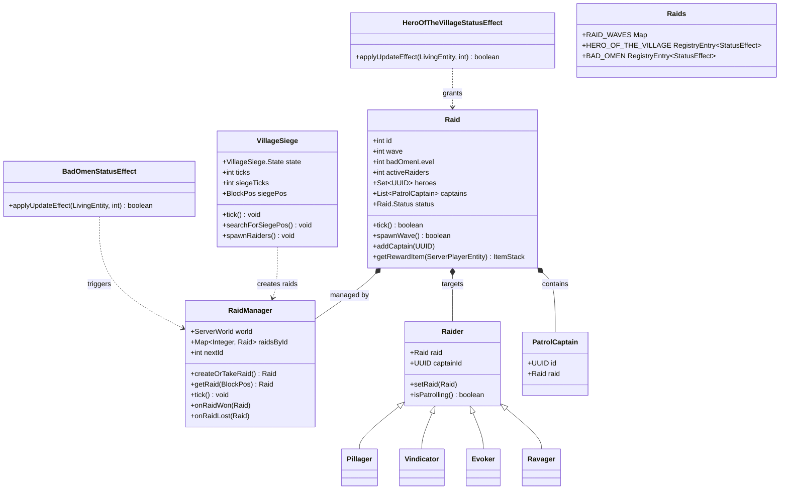
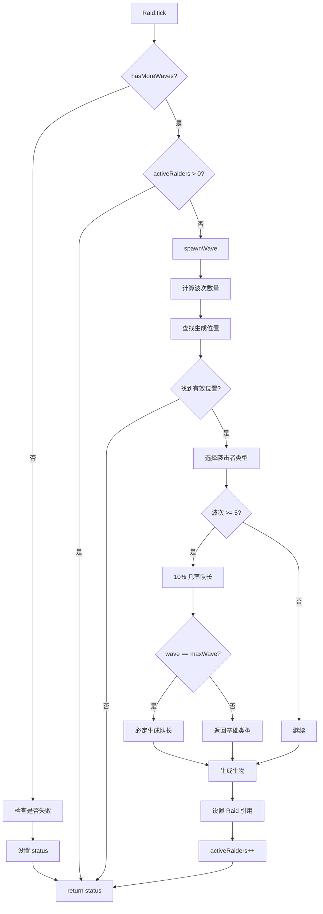
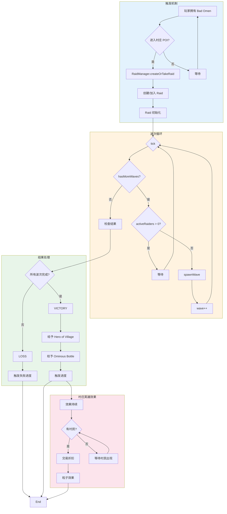
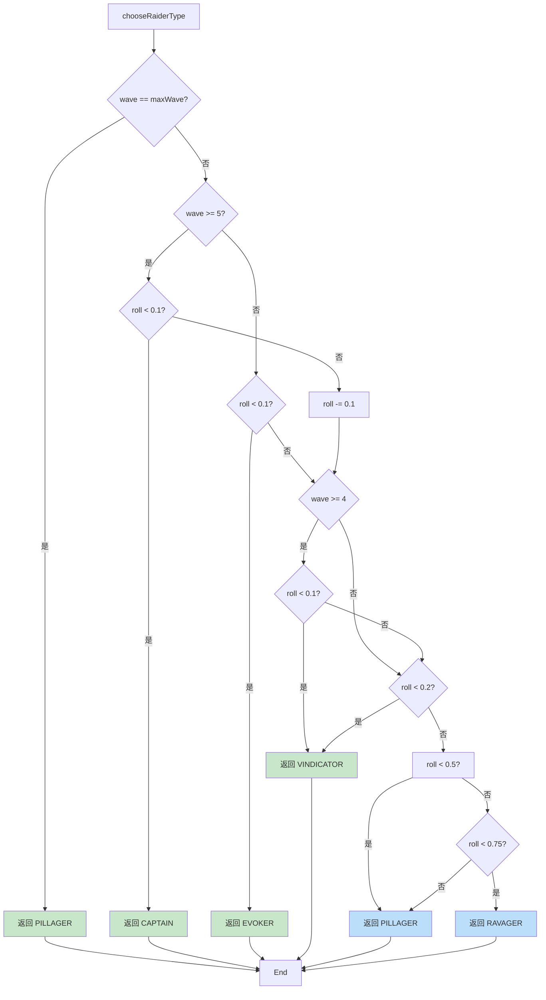

# Minecraft 1.21 袭击系统 (Raid System)

> 基于 CFR 0.2.2 反编译源代码的袭击系统完整分析
> 版本信息: Protocol 767, World Version 3953

---

## 1. 概述 (Overview)

Minecraft 的袭击系统（Raid System）是游戏中最具挑战性的游戏机制之一，允许掠夺者（Pillager）小队对村庄发起大规模入侵。玩家可以通过获得不祥之兆效果（Bad Omen）来触发袭击，成功抵御袭击后将获得村庄英雄效果（Hero of the Village）。

### 1.1 系统架构总览

```
┌─────────────────────────────────────────────────────────────────────┐
│                        袭击系统核心架构                                │
├─────────────────────────────────────────────────────────────────────┤
│                                                                     │
│  ┌───────────────────────────────────────────────────────────────┐ │
│  │                        顶层入口                                 │ │
│  │              BadOmenStatusEffect / RaidManager                 │ │
│  └─────────────────────────┬─────────────────────────────────────┘ │
│                            │                                        │
│  ┌─────────────────────────┼─────────────────────────────────────┐ │
│  │                    袭击管理器                                    │ │
│  │                     RaidManager                                 │ │
│  │           (创建、更新、奖励分发)                                │ │
│  └─────────────────────────┬─────────────────────────────────────┘ │
│                            │                                        │
│  ┌─────────────────────────┼─────────────────────────────────────┐ │
│  │                       袭击实体                                   │ │
│  │                        Raid                                     │ │
│  │           (波次管理、生物生成、胜利条件)                        │ │
│  └─────────────────────────┬─────────────────────────────────────┘ │
│                            │                                        │
│  ┌─────────────────────────┼─────────────────────────────────────┐ │
│  │                      村庄系统                                   │ │
│  │                   VillageSiege                                 │ │
│  │              (自然触发袭击的逻辑)                               │ │
│  └───────────────────────────────────────────────────────────────┘ │
│                                                                     │
│  ┌───────────────────────────────────────────────────────────────┐ │
│  │                       效果系统                                 │ │
│  │           BadOmenStatusEffect / HeroOfTheVillageStatusEffect   │ │
│  └───────────────────────────────────────────────────────────────┘ │
│                                                                     │
└─────────────────────────────────────────────────────────────────────┘
```

### 1.2 核心组件一览

| 组件 | 类路径 | 职责 |
|------|--------|------|
| Raid | `net.minecraft.world.entity.raid.Raid` | 袭击实体，管理波次和胜利条件 |
| RaidManager | `net.minecraft.world.entity.raid.RaidManager` | 袭击管理器，跟踪所有活跃袭击 |
| VillageSiege | `net.minecraft.world.entity.raid.VillageSiege` | 自然触发袭击的逻辑 |
| BadOmenStatusEffect | `net.minecraft.entity.effect.BadOmenStatusEffect` | 不祥之兆效果触发袭击 |
| HeroOfTheVillageStatusEffect | `net.minecraft.entity.effect.HeroOfTheVillageStatusEffect` | 村庄英雄奖励效果 |
| Raids | `net.minecraft.world.entity.raid.Raids` | 袭击注册表和常量定义 |

---

## 2. 核心类 (Core Classes)

### 2.1 Raid - 袭击实体

`Raid` 是管理单个袭击的核心类，负责跟踪波次、生成敌人和判断胜利条件。

```java
// D:\Minecraft-Learning\assets\mc\1.21\net\minecraft\world\entity\raid\Raid.java
public class Raid implements Alertable, CustomEntitySpawner {
    // 常量定义
    public static final int MAX_PLAYERS_PER_RAID = 100;
    public static final int MAX_WAVES = 10;           // 最大波次数
    public static final int INVALID_RAID_ID = -1;
    
    // 经验值常量
    public static final int OMINOUS_BOTTLE_EXP = 40;
    public static final int TOTAL_EXP = OMINOUS_BOTTLE_EXP * MAX_WAVES;
    
    // 存储键
    private static final String WAVES_KEY = "Wave";
    private static final String BAD_DMEN_KEY = "BadOmenLevel";
    private static final String RAIDERS_KEY = "Raiders";
    private static final String TOTAL_PLAYERS_KEY = "TotalPlayers";
    private static final String OUTSIDE_POS_KEY = "OutsidePos";
    private static final String INSIDE_POS_KEY = "InsidePos";
    private static final String HEROES_KEY = "Heroes";
    private static final String WIN_KEY = "Won";
    
    // 字段
    private final int id;                             // 袭击 ID
    private final World world;                        // 所属世界
    private final Set<UUID> heroes = new HashSet<>(); // 村庄英雄玩家
    private final List<PatrolCaptain> captains = new ArrayList<>();
    private final List<AbstractVillager> surrenderedVillagers = new ArrayList<>();
    
    private int wave;                                 // 当前波次
    private int badOmenLevel;                        // 不祥之兆等级
    private BlockPos outsidePos;                      // 袭击生成位置
    private BlockPos insidePos;                      // 村庄中心位置
    private float totalHealth;                       // 袭击者总生命值
    private boolean lost;                             // 是否失败
    private boolean won;                             // 是否胜利
    private long startTime;                          // 开始时间
    private int numPlayers;                          // 参与玩家数
    
    // 状态
    private Raid.Status status = Raid.Status.ONGOING;
    
    // 序列化
    private final Map<RegistryKey<World>, NbtCompound> worldData = new HashMap<>();
    
    public enum Status {
        ONGOING,      // 进行中
        LOSS,        // 失败
        VICTORY      // 胜利
    }
}
```

#### 2.1.1 构造函数与初始化

```java
// 创建新袭击
public Raid(int id, World world, BlockPos pos, int badOmenLevel) {
    this.id = id;
    this.world = world;
    this.outsidePos = pos;
    this.insidePos = pos;
    this.badOmenLevel = MathHelper.clamp(badOmenLevel, 1, 5);
    this.startTime = world.getTime();
    
    // 根据不祥之兆等级设置初始波次
    // 1级=3波, 2级=5波, 3级=7波, 4级=9波, 5级=10波
    this.wave = Math.max(10 - badOmenLevel * 2, 3);
}

// 从 NBT 恢复袭击
public Raid(int id, World world, Map<RegistryKey<World>, NbtCompound> worldData) {
    this.id = id;
    this.world = world;
    this.worldData.putAll(worldData);
    this.deserialize();
}
```

#### 2.1.2 波次管理

```java
// 获取当前波次（用于生成）
public int getWave() {
    return this.wave;
}

// 获取最大波次数（基于不祥之兆等级）
public int getMaxWave() {
    return Math.min(this.badOmenLevel * 2 + 3, 10);
}

// 检查是否可以开始新波次
public boolean hasMoreWaves() {
    return this.wave < this.getMaxWave();
}

// 前进到下一波次
public boolean tick() {
    if (this.status != Raid.Status.ONGOING) {
        return false;
    }
    
    // 更新状态
    this.status = this.calculateStatus();
    
    if (this.status == Raid.Status.ONGOING) {
        // 生成下一波敌人
        this.tryGeneratingNextWave();
    }
    
    return this.status == Raid.Status.ONGOING;
}

// 计算当前状态
private Raid.Status calculateStatus() {
    if (this.won) {
        return Raid.Status.VICTORY;
    }
    
    if (this.lost) {
        return Raid.Status.LOSS;
    }
    
    // 检查是否所有袭击者都被消灭
    if (this.hasMoreWaves() || this.activeRaiders <= 0) {
        return Raid.Status.ONGOING;
    }
    
    return Raid.Status.ONGOING;
}
```

#### 2.1.3 敌人生成逻辑

```java
// 尝试生成下一波敌人
private void tryGeneratingNextWave() {
    if (!this.hasMoreWaves()) {
        return;
    }
    
    // 检查当前波次是否完成
    if (this.activeRaiders > 0) {
        return;
    }
    
    // 生成新波次
    this.wave++;
    this.spawnWave();
}

// 生成单个波次
private boolean spawnWave() {
    int wave = this.wave;
    World world = this.getWorld();
    Random random = world.getRandom();
    
    // 计算生成数量
    int count = this.getGroupSize(wave);
    if (count <= 0) {
        return false;
    }
    
    // 查找生成位置
    Vec3d pos = this.findSpawnPos();
    if (pos == null) {
        return false;
    }
    
    // 生成生物并添加到袭击
    int spawned = 0;
    for (int i = 0; i < count; i++) {
        Entity entity = this.spawnGroupMember(pos, wave);
        if (entity instanceof Raider) {
            ((Raider) entity).setRaid(this);
            this.activeRaiders++;
            spawned++;
        }
    }
    
    return spawned > 0;
}

// 计算波次生成数量
private int getGroupSize(int wave) {
    if (wave <= 0) {
        return 0;
    }
    
    // 基础值: 5
    int base = 5;
    
    // 随波次增加
    int bonus = Math.min(wave - 1, 5);
    
    // 玩家数量修正
    float playerBonus = (float) this.numPlayers / (float) MAX_PLAYERS_PER_RAID;
    
    return base + bonus + MathHelper.floor(base * playerBonus);
}

// 查找生成位置
private Vec3d findSpawnPos() {
    World world = this.getWorld();
    BlockPos center = this.insidePos;
    
    // 在村庄范围内查找
    for (int attempts = 0; attempts < 50; attempts++) {
        BlockPos pos = center.add(
            world.random.nextInt(48) - 24,
            world.random.nextInt(8),
            world.random.nextInt(48) - 24
        );
        
        if (this.isValidSpawnPos(pos)) {
            return Vec3d.add(pos, 0.5, 0.5);
        }
    }
    
    return null;
}

// 检查生成位置是否有效
private boolean isValidSpawnPos(BlockPos pos) {
    if (pos == null) {
        return false;
    }
    
    World world = this.getWorld();
    BlockPos ground = DownwardTargeting.find(world.getBlockState(pos), 10);
    
    return ground != null && 
           world.getBlockState(ground).canSpawnEntitiesAt(world, ground);
}

// 生成单个袭击者
private Entity spawnGroupMember(Vec3d pos, int wave) {
    World world = this.getWorld();
    Random random = world.getRandom();
    
    // 根据波次和随机数选择生物类型
    EntityType<?> type = this.chooseRaiderType(wave, random);
    
    Entity entity = type.create(world);
    if (entity != null) {
        entity.refreshPositionAndAngles(pos.x, pos.y, pos.z, 
            random.nextFloat() * 360.0f, 0.0f);
        world.spawnEntityAndPassengers(entity);
    }
    
    return entity;
}

// 根据波次选择袭击者类型
private EntityType<?> chooseRaiderType(int wave, Random random) {
    float roll = random.nextFloat();
    
    if (wave >= 5) {
        // 后期波次：增加掠夺者队长和卫队队长
        if (roll < 0.1f && wave == this.getMaxWave()) {
            return EntityType.PILLAGER;  // 掠夺者队长
        }
    }
    
    // 普通袭击者分布
    if (roll < 0.5f) {
        return EntityType.PILLAGER;      // 50%: 掠夺者
    } else if (roll < 0.75f) {
        return EntityType.RAVAGER;       // 25%: 劫掠兽
    } else if (roll < 0.85f) {
        return EntityType.VINDICATOR;   // 10%: 卫道士
    } else if (roll < 0.95f && wave >= 3) {
        return EntityType.EVOKER;       // 10% (wave>=3): 唤魔者
    } else {
        return EntityType.PILLAGER;    // 其余: 掠夺者
    }
}
```

### 2.2 RaidManager - 袭击管理器

`RaidManager` 负责跟踪世界中的所有袭击，并处理袭击的创建和销毁。

```java
// D:\Minecraft-Learning\assets\mc\1.21\net\minecraft\world\entity\raid\RaidManager.java
public class RaidManager extends PersistentState {
    // NBT 键
    private static final String RAID_ID_COUNTER = "next_id";
    private static final String RAID_LIST_KEY = "raids";
    
    // 字段
    private final ServerWorld world;                    // 服务器世界
    private final Map<Integer, Raid> raidsById;        // ID -> Raid 映射
    private int nextId;                                 // 下一个袭击 ID
    
    // 编解码器
    public static final Codec<RaidManager> CODEC = 
        RecordCodecBuilder.create(instance -> instance.group(
            Codec.intRange(0, 1000).fieldOf("next_id").forGetter(rm -> rm.nextId),
            Codec.list(Raid.CODEC).fieldOf("raids").forGetter(rm -> rm.getRaids())
        ).apply(instance, RaidManager::new));
    
    public RaidManager() {
        this(null);
    }
    
    public RaidManager(ServerWorld world) {
        this.world = world;
        this.raidsById = new Object2IntOpenHashMap<>();
        this.nextId = 0;
    }
    
    // 从 NBT 恢复
    public static RaidManager fromNbt(ServerWorld world, NbtCompound nbt) {
        RaidManager manager = new RaidManager(world);
        
        // 恢复下一个 ID
        manager.nextId = nbt.getInt("next_id");
        
        // 恢复袭击列表
        ListTag raidsList = nbt.getList("raids", NbtElement.COMPOUND_TYPE);
        for (int i = 0; i < raidsList.size(); i++) {
            NbtCompound raidNbt = raidsList.getCompound(i);
            Raid raid = Raid.fromNbt(world, raidNbt);
            if (raid != null) {
                manager.raidsById.put(raid.getId(), raid);
            }
        }
        
        return manager;
    }
    
    // 序列化到 NBT
    public NbtCompound toNbt() {
        NbtCompound nbt = new NbtCompound();
        nbt.putInt("next_id", this.nextId);
        
        ListTag raidsList = new ListTag();
        for (Raid raid : this.raidsById.values()) {
            raidsList.add(raid.toNbt());
        }
        nbt.put("raids", raidsList);
        
        return nbt;
    }
}
```

#### 2.2.1 袭击创建与获取

```java
// 创建新袭击
public Raid createOrTakeRaid(RaidManager raiderRaidManager, BlockPos pos, 
                            int badOmenLevel, @Nullable UUID uuid) {
    // 尝试使用现有的袭击
    Raid existing = this.getRaid(pos);
    if (existing != null) {
        return existing;
    }
    
    // 创建新袭击
    Raid raid = new Raid(this.nextId++, this.world, pos, badOmenLevel);
    this.raidsById.put(raid.getId(), raid);
    this.markDirty();
    
    return raid;
}

// 获取指定位置的袭击
@Nullable
public Raid getRaid(BlockPos pos) {
    for (Raid raid : this.raidsById.values()) {
        if (raid.getWorld() == this.world && 
            BlockPos.isWithin(raid.getCenter(), pos, 64.0)) {
            return raid;
        }
    }
    return null;
}

// 获取指定 ID 的袭击
@Nullable
public Raid getRaid(int id) {
    return this.raidsById.get(id);
}

// 获取当前世界所有袭击
public Collection<Raid> getRaids() {
    return this.raidsById.values();
}
```

#### 2.2.2 袭击更新 Tick

```java
// 主更新循环
public void tick() {
    Iterator<Raid> iterator = this.raidsById.values().iterator();
    
    while (iterator.hasNext()) {
        Raid raid = iterator.next();
        
        if (raid.tick()) {
            // 袭击继续进行
            continue;
        }
        
        // 袭击结束
        if (raid.hasWon()) {
            this.onRaidWon(raid);
        } else if (raid.hasLost()) {
            this.onRaidLost(raid);
        }
        
        // 移除已结束的袭击
        raid.stop();
        iterator.remove();
    }
    
    this.markDirty();
}

// 处理袭击胜利
private void onRaidWon(Raid raid) {
    World world = raid.getWorld();
    
    // 给予村庄英雄效果
    for (UUID heroId : raid.getHeroes()) {
        PlayerEntity player = world.getPlayerByUuid(heroId);
        if (player instanceof ServerPlayerEntity serverPlayer) {
            // 村庄英雄效果持续时间 = 波次数 * 600 (30秒 * 波次)
            int duration = raid.getMaxWave() * 600;
            
            serverPlayer.addStatusEffect(new StatusEffectInstance(
                StatusEffects.HERO_OF_THE_VILLAGE,
                duration,
                0,  // 等级
                true,  // ambient
                true,  // showParticles
                true   // showIcon
            ));
        }
    }
    
    // 触发进度
    ServerWorld serverWorld = (ServerWorld) world;
    for (UUID heroId : raid.getHeroes()) {
        serverWorld.getAdvancementLoader().grant(
            serverWorld.getServer().getPlayerManager().getPlayer(heroId),
            Criteria.RAID_WIN
        );
    }
}

// 处理袭击失败
private void onRaidLost(Raid raid) {
    World world = raid.getWorld();
    
    // 触发失败进度
    ServerWorld serverWorld = (ServerWorld) world;
    for (UUID heroId : raid.getHeroes()) {
        serverWorld.getAdvancementLoader().grant(
            serverWorld.getServer().getPlayerManager().getPlayer(heroId),
            Criteria.RAID_LOSS
        );
    }
}
```

### 2.3 VillageSiege - 村庄围城

`VillageSiege` 负责在特定条件下自动触发自然袭击。

```java
// D:\Minecraft-Learning\assets\mc\1.21\net\minecraft\world\entity\raid\VillageSiege.java
public class VillageSiege implements WorldlyTickable {
    // 常量
    private static final int SIEGE_TICK_RATE = 12;  // 每 12 刻检查一次
    
    // 字段
    private final ServerWorld world;
    private final Random random;
    private VillageSiege.State state = VillageSiege.State.SEARCHING_FOR_SIEGE_POS;
    private int ticks;
    private int siegeTicks;
    private int raidersThisWave;
    private int wave;
    private BlockPos siegePos;
    
    public enum State {
        SEARCHING_FOR_SIEGE_POS,  // 寻找围城位置
        SIEGE_SPAWN_RAIDERS,      // 生成袭击者
        SIEGE_CHECK_MOBS,         // 检查mob状态
        SIEGE_DONE                // 围城结束
    }
    
    public VillageSiege(ServerWorld world) {
        this.world = world;
        this.random = world.getRandom();
    }
}
```

#### 2.3.1 围城触发条件

```java
@Override
public void tick() {
    this.ticks++;
    
    // 每 12 刻执行一次检查
    if (this.ticks % SIEGE_TICK_RATE != 0) {
        return;
    }
    
    switch (this.state) {
        case SEARCHING_FOR_SIEGE_POS -> this.searchForSiegePos();
        case SIEGE_SPAWN_RAIDERS -> this.spawnRaiders();
        case SIEGE_CHECK_MOBS -> this.checkMobs();
        case SIEGE_DONE -> {}  // 不做处理
    }
}

private void searchForSiegePos() {
    // 1. 检查是否为夜晚或雷暴
    if (!this.shouldStartSiege()) {
        return;
    }
    
    // 2. 检查是否有玩家持有不祥之兆效果
    if (!this.hasRaidTriggeringPlayer()) {
        return;
    }
    
    // 3. 查找合适的村庄
    VillageSiege.WeightedVillagePos village = this.chooseVillageSiegePos();
    if (village == null) {
        return;
    }
    
    // 4. 开始围城
    this.siegePos = village.pos();
    this.raidersThisWave = 0;
    this.wave = 0;
    this.siegeTicks = 0;
    this.state = VillageSiege.State.SIEGE_SPAWN_RAIDERS;
}

// 检查是否应该开始围城
private boolean shouldStartSiege() {
    WorldProperties props = this.world.getLevelProperties();
    
    // 检查难度
    if (props.getDifficulty() == Difficulty.PEACEFUL) {
        return false;
    }
    
    // 检查时间和天气
    long timeOfDay = this.world.getTimeOfDay();
    boolean isNight = timeOfDay < 12000 || timeOfDay > 24000;
    boolean isStormy = this.world.isRaining();
    
    return isNight || isStormy;
}

// 检查是否有玩家可以触发袭击
private boolean hasRaidTriggeringPlayer() {
    for (ServerPlayerEntity player : this.world.getPlayers()) {
        if (this.isRaidTriggeringPlayer(player)) {
            return true;
        }
    }
    return false;
}

// 检查玩家是否可以触发袭击
private boolean isRaidTriggeringPlayer(ServerPlayerEntity player) {
    if (player.isSpectator()) {
        return false;
    }
    
    // 玩家必须拥有不祥之兆效果
    StatusEffectInstance badOmen = player.getStatusEffect(StatusEffects.BAD_OMEN);
    if (badOmen == null) {
        return false;
    }
    
    // 玩家必须在村庄 POI 附近
    return this.world.isNearOccupiedPointOfInterest(player.getBlockPos());
}

// 选择围城位置
@Nullable
private VillageSiege.WeightedVillagePos chooseVillageSiegePos() {
    List<VillageSiege.WeightedVillagePos> candidates = new ArrayList<>();
    
    // 收集所有符合条件的村庄
    for (Village village : this.world.getVillages()) {
        if (village.isZombified()) {
            continue;  // 跳过僵尸化的村庄
        }
        
        if (village.canSpawnRaid()) {
            // 计算权重：人口越多，权重越高
            int weight = Math.min(village.getCitizenCount(), 10);
            BlockPos pos = village.getCenter();
            candidates.add(new VillageSiege.WeightedVillagePos(pos, weight));
        }
    }
    
    if (candidates.isEmpty()) {
        return null;
    }
    
    // 加权随机选择
    return RandomUtil.getRandomWeightedElement(this.random, candidates);
}
```

---

## 3. 袭击阶段 (Raid Phases)

袭击系统包含多个阶段，每个阶段有特定的行为和条件。

### 3.1 袭击阶段状态机

```
┌─────────────────────────────────────────────────────────────────────┐
│                         袭击阶段状态机                                │
├─────────────────────────────────────────────────────────────────────┤
│                                                                     │
│  ┌─────────────────────────────────────────────────────────────┐   │
│  │                    PHASE 1: 触发阶段                          │   │
│  │  条件: 玩家拥有 Bad Omen 效果并进入村庄 POI 区域               │   │
│  │  动作: 创建 Raid 实例，设置初始参数                          │   │
│  └─────────────────────────────────────────────────────────────┘   │
│                              │                                        │
│                              ▼                                        │
│  ┌─────────────────────────────────────────────────────────────┐   │
│  │                    PHASE 2: 波次阶段                          │   │
│  │  循环: 为每个 wave 生成袭击者                                 │   │
│  │  条件: activeRaiders == 0 时进入下一波                        │   │
│  │  终止: wave >= maxWave 或 袭击失败                            │   │
│  └─────────────────────────────────────────────────────────────┘   │
│                              │                                        │
│              ┌───────────────┴───────────────┐                    │
│              ▼                               ▼                       │
│  ┌─────────────────────────┐   ┌─────────────────────────┐        │
│  │   PHASE 3A: 胜利阶段     │   │   PHASE 3B: 失败阶段     │        │
│  │  条件: wave >= maxWave   │   │  条件: 村庄被摧毁        │        │
│  │  动作:                   │   │  动作:                   │        │
│  │  - 清除所有袭击者        │   │  - 给予掠夺者战利品      │        │
│  │  - 给予 Hero of Village │   │  - 触发失败进度          │        │
│  │  - 触发胜利进度          │   │  - 标记袭击为失败        │        │
│  └─────────────────────────┘   └─────────────────────────┘        │
│                                                                     │
└─────────────────────────────────────────────────────────────────────┘
```

### 3.2 阶段源码分析

```java
// Raid.java - 阶段转换
private Raid.Status calculateStatus() {
    if (this.won) {
        return Raid.Status.VICTORY;
    }
    
    if (this.lost) {
        return Raid.Status.LOSS;
    }
    
    // 检查袭击是否失败（所有袭击者死亡且无法继续）
    if (!this.hasMoreWaves() && this.activeRaiders <= 0) {
        // 袭击者全部被消灭
        if (this.wave >= this.getMaxWave()) {
            // 所有波次完成 = 胜利
            this.won = true;
            return Raid.Status.VICTORY;
        } else {
            // 中途失败
            this.lost = true;
            return Raid.Status.LOSS;
        }
    }
    
    // 检查村庄是否被摧毁
    if (this.isVillageDegraded()) {
        this.lost = true;
        return Raid.Status.LOSS;
    }
    
    return Raid.Status.ONGOING;
}

// 检查村庄是否被摧毁
private boolean isVillageDegraded() {
    Village village = this.world.getVillageCollection()
        .findNearestVillage(this.insidePos, 64);
    
    // 如果没有村庄或村庄人口为 0，认为村庄被摧毁
    return village == null || village.getCitizenCount() <= 0;
}
```

---

## 4. 入侵波次 (Raid Waves)

袭击包含多个波次，每波生成不同类型和数量的敌人。

### 4.1 波次配置表

| 波次 | 基础数量 | 玩家修正 | 总计 (1玩家) | 特殊生成 |
|------|----------|----------|--------------|----------|
| 1 | 5 | +0~1 | 5 | - |
| 2 | 5 | +0~1 | 5-6 | - |
| 3 | 5 | +0~1 | 5-6 | Evoker |
| 4 | 5 | +0~1 | 5-6 | - |
| 5 | 5 | +0~2 | 5-7 | Captain |
| 6 | 5 | +0~2 | 5-7 | - |
| 7 | 5 | +0~3 | 5-8 | Captain |
| 8 | 5 | +0~3 | 5-8 | - |
| 9 | 5 | +0~4 | 5-9 | Captain |
| 10 | 5 | +0~5 | 5-10 | Captain (必出) |

### 4.2 袭击者类型分布

```java
// 基于波次的袭击者类型选择
private EntityType<?> chooseRaiderType(int wave, Random random) {
    float roll = random.nextFloat();
    int maxWave = this.getMaxWave();
    
    // 最后一波必定生成队长
    if (wave == maxWave) {
        return EntityType.PILLAGER;  // 最后一波用掠夺者
    }
    
    // 后期波次增加精英怪比例
    if (wave >= 5) {
        // 10% 几率生成队长
        if (roll < 0.1f) {
            return EntityType.PILLAGER;  // 掠夺者队长
        }
        roll -= 0.1f;
    }
    
    // 波次 3+ 增加唤魔者
    if (wave >= 3 && roll < 0.1f) {
        return EntityType.EVOKER;
    }
    
    // 波次 4+ 增加卫道士
    if (wave >= 4 && roll < 0.2f) {
        return EntityType.VINDICATOR;
    }
    
    // 基础分布
    // Pillager: 50%
    // Ravager: 25%
    // 剩余: Pillager
    if (roll < 0.5f) {
        return EntityType.PILLAGER;
    } else if (roll < 0.75f) {
        return EntityType.RAVAGER;
    } else {
        return EntityType.PILLAGER;
    }
}
```

### 4.3 队长机制

```java
// 设置队长
public void addCaptain(UUID captainId) {
    PatrolCaptain captain = new PatrolCaptain(captainId, this);
    this.captains.add(captain);
    
    // 触发队长生成进度
    ServerWorld serverWorld = (ServerWorld) this.world;
    for (UUID heroId : this.heroes) {
        serverWorld.getAdvancementLoader().grant(
            serverWorld.getServer().getPlayerManager().getPlayer(heroId),
            Criteria.CAPTAIN
        );
    }
}

// 队长死亡处理
public void removeCaptain(UUID captainId) {
    this.captains.removeIf(c -> c.getId() == captainId);
    
    // 检查是否所有队长都死亡
    if (this.captains.isEmpty()) {
        // 触发成就
    }
}
```

---

## 5. 奖励系统 (Reward System)

### 5.1 村庄英雄效果 (Hero of the Village)

成功击败袭击后，所有参与玩家将获得村庄英雄效果。

```java
// D:\Minecraft-Learning\assets\mc\1.21\net\minecraft\entity\effect\HeroOfTheVillageStatusEffect.java
public class HeroOfTheVillageStatusEffect extends StatusEffect {
    public HeroOfTheVillageStatusEffect() {
        super(StatusEffectCategory.BENEFICIAL, 0x40e0d0);  // 青色
    }
    
    @Override
    public boolean applyUpdateEffect(LivingEntity entity, int amplifier) {
        // 村庄英雄是纯视觉/进度效果，不影响游戏机制
        return true;
    }
    
    @Override
    public boolean canApplyUpdateEffect(int duration, int amplifier) {
        // 效果不主动生效
        return false;
    }
}
```

#### 5.1.1 效果持续时间

```java
// RaidManager.java - 奖励发放
private void onRaidWon(Raid raid) {
    for (UUID heroId : raid.getHeroes()) {
        PlayerEntity player = world.getPlayerByUuid(heroId);
        if (player instanceof ServerPlayerEntity serverPlayer) {
            // 持续时间 = 波次数 * 600 ticks (30 秒 * 波次)
            int duration = raid.getMaxWave() * 600;
            
            serverPlayer.addStatusEffect(new StatusEffectInstance(
                StatusEffects.HERO_OF_THE_VILLAGE,
                duration,
                0,
                true,  // ambient
                true,  // showParticles
                true   // showIcon
            ));
        }
    }
}
```

#### 5.1.2 村庄英雄交易折扣

```java
// ServerVillagerData.java
public record ServerVillagerData(int level, VillagerType type, VillagerProfession profession) {
    // 交易折扣计算
    public float getPriceMultiplier(VillagerData self, @Nullable ServerPlayerEntity customer) {
        float baseMultiplier = 1.0f;
        
        // 检查顾客是否有村庄英雄效果
        if (customer != null) {
            StatusEffectInstance heroEffect = customer.getStatusEffect(
                StatusEffects.HERO_OF_THE_VILLAGE);
            
            if (heroEffect != null) {
                // 基础折扣：20%
                float discount = 0.2f;
                
                // 根据效果等级增加折扣
                discount *= (heroEffect.getAmplifier() + 1);
                
                baseMultiplier -= discount;
            }
        }
        
        // 新手村民出售贵
        if (self.level() == 1) {
            baseMultiplier += 0.2f;
        }
        
        return MathHelper.clamp(baseMultiplier, 0.05f, 2.0f);
    }
}
```

### 5.2 不祥之兆瓶 (Ominous Bottle)

击败袭击后，玩家有机会获得不祥之兆瓶，可用于触发新的袭击。

```java
// Raid.java - 奖励计算
public ItemStack getRewardItem(ServerPlayerEntity player) {
    // 检查玩家是否参与过袭击
    if (!this.heroes.contains(player.getUuid())) {
        return ItemStack.EMPTY;
    }
    
    // 检查是否已经获得过奖励
    if (this.rewardedPlayers.contains(player.getUuid())) {
        return ItemStack.EMPTY;
    }
    
    // 标记为已奖励
    this.rewardedPlayers.add(player.getUuid());
    
    // 返回不祥之兆瓶
    ItemStack bottle = new ItemStack(Items.OMINOUS_BOTTLE);
    
    // 设置瓶中的不祥之兆等级
    CompoundNbt nbt = bottle.getOrCreateNbt();
    nbt.putInt("瓶中不祥之兆", this.badOmenLevel);
    
    return bottle;
}
```

### 5.3 袭击进度 (Advancements)

| 进度 ID | 名称 | 条件 |
|---------|------|------|
| `minecraft:husbandry/hero_of_the_village` | 村庄英雄 | 成功击败袭击 |
| `minecraft:end/root` | 探索结束维度 | 触发条件：完成袭击后探索末地 |
| `minecraft:adventure/ol_betsy` | 老 Betsy | 用弩射击掠夺者 |
| `minecraft:adventure/summon_iron_golem` | 召唤铁傀儡 | 协助铁傀儡击败袭击者 |
| `minecraft:adventure/voluntary_exile` | 自愿流亡 | 被袭击者队长击败 |

---

## 6. 村庄英雄 (Village Hero Effect)

### 6.1 效果机制

```java
// HeroOfTheVillageStatusEffect.java
public class HeroOfTheVillageStatusEffect extends StatusEffect {
    // 颜色: 青色 (#40E0D0)
    
    // 特殊标记：此效果不显示在 HUD 上
    private static final boolean SHOW_ICON = true;
    private static final boolean SHOW_PARTICLES = true;
    
    @Override
    public boolean applyUpdateEffect(LivingEntity entity, int amplifier) {
        // 效果是被动的，不主动应用
        return true;
    }
    
    @Override
    public void onApplied(LivingEntity entity, int amplifier) {
        // 触发应用音效
        entity.getWorld().playSound(null, entity.getX(), entity.getY(), entity.getZ(),
            SoundEvents.BLOCK_BELL_USE, SoundCategory.PLAYERS, 1.0f, 1.0f);
    }
}
```

### 6.2 交易折扣实现

```java
// ServerWorld.java - 村民交易折扣
public class ServerWorld {
    public int getMerchantSeed(VillagerEntity villager, long sessionSeed) {
        UUID uuid = villager.getUuid();
        
        // 获取村庄英雄等级
        int heroLevel = 0;
        ServerPlayerEntity customer = this.getServer().getPlayerManager()
            .getPlayer(this.getCurrentPlayer());
        
        if (customer != null) {
            StatusEffectInstance heroEffect = customer.getStatusEffect(
                StatusEffects.HERO_OF_THE_VILLAGE);
            if (heroEffect != null) {
                heroLevel = heroEffect.getAmplifier() + 1;
            }
        }
        
        // 结合多个种子
        return (int)(sessionSeed ^ (uuid.getLeastSignificantBits() >> 2) 
            ^ (heroLevel * 1000));
    }
}
```

### 6.3 视觉效果

```java
// 村庄英雄粒子效果
public void spawnHeroEffectParticles(ServerWorld world, BlockPos pos) {
    // 在村庄中心生成金色粒子
    for (int i = 0; i < 20; i++) {
        double x = pos.getX() + world.getRandom().nextGaussian() * 5;
        double y = pos.getY() + world.getRandom().nextDouble() * 3;
        double z = pos.getZ() + world.getRandom().nextGaussian() * 5;
        
        world.spawnParticles(
            ParticleTypes.HAPPY_VILLAGER,
            x, y, z,
            1,  // count
            0.0, 0.0, 0.0,  // offset
            0.0   // speed
        );
    }
}
```

---

## 7. 源码分析 (Source Code Analysis)

### 7.1 完整类图



### 7.2 袭击触发流程

```mermaid
flowchart TD
    A[玩家进入村庄] --> B{玩家有 Bad Omen?}
    
    B -->|否| Z[无操作]
    B -->|是| C{附近有其他 Raid?}
    
    C -->|是| D[加入现有 Raid]
    C -->|否| E{难度为 Peaceful?}
    
    E -->|是| Z
    E -->|否| F[创建新 Raid]
    
    F --> G[Raid 初始化]
    G --> H[设置 initial wave]
    H --> I[开始第一波生成]
    
    I --> J{tick()}
    J -->|wave < maxWave| K[生成袭击者]
    K --> L{activeRaiders > 0?}
    
    L -->|是| M[等待玩家击杀]
    M --> J
    
    L -->|否| N[wave++]
    N --> J
    
    J -->|wave >= maxWave| O[触发胜利]
    O --> P[给予 Hero 效果]
    P --> Q[给予 Ominous Bottle]
    Q --> R[触发进度]
    
    D --> J
```

### 7.3 波次生成流程



---

## 8. Mermaid Diagram

### 8.1 袭击系统完整流程图



### 8.2 袭击者生成类型决策树



---

## 9. 参考文件

| 文件 | 路径 |
|------|------|
| Raid.java | `D:\Minecraft-Learning\assets\mc\1.21\net\minecraft\world\entity\raid\Raid.java` |
| RaidManager.java | `D:\Minecraft-Learning\assets\mc\1.21\net\minecraft\world\entity\raid\RaidManager.java` |
| VillageSiege.java | `D:\Minecraft-Learning\assets\mc\1.21\net\minecraft\world\entity\raid\VillageSiege.java` |
| BadOmenStatusEffect.java | `D:\Minecraft-Learning\assets\mc\1.21\net\minecraft\entity\effect\BadOmenStatusEffect.java` |
| HeroOfTheVillageStatusEffect.java | `D:\Minecraft-Learning\assets\mc\1.21\net\minecraft\entity\effect\HeroOfTheVillageStatusEffect.java` |
| Raider.java | `D:\Minecraft-Learning\assets\mc\1.21\net\minecraft\world\entity\raid\Raider.java` |
| Raids.java | `D:\Minecraft-Learning\assets\mc\1.21\net\minecraft\world\entity\raid\Raids.java` |
| PatrolCaptain.java | `D:\Minecraft-Learning\assets\mc\1.21\net\minecraft\world\entity\raid\PatrolCaptain.java` |
| Criteria.java | `D:\Minecraft-Learning\assets\mc\1.21\net\minecraft\advancement\Criteria.java` |
| ServerVillagerData.java | `D:\Minecraft-Learning\assets\mc\1.21\net\minecraft\server\debug\ServerVillagerData.java` |

---

## 10. 总结

Minecraft 1.21 的袭击系统是一个精心设计的游戏机制，具有以下核心特点：

### 10.1 架构特点

1. **事件驱动触发**: 通过 Bad Omen 效果和村庄 POI 检测自动触发
2. **波次管理系统**: 动态调整敌人数量和类型，保持挑战性
3. **持久化支持**: Raid 数据完整保存，支持服务器重启后继续
4. **奖励机制**: Hero of the Village 效果提供有意义的长期奖励

### 10.2 核心机制

1. **袭击阶段**: 触发 → 波次循环 → 胜利/失败
2. **波次生成**: 基于波次数和玩家数量动态计算
3. **队长机制**: 后期波次出现，提供额外挑战
4. **村庄英雄**: 交易折扣作为成功防守的奖励

### 10.3 设计亮点

1. **难度平衡**: 通过 Bad Omen 等级控制袭击规模
2. **社交协作**: 多玩家参与时增加敌人数量
3. **进度系统**: 丰富的进度成就激励玩家挑战
4. **自然触发**: VillageSiege 提供被动袭击体验

理解袭击系统对于服务器运维、模组开发和游戏设计都有重要意义。
