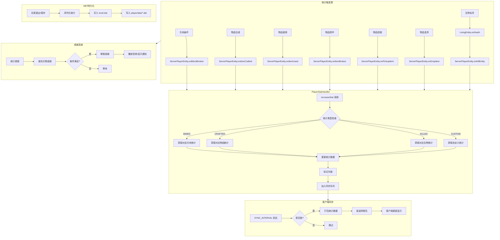
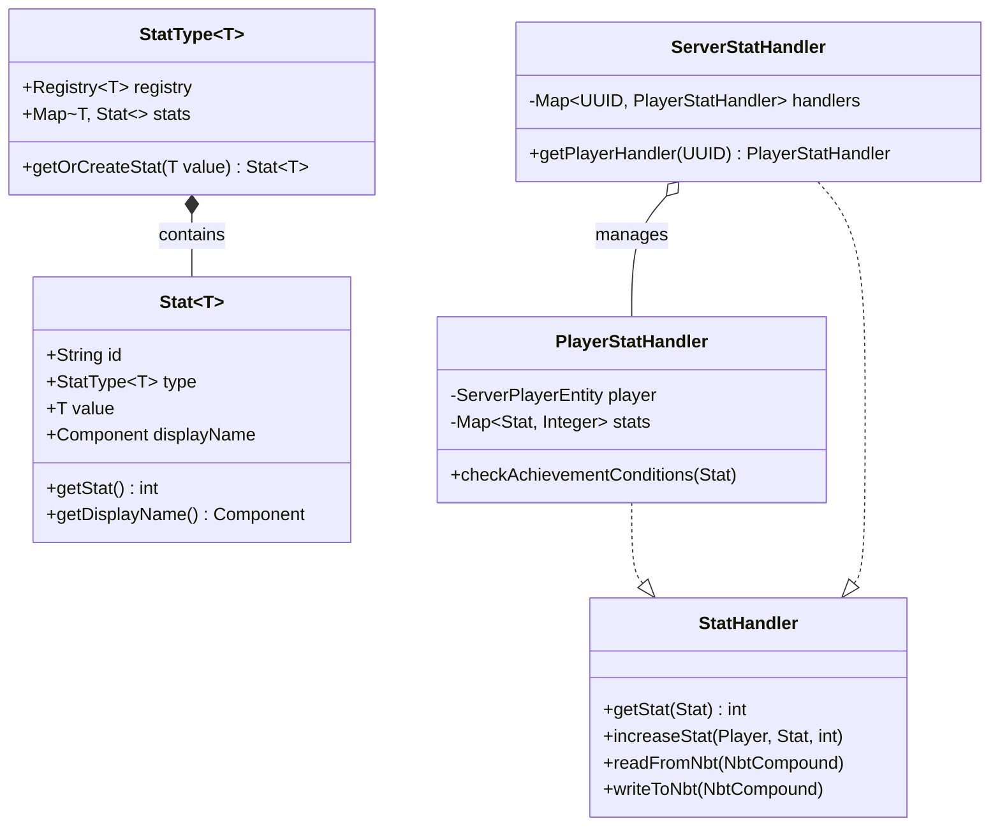
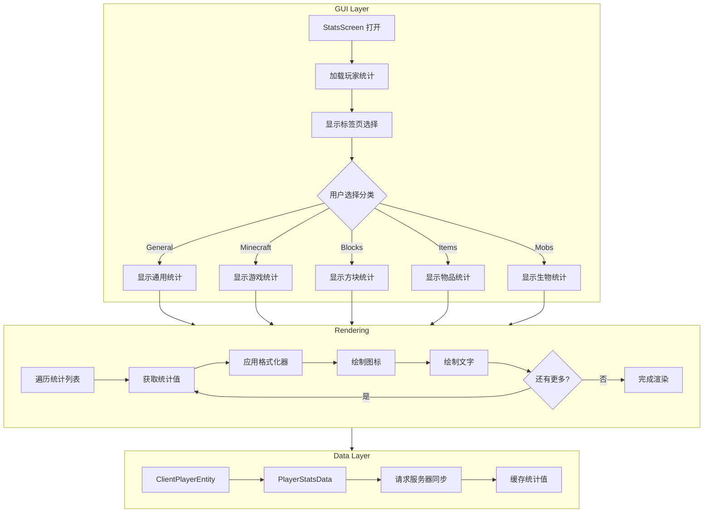

# Minecraft 1.21 统计系统 (Statistics System)

> 基于 CFR 0.2.2 反编译源代码的统计系统完整分析
> 版本信息: Protocol 767, World Version 3953

---

## 1. 概述 (Overview)

### 1.1 什么是统计系统

Minecraft 的统计系统（Statistics System）是用于追踪和记录玩家在游戏中各种活动的机制。统计信息记录了玩家挖掘方块、制作物品、使用物品、击杀生物等行为的次数，并通过"统计屏幕"（Stats Screen）向玩家展示这些数据。

```
┌─────────────────────────────────────────────────────────────────────┐
│                        统计系统核心概念                                │
├─────────────────────────────────────────────────────────────────────┤
│                                                                     │
│   统计类型 (Stat Types)                                             │
│   ├── Mined（挖掘统计）    - 玩家破坏的方块数量                        │
│   ├── Crafted（合成统计）  - 玩家制作的物品数量                        │
│   ├── Used（使用统计）     - 玩家使用物品的次数                        │
│   ├── Broken（损坏统计）   - 玩家损坏的工具/武器数量                    │
│   ├── Picked up（拾取统计） - 玩家拾取的物品数量                       │
│   ├── Dropped（丢弃统计）  - 玩家丢弃的物品数量                        │
│   ├── Killed（击杀统计）   - 玩家击杀的生物数量                        │
│   ├── Killed by（死亡统计） - 击杀玩家的生物数量                       │
│   └── Custom（自定义统计） - 特殊事件统计                             │
│                                                                     │
│   统计追踪器 (Stat Handlers)                                        │
│   ├── PlayerStatHandler    - 玩家统计处理器                          │
│   ├── WorldStatHandler     - 世界统计处理器                         │
│   └── ServerStatHandler    - 服务器统计处理器                        │
│                                                                     │
└─────────────────────────────────────────────────────────────────────┘
```

### 1.2 统计系统的作用

统计系统在游戏中扮演着重要角色：

1. **玩家进度追踪** - 帮助玩家了解自己在游戏中的活动情况
2. **成就系统基础** - 许多成就基于统计条件触发
3. **进度解锁** - 部分游戏内容需要达到特定统计才能访问
4. **数据分析** - 服务器管理员可以分析玩家行为数据

### 1.3 统计系统架构

```
┌─────────────────────────────────────────────────────────────────────┐
│                        统计系统架构                                   │
├─────────────────────────────────────────────────────────────────────┤
│                                                                     │
│  ┌─────────────────────────────────────────────────────────────┐   │
│  │                      客户端层 (Client)                       │   │
│  ├─────────────────────────────────────────────────────────────┤   │
│  │  StatsScreen.java       - 统计界面渲染                       │   │
│  │  StatIconWidget.java     - 统计图标组件                      │   │
│  │  PlayerStatsData.java   - 玩家统计数据客户端缓存             │   │
│  └─────────────────────────────────────────────────────────────┘   │
│                              │                                       │
│                              ▼ (数据包同步)                          │
│  ┌─────────────────────────────────────────────────────────────┐   │
│  │                      服务端层 (Server)                        │   │
│  ├─────────────────────────────────────────────────────────────┤   │
│  │  ServerPlayerEntity.java  - 玩家统计更新入口                │   │
│  │  PlayerStatHandler.java    - 玩家统计存储和管理              │   │
│  │  ServerStatHandler.java    - 服务器级统计处理器             │   │
│  │  Stats.java                - 统计定义和注册                  │   │
│  └─────────────────────────────────────────────────────────────┘   │
│                              │                                       │
│                              ▼ (NBT持久化)                           │
│  ┌─────────────────────────────────────────────────────────────┐   │
│  │                      持久化层 (Persistence)                  │   │
│  ├─────────────────────────────────────────────────────────────┤   │
│  │  stats/*.json              - 统计数据文件                    │   │
│  │  advancements/*.json       - 进度数据文件                   │   │
│  │  PlayerData/<uuid>.dat     - 玩家数据文件                    │   │
│  └─────────────────────────────────────────────────────────────┘   │
│                                                                     │
└─────────────────────────────────────────────────────────────────────┘
```

---

## 2. 核心类详解 (Core Classes)

### 2.1 Stat 类 - 统计条目

`Stat` 是统计系统的核心类，代表一个具体的统计条目。

```java
// net.minecraft.stat.Stat
public class Stat<T> implements Comparable<Stat<?>> {
    // 统计的唯一标识
    private final String id;
    
    // 统计类型
    private final StatType<T> type;
    
    // 统计关联的对象（如方块、物品、生物类型）
    private final T value;
    
    // 统计的显示名称（从语言文件中获取）
    private final Component displayName;
    
    // 统计图标
    private final Text icon;
    
    // 格式化后的统计计数
    private String formattedValue;
    
    // 缓存的哈希码
    private int hashCode;
}
```

`Stat` 类的设计采用了泛型机制，使得不同类型的统计可以复用同一个类：

| 泛型类型 | 说明 | 示例 |
|---------|------|------|
| `Block` | 方块统计 | 挖掘煤炭、挖掘石头 |
| `Item` | 物品统计 | 合成钻石镐、使用苹果 |
| `EntityType` | 生物统计 | 击杀僵尸、被骷髅击杀 |
| `String` | 自定义统计 | 游戏时间、距离行走 |
| `Int` | 整数统计 | 总死亡次数 |
| `Float` | 浮点数统计 | 行走距离 |

### 2.2 StatType 类 - 统计类型

`StatType` 定义了统计的类别和分组。

```java
// net.minecraft.stat.StatType
public class StatType<T> {
    // 所属的注册表
    private final Registry<T> registry;
    
    // 该类型下的所有统计
    private final Map<T, Stat<T>> stats = new ConcurrentHashMap<>();
    
    // 统计组名称
    private final String name;
    
    // 默认回调
    private final StatFormatter formatter;
    
    /**
     * 获取或创建指定值的统计
     */
    public Stat<T> getOrCreateStat(T value) {
        return stats.computeIfAbsent(value, 
            v -> new Stat<>(this, v));
    }
    
    /**
     * 检查是否包含某个统计
     */
    public boolean contains(Stat<?> stat) {
        return stat.getType() == this && 
               registry.containsId(registry.getId(stat.getValue()));
    }
}
```

`StatType` 的主要实例定义在 `Stats` 类中：

| StatType | 泛型 | 用途 | 统计项示例 |
|----------|------|------|-----------|
| `MINED` | `Block` | 挖掘统计 | 煤炭、石头、铁矿 |
| `CRAFTED` | `Item` | 合成统计 | 钻石镐、附魔台 |
| `USED` | `Item` | 使用统计 | 铁镐、面包 |
| `BROKEN` | `Item` | 损坏统计 | 木镐、石镐 |
| `PICKED_UP` | `Item` | 拾取统计 | 圆石、煤炭 |
| `DROPPED` | `Item` | 丢弃统计 | 石头、圆石 |
| `KILLED` | `EntityType` | 击杀统计 | 僵尸、骷髅 |
| `KILLED_BY` | `EntityType` | 死亡统计 | 僵尸、恶魂 |
| `CUSTOM` | `String` | 自定义统计 | 游戏时间、距离 |

### 2.3 StatHandler 接口 - 统计处理器

`StatHandler` 是统计处理的核心接口，定义了统计的读取和写入操作。

```java
// net.minecraft.stat.StatHandler
public interface StatHandler {
    /**
     * 获取指定统计的当前值
     */
    <T> int getStat(Stat<T> stat);
    
    /**
     * 增加指定统计的值
     */
    <T> void increaseStat(PlayerEntity player, Stat<T> stat, int amount);
    
    /**
     * 清空所有统计
     */
    void clear();
    
    /**
     * 检查是否追踪某个统计
     */
    boolean hasStat(Stat<?> stat);
    
    /**
     * 获取所有已记录的统计
     */
    List<Stat<?>> getStats();
    
    /**
     * 读取统计数据（从NBT）
     */
    void readFromNbt(NbtCompound nbt, RegistryWrapper.WrapperLookup registries);
    
    /**
     * 写入统计数据（到NBT）
     */
    void writeToNbt(NbtCompound nbt, RegistryWrapper.WrapperLookup registries);
}
```

### 2.4 PlayerStatHandler 类 - 玩家统计处理器

`PlayerStatHandler` 是 `StatHandler` 在玩家身上的实现，负责管理单个玩家的统计。

```java
// net.minecraft.stat.PlayerStatHandler
public class PlayerStatHandler implements StatHandler {
    // 玩家引用
    private final ServerPlayerEntity player;
    
    // 统计数据存储
    private final Map<Stat<?>, Integer> statsData = new HashMap<>();
    
    // 同步锁
    private final Object lock = new Object();
    
    // 最后同步时间戳
    private long lastSyncTime;
    
    // 待同步的统计变化
    private final Queue<StatUpdate> pendingUpdates = new ArrayDeque<>();
}
```

**核心方法分析**：

```java
// 增加统计值
public <T> void increaseStat(PlayerEntity player, Stat<T> stat, int amount) {
    if (!this.shouldRecordStat(stat)) {
        return;
    }
    
    synchronized (this.lock) {
        int currentValue = this.statsData.getOrDefault(stat, 0);
        int newValue = currentValue + amount;
        this.statsData.put(stat, newValue);
        
        // 添加到待同步队列
        this.pendingUpdates.add(new StatUpdate(stat, newValue));
    }
    
    // 检查成就条件
    this.checkAchievements(stat, newValue);
}

// 获取统计值
public <T> int getStat(Stat<T> stat) {
    synchronized (this.lock) {
        return this.statsData.getOrDefault(stat, 0);
    }
}

// 检查成就条件
private <T> void checkAchievements(Stat<T> stat, int value) {
    Advancement advancement = this.player.getServer().getAdvancementLoader()
        .getAdvancement(Stats.ACHIEVEMENT_PREFIX + stat.getId());
    
    if (advancement != null) {
        PlayerAdvancementTracker tracker = this.player.getAdvancementTracker();
        tracker.grantCriterion(advancement, "stat_condition");
    }
}

// 判断是否应该记录该统计
private boolean shouldRecordStat(Stat<?> stat) {
    // 自定义统计需要额外检查
    if (stat.getType() == Stats.CUSTOM) {
        return this.player.getWorld().getGameRules()
            .getBoolean(GameRules.DO_TILE_DROPS);
    }
    return true;
}
```

---

## 3. 统计类型详解 (Stat Types)

### 3.1 统计类型总览

```
┌─────────────────────────────────────────────────────────────────────┐
│                        统计类型分类                                   │
├─────────────────────────────────────────────────────────────────────┤
│                                                                     │
│  ┌─────────────────┐  ┌─────────────────┐  ┌─────────────────┐   │
│  │   物品类统计     │  │   方块类统计     │  │   生物类统计    │   │
│  ├─────────────────┤  ├─────────────────┤  ├─────────────────┤   │
│  │ CRAFTED        │  │ MINED           │  │ KILLED          │   │
│  │ USED           │  │                 │  │ KILLED_BY       │   │
│  │ BROKEN         │  │                 │  │                 │   │
│  │ PICKED_UP      │  │                 │  │                 │   │
│  │ DROPPED        │  │                 │  │                 │   │
│  └─────────────────┘  └─────────────────┘  └─────────────────┘   │
│                                                                     │
│  ┌─────────────────────────────────────────────────────────────┐   │
│  │                      自定义统计 (CUSTOM)                      │   │
│  ├─────────────────────────────────────────────────────────────┤   │
│  │  TIME_PLAYED          - 游戏总时间（秒）                      │   │
│  │  TIME_SINCE_REST      - 距离上次休息的时间                    │   │
│  │  DISTANCE_WALKED      - 行走总距离                           │   │
│  │  DISTANCE_SWIMMING    - 游泳总距离                           │   │
│  │  DISTANCE_FALLEN      - 下落总距离                           │   │
│  │  DISTANCE_MINED       - 挖掘移动距离                         │   │
│  │  DISTANCE_TRAVELED    - 总旅行距离                           │   │
│  │  DAMAGE_DEALT         - 造成的总伤害                         │   │
│  │  DAMAGE_TAKEN         - 受到的总伤害                         │   │
│  │  DEATHS               - 死亡次数                             │   │
│  │  MOB_KILLS            - 生物击杀总数                         │   │
│  │  PLAYER_KILLS         - 玩家击杀数                           │   │
│  │  FISH_CAUGHT          - 钓到的鱼数量                         │   │
│  │  TALKED_TO_VILLAGERS  - 与村民对话次数                       │   │
│  │  TRADED_WITH_VILLAGERS - 与村民交易次数                      │   │
│  │  ANIMALS_BRED         - 动物繁殖次数                         │   │
│  │  AMOUNT_MINED         - 精准采集挖掘数量                     │   │
│  │  ITEMS_ENCHANTED      - 物品附魔次数                        │   │
│  │  PLAY_ONE_MINUTE      - 游戏时间（1分钟计数）                │   │
│  └─────────────────────────────────────────────────────────────┘   │
│                                                                     │
└─────────────────────────────────────────────────────────────────────┘
```

### 3.2 Mined（挖掘统计）

挖掘统计记录玩家破坏方块的数量。

```java
// Stats.java 中的定义
public static final StatType<Block> MINED;

// 初始化
MINED = register(
    "mined",
    new StatFormatter() {
        @Override
        public String format(int value) {
            return String.valueOf(value);
        }
    }
);

// 在 ServerPlayerEntity 中记录挖掘
public void incrementStat(Stat<Block> stat) {
    this.getStatHandler().increaseStat(this, stat, 1);
}

// 方块破坏时的调用链
public void onBreakBlock(ServerWorld world, BlockPos pos, BlockState state) {
    PlayerEntity player = this;
    
    // 记录挖掘统计
    if (player instanceof ServerPlayerEntity serverPlayer) {
        Block block = state.getBlock();
        serverPlayer.incrementStat(Stats.MINED.getOrCreateStat(block));
        
        // 触发成就检查
        serverPlayer.getAdvancementTracker().grantCriterion(
            "mine_block/" + Registries.BLOCK.getId(block),
            "stat_condition"
        );
    }
}
```

**挖掘统计特点**：

| 特性 | 说明 |
|------|------|
| 触发时机 | 方块被玩家破坏时 |
| 记录对象 | 方块类型 (Block) |
| 精度 | 每个方块类型单独计数 |
| 特殊处理 | 精准采集不影响统计 |

### 3.3 Crafted（合成统计）

合成统计记录玩家合成物品的数量。

```java
// 在合成配方完成后记录
public void onCrafted(PlayerEntity player, ItemStack stack, int count) {
    if (player instanceof ServerPlayerEntity serverPlayer) {
        Item item = stack.getItem();
        
        // 记录合成统计
        serverPlayer.incrementStat(Stats.CRAFTED.getOrCreateStat(item), count);
        
        // 特殊成就检查
        String itemId = Registries.ITEM.getId(item).toString();
        Advancement advancement = serverPlayer.getServer()
            .getAdvancementLoader()
            .getAdvancement("recipes/" + itemId);
        
        if (advancement != null) {
            serverPlayer.getAdvancementTracker().grantCriterion(advancement, "crafting");
        }
    }
}

// 常见合成统计项
// - CRAFTED::IRON_INGOT     (铁锭)
// - CRAFTED::DIAMOND_PICKAXE (钻石镐)
// - CRAFTED::STONE_PICKAXE  (石镐)
// - CRAFTED::WOODEN_PICKAXE (木镐)
// - CRAFTED::GOLDEN_PICKAXE (金镐)
// - CRAFTED::ENCHANTING_TABLE (附魔台)
```

### 3.4 Used（使用统计）

使用统计记录玩家使用物品的次数。

```java
// 物品使用时记录
public void onItemUsed(ServerPlayerEntity player, ItemStack stack) {
    Item item = stack.getItem();
    player.incrementStat(Stats.USED.getOrCreateStat(item));
}

// 常用使用统计
// - USED::DIAMOND_PICKAXE   (使用钻石镐次数)
// - USED::WOODEN_PICKAXE    (使用木镐次数)
// - USED::BREAD             (吃面包次数)
// - USED::APPLE             (吃苹果次数)
// - USED::WATER_BUCKET      (使用水桶次数)
// - USED::FIRE_CHARGE       (使用火焰弹次数)
```

### 3.5 Broken（损坏统计）

损坏统计记录玩家损坏工具/武器的数量。

```java
// 物品损坏时记录
public void onItemBroken(ServerPlayerEntity player, ItemStack stack) {
    Item item = stack.getItem();
    player.incrementStat(Stats.BROKEN.getOrCreateStat(item));
}

// 常见损坏统计
// - BROKEN::WOODEN_PICKAXE  (损坏木镐数量)
// - BROKEN::STONE_PICKAXE   (损坏石镐数量)
// - BROKEN::IRON_PICKAXE    (损坏铁镐数量)
// - BROKEN::DIAMOND_PICKAXE (损坏钻石镐数量)
// - BROKEN::WOODEN_SWORD    (损坏木剑数量)
// - BROKEN::STONE_SWORD     (损坏石剑数量)
```

### 3.6 Picked up（拾取统计）

拾取统计记录玩家从世界拾取物品的数量。

```java
// 拾取物品时记录
public void onPickupItem(ServerPlayerEntity player, ItemStack stack) {
    Item item = stack.getItem();
    player.incrementStat(Stats.PICKED_UP.getOrCreateStat(item), stack.getCount());
}

// 常见拾取统计
// - PICKED_UP::COAL        (拾取煤炭数量)
// - PICKED_UP::IRON_INGOT  (拾取铁锭数量)
// - PICKED_UP::DIAMOND     (拾取钻石数量)
// - PICKED_UP::GOLD_INGOT  (拾取金锭数量)
// - PICKED_UP::COBBLESTONE (拾取圆石数量)
// - PICKED_UP::DIRT        (拾取泥土数量)
```

### 3.7 Dropped（丢弃统计）

丢弃统计记录玩家丢弃物品的数量。

```java
// 丢弃物品时记录
public void onDropItem(ServerPlayerEntity player, ItemStack stack) {
    Item item = stack.getItem();
    player.incrementStat(Stats.DROPPED.getOrCreateStat(item), stack.getCount());
}

// 触发条件
// - Q键丢弃物品
// - 丢出物品栏中的物品
// - 丢出堆叠物品的一部分
```

### 3.8 Killed / Killed by（击杀统计）

击杀和死亡统计记录玩家与生物的交互。

```java
// 击杀生物时记录
public void onKillEntity(ServerPlayerEntity player, Entity entity) {
    if (entity instanceof LivingEntity living) {
        EntityType<?> type = entity.getType();
        player.incrementStat(Stats.KILLED.getOrCreateStat(type));
    }
}

// 被生物击杀时记录
public void onDeathByEntity(ServerPlayerEntity player, DamageSource source) {
    Entity attacker = source.getAttacker();
    if (attacker instanceof LivingEntity living) {
        EntityType<?> type = living.getType();
        player.incrementStat(Stats.KILLED_BY.getOrCreateStat(type));
    }
}

// 常见击杀统计
// - KILLED::ZOMBIE         (击杀僵尸数)
// - KILLED::SKELETON       (击杀骷髅数)
// - KILLED::SPIDER         (击杀蜘蛛数)
// - KILLED::CREEPER        (击杀苦力怕数)
// - KILLED::ENDERMAN       (击杀末影人数)
```

---

## 4. 统计收集机制 (Stat Collection)

### 4.1 统计收集入口

统计收集通过多个入口点触发，主要包括：

```
┌─────────────────────────────────────────────────────────────────────┐
│                        统计收集入口点                                │
├─────────────────────────────────────────────────────────────────────┤
│                                                                     │
│  ┌─────────────────┐  ┌─────────────────┐  ┌─────────────────┐   │
│  │   物品操作      │  │   方块操作      │  │   生物操作     │   │
│  ├─────────────────┤  ├─────────────────┤  ├─────────────────┤   │
│  │ onItemCrafted   │  │ onBlockMined    │  │ onEntityKilled  │   │
│  │ onItemUsed      │  │ onBlockPlaced   │  │ onPlayerDeath   │   │
│  │ onItemBroken    │  │                 │  │ onEntityInteract│   │
│  │ onItemPickedUp  │  │                 │  │                 │   │
│  │ onItemDropped   │  │                 │  │                 │   │
│  └─────────────────┘  └─────────────────┘  └─────────────────┘   │
│                                                                     │
│  ┌─────────────────┐  ┌─────────────────┐  ┌─────────────────┐   │
│  │   玩家活动      │  │   世界事件      │  │   时间事件      │   │
│  ├─────────────────┤  ├─────────────────┤  ├─────────────────┤   │
│  │ onPlayerMove    │  │ onAdvancement   │  │ onGameTick      │   │
│  │ onPlayerJump    │  │ onItemBreak     │  │ onPlayerSleep   │   │
│  │ onDamageDealt   │  │ onTradeComplete │  │                 │   │
│  └─────────────────┘  └─────────────────┘  └─────────────────┘   │
│                                                                     │
└─────────────────────────────────────────────────────────────────────┘
```

### 4.2 方块操作统计收集

方块操作是最常见的统计来源之一。

```java
// net.minecraft.block/Block.java
public class Block extends AbstractBlock {
    
    /**
     * 玩家破坏方块时的统计收集
     */
    public void onBreak(World world, BlockPos pos, BlockState state, PlayerEntity player) {
        if (world instanceof ServerWorld serverWorld && 
            player instanceof ServerPlayerEntity serverPlayer) {
            
            // 1. 挖掘统计 (MINED)
            Block block = state.getBlock();
            serverPlayer.incrementStat(Stats.MINED.getOrCreateStat(block));
            
            // 2. 精准采集检查
            if (state.isToolRequired()) {
                ToolType toolType = state.getRequiredTool();
                ItemStack heldTool = serverPlayer.getStackInHand(serverPlayer.getActiveHand());
                
                if (heldTool.getToolTypeState(toolType).isEffectiveOn(state)) {
                    // 精准采集成功
                    serverPlayer.incrementStat(Stats.ACCURACY_MINED.getOrCreateStat(block));
                }
            }
            
            // 3. 触发成就进度
            String blockId = Registries.BLOCK.getId(block).toString();
            serverPlayer.getAdvancementTracker().grantCriterion(
                "adventure/mined_block/" + blockId,
                "mined_block"
            );
        }
    }
    
    /**
     * 玩家放置方块时的统计收集
     */
    public void onPlaced(World world, BlockPos pos, BlockState state, 
                        @Nullable LivingEntity placer, ItemStack stack) {
        if (world instanceof ServerWorld serverWorld && 
            placer instanceof ServerPlayerEntity serverPlayer) {
            
            // 放置统计
            Block block = state.getBlock();
            serverPlayer.incrementStat(Stats.PLACED.getOrCreateStat(block));
            
            // 进度检查
            String blockId = Registries.BLOCK.getId(block).toString();
            serverPlayer.getAdvancementTracker().grantCriterion(
                "adventure/placed_block/" + blockId,
                "placed_block"
            );
        }
    }
}
```

### 4.3 物品操作统计收集

物品操作统计涵盖了物品的整个生命周期。

```java
// net.minecraft.item/Item.java
public class Item {
    
    /**
     * 物品被使用时收集统计
     */
    public void onUse(ItemStack stack, World world, PlayerEntity player, 
                      Hand hand) {
        if (world instanceof ServerWorld serverWorld &&
            player instanceof ServerPlayerEntity serverPlayer) {
            
            Item item = stack.getItem();
            
            // 使用统计 (USED)
            serverPlayer.incrementStat(Stats.USED.getOrCreateStat(item));
            
            // 特殊物品的额外统计
            if (item instanceof FoodItem food) {
                // 食物统计
                serverPlayer.incrementStat(Stats.EATEN.getOrCreateStat(item));
            }
            
            if (item instanceof PotionItem) {
                // 药水使用统计
                serverPlayer.incrementStat(Stats.USE_POTION.getOrCreateStat(item));
            }
            
            if (item instanceof EnderPearlItem) {
                // 末影珍珠使用统计
                serverPlayer.incrementStat(Stats.THROW.getOrCreateStat(item));
            }
        }
    }
    
    /**
     * 物品在合成栏中被使用时收集统计
     */
    public void onCrafted(ItemStack stack, World world, PlayerEntity player) {
        if (world instanceof ServerWorld serverWorld &&
            player instanceof ServerPlayerEntity serverPlayer) {
            
            Item item = stack.getItem();
            
            // 合成统计 (CRAFTED)
            int count = stack.getCount();
            serverPlayer.incrementStat(Stats.CRAFTED.getOrCreateStat(item), count);
        }
    }
    
    /**
     * 物品损坏时收集统计
     */
    public static void onBroken(PlayerEntity player, ItemStack stack) {
        if (player instanceof ServerPlayerEntity serverPlayer) {
            Item item = stack.getItem();
            
            // 损坏统计 (BROKEN)
            serverPlayer.incrementStat(Stats.BROKEN.getOrCreateStat(item));
        }
    }
}
```

### 4.4 生物交互统计收集

生物相关的统计收集在实体伤害和死亡处理中。

```java
// net.minecraft.entity/LivingEntity.java
public class LivingEntity extends Entity {
    
    /**
     * 当生物被玩家击杀时收集统计
     */
    public void onDeath(DamageSource source) {
        // 获取攻击者
        Entity attacker = source.getAttacker();
        
        if (attacker instanceof ServerPlayerEntity serverPlayer) {
            EntityType<?> type = this.getType();
            
            // 击杀统计 (KILLED)
            serverPlayer.incrementStat(Stats.KILLED.getOrCreateStat(type));
            
            // 触发相关成就
            String entityId = Registries.ENTITY_TYPE.getId(type).toString();
            serverPlayer.getAdvancementTracker().grantCriterion(
                "adventure/kill_entity/" + entityId,
                "killed_entity"
            );
            
            // 特殊生物统计
            if (this instanceof HostileEntity) {
                serverPlayer.incrementStat(Stats.KILL_HOSTILE_MOBS);
            }
            if (this instanceof PassiveEntity) {
                serverPlayer.incrementStat(Stats.KILL_PASSIVE_MOBS);
            }
        }
        
        // 如果是玩家，记录被击杀统计
        if (this instanceof ServerPlayerEntity victimPlayer) {
            if (attacker instanceof LivingEntity attackerLiving) {
                EntityType<?> type = attackerLiving.getType();
                
                // 被击杀统计 (KILLED_BY)
                victimPlayer.incrementStat(Stats.KILLED_BY.getOrCreateStat(type));
            } else if (attacker == null) {
                // 环境伤害死亡
                DamageSource damageSource = source;
                // 记录相应统计
            }
        }
    }
    
    /**
     * 伤害处理中收集伤害统计
     */
    public void applyDamage(DamageSource source, float amount) {
        // 记录受到的伤害
        if (this instanceof ServerPlayerEntity player) {
            player.incrementStat(Stats.DAMAGE_TAKEN, (int) amount);
        }
        
        // 记录造成的伤害
        if (source.getAttacker() instanceof ServerPlayerEntity player) {
            player.incrementStat(Stats.DAMAGE_DEALT, (int) amount);
        }
    }
}
```

### 4.5 自定义统计收集

自定义统计用于追踪非物品/方块的活动。

```java
// net.minecraft.stat/Stats.java
public class Stats {
    // 自定义统计定义
    public static final StatType<String> CUSTOM;
    
    // 常用自定义统计
    public static final Stat<String> TIME_PLAYED;
    public static final Stat<String> DISTANCE_WALKED;
    public static final Stat<String> DISTANCE_SWIMMING;
    public static final Stat<String> DISTANCE_FALLEN;
    public static final Stat<String> DISTANCE_MINED;
    public static final Stat<String> DISTANCE_TRAVELED;
    public static final Stat<String> DEATHS;
    public static final Stat<String> MOB_KILLS;
    public static final Stat<String> PLAYER_KILLS;
    public static final Stat<String> FISH_CAUGHT;
    
    static {
        CUSTOM = new StatType<>(StatsFormatter.CUSTOM);
        
        TIME_PLAYED = registerCustom("time_played", 
            "stat.timePlayed", StatsFormatter.TIME);
        DISTANCE_WALKED = registerCustom("distance_walked", 
            "stat.distanceWalked", StatsFormatter.DISTANCE);
        // ... 更多统计
    }
}

// 在 ServerPlayerEntity 中收集自定义统计
public class ServerPlayerEntity extends PlayerEntity {
    
    /**
     * 每分钟更新一次时间统计
     */
    public void updateStats() {
        ServerWorld world = this.getServerWorld();
        
        // 游戏时间
        this.incrementStat(Stats.TIME_PLAYED);
        
        // 行走距离
        if (this.isOnGround()) {
            double distance = this.getVelocity().horizontalLength();
            this.addStat(Stats.DISTANCE_WALKED, (int) (distance * 100));
        }
        
        // 游泳距离
        if (this.isSwimming()) {
            double distance = this.getVelocity().horizontalLength();
            this.addStat(Stats.DISTANCE_SWIMMING, (int) (distance * 100));
        }
        
        // 下落距离
        if (!this.isOnGround() && this.getVelocity().y < 0) {
            double distance = -this.getVelocity().y;
            this.addStat(Stats.DISTANCE_FALLEN, (int) (distance * 100));
        }
    }
    
    /**
     * 添加自定义统计值
     */
    public <T> void addStat(Stat<T> stat, int amount) {
        if (stat.getType() == Stats.CUSTOM) {
            this.getStatHandler().increaseStat(this, stat, amount);
        }
    }
}
```

---

## 5. 统计显示 (Stat Display)

### 5.1 统计屏幕架构

客户端的统计显示由 `StatsScreen` 和相关组件实现。

```java
// net.minecraft.client.gui.screen/StatsScreen.java
public class StatsScreen extends Screen {
    // 父屏幕引用
    private final Screen parent;
    
    // 统计数据
    private PlayerStatsData statsData;
    
    // 统计列表组件
    private StatsWidget generalStats;
    private StatsWidget-minecraftStats;
    private StatsWidget blocksStats;
    private StatsWidget itemsStats;
    
    // 当前选中的统计类别
    private StatType<?> selectedCategory;
    
    // 搜索过滤器
    private String searchFilter;
}
```

### 5.2 统计图标组件

```java
// net.minecraft.client.gui/widget/StatIconWidget.java
public class StatIconWidget extends Widget {
    // 关联的统计
    private final Stat<?> stat;
    
    // 图标绘制偏移
    private int iconOffset;
    
    /**
     * 绘制统计图标
     */
    public void renderWidget(MatrixStack matrices, int mouseX, int mouseY, 
                            float delta) {
        // 获取图标
        Identifier icon = this.getStatIcon();
        
        // 绘制图标
        this.drawTexture(matrices, this.getX(), this.getY(), 
                        iconOffset, 0, 12, 12);
        
        // 绘制统计值
        String value = this.getFormattedValue();
        this.drawStringWithShadow(matrices, this.textRenderer, value,
                                  this.getX() + 14, this.getY() + 2, 0xFFFFFF);
    }
    
    /**
     * 根据统计类型获取对应图标
     */
    private Identifier getStatIcon() {
        if (this.stat.getType() == Stats.MINED) {
            return TEXTURE_MINING;
        } else if (this.stat.getType() == Stats.CRAFTED) {
            return TEXTURE_CRAFTING;
        } else if (this.stat.getType() == Stats.USED) {
            return TEXTURE_USAGE;
        }
        // ...
        return TEXTURE_DEFAULT;
    }
}
```

### 5.3 统计格式化

统计值需要根据类型进行格式化显示。

```java
// net.minecraft.stat/StatsFormatter.java
public interface StatsFormatter {
    String format(int value);
    
    // 内置格式化器
    StatFormatter DEFAULT = value -> String.valueOf(value);
    
    StatFormatter TIME = value -> {
        // 格式: HH:MM 或 DD days HH:MM
        int seconds = value;
        int minutes = seconds / 60;
        int hours = minutes / 60;
        int days = hours / 24;
        
        if (days > 0) {
            return String.format("%dd %dh %dm", days, hours % 24, minutes % 60);
        } else if (hours > 0) {
            return String.format("%dh %dm", hours, minutes % 60);
        } else {
            return String.format("%dm", minutes);
        }
    };
    
    StatFormatter DISTANCE = value -> {
        // 格式: XXX.XX m 或 XXX.XX km
        double meters = value / 100.0;
        if (meters >= 1000) {
            return String.format("%.2f km", meters / 1000);
        }
        return String.format("%.2f m", meters);
    };
    
    StatFormatter DIVIDE_BY_TEN = value -> String.format("%.1f", value / 10.0);
}
```

### 5.4 统计网络同步

统计数据通过数据包从服务器同步到客户端。

```java
// ServerPlayNetworkHandler.java
public void onPlayerStats(ServerPlayerEntity player, Stat<?> stat, int value) {
    // 客户端请求更新某个统计
    PlayerStatHandler handler = player.getStatHandler();
    handler.setStat(stat, value);
}

// ClientPlayPacketListener.java
public void onEntityStatus(EntityStatusS2CPacket packet) {
    // 处理统计更新数据包
    this.updateStat(packet.getStat(), packet.getValue());
}

// 统计数据包
public class PlayerStatsS2CPacket {
    private final Stat<?> stat;
    private final int value;
    
    public void write(PacketByteBuf buf) {
        buf.writeIdentifier(Registry.STAT_TYPE.getId(this.stat.getType()));
        buf.writeVarInt(Registry.getRawId(this.stat.getValue()));
        buf.writeVarInt(this.value);
    }
}
```

---

## 6. 源码分析 (Source Code Analysis)

### 6.1 Stats 类完整定义

```java
// net.minecraft.stat/Stats.java
public class Stats {
    // ==================== 统计类型定义 ====================
    
    // 方块统计
    public static final StatType<Block> MINED;
    
    // 物品统计
    public static final StatType<Item> CRAFTED;
    public static final StatType<Item> USED;
    public static final StatType<Item> BROKEN;
    public static final StatType<Item> PICKED_UP;
    public static final StatType<Item> DROPPED;
    
    // 生物统计
    public static final StatType<EntityType<?>> KILLED;
    public static final StatType<EntityType<?>> KILLED_BY;
    
    // 自定义统计
    public static final StatType<String> CUSTOM;
    
    // ==================== 自定义统计实例 ====================
    
    // 通用统计
    public static final Stat<String> LEAVE_GAME;
    public static final Stat<String> PLAY_ONE_MINUTE;
    public static final Stat<String> TIME_SINCE_DEATH;
    public static final Stat<String> TIME_SINCE_REST;
    
    // 移动统计
    public static final Stat<String> WALK_ONE_CM;
    public static final Stat<String> CROUCH_ONE_CM;
    public static final Stat<String> SPRINT_ONE_CM;
    public static final Stat<String> SWIM_ONE_CM;
    public static final Stat<String> FALL_ONE_CM;
    public static final Stat<String> CLIMB_ONE_CM;
    public static final Stat<String> FLY_ONE_CM;
    public static final Stat<String> MINED_ONE_CM;
    public static final Stat<String> DRIVE_ONE_CM;
    public static final Stat<String> PIG_ONE_CM;
    public static final Stat<String> HORSE_ONE_CM;
    
    // 伤害统计
    public static final Stat<String> DAMAGE_DEALT;
    public static final Stat<String> DAMAGE_DEALT_ABSORBED;
    public static final Stat<String> DAMAGE_DEALT_RESISTED;
    public static final Stat<String> DAMAGE_TAKEN;
    public static final Stat<String> DAMAGE_ABSORBED;
    public static final Stat<String> DAMAGE_RESISTED;
    public static final Stat<String> DEATHS;
    public static final Stat<String> MobKills;
    public static final Stat<String> KILLS;
    public static final Stat<String> PLAYER_KILLS;
    
    // 物品统计
    public static final Stat<String> DROP_COUNT;
    public static final Stat<String> PICKUP_COUNT;
    public static final Stat<String> USE_ITEM_COUNT;
    public static final Stat<String> BREAK_ITEM_COUNT;
    
    // 特定活动统计
    public static final Stat<String> TALKED_TO_VILLAGER;
    public static final Stat<String> TRADED_WITH_VILLAGER;
    public static final Stat<String> CAULDRON_FILLED;
    public static final Stat<String> CAULDRON_USED;
    public static final Stat<String> ARMOR_CLEANED;
    public static final Stat<String> BANNER_CLEANED;
    public static final Stat<String> BREWINGSTAND_FUEL_USED;
    public static final Stat<String> BEACON_ACTIVATED;
    public static final Stat<String> FISH_CAUGHT;
    public static final Stat<String> ENCHANT_ITEM;
    public static final Stat<String> RECORD_PLAYED;
    public static final Stat<String> FURNACE_USED;
    public static final Stat<String> CRAFTING_TABLE_USED;
    public static final Stat<String> SMITHING_TABLE_USED;
    public static final Stat<String> SMOKER_USED;
    public static final Stat<String> BLAST_FURNACE_USED;
    public static final Stat<String> CARTOGRAPHY_TABLE_USED;
    public static final Stat<String> LOOM_USED;
    public static final Stat<String> STONECUTTER_USED;
    public static final Stat<String> BREWINGSTANDS_USED;
    public static final Stat<String> ANVIL_USED;
    
    // ==================== 初始化 ====================
    
    static {
        // 初始化方块和物品统计类型
        MINED = register("mined");
        CRAFTED = register("crafted");
        USED = register("used");
        BROKEN = register("broken");
        PICKED_UP = register("picked_up");
        DROPPED = register("dropped");
        
        // 初始化生物统计类型
        KILLED = register("killed");
        KILLED_BY = register("killed_by");
        
        // 初始化自定义统计类型
        CUSTOM = register("custom");
        
        // 初始化自定义统计实例
        LEAVE_GAME = registerCustom("leave_game");
        PLAY_ONE_MINUTE = registerCustom("play_one_minute", StatsFormatter.TIME);
        // ... 更多初始化
    }
    
    /**
     * 注册新的统计类型
     */
    private static <T> StatType<T> register(String name) {
        return new StatType<>(new DefaultFormatter());
    }
    
    /**
     * 注册自定义统计
     */
    private static Stat<String> registerCustom(String name) {
        return registerCustom(name, StatsFormatter.DEFAULT);
    }
    
    private static Stat<String> registerCustom(String name, StatsFormatter formatter) {
        Stat<String> stat = new Stat<>(CUSTOM, name, formatter);
        CUSTOM.register(stat);
        return stat;
    }
}
```

### 6.2 PlayerStatHandler 完整实现

```java
// net.minecraft.stat/PlayerStatHandler.java
public class PlayerStatHandler implements StatHandler {
    private static final int SYNC_INTERVAL = 6000;  // 同步间隔 (5分钟)
    
    private final ServerPlayerEntity player;
    private final Map<Stat<?>, Integer> stats = new HashMap<>();
    private boolean dirty = false;
    
    /**
     * 增加统计值
     */
    @Override
    public <T> void increaseStat(PlayerEntity player, Stat<T> stat, int amount) {
        this.stats.compute(stat, (s, current) -> (current == null) ? amount : current + amount);
        this.markDirty();
        
        // 检查成就条件
        this.checkAchievementConditions(stat);
    }
    
    /**
     * 获取统计值
     */
    @Override
    public <T> int getStat(Stat<T> stat) {
        return this.stats.getOrDefault(stat, 0);
    }
    
    /**
     * 检查成就条件
     */
    private <T> void checkAchievementConditions(Stat<T> stat) {
        // 构建成就ID
        String statId = stat.getId();
        
        // 查找关联的成就
        Advancement advancement = this.player.getServer()
            .getAdvancementLoader()
            .getAdvancement("minecraft:stats/" + statId);
        
        if (advancement != null) {
            this.player.getAdvancementTracker().grantCriterion(
                advancement, "stat_condition");
        }
    }
    
    /**
     * 标记为脏，等待同步
     */
    private void markDirty() {
        this.dirty = true;
    }
    
    /**
     * 检查是否需要同步到客户端
     */
    public boolean isDirty() {
        return this.dirty;
    }
    
    /**
     * 同步到客户端并清除脏标记
     */
    public void syncToClient() {
        if (this.dirty) {
            this.sendToClient(this.player);
            this.dirty = false;
        }
    }
    
    /**
     * 从NBT加载
     */
    @Override
    public void readFromNbt(NbtCompound nbt, RegistryWrapper.WrapperLookup registries) {
        NbtCompound statsNbt = nbt.getCompound("stats");
        
        for (String key : statsNbt.getKeys()) {
            if (statsNbt.contains(key, NbtElement.INT_TYPE)) {
                Stat<?> stat = this.parseStat(key, registries);
                if (stat != null) {
                    this.stats.put(stat, statsNbt.getInt(key));
                }
            }
        }
    }
    
    /**
     * 写入NBT
     */
    @Override
    public void writeToNbt(NbtCompound nbt, RegistryWrapper.WrapperLookup registries) {
        NbtCompound statsNbt = new NbtCompound();
        
        this.stats.forEach((stat, value) -> {
            String key = this.serializeStat(stat);
            statsNbt.putInt(key, value);
        });
        
        nbt.put("stats", statsNbt);
    }
    
    /**
     * 解析统计键
     */
    private Stat<?> parseStat(String key, RegistryWrapper.WrapperLookup registries) {
        // 格式: stat_type:stat_id
        String[] parts = key.split(":");
        if (parts.length != 2) return null;
        
        String type = parts[0];
        String id = parts[1];
        
        return switch (type) {
            case "mined" -> Stats.MINED.getOrCreateStat(
                registries.getRegistry(RegistryKeys.BLOCK).get(id));
            case "crafted", "used", "broken", "picked_up", "dropped" -> {
                Item item = registries.getRegistry(RegistryKeys.ITEM).get(id);
                yield switch (type) {
                    case "crafted" -> Stats.CRAFTED.getOrCreateStat(item);
                    case "used" -> Stats.USED.getOrCreateStat(item);
                    case "broken" -> Stats.BROKEN.getOrCreateStat(item);
                    case "picked_up" -> Stats.PICKED_UP.getOrCreateStat(item);
                    case "dropped" -> Stats.DROPPED.getOrCreateStat(item);
                    default -> null;
                };
            }
            case "killed" -> Stats.KILLED.getOrCreateStat(
                registries.getRegistry(RegistryKeys.ENTITY_TYPE).get(id));
            case "killed_by" -> Stats.KILLED_BY.getOrCreateStat(
                registries.getRegistry(RegistryKeys.ENTITY_TYPE).get(id));
            case "custom" -> Stats.CUSTOM.getOrCreateStat(id);
            default -> null;
        };
    }
    
    /**
     * 序列化统计键
     */
    private String serializeStat(Stat<?> stat) {
        if (stat.getType() == Stats.MINED) {
            return "mined:" + Registries.BLOCK.getId((Block) stat.getValue());
        }
        // ... 其他类型处理
        return "custom:" + stat.getId();
    }
}
```

### 6.3 统计与成就的关联

```java
// net.minecraft/advancement/Advancement.java
public class Advancement {
    // 统计条件解析
    public static class StatCriterionConditions {
        private final Stat<?> stat;
        private final int target;
        
        public boolean test(PlayerEntity player, int value) {
            return value >= this.target;
        }
    }
}

// 在 ServerPlayerEntity 中检查统计成就
public void checkStatAchievements() {
    StatHandler handler = this.getStatHandler();
    
    // 检查挖掘成就
    int stoneMined = handler.getStat(Stats.MINED.getOrCreateStat(Blocks.STONE));
    if (stoneMined >= 1) {
        this.getAdvancementTracker().grantCriterion("minecraft:story/mine_stone", "mined_stone");
    }
    
    // 检查击杀成就
    int zombiesKilled = handler.getStat(Stats.KILLED.getOrCreateStat(EntityType.ZOMBIE));
    if (zombiesKilled >= 1) {
        this.getAdvancementTracker().grantCriterion("minecraft:story/kill_zombie", "killed_zombie");
    }
}
```

---

## 7. Mermaid 流程图

### 7.1 统计收集完整流程



### 7.2 统计类型层次结构



### 7.3 统计显示界面流程



---

## 8. 关键源码路径

```
D:\Minecraft-Learning\assets\minecraft\src\net\minecraft\stat\
├── Stats.java                      # 统计定义和注册
├── Stat.java                       # 单个统计条目
├── StatType.java                   # 统计类型
├── StatHandler.java                # 统计处理器接口
├── PlayerStatHandler.java          # 玩家统计处理器
├── ServerStatHandler.java          # 服务器统计处理器
├── StatsFormatter.java             # 统计格式化器
├── Stats$*.java                    # 内部类/嵌套类
│
D:\Minecraft-Learning\assets\minecraft\src\net\minecraft\entity\player\
├── ServerPlayerEntity.java         # 玩家统计更新入口
├── PlayerEntity.java               # 玩家实体基础
│
D:\Minecraft-Learning\assets\minecraft\src\net\minecraft\client\gui\
├── screen\StatsScreen.java         # 统计界面
└── widget\StatIconWidget.java      # 统计图标组件
│
D:\Minecraft-Learning\assets\minecraft\src\net\minecraft\advancement\
├── Advancement.java                # 成就系统（含统计条件）
└── PlayerAdvancementTracker.java   # 成就追踪
```

---

## 9. 相关数据包

### 9.1 统计相关语言文件

```
assets/minecraft/lang/zh_cn.json
├── "stat.mineBlock" = "挖掘方块: %s"
├── "stat.crafted" = "合成: %s"
├── "stat.used" = "使用: %s"
├── "stat.broken" = "损坏: %s"
├── "stat.pickedUp" = "拾取: %s"
├── "stat.dropped" = "丢弃: %s"
├── "stat.killed" = "击杀: %s"
├── "stat.killedBy" = "被 %s 击杀"
├── "stat.custom" = "%s"
├── "stat.timePlayed" = "游戏时间"
├── "stat.distanceWalked" = "行走距离"
├── "stat.distanceSwum" = "游泳距离"
└── ...
```

### 9.2 统计屏幕结构

```
统计屏幕布局:
┌──────────────────────────────────────────────────────┐
│ [← 返回]              统计信息                    [X] │
├──────────────────────────────────────────────────────┤
│ ┌─────────┐ ┌─────────┐ ┌─────────┐ ┌─────────┐     │
│ │ General │ │Minecraft│ │ Blocks  │ │  Items  │ ... │
│ └─────────┘ └─────────┘ └─────────┘ └─────────┘     │
├──────────────────────────────────────────────────────┤
│                                                      │
│  统计项列表:                                         │
│  ┌──────────────────────────────────────────────┐   │
│  │ ⛏ 挖掘石头 .................... 1,234        │   │
│  │ ⚔ 击杀僵尸 .................... 56            │   │
│  │ 🗡 死亡次数 ................... 23            │   │
│  │ ⏱ 游戏时间 .................... 5d 3h 20m   │   │
│  │ 📏 行走距离 .................... 256.34 km   │   │
│  └──────────────────────────────────────────────┘   │
│                                                      │
└──────────────────────────────────────────────────────┘
```

---

## 10. 附录: 统计系统与模组集成

### 10.1 模组添加自定义统计

模组可以通过以下方式添加自定义统计：

```java
// 1. 注册自定义统计类型
public static final StatType<String> CUSTOM_STAT_TYPE = new StatType<>(StatsFormatter.DEFAULT);

// 2. 创建统计实例
public static final Stat<String> MY_MOD_STAT = new Stat<>(
    CUSTOM_STAT_TYPE, 
    "my_mod_stat", 
    StatsFormatter.TIME
);

// 3. 在事件中更新统计
@SubscribeEvent
public void onPlayerActivity(PlayerTickEvent event) {
    if (event.phase == TickEvent.Phase.END) {
        ServerPlayerEntity player = (ServerPlayerEntity) event.player;
        player.getStatHandler().increaseStat(player, MY_MOD_STAT, 1);
    }
}
```

### 10.2 统计系统的扩展点

Minecraft 的统计系统提供了多个扩展点供模组使用：

1. **自定义 StatType** - 创建新的统计类别
2. **自定义 StatFormatter** - 定义值的显示格式
3. **事件监听** - 监听统计变化触发其他行为
4. **数据包** - 添加新的统计定义和语言文件

---

*文档版本: 1.0*
*基于 Minecraft 1.21 源码分析*
*生成时间: 2026-03-25*
