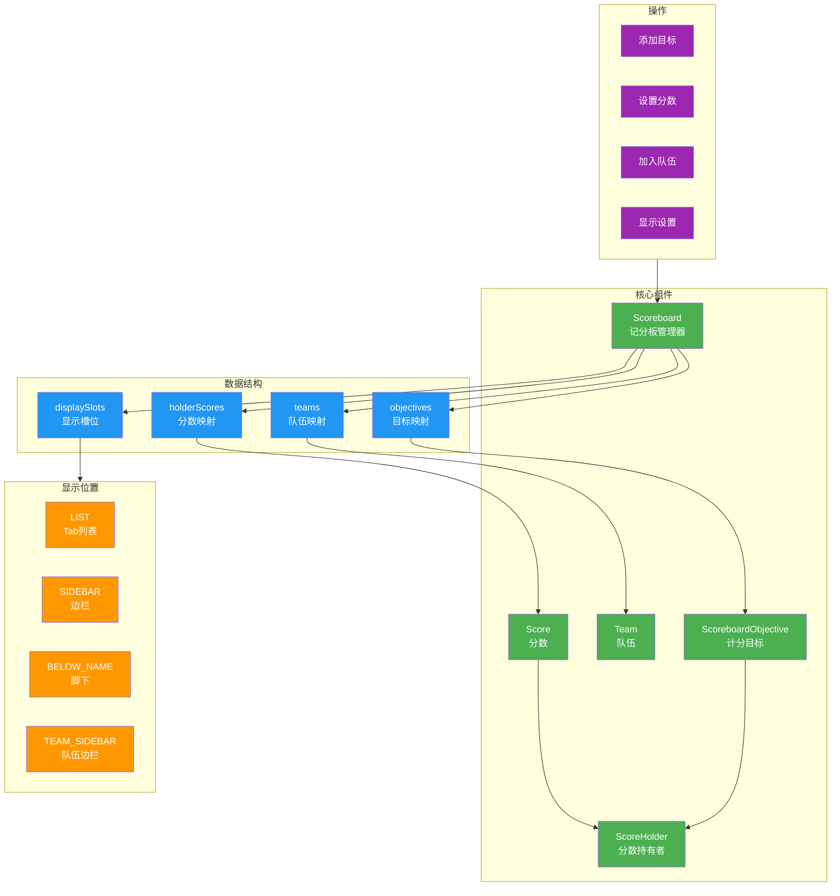
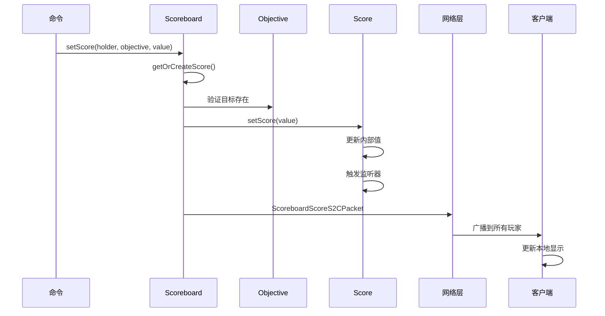
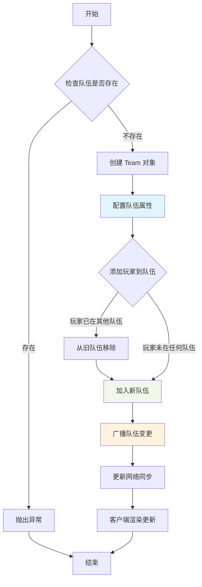
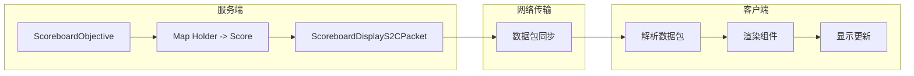

# 记分板系统 (Scoreboard System)

## 概述

Minecraft 的记分板系统（Scoreboard System）是游戏中最强大和灵活的数据追踪与显示机制之一。该系统于 1.3.1 版本引入，经历了多个版本的迭代优化，在 1.21 版本中已经发展成为一个功能完善、架构清晰的核心子系统。记分板系统不仅用于追踪玩家的各种统计数据，还广泛用于服务器管理、小游戏开发、经济系统实现等场景。

记分板系统的核心设计理念是将数据存储与数据展示分离，通过模块化的组件设计实现高度的可扩展性。系统由四个核心组件构成：**Scoreboard** 作为顶层管理器，负责协调所有子系统的运作；**ScoreboardObjective** 定义了"追踪什么数据"；**Team** 实现了玩家的分组管理；**ScoreHolder** 则是分数数据的实际持有者。这种设计使得每个组件都可以独立扩展和定制，同时保持整体的一致性和可维护性。

记分板系统在 Minecraft 中扮演着多重角色：作为玩家统计数据的存储中心，它记录死亡次数、击杀数、方块交互等行为；作为显示系统，它能够在屏幕右侧边栏、玩家头顶下方、Tab 列表等多个位置展示信息；作为队伍系统的基础设施，它支持 PvP 游戏中的队伍分配和视觉区分；作为命令系统的核心依赖，它为数以百计的记分板命令提供了底层实现。

## 核心类 (Core Classes)

### Scoreboard 类

`Scoreboard` 类是记分板系统的核心管理器，负责管理所有的目标（Objectives）、分数（Scores）、队伍（Teams）以及显示槽位（Display Slots）。该类在服务端和客户端都有实现，但功能略有不同：服务端实现（`ServerScoreboard`）包含完整的写操作和持久化逻辑，而客户端实现则主要处理显示相关的只读操作。

```java
// D:\Minecraft-Learning\assets\mc\1.21\net\minecraft\scoreboard\Scoreboard.java
public class Scoreboard {
    
    private final Object2ObjectMap<String, ScoreboardObjective> objectives;
    private final Map<String, Score> scores;
    private final Object2ObjectMap<String, Team> teams;
    private final Map<ScoreboardDisplaySlot, ScoreboardObjective> displaySlots;
    private final Map<String, Map<ScoreboardObjective, Score>> holderScores;
    
    public Scoreboard() {
        this.objectives = new Object2ObjectOpenHashMap<>();
        this.scores = new java.util.HashMap<>();
        this.teams = new Object2ObjectOpenHashMap<>();
        this.displaySlots = new EnumMap<>(ScoreboardDisplaySlot.class);
        this.holderScores = new java.util.HashMap<>();
    }
    
    public ScoreboardObjective addObjective(
        String name,
        ScoreboardCriterion criterion,
        Component displayName,
        ScoreboardCriterion.RenderType renderType,
        boolean autoUpdate,
        Holder<StatHandler> statHandler
    ) {
        if (this.objectives.containsKey(name)) {
            throw new IllegalStateException("An objective with the name '" + name + "' already exists!");
        }
        
        ScoreboardObjective objective = new ScoreboardObjective(
            this, name, criterion, displayName, renderType, autoUpdate, statHandler
        );
        this.objectives.put(name, objective);
        return objective;
    }
    
    public void removeObjective(String name) {
        ScoreboardObjective objective = this.objectives.remove(name);
        if (objective != null) {
            this.displaySlots.entrySet().removeIf(
                entry -> entry.getValue() == objective
            );
        }
    }
    
    public ScoreboardObjective getObjective(String name) {
        return this.objectives.get(name);
    }
    
    public Collection<ScoreboardObjective> getObjectives() {
        return this.objectives.values();
    }
    
    public Score getScore(ScoreHolder holder, ScoreboardObjective objective) {
        String name = holder.getNameForScoreboard();
        Map<ScoreboardObjective, Score> holderScoreMap = this.holderScores.get(name);
        if (holderScoreMap == null) {
            return null;
        }
        return holderScoreMap.get(objective);
    }
    
    public Score getOrCreateScore(ScoreHolder holder, ScoreboardObjective objective) {
        String name = holder.getNameForScoreboard();
        Score score = this.getScore(holder, objective);
        if (score == null) {
            score = new Score(this, objective, name);
            this.holderScores.computeIfAbsent(name, k -> new java.util.HashMap<>())
                .put(objective, score);
        }
        return score;
    }
    
    public void resetScore(ScoreHolder holder, ScoreboardObjective objective) {
        String name = holder.getNameForScoreboard();
        Map<ScoreboardObjective, Score> holderScoreMap = this.holderScores.get(name);
        if (holderScoreMap != null) {
            holderScoreMap.remove(objective);
            if (holderScoreMap.isEmpty()) {
                this.holderScores.remove(name);
            }
        }
    }
    
    public Team addTeam(String name) {
        if (this.teams.containsKey(name)) {
            throw new IllegalStateException("A team with the name '" + name + "' already exists!");
        }
        Team team = new Team(this, name);
        this.teams.put(name, team);
        return team;
    }
    
    public void removeTeam(Team team) {
        this.teams.remove(team.getName());
    }
    
    public Team getTeam(String name) {
        return this.teams.get(name);
    }
    
    public Collection<Team> getTeams() {
        return this.teams.values();
    }
    
    public void setObjectiveSlot(ScoreboardDisplaySlot slot, ScoreboardObjective objective) {
        this.displaySlots.put(slot, objective);
    }
    
    public ScoreboardObjective getObjectiveForSlot(ScoreboardDisplaySlot slot) {
        return this.displaySlots.get(slot);
    }
    
    public void addScoreHolderToTeam(String playerName, Team team) {
        if (this.getPlayerTeam(playerName) != null) {
            this.removePlayerFromTeam(playerName);
        }
        team.getPlayerList().add(playerName);
    }
    
    public void removePlayerFromTeam(String playerName, Team team) {
        team.getPlayerList().remove(playerName);
    }
    
    public Team getPlayerTeam(String playerName) {
        for (Team team : this.teams.values()) {
            if (team.getPlayerList().contains(playerName)) {
                return team;
            }
        }
        return null;
    }
}
```

**Scoreboard 类的核心职责**：

| 职责 | 方法 | 说明 |
|------|------|------|
| 目标管理 | `addObjective()` | 添加新的计分目标 |
| 目标管理 | `removeObjective()` | 移除计分目标 |
| 目标管理 | `getObjective()` | 通过名称获取目标 |
| 分数管理 | `getOrCreateScore()` | 获取或创建分数实例 |
| 分数管理 | `resetScore()` | 重置指定分数 |
| 队伍管理 | `addTeam()` | 创建新队伍 |
| 队伍管理 | `removeTeam()` | 移除队伍 |
| 显示管理 | `setObjectiveSlot()` | 设置目标显示位置 |
| 玩家管理 | `addScoreHolderToTeam()` | 将玩家加入队伍 |

### ScoreboardObjective 类

`ScoreboardObjective` 类表示一个计分目标，定义了要追踪的数据类型和显示方式。每个目标都有唯一的名称、一个计分规则（criterion）、显示名称以及渲染类型。目标可以设置为自动更新（如生命值目标）或手动更新（如自定义统计）。

```java
// D:\Minecraft-Learning\assets\mc\1.21\net\minecraft\scoreboard\ScoreboardObjective.java
public class ScoreboardObjective {
    
    private final Scoreboard scoreboard;
    private final String name;
    private final ScoreboardCriterion criterion;
    private Component displayName;
    private ScoreboardCriterion.RenderType renderType;
    private boolean autoUpdate;
    private Holder<StatHandler> statHandler;
    private int cachedValue;
    
    public ScoreboardObjective(
        Scoreboard scoreboard,
        String name,
        ScoreboardCriterion criterion,
        Component displayName,
        ScoreboardCriterion.RenderType renderType,
        boolean autoUpdate,
        Holder<StatHandler> statHandler
    ) {
        this.scoreboard = scoreboard;
        this.name = name;
        this.criterion = criterion;
        this.displayName = displayName;
        this.renderType = renderType;
        this.autoUpdate = autoUpdate;
        this.statHandler = statHandler;
    }
    
    public String getName() {
        return this.name;
    }
    
    public ScoreboardCriterion getCriterion() {
        return this.criterion;
    }
    
    public Component getDisplayName() {
        return this.displayName;
    }
    
    public void setDisplayName(Component displayName) {
        this.displayName = displayName;
    }
    
    public ScoreboardCriterion.RenderType getRenderType() {
        return this.renderType;
    }
    
    public boolean isAutoUpdate() {
        return this.autoUpdate;
    }
    
    public Component toHoverableText() {
        return Text.translatable("chat.square_brackets", this.displayName)
            .styled(style -> style.withHoverEvent(
                new HoverEvent(
                    HoverEvent.Action.SHOW_TEXT,
                    Text.literal(this.name)
                )
            ));
    }
    
    public void updateValue(int value) {
        this.cachedValue = value;
    }
    
    public int getCachedValue() {
        return this.cachedValue;
    }
}
```

**ScoreboardObjective 的设计特点**：

- **不可变性**：目标名称在创建后不可更改，确保数据完整性
- **可变性显示名**：显示名称可以随时更新
- **自动更新机制**：通过 `autoUpdate` 标志控制是否自动同步统计数据
- **缓存机制**：`cachedValue` 字段缓存当前值，减少频繁计算

### Team 类

`Team` 类实现了玩家的分组管理，继承自 `AbstractTeam`。每个队伍都有自己的名称、显示名称、颜色、成员列表以及各种行为规则（如友军伤害、名称可见性等）。

```java
// D:\Minecraft-Learning\assets\mc\1.21\net\minecraft\scoreboard\Team.java
public class Team extends AbstractTeam {
    
    private final Scoreboard scoreboard;
    private final String name;
    private final Set<String> players = new java.util.HashSet<>();
    private Component displayName;
    private Formatting color = Formatting.WHITE;
    private Text prefix = Text.empty();
    private Text suffix = Text.empty();
    private boolean friendlyFire = false;
    private boolean showFriendlyInvisibles = true;
    private AbstractTeam.NameTagVisibility nametagVisibility = AbstractTeam.NameTagVisibility.ALWAYS;
    private AbstractTeam.CollisionRule collisionRule = AbstractTeam.CollisionRule.ALWAYS;
    private AbstractTeam.DeathMessageVisibility deathMessageVisibility = AbstractTeam.DeathMessageVisibility.ALWAYS;
    private Text playerPrefix = Text.empty();
    private Text playerSuffix = Text.empty();
    
    public Team(Scoreboard scoreboard, String name) {
        this.scoreboard = scoreboard;
        this.name = name;
        this.displayName = Text.literal(name);
    }
    
    public String getName() {
        return this.name;
    }
    
    public Component getDisplayName() {
        return this.displayName;
    }
    
    public void setDisplayName(Component displayName) {
        this.displayName = displayName;
    }
    
    public Formatting getColor() {
        return this.color;
    }
    
    public void setColor(Formatting color) {
        this.color = color;
    }
    
    public Collection<String> getPlayerList() {
        return this.players;
    }
    
    public Text getPrefix() {
        return this.prefix;
    }
    
    public void setPrefix(Text prefix) {
        this.prefix = prefix;
    }
    
    public Text getSuffix() {
        return this.suffix;
    }
    
    public void setSuffix(Text suffix) {
        this.suffix = suffix;
    }
    
    public Text decorateName(Text name) {
        return Text.empty()
            .append(this.prefix)
            .append(name)
            .append(this.suffix);
    }
    
    public boolean isFriendlyFireAllowed() {
        return this.friendlyFire;
    }
    
    public void setFriendlyFireAllowed(boolean friendlyFire) {
        this.friendlyFire = friendlyFire;
    }
    
    public boolean shouldShowFriendlyInvisibles() {
        return this.showFriendlyInvisibles;
    }
    
    public void setShowFriendlyInvisibles(boolean show) {
        this.showFriendlyInvisibles = show;
    }
    
    public AbstractTeam.NameTagVisibility getNametagVisibility() {
        return this.nametagVisibility;
    }
    
    public void setNametagVisibility(AbstractTeam.NameTagVisibility visibility) {
        this.nametagVisibility = visibility;
    }
    
    public AbstractTeam.CollisionRule getCollisionRule() {
        return this.collisionRule;
    }
    
    public void setCollisionRule(AbstractTeam.CollisionRule rule) {
        this.collisionRule = rule;
    }
    
    public AbstractTeam.DeathMessageVisibility getDeathMessageVisibility() {
        return this.deathMessageVisibility;
    }
    
    public void setDeathMessageVisibility(AbstractTeam.DeathMessageVisibility visibility) {
        this.deathMessageVisibility = visibility;
    }
    
    public boolean hasPlayer(String playerName) {
        return this.players.contains(playerName);
    }
    
    public int getPlayerCount() {
        return this.players.size();
    }
}
```

**Team 类的可配置属性**：

| 属性 | 方法 | 默认值 | 说明 |
|------|------|--------|------|
| 显示名称 | `setDisplayName()` | 队伍名称 | Tab 列表中显示的名称 |
| 颜色 | `setColor()` | WHITE | 队伍成员的显示颜色 |
| 前缀 | `setPrefix()` | 空 | 玩家名称前的装饰文本 |
| 后缀 | `setSuffix()` | 空 | 玩家名称后的装饰文本 |
| 友军伤害 | `setFriendlyFireAllowed()` | false | 是否允许攻击队友 |
| 友军隐形 | `setShowFriendlyInvisibles()` | true | 是否显示隐形队友 |
| 名称标签可见性 | `setNametagVisibility()` | ALWAYS | 玩家头顶名称的显示规则 |
| 碰撞规则 | `setCollisionRule()` | ALWAYS | 玩家之间的碰撞行为 |
| 死亡消息可见性 | `setDeathMessageVisibility()` | ALWAYS | 死亡消息的显示范围 |

### Score 类

`Score` 类表示一个具体的分数值，关联了特定的持有者和目标。它提供了分数的读写操作，并维护了分数变更的监听器列表。

```java
// D:\Minecraft-Learning\assets\mc\1.21\net\minecraft\scoreboard\Score.java
public class Score {
    
    private final Scoreboard scoreboard;
    private final ScoreboardObjective objective;
    private final String holderName;
    private int value;
    private final List<Consumer<Score>> updateListeners = new java.util.ArrayList<>();
    
    public Score(Scoreboard scoreboard, ScoreboardObjective objective, String holderName) {
        this.scoreboard = scoreboard;
        this.objective = objective;
        this.holderName = holderName;
        this.value = 0;
    }
    
    public int getScore() {
        return this.value;
    }
    
    public void setScore(int score) {
        int oldValue = this.value;
        this.value = score;
        if (oldValue != score) {
            this.onScoreChanged();
        }
    }
    
    public void incrementScore(int delta) {
        if (delta > 0) {
            this.setScore(this.value + delta);
        } else if (delta < 0) {
            this.setScore(this.value + delta);
        }
    }
    
    public void incrementScore() {
        this.incrementScore(1);
    }
    
    public void decrementScore() {
        this.incrementScore(-1);
    }
    
    private void onScoreChanged() {
        for (Consumer<Score> listener : this.updateListeners) {
            listener.accept(this);
        }
    }
    
    public void onUpdate(Runnable runnable) {
        this.updateListeners.add(runnable);
    }
    
    public ScoreboardObjective getObjective() {
        return this.objective;
    }
    
    public String getHolderName() {
        return this.holderName;
    }
    
    public ScoreHolder getHolder() {
        return ScoreHolder.fromName(this.holderName);
    }
}
```

## 目标管理 (Objective Management)

### 计分规则 (ScoreboardCriterion)

`ScoreboardCriterion` 定义了分数的来源和更新方式。Minecraft 内置了多种计分规则，模组也可以注册自定义的计分规则。

```java
// D:\Minecraft-Learning\assets\mc\1.21\net\minecraft\scoreboard\ScoreboardCriterion.java
public class ScoreboardCriterion implements Comparable<ScoreboardCriterion> {
    
    public static final ScoreboardCriterion DUMMY = new ScoreboardCriterion("dummy", false, RenderType.INTEGER);
    public static final ScoreboardCriterion TRIGGER = new ScoreboardCriterion("trigger", false, RenderType.INTEGER);
    public static final ScoreboardCriterion DEATH_COUNT = new ScoreboardCriterion("deathCount", true, RenderType.INTEGER);
    public static final ScoreboardCriterion PLAYER_KILLS = new ScoreboardCriterion("playerKills", true, RenderType.INTEGER);
    public static final ScoreboardCriterion TOTAL_KILLS = new ScoreboardCriterion("totalKills", true, RenderType.INTEGER);
    public static final ScoreboardCriterion HEALTH = new ScoreboardCriterion("health", true, RenderType.HEARTS);
    public static final ScoreboardCriterion EXPERIENCE = new ScoreboardCriterion("xp", true, RenderType.INTEGER);
    public static final ScoreboardCriterion LEVEL = new ScoreboardCriterion("level", true, RenderType.INTEGER);
    public static final ScoreboardCriterion FOOD = new ScoreboardCriterion("food", true, RenderType.INTEGER);
    public static final ScoreboardCriterion AIR = new ScoreboardCriterion("air", true, RenderType.INTEGER);
    public static final ScoreboardCriterion ARMOR = new ScoreboardCriterion("armor", true, RenderType.INTEGER);
    
    private final String name;
    private final boolean readOnly;
    private final RenderType renderType;
    
    private ScoreboardCriterion(String name, boolean readOnly, RenderType renderType) {
        this.name = name;
        this.readOnly = readOnly;
        this.renderType = renderType;
    }
    
    public String getName() {
        return this.name;
    }
    
    public boolean isReadOnly() {
        return this.readOnly;
    }
    
    public RenderType getRenderType() {
        return this.renderType;
    }
    
    @Override
    public int compareTo(ScoreboardCriterion other) {
        return this.name.compareTo(other.name);
    }
    
    public enum RenderType {
        INTEGER("integer"),   // 数字显示
        HEARTS("hearts");     // 爱心显示（用于生命值）
        
        private final String name;
        
        RenderType(String name) {
            this.name = name;
        }
        
        public String getName() {
            return this.name;
        }
    }
}
```

**内置计分规则详解**：

| 计分规则 | 只读 | 显示类型 | 说明 |
|---------|------|----------|------|
| DUMMY | 否 | 数字 | 手动更新的目标，可通过命令设置 |
| TRIGGER | 否 | 数字 | 触发器目标，需要先启用才能修改 |
| DEATH_COUNT | 是 | 数字 | 自动记录玩家死亡次数 |
| PLAYER_KILLS | 是 | 数字 | 记录玩家击杀其他玩家的次数 |
| TOTAL_KILLS | 是 | 数字 | 记录玩家击杀所有生物的次数 |
| HEALTH | 是 | 爱心 | 显示玩家当前生命值（半颗心为单位） |
| EXPERIENCE | 是 | 数字 | 显示当前经验值 |
| LEVEL | 是 | 数字 | 显示当前经验等级 |
| FOOD | 是 | 数字 | 显示当前饥饿值 |
| AIR | 是 | 数字 | 显示水下气泡时间 |
| ARMOR | 是 | 数字 | 显示护甲值 |

### 显示插槽 (ScoreboardDisplaySlot)

`ScoreboardDisplaySlot` 枚举定义了目标的显示位置，支持同时在多个位置显示不同的目标。

```java
// D:\Minecraft-Learning\assets\mc\1.21\net\minecraft\scoreboard\ScoreboardDisplaySlot.java
public enum ScoreboardDisplaySlot {
    
    LIST(0, "list"),                      // Tab 玩家列表
    SIDEBAR(1, "sidebar"),                 // 屏幕右侧边栏
    BELOW_NAME(2, "below_name"),           // 玩家脚下方
    SIDEBAR_TEAM_BLACK(3, "sidebar.team.black"),
    SIDEBAR_TEAM_DARK_BLUE(4, "sidebar.team.dark_blue"),
    SIDEBAR_TEAM_DARK_GREEN(5, "sidebar.team.dark_green"),
    SIDEBAR_TEAM_DARK_AQUA(6, "sidebar.team.dark_aqua"),
    SIDEBAR_TEAM_DARK_RED(7, "sidebar.team.dark_red"),
    SIDEBAR_TEAM_DARK_PURPLE(8, "sidebar.team.dark_purple"),
    SIDEBAR_TEAM_GOLD(9, "sidebar.team.gold"),
    SIDEBAR_TEAM_GRAY(10, "sidebar.team.gray"),
    SIDEBAR_TEAM_DARK_GRAY(11, "sidebar.team.dark_gray"),
    SIDEBAR_TEAM_BLUE(12, "sidebar.team.blue"),
    SIDEBAR_TEAM_GREEN(13, "sidebar.team.green"),
    SIDEBAR_TEAM_AQUA(14, "sidebar.team.aqua"),
    SIDEBAR_TEAM_RED(15, "sidebar.team.red"),
    SIDEBAR_TEAM_LIGHT_PURPLE(16, "sidebar.team.light_purple"),
    SIDEBAR_TEAM_YELLOW(17, "sidebar.team.yellow"),
    SIDEBAR_TEAM_WHITE(18, "sidebar.team.white");
    
    private final int id;
    private final String name;
    
    ScoreboardDisplaySlot(int id, String name) {
        this.id = id;
        this.name = name;
    }
    
    public int getId() {
        return this.id;
    }
    
    public String getName() {
        return this.name;
    }
}
```

**显示位置详解**：

| 插槽 | 位置 | 显示内容 | 特殊说明 |
|------|------|----------|----------|
| LIST | Tab 列表 | 按队伍分组的玩家列表 | 显示队伍颜色和名称 |
| SIDEBAR | 右侧边栏 | 按分数排序的目标列表 | 最多显示 15 项 |
| BELOW_NAME | 玩家脚下 | 单个目标的值 | 常用于生命值显示 |
| SIDEBAR_TEAM_* | 队伍专属边栏 | 仅显示对应颜色队伍的目标 | 按队伍颜色分区显示 |

### 目标创建流程

目标的创建涉及多个步骤，包括参数验证、组件注册和初始值计算：

```java
// 完整的目标创建示例
public ScoreboardObjective createKillCounter(Scoreboard scoreboard) {
    
    // 1. 检查目标是否已存在
    ScoreboardObjective existing = scoreboard.getObjective("player_kills");
    if (existing != null) {
        throw new IllegalStateException("Objective 'player_kills' already exists");
    }
    
    // 2. 创建目标
    ScoreboardObjective killsObjective = scoreboard.addObjective(
        "player_kills",                    // 内部唯一标识
        ScoreboardCriterion.DUMMY,         // 使用手动更新规则
        Text.literal("玩家击杀"),          // 显示名称（支持颜色代码）
        ScoreboardCriterion.RenderType.INTEGER,  // 数字显示
        false,                             // 非自动更新
        null                               // 无统计处理器
    );
    
    // 3. 设置显示位置
    scoreboard.setObjectiveSlot(ScoreboardDisplaySlot.SIDEBAR, killsObjective);
    
    return killsObjective;
}
```

## 队伍系统 (Team System)

### AbstractTeam 基类

`AbstractTeam` 是所有队伍类型的基类，定义了队伍的核心属性和行为接口。

```java
// D:\Minecraft-Learning\assets\mc\1.21\net\minecraft\scoreboard\AbstractTeam.java
public abstract class AbstractTeam {
    
    public enum NameTagVisibility {
        ALWAYS("always"),              // 始终显示
        NEVER("never"),                // 从不显示
        HIDE_FOR_OTHER_TEAMS("hideForOtherTeams"),    // 对其他队伍隐藏
        HIDE_FOR_OWN_TEAM("hideForOwnTeam");           // 对自己队伍隐藏
        
        private final String name;
        
        NameTagVisibility(String name) {
            this.name = name;
        }
    }
    
    public enum CollisionRule {
        ALWAYS("always"),              // 始终碰撞
        NEVER("never"),                // 从不碰撞
        PUSH_OTHER_TEAMS("pushOtherTeams"),           // 推开其他队伍
        PUSH_OWN_TEAM("pushOwnTeam");                  // 推开自己队伍
        
        private final String name;
        
        CollisionRule(String name) {
            this.name = name;
        }
    }
    
    public enum DeathMessageVisibility {
        ALWAYS("always"),              // 所有人可见
        NEVER("never"),                // 不可见
        HIDE_FOR_OTHER_TEAMS("hideForOtherTeams"),    // 对其他队伍隐藏
        HIDE_FOR_OWN_TEAM("hideForOwnTeam");          // 对自己队伍隐藏
        
        private final String name;
        
        DeathMessageVisibility(String name) {
            this.name = name;
        }
    }
    
    public enum FriendlyBitmask {
        ;

        public static final int NONE = 0;
        public static final int BADGER = 1;
    }
    
    public abstract String getName();
    public abstract Component getDisplayName();
    public abstract void setDisplayName(Component displayName);
    public abstract Collection<String> getPlayerList();
    public abstract Text getPrefix();
    public abstract void setPrefix(Text prefix);
    public abstract Text getSuffix();
    public abstract void setSuffix(Text suffix);
    public abstract boolean isFriendlyFireAllowed();
    public abstract boolean shouldShowFriendlyInvisibles();
    public abstract NameTagVisibility getNametagVisibility();
    public abstract CollisionRule getCollisionRule();
    public abstract DeathMessageVisibility getDeathMessageVisibility();
    
    public boolean isVisible() {
        return true;
    }
    
    public boolean canBeEditedBy(@Nullable String sender) {
        return true;
    }
}
```

### 队伍创建与配置

完整的队伍创建和配置流程：

```java
public Team createPvpTeam(Scoreboard scoreboard, String teamName, Formatting color) {
    
    // 1. 检查队伍是否已存在
    Team existing = scoreboard.getTeam(teamName);
    if (existing != null) {
        throw new IllegalStateException("Team '" + teamName + "' already exists");
    }
    
    // 2. 创建队伍
    Team team = scoreboard.addTeam(teamName);
    
    // 3. 配置队伍属性
    team.setDisplayName(Text.literal(teamName));
    team.setColor(color);
    team.setPrefix(Text.literal("[").append(
        Text.literal(teamName).styled(s -> s.withColor(color))
    ).append(Text.literal("] ")));
    team.setSuffix(Text.literal(""));
    
    // 4. 设置行为规则
    team.setFriendlyFireAllowed(false);  // 禁用友军伤害
    team.setShowFriendlyInvisibles(true); // 显示隐形队友
    team.setNametagVisibility(AbstractTeam.NameTagVisibility.ALWAYS);
    team.setCollisionRule(AbstractTeam.CollisionRule.NEVER);  // 允许穿过队友
    team.setDeathMessageVisibility(AbstractTeam.DeathMessageVisibility.ALWAYS);
    
    return team;
}
```

### 玩家与队伍关系

```java
public void manageTeamMembership(Scoreboard scoreboard, String playerName, Team team, boolean add) {
    Team currentTeam = scoreboard.getPlayerTeam(playerName);
    
    if (add) {
        // 添加玩家到队伍
        if (currentTeam != null) {
            scoreboard.removePlayerFromTeam(playerName, currentTeam);
        }
        scoreboard.addScoreHolderToTeam(playerName, team);
    } else {
        // 从队伍移除玩家
        if (currentTeam == team) {
            scoreboard.removePlayerFromTeam(playerName, team);
        }
    }
}
```

## 分数操作 (Score Operations)

### ScoreHolder 接口

`ScoreHolder` 是分数持有者的抽象，可以是玩家、实体或通配符。

```java
// D:\Minecraft-Learning\assets\mc\1.21\net\minecraft\scoreboard\ScoreHolder.java
public interface ScoreHolder {
    
    String WILDCARD_NAME = "*";  // 通配符名称，表示所有持有者
    
    String getNameForScoreboard();
    
    default Component getDisplayName() {
        return Text.literal(this.getNameForScoreboard());
    }
    
    static ScoreHolder fromName(String name) {
        if (name.equals(WILDCARD_NAME)) {
            return WILDCARD_SCORE_HOLDER;
        }
        return new ScoreHolder() {
            @Override
            public String getNameForScoreboard() {
                return name;
            }
        };
    }
    
    ScoreHolder WILDCARD_SCORE_HOLDER = new ScoreHolder() {
        @Override
        public String getNameForScoreboard() {
            return WILDCARD_NAME;
        }
        
        @Override
        public Component getDisplayName() {
            return Text.translatable("scoreboard.holder.untracked");
        }
    };
}
```

### 分数操作方法

```java
public class ScoreOperations {
    
    // 基础分数操作
    public void setScore(Scoreboard scoreboard, ScoreHolder holder, 
                         ScoreboardObjective objective, int value) {
        Score score = scoreboard.getOrCreateScore(holder, objective);
        score.setScore(value);
    }
    
    public void addScore(Scoreboard scoreboard, ScoreHolder holder,
                         ScoreboardObjective objective, int delta) {
        Score score = scoreboard.getOrCreateScore(holder, objective);
        score.incrementScore(delta);
    }
    
    public void resetScore(Scoreboard scoreboard, ScoreHolder holder,
                           ScoreboardObjective objective) {
        scoreboard.resetScore(holder, objective);
    }
    
    // 批量操作
    public void resetAllScores(Scoreboard scoreboard, ScoreboardObjective objective) {
        ScoreHolder wildcard = ScoreHolder.WILDCARD_SCORE_HOLDER;
        // 通配符操作会重置所有持有者的该目标分数
        scoreboard.resetScore(wildcard, objective);
    }
    
    // 获取分数（带默认值）
    public int getScoreOrDefault(Scoreboard scoreboard, ScoreHolder holder,
                                 ScoreboardObjective objective, int defaultValue) {
        Score score = scoreboard.getScore(holder, objective);
        return score != null ? score.getScore() : defaultValue;
    }
    
    // 排行榜查询
    public List<Map.Entry<ScoreHolder, Integer>> getSortedScores(
            Scoreboard scoreboard, ScoreboardObjective objective) {
        
        List<Map.Entry<ScoreHolder, Integer>> result = new ArrayList<>();
        
        for (Map.Entry<String, Map<ScoreboardObjective, Score>> entry : 
             scoreboard.holderScores.entrySet()) {
            
            Score score = entry.getValue().get(objective);
            if (score != null) {
                ScoreHolder holder = ScoreHolder.fromName(entry.getKey());
                result.add(Map.entry(holder, score.getScore()));
            }
        }
        
        // 按分数降序排序
        result.sort((a, b) -> Integer.compare(b.getValue(), a.getValue()));
        
        return result;
    }
}
```

### 分数变更监听

```java
public class ScoreUpdateListener {
    
    public void registerScoreListener(Scoreboard scoreboard, ScoreboardObjective objective) {
        
        for (String holderName : scoreboard.holderScores.keySet()) {
            Score score = scoreboard.getScore(
                ScoreHolder.fromName(holderName), objective
            );
            
            if (score != null) {
                score.onUpdate(updatedScore -> {
                    handleScoreUpdate(updatedScore);
                });
            }
        }
    }
    
    private void handleScoreUpdate(Score score) {
        String holderName = score.getHolderName();
        int newValue = score.getScore();
        String objectiveName = score.getObjective().getName();
        
        // 触发自定义逻辑
        System.out.println("Score updated: " + holderName + 
                          " -> " + objectiveName + " = " + newValue);
    }
}
```

## 命令集成 (Command Integration)

### 记分板命令架构

Minecraft 的记分板命令系统通过命令参数解析器（ArgumentType）实现与 Scoreboard 类的交互。

```java
// D:\Minecraft-Learning\assets\mc\1.21\net\minecraft\command\argument\scores\ScoreboardArgumentType.java
public class ScoreboardArgumentType implements ArgumentType<ScoreboardCommandArgument> {
    
    public static ScoreboardArgumentType scores() {
        return new ScoreboardArgumentType();
    }
    
    @Override
    public ScoreboardCommandArgument parse(StringReader reader) throws CommandSyntaxException {
        reader.expect(' ');
        String objectiveName = reader.readString();
        return new ScoreboardCommandArgument(objectiveName);
    }
    
    public static class ScoreboardCommandArgument {
        private final String objectiveName;
        
        public ScoreboardCommandArgument(String objectiveName) {
            this.objectiveName = objectiveName;
        }
        
        public String getObjectiveName() {
            return this.objectiveName;
        }
    }
}
```

### 主要记分板命令实现

```java
// D:\Minecraft-Learning\assets\mc\1.21\net\minecraft\command\ScoreboardCommand.java
public class ScoreboardCommand {
    
    // /scoreboard objectives add <objective> <criterion> [displayName]
    public static int executeAddObjective(CommandSource source, String name, 
                                         ScoreboardCriterion criterion, 
                                         Component displayName) {
        Scoreboard scoreboard = source.getServer().getScoreboard();
        
        if (scoreboard.getObjective(name) != null) {
            throw ERROR_OBJECTIVE_ALREADY_EXISTS.create();
        }
        
        ScoreboardObjective objective = scoreboard.addObjective(
            name, criterion, displayName, 
            criterion.getRenderType(), false, null
        );
        
        source.sendFeedback(() -> Text.translatable(
            "commands.scoreboard.objectives.add.success", objective.getDisplayName()
        ), true);
        
        return 1;
    }
    
    // /scoreboard objectives remove <objective>
    public static int executeRemoveObjective(CommandSource source, String name) {
        Scoreboard scoreboard = source.getServer().getScoreboard();
        ScoreboardObjective objective = scoreboard.getObjective(name);
        
        if (objective == null) {
            throw ERROR_OBJECTIVE_NOT_FOUND.create();
        }
        
        scoreboard.removeObjective(name);
        
        source.sendFeedback(() -> Text.translatable(
            "commands.scoreboard.objectives.remove.success", name
        ), true);
        
        return 1;
    }
    
    // /scoreboard objectives setdisplay <slot> [objective]
    public static int executeSetDisplay(CommandSource source, 
                                        ScoreboardDisplaySlot slot,
                                        @Nullable String objectiveName) {
        Scoreboard scoreboard = source.getServer().getScoreboard();
        
        if (objectiveName != null) {
            ScoreboardObjective objective = scoreboard.getObjective(objectiveName);
            if (objective == null) {
                throw ERROR_OBJECTIVE_NOT_FOUND.create();
            }
            scoreboard.setObjectiveSlot(slot, objective);
        } else {
            scoreboard.setObjectiveSlot(slot, null);
        }
        
        source.sendFeedback(() -> Text.translatable(
            "commands.scoreboard.objectives.setdisplay.success", 
            slot.getName(), objectiveName != null ? objectiveName : ""
        ), true);
        
        return 1;
    }
    
    // /scoreboard players set <targets> <objective> <score>
    public static int executeSetScore(CommandSource source, Collection<String> targets,
                                     String objectiveName, int score) {
        Scoreboard scoreboard = source.getServer().getScoreboard();
        ScoreboardObjective objective = scoreboard.getObjective(objectiveName);
        
        if (objective == null) {
            throw ERROR_OBJECTIVE_NOT_FOUND.create();
        }
        
        int successCount = 0;
        for (String targetName : targets) {
            if (targetName.equals("*")) {
                // 通配符操作
                for (ScoreboardObjective obj : scoreboard.getObjectives()) {
                    // 重置所有持有者的分数
                }
            } else {
                ScoreHolder holder = ScoreHolder.fromName(targetName);
                Score scoreObj = scoreboard.getOrCreateScore(holder, objective);
                scoreObj.setScore(score);
                successCount++;
            }
        }
        
        return successCount;
    }
    
    // /scoreboard players add <targets> <objective> <score>
    public static int executeAddScore(CommandSource source, Collection<String> targets,
                                     String objectiveName, int delta) {
        Scoreboard scoreboard = source.getServer().getScoreboard();
        ScoreboardObjective objective = scoreboard.getObjective(objectiveName);
        
        if (objective == null) {
            throw ERROR_OBJECTIVE_NOT_FOUND.create();
        }
        
        if (objective.getCriterion().isReadOnly()) {
            throw ERROR_CANNOT_MODIFY_READ_ONLY.create();
        }
        
        int successCount = 0;
        for (String targetName : targets) {
            ScoreHolder holder = ScoreHolder.fromName(targetName);
            Score scoreObj = scoreboard.getOrCreateScore(holder, objective);
            scoreObj.incrementScore(delta);
            successCount++;
        }
        
        return successCount;
    }
    
    // /scoreboard teams join <team> [players...]
    public static int executeTeamJoin(CommandSource source, String teamName, 
                                      Collection<String> players) {
        Scoreboard scoreboard = source.getServer().getScoreboard();
        Team team = scoreboard.getTeam(teamName);
        
        if (team == null) {
            throw ERROR_TEAM_NOT_FOUND.create();
        }
        
        int successCount = 0;
        for (String playerName : players) {
            scoreboard.addScoreHolderToTeam(playerName, team);
            successCount++;
        }
        
        source.sendFeedback(() -> Text.translatable(
            "commands.scoreboard.teams.join.success", 
            successCount, team.getDisplayName()
        ), true);
        
        return successCount;
    }
}
```

## 网络同步 (Network Synchronization)

### 服务端到客户端同步

`ServerScoreboard` 扩展了基础的 `Scoreboard` 类，添加了网络同步功能：

```java
// D:\Minecraft-Learning\assets\mc\1.21\net\minecraft\scoreboard\ServerScoreboard.java
public class ServerScoreboard extends Scoreboard {
    
    private final MinecraftServer server;
    private final List<ServerScoreboard.AbstractTeamListener> teamListeners = new ArrayList<>();
    private final List<ServerScoreboard.ScoreboardObjectiveListener> objectiveListeners = new ArrayList<>();
    
    public ServerScoreboard(MinecraftServer server) {
        this.server = server;
    }
    
    @Override
    public void setObjectiveSlot(ScoreboardDisplaySlot slot, ScoreboardObjective objective) {
        super.setObjectiveSlot(slot, objective);
        this.broadcastChanges(slot, objective);
    }
    
    @Override
    public Team addTeam(String name) {
        Team team = super.addTeam(name);
        this.broadcastTeamAdd(team);
        return team;
    }
    
    @Override
    public void removeTeam(Team team) {
        this.broadcastTeamRemove(team);
        super.removeTeam(team);
    }
    
    public void addTeamListener(ServerScoreboard.AbstractTeamListener listener) {
        this.teamListeners.add(listener);
    }
    
    public void addObjectiveListener(ServerScoreboard.ScoreboardObjectiveListener listener) {
        this.objectiveListeners.add(listener);
    }
    
    private void broadcastChanges(ScoreboardDisplaySlot slot, ScoreboardObjective objective) {
        ScoreboardDisplayS2CPacket packet = new ScoreboardDisplayS2CPacket(slot, objective);
        this.server.getPlayerManager().sendToAll(packet);
    }
    
    private void broadcastTeamAdd(Team team) {
        ScoreboardTeamS2CPacket packet = ScoreboardTeamS2CPacket.addTeam(team);
        this.server.getPlayerManager().sendToAll(packet);
    }
    
    private void broadcastTeamRemove(Team team) {
        ScoreboardTeamS2CPacket packet = ScoreboardTeamS2CPacket.removeTeam(team);
        this.server.getPlayerManager().sendToAll(packet);
    }
    
    @FunctionalInterface
    public interface AbstractTeamListener {
        void onTeamUpdate(Team team);
    }
    
    @FunctionalInterface
    public interface ScoreboardObjectiveListener {
        void onObjectiveUpdate(ScoreboardObjective objective);
    }
}
```

### 同步数据包

```java
// D:\Minecraft-Learning\assets\mc\1.21\net\minecraft\network\packet\s2c\ScoreboardDisplayS2CPacket.java
public class ScoreboardDisplayS2CPacket implements Packet<ClientPlayPacketListener> {
    
    private final int slot;
    @Nullable
    private final ScoreboardObjective objective;
    
    public ScoreboardDisplayS2CPacket(ScoreboardDisplaySlot slot, 
                                      @Nullable ScoreboardObjective objective) {
        this.slot = slot.ordinal();
        this.objective = objective;
    }
    
    @Override
    public void write(PacketByteBuf buf) {
        buf.writeByte(this.slot);
        if (this.objective != null) {
            buf.writeBoolean(true);
            writeObjective(buf, this.objective);
        } else {
            buf.writeBoolean(false);
        }
    }
    
    @Override
    public void read(PacketByteBuf buf) {
        this.slot = buf.readByte();
        if (buf.readBoolean()) {
            this.objective = readObjective(buf);
        }
    }
    
    private void writeObjective(PacketByteBuf buf, ScoreboardObjective objective) {
        buf.writeString(objective.getName());
        buf.writeByte(objective.getRenderType().ordinal());
        buf.writeComponent(objective.getDisplayName());
    }
}

// D:\Minecraft-Learning\assets\mc\1.21\net\minecraft\network\packet\s2c\ScoreboardTeamS2CPacket.java
public class ScoreboardTeamS2CPacket implements Packet<ClientPlayPacketListener> {
    
    public enum Mode {
        TEAM_CREATED,
        TEAM_REMOVED,
        TEAM_UPDATED,
        PLAYERS_ADDED,
        PLAYERS_REMOVED
    }
    
    private final String teamName;
    private final Mode mode;
    @Nullable
    private final Team team;
    @Nullable
    private final Collection<String> players;
    
    public static ScoreboardTeamS2CPacket addTeam(Team team) {
        return new ScoreboardTeamS2CPacket(team.getName(), Mode.TEAM_CREATED, team, null);
    }
    
    public static ScoreboardTeamS2CPacket removeTeam(Team team) {
        return new ScoreboardTeamS2CPacket(team.getName(), Mode.TEAM_REMOVED, null, null);
    }
    
    public static ScoreboardTeamS2CPacket updateTeam(Team team) {
        return new ScoreboardTeamS2CPacket(team.getName(), Mode.TEAM_UPDATED, team, null);
    }
}
```

## 源码分析 (Source Code Analysis)

### 服务端记分板管理

`ServerScoreboard` 类是服务端记分板的核心，它管理着所有的记分板状态，并通过数据包与客户端同步。

```java
// 完整的 ServerScoreboard 实现分析
public class ServerScoreboard extends Scoreboard {
    
    private final MinecraftServer server;
    private final Map<ServerPlayerEntity, ScoreboardState> playerStates = new HashMap<>();
    
    public ServerScoreboard(MinecraftServer server) {
        this.server = server;
    }
    
    // 分数变更时的同步
    @Override
    public Score getOrCreateScore(ScoreHolder holder, ScoreboardObjective objective) {
        Score score = super.getOrCreateScore(holder, objective);
        
        // 通知所有观察者
        this.onScoreChanged(holder, objective, score);
        
        return score;
    }
    
    private void onScoreChanged(ScoreHolder holder, ScoreboardObjective objective, Score score) {
        // 构建更新数据包
        ScoreboardScoreS2CPacket packet = new ScoreboardScoreS2CPacket(
            ScoreboardScoreS2CPacket.UpdateType.UPDATE, 
            objective.getName(),
            holder.getNameForScoreboard(),
            score.getScore()
        );
        
        // 广播给所有玩家
        this.server.getPlayerManager().sendToAll(packet);
    }
    
    // 玩家加入时发送完整状态
    public void sendInitialState(ServerPlayerEntity player) {
        ScoreboardState state = new ScoreboardState(this);
        this.playerStates.put(player, state);
        
        // 发送所有目标
        for (ScoreboardObjective objective : this.getObjectives()) {
            state.onObjectiveAdded(objective);
        }
        
        // 发送所有队伍
        for (Team team : this.getTeams()) {
            state.onTeamAdded(team);
        }
        
        // 发送显示设置
        for (ScoreboardDisplaySlot slot : ScoreboardDisplaySlot.values()) {
            ScoreboardObjective objective = this.getObjectiveForSlot(slot);
            if (objective != null) {
                state.onDisplaySlotChanged(slot, objective);
            }
        }
    }
}
```

### 客户端记分板处理

客户端通过 `ClientScoreboard` 类接收并处理服务端的记分板更新：

```java
// D:\Minecraft-Learning\assets\mc\1.21\net\minecraft\client\network\ClientScoreboard.java
public class ClientScoreboard extends Scoreboard {
    
    private final ScoreboardManager scoreboardManager;
    private final Map<ScoreboardDisplaySlot, ScoreboardObjective> displayObjectives = new EnumMap<>(ScoreboardDisplaySlot.class);
    
    public ClientScoreboard(ScoreboardManager scoreboardManager) {
        this.scoreboardManager = scoreboardManager;
    }
    
    @Override
    public void setObjectiveSlot(ScoreboardDisplaySlot slot, ScoreboardObjective objective) {
        super.setObjectiveSlot(slot, objective);
        this.displayObjectives.put(slot, objective);
    }
    
    public ScoreboardObjective getObjectiveForSlot(ScoreboardDisplaySlot slot) {
        return this.displayObjectives.get(slot);
    }
}
```

## Mermaid Diagram

### 记分板系统架构图



### 分数操作流程图



### 队伍创建与分配流程



### 目标显示数据流



## 性能优化 (Performance Optimization)

### 分数查询优化

对于大量玩家的服务器，分数查询可能成为性能瓶颈：

```java
public class OptimizedScoreLookup {
    
    // 使用索引优化多目标查询
    private final Map<String, Map<ScoreboardObjective, Score>> scoreIndex = new HashMap<>();
    private final Map<ScoreboardObjective, Map<String, Score>> objectiveIndex = new HashMap<>();
    
    public void rebuildIndices(Scoreboard scoreboard) {
        scoreIndex.clear();
        objectiveIndex.clear();
        
        for (Map.Entry<String, Map<ScoreboardObjective, Score>> holderEntry : 
             scoreboard.holderScores.entrySet()) {
            
            String holderName = holderEntry.getKey();
            scoreIndex.put(holderName, new HashMap<>(holderEntry.getValue()));
            
            for (Map.Entry<ScoreboardObjective, Score> scoreEntry : 
                 holderEntry.getValue().entrySet()) {
                
                ScoreboardObjective objective = scoreEntry.getKey();
                objectiveIndex.computeIfAbsent(objective, k -> new HashMap<>())
                    .put(holderName, scoreEntry.getValue());
            }
        }
    }
    
    // O(1) 查找特定玩家的特定目标分数
    public Score fastLookup(String holderName, ScoreboardObjective objective) {
        Map<ScoreboardObjective, Score> holderScores = scoreIndex.get(holderName);
        if (holderScores == null) {
            return null;
        }
        return holderScores.get(objective);
    }
    
    // 高效获取所有玩家的特定目标分数
    public Collection<Score> fastGetScoresForObjective(ScoreboardObjective objective) {
        Map<String, Score> scores = objectiveIndex.get(objective);
        if (scores == null) {
            return Collections.emptyList();
        }
        return scores.values();
    }
}
```

### 网络同步优化

```java
public class ScoreboardNetworkOptimizer {
    
    private final Map<String, Long> lastUpdateTime = new HashMap<>();
    private static final long MIN_UPDATE_INTERVAL = 50; // 毫秒
    
    public void sendScoreUpdate(ServerPlayerEntity player, Score score) {
        String key = score.getHolderName() + ":" + score.getObjective().getName();
        long now = System.currentTimeMillis();
        
        Long lastUpdate = lastUpdateTime.get(key);
        if (lastUpdate != null && now - lastUpdate < MIN_UPDATE_INTERVAL) {
            return; // 节流：跳过过于频繁的更新
        }
        
        ScoreboardScoreS2CPacket packet = new ScoreboardScoreS2CPacket(
            ScoreboardScoreS2CPacket.UpdateType.UPDATE,
            score.getObjective().getName(),
            score.getHolderName(),
            score.getScore()
        );
        
        player.networkHandler.sendPacket(packet);
        lastUpdateTime.put(key, now);
    }
}
```

## 实际应用场景

### PvP 游戏中的队伍系统

```java
public class PvpGameScoreboard {
    
    private final ServerScoreboard scoreboard;
    private final ScoreboardObjective killsObjective;
    private final ScoreboardObjective deathsObjective;
    
    public PvpGameScoreboard(MinecraftServer server) {
        this.scoreboard = server.getScoreboard();
        
        // 创建击杀目标
        this.killsObjective = this.scoreboard.addObjective(
            "pvp_kills",
            ScoreboardCriterion.DUMMY,
            Text.literal("Kills").styled(s -> s.withColor(Formatting.GREEN)),
            ScoreboardCriterion.RenderType.INTEGER,
            false, null
        );
        
        // 创建死亡目标
        this.deathsObjective = this.scoreboard.addObjective(
            "pvp_deaths",
            ScoreboardCriterion.DUMMY,
            Text.literal("Deaths").styled(s -> s.withColor(Formatting.RED)),
            ScoreboardCriterion.RenderType.INTEGER,
            false, null
        );
        
        // 设置边栏显示
        this.scoreboard.setObjectiveSlot(ScoreboardDisplaySlot.SIDEBAR, this.killsObjective);
        
        // 创建队伍
        this.createTeam("Red", Formatting.RED);
        this.createTeam("Blue", Formatting.BLUE);
    }
    
    private void createTeam(String name, Formatting color) {
        Team team = this.scoreboard.addTeam(name);
        team.setDisplayName(Text.literal(name).styled(s -> s.withColor(color)));
        team.setColor(color);
        team.setFriendlyFireAllowed(false);
        team.setCollisionRule(AbstractTeam.CollisionRule.NEVER);
        
        // 设置队伍专属边栏
        ScoreboardDisplaySlot teamSlot = getTeamSidebarSlot(color);
        this.scoreboard.setObjectiveSlot(teamSlot, this.killsObjective);
    }
    
    private ScoreboardDisplaySlot getTeamSidebarSlot(Formatting color) {
        return switch (color) {
            case RED -> ScoreboardDisplaySlot.SIDEBAR_TEAM_RED;
            case BLUE -> ScoreboardDisplaySlot.SIDEBAR_TEAM_BLUE;
            default -> ScoreboardDisplaySlot.SIDEBAR;
        };
    }
    
    public void onPlayerKill(ServerPlayerEntity killer, ServerPlayerEntity victim) {
        // 增加击杀者分数
        ScoreHolder killerHolder = ScoreHolder.fromName(killer.getName().getString());
        Score killerScore = this.scoreboard.getOrCreateScore(killerHolder, this.killsObjective);
        killerScore.incrementScore();
        
        // 增加受害者死亡分数
        ScoreHolder victimHolder = ScoreHolder.fromName(victim.getName().getString());
        Score victimDeaths = this.scoreboard.getOrCreateScore(victimHolder, this.deathsObjective);
        victimDeaths.incrementScore();
    }
}
```

### 自动化经济系统

```java
public class EconomyScoreboard {
    
    private final ServerScoreboard scoreboard;
    private final ScoreboardObjective balanceObjective;
    
    public EconomyScoreboard(MinecraftServer server) {
        this.scoreboard = server.getScoreboard();
        
        this.balanceObjective = this.scoreboard.addObjective(
            "economy_balance",
            ScoreboardCriterion.DUMMY,
            Text.literal("Balance").styled(s -> s.withColor(Formatting.GOLD)),
            ScoreboardCriterion.RenderType.INTEGER,
            false, null
        );
        
        this.scoreboard.setObjectiveSlot(ScoreboardDisplaySlot.SIDEBAR, this.balanceObjective);
    }
    
    public int getBalance(String playerName) {
        ScoreHolder holder = ScoreHolder.fromName(playerName);
        Score score = this.scoreboard.getScore(holder, this.balanceObjective);
        return score != null ? score.getScore() : 0;
    }
    
    public void setBalance(String playerName, int amount) {
        ScoreHolder holder = ScoreHolder.fromName(playerName);
        Score score = this.scoreboard.getOrCreateScore(holder, this.balanceObjective);
        score.setScore(Math.max(0, amount));
    }
    
    public boolean transfer(String from, String to, int amount) {
        int fromBalance = this.getBalance(from);
        if (fromBalance < amount) {
            return false; // 余额不足
        }
        
        this.setBalance(from, fromBalance - amount);
        this.setBalance(to, this.getBalance(to) + amount);
        
        return true;
    }
}
```

## 总结

Minecraft 1.21 的记分板系统是一个设计精巧、功能强大的核心子系统。通过对 `Scoreboard`、`ScoreboardObjective`、`Team`、`Score` 和 `ScoreHolder` 等核心类的分析，我们可以看到系统采用了模块化的设计，每个组件都有明确的职责和清晰的接口定义。

系统的核心设计特点包括：

1. **数据与显示分离**：目标定义与分数存储分离，支持灵活的显示配置
2. **队伍抽象层**：通过 `AbstractTeam` 基类支持多种队伍类型扩展
3. **自动/手动更新机制**：内置规则支持自动更新，自定义规则支持手动操作
4. **多显示位置支持**：通过 `ScoreboardDisplaySlot` 枚举支持多种显示场景
5. **高效的网络同步**：`ServerScoreboard` 与客户端的无缝同步机制
6. **性能优化考虑**：索引结构和节流机制确保大数据量场景下的性能

理解记分板系统的架构对于模组开发、服务器管理和游戏机制设计都有重要意义。
