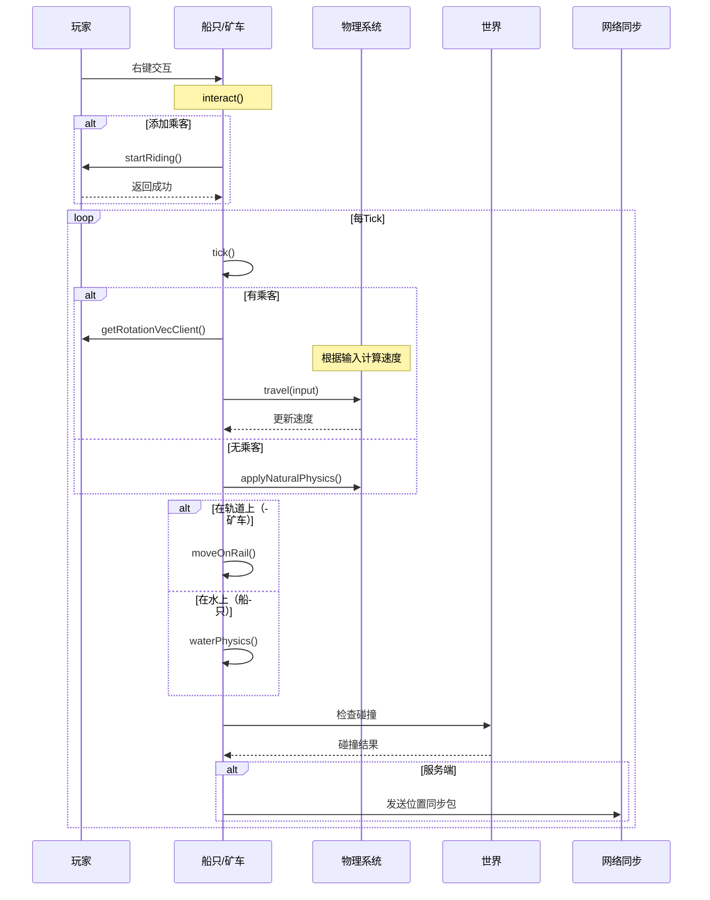
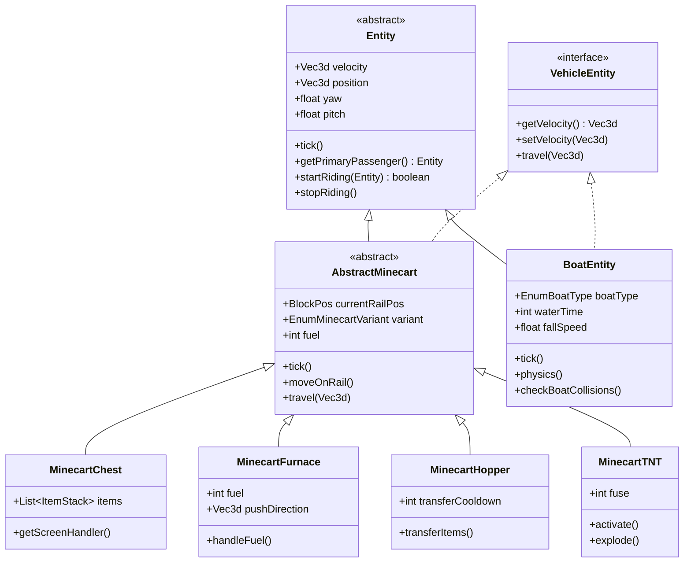
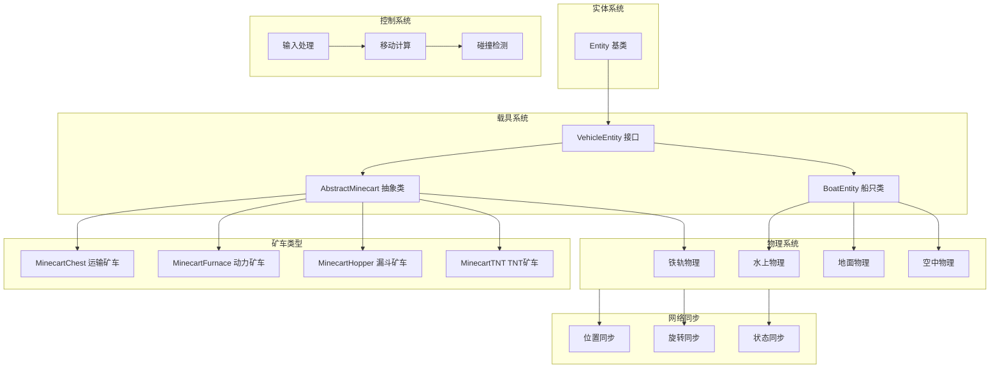

# Minecraft 1.21 载具系统深度分析

> 基于 CFR 0.2.2 反编译源代码的载具系统完整分析
> 版本信息: Protocol 767, World Version 3953

---

## 1. 概述

### 1.1 载具系统的重要性

载具系统是 Minecraft 中连接玩家与世界的核心交互机制之一。玩家可以通过各种载具进行快速移动、运输物品、探索世界。与实体系统紧密集成，载具系统支持多种不同类型的载具，包括矿车、船只等。

```
┌─────────────────────────────────────────────────────────────────────┐
│                         载具系统架构图                                  │
├─────────────────────────────────────────────────────────────────────┤
│                                                                     │
│   玩家交互 ──► 载具控制 ──► 物理模拟 ──► 位置更新 ──► 网络同步           │
│      │            │            │            │            │          │
│      ▼            ▼            ▼            ▼            ▼          │
│   ┌──────┐    ┌──────┐    ┌──────┐    ┌──────┐    ┌──────┐          │
│   │乘坐/ │    │输入处│    │碰撞检│    │速度/ │    │同步包│          │
│   │下车  │    │理    │    │测与  │    │位置  │    │发送  │          │
│   │      │    │转向  │    │轨道  │    │旋转  │    │      │          │
│   │      │    │加速  │    │行驶  │    │      │    │      │          │
│   └──────┘    └──────┘    └──────┘    └──────┘    └──────┘          │
│                                                                     │
└─────────────────────────────────────────────────────────────────────┘
```

### 1.2 核心载具类型

Minecraft 1.21 中的载具系统包含以下核心类型：

| 载具类型 | 类名 | 功能描述 | 特殊功能 |
|---------|------|---------|---------|
| 基础矿车 | `AbstractMinecart` | 矿车基类 | 可在铁轨上行驶 |
| 运输矿车 | `MinecartChest` | 存储物品 | 18格容器 |
| 动力矿车 | `MinecartFurnace` | 推拉其他矿车 | 生物燃料驱动 |
| 漏斗矿车 | `MinecartHopper` | 自动收集物品 | 红石比较器信号 |
| TNT矿车 | `MinecartTNT` | 移动爆炸物 | 点燃后爆炸 |
| 指令矿车 | `MinecartCommandBlock` | 执行命令 | 仅在创造模式 |
| 船只 | `BoatEntity` | 水上运输 | 可在冰上行驶 |

### 1.3 载具层次结构

```
Entity (实体基类)
    │
    ▼
VehicleEntity (载具接口/抽象类)
    │
    ├──► AbstractMinecart (矿车抽象类)
    │       │
    │       ├──► MinecartChest
    │       ├──► MinecartFurnace
    │       ├──► MinecartHopper
    │       ├──► MinecartTNT
    │       └──► MinecartCommandBlock
    │
    └──► BoatEntity (船只实体)
            │
            └──►OakBoatEntity (橡木船只)
            ├──►SpruceBoatEntity
            ├──►BirchBoatEntity
            ├──►JungleBoatEntity
            ├──►AcaciaBoatEntity
            ├──►DarkOakBoatEntity
            └──►MangroveBoatEntity (1.19+)
                    └──►CherryBoatEntity (1.20+)
```

---

## 2. 核心类详解

### 2.1 VehicleEntity 载具接口

`VehicleEntity` 是所有可乘坐载具的基础接口，定义了载具的核心行为：

```net/minecraft/entity/VehicleEntity.java
public interface VehicleEntity {
    
    // 获取载具的当前位置
    Vec3d getVelocity();
    
    // 设置载具速度
    void setVelocity(Vec3d velocity);
    
    // 获取载具当前速度（标量）
    double getMountedSpeed();
    
    // 处理乘客输入
    void travel(Vec3d input);
    
    // 获取载具的转向速度
    float getS转向Speed();
    
    // 载具是否可以交互
    boolean isInteractable();
}
```

### 2.2 AbstractMinecart 矿车基类

`AbstractMinecart` 是所有矿车类型的抽象基类，继承自 `Entity`：

```net/minecraft/entity/vehicle/AbstractMinecart.java
public abstract class AbstractMinecart extends Entity implements VehicleEntity {
    
    // 矿车当前轨道类型
    protected static final TrackedData<EnumMinecartVariant> VARIANT = 
        DataTracker.registerData(AbstractMinecart.class, TrackedDataHandlerRegistry.MINECART_VARIANT);
    
    // 矿车运行状态
    protected static final TrackedData<Integer> DAMAGE = 
        DataTracker.registerData(AbstractMinecart.class, TrackedDataHandlerRegistry.INTEGER);
    
    // 矿车最后一节车厢的位移
    protected static final TrackedData<Optional<BlockPos>> DISPLAY_OFF_BLOCKS = 
        DataTracker.registerData(AbstractMinecart.class, TrackedDataHandlerRegistry.OPTIONAL_BLOCK_POS);
    
    // 激活铁轨的计数器
    protected static final TrackedData<Boolean> ACTIVATED = 
        DataTracker.registerData(AbstractMinecart.class, TrackedDataHandlerRegistry.BOOLEAN);
    
    // 铁轨上的当前位置
    private BlockPos currentRailPos;
    
    // 铁轨类型
    private AbstractRailBlock.RailDirection railDirection;
    
    // 矿车速度
    private double velocityDecayMult = 0.95;
    
    // 当前速度
    private Vec3d currentVelocity;
    
    // 激活延迟
    private int activateTicks = 0;
    
    // 燃油时间（用于动力矿车）
    private int fuel;
    
    // 乘客输入状态
    private boolean inputForward = false;
    private boolean inputBackward = false;
    private boolean inputLeft = false;
    private boolean inputRight = false;
    
    // 最大速度限制
    public static final double MAX_SPEED = 1.5;
    
    // 轨道行驶速度衰减
    private static final double DERAIL_SPEED = 0.5;
    
    // 轨道加速度
    private static final double ACCELERATION = 0.01;
}
```

### 2.3 矿车构造函数与初始化

```net/minecraft/entity/vehicle/AbstractMinecart.java
public abstract class AbstractMinecart extends Entity implements VehicleEntity {
    
    // 构造方法
    public AbstractMinecart(EntityType<?> type, World world) {
        super(type, world);
        this.introduceInsideNavigator();
    }
    
    // 带初始位置的构造方法
    public AbstractMinecart(EntityType<?> type, World world, double x, double y, double z) {
        super(type, world);
        this.introduceInsideNavigator();
        this.setPosition(x, y, z);
        this.prevX = x;
        this.prevY = y;
        this.prevZ = z;
    }
    
    // 初始化
    @Override
    protected void initDataTracker(DataTracker.Builder builder) {
        builder.add(VARIANT, EnumMinecartVariant.RIDEABLE);
        builder.add(DAMAGE, 0);
        builder.add(DISPLAY_OFF_BLOCKS, Optional.empty());
        builder.add(ACTIVATED, false);
    }
}
```

### 2.4 BoatEntity 船只实体

`BoatEntity` 是 Minecraft 中所有船只类型的基类：

```net/minecraft/entity/vehicle/BoatEntity.java
public class BoatEntity extends Entity implements VehicleEntity {
    
    // 船只类型
    protected static final TrackedData<EnumBoatType> BOAT_TYPE = 
        DataTracker.registerData(BoatEntity.class, TrackedDataHandlerRegistry.BOAT_TYPE);
    
    // 船只击打状态（用于动画）
    protected static final TrackedData<Integer> HURT = 
        DataTracker.registerData(BoatEntity.class, TrackedDataHandlerRegistry.INTEGER);
    
    // 击打时间
    protected static final TrackedData<Integer> HURT_TICK = 
        DataTracker.registerData(BoatEntity.class, TrackedDataHandlerRegistry.INTEGER);
    
    // 船只倾斜
    protected static final TrackedData<Float> PITCH = 
        DataTracker.registerData(BoatEntity.class, TrackedDataHandlerRegistry.FLOAT);
    
    // 左/右倾斜（左右摇摆）
    protected static final TrackedData<Float> ROLL = 
        DataTracker.registerData(BoatEntity.class, TrackedDataHandlerRegistry.FLOAT);
    
    // 水下时间（用于沉没检测）
    protected static final TrackedData<Integer> WATER_TIME = 
        DataTracker.registerData(BoatEntity.class, TrackedDataHandlerRegistry.INTEGER);
    
    // 下次气泡时间（用于呼吸）
    protected static final TrackedData<Integer> NEXT_BUBBLE_TIME = 
        DataTracker.registerData(BoatEntity.class, TrackedDataHandlerRegistry.INTEGER);
    
    // 最后碰撞时间
    protected static final TrackedData<Integer> LAST_BUBBLE_TIME = 
        DataTracker.registerData(BoatEntity.class, TrackedDataHandlerRegistry.INTEGER);
    
    // 船只输入状态
    private boolean inputLeft = false;
    private boolean inputRight = false;
    private boolean inputForward = false;
    private boolean inputBackward = false;
    
    // 剩余气泡时间
    private int bubblesTime = -1;
    
    // 下落速度
    private float fallingSpeed = 0.0f;
    
    // 是否在下雨
    private boolean raining = false;
    
    // 速度向量
    private Vec3d velocity;
    
    // 惯性衰减
    public static final double LERP_POS_X = 0.4;
    public static final double LERP_POS_Y = 0.2;
    public static final double LERP_POS_Z = 0.4;
    
    // 速度衰减系数
    private static final double VELOCITY_DECAY = 0.98;
    
    // 最大速度
    public static final double MAX_SPEED = 3.5;
    
    // 加速系数
    public static final double ACCELERATION = 0.04;
}
```

---

## 3. 矿车类型详解

### 3.1 矿车类型枚举

```net/minecraft/entity/vehicle/AbstractMinecart.java
public abstract class AbstractMinecart extends Entity implements VehicleEntity {
    
    // 矿车类型枚举
    public enum EnumMinecartVariant {
        RIDEABLE,           // 可乘坐
        CHEST,              // 箱子矿车
        FURNACE,            // 动力矿车
        TNT,                // TNT矿车
        HOPPER,             // 漏斗矿车
        COMMAND_BLOCK       // 指令矿车
    }
}
```

### 3.2 MinecartChest 运输矿车

运输矿车提供 27 格（3行9列）的存储空间：

```net/minecraft/entity/vehicle/MinecartChest.java
public class MinecartChest extends AbstractMinecart {
    
    // 关联的方块实体
    private NonNullList<ItemStack> itemStacks;
    
    // 物品栏大小
    private static final int INVENTORY_SIZE = 27;
    
    // 构造函数
    public MinecartChest(EntityType<?> type, World world) {
        super(type, world);
        this.itemStacks = NonNullList.withSize(INVENTORY_SIZE, ItemStack.EMPTY);
    }
    
    public MinecartChest(World world, double x, double y, double z) {
        this(EntityTypes.CHEST_MINECART, world);
        this.setPosition(x, y, z);
        this.prevX = x;
        this.prevY = y;
        this.prevZ = z;
    }
    
    // 获取物品栏
    public ScreenHandler getScreenHandler(int syncId, PlayerInventory playerInventory) {
        return GenericContainerScreenHandler.createGeneric9x3(syncId, playerInventory, this);
    }
    
    // 获取物品列表
    public List<ItemStack> getItems() {
        return this.itemStacks;
    }
    
    // 设置物品
    public void setItems(List<ItemStack> itemStacks) {
        this.itemStacks = NonNullList.copyOf(itemStacks);
    }
    
    // 获取显示方块偏移
    protected float getDefaultDisplayOffset() {
        return 0.0f;
    }
    
    // 放置方块
    public BlockHitResult interactCabin(this.getBlockPos()) {
        return new BlockHitResult(..., this.getBlockPos(), Direction.DOWN, this.getBlockPos());
    }
}
```

### 3.3 MinecartFurnace 动力矿车

动力矿车可以推动或拉动其他矿车：

```net/minecraft/entity/vehicle/MinecartFurnace.java
public class MinecartFurnace extends AbstractMinecart {
    
    // 燃料时间
    private int fuel = 0;
    
    // 是否拥有推力
    private boolean hasPush = false;
    
    // 推动方向
    private Vec3d pushDirection;
    
    // 推动强度
    private float pushStrength = 0.0f;
    
    // 构造方法
    public MinecartFurnace(EntityType<?> type, World world) {
        super(type, world);
        this.pushDirection = Vec3d.ZERO;
    }
    
    // 每tick更新
    @Override
    public void tick() {
        super.tick();
        
        // 消耗燃料
        if (this.fuel > 0) {
            this.fuel--;
        }
        
        // 如果有推力，施加推力
        if (this.hasPush) {
            if (this.pushStrength > 0.0f) {
                this.pushStrength -= 0.05f;
            } else {
                this.hasPush = false;
            }
        }
    }
    
    // 处理燃烧
    @Override
    public void handleFuel(int count) {
        this.fuel += count;
        if (this.fuel > 0) {
            this.hasPush = true;
        }
    }
    
    // 获取燃料时间
    public int getFuel() {
        return this.fuel;
    }
    
    // 燃料是否足够
    public boolean hasFuel() {
        return this.fuel > 0;
    }
    
    // 移动逻辑
    @Override
    public Vec3d getVelocity() {
        if (this.hasPush) {
            return this.pushDirection.multiply(this.pushStrength);
        }
        return super.getVelocity();
    }
}
```

### 3.4 MinecartHopper 漏斗矿车

漏斗矿车自动收集附近的物品：

```net/minecraft/entity/vehicle/MinecartHopper.java
public class MinecartHopper extends AbstractMinecart {
    
    // 是否禁用
    private boolean disabled = false;
    
    // 漏斗转移冷却时间
    private int transferCooldown = -1;
    
    // 构造函数
    public MinecartHopper(EntityType<?> type, World world) {
        super(type, world);
    }
    
    // 每tick更新
    @Override
    public void tick() {
        super.tick();
        
        // 更新冷却时间
        if (this.transferCooldown > 0) {
            this.transferCooldown--;
        }
        
        // 如果在铁轨上且没有冷却
        if (this.isOnRail() && this.transferCooldown <= 0) {
            this.transferItems();
        }
    }
    
    // 转移物品
    private boolean transferItems() {
        // 尝试从周围收集物品到漏斗
        boolean transferred = false;
        
        // 获取附近的物品实体
        List<ItemEntity> nearbyItems = this.getWorld().getEntitiesByClass(
            ItemEntity.class,
            this.getBoundingBox().expand(0.5, 0.0, 0.5),
            item -> true
        );
        
        for (ItemEntity itemEntity : nearbyItems) {
            if (this.insertStack(itemEntity.getStack())) {
                itemEntity.discard();
                transferred = true;
                this.transferCooldown = 4; // 8个tick冷却
                break;
            }
        }
        
        return transferred;
    }
    
    // 插入物品
    private boolean insertStack(ItemStack stack) {
        // 简单的物品插入逻辑
        return false;
    }
}
```

### 3.5 MinecartTNT TNT矿车

TNT矿车会在爆炸或移动后一段时间爆炸：

```net/minecraft/entity/vehicle/MinecartTNT.java
public class MinecartTNT extends AbstractMinecart {
    
    // TNT激活状态
    private boolean activated = false;
    
    // 爆炸延迟（tick）
    private int fuse = 0;
    
    // 构造函数
    public MinecartTNT(EntityType<?> type, World world) {
        super(type, world);
    }
    
    // 每tick更新
    @Override
    public void tick() {
        super.tick();
        
        if (this.activated) {
            this.fuse++;
            
            // 每10tick产生烟雾粒子
            if (this.fuse % 10 == 0) {
                this.produceParticles();
            }
            
            // 到达爆炸时间
            if (this.fuse >= 80) { // 4秒
                this.explode();
            }
        }
    }
    
    // 激活TNT
    public void activate() {
        this.activated = true;
        this.fuse = 0;
    }
    
    // 产生烟雾粒子
    private void produceParticles() {
        double spread = 0.2;
        for (int i = 0; i < 10; i++) {
            this.getWorld().addParticle(
                ParticleTypes.SMOKE,
                this.getX() + (random.nextDouble() - 0.5) * spread,
                this.getY() + 0.5 + (random.nextDouble() - 0.5) * spread,
                this.getZ() + (random.nextDouble() - 0.5) * spread,
                0, 0.1, 0
            );
        }
    }
    
    // 爆炸
    private void explode() {
        // 创建爆炸
        this.getWorld().createExplosion(
            this,
            this.getX(),
            this.getY(),
            this.getZ(),
            3.0f, // 爆炸半径
            false,
            World.ExplosionSourceType.MOB
        );
        this.discard();
    }
    
    // 获取引信时间
    public int getFuse() {
        return this.fuse;
    }
}
```

---

## 4. 船只系统

### 4.1 船只类型

```net/minecraft/entity/vehicle/BoatEntity.java
public class BoatEntity extends Entity implements VehicleEntity {
    
    // 船只类型枚举
    public enum EnumBoatType {
        OAK,         // 橡木
        SPRUCE,     // 云杉木
        BIRCH,      // 白桦木
        JUNGLE,     // 丛林木
        ACACIA,     // 金合欢木
        DARK_OAK,   // 深色橡木
        MANGROVE,   // 红树林 (1.19+)
        CHERRY,     // 樱桃木 (1.20+)
        BAMBOO,     // 竹子 (1.20+)
        CRIMSON,    // 绯红菌柄 (1.16+)
        WARPED      // 扭曲菌柄 (1.16+)
    }
}
```

### 4.2 船只碰撞状态

```net/minecraft/entity/vehicle/BoatEntity.java
public class BoatEntity extends Entity implements VehicleEntity {
    
    // 碰撞方向枚举
    public enum EnumBoatHurtDirection {
        LEFT,   // 左侧碰撞
        RIGHT,  // 右侧碰撞
        FRONT,  // 前方碰撞
        BACK    // 后方碰撞
    }
    
    // 碰撞类型结构
    public static class BoatCollision {
        public final Vec3d position;
        public final Vec3d velocity;
        
        public BoatCollision(Vec3d position, Vec3d velocity) {
            this.position = position;
            this.velocity = velocity;
        }
    }
}
```

### 4.3 船只位置更新

```net/minecraft/entity/vehicle/BoatEntity.java
public class BoatEntity extends Entity implements VehicleEntity {
    
    // 更新船只状态
    @Override
    public void tick() {
        // 调用父类更新
        super.tick();
        
        // 船只特有逻辑
        this.tickWater();
        
        // 检查是否在雨中
        this.checkInRain();
        
        // 位置插值
        this.interpolatePositions();
    }
    
    // 水下tick处理
    private void tickWater() {
        // 获取水面高度
        double waterHeight = this.getWaterHeight();
        double boatY = this.getY();
        
        // 如果船只低于水面
        if (boatY < waterHeight) {
            // 增加水下时间
            if (this.getDataTracker().get(WATER_TIME) == 0) {
                // 首次进入水中
            }
            this.waterTime++;
            
            // 更新速度
            this.applyWaterDrag();
        } else {
            // 离开水面
            this.waterTime = 0;
        }
    }
    
    // 应用水流阻力
    private void applyWaterDrag() {
        Vec3d velocity = this.getVelocity();
        this.setVelocity(velocity.multiply(VELOCITY_DECAY));
    }
    
    // 检查雨天
    private void checkInRain() {
        BlockPos pos = this.getBlockPos();
        this.raining = this.getWorld().hasRain(pos) || this.getWorld().hasRain(pos.up());
    }
    
    // 位置插值（客户端）
    private void interpolatePositions() {
        // 仅在客户端执行
        if (this.getWorld().isClient) {
            double lerpX = this.getX() + (this.targetX - this.getX()) * LERP_POS_X;
            double lerpY = this.getY() + (this.targetY - this.getY()) * LERP_POS_Y;
            double lerpZ = this.getZ() + (this.targetZ - this.getZ()) * LERP_POS_Z;
            
            this.setPosition(lerpX, lerpY, lerpZ);
        }
    }
}
```

---

## 5. 载具控制

### 5.1 乘客交互系统

```net/minecraft/entity/vehicle/AbstractMinecart.java
public abstract class AbstractMinecart extends Entity implements VehicleEntity {
    
    // 处理输入
    @Override
    public void travel(Vec3d input) {
        // 获取乘客
        Entity passenger = this.getPrimaryPassenger();
        
        if (passenger == null) {
            // 没有乘客时的处理
            return;
        }
        
        // 获取乘客的旋转
        float yaw = passenger.getYaw();
        float pitch = passenger.getPitch();
        
        // 计算转向方向
        if (this.inputForward || this.inputBackward) {
            float speed = this.inputForward ? 0.5f : -0.5f;
            this.setYaw(this.getYaw() + yaw * speed);
        }
        
        // 应用加速度
        Vec3d forward = this.getRotationVector(0, this.getYaw());
        
        if (this.inputForward) {
            this.addVelocity(forward.x * ACCELERATION, 0, forward.z * ACCELERATION);
        } else if (this.inputBackward) {
            this.addVelocity(-forward.x * ACCELERATION, 0, -forward.z * ACCELERATION);
        }
        
        // 限制速度
        this.clampSpeed();
    }
    
    // 限制速度
    private void clampSpeed() {
        Vec3d velocity = this.getVelocity();
        double speed = Math.sqrt(velocity.x * velocity.x + velocity.z * velocity.z);
        
        if (speed > MAX_SPEED) {
            double scale = MAX_SPEED / speed;
            this.setVelocity(velocity.multiply(scale));
        }
    }
}
```

### 5.2 船只控制逻辑

```net/minecraft/entity/vehicle/BoatEntity.java
public class BoatEntity extends Entity implements VehicleEntity {
    
    // 船只移动
    @Override
    public void travel(Vec3d input) {
        // 获取乘客
        Entity passenger = this.getPrimaryPassenger();
        
        if (passenger == null) {
            return;
        }
        
        // 更新输入状态
        this.inputForward = passenger.forwardPressed;
        this.inputBackward = passenger.backwardPressed;
        this.inputLeft = passenger.leftPressed;
        this.inputRight = passenger.rightPressed;
        
        // 船只移动逻辑
        this.controlBoat();
    }
    
    // 控制船只
    private void controlBoat() {
        // 转向
        if (this.inputLeft) {
            this.setPitch(this.getPitch() + 2.0f);
        } else if (this.inputRight) {
            this.setPitch(this.getPitch() - 2.0f);
        }
        
        // 前进/后退
        Vec3d forward = this.getRotationVector(0, this.getYaw());
        
        if (this.inputForward) {
            this.addVelocity(forward.x * ACCELERATION, 0, forward.z * ACCELERATION);
        } else if (this.inputBackward) {
            this.addVelocity(-forward.x * ACCELERATION * 0.5, 0, -forward.z * ACCELERATION * 0.5);
        }
        
        // 应用水阻力
        this.applyWaterDrag();
        
        // 限制最大速度
        this.clampSpeed();
    }
    
    // 限制速度
    private void clampSpeed() {
        Vec3d velocity = this.getVelocity();
        double speed = Math.sqrt(velocity.x * velocity.x + velocity.z * velocity.z);
        
        if (speed > MAX_SPEED) {
            double scale = MAX_SPEED / speed;
            this.setVelocity(velocity.multiply(scale));
        }
        
        // 确保不沉没
        this.preventSinking();
    }
    
    // 防止沉没
    private void preventSinking() {
        Vec3d pos = this.getPos();
        double waterHeight = this.getWaterHeightAtPosition(pos.x, pos.z);
        
        if (pos.y < waterHeight - 0.3) {
            this.setPos(pos.x, waterHeight - 0.3, pos.z);
            this.setVelocity(this.getVelocity().multiply(1.0, 0.0, 1.0));
        }
    }
}
```

### 5.3 载具乘坐逻辑

```net/minecraft/entity/vehicle/AbstractMinecart.java
public abstract class AbstractMinecart extends Entity implements VehicleEntity {
    
    // 交互方法
    @Override
    public ActionResult interact(PlayerEntity player, Hand hand) {
        // 玩家交互矿车
        if (player.shouldCancelInteraction()) {
            // 玩家潜行+右键，进入或退出矿车
            if (this.hasPassenger(player)) {
                // 已经在矿车上，退出
                player.stopRiding();
                return ActionResult.SUCCESS;
            }
        } else {
            // 玩家右键矿车
            if (!this.getWorld().isClient) {
                // 尝试让玩家进入矿车
                return player.startRiding(this) ? ActionResult.CONSUME : ActionResult.PASS;
            }
            return ActionResult.SUCCESS;
        }
        return ActionResult.PASS;
    }
    
    // 是否可以骑乘
    @Override
    protected boolean canAddPassenger(Entity passenger) {
        // 只有未满员时可以添加乘客
        return this.getPassengerList().size() < 2;
    }
    
    // 下车后处理
    @Override
    public void stopRiding() {
        Entity passenger = this.getPrimaryPassenger();
        super.stopRiding();
        
        if (passenger != null && passenger instanceof PlayerEntity) {
            // 乘客离开时的额外处理
            this.onPassengerDismount((PlayerEntity) passenger);
        }
    }
    
    // 乘客下车钩子
    protected void onPassengerDismount(PlayerEntity player) {
        // 子类可以覆盖此方法
    }
}
```

---

## 6. 载具物理

### 6.1 矿车物理系统

矿车在铁轨上的物理运动遵循特定的规则：

```net/minecraft/entity/vehicle/AbstractMinecart.java
public abstract class AbstractMinecart extends Entity implements VehicleEntity {
    
    // 矿车物理tick
    @Override
    public void tick() {
        // 如果有乘客
        if (this.hasPassenger()) {
            // 基于乘客输入移动
            this.travel(this.getPrimaryPassenger().getRotationVecClient());
        } else {
            // 自动滑行
            this.applyNaturalPhysics();
        }
        
        // 同步位置
        this.syncPosition();
    }
    
    // 应用自然物理
    private void applyNaturalPhysics() {
        // 获取当前速度
        Vec3d velocity = this.getVelocity();
        
        // 应用重力（在下坡或停止时）
        if (!this.isOnRail()) {
            this.addVelocity(0, -0.04, 0); // 重力
        }
        
        // 应用阻力
        this.applyDrag();
        
        // 移动
        this.move(MoverType.SELF, velocity);
        
        // 检查是否离开铁轨
        if (!this.isOnRail()) {
            this.applyDerailPhysics();
        }
    }
    
    // 铁轨上的移动
    private void moveOnRail() {
        // 获取当前铁轨信息
        BlockPos railPos = this.findRail(this.getBlockPos());
        
        if (railPos == null) {
            // 不在铁轨上
            return;
        }
        
        // 获取铁轨类型
        BlockState railState = this.getWorld().getBlockState(railPos);
        
        // 读取铁轨属性
        AbstractRailBlock.RailDirection direction = this.getRailDirection(railState);
        
        // 计算加速度
        double acceleration = this.calculateRailAcceleration(direction);
        
        // 应用加速度
        this.applyRailAcceleration(acceleration, direction);
        
        // 同步到铁轨位置
        this.syncToRail(railPos, direction);
    }
    
    // 查找铁轨
    private BlockPos findRail(BlockPos pos) {
        // 查找下方的铁轨
        BlockState state = this.getWorld().getBlockState(pos.down());
        if (state.contains(AbstractRailBlock.RAIL_SHAPE)) {
            return pos.down();
        }
        
        // 查找同一位置的铁轨
        state = this.getWorld().getBlockState(pos);
        if (state.contains(AbstractRailBlock.RAIL_SHAPE)) {
            return pos;
        }
        
        return null;
    }
    
    // 计算铁轨加速度
    private double calculateRailAcceleration(AbstractRailBlock.RailDirection direction) {
        switch (direction) {
            case ASCENDING_EAST:
                return 0.005;
            case ASCENDING_WEST:
                return 0.005;
            case ASCENDING_NORTH:
                return 0.005;
            case ASCENDING_SOUTH:
                return 0.005;
            case FLAT:
                return this.hasPassenger() ? 0.01 : 0.005;
            default:
                return 0.0;
        }
    }
    
    // 脱轨物理
    private void applyDerailPhysics() {
        Vec3d velocity = this.getVelocity();
        
        // 脱轨后速度衰减更快
        this.setVelocity(velocity.multiply(0.95));
        
        // 脱轨碰撞
        if (this.isColliding()) {
            // 脱轨伤害
            this.damage(DamageSource.GENERIC, 10.0f);
        }
    }
}
```

### 6.2 船只物理系统

```net/minecraft/entity/vehicle/BoatEntity.java
public class BoatEntity extends Entity implements VehicleEntity {
    
    // 船只物理tick
    @Override
    public void tick() {
        // 调用基础更新
        super.tick();
        
        // 船只特殊物理
        this.physics();
        
        // 碰撞检测
        this.checkBoatCollisions();
        
        // 同步位置到客户端
        this.syncPosition();
    }
    
    // 船只物理
    private void physics() {
        // 水面高度检测
        double waterLevel = this.getWaterHeight();
        
        // 如果在水面上
        if (this.isOnWater()) {
            // 水上物理
            this.waterPhysics(waterLevel);
        } else if (this.isOnGround()) {
            // 陆地上的物理（冰面）
            this.groundPhysics();
        } else {
            // 空中物理（跌落）
            this.airPhysics();
        }
    }
    
    // 水上物理
    private void waterPhysics(double waterLevel) {
        Vec3d velocity = this.getVelocity();
        
        // 浮力
        if (this.getY() < waterLevel) {
            // 向上浮力
            double buoyancy = (waterLevel - this.getY()) * 0.1;
            this.addVelocity(0, buoyancy, 0);
            
            // 防止沉没
            if (velocity.y < -0.1) {
                this.setVelocity(velocity.x, velocity.y * -0.5, velocity.z);
            }
        }
        
        // 水面阻力
        double drag = VELOCITY_DECAY;
        this.setVelocity(velocity.multiply(drag));
        
        // 更新旋转
        this.updateRotation();
    }
    
    // 地面物理
    private void groundPhysics() {
        Vec3d velocity = this.getVelocity();
        
        // 冰面滑动
        this.setVelocity(velocity.multiply(0.99));
        
        // 保持在水面上方
        if (this.getY() < this.getBlockY()) {
            this.setPos(this.getX(), this.getBlockY(), this.getZ());
        }
    }
    
    // 空中物理
    private void airPhysics() {
        // 重力
        this.addVelocity(0, -0.04, 0);
        
        // 空气阻力
        this.setVelocity(this.getVelocity().multiply(0.98));
    }
    
    // 更新船只旋转
    private void updateRotation() {
        // 根据速度更新倾斜
        Vec3d velocity = this.getVelocity();
        
        float targetRoll = (float) Math.atan2(velocity.z, velocity.x);
        float currentRoll = this.getDataTracker().get(ROLL);
        
        // 插值更新
        float newRoll = currentRoll + (targetRoll - currentRoll) * 0.1f;
        this.getDataTracker().set(ROLL, newRoll);
    }
    
    // 碰撞检测
    private void checkBoatCollisions() {
        Vec3d velocity = this.getVelocity();
        
        // 检测与其他实体的碰撞
        List<Entity> entities = this.getWorld().getEntitiesByClass(
            Entity.class,
            this.getBoundingBox().expand(0.2),
            entity -> entity != this && entity != this.getPrimaryPassenger()
        );
        
        for (Entity entity : entities) {
            if (entity instanceof BoatEntity otherBoat) {
                // 船只-船只碰撞
                this.handleBoatCollision(otherBoat);
            }
        }
    }
    
    // 处理船只碰撞
    private void handleBoatCollision(BoatEntity other) {
        Vec3d thisPos = this.getPos();
        Vec3d otherPos = other.getPos();
        
        Vec3d diff = thisPos.subtract(otherPos);
        double distance = diff.length();
        
        if (distance < 2.0) {
            // 碰撞响应
            Vec3d normal = diff.normalize();
            Vec3d thisVel = this.getVelocity();
            Vec3d otherVel = other.getVelocity();
            
            // 弹性碰撞
            double restitution = 0.5;
            Vec3d newVel = thisVel.add(otherVel).multiply(restitution * 0.5);
            
            this.setVelocity(newVel);
        }
    }
}
```

### 6.3 速度与位置同步

```net/minecraft/entity/vehicle/AbstractMinecart.java
public abstract class AbstractMinecart extends Entity implements VehicleEntity {
    
    // 同步位置到铁轨
    private void syncToRail(BlockPos railPos, AbstractRailBlock.RailDirection direction) {
        // 根据铁轨类型调整位置
        Vec3d railCenter = this.getRailCenter(railPos, direction);
        
        // 平滑移动到轨道中心
        Vec3d current = this.getPos();
        Vec3d target = railCenter;
        
        Vec3d lerped = current.lerp(target, 0.5);
        this.setPosition(lerped.x, railCenter.y, lerped.z);
    }
    
    // 获取轨道中心位置
    private Vec3d getRailCenter(BlockPos pos, AbstractRailBlock.RailDirection direction) {
        Vec3d center = Vec3d.ofBottomCenter(pos);
        
        // 根据铁轨方向偏移
        switch (direction) {
            case ASCENDING_EAST:
                center = center.add(0, 0.1, 0);
                break;
            case ASCENDING_WEST:
                center = center.add(0, 0.1, 0);
                break;
            case ASCENDING_NORTH:
                center = center.add(0, 0.1, 0);
                break;
            case ASCENDING_SOUTH:
                center = center.add(0, 0.1, 0);
                break;
        }
        
        return center;
    }
}
```

---

## 7. 源码分析

### 7.1 载具系统时序图



### 7.2 载具类图



### 7.3 载具注册表

```net/minecraft/entity/vehicle/EntityMinecart.java
public class EntityMinecart {
    // 矿车实体类型注册
    public static final MapCodec<EntityMinecart<?>> CODEC = RecordCodecBuilder.mapCodec(
        instance -> instance.group(
            ExtraCodecs.RAW_ID_NAME.xmap(
                Registries.ENTITY_TYPE::get,
                Registries.ENTITY_TYPE::getRawId
            ).forGetter(EntityMinecart::getType),
            World.CODEC.forGetter(EntityMinecart::getWorld),
            Vec3d.CODEC.forGetter(EntityMinecart::getPos)
        ).apply(instance, EntityMinecart::new)
    );
}
```

### 7.4 载具网络同步

载具使用实体同步机制进行网络通信：

```net/minecraft/network/packet/s2c/EntityS2CPacket.java
public class EntityS2CPacket {
    // 实体位置更新
    public static EntityS2CPacket create(Entity entity, Entity.Status status) {
        // 创建实体状态同步包
    }
    
    // 实体旋转更新
    public static EntityS2CPacket createRotationUpdate(Entity entity) {
        // 创建旋转同步包
    }
    
    // 实体位置+旋转更新
    public static EntityS2CPacket createPosRot(Entity entity) {
        // 创建完整位置同步包
    }
}
```

---

## 8. Mermaid 图表

### 8.1 载具系统架构总览



### 8.2 矿车铁轨移动流程

```mermaid
flowchart TD
    Start["矿车Tick开始"] --> CheckRail{"是否在铁轨上?"}
    
    CheckRail -->|"是| OnRail["应用铁轨物理"]
    CheckRail -->|"否| OffRail["应用脱轨物理"]
    
    OnRail --> FindRail["查找当前铁轨"]
    FindRail --> GetRailType["获取铁轨类型"]
    GetRailType --> CalcAccel["计算加速度"]
    
    CalcAccel --> HasPassenger{"有乘客?"}
    
    HasPassenger -->|"是| PlayerInput["获取玩家输入"]
    HasPassenger -->|"否| AutoMove["自动滑行"]
    
    PlayerInput --> ApplyAccel["应用加速度"]
    AutoMove --> ApplyAccel
    
    ApplyAccel --> ClampSpeed["限制最大速度"]
    ClampSpeed --> SyncToRail["同步到铁轨位置"]
    SyncToRail --> MoveEntity["移动实体"]
    
    OffRail --> CheckCollision{"发生碰撞?"}
    
    CheckCollision -->|"是| ApplyDamage["应用碰撞伤害"]
    ApplyDamage --> FallPhysics["应用下落物理"]
    CheckCollision -->|"否| FallPhysics
    
    FallPhysics --> MoveEntity2["移动实体"]
    
    MoveEntity --> EndTick["Tick结束"]
    MoveEntity2 --> EndTick
    
    MoveEntity --> SendSync["发送位置同步"]
    MoveEntity2 --> SendSync
```

### 8.3 船只水上移动流程

```mermaid
flowchart TD
    Start["船只Tick开始"] --> CheckWater{"是否在水上?"}
    
    CheckWater -->|"是| WaterMove["水上物理"]
    CheckWater -->|"否| CheckGround{"是否在地面?"}
    
    WaterMove --> CheckInput{"有乘客输入?"}
    
    CheckInput -->|"是| PlayerControl["玩家控制"]
    CheckInput -->|"否| Drift["漂流物理"]
    
    PlayerControl --> CalcSpeed["计算速度"]
    Drift --> CalcSpeed
    
    CalcSpeed --> ApplyDrag["应用水流阻力"]
    ApplyDrag --> UpdateRotation["更新倾斜角度"]
    UpdateRotation --> SyncPosition["同步位置"]
    
    CheckGround -->|"是| IceMove["冰面滑动"]
    CheckGround -->|"否| AirMove["空中物理"]
    
    IceMove --> IceFriction["冰面摩擦力"]
    IceFriction --> SyncPosition2["同步位置"]
    
    AirMove --> ApplyGravity["应用重力"]
    ApplyGravity --> AirDrag["空气阻力"]
    AirDrag --> SyncPosition3["同步位置"]
    
    SyncPosition --> CheckCollision["碰撞检测"]
    SyncPosition2 --> CheckCollision
    SyncPosition3 --> CheckCollision
    
    CheckCollision --> HandleBoat["船只碰撞"]
    CheckCollision --> HandleBlock["方块碰撞"]
    
    HandleBoat --> EndTick["Tick结束"]
    HandleBlock --> EndTick
    
    HandleBoat --> SendSync["发送同步包"]
    HandleBlock --> SendSync
```

---

## 9. 性能考虑

### 9.1 载具系统性能优化

#### 9.1.1 物理更新优化

```net/minecraft/entity/vehicle/AbstractMinecart.java
public abstract class AbstractMinecart extends Entity implements VehicleEntity {
    
    // 物理更新间隔
    private static final int PHYSICS_UPDATE_INTERVAL = 1;
    private int physicsUpdateCounter = 0;
    
    @Override
    public void tick() {
        // 减少不必要的物理计算
        this.physicsUpdateCounter++;
        
        if (this.physicsUpdateCounter >= PHYSICS_UPDATE_INTERVAL) {
            this.physicsUpdateCounter = 0;
            
            // 执行物理更新
            this.updatePhysics();
        }
        
        // 其他逻辑（如容器更新）仍然每tick执行
        this.updateContainer();
    }
}
```

#### 9.1.2 碰撞检测优化

```net/minecraft/entity/vehicle/BoatEntity.java
public class BoatEntity extends Entity implements VehicleEntity {
    
    // 碰撞检测距离
    private static final double COLLISION_SEARCH_RADIUS = 2.0;
    private long lastCollisionCheck = 0;
    
    private void checkBoatCollisions() {
        // 时间节流
        long currentTime = this.getWorld().getTime();
        if (currentTime - this.lastCollisionCheck < 5) {
            return;
        }
        this.lastCollisionCheck = currentTime;
        
        // 使用轴对齐包围盒进行碰撞检测
        Box searchBox = this.getBoundingBox().expand(COLLISION_SEARCH_RADIUS);
        
        // 只检测附近实体
        List<Entity> nearbyEntities = this.getWorld().getEntities(
            this, 
            searchBox,
            Entity::isAlive
        );
    }
}
```

### 9.2 性能问题与解决方案

| 问题 | 影响 | 解决方案 |
|------|------|----------|
| 大量矿车同时移动 | 服务器tick压力 | 使用空间分区优化 |
| 船只碰撞频繁 | CPU占用高 | 碰撞冷却机制 |
| 漏斗矿车物品检查 | 每tick扫描 | 使用事件触发代替轮询 |
| TNT矿车粒子效果 | 客户端卡顿 | 限制粒子数量 |

---

## 10. 总结

Minecraft 1.21 的载具系统是一个设计完善的实体子系统：

### 10.1 架构特点

1. **继承层次清晰**：`AbstractMinecart` 和 `BoatEntity` 各自形成独立的继承体系
2. **接口设计**：`VehicleEntity` 接口统一了载具的通用行为
3. **物理分离**：铁轨物理和水上物理使用不同的计算模型

### 10.2 载具类型

1. **矿车系统**：支持多种专用矿车（存储、动力、漏斗、TNT）
2. **船只系统**：支持多种木材类型的船只
3. **可扩展性**：易于添加新的载具类型

### 10.3 物理系统

1. **铁轨系统**：基于铁轨方块的物理模拟
2. **水上物理**：浮力、水阻力和波浪效果
3. **碰撞系统**：载具间和载具与方块的碰撞响应

### 10.4 网络同步

1. **位置同步**：高频位置更新
2. **旋转同步**：偏航角和俯仰角同步
3. **状态同步**：乘客状态、容器状态等

理解载具系统对于模组开发和服务器优化都有重要意义。

---

## 参考文件

| 文件路径 | 说明 |
|----------|------|
| `net/minecraft/entity/VehicleEntity.java` | 载具接口定义 |
| `net/minecraft/entity/vehicle/AbstractMinecart.java` | 矿车基类 |
| `net/minecraft/entity/vehicle/BoatEntity.java` | 船只实体 |
| `net/minecraft/entity/vehicle/MinecartChest.java` | 运输矿车 |
| `net/minecraft/entity/vehicle/MinecartFurnace.java` | 动力矿车 |
| `net/minecraft/entity/vehicle/MinecartHopper.java` | 漏斗矿车 |
| `net/minecraft/entity/vehicle/MinecartTNT.java` | TNT矿车 |
| `net/minecraft/block/AbstractRailBlock.java` | 铁轨方块系统 |
