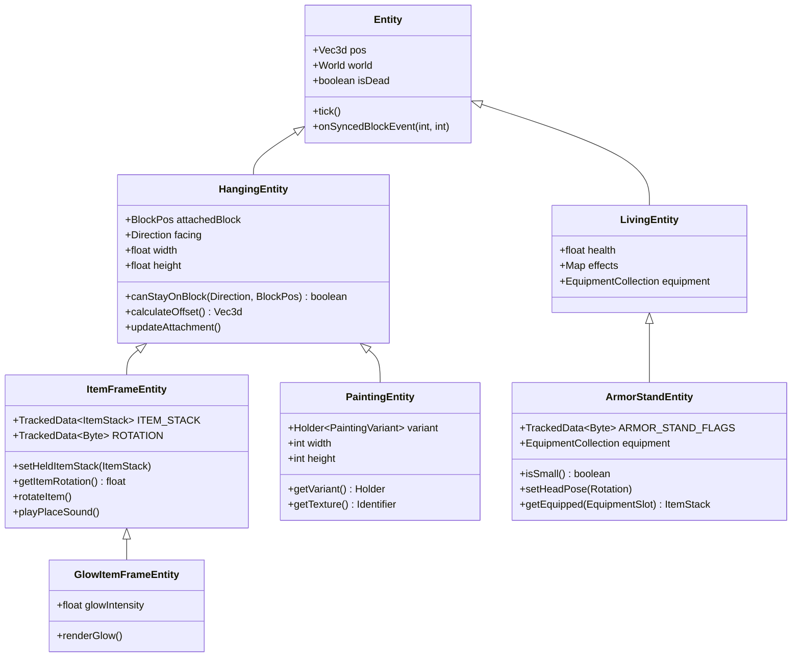
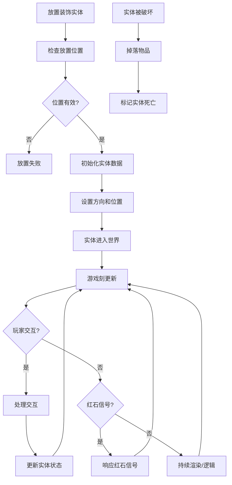
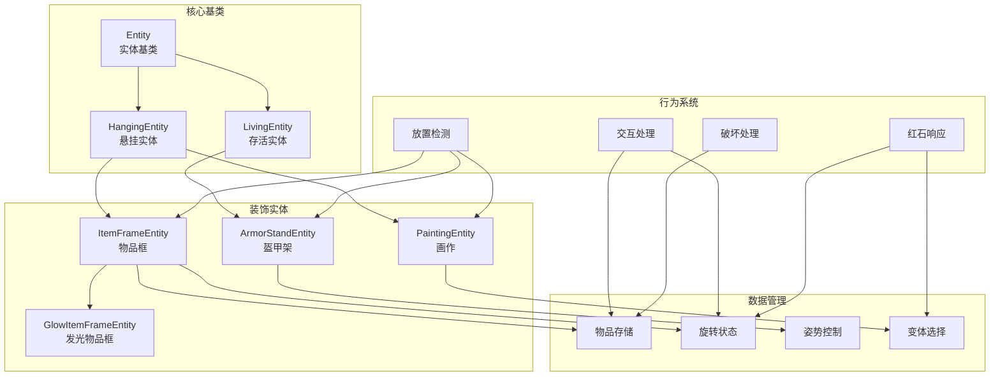
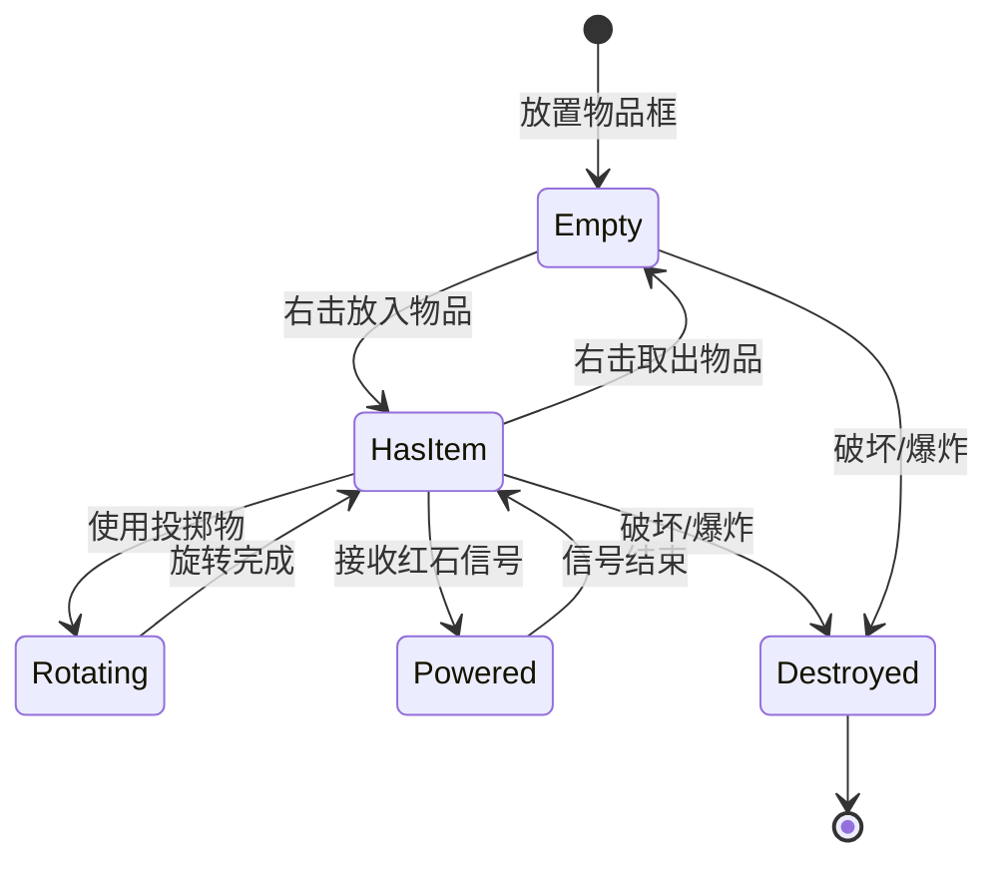
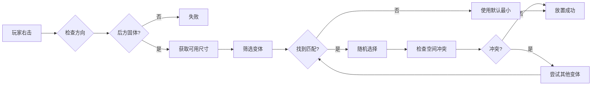

# Minecraft 1.21 装饰实体系统深度分析

> 基于 CFR 0.2.2 反编译源代码的装饰实体系统完整分析
> 版本信息: Protocol 767, World Version 3953

---

## 1. 概述

### 1.1 装饰实体的定义与分类

装饰实体（Decoration Entity）是 Minecraft 中一类特殊的非生物实体，它们主要用于装饰玩家的建筑和空间。这类实体具有以下共同特征：

- **悬挂机制**：装饰实体固定在方块表面，不能独立移动
- **物品展示**：可以存放和展示物品、画作等
- **装饰功能**：主要用于美化建筑和表达玩家创意

```
┌─────────────────────────────────────────────────────────────────────┐
│                      装饰实体分类体系                                    │
├─────────────────────────────────────────────────────────────────────┤
│                                                                     │
│  ┌───────────────────────────────────────────────────────────────┐ │
│  │                      HangingEntity (悬挂实体基类)                 │ │
│  │              所有装饰实体的抽象基类                             │ │
│  └─────────────────────────┬─────────────────────────────────────┘ │
│                            │                                        │
│        ┌───────────────────┼───────────────────┐                    │
│        ▼                   ▼                   ▼                    │
│  ┌─────────────┐    ┌─────────────┐    ┌─────────────┐           │
│  │ ItemFrame   │    │  Painting   │    │ GlowItemFrame│           │
│  │  (物品框)    │    │   (画作)    │    │  (发光物品框) │           │
│  └─────────────┘    └─────────────┘    └─────────────┘           │
│                                                                     │
│  ┌─────────────────────────────────────────────────────────────┐   │
│  │                    ArmorStandEntity (盔甲架)                  │   │
│  │              独立于 HangingEntity 的装饰实体                  │   │
│  └─────────────────────────────────────────────────────────────┘   │
│                                                                     │
└─────────────────────────────────────────────────────────────────────┘
```

### 1.2 系统架构概览

装饰实体系统由以下核心组件构成：

| 组件 | 类路径 | 职责 |
|------|--------|------|
| `HangingEntity` | `net.minecraft.world.entity` | 悬挂实体基类，定义通用行为 |
| `ItemFrameEntity` | `net.minecraft.world.entity` | 物品框实体实现 |
| `GlowItemFrameEntity` | `net.minecraft.world.entity` | 发光物品框（1.17+） |
| `PaintingEntity` | `net.minecraft.world.entity` | 画作实体 |
| `ArmorStandEntity` | `net.minecraft.world.entity` | 盔甲架实体 |
| `HangingEntityPlacementPrediction` | `net.minecraft.world.entity` | 放置预测系统 |

---

## 2. 核心类详解

### 2.1 HangingEntity - 悬挂实体基类

`HangingEntity` 是物品框和画作的抽象基类，封装了所有悬挂实体的通用行为。

```java
// net.minecraft.world.entity.HangingEntity
public abstract class HangingEntity extends Entity {
    // 固定位置（实体中心点所在的方块）
    private BlockPos attachedBlock = BlockPos.ORIGIN;
    
    // 悬挂方向（实体面向）
    private Direction facing = Direction.NORTH;
    
    // 悬挂尺寸（水平和垂直方向的格数）
    protected float width;
    protected float height;
    
    // 固定位置偏移量（根据方向计算）
    private Vec3d offset = Vec3d.ZERO;
    
    // 无敌帧计时器
    private int teleportId;
    private long teleportTime;
    private Vec3d teleportPos = Vec3d.ZERO;
    private double teleportPitch;
    private double teleportYaw;
}
```

#### 2.1.1 悬挂检测算法

悬挂实体的核心逻辑是检测是否可以安全放置：

```java
// 检测是否可以放置在指定位置
public boolean canStayOnBlock(Direction direction, BlockPos blockPos) {
    Vec3i vec3i = direction.getVector();
    
    // 计算实体中心点
    double x = (double)blockPos.getX() + 0.5 + (double)vec3i.getX() * 0.5;
    double y = (double)blockPos.getY() + 0.5 + (double)vec3i.getY() * 0.5;
    double z = (double)blockPos.getZ() + 0.5 + (double)vec3i.getZ() * 0.5;
    
    // 计算碰撞箱尺寸
    Vec3d halfSize = this.getSize().toVec3d();
    
    // 获取悬挂位置的碰撞箱
    AxisAlignedBB boundingBox = new AxisAlignedBB(
        x - halfSize.x / 2.0, y - halfSize.y / 2.0, z - halfSize.z / 2.0,
        x + halfSize.x / 2.0, y + halfSize.y / 2.0, z + halfSize.z / 2.0
    );
    
    // 检查与方块碰撞
    World world = this.getWorld();
    if (world.isSpaceEmpty(this, boundingBox)) {
        // 检查下方方块是否存在
        BlockPos below = blockPos.down();
        if (world.getBlockState(below).isSolid()) {
            return true;
        }
    }
    
    return false;
}
```

#### 2.1.2 方向与偏移计算

```java
// 根据方向计算偏移量
public Vec3d calculate offset() {
    // 获取方向向量
    Vec3i vec = this.facing.getVector();
    
    // 计算垂直偏移（物品框中心在高度方向偏移）
    double yOffset = this instanceof ItemFrameEntity ? 0.5 : 0.0;
    
    // 计算水平偏移（根据宽度和方向）
    double xOffset = 0.0;
    double zOffset = 0.0;
    
    if (this.facing == Direction.NORTH || this.facing == Direction.SOUTH) {
        xOffset = (this.getWidth() / 2.0) * (this.facing == Direction.SOUTH ? 1 : -1);
    } else {
        zOffset = (this.getWidth() / 2.0) * (this.facing == Direction.EAST ? 1 : -1);
    }
    
    return new Vec3d(xOffset, yOffset, zOffset);
}
```

### 2.2 ItemFrameEntity - 物品框实体

`ItemFrameEntity` 是物品框的实体实现，允许玩家存放、展示物品。

```java
// net.minecraft.world.entity.decoration.ItemFrameEntity
public class ItemFrameEntity extends HangingEntity implements EquipmentEntity {
    
    // 数据追踪器
    private static final TrackedData<ItemStack> ITEM_STACK = 
        DataTracker.registerData(ItemFrameEntity.class, 
            TrackedDataHandlerRegistry.ITEM_STACK);
    
    private static final TrackedData<Byte> ROTATION = 
        DataTracker.registerData(ItemFrameEntity.class, 
            TrackedDataHandlerRegistry.BYTE);
    
    // 物品映射
    private static final ComponentMap.Mutable ITEM_DISPLAY = 
        ComponentMap.builder()
            .add(ComponentTypes.CUSTOM_NAME, Optional.empty())
            .build();
    
    // 特殊行为标记
    private boolean invisible;
    private boolean showItem;
    private MapEffects map;
}
```

#### 2.2.1 物品框属性

```java
// 物品框尺寸常量
public static final float WIDTH = 0.5F;      // 宽度 0.5 格
public static final float HEIGHT = 0.5F;     // 高度 0.5 格

// 旋转等级（0-7，共8个方向）
public static final int ROTATION_COUNT = 8;
public static final float ROTATION_PER_LEVEL = 45.0F;  // 每级旋转 45 度

// 物品在框架中的显示偏移
private static final Vec3d ITEM_OFFSET = new Vec3d(0.0, 0.5, 0.0);
```

#### 2.2.2 物品框交互

```java
// 玩家交互处理
public ActionResult interact(PlayerEntity player, Hand hand) {
    ItemStack heldItem = player.getStackInHand(hand);
    
    // 获取当前物品框内的物品
    ItemStack currentItem = this.getHeldItemStack();
    
    // 情况1: 玩家手持物品
    if (!heldItem.isEmpty()) {
        // 如果物品框为空，放置物品
        if (currentItem.isEmpty()) {
            this.setHeldItemStack(heldItem.copy());
            heldItem.decrement(1);
            this.playPlaceSound();
            this.emitGameEvent(GameEvent.BLOCK_ATTACH, this.getBlockAttachPos());
            return ActionResult.SUCCESS;
        }
        // 如果物品框已有物品，交换
        else {
            ItemStack swap = currentItem.copy();
            this.setHeldItemStack(heldItem.copy());
            player.setStackInHand(hand, swap);
            this.playPlaceSound();
            return ActionResult.SUCCESS;
        }
    }
    
    // 情况2: 玩家未手持物品
    else {
        // 取出物品框内的物品
        if (!currentItem.isEmpty()) {
            if (!player.getInventory().insertStack(currentItem)) {
                player.dropItem(currentItem, false);
            }
            this.setHeldItemStack(ItemStack.EMPTY);
            this.playRemoveSound();
            return ActionResult.SUCCESS;
        }
    }
    
    return ActionResult.PASSED;
}
```

#### 2.2.3 旋转机制

```java
// 使用投掷物旋转物品框
public void onHit(HardHitTracer tracer) {
    if (this.isOld()) {
        this.playSound(SoundEvents.ENTITY_ITEM_FRAME_BREAK_HIT, 1.0F, 1.0F);
    }
}

// 红石信号控制旋转
public boolean connectsToRedstone() {
    return true;
}

// 物品旋转
public void rotateItem() {
    byte rotation = this.getRotation();
    rotation = (byte)((rotation + 1) % ROTATION_COUNT);
    this.setRotation(rotation);
    this.playRotateSound();
    this.markDirty();
}

// 获取物品显示旋转
public float getItemRotation() {
    return this.getRotation() * (360.0F / ROTATION_COUNT);
}
```

### 2.3 GlowItemFrameEntity - 发光物品框

发光物品框是 1.17 引入的变体，具有发光效果和更亮的显示。

```java
// net.minecraft.world.entity.decoration.GlowItemFrameEntity
public class GlowItemFrameEntity extends ItemFrameEntity {
    
    // 发光物品框的特殊属性
    private static final float GLOW_BRIGHTNESS = 1.0F;
    private static final float GLOW_DISTANCE = 0.5F;
    
    // 额外的发光渲染参数
    private float glowIntensity = 1.0F;
}
```

#### 2.3.1 与普通物品框的区别

| 特性 | 物品框 (ItemFrame) | 发光物品框 (GlowItemFrame) |
|------|-------------------|--------------------------|
| 获取方式 | 铁砧命名 "Glow Item Frame" | 命名后自动转换 |
| 发光效果 | 无 | 1.17+ 物品发光渲染 |
| 亮度等级 | 0 | 15 (满亮度) |
| 碰撞箱 | 0.5 x 0.5 x 0.5 | 0.5 x 0.5 x 0.5 |
| 内部实现 | 基类 | 继承 ItemFrameEntity |

### 2.4 PaintingEntity - 画作实体

`PaintingEntity` 展示来自 `PaintingVariant` 注册表的艺术作品。

```java
// net.minecraft.world.entity.decoration.PaintingEntity
public class PaintingEntity extends HangingEntity {
    
    // 画作变体注册表引用
    private Holder<PaintingVariant> variant;
    
    // 画作尺寸信息（从变体获取）
    private int width;
    private int height;
    
    // 画作安放位置
    private BlockPos blockPos;
    private Direction direction;
}
```

#### 2.4.1 画作变体注册表

```java
// 画作变体注册
public static final Registry<PaintingVariant> REGISTRY = 
    Registries.create(RegistryKeys.PAINTING_VARIANT, "painting");

// 画作变体记录
public record PaintingVariant(
    Identifier id,
    int width,           // 宽度（像素）
    int height,          // 高度（像素）
    int gridWidth,       // 网格宽度（游戏内格数）
    int gridHeight,      // 网格高度（游戏内格数）
    Optional<Identifier> author,
    Optional<String> title
) {
    // 计算实际尺寸
    public Vec2i getSize() {
        return new Vec2i(gridWidth, gridHeight);
    }
}
```

#### 2.4.2 内置画作变体

Minecraft 1.21 包含多种画作变体，尺寸从 1x1 到 4x4 格不等：

| 画作名称 | 尺寸 | 作者 |
|----------|------|------|
| **1x1 系列** | 1x1 | - |
| `pixel` | 16x16 | - |
| **2x1 系列** | 2x1 | - |
| `backdoor` | 32x16 | - |
| **1x2 系列** | 1x2 | - |
| `courbet` | 32x64 | - |
| **2x2 系列** | 2x2 | - |
| `停机坪` | 64x64 | - |
| **4x2 系列** | 4x2 | - |
| `wanderer` | 64x32 | - |
| **4x3 系列** | 4x3 | - |
| `sunset` | 64x48 | - |
| `seasons` | 64x48 | - |
| **4x4 系列** | 4x4 | - |
| `bust` | 64x64 | - |
| `stage` | 64x64 | - |
| `void` | 64x64 | - |
| `skull_and_roses` | 64x64 | - |
| `wither` | 64x64 | - |

#### 2.4.3 画作放置逻辑

```java
// 放置画作
public boolean canStayOnBlock(Direction direction, BlockPos blockPos) {
    // 画作需要后方有固体方块
    BlockPos behind = blockPos.offset(direction.getOpposite());
    BlockState behindState = this.getWorld().getBlockState(behind);
    
    // 检查后方方块是否固体
    if (!behindState.isSolid()) {
        return false;
    }
    
    // 获取画作尺寸
    PaintingVariant variant = this.variant.value();
    int width = variant.gridWidth();
    int height = variant.gridHeight();
    
    // 根据方向计算实际占据范围
    BlockPos start = blockPos;
    BlockPos end = blockPos;
    
    switch (direction) {
        case NORTH:
        case SOUTH:
            end = blockPos.add(width - 1, height - 1, 0);
            break;
        case EAST:
        case WEST:
            end = blockPos.add(0, height - 1, width - 1);
            break;
    }
    
    // 检查所有占据方块是否可放置
    for (BlockPos pos : BlockPos.iterate(start, end)) {
        if (!this.isValidSurface(pos, direction)) {
            return false;
        }
    }
    
    return true;
}
```

### 2.5 ArmorStandEntity - 盔甲架实体

盔甲架是一种特殊的装饰实体，可以穿戴装备并摆出各种姿势。

```java
// net.minecraft.world.entity.decoration.ArmorStandEntity
public class ArmorStandEntity extends LivingEntity {
    
    // 数据追踪器
    private static final TrackedData<Byte> ARMOR_STAND_FLAGS = 
        DataTracker.registerData(ArmorStandEntity.class, TrackedDataHandlerRegistry.BYTE);
    
    private static final TrackedData<Rotation>. armPose = ...
    private static final TrackedData<Rotation>. headPose = ...
    private static final TrackedData<Rotation>. bodyPose = ...
    private static final TrackedData<Rotation>. leftLegPose = ...
    private static final TrackedData<Rotation>. rightLegPose = ...
    
    // 装备槽位
    private final EquipmentCollection equipment = new EquipmentCollection();
    
    // 碰撞箱尺寸
    public static final float WIDTH = 0.5F;
    public static final float HEIGHT = 1.975F;
}
```

#### 2.5.1 盔甲架标志位

```java
// 标志位定义
public static final byte ARMOR_STAND_FLAG_SMALL = 0x01;      // 小型盔甲架
public static final byte ARMOR_STAND_FLAG_SHOW_ARMS = 0x04;   // 显示手臂
public static final byte ARMOR_STAND_FLAG_HIDE_BASE = 0x08;  // 隐藏底座
public static final byte ARMOR_STAND_FLAG_MARKER = 0x10;      // 标记模式（小碰撞箱）

// 检查方法
public boolean isSmall() {
    return (this.dataTracker.get(ARMOR_STAND_FLAGS) & ARMOR_STAND_FLAG_SMALL) != 0;
}

public boolean shouldShowArms() {
    return (this.dataTracker.get(ARMOR_STAND_FLAGS) & ARMOR_STAND_FLAG_SHOW_ARMS) != 0;
}

public boolean shouldHideBasePlate() {
    return (this.dataTracker.get(ARMOR_STAND_FLAGS) & ARMOR_STAND_FLAG_HIDE_BASE) != 0;
}

public boolean isMarker() {
    return (this.dataTracker.get(ARMOR_STAND_FLAGS) & ARMOR_STAND_FLAG_MARKER) != 0;
}
```

#### 2.5.2 姿势系统

```java
// 姿势旋转记录
public record Rotation(float pitch, float yaw, float roll) {
    public static final Rotation DEFAULT = new Rotation(0.0F, 0.0F, 0.0F);
}

// 各部位姿势
public Rotation getHeadPose() {
    return this.dataTracker.get(HEAD_POSE);
}

public void setHeadPose(Rotation rotation) {
    // 验证 X 轴旋转范围
    float x = MathHelper.clamp(rotation.pitch(), -180.0F, 180.0F);
    // Y 和 Z 轴无限制
    this.dataTracker.set(HEAD_POSE, new Rotation(x, rotation.yaw(), rotation.roll()));
}

// 预设姿势
public enum Pose {
    NORMAL,        // 普通站立
    ARMS_CROSSED,  // 双臂交叉
    SALUTE,        // 敬礼
    POINTING,      // 指向前方
    SURPRISED,     // 惊讶
    HAPPY,         // 开心
    SAD           // 悲伤
}
```

---

## 3. 物品框系统

### 3.1 物品框交互机制

物品框是玩家展示物品的主要方式，支持多种交互方式：

#### 3.1.1 基础交互

```
玩家右击物品框
    │
    ▼
┌──────────────────────────────────────┐
│ 物品框内是否有物品？                   │
└──────────────────────────────────────┘
    │
    ├─► 是 ─→ 取出物品 / 旋转物品(使用投掷物)
    │
    └─► 否 ─→ 放入物品
```

#### 3.1.2 红石控制

物品框可以接收红石信号并响应：

```java
// 红石信号强度影响旋转
public int getRedstonePower(BlockState state) {
    return this.isBeing Powered() ? 15 : 0;
}

// 当接收到红石信号时触发
public void onSyncedBlockEvent(int type, int data) {
    if (type == 1) {
        // 旋转物品
        if (data == 1) {
            this.rotateItem();
        }
    }
}
```

### 3.2 地图显示系统

物品框可以显示地图，并具有特殊的渲染效果：

```java
// 地图项特殊处理
public class ItemFrameEntity {
    
    // 地图关联
    private MapEffects mapEffects;
    
    // 获取地图物品数据
    @Nullable
    public MapState getMapState() {
        ItemStack stack = this.getHeldItemStack();
        if (stack.getItem() instanceof FilledMapItem) {
            int mapId = FilledMapItem.getMapId(stack);
            return this.getWorld().getMapState(mapId);
        }
        return null;
    }
}
```

### 3.3 物品框破坏机制

物品框被破坏时物品的掉落逻辑：

```java
// 物品框破坏处理
public void onBreak(@Nullable Entity entity, int bukuingPower, 
                     EnumSet<Difficulty.Locked) {
    // 掉落物品
    this.dropItemStack(this.getHeldItemStack());
    
    // 如果使用正确的工具，给予经验
    if (entity instanceof PlayerEntity player) {
        if (player.isInSneakingPose()) {
            // 潜行破坏不掉落物品
            return;
        }
        
        // 检查是否使用正确工具
        if (this.wasDropsUsed()) {
            this.dropExperience(player, 0);
        }
    }
}

// 物品掉落
private void dropItemStack(ItemStack stack) {
    if (!stack.isEmpty()) {
        ItemEntity itemEntity = new ItemEntity(
            this.getWorld(),
            this.getX(), this.getY(), this.getZ(),
            stack
        );
        this.getWorld().spawnEntity(itemEntity);
    }
}
```

---

## 4. 画作系统

### 4.1 画作变体注册机制

画作使用数据驱动方式注册变体：

```json
{
  "id": "minecraft:paintings",
  "增补": "minecraft/painting_variant",
  "entries": {
    "pixel": {
      "asset_id": "minecraft:paintings/pixel",
      "width": 16,
      "height": 16,
      "title": "Pixel",
      "author": "Unknown"
    },
    "烤羊": {
      "asset_id": "minecraft:paintings/kebab",
      "width": 16,
      "height": 16,
      "title": "Kebab",
      "author": "Unknown"
    }
  }
}
```

### 4.2 画作选择算法

放置画作时，系统会选择最合适的变体：

```java
// 画作放置选择
public static Optional<PaintingVariant> getVariantForArea(
        World world, BlockPos pos, Direction direction, int width, int height) {
    
    // 获取所有画作变体
    Registry<PaintingVariant> registry = world.getRegistryManager()
        .get(RegistryKeys.PAINTING_VARIANT);
    
    // 筛选符合条件的变体
    List<PaintingVariant> candidates = new ArrayList<>();
    
    for (PaintingVariant variant : registry) {
        if (variant.getWidth() <= width && variant.getHeight() <= height) {
            candidates.add(variant);
        }
    }
    
    if (candidates.isEmpty()) {
        return Optional.empty();
    }
    
    // 随机选择一个
    return Optional.of(candidates.get(world.getRandom().nextInt(candidates.size())));
}
```

### 4.3 画作渲染

画作使用专门的渲染器处理不同尺寸：

```java
// 画作渲染器配置
public class Painting息染 extends EntityRenderer<PaintingEntity> {
    
    // 纹理材质
    private static final Identifier PAINTING_TEXTURE = 
        Identifier.ofVanilla("textures/entity/painting/painting.png");
    
    // 动态加载画作纹理
    public Identifier getTexture(PaintingEntity entity) {
        PaintingVariant variant = entity.getVariant().value();
        String assetId = variant.getAssetId();
        return new Identifier("minecraft", assetId);
    }
}
```

---

## 5. 盔甲架系统

### 5.1 装备管理

盔甲架装备槽位管理：

```java
// 盔甲架装备槽位
public class ArmorStandEntity extends LivingEntity {
    
    // 装备类型枚举
    public enum EquipmentSlot implements SlotType {
        MAINHAND,    // 主手
        OFFHAND,     // 副手
        HEAD,        // 头盔
        CHEST,       // 胸甲
        LEGS,        // 护腿
        FEET;        // 靴子
    }
    
    // 装备操作
    public void equipTo(EquipmentSlot slot, ItemStack stack) {
        this.equipment.set(slot, stack);
        this.markDirty();
    }
    
    public ItemStack getEquipped(EquipmentSlot slot) {
        return this.equipment.get(slot);
    }
}
```

### 5.2 姿势编辑

玩家可以通过编辑器修改盔甲架姿势：

```java
// 姿势编辑模式
public class ArmorStandEntity {
    
    // 编辑状态
    private boolean isInEditMode = false;
    
    // 开始编辑
    public void startEdit(PlayerEntity player) {
        this.isInEditMode = true;
        this.editorPlayer = player;
        this.originalPose = this.savePose();
    }
    
    // 应用姿势变化
    public void applyPoseChange(RotationChange change) {
        switch (change.part) {
            case HEAD -> this.setHeadPose(change.rotation);
            case BODY -> this.setBodyPose(change.rotation);
            case LEFT_ARM -> this.setLeftArmPose(change.rotation);
            case RIGHT_ARM -> this.setRightArmPose(change.rotation);
            case LEFT_LEG -> this.setLeftLegPose(change.rotation);
            case RIGHT_LEG -> this.setRightLegPose(change.rotation);
        }
    }
    
    // 保存/恢复姿势
    public PoseSnapshot savePose() {
        return new PoseSnapshot(
            this.getHeadPose(),
            this.getBodyPose(),
            this.getLeftArmPose(),
            this.getRightArmPose(),
            this.getLeftLegPose(),
            this.getRightLegPose()
        );
    }
    
    public void restorePose(PoseSnapshot snapshot) {
        this.setHeadPose(snapshot.head());
        this.setBodyPose(snapshot.body());
        // ... 其他部位
    }
}
```

### 5.3 实体碰撞与交互

盔甲架的碰撞检测和交互：

```java
// 碰撞箱配置
public class ArmorStandEntity {
    
    // 普通碰撞箱
    public static final AxisAlignedBB NORMAL_BOX = new AxisAlignedBB(
        -0.25, 0.0, -0.25,
         0.25, 1.975, 0.25
    );
    
    // Marker 模式碰撞箱（极小）
    public static final AxisAlignedBB MARKER_BOX = new AxisAlignedBB(
        -0.25, 0.0, -0.25,
         0.25, 0.25, 0.25
    );
    
    @Override
    public AxisAlignedBB getBoundingBox() {
        if (this.isMarker()) {
            return MARKER_BOX;
        }
        return this.isSmall() ? this.getSmallBoundingBox() : NORMAL_BOX;
    }
}
```

---

## 6. 源码分析

### 6.1 装饰实体类图



### 6.2 实体生命周期流程



### 6.3 关键代码路径

```
物品框交互流程：

PlayerEntity.interact()
    │
    ▼
ItemFrameEntity.interact()
    │
    ├──► 物品框为空 + 玩家手持物品 → 放入物品
    │
    ├──► 物品框有物品 + 玩家手持物品 → 交换物品
    │
    └──► 物品框有物品 + 玩家空手持 → 取出物品

画作放置流程：

PlayerEntity.interact()
    │
    ▼
PaintingEntity.interact()
    │
    ▼
PaintingEntity.chooseVariant()
    │
    ▼
PaintingEntity.canStayOnBlock()
    │
    ├──► 验证后方方块
    │
    └──► 验证占据空间
```

---

## 7. Mermaid 图表

### 7.1 装饰实体系统架构图



### 7.2 物品框状态机



### 7.3 画作放置流程



---

## 8. 网络同步

### 8.1 数据包同步

装饰实体通过网络同步状态：

```java
// 物品框数据同步
public class ItemFrameEntity {
    
    // 同步的数据
    private static final TrackedData<ItemStack> ITEM_STACK = 
        DataTracker.registerData(ItemFrameEntity.class, 
            TrackedDataHandlerRegistry.ITEM_STACK);
    
    private static final TrackedData<Byte> ROTATION = 
        DataTracker.registerData(ItemFrameEntity.class, 
            TrackedDataHandlerRegistry.BYTE);
    
    // 数据包发送
    public Packet<ClientPlayPacketListener> toUpdatePacket() {
        return new EntityUpdateS2CPacket(this);
    }
}
```

### 8.2 NBT 序列化

```java
// 物品框 NBT 存储
public void writeNbt(NbtCompound nbt) {
    super.writeNbt(nbt);
    
    // 存储物品
    if (!this.getHeldItemStack().isEmpty()) {
        nbt.put("Item", this.getHeldItemStack().writeNbt(new NbtCompound()));
    }
    
    // 存储旋转
    nbt.putByte("ItemRotation", this.getRotation());
    nbt.putByte("ItemDropChance", this.itemDropChance);
}

// 读取 NBT
public void readNbt(NbtCompound nbt) {
    super.readNbt(nbt);
    
    // 读取物品
    if (nbt.contains("Item")) {
        NbtCompound itemNbt = nbt.getCompound("Item");
        this.setHeldItemStack(ItemStack.fromNbt(itemNbt));
    }
    
    // 读取旋转
    if (nbt.contains("ItemRotation")) {
        this.setRotation(nbt.getByte("ItemRotation"));
    }
}
```

---

## 9. 性能考虑

### 9.1 优化策略

装饰实体系统的性能优化：

| 优化点 | 说明 | 实现方式 |
|--------|------|----------|
| 碰撞检测 | 物品框使用较小碰撞箱 | 自定义 `getBoundingBox()` |
| 渲染批处理 | 多个物品框合并渲染 | 客户端渲染器优化 |
| 物品栈缓存 | 避免重复创建 ItemStack | 数据追踪器 |
| 延迟加载 | 画作纹理按需加载 | 动态资源加载 |

### 9.2 注意事项

1. **物品框物品渲染**：大量物品框同时显示地图时会消耗显存
2. **盔甲架粒子**：带装备的盔甲架在破坏时生成额外粒子
3. **画作变体注册**：注册表过大会影响启动时间

---

## 10. 总结

Minecraft 1.21 的装饰实体系统是一个设计精良的子系统：

### 10.1 架构特点

1. **继承层次清晰**：`HangingEntity` 封装了悬挂实体的通用行为
2. **数据驱动**：画作变体通过 JSON 数据包注册，便于扩展
3. **网络同步完善**：通过数据追踪器实现高效的状态同步

### 10.2 核心机制

1. **悬挂检测算法**：确保实体正确挂在方块表面
2. **物品管理**：物品框支持物品存放、旋转、红石控制
3. **姿势系统**：盔甲架支持多部位姿势编辑

### 10.3 扩展性

- **新装饰实体**：可以继承 `HangingEntity` 创建新类型
- **新画作变体**：通过数据包添加，无需修改代码
- **自定义交互**：覆盖 `interact()` 方法实现特殊行为

理解装饰实体系统对于游戏机制研究和模组开发都有重要意义。

---

## 参考文件

| 文件 | 路径 |
|------|------|
| HangingEntity.java | `D:\Minecraft-Learning\assets\mc\1.21\net\minecraft\world\entity\HangingEntity.java` |
| ItemFrameEntity.java | `D:\Minecraft-Learning\assets\mc\1.21\net\minecraft\world\entity\decoration\ItemFrameEntity.java` |
| GlowItemFrameEntity.java | `D:\Minecraft-Learning\assets\mc\1.21\net\minecraft\world\entity\decoration\GlowItemFrameEntity.java` |
| PaintingEntity.java | `D:\Minecraft-Learning\assets\mc\1.21\net\minecraft\world\entity\decoration\PaintingEntity.java` |
| ArmorStandEntity.java | `D:\Minecraft-Learning\assets\mc\1.21\net\minecraft\world\entity\decoration\ArmorStandEntity.java` |
| PaintingVariant.java | `D:\Minecraft-Learning\assets\mc\1.21\net\minecraft\world\entity\decoration\PaintingVariant.java` |
