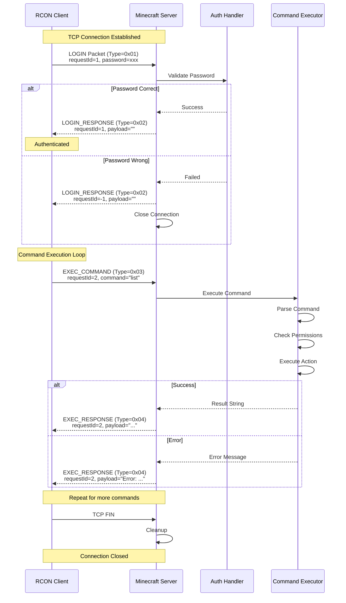
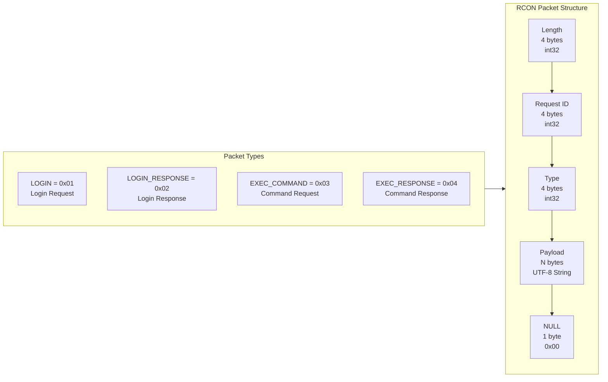
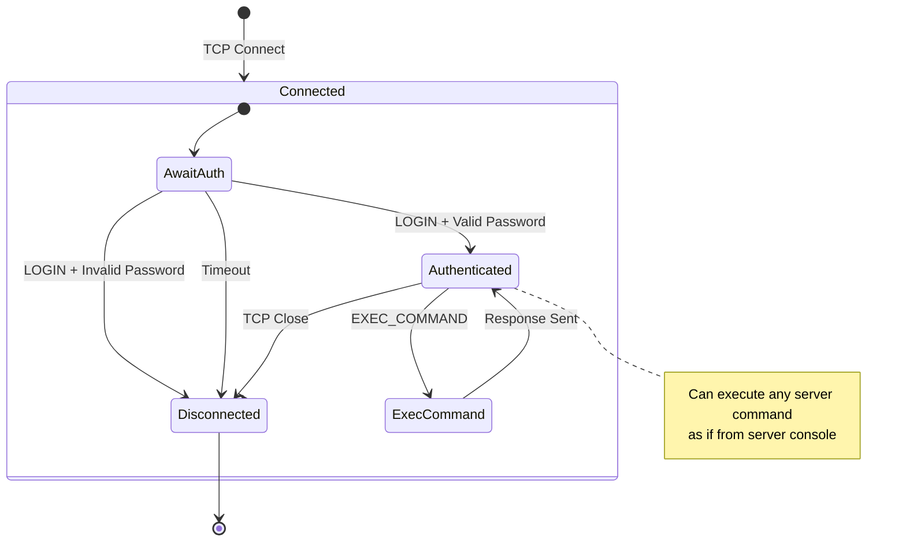

# Minecraft 1.21 RCON 远程控制系统深度分析

> RCON (Remote Console) 是 Minecraft 服务器提供的远程控制协议，允许管理员通过网络远程执行服务器命令和管理操作
> 版本信息: Minecraft 1.21, Vanilla Server

---

## 目录

1. [概述](#概述)
2. [RCON协议](#rcon协议)
3. [服务端配置](#服务端配置)
4. [RCON协议包结构](#rcon协议包结构)
5. [认证流程](#认证流程)
6. [命令执行](#命令执行)
7. [服务端实现](#服务端实现)
8. [客户端实现](#客户端实现)
9. [常用命令](#常用命令)
10. [安全考虑](#安全考虑)
11. [源码分析](#源码分析)
12. [Mermaid流程图](#mermaid流程图)

---

## 1. 概述

### 1.1 什么是 RCON

**RCON (Remote Console)** 是一种轻量级的远程控制协议，最初在 Quake 系列游戏中引入。Minecraft 服务器实现了该协议的变体，允许：

- 远程执行控制台命令
- 查询服务器状态信息
- 管理在线玩家
- 获取服务器日志输出

### 1.2 RCON 的使用场景

| 场景 | 说明 |
|------|------|
| 服务器管理 | 通过脚本自动化管理任务 |
| Web 控制台 | 集成到 Web 界面进行远程管理 |
| 监控集成 | 获取服务器状态用于监控报警 |
| 自动备份 | 定时触发备份命令 |
| 插件开发 | 第三方工具与服务器交互 |

### 1.3 RCON 与其他协议对比

```
┌─────────────────────────────────────────────────────────────────────┐
│                     Minecraft 服务器通信协议对比                        │
├─────────────────────────────────────────────────────────────────────┤
│                                                                     │
│  ┌─────────────┐  ┌─────────────┐  ┌─────────────┐                │
│  │    RCON     │  │    Query    │  │   WebSocket │                │
│  │  (远程命令)  │  │  (状态查询)  │  │  (实时通信)  │                │
│  └─────────────┘  └─────────────┘  └─────────────┘                │
│                                                                     │
│  协议: TCP         协议: UDP          协议: TCP                     │
│  端口: 25575      端口: 25566        端口: 需插件                   │
│  功能: 命令执行    功能: 状态查询     功能: 双向通信                  │
│                                                                     │
└─────────────────────────────────────────────────────────────────────┘
```

### 1.4 RCON 特点

**优点：**
- 协议简单，易于实现
- 支持命令执行和响应
- 可以获取多行命令输出
- TCP 连接稳定可靠

**缺点：**
- 认证方式简单（密码传输）
- 无加密（明文密码）
- 无细粒度权限控制
- 单向通信（客户端主动请求）

---

## 2. RCON协议

### 2.1 协议基础

Minecraft RCON 基于 **TCP 协议**，使用简单的请求-响应模式：

```
┌─────────────────────────────────────────────────────────────────────┐
│                        RCON 通信模型                                  │
├─────────────────────────────────────────────────────────────────────┤
│                                                                     │
│   客户端                                          服务端             │
│     │                                              │                │
│     │  ──────── TCP 连接建立 ───────────────────>  │                │
│     │                                              │                │
│     │  ──────── 认证请求 (LOGIN) ───────────────> │                │
│     │  <─────── 认证响应 (LOGIN_RESPONSE) ─────── │                │
│     │                                              │                │
│     │  ──────── 命令请求 (EXEC_COMMAND) ─────────> │                │
│     │  <─────── 命令响应 (EXEC_RESPONSE) ───────── │                │
│     │                                              │                │
│     │  ──────── ... 更多命令 ... ─────────────────> │                │
│     │                                              │                │
│     │  ──────── TCP 连接关闭 ────────────────────> │                │
│     │                                              │                │
└─────────────────────────────────────────────────────────────────────┘
```

### 2.2 数据包格式

每个 RCON 数据包具有以下结构：

```
┌─────────────────────────────────────────────────────────────────────┐
│                        RCON 数据包结构                                │
├─────────────────────────────────────────────────────────────────────┤
│                                                                     │
│  偏移量    大小      字段          说明                               │
│  ─────────────────────────────────────────────────────────────     │
│  0         4 字节    长度          后续字节数（不含自身）                │
│  4         4 字节    请求ID        客户端生成的唯一标识                 │
│  8         4 字节    类型          数据包类型（见下文）                 │
│  12        N 字节    负载          字符串数据（UTF-8）                 │
│  12+N      1 字节    字符串终止符   '\0' (0x00)                       │
│  ─────────────────────────────────────────────────────────────     │
│                                                                     │
│  ⚠️ 注意：字符串使用 UTF-8 编码，始终以 NULL 字符结尾                   │
│                                                                     │
└─────────────────────────────────────────────────────────────────────┘
```

### 2.3 数据包类型

| 类型值 | 名称 | 方向 | 说明 |
|--------|------|------|------|
| 0x00 | COMMAND | 双向 | 未知类型，通常不使用 |
| 0x01 | LOGIN | 客户端→服务端 | 认证请求（包含密码） |
| 0x02 | LOGIN_RESPONSE | 服务端→客户端 | 认证响应 |
| 0x03 | EXEC_COMMAND | 客户端→服务端 | 执行命令请求 |
| 0x04 | EXEC_RESPONSE | 服务端→客户端 | 命令执行响应 |
| 0x05 | AUTHED_EXEC_COMMAND | 客户端→服务端 | 认证后命令（可选） |

### 2.4 认证类型详解

**LOGIN (0x01) - 认证请求：**

```
负载格式: <password>
```

**LOGIN_RESPONSE (0x02) - 认证响应：**

成功时：
```
请求ID: <客户端发送的请求ID>
负载: 空字符串 ""
```

失败时：
```
请求ID: -1 (0xFFFFFFFF)
负载: 空字符串 ""
```

---

## 3. 服务端配置

### 3.1 server.properties 配置项

RCON 通过 `server.properties` 文件进行配置：

```properties
# 是否启用 RCON
enable-rcon=true

# RCON 监听端口（默认 25575）
rcon.port=25575

# RCON 访问密码
rcon.password=your_secure_password_here

# 是否广播 RCON 控制台输出到在线玩家
broadcast-rcon-to-ops=true
```

### 3.2 配置验证

```java
// 服务端启动时验证 RCON 配置
public class Rcon {
    
    public static void main(String[] args) {
        // 加载 server.properties
        Properties props = loadServerProperties();
        
        // 检查 RCON 配置
        boolean enableRcon = Boolean.parseBoolean(
            props.getProperty("enable-rcon", "false")
        );
        
        if (enableRcon) {
            String portStr = props.getProperty("rcon.port", "25575");
            String password = props.getProperty("rcon.password", "");
            
            // 验证端口
            int port;
            try {
                port = Integer.parseInt(portStr);
                if (port < 1 || port > 65535) {
                    System.err.println("Invalid RCON port: " + port);
                    return;
                }
            } catch (NumberFormatException e) {
                System.err.println("RCON port must be a number");
                return;
            }
            
            // 验证密码
            if (password.isEmpty()) {
                System.err.println("RCON password cannot be empty when RCON is enabled");
                return;
            }
            
            // 启动 RCON 服务器
            startRconServer(port, password);
        }
    }
}
```

### 3.3 防火墙配置

确保服务器防火墙允许 RCON 端口的入站连接：

```bash
# Linux (iptables)
iptables -A INPUT -p tcp --dport 25575 -j ACCEPT

# Linux (firewalld)
firewall-cmd --permanent --add-port=25575/tcp
firewall-cmd --reload

# Windows 防火墙
netsh advfirewall firewall add rule name="Minecraft RCON" ^
    dir=in action=allow protocol=tcp localport=25575
```

---

## 4. RCON协议包结构

### 4.1 数据包类定义

```java
/**
 * RCON 数据包结构
 */
public class RconPacket {
    
    // 字段
    private final int length;      // 后续字节数
    private final int requestId;   // 请求ID
    private final int type;        // 包类型
    private final String payload;  // 负载数据
    
    // 构造方法
    public RconPacket(int requestId, int type, String payload) {
        this.requestId = requestId;
        this.type = type;
        this.payload = payload;
        // 长度 = 请求ID(4) + 类型(4) + 字符串长度 + NULL终止符
        this.length = 4 + 4 + payload.getBytes(StandardCharsets.UTF_8).length + 1;
    }
    
    /**
     * 将数据包序列化为字节数组
     */
    public byte[] toBytes() {
        ByteArrayOutputStream baos = new ByteArrayOutputStream();
        DataOutputStream dos = new DataOutputStream(baos);
        
        try {
            dos.writeInt(this.length);
            dos.writeInt(this.requestId);
            dos.writeInt(this.type);
            dos.writeBytes(this.payload);
            dos.writeByte(0); // NULL 终止符
        } catch (IOException e) {
            throw new RuntimeException(e);
        }
        
        return baos.toByteArray();
    }
    
    /**
     * 从字节数组反序列化数据包
     */
    public static RconPacket fromBytes(byte[] data) throws IOException {
        ByteArrayInputStream bais = new ByteArrayInputStream(data);
        DataInputStream dis = new DataInputStream(bais);
        
        int length = dis.readInt();
        int requestId = dis.readInt();
        int type = dis.readInt();
        
        // 读取字符串直到 NULL 终止符
        ByteArrayOutputStream payloadBaos = new ByteArrayOutputStream();
        int b;
        while ((b = dis.read()) != -1 && b != 0) {
            payloadBaos.write(b);
        }
        String payload = new String(payloadBaos.toByteArray(), StandardCharsets.UTF_8);
        
        return new RconPacket(requestId, type, payload);
    }
}
```

### 4.2 包类型常量

```java
/**
 * RCON 数据包类型常量
 */
public class RconPacketType {
    
    /** 未知类型 */
    public static final int COMMAND = 0x00;
    
    /** 认证请求 */
    public static final int LOGIN = 0x01;
    
    /** 认证响应 */
    public static final int LOGIN_RESPONSE = 0x02;
    
    /** 执行命令请求 */
    public static final int EXEC_COMMAND = 0x03;
    
    /** 执行命令响应 */
    public static final int EXEC_RESPONSE = 0x04;
    
    /** 认证后命令执行 */
    public static final int AUTHED_EXEC_COMMAND = 0x05;
    
    /**
     * 获取类型名称
     */
    public static String getTypeName(int type) {
        switch (type) {
            case COMMAND: return "COMMAND";
            case LOGIN: return "LOGIN";
            case LOGIN_RESPONSE: return "LOGIN_RESPONSE";
            case EXEC_COMMAND: return "EXEC_COMMAND";
            case EXEC_RESPONSE: return "EXEC_RESPONSE";
            case AUTHED_EXEC_COMMAND: return "AUTHED_EXEC_COMMAND";
            default: return "UNKNOWN(0x" + Integer.toHexString(type) + ")";
        }
    }
}
```

---

## 5. 认证流程

### 5.1 认证序列图

```
┌─────────────────────────────────────────────────────────────────────┐
│                        RCON 认证流程                                  │
├─────────────────────────────────────────────────────────────────────┤
│                                                                     │
│  客户端                                              服务端           │
│    │                                                    │            │
│    │  1. 建立 TCP 连接                                  │            │
│    │ ───────────────────────────────────────────────>   │            │
│    │                                                    │            │
│    │  2. 发送 LOGIN 包 (类型=0x01)                       │            │
│    │      - requestId: 客户端生成                      │            │
│    │      - payload: <password>                        │            │
│    │ ───────────────────────────────────────────────>   │            │
│    │                                                    │            │
│    │                                     3. 验证密码     │            │
│    │                                                    │            │
│    │  4. 响应 LOGIN_RESPONSE (类型=0x02)                │            │
│    │      - requestId: 相同ID表示成功                   │            │
│    │      - requestId: -1 表示失败                     │            │
│    │ <───────────────────────────────────────────────  │            │
│    │                                                    │            │
│    │  5. 连接状态: 已认证                               │            │
│    │      或                                          │            │
│    │  6. 关闭连接 (认证失败)                            │            │
│    │ ───────────────────────────────────────────────>   │            │
│    │                                                    │            │
└─────────────────────────────────────────────────────────────────────┘
```

### 5.2 认证实现

```java
/**
 * RCON 服务端认证处理
 */
public class RconAuthHandler {
    
    private final String password;
    private volatile boolean authenticated = false;
    
    public RconAuthHandler(String password) {
        this.password = password;
    }
    
    /**
     * 处理认证请求
     */
    public RconPacket handleLogin(RconPacket request) {
        int requestId = request.getRequestId();
        String providedPassword = request.getPayload();
        
        // 验证密码
        if (password.equals(providedPassword)) {
            authenticated = true;
            System.out.println("RCON: Successful authentication");
            // 成功响应：返回相同的 requestId
            return new RconPacket(requestId, RconPacketType.LOGIN_RESPONSE, "");
        } else {
            System.out.println("RCON: Failed authentication attempt");
            // 失败响应：返回 -1 作为 requestId
            return new RconPacket(-1, RconPacketType.LOGIN_RESPONSE, "");
        }
    }
    
    /**
     * 检查是否已认证
     */
    public boolean isAuthenticated() {
        return authenticated;
    }
    
    /**
     * 重置认证状态
     */
    public void reset() {
        authenticated = false;
    }
}
```

### 5.3 认证状态机

```
┌─────────────────────────────────────────────────────────────────────┐
│                      RCON 连接状态机                                  │
├─────────────────────────────────────────────────────────────────────┤
│                                                                     │
│      ┌──────────┐                                                  │
│      │ CONNECTED│                                                  │
│      └────┬─────┘                                                  │
│           │                                                        │
│           │ 收到 LOGIN 包                                           │
│           ▼                                                        │
│      ┌──────────┐                                                  │
│      │   AUTH   │──────── 密码正确 ──────>  ┌──────────┐           │
│      │   ING    │                          │ AUTHED   │           │
│      └────┬─────┘                          └────┬─────┘           │
│           │                                       │                │
│           │ 密码错误                               │ 执行命令        │
│           ▼                                       ▼                │
│      ┌──────────┐                          ┌──────────┐           │
│      │ DISCONNECT│ <────────────────────── │ COMMAND  │           │
│      │   ED     │     TCP 连接关闭          │  MODE    │           │
│      └──────────┘                          └──────────┘           │
│                                                                     │
└─────────────────────────────────────────────────────────────────────┘
```

---

## 6. 命令执行

### 6.1 命令执行流程

```java
/**
 * RCON 命令执行器
 */
public class RconCommandExecutor {
    
    private final MinecraftServer server;
    
    public RconCommandExecutor(MinecraftServer server) {
        this.server = server;
    }
    
    /**
     * 执行命令并返回结果
     */
    public String executeCommand(String command) {
        // 创建命令源（用于权限检查）
        CommandSource source = server.createCommandSourceStack();
        
        // 准备命令管理器
        Commands commandManager = server.getCommands();
        
        // 创建字符串 reader
        StringReader reader = new StringReader(command);
        
        try {
            // 执行命令
            int result = commandManager.execute(
                source,           // 命令源
                command           // 完整命令字符串
            );
            
            // 返回执行结果
            return String.valueOf(result);
        } catch (CommandSyntaxException e) {
            // 命令语法错误
            return "Error: " + e.getMessage();
        }
    }
    
    /**
     * 处理命令包
     */
    public RconPacket handleCommand(RconPacket request) {
        int requestId = request.getRequestId();
        String command = request.getPayload();
        
        System.out.println("[RCON] Executing command: " + command);
        
        String result = executeCommand(command);
        
        // 如果结果为空，返回成功标记
        if (result.isEmpty()) {
            result = "OK";
        }
        
        // 分块返回（如果结果过长）
        if (result.length() > 1446) {
            // MTU 限制，分块返回
            result = result.substring(0, 1446);
        }
        
        return new RconPacket(requestId, RconPacketType.EXEC_RESPONSE, result);
    }
}
```

### 6.2 多行输出处理

RCON 响应可能被截断，需要客户端处理多响应：

```java
/**
 * 多响应收集器
 */
public class MultiResponseCollector {
    
    private final List<String> responses = new ArrayList<>();
    private int expectedRequestId = -1;
    
    /**
     * 添加响应
     */
    public void addResponse(RconPacket packet) {
        int packetRequestId = packet.getRequestId();
        
        // 检查是否是新请求的开始
        if (packetRequestId != expectedRequestId) {
            // 新请求，清空之前的响应
            responses.clear();
            expectedRequestId = packetRequestId;
        }
        
        responses.add(packet.getPayload());
    }
    
    /**
     * 检查是否还有更多响应
     */
    public boolean hasMoreResponses() {
        // 最后一块通常为空字符串
        if (responses.isEmpty()) {
            return false;
        }
        return !responses.get(responses.size() - 1).isEmpty();
    }
    
    /**
     * 获取完整响应
     */
    public String getCompleteResponse() {
        return String.join("\n", responses);
    }
}
```

---

## 7. 服务端实现

### 7.1 RCON 服务器类

```java
/**
 * RCON 服务器主类
 * 负责监听连接、处理认证、执行命令
 */
public class RconServer {
    
    private final int port;
    private final String password;
    private final MinecraftServer minecraftServer;
    
    private ServerSocket serverSocket;
    private volatile boolean running = false;
    private final List<RconConnection> connections = new CopyOnWriteArrayList<>();
    
    /**
     * 构造 RCON 服务器
     */
    public RconServer(int port, String password, MinecraftServer server) {
        this.port = port;
        this.password = password;
        this.minecraftServer = server;
    }
    
    /**
     * 启动 RCON 服务器
     */
    public void start() throws IOException {
        serverSocket = new ServerSocket(port);
        running = true;
        
        System.out.println("RCON server started on port " + port);
        
        // 接受连接的主循环
        while (running) {
            try {
                Socket clientSocket = serverSocket.accept();
                handleConnection(clientSocket);
            } catch (IOException e) {
                if (running) {
                    System.err.println("RCON accept error: " + e.getMessage());
                }
            }
        }
    }
    
    /**
     * 处理单个客户端连接
     */
    private void handleConnection(Socket clientSocket) {
        RconConnection connection = new RconConnection(
            clientSocket, 
            password, 
            minecraftServer
        );
        connections.add(connection);
        
        // 在新线程中处理
        Thread thread = new Thread(connection, "RCON Client Handler");
        thread.setDaemon(true);
        thread.start();
    }
    
    /**
     * 停止 RCON 服务器
     */
    public void stop() {
        running = false;
        
        // 关闭所有连接
        for (RconConnection conn : connections) {
            conn.close();
        }
        connections.clear();
        
        // 关闭服务器 socket
        if (serverSocket != null && !serverSocket.isClosed()) {
            try {
                serverSocket.close();
            } catch (IOException e) {
                System.err.println("Error closing RCON server: " + e.getMessage());
            }
        }
        
        System.out.println("RCON server stopped");
    }
}
```

### 7.2 RCON 连接处理类

```java
/**
 * RCON 客户端连接处理
 */
public class RconConnection implements Runnable {
    
    private final Socket socket;
    private final RconAuthHandler authHandler;
    private final RconCommandExecutor commandExecutor;
    
    private DataInputStream input;
    private DataOutputStream output;
    private volatile boolean running = false;
    
    public RconConnection(Socket socket, String password, MinecraftServer server) {
        this.socket = socket;
        this.authHandler = new RconAuthHandler(password);
        this.commandExecutor = new RconCommandExecutor(server);
    }
    
    @Override
    public void run() {
        try {
            initialize();
            processLoop();
        } catch (IOException e) {
            if (running) {
                System.err.println("RCON connection error: " + e.getMessage());
            }
        } finally {
            cleanup();
        }
    }
    
    /**
     * 初始化连接
     */
    private void initialize() throws IOException {
        socket.setSoTimeout(0); // 无超时
        input = new DataInputStream(socket.getInputStream());
        output = new DataOutputStream(socket.getOutputStream());
        running = true;
        
        System.out.println("RCON: New connection from " + socket.getInetAddress());
    }
    
    /**
     * 主处理循环
     */
    private void processLoop() throws IOException {
        while (running) {
            // 读取数据包
            RconPacket request = readPacket();
            if (request == null) {
                break; // 连接关闭
            }
            
            // 处理请求
            RconPacket response = processRequest(request);
            
            // 发送响应
            if (response != null) {
                writePacket(response);
            }
        }
    }
    
    /**
     * 处理请求
     */
    private RconPacket processRequest(RconPacket request) {
        int type = request.getType();
        
        switch (type) {
            case RconPacketType.LOGIN:
                RconPacket loginResponse = authHandler.handleLogin(request);
                if (loginResponse.getRequestId() == -1) {
                    // 认证失败，关闭连接
                    running = false;
                }
                return loginResponse;
                
            case RconPacketType.EXEC_COMMAND:
                if (!authHandler.isAuthenticated()) {
                    // 未认证，拒绝命令
                    return new RconPacket(
                        request.getRequestId(),
                        RconPacketType.EXEC_RESPONSE,
                        "Not authenticated"
                    );
                }
                return commandExecutor.handleCommand(request);
                
            default:
                System.out.println("RCON: Unknown packet type: " + type);
                return null;
        }
    }
    
    /**
     * 读取数据包
     */
    private RconPacket readPacket() throws IOException {
        // 先读取长度
        int length = input.readInt();
        if (length < 0 || length > 32768) {
            return null; // 非法长度
        }
        
        // 读取剩余数据
        byte[] data = new byte[length];
        input.readFully(data);
        
        return RconPacket.fromBytesWithLength(data);
    }
    
    /**
     * 写入数据包
     */
    private void writePacket(RconPacket packet) throws IOException {
        byte[] data = packet.toBytes();
        synchronized (output) {
            output.writeInt(data.length);
            output.write(data);
            output.flush();
        }
    }
    
    /**
     * 清理资源
     */
    private void cleanup() {
        running = false;
        authHandler.reset();
        
        try {
            socket.close();
        } catch (IOException e) {
            // 忽略
        }
        
        System.out.println("RCON: Connection closed");
    }
    
    /**
     * 关闭连接
     */
    public void close() {
        running = false;
        cleanup();
    }
}
```

---

## 8. 客户端实现

### 8.1 RCON 客户端类

```java
import java.io.*;
import java.net.*;

/**
 * RCON 客户端实现
 */
public class RconClient {
    
    private final String host;
    private final int port;
    
    private Socket socket;
    private DataInputStream input;
    private DataOutputStream output;
    
    private int nextRequestId = 1;
    private boolean authenticated = false;
    
    public RconClient(String host, int port) {
        this.host = host;
        this.port = port;
    }
    
    /**
     * 连接到 RCON 服务器
     */
    public void connect() throws IOException {
        socket = new Socket(host, port);
        socket.setSoTimeout(5000); // 5秒超时
        
        input = new DataInputStream(socket.getInputStream());
        output = new DataOutputStream(socket.getOutputStream());
        
        System.out.println("Connected to RCON server at " + host + ":" + port);
    }
    
    /**
     * 认证
     */
    public boolean login(String password) throws IOException {
        if (authenticated) {
            return true;
        }
        
        int requestId = nextRequestId++;
        
        // 发送认证请求
        RconPacket request = new RconPacket(
            requestId, 
            RconPacketType.LOGIN, 
            password
        );
        writePacket(request);
        
        // 读取响应
        RconPacket response = readPacket();
        
        if (response == null) {
            throw new IOException("No response from server");
        }
        
        // 检查认证是否成功
        if (response.getRequestId() == requestId) {
            authenticated = true;
            System.out.println("Authentication successful");
            return true;
        } else {
            System.out.println("Authentication failed");
            return false;
        }
    }
    
    /**
     * 执行命令
     */
    public String executeCommand(String command) throws IOException {
        if (!authenticated) {
            throw new IllegalStateException("Not authenticated");
        }
        
        int requestId = nextRequestId++;
        
        // 发送命令请求
        RconPacket request = new RconPacket(
            requestId,
            RconPacketType.EXEC_COMMAND,
            command
        );
        writePacket(request);
        
        // 收集所有响应
        StringBuilder result = new StringBuilder();
        
        while (true) {
            RconPacket response = readPacket();
            if (response == null) {
                break;
            }
            
            // 检查是否为同一请求的响应
            if (response.getRequestId() != requestId) {
                continue;
            }
            
            String payload = response.getPayload();
            if (!payload.isEmpty()) {
                if (result.length() > 0) {
                    result.append("\n");
                }
                result.append(payload);
            }
            
            // 检查是否还有更多响应
            if (response.getPayload().isEmpty()) {
                break;
            }
        }
        
        return result.toString();
    }
    
    /**
     * 关闭连接
     */
    public void close() throws IOException {
        authenticated = false;
        
        if (socket != null && !socket.isClosed()) {
            socket.close();
        }
        
        System.out.println("Disconnected from RCON server");
    }
    
    private void writePacket(RconPacket packet) throws IOException {
        byte[] data = packet.toBytes();
        output.writeInt(data.length);
        output.write(data);
        output.flush();
    }
    
    private RconPacket readPacket() throws IOException {
        int length = input.readInt();
        if (length < 0 || length > 32768) {
            return null;
        }
        
        byte[] data = new byte[length];
        input.readFully(data);
        
        return RconPacket.fromBytesWithLength(data);
    }
}
```

### 8.2 使用示例

```java
/**
 * RCON 客户端使用示例
 */
public class RconClientExample {
    
    public static void main(String[] args) {
        String host = "localhost";
        int port = 25575;
        String password = "my_secure_password";
        
        try (RconClient client = new RconClient(host, port)) {
            // 连接
            client.connect();
            
            // 认证
            if (client.login(password)) {
                // 执行命令
                String listResult = client.executeCommand("list");
                System.out.println("Online players:\n" + listResult);
                
                // 执行备份命令
                String backupResult = client.executeCommand("save-all");
                System.out.println("Backup result: " + backupResult);
                
                // 获取服务器信息
                String opsResult = client.executeCommand("list @p");
                System.out.println("Ops: " + opsResult);
            }
        } catch (IOException e) {
            System.err.println("RCON error: " + e.getMessage());
        }
    }
}
```

---

## 9. 常用命令

### 9.1 服务器管理命令

| 命令 | 说明 | 示例 |
|------|------|------|
| `list` | 列出在线玩家 | `list` |
| `help [page]` | 显示帮助 | `help 1` |
| `stop` | 停止服务器 | `stop` |
| `reload` | 重载配置文件 | `reload` |
| `restart` | 重启服务器 | `restart` |

### 9.2 玩家管理命令

| 命令 | 说明 | 示例 |
|------|------|------|
| `kick <player> [reason]` | 踢出玩家 | `kick Notch` |
| `ban <player> [reason]` | 封禁玩家 | `ban Grief 违规` |
| `pardon <player>` | 解封玩家 | `pardon Notch` |
| `whitelist <add|remove|list>` | 白名单管理 | `whitelist add Player` |
| `op <player>` | 给予管理员权限 | `op Notch` |
| `deop <player>` | 移除管理员权限 | `deop Notch` |

### 9.3 世界管理命令

| 命令 | 说明 | 示例 |
|------|------|------|
| `save-all` | 保存所有世界 | `save-all` |
| `save-off` | 禁用自动保存 | `save-off` |
| `save-on` | 启用自动保存 | `save-on` |
| `toggledownfall` | 切换天气 | `toggledownfall` |
| `weather <clear|rain|thunder>` | 设置天气 | `weather rain 600` |
| `time <set|add> <value>` | 设置时间 | `time set 1000` |
| `difficulty <level>` | 设置难度 | `difficulty hard` |
| `defaultgamemode <mode>` | 设置默认游戏模式 | `defaultgamemode survival` |

### 9.4 性能监控命令

| 命令 | 说明 | 示例 |
|------|------|------|
| `list` | 玩家列表 | `list` |
| `tp <player>` | 查看玩家位置 | `tp Notch` |
| `scoreboard objectives list` | 查看计分板 | `scoreboard objectives list` |
| `worldborder set <size>` | 设置世界边界 | `worldborder set 10000` |

---

## 10. 安全考虑

### 10.1 RCON 安全风险

```
┌─────────────────────────────────────────────────────────────────────┐
│                        RCON 安全风险                                  │
├─────────────────────────────────────────────────────────────────────┤
│                                                                     │
│  ⚠️  明文传输                                                       │
│  └── RCON 密码以明文方式在网络中传输                                  │
│      建议：仅在可信网络或 VPN 中使用                                   │
│                                                                     │
│  ⚠️  简单认证                                                       │
│  └── 仅使用密码验证，无加密或令牌机制                                  │
│      建议：使用强密码，定期更换                                       │
│                                                                     │
│  ⚠️  无权限隔离                                                     │
│  └── RCON 命令执行者拥有完全控制权                                    │
│      建议：限制 RCON 访问来源                                         │
│                                                                     │
│  ⚠️  无审计日志                                                     │
│  └── 默认不记录命令执行历史                                          │
│      建议：配合日志系统监控 RCON 使用                                  │
│                                                                     │
└─────────────────────────────────────────────────────────────────────┘
```

### 10.2 安全最佳实践

#### 1. 网络隔离

```bash
# 使用防火墙限制 RCON 端口访问
# 仅允许特定 IP 访问

# iptables 示例
iptables -A INPUT -p tcp -s 192.168.1.0/24 --dport 25575 -j ACCEPT
iptables -A INPUT -p tcp --dport 25575 -j DROP

# 或者使用 VPN
# 将 RCON 端口绑定到 VPN 接口
rcon.port=25575
bind-address=10.8.0.1  # VPN 接口 IP
```

#### 2. 强密码策略

```properties
# server.properties
# 使用强随机密码（建议 16+ 字符）
rcon.password=xK9#mP2$vL5@nQ8!wE3
```

#### 3. 监控与审计

```java
/**
 * RCON 审计日志
 */
public class RconAuditLogger {
    
    private static final Logger logger = LoggerFactory.getLogger("RCON-Audit");
    
    public static void logCommand(String remoteAddr, String command, boolean success) {
        String action = success ? "EXECUTED" : "FAILED";
        logger.info("[{}] RCON {}: {}", remoteAddr, action, command);
    }
    
    public static void logAuth(String remoteAddr, boolean success) {
        String action = success ? "SUCCESS" : "FAILED";
        logger.info("[{}] RCON AUTH {}", remoteAddr, action);
    }
}
```

#### 4. 定期安全检查

```bash
# 检查 RCON 连接日志
grep -i "RCON" /path/to/server.log

# 检查失败的认证尝试
grep "RCON AUTH FAILED" /path/to/server.log

# 监控异常的连接来源
awk '/RCON.*connection/{print $NF}' server.log | sort | uniq -c
```

### 10.3 生产环境建议

| 建议 | 说明 |
|------|------|
| 使用 VPN | 将 RCON 流量封装在 VPN 隧道中 |
| 使用 WebSocket 桥接 | 通过 HTTPS WebSocket 访问 |
| 限制 IP 白名单 | 防火墙规则限制访问来源 |
| 定期更换密码 | 降低密码泄露风险 |
| 监控异常活动 | 检测暴力破解尝试 |

---

## 11. 源码分析

### 11.1 RCON 核心类结构

```
net.minecraft.server.dedicated.DedicatedServer
    │
    ├── createRconThread()    // 创建 RCON 线程
    ├── rcon端口配置读取
    └── rcon密码配置读取
            │
            ▼
    net.minecraft.server.dedicated.DedicatedServer.Rcon
            │
            ├── ReaderThread      // RCON 读取线程
            │       │
            │       └── 接收数据包
            │       └── 验证认证
            │       └── 执行命令
            │       └── 发送响应
            │
            └── 状态管理
                    │
                    ├── 等待认证
                    ├── 已认证
                    └── 已断开
```

### 11.2 RCON 配置加载

```java
// 在 DedicatedServer 初始化时加载
public class DedicatedServer {
    
    // RCON 配置字段
    private final int rconPort;
    private final String rconPassword;
    private final boolean rconEnabled;
    
    public DedicatedServer(...) {
        // 加载 server.properties
        Properties props = this.loadProperties();
        
        // 读取 RCON 配置
        this.rconEnabled = Boolean.parseBoolean(
            props.getProperty("enable-rcon", "false")
        );
        
        if (this.rconEnabled) {
            this.rconPort = Integer.parseInt(
                props.getProperty("rcon.port", "25575")
            );
            this.rconPassword = props.getProperty("rcon.password", "");
            
            if (this.rconPassword.isEmpty()) {
                throw new IllegalStateException(
                    "RCON password cannot be empty when RCON is enabled"
                );
            }
        }
    }
}
```

### 11.3 RCON 线程启动

```java
// 在服务器启动过程中调用
public void initServer() {
    // ... 其他初始化 ...
    
    if (this.rconEnabled) {
        this.rconThread = this.createRconThread();
        this.rconThread.start();
        LOGGER.info("RCON running on port " + this.rconPort);
    }
}

// 创建 RCON 线程
private Thread createRconThread() {
    return new Thread(() -> {
        try {
            ServerSocket serverSocket = new ServerSocket(this.rconPort);
            
            while (!Thread.interrupted()) {
                Socket clientSocket = serverSocket.accept();
                handleRconConnection(clientSocket);
            }
        } catch (IOException e) {
            // 处理异常
        }
    }, "RCON Listener");
}
```

### 11.4 命令执行集成

```java
// RCON 命令执行通过 CommandManager
public class RconCommandHandler {
    
    private final DedicatedServer server;
    private final Commands commandManager;
    
    public RconCommandHandler(DedicatedServer server) {
        this.server = server;
        this.commandManager = server.getCommands();
    }
    
    /**
     * 执行 RCON 命令
     */
    public String execute(String command) {
        ServerCommandSource source = new ServerCommandSource(
            this.server,
            Commands.ROOT
        );
        
        try {
            StringReader reader = new StringReader(command);
            
            // 执行命令
            int result = commandManager.executeWithExceptions(
                source,
                command
            );
            
            return String.valueOf(result);
        } catch (CommandSyntaxException e) {
            return "Error: " + e.getMessage();
        }
    }
}
```

---

## 12. Mermaid流程图

### 12.1 RCON 完整通信流程



### 12.2 RCON 数据包结构图



### 12.3 RCON 状态机



---

## 附录

### A. 参考配置

```properties
# server.properties
enable-rcon=true
rcon.port=25575
rcon.password=change_me_now
broadcast-rcon-to-ops=true
```

### B. 常见问题

| 问题 | 解决方案 |
|------|----------|
| 连接被拒绝 | 检查防火墙、端口配置、enable-rcon=true |
| 认证失败 | 确认密码正确，检查是否有空格 |
| 命令无响应 | 检查服务器日志，确认命令语法正确 |
| 连接超时 | 检查网络连通性，增大客户端超时时间 |

### C. 扩展阅读

- [Minecraft Wiki - RCON](https://minecraft.wiki/w/RCON)
- [Source Engine RCON Protocol](https://developer.valvesoftware.com/wiki/Source_RCON_Protocol)
- [Minecraft Server Commands](https://minecraft.wiki/w/Commands)

---

> **文档信息**
> - 版本: Minecraft 1.21
> - 最后更新: 2026-03-25
> - 协议: RCON (Remote Console Protocol)
