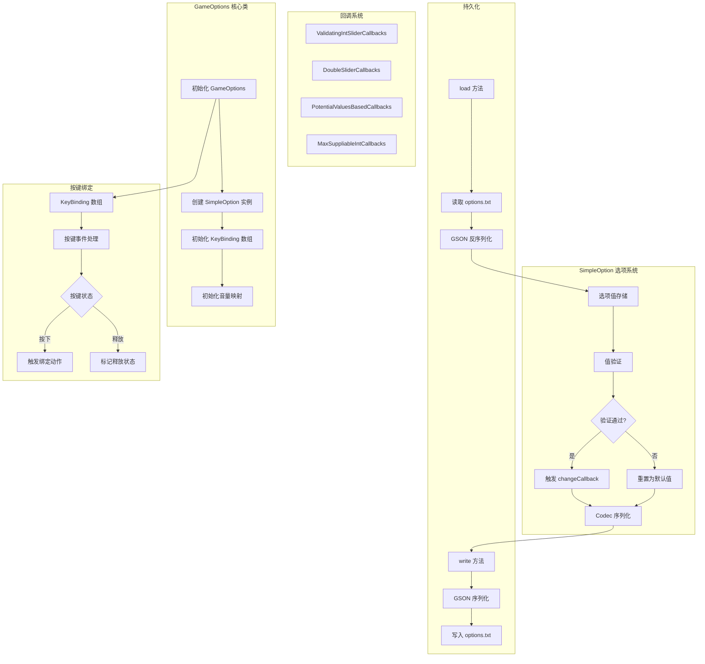

# 游戏设置系统 (Game Options System)

## 概述

Minecraft 1.21 的客户端设置系统（Game Options System）是管理游戏中所有可配置选项的核心模块。该系统负责存储、加载和持久化玩家的各种偏好设置，包括图形质量、音频音量、按键绑定等。系统采用了现代化的设计模式，通过 `SimpleOption` 泛型类和回调机制提供了高度的可扩展性和类型安全性。

设置文件默认保存在 `options.txt` 文件中，采用 GSON 格式进行序列化存储。系统支持实时预览设置变更，并在值发生变化时通过回调机制通知相关系统进行更新。

## 核心类

### GameOptions

`GameOptions`（包：`net.minecraft.client.option`，混淆名：`class_315`，官方名：`gfo`）是整个设置系统的核心类，负责管理所有客户端选项的实例化和持久化。

```java
@Environment(CLIENT)
public class GameOptions extends Object {
    private final MinecraftClient client;
    private final File optionsFile;
    
    // 存储所有 SimpleOption 实例
    private final SimpleOption<Integer> viewDistance;
    private final SimpleOption<GraphicsMode> preset;
    private final SimpleOption<Boolean> fancyGraphics;
    private final SimpleOption<Boolean> ao;
    // ... 数百个其他选项
}
```

#### 关键字段分类

| 类别 | 字段示例 | 类型 |
|------|----------|------|
| **图形设置** | `viewDistance`, `preset`, `fancyGraphics`, `ao` | `SimpleOption<T>` |
| **音频设置** | `soundVolumeLevels` | `Map<SoundCategory, SimpleOption<Double>>` |
| **控制设置** | `allKeys[]`, `attackKey`, `useKey` | `KeyBinding[]` |
| **游戏性设置** | `autoJump`, `autoJumpEnabled` | `SimpleOption<Boolean>` |
| **辅助功能** | `narrator`, `showSubtitles`, `highContrast` | `SimpleOption<T>` |

#### 构造与初始化

```java
public GameOptions(MinecraftClient client, File optionsFile) {
    this.client = client;
    this.optionsFile = optionsFile;
    
    // 初始化所有选项，使用工厂方法
    this.viewDistance = SimpleOption.fromStringId(
        "option.viewDistance",
        new SimpleOption.ValidatingIntSliderCallbacks(2, 32),
        12,
        (option) -> this.refreshWorldRenderer(client.worldRenderer),
        GameOptions::getGenericValueText
    );
    
    // 初始化按键绑定
    this.allKeys = new KeyBinding[] {
        this.attackKey = new KeyBinding("key.attack", InputUtil.Type.MOUSE, 0, "key.categories.movement"),
        this.useKey = new KeyBinding("key.use", InputUtil.Type.MOUSE, 1, "key.categories.movement"),
        // ... 更多按键
    };
}
```

### SimpleOption

`SimpleOption`（包：`net.minecraft.client.option`，混淆名：`class_7172`，官方名：`gfn`）是表示单个选项的泛型类，采用了回调模式来自定义选项行为而非继承。

```java
@Environment(CLIENT)
public final class SimpleOption<T> extends Object {
    private final T defaultValue;
    private final SimpleOption.Callbacks<T> callbacks;
    private final Consumer<T> changeCallback;
    private final Codec<T> codec;
    private final Text text;
    private final Function<T, Text> textGetter;
    private final SimpleOption.TooltipFactory<T> tooltipFactory;
    
    public T getValue() { /* ... */ }
    public void setValue(T value) { /* ... */ }
}
```

#### 选项值验证

选项值会自动进行验证，如果验证失败则会重置为默认值：

```java
public void setValue(T value) {
    T validated = this.callbacks.validate(value);
    if (validated == null) {
        LOGGER.warn("Invalid option value, resetting to default: " + this.text);
        validated = this.defaultValue;
    }
    if (!Objects.equals(this.getValue(), validated)) {
        this.value = validated;
        this.changeCallback.accept(validated);
    }
}
```

### 选项回调系统

`SimpleOption` 通过 `Callbacks` 接口体系实现了高度可定制的选项行为：

```java
// 布尔选项回调
public static final SimpleOption.PotentialValuesBasedCallbacks<Boolean> BOOLEAN = 
    new SimpleOption.PotentialValuesBasedCallbacks<>(List.of(false, true));

// 整数滑块回调（带范围验证）
public static final record ValidatingIntSliderCallbacks(int min, int max) 
    implements SimpleOption.IntSliderCallbacks { }

// 双精度滑块回调（0.0-1.0）
public static final record DoubleSliderCallbacks() 
    implements SimpleOption.SliderCallbacks<Double> { }

// 最大值可变的整数循环回调（用于 GUI 缩放）
public static final record MaxSuppliableIntCallbacks(IntSupplier maxSupplier) 
    implements SimpleOption.CyclingCallbacks<Integer> { }
```

### KeyBinding

`KeyBinding`（包：`net.minecraft.client.option`，混淆名：`class_350`，官方名：`hk`）是管理按键绑定的类，实现了 `Comparable` 接口。

```java
@Environment(CLIENT)
public class KeyBinding implements Comparable<KeyBinding> {
    private static final Map<String, Integer> MAP = Util.make(
        new HashMap<>(), map -> {
            map.put("key.keyboard.", 0);
            map.put("key.mouse.", 1);
            map.put("key.joystick.button.", 2);
            map.put("key.joystick.pov.", 3);
        }
    );
    
    private final String category;
    private final String id;
    private InputUtil.MutableTooltipKey boundKey;
    private final InputUtil.MutableTooltipKey defaultKey;
    private boolean pressed;
    private int timesPressed;
    
    // 还有一个子类 StickyKeyBinding 用于"粘性"按键
}
```

## 图形设置

### RenderDistance (视野距离)

视野距离控制玩家周围可见的区块数量，直接影响游戏性能和画面细节。

```java
// 初始化视野距离选项
this.viewDistance = SimpleOption.fromStringId(
    "option.viewDistance",
    new SimpleOption.ValidatingIntSliderCallbacks(2, 32),  // 最小2，最大32
    12,  // 默认值
    (option) -> this.refreshWorldRenderer(client.worldRenderer),  // 变更回调
    GameOptions::getGenericValueText
);
```

视野距离还提供服务端同步版本：

```java
private int serverViewDistance;  // 服务端限制的最大距离
```

### FancyGraphics (图形质量)

图形质量选项使用枚举类型 `GraphicsMode`，包含三个级别：

```java
public enum GraphicsMode {
    FAST("options.graphics.fast"),
    FANCY("options.graphics.fancy"),
    FABULOUS("options.graphics.fabulous");
    
    private final String translationKey;
}
```

### 光照设置

#### Ambient Occlusion (环境光遮蔽)

```java
this.ao = SimpleOption.ofBoolean(
    "option.ambientOcclusion",
    SimpleOption.constantTooltip(
        Text.translatable("options.ambientOcclusion.effects")
    ),
    false,  // 默认关闭
    (option) -> this.refreshWorldRenderer(client.worldRenderer)
);
```

#### Gamma (伽马值/亮度)

```java
this.gamma = SimpleOption.ofDouble(
    "option.gamma",
    SimpleOption.emptyTooltip(),
    0.5,  // 默认 50%
    0.0,  // 最小 0%
    1.0,  // 最大 100%
    (option) -> {}  // 无需刷新渲染器
);
```

### 粒子设置

粒子系统使用 `ParticlesMode` 枚举控制显示级别：

```java
public enum ParticlesMode {
    ALL("options.particles.all"),
    MINIMAL("options.particles.minimal"),
    DECREASED("options.particles.decreased"),
    MINIMAL_ALT("options.particles.minimal");  // 仅重要粒子
    
    private final String translationKey;
}

this.particles = SimpleOption.fromStringId(
    "option.particles",
    new SimpleOption.PotentialValuesBasedCallbacks<>(
        List.of(ParticlesMode.values())
    ),
    ParticlesMode.ALL,
    (option) -> {}  // 无需刷新
);
```

### 雾与天气

```java
// 云渲染模式
this.cloudRenderMode = SimpleOption.fromStringId(
    "option.renderClouds",
    new SimpleOption.PotentialValuesBasedCallbacks<>(
        List.of(CloudRenderMode.values())
    ),
    CloudRenderMode.FANCY,
    (option) -> {}  // 云渲染变更无需刷新
);

// 天气半径（影响远处雨的渲染）
this.weatherRadius = SimpleOption.ofDouble(
    "option.weatherRadius",
    SimpleOption.constantTooltip(
        Text.translatable("options.weatherRadius.effects")
    ),
    1.0,
    0.0,
    1.0,
    (option) -> this.refreshWorldRenderer(client.worldRenderer)
);

// 生物群系混合半径
this.biomeBlendRadius = SimpleOption.fromStringId(
    "option.biomeBlendRadius",
    new SimpleOption.ValidatingIntSliderCallbacks(0, 7),
    2,  // 默认 2x2
    (option) -> this.refreshWorldRenderer(client.worldRenderer),
    (prefix, value) -> Text.translatable("options.biomeBlendRadius." + value)
);
```

## 音频设置

### 音量控制

每个音频类别都有独立的音量控制选项：

```java
private final Map<SoundCategory, SimpleOption<Double>> soundVolumeLevels;

// 创建音量选项的工厂方法
private SimpleOption<Double> createSoundVolumeOption(String key, SoundCategory category) {
    return SimpleOption.ofDouble(
        key,
        SimpleOption.emptyTooltip(),
        1.0,  // 默认 100%
        0.0,
        1.0,
        (option) -> {}  // 音量变更立即生效
    );
}
```

### 音频类别

`SoundCategory` 枚举定义了游戏中的各种音频类别：

```java
public enum SoundCategory {
    MASTER("category.master"),
    MUSIC("category.music"),
    WEATHER("category.weather"),
    HOSTILE("category.hostile"),
    NEUTRAL("category.neutral"),
    PLAYER("category.player"),
    AMBIENT("category.ambient"),
    VOICE("category.voice");
}
```

### 方向音频

```java
this.directionalAudio = SimpleOption.ofBoolean(
    "option.directionalAudio",
    SimpleOption.constantTooltip(
        Text.translatable("options.directionalAudio.tooltip")
    ),
    false,  // 默认关闭
    (option) -> {}  // 无需特殊处理
);
```

### 音乐与提示音

```java
// 音乐播放频率
this.musicFrequency = SimpleOption.fromStringId(
    "option.music",
    new SimpleOption.PotentialValuesBasedCallbacks<>(
        List.of(MusicTracker.MusicFrequency.values())
    ),
    MusicTracker.MusicFrequency.JUST_MUSIC,
    (option) -> {}
);

// 音乐提示模式
this.musicToast = SimpleOption.fromStringId(
    "option.musicToast",
    new SimpleOption.PotentialValuesBasedCallbacks<>(
        List.of(MusicToastMode.values())
    ),
    MusicToastMode.ENABLED,
    (option) -> {}
);
```

## 控制设置

### 按键绑定管理

游戏维护了一个按键绑定数组，所有按键都实现了统一的接口：

```java
// 所有按键绑定的集合
final KeyBinding[] allKeys;

// 基础移动按键
final KeyBinding forwardKey;
final KeyBinding backwardKey;
final KeyBinding leftKey;
final KeyBinding rightKey;
final KeyBinding jumpKey;
final KeyBinding sneakKey;
final KeyBinding sprintKey;

// 物品交互按键
final KeyBinding dropKey;
final KeyBinding inventoryKey;
final KeyBinding useKey;
final KeyBinding attackKey;
final KeyBinding pickItemKey;
final KeyBinding swapHandsKey;

// UI 按键
final KeyBinding chatKey;
final KeyBinding commandKey;
final KeyBinding playerListKey;
final KeyBinding pauseKey;

// 热键栏按键
final KeyBinding[] hotbarKeys;

// 开发者/调试按键
final KeyBinding[] debugKeys;
```

### 按键绑定比较器

`KeyBinding` 实现了 `Comparable` 接口，支持按键排序：

```java
@Override
public int compareTo(KeyBinding other) {
    int i = this.category.compareTo(other.category);
    if (i != 0) return i;
    return this.id.compareTo(other.id);
}
```

### 粘性按键

`StickyKeyBinding` 是 `KeyBinding` 的子类，用于某些特殊场景的按键处理。

### 鼠标灵敏度

```java
this.mouseSensitivity = SimpleOption.ofDouble(
    "option.mouseSensitivity",
    SimpleOption.emptyTooltip(),
    0.5,  // 默认 50%
    0.0,
    1.0,
    (option) -> {}  // 灵敏度变更实时生效
);

// 鼠标滚轮灵敏度
this.mouseWheelSensitivity = SimpleOption.ofDouble(
    "option.mouseWheelSensitivity",
    SimpleOption.emptyTooltip(),
    1.0,
    0.0,
    1.0,
    (option) -> {}
);
```

### 视角设置

```java
private Perspective perspective;  // 当前视角

this.togglePerspectiveKey = new KeyBinding(
    "key.togglePerspective",
    InputUtil.Type.KEYBOARD,
    GLFW.GLFW_KEY_F3,
    "key.categories.gameplay"
);

this.smoothCameraKey = new KeyBinding(
    "key.smoothCamera",
    InputUtil.Type.KEYBOARD,
    GLFW.GLFW_KEY_UNKNOWN,
    "key.categories.gameplay"
);
```

## 光照设置

### 附件光照强度

```java
// 各种光照效果缩放
this.fovEffectScale = SimpleOption.ofDouble(
    "option.fovEffectScale",
    SimpleOption.constantTooltip(
        Text.translatable("options.fovEffectScale.tooltip")
    ),
    1.0,
    0.0,
    1.0,
    (option) -> {}  // FOV 效果实时应用
);

this.darknessEffectScale = SimpleOption.ofDouble(
    "option.darknessEffectScale",
    SimpleOption.constantTooltip(
        Text.translatable("options.darknessEffectScale.tooltip")
    ),
    1.0,
    0.0,
    1.0,
    (option) -> {}  // 黑暗效果实时应用
);

this.distortionEffectScale = SimpleOption.ofDouble(
    "option.distortionEffectScale",
    SimpleOption.constantTooltip(
        Text.translatable("options.distortionEffectScale.tooltip")
    ),
    1.0,
    0.0,
    1.0,
    (option) -> {}  // 扭曲效果实时应用
);
```

### 伤害视觉

```java
this.damageTiltStrength = SimpleOption.ofDouble(
    "option.damageTiltStrength",
    SimpleOption.constantTooltip(
        Text.translatable("options.damageTiltStrength.tooltip")
    ),
    1.0,
    0.0,
    1.0,
    (option) -> {}  // 伤害倾斜实时应用
);
```

### 视场角

```java
this.fov = SimpleOption.ofDouble(
    "option.fov",
    SimpleOption.emptyTooltip(),
    1.0,  // 默认 70 度 FOV
    0.5,  // 最小对应 30 度
    1.1,  // 最大对应 110 度
    (option) -> {}  // FOV 变更实时生效
);
```

## 持久化与序列化

### 文件存储

```java
private final File optionsFile;  // 通常是 "options.txt"

public void write() {
    // 使用 GSON 序列化所有选项
    String json = GameOptions.GSON.toJson(this);
    // 写入文件
}

public void load() {
    // 从文件读取 JSON
    // 使用 GSON 反序列化
}
```

### Codec 序列化

`SimpleOption` 使用 Minecraft 的 `Codec` 系统进行值的序列化：

```java
public final class SimpleOption<T> {
    private final Codec<T> codec;
    
    // 各种类型的 Codec 注册
    private static final Codec<Integer> INT_CODEC = Codec.INT;
    private static final Codec<Double> DOUBLE_CODEC = Codec.DOUBLE;
    private static final Codec<Boolean> BOOLEAN_CODEC = Codec.BOOL;
    
    // 枚举类型的 Codec
    public static <T extends Enum<T> & TranslatableOption> 
            Codec<T> makeEnumCodec(Class<T> enumClass) { /* ... */ }
}
```

### 服务端同步

某些选项需要同步到服务器：

```java
public void sendClientSettings() {
    // 发送当前客户端设置到服务器
    ClientSettingsC2SPacket packet = new ClientSettingsC2SPacket(
        this.language,
        this.chatVisibility,
        this.chatColors,
        this.modelPartFlags,
        this.chatScale,
        this.mainArm,
        this.textBackgroundOpacity,
        this.onlyShowSecureChat
    );
    // 发送网络包
}

public SyncedClientOptions getSyncedOptions() {
    return new SyncedClientOptions(/* 当前设置值 */);
}
```

## 源码分析

### 源码路径

核心源码位于 Minecraft 客户端 JAR 的以下路径：

```
net/minecraft/client/option/
├── GameOptions.class
├── SimpleOption.class
├── SimpleOption$Callbacks.class
├── SimpleOption$PotentialValuesBasedCallbacks.class
├── SimpleOption$ValidatingIntSliderCallbacks.class
├── SimpleOption$DoubleSliderCallbacks.class
├── KeyBinding.class
├── StickyKeyBinding.class
├── GraphicsMode.class
├── CloudRenderMode.class
├── ParticlesMode.class
├── MusicToastMode.class
├── MusicTracker$MusicFrequency.class
├── Perspective.class
└── AttackIndicator.class
```

### 构造函数流程

`GameOptions` 的初始化遵循以下流程：

```java
public GameOptions(MinecraftClient client, File optionsFile) {
    this.client = client;
    this.optionsFile = optionsFile;
    
    // 1. 初始化图形选项
    this.preset = this.initializeGraphicsPreset();
    this.fancyGraphics = this.initializeFancyGraphics();
    this.ao = this.initializeAmbientOcclusion();
    
    // 2. 初始化距离选项
    this.viewDistance = this.initializeViewDistance();
    this.simulationDistance = this.initializeSimulationDistance();
    
    // 3. 初始化音频选项
    this.soundVolumeLevels = this.initializeSoundVolumes();
    
    // 4. 初始化按键绑定
    this.allKeys = this.initializeKeyBindings();
    
    // 5. 初始化其他杂项选项
    // ...
}
```

### 选项变更回调

当选项值发生变化时，系统通过回调机制通知相关模块：

```java
// 示例：视野距离变更时刷新世界渲染器
this.viewDistance = SimpleOption.fromStringId(
    "option.viewDistance",
    new SimpleOption.ValidatingIntSliderCallbacks(2, 32),
    12,
    (option) -> this.refreshWorldRenderer(client.worldRenderer),
    GameOptions::getGenericValueText
);

// 刷新世界渲染器的实现
private void refreshWorldRenderer(WorldRenderer renderer) {
    if (client.world != null) {
        client.worldRenderer.reload;
    }
}
```

## 模组集成

### 添加自定义选项

模组可以通过以下方式添加自定义选项：

```java
// 1. 扩展 GameOptions 类
public class ExtendedGameOptions extends GameOptions {
    public final SimpleOption<Boolean> myModOption;
    
    public ExtendedGameOptions(MinecraftClient client, File optionsFile) {
        super(client, optionsFile);
        this.myModOption = SimpleOption.ofBoolean(
            "option.mymod.feature",
            SimpleOption.emptyTooltip(),
            false,
            (option) -> {
                // 变更回调
                MyMod.onOptionChanged(option.getValue());
            }
        );
    }
}

// 2. 监听设置加载完成事件
@SubscribeEvent
public static void onClientSetup(ClientSetupEvent event) {
    // 注册自定义选项
}
```

### 选项同步

对于需要与服务器同步的选项：

```java
// 模组选项可以参考 ClientSettingsC2SPacket 的结构
public class MyModOptionSyncPacket {
    private final boolean enabled;
    private final int value;
    
    public static final PacketCodec<ByteBuf, MyModOptionSyncPacket> CODEC = 
        PacketCodec.of(
            MyModOptionSyncPacket::new,
            (packet, buf) -> {
                buf.writeBoolean(packet.enabled);
                buf.writeVarInt(packet.value);
            },
            (buf) -> new MyModOptionSyncPacket(
                buf.readBoolean(),
                buf.readVarInt()
            )
        );
}
```

## Mermaid 流程图



```mermaid
classDiagram
    class GameOptions {
        +MinecraftClient client
        +File optionsFile
        +SimpleOption viewDistance
        +SimpleOption graphicsMode
        +Map soundVolumeLevels
        +KeyBinding allKeys
        +write() void
        +load() void
        +sendClientSettings() void
    }
    
    class SimpleOption~T~ {
        +T defaultValue
        +Callbacks~T~ callbacks
        +Consumer~T~ changeCallback
        +Codec~T~ codec
        +Text text
        +getValue() T
        +setValue(T) void
    }
    
    class SimpleOption$Callbacks~T~ {
        <<interface>>
        +validate(T) T
        +getValueText(T) Text
    }
    
    class KeyBinding {
        +String category
        +String id
        +boundKey
        +defaultKey
        +pressed
        +timesPressed
        +setPressed(boolean) void
        +getTranslationKey() String
    }
    
    class SimpleOption$ValidatingIntSliderCallbacks {
        +int min
        +int max
    }
    
    class SimpleOption$PotentialValuesBasedCallbacks~T~ {
        +List~T~ values
    }
    
    GameOptions --> SimpleOption
    GameOptions --> KeyBinding
    SimpleOption --> SimpleOption$Callbacks
    SimpleOption$ValidatingIntSliderCallbacks ..|> SimpleOption$Callbacks
    SimpleOption$PotentialValuesBasedCallbacks ..|> SimpleOption$Callbacks
```

## 总结

Minecraft 1.21 的游戏设置系统是一个设计精良的模块化系统，具有以下特点：

1. **类型安全**：使用 `SimpleOption<T>` 泛型确保类型正确性
2. **可扩展回调**：通过 `Callbacks` 接口实现高度定制化
3. **实时预览**：选项变更立即生效，无需重启游戏
4. **持久化存储**：使用 GSON 和 Codec 进行可靠的序列化
5. **网络同步**：支持将设置同步到服务器
6. **国际化**：所有文本使用翻译键，支持多语言

这个系统为模组开发者提供了清晰的 API 来添加和管理自定义选项，同时保持了代码的简洁性和可维护性。
