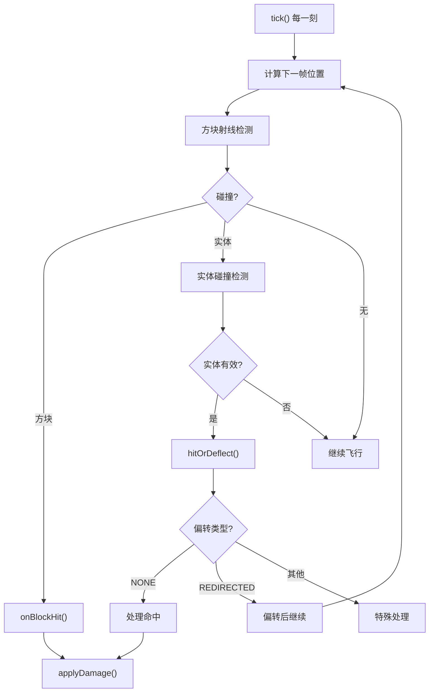
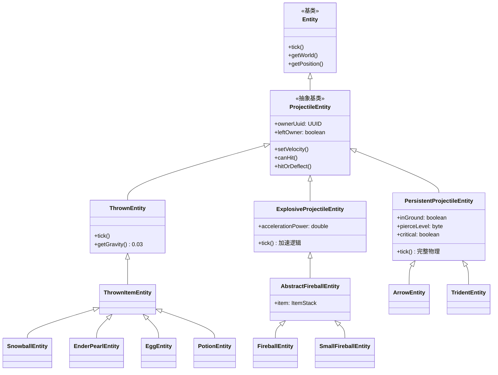
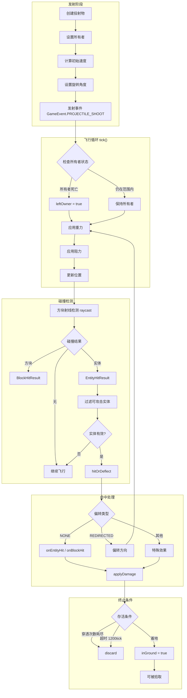
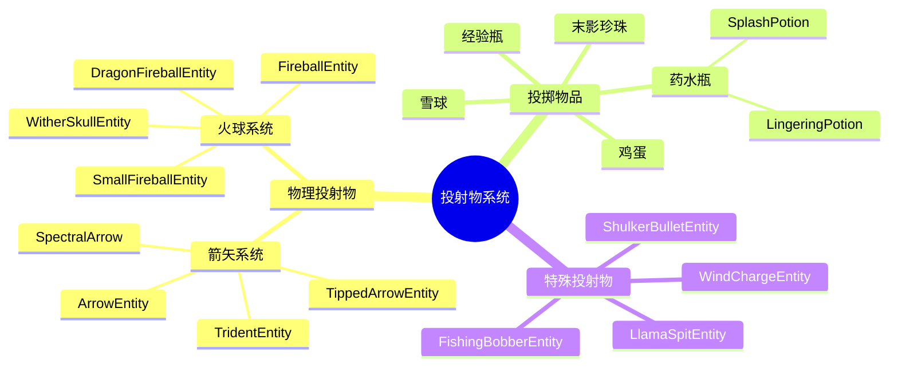

# 投射物系统 (Projectile Entity System)

## 概述

投射物系统是 Minecraft 中处理所有飞行物体（箭矢、火球、雪球等）的核心子系统。在 Minecraft 1.21 中，该系统由多个层次化的类组成，形成了清晰的继承体系。本文档将深入分析投射物的架构设计、物理计算、碰撞检测机制以及伤害系统。

投射物系统在游戏中的核心职责包括：

- **飞行轨迹计算**：基于初始速度和重力的抛物线运动
- **碰撞检测**：精确的实体和方块碰撞判定
- **伤害施加**：根据投射物类型计算并应用伤害
- **所有者追踪**：记录并验证投射物的发射者
- **状态同步**：服务端与客户端之间的网络同步

### 关键设计原则

1. **分层继承**：从 `ProjectileEntity` 基类派生出不同类型的投射物
2. **模板方法模式**：`tick()` 方法定义了标准流程，子类可覆盖特定阶段
3. **所有者系统**：通过 UUID 追踪投射物的发射者，用于伤害归属和拾取判定
4. **物理模拟**：基于向量数学的抛物线轨迹计算

## 核心类

### ProjectileEntity

`ProjectileEntity` 是所有投射物的基类，定义了投射物的通用行为和属性。

```java:35:65:D:\Minecraft-Learning\assets\mc\1.21\net\minecraft\entity\projectile\ProjectileEntity.java
public abstract class ProjectileEntity
extends Entity
implements Ownable {
    @Nullable
    private UUID ownerUuid;
    @Nullable
    private Entity owner;
    private boolean leftOwner;
    private boolean shot;
    @Nullable
    private Entity lastDeflectedEntity;
```

#### 核心属性

| 属性 | 类型 | 说明 |
|------|------|------|
| `ownerUuid` | UUID | 投射物所有者的唯一标识符 |
| `owner` | Entity | 所有者实体的引用（可能被清除） |
| `leftOwner` | boolean | 投射物是否已离开所有者 |
| `shot` | boolean | 投射物是否已发射 |
| `lastDeflectedEntity` | Entity | 上次偏转的实体 |

#### 所有者系统实现

```java:51:71:D:\Minecraft-Learning\assets\mc\1.21\net\minecraft\entity\projectile\ProjectileEntity.java
public void setOwner(@Nullable Entity entity) {
    if (entity != null) {
        this.ownerUuid = entity.getUuid();
        this.owner = entity;
    }
}

@Override
@Nullable
public Entity getOwner() {
    World world;
    if (this.owner != null && !this.owner.isRemoved()) {
        return this.owner;
    }
    if (this.ownerUuid != null && (world = this.getWorld()) instanceof ServerWorld) {
        ServerWorld serverWorld = (ServerWorld)world;
        this.owner = serverWorld.getEntity(this.ownerUuid);
        return this.owner;
    }
    return null;
}
```

所有者系统采用**延迟加载**策略：当实体引用失效时，通过 UUID 在服务端世界重新查找。这种设计确保了：
- 跨区块边界的追踪能力
- 所有者实体卸载后仍可恢复
- 网络同步的正确性

#### 速度与旋转计算

```java:139:169:D:\Minecraft-Learning\assets\mc\1.21\net\minecraft\entity\projectile\ProjectileEntity.java
public Vec3d calculateVelocity(double x, double y, double z, float power, float uncertainty) {
    return new Vec3d(x, y, z).normalize().add(
        this.random.nextTriangular(0.0, 0.0172275 * (double)uncertainty),
        this.random.nextTriangular(0.0, 0.0172275 * (double)uncertainty),
        this.random.nextTriangular(0.0, 0.0172275 * (double)uncertainty)
    ).multiply(power);
}

public void setVelocity(double x, double y, double z, float power, float uncertainty) {
    Vec3d vec3d = this.calculateVelocity(x, y, z, power, uncertainty);
    this.setVelocity(vec3d);
    this.velocityDirty = true;
    double d = vec3d.horizontalLength();
    this.setYaw((float)(MathHelper.atan2(vec3d.x, vec3d.z) * 57.2957763671875));
    this.setPitch((float)(MathHelper.atan2(vec3d.y, d) * 57.2957763671875));
    this.prevYaw = this.getYaw();
    this.prevPitch = this.getPitch();
}
```

`nextTriangular()` 方法产生**三角形分布**的随机偏移，比正态分布更集中于中心，提供更自然的散射效果。

### ThrownEntity

`ThrownEntity` 是投掷类物品（雪球、鸡蛋、末影珍珠等）的基类，继承自 `ProjectileEntity`。

```java:15:77:D:\Minecraft-Learning\assets\mc\1.21\net\minecraft\entity\projectile\thrown\ThrownEntity.java
public abstract class ThrownEntity
extends ProjectileEntity {
    // ...
    
    @Override
    public void tick() {
        float h;
        super.tick();
        HitResult hitResult = ProjectileUtil.getCollision(this, this::canHit);
        if (hitResult.getType() != HitResult.Type.MISS) {
            this.hitOrDeflect(hitResult);
        }
        this.checkBlockCollision();
        Vec3d vec3d = this.getVelocity();
        // 位置更新
        this.setPosition(d, e, f);
    }
    
    @Override
    protected double getGravity() {
        return 0.03;
    }
}
```

#### 投掷物 tick 流程

```plaintext
tick()
├── super.tick() - 发射事件、游戏规则检查
├── getCollision() - 碰撞检测
│   └── 实体碰撞 → hitOrDeflect() → onEntityHit()
│   └── 方块碰撞 → hitOrDeflect() → onBlockHit()
├── checkBlockCollision() - 方块碰撞检查
├── 更新位置
│   └── 水中阻力: 0.8
│   └── 空气阻力: 0.99
├── applyGravity() - 应用重力
└── 设置新位置
```

## 箭矢系统

### ArrowEntity 与 PersistentProjectileEntity

箭矢系统是 Minecraft 中最复杂的投射物系统之一，`PersistentProjectileEntity` 是其核心基类。

```java:59:85:D:\Minecraft-Learning\assets\mc\1.21\net\minecraft\entity\projectile\PersistentProjectileEntity.java
public abstract class PersistentProjectileEntity
extends ProjectileEntity {
    private static final double field_30657 = 2.0;
    private static final TrackedData<Byte> PROJECTILE_FLAGS = DataTracker.registerData(...);
    private static final TrackedData<Byte> PIERCE_LEVEL = DataTracker.registerData(...);
    private static final int CRITICAL_FLAG = 1;
    private static final int NO_CLIP_FLAG = 2;
    
    protected boolean inGround;        // 是否在地上
    protected int inGroundTime;        // 在地上的时间
    public PickupPermission pickupType; // 拾取权限
    @Nullable
    private IntOpenHashSet piercedEntities; // 已穿透的实体
    private ItemStack stack;           // 箭矢物品
    @Nullable
    private ItemStack weapon;          // 弓/弩
```

#### 箭矢物理计算

```java:155:256:D:\Minecraft-Learning\assets\mc\1.21\net\minecraft\entity\projectile\PersistentProjectileEntity.java
@Override
public void tick() {
    // ... 初始化代码 ...
    
    // 方块碰撞检测
    if (!bl) {
        vec3d2 = this.getPos();
        vec3d2 = vec3d3.add(vec3d);
        HitResult hitResult = this.getWorld().raycast(
            new RaycastContext(vec3d3, vec3d2, 
                RaycastContext.ShapeType.COLLIDER, 
                RaycastContext.FluidHandling.NONE, this));
    }
    
    // 实体碰撞循环（支持穿透）
    while (!this.isRemoved()) {
        EntityHitResult entityHitResult = this.getEntityCollision(vec3d3, vec3d2);
        if (entityHitResult != null) {
            hitResult = entityHitResult;
        }
        // ... 玩家保护检查 ...
        
        if (hitResult != null && !bl) {
            ProjectileDeflection deflection = this.hitOrDeflect(hitResult);
            if (deflection != ProjectileDeflection.NONE) break;
        }
        if (entityHitResult == null || this.getPierceLevel() <= 0) break;
        hitResult = null; // 继续穿透
    }
    
    // 暴击粒子效果
    if (this.isCritical()) {
        for (int i = 0; i < 4; ++i) {
            this.getWorld().addParticle(ParticleTypes.CRIT, ...);
        }
    }
}
```

#### 穿透机制

穿透系统使用 `IntOpenHashSet` 存储已穿透实体的 ID：

```java:312:325:D:\Minecraft-Learning\assets\mc\1.21\net\minecraft\entity\projectile\PersistentProjectileEntity.java
if (this.getPierceLevel() > 0) {
    if (this.piercedEntities == null) {
        this.piercedEntities = new IntOpenHashSet(5);
    }
    if (this.piercingKilledEntities == null) {
        this.piercingKilledEntities = Lists.newArrayListWithCapacity(5);
    }
    if (this.piercedEntities.size() < this.getPierceLevel() + 1) {
        this.piercedEntities.add(entity.getId());
    } else {
        this.discard(); // 达到穿透上限，消失
        return;
    }
}
```

#### 伤害计算

```java:299:385:D:\Minecraft-Learning\assets\mc\1.21\net\minecraft\entity\projectile\PersistentProjectileEntity.java
protected void onEntityHit(EntityHitResult entityHitResult) {
    Entity entity = entityHitResult.getEntity();
    float f = (float)this.getVelocity().length();
    double d = this.damage;
    
    // 附魔伤害加成
    if (this.getWeaponStack() != null && world instanceof ServerWorld) {
        d = EnchantmentHelper.getDamage(serverWorld, this.getWeaponStack(), 
            entity, damageSource, (float)d);
    }
    
    // 暴击伤害计算
    if (this.isCritical()) {
        long l = this.random.nextInt(i / 2 + 2);
        i = (int)Math.min(l + (long)i, Integer.MAX_VALUE);
    }
    
    // 伤害判定
    if (entity.damage(damageSource, i)) {
        // 击退效果
        this.knockback(livingEntity2, damageSource);
        // 附魔效果
        EnchantmentHelper.onTargetDamaged(serverWorld, livingEntity2, damageSource, this.getWeaponStack());
        // ...
    }
}
```

### ArrowEntity 特性

```java:23:141:D:\Minecraft-Learning\assets\mc\1.21\net\minecraft\entity\projectile\ArrowEntity.java
public class ArrowEntity
extends PersistentProjectileEntity {
    private static final TrackedData<Integer> COLOR = DataTracker.registerData(...);
    
    @Override
    protected void onHit(LivingEntity target) {
        super.onHit(target);
        Entity entity = this.getEffectCause();
        PotionContentsComponent potionContents = this.getPotionContents();
        
        // 应用药水效果
        if (potionContents.potion().isPresent()) {
            for (StatusEffectInstance effect : potionContents.potion().get().value().getEffects()) {
                target.addStatusEffect(new StatusEffectInstance(...), entity);
            }
        }
        for (StatusEffectInstance effect : potionContents.customEffects()) {
            target.addStatusEffect(effect, entity);
        }
    }
}
```

## 火球系统

### FireballEntity

火球系统继承链：`ProjectileEntity` → `ExplosiveProjectileEntity` → `AbstractFireballEntity` → `FireballEntity`/`SmallFireballEntity`

```java:21:84:D:\Minecraft-Learning\assets\mc\1.21\net\minecraft\entity\projectile\FireballEntity.java
public class FireballEntity
extends AbstractFireballEntity {
    private int explosionPower = 1;
    
    @Override
    protected void onCollision(HitResult hitResult) {
        super.onCollision(hitResult);
        if (!this.getWorld().isClient) {
            boolean bl = this.getWorld().getGameRules().getBoolean(GameRules.DO_MOB_GRIEFING);
            this.getWorld().createExplosion(
                (Entity)this, this.getX(), this.getY(), this.getZ(), 
                (float)this.explosionPower, bl, 
                World.ExplosionSourceType.MOB);
            this.discard();
        }
    }
    
    @Override
    protected void onEntityHit(EntityHitResult entityHitResult) {
        // 实体伤害
        entity.damage(this.getDamageSources().fireball(this, entity2), 6.0f);
    }
}
```

### ExplosiveProjectileEntity

火球特有的**加速机制**：

```java:72:109:D:\Minecraft-Learning\assets\mc\1.21\net\minecraft\entity\projectile\ExplosiveProjectileEntity.java
@Override
public void tick() {
    // ...
    this.setVelocity(vec3d.add(
        vec3d.normalize().multiply(this.accelerationPower)
    ).multiply(h));
    // 生成烟雾粒子
    if (particleEffect != null) {
        this.getWorld().addParticle(particleEffect, d, e + 0.5, f, 0.0, 0.0, 0.0);
    }
}
```

火球采用**持续加速**模型，每 tick 增加 `accelerationPower` (0.1)，同时应用阻力系数 (0.95)，形成先加速后减速的轨迹。

### SmallFireballEntity

```java:23:84:D:\Minecraft-Learning\assets\mc\1.21\net\minecraft\entity\projectile\SmallFireballEntity.java
public class SmallFireballEntity
extends AbstractFireballEntity {
    @Override
    protected void onBlockHit(BlockHitResult blockHitResult) {
        // 生成灵魂火
        if (this.getWorld().isAir(blockPos)) {
            this.getWorld().setBlockState(blockPos, 
                AbstractFireBlock.getState(this.getWorld(), blockPos));
        }
    }
    
    @Override
    public boolean damage(DamageSource source, float amount) {
        return false; // 免疫伤害
    }
}
```

## 其他投射物

### 末影珍珠 (EnderPearlEntity)

```java:27:138:D:\Minecraft-Learning\assets\mc\1.21\net\minecraft\entity\projectile\thrown\EnderPearlEntity.java
public class EnderPearlEntity
extends ThrownItemEntity {
    @Override
    protected void onCollision(HitResult hitResult) {
        // 生成传送门粒子
        for (int i = 0; i < 32; ++i) {
            this.getWorld().addParticle(ParticleTypes.PORTAL, ...);
        }
        
        Entity entity = this.getOwner();
        if (entity == null || !canTeleportEntityTo(entity, serverWorld)) {
            this.discard();
            return;
        }
        
        // 传送玩家
        entity.teleportTo(new TeleportTarget(serverWorld, this.getPos(), ...));
        entity.onLanding();
        entity.damage(this.getDamageSources().fall(), 5.0f); // 摔落伤害
    }
}
```

末影珍珠的传送机制包括：
1. 边界检查：`canTeleportEntityTo()` 验证目标和世界
2. 骑乘分离：先卸载载具
3. 末影螨生成：5% 概率在玩家传送后生成末影螨
4. 摔落伤害：传送后承受 5 点摔落伤害

### 鸡蛋 (EggEntity)

```java:20:79:D:\Minecraft-Learning\assets\mc\1.21\net\minecraft\entity\projectile\thrown\EggEntity.java
public class EggEntity
extends ThrownItemEntity {
    @Override
    protected void onCollision(HitResult hitResult) {
        if (!this.getWorld().isClient) {
            if (this.random.nextInt(8) == 0) { // 1/8 概率生成小鸡
                int i = 1;
                if (this.random.nextInt(32) == 0) {
                    i = 4; // 1/256 概率生成 4 只
                }
                for (int j = 0; j < i; ++j) {
                    ChickenEntity chicken = EntityType.CHICKEN.create(this.getWorld());
                    chicken.setBreedingAge(-24000);
                    this.getWorld().spawnEntity(chicken);
                }
            }
        }
    }
}
```

### 药水瓶 (PotionEntity)

药水瓶是投掷物中最复杂的实现：

```java:40:191:D:\Minecraft-Learning\assets\mc\1.21\net\minecraft\entity\projectile\thrown\PotionEntity.java
public class PotionEntity
extends ThrownItemEntity {
    public static final Predicate<LivingEntity> AFFECTED_BY_WATER = 
        entity -> entity.hurtByWater() || entity.isOnFire();
    
    @Override
    protected void onCollision(HitResult hitResult) {
        PotionContentsComponent potion = this.getStack()
            .getOrDefault(DataComponentTypes.POTION_CONTENTS, PotionContentsComponent.DEFAULT);
        
        if (potion.matches(Potions.WATER)) {
            this.applyWater();
        } else if (potion.hasEffects()) {
            if (this.isLingering()) {
                this.applyLingeringPotion(potion);
            } else {
                this.applySplashPotion(potion.getEffects(), targetEntity);
            }
        }
    }
}
```

药水效果范围计算：
- 溅泼药水：半径 4 格，高度 2 格
- 效果距离：基于 `squaredDistanceTo()` 计算，效果强度 = `1.0 - 距离/4.0`

### 三叉戟 (TridentEntity)

```java:30:218:D:\Minecraft-Learning\assets\mc\1.21\net\minecraft\entity\projectile\TridentEntity.java
public class TridentEntity
extends PersistentProjectileEntity {
    private static final TrackedData<Byte> LOYALTY = DataTracker.registerData(...);
    private boolean dealtDamage;
    public int returnTimer;
    
    @Override
    public void tick() {
        byte loyalty = this.dataTracker.get(LOYALTY);
        if (loyalty > 0 && (this.dealtDamage || this.isNoClip()) && entity != null) {
            if (!this.isOwnerAlive()) {
                // 所有者死亡：掉落三叉戟
                if (this.pickupType == PickupPermission.ALLOWED) {
                    this.dropStack(this.asItemStack(), 0.1f);
                }
                this.discard();
            } else {
                // 忠诚附魔：自动返回
                this.setNoClip(true);
                Vec3d vec3d = entity.getEyePos().subtract(this.getPos());
                this.setPos(this.getX(), this.getY() + vec3d.y * 0.015 * loyalty, this.getZ());
                
                double d = 0.05 * loyalty;
                this.setVelocity(this.getVelocity().multiply(0.95)
                    .add(vec3d.normalize().multiply(d)));
            }
        }
    }
}
```

## 物理计算

### 抛物线运动

投射物的运动遵循以下物理模型：

```plaintext
位置更新:
x_new = x + vx * drag
y_new = y + vy * drag - gravity
z_new = z + vz * drag

速度更新:
vx' = vx * drag
vy' = vy * drag - gravity
vz' = vz * drag
```

### 重力参数对比

| 投射物类型 | 重力值 | 说明 |
|-----------|--------|------|
| `ThrownEntity` | 0.03 | 雪球、鸡蛋、珍珠 |
| `PersistentProjectileEntity` | 0.05 | 箭矢 |
| `PotionEntity` | 0.05 | 药水瓶 |
| 掉落物 | 0.04 | 默认 |

### 阻力参数

| 环境 | 阻力系数 | 说明 |
|------|----------|------|
| 空气 | 0.99 | 轻微空气阻力 |
| 水中 | 0.8 | ThrownEntity |
| 水中（箭矢）| 0.6 | PersistentProjectileEntity |
| 水中（三叉戟）| 0.99 | Loyalty 附魔 |

### 轨迹可视化

```
        箭矢轨迹示例
         
    *                   
   /                    
  /                     
 /    ← 初始速度 3.0     
*------→ 发射方向        
 \                     
  \                    
   \                    
    \                   
     * ← 着地点 (gravity=0.05)
```

## 碰撞检测

### ProjectileUtil

`ProjectileUtil` 提供了标准化的碰撞检测方法：

```java:25:60:D:\Minecraft-Learning\assets\mc\1.21\net\minecraft\entity\projectile\ProjectileUtil.java
public static HitResult getCollision(Entity entity, Predicate<Entity> predicate) {
    Vec3d vec3d = entity.getVelocity();
    World world = entity.getWorld();
    Vec3d vec3d2 = entity.getPos();
    return getCollision(vec3d2, entity, predicate, vec3d, world, 0.3f, 
        RaycastContext.ShapeType.COLLIDER);
}

private static HitResult getCollision(Vec3d pos, Entity entity, 
        Predicate<Entity> predicate, Vec3d velocity, World world, 
        float margin, RaycastContext.ShapeType raycastShapeType) {
    // 1. 方块射线检测
    vec3d = pos.add(velocity);
    HitResult hitResult = world.raycast(new RaycastContext(pos, vec3d, 
        raycastShapeType, RaycastContext.FluidHandling.NONE, entity));
    if (hitResult.getType() != HitResult.Type.MISS) {
        vec3d = hitResult.getPos();
    }
    
    // 2. 实体碰撞检测
    EntityHitResult entityHit = getEntityCollision(world, entity, pos, vec3d, 
        entity.getBoundingBox().stretch(velocity).expand(1.0), predicate);
    if (entityHit != null) {
        hitResult = entityHit;
    }
    return hitResult;
}
```

### 碰撞检测流程



### 实体碰撞优先级

```java:97:118:D:\Minecraft-Learning\assets\mc\1.21\net\minecraft\entity\projectile\ProjectileUtil.java
@Nullable
public static EntityHitResult getEntityCollision(World world, Entity entity, 
        Vec3d min, Vec3d max, Box box, Predicate<Entity> predicate, float margin) {
    double d = Double.MAX_VALUE;
    Entity closest = null;
    
    for (Entity e : world.getOtherEntities(entity, box, predicate)) {
        Box expanded = e.getBoundingBox().expand(margin);
        Optional<Vec3d> hitPoint = expanded.raycast(min, max);
        
        if (hitPoint.isPresent()) {
            double dist = min.squaredDistanceTo(hitPoint.get());
            if (dist < d) {
                closest = e;
                d = dist;
            }
        }
    }
    
    return closest != null ? new EntityHitResult(closest) : null;
}
```

算法按距离选择最近的实体作为碰撞目标。

## 伤害计算

### 伤害来源

每种投射物定义了自己的伤害来源 (`DamageSource`)：

| 投射物 | 伤害来源 | 默认伤害 |
|--------|----------|----------|
| 箭矢 | `damageSources.arrow()` | 2.0 + 速度加成 |
| 火球 | `damageSources.fireball()` | 6.0 |
| 小火球 | `damageSources.fireball()` | 5.0 |
| 三叉戟 | `damageSources.trident()` | 8.0 + 附魔加成 |
| 雪球 | `damageSources.thrown()` | 0 (仅对烈焰人造成3点) |
| 鸡蛋 | `damageSources.thrown()` | 0 |

### 伤害计算公式

```java
// 基础伤害
float baseDamage = (float)this.getVelocity().length() * this.damage;

// 暴击加成
if (isCritical()) {
    int critDamage = random.nextInt(baseDamage / 2 + 2) + baseDamage;
}

// 力量/保护附魔
if (weaponStack != null) {
    damage = EnchantmentHelper.getDamage(world, weaponStack, target, source, damage);
}
```

### 击退计算

```java:387:404:D:\Minecraft-Learning\assets\mc\1.21\net\minecraft\entity\projectile\PersistentProjectileEntity.java
protected void knockback(LivingEntity target, DamageSource source) {
    float kb = EnchantmentHelper.modifyKnockback(serverWorld, weapon, target, source, 0.0f);
    double d = kb;
    if (d > 0.0) {
        double resistance = 1.0 - target.getAttributeValue(EntityAttributes.GENERIC_KNOCKBACK_RESISTANCE);
        Vec3d knockback = this.getVelocity()
            .multiply(1.0, 0.0, 1.0)  // 忽略垂直分量
            .normalize()
            .multiply(d * 0.6 * resistance);
        target.addVelocity(knockback.x, 0.1, knockback.z);
    }
}
```

## 自定义投射物

### 创建自定义投射物

要创建一个自定义投射物，需要：

1. **注册实体类型** (`EntityType`)
2. **继承适当的基类**
3. **实现核心方法**

```java
// 1. 定义实体类型
public static final EntityType<MyProjectileEntity> MY_PROJECTILE = 
    Registry.register(
        Registries.ENTITY_TYPE,
        new Identifier("modid", "my_projectile"),
        FabricEntityBuilder.create(SpawnGroup.MISC, MyProjectileEntity::new)
            .dimensions(EntityDimensions.fixed(0.25f, 0.25f))
            .build()
    );

// 2. 继承 ThrownEntity
public class MyProjectileEntity extends ThrownEntity {
    public MyProjectileEntity(EntityType type, World world) {
        super(type, world);
    }
    
    // 3. 可选：覆盖碰撞处理
    @Override
    protected void onEntityHit(EntityHitResult result) {
        Entity entity = result.getEntity();
        entity.damage(getDamageSources().thrown(this, getOwner()), 4.0f);
        discard();
    }
    
    @Override
    protected void onCollision(HitResult hitResult) {
        // 生成粒子等效果
        discard();
    }
}

// 4. 发射方法
public static void launch(World world, LivingEntity thrower) {
    MyProjectileEntity projectile = new MyProjectileEntity(
        EntityType.MY_PROJECTILE, world);
    projectile.setOwner(thrower);
    projectile.setPosition(thrower.getX(), thrower.getEyeY(), thrower.getZ());
    
    // 设置速度
    projectile.setVelocity(thrower, thrower.getPitch(), thrower.getYaw(), 0f, 1.5f, 1.0f);
    world.spawnEntity(projectile);
}
```

### 关键重写点

| 方法 | 用途 |
|------|------|
| `tick()` | 自定义飞行逻辑 |
| `getGravity()` | 自定义重力 |
| `onEntityHit()` | 实体命中处理 |
| `onBlockHit()` | 方块命中处理 |
| `onCollision()` | 统一碰撞处理 |
| `canHit()` | 碰撞过滤逻辑 |

## 源码分析

### 关键文件路径

- **基类**：`D:\Minecraft-Learning\assets\mc\1.21\net\minecraft\entity\projectile\ProjectileEntity.java`
- **投掷物基类**：`D:\Minecraft-Learning\assets\mc\1.21\net\minecraft\entity\projectile\thrown\ThrownEntity.java`
- **持久投射物**：`D:\Minecraft-Learning\assets\mc\1.21\net\minecraft\entity\projectile\PersistentProjectileEntity.java`
- **箭矢**：`D:\Minecraft-Learning\assets\mc\1.21\net\minecraft\entity\projectile\ArrowEntity.java`
- **火球**：`D:\Minecraft-Learning\assets\mc\1.21\net\minecraft\entity\projectile\FireballEntity.java`
- **碰撞工具**：`D:\Minecraft-Learning\assets\mc\1.21\net\minecraft\entity\projectile\ProjectileUtil.java`

### 继承体系



## Mermaid 图表

### 投射物飞行与碰撞流程



### 投射物分类



## 总结

Minecraft 1.21 的投射物系统展现了清晰的面向对象设计：

1. **分层架构**：从通用的 `ProjectileEntity` 到具体的各类投射物
2. **模板方法模式**：`tick()` 定义了标准流程，子类按需覆盖
3. **物理模拟**：基于向量数学的抛物线运动
4. **碰撞检测**：方块射线 + 实体 AABB 的双重检测机制
5. **所有者系统**：UUID 追踪确保伤害归属正确
6. **附魔集成**：与锋利、穿刺、冲击等附魔的无缝集成

理解这些核心机制对于开发模组和理解游戏行为都至关重要。

---

## 显式覆盖文件

### entity/projectile/ 目录（26 个文件）

| 文件名 | 说明 |
|--------|------|
| `ProjectileEntity.java` | 投射物基类 |
| `ThrownEntity.java` | 投掷物基类 |
| `ThrownItemEntity.java` | 投掷物品基类 |
| `PersistentProjectileEntity.java` | 持久投射物基类（箭矢） |
| `ArrowEntity.java` | 箭矢实体 |
| `SpectralArrowEntity.java` | 幽灵箭实体 |
| `TridentEntity.java` | 三叉戟实体 |
| `FireballEntity.java` | 火球实体 |
| `SmallFireballEntity.java` | 小火球实体 |
| `AbstractFireballEntity.java` | 火球抽象基类 |
| `ExplosiveProjectileEntity.java` | 爆炸投射物基类 |
| `DragonFireballEntity.java` | 龙火球实体 |
| `WitherSkullEntity.java` | 凋零骷髅头实体 |
| `SnowballEntity.java` | 雪球实体 |
| `EggEntity.java` | 鸡蛋实体 |
| `EnderPearlEntity.java` | 末影珍珠实体 |
| `PotionEntity.java` | 药水瓶实体 |
| `ExperienceBottleEntity.java` | 经验瓶实体 |
| `FishingBobberEntity.java` | 钓鱼浮标实体 |
| `ProjectileUtil.java` | 投射物碰撞工具类 |
| `FireworkRocketEntity.java` | 烟花火箭实体 |
| `LlamaSpitEntity.java` | 羊驼吐口水实体 |
| `ShulkerBulletEntity.java` | 潜影贝子弹实体 |
| `WindChargeEntity.java` | 风冲实体 |
| `AbstractWindChargeEntity.java` | 风冲抽象基类 |
| `BreezeWindChargeEntity.java` |  breeze 风冲实体 |
