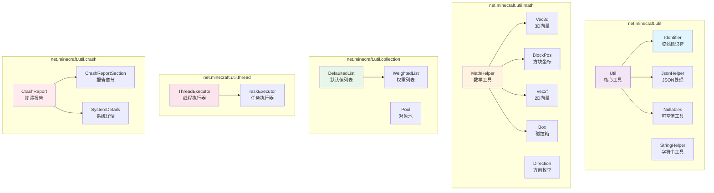

# 工具类系统 (Utility Classes System)

## 概述

Minecraft 1.21 的 `net.minecraft.util` 包及其子包包含了大量工具类，这些类是游戏引擎的基础设施，为整个游戏系统提供通用的数学计算、字符串处理、JSON 解析、线程管理、崩溃报告等核心功能。这些工具类遵循 DRY (Don't Repeat Yourself) 原则，将常用的功能抽象为可复用的方法，供整个代码库使用。

Minecraft 的工具类系统具有以下特点：

- **高内聚性**：每个工具类都有明确的职责边界
- **静态方法为主**：大多数工具类以静态方法形式提供服务
- **类型安全**：充分利用 Java 的泛型和类型系统
- **性能优化**：包含大量针对游戏场景优化的算法和数据结构

## 目录结构

```
net.minecraft.util/
├── annotation/          # 注解定义 (@Nullable, @NotNull 等)
├── collection/          # 集合工具 (DefaultedList, WeightedList 等)
├── crash/               # 崩溃报告系统 (CrashReport, CrashReportSection)
├── dynamic/             # 动态加载相关
├── function/            # 函数式接口
├── hit/                 # 碰撞检测相关
├── logging/             # 日志工具
├── math/                # 数学工具 (MathHelper, Vec3d, BlockPos)
├── path/                # 路径工具
├── profiler/            # 性能分析工具
├── profiling/           # 性能分析相关
├── shape/               # 形状工具 (Box, AABB)
├── thread/              # 线程管理工具
├── Identifier.java      # 资源标识符
├── Util.java            # 核心工具类
├── JsonHelper.java      # JSON 解析辅助
├── StringHelper.java    # 字符串处理
├── Nullables.java       # 可空值处理
└── ...                  # 其他枚举和工具类
```

## Identifier 系统 - 资源标识符

`Identifier` 是 Minecraft 中最重要的工具类之一，用于唯一标识游戏中的各种资源，如方块、物品、粒子效果、附魔等。

### 核心概念

Identifier 采用 **命名空间:路径** 的格式，例如 `minecraft:dirt`、`fabric: diamonds`。

```java
// 源码路径: D:\Minecraft-Learning\assets\mc\1.21\net\minecraft\util\Identifier.java
public final class Identifier implements Comparable<Identifier> {
    public static final String DEFAULT_NAMESPACE = "minecraft";
    public static final String REALMS_NAMESPACE = "realms";
    public static final char NAMESPACE_SEPARATOR = ':';
    
    private final String namespace;
    private final String path;
}
```

### 关键特性

1. **命名空间隔离**：不同 mod 可以使用相同的路径名，通过命名空间区分
2. **序列化支持**：内置 `CODEC` 和 `PACKET_CODEC` 支持 DataFixerUpper 和网络传输
3. **验证机制**：严格的字符集限制 (`[a-z0-9_.-/]`)
4. **命令解析**：支持从 Brigadier 命令输入读取

### 创建方法

```java
// 三种创建方式
Identifier.of("modid", "item_name");      // 完整格式
Identifier.of("item_name");                // 默认命名空间
Identifier.ofVanilla("diamond");           // 原版命名空间
```

### 转换方法

```java
identifier.toString();                      // "namespace:path"
identifier.toTranslationKey();              // "namespace.path"
identifier.toUnderscoreSeparatedString();   // "namespace_path"
```

## MathHelper - 数学工具方法

`MathHelper` 提供了游戏开发中常用的数学函数，包括三角函数、插值、颜色处理等。

### 源码路径

`D:\Minecraft-Learning\assets\mc\1.21\net\minecraft\util\math\MathHelper.java`

### 核心常量

```java
public static final float PI = (float)java.lang.Math.PI;
public static final float HALF_PI = 1.5707964f;
public static final float TAU = (float)java.lang.Math.PI * 2;  // 2π
public static final float RADIANS_PER_DEGREE = (float)java.lang.Math.PI / 180;
public static final float EPSILON = 1.0E-5f;
```

### 三角函数优化

Minecraft 使用预计算的 **Sine Table** 来加速三角函数：

```java
private static final float[] SINE_TABLE = Util.make(new float[65536], sineTable -> {
    for (int i = 0; i < sineTable.length; ++i) {
        sineTable[i] = (float)Math.sin((double)i * Math.PI * 2.0 / 65536.0);
    }
});

public static float sin(float value) {
    return SINE_TABLE[(int)(value * 10430.378f) & 0xFFFF];
}

public static float cos(float value) {
    return SINE_TABLE[(int)(value * 10430.378f + 16384.0f) & 0xFFFF];
}
```

### 插值函数 (Lerp)

```java
// 线性插值
public static float lerp(float delta, float start, float end) {
    return start + delta * (end - start);
}

// 带边界约束的插值
public static double clampedLerp(double start, double end, double delta) {
    if (delta < 0.0) return start;
    if (delta > 1.0) return end;
    return lerp(delta, start, end);
}

// 2D/3D 插值
public static double lerp2(double deltaX, double deltaY, double x0y0, double x1y0, double x0y1, double x1y1);
public static double lerp3(double deltaX, double deltaY, double deltaZ, ...);

// 角度插值
public static float lerpAngleDegrees(float delta, float start, float end) {
    return start + delta * MathHelper.wrapDegrees(end - start);
}

// Catmull-Rom 样条插值（用于平滑曲线）
public static float catmullRom(float delta, float p0, float p1, float p2, float p3) {
    return 0.5f * (2.0f * p1 + (p2 - p0) * delta + 
                   (2.0f * p0 - 5.0f * p1 + 4.0f * p2 - p3) * delta * delta + 
                   (3.0f * p1 - p0 - 3.0f * p2 + p3) * delta * delta * delta);
}
```

### 常用数学操作

```java
// 取整和取模
public static int floor(float value);
public static int ceil(float value);
public static int floorDiv(int dividend, int divisor);
public static float floorMod(float dividend, float divisor);

// 范围限制
public static int clamp(int value, int min, int max);
public static float clamp(float value, float min, float max);

// 角度处理
public static int wrapDegrees(int degrees);  // 范围 [-180, 180)
public static float stepTowards(float from, float to, float step);

// 快速开方
public static float inverseSqrt(float x);   // 1/sqrt(x)

// 幂运算
public static float square(float n);        // n²
public static double hypot(double a, double b);  // sqrt(a² + b²)

// 二进制相关
public static int ceilLog2(int value);      // ceil(log2(value))
public static int smallestEncompassingPowerOfTwo(int value);
public static boolean isPowerOfTwo(int value);
```

### 随机数生成

```java
public static int nextInt(Random random, int min, int max);
public static float nextFloat(Random random, float min, float max);
public static float nextGaussian(Random random, float mean, float deviation);
```

## RandomUtil - 随机数工具

虽然 Minecraft 使用 `net.minecraft.util.math.random.Random` 作为主要的随机数生成器，但 `Util` 类提供了一些高级随机操作。

### 源码路径

`D:\Minecraft-Learning\assets\mc\1.21\net\minecraft\util\Util.java`

### 随机列表操作

```java
// 从列表中随机选择
public static <T> T getRandom(List<T> list, Random random);
public static <T> Optional<T> getRandomOrEmpty(List<T> list, Random random);

// 洗牌
public static <T> List<T> copyShuffled(Stream<T> stream, Random random);
public static <T> List<T> copyShuffled(T[] array, Random random);
public static <T> void shuffle(List<T> list, Random random);

// 生成随机 UUID
public static UUID randomUuid(Random random);
```

## CollectionUtil - 集合工具

Minecraft 在 `net.minecraft.util.collection` 包中提供了多个优化的集合实现。

### 源码路径

`D:\Minecraft-Learning\assets\mc\1.21\net\minecraft\util\collection\DefaultedList.java`

### DefaultedList - 默认值列表

当清空列表时，`DefaultedList` 会将所有元素重置为默认值，而不是删除它们：

```java
public class DefaultedList<E> extends AbstractList<E> {
    private final List<E> delegate;
    private final E initialElement;
    
    // 工厂方法
    public static <E> DefaultedList<E> of();
    public static <E> DefaultedList<E> ofSize(int size);
    public static <E> DefaultedList<E> ofSize(int size, E defaultValue);
    
    // 清空时重置为默认值
    @Override
    public void clear() {
        if (this.initialElement == null) {
            super.clear();
        } else {
            for (int i = 0; i < this.size(); ++i) {
                this.set(i, this.initialElement);
            }
        }
    }
}
```

### 其他集合工具

| 类名 | 用途 |
|------|------|
| `WeightedList` | 带权重的列表，用于随机选择 |
| `SortedArraySet` | 有序数组集合 |
| `Int2ObjectBiMap` | Int 到对象的双向映射 |
| `IndexedIterable` | 带索引的迭代器 |
| `Pool<T>` | 对象池 |

### Util 类中的集合方法

```java
// 获取最后一个元素
public static <T> T getLast(List<T> list);

// 遍历下一个/上一个元素
public static <T> T next(Iterable<T> iterable, @Nullable T object);
public static <T> T previous(Iterable<T> iterable, @Nullable T object);

// 集合操作
public static <T> Predicate<T> allOf(List<? extends Predicate<T>> predicates);
public static <T> Predicate<T> anyOf(List<? extends Predicate<T>> predicates);

// 列表/映射构建
public static <T> List<T> withAppended(List<T> list, T valueToAppend);
public static <T> List<T> withPrepended(T valueToPrepend, List<T> list);
public static <K, V> Map<K, V> mapWith(Map<K, V> map, K key, V value);
```

## ThreadUtil - 线程工具

Minecraft 的线程管理系统位于 `net.minecraft.util.thread` 包。

### 源码路径

`D:\Minecraft-Learning\assets\mc\1.21\net\minecraft\util\thread\ThreadExecutor.java`

### ThreadExecutor 抽象类

```java
public abstract class ThreadExecutor<R extends Runnable> 
    implements SampleableExecutor, MessageListener<R>, Executor {
    
    private final String name;
    private final Queue<R> tasks = Queues.newConcurrentLinkedQueue();
    
    // 任务提交
    public <V> CompletableFuture<V> submit(Supplier<V> task);
    public CompletableFuture<Void> submit(Runnable task);
    public void submitAndJoin(Runnable runnable);
    
    // 任务执行
    public boolean runTask();
    public void runTasks(BooleanSupplier stopCondition);
    
    // 线程检查
    public boolean isOnThread() {
        return Thread.currentThread() == this.getThread();
    }
}
```

### 线程池管理

`Util` 类管理着三个主要的线程池：

```java
public class Util {
    private static final int MAX_PARALLELISM = 255;
    private static final ExecutorService MAIN_WORKER_EXECUTOR = createWorker("Main");
    private static final ExecutorService IO_WORKER_EXECUTOR = createIoWorker("IO-Worker-", false);
    private static final ExecutorService DOWNLOAD_WORKER_EXECUTOR = createIoWorker("Download-", true);
    
    public static ExecutorService getMainWorkerExecutor();
    public static ExecutorService getIoWorkerExecutor();
    public static ExecutorService getDownloadWorkerExecutor();
    
    private static ExecutorService createWorker(String name) {
        int threads = MathHelper.clamp(
            Runtime.getRuntime().availableProcessors() - 1, 
            1, 
            getMaxBackgroundThreads()
        );
        return new ForkJoinPool(threads, ...);
    }
}
```

### 线程工具类

| 类名 | 用途 |
|------|------|
| `TaskExecutor` | 任务执行器 |
| `TaskQueue` | 任务队列 |
| `FutureQueue` | 未来结果队列 |
| `LockHelper` | 锁辅助工具 |
| `AtomicStack` | 原子栈 |

## CrashReport - 崩溃报告系统

Minecraft 的崩溃报告系统提供了一致的错误报告机制。

### 源码路径

`D:\Minecraft-Learning\assets\mc\1.21\net\minecraft\util\crash\CrashReport.java`

### 核心结构

```java
public class CrashReport {
    private final String message;
    private final Throwable cause;
    private final List<CrashReportSection> otherSections = Lists.newArrayList();
    private final SystemDetails systemDetailsSection = new SystemDetails();
    private boolean hasStackTrace = true;
    
    // 创建报告
    public static CrashReport create(Throwable cause, String title) {
        while (cause instanceof CompletionException && cause.getCause() != null) {
            cause = cause.getCause();
        }
        if (cause instanceof CrashException) {
            return ((CrashException)cause).getReport();
        }
        return new CrashReport(title, cause);
    }
    
    // 添加详细信息
    public CrashReportSection addElement(String name);
    public SystemDetails getSystemDetailsSection();
    
    // 输出报告
    public String asString(ReportType type, List<String> extraInfo);
    public boolean writeToFile(Path path, ReportType type);
}
```

### 使用示例

```java
try {
    // 可能抛出异常的代码
    loadChunk(x, z);
} catch (Exception e) {
    CrashReport report = CrashReport.create(e, "Loading chunk");
    report.addElement("Chunk coordinates")
          .add("x", x)
          .add("z", z);
    throw new CrashException(report);
}
```

## Annotation 工具 - 注解处理

Minecraft 使用 Jetbrains `@Nullable` 和 `@NotNull` 注解进行空值检查。

### 源码路径

`D:\Minecraft-Learning\assets\mc\1.21\net\minecraft\util\annotation\`

### 主要注解

| 注解名 | 用途 |
|--------|------|
| `@Nullable` | 标记可空参数/返回值 |
| `@NotNull` | 标记非空参数/返回值 |
| `@FieldsAreNonnullByDefault` | 类/包级别默认非空字段 |
| `@MethodsReturnNonnullByDefault` | 方法默认非空返回值 |
| `@Debug` | 调试相关标记 |
| `@AccessedByNative` | JNI 访问标记 |

### 自定义注解示例

```java
@Retention(RetentionPolicy.CLASS)
@Target({ElementType.FIELD, ElementType.METHOD, ElementType.PARAMETER})
public @interface Nullable {
}
```

## StringHelper - 字符串工具

`StringHelper` 提供游戏相关的字符串处理功能。

### 源码路径

`D:\Minecraft-Learning\assets\mc\1.21\net\minecraft\util\StringHelper.java`

### 核心方法

```java
public class StringHelper {
    // 时间格式化 (刻 → MM:SS)
    public static String formatTicks(int ticks, float tickRate);
    
    // 格式化代码处理 (§ 符号)
    public static String stripTextFormat(String text);
    
    // 空值检查
    public static boolean isEmpty(@Nullable String text);
    public static boolean isBlank(@Nullable String string);
    
    // 字符串截断
    public static String truncate(String text, int maxLength, boolean addEllipsis);
    public static String truncateChat(String text);  // 最大 256 字符
    
    // 行数计算
    public static int countLines(String text);
    public static boolean endsWithLineBreak(String text);
    
    // 字符验证
    public static boolean isValidChar(char c);
    public static boolean isValidPlayerName(String name);
    
    // 非法字符移除
    public static String stripInvalidChars(String string);
}
```

## JsonHelper - JSON 工具

`JsonHelper` 是 Minecraft 中处理 JSON 数据的核心工具类。

### 源码路径

`D:\Minecraft-Learning\assets\mc\1.21\net\minecraft\util\JsonHelper.java`

### 检查方法

```java
// 检查元素是否存在
public static boolean hasString(JsonObject object, String element);
public static boolean hasNumber(JsonObject object, String element);
public static boolean hasBoolean(JsonObject object, String element);
public static boolean hasArray(JsonObject object, String element);
public static boolean hasJsonObject(JsonObject object, String element);
public static boolean hasPrimitive(JsonObject object, String element);
public static boolean hasElement(@Nullable JsonObject object, String element);

// 类型检查
public static boolean isString(JsonElement element);
public static boolean isNumber(JsonElement element);
public static boolean isBoolean(JsonElement element);
```

### 获取方法

```java
// 带默认值的获取
public static String getString(JsonObject object, String element, @Nullable String defaultStr);
public static int getInt(JsonObject object, String element, int defaultInt);
public static boolean getBoolean(JsonObject object, String element, boolean defaultBoolean);

// 必须存在的获取（不存在则抛异常）
public static String getString(JsonObject object, String element);
public static int getInt(JsonObject object, String element);
public static JsonObject getObject(JsonObject object, String element);
public static JsonArray getArray(JsonObject object, String element);

// 类型转换
public static RegistryEntry<Item> getItem(JsonObject object, String key);
public static long getLong(JsonObject object, String name);
public static double getDouble(JsonObject object, String element);
```

### 反序列化

```java
// 从字符串/Reader反序列化
public static JsonObject deserialize(String content);
public static JsonObject deserialize(Reader reader);
public static <T> T deserialize(Gson gson, String content, Class<T> type);

// 排序输出
public static String toSortedString(JsonElement json);
```

## Nullables - 可空值工具

`Nullables` 提供处理可空值的实用方法。

### 源码路径

`D:\Minecraft-Learning\assets\mc\1.21\net\minecraft\util\Nullables.java`

### 核心方法

```java
public class Nullables {
    // Optional 等价方法
    @Nullable
    public static <T, R> R map(@Nullable T value, Function<T, R> mapper);
    
    public static <T, R> R mapOrElse(@Nullable T value, Function<T, R> mapper, R other);
    
    public static <T, R> R mapOrElseGet(@Nullable T value, Function<T, R> mapper, Supplier<R> getter);
    
    // 集合操作
    @Nullable
    public static <T> T getFirst(Collection<T> collection);
    
    public static <T> T getFirstOrElse(Collection<T> collection, T defaultValue);
    
    // 数组空检查
    public static <T> boolean isEmpty(@Nullable T[] array);
    public static boolean isEmpty(@Nullable int[] array);
    public static boolean isEmpty(@Nullable double[] array);
    // ... 其他基本类型
}
```

## Util - 核心工具类

`Util` 是 Minecraft 中最核心的工具类，包含各种通用功能。

### 源码路径

`D:\Minecraft-Learning\assets\mc\1.21\net\minecraft\util\Util.java`

### 时间相关

```java
public static long getMeasuringTimeMs();     // 相对时间（毫秒）
public static long getMeasuringTimeNano();   // 相对时间（纳秒）
public static long getEpochTimeMs();         // Unix 时间戳
public static String getFormattedCurrentTime();  // "2024-01-01_00.00.00"
```

### 文件操作

```java
// 文件备份和替换
public static void backupAndReplace(Path current, Path newPath, Path backup);
public static boolean backupAndReplace(Path current, Path newPath, Path backup, boolean noRestoreOnFail);

// 文件复制
public static void relativeCopy(Path src, Path dest, Path toCopy) throws IOException;
```

### 谓词组合

```java
public static <T> Predicate<T> allOf(List<? extends Predicate<T>> predicates);
public static <T> Predicate<T> anyOf(List<? extends Predicate<T>> predicates);
```

### 记忆化/缓存

```java
public static <T, R> Function<T, R> memoize(Function<T, R> function);
public static <T, U, R> BiFunction<T, U, R> memoize(BiFunction<T, U, R> biFunction);
```

### 平台检测

```java
public static OperatingSystem getOperatingSystem();

public enum OperatingSystem {
    LINUX, SOLARIS, WINDOWS, OSX, UNKNOWN;
    
    public void open(URI uri);
    public void open(File file);
    public void open(Path path);
    public void open(String uri);
}
```

### Future 组合

```java
public static <V> CompletableFuture<List<V>> combine(List<? extends CompletableFuture<? extends V>> futures);
public static <V> CompletableFuture<List<V>> combineSafe(List<? extends CompletableFuture<V>> futures);
public static <V> CompletableFuture<List<V>> combineCancellable(List<? extends CompletableFuture<? extends V>> futures);
```

## 源码分析

### 数学库对比

| 操作 | Java Math | Minecraft MathHelper |
|------|-----------|---------------------|
| sin/cos | 使用 FPU | 预计算表 (65536 entries) |
| sqrt | 标准实现 | JOML 优化版 |
| 1/sqrt | 标准实现 | fastInverseSqrt (Quake 算法) |

### 内存优化策略

1. **Sine Table**：使用 65536 个 float 值 (256KB) 换取计算速度
2. **对象池**：`Pool<T>` 复用常用对象减少 GC
3. **直接操作**：避免创建中间对象

### 性能考虑

1. **分支预测优化**：使用 `switch` 表达式替代 if-else 链
2. **位运算**：使用 `& 0xFFFF` 替代 `% 65536`
3. **缓存友好**：连续内存访问模式

## Mermaid Diagram



## 关键设计模式

### 1. 工具类模式
- 私有构造函数防止实例化
- 静态方法提供功能
- 类被声明为 `final`

### 2. 工厂方法模式
```java
DefaultedList<E> list = DefaultedList.of();
DefaultedList<E> list = DefaultedList.ofSize(10, defaultValue);
```

### 3. 函数式组合
```java
Util.allOf(List<Predicate<T>>)  // AND 组合
Util.anyOf(List<Predicate<T>>)   // OR 组合
```

### 4. 记忆化模式
```java
Function<T, R> memoized = Util.memoize(originalFunction);
```

## 课后自查

1. Identifier 的默认命名空间是什么？如何创建一个原版命名空间的资源标识符？
2. MathHelper 中的 sin/cos 函数是如何优化的？使用了什么数据结构？
3. DefaultedList 与普通 ArrayList 的区别是什么？什么场景下应该使用它？
4. Util 类管理哪几个线程池？它们各自的用途是什么？
5. CrashReport 的 `addElement` 方法有什么特殊处理？
6. 如何使用 JsonHelper 从 JsonObject 中获取一个可选的整数值，并提供默认值？
7. Minecraft 使用什么注解来表示方法参数可以是 null？
