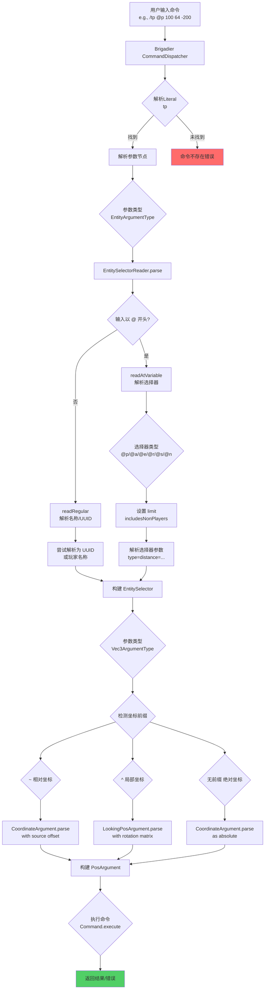
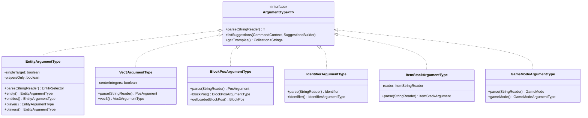
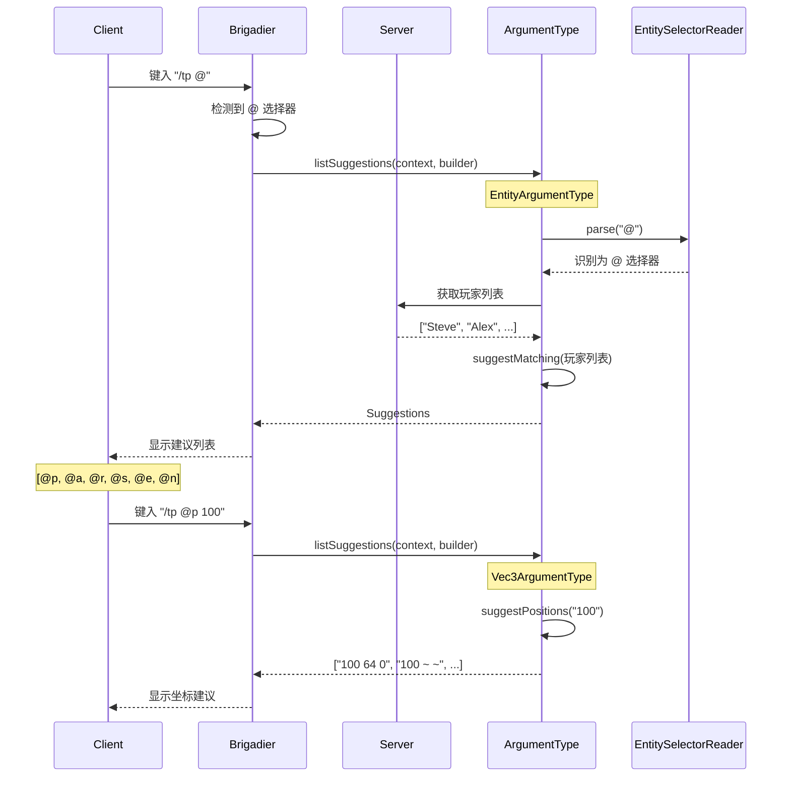

# 命令参数系统 (Command Argument System)

## 概述

Minecraft 1.21 的命令参数系统是游戏命令解析架构的核心组成部分，负责处理和验证玩家输入的各种命令参数。该系统基于 Mojang 开发的 **Brigadier** 命令解析库，这是一个专门为 Minecraft 设计的命令行参数解析框架。

命令参数系统在 Minecraft 中扮演着至关重要的角色：

- **参数解析**：将用户输入的文本转换为游戏可理解的数据结构
- **类型安全**：确保参数符合预期的数据类型和范围
- **自动补全**：为客户端提供实时的命令建议和补全功能
- **网络传输**：序列化和反序列化参数以在客户端与服务器之间传输
- **错误处理**：提供友好的错误消息帮助用户纠正输入错误

```
D:\Minecraft-Learning\assets\mc\1.21\net\minecraft\command\argument\
```

## Brigadier 集成 - 命令解析框架

### Brigadier 概述

Brigadier 是 Mojang 专门为 Minecraft 开发的一个命令解析和执行库，它提供了强大的类型安全命令解析能力。在 Minecraft 中，所有命令都通过 Brigadier 进行注册和解析。

### 核心接口

Brigadier 的核心接口是 `ArgumentType<T>`，它定义了参数解析的基本契约：

```java
D:\Minecraft-Learning\assets\mc\1.21\net\minecraft\command\argument\ArgumentTypes.java
```

```java
public interface ArgumentType<T> {
    T parse(StringReader stringReader) throws CommandSyntaxException;
    
    <S> CompletableFuture<Suggestions> listSuggestions(
        CommandContext<S> context, 
        SuggestionsBuilder builder
    );
    
    Collection<String> getExamples();
}
```

### 参数注册机制

Minecraft 通过 `ArgumentTypes` 类注册所有内置参数类型：

```java
public class ArgumentTypes {
    private static final Map<Class<?>, ArgumentSerializer<?, ?>> CLASS_MAP = Maps.newHashMap();

    public static ArgumentSerializer<?, ?> register(Registry<ArgumentSerializer<?, ?>> registry) {
        // 注册布尔类型
        ArgumentTypes.register(registry, "brigadier:bool", BoolArgumentType.class, 
            ConstantArgumentSerializer.of(BoolArgumentType::bool));
        
        // 注册整数类型
        ArgumentTypes.register(registry, "brigadier:integer", IntegerArgumentType.class, 
            new IntegerArgumentSerializer());
        
        // 注册实体类型
        ArgumentTypes.register(registry, "entity", EntityArgumentType.class, 
            new EntityArgumentType.Serializer());
        
        // 注册坐标类型
        ArgumentTypes.register(registry, "block_pos", BlockPosArgumentType.class, 
            ConstantArgumentSerializer.of(BlockPosArgumentType::blockPos));
        
        // ... 更多参数类型注册
    }
}
```

### 参数序列化器

参数通过 `ArgumentSerializer` 接口实现网络传输的序列化：

```java
D:\Minecraft-Learning\assets\mc\1.21\net\minecraft\command\argument\serialize\ArgumentSerializer.java
```

```java
public interface ArgumentSerializer<A extends ArgumentType<?>, T extends ArgumentTypeProperties<A>> {
    void writePacket(T properties, PacketByteBuf packetByteBuf);
    
    T fromPacket(PacketByteBuf packetByteBuf);
    
    void writeJson(T properties, JsonObject jsonObject);
    
    T getArgumentTypeProperties(A argumentType);
}
```

### 常量参数序列化器

对于不需要额外配置的参数类型，使用 `ConstantArgumentSerializer`：

```java
D:\Minecraft-Learning\assets\mc\1.21\net\minecraft\command\argument\serialize\ConstantArgumentSerializer.java
```

```java
public class ConstantArgumentSerializer<A extends ArgumentType<?>> 
    implements ArgumentSerializer<A, Properties> {
    
    public static <T extends ArgumentType<?>> ConstantArgumentSerializer<T> of(Supplier<T> typeSupplier) {
        return new ConstantArgumentSerializer<>(commandRegistryAccess -> typeSupplier.get());
    }
    
    // 写入/读取数据包时不需要额外数据
    @Override
    public void writePacket(Properties properties, PacketByteBuf packetByteBuf) {}
}
```

### 注册的参数类型列表

Minecraft 1.21 支持以下主要参数类型：

| 参数类型 | 注册 ID | 说明 |
|---------|--------|------|
| BoolArgumentType | brigadier:bool | 布尔值 (true/false) |
| FloatArgumentType | brigadier:float | 32位浮点数 |
| DoubleArgumentType | brigadier:double | 64位浮点数 |
| IntegerArgumentType | brigadier:integer | 32位整数 |
| LongArgumentType | brigadier:long | 64位整数 |
| StringArgumentType | brigadier:string | 字符串 |
| EntityArgumentType | entity | 实体选择器 |
| BlockPosArgumentType | block_pos | 方块坐标 |
| Vec3ArgumentType | vec3 | 3D坐标 |
| Vec2ArgumentType | vec2 | 2D坐标 |
| BlockStateArgumentType | block_state | 方块状态 |
| ItemStackArgumentType | item_stack | 物品堆 |
| GameModeArgumentType | gamemode | 游戏模式 |
| DimensionArgumentType | dimension | 维度 |
| IdentifierArgumentType | resource_location | 资源标识符 |
| TextArgumentType | component | 文本组件 |
| MessageArgumentType | message | 聊天消息 |
| ScoreHolderArgumentType | score_holder | 记分板持有者 |

## 实体参数 (Entity Arguments)

### EntityArgumentType 详解

实体参数是最复杂的参数类型之一，支持多种输入格式：

```java
D:\Minecraft-Learning\assets\mc\1.21\net\minecraft\command\argument\EntityArgumentType.java
```

```java
public class EntityArgumentType implements ArgumentType<EntitySelector> {
    private static final Collection<String> EXAMPLES = Arrays.asList(
        "Player", 
        "0123", 
        "@e", 
        "@e[type=foo]", 
        "dd12be42-52a9-4a91-a8a1-11c01849e498"
    );
    
    final boolean singleTarget;   // 是否只选择一个实体
    final boolean playersOnly;   // 是否只选择玩家
    
    protected EntityArgumentType(boolean singleTarget, boolean playersOnly) {
        this.singleTarget = singleTarget;
        this.playersOnly = playersOnly;
    }
    
    // 工厂方法
    public static EntityArgumentType entity() {
        return new EntityArgumentType(true, false);
    }
    
    public static EntityArgumentType entities() {
        return new EntityArgumentType(false, false);
    }
    
    public static EntityArgumentType player() {
        return new EntityArgumentType(true, true);
    }
    
    public static EntityArgumentType players() {
        return new EntityArgumentType(false, true);
    }
}
```

### 实体选择器语法

Minecraft 支持丰富的实体选择器语法：

- `@p` - 最近的玩家
- `@a` - 所有玩家
- `@r` - 随机玩家
- `@s` - 命令执行者 (sender)
- `@e` - 所有实体
- `@n` - 最近的实体

选择器可以带有参数：

```
@e[type=cow,distance=..10,limit=5]
```

### EntitySelectorReader

实体选择器的解析由 `EntitySelectorReader` 类处理：

```java
D:\Minecraft-Learning\assets\mc\1.21\net\minecraft\command\EntitySelectorReader.java
```

```java
public class EntitySelectorReader {
    private int limit;                    // 结果数量限制
    private boolean includesNonPlayers;   // 是否包含非玩家实体
    private NumberRange.DoubleRange distance;  // 距离范围
    private NumberRange.IntRange levelRange;    // 玩家等级范围
    private EntityType<?> entityType;     // 实体类型过滤
    private BiConsumer<Vec3d, List<? extends Entity>> sorter;  // 排序器
    
    // 解析选择器类型 (@p, @a, @r, @s, @e, @n)
    protected void readAtVariable() throws CommandSyntaxException {
        char c = this.reader.read();
        switch (c) {
            case 'p' -> {
                this.limit = 1;
                this.includesNonPlayers = false;
                this.sorter = NEAREST;
                this.setEntityType(EntityType.PLAYER);
            }
            case 'a' -> {
                this.limit = Integer.MAX_VALUE;
                this.includesNonPlayers = false;
            }
            case 'e' -> {
                this.limit = Integer.MAX_VALUE;
                this.includesNonPlayers = true;
            }
            // ...
        }
    }
    
    // 解析选择器参数 [type=cow,limit=5]
    protected void readArguments() throws CommandSyntaxException {
        while (reader.canRead() && reader.peek() != ']') {
            String option = reader.readString();
            EntitySelectorOptions.SelectorHandler handler = 
                EntitySelectorOptions.getHandler(this, option);
            handler.handle(this);
        }
    }
}
```

### 支持的选择器选项

| 选项 | 说明 | 示例 |
|-----|------|------|
| type | 实体类型 | `type=cow` |
| limit | 结果数量 | `limit=5` |
| distance | 距离范围 | `distance=..10` |
| x, y, z | 中心坐标 | `x=0,y=64,z=0` |
| dx, dy, dz | 区域尺寸 | `dx=5,dy=10,dz=5` |
| scores | 记分板分数 | `scores={deaths=5}` |
| tag | 实体标签 | `tag=!owner` |
| team | 队伍 | `team=red` |
| name | 名称 | `name=Steve` |
| nbt | NBT数据 | `nbt={Health:10.0}` |
| advancement | 进度 | `advancement=minecraft:story/root` |
| gamemode | 游戏模式 | `gamemode=creative` |
| level | 经验等级 | `level=10..` |
| sort | 排序方式 | `sort=nearest` |

## 坐标参数 (Position Arguments)

### Vec3ArgumentType

3D坐标参数支持多种坐标表示方式：

```java
D:\Minecraft-Learning\assets\mc\1.21\net\minecraft\command\argument\Vec3ArgumentType.java
```

```java
public class Vec3ArgumentType implements ArgumentType<PosArgument> {
    private static final Collection<String> EXAMPLES = Arrays.asList(
        "0 0 0",           // 绝对坐标
        "~ ~ ~",           // 相对坐标
        "^ ^ ^",           // 局部坐标
        "^1 ^ ^-5",        // 混合坐标
        "0.1 -0.5 .9",     // 小数坐标
        "~0.5 ~1 ~-5"      // 混合相对坐标
    );
    
    private final boolean centerIntegers;  // 是否居中到整数
    
    public static Vec3ArgumentType vec3() {
        return new Vec3ArgumentType(true);
    }
    
    @Override
    public PosArgument parse(StringReader stringReader) throws CommandSyntaxException {
        // 检测局部坐标前缀 (^)
        if (stringReader.canRead() && stringReader.peek() == '^') {
            return LookingPosArgument.parse(stringReader);
        }
        return DefaultPosArgument.parse(stringReader, this.centerIntegers);
    }
}
```

### BlockPosArgumentType

方块坐标参数专门用于需要整数坐标的场景：

```java
D:\Minecraft-Learning\assets\mc\1.21\net\minecraft\command\argument\BlockPosArgumentType.java
```

```java
public class BlockPosArgumentType implements ArgumentType<PosArgument> {
    private static final Collection<String> EXAMPLES = Arrays.asList(
        "0 0 0", "~ ~ ~", "^ ^ ^", "^1 ^ ^-5", "~0.5 ~1 ~-5"
    );
    
    public static BlockPos getLoadedBlockPos(
        CommandContext<ServerCommandSource> context, 
        String name
    ) throws CommandSyntaxException {
        BlockPos blockPos = getBlockPos(context, name);
        if (!world.isChunkLoaded(blockPos)) {
            throw UNLOADED_EXCEPTION.create();
        }
        if (!world.isInBuildLimit(blockPos)) {
            throw OUT_OF_WORLD_EXCEPTION.create();
        }
        return blockPos;
    }
}
```

### PosArgument 接口

坐标参数解析后返回 `PosArgument` 接口：

```java
D:\Minecraft-Learning\assets\mc\1.21\net\minecraft\command\argument\PosArgument.java
```

```java
public interface PosArgument {
    Vec3d toAbsolutePos(ServerCommandSource source);
    
    Vec2f toAbsoluteRotation(ServerCommandSource source);
    
    default BlockPos toAbsoluteBlockPos(ServerCommandSource source) {
        return BlockPos.ofFloored(this.toAbsolutePos(source));
    }
    
    boolean isXRelative();
    boolean isYRelative();
    boolean isZRelative();
}
```

### DefaultPosArgument 实现

```java
D:\Minecraft-Learning\assets\mc\1.21\net\minecraft\command\argument\DefaultPosArgument.java
```

```java
public class DefaultPosArgument implements PosArgument {
    private final CoordinateArgument x;
    private final CoordinateArgument y;
    private final CoordinateArgument z;
    
    @Override
    public Vec3d toAbsolutePos(ServerCommandSource source) {
        Vec3d sourcePos = source.getPosition();
        return new Vec3d(
            x.toAbsoluteCoordinate(sourcePos.x),
            y.toAbsoluteCoordinate(sourcePos.y),
            z.toAbsoluteCoordinate(sourcePos.z)
        );
    }
    
    public static DefaultPosArgument parse(StringReader reader) throws CommandSyntaxException {
        CoordinateArgument x = CoordinateArgument.parse(reader);
        reader.skip(); // 跳过空格
        CoordinateArgument y = CoordinateArgument.parse(reader);
        reader.skip(); // 跳过空格
        CoordinateArgument z = CoordinateArgument.parse(reader);
        return new DefaultPosArgument(x, y, z);
    }
}
```

### 坐标类型说明

| 前缀 | 类型 | 说明 | 示例 |
|-----|------|------|------|
| 无前缀 | 绝对坐标 | 世界中的固定位置 | `100 64 -200` |
| `~` | 相对坐标 | 相对于执行者位置 | `~10 ~0 ~-5` |
| `^` | 局部坐标 | 相对于执行者朝向 | `^1 ^0.5 ^-3` |

## 物品栏参数 (Inventory Arguments)

### ItemStackArgumentType

物品参数支持物品 ID 和 NBT 数据：

```java
D:\Minecraft-Learning\assets\mc\1.21\net\minecraft\command\argument\ItemStackArgumentType.java
```

```java
public class ItemStackArgumentType implements ArgumentType<ItemStackArgument> {
    private static final Collection<String> EXAMPLES = Arrays.asList(
        "stick", 
        "minecraft:stick", 
        "stick{foo=bar}"
    );
    
    private final ItemStringReader reader;
    
    public ItemStackArgumentType(CommandRegistryAccess commandRegistryAccess) {
        this.reader = new ItemStringReader(commandRegistryAccess);
    }
    
    @Override
    public ItemStackArgument parse(StringReader stringReader) throws CommandSyntaxException {
        ItemStringReader.ItemResult result = this.reader.consume(stringReader);
        return new ItemStackArgument(result.item(), result.components());
    }
}
```

### ItemPredicateArgumentType

物品谓词参数用于匹配物品条件：

```java
public class ItemPredicateArgumentType implements ArgumentType<ItemPredicate> {
    private final ItemStringReader reader;
    
    public static ItemPredicate getItemPredicate(
        CommandContext<ServerCommandSource> context, 
        String name
    ) throws CommandSyntaxException {
        return context.getArgument(name, ItemPredicate.class);
    }
}
```

### 物品参数语法

物品参数支持以下格式：

```
stick                    # 仅物品 ID
minecraft:diamond_sword  # 带命名空间的物品
stick{Enchantments:[{id:"sharpness",lvl:1}]}  # 带 NBT 数据
```

## 游戏规则参数 (Gamerule Arguments)

### GameModeArgumentType

游戏模式参数用于设置玩家的游戏模式：

```java
D:\Minecraft-Learning\assets\mc\1.21\net\minecraft\command\argument\GameModeArgumentType.java
```

```java
public class GameModeArgumentType implements ArgumentType<GameMode> {
    private static final GameMode[] VALUES = GameMode.values();
    private static final DynamicCommandExceptionType INVALID_GAME_MODE_EXCEPTION = 
        new DynamicCommandExceptionType(
            gameMode -> Text.stringifiedTranslatable("argument.gamemode.invalid", gameMode)
        );
    
    @Override
    public GameMode parse(StringReader stringReader) throws CommandSyntaxException {
        String mode = stringReader.readUnquotedString();
        GameMode gameMode = GameMode.byName(mode, null);
        if (gameMode == null) {
            throw INVALID_GAME_MODE_EXCEPTION.createWithContext(stringReader, mode);
        }
        return gameMode;
    }
    
    @Override
    public <S> CompletableFuture<Suggestions> listSuggestions(
        CommandContext<S> context, 
        SuggestionsBuilder builder
    ) {
        if (context.getSource() instanceof CommandSource) {
            return CommandSource.suggestMatching(
                Arrays.stream(VALUES).map(GameMode::getName), 
                builder
            );
        }
        return Suggestions.empty();
    }
}
```

### 支持的游戏模式

| 模式名称 | 说明 |
|---------|------|
| survival | 生存模式 |
| creative | 创造模式 |
| adventure | 冒险模式 |
| spectator | 观察者模式 |

## 标识符参数 (Identifier Arguments)

### IdentifierArgumentType

资源标识符参数用于引用游戏内的各种资源：

```java
D:\Minecraft-Learning\assets\mc\1.21\net\minecraft\command\argument\IdentifierArgumentType.java
```

```java
public class IdentifierArgumentType implements ArgumentType<Identifier> {
    private static final Collection<String> EXAMPLES = Arrays.asList(
        "foo", "foo:bar", "012"
    );
    
    public static Identifier getIdentifier(
        CommandContext<ServerCommandSource> context, 
        String name
    ) {
        return context.getArgument(name, Identifier.class);
    }
    
    @Override
    public Identifier parse(StringReader stringReader) throws CommandSyntaxException {
        return Identifier.fromCommandInput(stringReader);
    }
}
```

### 标识符格式

Minecraft 使用命名空间:路径格式的标识符：

```
minecraft:stone          # 原版石头
fabric:item_group         # Fabric 物品组
modid:custom_item         # 自定义模组物品
```

## 建议提供者 (Suggestion Provider)

### SuggestionProviders

建议提供者负责为命令参数提供自动补全建议：

```java
D:\Minecraft-Learning\assets\mc\1.21\net\minecraft\command\suggestion\SuggestionProviders.java
```

```java
public class SuggestionProviders {
    private static final Map<Identifier, SuggestionProvider<CommandSource>> REGISTRY = 
        Maps.newHashMap();
    
    // 向服务器请求建议
    public static final SuggestionProvider<CommandSource> ASK_SERVER = 
        register(ASK_SERVER_NAME, (context, builder) -> 
            ((CommandSource)context.getSource()).getCompletions(context)
        );
    
    // 建议所有配方
    public static final SuggestionProvider<ServerCommandSource> ALL_RECIPES = 
        register(Identifier.ofVanilla("all_recipes"), (context, builder) -> 
            CommandSource.suggestIdentifiers(
                ((CommandSource)context.getSource()).getRecipeIds(), 
                builder
            )
        );
    
    // 建议可用声音
    public static final SuggestionProvider<ServerCommandSource> AVAILABLE_SOUNDS = 
        register(Identifier.ofVanilla("available_sounds"), (context, builder) -> 
            CommandSource.suggestIdentifiers(
                ((CommandSource)context.getSource()).getSoundIds(), 
                builder
            )
        );
    
    // 建议可召唤实体
    public static final SuggestionProvider<ServerCommandSource> SUMMONABLE_ENTITIES = 
        register(Identifier.ofVanilla("summonable_entities"), (context, builder) -> 
            CommandSource.suggestFromIdentifier(
                Registries.ENTITY_TYPE.stream()
                    .filter(entityType -> entityType.isEnabled(...))
                    .filter(entityType -> entityType.isSummonable()), 
                builder, 
                EntityType::getId, 
                entityType -> Text.translatable(...)
            )
        );
}
```

### CommandSource 建议方法

```java
D:\Minecraft-Learning\assets\mc\1.21\net\minecraft\command\CommandSource.java
```

```java
public interface CommandSource {
    Collection<String> getPlayerNames();
    
    default Collection<RelativePosition> getBlockPositionSuggestions() {
        return Collections.singleton(RelativePosition.ZERO_WORLD);
    }
    
    default Collection<RelativePosition> getPositionSuggestions() {
        return Collections.singleton(RelativePosition.ZERO_WORLD);
    }
    
    public static CompletableFuture<Suggestions> suggestIdentifiers(
        Iterable<Identifier> candidates, 
        SuggestionsBuilder builder
    ) {
        String remaining = builder.getRemaining().toLowerCase(Locale.ROOT);
        for (Identifier id : candidates) {
            if (shouldSuggest(remaining, id.toString().toLowerCase())) {
                builder.suggest(id.toString());
            }
        }
        return builder.buildFuture();
    }
    
    public static CompletableFuture<Suggestions> suggestMatching(
        Iterable<String> candidates, 
        SuggestionsBuilder builder
    ) {
        String remaining = builder.getRemaining().toLowerCase(Locale.ROOT);
        for (String candidate : candidates) {
            if (shouldSuggest(remaining, candidate.toLowerCase())) {
                builder.suggest(candidate);
            }
        }
        return builder.buildFuture();
    }
    
    public static CompletableFuture<Suggestions> suggestPositions(
        String remaining, 
        Collection<RelativePosition> candidates, 
        SuggestionsBuilder builder, 
        Predicate<String> predicate
    ) {
        // 根据已输入的坐标部分提供位置建议
        // ...
    }
}
```

## 自定义参数类型 (Custom Argument Types)

### 创建自定义参数类型

模组可以通过实现 `ArgumentType<T>` 接口来创建自定义参数：

```java
public class MyCustomArgumentType implements ArgumentType<MyData> {
    @Override
    public MyData parse(StringReader reader) throws CommandSyntaxException {
        String id = reader.readUnquotedString();
        return new MyData(id);
    }
    
    @Override
    public <S> CompletableFuture<Suggestions> listSuggestions(
        CommandContext<S> context, 
        SuggestionsBuilder builder
    ) {
        // 提供自定义建议
        return Suggestions.empty();
    }
    
    @Override
    public Collection<String> getExamples() {
        return Arrays.asList("example1", "example2");
    }
}
```

### 注册自定义参数

使用 Brigadier 的 `ArgumentType` 注册：

```java
public class MyCommandRegistry {
    public static void register(CommandDispatcher<ServerCommandSource> dispatcher) {
        dispatcher.register(
            LiteralArgumentBuilder.<ServerCommandSource>literal("mycommand")
                .then(
                    Argument.<ServerCommandSource>argument("myarg", new MyCustomArgumentType())
                        .executes(context -> {
                            MyData data = context.getArgument("myarg", MyData.class);
                            return execute(context, data);
                        })
                )
        );
    }
}
```

### 自定义序列化器

对于需要在网络中传输的参数，需要实现 `ArgumentSerializer`：

```java
public class MyCustomSerializer implements ArgumentSerializer<MyCustomArgumentType, Properties> {
    @Override
    public void writePacket(Properties properties, PacketByteBuf buf) {
        // 写入属性数据
    }
    
    @Override
    public Properties fromPacket(PacketByteBuf buf) {
        // 读取属性数据
        return new Properties();
    }
    
    @Override
    public void writeJson(Properties properties, JsonObject json) {
        // 写入 JSON 用于显示
    }
    
    @Override
    public Properties getArgumentTypeProperties(MyCustomArgumentType type) {
        return new Properties();
    }
}
```

## 源码分析 (Source Code Analysis)

### 参数包结构

```
D:\Minecraft-Learning\assets\mc\1.21\net\minecraft\command\argument\
├── ArgumentTypes.java              # 参数类型注册中心
├── ArgumentHelper.java             # 参数辅助工具
├── serialize/                      # 序列化子包
│   ├── ArgumentSerializer.java    # 序列化器接口
│   ├── ConstantArgumentSerializer.java  # 常量序列化器
│   ├── DoubleArgumentSerializer.java
│   ├── FloatArgumentSerializer.java
│   ├── IntegerArgumentSerializer.java
│   ├── LongArgumentSerializer.java
│   └── StringArgumentSerializer.java
├── EntityArgumentType.java         # 实体参数
├── Vec3ArgumentType.java           # 3D坐标参数
├── Vec2ArgumentType.java           # 2D坐标参数
├── BlockPosArgumentType.java       # 方块坐标参数
├── ColumnPosArgumentType.java       # 列坐标参数
├── CoordinateArgument.java          # 坐标参数基础
├── PosArgument.java                # 坐标参数接口
├── DefaultPosArgument.java          # 默认坐标实现
├── LookingPosArgument.java          # 局部坐标实现
├── IdentifierArgumentType.java     # 资源标识符参数
├── GameModeArgumentType.java       # 游戏模式参数
├── ItemStackArgumentType.java      # 物品堆参数
├── ItemPredicateArgumentType.java  # 物品谓词参数
├── MessageArgumentType.java        # 消息参数
├── TextArgumentType.java           # 文本组件参数
├── BlockStateArgumentType.java    # 方块状态参数
├── BlockPredicateArgumentType.java  # 方块谓词参数
├── NbtCompoundArgumentType.java    # NBT 复合标签参数
├── NbtElementArgumentType.java     # NBT 元素参数
├── NbtPathArgumentType.java        # NBT 路径参数
├── NumberRangeArgumentType.java    # 数值范围参数
├── ScoreHolderArgumentType.java   # 记分板持有者参数
├── ScoreboardObjectiveArgumentType.java  # 记分板目标参数
├── ScoreboardCriterionArgumentType.java  # 记分板条件参数
├── ParticleEffectArgumentType.java  # 粒子效果参数
├── DimensionArgumentType.java     # 维度参数
├── TeamArgumentType.java          # 队伍参数
├── RotationArgumentType.java       # 旋转参数
├── SwizzleArgumentType.java       # 镜像参数
├── ColorArgumentType.java          # 颜色参数
├── StyleArgumentType.java          # 样式参数
├── UuidArgumentType.java          # UUID 参数
├── TimeArgumentType.java          # 时间参数
├── RegistryEntryArgumentType.java  # 注册表条目参数
├── RegistryEntryPredicateArgumentType.java  # 注册表谓词参数
├── RegistryKeyArgumentType.java    # 注册表键参数
├── CommandFunctionArgumentType.java  # 命令函数参数
├── EntityAnchorArgumentType.java   # 实体锚点参数
├── HeightmapArgumentType.java      # 高度图参数
├── OperationArgumentType.java     # 操作参数
├── SlotRangeArgumentType.java     # 槽位范围参数
├── ItemSlotArgumentType.java      # 物品槽位参数
└── suggestion/
    └── SuggestionProviders.java    # 建议提供者
```

### 关键类图

```
┌─────────────────────────────────────────────────────────────┐
│                      ArgumentType<T>                         │
│                    (Brigadier Interface)                     │
│  - parse(StringReader): T                                    │
│  - listSuggestions(CommandContext, SuggestionsBuilder)      │
│  - getExamples(): Collection<String>                         │
└─────────────────────────────────────────────────────────────┘
                              △
                              │
         ┌────────────────────┼────────────────────┐
         │                    │                    │
┌────────┴────────┐  ┌────────┴────────┐  ┌──────┴──────┐
│EntityArgumentType│  │Vec3ArgumentType │  │Identifier.. │
│ - EntitySelector │  │  - PosArgument  │  │  - Id       │
└─────────────────┘  └─────────────────┘  └─────────────┘

┌─────────────────────────────────────────────────────────────┐
│                   ArgumentSerializer<A, T>                   │
│  - writePacket(T, PacketByteBuf)                             │
│  - fromPacket(PacketByteBuf): T                              │
│  - writeJson(T, JsonObject)                                  │
│  - getArgumentTypeProperties(A): T                            │
└─────────────────────────────────────────────────────────────┘
                              △
                              │
    ┌─────────────────────────┴─────────────────────────┐
    │                                                 │
    │         ConstantArgumentSerializer<T>             │
    │  (无动态属性的参数类型)                             │
    │                                                 │
    └─────────────────────────────────────────────────┘

┌─────────────────────────────────────────────────────────────┐
│                      PosArgument                            │
│  (Coordinate Parsing Interface)                             │
│  - toAbsolutePos(ServerCommandSource): Vec3d               │
│  - toAbsoluteBlockPos(ServerCommandSource): BlockPos       │
│  - isXRelative(): boolean                                  │
└─────────────────────────────────────────────────────────────┘
                              △
                              │
    ┌─────────────────────────┴─────────────────────────┐
    │                                                   │
    │         DefaultPosArgument                         │
    │  (Absolute/Relative Coordinates)                   │
    │  - CoordinateArgument x, y, z                      │
    │                                                   │
    └────────────────────┬──────────────────────────────┘
                         │
                         │ LookingPosArgument
                         │ (Local Coordinates ^ ^ ^)
```

## Mermaid Diagram

### 命令解析流程图



### 参数类型层次结构



### 命令建议流程



## 总结

Minecraft 1.21 的命令参数系统是一个复杂而精密的架构，它：

1. **基于 Brigadier**：利用 Mojang 开发的强大命令解析库
2. **类型安全**：通过 `ArgumentType<T>` 泛型接口确保类型安全
3. **高度可扩展**：支持模组创建自定义参数类型
4. **网络优化**：通过 `ArgumentSerializer` 实现高效的参数序列化
5. **用户友好**：提供实时的命令建议和友好的错误消息

理解命令参数系统的架构对于开发 Minecraft 模组和命令系统至关重要。通过本分析文档，您应该能够：

- 理解 Brigadier 集成的工作原理
- 掌握各种内置参数类型的用法
- 创建自定义参数类型
- 实现参数的建议提供者
- 进行网络传输的序列化配置

## 参考文件

- `D:\Minecraft-Learning\assets\mc\1.21\net\minecraft\command\argument\ArgumentTypes.java`
- `D:\Minecraft-Learning\assets\mc\1.21\net\minecraft\command\argument\EntityArgumentType.java`
- `D:\Minecraft-Learning\assets\mc\1.21\net\minecraft\command\argument\Vec3ArgumentType.java`
- `D:\Minecraft-Learning\assets\mc\1.21\net\minecraft\command\argument\BlockPosArgumentType.java`
- `D:\Minecraft-Learning\assets\mc\1.21\net\minecraft\command\argument\ItemStackArgumentType.java`
- `D:\Minecraft-Learning\assets\mc\1.21\net\minecraft\command\argument\IdentifierArgumentType.java`
- `D:\Minecraft-Learning\assets\mc\1.21\net\minecraft\command\argument\GameModeArgumentType.java`
- `D:\Minecraft-Learning\assets\mc\1.21\net\minecraft\command\EntitySelectorReader.java`
- `D:\Minecraft-Learning\assets\mc\1.21\net\minecraft\command\CommandSource.java`
- `D:\Minecraft-Learning\assets\mc\1.21\net\minecraft\command\argument\serialize\ArgumentSerializer.java`
- `D:\Minecraft-Learning\assets\mc\1.21\net\minecraft\command\argument\serialize\ConstantArgumentSerializer.java`
- `D:\Minecraft-Learning\assets\mc\1.21\net\minecraft\command\suggestion\SuggestionProviders.java`
