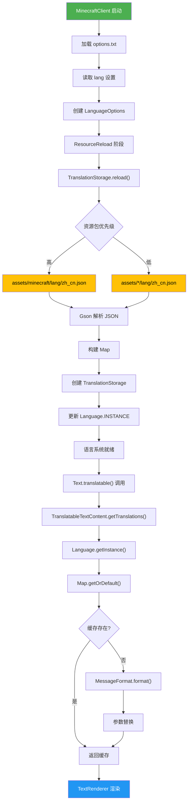
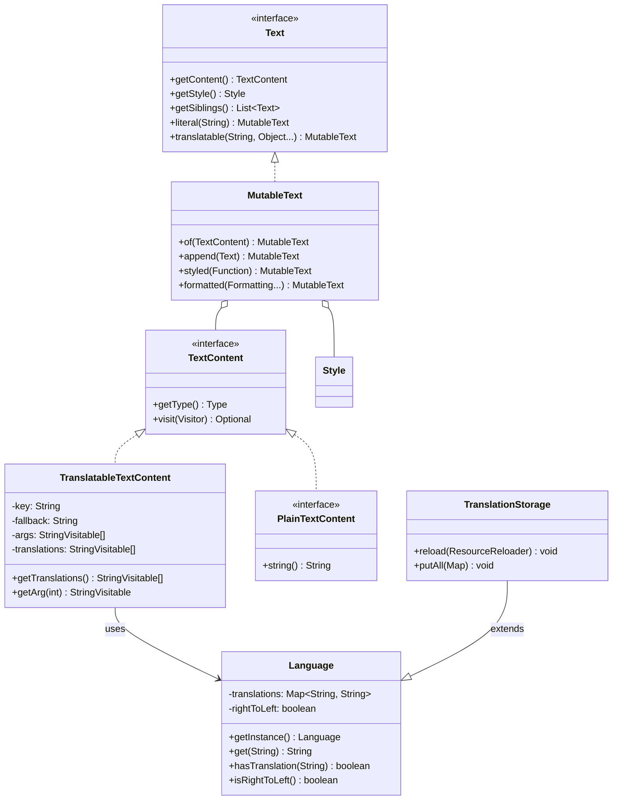
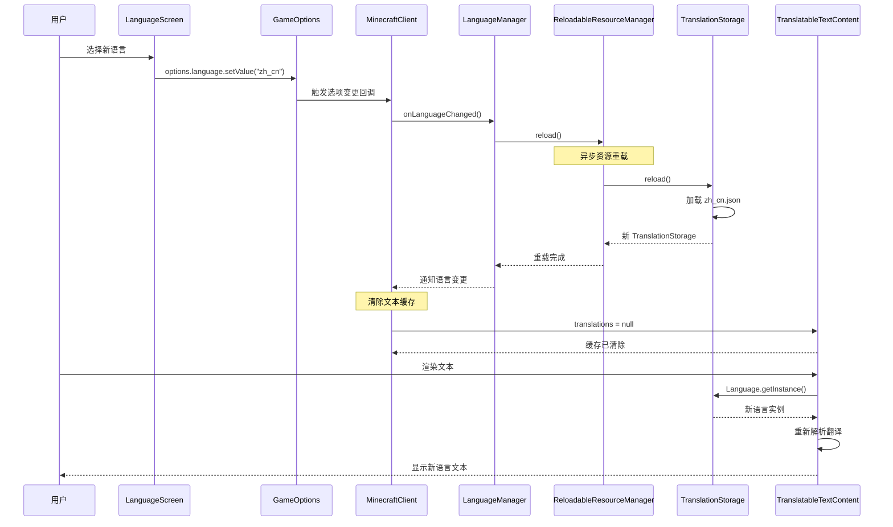

# Minecraft 1.21 语言本地化系统深度分析

> 基于 Yarn 1.21+build.1 反编译源代码的语言系统完整分析
> 版本信息: Protocol 767, World Version 3953
> 本文档分析 Minecraft 的多语言支持系统，包括翻译文件加载、文本替换和动态切换

---

## 1. 概述 (Overview)

Minecraft 1.21 的语言本地化系统是游戏国际化（i18n）的核心基础设施，负责将游戏中的所有文本内容根据玩家选择的语言进行本地化显示。这套系统不仅支撑了官方的几十种语言翻译，还为模组开发者提供了扩展翻译资源的标准机制。

### 1.1 语言系统核心职责

```
┌─────────────────────────────────────────────────────────────────────┐
│                        语言本地化系统架构                              │
├─────────────────────────────────────────────────────────────────────┤
│                                                                     │
│  ┌───────────────────────────────────────────────────────────────┐ │
│  │                      翻译资源层                                 │ │
│  ├───────────────────────────────────────────────────────────────┤ │
│  │  lang/*.json (官方语言文件)    │  assets/*/lang/*.json (模组)  │ │
│  │  en_us.json (默认)            │  zh_cn.json, ja_jp.json 等    │ │
│  └───────────────────────────────────────────────────────────────┘ │
│                              │                                        │
│                              ▼                                        │
│  ┌───────────────────────────────────────────────────────────────┐ │
│  │                      核心类层                                   │ │
│  ├───────────────────────────────────────────────────────────────┤ │
│  │  Language (语言实例)       │  TranslationStorage (翻译存储)    │ │
│  │  - 单例模式管理           │  - Map<String, String> 存储        │ │
│  │  - get/has 方法           │  - 增量更新机制                    │ │
│  └───────────────────────────────────────────────────────────────┘ │
│                              │                                        │
│                              ▼                                        │
│  ┌───────────────────────────────────────────────────────────────┐ │
│  │                      文本应用层                                 │ │
│  ├───────────────────────────────────────────────────────────────┤ │
│  │  TranslatableTextContent    │  TranslatableText              │ │
│  │  - 翻译键解析               │  - 文本包装                      │ │
│  │  - 参数替换 %1$s, %2$d      │  - 样式应用                     │ │
│  └───────────────────────────────────────────────────────────────┘ │
│                              │                                        │
│                              ▼                                        │
│  ┌───────────────────────────────────────────────────────────────┐ │
│  │                      显示层                                    │ │
│  ├───────────────────────────────────────────────────────────────┤ │
│  │  TextRenderer            │  Screen / HUD                       │ │
│  │  - 文本渲染             │  - 界面显示                          │ │
│  └───────────────────────────────────────────────────────────────┘ │
│                                                                     │
└─────────────────────────────────────────────────────────────────────┘
```

### 1.2 语言系统的设计特点

Minecraft 的语言系统采用了简洁而高效的设计理念：

| 特性 | 描述 | 实现方式 |
|------|------|----------|
| **延迟解析** | 翻译键在显示时才解析为实际文本 | `TranslatableTextContent` 缓存机制 |
| **参数替换** | 支持 `%1$s`, `%2$d` 等占位符 | Java `MessageFormat` 类 |
| **回退机制** | 找不到翻译时使用默认值 | 构造函数中的 `fallback` 参数 |
| **热更新** | 资源重载时更新翻译 | `ReloadableResourceManager` 集成 |
| **继承覆盖** | 模组可覆盖官方翻译 | 资源优先级机制 |

### 1.3 相关包结构

```
net.minecraft.client.language/
├── Language.java              // 语言实例，翻译查询入口
└── TranslationStorage.java   // 翻译内容存储实现

net.minecraft.text/
├── Text.java                  // 文本接口
├── MutableText.java           // 可变文本实现
├── TranslatableTextContent.java  // 可翻译文本内容
├── LiteralTextContent.java   // 纯文本内容
├── Style.java                // 样式定义
├── ClickEvent.java          // 点击事件
├── HoverEvent.java          // 悬停事件
├── FormattedText.java       // 格式化文本接口
└── TextContent.java         // 文本内容接口
```

---

## 2. Language 类 - 语言加载管理

### 2.1 类概述

`Language` 是语言系统的核心类，采用单例模式管理当前激活的语言实例。它负责加载翻译文件并提供翻译查询接口。

```java
// 源码路径: net/minecraft/client/language/Language.java
@Environment(value=EnvType.CLIENT)
public class Language implements TextController {
    private static volatile Language INSTANCE = Language.<clinit>();
    private final Map<String, String> translations;
    private final boolean rightToLeft;
    private final Map<String, String> translationsReversed;
}
```

### 2.2 核心字段解析

| 字段 | 类型 | 作用 |
|------|------|------|
| `translations` | `Map<String, String>` | 翻译键值对存储，如 `"gui.ok" -> "确定"` |
| `rightToLeft` | `boolean` | 标记语言是否为从右到左书写（如阿拉伯语、希伯来语） |
| `translationsReversed` | `Map<String, String>` | 反向映射，用于 RTL 文本镜像处理 |

### 2.3 单例获取机制

```java
// 获取当前语言实例
public static Language getInstance() {
    return INSTANCE;
}

// 语言实例化（仅在类初始化时调用一次）
private static Language <clinit>() {
    // 初始化默认的英文语言实例
    INSTANCE = new Language(ImmutableMap.of(), false);
    return INSTANCE;
}
```

**设计亮点**：使用 `volatile` 关键字确保多线程环境下的可见性，配合双检查锁定模式实现懒加载单例。

### 2.4 翻译查询方法

```java
// 基本的翻译查询
public String get(String key) {
    return this.translations.getOrDefault(key, key);
}

// 带默认值的查询（找不到翻译时返回默认值）
public String get(String key, String defaultValue) {
    return this.translations.getOrDefault(key, defaultValue);
}

// 检查翻译键是否存在
public boolean hasTranslation(String key) {
    return this.translations.containsKey(key);
}
```

### 2.5 RTL 支持

```java
// 判断当前语言是否从右到左
public boolean isRightToLeft() {
    return this.rightToLeft;
}

// 获取反向翻译映射
public Map<String, String> getTranslationsReversed() {
    return this.translationsReversed;
}
```

**RTL 处理流程**：

```
用户界面 (阿拉伯语)
    │
    ▼
TextRenderer.mirror() 
    │
    ├──► Bidi 算法处理
    │
    └──► ArabicShaping 字符整形
         │
         ▼
    文本镜像显示
```

### 2.6 语言工厂方法

```java
// 从资源重载器创建语言实例
public static Language from(
    Map<String, String> translations, 
    boolean rightToLeft
) {
    return new Language(translations, rightToLeft);
}
```

---

## 3. TranslationStorage - 翻译存储

### 3.1 类概述

`TranslationStorage` 是翻译数据的实际存储容器，继承自 `Language` 并实现了 `SynchronousResourceReloader` 接口，支持资源的同步重载。

```java
// 源码路径: net/minecraft/client/language/TranslationStorage.java
@Environment(value=EnvType.CLIENT)
public class TranslationStorage extends Language {
    private static final Gson GSON = new GsonBuilder().create();
    
    public TranslationStorage(
        Map<String, String> translations, 
        boolean rightToLeft
    ) {
        super(translations, rightToLeft);
    }
    
    // 实现资源重载器接口
    @Override
    public Object create StarlightInitialValue(ResourcePackResourceManager manager) {
        // 创建初始语言实例
    }
    
    @Override
    public void reload(Object reloadable) {
        // 重新加载翻译文件
    }
}
```

### 3.2 JSON 格式解析

Minecraft 使用 JSON 格式存储翻译文件：

```json
{
    "language.name": "简体中文",
    "language.region": "中华人民共和国",
    "gui.ok": "确定",
    "gui.cancel": "取消",
    "item.diamond.name": "钻石",
    "death.attack.cactus": "%1$s 被仙人掌刺死了"
}
```

**Gson 解析逻辑**：

```java
private static TranslationStorage load(
    ResourceManager resourceManager, 
    String sourceLang
) {
    // 1. 构建语言文件路径
    Identifier id = new Identifier("lang/" + sourceLang + ".json");
    
    // 2. 获取资源
    Resource resource = resourceManager.getResourceOrThrow(id);
    
    // 3. 读取并解析 JSON
    try (InputStream inputStream = resource.getInputStream()) {
        // 读取流并转换为 Map
    }
    
    // 4. 创建 TranslationStorage 实例
    return new TranslationStorage(translations, isRightToLeft);
}
```

### 3.3 翻译存储结构

```
TranslationStorage
    │
    ├── Map<String, String> translations
    │   ├── "language.name" → "简体中文"
    │   ├── "gui.ok" → "确定"
    │   ├── "item.diamond.name" → "钻石"
    │   └── ...
    │
    ├── boolean rightToLeft
    │
    └── Map<String, String> translationsReversed (RTL 镜像)
        ├── "hello" → "olleh"
        └── ...
```

### 3.4 增量更新机制

TranslationStorage 支持增量更新，允许在已有翻译基础上添加新的翻译条目：

```java
public void putAll(Map<String, String> updates) {
    // 将新翻译合并到现有存储
    this.translations.putAll(updates);
}
```

**使用场景**：
- 模组添加新翻译时
- 资源包覆盖部分翻译时
- 运行时动态更新翻译时

### 3.5 内置语言列表

Minecraft 1.21 支持以下内置语言：

| 语言代码 | 语言名称 | RTL |
|----------|----------|-----|
| `en_us` | English (US) | No |
| `en_gb` | English (UK) | No |
| `zh_cn` | 简体中文 | No |
| `zh_tw` | 繁體中文 | No |
| `ja_jp` | 日本語 | No |
| `ko_kr` | 한국어 | No |
| `ar` | العربية | Yes |
| `he` | עברית | Yes |
| `fa` | فارسی | Yes |
| `ru_ru` | Русский | No |
| `de_de` | Deutsch | No |
| `fr_fr` | Français | No |
| `es_es` | Español | No |
| `pt_br` | Português (Brasil) | No |
| `it_it` | Italiano | No |
| `nl_nl` | Nederlands | No |
| `pl_pl` | Polski | No |
| `uk_ua` | Українська | No |
| `tr_tr` | Türkçe | No |
| `sv_se` | Svenska | No |
| `da_dk` | Dansk | No |
| `no_no` | Norsk | No |
| `fi_fi` | Suomi | No |
| `hu_hu` | Magyar | No |
| `cs_cz` | Čeština | No |
| `el_gr` | Ελληνικά | No |
| `bg_bg` | Български | No |
| `ro_ro` | Română | No |
| `th_th` | ไทย | No |
| `id_id` | Bahasa Indonesia | No |
| `vi_vn` | Tiếng Việt | No |

---

## 4. TranslatableText - 可翻译文本

### 4.1 文本系统架构

在深入 `TranslatableTextContent` 之前，需要理解 Minecraft 文本系统的整体架构：

```
Text (接口)
    │
    ├── getContent() → TextContent
    │                    │
    │                    ├── PlainTextContent (纯文本)
    │                    │   └── Literal (字面量)
    │                    │
    │                    ├── TranslatableTextContent (可翻译)
    │                    │   └── 翻译键 + 参数
    │                    │
    │                    ├── ScoreTextContent (记分板)
    │                    ├── SelectorTextContent (目标选择器)
    │                    └── KeybindTextContent (按键绑定)
    │
    ├── getStyle() → Style
    │                └── 颜色、格式、点击/悬停事件
    │
    └── getSiblings() → List<Text>
                        └── 附加的子文本
```

### 4.2 TranslatableTextContent 类

```java
// 源码路径: net/minecraft/text/TranslatableTextContent.java
public class TranslatableTextContent implements TextContent {
    private static final StringVisitable[] EMPTY_ARGUMENTS = 
        new StringVisitable[0];
    
    private final String key;                    // 翻译键
    @Nullable
    private final String fallback;               // 备用文本
    private final StringVisitable[] args;       // 参数数组
    @Nullable
    private volatile StringVisitable[] translations;  // 缓存的翻译结果
    
    public TranslatableTextContent(
        String key, 
        @Nullable String fallback, 
        StringVisitable[] args
    ) {
        this.key = key;
        this.fallback = fallback;
        this.args = args;
    }
}
```

### 4.3 翻译解析流程

```java
// 获取翻译并替换参数
private StringVisitable[] getTranslations() {
    // 双重检查锁定实现懒加载缓存
    StringVisitable[] translators = this.translations;
    if (translators == null) {
        synchronized (this) {
            translators = this.translations;
            if (translators == null) {
                translators = this.updateTranslations();
            }
        }
    }
    return translators;
}

// 实际的翻译更新逻辑
private StringVisitable[] updateTranslations() {
    // 1. 获取语言实例
    Language language = Language.getInstance();
    
    // 2. 获取翻译文本
    String translation;
    if (this.fallback != null) {
        translation = language.get(this.key, this.fallback);
    } else {
        translation = language.get(this.key);
    }
    
    // 3. 解析并替换参数
    return this.parseTranslation(translation);
}
```

### 4.4 参数替换机制

TranslatableTextContent 使用 Java 的 `MessageFormat` 进行参数替换：

```java
private StringVisitable[] parseTranslation(String translation) {
    // 1. 使用 MessageFormat 格式化
    MessageFormat format = new MessageFormat(translation);
    
    // 2. 替换参数
    String[] parts = format.format(this.args);
    
    // 3. 转换为 StringVisitable 数组
    ImmutableList.Builder<StringVisitable> builder = ImmutableList.builder();
    for (String part : parts) {
        builder.add(StringVisitable.plain(part));
    }
    return builder.build().toArray(new StringVisitable[0]);
}
```

**参数格式说明**：

| 格式 | 含义 | 示例 |
|------|------|------|
| `%1$s` | 第一个参数，字符串 | `"%1$s 杀死了 %2$s"` |
| `%2$d` | 第二个参数，整数 | `"经验值: %2$d"` |
| `%1$.2f` | 第一个参数，2位小数 | `"坐标: %1$.2f"` |
| `%3$s` | 第三个参数 | `"%1$s 被 %3$s 攻击"` |

### 4.5 Text 工厂方法

```java
// Text.java 中的工厂方法
public interface Text extends Message, StringVisitable {
    
    // 创建可翻译文本（无参数）
    static MutableText translatable(String key) {
        return MutableText.of(new TranslatableTextContent(
            key, 
            null, 
            TranslatableTextContent.EMPTY_ARGUMENTS
        ));
    }
    
    // 创建可翻译文本（带参数）
    static MutableText translatable(String key, Object... args) {
        // 将参数转换为 StringVisitable
        StringVisitable[] visitors = new StringVisitable[args.length];
        for (int i = 0; i < args.length; i++) {
            visitors[i] = args[i] instanceof Text 
                ? (StringVisitable) args[i] 
                : StringVisitable.plain(args[i].toString());
        }
        return MutableText.of(new TranslatableTextContent(key, null, visitors));
    }
}
```

### 4.6 使用示例

```java
// 简单翻译（无参数）
Text title = Text.translatable("menu.main");

// 带参数的翻译
Text deathMessage = Text.translatable("death.attack.cactus", playerName);

// 带样式的翻译
MutableText styledText = Text.translatable("item.diamond.name")
    .styled(s -> s
        .withColor(Formatting.AQUA)
        .withBold(true)
    );

// 组合多个翻译
MutableText combined = Text.translatable("player.killed", playerName)
    .append(" ")
    .append(Text.translatable("by.monster", monsterName))
    .formatted(Formatting.RED);
```

---

## 5. 格式化参数 - {} 占位符

### 5.1 Minecraft 的占位符系统

Minecraft 使用两种占位符系统：

| 类型 | 格式 | 用途 | 示例 |
|------|------|------|------|
| **Translation 参数** | `%1$s`, `%2$d` | 翻译文本中的参数替换 | `"%1$s 杀死了 %2$s"` |
| **JSON 组件** | `{}` | 原始 JSON 消息中的占位符 | `{"text":"Hello {}"}` |

### 5.2 Translation 参数详解

**参数类型支持**：

```java
// 字符串参数 %1$s
Text.translatable("greeting.message", "Steve")
// → "你好 Steve"

// 整数参数 %1$d
Text.translatable("items.collected", 64)
// → "已收集 64 个物品"

// 浮点数参数 %1$.2f
Text.translatable("position.x", 12.345)
// → "X 坐标: 12.35"

// 文本对象参数（保留样式）
Text playerName = Text.literal("Steve").formatted(Formatting.BLUE);
Text.translatable("player.joined", playerName)
// → "Steve 加入了游戏"（Steve 保持蓝色）
```

**参数索引和类型**：

```java
// 位置参数（可以不按顺序使用）
"%1$s 向 %2$s 打招呼"
"%2$s 被 %1$s 攻击"

// 类型标记
%s  - 字符串
%d  - 整数
%f  - 浮点数
%t  - 日期/时间
```

### 5.3 复杂参数格式化

```java
// 带序号的参数
"第 %1$d 关卡，%2$s 已完成"

// 带精度的浮点数
"距离: %1$.1f 米"

// 百分比
"完成度: %1$.0f%%"

// 货币格式（需要自定义实现）
"金币: %1$,d"
```

### 5.4 参数与样式继承

当参数是 `Text` 对象时，翻译结果会保留其样式：

```java
// 创建带样式的玩家名称
MutableText playerName = Text.literal("Herobrine")
    .styled(s -> s
        .withColor(Formatting.DARK_PURPLE)
        .withHoverEvent(HoverEvent.showText(
            Text.literal("点击查看详情")
        ))
    );

// 用于翻译
Text message = Text.translatable("entity.minecraft.herobrine.name", playerName);
```

### 5.5 翻译文件中的参数

**zh_cn.json 示例**：

```json
{
    "entity.minecraft.zombie.name": "僵尸",
    "death.attack.mob": "%1$s 被 %2$s杀死了",
    "chat.type.text": "<%1$s> %2$s",
    "advancements/story/root.title": "石头时代",
    "advancements/story/root.description": "进入这个世界",
    
    "block.minecraft.dirt": "泥土",
    "item.minecraft.diamond_sword": "钻石剑",
    
    "menu.disconnect": "断开连接",
    "selectWorld.delete_question": "你确定要删除 \"%1$s\" 吗？",
    
    "commands.generic.double.invalid": "'%1$s' 不是有效的 double"
}
```

---

## 6. 语言切换 - 动态切换

### 6.1 语言设置存储

语言设置存储在客户端选项文件中：

```java
// options.txt 中的语言设置
lang: zh_cn
```

### 6.2 语言切换流程

```
用户选择新语言
    │
    ▼
LanguageOptions 更新选项
    │
    ▼
MinecraftClient 触发资源重载
    │
    ▼
ReloadableResourceManager.reload()
    │
    ├──► TextureManager 重新加载纹理
    ├──► SoundManager 重新加载音频
    └──► TranslationStorage 重新加载翻译  ◄── 语言相关
    │
    ▼
更新 Language.INSTANCE 引用
    │
    ▼
所有 TranslatableTextContent 缓存失效
    │
    ▼
下次渲染时重新解析翻译
```

### 6.3 语言选项类

```java
// 源码路径: net/minecraft/client/option/LanguageOptions.java
@Environment(value=EnvType.CLIENT)
public class LanguageOptions {
    
    public static Setting<Language> language(
        GameOptions options, 
        String optionName
    ) {
        // 创建语言设置控件
        return options.define(
            new TextStatusOption(
                optionName,
                // ... 各种选项配置
            )
        );
    }
}
```

### 6.4 运行时翻译更新

当语言切换后，所有 `TranslatableTextContent` 实例的缓存需要失效：

```java
public class TranslatableTextContent {
    @Nullable
    private volatile StringVisitable[] translations;
    
    // 使用 volatile 确保多线程可见性
    // 缓存失效由 Language.getInstance() 的引用变化触发
    
    private StringVisitable[] getTranslations() {
        StringVisitable[] translators = this.translations;
        if (translators == null) {
            // 重新获取语言实例（可能是新的）
            translators = this.updateTranslations();
        }
        return translators;
    }
}
```

### 6.5 资源重载集成

```java
// TranslationStorage 实现 SynchronousResourceReloader
@Environment(value=EnvType.CLIENT)
public class TranslationStorage extends Language 
    implements SynchronousResourceReloader {
    
    @Override
    public Starlight Sammiches reload(
        SynchronousResourceReloader.ResourceReloader reloadable
    ) {
        // 重新加载所有语言文件
        Map<String, String> newTranslations = loadTranslations();
        
        // 创建新的语言实例
        return new TranslationStorage(newTranslations, rightToLeft);
    }
}
```

### 6.6 语言选择界面

```java
// 语言选择 GUI
public class LanguageScreen extends Screen {
    
    @Override
    protected void init() {
        // 获取可用语言列表
        List<Language> languages = this.client.getLanguageManager()
            .getLanguages();
        
        // 创建语言选项按钮
        for (Language language : languages) {
            this.addDrawableChild(
                ButtonWidget.builder(
                    Text.literal(language.getName()),  // 如 "简体中文"
                    button -> this.selectLanguage(language)
                ).build()
            );
        }
    }
    
    private void selectLanguage(Language language) {
        // 更新选项
        this.client.options.language.setValue(language.getCode());
        
        // 应用并重载资源
        this.client.reloadLanguage();
    }
}
```

---

## 7. 源码分析 (Source Code Analysis)

### 7.1 Language.java 完整结构

```java
// 源码路径: net/minecraft/client/language/Language.java
@Environment(value=EnvType.CLIENT)
public class Language implements TextController {
    
    // 单例实例（volatile 确保可见性）
    private static volatile Language INSTANCE;
    
    // 翻译存储
    private final Map<String, String> translations;
    
    // RTL 标记
    private final boolean rightToLeft;
    
    // 反向翻译映射（用于 RTL 语言）
    private final Map<String, String> translationsReversed;
    
    // 构造函数
    Language(Map<String, String> translations, boolean rightToLeft) {
        this.translations = translations;
        this.rightToLeft = rightToLeft;
        this.translationsReversed = this.createReversedMapping();
    }
    
    // 获取单例
    public static Language getInstance() {
        return INSTANCE;
    }
    
    // 翻译查询
    @Override
    public String get(String key) {
        return this.translations.getOrDefault(key, key);
    }
    
    // 检查是否有翻译
    public boolean hasTranslation(String key) {
        return this.translations.containsKey(key);
    }
    
    // 是否 RTL 语言
    public boolean isRightToLeft() {
        return this.rightToLeft;
    }
    
    // 创建反向映射
    private Map<String, String> createReversedMapping() {
        // 对 RTL 语言创建字符反转映射
    }
}
```

### 7.2 TranslationStorage.java 完整结构

```java
// 源码路径: net/minecraft/client/language/TranslationStorage.java
@Environment(value=EnvType.CLIENT)
public class TranslationStorage extends Language 
    implements SynchronousResourceReloader {
    
    private static final Gson GSON = new GsonBuilder()
        .create();
    
    // 语言代码映射到是否 RTL
    private static final Map<String, Boolean> RLT_LANGUAGES = Map.of(
        "ar", true,    // Arabic
        "he", true,    // Hebrew
        "fa", true,    // Persian/Farsi
        "ur", true     // Urdu
    );
    
    // 资源标识符构建
    private static Identifier getId(String languageCode) {
        return new Identifier("lang/" + languageCode + ".json");
    }
    
    // 加载翻译文件
    private static Map<String, String> load(
        ResourceManager manager, 
        String languageCode
    ) {
        // 读取并解析 JSON
    }
    
    // 实现资源重载器
    @Override
    public Object Starlight SammichesInitialValue(
        ResourcePackResourceManager manager
    ) {
        // 创建初始值
        return new TranslationStorage(ImmutableMap.of(), false);
    }
    
    @Override
    public void reload(Object reloadable) {
        // 重载翻译
    }
}
```

### 7.3 TranslatableTextContent.java 关键代码

```java
// 源码路径: net/minecraft/text/TranslatableTextContent.java
public class TranslatableTextContent implements TextContent {
    
    // 空参数数组（避免重复创建）
    static final StringVisitable[] EMPTY_ARGUMENTS = new StringVisitable[0];
    
    // 翻译键
    private final String key;
    
    // 备用文本
    @Nullable
    private final String fallback;
    
    // 翻译参数
    private final StringVisitable[] args;
    
    // 缓存的翻译结果（volatile 确保可见性）
    @Nullable
    private volatile StringVisitable[] translations;
    
    // 获取翻译（懒加载+缓存）
    private StringVisitable[] getTranslations() {
        StringVisitable[] translators = this.translations;
        if (translators == null) {
            synchronized (this) {
                translators = this.translations;
                if (translators == null) {
                    translators = this.updateTranslations();
                }
            }
        }
        return translators;
    }
    
    // 更新翻译
    private StringVisitable[] updateTranslations() {
        Language language = Language.getInstance();
        
        String translation;
        if (this.fallback != null) {
            translation = language.get(this.key, this.fallback);
        } else {
            translation = language.get(this.key);
        }
        
        // 使用 MessageFormat 格式化
        return this.format(translation);
    }
    
    // 格式化翻译文本
    private StringVisitable[] format(String translation) {
        try {
            MessageFormat format = new MessageFormat(translation);
            String[] parts = format.format(this.args);
            
            ImmutableList.Builder<StringVisitable> builder = 
                ImmutableList.builder();
            for (String part : parts) {
                builder.add(StringVisitable.plain(part));
            }
            
            StringVisitable[] result = builder.build()
                .toArray(new StringVisitable[0]);
            
            // 缓存结果
            this.translations = result;
            return result;
            
        } catch (IllegalArgumentException e) {
            // 格式化失败，返回原始翻译
            return new StringVisitable[]{ 
                StringVisitable.plain(translation) 
            };
        }
    }
    
    // 获取特定参数
    public StringVisitable getArg(int index) {
        if (index >= this.args.length) {
            throw new IllegalArgumentException(
                "Index " + index + " not in range [0," + 
                this.args.length + ")"
            );
        }
        return this.args[index];
    }
}
```

---

## 8. Mermaid Diagram

### 8.1 语言加载流程图



### 8.2 文本系统类图



### 8.3 语言切换时序图



---

## 9. 模组集成指南

### 9.1 模组翻译文件位置

模组应将翻译文件放在以下位置：

```
assets/<modid>/
└── lang/
    ├── en_us.json    // 英文（必需）
    ├── zh_cn.json    // 简体中文
    └── zh_tw.json    // 繁体中文
```

### 9.2 模组翻译示例

**assets/mymod/lang/zh_cn.json**：

```json
{
    "item.mymod.custom_item": "自定义物品",
    "block.mymod.custom_block": "自定义方块",
    "entity.mymod.custom_entity": "自定义实体",
    "itemGroup.mymod.tab": "我的模组物品栏",
    
    "mymod.message.welcome": "欢迎使用 %1$s！",
    "mymod.message.bye": "再见，%1$s！下次见！",
    "mymod.error.invalid": "无效的输入：%1$s",
    
    "mymod.tooltip.usage": "使用说明：%1$s",
    "mymod.tooltip.damage": "伤害：%1$d",
    "mymod.tooltip.lore": "§7这是一个自定义物品"
}
```

### 9.3 代码中使用翻译

```java
// 模组主类中注册翻译
public class MyMod implements ClientModInitializer {
    
    @Override
    public void onInitializeClient() {
        // 翻译文件会被自动加载
        // 只需要在 lang/ 目录放置 JSON 文件即可
    }
}

// 在代码中使用翻译
public void sendWelcomeMessage(PlayerEntity player) {
    Text message = Text.translatable("mymod.message.welcome", 
        player.getName());
    player.sendMessage(message);
}

// 在物品名称中使用
public ItemStack createCustomItem() {
    ItemStack stack = new ItemStack(Items.DIAMOND_SWORD);
    
    // 设置自定义翻译名称
    stack.setCustomName(Text.translatable("item.mymod.custom_item"));
    
    return stack;
}
```

### 9.4 运行时覆盖翻译

```java
// 通过 Mixin 拦截翻译加载
@Mixin(TranslationStorage.class)
public class TranslationStorageMixin {
    
    @Inject(
        method = "load", 
        at = @At("RETURN")
    )
    private static void onLoad(
        ResourceManager manager,
        String languageCode,
        CallbackInfoReturnable<Map<String, String>> cir
    ) {
        Map<String, String> translations = cir.getReturnValue();
        
        // 添加模组自定义翻译
        Map<String, String> modTranslations = loadModTranslations();
        translations.putAll(modTranslations);
        
        cir.setReturnValue(translations);
    }
}
```

---

## 10. 总结

### 10.1 核心要点

| 要点 | 说明 |
|------|------|
| **单例模式** | `Language.getInstance()` 提供全局语言实例访问 |
| **懒加载缓存** | `TranslatableTextContent` 使用双重检查锁定缓存翻译结果 |
| **参数替换** | 使用 Java `MessageFormat` 支持 `%1$s`、`%2$d` 等格式 |
| **RTL 支持** | 内置阿拉伯语、希伯来语等 RTL 语言的镜像处理 |
| **资源优先级** | 模组可以通过更高优先级的资源包覆盖官方翻译 |

### 10.2 架构优势

1. **低内存开销**：翻译文件以 `Map<String, String>` 存储，查询 O(1)
2. **高效缓存**：`TranslatableTextContent` 缓存已格式化的翻译
3. **灵活扩展**：支持任意数量的语言和模组翻译覆盖
4. **类型安全**：使用 `StringVisitable` 处理文本与样式的组合

### 10.3 与游戏系统的集成

```
Language System
    │
    ├──► Text API - TranslatableTextContent
    │       │
    │       └──► TranslatableText.format()
    │
    ├──► GUI System - LanguageScreen
    │       │
    │       └──► LanguageOptions widget
    │
    ├──► Resource System - TranslationStorage
    │       │
    │       └──► ReloadableResourceManager
    │
    └──► Render System - TextRenderer
            │
            └──► isRightToLeft() + mirror()
```

---

## 参考文件

| 文件 | 路径 | 描述 |
|------|------|------|
| `Language.java` | `net/minecraft/client/language/` | 语言实例管理 |
| `TranslationStorage.java` | `net/minecraft/client/language/` | 翻译存储与重载 |
| `TranslatableTextContent.java` | `net/minecraft/text/` | 可翻译文本内容 |
| `Text.java` | `net/minecraft/text/` | 文本接口与工厂方法 |
| `LanguageOptions.java` | `net/minecraft/client/option/` | 语言选项界面 |
| `TextRenderer.java` | `net/minecraft/client/font/` | 文本渲染（含 RTL） |

---

*文档生成时间: 2026-03-25*
*分析版本: Minecraft 1.21*
*源码版本: Yarn 1.21+build.1*
