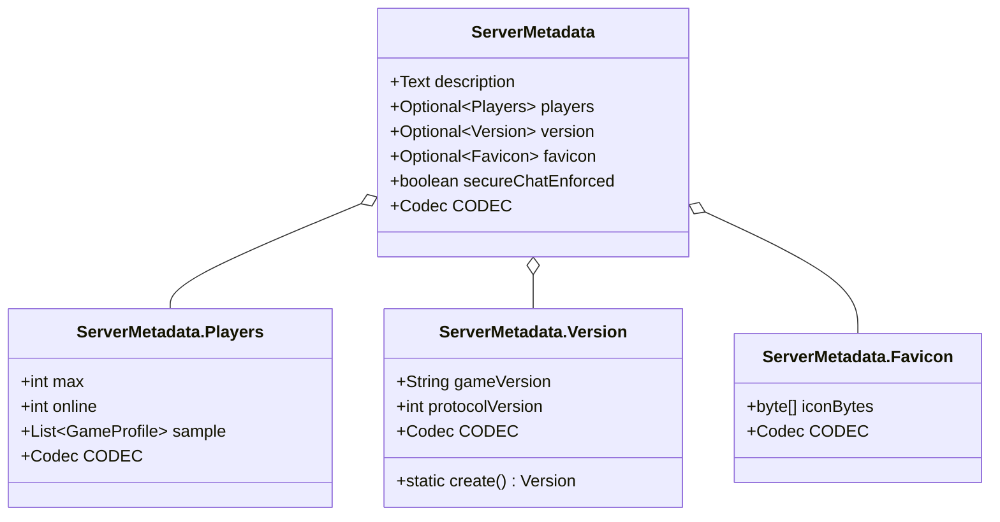
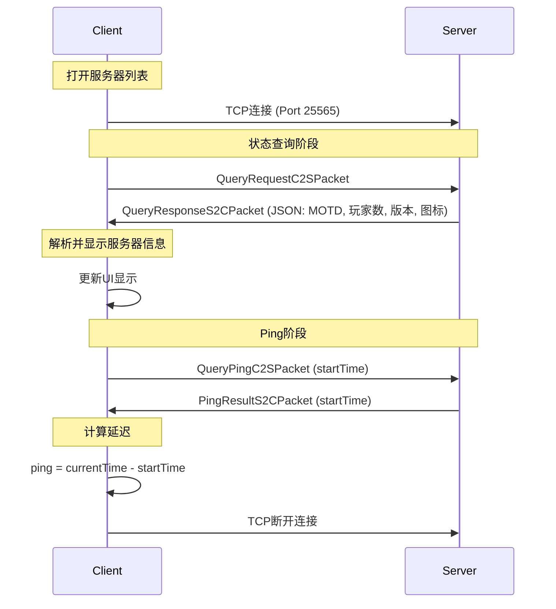
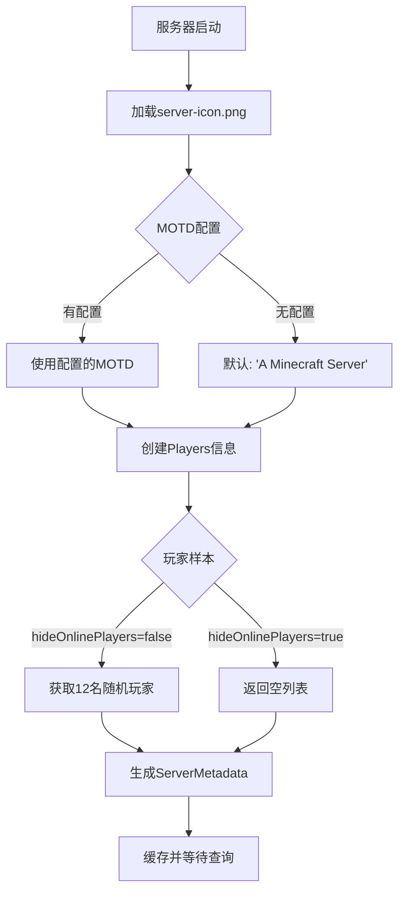
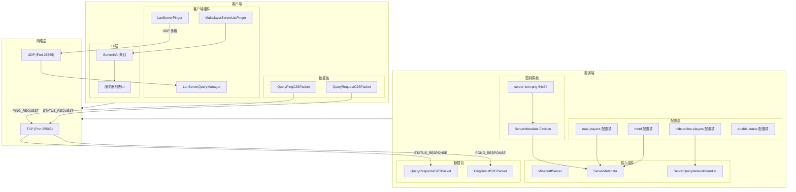

# 服务器状态系统 (Server Status System)

> 分析基于 Minecraft 1.21 反编译源代码 (CFR 0.2.2)
> 版本信息: Protocol 767

---

## 1. 概述

服务器状态系统是 Minecraft 网络通信基础设施的重要组成部分，负责向客户端提供服务器的元数据信息。当玩家在多人游戏菜单中浏览服务器列表时，系统会显示服务器名称（MOTD）、在线玩家数量、最大玩家容量、服务器图标以及延迟（Ping）等信息。

Minecraft 1.21 的服务器状态系统包含以下几个核心组件：

| 组件 | 位置 | 职责 |
|------|------|------|
| `ServerMetadata` | `net.minecraft.server` | 服务器元数据数据模型 |
| `ServerQueryNetworkHandler` | `net.minecraft.server.network` | 处理状态查询请求的服务端处理器 |
| `QueryResponseS2CPacket` | `net.minecraft.network.packet.s2c.query` | 状态响应数据包 |
| `QueryPingC2SPacket` | `net.minecraft.network.packet.c2s.query` | Ping 请求数据包 |
| `PingResultS2CPacket` | `net.minecraft.network.packet.s2c.query` | Ping 响应数据包 |
| `MultiplayerServerListPinger` | `net.minecraft.client.network` | 客户端服务器列表 Ping 器 |

---

## 2. ServerMetadata - 服务器元数据

`ServerMetadata` 是服务器状态系统的核心数据模型，使用 Java Record 实现，包含服务器向客户端展示的所有元信息。

```1:58:assets/mc/1.21/net/minecraft/server/ServerMetadata.java
public record ServerMetadata(Text description, Optional<Players> players, Optional<Version> version, Optional<Favicon> favicon, boolean secureChatEnforced) {
    public static final Codec<ServerMetadata> CODEC = RecordCodecBuilder.create(instance -> instance.group(TextCodecs.CODEC.lenientOptionalFieldOf("description", ScreenTexts.EMPTY).forGetter(ServerMetadata::description), Players.CODEC.lenientOptionalFieldOf("players").forGetter(ServerMetadata::players), Version.CODEC.lenientOptionalFieldOf("version").forGetter(ServerMetadata::version), Favicon.CODEC.lenientOptionalFieldOf("favicon").forGetter(ServerMetadata::favicon), Codec.BOOL.lenientOptionalFieldOf("enforcesSecureChat", false).forGetter(ServerMetadata::secureChatEnforced)).apply((Applicative<ServerMetadata, ?>)instance, ServerMetadata::new));
```

### 2.1 Players - 在线玩家信息

`Players` 内部 Record 封装了服务器的在线玩家统计信息和样本玩家列表：

```29:32:assets/mc/1.21/net/minecraft/server/ServerMetadata.java
public record Players(int max, int online, List<GameProfile> sample) {
    private static final Codec<GameProfile> GAME_PROFILE_CODEC = RecordCodecBuilder.create(instance -> instance.group(((MapCodec)Uuids.STRING_CODEC.fieldOf("id")).forGetter(GameProfile::getId), ((MapCodec)Codec.STRING.fieldOf("name")).forGetter(GameProfile::getName)).apply((Applicative<GameProfile, ?>)instance, GameProfile::new));
    public static final Codec<Players> CODEC = RecordCodecBuilder.create(instance -> instance.group(((MapCodec)Codec.INT.fieldOf("max")).forGetter(Players::max), ((MapCodec)Codec.INT.fieldOf("online")).forGetter(Players::online), GAME_PROFILE_CODEC.listOf().lenientOptionalFieldOf("sample", List.of()).forGetter(Players::sample)).apply((Applicative<Players, ?>)instance, Players::new));
}
```

字段说明：
- `max`: 服务器配置的最大玩家数量
- `online`: 当前在线玩家数量
- `sample`: 最近在线的玩家列表样本（最多 12 名），用于在服务器列表中显示

### 2.2 Version - 版本信息

`Version` 内部 Record 记录服务器的版本信息：

```34:41:assets/mc/1.21/net/minecraft/server/ServerMetadata.java
public record Version(String gameVersion, int protocolVersion) {
    public static final Codec<Version> CODEC = RecordCodecBuilder.create(instance -> instance.group(((MapCodec)Codec.STRING.fieldOf("name")).forGetter(Version::gameVersion), ((MapCodec)Codec.INT.fieldOf("protocol")).forGetter(Version::protocolVersion)).apply((Applicative<Version, ?>)instance, Version::create()));

    public static Version create() {
        GameVersion gameVersion = SharedConstants.getGameVersion();
        return new Version(gameVersion.getName(), gameVersion.getProtocolVersion());
    }
}
```

### 2.3 Favicon - 服务器图标

`Favicon` 内部 Record 存储 Base64 编码的服务器图标 PNG 数据：

```43:57:assets/mc/1.21/net/minecraft/server/ServerMetadata.java
public record Favicon(byte[] iconBytes) {
    private static final String DATA_URI_PREFIX = "data:image/png;base64,";
    public static final Codec<Favicon> CODEC = Codec.STRING.comapFlatMap(uri -> {
        if (!uri.startsWith(DATA_URI_PREFIX)) {
            return DataResult.error(() -> "Unknown format");
        }
        try {
            String string = uri.substring(DATA_URI_PREFIX.length()).replaceAll("\n", "");
            byte[] bs = Base64.getDecoder().decode(string.getBytes(StandardCharsets.UTF_8));
            return DataResult.success(new Favicon(bs));
        } catch (IllegalArgumentException illegalArgumentException) {
            return DataResult.error(() -> "Malformed base64 server icon");
        }
    }, iconBytes -> DATA_URI_PREFIX + new String(Base64.getEncoder().encode(iconBytes.iconBytes), StandardCharsets.UTF_8));
}
```

---

## 3. 服务端状态处理

### 3.1 ServerQueryNetworkHandler - 状态请求处理器

`ServerQueryNetworkHandler` 是服务端处理状态查询的核心类，它实现了 `ServerQueryPacketListener` 接口：

```16:52:assets/mc/1.21/net/minecraft/server/network/ServerQueryNetworkHandler.java
public class ServerQueryNetworkHandler
implements ServerQueryPacketListener {
    private static final Text REQUEST_HANDLED = Text.translatable("multiplayer.status.request_handled");
    private final ServerMetadata metadata;
    private final ClientConnection connection;
    private boolean responseSent;

    public ServerQueryNetworkHandler(ServerMetadata metadata, ClientConnection connection) {
        this.metadata = metadata;
        this.connection = connection;
    }

    @Override
    public void onRequest(QueryRequestC2SPacket packet) {
        if (this.responseSent) {
            this.connection.disconnect(REQUEST_HANDLED);
            return;
        }
        this.responseSent = true;
        this.connection.send(new QueryResponseS2CPacket(this.metadata));
    }

    @Override
    public void onQueryPing(QueryPingC2SPacket packet) {
        this.connection.send(new PingResultS2CPacket(packet.getStartTime()));
        this.connection.disconnect(REQUEST_HANDLED);
    }
}
```

关键设计点：
- `responseSent` 标志位确保每个连接只能请求一次状态信息
- 收到 `QueryRequestC2SPacket` 时发送 `QueryResponseS2CPacket`
- 收到 `QueryPingC2SPacket` 时回送 `PingResultS2CPacket` 并关闭连接

### 3.2 元数据创建流程

`MinecraftServer` 在启动时创建并缓存 `ServerMetadata`：

```945:965:assets/mc/1.21/net/minecraft/server/MinecraftServer.java
private ServerMetadata createMetadata() {
    ServerMetadata.Players players = this.createMetadataPlayers();
    return new ServerMetadata(Text.of(this.motd), Optional.of(players), Optional.of(ServerMetadata.Version.create()), Optional.ofNullable(this.favicon), this.shouldEnforceSecureProfile());
}

private ServerMetadata.Players createMetadataPlayers() {
    List<ServerPlayerEntity> list = this.playerManager.getPlayerList();
    int i = this.getMaxPlayerCount();
    if (this.hideOnlinePlayers()) {
        return new ServerMetadata.Players(i, list.size(), List.of());
    }
    int j = Math.min(list.size(), 12);
    ObjectArrayList<GameProfile> objectArrayList = new ObjectArrayList<GameProfile>(j);
        objectArrayList.add(serverPlayerEntity.allowsServerListing() ? serverPlayerEntity.getGameProfile() : ANONYMOUS_PLAYER_PROFILE);
    }
    Util.shuffle(objectArrayList, this.random);
    return new ServerMetadata.Players(i, list.size(), objectArrayList);
}
```

重要特性：
- 当 `hideOnlinePlayers` 配置为 `true` 时，不返回玩家样本列表
- 玩家样本最多包含 12 名玩家
- 通过 `allowsServerListing()` 检查玩家是否允许被列入服务器列表
- 样本列表使用随机顺序，使用 `Util.shuffle()` 打乱

### 3.3 服务器图标加载

```852:864:assets/mc/1.21/net/minecraft/server/MinecraftServer.java
private Optional<ServerMetadata.Favicon> loadFavicon() {
    Optional<Path> optional = Optional.of(this.getPath("server-icon.png")).filter(path -> Files.isRegularFile(path, new LinkOption[0])).or(() -> this.session.getIconFile().filter(path -> Files.isRegularFile(path, new LinkOption[0])));
    return optional.flatMap(path -> {
        try {
            Preconditions.checkState(bufferedImage.getHeight() == 64, "Must be 64 pixels high");
            ByteArrayOutputStream byteArrayOutputStream = new ByteArrayOutputStream();
            ImageIO.write((RenderedImage)bufferedImage, "PNG", byteArrayOutputStream);
            return Optional.of(new ServerMetadata.Favicon(byteArrayOutputStream.toByteArray()));
        } catch (Exception exception) {
            LOGGER.error("Couldn't load server icon", exception);
            return Optional.empty();
        }
    });
}
```

服务器图标必须满足：
- 格式：PNG
- 尺寸：64x64 像素
- 文件名：`server-icon.png`
- 位置：服务端根目录或世界保存目录

---

## 4. 客户端状态处理

### 4.1 MultiplayerServerListPinger - 服务器列表 Ping 器

`MultiplayerServerListPinger` 是客户端用于 Ping 服务器的核心类，负责获取和更新服务器列表中的状态信息：

```48:143:assets/mc/1.21/net/minecraft/client/network/MultiplayerServerListPinger.java
public void add(final ServerInfo entry, final Runnable saver, final Runnable pingCallback) throws UnknownHostException {
    final ServerAddress serverAddress = ServerAddress.parse(entry.address);
    Optional<InetSocketAddress> optional = AllowedAddressResolver.DEFAULT.resolve(serverAddress).map(Address::getInetSocketAddress);
    if (optional.isEmpty()) {
        this.showError(ConnectScreen.UNKNOWN_HOST_TEXT, entry);
        return;
    }
    final InetSocketAddress inetSocketAddress = optional.get();
    final ClientConnection clientConnection = ClientConnection.connect(inetSocketAddress, false, null);
    this.clientConnections.add(clientConnection);
    entry.label = Text.translatable("multiplayer.status.pinging");
    entry.playerListSummary = Collections.emptyList();
    ClientQueryPacketListener clientQueryPacketListener = new ClientQueryPacketListener(){
        private boolean sentQuery;
        private boolean received;
        private long startTime;

        @Override
        public void onResponse(QueryResponseS2CPacket packet) {
            if (this.received) {
                clientConnection.disconnect(Text.translatable("multiplayer.status.unrequested"));
                return;
            }
            this.received = true;
            ServerMetadata serverMetadata = packet.metadata();
            entry.label = serverMetadata.description();
            serverMetadata.version().ifPresentOrElse(version -> {
                serverInfo.version = Text.literal(version.gameVersion());
                serverInfo.protocolVersion = version.protocolVersion();
            }, () -> {
                serverInfo.version = Text.translatable("multiplayer.status.old");
                serverInfo.protocolVersion = 0;
            });
            serverMetadata.players().ifPresentOrElse(players -> {
                serverInfo.playerCountLabel = MultiplayerServerListPinger.createPlayerCountText(players.online(), players.max());
                serverInfo.players = players;
                if (!players.sample().isEmpty()) {
                    ArrayList<Text> list = new ArrayList<Text>(players.sample().size());
                    for (GameProfile gameProfile : players.sample()) {
                        list.add(Text.literal(gameProfile.getName()));
                    }
                    if (players.sample().size() < players.online()) {
                        list.add(Text.translatable("multiplayer.status.and_more", players.online() - players.sample().size()));
                    }
                    serverInfo.playerListSummary = list;
                } else {
                    serverInfo.playerListSummary = List.of();
                }
            }, () -> {
                serverInfo.playerCountLabel = Text.translatable("multiplayer.status.unknown").formatted(Formatting.DARK_GRAY);
            });
            serverMetadata.favicon().ifPresent(favicon -> {
                if (!Arrays.equals(favicon.iconBytes(), entry.getFavicon())) {
                    entry.setFavicon(ServerInfo.validateFavicon(favicon.iconBytes()));
                    saver.run();
                }
            });
            this.startTime = Util.getMeasuringTimeMs();
            clientConnection.send(new QueryPingC2SPacket(this.startTime));
            this.sentQuery = true;
        }
```

Ping 流程：
1. 解析服务器地址
2. 建立 TCP 连接
3. 发送 `QueryRequestC2SPacket`
4. 接收并解析 `QueryResponseS2CPacket`
5. 发送 `QueryPingC2SPacket`（包含当前时间戳）
6. 接收 `PingResultS2CPacket` 并计算延迟

---

## 5. Ping 流程 - 延迟测量

Ping 测量用于确定客户端与服务器之间的网络延迟：

```48:50:assets/mc/1.21/net/minecraft/server/network/ServerQueryNetworkHandler.java
@Override
public void onQueryPing(QueryPingC2SPacket packet) {
    this.connection.send(new PingResultS2CPacket(packet.getStartTime()));
    this.connection.disconnect(REQUEST_HANDLED);
}
```

```115:122:assets/mc/1.21/net/minecraft/client/network/MultiplayerServerListPinger.java
@Override
public void onPingResult(PingResultS2CPacket packet) {
    long l = this.startTime;
    long m = Util.getMeasuringTimeMs();
    entry.ping = m - l;
    clientConnection.disconnect(Text.translatable("multiplayer.status.finished"));
    pingCallback.run();
}
```

延迟计算方式：
- 客户端发送 `QueryPingC2SPacket(startTime)`，其中 `startTime = Util.getMeasuringTimeMs()`
- 服务端原样返回 `PingResultS2CPacket(startTime)`
- 客户端计算 `ping = currentTime - startTime`

---

## 6. MOTD 支持 - 动态服务器列表

### 6.1 MOTD 配置

MOTD (Message of the Day) 在 `server.properties` 中配置：

```61:assets/mc/1.21/net/minecraft/server/dedicated/ServerPropertiesHandler.java
public final String motd = this.getString("motd", "A Minecraft Server");
```

### 6.2 LAN 服务器广播

`LanServerPinger` 使用 UDP 多播在本地网络中广播服务器信息：

```24:90:assets/mc/1.21/net/minecraft/client/network/LanServerPinger.java
public class LanServerPinger
extends Thread {
    private static final String PING_ADDRESS = "224.0.2.60";
    private static final int PING_PORT = 4445;
    private static final long PING_INTERVAL = 1500L;

    public static String createAnnouncement(String motd, String addressPort) {
        return "[MOTD]" + motd + "[/MOTD][AD]" + addressPort + "[/AD]";
    }

    public static String parseAnnouncementMotd(String announcement) {
        int i = announcement.indexOf("[MOTD]");
        if (i < 0) {
            return "missing no";
        }
        int j = announcement.indexOf("[/MOTD]", i + "[MOTD]".length());
        if (j < i) {
            return "missing no";
        }
        return announcement.substring(i + "[MOTD]".length(), j);
    }
```

LAN 广播格式：
```
[MOTD]<服务器名称>[/MOTD][AD]<地址:端口>[/AD]
```

广播每 1500 毫秒发送一次，地址为 `224.0.2.60:4445`（UDP 多播地址）。

---

## 7. 协议包格式

### 7.1 查询请求包 (C2S)

```13:30:assets/mc/1.21/net/minecraft/network/packet/c2s/query/QueryRequestC2SPacket.java
public class QueryRequestC2SPacket
implements Packet<ServerQueryPacketListener> {
    public static final QueryRequestC2SPacket INSTANCE = new QueryRequestC2SPacket();
    public static final PacketCodec<ByteBuf, QueryRequestC2SPacket> CODEC = PacketCodec.unit(INSTANCE);

    @Override
    public PacketType<QueryRequestC2SPacket> getPacketId() {
        return StatusPackets.STATUS_REQUEST;
    }
}
```

### 7.2 查询响应包 (S2C)

```14:35:assets/mc/1.21/net/minecraft/network/packet/s2c/query/QueryResponseS2CPacket.java
public record QueryResponseS2CPacket(ServerMetadata metadata) implements Packet<ClientQueryPacketListener>
{
    public static final PacketCodec<PacketByteBuf, QueryResponseS2CPacket> CODEC = Packet.createCodec(QueryResponseS2CPacket::write, QueryResponseS2CPacket::new);

    private QueryResponseS2CPacket(PacketByteBuf buf) {
        this(buf.decodeAsJson(ServerMetadata.CODEC));
    }

    private void write(PacketByteBuf buf) {
        buf.encodeAsJson(ServerMetadata.CODEC, this.metadata);
    }

    @Override
    public PacketType<QueryResponseS2CPacket> getPacketId() {
        return StatusPackets.STATUS_RESPONSE;
    }
}
```

响应数据以 JSON 格式编码，包含完整的 `ServerMetadata`。

### 7.3 Ping 请求包 (C2S)

```13:43:assets/mc/1.21/net/minecraft/network/packet/c2s/query/QueryPingC2SPacket.java
public class QueryPingC2SPacket
implements Packet<ServerQueryPingPacketListener> {
    private final long startTime;

    public QueryPingC2SPacket(long startTime) {
        this.startTime = startTime;
    }

    private QueryPingC2SPacket(ByteBuf buf) {
        this.startTime = buf.readLong();
    }

    private void write(ByteBuf buf) {
        buf.writeLong(this.startTime);
    }

    public long getStartTime() {
        return this.startTime;
    }
}
```

### 7.4 Ping 响应包 (S2C)

```13:34:assets/mc/1.21/net/minecraft/network/packet/s2c/query/PingResultS2CPacket.java
public record PingResultS2CPacket(long startTime) implements Packet<ClientPingResultPacketListener>
{
    public static final PacketCodec<PacketByteBuf, PingResultS2CPacket> CODEC = Packet.createCodec(PingResultS2CPacket::write, PingResultS2CPacket::new);

    private PingResultS2CPacket(PacketByteBuf buf) {
        this(buf.readLong());
    }

    private void write(PacketByteBuf buf) {
        buf.writeLong(this.startTime);
    }
}
```

---

## 8. 配置属性

服务器状态系统相关的 `server.properties` 配置项：

```97:98:assets/mc/1.21/net/minecraft/server/dedicated/ServerPropertiesHandler.java
public final boolean enableStatus = this.parseBoolean("enable-status", true);
public final boolean hideOnlinePlayers = this.parseBoolean("hide-online-players", false);
```

| 配置项 | 默认值 | 说明 |
|--------|--------|------|
| `enable-status` | true | 是否允许状态查询 |
| `hide-online-players` | false | 是否隐藏在线玩家列表 |
| `motd` | "A Minecraft Server" | 服务器消息 |
| `server-port` | 25565 | 服务器端口 |

---

## 9. 源码分析

### 9.1 核心类图



### 9.2 网络交互流程



### 9.3 服务端元数据生成流程



---

## 10. Mermaid Diagram - 完整系统架构



---

## 11. 旧版本兼容性

### 11.1 LegacyServerPinger

Minecraft 支持旧版本服务器的 Ping 协议，使用特殊的字节协议：

```30:68:assets/mc/1.21/net/minecraft/client/network/LegacyServerPinger.java
@Override
public void channelActive(ChannelHandlerContext context) throws Exception {
    super.channelActive(context);
    ByteBuf byteBuf = context.alloc().buffer();
    try {
        byteBuf.writeByte(254);
        byteBuf.writeByte(1);
        byteBuf.writeByte(250);
        LegacyQueries.write(byteBuf, "MC|PingHost");
        int i = byteBuf.writerIndex();
        byteBuf.writeShort(0);
        int j = byteBuf.writerIndex();
        byteBuf.writeByte(127);
        LegacyQueries.write(byteBuf, this.serverAddress.getAddress());
        byteBuf.writeInt(this.serverAddress.getPort());
        int k = byteBuf.writerIndex() - j;
        byteBuf.setShort(i, k);
        context.channel().writeAndFlush(byteBuf).addListener(ChannelFutureListener.CLOSE_ON_FAILURE);
    } catch (Exception exception) {
        byteBuf.release();
        throw exception;
    }
}
```

旧版本协议使用分隔符 `\u0000` 解析响应数据。

---

## 12. 关键源码文件索引

| 文件 | 路径 | 说明 |
|------|------|------|
| `ServerMetadata.java` | `net.minecraft.server` | 服务器元数据 Record |
| `MinecraftServer.java` | `net.minecraft.server` | 元数据创建逻辑 |
| `ServerQueryNetworkHandler.java` | `net.minecraft.server.network` | 状态查询处理器 |
| `MinecraftDedicatedServer.java` | `net.minecraft.server.dedicated` | 专用服务端启动 |
| `ServerPropertiesHandler.java` | `net.minecraft.server.dedicated` | 配置属性处理 |
| `QueryResponseS2CPacket.java` | `net.minecraft.network.packet.s2c.query` | 状态响应包 |
| `QueryRequestC2SPacket.java` | `net.minecraft.network.packet.c2s.query` | 状态请求包 |
| `QueryPingC2SPacket.java` | `net.minecraft.network.packet.c2s.query` | Ping请求包 |
| `PingResultS2CPacket.java` | `net.minecraft.network.packet.s2c.query` | Ping响应包 |
| `MultiplayerServerListPinger.java` | `net.minecraft.client.network` | 客户端Ping器 |
| `LanServerPinger.java` | `net.minecraft.client.network` | LAN服务器广播 |
| `LegacyServerPinger.java` | `net.minecraft.client.network` | 旧版协议兼容 |
| `QueryResponseHandler.java` | `net.minecraft.server.rcon` | Rcon查询处理器 |

---

## 13. 总结

Minecraft 1.21 的服务器状态系统是一个精心设计的模块化组件，具有以下特点：

1. **数据驱动设计**：使用 Java Record 和 Codec 实现清晰的数据模型
2. **协议分离**：将状态查询与实际游戏数据包分离，使用独立的网络连接
3. **隐私控制**：通过 `hideOnlinePlayers` 和 `allowsServerListing()` 提供玩家隐私选项
4. **向后兼容**：支持旧版本服务器的 Ping 协议
5. **性能优化**：使用随机采样和缓存机制减少开销
6. **扩展性**：通过 `ServerMetadata` 的 Optional 字段支持灵活的功能扩展

该系统是 Minecraft 多人游戏体验的重要组成部分，为玩家提供了实时的服务器状态信息。

---

*文档生成时间: 2026-03-25*
*基于 Minecraft 1.21 源代码 (Protocol 767)*
