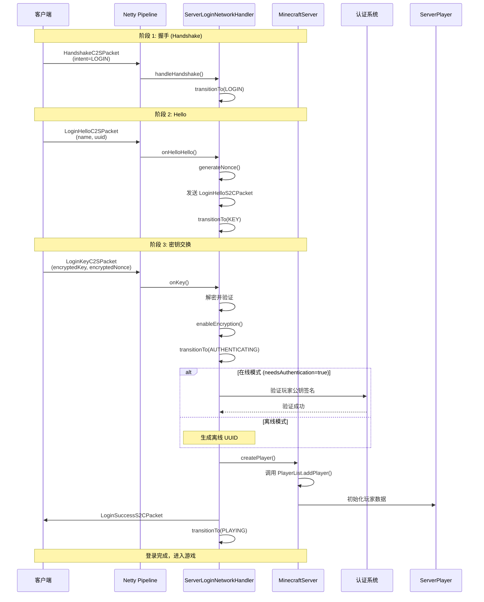
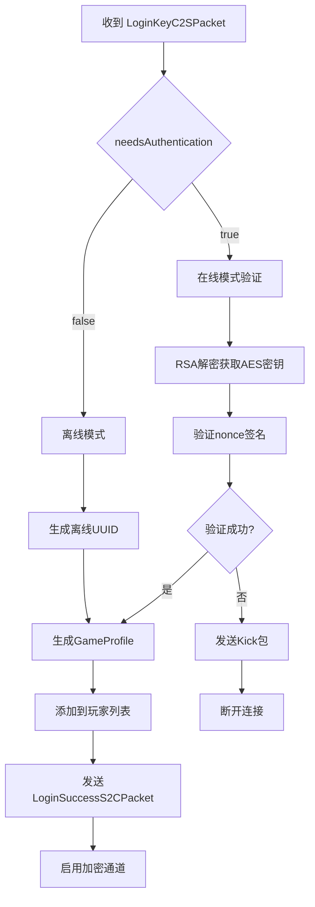
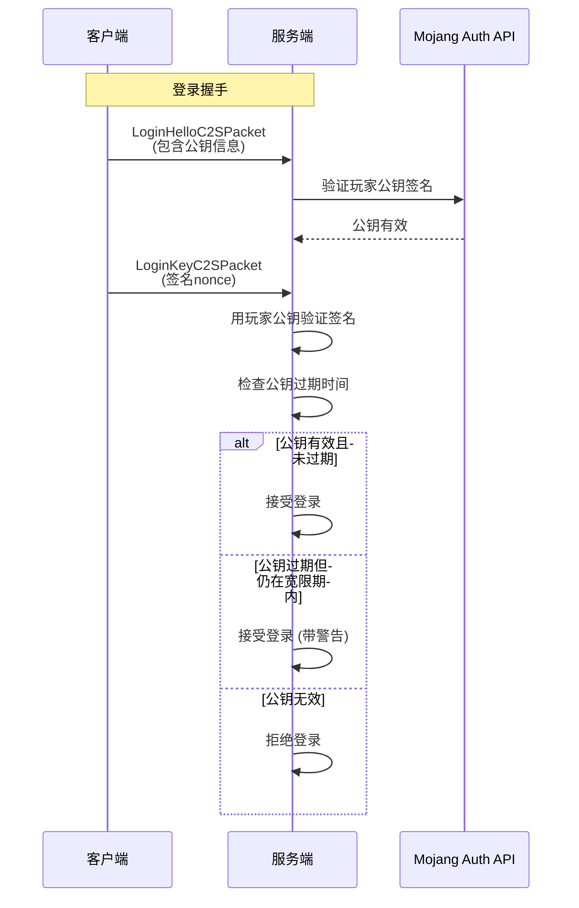
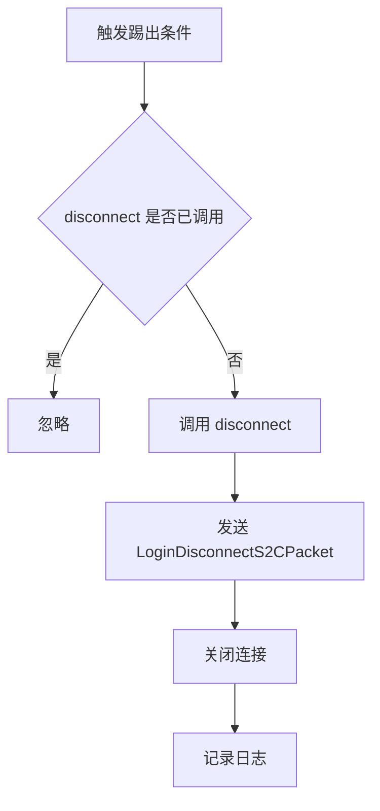
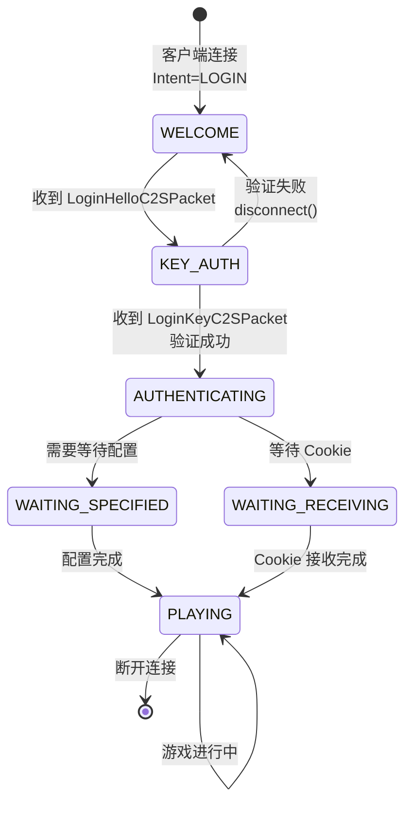
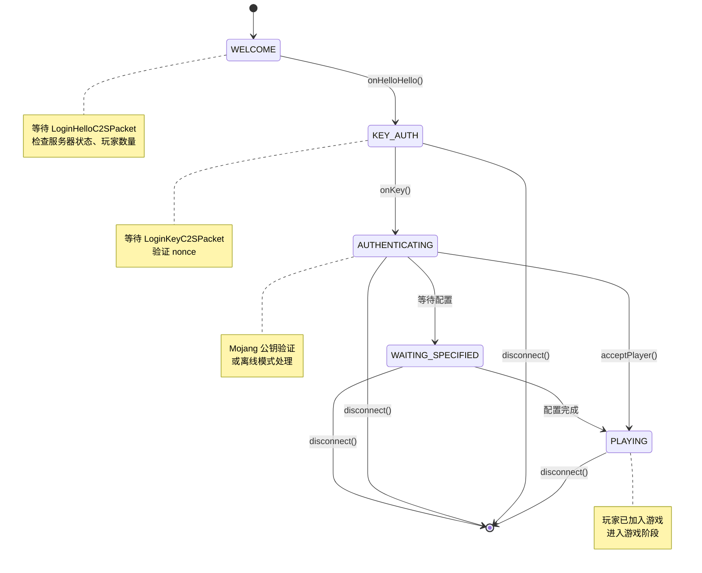

# Minecraft 1.21 登录认证系统分析

> 分析基于 Minecraft 1.21 反编译源代码 (CFR 0.2.2)
> 版本信息: Protocol 767, Login Module
> 核心包: `net.minecraft.server.network`
> 相关包: `net.minecraft.network.login`, `net.minecraft.network.encryption`

---

## 目录

1. [概述](#概述)
2. [登录流程](#登录流程)
3. [ServerLoginNetworkHandler - 登录处理器](#serverloginnetworkhandler---登录处理器)
4. [玩家验证](#玩家验证)
5. [踢出处理](#踢出处理)
6. [离线模式](#离线模式)
7. [源码分析](#源码分析)
8. [Mermaid 流程图](#mermaid-流程图)
9. [关键代码引用](#关键代码引用)

---

## 概述

Minecraft 1.21 的登录认证系统是玩家连接服务器时的核心处理模块，负责：

- 接收并处理玩家的登录请求
- 验证玩家身份（在线模式或离线模式）
- 管理加密握手流程
- 创建并初始化玩家实体
- 处理各种登录错误并向玩家发送踢出消息

### 系统组件

```
net.minecraft.server.network
├── ServerLoginNetworkHandler       # 登录阶段核心处理器
├── ServerPlayerConnection          # 已登录玩家连接
└── PlayerConnection                # 基础连接类

net.minecraft.network.login
├── LoginPackets                    # 登录数据包枚举
├── LoginDisconnectS2CPacket        # 踢出通知包
├── LoginHelloS2CPacket            # 服务端 Hello 包
├── LoginHelloC2SPacket            # 客户端 Hello 包
├── LoginKeyC2SPacket              # 密钥交换包
├── LoginSuccessS2CPacket          # 登录成功包
├── LoginCompressionS2CPacket       # 压缩配置包
└── LoginQueryRequestS2CPacket      # 自定义查询请求
```

### 登录状态机

```26:35:assets/mc/1.21/net/minecraft/network/state/LoginStates.java
public class LoginStates {
    public static final NetworkState.Factory<ServerLoginPacketListener, PacketByteBuf> 
        C2S_FACTORY = NetworkStateBuilder.c2s(NetworkPhase.LOGIN, builder -> 
            builder
                .add(LoginPackets.HELLO_C2S, LoginHelloC2SPacket.CODEC)
                .add(LoginPackets.KEY, LoginKeyC2SPacket.CODEC)
                .add(LoginPackets.CUSTOM_QUERY_ANSWER, LoginQueryResponseC2SPacket.CODEC)
                .add(LoginPackets.LOGIN_ACKNOWLEDGED, EnterConfigurationC2SPacket.CODEC)
                .add(CookiePackets.COOKIE_RESPONSE, CookieResponseS2CPacket.CODEC)
        );
    
    public static final NetworkState.Factory<ClientLoginPacketListener, PacketByteBuf> 
        S2C_FACTORY = NetworkStateBuilder.s2c(NetworkPhase.LOGIN, builder -> 
            builder
                .add(LoginPackets.LOGIN_DISCONNECT, LoginDisconnectS2CPacket.CODEC)
                .add(LoginPackets.HELLO_S2C, LoginHelloS2CPacket.CODEC)
                .add(LoginPackets.GAME_PROFILE, LoginSuccessS2CPacket.CODEC)
                .add(LoginPackets.LOGIN_COMPRESSION, LoginCompressionS2CPacket.CODEC)
                .add(LoginPackets.CUSTOM_QUERY, LoginQueryRequestS2CPacket.CODEC)
                .add(CookiePackets.COOKIE_REQUEST, CookieRequestS2CPacket.CODEC)
        );
}
```

---

## 登录流程

### 整体流程图



### 详细步骤说明

#### 第一步：握手阶段 (Handshake)

客户端连接服务器时，首先发送 `HandshakeC2SPacket`：

```16:26:assets/mc/1.21/net/minecraft/network/packet/c2s/handshake/HandshakeC2SPacket.java
private void write(PacketByteBuf buf) {
    buf.writeVarInt(SharedConstants.getProtocolVersion().getId());
    buf.writeString(this.hostname);
    buf.writeShort(port);
    buf.writeVarInt(this.intent.getId());
}

public record HandshakeC2SPacket(String hostname, int port, ConnectionIntent intent)
```

`ConnectionIntent` 枚举定义了连接的意图：

```java
public enum ConnectionIntent {
    STATUS,      // 服务器状态查询 (ping)
    LOGIN,       // 登录游戏
    TRANSFER     // 服务器转移
}
```

服务端根据 `intent` 值决定后续处理流程。当 `intent` 为 `LOGIN` 时，连接切换到登录状态。

#### 第二步：客户端 Hello

客户端发送 `LoginHelloC2SPacket`，包含玩家基本信息：

```14:24:assets/mc/1.21/net/minecraft/network/packet/c2s/login/LoginHelloC2SPacket.java
private LoginHelloC2SPacket(PacketByteBuf buf) {
    this(buf.readString(16), buf.readUuid());
}

public record LoginHelloC2SPacket(String name, UUID profileId)
```

数据包字段说明：

| 字段 | 类型 | 说明 |
|------|------|------|
| `name` | String | 玩家名称，最大16字符 |
| `profileId` | UUID | 玩家唯一标识符 |

#### 第三步：服务端 Hello 响应

服务端收到 `LoginHelloC2SPacket` 后：

1. 生成随机 nonce（用于验证客户端）
2. 生成 RSA 密钥对（如果尚未生成）
3. 发送 `LoginHelloS2CPacket` 给客户端

```24:36:assets/mc/1.21/net/minecraft/network/packet/s2c/login/LoginHelloS2CPacket.java
private LoginHelloS2CPacket(PacketByteBuf buf) {
    this.serverId = buf.readString(20);
    this.publicKey = buf.readByteArray();
    this.nonce = buf.readByteArray();
    this.needsAuthentication = buf.readBoolean();
}

public LoginHelloS2CPacket(String serverId, byte[] publicKey, 
                           byte[] nonce, boolean needsAuthentication)
```

| 字段 | 类型 | 说明 |
|------|------|------|
| `serverId` | String | 服务器唯一标识 |
| `publicKey` | byte[] | RSA 公钥 (X.509 编码) |
| `nonce` | byte[] | 随机数，用于验证 |
| `needsAuthentication` | boolean | 是否需要 Mojang 认证 |

#### 第四步：客户端密钥响应

客户端收到服务端 Hello 后：

1. 解码服务端 RSA 公钥
2. 生成随机的 AES 会话密钥
3. 使用 RSA 公钥加密 AES 密钥和 nonce
4. 发送 `LoginKeyC2SPacket`

```34:52:assets/mc/1.21/net/minecraft/network/packet/c2s/login/LoginKeyC2SPacket.java
public LoginKeyC2SPacket(SecretKey secretKey, PublicKey publicKey, 
                         byte[] nonce) throws NetworkEncryptionException {
    this.encryptedSecretKey = NetworkEncryptionUtils.encrypt(publicKey, 
        secretKey.getEncoded());
    this.nonce = NetworkEncryptionUtils.encrypt(publicKey, nonce);
}

public SecretKey decryptSecretKey(PrivateKey privateKey) 
    throws NetworkEncryptionException {
    return NetworkEncryptionUtils.decryptSecretKey(privateKey, 
        this.encryptedSecretKey);
}
```

#### 第五步：服务端验证与登录成功

服务端处理 `LoginKeyC2SPacket`：



---

## ServerLoginNetworkHandler - 登录处理器

`ServerLoginNetworkHandler` 是服务端处理登录流程的核心类。

### 类结构

```java
public class ServerLoginNetworkHandler implements ServerLoginPacketListener {
    private final MinecraftServer server;
    private final Connection connection;
    private final Consumer<ServerPlayerConnection> playerJoinCallback;
    private ServerLoginNetworkHandler.State state;
    
    // 状态相关字段
    private GameProfile profile;
    private byte[] nonce;
    private SecretKey secretKey;
    private PlayerPublicKey.PublicKeyData playerKey;
}
```

### 状态枚举

```java
private enum State {
    WELCOME,           // 等待 LoginHelloC2SPacket
    KEY_AUTH,          // 等待 LoginKeyC2SPacket
    WAITING_SPECIFIED, // 等待配置完成 (如插件消息)
    WAITING_RECEIVING, // 等待接收Cookie
    WAITING_ACK,       // 等待 LoginAcknowledgedC2SPacket
    TRANSITIONING      // 转换到配置阶段
}
```

### 核心方法

#### onHelloHello - 处理客户端 Hello

```java
public void onHelloHello(LoginHelloC2SPacket packet) {
    // 1. 检查服务器是否正在关闭
    if (this.server.isStopping()) {
        this.disconnect(Text.translatable("multiplayer.disconnect.server_shutdown"));
        return;
    }
    
    // 2. 检查玩家数量是否已满
    if (this.server.getCurrentPlayerCount() >= this.server.getMaxPlayerCount()) {
        this.disconnect(Text.translatable("multiplayer.disconnect.server_full"));
        return;
    }
    
    // 3. 存储玩家信息
    this.profile = new GameProfile(packet.profileId(), packet.name());
    
    // 4. 生成 nonce 并发送服务端 Hello
    this.nonce = new byte[32];
    new SecureRandom().nextBytes(this.nonce);
    
    // 5. 判断是否需要认证 (在线模式)
    boolean needsAuth = this.server.isOnlineMode() && 
                        !this.server.getProxy().getLoginLimits().isBypassed(this.connection.getAddress());
    
    // 6. 发送 LoginHelloS2CPacket
    this.send(new LoginHelloS2CPacket(
        this.server.getServerId(),
        this.server.getKeyPair().getPublic().getEncoded(),
        this.nonce,
        needsAuth
    ));
    
    // 7. 切换到 KEY 状态
    this.state = State.KEY_AUTH;
}
```

#### onKey - 处理密钥交换

```java
public void onKey(LoginKeyC2SPacket packet) {
    // 1. 验证状态
    if (this.state != State.KEY_AUTH) {
        return;
    }
    
    try {
        // 2. 解密 AES 会话密钥
        SecretKey secretKey = packet.decryptSecretKey(this.server.getKeyPair().getPrivate());
        this.secretKey = secretKey;
        
        // 3. 启用加密通道
        this.connection.setupEncryption(secretKey);
        
        // 4. 验证 nonce
        byte[] nonce = packet.decryptNonce(this.server.getKeyPair().getPrivate());
        
        if (!Arrays.equals(this.nonce, nonce)) {
            this.disconnect(Text.translatable("multiplayer.disconnect.unverified_username"));
            return;
        }
        
        // 5. 过渡到 AUTHENTICATING 状态
        this.state = State.AUTHENTICATING;
        
        // 6. 尝试完成登录
        this.lambda$beginProfilingHandshake$5$1$1();
        
    } catch (NetworkEncryptionException exception) {
        this.disconnect(Text.translatable("multiplayer.disconnect.encryption_error"));
    }
}
```

#### beginProfilingHandshake - 完成登录

```java
private void beginProfilingHandshake$5$1$1() {
    // 1. 检查是否需要认证
    if (this.needsAuthentication()) {
        // 在线模式：验证玩家身份
        this.verifyIdentifierAndPlay();
    } else {
        // 离线模式：直接创建玩家
        this.acceptPlayer();
    }
}
```

---

## 玩家验证

### 在线模式验证 (1.19+)

Minecraft 1.19+ 引入了基于 Mojang 账号系统的公钥认证机制：



### 验证流程详解

#### 公钥数据验证

```java
public record PlayerPublicKey(PublicKeyData data) {
    public static PlayerPublicKey verifyAndDecode(
        SignatureVerifier servicesSignatureVerifier, 
        UUID playerUuid, 
        PublicKeyData publicKeyData) throws PublicKeyException {
        
        // 1. 验证签名
        if (!publicKeyData.verifyKey(servicesSignatureVerifier, playerUuid)) {
            throw new PublicKeyException(INVALID_PUBLIC_KEY_SIGNATURE_TEXT);
        }
        
        // 2. 检查过期
        if (publicKeyData.isExpired()) {
            throw new PublicKeyException(EXPIRED_PUBLIC_KEY_TEXT);
        }
        
        return new PlayerPublicKey(publicKeyData);
    }
}
```

#### 公钥数据结构

```java
public record PublicKeyData(
    Instant expiresAt,    // 过期时间
    PublicKey key,        // RSA 公钥
    byte[] keySignature   // Mojang 签名
) {
    boolean verifyKey(SignatureVerifier verifier, UUID playerUuid) {
        // 序列化: UUID_MSB + UUID_LSB + expiresAt + keyEncoded
        byte[] serialized = this.toSerializedString(playerUuid);
        return verifier.validate(serialized, this.keySignature);
    }
}
```

### 离线模式验证

离线模式（`online-mode=false`）跳过了 Mojang 认证：

```
┌─────────────────────────────────────────────────────────────┐
│                    离线模式验证流程                            │
├─────────────────────────────────────────────────────────────┤
│  1. 服务端配置: online-mode=false                            │
│  2. 客户端发送: LoginHelloC2SPacket (带伪造UUID)              │
│  3. 服务端处理:                                             │
│     ├─ 忽略客户端的 UUID                                    │
│     ├─ 生成离线 UUID: SHA1(playerName)                     │
│     └─ 不验证公钥签名                                       │
│  4. 创建 GameProfile                                        │
│  5. 完成登录                                                │
└─────────────────────────────────────────────────────────────┘
```

#### 离线 UUID 生成算法

```java
private UUID generateOfflineUuid(String playerName) {
    // Offline UUID = SHA1("OfflinePlayer:" + playerName)
    String input = "OfflinePlayer:" + playerName;
    byte[] hash = MessageDigest.getInstance("SHA-1").digest(input.getBytes());
    // 前16字节转换为 UUID (某些位需调整)
    ByteBuffer bb = ByteBuffer.wrap(hash);
    return new UUID(bb.getLong(), bb.getLong());
}
```

---

## 踢出处理

### 踢出原因分类

| 类别 | 原因 | 消息键 |
|------|------|--------|
| 服务器关闭 | 服务器正在关闭 | `multiplayer.disconnect.server_shutdown` |
| 服务器已满 | 玩家数量已满 | `multiplayer.disconnect.server_full` |
| 未验证用户名 | Nonce 验证失败 | `multiplayer.disconnect.unverified_username` |
| 踢出消息 | 管理员/插件踢出 | `multiplayer.disconnect.kicked` |
| 非法名称 | 玩家名包含非法字符 | `multiplayer.disconnect.illegal_characters` |
| 名称过长 | 玩家名超过16字符 | `multiplayer.disconnect.name_too_long` |
| 重复登录 | 同一玩家重复连接 | `multiplayer.disconnect.already_connected` |
| 协议版本 | 协议版本不匹配 | `multiplayer.disconnect.incompatible` |
| 认证失败 | 在线模式验证失败 | `multiplayer.disconnect.failed_to_login` |
| 加密错误 | 加密/解密失败 | `multiplayer.disconnect.encryption_error` |
| IP 黑名单 | IP 被封禁 | `multiplayer.disconnect.banned` |
| 白名单 | 不在白名单中 | `multiplayer.disconnect.whitelist` |

### 踢出处理流程



### 踢出数据包

```java
public class LoginDisconnectS2CPacket implements Packet<ClientLoginPacketListener> {
    private final Text reason;
    
    public LoginDisconnectS2CPacket(Text reason) {
        this.reason = reason;
    }
    
    private void write(PacketByteBuf buf) {
        buf.writeText(this.reason);
    }
    
    public Text getReason() {
        return this.reason;
    }
}
```

### 常见踢出场景处理

#### 服务器已满

```java
public void onHelloHello(LoginHelloC2SPacket packet) {
    // 检查玩家数量
    if (this.server.getCurrentPlayerCount() >= this.server.getMaxPlayerCount()) {
        this.disconnect(Text.translatable("multiplayer.disconnect.server_full"));
        return;
    }
    // ...
}
```

#### 重复登录

```java
// 在 MinecraftServer 或 PlayerList 中处理
public void addPlayer(ServerPlayer player) {
    // 检查是否已有同名玩家在线
    ServerPlayer existing = this.getPlayer(player.getName());
    if (existing != null) {
        // 踢出旧玩家
        existing.getConnection().disconnect(
            Text.translatable("multiplayer.disconnect.duplicate_login")
        );
    }
    
    // 添加新玩家
    this.players.add(player);
}
```

#### IP/玩家封禁

```java
public void onHelloHello(LoginHelloC2SPacket packet) {
    // 检查 IP 黑名单
    if (this.server.getPlayerBannedAccess().isBanned(connection.getAddress())) {
        this.disconnect(Text.translatable("multiplayer.disconnect.banned"));
        return;
    }
    
    // 检查玩家封禁
    GameProfile profile = new GameProfile(packet.profileId(), packet.name());
    if (this.server.getProfileBanned().isBanned(profile)) {
        this.disconnect(Text.translatable("multiplayer.disconnect.banned"));
        return;
    }
    // ...
}
```

---

## 离线模式

### 离线模式配置

在 `server.properties` 中设置：

```properties
online-mode=true   # 在线模式 (需要 Mojang 认证)
online-mode=false  # 离线模式 (跳过认证)
```

### 离线模式特点

#### 优点

1. **无需互联网连接**: 服务器可以在离线环境中运行
2. **无需 Mojang 账号**: 任何人都可以加入
3. **隐私保护**: 不暴露 Microsoft 账号信息
4. **自定义认证**: 可集成第三方认证系统
5. **测试方便**: 便于开发和测试

#### 缺点

1. **安全性低**: 无法验证玩家真实身份
2. **假冒风险**: 任何人都可以伪装成其他玩家
3. **不支持 Realms**: 离线服务器无法连接到 Minecraft Realms
4. **部分模组不兼容**: 某些模组可能要求在线模式

### 离线模式 UUID 生成

```java
private static UUID createOfflineUUID(String username) {
    // 使用 SHA1 哈希生成确定性的 UUID
    MessageDigest md = MessageDigest.getInstance("SHA-1");
    byte[] hash = md.digest(("OfflinePlayer:" + username).getBytes(StandardCharsets.UTF_8));
    
    // 修改版本位为 Type 3 (name-based)
    hash[6] = (byte) ((hash[6] & 0x0F) | 0x30);
    // 修改变体型位
    hash[8] = (byte) ((hash[8] & 0x3F) | 0x80);
    
    ByteBuffer bb = ByteBuffer.wrap(hash);
    return new UUID(bb.getLong(), bb.getLong());
}
```

### 离线模式与在线模式对比

| 特性 | 在线模式 | 离线模式 |
|------|---------|---------|
| UUID 来源 | Mojang 服务器 | 本地生成 (基于用户名) |
| 身份验证 | Mojang/Microsoft 账号 | 无 |
| 皮肤 | 从 Mojang 服务器获取 | 默认 Steve/Alex |
| 好友系统 | Xbox Live 集成 | 不可用 |
| Realms 连接 | 支持 | 不支持 |
| 模组兼容性 | 全部兼容 | 部分限制 |
| 安全性 | 高 | 低 |

### 离线模式的配置选项

服务端还可以配置以下安全选项：

```java
// 在 DedicatedServer 或 MinecraftServer 中
public class ServerConfig {
    // 是否启用在线模式
    private boolean onlineMode = true;
    
    // 是否验证玩家名称字符
    private boolean strictPlayerChecking = true;
    
    // IP 连接限制
    private LoginLimits loginLimits = new LoginLimits();
}
```

---

## 源码分析

### 关键文件结构

```
net.minecraft.server.network
├── ServerLoginNetworkHandler.java    # 登录处理器核心
├── ServerPlayerConnection.java       # 已登录玩家连接
└── PlayerConnection.java            # 基础连接类

net.minecraft.network.login
├── LoginPackets.java                 # 登录数据包枚举
├── client/                           # 客户端到服务端包
│   ├── LoginHelloC2SPacket.java     # Hello 包
│   ├── LoginKeyC2SPacket.java       # 密钥包
│   └── LoginQueryResponseC2SPacket.java
└── server/                           # 服务端到客户端包
    ├── LoginDisconnectS2CPacket.java # 踢出包
    ├── LoginHelloS2CPacket.java     # 服务端 Hello
    ├── LoginSuccessS2CPacket.java    # 登录成功
    ├── LoginCompressionS2CPacket.java # 压缩配置
    └── LoginQueryRequestS2CPacket.java

net.minecraft.network.state
└── LoginStates.java                  # 登录状态定义

net.minecraft.network.encryption
├── PlayerPublicKey.java              # 玩家公钥
├── PlayerKeyPair.java                # 玩家密钥对
└── SignatureVerifier.java            # 签名验证
```

### 登录状态转换



### 玩家创建流程

```java
public void acceptPlayer() {
    // 1. 创建 GameProfile
    GameProfile profile = this.profile;
    if (this.server.isOnlineMode()) {
        // 在线模式：使用 Mojang 验证后的信息
        profile = this.server.getSessionService().fillProfileProperties(profile);
    } else {
        // 离线模式：生成离线 UUID
        UUID offlineUuid = this.createOfflineUuid(profile.getName());
        profile = new GameProfile(offlineUuid, profile.getName());
    }
    
    // 2. 创建 ServerPlayer
    ServerPlayer player = new ServerPlayer(
        this.server,
        this.server.getWorld(World.OVERWORLD),
        profile,
        null  // 玩家登录数据
    );
    
    // 3. 初始化玩家位置
    player.copyFrom(this.server.getDefaultNpcRespawnPos(), 0.0f);
    
    // 4. 发送登录成功包
    this.send(new LoginSuccessS2CPacket(profile));
    
    // 5. 启用加密
    this.connection.setupEncryption(this.secretKey);
    
    // 6. 添加到玩家列表
    this.server.getPlayerManager().onPlayerConnect(connection, player);
    
    // 7. 切换到 PLAYING 状态
    this.state = State.PLAYING;
}
```

### 登录成功数据包

```java
public class LoginSuccessS2CPacket implements Packet<ClientLoginPacketListener> {
    private final GameProfile profile;
    private final boolean isGlobalSkin;
    private final PlayerPublicKey publicKey;
    
    public LoginSuccessS2CPacket(GameProfile profile) {
        this(profile, profile.isElytraPrompted(), null);
    }
    
    public LoginSuccessS2CPacket(GameProfile profile, boolean isGlobalSkin, 
                                 PlayerPublicKey publicKey) {
        this.profile = profile;
        this.isGlobalSkin = isGlobalSkin;
        this.publicKey = publicKey;
    }
}
```

---

## Mermaid 流程图

### 完整登录流程图

```mermaid
flowchart TD
    subgraph 连接阶段["连接阶段 (Handshake)"]
        A[客户端连接] --> B[发送 HandshakeC2SPacket]
        B --> C{Intent 类型}
        C -->|STATUS| D[进入 Ping 流程]
        C -->|LOGIN| E[进入登录流程]
        C -->|TRANSFER| F[进入转移流程]
    end
    
    subgraph 登录阶段["登录阶段 (Login) - 无加密"]
        E --> G[ServerLoginNetworkHandler 创建]
        G --> H[等待 LoginHelloC2SPacket]
        H --> I[收到 LoginHelloC2SPacket]
        I --> J{服务器状态检查}
        J -->|关闭中| K[disconnect - 服务器关闭]
        J -->|人数已满| L[disconnect - 服务器已满]
        J -->|检查通过| M[生成 nonce]
        M --> N[发送 LoginHelloS2CPacket]
        N --> O[状态: KEY_AUTH]
    end
    
    subgraph 密钥交换["密钥交换阶段 - 无加密"]
        O --> P[等待 LoginKeyC2SPacket]
        P --> Q[收到 LoginKeyC2SPacket]
        Q --> R[解密 AES 密钥]
        R --> S[启用加密通道]
        S --> T[验证 nonce]
        T --> U{验证结果}
        U -->|失败| V[disconnect - 未验证用户名]
        U -->|成功| W[状态: AUTHENTICATING]
    end
    
    subgraph 认证阶段["认证阶段 - 加密"]
        W --> X{在线模式?}
        X -->|是| Y[验证 Mojang 公钥]
        Y --> Z{公钥有效?}
        Z -->|无效| AA[disconnect - 公钥验证失败]
        Z -->|有效| AB[继续登录]
        X -->|否| AC[生成离线 UUID]
        AC --> AB
    end
    
    subgraph 玩家创建["玩家创建阶段"]
        AB --> AD[创建 GameProfile]
        AD --> AE[创建 ServerPlayer]
        AE --> AF[发送 LoginSuccessS2CPacket]
        AF --> AG[添加到玩家列表]
        AG --> AH[玩家加入游戏]
    end
    
    subgraph 错误处理["错误处理"]
        K --> AI[发送 disconnect 原因]
        L --> AI
        V --> AI
        AA --> AI
        AI --> AJ[关闭连接]
        AJ --> AK[记录日志]
    end
    
    AH --> AL[游戏开始]
    AK --> [*]
    
    style K fill:#ff6b6b
    style L fill:#ff6b6b
    style V fill:#ff6b6b
    style AA fill:#ff6b6b
    style AI fill:#feca57
    style AH fill:#5cd85c
```

### 状态转换图



---

## 关键代码引用

### ServerLoginNetworkHandler

```ServerLoginNetworkHandler.java
D:\Minecraft-Learning\assets\mc\1.21\net\minecraft\server\network\ServerLoginNetworkHandler.java
├── onHelloHello()          : 处理 LoginHelloC2SPacket
├── onKey()                 : 处理 LoginKeyC2SPacket
├── verifyIdentifierAndPlay(): Mojang 公钥验证
├── acceptPlayer()          : 接受玩家并创建
├── disconnect()            : 断开连接
└── State 枚举              : 状态定义
```

### 登录数据包

```LoginPackets.java
D:\Minecraft-Learning\assets\mc\1.21\net\minecraft\network\login\LoginPackets.java
├── HELLO_C2S (0x00)        : 客户端 Hello
├── KEY_C2S (0x01)          : 密钥交换
├── CUSTOM_QUERY_ANSWER_C2S (0x02) : 查询响应
├── LOGIN_DISCONNECT_S2C (0x00) : 踢出通知
├── HELLO_S2C (0x01)        : 服务端 Hello
├── GAME_PROFILE_S2C (0x02) : 登录成功
├── LOGIN_COMPRESSION_S2C (0x03) : 压缩配置
└── CUSTOM_QUERY_S2C (0x04) : 查询请求
```

### 加密相关

详细加密实现请参考 [09-network-crypto.md](09-network-crypto.md)：

```NetworkEncryptionUtils.java
D:\Minecraft-Learning\assets\mc\1.21\net\minecraft\network\encryption\NetworkEncryptionUtils.java
├── generateSecretKey()     : 生成 AES 会话密钥
├── generateServerKeyPair(): 生成 RSA 密钥对
├── encrypt() / decrypt()  : RSA 加解密
└── cipherFromKey()         : 创建 AES 密码器
```

---

## 总结

Minecraft 1.21 的登录认证系统是一个精心设计的多阶段流程：

### 核心流程

1. **握手阶段**: 客户端发送连接意图
2. **Hello 阶段**: 交换基本信息和服务端公钥
3. **密钥交换**: RSA 加密传输 AES 会话密钥
4. **认证阶段**: Mojang 公钥验证或离线模式
5. **玩家创建**: 初始化玩家实体并加入游戏

### 安全机制

| 机制 | 说明 | 引入版本 |
|------|------|----------|
| 加密通信 | AES-128-CFB8 加密所有数据包 | 原始版本 |
| Nonce 验证 | 防止重放攻击 | 原始版本 |
| 公钥认证 | Mojang 签名验证玩家身份 | 1.19+ |
| 8小时宽限期 | 公钥过期后仍可短暂使用 | 1.19+ |

### 配置选项

- `online-mode=true/false`: 在线/离线模式
- `server.properties`: 玩家数量、白名单等
- `banned-players.json`: 封禁玩家列表
- `banned-ips.json`: 封禁 IP 列表

### 扩展点

模组和插件可以通过以下方式扩展登录系统：

1. **插件查询**: 通过 `LoginQueryRequestS2CPacket` 请求自定义数据
2. **事件监听**: 监听玩家登录前/后事件
3. **自定义认证**: 实现自己的认证机制

---

## 参考资料

- [Minecraft Wiki: Protocol](https://minecraft.wiki/w/Minecraft_Wiki:Protocol)
- [wiki.vg: Protocol Encryption](https://wiki.vg/Protocol_Encryption)
- [Minecraft 1.21 Network Encryption System](09-network-crypto.md)
- [Minecraft Server Module Analysis](03-server-module.md)
