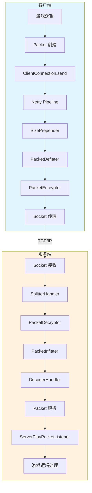
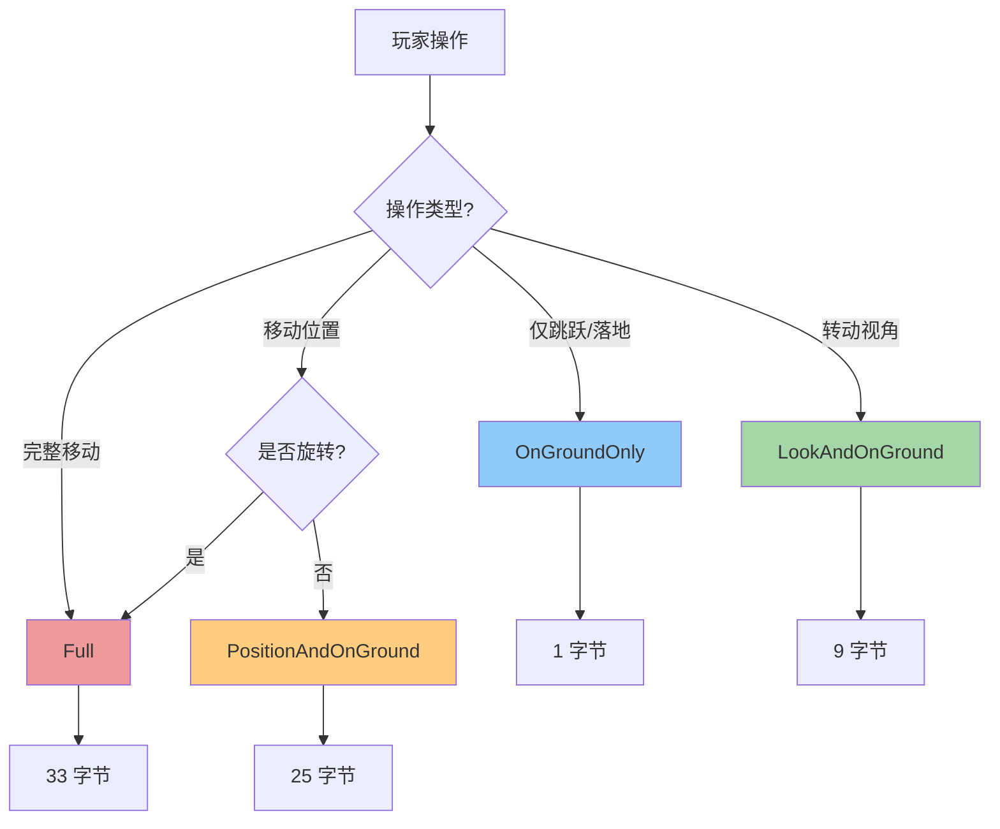
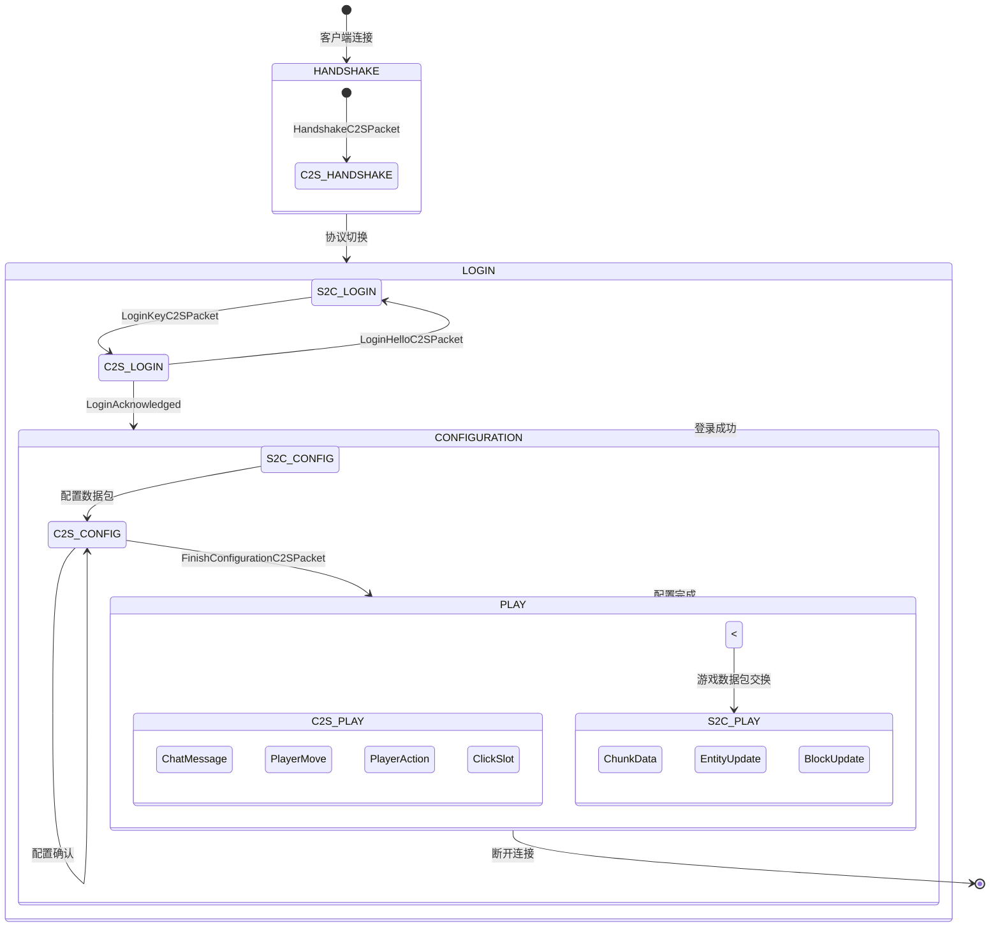
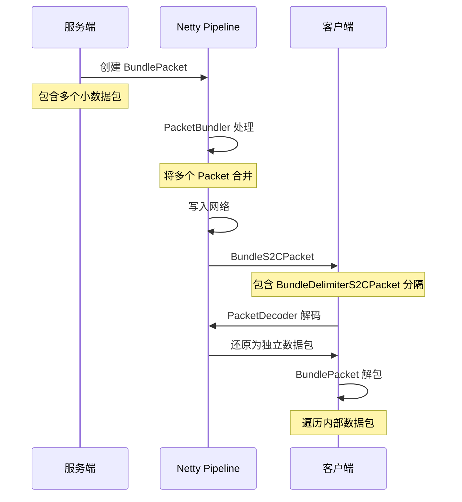

# 游戏数据包系统 (Play Packet System)

## 概述

Play Packet System 是 Minecraft 1.21 网络协议中最核心的部分，负责在游戏过程中（Play 阶段）客户端与服务端之间的所有通信。这个系统处理了游戏中几乎所有的实时交互，包括玩家移动、物品交互、实体更新、聊天消息等。

Minecraft 1.21 的数据包系统建立在 Netty 框架之上，使用自定义的 `Packet<T>` 接口和 `PacketCodec` 编解码器来处理数据的序列化和反序列化。整个网络层设计遵循双向通信模式：客户端到服务端（C2S）和服务端到客户端（S2C）。

Play 阶段是网络连接生命周期中持续时间最长的阶段，从玩家成功登录后开始，直到玩家断开连接或服务端关闭为止。在这个阶段，数据包的传输量最大、频率最高，因此优化数据包传输效率成为 1.21 版本的重要改进方向。

## ServerPlayPacket - 服务端发送的数据包

服务端到客户端的数据包（S2C）是服务器主动推送给客户端的游戏状态更新。这些数据包由 `ClientPlayPacketListener` 接口定义，每个数据包都有对应的处理方法。

```java
D:\Minecraft-Learning\assets\mc\1.21\net\minecraft\network\listener\ClientPlayPacketListener.java
```

### 核心 S2C 数据包类型

| 数据包类型 | 功能描述 | 使用频率 |
|---|---|---|
| `GameJoinS2CPacket` | 玩家加入游戏初始化 | 单次 |
| `ChunkDataS2CPacket` | 区块数据同步 | 高频 |
| `EntityS2CPacket` | 实体位置/状态更新 | 高频 |
| `BlockUpdateS2CPacket` | 单个方块更新 | 中频 |
| `PlayerPositionLookS2CPacket` | 服务器校正玩家位置 | 低频 |
| `ChatMessageS2CPacket` | 聊天消息接收 | 中频 |
| `InventoryS2CPacket` | 容器内容同步 | 中频 |

### S2C 数据包注册机制

在 `PlayPackets.java` 中，S2C 数据包通过静态初始化方法注册：

```java
D:\Minecraft-Learning\assets\mc\1.21\net\minecraft\network\packet\PlayPackets.java

private static <T extends Packet<ClientPlayPacketListener>> PacketType<T> s2c(String id) {
    return new PacketType(NetworkSide.CLIENTBOUND, Identifier.ofVanilla(id));
}
```

每个 S2C 数据包类型都关联一个唯一的 `PacketType` 对象，该对象包含网络方向（CLIENTBOUND）和数据包的标识符。服务端发送数据包时，通过 `ClientConnection.send()` 方法将数据包写入网络通道。

## ClientPlayPacket - 客户端发送的数据包

客户端到服务端的数据包（C2S）代表玩家的各种操作请求。这些数据包由 `ServerPlayPacketListener` 接口定义。

```java
D:\Minecraft-Learning\assets\mc\1.21\net\minecraft\network\listener\ServerPlayPacketListener.java
```

### 核心 C2S 数据包类型

| 数据包类型 | 功能描述 | 使用频率 |
|---|---|---|
| `PlayerMoveC2SPacket` | 玩家位置/旋转更新 | 极高频 |
| `PlayerActionC2SPacket` | 玩家动作（放置、破坏方块等） | 高频 |
| `ChatMessageC2SPacket` | 聊天消息发送 | 中频 |
| `ClickSlotC2SPacket` | 容器物品点击 | 中频 |
| `PlayerInteractBlockC2SPacket` | 与方块交互 | 高频 |
| `TeleportConfirmC2SPacket` | 确认传送 | 低频 |

### C2S 数据包注册机制

```java
D:\Minecraft-Learning\assets\mc\1.21\net\minecraft\network\packet\PlayPackets.java

private static <T extends Packet<ServerPlayPacketListener>> PacketType<T> c2s(String id) {
    return new PacketType(NetworkSide.SERVERBOUND, Identifier.ofVanilla(id));
}
```

## 常用数据包类型详解

### PlayerMoveC2SPacket - 玩家移动数据包

玩家移动是游戏中最高频的数据包传输操作。1.21 版本对移动数据包进行了优化，提供了多种变体以减少传输数据量。

```java
D:\Minecraft-Learning\assets\mc\1.21\net\minecraft\network\packet\c2s\play\PlayerMoveC2SPacket.java
```

移动数据包有四种变体：

| 变体类 | 描述 | 数据字段 |
|---|---|---|
| `OnGroundOnly` | 仅发送是否在地面上 | 1 字节 |
| `LookAndOnGround` | 旋转 + 地面状态 | 9 字节 |
| `PositionAndOnGround` | 位置 + 地面状态 | 25 字节 |
| `Full` | 完整位置旋转和地面状态 | 33 字节 |

这种设计允许客户端根据实际情况选择最小化的数据包变体。例如，当玩家仅转动视角时，只需发送 `LookAndOnGround`；当玩家仅在原地跳跃时，只需发送 `OnGroundOnly`。

```java
public double getX(double currentX) {
    return this.changePosition ? this.x : currentX;
}

public double getY(double currentY) {
    return this.changePosition ? this.y : currentY;
}
```

服务端通过 `getX()` 等方法获取位置信息，如果 `changePosition` 为 false，则使用当前存储的位置。

### ChunkDataS2CPacket - 区块数据包

区块数据是游戏中最庞大的数据包之一，包含了区块内的所有方块状态和实体数据。

```java
public void onChunkData(ChunkDataS2CPacket var1);
```

区块数据包含：
- 方块状态数组（Chunk Section）
- 区块的 NBT 数据（Block Entities）
- 光照数据
- 高度图数据

由于区块数据包体积庞大，服务端通常会对其进行压缩处理，并且可能分批次发送（通过 `StartChunkSendS2CPacket` 和 `ChunkSentS2CPacket`）。

### BundlePacket - 数据包捆绑

1.21 版本引入了数据包捆绑机制，允许将多个小数据包合并为一个更大的数据包传输，以减少协议开销。

```java
D:\Minecraft-Learning\assets\mc\1.21\net\minecraft\network\packet\BundlePacket.java

public abstract class BundlePacket<T extends PacketListener>
implements Packet<T> {
    private final Iterable<Packet<? super T>> packets;

    protected BundlePacket(Iterable<Packet<? super T>> packets) {
        this.packets = packets;
    }

    public final Iterable<Packet<? super T>> getPackets() {
        return this.packets;
    }
}
```

捆绑包使用 `BundleDelimiterS2CPacket` 作为数据包之间的分隔符，允许接收端正确解析多个数据包。

## 数据包压缩

数据包压缩是减少网络带宽占用的关键技术。Minecraft 使用 Zlib 压缩算法，并允许服务端配置压缩阈值。

```java
D:\Minecraft-Learning\assets\mc\1.21\net\minecraft\network\handler\PacketInflater.java
```

### 压缩机制

`PacketInflater` 类负责解压接收到的数据包：

```java
public static final int MAXIMUM_PACKET_SIZE = 0x800000; // 8MB

@Override
protected void decode(ChannelHandlerContext ctx, ByteBuf buf, List<Object> objects) throws Exception {
    if (buf.readableBytes() == 0) {
        return;
    }
    int i = VarInts.read(buf);
    if (i == 0) {
        // 未压缩的数据包
        objects.add(buf.readBytes(buf.readableBytes()));
        return;
    }
    // 解压缩数据包
    this.setInputBuf(buf);
    ByteBuf byteBuf = this.inflate(ctx, i);
    this.inflater.reset();
    objects.add(byteBuf);
}
```

### 压缩协议

压缩数据包的格式为：
- VarInt：解压后的大小
- 压缩后的数据包内容

未压缩数据包的格式为：
- 单字节 `0x00`
- 原始数据包内容

### 压缩阈值配置

```java
public void setCompressionThreshold(int compressionThreshold, boolean rejectsBadPackets) {
    this.compressionThreshold = compressionThreshold;
    this.rejectsBadPackets = rejectsBadPackets;
}
```

服务端通过 `ClientConnection.setCompressionThreshold()` 方法启用和配置压缩。默认情况下，Minecraft 服务端不启用压缩（阈值设置为 -1）。

## 数据包处理流程

### 发送流程

```
游戏逻辑 → Packet 创建 → ClientConnection.send() → Netty Pipeline → 网络传输
```

```java
D:\Minecraft-Learning\assets\mc\1.21\net\minecraft\network\ClientConnection.java

public void send(Packet<?> packet, @Nullable PacketCallbacks callbacks) {
    if (this.isOpen()) {
        this.handleQueuedTasks();
        this.sendImmediately(packet, callbacks, true);
    } else {
        this.queuedTasks.add(connection -> connection.sendImmediately(packet, callbacks, true));
    }
}
```

Netty Pipeline 处理器链：

```
Packet → SizePrepender → Compression → Encryption → Splitter → Channel
```

### 接收流程

```
网络接收 → Splitter → Decryption → Decompression → PacketDecoder → PacketListener
```

```java
@Override
protected void channelRead0(ChannelHandlerContext channelHandlerContext, Packet<?> packet) {
    if (!this.channel.isOpen()) {
        return;
    }
    PacketListener packetListener = this.packetListener;
    if (packetListener == null) {
        throw new IllegalStateException("Received a packet before the packet listener was initialized");
    }
    if (packetListener.accepts(packet)) {
        try {
            ClientConnection.handlePacket(packet, packetListener);
        } catch (ClassCastException classCastException) {
            LOGGER.error("Received {} that couldn't be processed", (Object)packet.getClass(), (Object)classCastException);
            this.disconnect(Text.translatable("multiplayer.disconnect.invalid_packet"));
        }
        ++this.packetsReceivedCounter;
    }
}

private static <T extends PacketListener> void handlePacket(Packet<T> packet, PacketListener listener) {
    packet.apply(listener);
}
```

### PacketByteBuf 编解码

`PacketByteBuf` 是 Minecraft 自定义的字节缓冲区，扩展了 Netty 的 `ByteBuf` 接口，添加了大量 Minecraft 特定的数据类型序列化方法。

```java
D:\Minecraft-Learning\assets\mc\1.21\net\minecraft\network\PacketByteBuf.java
```

主要编解码方法包括：

| 数据类型 | 读取方法 | 写入方法 |
|---|---|---|
| VarInt | `readVarInt()` | `writeVarInt(int)` |
| VarLong | `readVarLong()` | `writeVarLong(long)` |
| String | `readString()` | `writeString(String)` |
| BlockPos | `readBlockPos()` | `writeBlockPos(BlockPos)` |
| UUID | `readUuid()` | `writeUuid(UUID)` |
| NBT | `readNbt()` | `writeNbt(NbtElement)` |
| Identifier | `readIdentifier()` | `writeIdentifier(Identifier)` |
| RegistryKey | `readRegistryKey()` | `writeRegistryKey()` |

## 源码分析

### 网络连接状态管理

`ClientConnection` 类是 Minecraft 网络层的核心，负责管理 Netty 通道和协议状态转换：

```java
public class ClientConnection
extends SimpleChannelInboundHandler<Packet<?>> {
    private final NetworkSide side;
    private volatile PacketListener packetListener;
    private Channel channel;
    
    public <T extends PacketListener> void transitionInbound(NetworkState<T> state, T packetListener) {
        this.setPacketListener(state, packetListener);
        this.packetListener = packetListener;
        NetworkStateTransitions.DecoderTransitioner decoderTransitioner = 
            NetworkStateTransitions.decoderTransitioner(state);
        // 配置数据包捆绑处理器
        PacketBundleHandler packetBundleHandler = state.bundleHandler();
        if (packetBundleHandler != null) {
            PacketBundler packetBundler = new PacketBundler(packetBundleHandler);
            decoderTransitioner = decoderTransitioner.andThen(
                context -> context.pipeline().addAfter("decoder", "bundler", packetBundler));
        }
        ClientConnection.syncUninterruptibly(this.channel.writeAndFlush(decoderTransitioner));
    }
}
```

### 协议状态转换

网络连接在不同的协议状态之间转换：

```
HANDSHAKE → LOGIN → CONFIGURATION → PLAY
```

每个状态都有对应的数据包集合：

| 状态 | 方向 | 描述 |
|---|---|---|
| HANDSHAKE | C2S | 协议握手 |
| LOGIN | C2S/S2C | 身份验证 |
| CONFIGURATION | C2S/S2C | 资源配置 |
| PLAY | C2S/S2C | 游戏进行中 |

### 数据包编解码器

`PacketCodec` 是 Minecraft 1.21 引入的新一代编解码框架：

```java
public interface NetworkState<T extends PacketListener> {
    public NetworkPhase id();
    public NetworkSide side();
    public PacketCodec<ByteBuf, Packet<? super T>> codec();
    @Nullable
    public PacketBundleHandler bundleHandler();
}
```

每个数据包通过 `PacketCodec` 定义其序列化/反序列化逻辑：

```java
public static class Full extends PlayerMoveC2SPacket {
    public static final PacketCodec<PacketByteBuf, Full> CODEC = 
        Packet.createCodec(Full::write, Full::read);

    private static Full read(PacketByteBuf buf) {
        double d = buf.readDouble();
        double e = buf.readDouble();
        double f = buf.readDouble();
        float g = buf.readFloat();
        float h = buf.readFloat();
        boolean bl = buf.readUnsignedByte() != 0;
        return new Full(d, e, f, g, h, bl);
    }

    private void write(PacketByteBuf buf) {
        buf.writeDouble(this.x);
        buf.writeDouble(this.y);
        buf.writeDouble(this.z);
        buf.writeFloat(this.yaw);
        buf.writeFloat(this.pitch);
        buf.writeByte(this.onGround ? 1 : 0);
    }
}
```

### VarInt 编码

Minecraft 使用 VarInt（可变长整数）编码来减少小数字的字节占用：

```java
public int readVarInt() {
    return VarInts.read(this.parent);
}

public PacketByteBuf writeVarInt(int value) {
    VarInts.write(this.parent, value);
    return this;
}
```

VarInt 编码规则：
- 值在 [-2147483648, 0] 范围内需要 5 字节
- 值在 [0, 268435455] 范围内最多需要 4 字节
- 值在 [-32, 31] 范围内仅需 1 字节

### 网络统计

`ClientConnection` 维护网络流量统计：

```java
private int packetsReceivedCounter;
private int packetsSentCounter;
private float averagePacketsReceived;
private float averagePacketsSent;

protected void updateStats() {
    this.averagePacketsSent = MathHelper.lerp(0.75f, 
        (float)this.packetsSentCounter, this.averagePacketsSent);
    this.averagePacketsReceived = MathHelper.lerp(0.75f, 
        (float)this.packetsReceivedCounter, this.averagePacketsReceived);
    this.packetsSentCounter = 0;
    this.packetsReceivedCounter = 0;
}
```

统计每 20 个 tick（约每秒）更新一次，使用指数移动平均来平滑数据。

## Mermaid Diagram

### 数据包处理流程图



### 玩家移动数据包变体选择



### 网络协议状态转换



### 数据包捆绑机制



## 关键文件路径

| 文件 | 路径 | 描述 |
|---|---|---|
| PlayPackets | `D:\Minecraft-Learning\assets\mc\1.21\net\minecraft\network\packet\PlayPackets.java` | 数据包类型注册 |
| ClientConnection | `D:\Minecraft-Learning\assets\mc\1.21\net\minecraft\network\ClientConnection.java` | 网络连接管理 |
| PacketByteBuf | `D:\Minecraft-Learning\assets\mc\1.21\net\minecraft\network\PacketByteBuf.java` | 数据包缓冲区 |
| ServerPlayPacketListener | `D:\Minecraft-Learning\assets\mc\1.21\net\minecraft\network\listener\ServerPlayPacketListener.java` | 服务端数据包监听器 |
| ClientPlayPacketListener | `D:\Minecraft-Learning\assets\mc\1.21\net\minecraft\network\listener\ClientPlayPacketListener.java` | 客户端数据包监听器 |
| PacketInflater | `D:\Minecraft-Learning\assets\mc\1.21\net\minecraft\network\handler\PacketInflater.java` | 数据包解压 |
| PlayerMoveC2SPacket | `D:\Minecraft-Learning\assets\mc\1.21\net\minecraft\network\packet\c2s\play\PlayerMoveC2SPacket.java` | 玩家移动数据包 |
| BundlePacket | `D:\Minecraft-Learning\assets\mc\1.21\net\minecraft\network\packet\BundlePacket.java` | 数据包捆绑基类 |
| NetworkState | `D:\Minecraft-Learning\assets\mc\1.21\net\minecraft\network\NetworkState.java` | 网络状态定义 |

## 性能优化要点

### 1. 数据包变体优化

通过使用不同大小的移动数据包变体，可以显著减少带宽占用。在典型游戏中，移动操作占总数据包的 60% 以上，选择合适的数据包变体可以节省 20-30% 的带宽。

### 2. 数据包捆绑

1.21 版本引入的数据包捆绑机制允许将多个小数据包合并传输，减少了协议开销。这对于高频小数据包（如实体属性更新）特别有效。

### 3. 区块数据压缩

区块数据是最大的数据包类型。服务端应配置适当的压缩阈值（通常 256-512 字节），以平衡 CPU 占用和网络带宽。

### 4. 异步网络处理

Netty 的事件驱动架构确保了网络 I/O 不会阻塞游戏主线程。通过合理的线程配置，可以充分利用多核处理器处理网络请求。

## 模组开发注意事项

### 发送数据包

```java
// 获取玩家网络连接
ClientConnection connection = ((ServerPlayPacketListener) player.networkHandler).getConnection();

// 创建并发送数据包
Packet<ClientPlayPacketListener> packet = new CustomS2CPacket(data);
connection.send(packet);
```

### 接收数据包

通过事件订阅（Minecraft Forge/Fabric API）：

```java
@SubscribeEvent
public void onPacketReceived(PacketEvent.Incoming<?> event) {
    // 检查数据包类型
}
```

### 创建自定义数据包

1. 实现 `Packet<T>` 接口
2. 创建对应的 `PacketType` 并在 `PlayPackets` 中注册
3. 在监听器接口中添加对应的 `on` 方法
4. 实现编解码逻辑

## 总结

Play Packet System 是 Minecraft 多人游戏的核心通信机制。1.21 版本通过数据包捆绑、多样化的移动数据包变体、以及优化的编解码框架，显著提升了网络传输效率。理解这一系统的架构对于开发高质量的网络模组和调试连接问题至关重要。
