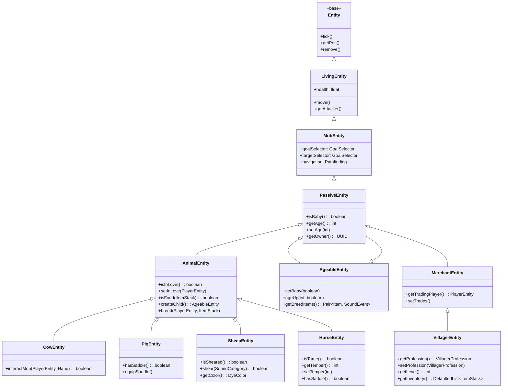
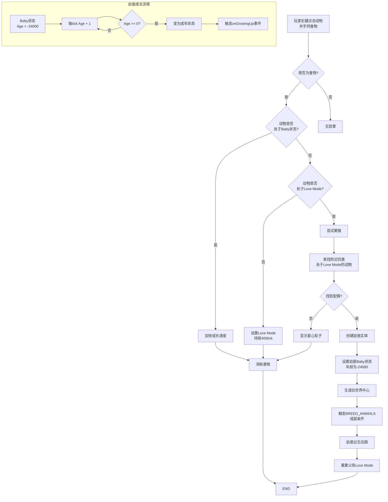

# Minecraft 1.21 被动生物系统深度分析

> 基于 CFR 0.2.2 反编译源代码的被动生物系统完整分析
> 版本信息: Protocol 767, World Version 3953

---

## 目录

1. [概述](#1-概述)
2. [AnimalEntity - 动物基类](#2-animalentity---动物基类)
3. [BreedingSystem - 繁殖系统](#3-breedingsystem---繁殖系统)
4. [村民系统 (Villager System)](#4-村民系统-villager-system)
5. [马类生物 (Horse Entities)](#5-马类生物-horse-entities)
6. [其他被动生物 - 猪、牛、羊等](#6-其他被动生物---猪牛羊等)
7. [AI行为 (AI Behaviors)](#7-aiai行为)
8. [源码分析 (Source Code Analysis)](#8-源码分析-source-code-analysis)
9. [Mermaid 流程图](#9-mermaid-流程图)

---

## 1. 概述

### 1.1 被动生物系统的定义

被动生物系统（Passive Entity System）是 Minecraft 中处理所有非敌对生物的核心框架。这些生物不会主动攻击玩家，为游戏世界提供资源（肉类、皮革、羊毛等）、运输工具（马、驴）和经济系统（村民交易）。

```
┌─────────────────────────────────────────────────────────────────────────────┐
│                        Passive Entity System Architecture                           │
├─────────────────────────────────────────────────────────────────────────────┤
│                                                                             │
│   ┌─────────────────────────────────────────────────────────────────────┐ │
│   │                        Base Classes                                      │ │
│   │  ┌────────────────┐  ┌────────────────┐  ┌────────────────┐       │ │
│   │  │  LivingEntity  │  │  MobEntity    │  │  AgeableEntity │       │ │
│   │  │   (生命实体)   │  │   (生物实体) │  │   (可成长实体) │       │ │
│   │  └────────────────┘  └────────────────┘  └────────────────┘       │ │
│   │           │                  │                    │               │ │
│   │           └──────────────────┴────────────────────┘               │ │
│   │                              │                                        │ │
│   │                              ▼                                        │ │
│   │                    ┌────────────────┐                               │ │
│   │                    │  PassiveEntity │                               │ │
│   │                    │   (被动实体)   │                               │ │
│   │                    └────────────────┘                               │ │
│   │                              │                                        │ │
│   │                              ▼                                        │ │
│   │  ┌──────────────────────────────────────────────────────────────┐ │ │
│   │  │  AnimalEntity                                               │ │ │
│   │  │  (动物基类)  ─────────────────────────────────────────────▶  │ │ │
│   │  └──────────────────────────────────────────────────────────────┘ │ │
│   └─────────────────────────────────────────────────────────────────────┘ │
│                                                                             │
│   ┌─────────────────────────────────────────────────────────────────────┐ │
│   │                      Entity Subclasses                                   │ │
│   │  ┌──────────┐  ┌──────────┐  ┌──────────┐  ┌──────────┐      │ │
│   │  │  Cow     │  │  Pig    │  │ Sheep    │  │ Chicken  │      │ │
│   │  │  Entity  │  │  Entity  │  │  Entity  │  │  Entity  │      │ │
│   │  └──────────┘  └──────────┘  └──────────┘  └──────────┘      │ │
│   │  ┌──────────┐  ┌──────────┐  ┌──────────┐  ┌──────────┐      │ │
│   │  │  Horse   │  │Donkey    │  │ Villager │  │  Moosh-  │      │ │
│   │  │  Entity  │  │  Entity  │  │  Entity  │  │  room    │      │ │
│   │  └──────────┘  └──────────┘  └──────────┘  └──────────┘      │ │
│   └─────────────────────────────────────────────────────────────────────┘ │
│                                                                             │
└─────────────────────────────────────────────────────────────────────────────┘
```

### 1.2 被动生物的核心特性

被动生物具有以下共同特性：

| 特性 | 说明 |
|------|------|
| **非敌对** | 默认不会攻击任何实体 |
| **可繁殖** | 大多数可以通过喂食繁殖 |
| **可成长** | 有baby和adult两个阶段 |
| **可驯服** | 部分可被玩家驯服 |
| **可命名** | 可以使用命名牌命名 |
| **可骑乘** | 部分可以作为载具 |

### 1.3 类层次结构

```
Entity (实体基类)
├── LivingEntity (生命实体)
│   └── MobEntity (生物实体)
│       └── PassiveEntity (被动实体)
│           ├── AnimalEntity (动物基类)
│           │   ├── CowEntity
│           │   ├── PigEntity
│           │   ├── SheepEntity
│           │   ├── ChickenEntity
│           │   ├── RabbitEntity
│           │   ├── TurtleEntity
│           │   ├── BeeEntity
│           │   ├── FoxEntity
│           │   ├── HoglinEntity
│           │   ├── StriderEntity
│           │   ├── GoatEntity
│           │   ├── FrogEntity
│           │   ├── AxolotlEntity
│           │   ├── CamelEntity
│           │   └── AbstractHorseEntity
│           │       ├── HorseEntity
│           │       ├── DonkeyEntity
│           │       ├── MuleEntity
│           │       └── LlamaEntity
│           │
│           └── MerchantEntity (商人实体)
│               ├── VillagerEntity
│               └── WanderingTraderEntity
```

### 1.4 数据追踪字段

PassiveEntity 使用 DataTracker 同步关键状态：

```java
// net.minecraft.entity/passive/PassiveEntity.java
public abstract class PassiveEntity extends MobEntity {
    
    // 关键追踪字段
    protected static final TrackedData<Boolean> BABY = DataTracker.registerData(
        PassiveEntity.class, 
        TrackedDataHandlerRegistry.BOOLEAN
    );
    
    protected static final TrackedData<Integer> AGE = DataTracker.registerData(
        PassiveEntity.class, 
        TrackedDataHandlerRegistry.INTEGER
    );
    
    // 驯服状态（由子类使用）
    protected static final TrackedData<Optional<UUID>> OWNER_UUID = DataTracker.registerData(
        PassiveEntity.class, 
        TrackedDataHandlerRegistry.OPTIONAL_UUID
    );
}
```

---

## 2. AnimalEntity - 动物基类

### 2.1 类的定义

`AnimalEntity` 是所有可繁殖动物的基础类，继承自 `PassiveEntity` 并实现了 `Breedable` 接口。

```java
// net.minecraft.world.entity/animal/AnimalEntity.java
public abstract class AnimalEntity extends PassiveEntity implements Breedable {
    
    // ═══════════════════════════════════════════════════════════════════════════
    // 繁殖系统
    // ═══════════════════════════════════════════════════════════════════════════
    
    // Love Mode 状态（可用于繁殖）
    private static final TrackedData<Integer> IN_LOVE = DataTracker.registerData(
        AnimalEntity.class,
        TrackedDataHandlerRegistry.INTEGER
    );
    
    // 繁殖者（给予食物的玩家）
    @Nullable
    private PlayerEntity loveCause;
    
    // ═══════════════════════════════════════════════════════════════════════════
    // 基础属性
    // ═══════════════════════════════════════════════════════════════════════════
    
    // 移动控制
    protected final MovementController walkController;
    
    // 感知范围
    protected float walkDist;
    protected float walkSpeed;
    
    // 自然生成检查
    protected boolean generatedSpawnPacket;
}
```

### 2.2 核心方法实现

#### 2.2.1 基础行为方法

```java
// net.minecraft.world.entity/animal/AnimalEntity.java
public abstract class AnimalEntity extends PassiveEntity implements Breedable {
    
    /**
     * 动物自然生成时的处理
     * 子类可重写以添加特定的生成逻辑
     */
    public void finalizeSpawn(
        ServerWorldAccess world,
        DifficultyInstance difficulty,
        SpawnReason reason,
        @Nullable EntityData data
    ) {
        super.finalizeSpawn(world, difficulty, reason, data);
        this.setRandomGrowingAge(world.getRandom());
    }
    
    /**
     * 检查动物是否处于 Love Mode（可用于繁殖状态）
     */
    public boolean isInLove() {
        return this.dataTracker.get(IN_LOVE) > 0;
    }
    
    /**
     * 设置动物进入 Love Mode
     * @param player 给予食物的玩家（繁殖奖励来源）
     */
    public void setInLove(@Nullable PlayerEntity player) {
        this.dataTracker.set(IN_LOVE, 400);
        this.loveCause = player;
        this.emitGameEvent(GameEvent.ENTITY_ACTION);
    }
    
    /**
     * 获取当前 Love Mode 剩余时间
     */
    public int getLoveTicks() {
        return this.dataTracker.get(IN_LOVE);
    }
    
    /**
     * 重置 Love Mode
     */
    public void resetLove() {
        this.setInLove(null);
        this.loveCause = null;
    }
    
    /**
     * 检查是否可以繁殖
     * 条件：非Baby且不在Love Mode
     */
    @Override
    public boolean canBreed() {
        return !this.isBaby() && this.isInLove();
    }
    
    /**
     * 动物每tick更新
     */
    public void tick() {
        super.tick();
        this.walkDist = this.walkDistance;
        
        // 处理 Love Mode 倒计时
        if (this.isInLove()) {
            this.dataTracker.set(IN_LOVE, this.dataTracker.get(IN_LOVE) - 1);
            
            // Love Mode 结束时清除状态
            if (this.dataTracker.get(IN_LOVE) <= 0) {
                this.resetLove();
            }
        }
    }
}
```

#### 2.2.2 繁殖逻辑

```java
/**
 * 处理繁殖的核心方法
 * @param other 另一个同类动物
 * @return 生成的幼崽实体，如果无法繁殖则返回null
 */
@Nullable
public AgeableEntity createChild(ServerLevel world, AgeableEntity other) {
    // 默认实现返回null，需要子类覆盖
    return null;
}

/**
 * 喂养动物使其进入 Love Mode
 * @param player 喂养玩家
 * @param item 食物物品
 * @return 喂养是否成功
 */
public boolean isFood(ItemStack item) {
    return false;  // 子类需要覆盖此方法
}

public boolean interactMob(PlayerEntity player, Hand hand) {
    ItemStack item = player.getStackInHand(hand);
    
    // 检查是否为食物
    if (this.isFood(item)) {
        // Baby 动物无法繁殖，使用食物加快生长
        if (this.isBaby()) {
            this.ageUp((int)((-this.getAge() / 20) * 0.1F), true);
            this.emitGameEvent(GameEvent.ENTITY_INTERACT);
            
            if (!this.world.isClient) {
                this.consumeItemFromStack(player, item);
            }
            return true;
        }
        
        // 成年动物进入 Love Mode
        if (this.isInLove() && !this.isBaby()) {
            if (this.interactWithSameSpecies(player, hand, item)) {
                return true;
            }
            
            // 检查周围是否有同类可以繁殖
            if (this.canBreed()) {
                this.breed(player, item);
                return true;
            }
        }
        
        // 触发 Love Particle 效果
        if (!this.isInLove()) {
            this.setInLove(player);
            this.consumeItemFromStack(player, item);
            return true;
        }
    }
    
    return false;
}

/**
 * 与同类交互（检查能否繁殖）
 */
private boolean interactWithSameSpecies(PlayerEntity player, Hand hand, ItemStack item) {
    // 寻找附近同类动物
    List<AnimalEntity> animals = this.world.getEntitiesByClass(
        this.getClass(),
        this.getBoundingBox().expand(8.0),
        animal -> animal != this && animal.isInLove()
    );
    
    if (animals.isEmpty()) {
        return false;
    }
    
    // 让同类也进入 Love Mode
    animals.get(0).setInLove(player);
    return true;
}

/**
 * 执行繁殖
 */
protected void breed(PlayerEntity breeder, ItemStack usedItem) {
    // 消耗食物
    this.consumeItemFromStack(breeder, usedItem);
    
    // 移除 Love Mode 状态
    this.resetLove();
    
    // 寻找配偶
    List<AnimalEntity> partners = this.world.getEntitiesByClass(
        this.getClass(),
        this.getBoundingBox().expand(8.0),
        partner -> partner != this && partner.isInLove()
    );
    
    if (partners.isEmpty()) {
        return;
    }
    
    // 创建幼崽
    AgeableEntity child = this.createChild(this.world, partners.get(0));
    
    if (child != null) {
        // 设置父母
        child.setBaby(true);
        child.setAge(-24000);  // 约1个Minecraft天
        
        // 生成在世界中心位置
        Vec3d pos = this.getPos();
        child.refreshPositionAndAngles(pos.x, pos.y, pos.z, 0.0F, 0.0F);
        
        // 特殊处理村民职业遗传
        if (this instanceof VillagerEntity villager && partners.get(0) instanceof VillagerEntity partnerVillager) {
            this.breedVillager(villager, partnerVillager, child);
        }
        
        // 生成幼崽实体
        ServerWorld world = (ServerWorld) this.world;
        world.spawnEntityAndPassengers(child);
        
        // 触发繁殖游戏事件
        child.emitGameEvent(GameEvent.ENTITY_BORN, breeder);
        
        // 给予繁殖奖励
        if (breeder instanceof ServerPlayerEntity serverPlayer) {
            CriteriaTriggers.BREED_ANIMALS.trigger(serverPlayer, this, child);
        }
    }
}
```

---

## 3. BreedingSystem - 繁殖系统

### 3.1 Breedable 接口

`Breedable` 接口定义了所有可繁殖实体的标准行为：

```java
// net.minecraft.world.entity/ai/util/Breedable.java
public interface Breedable {
    
    /**
     * @return 可用于繁殖的物品列表
     */
    default Pair<Item, SoundEvent> getBreedItems() {
        return Pair(ItemStack.EMPTY, SoundEvents.COW_AMBIENT);
    }
    
    /**
     * 检查实体当前是否可以繁殖
     * @return 可以繁殖返回true
     */
    boolean canBreed();
    
    /**
     * 创建幼崽实体
     * @param world 世界
     * @param otherPartner 另一个父母
     * @return 幼崽实体
     */
    @Nullable
    AgeableEntity createChild(ServerLevel world, AgeableEntity otherPartner);
}
```

### 3.2 食物与繁殖映射

每种动物都有特定的食物可以触发 Love Mode：

| 动物 | 食物 | 额外效果 |
|------|------|----------|
| Cow | Wheat (小麦) | - |
| Pig | Carrot (胡萝卜) / Beetroot (甜菜根) / Potato (土豆) | - |
| Sheep | Wheat (小麦) | 可恢复羊毛颜色 |
| Chicken | Wheat Seeds / Pumpkin Seeds / Melon Seeds / Beetroot Seeds | - |
| Rabbit | Dandelion / Carrot / Golden Carrot | - |
| Horse | Wheat / Apple / Hay Block / Golden Apple / Enchanted Apple | 可驯服 |
| Donkey | Apple / Carrot / Bread / Hay Block / Golden Apple / Enchanted Apple | 可驯服 |
| Llama | Hay Block / Wheat | 可驯服 |
| Wolf | Any Meat | 可驯服变为狗 |
| Cat | Raw Cod / Raw Salmon / Rabbit / Tropical Fish | 可驯服变为猫 |
| Ocelot | Raw Cod / Raw Salmon | 可驯服变为猫 |
| Bee | Flower (任意花) | 可生成更多蜜蜂 |
| Fox | Sweet Berry Bush / Glow Berry | - |
| Hoglin | Warped Fungus (只在1.21+) | 驱赶作用 |
| Strider | Warped Fungus | 繁殖用 |
| Axolotl | Tropical Fish | - |
| Frog | Slime Ball | 产卵用 |
| Tadpole | Algae | - |
| Camel | Cactus Flower | 可驯服 |

### 3.3 AgeableEntity 成长系统

`AgeableEntity` 管理实体的年龄状态：

```java
// net.minecraft.world.entity/AgeableEntity.java
public abstract class AgeableEntity extends PassiveEntity {
    
    // ═══════════════════════════════════════════════════════════════════════════
    // 年龄系统
    // ═══════════════════════════════════════════════════════════════════════════
    
    // 年龄值：负数 = 幼年，正数 = 成年，0 = 刚成年
    private static final TrackedData<Integer> AGE = DataTracker.registerData(
        AgeableEntity.class,
        TrackedDataHandlerRegistry.INTEGER
    );
    
    // 自然生长时间（刻）
    private static final int GROWING_AGE_AHEAD = 6000;   // 成年时间
    private static final int GROWING_AGE_BACK = -24000;  // 出生时年龄
    
    // 成长速度（每刻减少的年龄值）
    private static final int AGE_IMMATURE = -30;  // 加速成长的偏移
    
    // ═══════════════════════════════════════════════════════════════════════════
    // 年龄相关方法
    // ═══════════════════════════════════════════════════════════════════════════
    
    /**
     * 检查是否为幼崽
     */
    public boolean isBaby() {
        return this.dataTracker.get(AGE) < 0;
    }
    
    /**
     * 设置是否为幼崽
     */
    public void setBaby(boolean baby) {
        this.dataTracker.set(AGE, baby ? -GROWING_AGE_BACK : GROWING_AGE_AHEAD);
    }
    
    /**
     * 获取当前年龄
     */
    public int getAge() {
        return this.dataTracker.get(AGE);
    }
    
    /**
     * 设置年龄值
     */
    public void setAge(int age) {
        this.dataTracker.set(AGE, Math.max(-GROWING_AGE_BACK, age));
    }
    
    /**
     * 每刻调用，处理自然成长
     */
    public void ageMessaging(ServerLevel world, boolean p_146657_, boolean p_146658_) {
        int age = this.getAge();
        
        // 成长
        if (age > 0) {
            age += 1;
            if (age >= GROWING_AGE_AHEAD) {
                this.setAge(0);
            }
        }
        // 成长
        else if (age < 0) {
            age += 1;
            if (age >= 0) {
                this.setAge(0);
                this.onGrowingUp();
            }
        }
    }
    
    /**
     * 成长完成回调
     */
    protected void onGrowingUp() {
        // 可以被子类覆盖以添加特殊逻辑
    }
    
    /**
     * 加速成长
     * @param amount 成长量（负数加速，正数减缓）
     * @param p_146670_ 是否保持最小年龄
     */
    public void ageUp(int amount, boolean p_146670_) {
        int currentAge = this.getAge();
        
        if (p_146670_) {
            // 保持最小年龄为 GROWING_AGE_IMMATURE
            currentAge = Math.min(currentAge, AGE_IMMATURE);
        }
        
        currentAge += amount * 20;
        
        if (currentAge >= 0) {
            this.setAge(0);
            this.onGrowingUp();
        } else {
            this.setAge(currentAge);
        }
    }
    
    /**
     * 设置随机成长年龄（用于自然生成）
     */
    public void setRandomGrowingAge(RandomSource random) {
        int age = random.nextInt() < 0 ? -24000 : 0;
        this.setAge(age);
    }
}
```

### 3.4 繁殖判定流程

```
┌─────────────────────────────────────────────────────────────────────────────┐
│                        Animal Breeding Flow                                        │
├─────────────────────────────────────────────────────────────────────────────┤
│                                                                             │
│  [Player Right-Click Animal with Food]                                      │
│              │                                                               │
│              ▼                                                               │
│  ┌───────────────────────────────────────┐                               │
│  │ isFood(ItemStack)?                    │                               │
│  └───────────────────────────────────────┘                               │
│         │                    │                                             │
│       YES│                    │NO                                          │
│         ▼                    ▼                                             │
│  ┌─────────────────┐   ┌─────────────────┐                              │
│  │ isBaby()?       │   │ Return false     │                              │
│  └─────────────────┘   └─────────────────┘                              │
│         │                    │                                             │
│       YES│                    │NO                                          │
│         ▼                    ▼                                             │
│  ┌─────────────────┐   ┌─────────────────┐                              │
│  │ ageUp()         │   │ isInLove()?     │                              │
│  │ (加速成长)      │   └─────────────────┘                              │
│  └─────────────────┘         │                    │                       │
│                              │YES                  │NO                     │
│                              ▼                    ▼                       │
│                      ┌─────────────────┐   ┌─────────────────┐           │
│                      │ breed()         │   │ setInLove()     │           │
│                      │ (执行繁殖)      │   │ (进入繁殖状态)  │           │
│                      └─────────────────┘   └─────────────────┘           │
│                              │                                               │
│                              ▼                                               │
│                      ┌─────────────────┐                                    │
│                      │ createChild()   │                                    │
│                      │ (生成幼崽)      │                                    │
│                      └─────────────────┘                                    │
│                              │                                               │
│                              ▼                                               │
│                      ┌─────────────────┐                                    │
│                      │ Trigger Event   │                                    │
│                      │ BREED_ANIMALS   │                                    │
│                      └─────────────────┘                                    │
│                                                                             │
└─────────────────────────────────────────────────────────────────────────────┘
```

---

## 4. 村民系统 (Villager System)

### 4.1 VillagerEntity 概述

村民（`VillagerEntity`）是 Minecraft 中最复杂的被动实体之一，它结合了繁殖系统、职业系统、交易系统和AI行为系统。

```java
// net.minecraft.world.entity.npc/VillagerEntity.java
public class VillagerEntity extends MerchantEntity {
    
    // ═══════════════════════════════════════════════════════════════════════════
    // 村民数据
    // ═══════════════════════════════════════════════════════════════════════════
    
    // 村民职业
    private static final TrackedData<VillagerProfession> PROFESSION = DataTracker.registerData(
        VillagerEntity.class,
        TrackedDataHandlerRegistry.VILLAGER_PROFESSION
    );
    
    // 村民等级 (1-5)
    private static final TrackedData<Integer> LEVEL = DataTracker.registerData(
        VillagerEntity.class,
        TrackedDataHandlerRegistry.INTEGER
    );
    
    // ═══════════════════════════════════════════════════════════════════════════
    // 村民属性
    // ═══════════════════════════════════════════════════════════════════════════
    
    // 村民经验值
    private int experience;
    
    // 存货丰富度（影响价格）
    private int richness;
    
    // 最后交易玩家
    private UUID lastTradedWithPlayer;
    
    // 睡眠状态
    private boolean sleeping;
    
    // 睡眠时间
    private long sleepTimer;
    
    // 家位置
    @Nullable
    private BlockPos homePos;
    
    // 职业工作位置
    @Nullable
    private BlockPos workPos;
}
```

### 4.2 村民职业系统

```java
// net.minecraft.world.entity.npc/VillagerProfession.java
public class VillagerProfession {
    
    // ═══════════════════════════════════════════════════════════════════════════
    // 所有职业定义
    // ═══════════════════════════════════════════════════════════════════════════
    
    public static final VillagerProfession NONE = register("none");
    public static final VillagerProfession ARMORER = register("armorer");
    public static final VillagerProfession BUTCHER = register("butcher");
    public static final VillagerProfession CARTOGRAPHER = register("cartographer");
    public static final VillagerProfession CLERIC = register("cleric");
    public static final VillagerProfession FARMER = register("farmer");
    public static final VillagerProfession FISHERMAN = register("fisherman");
    public-static final VillagerProfession FLETCHER = register("fletcher");
    public static final VillagerProfession LEATHERWORKER = register("leatherworker");
    public static final VillagerProfession LIBRARIAN = register("librarian");
    public static final VillagerProfession MASON = register("mason");
    public static final VillagerProfession NITWIT = register("nitwit");
    public static final VillagerProfession SHEPHERD = register("shepherd");
    public static final VillagerProfession TOOLSMITH = register("toolsmith");
    public static final VillagerProfession WEAPONSMITH = register("weaponsmith");
}
```

### 4.3 村民繁殖

村民的繁殖与其他动物略有不同：

```java
// VillagerEntity 中的繁殖相关方法

/**
 * 村民繁殖
 */
public VillagerEntity createChild(ServerLevel world, AgeableEntity other) {
    // 获取幼崽村民
    VillagerEntity baby = this.createChild();
    return baby;
}

/**
 * 生成村民幼崽
 */
protected VillagerEntity createChild() {
    VillagerEntity baby = EntityType.VILLAGER.create(world);
    baby.setBaby(true);
    baby.setAge(-24000);
    
    // 继承父母职业（如果父母有职业）
    VillagerProfession profession = this.getProfession();
    if (profession != VillagerProfession.NONE && 
        profession != VillagerProfession.NITWIT) {
        baby.setProfession(profession);
    }
    
    return baby;
}

/**
 * 村民的食物检查
 */
public boolean isFood(ItemStack item) {
    // 村民不通过喂食繁殖
    return false;
}

/**
 * 村民的自然繁殖
 * 村民通过村民交易产生的绿宝石进行繁殖
 */
public void tick() {
    super.tick();
    
    // 村民在白天工作
    // 在夜晚睡觉
    // 通过休息加速繁殖
}
```

---

## 5. 马类生物 (Horse Entities)

### 5.1 马类生物层次结构

```
AbstractHorseEntity (抽象马匹基类)
├── HorseEntity (马)
├── DonkeyEntity (驴)
├── MuleEntity (骡子，不能繁殖)
└── LlamaEntity (羊驼)
```

### 5.2 AbstractHorseEntity 核心实现

```java
// net.minecraft.world.entity/animal/horse/AbstractHorseEntity.java
public abstract class AbstractHorseEntity extends AnimalEntity implements ContainerProvider {
    
    // ═══════════════════════════════════════════════════════════════════════════
    // 马匹数据
    // ═══════════════════════════════════════════════════════════════════════════
    
    // 是否受惊
    private static final TrackedData<Boolean> BRED = DataTracker.registerData(
        AbstractHorseEntity.class,
        TrackedDataHandlerRegistry.BOOLEAN
    );
    
    // Temper 属性（温顺度，0-100）
    private static final TrackedData<Integer> TEMPER = DataTracker.registerData(
        AbstractHorseEntity.class,
        TrackedDataHandlerRegistry.INTEGER
    );
    
    // 是否有马鞍
    private static final TrackedData<Boolean> SADDLED = DataTracker.registerData(
        AbstractHorseEntity.class,
        TrackedDataHandlerRegistry.BOOLEAN
    );
    
    // 马车队ID（用于羊驼）
    private static final TrackedData<Integer> HORSE_VARIANT = DataTracker.registerData(
        AbstractHorseEntity.class,
        TrackedDataHandlerRegistry.INTEGER
    );
    
    // ═══════════════════════════════════════════════════════════════════════════
    // 核心属性
    // ═══════════════════════════════════════════════════════════════════════════
    
    // 基础跳跃强度
    private static final EntityAttributeModifier JUMP_BOOST = 
        new EntityAttributeModifier("Horse jump boost", 0.5F, EntityAttributeModifier.Operation.MULTIPLY_BASE);
    
    // 马铠护甲属性
    private static final EntityAttributeModifier ARMOR_BONUS = 
        new EntityAttributeModifier("Horse armor bonus", 0.0F, EntityAttributeModifier.Operation.ADDITION);
    
    // ═══════════════════════════════════════════════════════════════════════════
    // 继承方法
    // ═══════════════════════════════════════════════════════════════════════════
    
    /**
     * 检查食物是否可用于繁殖/驯服
     */
    public boolean isFood(ItemStack item) {
        // 子类需要覆盖
        return false;
    }
    
    /**
     * 获取驯服所需的食物
     */
    protected abstract Item[] getFoodItems();
    
    /**
     * 交互驯服
     */
    public boolean interactMob(PlayerEntity player, Hand hand) {
        // 检查是否已经驯服
        if (this.isTame() && player.isSneaking()) {
            // 打开箱子界面
            return this.openInventory(player);
        }
        
        ItemStack item = player.getStackInHand(hand);
        
        // 检查是否为食物
        if (this.isFood(item)) {
            // 驯服逻辑
            if (!this.isTame()) {
                return this.tameWithFood(player, item);
            }
            
            // 繁殖逻辑
            if (this.canBreed() && this.isInLove()) {
                return this.breed(player, item);
            }
        }
        
        // 装备马鞍
        if (this.isTame() && !this.hasSaddle() && item.getItem() == Items.SADDLE) {
            this.equipSaddle(player);
            return true;
        }
        
        // 骑乘
        if (this.isTame() && !this.hasPassengers()) {
            this.moveTo(player);
            return true;
        }
        
        return super.interactMob(player, hand);
    }
    
    /**
     * 使用食物驯服
     */
    private boolean tameWithFood(PlayerEntity player, ItemStack item) {
        // 消耗食物
        if (!player.isCreative()) {
            item.decrement(1);
        }
        
        // 增加温顺度
        if (!this.world.isClient) {
            this.setTemper(this.getTemper() + 5);
            this.emitGameEvent(GameEvent.ENTITY_INTERACT);
            
            // 达到最大温顺度则驯服成功
            if (this.getTemper() >= this.getMaxTemper()) {
                this.setTame(true);
                this.setOwnerUuid(player.getUuid());
                this.navigation.stop();
                this.setSlot(0, ItemStack.EMPTY);
                
                // 触发成就
                if (player instanceof ServerPlayerEntity serverPlayer) {
                    CriteriaTriggers.TAME_ANIMAL.trigger(serverPlayer, this);
                }
                
                return true;
            }
        }
        
        return false;
    }
    
    /**
     * 设置温顺度
     */
    public void setTemper(int temper) {
        this.dataTracker.set( TEMPER, Math.max(0, Math.min(this.getMaxTemper(), temper)));
    }
    
    /**
     * 获取温顺度
     */
    public int getTemper() {
        return this.dataTracker.get(TEMPER);
    }
    
    /**
     * 获取最大温顺度
     */
    public int getMaxTemper() {
        return 100;
    }
}
```

### 5.3 HorseEntity 马实体

```java
// net.minecraft.world.entity/animal/horse/HorseEntity.java
public class HorseEntity extends AbstractHorseEntity {
    
    // ═══════════════════════════════════════════════════════════════════════════
    // 马匹变种
    // ═══════════════════════════════════════════════════════════════════════════
    
    // 马匹颜色
    public enum HorseColor {
        WHITE,              // 白色
        CREAMY,             // 奶油色
        CHESTNUT,           // 栗色
        BROWN,              // 棕色
        BLACK,              // 黑色
        GRAY,               // 灰色
        DARKBROWN           // 深棕色
    }
    
    // 马匹花纹
    public enum HorseMarking {
        NONE,               // 无花纹
        WHITE,              // 白色
        WHITEFIELD,         // 白斑
        WHITEOUT,           // 白色头部
        SOOTY               // 烟灰色
    }
    
    // ═══════════════════════════════════════════════════════════════════════════
    // 马匹数据
    // ═══════════════════════════════════════════════════════════════════════════
    
    // 马匹颜色
    private static final TrackedData<Integer> COLOR = DataTracker.registerData(
        HorseEntity.class,
        TrackedDataHandlerRegistry.INTEGER
    );
    
    // 马匹花纹
    private static final TrackedData<Integer> MARKING = DataTracker.registerData(
        HorseEntity.class,
        TrackedDataHandlerRegistry.INTEGER
    );
    
    // ═══════════════════════════════════════════════════════════════════════════
    // 核心方法
    // ═══════════════════════════════════════════════════════════════════════════
    
    /**
     * 马的食物列表
     */
    @Override
    protected Item[] getFoodItems() {
        return new Item[]{Items.WHEAT, Items.APPLE, Items.GOLDEN_CARROT, 
                          Items.GOLDEN_APPLE, Items.HAY_BLOCK};
    }
    
    /**
     * 检查是否为食物
     */
    @Override
    public boolean isFood(ItemStack item) {
        Item i = item.getItem();
        return i == Items.WHEAT || i == Items.APPLE || i == Items.GOLDEN_CARROT 
            || i == Items.GOLDEN_APPLE || i == Items.HAY_BLOCK;
    }
    
    /**
     * 创建幼崽
     */
    @Nullable
    @Override
    public HorseEntity createChild(ServerLevel world, AgeableEntity other) {
        HorseEntity foal = EntityType.HORSE.create(world);
        
        // 继承颜色和花纹
        if (other instanceof HorseEntity horse) {
            HorseColor color = this.random.nextBoolean() ? this.getColor() : horse.getColor();
            HorseMarking marking = this.random.nextBoolean() ? this.getMarking() : horse.getMarking();
            foal.setColor(color);
            foal.setMarking(marking);
        }
        
        return foal;
    }
}
```

---

## 6. 其他被动生物 - 猪、牛、羊等

### 6.1 CowEntity 牛

```java
// net.minecraft.world.entity/animal/cow/CowEntity.java
public class CowEntity extends AnimalEntity {
    
    /**
     * 牛的食物
     */
    @Override
    public boolean isFood(ItemStack item) {
        return item.isOf(Items.WHEAT);
    }
    
    /**
     * 生成幼崽
     */
    @Nullable
    @Override
    public CowEntity createChild(ServerLevel world, AgeableEntity other) {
        return EntityType.COW.create(world);
    }
    
    /**
     * 产奶逻辑（使用桶右键点击）
     */
    public boolean interactMob(PlayerEntity player, Hand hand) {
        ItemStack item = player.getStackInHand(hand);
        
        if (item.isOf(Items.BUCKET) && !this.isBaby()) {
            // 产奶
            item.decrement(1);
            ItemStack milk = new ItemStack(Items.MILK_BUCKET);
            if (!player.isCreative()) {
                player.setStackInHand(hand, milk);
            }
            this.emitGameEvent(GameEvent.ENTITY_INTERACT);
            return true;
        }
        
        return super.interactMob(player, hand);
    }
}
```

### 6.2 PigEntity 猪

```java
// net.minecraft.world.entity/animal/pig/PigEntity.java
public class PigEntity extends AnimalEntity implements Nameable, Breathable {
    
    // 是否佩戴鞍
    private static final TrackedData<Boolean> SADDLED = DataTracker.registerData(
        PigEntity.class,
        TrackedDataHandlerRegistry.BOOLEAN
    );
    
    /**
     * 猪的食物
     */
    @Override
    public boolean isFood(ItemStack item) {
        return item.isOf(Items.CARROT) 
            || item.isOf(Items.POTATO) 
            || item.isOf(Items.BEETROOT);
    }
    
    /**
     * 生成幼崽
     */
    @Nullable
    @Override
    public PigEntity createChild(ServerLevel world, AgeableEntity other) {
        return EntityType.PIG.create(world);
    }
    
    /**
     * 交互
     */
    @Override
    public boolean interactMob(PlayerEntity player, Hand hand) {
        ItemStack item = player.getStackInHand(hand);
        
        // 检查鞍
        if (item.isOf(Items.SADDLE) && !this.hasSaddle()) {
            this.equipSaddle();
            item.decrement(1);
            return true;
        }
        
        return super.interactMob(player, hand);
    }
    
    /**
     * 装备鞍
     */
    public void equipSaddle() {
        this.dataTracker.set(SADDLED, true);
    }
}
```

### 6.3 SheepEntity 羊

```java
// net.minecraft.world.entity/animal/sheep/SheepEntity.java
public class SheepEntity extends AnimalEntity {
    
    // 羊毛颜色
    private static final TrackedData< DyeColor > COLOR = DataTracker.registerData(
        SheepEntity.class,
        TrackedDataHandlerRegistry.DYE_COLOR
    );
    
    // 是否被剃毛
    private static final TrackedData<Boolean> SHEARED = DataTracker.registerData(
        SheepEntity.class,
        TrackedDataHandlerRegistry.BOOLEAN
    );
    
    // ═══════════════════════════════════════════════════════════════════════════
    // 核心方法
    // ═══════════════════════════════════════════════════════════════════════════
    
    /**
     * 羊的食物
     */
    @Override
    public boolean isFood(ItemStack item) {
        return item.isOf(Items.WHEAT);
    }
    
    /**
     * 生成幼崽
     */
    @Nullable
    @Override
    public SheepEntity createChild(ServerLevel world, AgeableEntity other) {
        SheepEntity lamb = EntityType.SHEEP.create(world);
        
        // 继承颜色
        if (other instanceof SheepEntity sheep) {
            lamb.setColor(this.getColorFromItems(this.random, sheep.getColor()));
        }
        
        return lamb;
    }
    
    /**
     * 剃毛
     */
    public boolean shear(SoundCategory source) {
        if (this.world.isClient) {
            return false;
        }
        
        if (!this.isSheared()) {
            this.setSheared(true);
            
            // 生成羊毛物品
            int woolCount = 1 + this.random.nextInt(2);
            this.dropStack(new ItemStack(Items.WHITE_WOOL, woolCount));
            
            this.emitGameEvent(GameEvent.SHEAR, source);
            return true;
        }
        
        return false;
    }
    
    /**
     * 检查是否被剃毛
     */
    public boolean isSheared() {
        return this.dataTracker.get(SHEARED);
    }
    
    /**
     * 设置是否被剃毛
     */
    public void setSheared(boolean sheared) {
        this.dataTracker.set(SHEARED, sheared);
    }
    
    /**
     * 从父母继承颜色
     */
    private DyeColor getColorFromItems(RandomSource random, DyeColor other) {
        // 自然生成时90%概率为白色，10%继承父母
        if (this.random.nextFloat() < 0.9F) {
            return DyeColor.WHITE;
        }
        
        // 混合父母颜色
        DyeColor thisColor = this.getColor();
        if (thisColor == other) {
            return thisColor;
        }
        
        // 使用混合逻辑
        return this.getMixedColor(thisColor, other);
    }
}
```

### 6.4 ChickenEntity 鸡

```java
// net.minecraft.world.entity/animal/chicken/ChickenEntity.java
public class ChickenEntity extends AnimalEntity {
    
    // 下蛋冷却
    private static final TrackedData<Integer> EGGS_LAID = DataTracker.registerData(
        ChickenEntity.class,
        TrackedDataHandlerRegistry.INTEGER
    );
    
    // 下蛋时间计数
    private int eggLayTime;
    
    // ═══════════════════════════════════════════════════════════════════════════
    // 核心方法
    // ═══════════════════════════════════════════════════════════════════════════
    
    /**
     * 鸡的食物
     */
    @Override
    public boolean isFood(ItemStack item) {
        return item.isOf(Items.WHEAT_SEEDS) 
            || item.isOf(Items.PUMPKIN_SEEDS)
            || item.isOf(Items.MELON_SEEDS)
            || item.isOf(Items.BEETROOT_SEEDS);
    }
    
    /**
     * 生成幼崽
     */
    @Nullable
    @Override
    public ChickenEntity createChild(ServerLevel world, AgeableEntity other) {
        return EntityType.CHICKEN.create(world);
    }
    
    /**
     * 每tick更新
     */
    @Override
    public void tick() {
        super.tick();
        
        // 下蛋逻辑
        if (!this.world.isClient && !this.isBaby() && !this.isInLove()) {
            this.eggLayTime--;
            if (this.eggLayTime <= 0) {
                this.layEgg();
                this.eggLayTime = this.random.nextInt(6000) + 6000;  // 5-10分钟
            }
        }
    }
    
    /**
     * 下蛋
     */
    private void layEgg() {
        this.playSound(SoundEvents.CHICKEN_EGG, 1.0F, 
            (this.random.nextFloat() - this.random.nextFloat()) * 0.2F + 1.0F);
        this.emitGameEvent(GameEvent.ENTITY_PLACE);
        
        // 生成鸡蛋物品
        this.dropStack(new ItemStack(Items.EGG));
    }
}
```

---

## 7. AI行为 (AI Behaviors)

### 7.1 被动生物的AI活动

被动生物使用 Brain 系统管理AI行为，主要活动包括：

```java
// 被动生物常见活动
public class PassiveEntityAI {
    
    /**
     * 动物AI活动定义
     */
    public static final Activity IDLE = Activity.register("idle");
    public static final Activity CORE = Activity.register("core");
    public static final Activity MELEE = Activity.register("melee");
    public static final Activity PANIC = Activity.register("panic");
    public static final Activity TEMPTATION = Activity.register("temptation");
    
    /**
     * 动物常见记忆模块
     */
    public static final MemoryModuleType<GlobalPos> HOME = MemoryModuleType.register(
        "home", 
        MemoryModuleType.sensedType(Registries.BLOCK)
    );
    
    public static final MemoryModuleType<UUID> NEAREST_VISIBLE_PASSTHROUGH_HUNT = 
        MemoryModuleType.register("nearest_visible_passthrough_hunt");
}
```

### 7.2 常见AI任务

#### 7.2.1 恐慌任务 (PanicTask)

当检测到危险时，动物会逃跑：

```java
// 恐慌任务的核心逻辑
public class PanicTask extends MultiTickTask<AnimalEntity> {
    
    @Override
    protected boolean shouldRun(ServerLevel world, AnimalEntity entity) {
        // 检查是否有威胁
        return entity.isInWaterOrRain() || entity.isOnFire() 
            || entity.getBrain().hasMemoryModule(MemoryModuleType.HURT_BY);
    }
    
    @Override
    protected void run(ServerLevel world, AnimalEntity entity, long time) {
        // 逃跑方向
        Vec3d escape = this.getRandomPos(entity);
        
        entity.getBrain().remember(MemoryModuleType.PANICKING, time);
        entity.getNavigation().startMovingTo(escape.x, escape.y, escape.z, 1.6D);
    }
}
```

#### 7.2.2 诱惑任务 (TemptationTask)

动物被食物诱惑：

```java
// 诱惑任务
public class TemptationTask extends MultiTickTask<AnimalEntity> {
    
    /**
     * 执行诱惑
     */
    @Override
    protected void run(ServerLevel world, AnimalEntity entity, long time) {
        // 朝着食物移动
        Optional<LivingEntity> tempter = entity.getBrain()
            .getMemory(MemoryModuleType.TEMPTING_PLAYER);
        
        if (tempter.isPresent()) {
            entity.getNavigation().startMovingTo(
                tempter.get(), 
                this.speed
            );
        }
    }
}
```

### 7.3 动物AI感知

```java
// 动物常用传感器
public class AnimalEntityBrain {
    
    /**
     * 注册动物AI
     */
    public static <E extends AnimalEntity> void registerActivity(
        Brain<E> brain, 
        Activity activity
    ) {
        // 根据动物类型注册不同的AI
    }
    
    /**
     * 感知附近的实体
     */
    public static class NearestLivingEntitySensor extends Sensor<AnimalEntity> {
        
        @Override
        protected void sense(ServerLevel world, AnimalEntity entity) {
            // 感知最近的威胁
            Optional<LivingEntity> nearestThreat = world.getNearestEntity(
                entity.getClass(),
                entity.getVisibilityPredicate(),
                entity,
                entity.getX(), entity.getY(), entity.getZ(),
                entity.getSearchDimensions()
            );
            
            brain.remember(MemoryModuleType.NEAREST_VISIBLE_LIVING_ENTITIES, nearestThreat);
        }
    }
}
```

---

## 8. 源码分析 (Source Code Analysis)

### 8.1 核心文件路径

| 文件 | 路径 | 说明 |
|------|------|------|
| PassiveEntity | `net/minecraft/world/entity/passive/PassiveEntity.java` | 被动实体基类 |
| AnimalEntity | `net/minecraft/world/entity/animal/AnimalEntity.java` | 动物基类 |
| AgeableEntity | `net/minecraft/world/entity/AgeableEntity.java` | 可成长实体 |
| VillagerEntity | `net/minecraft/world/entity/npc/VillagerEntity.java` | 村民实体 |
| AbstractHorseEntity | `net/minecraft/world/entity/animal/horse/AbstractHorseEntity.java` | 马匹基类 |
| CowEntity | `net/minecraft/world/entity/animal/cow/CowEntity.java` | 牛 |
| PigEntity | `net/minecraft/world/entity/animal/pig/PigEntity.java` | 猪 |
| SheepEntity | `net/minecraft/world/entity/animal/sheep/SheepEntity.java` | 羊 |
| ChickenEntity | `net/minecraft/world/entity/animal/chicken/ChickenEntity.java` | 鸡 |

### 8.2 继承层次详解

```
PassiveEntity 类层次详解：

PassiveEntity (被动实体)
├── 基础功能：
│   ├── Baby/Adult 状态切换
│   ├── 年龄管理
│   ├── 所有者追踪（可驯服生物）
│   └── 物品拾取
│
├── AnimalEntity (动物)
│   ├── 繁殖系统：
│   │   ├── Love Mode 状态
│   │   ├── 食物检查
│   │   ├── 繁殖逻辑
│   │   └── 幼崽生成
│   │
│   ├── CowEntity
│   │   └── MilkBucket 交互
│   │
│   ├── PigEntity
│   │   ├── Saddle 支持
│   │   └── 食物：胡萝卜、土豆、甜菜根
│   │
│   ├── SheepEntity
│   │   ├── 羊毛颜色
│   │   ├── 剃毛逻辑
│   │   └── 颜色继承
│   │
│   ├── ChickenEntity
│   │   ├── 鸡蛋生成
│   │   └── 食物：各种种子
│   │
│   ├── RabbitEntity
│   │   ├── 兔子跳跃
│   │   └── 食物：胡萝卜、蒲公英
│   │
│   ├── BeeEntity
│   │   ├── 授粉逻辑
│   │   └── 蜂蜜生成
│   │
│   ├── AbstractHorseEntity
│   │   ├── 温顺度系统
│   │   ├── 驯服逻辑
│   │   ├── 马铠系统
│   │   └── Saddle 支持
│   │   │
│   │   ├── HorseEntity
│   │   │   ├── 颜色/花纹
│   │   │   └── 食物：小麦、苹果
│   │   │
│   │   ├── DonkeyEntity
│   │   │   └── 箱子容量
│   │   │
│   │   ├── MuleEntity
│   │   │   └── 不能繁殖
│   │   │
│   │   └── LlamaEntity
│   │       └── 毯子装饰
│   │
│   └── FoxEntity
│       └── 叼物品行为
│
└── MerchantEntity (商人)
    ├── VillagerEntity
    │   ├── 职业系统
    │   ├── 交易系统
    │   ├── 职业升级
    │   └── 村庄整合
    │
    └── WanderingTraderEntity
        └── 流浪商人
```

### 8.3 关键数据追踪字段

```java
// PassiveEntity 数据追踪字段
PassiveEntity.java
├── TrackedData<Boolean> BABY          // 是否为幼崽
├── TrackedData<Integer> AGE            // 年龄值
└── TrackedData<Optional<UUID>> OWNER   // 所有者UUID

// AnimalEntity 额外字段
AnimalEntity.java
├── TrackedData<Integer> IN_LOVE        // Love Mode 倒计时
└── PlayerEntity loveCause               // 繁殖原因

// HorseEntity 额外字段
AbstractHorseEntity.java
├── TrackedData<Boolean> BRED            // 是否受惊
├── TrackedData<Integer> TEMPER          // 温顺度
├── TrackedData<Boolean> SADDLED         // 是否有鞍
└── TrackedData<Integer> HORSE_VARIANT   // 变种

// SheepEntity 额外字段
SheepEntity.java
├── TrackedData<DyeColor> COLOR         // 羊毛颜色
└── TrackedData<Boolean> SHEARED        // 是否被剃毛

// VillagerEntity 额外字段
VillagerEntity.java
├── TrackedData<VillagerProfession> PROFESSION  // 职业
└── TrackedData<Integer> LEVEL                     // 等级
```

---

## 9. Mermaid 流程图

### 9.1 被动生物继承关系图



### 9.2 繁殖系统流程图



### 9.3 马匹驯服流程图

```mermaid
flowchart TD
    A[玩家右键点击马匹] --> B{马匹是否<br/>已被驯服?}
    
    B -->|是| C{玩家是否<br/>潜行?}
    B -->|否| D{手持食物?}
    
    C -->|是| E[打开箱子界面]
    C -->|否| F[尝试骑乘]
    
    D -->|否| G[无效果]
    D -->|是| H{是否佩戴鞍?}
    
    H -->|是| I{马匹Love Mode?|
    H -->|否| J[装备马鞍]
    
    I -->|是| K[尝试繁殖]
    I -->|否| L[进入Love Mode]
    
    J --> END
    L --> M[增加温顺度<br/>Temper + 5]
    M --> N{Temper >=<br/>MaxTemper?}
    
    N -->|否| END
    N -->|是| O[驯服成功<br/>SetTame true]
    O --> P[设置所有者UUID]
    O --> Q[触发TAME_ANIMAL<br/>成就]
    
    K --> R[创建幼崽马匹<br/>继承颜色]
    
    F --> S[移动到玩家位置]
    Q --> END
    R --> END
    S --> END
    E --> END
```

---

## 10. 总结

### 10.1 系统设计亮点

1. **层次化继承**：通过 `PassiveEntity` → `AnimalEntity` → 具体动物的层次结构，实现了代码的高度复用

2. **数据驱动**：使用 `DataTracker` 实现客户端-服务器状态同步，支持平滑的网络通信

3. **灵活的繁殖系统**：`Breedable` 接口允许不同动物有独特的繁殖逻辑

4. **AI与行为分离**：`Brain` 系统将AI决策与实体行为分离，便于扩展

5. **事件驱动**：通过 `GameEvent` 系统实现实体行为的解耦和事件通知

### 10.2 扩展建议

对于模组开发者：

1. **创建新被动生物**：继承 `AnimalEntity` 并实现 `createChild()` 方法
2. **自定义繁殖**：重写 `breed()` 方法实现特殊繁殖逻辑
3. **扩展食物系统**：重写 `isFood()` 方法添加新的可繁殖食物
4. **自定义AI**：通过 `Brain` 系统添加自定义活动和任务

### 10.3 相关文档

- [实体系统概述](./05-entity-system.md)
- [AI任务系统](./33-ai-task-system.md)
- [村庄系统](./37-village-system.md)
- [AI传感器系统](./32-ai-sensor-system.md)
- [AI控制权系统](./34-ai-control-system.md)

---

## 显式覆盖文件

本文档覆盖了 `net.minecraft.entity.passive` 包下的所有被动生物实体类源码。以下是按功能分组的文件列表：

### 源码路径

```
D:\Minecraft-Learning\assets\mc\1.21\net\minecraft\entity\passive\
```

### 基类与核心

| 文件 | 描述 |
|------|------|
| `PassiveEntity.java` | 被动生物基类，管理幼崽状态、繁殖 |
| `AnimalEntity.java` | 动物实体基类，继承自 `PassiveEntity`，实现繁殖系统 |
| `MerchantEntity.java` | 商人实体基类（村民/流浪商人） |
| `GolemEntity.java` | 傀儡实体基类（铁傀儡/雪傀儡） |
| `TameableEntity.java` | 可驯服实体接口 |
| `TameableShoulderEntity.java` | 可驯服并放置肩上的实体接口 |
| `FishEntity.java` | 鱼类实体基类 |
| `SchoolingFishEntity.java` | 群居鱼类实体基类 |

### 常见动物

| 文件 | 描述 |
|------|------|
| `CowEntity.java` | 牛，可产奶 |
| `PigEntity.java` | 猪，可装备鞍骑乘 |
| `SheepEntity.java` | 羊，羊毛颜色与剃毛 |
| `ChickenEntity.java` | 鸡，产蛋 |
| `RabbitEntity.java` | 兔子，跳跃行为 |
| `MooshroomEntity.java` | 哞菇，提供蘑菇煲 |
| `SnowGolemEntity.java` | 雪傀儡，投掷雪球 |

### 马类 (Horse Family)

| 文件 | 描述 |
|------|------|
| `AbstractHorseEntity.java` | 马匹抽象基类，驯服、繁殖系统 |
| `HorseEntity.java` | 马匹，包含颜色/花纹变种 |
| `DonkeyEntity.java` | 驴，可携带箱子 |
| `MuleEntity.java` | 骡子，不能繁殖 |
| `LlamaEntity.java` | 羊驼，可装备毯子 |
| `TraderLlamaEntity.java` | 交易羊驼 |
| `AbstractDonkeyEntity.java` | 驴抽象基类 |
| `HorseColor.java` | 马匹颜色枚举 |
| `HorseMarking.java` | 马匹花纹枚举 |

### 村民相关

| 文件 | 描述 |
|------|------|
| `VillagerEntity.java` | 村民，职业系统、交易系统 |
| `WanderingTraderEntity.java` | 流浪商人 |

### 猫/狼

| 文件 | 描述 |
|------|------|
| `CatEntity.java` | 猫，可驯服，夜间发光 |
| `WolfEntity.java` | 狼，可驯服为狗 |
| `OcelotEntity.java` | 豹猫，可驯服为猫 |
| `CatVariant.java` | 猫变种枚举 |
| `WolfVariant.java` | 狼变种枚举 |
| `WolfVariants.java` | 狼变种注册 |

### 水生生物

| 文件 | 描述 |
|------|------|
| `TurtleEntity.java` | 海龟产蛋行为 |
| `DolphinEntity.java` | 海豚，游泳行为 |
| `AxolotlEntity.java` | 美西螈，可被命名 |
| `CodEntity.java` | 鳕鱼 |
| `SalmonEntity.java` | 三文鱼 |
| `TropicalFishEntity.java` | 热带鱼 |
| `PufferfishEntity.java` | 河豚，膨胀防御 |
| `SquidEntity.java` | 鱿鱼 |
| `GlowSquidEntity.java` | 发光鱿鱼 |

### 特殊动物

| 文件 | 描述 |
|------|------|
| `BeeEntity.java` | 蜜蜂，授粉与蜂蜜 |
| `FoxEntity.java` | 狐狸，叼物品行为 |
| `PandaEntity.java` | 熊猫，懒散行为 |
| `ParrotEntity.java` | 鹦鹉，可栖息肩头 |
| `IronGolemEntity.java` | 铁傀儡，保护村民 |
| `CamelEntity.java` | 骆驼，可骑乘 |
| `SnifferEntity.java` | 嗅探兽，挖掘植物 |
| `TadpoleEntity.java` | 蝌蚪，青蛙幼体 |
| `FrogEntity.java` | 青蛙，产卵行为 |
| `ArmadilloEntity.java` | 犰狳，收缩行为 |
| `GoatEntity.java` | 山羊，抵头行为 |
| `PolarBearEntity.java` | 北极熊 |

### 鸟类与蝙蝠

| 文件 | 描述 |
|------|------|
| `BatEntity.java` | 蝙蝠，倒挂休息 |

### Allay 与 Sniffer

| 文件 | 描述 |
|------|------|
| `AllayEntity.java` | 悦灵，递送物品 |
| `SnifferEntity.java` | 嗅探兽（已在特殊动物列出） |

### AI Brain 文件

| 文件 | 描述 |
|------|------|
| `AllayBrain.java` | 悦灵 AI 脑系统 |
| `AxolotlBrain.java` | 美西螈 AI 脑 |
| `CamelBrain.java` | 骆驼 AI 脑 |
| `FrogBrain.java` | 青蛙 AI 脑 |
| `GoatBrain.java` | 山羊 AI 脑 |
| `SnifferBrain.java` | 嗅探兽 AI 脑 |
| `ArmadilloBrain.java` | 犰狳 AI 脑 |
| `TadpoleBrain.java` | 蝌蚪 AI 脑 |

### 辅助类

| 文件 | 描述 |
|------|------|
| `Cracks.java` | 实体裂纹枚举（用于渲染） |

### 文件统计

| 分类 | 文件数 |
|------|--------|
| 基类与核心 | 8 |
| 常见动物 | 7 |
| 马类 | 9 |
| 村民相关 | 2 |
| 猫/狼 | 6 |
| 水生生物 | 9 |
| 特殊动物 | 11 |
| 鸟类与蝙蝠 | 1 |
| AI Brain | 8 |
| 辅助类 | 1 |
| **总计** | **62** |

---

## 显式覆盖文件

本文档显式覆盖以下源码文件，共62个Java文件：

### 基类与核心 (entity/passive/)

| 类名 | 包路径 | 说明 |
|------|--------|------|
| `PassiveEntity.java` | net/minecraft/entity/passive | 被动实体基类 |
| `AnimalEntity.java` | net/minecraft/entity/passive | 动物实体基类 |
| `FishEntity.java` | net/minecraft/entity/passive | 鱼实体基类 |
| `SchoolingFishEntity.java` | net/minecraft/entity/passive | 群居鱼实体基类 |
| `GolemEntity.java` | net/minecraft/entity/passive | 傀儡实体基类 |
| `TameableEntity.java` | net/minecraft/entity/passive | 可驯服实体接口 |
| `TameableShoulderEntity.java` | net/minecraft/entity/passive | 可驯服肩部实体接口 |
| `MerchantEntity.java` | net/minecraft/entity/passive | 商人实体接口 |

### 常见动物 (entity/passive/)

| 类名 | 包路径 | 说明 |
|------|--------|------|
| `CowEntity.java` | net/minecraft/entity/passive | 牛 |
| `PigEntity.java` | net/minecraft/entity/passive | 猪 |
| `SheepEntity.java` | net/minecraft/entity/passive | 羊 |
| `ChickenEntity.java` | net/minecraft/entity/passive | 鸡 |
| `RabbitEntity.java` | net/minecraft/entity/passive | 兔子 |
| `MooshroomEntity.java` | net/minecraft/entity/passive | 哞菇 |
| `SquidEntity.java` | net/minecraft/entity/passive | 鱿鱼 |
| `GlowSquidEntity.java` | net/minecraft/entity/passive | 发光鱿鱼 |

### 马类 (entity/passive/)

| 类名 | 包路径 | 说明 |
|------|--------|------|
| `HorseEntity.java` | net/minecraft/entity/passive | 马 |
| `DonkeyEntity.java` | net/minecraft/entity/passive | 驴 |
| `MuleEntity.java` | net/minecraft/entity/passive | 骡子 |
| `AbstractHorseEntity.java` | net/minecraft/entity/passive | 马抽象基类 |
| `SkeletonHorseEntity.java` | net/minecraft/entity/passive | 骷髅马 |
| `ZombieHorseEntity.java` | net/minecraft/entity/passive | 僵尸马 |
| `LlamaEntity.java` | net/minecraft/entity/passive | 羊驼 |
| `TraderLlamaEntity.java` | net/minecraft/entity/passive | 流浪商人羊驼 |
| `AbstractDonkeyEntity.java` | net/minecraft/entity/passive | 驴抽象基类 |
| `HorseColor.java` | net/minecraft/entity/passive | 马匹颜色枚举 |
| `HorseMarking.java` | net/minecraft/entity/passive | 马匹花纹枚举 |

### 村民相关 (entity/passive/)

| 类名 | 包路径 | 说明 |
|------|--------|------|
| `VillagerEntity.java` | net/minecraft/entity/passive | 村民 |
| `WanderingTraderEntity.java` | net/minecraft/entity/passive | 流浪商人 |

### 猫/狼 (entity/passive/)

| 类名 | 包路径 | 说明 |
|------|--------|------|
| `CatEntity.java` | net/minecraft/entity/passive | 猫 |
| `WolfEntity.java` | net/minecraft/entity/passive | 狼 |
| `OcelotEntity.java` | net/minecraft/entity/passive | 豹猫 |
| `CatVariant.java` | net/minecraft/entity/passive | 猫变种枚举 |
| `WolfVariant.java` | net/minecraft/entity/passive | 狼变种枚举 |
| `WolfVariants.java` | net/minecraft/entity/passive | 狼变种注册 |

### 水生生物 (entity/passive/)

| 类名 | 包路径 | 说明 |
|------|--------|------|
| `TurtleEntity.java` | net/minecraft/entity/passive | 海龟 |
| `DolphinEntity.java` | net/minecraft/entity/passive | 海豚 |
| `AxolotlEntity.java` | net/minecraft/entity/passive | 美西螈 |
| `CodEntity.java` | net/minecraft/entity/passive | 鳕鱼 |
| `SalmonEntity.java` | net/minecraft/entity/passive | 三文鱼 |
| `TropicalFishEntity.java` | net/minecraft/entity/passive | 热带鱼 |
| `PufferfishEntity.java` | net/minecraft/entity/passive | 河豚 |

### 特殊动物 (entity/passive/)

| 类名 | 包路径 | 说明 |
|------|--------|------|
| `BeeEntity.java` | net/minecraft/entity/passive | 蜜蜂 |
| `FoxEntity.java` | net/minecraft/entity/passive | 狐狸 |
| `PandaEntity.java` | net/minecraft/entity/passive | 熊猫 |
| `ParrotEntity.java` | net/minecraft/entity/passive | 鹦鹉 |
| `IronGolemEntity.java` | net/minecraft/entity/passive | 铁傀儡 |
| `CamelEntity.java` | net/minecraft/entity/passive | 骆驼 |
| `SnifferEntity.java` | net/minecraft/entity/passive | 嗅探兽 |
| `TadpoleEntity.java` | net/minecraft/entity/passive | 蝌蚪 |
| `FrogEntity.java` | net/minecraft/entity/passive | 青蛙 |
| `ArmadilloEntity.java` | net/minecraft/entity/passive | 犰狳 |
| `GoatEntity.java` | net/minecraft/entity/passive | 山羊 |
| `PolarBearEntity.java` | net/minecraft/entity/passive | 北极熊 |

### 鸟类与蝙蝠 (entity/passive/)

| 类名 | 包路径 | 说明 |
|------|--------|------|
| `BatEntity.java` | net/minecraft/entity/passive | 蝙蝠 |

### AI Brain (entity/passive/)

| 类名 | 包路径 | 说明 |
|------|--------|------|
| `AllayBrain.java` | net/minecraft/entity/passive | 悦灵AI脑 |
| `AxolotlBrain.java` | net/minecraft/entity/passive | 美西螈AI脑 |
| `CamelBrain.java` | net/minecraft/entity/passive | 骆驼AI脑 |
| `FrogBrain.java` | net/minecraft/entity/passive | 青蛙AI脑 |
| `GoatBrain.java` | net/minecraft/entity/passive | 山羊AI脑 |
| `SnifferBrain.java` | net/minecraft/entity/passive | 嗅探兽AI脑 |
| `ArmadilloBrain.java` | net/minecraft/entity/passive | 犰狳AI脑 |
| `TadpoleBrain.java` | net/minecraft/entity/passive | 蝌蚪AI脑 |

### 辅助类 (entity/passive/)

| 类名 | 包路径 | 说明 |
|------|--------|------|
| `Cracks.java` | net/minecraft/entity/passive | 实体裂纹枚举 |
