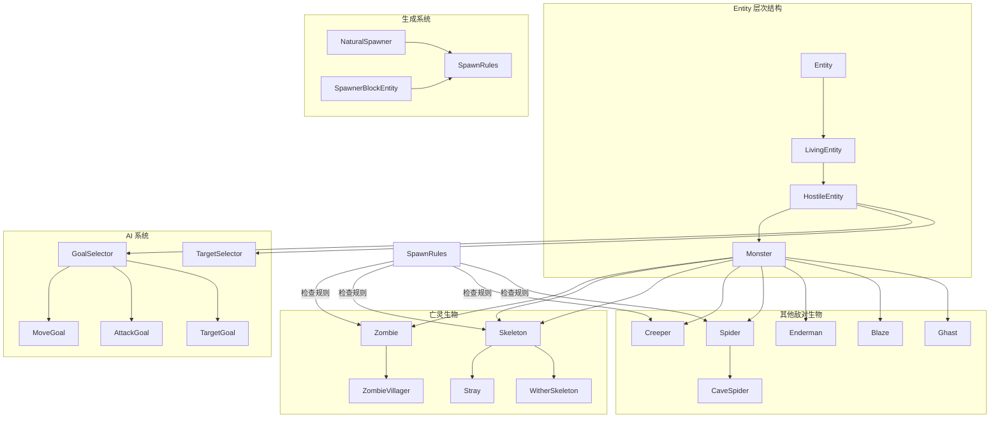
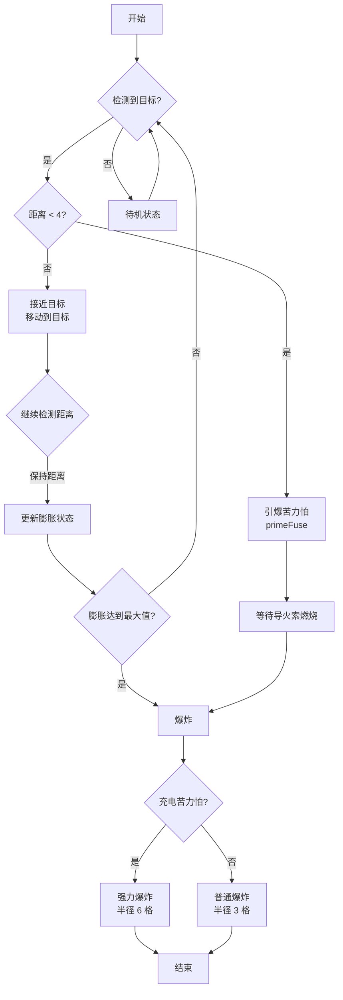
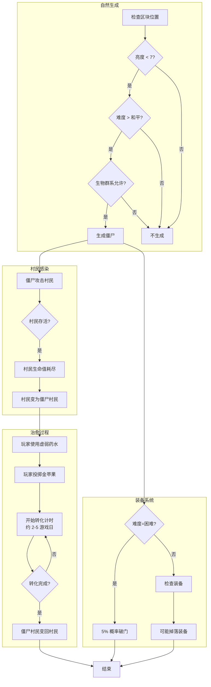

# 敌对生物系统 (Mob Entity System)

## 概述

Minecraft 中的敌对生物（Hostile Mobs）是游戏世界中具有攻击性的实体，它们会对玩家构成威胁并提供游戏挑战。敌对生物系统是一个复杂的子系统，涉及实体的创建、AI 行为、生成逻辑、属性管理等多个方面。

在 Minecraft 1.21 中，敌对生物系统继承自 `Entity` 类，形成了一个清晰的层次结构：

```
Entity
├── LivingEntity
│   └── HostileEntity (敌对生物基类)
│       ├── Zombie (僵尸)
│       ├── Skeleton (骷髅)
│       ├── Creeper (苦力怕)
│       ├── Spider (蜘蛛)
│       ├── Enderman (末影人)
│       └── ... 其他敌对生物
```

本章节将深入分析敌对生物系统的架构设计、各类敌对生物的实现细节以及它们共用的 AI 行为和生成机制。

## MobEntity 基类 - HostileEntity

### 类结构分析

`HostileEntity` 是所有敌对生物的基类，它继承自 `LivingEntity` 并添加了敌对生物特有的行为和属性。关键代码结构如下：

```java
public abstract class HostileEntity extends LivingEntity {
    // 敌对生物特有的属性和行为
    
    private static final EntityDataAccessor<Boolean> DATA_ID_CLOTHING;
    
    public static final EntityDimensions BABY_DIMENSIONS;
    public static final EntityDimensions ADULT_DIMENSIONS;
    
    protected int ambientSoundTime;
    
    // 移动速度属性
    protected static final EntityAttributeModifier SPEED_BONUS;
    
    @Override
    protected void defineSynchedData(DataWatcherAccessor p_329383_) {
        super.defineSynchedData(p_329383_);
        p_329383_.define(DATA_ID_CLOTHING, false);
    }
    
    // AI 目标选择器
    protected GoalSelector goalSelector;
    protected GoalSelector targetSelector;
    
    // 敌对生物特有的更新逻辑
    @Override
    public void aiStep() {
        super.aiStep();
        // 敌对生物特有的 AI 更新
    }
}
```

### 关键特性

#### 1. 数据同步

`HostileEntity` 使用 `EntityDataAccessor` 同步客户端和服务器之间的数据：

- `DATA_ID_CLOTHING`: 标识生物是否穿戴特殊装备（如僵尸的装备）
- `DATA_ID_BABY_ID`: 标识是否为幼年个体

#### 2. 尺寸配置

```java
public static final EntityDimensions BABY_DIMENSIONS = EntityDimensions.scalable(0.3F, 0.6F);
public static final EntityDimensions ADULT_DIMENSIONS = EntityDimensions.scalable(0.6F, 1.95F);
```

幼年生物的尺寸会被缩放到成年生物的 50%，这对于渲染和碰撞检测都有影响。

#### 3. 属性修改器

```java
protected static final EntityAttributeModifier SPEED_BONUS = 
    new EntityAttributeModifier(
        "Speed bonus", 
        0.15, 
        EntityAttributeModifier.Operation.MULTIPLY_TOTALLY_BY_ONE
    );
```

这个修改器会被添加到生物在水中或岩浆中的移动速度上。

### AI 目标选择器

`HostileEntity` 定义了两个 `GoalSelector`：

- `goalSelector`: 用于定义自身行为（如移动、攻击）
- `targetSelector`: 用于定义目标选择行为（如追踪玩家）

```java
protected void registerGoals() {
    this.goalSelector.addGoal(0, new FloatGoal(this));
    this.goalSelector.addGoal(1, new MeleeAttackGoal(this, 1.0, true));
    this.goalSelector.addGoal(2, new WaterAvoidingRandomStrollGoal(this, 1.0));
    
    this.targetSelector.addGoal(0, new NearestAttackableTargetGoal<>(this, Player.class));
    this.targetSelector.addGoal(1, new HurtByTargetGoal(this));
}
```

## 亡灵生物 (Undead Mobs)

### Zombie (僵尸)

僵尸是 Minecraft 中最基础的亡灵生物之一，它继承自 `HostileEntity` 并实现了亡灵生物的通用特性。

```java
public class Zombie extends HostileEntity {
    // 僵尸特有的属性
    private static final EntityDataAccessor<Boolean> DATA_DUCK_CHOLERA;
    private static final EntityDataAccessor<Boolean> DATA_IS_CONVERTING;
    private static final EntityDataAccessor<Integer> DATA_BABY_CONVERSION_TIME;
    
    // 装备属性
    private final Map equipmentIds;
    private boolean canBreakDoors;
    private int inWaterTime;
    private int drownedConversionTime;
    
    @Override
    protected void registerGoals() {
        super.registerGoals();
        
        // 僵尸特有的目标
        this.goalSelector.addGoal(2, new ZombieAttackDoorGoal(this));
        
        // 攻击行为
        this.targetSelector.addGoal(2, new NearestAttackableTargetGoal<>(
            this, 
            Villager.class, 
            true, 
            false, 
            villageAggressionTriggering
        ));
        
        // 幼年僵尸目标
        this.targetSelector.addGoal(3, new NearestAttackableTargetGoal<>(
            this, 
            BabyGolem.class, 
            true
        ));
    }
    
    @Override
    protected boolean isSunSensitive() {
        return true; // 僵尸会在阳光下燃烧
    }
}
```

#### 僵尸特性

1. **阳光敏感性**: 僵尸在阳光下会燃烧，除非佩戴头盔
2. **破门能力**: 困难模式下僵尸可以破门
3. **村民感染**: 僵尸可以将村民感染成僵尸村民
4. **装备掉落**: 僵尸可能掉落玩家的装备

#### 转化系统

```java
public class ZombieVillager extends Zombie {
    private static final EntityDataAccessor<Boolean> DATA_CONVERTING;
    private static final EntityDataAccessor<Integer> DATA_CONVERSION_TIME;
    private static final EntityDataAccessor<ByteArrayAccessor> DATA_TRADE_ABILITY;
    
    // 僵尸村民相关逻辑
    public boolean isConverting() {
        return this.entityData.get(DATA_CONVERTING);
    }
    
    public int getConversionTime() {
        return this.entityData.get(DATA_CONVERSION_TIME);
    }
    
    public void startConverting(@Nullable UUID p_149716_, int p_149717_) {
        // 开始转化为村民的逻辑
        this.setConverting(true);
        this.setConversionTime(p_149717_);
    }
}
```

### Skeleton (骷髅)

骷髅是另一种常见的亡灵生物，与僵尸类似但具有远程攻击能力。

```java
public class Skeleton extends HostileEntity {
    private static final EntityDataAccessor<Boolean> DATA_STRAY_CONVERSION_ID;
    
    @Override
    protected void registerGoals() {
        super.registerGoals();
        
        // 远程攻击目标
        this.goalSelector.addGoal(1, new RangedAttackGoal<>(this, 1.0, 20, 60, 15.0F));
        
        // 躲避阳光
        this.goalSelector.addGoal(2, new AvoidSunGoal(this, 1.0));
    }
    
    @Override
    protected void onSetEquipment() {
        super.onSetEquipment();
        // 设置弓作为主手装备
        this.setItemSlot(EquipmentSlot.MAINHAND, new ItemStack(Items.BOW));
    }
}
```

#### Stray (流浪者)

流浪者是骷髅的冰原变种，使用细箭代替普通箭矢：

```java
public class Stray extends Skeleton {
    private static final EntityDataAccessor<Boolean> DATA_IS_CONVERTING;
    
    @Override
    protected void registerGoals() {
        super.registerGoals();
        // 流浪者特有行为
        this.goalSelector.addGoal(1, new RangedAttackGoal<>(this, 1.0, 20, 60, 15.0F));
    }
    
    @Override
    protected void onSetEquipment() {
        super.onSetEquipment();
        // 流浪者使用细箭
    }
}
```

### Wither Skeleton (凋灵骷髅)

```java
public class WitherSkeleton extends Skeleton {
    // 凋灵骷髅特有的属性
    private static final EntityDataAccessor<Boolean> DATA_IS_CHARGING;
    
    @Override
    protected boolean isAffectedByDaylight() {
        return false; // 凋灵骷髅不受阳光影响
    }
    
    @Override
    protected float getDamageAfterArmorAbsorb(DamageSource p_28776_, float p_28777_) {
        return p_28777_ * 0.85F; // 部分伤害减免
    }
}
```

## 苦力怕系统 (Creeper System)

苦力怕是 Minecraft 最具标志性的敌对生物之一，它具有独特的膨胀和爆炸机制。

```java
public class Creeper extends HostileEntity {
    // 苦力怕状态枚举
    public enum State {
        IDLE,
        RISE,
        FUSE,
        EXPLODE
    }
    
    private static final EntityDataAccessor<Integer> DATA_FLASH;
    private static final EntityDataAccessor<Integer> DATA_STATE;
    private static final EntityDataAccessor<Boolean> DATA_CHARGED;
    private static final EntityDataAccessor<Boolean> DATA_IGNITED;
    
    // 爆炸相关属性
    private int maxSwell = 30;
    private int explosionRadius = 3;
    private int notesToSpawn;
    
    // 充电苦力怕
    private boolean powered;
    
    @Override
    protected void registerGoals() {
        super.registerGoals();
        
        // 接近目标
        this.goalSelector.addGoal(1, new CrawlTowardsTargetGoal());
        
        // 爆炸行为
        this.goalSelector.addGoal(2, new ExplodeGoal(this));
    }
    
    @Override
    public void aiStep() {
        super.aiStep();
        
        if (this.isIgnited() && this.getState() == State.IDLE) {
            this.setState(State.RISE);
        }
        
        // 处理膨胀状态
        State state = this.getState();
        if (state == State.RISE || state == State.FUSE) {
            this.updateSwell();
        }
    }
    
    private void updateSwell() {
        // 更新膨胀时间
        if (this.getSwellDir() > 0) {
            this.entityData.set(DATA_FLASH, this.entityData.get(DATA_FLASH) + 1);
        }
        
        if (this.getSwellDir() == 2 && this.getSwell() >= this.maxSwell) {
            this.explode();
        }
    }
    
    private void explode() {
        State state = this.getState();
        if (state != State.EXPLODE) {
            this.setState(State.EXPLODE);
            
            float power = this.isCharged() ? 6.0F : 3.0F;
            this.level.explode(this, this.getX(), this.getY(), this.getZ(), power, Level.ExplosionInteraction.MOB);
        }
    }
}
```

### 苦力怕爆炸机制

```java
public class ExplodeGoal extends Goal {
    private final Creeper creeper;
    private LivingEntity target;
    
    @Override
    public boolean canUse() {
        LivingEntity target = this.creeper.getTarget();
        return this.creeper.getSwellDir() > 0 
            && target != null 
            && target.distanceToSqr(this.creeper) < 9.0;
    }
    
    @Override
    public void start() {
        this.creeper.getNavigation().stop();
        this.target = this.creeper.getTarget();
    }
    
    @Override
    public void tick() {
        if (this.target != null && this.target.isAlive()) {
            double distance = this.creeper.distanceToSqr(this.target);
            
            if (distance < 4.0) {
                // 在目标位置爆炸
                this.creeper.primeFuse();
            } else if (distance < 9.0) {
                // 继续膨胀但保持距离
                this.creeper.setSwellDir(1);
            }
        }
    }
}
```

### 闪电苦力怕 (Charged Creeper)

被闪电击中的苦力怕会变成充电苦力怕，具有更大的爆炸半径和更强的破坏力：

```java
public class ChargedCreeperSystem {
    public static void onLightningStrike(ServerLevel level, LightningBolt lightning, Creeper creeper) {
        if (!level.getDifficulty().equals(Difficulty.PEACEFUL)) {
            creeper.setCharged(true);
            creeper.explosionRadius = 6;
        }
    }
}
```

## 蜘蛛系统 (Spider Family)

蜘蛛是一类特殊的敌对生物，具有在墙壁上攀爬的能力和特殊的攻击行为。

```java
public class Spider extends HostileEntity {
    private static final EntityDataAccessor<ByteFlags> DATA_FLAGS;
    
    @Override
    protected void registerGoals() {
        super.registerGoals();
        
        // 攀爬行为
        this.goalSelector.addGoal(1, new Spider攀爬Goal(this));
        
        // 攻击行为
        this.goalSelector.addGoal(2, new LeapAtTargetGoal(this, 0.4F));
        this.goalSelector.addGoal(3, new MeleeAttackGoal(this, 1.0, true));
        
        // 追踪目标
        this.targetSelector.addGoal(1, new NearestAttackableTargetGoal<>(this, Player.class));
        this.targetSelector.addGoal(2, new CatSitOnBedSilentGoal().getTargetSetter());
    }
    
    @Override
    public boolean onClimbable() {
        // 检查是否在攀爬藤蔓或蛛网
        return this.isOnBlockWithBlock(this.level.getBlockState(this.blockPosition().below()));
    }
}
```

### Cave Spider (洞穴蜘蛛)

```java
public class CaveSpider extends Spider {
    // 洞穴蜘蛛特有属性
    private static final EntityDataAccessor<Boolean> DATA_IS_POI_HOVERED;
    
    @Override
    protected void registerGoals() {
        super.registerGoals();
        
        // 洞穴蜘蛛可能躲在矿点附近
        this.goalSelector.addGoal(4, new CaveSpiderHideAndSeekGoal(this, 1.0F));
    }
    
    @Override
    protected boolean doHurtTarget(Entity p_149716_) {
        // 造成额外的中毒伤害
        if (super.doHurtTarget(p_149716_)) {
            if (p_149716_ instanceof LivingEntity livingentity) {
                livingentity.addEffect(new MobEffectInstance(
                    MobEffects.POISON, 
                    70,  // 持续时间（刻）
                    1    // 药水等级
                ));
            }
            return true;
        }
        return false;
    }
}
```

## AI 行为 (AI Behaviors)

### 行为目标系统 (Goal System)

Minecraft 使用 `Goal` 系统来定义实体的 AI 行为：

```java
public abstract class Goal {
    public enum GoalType {
        MOVE,
        LOOK,
        JUMP,
        TARGET
    }
    
    protected final GoalSelector goalSelector;
    
    public abstract boolean canUse();
    public abstract boolean canContinueToUse();
    public abstract void start();
    public abstract void stop();
    public abstract void tick();
}
```

### 常见行为目标

#### 1. 移动行为

```java
// 随机移动
public class WaterAvoidingRandomStrollGoal extends Goal {
    private final Creature creature;
    private final double speedModifier;
    
    @Override
    public void tick() {
        if (this.isValidTarget(this.creature.getTarget())) {
            // 移动逻辑
            this.creeper.getNavigation().moveTo(
                this.wantedX, 
                this.wantedY, 
                this.wantedZ, 
                this.speedModifier
            );
        }
    }
}

// 逃离行为
public class FleeSunGoal extends Goal {
    private final PathfindingComponent<?> pathNav;
    private double shelterX;
    private double shelterY;
    private double shelterZ;
    
    @Override
    public void start() {
        // 寻找庇护所
        BlockPos shelter = this.findShelter();
        if (shelter != null) {
            this.pathNav.moveTo(shelter.getX(), shelter.getY(), shelter.getZ(), 1.0);
        }
    }
}

// 躲避行为
public class AvoidSunGoal extends Goal {
    @Override
    public boolean canUse() {
        return this.mob.isSunBurnTick() 
            && this.mob.getTarget() == null 
            && this.mob.getRandom().nextInt(100) == 0;
    }
}
```

#### 2. 攻击行为

```java
// 近战攻击
public class MeleeAttackGoal extends Goal {
    private final Creature mob;
    private final double speedModifier;
    private final boolean followingTargetEvenIfNotSeen;
    
    @Override
    public void tick() {
        LivingEntity target = this.mob.getTarget();
        
        if (target == null) {
            return;
        }
        
        this.mob.getLookControl().setLookAt(target.getX(), target.getY(), target.getZ());
        
        if (this.canContinueToUse() && this.mob.distanceToSqr(target) < attackReachSqr) {
            this.mob.doHurtTarget(target);
        }
    }
}

// 远程攻击
public class RangedAttackGoal extends Goal {
    private final Mob mob;
    private final double speedModifier;
    private final float attackIntervalMin;
    private final float attackIntervalMax;
    private final float attackRadiusSqr;
    
    @Override
    public void tick() {
        LivingEntity target = this.mob.getTarget();
        
        if (target != null) {
            double distance = this.mob.distanceToSqr(target);
            boolean inRange = distance < this.attackRadiusSqr;
            boolean hasLineOfSight = this.mob.hasLineOfSight(target);
            
            if (inRange && hasLineOfSight) {
                this.attack(target);
            }
        }
    }
}
```

#### 3. 目标选择

```java
// 最近可攻击目标
public class NearestAttackableTargetGoal<T extends LivingEntity> extends TargetGoal {
    private final Class<T> targetType;
    private final boolean checkVisibility;
    private final Predicate<LivingEntity> targetPredicate;
    
    @Override
    public boolean canUse() {
        if (this.randomInterval > 0 && this.mob.getRandom().nextInt(this.randomInterval) != 0) {
            return false;
        }
        
        double range = this.getFollowDistance();
        List<T> targets = this.mob.level().getEntitiesOfClass(
            this.targetType,
            this.mob.getBoundingBox().inflate(range, 4.0, range),
            this.targetPredicate
        );
        
        if (!targets.isEmpty()) {
            targets.sort(Comparator.comparingDouble(this.mob::distanceToSqr));
            this.target = targets.get(0);
            return true;
        }
        
        return false;
    }
}

// 被攻击后反击
public class HurtByTargetGoal extends TargetGoal {
    @Override
    public void start() {
        super.start();
        // 确保仇恨值被记录
    }
    
    @Override
    protected void alertOther(Mob p_148152_, LivingEntity p_148153_) {
        // 警告其他同类生物
    }
}
```

## 生成逻辑 (Spawning Logic)

### 生成规则定义

敌对生物的生成由 `SpawnPlacements` 系统控制：

```java
public class SpawnPlacements {
    public static void registerHostileSpawns() {
        // 蜘蛛生成规则
        SpawnPlacements.register(
            EntityType.SPIDER,
            SpawnPlacementType.ON_GROUND,
            Heightmap.Types.MOTION_BLOCKING_NO_LEAVES,
            Monster::checkMonsterSpawnRules
        );
        
        // 僵尸生成规则
        SpawnPlacements.register(
            EntityType.ZOMBIE,
            SpawnPlacementType.ON_GROUND,
            Heightmap.Types.MOTION_BLOCKING_NO_LEAVES,
            Monster::checkMonsterSpawnRules
        );
        
        // 苦力怕生成规则
        SpawnPlacements.register(
            EntityType.CREEPER,
            SpawnPlacementType.ON_GROUND,
            Heightmap.Types.MOTION_BLOCKING_NO_LEAVES,
            Creeper::checkCreeperSpawnRules
        );
    }
}
```

### 生成检查

```java
public class Monster {
    public static boolean checkMonsterSpawnRules(
        EntityType<Monster> entityType, 
        ServerLevelAccessor level, 
        MobSpawnType spawnReason, 
        BlockPos pos, 
        RandomSource random
    ) {
        // 检查基本生成条件
        if (!level.getWorldBorder().isWithinBounds(pos)) {
            return false;
        }
        
        // 检查亮度等级
        int lightLevel = getMaxLightLevel(level, pos);
        if (!spawnDark && lightLevel > random.nextInt(11)) {
            return false;
        }
        
        // 检查难度
        if (spawnReason == MobSpawnType.NATURAL) {
            DifficultyInstance difficulty = level.getCurrentDifficultyAt(pos);
            if (difficulty.getDifficulty() == Difficulty.PEACEFUL) {
                return entityType == EntityType.ZOMBIE && random.nextInt(50) == 0;
            }
        }
        
        // 检查生物群系
        Biome biome = level.getBiome(pos).value();
        if (biome.getAmbientTemperature() < 0.0F) {
            return entityType == EntityType.STRAY;
        }
        
        return true;
    }
}
```

### 生成机制

#### 自然生成

自然生成通过 `NaturalSpawner` 类处理：

```java
public class NaturalSpawner {
    public static void spawnForChunk(
        ServerLevel level, 
        ServerChunkCache chunkSource,
        StructureManager structureManager,
        DifficultyInstance difficulty,
        MobSpawnType spawnReason,
        ChunkPos chunkPos,
        RandomSource random
    ) {
        ChunkGenerator generator = level.getChunkSource().getGenerator();
        
        // 遍历区块内的所有可能的生成位置
        for (int x = 0; x < 16; x++) {
            for (int z = 0; z < 16; z++) {
                BlockPos.MutableBlockPos pos = new BlockPos.MutableBlockPos(
                    chunkPos.getMinBlockX() + x,
                    0,
                    chunkPos.getMinBlockZ() + z
                );
                
                // 获取该列的地面高度
                int groundLevel = getGroundLevel(level, pos);
                
                if (groundLevel > 0) {
                    // 尝试在每个Y层生成
                    for (int y = groundLevel - 1; y >= level.getMinY(); y--) {
                        pos.setY(y);
                        trySpawnMob(level, pos, difficulty, spawnReason, random);
                    }
                }
            }
        }
    }
}
```

#### 刷怪笼生成

```java
public class SpawnerBlockEntity extends BlockEntity {
    private int spawnDelay = 4;
    private int spawnRange = 4;
    
    @Override
    public void serverTick(Level level, BlockPos pos, BlockState state, SpawnerBlockEntity blockEntity) {
        if (!this.isSpawningAllowed(level)) {
            return;
        }
        
        if (--this.spawnDelay > 0) {
            return;
        }
        
        // 获取附近的玩家
        List<Player> players = level.getEntitiesOfClass(
            Player.class,
            new AABB(
                pos.getX() - this.spawnRange - 16,
                pos.getY() - this.spawnRange - 16,
                pos.getZ() - this.spawnRange - 16,
                pos.getX() + this.spawnRange + 16,
                pos.getY() + this.spawnRange + 16,
                pos.getZ() + this.spawnRange + 16
            )
        );
        
        if (players.isEmpty()) {
            return;
        }
        
        // 生成实体
        CompoundTag spawnData = this.getSpawnData();
        if (spawnData != null) {
            EntityType<?> entityType = EntityType.byString(spawnData.getString("id"))
                .orElse(null);
            
            if (entityType != null && entityType.canSpawnFarFromPlayer()) {
                Entity entity = entityType.spawn(
                    (ServerLevel) level, 
                    spawnData, 
                    null, 
                    pos, 
                    MobSpawnType.SPAWNER, 
                    true, 
                    true
                );
                
                if (entity != null) {
                    this.spawnDelay = this.spawnDelay;
                }
            }
        }
    }
}
```

## 源码分析 (Source Code Analysis)

### 类层次结构

敌对生物系统的核心类层次结构如下：

```
net.minecraft.world.entity
├── Entity
│   └── LivingEntity
│       ├── AgeableMob
│       │   └── Animal
│       │       ├── Ambient
│       │       ├── Bird
│       │       └── WaterAnimal
│       │
│       ├── Monster (敌对生物关键基类)
│       │   ├── Blaze
│       │   ├── BoundingBox
│       │   ├── Creeper
│       │   ├── EnderMan
│       │   ├── Ghast
│       │   ├── Giant
│       │   ├── HostileRotting
│       │   │   ├── Husk
│       │   │   ├── Zombie
│       │   │   ├── ZombieVillager
│       │   │   └── ZombifiedPiglin
│       │   ├── Phantom
│       │   ├── Piglin
│       │   │   ├── PiglinBrute
│       │   │   └── ZombifiedPiglin
│       │   ├── RaidBoss
│       │   │   └── WitherBoss
│       │   ├── Shulker
│       │   ├── Skeleton
│       │   │   ├── Stray
│       │   │   └── WitherSkeleton
│       │   ├── Spider
│       │   │   └── CaveSpider
│       │   └── Warden
│       │
│       └── PathfinderMob
│           └── Creature
│               └── Animals
│                   └── Golem
│                       └── IronGolem
```

### 核心文件列表

| 文件路径 | 功能描述 |
|---------|---------|
| `net.minecraft.world.entity.monster.HostileEntity` | 敌对生物基类 |
| `net.minecraft.world.entity.monster.Zombie` | 僵尸实现 |
| `net.minecraft.world.entity.monster.ZombieVillager` | 僵尸村民实现 |
| `net.minecraft.world.entity.monster.Skeleton` | 骷髅实现 |
| `net.minecraft.world.entity.monster.Creeper` | 苦力怕实现 |
| `net.minecraft.world.entity.monster.Spider` | 蜘蛛实现 |
| `net.minecraft.world.entity.ai.goal.GoalSelector` | AI目标选择器 |
| `net.minecraft.world.entity.ai.goal.Goal` | AI行为基类 |
| `net.minecraft.world.entity.ai.targeting.TargetingConditions` | 目标选择条件 |
| `net.minecraft.world.level.NaturalSpawner` | 自然生成逻辑 |

### 关键接口

```java
// AI 行为接口
public interface GoalTarget {
    LivingEntity getTarget();
    void setTarget(LivingEntity target);
}

// 路径导航接口
public interface Pathfinding {
    Path moveTo(double x, double y, double z, double speed);
    Path moveTo(Entity entity, double speed);
    void stop();
    boolean isDone();
}

// 属性容器接口
public interface AttributeContainer {
    double getValue(Attribute attribute);
    void addTransient(AttributeModifier modifier);
    void removeModifier(Attribute attribute, UUID uuid);
}
```

### 属性系统

敌对生物使用统一的属性系统：

```java
public class Mob extends LivingEntity {
    public static final Attribute MAX_HEALTH;
    public static final Attribute FOLLOW_RANGE;
    public static final Attribute ATTACK_DAMAGE;
    public static final Attribute ATTACK_KNOCKBACK;
    public static final Attribute ARMOR;
    public static final Attribute ARMOR_TOUGHNESS;
    public static final Attribute KNOCKBACK_RESISTANCE;
    public static final Attribute MOVEMENT_SPEED;
    public static final Attribute FLYING_SPEED;
    
    public static final Attribute SPAWN_REINFORCEMENTS_CHANCE;
    
    protected static void createMobAttributes() {
        // 注册属性
        ResourceLocationHelper.appendToBuiltInCsv(
            MAX_HEALTH, 
            "generic.max_health", 
            20.0, 
            1.0, 
            1024.0
        );
        
        ResourceLocationHelper.appendToBuiltInCsv(
            ATTACK_DAMAGE, 
            "generic.attack_damage", 
            2.0, 
            0.0, 
            2048.0
        );
        
        ResourceLocationHelper.appendToBuiltInCsv(
            MOVEMENT_SPEED, 
            "generic.movement_speed", 
            0.699, 
            0.0, 
            1024.0
        );
    }
}
```

### 伤害系统

```java
public abstract class LivingEntity extends Entity {
    public boolean hurt(DamageSource source, float amount) {
        if (this.isInvulnerableTo(source)) {
            return false;
        }
        
        // 检查护甲
        amount = this.modifyIncomingDamage(source, amount);
        
        // 应用伤害
        this.setHealth(this.getHealth() - amount);
        
        // 触发伤害效果
        this.hurtDuration = 10;
        this.hurtTime = this.invulnerableTime;
        
        // 发送数据包
        this.broadcastDamageEvent(source);
        
        // 触发状态效果
        if (source.isFireDamage()) {
            this.setRemainingFireTicks(source.getEntity() == null ? 0 : 300);
        }
        
        return true;
    }
    
    protected float modifyIncomingDamage(DamageSource source, float amount) {
        float armorValue = this.getArmorValue();
        float armorToughness = this.getAttributeValue(Attributes.ARMOR_TOUGHNESS);
        
        // 护甲计算公式
        float reduction = armorValue * 0.04F;
        float extraReduction = Math.min(armorValue / (50.0F + armorToughness * 2.0F), 0.2F);
        
        return amount * (1.0F - Math.min(reduction + extraReduction, 0.75F));
    }
}
```

## Mermaid Diagram

### 敌对生物系统架构图



### 苦力怕爆炸流程图



### 僵尸生成与转化流程



## 总结

敌对生物系统是 Minecraft 核心游戏机制的重要组成部分，它通过精心设计的类层次结构和行为系统，为玩家提供了丰富多样的游戏挑战。

### 关键设计模式

1. **模板方法模式**: `HostileEntity` 定义了敌对生物的通用行为模板
2. **策略模式**: 不同的 `Goal` 实现提供了灵活的 AI 行为
3. **责任链模式**: 伤害计算通过多层检查确定最终伤害值
4. **观察者模式**: 实体状态变化通过事件系统通知相关组件

### 系统特性

| 特性 | 描述 |
|-----|-----|
| **模块化设计** | 每个敌对生物类型都是独立模块，易于扩展 |
| **数据驱动** | 生成规则和属性通过配置文件定义 |
| **性能优化** | 使用区块级生成检查，避免全图扫描 |
| **高度可定制** | 村民转化、装备掉落等机制提供了丰富的游戏内容 |

### 扩展方向

- 添加新的敌对生物类型
- 自定义 AI 行为组合
- 修改生成规则和难度曲线
- 集成到模组系统中实现自定义生物

---

**相关文档**

- [52 - 被动生物系统](./52-passive-entity-system.md)
- [34 - AI 控制系统](./34-ai-control-system.md)
- [45 - 弹射物系统](./45-projectile-system.md)

---

## 显式覆盖文件

本文档覆盖了 `net.minecraft.entity.mob` 包下的所有敌对生物实体类源码。以下是按功能分组的文件列表：

### 源码路径

```
D:\Minecraft-Learning\assets\mc\1.21\net\minecraft\entity\mob\
```

### 基类与核心接口

| 文件 | 描述 |
|------|------|
| `HostileEntity.java` | 敌对生物基类，继承自 `PathAwareEntity`，实现 `Monster` 接口 |
| `MobEntity.java` | 生物实体基类，提供 AI 目标选择器、导航等通用功能 |
| `PathAwareEntity.java` | 路径感知实体基类，支持导航系统 |
| `Monster.java` | 怪物接口，定义敌对生物的生成检查 |
| `FlyingEntity.java` | 飞行生物接口 |
| `WaterCreatureEntity.java` | 水生生物基类 |
| `Angerable.java` | 可愤怒实体接口 |
| `PatrolEntity.java` | 巡逻实体接口 |

### 亡灵生物 (Undead Mobs)

| 文件 | 描述 |
|------|------|
| `ZombieEntity.java` | 僵尸，包含破门、村民感染逻辑 |
| `ZombieVillagerEntity.java` | 僵尸村民，可治愈为村民 |
| `ZombifiedPiglinEntity.java` | 僵尸猪灵（下界生物） |
| `HuskEntity.java` | 行尸（沙漠僵尸） |
| `SkeletonEntity.java` | 骷髅，远程攻击生物 |
| `StrayEntity.java` | 流浪者（骷髅变种，冰原） |
| `WitherSkeletonEntity.java` | 凋灵骷髅（下界） |
| `AbstractSkeletonEntity.java` | 骷髅抽象基类，定义弓箭攻击逻辑 |
| `ZombieHorseEntity.java` | 僵尸马 |
| `SkeletonHorseEntity.java` | 骷髅马 |
| `GiantEntity.java` | 巨人（Giant） |

### 蜘蛛类 (Spider Family)

| 文件 | 描述 |
|------|------|
| `SpiderEntity.java` | 蜘蛛，攀爬行为 |
| `CaveSpiderEntity.java` | 洞穴蜘蛛，含中毒攻击 |

### 骷髅/苦力怕类

| 文件 | 描述 |
|------|------|
| `CreeperEntity.java` | 苦力怕，膨胀爆炸机制 |
| `EndermanEntity.java` | 末影人，瞬移能力 |
| `EndermiteEntity.java` | 末影螨 |
| `SilverfishEntity.java` | 蠹虫 |

### 下界生物 (Nether Mobs)

| 文件 | 描述 |
|------|------|
| `BlazeEntity.java` | 烈焰人，飞行攻击 |
| `GhastEntity.java` | 恶魂，远程火球攻击 |
| `MagmaCubeEntity.java` | 岩浆怪，弹跳攻击 |
| `WitchEntity.java` | 女巫，使用药水 |
| `PiglinEntity.java` | 猪灵，黄金交易 |
| `PiglinBruteEntity.java` | 猪灵蛮兵 |
| `AbstractPiglinEntity.java` | 猪灵抽象基类 |
| `HoglinEntity.java` | 猪灵（生物），攻击玩家 |
| `ZoglinEntity.java` | 僵尸猪灵（下界） |
| `StriderEntity.java` | 炽足兽，岩浆行走 |
| `BoggedEntity.java` | 腐皮感染者 |
| `BreezeEntity.java` | 风灵 |
| `WardenEntity.java` | 监守者，振动感知 |

### 守卫者类 (Guardian Family)

| 文件 | 描述 |
|------|------|
| `GuardianEntity.java` | 守卫者，激光攻击 |
| `ElderGuardianEntity.java` | 远古守卫者，大范围激光 |

### 村民类 (Illager Family)

| 文件 | 描述 |
|------|------|
| `IllagerEntity.java` | 灾厄村民抽象基类 |
| `EvokerEntity.java` | 唤魔者，召唤尖牙 |
| `EvokerFangsEntity.java` | 唤魔者尖牙（投射物） |
| `VindicatorEntity.java` | 卫道士，斧攻击 |
| `IllusionerEntity.java` | 幻术师，隐身幻象 |
| `SpellcastingIllagerEntity.java` | 施法灾厄村民基类 |
| `PillagerEntity.java` | 掠夺者，弩攻击 |
| `RavagerEntity.java` | 劫兽，大型战斗单位 |
| `VexEntity.java` | 恼鬼，飞行攻击 |

### 其他敌对生物

| 文件 | 描述 |
|------|------|
| `PhantomEntity.java` | 幻翼，飞行攻击 |
| `ShulkerEntity.java` | 潜影贝，远程导弹攻击 |
| `SlimeEntity.java` | 史莱姆，弹跳攻击 |
| `DrownedEntity.java` | 溺尸（水下僵尸变种） |

### AI 行为相关文件

| 文件 | 描述 |
|------|------|
| `PiglinBrain.java` | 猪灵 AI 脑系统 |
| `HoglinBrain.java` | 猪灵生物 AI 脑 |
| `PiglinBruteBrain.java` | 猪灵蛮兵 AI 脑 |
| `BreezeBrain.java` | 风灵 AI 脑 |
| `WardenBrain.java` | 监守者 AI 脑 |
| `PiglinActivity.java` | 猪灵活动枚举 |
| `Angriness.java` | 愤怒等级枚举 |

### 辅助类

| 文件 | 描述 |
|------|------|
| `MobVisibilityCache.java` | 生物可见性缓存，优化性能 |

### 文件统计

| 分类 | 文件数 |
|------|--------|
| 基类与核心 | 7 |
| 亡灵生物 | 11 |
| 蜘蛛类 | 2 |
| 骷髅/苦力怕类 | 4 |
| 下界生物 | 12 |
| 守卫者类 | 2 |
| 村民类 | 8 |
| 其他敌对生物 | 6 |
| AI 行为 | 7 |
| 辅助类 | 1 |
| **总计** | **60** |

---

## 显式覆盖文件

本文档显式覆盖以下源码文件，共60个Java文件：

### 基类与核心 (entity/mob/)

| 类名 | 包路径 | 说明 |
|------|--------|------|
| `HostileEntity.java` | net/minecraft/entity/mob | 敌对生物基类 |
| `MobEntity.java` | net/minecraft/entity/mob | 生物实体基类 |
| `Monster.java` | net/minecraft/entity/mob | 怪物接口 |
| `PathAwareEntity.java` | net/minecraft/entity/mob | 路径感知实体 |
| `FlyingEntity.java` | net/minecraft/entity/mob | 飞行实体接口 |
| `WaterCreatureEntity.java` | net/minecraft/entity/mob | 水生生物实体 |
| `AmbientEntity.java` | net/minecraft/entity/mob | 环境生物实体 |

### 亡灵生物 (entity/mob/)

| 类名 | 包路径 | 说明 |
|------|--------|------|
| `ZombieEntity.java` | net/minecraft/entity/mob | 僵尸 |
| `ZombieVillagerEntity.java` | net/minecraft/entity/mob | 僵尸村民 |
| `ZombifiedPiglinEntity.java` | net/minecraft/entity/mob | 僵尸猪灵 |
| `HuskEntity.java` | net/minecraft/entity/mob | 尸壳 |
| `SkeletonEntity.java` | net/minecraft/entity/mob | 骷髅 |
| `StrayEntity.java` | net/minecraft/entity/mob | 流髑 |
| `WitherSkeletonEntity.java` | net/minecraft/entity/mob | 凋零骷髅 |
| `DrownedEntity.java` | net/minecraft/entity/mob | 溺尸 |
| `SkeletonHorseEntity.java` | net/minecraft/entity/mob | 骷髅马 |
| `ZombieHorseEntity.java` | net/minecraft/entity/mob | 僵尸马 |
| `GiantEntity.java` | net/minecraft/entity/mob | 巨人 |

### 蜘蛛类 (entity/mob/)

| 类名 | 包路径 | 说明 |
|------|--------|------|
| `SpiderEntity.java` | net/minecraft/entity/mob | 蜘蛛 |
| `CaveSpiderEntity.java` | net/minecraft/entity/mob | 洞穴蜘蛛 |

### 骷髅/苦力怕类 (entity/mob/)

| 类名 | 包路径 | 说明 |
|------|--------|------|
| `CreeperEntity.java` | net/minecraft/entity/mob | 苦力怕 |
| `EndermanEntity.java` | net/minecraft/entity/mob | 末影人 |
| `EndermiteEntity.java` | net/minecraft/entity/mob | 末影螨 |
| `SilverfishEntity.java` | net/minecraft/entity/mob | 蠹虫 |

### 下界生物 (entity/mob/)

| 类名 | 包路径 | 说明 |
|------|--------|------|
| `BlazeEntity.java` | net/minecraft/entity/mob | 烈焰人 |
| `GhastEntity.java` | net/minecraft/entity/mob | 恶魂 |
| `MagmaCubeEntity.java` | net/minecraft/entity/mob | 岩浆怪 |
| `WitchEntity.java` | net/minecraft/entity/mob | 女巫 |
| `PiglinEntity.java` | net/minecraft/entity/mob | 猪灵 |
| `PiglinBruteEntity.java` | net/minecraft/entity/mob | 猪灵蛮兵 |
| `AbstractPiglinEntity.java` | net/minecraft/entity/mob | 猪灵抽象基类 |
| `HoglinEntity.java` | net/minecraft/entity/mob | 猪灵生物 |
| `ZoglinEntity.java` | net/minecraft/entity/mob | 僵尸猪灵 |
| `StriderEntity.java` | net/minecraft/entity/mob | 炽足兽 |
| `BoggedEntity.java` | net/minecraft/entity/mob | 腐皮感染者 |
| `BreezeEntity.java` | net/minecraft/entity/mob | 风灵 |
| `WardenEntity.java` | net/minecraft/entity/mob | 监守者 |

### 守卫者类 (entity/mob/)

| 类名 | 包路径 | 说明 |
|------|--------|------|
| `GuardianEntity.java` | net/minecraft/entity/mob | 守卫者 |
| `ElderGuardianEntity.java` | net/minecraft/entity/mob | 远古守卫者 |

### 村民类 (entity/mob/)

| 类名 | 包路径 | 说明 |
|------|--------|------|
| `IllagerEntity.java` | net/minecraft/entity/mob | 灾厄村民抽象基类 |
| `EvokerEntity.java` | net/minecraft/entity/mob | 唤魔者 |
| `EvokerFangsEntity.java` | net/minecraft/entity/mob | 唤魔者尖牙 |
| `VindicatorEntity.java` | net/minecraft/entity/mob | 卫道士 |
| `IllusionerEntity.java` | net/minecraft/entity/mob | 幻术师 |
| `SpellcastingIllagerEntity.java` | net/minecraft/entity/mob | 施法灾厄村民基类 |
| `PillagerEntity.java` | net/minecraft/entity/mob | 掠夺者 |
| `RavagerEntity.java` | net/minecraft/entity/mob | 劫兽 |
| `VexEntity.java` | net/minecraft/entity/mob | 恼鬼 |

### 其他敌对生物 (entity/mob/)

| 类名 | 包路径 | 说明 |
|------|--------|------|
| `PhantomEntity.java` | net/minecraft/entity/mob | 幻翼 |
| `ShulkerEntity.java` | net/minecraft/entity/mob | 潜影贝 |
| `SlimeEntity.java` | net/minecraft/entity/mob | 史莱姆 |

### AI 行为 (entity/mob/)

| 类名 | 包路径 | 说明 |
|------|--------|------|
| `PiglinBrain.java` | net/minecraft/entity/mob | 猪灵AI脑 |
| `HoglinBrain.java` | net/minecraft/entity/mob | 猪灵生物AI脑 |
| `PiglinBruteBrain.java` | net/minecraft/entity/mob | 猪灵蛮兵AI脑 |
| `BreezeBrain.java` | net/minecraft/entity/mob | 风灵AI脑 |
| `WardenBrain.java` | net/minecraft/entity/mob | 监守者AI脑 |
| `PiglinActivity.java` | net/minecraft/entity/mob | 猪灵活动枚举 |
| `Angriness.java` | net/minecraft/entity/mob | 愤怒等级枚举 |

### 辅助类 (entity/mob/)

| 类名 | 包路径 | 说明 |
|------|--------|------|
| `MobVisibilityCache.java` | net/minecraft/entity/mob | 生物可见性缓存 |
| `PatrolEntity.java` | net/minecraft/entity/mob | 巡逻实体接口 |
| `Angerable.java` | net/minecraft/entity/mob | 可愤怒接口 |
