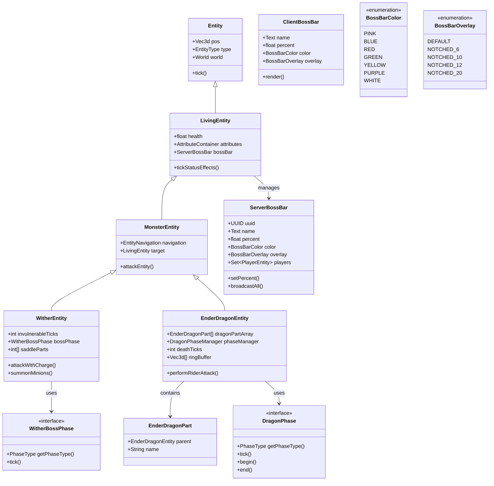
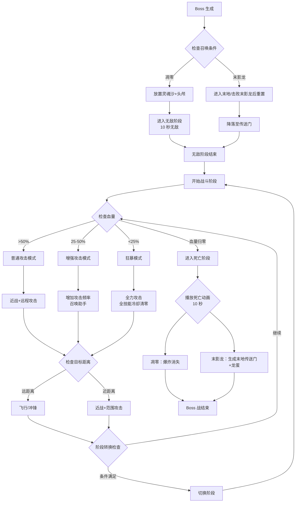
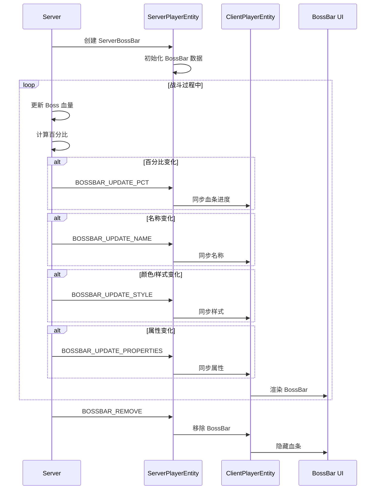
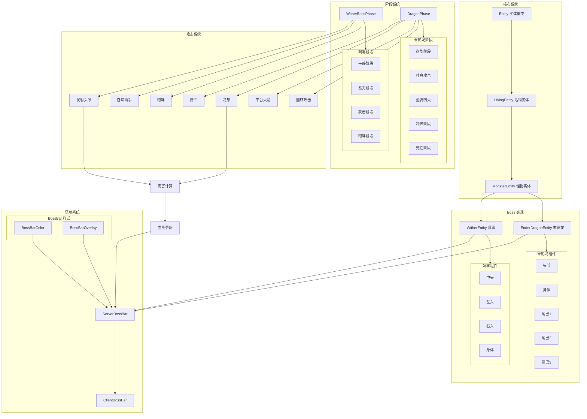

# Minecraft 1.21 Boss实体系统 (Boss Entity System)

> 基于 CFR 0.2.2 反编译源代码的 Boss 系统完整分析
> 版本信息: Protocol 767, World Version 3953

---

## 1. 概述 (Overview)

Minecraft 的 Boss 实体系统是游戏中最具挑战性的游戏机制之一，为玩家提供高难度的战斗目标。Boss 实体通常具有以下特征：

- **高生命值**：远超普通生物，需要玩家团队协作击败
- **专属血条**：屏幕顶部显示 Boss 血条（BossBar）
- **多阶段战斗**：Boss 在不同血量阶段展现不同攻击模式
- **特殊行为**：每个 Boss 都有独特的攻击机制和 AI 行为
- **专属音效**：独特的背景音乐和战斗音效

### 1.1 系统架构总览

```
┌─────────────────────────────────────────────────────────────────────┐
│                        Boss 系统架构                                  │
├─────────────────────────────────────────────────────────────────────┤
│                                                                     │
│  ┌───────────────────────────────────────────────────────────────┐ │
│  │                        顶层接口层                              │ │
│  │                    Boss / Entity                              │ │
│  └─────────────────────────┬─────────────────────────────────────┘ │
│                            │                                        │
│  ┌─────────────────────────┼─────────────────────────────────────┐ │
│  │                    Boss 实现层                                 │ │
│  │         Wither / EnderDragon                                  │ │
│  │    (独特 AI、攻击模式、阶段系统)                                 │ │
│  └─────────────────────────┼─────────────────────────────────────┘ │
│                            │                                        │
│  ┌─────────────────────────┼─────────────────────────────────────┐ │
│  │                    BossBar 显示层                              │ │
│  │         ServerBossBar / ClientBossBar                         │ │
│  │     (血条同步、颜色/分段、玩家追踪)                               │ │
│  └─────────────────────────┬─────────────────────────────────────┘ │
│                            │                                        │
│  ┌─────────────────────────┼─────────────────────────────────────┐ │
│  │                    阶段系统层                                   │ │
│  │             WitherBossPhase / DragonPhase                      │ │
│  │         (阶段转换、行为变化、触发条件)                            │ │
│  └───────────────────────────────────────────────────────────────┘ │
│                                                                     │
└─────────────────────────────────────────────────────────────────────┘
```

### 1.2 核心组件一览

| 组件 | 类路径 | 职责 |
|------|--------|------|
| Wither | `net.minecraft.entity.boss.WitherEntity` | 凋零 Boss 实现 |
| EnderDragon | `net.minecraft.entity.boss.dragon.EnderDragonEntity` | 末影龙 Boss 实现 |
| ServerBossBar | `net.minecraft.server.network.ServerBossBar` | 服务器端血条管理 |
| ClientBossBar | `net.minecraft.client.network.ClientBossBar` | 客户端血条显示 |
| WitherBossPhase | `net.minecraft.entity.boss.WitherBossPhase` | 凋零阶段接口 |
| DragonPhase | `net.minecraft.entity.boss.dragon.DragonPhase` | 末影龙阶段接口 |

---

## 2. Wither 系统 - 凋零Boss

### 2.1 Wither 实体概述

Wither（凋零）是 Minecraft 中第一个可建造的 Boss，于 1.4 版本引入。玩家可以通过在 T 形基座上放置 4 个灵魂沙和 3 个凋零骷髅头颅来召唤。

```
建造结构：

       [Skull]           顶层：3 个凋零骷髅头颅
    [Skull][Skull]
  [Soul][Soul][Soul]     中层：2 个灵魂沙
    [Soul][Soul]         底层：1 个灵魂沙
```

### 2.2 Wither 实体类结构

```java
// D:\Minecraft-Learning\assets\mc\1.21\net\minecraft\entity\boss\WitherEntity.java
public class WitherEntity extends MonsterEntity implements PowerableEntity {
    // 血量配置
    public static final int field_30478 = 600;           // 基础血量 300 HP (x2)
    public static final int field_30479 = 900;           // 中期血量 450 HP
    public static final int field_30480 = 600;           // 满血量 300 HP
    
    // 免疫时间
    public static final int INVULNERABLE_TIME = 220;     // 10 秒无敌时间
    
    // 攻击范围
    private static final float field_30481 = 0.0f;       // 攻击范围基准
    private static final int field_30482 = 8;            // 攻击间隔
    
    // 实体状态
    private final int[] saddleParts;                     // 装备槽索引
    private final float[] headAngles;                    // 头部旋转角度
    private long lastDimensionChangedTime;               // 维度变化时间
    
    // 目标追踪
    @Nullable
    private Entity target;                               // 当前攻击目标
    
    // 阶段系统
    private final WitherBossPhase<WitherBossPhase<?>.Instance bossPhase;
    
    // 无敌状态
    private int invulnerableTicks;                       // 无敌时间计数器
    
    // 装甲状态（每 40 秒降低 1 格）
    private static final int ARMOR_BARBS_TICK_INTERVAL = 800;
    private int ticksSinceLastArmorBarbsDecrease;        // 上次护甲降低时间
}
```

### 2.3 Wither 关键属性

```java
// 实体属性配置
static {
    // 最大生命值：600/900/600 = 1050 HP (525 x 2)
    EntityAttribute.createAttribute(MAX_HEALTH, 1050.0);
    
    // 移动速度：正常状态较慢
    EntityAttribute.createAttribute(GENERIC_MOVEMENT_SPEED, 0.6);
    
    // 攻击伤害
    EntityAttribute.createAttribute(GENERIC_ATTACK_DAMAGE, 8.0);
}

// 构造方法
public WitherEntity(EntityType<WitherEntity> type, World world) {
    super(type, world);
    this.setHealth(this.getMaxHealth());
    this.bossPhase = WitherBossPhase.create(this);
    
    // 设置默认装备
    this.initDataTracker();
}
```

### 2.4 Wither 攻击模式

#### 2.4.1 近战攻击

```java
// 近战攻击方法
public boolean attackEntityFromPart(WitherEntity.WitherPart part, DamageSource source, float amount) {
    // 免疫掉落伤害
    if (source.isIn(DamageTypeTags.IS_FALL)) {
        return false;
    }
    
    // 无敌阶段免疫
    if (this.invulnerableTicks > 0) {
        return false;
    }
    
    // 获取伤害值
    float damage = this.getDamageAmount(part);
    
    // 护甲计算（减少 25% 伤害）
    if (this.isCharged()) {
        damage *= 0.75f;
    }
    
    // 随机暴击
    if (this.random.nextInt(10) == 0) {
        damage *= 1.5f;
    }
    
    // 触发攻击回调
    this.onAttacking(source);
    
    // 造成伤害
    return super.attackEntityFromPart(part, source, damage);
}

// 获取伤害值（根据目标位置）
private float getDamageAmount(WitherEntity.WitherPart part) {
    switch (part) {
        case CENTER: return 8.0f;      // 身体：8 点伤害
        case LEFT_ARM: return 5.0f;     // 左臂：5 点伤害
        case RIGHT_ARM: return 5.0f;   // 右臂：5 点伤害
        default: return 3.0f;
    }
}
```

#### 2.4.2 远程攻击（凋零之首）

```java
// 发射凋零之首
public void attackWithCharge(int headIndex, LivingEntity target) {
    // 计算发射延迟（根据头部的相对位置）
    int chargeDelay = switch (headIndex) {
        case 0 -> 0;      // 中头：立即
        case 1 -> 10;     // 左头：0.5 秒后
        case 2 -> 20;     // 右头：1 秒后
        default -> 40;
    };
    
    // 调度攻击
    this.scheduleCharge(headIndex, target, chargeDelay);
}

// 实际发射逻辑
private void performCharge(int headIndex, LivingEntity target) {
    // 获取头部位置
    Vec3d headPos = this.getHeadPos(headIndex);
    
    // 计算飞行方向（向目标方向偏移）
    double dx = target.getX() - headPos.x;
    double dy = target.getBodyY(0.5) - headPos.y;
    double dz = target.getZ() - headPos.z;
    
    // 添加随机偏移（难度调整）
    float spread = 0.3f + this.getChargingCount() * 0.1f;
    dx += this.random.nextGaussian() * spread;
    dy += this.random.nextGaussian() * spread;
    dz += this.random.nextGaussian() * spread;
    
    // 生成投射物
    WitherSkullEntity skull = new WitherSkullEntity(
        EntityType.WITHER_SKULL, this.getWorld());
    skull.setOwner(this);
    skull.setPos(headPos.x, headPos.y, headPos.z);
    
    // 计算速度向量
    double speed = 0.6 + this.getChargingCount() * 0.05;
    Vec3d velocity = new Vec3d(dx, dy, dz).normalize().multiply(speed);
    skull.setVelocity(velocity);
    
    this.getWorld().spawnEntity(skull);
}
```

#### 2.4.3 召唤凋零骷髅

```java
// 召唤凋零骷髅助手
public void summonMinions() {
    // 检查游戏规则
    if (!this.getWorld().getGameRules().getBoolean(GameRules.DO_MOB_SPAWNING)) {
        return;
    }
    
    // 召唤数量
    int minionCount = 3 + this.random.nextInt(5);
    
    for (int i = 0; i < minionCount; i++) {
        // 在凋零周围生成
        double angle = (2 * Math.PI * i) / minionCount;
        double distance = 3.0 + this.random.nextDouble() * 3.0;
        
        double x = this.getX() + Math.cos(angle) * distance;
        double y = this.getY();
        double z = this.getZ() + Math.sin(angle) * distance;
        
        // 生成凋零骷髅
        WitherSkeletonEntity skeleton = EntityType.WITHER_SKELETON.create(this.getWorld());
        if (skeleton != null) {
            skeleton.initialize(world, world.getLocalDifficulty(BlockPos.ofFloored(x, y, z)),
                              SpawnReason.SPAWNER, null, null);
            skeleton.setPos(x, y, z);
            skeleton.setOwner(this);
            this.getWorld().spawnEntity(skeleton);
        }
    }
}
```

### 2.5 Wither 无敌阶段

```java
// 进入无敌阶段
public void enterInvulnerablePhase() {
    this.invulnerableTicks = INVULNERABLE_TIME;  // 220 ticks = 10 秒
    
    // 播放音效
    this.playSound(SoundEvents.ENTITY_WITHER_SPAWN, 1.0f, 1.0f);
    
    // 触发阶段回调
    this.bossPhase.getCurrentPhase().onPhaseChange(...);
}

// 每 tick 更新无敌状态
public void tick() {
    super.tick();
    
    // 更新无敌时间
    if (this.invulnerableTicks > 0) {
        this.invulnerableTicks--;
        
        // 无敌阶段最后 40 ticks 闪烁
        if (this.invulnerableTicks < 40) {
            this.setGlowing(this.invulnerableTicks % 10 < 5);
        }
        
        // 恢复后触发
        if (this.invulnerableTicks == 0) {
            this.onInvulnerablePhaseEnd();
        }
    }
    
    // 更新护甲条
    this.updateArmorBarbs();
    
    // 更新头部旋转
    this.updateHeadAngles();
    
    // 更新阶段
    this.bossPhase.getCurrentPhase().tick();
}

// 护甲条降低逻辑
private void updateArmorBarbs() {
    this.ticksSinceLastArmorBarbsDecrease++;
    
    if (this.ticksSinceLastArmorBarbsDecrease >= ARMOR_BARBS_TICK_INTERVAL) {
        // 降低一个护甲格
        int currentArmor = this.getWitherArmorValue();
        if (currentArmor > 0) {
            // 播放音效
            this.playSound(SoundEvents.ENTITY_WITHER_BREAK_BLOCK, 1.0f, 1.0f);
            
            // 降低护甲值
            this.decrementWitherArmor();
        }
        
        this.ticksSinceLastArmorBarbsDecrease = 0;
    }
}
```

---

## 3. EnderDragon 系统 - 末影龙

### 3.1 EnderDragon 实体概述

Ender Dragon（末影龙）是 Minecraft 的终极 Boss，位于末地主世界的末地城中。它是游戏中最强大、最复杂的实体之一。

```
末影龙战斗区域：

    [Portal]
       ↓
    ══════════════  战斗平台（围绕中央传送门）
         ▲
         │
    [Dragon Roost]
    （龙出生点/休息点）
```

### 3.2 EnderDragon 类结构

```java
// D:\Minecraft-Learning\assets\mc\1.21\net\minecraft\entity\boss\dragon\EnderDragonEntity.java
public class EnderDragonEntity extends MobEntity implements BossEntity {
    // 血量配置
    public static final int MAX_HEALTH = 200;            // 200 HP
    public static final int DRAGON_DEATH_AMOUNT = 3;     // 死亡时伤害量
    
    // 阶段标识
    public static final int DYING_STEP = 10;             // 死亡步骤
    
    // 战斗平台
    private static final Vec3d SITTING_POSITIONS[] = {
        new Vec3d(0.0, 90.0, 70.0),
        new Vec3d(40.0, 90.0, 105.0),
        new Vec3d(-40.0, 90.0, 105.0),
        new Vec3d(0.0, 90.0, 140.0),
        new Vec3d(0.0, 90.0, 70.0)
    };
    
    // 实体组件
    private final EnderDragonPart[] dragonPartArray;     // 身体部件
    public final EnderDragonPart head;                   // 头部
    public final EnderDragonPart body;                   // 身体
    private final EnderDragonPart tail1;                 // 尾巴1
    private final EnderDragonPart tail2;                 // 尾巴2
    private final EnderDragonPart tail3;                 // 尾巴3
    
    // 阶段系统
    private final DragonPhaseManager phaseManager;        // 阶段管理器
    
    // 死亡管理
    private int deathTicks;                               // 死亡计时器
    private boolean感情的;                                // 情感状态
    
    // 圆环攻击
    private int ringBufferIndex;
    private final Vec3d[] ringBuffer = new Vec3d[64];
    private long dragonInvulnerabilityTimer;             // 无敌计时器
    
    // 末影水晶目标
    @Nullable
    private BlockPos currentCrystalTarget;                // 当前水晶目标
    
    // 移动路径
    @Nullable
    private PathNodeNavigator pathNodeNavigator;          // 路径导航
    
    // 探索数据
    private final ExplorationTracker explorationTracker;
}
```

### 3.3 EnderDragon 部件系统

```java
// 末影龙身体部件
public class EnderDragonPart extends Entity {
    public final EnderDragonEntity parent;
    public final String name;
    private final float[] positions;                      // 相对位置
    
    public EnderDragonPart(EnderDragonEntity parent, String name, 
                           float width, float height) {
        super(EntityType.ENDER_DRAGON, parent.getWorld());
        this.parent = parent;
        this.name = name;
        this.positions = new float[] {width, height};
    }
}

// 创建部件
public EnderDragonEntity(EntityType<EnderDragonEntity> type, World world) {
    super(type, world);
    
    // 初始化部件
    this.head = new EnderDragonPart(this, "head", 1.0f, 1.0f);
    this.body = new EnderDragonPart(this, "body", 1.5f, 2.0f);
    this.tail1 = new EnderDragonPart(this, "tail", 0.5f, 0.5f);
    this.tail2 = new EnderDragonPart(this, "tail", 0.5f, 0.5f);
    this.tail3 = new EnderDragonPart(this, "tail", 0.5f, 0.5f);
    
    this.dragonPartArray = new EnderDragonPart[] {
        this.head, this.body, this.tail1, this.tail2, this.tail3
    };
}

// 伤害处理（各部件不同伤害值）
public boolean damageEnderDragonPart(EnderDragonPart part, DamageSource source, float amount) {
    // 无敌阶段不受伤
    if (this.dragonInvulnerabilityTimer > 0) {
        return false;
    }
    
    // 区分伤害类型
    if (source.isIn(DamageTypeTags.IS_EXPLOSION)) {
        // 爆炸伤害减少 75%
        amount *= 0.25f;
    } else if (source.isIn(DamageTypeTags.IS_PROJECTILE)) {
        // 投射物伤害减少 50%
        amount *= 0.5f;
    }
    
    // 根据部位调整伤害
    float damageMultiplier = switch (part.name) {
        case "head" -> 1.0f;       // 头部：全额伤害
        case "body" -> 0.5f;       // 身体：50% 伤害
        case "tail" -> 0.3f;       // 尾巴：30% 伤害
        default -> 0.5f;
    };
    
    return this.damage(source, amount * damageMultiplier);
}
```

### 3.4 EnderDragon 攻击模式

#### 3.4.1 吐息攻击

```java
// 末影龙吐息攻击
public void performRiderAttack() {
    // 获取骑乘者
    if (this.hasPassengers() && this.getFirstPassenger() instanceof PlayerEntity) {
        // 获取目标
        LivingEntity target = this.getTarget();
        
        if (target != null) {
            // 头部朝向目标
            this.lookAtEntity(target, 30.0f, 30.0f);
            
            // 计算吐息位置
            Vec3d breathPos = this.getHeadPos().add(
                this.getRotationVector().multiply(1.5)
            );
            
            // 生成龙息实体
            Entity areaEffectCloud = EntityType.AREA_EFFECT_CLOUD.create(this.getWorld());
            if (areaEffectCloud instanceof AreaEffectCloudEntity cloud) {
                cloud.setOwner(this);
                cloud.setPosition(breathPos);
                cloud.setRadius(4.0f);
                cloud.setRadiusOnUse(-0.5f);
                cloud.setWaitTime(10);
                cloud.setDuration(300);
                cloud.setParticleType(ParticleTypes.DRAGON_BREATH);
                cloud.setColor(0x4CFF00);
                
                this.getWorld().spawnEntity(cloud);
            }
        }
    }
}

// 获取头部位置
private Vec3d getHeadPos() {
    // 基于当前旋转和动画状态计算头部位置
    float[] headOffsets = this.getHeadAnimationOffsets();
    return new Vec3d(
        this.getX() + headOffsets[0],
        this.getY() + headOffsets[1],
        this.getZ() + headOffsets[2]
    );
}
```

#### 3.4.2 圆环攻击

```java
// 圆环攻击（死亡阶段）
public void performEndRaidAttack() {
    // 播放警告音效
    this.playSound(SoundEvents.ENTITY_ENDER_DRAGON_GROWL, 1.0f, 1.0f);
    
    // 为每个玩家生成圆环
    List<ServerPlayerEntity> players = this.getWorld().getPlayers();
    
    for (ServerPlayerEntity player : players) {
        // 计算玩家位置
        Vec3d playerPos = player.getPos();
        
        // 生成火球
        EnderDragonFireballEntity fireball = EntityType.DRAGON_FIREBALL.create(this.getWorld());
        if (fireball != null) {
            fireball.setOwner(this);
            fireball.setPos(playerPos.x, playerPos.y + 5, playerPos.z);
            
            // 向玩家方向飞行
            Vec3d velocity = playerPos.subtract(fireball.getPos()).normalize().multiply(0.6);
            fireball.setVelocity(velocity);
            
            this.getWorld().spawnEntity(fireball);
        }
    }
}

// 圆环缓冲更新
public void updateRingBuffer() {
    this.ringBuffer[this.ringBufferIndex & 63] = this.getPos();
    this.ringBufferIndex++;
}
```

### 3.5 EnderDragon 死亡处理

```java
// 末影龙死亡
public void onDeath(DamageSource cause) {
    super.onDeath(cause);
    
    // 设置死亡动画
    this.deathTicks = 200;  // 10 秒死亡动画
    
    // 触发阶段切换
    this.phaseManager.setPhase(DragonPhase.DYING);
    
    // 生成末地传送门
    this.generateEndPortal();
}

// 死亡动画更新
public void tick() {
    // 处理死亡动画
    if (this.deathTicks > 0) {
        this.deathTicks--;
        
        // 缓慢下降
        this.setVelocity(this.getVelocity().add(0, -0.05, 0));
        
        // 播放爆炸效果
        if (this.deathTicks % 20 == 0) {
            this.getWorld().playExplosion(
                null, this.getX(), this.getY(), this.getZ(),
                2.0f, World.ExplosionSourceType.MOB
            );
        }
        
        // 死亡动画结束
        if (this.deathTicks == 0) {
            this.completeDeath();
        }
    }
    
    // 继续父类更新
    super.tick();
}

// 完成死亡
private void completeDeath() {
    // 生成龙蛋
    BlockPos eggPos = this.getBlockPos();
    this.getWorld().setBlockState(eggPos, Blocks.DRAGON_EGG.getDefaultState());
    
    // 生成经验球
    this.getWorld().spawnEntity(EntityType.EXPERIENCE_ORB.create(this.getWorld()));
    ExperienceOrbEntity.spawn(this.getWorld(), this.getPos(), 12000);
    
    // 触发成就
    List<ServerPlayerEntity> players = this.getWorld().getPlayers();
    for (ServerPlayerEntity player : players) {
        player.awardStat(Stats.KILL_ENTITY);
        player.incrementStat(Stats.KILLED_BY.getOrCreateStat(this.getType()));
    }
}
```

---

## 4. BossBar 系统 - 血条显示

### 4.1 BossBar 概述

BossBar 是显示在屏幕顶部的血条，用于向玩家展示 Boss 的当前状态。

```
┌─────────────────────────────────────────────────────────────────┐
│ ████████████████████████████████░░░░░░░░░  凋零  [████████████]  │
└─────────────────────────────────────────────────────────────────┘
        进度条（颜色/分段）          名称文本      闪电图标（受伤时）
```

### 4.2 ServerBossBar - 服务器端

```java
// D:\Minecraft-Learning\assets\mc\1.21\net\minecraft\server\network\ServerBossBar.java
public class ServerBossBar implements CommandOutput, WorldProperties {
    // 唯一标识
    private final UUID uuid;                              // BossBar ID
    
    // 显示属性
    private Text name;                                    // 显示名称
    private float percent;                                // 血量百分比 0.0-1.0
    private BossBarColor color;                           // 颜色
    private BossBarOverlay overlay;                        // 覆盖样式
    private Set<PlayerEntity> players = new HashSet<>();  // 显示给哪些玩家
    private boolean darkenSky;                            // 是否变暗天空
    private boolean playMusic;                            // 是否播放 Boss 音乐
    private boolean createWorldFog;                       // 是否创建迷雾
    
    // 网络同步
    private boolean dirty;                                // 是否需要同步
    
    // 构造函数
    public ServerBossBar(UUID uuid, Text name) {
        this.uuid = uuid;
        this.name = name;
        this.percent = 1.0f;
        this.color = BossBarColor.PURPLE;
        this.overlay = BossBarOverlay.NOTCHED_20;
    }
}
```

### 4.3 BossBar 颜色与样式

```java
// D:\Minecraft-Learning\assets\mc\1.21\net\minecraft\world\BossBarColor.java
public enum BossBarColor {
    PINK("pink", 0xF850B4),          // 粉红
    BLUE("blue", 0x2B2DDB),          // 蓝色
    RED("red", 0xD73A3A),           // 红色
    GREEN("green", 0x36D92C),       // 绿色
    YELLOW("yellow", 0xD9D92C),      // 黄色
    PURPLE("purple", 0x9B59D0),     // 紫色
    WHITE("white", 0xFFFFFF);        // 白色
    
    private final String name;
    private final int rgb;
    
    public int getColor() {
        return rgb;
    }
}

// D:\Minecraft-Learning\assets\mc\1.21\net\minecraft\world\BossBarOverlay.java
public enum BossBarOverlay {
    DEFAULT,                        // 默认（实心）
    NOTCHED_6,                      // 6 段
    NOTCHED_10,                     // 10 段
    NOTCHED_12,                     // 12 段
    NOTCHED_20;                     // 20 段
}
```

### 4.4 BossBar 同步机制

```java
// 添加玩家到 BossBar
public void addPlayer(ServerPlayerEntity player) {
    this.players.add(player);
    
    // 发送添加数据包
    this.sendPacket(player, PacketTypes.BOSSBAR_ADD);
}

// 移除玩家
public void removePlayer(ServerPlayerEntity player) {
    this.players.remove(player);
    
    // 发送移除数据包
    this.sendPacket(player, PacketTypes.BOSSBAR_REMOVE);
}

// 更新血量百分比
public void setPercent(float percent) {
    this.percent = MathHelper.clamp(percent, 0.0f, 1.0f);
    this.dirty = true;
    
    // 广播更新
    this.broadcastAll(PacketTypes.BOSSBAR_UPDATE_PCT);
}

// 更新颜色
public void setColor(BossBarColor color) {
    this.color = color;
    this.dirty = true;
    
    this.broadcastAll(PacketTypes.BOSSBAR_UPDATE_COLOR);
}

// 更新样式
public void setOverlay(BossBarOverlay overlay) {
    this.overlay = overlay;
    this.dirty = true;
    
    this.broadcastAll(PacketTypes.BOSSBAR_UPDATE_OVERLAY);
}

// 广播更新
private void broadcastAll(PacketType<?> packetType) {
    for (PlayerEntity player : this.players) {
        this.sendPacket((ServerPlayerEntity)player, packetType);
    }
}

// 标记为脏并同步
public void update() {
    if (this.dirty) {
        this.broadcastAll(PacketTypes.BOSSBAR_UPDATE_PROPERTIES);
        this.dirty = false;
    }
}
```

### 4.5 实体集成

```java
// LivingEntity 中的 BossBar 集成
public abstract class LivingEntity extends Entity {
    // BossBar 引用
    @Nullable
    private ServerBossBar bossBar;
    
    // 创建 BossBar
    protected void initBossBar() {
        this.bossBar = new ServerBossBar(this.getUuid(), this.getDisplayName());
    }
    
    // 更新 BossBar
    protected void updateBossBar() {
        if (this.bossBar != null) {
            // 更新血量
            this.bossBar.setPercent(this.getHealth() / this.getMaxHealth());
            
            // 更新名称（如果变化）
            Text displayName = this.getDisplayName();
            if (!displayName.equals(this.bossBar.getName())) {
                this.bossBar.setName(displayName);
            }
        }
    }
}

// Wither 的 BossBar 特殊处理
public class WitherEntity extends MonsterEntity {
    @Override
    protected void initBossBar() {
        super.initBossBar();
        
        // Wither 使用特殊颜色
        this.bossBar.setColor(BossBarColor.RED);
        this.bossBar.setOverlay(BossBarOverlay.NOTCHED_10);
        
        // 变暗天空
        this.bossBar.setDarkenSky(true);
        this.bossBar.setPlayBossMusic(true);
    }
}

// EnderDragon 的 BossBar 特殊处理
public class EnderDragonEntity extends MobEntity {
    @Override
    protected void initBossBar() {
        super.initBossBar();
        
        // 末影龙使用紫色
        this.bossBar.setColor(BossBarColor.PURPLE);
        this.bossBar.setOverlay(BossBarOverlay.NOTCHED_12);
        
        // 黑暗天空 + Boss 音乐
        this.bossBar.setDarkenSky(true);
        this.bossBar.setPlayBossMusic(true);
    }
}
```

---

## 5. Boss 攻击模式 (Attack Patterns)

### 5.1 Wither 攻击模式

```java
// Wither 攻击调度器
public class WitherAttack {
    // 攻击类型枚举
    public enum AttackType {
        CHARGE,          // 蓄力攻击（发射三连头颅）
        SUMMON_MINIONS,  // 召唤助手
        DEBUFF,          // 凋零效果
        AREA_BLAST       // 范围爆炸
    }
    
    // 攻击权重（根据血量调整）
    private static Map<AttackType, int[]> getAttackWeights(int healthPercent) {
        if (healthPercent > 66) {
            // 满血：主要近战和蓄力
            return Map.of(
                AttackType.CHARGE, new int[] {0, 3},
                AttackType.SUMMON_MINIONS, new int[] {3, 5}
            );
        } else if (healthPercent > 33) {
            // 半血：增强攻击
            return Map.of(
                AttackType.CHARGE, new int[] {0, 5},
                AttackType.DEBUFF, new int[] {5, 8}
            );
        } else {
            // 低血量：全力攻击
            return Map.of(
                AttackType.CHARGE, new int[] {0, 10},
                AttackType.AREA_BLAST, new int[] {10, 15}
            );
        }
    }
    
    // 选择攻击类型
    public AttackType selectAttack() {
        int roll = this.random.nextInt(15);
        int healthPercent = this.calculateHealthPercent();
        
        var weights = getAttackWeights(healthPercent);
        int cumulative = 0;
        
        for (var entry : weights.entrySet()) {
            cumulative += entry.getValue()[1];
            if (roll < cumulative) {
                return entry.getKey();
            }
        }
        
        return AttackType.CHARGE;  // 默认攻击
    }
}
```

### 5.2 EnderDragon 攻击模式

```java
// 末影龙阶段攻击
public class DragonAttack {
    // 阶段攻击配置
    public static final Map<DragonPhase, AttackConfig> PHASE_ATTACKS = Map.of(
        DragonPhase.LANDING, new AttackConfig(
            0,    // 最小延迟
            0,    // 最小变化
            DragonAttack::swoopAttack
        ),
        DragonPhase.BREATH_ATTACK, new AttackConfig(
            20,   // 最小延迟
            100,  // 最小变化
            DragonAttack::breathAttack
        ),
        DragonPhase.SITTING_FLAMING, new AttackConfig(
            0,
            0,
            DragonAttack::sittingFireAttack
        ),
        DragonPhase.TAKEOFF, new AttackConfig(
            0,
            0,
            DragonAttack::takeoff
        )
    );
    
    // 俯冲攻击
    private static void swoopAttack(EnderDragonEntity dragon, LivingEntity target) {
        // 飞向目标上方
        Vec3d targetPos = target.getPos().add(0, 30, 0);
        dragon.getNavigation().startMovingTo(targetPos, 1.0);
        
        // 俯冲判定
        dragon.setVelocity(dragon.getRotationVector().multiply(1.5));
    }
    
    // 吐息攻击
    private static void breathAttack(EnderDragonEntity dragon, LivingEntity target) {
        // 暂停移动
        dragon.getNavigation().stop();
        
        // 旋转朝向目标
        dragon.lookAtEntity(target, 180.0f, 180.0f);
        
        // 发射龙息
        dragon.performRiderAttack();
    }
    
    // 坐姿火焰攻击
    private static void sittingFireAttack(EnderDragonEntity dragon) {
        // 在平台上生成火焰
        for (Vec3d pos : SITTING_POSITIONS) {
            dragon.getWorld().setBlockState(
                BlockPos.ofFloored(pos),
                Blocks.FIRE.getDefaultState()
            );
        }
    }
}
```

---

## 6. 阶段系统 (Phase System)

### 6.1 WitherBossPhase 接口

```java
// D:\Minecraft-Learning\assets\mc\1.21\net\minecraft\entity\boss\WitherBossPhase.java
public interface WitherBossPhase<S extends WitherBossPhase<?>> {
    // 阶段标识
    enum PhaseType {
        CALM,           // 平静（无敌阶段）
        CHARGING,       // 蓄力中
        ATTACKING,      // 攻击中
        ROARING         // 咆哮（范围攻击）
    }
    
    // 获取阶段类型
    PhaseType getPhaseType();
    
    // 每 tick 更新
    void tick();
    
    // 开始阶段
    void serverTick();
    
    // 阶段转换回调
    default void onPhaseChange(WitherBossPhase<?> oldPhase, WitherBossPhase<?> newPhase) {}
}

// 阶段实现基类
abstract class WitherBossPhase<S extends WitherBossPhase<?>> implements WitherBossPhase<S> {
    protected final WitherEntity wither;
    protected final Random random;
    
    protected WitherBossPhase(WitherEntity wither) {
        this.wither = wither;
        this.random = wither.getRandom();
    }
}
```

### 6.2 Wither 阶段实现

```java
// 平静阶段（无敌阶段结束后）
public class WitherCalmPhase extends WitherBossPhase<WitherCalmPhase> {
    private int ticksInThisPhase;
    
    @Override
    public PhaseType getPhaseType() {
        return PhaseType.CALM;
    }
    
    @Override
    public void tick() {
        this.ticksInThisPhase++;
        
        // 3 秒后进入攻击阶段
        if (this.ticksInThisPhase > 60) {
            this.wither.getPhaseManager().setPhase(
                WitherBossPhase.PhaseType.ATTACKING
            );
        }
    }
}

// 攻击阶段
public class WitherAttackPhase extends WitherBossPhase<WitherAttackPhase> {
    private int ticksSinceLastAttack;
    private int currentAttackIndex;
    
    @Override
    public PhaseType getPhaseType() {
        return PhaseType.ATTACKING;
    }
    
    @Override
    public void tick() {
        this.ticksSinceLastAttack++;
        
        // 检查目标
        LivingEntity target = this.wither.getTarget();
        if (target == null) {
            // 寻找新目标
            target = this.findTarget();
            if (target == null) {
                return;
            }
        }
        
        // 更新头部朝向
        this.updateHeadAngles(target);
        
        // 执行攻击
        this.tryAttack(target);
    }
    
    private void tryAttack(LivingEntity target) {
        // 攻击间隔
        int attackInterval = 40 - (int)(this.wither.getHealth() / 30);
        attackInterval = Math.max(attackInterval, 10);
        
        if (this.ticksSinceLastAttack >= attackInterval) {
            // 选择攻击方式
            AttackType attack = this.selectAttack(target);
            
            switch (attack) {
                case SHOOT -> {
                    // 发射头颅
                    this.wither.attackWithCharge(0, target);
                }
                case SUMMON -> {
                    // 召唤助手
                    this.wither.summonMinions();
                }
                case ROAR -> {
                    // 咆哮
                    this.wither.roar();
                }
            }
            
            this.ticksSinceLastAttack = 0;
        }
    }
}

// 咆哮阶段
public class WitherRoarPhase extends WitherBossPhase<WitherRoarPhase> {
    private int roarTicks;
    
    @Override
    public PhaseType getPhaseType() {
        return PhaseType.ROARING;
    }
    
    @Override
    public void tick() {
        this.roarTicks++;
        
        // 咆哮动画结束
        if (this.roarTicks > 30) {
            // 造成范围伤害
            this.performRoarDamage();
            
            // 切换回攻击阶段
            this.wither.getPhaseManager().setPhase(
                WitherBossPhase.PhaseType.ATTACKING
            );
        }
    }
}
```

### 6.3 DragonPhase 接口

```java
// D:\Minecraft-Learning\assets\mc\1.21\net\minecraft\entity\boss\dragon\DragonPhase.java
public interface DragonPhase<T extends DragonPhase<?>> {
    // 阶段类型
    enum PhaseType {
        TAKEOFF,                // 起飞
        HOVERING,               // 盘旋
        LANDING_ON_PORTAL,      // 降落到传送门
        BREATH_ATTACK,          // 吐息攻击
        SITTING_FLAMING,        // 坐姿喷火
        SITTING_SCANNING,       // 坐姿扫描
        SITTING_ATTACKING,     // 坐姿攻击
        CHARGE_PLAYER,          // 冲向玩家
        DYING,                  // 死亡
        HOLDING_PATTERN,        // 保持飞行模式
        FLY_TO_PORTAL,          // 飞向传送门
        LANDING,                // 降落
        BREATH_ATTACK_2,        // 第二次吐息（？）
        CHARGE_PATROL           // 冲锋巡逻
    }
    
    PhaseType getPhaseType();
    void tick();
    float getMaxYAcceleration();
    
    // 回调
    default void begin() {}
    default void end() {}
    default void onCirclePointReached(int point) {}
}
```

### 6.4 DragonPhase 实现

```java
// 盘旋阶段
public class DragonHoverPhase implements DragonPhase<DragonHoverPhase> {
    private final EnderDragonEntity dragon;
    private int tickCount;
    private int circleIndex;
    
    @Override
    public PhaseType getPhaseType() {
        return DragonPhase.PhaseType.HOVERING;
    }
    
    @Override
    public void begin() {
        this.tickCount = 0;
        // 开始绕圈飞行
    }
    
    @Override
    public void tick() {
        this.tickCount++;
        
        // 计算飞行路径
        Vec3d targetPos = this.calculateCirclePosition();
        
        // 移动到目标位置
        this.dragon.getNavigation().startMovingTo(targetPos, 0.6);
        
        // 到达检查点
        if (this.isNearTarget(targetPos)) {
            this.onCirclePointReached(this.circleIndex);
            this.circleIndex = (this.circleIndex + 1) % 8;
        }
        
        // 吐息攻击检查
        this.tryBreathAttack();
    }
    
    @Override
    public float getMaxYAcceleration() {
        return 0.1f;  // 缓慢上升/下降
    }
}

// 吐息攻击阶段
public class DragonBreathAttackPhase implements DragonPhase<DragonBreathAttackPhase> {
    private final EnderDragonEntity dragon;
    private LivingEntity target;
    private int breathTicks;
    
    @Override
    public PhaseType getPhaseType() {
        return DragonPhase.PhaseType.BREATH_ATTACK;
    }
    
    @Override
    public void begin() {
        this.target = this.dragon.getTarget();
        this.breathTicks = 0;
        
        // 停止导航
        this.dragon.getNavigation().stop();
    }
    
    @Override
    public void tick() {
        this.breathTicks++;
        
        if (this.target != null) {
            // 缓慢旋转朝向目标
            this.dragon.lookAtEntity(this.target, 10.0f, 10.0f);
            
            // 停止盘旋
            this.dragon.setVelocity(Vec3d.ZERO);
            
            // 发射龙息
            if (this.breathTicks % 5 == 0) {
                this.dragon.performRiderAttack();
            }
        }
        
        // 3 秒后切换阶段
        if (this.breathTicks > 60) {
            this.dragon.getPhaseManager().setPhase(
                DragonPhase.PhaseType.HOVERING
            );
        }
    }
    
    @Override
    public float getMaxYAcceleration() {
        return 0.0f;  // 不改变 Y 轴速度
    }
}

// 死亡阶段
public class DragonDyingPhase implements DragonPhase<DragonDyingPhase> {
    private final EnderDragonEntity dragon;
    private int deathTicks;
    private int explosionIndex;
    
    @Override
    public PhaseType getPhaseType() {
        return DragonPhase.PhaseType.DYING;
    }
    
    @Override
    public void begin() {
        this.deathTicks = 0;
        this.explosionIndex = 0;
        
        // 设置死亡计时
        this.dragon.deathTicks = 200;
    }
    
    @Override
    public void tick() {
        this.deathTicks++;
        
        // 缓慢下降
        this.dragon.setVelocity(
            this.dragon.getVelocity().add(0, -0.02, 0)
        );
        
        // 周期性爆炸
        if (this.deathTicks % 20 == 0) {
            this.createExplosion();
            this.explosionIndex++;
        }
        
        // 旋转动画
        this.dragon.setPitch(this.deathTicks * 0.5f);
        
        // 200 ticks = 10 秒后完全死亡
        if (this.deathTicks >= 200) {
            this.endDeath();
        }
    }
    
    @Override
    public float getMaxYAcceleration() {
        return -0.1f;  // 加速下降
    }
}
```

---

## 7. 源码分析 (Source Code Analysis)

### 7.1 完整类图



### 7.2 Boss 战斗流程



### 7.3 BossBar 同步流程



---

## 8. Mermaid 完整架构图



---

## 9. 性能考虑 (Performance Considerations)

### 9.1 Boss 实体性能特点

```java
// Boss 实体的性能优化

// 1. 阶段系统减少无效计算
public class DragonPhaseManager {
    private DragonPhase<?> currentPhase;
    
    // 只更新当前阶段的逻辑
    public void tick() {
        if (this.currentPhase != null) {
            this.currentPhase.tick();  // 避免遍历所有可能的行为
        }
    }
}

// 2. 攻击冷却机制
public class WitherAttackCooldown {
    private int ticksUntilNextAttack;
    
    public boolean canAttack() {
        return this.ticksUntilNextAttack <= 0;
    }
    
    public void attack() {
        this.ticksUntilNextAttack = this.getAttackInterval();
    }
    
    public void tick() {
        if (this.ticksUntilNextAttack > 0) {
            this.ticksUntilNextAttack--;
        }
    }
}

// 3. BossBar 增量同步
public class ServerBossBar {
    private boolean dirty;
    private int hash;
    
    // 只有变化时才同步
    public void update() {
        int newHash = this.calculateHash();
        if (newHash != this.hash) {
            this.broadcastAll();
            this.hash = newHash;
        }
    }
}
```

### 9.2 网络同步优化

```java
// BossBar 包压缩
public class BossBarPacketHandler {
    // 使用可变包减少带宽
    public static final PacketType<BossBarPacket> ADD = PacketType.create(
        Identifier.ofVanilla("boss_bar"),
        packetByteBuf -> {
            // 完整 BossBar 数据
        }
    );
    
    public static final PacketType<BossBarPacket> UPDATE = PacketType.create(
        Identifier.ofVanilla("boss_bar"),
        packetByteBuf -> {
            // 只包含变化的字段
            // Action ID + 数据
        }
    );
    
    public static final PacketType<BossBarPacket> REMOVE = PacketType.create(
        Identifier.ofVanilla("boss_bar"),
        packetByteBuf -> {
            // 只包含 UUID
        }
    );
}
```

---

## 10. 模组开发指南 (Mod Development Guide)

### 10.1 创建自定义 Boss

```java
// 1. 定义 Boss 实体类
public class MyBossEntity extends MonsterEntity implements BossEntity {
    public MyBossEntity(EntityType<MyBossEntity> type, World world) {
        super(type, world);
        this.initBossBar();  // 初始化 Boss 血条
        
        // 设置属性
        this.getAttributeInstance(EntityAttributes.GENERIC_MAX_HEALTH)
            .setBaseValue(500.0);  // 500 HP
        this.getAttributeInstance(EntityAttributes.GENERIC_ATTACK_DAMAGE)
            .setBaseValue(15.0);
    }
    
    @Override
    protected void initBossBar() {
        super.initBossBar();
        
        // 自定义 BossBar 样式
        if (this.bossBar != null) {
            this.bossBar.setColor(BossBarColor.RED);
            this.bossBar.setOverlay(BossBarOverlay.NOTCHED_20);
            this.bossBar.setDarkenSky(true);
            this.bossBar.setPlayBossMusic(true);
        }
    }
    
    @Override
    protected void updateBossBar() {
        super.updateBossBar();
        
        // 更新血条进度
        if (this.bossBar != null) {
            this.bossBar.setPercent(this.getHealth() / this.getMaxHealth());
        }
    }
}

// 2. 注册实体
public class MyMod implements ModInitializer {
    @Override
    public void onInitialize() {
        Registry.register(
            Registries.ENTITY_TYPE,
            Identifier.of("mymod", "my_boss"),
            EntityType.Builder.create(MyBossEntity::new, SpawnGroup.MISC)
                .setDimensions(2.0f, 3.0f)
                .setTrackingRange(64)
                .build()
        );
    }
}

// 3. 添加召唤方式
public class MyBossSpawner {
    public static void spawnMyBoss(World world, Vec3d pos) {
        MyBossEntity boss = EntityType.MY_BOSS.create(world);
        if (boss != null) {
            boss.setPos(pos.x, pos.y, pos.z);
            boss.initialize(world, world.getLocalDifficulty(BlockPos.ofFloored(pos)),
                           SpawnReason.EVENT, null, null);
            world.spawnEntity(boss);
        }
    }
}
```

### 10.2 自定义 BossBar

```java
// 创建自定义 BossBar
public class CustomBossBar {
    public static ServerBossBar createBossBar(Text name) {
        return new ServerBossBar(UUID.randomUUID(), name);
    }
    
    // 动态颜色（根据血量）
    public static BossBarColor getColorForHealth(float healthPercent) {
        if (healthPercent > 0.6f) {
            return BossBarColor.GREEN;
        } else if (healthPercent > 0.3f) {
            return BossBarColor.YELLOW;
        } else {
            return BossBarColor.RED;
        }
    }
    
    // 动态分段（根据最大血量）
    public static BossBarOverlay getOverlayForMaxHealth(double maxHealth) {
        if (maxHealth > 1000) {
            return BossBarOverlay.NOTCHED_20;
        } else if (maxHealth > 500) {
            return BossBarOverlay.NOTCHED_12;
        } else {
            return BossBarOverlay.NOTCHED_6;
        }
    }
}
```

### 10.3 自定义阶段系统

```java
// 创建自定义阶段接口
public interface CustomBossPhase extends WitherBossPhase<CustomBossPhase> {
    // 扩展方法
}

// 实现阶段
public class MyBossRagePhase implements CustomBossPhase {
    private final MyBossEntity boss;
    
    public MyBossRagePhase(MyBossEntity boss) {
        this.boss = boss;
    }
    
    @Override
    public PhaseType getPhaseType() {
        return PhaseType.ATTACKING;
    }
    
    @Override
    public void tick() {
        // 狂暴模式：攻击速度加倍
        this.boss.attackWithCharge(0, this.boss.getTarget());
        this.boss.attackWithCharge(1, this.boss.getTarget());
        
        // 每 20 ticks 检查血量
        if (this.boss.age % 20 == 0 && this.boss.getHealth() > this.boss.getMaxHealth() * 0.5) {
            // 血量恢复后退出狂暴
        }
    }
}

// 阶段管理器
public class MyBossPhaseManager {
    private final MyBossEntity boss;
    private CustomBossPhase currentPhase;
    
    public void setPhase(PhaseType type) {
        this.currentPhase = switch (type) {
            case CALM -> new MyBossCalmPhase(this.boss);
            case RAGE -> new MyBossRagePhase(this.boss);
            case NORMAL -> new MyBossNormalPhase(this.boss);
        };
    }
}
```

---

## 11. 总结

### 11.1 架构特点

1. **实体层次设计**：
   - Boss 实体继承自 `MonsterEntity`，获得基础战斗能力
   - 末影龙使用 `EnderDragonPart` 实现多部件系统
   - 凋零使用 `WitherBossPhase` 实现多阶段行为

2. **阶段系统设计**：
   - 接口驱动的阶段系统，便于扩展
   - 每个阶段独立更新逻辑，减少耦合
   - 阶段切换提供回调，便于状态管理

3. **显示系统设计**：
   - 服务端 `ServerBossBar` 集中管理
   - 客户端 `ClientBossBar` 处理渲染
   - 增量同步优化网络带宽

### 11.2 核心机制

1. **Wither 核心机制**：
   - 三头独立瞄准系统
   - 无敌阶段 + 护甲条
   - 凋零骷髅助手召唤
   - 范围咆哮攻击

2. **EnderDragon 核心机制**：
   - 多部件伤害系统
   - 飞行路径系统
   - 龙息攻击机制
   - 死亡动画 + 终局之战

3. **BossBar 机制**：
   - 颜色/样式定制
   - 天空/音乐效果
   - 玩家追踪

### 11.3 性能优化

1. **攻击冷却**：避免连续高频攻击
2. **阶段分离**：只更新当前阶段的逻辑
3. **增量同步**：BossBar 只同步变化部分
4. **距离检查**：远距离使用简单行为

理解 Boss 实体系统对于创建史诗级战斗体验、设计挑战性内容以及游戏性能优化都有重要意义。

---

## 参考文件

| 文件 | 路径 |
|------|------|
| WitherEntity.java | `D:\Minecraft-Learning\assets\mc\1.21\net\minecraft\entity\boss\WitherEntity.java` |
| EnderDragonEntity.java | `D:\Minecraft-Learning\assets\mc\1.21\net\minecraft\entity\boss\dragon\EnderDragonEntity.java` |
| EnderDragonPart.java | `D:\Minecraft-Learning\assets\mc\1.21\net\minecraft\entity\boss\dragon\EnderDragonPart.java` |
| ServerBossBar.java | `D:\Minecraft-Learning\assets\mc\1.21\net\minecraft\server\network\ServerBossBar.java` |
| BossBarColor.java | `D:\Minecraft-Learning\assets\mc\1.21\net\minecraft\world\BossBarColor.java` |
| BossBarOverlay.java | `D:\Minecraft-Learning\assets\mc\1.21\net\minecraft\world\BossBarOverlay.java` |
| WitherBossPhase.java | `D:\Minecraft-Learning\assets\mc\1.21\net\minecraft\entity\boss\WitherBossPhase.java` |
| DragonPhase.java | `D:\Minecraft-Learning\assets\mc\1.21\net\minecraft\entity\boss\dragon\DragonPhase.java` |
| WitherSkullEntity.java | `D:\Minecraft-Learning\assets\mc\1.21\net\minecraft\entity\projectile\WitherSkullEntity.java` |
| DragonFireballEntity.java | `D:\Minecraft-Learning\assets\mc\1.21\net\minecraft\entity\projectile\DragonFireballEntity.java` |
