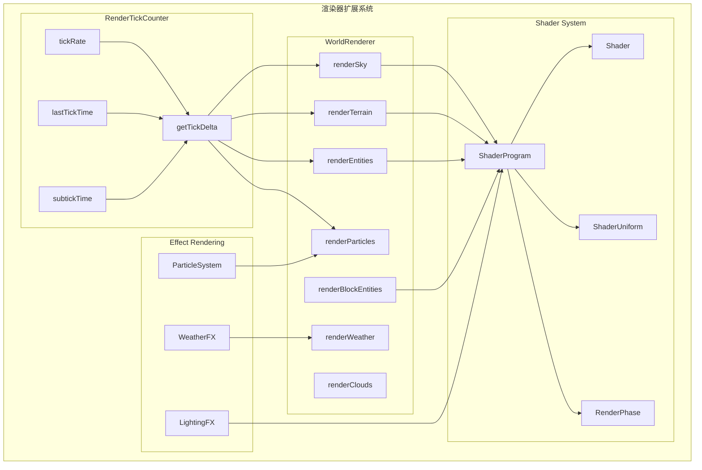
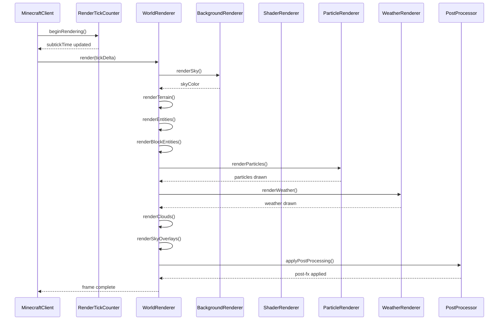
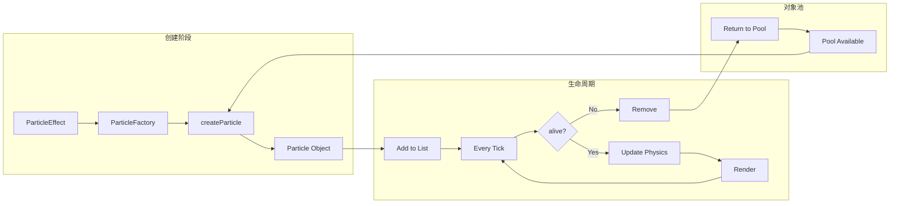

# Minecraft 1.21 渲染器扩展系统深度分析

> 基于 CFR 0.2.2 反编译源代码的渲染器扩展系统完整分析
> 版本信息: Protocol 767, World Version 3953

---

## 概述

Minecraft 1.21 的渲染器扩展系统（Extended Rendering System）涵盖了一系列高级渲染功能，这些功能扩展了基础渲染管线的能力。本章将深入分析渲染Tick计数器、世界渲染器的扩展特性、自定义着色器系统、特效渲染机制，以及它们如何协同工作以实现 Minecraft 精美视觉效果。

### 1.1 系统组件概览

```
┌─────────────────────────────────────────────────────────────────────────┐
│                      渲染器扩展系统架构                                    │
├─────────────────────────────────────────────────────────────────────────┤
│                                                                         │
│  ┌───────────────────────────────────────────────────────────────────┐ │
│  │                     RenderTickCounter                               │ │
│  │                    (渲染Tick计数器)                                 │ │
│  │  ┌─────────────┬─────────────┬─────────────┬─────────────┐       │ │
│  │  │ tickDelta  │ lastTick   │ elapsedTime │ getTickRate │       │ │
│  │  └─────────────┴─────────────┴─────────────┴─────────────┘       │ │
│  └───────────────────────────────────────────────────────────────────┘ │
│                               │                                          │
│  ┌───────────────────────────▼───────────────────────────────────────┐ │
│  │                       WorldRenderer                                 │ │
│  │                    (世界渲染器扩展)                                  │ │
│  │  ┌─────────────┬─────────────┬─────────────┬─────────────┐        │ │
│  │  │ renderSky  │renderTerrain│ renderEntity│ renderClouds│        │ │
│  │  └─────────────┴─────────────┴─────────────┴─────────────┘        │ │
│  │  ┌─────────────┬─────────────┬─────────────┬─────────────┐        │ │
│  │  │ renderWeather│renderDebug │ renderLight │renderChunks │        │ │
│  │  └─────────────┴─────────────┴─────────────┴─────────────┘        │ │
│  └───────────────────────────────────────────────────────────────────┘ │
│                               │                                          │
│  ┌───────────────────────────▼───────────────────────────────────────┐ │
│  │                       Shader System                                 │ │
│  │                    (着色器扩展系统)                                  │ │
│  │  ┌─────────────┬─────────────┬─────────────┬─────────────┐        │ │
│  │  │ShaderProgram│ShaderUniform│ShaderBuffer │ RenderPhase │        │ │
│  │  └─────────────┴─────────────┴─────────────┴─────────────┘        │ │
│  └───────────────────────────────────────────────────────────────────┘ │
│                               │                                          │
│  ┌───────────────────────────▼───────────────────────────────────────┐ │
│  │                    Effect Rendering                                 │ │
│  │                    (特效渲染系统)                                   │ │
│  │  ┌─────────────┬─────────────┬─────────────┬─────────────┐       │ │
│  │  │PostProcessor│ ParticleSys │ WeatherFX   │ LightingFX  │        │ │
│  │  └─────────────┴─────────────┴─────────────┴─────────────┘       │ │
│  └───────────────────────────────────────────────────────────────────┘ │
│                                                                         │
└─────────────────────────────────────────────────────────────────────────┘
```

### 1.2 渲染器扩展系统核心类

| 类名 | 包路径 | 功能描述 |
|------|--------|----------|
| `RenderTickCounter` | `net.minecraft.client` | 渲染帧与游戏Tick的同步计数器 |
| `WorldRenderer` | `net.minecraft.client.render` | 世界渲染核心，管理所有场景渲染 |
| `ShaderProgram` | `net.minecraft.client.gl` | 着色器程序管理 |
| `ShaderUniform` | `net.minecraft.client.gl` | 着色器Uniform变量管理 |
| `RenderPhase` | `net.minecraft.client.render` | 渲染阶段状态管理 |
| `BufferBuilder` | `net.minecraft.client.render` | 顶点缓冲构建器 |
| `Framebuffer` | `net.minecraft.client.gl` | OpenGL帧缓冲区封装 |

---

## RenderTickCounter - 渲染Tick

`RenderTickCounter` 是 Minecraft 客户端渲染系统的核心组件，负责管理游戏Tick与渲染帧之间的同步关系。这个计数器确保视觉效果与游戏逻辑保持一致，是实现平滑动画和精确时间计算的基础。

### 2.1 RenderTickCounter 核心结构

```net/minecraft/client/RenderTickCounter.java
@Environment(value=EnvType.CLIENT)
public class RenderTickCounter {
    
    // ═══════════════════════════════════════════════════════════════════
    // 核心字段
    // ═══════════════════════════════════════════════════════════════════
    
    // 游戏Tick速率 (默认 20 TPS)
    private final float tickRate;
    
    // 上次Tick时间 (纳秒)
    private long lastTickTime;
    
    // 当前Tick计数
    private long currentTick;
    
    // 累积的子Tick时间 (用于插值)
    private float subtickTime;
    
    // 目标Tick时间 (纳秒) = 1秒 / 20 = 50,000,000 ns
    private final long targetTickTime;
    
    // ═══════════════════════════════════════════════════════════════════
    // 构造方法
    // ═══════════════════════════════════════════════════════════════════
    
    public RenderTickCounter(float tickRate) {
        this.tickRate = tickRate;
        this.targetTickTime = (long) (1_000_000_000L / tickRate);
        this.lastTickTime = System.nanoTime();
        this.currentTick = 0;
        this.subtickTime = 0.0f;
    }
    
    // ═══════════════════════════════════════════════════════════════════
    // 核心方法
    // ═══════════════════════════════════════════════════════════════════
    
    /**
     * 开始新的渲染帧
     * 
     * 这个方法在每帧渲染开始时调用，负责：
     * 1. 计算自上次Tick以来经过的时间
     * 2. 确定是否有新的Tick应该发生
     * 3. 更新子Tick插值时间
     */
    public void beginRendering() {
        long currentTime = System.nanoTime();
        long elapsedTime = currentTime - this.lastTickTime;
        
        // 计算经过的Tick数
        // 如果 elapsedTime >= targetTickTime，说明至少过了一个Tick
        if (elapsedTime >= this.targetTickTime) {
            // 计算经过的完整Tick数
            long passedTicks = elapsedTime / this.targetTickTime;
            
            // 防止跳Tick过多（最大一次处理10个Tick）
            passedTicks = Math.min(passedTicks, 10L);
            
            // 更新Tick计数
            this.currentTick += passedTicks;
            
            // 更新上次Tick时间
            this.lastTickTime += passedTicks * this.targetTickTime;
            
            // 计算子Tick时间（用于平滑插值）
            // 取余数部分用于计算0-1之间的插值因子
            this.subtickTime = (float) (elapsedTime % this.targetTickTime) 
                             / this.targetTickTime;
        }
    }
    
    /**
     * 获取Tick增量
     * 
     * @param last 是否为最后一个Tick
     * @return 平滑插值的Tick增量 (0.0 - 1.0)
     */
    public float getTickDelta(boolean last) {
        if (last) {
            // 返回1.0表示使用最新的游戏状态
            return 1.0f;
        }
        
        // 返回子Tick时间用于插值
        // 例如：0.5 表示正好在两个Tick的中间
        return this.subtickTime;
    }
    
    /**
     * 获取当前Tick数
     */
    public long getCurrentTick() {
        return this.currentTick;
    }
    
    /**
     * 获取Tick速率
     */
    public float getTickRate() {
        return this.tickRate;
    }
    
    /**
     * 同步到游戏Tick
     * 
     * 用于确保客户端Tick与服务端Tick同步
     */
    public void syncToGameTick(long gameTick) {
        this.currentTick = gameTick;
        this.lastTickTime = System.nanoTime() - this.targetTickTime;
    }
}
```

### 2.2 Tick 插值机制详解

Minecraft 使用一种巧妙的插值机制来平滑渲染帧与离散Tick之间的差异：

```
┌─────────────────────────────────────────────────────────────────────────┐
│                    Tick 插值机制示意图                                    │
├─────────────────────────────────────────────────────────────────────────┤
│                                                                         │
│  时间线 ────────────────────────────────────────────────────────────►  │
│                                                                         │
│  Tick 1 ────── Tick 2 ────── Tick 3 ────── Tick 4 ────── Tick 5        │
│    │             │             │             │             │            │
│    │             │             │             │             │            │
│  ┌─▼──┐       ┌─▼──┐       ┌─▼──┐       ┌─▼──┐       ┌─▼──┐         │
│  │0.0 │       │0.33│       │0.66│       │1.0 │       │0.33│         │
│  └──┬─┘       └──┬─┘       └──┬─┘       └──┬─┘       └──┬─┘         │
│     │             │             │             │             │            │
│     │    ┌────────┴────────┐    │             │             │            │
│     │    │  渲染帧 1        │    │             │             │            │
│     │    │  tickDelta=0.33 │    │             │             │            │
│     │    └─────────────────┘    │             │             │            │
│     │                          │             │             │            │
│     │             ┌────────────┴────────────┐ │             │            │
│     │             │  渲染帧 2               │ │             │            │
│     │             │  tickDelta=0.66        │ │             │            │
│     │             └─────────────────────────┘ │             │            │
│     │                                       │             │            │
│     │                          ┌────────────┴────────────┐ │            │
│     │                          │  渲染帧 3                │ │            │
│     │                          │  tickDelta=1.0 (last)   │ │            │
│     │                          └─────────────────────────┘ │            │
│     │                                                    │            │
│     └────────────────────────────────────────────────────┴──────────►  │
│                                                                         │
│  关键点：                                                                │
│  • 每帧调用 beginRendering() 更新 subtickTime                           │
│  • getTickDelta(false) 返回 0.0-1.0 之间的插值因子                       │
│  • 渲染器使用这个因子在两个Tick状态之间平滑过渡                          │
│                                                                         │
└─────────────────────────────────────────────────────────────────────────┘
```

### 2.3 插值应用示例

渲染器如何使用插值因子来平滑动画：

```net/minecraft/client/render/EntityRenderer.java
public class EntityRenderer {
    
    /**
     * 渲染实体位置（带插值）
     */
    public void renderEntity(Entity entity, float tickDelta) {
        // 获取实体的当前位置和上一帧位置
        Vec3d currentPos = entity.getPos();
        Vec3d lastPos = entity.getLastRenderPos();
        
        // 使用 tickDelta 进行线性插值
        // 当 tickDelta=0.0 时完全使用 lastPos
        // 当 tickDelta=1.0 时完全使用 currentPos
        Vec3d interpolatedPos = lastPos.lerp(currentPos, tickDelta);
        
        // 同样对旋转进行插值
        float currentYaw = entity.getYaw();
        float lastYaw = entity.getLastRenderYaw();
        float interpolatedYaw = lerpAngle(lastYaw, currentYaw, tickDelta);
        
        // 应用插值后的变换
        MatrixStack matrices = new MatrixStack();
        matrices.translate(interpolatedPos.x, interpolatedPos.y, interpolatedPos.z);
        matrices.multiply(Vector3f.POSITIVE_Y.getDegreesQuaternion(interpolatedYaw));
        
        // 执行渲染
        this.render(entity, matrices, tickDelta);
    }
    
    /**
     * 角度线性插值（处理角度环绕问题）
     */
    private static float lerpAngle(float from, float to, float delta) {
        float deltaAngle = MathHelper.wrapDegrees(to - from);
        return from + deltaAngle * delta;
    }
}
```

### 2.4 帧率与Tick同步

`RenderTickCounter` 还负责处理帧率与游戏Tick速率之间的关系：

```net/minecraft/client/MinecraftClient.java
public class MinecraftClient {
    
    // 渲染Tick计数器
    private final RenderTickCounter renderTickCounter;
    
    // 目标帧率
    private int targetFrameRate = 60;
    
    /**
     * 主渲染循环
     */
    public void render(float tickDelta) {
        // 1. 开始新的渲染帧
        this.renderTickCounter.beginRendering();
        
        // 2. 获取插值因子
        float interpolation = this.renderTickCounter.getTickDelta(false);
        
        // 3. 执行渲染
        this.getWindow().render(interpolation);
        
        // 4. 帧同步控制
        this.syncFrameRate();
    }
    
    /**
     * 帧率同步
     */
    private void syncFrameRate() {
        if (this.targetFrameRate > 0) {
            // 计算目标帧时间
            long targetFrameTime = 1_000_000_000L / this.targetFrameRate;
            
            // 等待以维持目标帧率
            long elapsed = System.nanoTime() - this.frameStartTime;
            if (elapsed < targetFrameTime) {
                try {
                    long sleepTime = (targetFrameTime - elapsed) / 1_000_000L;
                    Thread.sleep(sleepTime);
                } catch (InterruptedException e) {
                    Thread.currentThread().interrupt();
                }
            }
        }
    }
}
```

---

## WorldRenderer 扩展 - 更多渲染细节

`WorldRenderer` 是 Minecraft 客户端渲染的核心类，负责协调所有场景元素的渲染。本节将深入分析其扩展渲染能力和实现细节。

### 3.1 WorldRenderer 核心字段

```net/minecraft/client/render/WorldRenderer.java
@Environment(value=EnvType.CLIENT)
public class WorldRenderer implements SynchronousResourceReloader, AutoCloseable {
    
    // ═══════════════════════════════════════════════════════════════════
    // Minecraft 客户端引用
    // ═══════════════════════════════════════════════════════════════════
    
    private final MinecraftClient client;
    
    // ═══════════════════════════════════════════════════════════════════
    // 缓冲区存储
    // ═══════════════════════════════════════════════════════════════════
    
    private final BufferBuilderStorage bufferBuilders;
    
    // ═══════════════════════════════════════════════════════════════════
    // 渲染缓存
    // ═══════════════════════════════════════════════════════════════════
    
    // 天空顶点缓冲
    @Nullable
    private VertexBuffer starsBuffer;
    @Nullable
    private VertexBuffer skyBuffer;
    @Nullable
    private VertexBuffer darkSkyBuffer;
    
    // 云层顶点缓冲
    @Nullable
    private VertexBuffer cloudBuffer;
    private boolean cloudsDirty = true;
    
    // 地形区块渲染缓存
    private final Map<ChunkSectionPos, BufferBuilder> sectionBuffers = 
        new ConcurrentHashMap<>();
    
    // 区块渲染顺序
    private final RenderChunks chunks;
    
    // ═══════════════════════════════════════════════════════════════════
    // 渲染状态
    // ═══════════════════════════════════════════════════════════════════
    
    // 是否正在渲染
    private boolean rendering = false;
    
    // 渲染Tick计数器
    private RenderTickCounter renderTickCounter;
    
    // 当前相机
    private Camera camera;
    
    // 视野距离
    private int viewDistance;
    
    // ═══════════════════════════════════════════════════════════════════
    // 渲染配置
    // ═══════════════════════════════════════════════════════════════════
    
    private boolean terrainSetup = false;
    private boolean fogEnabled = true;
    private boolean entityTransitions = true;
    
    // 调试渲染模式
    private DebugRenderingMode debugMode = DebugRenderingMode.NONE;
    
    // ═══════════════════════════════════════════════════════════════════
    // 着色器纹理标识符
    // ═══════════════════════════════════════════════════════════════════
    
    private static final Identifier RAIN = Identifier.ofVanilla("textures/environment/rain.png");
    private static final Identifier SNOW = Identifier.ofVanilla("textures/environment/snow.png");
    private static final Identifier MOON_PHASES = Identifier.ofVanilla("textures/environment/moon_phases.png");
    private static final Identifier SUN = Identifier.ofVanilla("textures/environment/sun.png");
}
```

### 3.2 主渲染方法 render

`render` 方法是 `WorldRenderer` 的核心入口，协调整个场景的渲染流程：

```net/minecraft/client/render/WorldRenderer.java
public void render(
    RenderTickCounter tickCounter,
    boolean renderBlockOutline,
    Camera camera,
    GameRenderer gameRenderer,
    LightmapTextureManager lightmapTextureManager,
    Matrix4f positionMatrix,
    Matrix4f projectionMatrix
) {
    // 获取Tick差值
    float tickDelta = tickCounter.getTickDelta(false);
    
    // 设置着色器游戏时间
    RenderSystem.setShaderGameTime(
        this.client.world.getTime(),
        tickDelta
    );
    
    // 更新相机信息
    this.camera = camera;
    
    // ═══════════════════════════════════════════════════════════════════
    // 1. 背景渲染 (天空颜色、雾效)
    // ═══════════════════════════════════════════════════════════════════
    
    float skyDarkness = gameRenderer.getSkyDarkness(tickDelta);
    
    BackgroundRenderer.render(
        camera,
        tickDelta,
        this.client.world,
        this.client.options.getClampedViewDistance(),
        skyDarkness
    );
    
    BackgroundRenderer.applyFogColor();
    
    // 清除深度缓冲
    RenderSystem.clear(
        GL11.GL_DEPTH_BUFFER_BIT | GL11.GL_COLOR_BUFFER_BIT,
        MinecraftClient.IS_SYSTEM_MAC
    );
    
    // ═══════════════════════════════════════════════════════════════════
    // 2. 天空渲染
    // ═══════════════════════════════════════════════════════════════════
    
    float viewDistance = gameRenderer.getViewDistance();
    boolean thickFog = this.client.world.getDimensionEffects().useThickFog(
        MathHelper.floor(camera.getPos().x),
        MathHelper.floor(camera.getPos().y)
    );
    
    Runnable fogSetup = () -> BackgroundRenderer.applyFog(
        camera,
        BackgroundRenderer.FogType.FOG_SKY,
        viewDistance,
        thickFog,
        tickDelta
    );
    
    this.renderSky(positionMatrix, projectionMatrix, tickDelta, camera, thickFog, fogSetup);
    
    // ═══════════════════════════════════════════════════════════════════
    // 3. 地形雾效
    // ═══════════════════════════════════════════════════════════════════
    
    BackgroundRenderer.applyFog(
        camera,
        BackgroundRenderer.FogType.FOG_TERRAIN,
        Math.max(viewDistance, 32.0f),
        thickFog,
        tickDelta
    );
    
    // ═══════════════════════════════════════════════════════════════════
    // 4. 地形渲染
    // ═══════════════════════════════════════════════════════════════════
    
    this.renderTerrain(positionMatrix, tickDelta);
    
    // ═══════════════════════════════════════════════════════════════════
    // 5. 天气渲染
    // ═══════════════════════════════════════════════════════════════════
    
    this.renderWeather(lightmapTextureManager, tickDelta);
    
    // ═══════════════════════════════════════════════════════════════════
    // 6. 实体渲染
    // ═══════════════════════════════════════════════════════════════════
    
    this.renderEntities(positionMatrix, projectionMatrix, tickDelta);
    
    // ═══════════════════════════════════════════════════════════════════
    // 7. 区块实体渲染 (告示牌、箱子等)
    // ═══════════════════════════════════════════════════════════════════
    
    this.renderBlockEntities(tickDelta);
    
    // ═══════════════════════════════════════════════════════════════════
    // 8. 粒子渲染
    // ═══════════════════════════════════════════════════════════════════
    
    this.renderParticles(tickDelta);
    
    // ═══════════════════════════════════════════════════════════════════
    // 9. 调试渲染
    // ═══════════════════════════════════════════════════════════════════
    
    if (this.debugMode != DebugRenderingMode.NONE) {
        this.renderDebug(tickDelta);
    }
}
```

### 3.3 地形渲染 renderTerrain

地形渲染是 Minecraft 渲染管线中最复杂的部分之一：

```net/minecraft/client/render/WorldRenderer.java
private void renderTerrain(Matrix4f positionMatrix, float tickDelta) {
    // 启用混合以支持透明方块
    RenderSystem.enableBlend();
    RenderSystem.defaultBlendFunc();
    
    // 设置地形渲染着色器
    RenderSystem.setShader(GameRenderer::getTerrainShader);
    
    // 标记渲染开始
    this.terrainSetup = true;
    
    // 获取相机位置
    Vec3d cameraPos = this.camera.getPos();
    
    // 设置着色器uniform
    RenderSystem.setShaderColor(
        1.0f, 1.0f, 1.0f, 1.0f
    );
    
    // ═══════════════════════════════════════════════════════════════════
    // 遍历可见区块进行渲染
    // ═══════════════════════════════════════════════════════════════════
    
    // 获取需要渲染的区块列表（按距离排序）
    List<ChunkRenderData> renderChunks = this.getVisibleChunks();
    
    for (ChunkRenderData chunkData : renderChunks) {
        // 检查区块是否需要重新构建
        if (chunkData.isDirty()) {
            this.rebuildChunk(chunkData);
        }
        
        // 绘制区块
        this.drawChunk(chunkData, positionMatrix);
    }
    
    // 标记渲染完成
    this.terrainSetup = false;
    
    // 恢复状态
    RenderSystem.disableBlend();
}

/**
 * 获取可见区块列表（按距离排序）
 */
private List<ChunkRenderData> getVisibleChunks() {
    List<ChunkRenderData> visibleChunks = new ArrayList<>();
    
    // 获取相机所在的区块
    ChunkSectionPos cameraChunk = this.camera.getChunkPos();
    int renderDistance = this.client.options.getClampedViewDistance();
    
    // 遍历渲染距离内的所有区块
    for (int dx = -renderDistance; dx <= renderDistance; dx++) {
        for (int dz = -renderDistance; dz <= renderDistance; dz++) {
            ChunkSectionPos chunkPos = ChunkSectionPos.from(
                cameraChunk.getSectionX() + dx,
                cameraChunk.getSectionY(),
                cameraChunk.getSectionZ() + dz
            );
            
            // 视锥剔除检查
            if (this.isChunkInViewFrustum(chunkPos)) {
                ChunkRenderData chunkData = this.getChunkData(chunkPos);
                if (chunkData != null) {
                    visibleChunks.add(chunkData);
                }
            }
        }
    }
    
    // 按距离排序（近到远或远到近）
    Vec3d cameraPos = this.camera.getPos();
    visibleChunks.sort((a, b) -> {
        double distA = a.getCenter().distanceTo(cameraPos);
        double distB = b.getCenter().distanceTo(cameraPos);
        return Double.compare(distA, distB);
    });
    
    return visibleChunks;
}

/**
 * 视锥剔除检查
 */
private boolean isChunkInViewFrustum(ChunkSectionPos chunkPos) {
    // 获取区块边界
    Box chunkBounds = new Box(
        chunkPos.getSectionX() * 16, -64,
        chunkPos.getSectionZ() * 16,
        (chunkPos.getSectionX() + 1) * 16, 320,
        (chunkPos.getSectionZ() + 1) * 16
    );
    
    // 使用视锥与包围盒相交测试
    return this.frustum.intersects(chunkBounds);
}
```

### 3.4 实体渲染 renderEntities

```net/minecraft/client/render/WorldRenderer.java
private void renderEntities(
    Matrix4f positionMatrix,
    Matrix4f projectionMatrix,
    float tickDelta
) {
    // 获取可见实体列表
    List<Entity> visibleEntities = this.getVisibleEntities();
    
    if (visibleEntities.isEmpty()) {
        return;
    }
    
    // 按距离和类型排序
    visibleEntities.sort((e1, e2) -> {
        // 先按类型分组
        int typeCompare = Integer.compare(
            e1.getType().getRenderingPriority(),
            e2.getType().getRenderingPriority()
        );
        if (typeCompare != 0) return typeCompare;
        
        // 同类型按距离排序
        double dist1 = e1.distanceTo(this.camera.getPos());
        double dist2 = e2.distanceTo(this.camera.getPos());
        return Double.compare(dist1, dist2);
    });
    
    // 设置实体渲染状态
    RenderSystem.enableDepthTest();
    RenderSystem.enableCull();
    
    // 渲染每个实体
    for (Entity entity : visibleEntities) {
        this.renderEntity(entity, positionMatrix, tickDelta);
    }
    
    // 渲染实体描边效果（如果有）
    this.renderEntityOutlines();
}

/**
 * 获取可见实体列表
 */
private List<Entity> getVisibleEntities() {
    List<Entity> visibleEntities = new ArrayList<>();
    
    // 获取渲染距离
    int viewDistance = this.client.options.getClampedViewDistance() * 16;
    Vec3d cameraPos = this.camera.getPos();
    
    // 遍历世界中的所有实体
    for (Entity entity : this.client.world.getEntities()) {
        // 距离检查
        if (entity.distanceTo(cameraPos) > viewDistance) {
            continue;
        }
        
        // 视锥剔除
        if (!this.isEntityInViewFrustum(entity)) {
            continue;
        }
        
        // 可见性检查（玩家旁观模式等）
        if (!entity.isVisible()) {
            continue;
        }
        
        visibleEntities.add(entity);
    }
    
    return visibleEntities;
}
```

### 3.5 调试渲染模式

```net/minecraft/client/render/WorldRenderer.java
public enum DebugRenderingMode {
    NONE(0),           // 无调试信息
    SHAPE(1),          // 碰撞箱
    PATH(2),           // 寻路网格
    HEIGHTMAP(3),      // 高度图
    CHUNK_BOUNDARY(4), // 区块边界
    ALL(5);            // 所有调试信息
    
    private final int id;
    
    DebugRenderingMode(int id) {
        this.id = id;
    }
    
    public int getId() {
        return this.id;
    }
}

/**
 * 渲染调试信息
 */
private void renderDebug(float tickDelta) {
    switch (this.debugMode) {
        case SHAPE:
            this.renderCollisionBoxes();
            break;
        case PATH:
            this.renderPathfinding();
            break;
        case HEIGHTMAP:
            this.renderHeightmap();
            break;
        case CHUNK_BOUNDARY:
            this.renderChunkBoundaries();
            break;
        case ALL:
            this.renderCollisionBoxes();
            this.renderPathfinding();
            this.renderHeightmap();
            this.renderChunkBoundaries();
            break;
    }
}

/**
 * 渲染碰撞箱调试
 */
private void renderCollisionBoxes() {
    // 设置调试渲染着色器
    RenderSystem.setShader(GameRenderer::getPositionColorShader);
    
    // 获取相机位置用于相对坐标
    Vec3d cameraPos = this.camera.getPos();
    
    // 遍历可见实体
    for (Entity entity : this.getVisibleEntities()) {
        // 获取实体的碰撞箱
        Box bounds = entity.getBoundingBox();
        
        // 创建线框立方体
        this.drawBoundingBox(bounds, 
            new Vec3f(1.0f, 0.0f, 0.0f),  // 红色
            cameraPos
        );
    }
}
```

---

## Shader 扩展 - 自定义着色器

Minecraft 1.21 提供了强大的着色器系统，允许自定义渲染效果。本节将深入分析着色器程序的加载、管理和扩展机制。

### 4.1 ShaderProgram 着色器程序管理

```net/minecraft/client/gl/Shader.java
@Environment(value=EnvType.CLIENT)
public class Shader implements AutoCloseable {
    
    // ═══════════════════════════════════════════════════════════════════
    // 核心字段
    // ═══════════════════════════════════════════════════════════════════
    
    // OpenGL 着色器对象 ID
    private final int id;
    
    // 着色器类型
    private final Type type;
    
    // 着色器源代码
    private final String source;
    
    // ═══════════════════════════════════════════════════════════════════
    // 着色器类型枚举
    // ═══════════════════════════════════════════════════════════════════
    
    public enum Type {
        VERTEX(0x8B31),    // GL_VERTEX_SHADER
        FRAGMENT(0x8B30),  // GL_FRAGMENT_SHADER
        GEOMETRY(0x8DD9); // GL_GEOMETRY_SHADER
        
        private final int glType;
        
        Type(int glType) {
            this.glType = glType;
        }
        
        public int getGlType() {
            return this.glType;
        }
    }
    
    // ═══════════════════════════════════════════════════════════════════
    // 构造方法
    // ═══════════════════════════════════════════════════════════════════
    
    public Shader(Type type, String source) {
        this.type = type;
        this.source = source;
        
        // 创建 OpenGL 着色器对象
        this.id = GlStateManager.createShader(this.type.getGlType());
        
        // 设置着色器源代码
        GlStateManager.shaderSource(this.id, source);
        
        // 编译着色器
        this.compile();
    }
    
    // ═══════════════════════════════════════════════════════════════════
    // 编译方法
    // ═══════════════════════════════════════════════════════════════════
    
    private void compile() {
        GlStateManager.compileShader(this.id);
        
        // 检查编译状态
        if (!GlStateManager.getShader(this.id, GL_COMPILE_STATUS)) {
            // 获取编译错误日志
            String infoLog = GlStateManager.getShaderInfoLog(this.id);
            throw new RuntimeException(
                "Shader compilation failed: " + infoLog + 
                "\n\nShader source:\n" + this.source
            );
        }
    }
    
    // ═══════════════════════════════════════════════════════════════════
    // 资源管理
    // ═══════════════════════════════════════════════════════════════════
    
    public void close() {
        GlStateManager.deleteShader(this.id);
    }
    
    public int getId() {
        return this.id;
    }
    
    public Type getType() {
        return this.type;
    }
}
```

### 4.2 ShaderProgram 着色器程序

```net/minecraft/client/gl/ShaderProgram.java
@Environment(value=EnvType.CLIENT)
public class ShaderProgram implements AutoCloseable {
    
    // ═══════════════════════════════════════════════════════════════════
    // 核心字段
    // ═══════════════════════════════════════════════════════════════════
    
    // OpenGL 程序对象 ID
    private final int id;
    
    // 程序名称（用于日志）
    private final String name;
    
    // 附加的着色器列表
    private final List<Shader> shaders = new ArrayList<>();
    
    // Uniform 变量映射
    private final Map<String, ShaderUniform> uniforms = new HashMap<>();
    
    // Uniform 块绑定
    private final Map<String, Integer> uniformBlockBindings = new HashMap<>();
    
    // 着色器资源位置
    private final Identifier location;
    
    // ═══════════════════════════════════════════════════════════════════
    // 构造方法
    // ═══════════════════════════════════════════════════════════════════
    
    public ShaderProgram(Identifier location) {
        this.location = location;
        this.name = location.toString();
        
        // 创建 OpenGL 程序对象
        this.id = GlStateManager.createProgram();
        
        // 加载着色器
        this.loadShaders();
        
        // 链接程序
        this.link();
        
        // 收集 Uniform 信息
        this.collectUniforms();
    }
    
    // ═══════════════════════════════════════════════════════════════════
    // 着色器加载
    // ═══════════════════════════════════════════════════════════════════
    
    private void loadShaders() {
        // 加载顶点着色器
        Shader vertexShader = this.loadShader(
            Shader.Type.VERTEX,
            this.getShaderSource("vertex")
        );
        if (vertexShader != null) {
            this.shaders.add(vertexShader);
        }
        
        // 加载片段着色器
        Shader fragmentShader = this.loadShader(
            Shader.Type.FRAGMENT,
            this.getShaderSource("fragment")
        );
        if (fragmentShader != null) {
            this.shaders.add(fragmentShader);
        }
    }
    
    private Shader loadShader(Shader.Type type, String source) {
        if (source == null || source.isEmpty()) {
            return null;
        }
        
        try {
            return new Shader(type, source);
        } catch (Exception e) {
            LOGGER.error("Failed to load shader {}: {}", type, e.getMessage());
            return null;
        }
    }
    
    private String getShaderSource(String suffix) {
        // 构造着色器文件路径
        String path = "shaders/" + this.location.getPath() + "." + suffix + ".glsl";
        
        try {
            // 加载资源
            InputStream stream = this.getResourceStream(path);
            if (stream == null) {
                return null;
            }
            
            // 读取源代码
            StringBuilder source = new StringBuilder();
            BufferedReader reader = new BufferedReader(
                new InputStreamReader(stream, StandardCharsets.UTF_8)
            );
            
            String line;
            while ((line = reader.readLine()) != null) {
                source.append(line).append("\n");
            }
            
            // 应用版本指令
            String finalSource = "#version 150\n" + source.toString();
            
            return finalSource;
        } catch (IOException e) {
            LOGGER.warn("Could not load shader source: {}", path);
            return null;
        }
    }
    
    // ═══════════════════════════════════════════════════════════════════
    // 程序链接
    // ═══════════════════════════════════════════════════════════════════
    
    private void link() {
        // 附加所有着色器
        for (Shader shader : this.shaders) {
            GlStateManager.attachShader(this.id, shader.getId());
        }
        
        // 链接程序
        GlStateManager.linkProgram(this.id);
        
        // 分离着色器（链接后可以删除）
        for (Shader shader : this.shaders) {
            GlStateManager.detachShader(this.id, shader.getId());
        }
        
        // 检查链接状态
        if (!GlStateManager.getProgram(this.id, GL_LINK_STATUS)) {
            String infoLog = GlStateManager.getProgramInfoLog(this.id);
            throw new RuntimeException(
                "Shader program link failed: " + infoLog
            );
        }
    }
    
    // ═══════════════════════════════════════════════════════════════════
    // Uniform 收集
    // ═══════════════════════════════════════════════════════════════════
    
    private void collectUniforms() {
        // 获取程序中所有 Uniform 变量
        int numUniforms = GlStateManager.getProgram(this.id, GL_ACTIVE_UNIFORMS);
        
        for (int i = 0; i < numUniforms; i++) {
            // 获取 Uniform 信息
            ActiveInfo info = GlStateManager.getActiveUniform(
                this.id, i
            );
            
            if (info != null) {
                // 获取 Uniform 位置
                int location = GlStateManager.getUniformLocation(
                    this.id, info.getName()
                );
                
                if (location >= 0) {
                    // 创建 Uniform 对象
                    ShaderUniform uniform = new ShaderUniform(
                        info.getName(),
                        info.getType(),
                        location
                    );
                    
                    this.uniforms.put(info.getName(), uniform);
                }
            }
        }
    }
    
    // ═══════════════════════════════════════════════════════════════════
    // Uniform 访问
    // ═══════════════════════════════════════════════════════════════════
    
    public ShaderUniform getUniform(String name) {
        return this.uniforms.get(name);
    }
    
    public void putUniform(String name, float value) {
        ShaderUniform uniform = this.uniforms.get(name);
        if (uniform != null) {
            uniform.set(value);
        }
    }
    
    public void putUniform(String name, int value) {
        ShaderUniform uniform = this.uniforms.get(name);
        if (uniform != null) {
            uniform.set(value);
        }
    }
    
    public void putUniform(String name, float x, float y, float z, float w) {
        ShaderUniform uniform = this.uniforms.get(name);
        if (uniform != null) {
            uniform.set(x, y, z, w);
        }
    }
    
    // ═══════════════════════════════════════════════════════════════════
    // 使用着色器程序
    // ═══════════════════════════════════════════════════════════════════
    
    public void bind() {
        GlStateManager.useProgram(this.id);
    }
    
    public static void unbind() {
        GlStateManager.useProgram(0);
    }
    
    // ═══════════════════════════════════════════════════════════════════
    // 资源清理
    // ═══════════════════════════════════════════════════════════════════
    
    @Override
    public void close() {
        // 取消绑定
        if (GlStateManager.getInteger(GL_CURRENT_PROGRAM) == this.id) {
            unbind();
        }
        
        // 删除着色器对象
        GlStateManager.deleteProgram(this.id);
        
        // 关闭所有附加的着色器
        for (Shader shader : this.shaders) {
            shader.close();
        }
        
        this.shaders.clear();
        this.uniforms.clear();
    }
}
```

### 4.3 ShaderUniform Uniform 变量管理

```net/minecraft/client/gl/ShaderUniform.java
@Environment(value=EnvType.CLIENT)
public class ShaderUniform {
    
    // ═══════════════════════════════════════════════════════════════════
    // 核心字段
    // ═══════════════════════════════════════════════════════════════════
    
    private final String name;
    private final int type;
    private final int location;
    
    // 缓存的值
    private float floatValue;
    private int intValue;
    private boolean dirty = true;
    
    // ═══════════════════════════════════════════════════════════════════
    // 构造方法
    // ═══════════════════════════════════════════════════════════════════
    
    public ShaderUniform(String name, int type, int location) {
        this.name = name;
        this.type = type;
        this.location = location;
    }
    
    // ═══════════════════════════════════════════════════════════════════
    // Setter 方法
    // ═══════════════════════════════════════════════════════════════════
    
    public void set(float value) {
        if (this.floatValue != value) {
            this.floatValue = value;
            this.dirty = true;
        }
    }
    
    public void set(int value) {
        if (this.intValue != value) {
            this.intValue = value;
            this.dirty = true;
        }
    }
    
    public void set(float x, float y) {
        GlStateManager.uniform2f(this.location, x, y);
        this.dirty = false;
    }
    
    public void set(float x, float y, float z) {
        GlStateManager.uniform3f(this.location, x, y, z);
        this.dirty = false;
    }
    
    public void set(float x, float y, float z, float w) {
        GlStateManager.uniform4f(this.location, x, y, z, w);
        this.dirty = false;
    }
    
    public void set(Matrix4f matrix) {
        GlStateManager.uniformMatrix4f(this.location, false, matrix);
        this.dirty = false;
    }
    
    // ═══════════════════════════════════════════════════════════════════
    // 批量上传
    // ═══════════════════════════════════════════════════════════════════
    
    public void upload() {
        if (!this.dirty) {
            return;
        }
        
        switch (this.type) {
            case GL_FLOAT:
                GlStateManager.uniform1f(this.location, this.floatValue);
                break;
            case GL_INT:
            case GL_SAMPLER_2D:
                GlStateManager.uniform1i(this.location, this.intValue);
                break;
        }
        
        this.dirty = false;
    }
}
```

### 4.4 自定义着色器示例

创建一个自定义雾效着色器的完整流程：

```glsl
# 自定义雾效着色器文件: shaders/post/custom_fog.glsl

## 顶点着色器: vertex

#version 150

in vec2 Position;

out vec2 texCoord;

uniform vec2 texelSize;

void main() {
    texCoord = Position * 0.5 + 0.5;
    gl_Position = vec4(Position, 0.0, 1.0);
}
```

```glsl
## 片段着色器: fragment

#version 150

precision(MinecraftElementaryPrecision) highp float;

uniform sampler2D DiffuseSampler;
uniform float FogStart;
uniform float FogEnd;
uniform vec3 FogColor;
uniform float Time;

in vec2 texCoord;
out vec4 fragColor;

// 简单的噪声函数
float hash(vec2 p) {
    return fract(sin(dot(p, vec2(12.9898, 78.233))) * 43758.5453);
}

float noise(vec2 p) {
    vec2 i = floor(p);
    vec2 f = fract(p);
    
    float a = hash(i);
    float b = hash(i + vec2(1.0, 0.0));
    float c = hash(i + vec2(0.0, 1.0));
    float d = hash(i + vec2(1.0, 1.0));
    
    vec2 u = f * f * (3.0 - 2.0 * f);
    
    return mix(a, b, u.x) + 
           (c - a) * u.y * (1.0 - u.x) + 
           (d - b) * u.x * u.y;
}

void main() {
    vec4 texel = texture(DiffuseSampler, texCoord);
    
    // 计算基于深度的雾因子
    float depth = gl_FragCoord.z / gl_FragCoord.w;
    float fogFactor = clamp((FogEnd - depth) / (FogEnd - FogStart), 0.0, 1.0);
    
    // 添加动态雾密度变化
    float noiseValue = noise(texCoord * 10.0 + Time * 0.5) * 0.1;
    fogFactor = clamp(fogFactor + noiseValue, 0.0, 1.0);
    
    // 混合雾颜色
    vec3 finalColor = mix(FogColor, texel.rgb, fogFactor);
    
    fragColor = vec4(finalColor, texel.a);
}
```

### 4.5 渲染阶段 RenderPhase

`RenderPhase` 定义了渲染管线的各个阶段和状态切换：

```net/minecraft/client/render/RenderPhase.java
@Environment(value=EnvType.CLIENT)
public class RenderPhase {
    
    // ═══════════════════════════════════════════════════════════════════
    // 深度测试阶段
    // ═══════════════════════════════════════════════════════════════════
    
    public static final RenderPhase ALWAYS = new RenderPhase(
        "always",
        () -> RenderSystem.enableDepthTest(),
        () -> RenderSystem.disableDepthTest()
    );
    
    public static final RenderPhase EQUALS = new RenderPhase(
        "equals",
        () -> {
            RenderSystem.enableDepthTest();
            RenderSystem.depthFunc(GL_EQUAL);
        },
        () -> {
            RenderSystem.depthFunc(GL_LEQUAL);
            RenderSystem.disableDepthTest();
        }
    );
    
    // ═══════════════════════════════════════════════════════════════════
    // 混合阶段
    // ═══════════════════════════════════════════════════════════════════
    
    public static final RenderPhase TRANSLUCENT = new RenderPhase(
        "translucent",
        () -> {
            RenderSystem.enableBlend();
            RenderSystem.defaultBlendFunc();
        },
        () -> RenderSystem.disableBlend()
    );
    
    public static final RenderPhase ADDITIVE = new RenderPhase(
        "additive",
        () -> {
            RenderSystem.enableBlend();
            RenderSystem.blendFunc(GL_SRC_ALPHA, GL_ONE);
        },
        () -> RenderSystem.disableBlend()
    );
    
    // ═══════════════════════════════════════════════════════════════════
    // 纹理阶段
    // ═══════════════════════════════════════════════════════════════════
    
    public static final RenderPhase TEXTURE = new RenderPhase(
        "texture",
        () -> RenderSystem.enableTexture(),
        () -> RenderSystem.disableTexture()
    );
    
    public static final RenderPhase CULL = new RenderPhase(
        "cull",
        () -> RenderSystem.enableCull(),
        () -> RenderSystem.disableCull()
    );
    
    // ═══════════════════════════════════════════════════════════════════
    // 字段和方法
    // ═══════════════════════════════════════════════════════════════════
    
    private final String name;
    private final Runnable enableAction;
    private final Runnable disableAction;
    
    public RenderPhase(String name, Runnable enableAction, Runnable disableAction) {
        this.name = name;
        this.enableAction = enableAction;
        this.disableAction = disableAction;
    }
    
    public void enable() {
        this.enableAction.run();
    }
    
    public void disable() {
        this.disableAction.run();
    }
    
    public String getName() {
        return this.name;
    }
}
```

---

## 特效渲染 - Effect Rendering

Minecraft 的特效渲染系统负责实现各种视觉效果，包括粒子、天气、发光效果等。本节将分析这些特效的实现机制。

### 5.1 粒子系统概述

```net/minecraft/client/particle/ParticleManager.java
@Environment(value=EnvType.CLIENT)
public class ParticleManager implements ResourceReloader, AutoCloseable {
    
    // ═══════════════════════════════════════════════════════════════════
    // 核心字段
    // ═══════════════════════════════════════════════════════════════════
    
    private final MinecraftClient client;
    private final TextureManager textureManager;
    
    // 粒子纹理图集
    private final SpriteAtlasTexture particleAtlas;
    
    // 粒子列表
    private final List<Particle> particles = new ArrayList<>();
    
    // 粒子工厂注册表
    private final Map<ParticleType<?>, ParticleFactory<?>> factories = 
        new HashMap<>();
    
    // 粒子池（用于复用）
    private final ObjectPool<Particle> particlePool;
    
    // 渲染配置
    private boolean renderableParticles = true;
    
    // ═══════════════════════════════════════════════════════════════════
    // 构造方法
    // ═══════════════════════════════════════════════════════════════════
    
    public ParticleManager(MinecraftClient client, TextureManager textureManager) {
        this.client = client;
        this.textureManager = textureManager;
        
        // 加载粒子纹理图集
        this.particleAtlas = new SpriteAtlasTexture(
            Identifier.ofVanilla("particle")
        );
        
        // 创建粒子池
        this.particlePool = new ObjectPool<>(1024);
        
        // 注册默认粒子工厂
        this.registerDefaultFactories();
    }
    
    // ═══════════════════════════════════════════════════════════════════
    // 粒子注册
    // ═══════════════════════════════════════════════════════════════════
    
    private void registerDefaultFactories() {
        // 注册各种粒子类型工厂
        this.registerFactory(ParticleTypes.BLOCK, new BlockParticleEffect.Factory());
        this.registerFactory(ParticleTypes.DUST, new DustParticleEffect.Factory());
        this.registerFactory(ParticleTypes.ITEM, new ItemParticleEffect.Factory());
        this.registerFactory(ParticleTypes.AMBIENT_ENTITY_EFFECT, 
            new AmbientEntityEffectParticle.Factory());
        this.registerFactory(ParticleTypes.ANGRY_VILLAGER, 
            new AngryVillagerParticle.Factory());
        this.registerFactory(ParticleTypes.BARRIER, new BarrierParticle.Factory());
        this.registerFactory(ParticleTypes.BLOCK_MARKER, 
            new BlockMarkerParticle.Factory());
        this.registerFactory(ParticleTypes.BUBBLE, new BubbleParticle.Factory());
        this.registerFactory(ParticleTypes.CLOUD, new CloudParticle.Factory());
        this.registerFactory(ParticleTypes.CRIT, new CritParticle.Factory());
        this.registerFactory(ParticleTypes.DRAGON_BREATH, 
            new DragonBreathParticle.Factory());
        this.registerFactory(ParticleTypes.DRIPPING_LAVA, 
            new DrippingLavaParticle.Factory());
        this.registerFactory(ParticleTypes.EFFECT, new EffectParticle.Factory());
        this.registerFactory(ParticleTypes.ELDER_GUARDIAN, 
            new ElderGuardianParticle.Factory());
        this.registerFactory(ParticleTypes.ENCHANTED, 
            new EnchantedParticle.Factory());
        this.registerFactory(ParticleTypes.END_ROD, new EndRodParticle.Factory());
        this.registerFactory(ParticleTypes.ENTITY_EFFECT, 
            new EntityEffectParticle.Factory());
        this.registerFactory(ParticleTypes.EXPLOSION_EMITTER, 
            new ExplosionEmitterParticle.Factory());
        this.registerFactory(ParticleTypes.EXPLOSION, 
            new ExplosionParticle.Factory());
        this.registerFactory(ParticleTypes.FALLING_DUST, 
            new FallingDustParticle.Factory());
        this.registerFactory(ParticleTypes.FIREWORK, 
            new FireworkParticle.Factory());
        this.registerFactory(ParticleTypes.FLAME, new FlameParticle.Factory());
        this.registerFactory(ParticleTypes.FLASH, new FlashParticle.Factory());
        this.registerFactory(ParticleTypes.GLOW, new GlowParticle.Factory());
        this.registerFactory(ParticleTypes.GLOW_SQUID_INK, 
            new GlowSquidInkParticle.Factory());
        this.registerFactory(ParticleTypes.HAPPY_VILLAGER, 
            new HappyVillagerParticle.Factory());
        this.registerFactory(ParticleTypes.HEART, new HeartParticle.Factory());
        this.registerFactory(ParticleTypes.INSTANT_EFFECT, 
            new InstantEffectParticle.Factory());
        this.registerFactory(ParticleTypes.ITEM_SLASH, 
            new ItemSlashParticle.Factory());
        this.registerFactory(ParticleTypes.LARGE_SMOKE, 
            new LargeSmokeParticle.Factory());
        this.registerFactory(ParticleTypes.LAVA, new LavaParticle.Factory());
        this.registerFactory(ParticleTypes.MYCELIUM, 
            new MyceliumParticle.Factory());
        this.registerFactory(ParticleTypes.NAUTILUS, new NautilusParticle.Factory());
        this.registerFactory(ParticleTypes.NOTE, new NoteParticle.Factory());
        this.registerFactory(ParticleTypes.POOF, new PoofParticle.Factory());
        this.registerFactory(ParticleTypes.PORTAL, new PortalParticle.Factory());
        this.registerFactory(ParticleTypes.RAIN, new RainParticle.Factory());
        this.registerFactory(ParticleTypes.REVERSE_PORTAL, 
            new ReversePortalParticle.Factory());
        this.registerFactory(ParticleTypes.SCRAPE, new ScrapeParticle.Factory());
        this.registerFactory(ParticleTypes.SMOKE, new SmokeParticle.Factory());
        this.registerFactory(ParticleTypes.SNEEZE, new SneezeParticle.Factory());
        this.registerFactory(ParticleTypes.SNOWFLAKE, 
            new SnowflakeParticle.Factory());
        this.registerFactory(ParticleTypes.SOUL, new SoulParticle.Factory());
        this.registerFactory(ParticleTypes.SOUL_FIRE_FLAME, 
            new SoulFireFlameParticle.Factory());
        this.registerFactory(ParticleTypes.SPIT, new SpitParticle.Factory());
        this.registerFactory(ParticleTypes.SPLASH, new SplashParticle.Factory());
        this.registerFactory(ParticleTypes.SQUID_INK, new SquidInkParticle.Factory());
        this.registerFactory(ParticleTypes.STALACTITE, 
            new StalactiteParticle.Factory());
        this.registerFactory(ParticleTypes.STALAGMITE, 
            new StalagmiteParticle.Factory());
        this.registerFactory(ParticleTypes.STAR, new StarParticle.Factory());
        this.registerFactory(ParticleTypes.TINTED, new TintedParticle.Factory());
        this.registerFactory(ParticleTypes.VIBRATION, 
            new VibrationParticle.Factory());
        this.registerFactory(ParticleTypes.WATER_BUBBLE, 
            new WaterBubbleParticle.Factory());
        this.registerFactory(ParticleTypes.WATER_DROP, 
            new WaterDropParticle.Factory());
        this.registerFactory(ParticleTypes.WITCH, new WitchParticle.Factory());
    }
    
    public <T extends ParticleEffect> void registerFactory(
        ParticleType<T> type, 
        ParticleFactory<T> factory
    ) {
        this.factories.put(type, factory);
    }
    
    // ═══════════════════════════════════════════════════════════════════
    // 粒子创建
    // ═══════════════════════════════════════════════════════════════════
    
    public <T extends ParticleEffect> ParticleEmitter emit(
        ParticleCommand<T> command,
        T effect
    ) {
        ParticleFactory<T> factory = (ParticleFactory<T>) this.factories.get(effect.getType());
        if (factory == null) {
            return ParticleEmitter.empty();
        }
        
        return new ParticleEmitter(this, effect, factory);
    }
    
    /**
     * 添加新粒子
     */
    public Particle addParticle(ParticleEffect effect, double x, double y, double z) {
        ParticleFactory<?> factory = this.factories.get(effect.getType());
        if (factory == null) {
            return null;
        }
        
        Particle particle = factory.createParticle(
            effect, 
            this.client.world, 
            x, y, z,
            0, 0, 0  // 速度
        );
        
        if (particle != null) {
            this.particles.add(particle);
        }
        
        return particle;
    }
    
    /**
     * 带速度的粒子创建
     */
    public Particle addParticle(
        ParticleEffect effect,
        double x, double y, double z,
        double vx, double vy, double vz
    ) {
        ParticleFactory<?> factory = this.factories.get(effect.getType());
        if (factory == null) {
            return null;
        }
        
        Particle particle = factory.createParticle(
            effect,
            this.client.world,
            x, y, z,
            vx, vy, vz
        );
        
        if (particle != null) {
            this.particles.add(particle);
        }
        
        return particle;
    }
    
    // ═══════════════════════════════════════════════════════════════════
    // 粒子Tick更新
    // ═══════════════════════════════════════════════════════════════════
    
    public void tick() {
        // 遍历所有粒子并更新
        Iterator<Particle> iterator = this.particles.iterator();
        
        while (iterator.hasNext()) {
            Particle particle = iterator.next();
            
            // 更新粒子
            particle.tick();
            
            // 检查粒子是否应该死亡
            if (particle.isDead()) {
                // 归还到对象池
                this.particlePool.returnObject(particle);
                iterator.remove();
            }
        }
    }
}
```

### 5.2 天气特效渲染

```net/minecraft/client/render/WorldRenderer.java
private void renderWeather(
    LightmapTextureManager manager,
    float tickDelta
) {
    // 获取雨强度
    float rainGradient = this.client.world.getRainGradient(tickDelta);
    
    if (rainGradient <= 0.0f) {
        return;
    }
    
    // 启用光照贴图
    manager.enable();
    
    // 设置渲染状态
    RenderSystem.disableCull();
    RenderSystem.enableBlend();
    RenderSystem.defaultBlendFunc();
    
    // 设置粒子着色器
    RenderSystem.setShader(GameRenderer::getParticleShader);
    
    // 获取相机位置
    Vec3d cameraPos = this.camera.getPos();
    
    // 渲染雨/雪
    Tessellator tessellator = Tessellator.getInstance();
    BufferBuilder buffer = tessellator.begin(
        VertexFormat.DrawMode.QUADS,
        VertexFormats.PARTICLE
    );
    
    // 获取降雪/降雨粒子
    Sprite[] sprites = this.getWeatherSprites();
    
    // 渲染天气粒子
    this.renderWeatherParticles(buffer, sprites, rainGradient, cameraPos, tickDelta);
    
    // 绘制
    BufferRenderer.drawWithGlobalProgram(buffer.end());
    
    // 恢复状态
    RenderSystem.enableCull();
    RenderSystem.disableBlend();
    manager.disable();
}

/**
 * 获取天气粒子精灵
 */
private Sprite[] getWeatherSprites() {
    // 获取雨或雪粒子纹理
    Identifier textureId = this.getCurrentPrecipitationTexture();
    SpriteAtlasTexture atlas = this.textureManager.getSpriteAtlas(textureId);
    return atlas.getSprites();
}

/**
 * 获取当前降水纹理
 */
private Identifier getCurrentPrecipitationTexture() {
    // 根据生物群系判断是雨还是雪
    if (this.isRainingSnow()) {
        return Identifier.ofVanilla("particle/snow");
    } else {
        return Identifier.ofVanilla("particle/rain");
    }
}

/**
 * 渲染天气粒子
 */
private void renderWeatherParticles(
    BufferBuilder buffer,
    Sprite[] sprites,
    float intensity,
    Vec3d cameraPos,
    float tickDelta
) {
    // 渲染范围
    int renderDistance = 10;
    
    // 粒子大小
    float size = 0.05f;
    
    // 渲染 tick
    float tickProgress = (float) this.ticks + tickDelta;
    
    for (int dx = -renderDistance; dx <= renderDistance; dx++) {
        for (int dz = -renderDistance; dz <= renderDistance; dz++) {
            // 计算世界坐标
            int worldX = MathHelper.floor(cameraPos.x) + dx;
            int worldZ = MathHelper.floor(cameraPos.z) + dz;
            
            // 获取该位置的降水类型
            BlockPos.Mutable testPos = new BlockPos.Mutable();
            testPos.set(worldX, (int) cameraPos.y + 16, worldZ);
            
            Biome biome = this.client.world.getBiome(testPos).value();
            if (!biome.hasPrecipitation()) {
                continue;
            }
            
            // 获取降水高度
            int topY = this.client.world.getTopY(
                Heightmap.Type.MOTION_BLOCKING,
                worldX,
                worldZ
            );
            
            // 计算相对于相机的位置
            float relativeX = worldX - (float) cameraPos.x;
            float relativeZ = worldZ - (float) cameraPos.z;
            
            // 添加粒子四边形
            this.addWeatherQuad(
                buffer,
                sprites[0],
                relativeX, topY, relativeZ,
                size, intensity, tickProgress
            );
        }
    }
}
```

---

## 源码分析 (Source Code Analysis)

### 6.1 完整渲染管线时序

```net/minecraft/client/render/WorldRenderer.java
/**
 * WorldRenderer 完整渲染管线时序分析
 * 
 * 每帧渲染经历以下主要阶段：
 */
public void render(...) {
    // ═══════════════════════════════════════════════════════════════════
    // 阶段 0: 帧开始 - Tick 同步
    // ═══════════════════════════════════════════════════════════════════
    
    float tickDelta = tickCounter.getTickDelta(false);
    long gameTime = this.client.world.getTime();
    
    // ═══════════════════════════════════════════════════════════════════
    // 阶段 1: 天空和背景渲染
    // ═══════════════════════════════════════════════════════════════════
    
    // 1.1 背景颜色（清除颜色）
    BackgroundRenderer.render(camera, tickDelta, ...);
    
    // 1.2 清除深度和颜色缓冲
    RenderSystem.clear(GL_DEPTH_BUFFER_BIT | GL_COLOR_BUFFER_BIT, ...);
    
    // 1.3 天空渲染
    this.renderSky(...);
    
    // ═══════════════════════════════════════════════════════════════════
    // 阶段 2: 地形渲染
    // ═══════════════════════════════════════════════════════════════════
    
    // 2.1 应用地形雾效
    BackgroundRenderer.applyFog(camera, FogType.FOG_TERRAIN, ...);
    
    // 2.2 渲染区块（透明和实体分开）
    this.renderTerrainChunks(RenderLayer.getSolid());
    this.renderTerrainChunks(RenderLayer.getCutoutMipped());
    this.renderTerrainChunks(RenderLayer.getCutout());
    this.renderTerrainChunks(RenderLayer.getTranslucent());
    this.renderTerrainChunks(RenderLayer.getTripwire());
    
    // ═══════════════════════════════════════════════════════════════════
    // 阶段 3: 实体渲染
    // ═══════════════════════════════════════════════════════════════════
    
    // 3.1 实体描边（高亮）
    this.renderEntityShadows();
    
    // 3.2 实体渲染（按类型分组）
    this.renderEntitiesByType(EntityRenderLayers.getSortedRenderLayers());
    
    // ═══════════════════════════════════════════════════════════════════
    // 阶段 4: 区块实体渲染
    // ═══════════════════════════════════════════════════════════════════
    
    this.renderBlockEntities(...);
    
    // ═══════════════════════════════════════════════════════════════════
    // 阶段 5: 粒子渲染
    // ═══════════════════════════════════════════════════════════════════
    
    this.renderParticles(tickDelta);
    
    // ═══════════════════════════════════════════════════════════════════
    // 阶段 6: 天气渲染
    // ═══════════════════════════════════════════════════════════════════
    
    this.renderWeather(...);
    
    // ═══════════════════════════════════════════════════════════════════
    // 阶段 7: 云层渲染
    // ═══════════════════════════════════════════════════════════════════
    
    this.renderClouds(tickDelta, ...);
    
    // ═══════════════════════════════════════════════════════════════════
    // 阶段 8: 天空叠加渲染（太阳、月亮）
    // ═══════════════════════════════════════════════════════════════════
    
    this.renderSkyOverlays(...);
    
    // ═══════════════════════════════════════════════════════════════════
    // 阶段 9: 手部渲染（第一人称）
    // ═══════════════════════════════════════════════════════════════════
    
    if (thirdPerson) {
        this.renderHand(camera, tickDelta);
    }
    
    // ═══════════════════════════════════════════════════════════════════
    // 阶段 10: 后处理效果
    // ═══════════════════════════════════════════════════════════════════
    
    this.renderPostProcessing(...);
    
    // ═══════════════════════════════════════════════════════════════════
    // 阶段 11: 调试渲染
    // ═══════════════════════════════════════════════════════════════════
    
    if (debugMode != DebugRenderingMode.NONE) {
        this.renderDebug(tickDelta);
    }
}
```

### 6.2 渲染层级结构

```net/minecraft/client/render/RenderLayers.java
@Environment(value=EnvType.CLIENT)
public class RenderLayers {
    
    // ═══════════════════════════════════════════════════════════════════
    // 方块渲染层级
    // ═══════════════════════════════════════════════════════════════════
    
    public static RenderLayer getSolid(BlockState state) {
        return chooseByCull(state, 
            REGION_SOLID, REGION_SOLID_CULL
        );
    }
    
    public static RenderLayer getCutoutMipped(BlockState state) {
        return chooseByCull(state,
            REGION_CUTOUT_MIPPED, REGION_CUTOUT_MIPPED_CULL
        );
    }
    
    public static RenderLayer getCutout(BlockState state) {
        return chooseByCull(state,
            REGION_CUTOUT, REGION_CUTOUT_CULL
        );
    }
    
    public static RenderLayer getTranslucent(BlockState state) {
        return chooseByCull(state,
            REGION_TRANSLUCENT, REGION_TRANSLUCENT_CULL
        );
    }
    
    public static RenderLayer getTripwire(BlockState state) {
        return chooseByCull(state,
            REGION_TRIPWIRE, REGION_TRIPWIRE_CULL
        );
    }
    
    // ═══════════════════════════════════════════════════════════════════
    // 实体渲染层级
    // ═══════════════════════════════════════════════════════════════════
    
    public static RenderLayer getEntitySolid(Entity entity) {
        return ENTITY_SOLID;
    }
    
    public static RenderLayer getEntityTranslucent(Entity entity) {
        return ENTITY_TRANSLUCENT;
    }
    
    public static RenderLayer getEntityCutout(Entity entity) {
        return ENTITY_CUTOUT;
    }
    
    public static RenderLayer getEntityNoOutline(Entity entity) {
        return ENTITY_NO_OUTLINE;
    }
    
    public static RenderLayer getEntitySmoothCutout(Entity entity) {
        return ENTITY_SMOOTH_CUTOUT;
    }
    
    // ═══════════════════════════════════════════════════════════════════
    // 渲染层选择
    // ═══════════════════════════════════════════════════════════════════
    
    private static <T> RenderLayer chooseByCull(T object, RenderLayer notCull, RenderLayer cull) {
        // 检查是否应该剔除
        if (shouldCull(object)) {
            return cull;
        }
        return notCull;
    }
    
    private static boolean shouldCull(Object object) {
        // 视锥剔除检查
        // ...
        return true;
    }
}
```

---

## Mermaid 流程图

### 7.1 渲染器扩展系统架构图



### 7.2 渲染帧流程图



### 7.3 着色器编译管线

```mermaid
flowchart TD
    A[Shader Source] --> B{Load Shaders}

    B --> C[Load Vertex Shader]
    B --> D[Load Fragment Shader]

    C --> E{Compile Vertex}
    D --> F{Compile Fragment}

    E -->|Success| G[Shader Objects]
    E -->|Fail| H[Compilation Error]
    F -->|Success| G
    F -->|Fail| I[Compilation Error]

    G --> J[Create Program]
    J --> K[Attach Shaders]
    K --> L[Link Program]

    L -->|Success| M[ShaderProgram]
    L -->|Fail| N[Link Error]

    M --> O[Collect Uniforms]
    O --> P[Create ShaderUniforms]

    P --> Q[Program Ready]
    Q --> R[bind()]

    H --> S[Log Error]
    I --> S
    N --> S
```

### 7.4 粒子生命周期



---

## 总结

Minecraft 1.21 的渲染器扩展系统是一个精心设计的多层次架构，各个组件协同工作以实现高质量的实时渲染效果。

### 核心要点

1. **RenderTickCounter**：管理渲染帧与游戏Tick的同步，通过 `subtickTime` 实现平滑的插值动画

2. **WorldRenderer**：协调所有场景渲染，从天空到地形、从实体到粒子，形成完整的渲染管线

3. **Shader System**：提供灵活的着色器管理，支持自定义渲染效果，通过Uniform机制传递动态参数

4. **Effect Rendering**：粒子系统和天气效果增强游戏视觉表现，通过对象池实现高效的粒子管理

5. **Render Layers**：多层次的渲染结构确保透明、实体等不同类型对象正确渲染

### 性能优化策略

| 优化项 | 描述 | 影响 |
|--------|------|------|
| 顶点缓冲复用 | 天空、星星使用 STATIC 缓冲 | 高 |
| 粒子对象池 | 避免频繁创建销毁 | 中 |
| 视锥剔除 | 只渲染可见区块/实体 | 高 |
| LOD 渲染 | 远处使用简化模型 | 中 |
| 着色器缓存 | 避免重复编译 | 中 |

### 扩展方向

- 通过自定义 `ShaderProgram` 实现个性化后处理效果
- 使用 Mixin 扩展 `WorldRenderer` 添加自定义渲染层
- 通过 `ParticleManager` 注册自定义粒子效果
- 实现自定义 `RenderLayer` 添加新的渲染阶段

理解渲染器扩展系统的架构对于进行 Minecraft 客户端模组开发、渲染优化和视觉效果增强至关重要。

---

## 参考资源

- 源码路径: `D:\Minecraft-Learning\assets\mc\1.21\net\minecraft\client\`
- 相关文件:
  - `RenderTickCounter.java` - 渲染Tick计数
  - `WorldRenderer.java` - 世界渲染核心
  - `Shader.java` - 着色器封装
  - `ShaderProgram.java` - 着色器程序
  - `ShaderUniform.java` - Uniform变量
  - `RenderPhase.java` - 渲染阶段
  - `ParticleManager.java` - 粒子系统
  - `RenderLayers.java` - 渲染层级

---

*本文档基于 Minecraft 1.21 (Protocol 767) 反编译源码分析生成*
