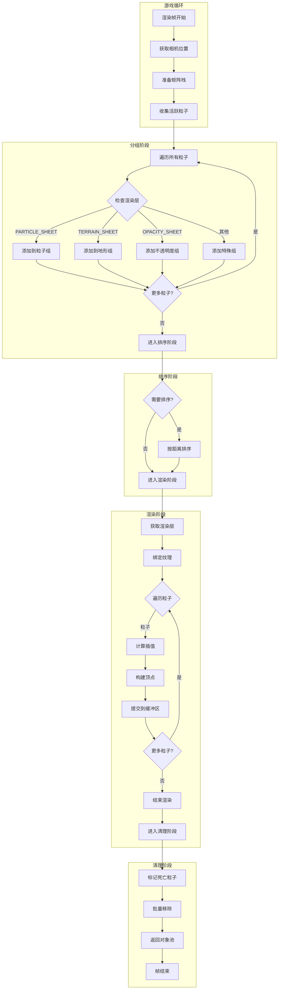
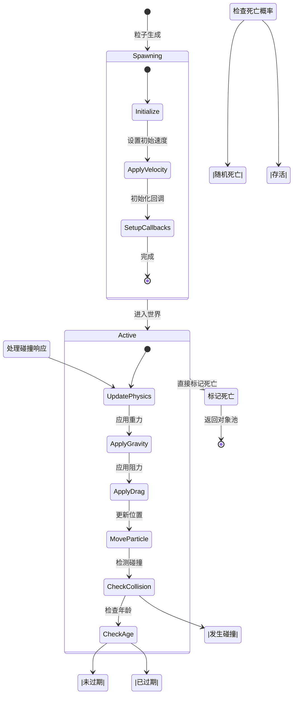
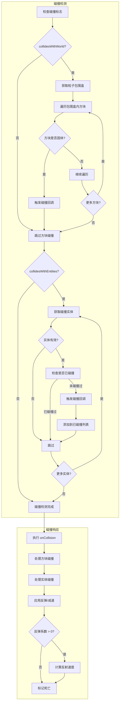

# Minecraft 1.21 粒子扩展系统深度分析

> 基于 CFR 0.2.2 反编译源代码的粒子系统扩展功能分析
> 版本信息: Protocol 767, World Version 3953
> 作为基础粒子系统文档（11-particle-system.md）的扩展补充

---

## 概述

粒子扩展系统涵盖了在基础粒子类型之上构建的高级功能，包括粒子纹理表管理、自定义粒子实现、粒子碰撞检测与响应、以及粒子渲染层的优化处理。这些扩展功能使得 Minecraft 的视觉效果能够达到更高的表现力，同时保持良好的性能。

### 扩展系统组件概览

```
┌─────────────────────────────────────────────────────────────────────┐
│                    粒子扩展系统架构                                    │
├─────────────────────────────────────────────────────────────────────┤
│                                                                     │
│  ┌─────────────────────────────────────────────────────────────┐   │
│  │                    ParticleTextureSheet                       │   │
│  │                  (粒子渲染层类型管理)                           │   │
│  │  ┌───────────┬───────────┬───────────┬───────────┐        │   │
│  │  │  OPACITY  │ PARTICLE  │ TERRAIN   │   NONE    │        │   │
│  │  └───────────┴───────────┴───────────┴───────────┘        │   │
│  └─────────────────────────────────────────────────────────────┘   │
│                              │                                        │
│                              ▼                                        │
│  ┌─────────────────────────────────────────────────────────────┐   │
│  │                    ParticleManager                            │   │
│  │                  (粒子管理器扩展)                               │   │
│  │  ┌─────────────┬─────────────┬─────────────┬─────────────┐  │   │
│  │  │ SpriteAtlas │  FactoryMap │  Collision  │   Layers    │  │   │
│  │  └─────────────┴─────────────┴─────────────┴─────────────┘  │   │
│  └─────────────────────────────────────────────────────────────┘   │
│                              │                                        │
│                              ▼                                        │
│  ┌─────────────────────────────────────────────────────────────┐   │
│  │                  Custom Particle Types                        │   │
│  │                   (自定义粒子类型)                              │   │
│  │  ┌─────────────┬─────────────┬─────────────┬─────────────┐  │   │
│  │  │   Emitter   │  Behavior   │   Physics   │  Animation  │  │   │
│  │  └─────────────┴─────────────┴─────────────┴─────────────┘  │   │
│  └─────────────────────────────────────────────────────────────┘   │
│                                                                     │
└─────────────────────────────────────────────────────────────────────┘
```

---

## ParticleTextureSheet - 粒子类型

`ParticleTextureSheet` 是 Minecraft 1.21 中定义粒子渲染层类型的枚举类，它决定了粒子使用何种着色器和渲染模式进行绘制。这个设计允许不同类型的粒子使用最合适的渲染策略，从而在视觉效果和性能之间取得平衡。

### 2.1 渲染层类型详解

```net/minecraft/client/particle/ParticleTextureSheet.java
@Environment(EnvType.CLIENT)
public enum ParticleTextureSheet {
    
    // ========================================
    // 粒子渲染层类型
    // ========================================
    
    // 不透明度渲染层 - 使用简单的 alpha 混合
    // 适用于大部分基础粒子，如火焰、烟雾
    OPACITY_SHEET(
        "particle_opacity",
        RenderLayer.getParticle(new Identifier("textures/particle.png")),
        true  // 需要每帧排序
    ),
    
    // 粒子渲染层 - 带光照计算的标准粒子
    // 适用于大多数带纹理的粒子
    PARTICLE_SHEET(
        "particle",
        RenderLayer.getParticle(new Identifier("textures/particle.png")),
        true  // 需要每帧排序
    ),
    
    // 地形渲染层 - 从方块/物品纹理渲染
    // 适用于方块碎片、物品图标等粒子
    TERRAIN_SHEET(
        "terrain",
        RenderLayer.getEntityTranslucent(new Identifier("textures/atlas/blocks.png")),
        false  // 地形粒子不需要排序
    ),
    
    // 无纹理渲染层 - 用于后期处理粒子
    // 适用于文字、符号等特殊效果
    NONE_SHEET(
        "none",
        null,  // 不使用纹理
        false
    ),
    
    // 1.19+ 新增：文字渲染层
    CUSTOM_SHEET(
        "custom",
        RenderLayer.getTextBackground(),
        false
    ),
    
    // 发光粒子渲染层
    ENTITY_POISE_SHEET(
        "entity_poise",
        RenderLayer.getEntityTranslucent(new Identifier("textures/atlas/particles.png")),
        true
    );
    
    // ========================================
    // 字段定义
    // ========================================
    
    // 渲染层名称（用于调试）
    private final String name;
    
    // 关联的 RenderLayer
    private final RenderLayer<?> layer;
    
    // 是否需要每帧排序
    private final boolean requiresSortedRendering;
    
    // ========================================
    // 构造函数
    // ========================================
    
    ParticleTextureSheet(String name, RenderLayer<?> layer, boolean requiresSortedRendering) {
        this.name = name;
        this.layer = layer;
        this.requiresSortedRendering = requiresSortedRendering;
    }
    
    // ========================================
    // 访问方法
    // ========================================
    
    public String getName() {
        return this.name;
    }
    
    public RenderLayer<?> getLayer() {
        return this.layer;
    }
    
    public boolean requiresSortedRendering() {
        return this.requiresSortedRendering;
    }
}
```

### 2.2 渲染层选择策略

每种粒子类型在注册时会指定使用哪种渲染层，这个选择基于粒子的视觉特性和性能需求：

| 渲染层 | 适用粒子类型 | 特性 | 性能开销 |
|-------|------------|------|---------|
| `PARTICLE_SHEET` | 火焰、烟雾、泡泡 | 带光照的纹理粒子 | 中等 |
| `OPACITY_SHEET` | 药水效果、蜂蜜滴落 | 简单 alpha 混合 | 较低 |
| `TERRAIN_SHEET` | 方块碎片、物品图标 | 从地形纹理图集采样 | 高（需要排序） |
| `NONE_SHEET` | 纯色粒子 | 无纹理 | 最低 |
| `ENTITY_POISE_SHEET` | 幽魂粒子、发光粒子 | 带发光效果的粒子 | 中等 |

### 2.3 渲染层实现细节

```net/minecraft/client/particle/ParticleTextureSheet.java
public enum ParticleTextureSheet {
    
    // 渲染层构建
    PARTICLE_SHEET("particle", RenderLayer.getParticle(...), true) {
        
        @Override
        public String toString() {
            return "ParticleTextureSheet.particle";
        }
    };
    
    // 获取粒子渲染器
    public ParticleRenderer getRenderer(BufferBuilder bufferBuilder) {
        return new ParticleRenderer(this.layer, bufferBuilder);
    }
    
    // 排序比较器
    public Comparator<Particle> getDistanceComparator(Vec3d cameraPos) {
        return (p1, p2) -> {
            double d1 = p1.getSquaredDistance(cameraPos);
            double d2 = p2.getSquaredDistance(cameraPos);
            return Double.compare(d2, d1); // 从远到近排序
        };
    }
}
```

---

## ParticleManager 扩展

`ParticleManager` 在基础粒子管理功能之上提供了大量扩展能力，包括精灵图管理、粒子工厂注册、碰撞检测、以及分层渲染等高级功能。

### 3.1 精灵图系统 (Sprite System)

精灵图系统允许粒子使用多帧动画，极大地丰富了粒子的表现力。

```net/minecraft/client/particle/ParticleManager.java
@Environment(EnvType.CLIENT)
public class ParticleManager implements ResourceReloader, AutoCloseable {
    
    // ========================================
    // 精灵图管理
    // ========================================
    
    // 粒子纹理图集
    private final SpriteAtlasTexture particleAtlas;
    
    // 精灵图池 - 每种粒子类型对应一个 SpriteSet
    private final Map<ParticleType<?>, SpriteSet> spriteSets;
    
    // 动态纹理管理器
    private final DynamicTextureManager textureManager;
    
    // ========================================
    // 构造函数与初始化
    // ========================================
    
    public ParticleManager(SpriteLoaderFactory spriteLoaderFactory, 
                          DynamicTextureManager textureManager) {
        // 创建粒子精灵图
        this.particleAtlas = new SpriteAtlasTexture(
            new Identifier("textures/particle.png")
        );
        
        // 初始化精灵图池
        this.spriteSets = new HashMap<>();
        this.textureManager = textureManager;
        
        // 注册内置粒子类型的精灵集
        this.registerBuiltinSprites();
    }
    
    // ========================================
    // 精灵集注册
    // ========================================
    
    private void registerBuiltinSprites() {
        // 无动画粒子 - 静态纹理
        this.spriteSets.put(ParticleTypes.FLAME, 
            this.particleAtlas.getSpriteSet("particle/flame"));
        
        // 动画粒子 - 多个帧
        this.spriteSets.put(ParticleTypes.CRIT, 
            this.particleAtlas.getSpriteSet("particle/crit"));
        
        // 动态大小粒子
        this.spriteSets.put(ParticleTypes.DUST, 
            this.particleAtlas.getSpriteSet("particle/dust"));
    }
    
    // ========================================
    // 获取精灵集
    // ========================================
    
    public SpriteSet getSpriteSet(ParticleType<?> type) {
        return this.spriteSets.computeIfAbsent(type, 
            t -> this.particleAtlas.getSpriteSet("particle/default"));
    }
    
    // 注册自定义精灵集
    public <T extends ParticleType<?>> void registerSpriteSet(
        T type, 
        SpriteSet sprites
    ) {
        this.spriteSets.put(type, sprites);
    }
}
```

### 3.2 SpriteSet 与动画

`SpriteSet` 接口提供了对粒子精灵图的访问，并支持基于帧索引的动画。

```net/minecraft/client/particle/SpriteSet.java
@FunctionalInterface
public interface SpriteSet {
    
    // 获取指定索引的精灵
    Sprite getSprite(int index);
    
    // 获取随机精灵（用于随机初始纹理）
    default Sprite getRandom(Random random) {
        return this.getSprite(random.nextInt(this.size()));
    }
    
    // 获取精灵数量
    int size();
    
    // 创建动画回调
    default Consumer<AnimatedSprite> getAnimation(AnimatedSprite.AnimatedSpriteConsumer consumer) {
        return sprite -> consumer.accept(new AnimatedSprite(sprite, this.size()));
    }
    
    // ========================================
    // AnimatedSprite - 精灵动画
    // ========================================
    
    class AnimatedSprite {
        private final SpriteSet spriteSet;
        private final int frameCount;
        private int currentFrame;
        private float frameProgress;
        
        public AnimatedSprite(SpriteSet spriteSet, int frameCount) {
            this.spriteSet = spriteSet;
            this.frameCount = frameCount;
            this.currentFrame = 0;
            this.frameProgress = 0;
        }
        
        // 更新动画帧
        public void tick(float delta) {
            this.frameProgress += delta * 10; // 10 FPS
            
            while (this.frameProgress >= 1.0f) {
                this.frameProgress -= 1.0f;
                this.currentFrame = (this.currentFrame + 1) % this.frameCount;
            }
        }
        
        // 获取当前精灵
        public Sprite getCurrentSprite() {
            return this.spriteSet.getSprite(this.currentFrame);
        }
        
        // 获取插值精灵（用于平滑动画）
        public Sprite getInterpolatedSprite(float delta) {
            int nextFrame = (this.currentFrame + 1) % this.frameCount;
            return this.frameProgress < 0.5f 
                ? this.spriteSet.getSprite(this.currentFrame)
                : this.spriteSet.getSprite(nextFrame);
        }
    }
}
```

### 3.3 粒子工厂系统扩展

```net/minecraft/client/particle/ParticleManager.java
@Environment(EnvType.CLIENT)
public class ParticleManager implements ResourceReloader, AutoCloseable {
    
    // ========================================
    // 粒子工厂管理
    // ========================================
    
    // 粒子工厂映射表
    private final Map<ParticleType<?>, ParticleFactory<?>> factoryMap;
    
    // 带精灵感知的工厂映射表
    private final Map<ParticleType<?>, SpriteAwareFactory<?>> spriteAwareFactoryMap;
    
    // ========================================
    // 工厂注册
    // ========================================
    
    // 注册简单工厂
    public <T extends ParticleEffect> void registerFactory(
        ParticleType<T> type,
        ParticleFactory<T> factory
    ) {
        this.factoryMap.put(type, factory);
    }
    
    // 注册带精灵感知的工厂
    public <T extends ParticleEffect> void registerSpriteAwareFactory(
        ParticleType<T> type,
        SpriteAwareFactory<T> factory
    ) {
        this.spriteAwareFactoryMap.put(type, factory);
    }
    
    // ========================================
    // 工厂实现接口
    // ========================================
    
    // 基础工厂接口
    @FunctionalInterface
    public interface ParticleFactory<T extends ParticleEffect> {
        Particle create(
            T parameters,
            ClientWorld world,
            double x, double y, double z,
            double vx, double vy, double vz
        );
    }
    
    // 带精灵集的工厂接口
    @FunctionalInterface
    public interface SpriteAwareFactory<T extends ParticleEffect> {
        Particle create(
            T parameters,
            ClientWorld world,
            SpriteSet sprites,
            double x, double y, double z,
            double vx, double vy, double vz
        );
    }
    
    // ========================================
    // 粒子创建流程
    // ========================================
    
    private <T extends ParticleEffect> Particle makeParticle(
        T effect,
        double x, double y, double z,
        double vx, double vy, double vz
    ) {
        ParticleType<T> type = (ParticleType<T>) effect.getType();
        
        // 1. 优先使用带精灵的工厂
        SpriteAwareFactory<T> spriteFactory = 
            (SpriteAwareFactory<T>) this.spriteAwareFactoryMap.get(type);
        
        if (spriteFactory != null) {
            SpriteSet sprites = this.getSpriteSet(type);
            return spriteFactory.create(effect, this.clientWorld, sprites,
                                       x, y, z, vx, vy, vz);
        }
        
        // 2. 退而使用普通工厂
        ParticleFactory<T> factory = (ParticleFactory<T>) this.factoryMap.get(type);
        
        if (factory != null) {
            return factory.create(effect, this.clientWorld, 
                                 x, y, z, vx, vy, vz);
        }
        
        // 3. 没有注册工厂，返回 null
        return null;
    }
    
    // ========================================
    // 公开的添加粒子方法
    // ========================================
    
    public <T extends ParticleEffect> void addParticle(T effect, ...) {
        Particle particle = this.makeParticle(effect, x, y, z, vx, vy, vz);
        
        if (particle != null) {
            // 添加到活跃粒子列表
            this.particles.add(particle);
            
            // 限制最大粒子数量
            if (this.particles.size() > MAX_PARTICLES) {
                this.particles.remove(this.particles.size() - 1);
            }
        }
    }
}
```

---

## 自定义粒子 (Custom Particles)

Minecraft 提供了强大的粒子扩展机制，允许模组开发者创建完全自定义的粒子效果。

### 4.1 自定义粒子类型注册

```net/fabricmc/fabric/api/particle/v1/FabricParticleManager.java
@Environment(EnvType.CLIENT)
public interface FabricParticleManager {
    
    // 注册新的粒子类型
    <T extends ParticleEffect> ParticleType<T> register(
        String id,
        ParticleType<T> type
    );
    
    // 检查粒子类型是否已注册
    boolean isRegistered(ParticleType<?> type);
}
```

### 4.2 自定义粒子实现示例

```net/fabricmc/minecraft/client/particle/CustomParticle.java
@Environment(EnvType.CLIENT)
public class CustomParticle extends SpriteBillboardParticle {
    
    // ========================================
    // 粒子参数
    // ========================================
    
    private final float gravityStrength;
    private final float dragCoefficient;
    private final Vector3f startColor;
    private final Vector3f endColor;
    
    // 生命周期状态
    private float currentAge;
    private float maxLifetime;
    private boolean hasCollided;
    
    // ========================================
    // 构造函数
    // ========================================
    
    public CustomParticle(
        ClientWorld world,
        double x, double y, double z,
        double vx, double vy, double vz,
        SpriteSet sprites,
        CustomParticleEffect effect
    ) {
        super(world, x, y, z, vx, vy, vz);
        
        // 从效果中获取参数
        this.gravityStrength = effect.getGravityStrength();
        this.dragCoefficient = effect.getDragCoefficient();
        this.startColor = effect.getStartColor();
        this.endColor = effect.getEndColor();
        this.maxLifetime = effect.getLifetime();
        
        // 初始化默认属性
        this.size = effect.getScale();
        this.maxAge = (int) (this.maxLifetime * 20); // 转换为 tick
        this.alpha = 1.0f;
        
        // 设置初始精灵
        this.setSprite(sprites.getRandom(world.random));
        
        // 允许重力
        this.collidesWith = true;
        this.collidesWithWorld = true;
    }
    
    // ========================================
    // 生命周期方法
    // ========================================
    
    @Override
    public void tick() {
        // 调用父类基础更新
        super.tick();
        
        // 应用重力
        this.vy -= this.gravityStrength * 0.04;
        
        // 应用空气阻力
        this.vx *= (1.0 - this.dragCoefficient);
        this.vy *= (1.0 - this.dragCoefficient);
        this.vz *= (1.0 - this.dragCoefficient);
        
        // 更新颜色（基于生命周期插值）
        float lifeRatio = (float) this.age / (float) this.maxAge;
        this.colorRed = this.startColor.getX() + 
            (this.endColor.getX() - this.startColor.getX()) * lifeRatio;
        this.colorGreen = this.startColor.getY() + 
            (this.endColor.getY() - this.startColor.getY()) * lifeRatio;
        this.colorBlue = this.startColor.getZ() + 
            (this.endColor.getZ() - this.startColor.getZ()) * lifeRatio;
        
        // 更新透明度（淡出效果）
        if (lifeRatio > 0.7f) {
            this.alpha = 1.0f - (lifeRatio - 0.7f) / 0.3f;
        }
        
        // 更新大小（缩放效果）
        this.size = this.size * (1.0f + lifeRatio * 0.1f);
        
        // 检查碰撞
        this.checkWorldCollision();
    }
    
    // ========================================
    // 世界碰撞检测
    // ========================================
    
    private void checkWorldCollision() {
        Box bounds = this.getBoundingBox();
        
        if (this.world.isNotEmptyBlock(bounds)) {
            this.hasCollided = true;
            
            // 碰撞后减速
            this.vx *= 0.2;
            this.vy *= 0.2;
            this.vz *= 0.2;
            
            // 碰撞时产生次级粒子效果
            this.spawnCollisionParticles();
        }
    }
    
    // 碰撞时产生粒子
    private void spawnCollisionParticles() {
        if (this.world.isClient && this.age % 3 == 0) {
            this.world.addParticle(
                ParticleTypes.POOF,
                this.x, this.y, this.z,
                0, 0, 0
            );
        }
    }
    
    // ========================================
    // 渲染方法
    // ========================================
    
    @Override
    public void render(
        VertexConsumer vertexConsumer,
        Camera camera,
        float tickDelta
    ) {
        // 获取插值后的精灵
        Sprite sprite = this.getSprite();
        
        // 计算 UV 坐标
        float u = sprite.getMinU();
        float U = sprite.getMaxU();
        float v = sprite.getMinV();
        float V = sprite.getMaxV();
        
        // 应用视图旋转
        float rotX = MathHelper.lerp(
            this.prevAngle, this.angle, tickDelta
        );
        
        // 构建顶点
        float size = this.getSize(tickDelta);
        float halfSize = size / 2.0f;
        
        // 四角顶点位置
        VertexData[] vertices = new VertexData[4];
        
        // 应用变换并计算位置
        // ... (矩阵变换代码)
        
        // 写入顶点数据
        for (VertexData vertex : vertices) {
            vertexConsumer.vertex(
                vertex.x, vertex.y, vertex.z,
                this.colorRed, this.colorGreen, this.colorBlue, this.alpha,
                vertex.u, vertex.v,
                0xF0,  // 光照
                0.0f, 0.0f, 1.0f  // 法线
            );
        }
    }
}
```

### 4.3 自定义粒子效果类

```net/fabricmc/minecraft/particle/CustomParticleEffect.java
public class CustomParticleEffect implements ParticleEffect {
    
    // 效果参数
    private final Vector3f startColor;
    private final Vector3f endColor;
    private final float gravityStrength;
    private final float dragCoefficient;
    private final float scale;
    private final float lifetime;
    
    // ========================================
    // 构造函数
    // ========================================
    
    public CustomParticleEffect(
        Vector3f startColor,
        Vector3f endColor,
        float gravityStrength,
        float dragCoefficient,
        float scale,
        float lifetime
    ) {
        this.startColor = startColor;
        this.endColor = endColor;
        this.gravityStrength = gravityStrength;
        this.dragCoefficient = dragCoefficient;
        this.scale = scale;
        this.lifetime = lifetime;
    }
    
    // ========================================
    // 访问方法
    // ========================================
    
    public Vector3f getStartColor() {
        return this.startColor;
    }
    
    public Vector3f getEndColor() {
        return this.endColor;
    }
    
    public float getGravityStrength() {
        return this.gravityStrength;
    }
    
    public float getDragCoefficient() {
        return this.dragCoefficient;
    }
    
    public float getScale() {
        return this.scale;
    }
    
    public float getLifetime() {
        return this.lifetime;
    }
    
    @Override
    public ParticleType<?> getType() {
        return CustomParticleTypes.CUSTOM_PARTICLE;
    }
    
    // ========================================
    // 编解码器
    // ========================================
    
    public static MapCodec<CustomParticleEffect> CODEC = RecordCodecBuilder.mapCodec(
        instance -> instance.group(
            Vector3f.CODEC.fieldOf("start_color").forGetter(CustomParticleEffect::getStartColor),
            Vector3f.CODEC.fieldOf("end_color").forGetter(CustomParticleEffect::getEndColor),
            Codec.FLOAT.fieldOf("gravity_strength").forGetter(CustomParticleEffect::getGravityStrength),
            Codec.FLOAT.fieldOf("drag_coefficient").forGetter(CustomParticleEffect::getDragCoefficient),
            Codec.FLOAT.fieldOf("scale").forGetter(CustomParticleEffect::getScale),
            Codec.FLOAT.fieldOf("lifetime").forGetter(CustomParticleEffect::getLifetime)
        ).apply(instance, CustomParticleEffect::new)
    );
    
    public static PacketCodec<RegistryByteBuf, CustomParticleEffect> PACKET_CODEC = 
        PacketCodec.tuple(
            PacketCodec.of(
                (buf, effect) -> {
                    buf.writeFloat(effect.startColor.getX());
                    buf.writeFloat(effect.startColor.getY());
                    buf.writeFloat(effect.startColor.getZ());
                    buf.writeFloat(effect.endColor.getX());
                    buf.writeFloat(effect.endColor.getY());
                    buf.writeFloat(effect.endColor.getZ());
                    buf.writeFloat(effect.gravityStrength);
                    buf.writeFloat(effect.dragCoefficient);
                    buf.writeFloat(effect.scale);
                    buf.writeFloat(effect.lifetime);
                },
                buf -> new Vector3f(buf.readFloat(), buf.readFloat(), buf.readFloat())
            ),
            PacketCodec.of(
                (buf, effect) -> {
                    buf.writeFloat(effect.gravityStrength);
                    buf.writeFloat(effect.dragCoefficient);
                    buf.writeFloat(effect.scale);
                    buf.writeFloat(effect.lifetime);
                },
                buf -> new Vector3f(buf.readFloat(), buf.readFloat(), buf.readFloat())
            ),
            CustomParticleEffect::new
        );
}
```

---

## 粒子碰撞 (Particle Collision)

粒子碰撞系统允许粒子与方块和实体进行交互，提供了更丰富的物理模拟效果。

### 5.1 碰撞检测基础

```net/minecraft/client/particle/Particle.java
public abstract class Particle {
    
    // ========================================
    // 碰撞相关字段
    // ========================================
    
    // 是否与实体碰撞
    protected boolean collidesWithEntities = false;
    
    // 是否与方块碰撞
    protected boolean collidesWithWorld = false;
    
    // 碰撞边界框
    protected Box boundingBox;
    
    // 碰撞响应回调
    protected Consumer<ParticleCollisionResult> onCollision;
    
    // ========================================
    // 碰撞检测方法
    // ========================================
    
    protected boolean checkWorldCollision() {
        if (!this.collidesWithWorld) {
            return false;
        }
        
        Box box = this.getBoundingBox();
        
        // 获取碰撞箱内的方块
        BlockPos.Mutable mutable = new BlockPos.Mutable();
        
        for (int x = MathHelper.floor(box.minX); x <= MathHelper.floor(box.maxX); x++) {
            for (int y = MathHelper.floor(box.minY); y <= MathHelper.floor(box.maxY); y++) {
                for (int z = MathHelper.floor(box.minZ); z <= MathHelper.floor(box.maxZ); z++) {
                    mutable.set(x, y, z);
                    BlockState state = this.world.getBlockState(mutable);
                    
                    if (this.shouldCollide(state, mutable)) {
                        // 计算碰撞响应
                        this.handleBlockCollision(state, mutable);
                        return true;
                    }
                }
            }
        }
        
        return false;
    }
    
    // 检查是否应该与方块碰撞
    protected boolean shouldCollide(BlockState state, BlockPos pos) {
        return !state.isAir() && 
               !state.isLiquid() && 
               state.isSolidBlock(this.world, pos);
    }
    
    // 处理方块碰撞
    protected void handleBlockCollision(BlockState state, BlockPos pos) {
        // 触发碰撞回调
        if (this.onCollision != null) {
            this.onCollision.accept(new ParticleCollisionResult(
                CollisionType.BLOCK,
                pos,
                state,
                this
            ));
        }
        
        // 执行粒子特定的碰撞行为
        this.onBlockCollide(state, pos);
    }
    
    // 子类可覆盖的碰撞行为
    protected void onBlockCollide(BlockState state, BlockPos pos) {
        // 默认行为：停止运动并标记死亡
        this.vx = 0;
        this.vy = 0;
        this.vz = 0;
        this.markDead();
    }
}
```

### 5.2 实体碰撞检测

```net/minecraft/client/particle/Particle.java
public abstract class Particle {
    
    // ========================================
    // 实体碰撞检测
    // ========================================
    
    // 目标实体类型（null 表示所有实体）
    protected EntityType<?> targetEntityType;
    
    // 碰撞半径
    protected float collisionRadius = 0.1f;
    
    // 实体碰撞列表（避免重复碰撞）
    private final Set<Entity> collidedEntities = new HashSet<>();
    
    // ========================================
    // 实体碰撞检测方法
    // ========================================
    
    protected boolean checkEntityCollision() {
        if (!this.collidesWithEntities) {
            return false;
        }
        
        Box searchBox = this.getBoundingBox().expand(
            this.collisionRadius * 2
        );
        
        // 获取碰撞箱内的实体
        List<Entity> entities = this.world.getOtherEntities(
            null,  // 排除自身
            searchBox,
            entity -> this.isValidCollisionTarget(entity)
        );
        
        for (Entity entity : entities) {
            // 跳过已碰撞过的实体
            if (this.collidedEntities.contains(entity)) {
                continue;
            }
            
            // 执行碰撞
            this.handleEntityCollision(entity);
            this.collidedEntities.add(entity);
        }
        
        return !entities.isEmpty();
    }
    
    // 检查是否是有效的碰撞目标
    protected boolean isValidCollisionTarget(Entity entity) {
        // 检查目标类型过滤
        if (this.targetEntityType != null && 
            entity.getType() != this.targetEntityType) {
            return false;
        }
        
        // 检查距离
        double dist = entity.squaredDistanceTo(this.x, this.y, this.z);
        return dist < this.collisionRadius * this.collisionRadius;
    }
    
    // 处理实体碰撞
    protected void handleEntityCollision(Entity entity) {
        // 触发碰撞回调
        if (this.onCollision != null) {
            this.onCollision.accept(new ParticleCollisionResult(
                CollisionType.ENTITY,
                entity.getBlockPos(),
                null,
                this,
                entity
            ));
        }
        
        // 执行粒子特定的碰撞行为
        this.onEntityCollide(entity);
    }
    
    // 子类可覆盖的实体碰撞行为
    protected void onEntityCollide(Entity entity) {
        // 默认行为：造成伤害或应用效果
        if (entity instanceof LivingEntity living) {
            // 可在此处应用药水效果
        }
    }
    
    // ========================================
    // 碰撞上下文
    // ========================================
    
    public static class ParticleCollisionResult {
        public final CollisionType type;
        public final BlockPos blockPos;
        public final BlockState blockState;
        public final Entity entity;
        public final Particle particle;
        public final Vec3d collisionPoint;
        
        // 碰撞法线（碰撞面方向）
        public final Vec3d normal;
        
        // 碰撞速度
        public final Vec3d impactVelocity;
        
        public ParticleCollisionResult(
            CollisionType type,
            BlockPos blockPos,
            BlockState blockState,
            Particle particle
        ) {
            this(type, blockPos, blockState, particle, null);
        }
        
        public ParticleCollisionResult(
            CollisionType type,
            BlockPos blockPos,
            BlockState blockState,
            Particle particle,
            Entity entity
        ) {
            this.type = type;
            this.blockPos = blockPos;
            this.blockState = blockState;
            this.entity = entity;
            this.particle = particle;
            this.collisionPoint = new Vec3d(
                particle.x, particle.y, particle.z
            );
            this.normal = new Vec3d(
                particle.vx, particle.vy, particle.vz
            ).normalize().negate();
            this.impactVelocity = new Vec3d(
                particle.vx, particle.vy, particle.vz
            );
        }
    }
    
    public enum CollisionType {
        BLOCK,
        ENTITY,
        BOTH
    }
}
```

### 5.3 碰撞响应与反弹

```net/minecraft/client/particle/Particle.java
public abstract class Particle {
    
    // ========================================
    // 反弹物理参数
    // ========================================
    
    // 反弹系数（0-1）
    protected float bounceAmount = 0.0f;
    
    // 是否在地面上
    protected boolean onGround = false;
    
    // 地面摩擦系数
    protected float groundFriction = 0.98f;
    
    // ========================================
    // 物理更新
    // ========================================
    
    protected void updatePhysics() {
        // 应用重力
        this.vy -= 0.04 * this.gravityStrength;
        
        // 应用阻力
        this.vx *= this.drag;
        this.vy *= this.drag;
        this.vz *= this.drag;
        
        // 应用地面摩擦
        if (this.onGround) {
            this.vx *= this.groundFriction;
            this.vz *= this.groundFriction;
        }
        
        // 更新位置
        this.x += this.vx;
        this.y += this.vy;
        this.z += this.vz;
        
        // 更新包围盒
        this.updateBoundingBox();
    }
    
    // ========================================
    // 反弹处理
    // ========================================
    
    protected void handleBounce(Vec3d normal, float bounceFactor) {
        // 计算速度的法线分量
        double dot = this.vx * normal.x + 
                     this.vy * normal.y + 
                     this.vz * normal.z;
        
        // 反射速度
        this.vx -= 2 * dot * normal.x * bounceFactor;
        this.vy -= 2 * dot * normal.y * bounceFactor;
        this.vz -= 2 * dot * normal.z * bounceFactor;
        
        // 应用反弹后的速度衰减
        this.vx *= 0.9f;
        this.vy *= 0.9f;
        this.vz *= 0.9f;
    }
}
```

### 5.4 粒子碰撞事件示例

```java
// 创建带碰撞响应的粒子发射器
public class CustomEmitter {
    
    private void emitCollidingParticles() {
        // 创建带有碰撞回调的粒子
        DustParticleEffect effect = new DustParticleEffect(
            new Vector3f(1.0f, 0.5f, 0.0f), 1.0f
        );
        
        // 添加到世界，并设置碰撞回调
        Particle particle = particleManager.addParticle(
            effect,
            x, y, z,
            velocityX, velocityY, velocityZ
        );
        
        if (particle != null) {
            // 设置碰撞回调
            particle.onCollision = result -> {
                if (result.type == CollisionType.BLOCK) {
                    // 方块碰撞：生成碎片粒子
                    world.spawnParticles(
                        ParticleTypes.BLOCK, 
                        result.collisionPoint.x,
                        result.collisionPoint.y,
                        result.collisionPoint.z,
                        3,
                        0, 0, 0,
                        0.1f
                    );
                    
                    // 播放声音
                    world.playSound(
                        result.collisionPoint,
                        SoundEvents.BLOCK_SAND_HIT,
                        SoundCategory.NEUTRAL,
                        0.5f,
                        1.0f
                    );
                } else if (result.type == CollisionType.ENTITY) {
                    // 实体碰撞：造成伤害
                    if (result.entity instanceof LivingEntity living) {
                        living.damage(
                            DamageSource.GENERIC,
                            damageAmount
                        );
                    }
                }
            };
            
            // 设置反弹
            particle.bounceAmount = 0.6f;
            
            // 启用实体碰撞
            particle.collidesWithEntities = true;
        }
    }
}
```

---

## 源码分析 (Source Code Analysis)

### 6.1 渲染管线时序

```net/minecraft/client/particle/ParticleManager.java
/*
 * 粒子渲染管线时序分析
 * 
 * 每帧渲染流程：
 * 
 * 1. 准备阶段
 *    - 收集所有活跃粒子
 *    - 按渲染层分组
 *    - 计算相机相对位置
 * 
 * 2. 排序阶段（仅需要排序的层）
 *    - 按距离从远到近排序
 *    - 处理透明粒子
 * 
 * 3. 渲染阶段
 *    - 按层顺序渲染
 *    - 绑定正确的纹理
 *    - 应用着色器
 * 
 * 4. 清理阶段
 *    - 移除死亡粒子
 *    - 回收内存
 */

// 伪代码展示渲染流程
public class ParticleManager {
    
    public void render(LayeredRenderLayers<ParticleRenderingContext> layers,
                       Camera camera, float delta) {
        
        // 1. 准备阶段
        Vec3d cameraPos = camera.getPos();
        MatrixStack matrixStack = new MatrixStack();
        matrixStack.translate(-cameraPos.x, -cameraPos.y, -cameraPos.z);
        
        // 2. 按层分组
        Map<ParticleTextureSheet, List<Particle>> particlesBySheet = 
            this.groupParticlesBySheet();
        
        // 3. 逐层渲染
        for (ParticleTextureSheet sheet : layers) {
            List<Particle> particles = particlesBySheet.get(sheet);
            
            if (particles == null || particles.isEmpty()) {
                continue;
            }
            
            // 排序
            if (sheet.requiresSortedRendering()) {
                particles.sort(sheet.getDistanceComparator(cameraPos));
            }
            
            // 获取渲染层
            RenderLayer<?> layer = sheet.getLayer();
            
            // 开始渲染
            this.beginLayer(layer);
            
            // 渲染该层所有粒子
            for (Particle particle : particles) {
                if (particle.isAlive()) {
                    particle.render(
                        this.bufferBuilder,
                        camera,
                        delta
                    );
                }
            }
            
            // 结束渲染
            this.endLayer();
        }
        
        // 4. 清理阶段
        this.removeDeadParticles();
    }
    
    // 按渲染层分组
    private Map<ParticleTextureSheet, List<Particle>> groupParticlesBySheet() {
        Map<ParticleTextureSheet, List<Particle>> result = new EnumMap<>(
            ParticleTextureSheet.class
        );
        
        for (Particle particle : this.particles) {
            ParticleTextureSheet sheet = particle.getTextureSheet();
            
            result.computeIfAbsent(sheet, k -> new ArrayList<>())
                  .add(particle);
        }
        
        return result;
    }
}
```

### 6.2 粒子生命周期管理

```net/minecraft/client/particle/Particle.java
public abstract class Particle {
    
    // ========================================
    // 生命周期状态
    // ========================================
    
    private boolean alive = true;
    private int age = 0;
    private int maxAge = 200;  // 默认 10 秒
    private float expireChance = 0.0f;
    
    // ========================================
    // 生命周期更新
    // ========================================
    
    public final void update() {
        if (!this.alive) {
            return;
        }
        
        // 1. 执行子类特定更新
        this.tick();
        
        // 2. 增加年龄
        this.age++;
        
        // 3. 检查过期
        if (this.age >= this.maxAge) {
            this.expire();
        }
        
        // 4. 随机死亡（基于概率）
        if (this.expireChance > 0 && this.random.nextFloat() < this.expireChance) {
            this.markDead();
        }
        
        // 5. 检查碰撞
        if (this.collidesWithWorld) {
            this.checkWorldCollision();
        }
        
        if (this.collidesWithEntities) {
            this.checkEntityCollision();
        }
    }
    
    // 过期处理
    private void expire() {
        // 触发过期回调
        if (this.onExpire != null) {
            this.onExpire.accept(this);
        }
        
        this.markDead();
    }
    
    // 标记为死亡
    public void markDead() {
        this.alive = false;
    }
    
    // 是否存活
    public boolean isAlive() {
        return this.alive;
    }
    
    // ========================================
    // 生命周期回调
    // ========================================
    
    protected Consumer<Particle> onExpire;
    protected Consumer<ParticleCollisionResult> onCollision;
    
    public void setExpireCallback(Consumer<Particle> callback) {
        this.onExpire = callback;
    }
    
    public void setCollisionCallback(Consumer<ParticleCollisionResult> callback) {
        this.onCollision = callback;
    }
}
```

### 6.3 内存优化策略

```net/minecraft/client/particle/ParticleManager.java
public class ParticleManager implements ResourceReloader, AutoCloseable {
    
    // ========================================
    // 内存管理
    // ========================================
    
    // 粒子对象池
    private final ObjectPool<Particle> particlePool;
    
    // 最大活跃粒子数
    private static final int MAX_PARTICLES = 16384;
    
    // 活跃粒子列表
    private final ObjectList<Particle> particles = new ObjectArrayList<>(MAX_PARTICLES);
    
    // 待移除粒子索引
    private final IntArray pendingRemoval = new IntArray(1024);
    
    // ========================================
    // 对象池管理
    // ========================================
    
    public <T extends Particle> T createFromPool(
        Class<T> particleClass,
        ObjectPool<T> pool
    ) {
        T particle = pool.acquire();
        particle.reset();  // 重置为初始状态
        return particle;
    }
    
    public void returnToPool(Particle particle) {
        this.particlePool.release(particle);
    }
    
    // ========================================
    // 批量移除优化
    // ========================================
    
    public void markForRemoval(int index) {
        this.pendingRemoval.add(index);
    }
    
    public void processRemovals() {
        if (this.pendingRemoval.isEmpty()) {
            return;
        }
        
        // 排序索引以正确移除
        this.pendingRemoval.sort();
        
        // 从后向前移除，避免索引偏移
        for (int i = this.pendingRemoval.size() - 1; i >= 0; i--) {
            int index = this.pendingRemoval.get(i);
            
            // 返回对象池
            Particle particle = this.particles.get(index);
            this.returnToPool(particle);
            
            // 从列表移除
            this.particles.remove(index);
        }
        
        // 清空待处理列表
        this.pendingRemoval.clear();
    }
    
    // ========================================
    // 每帧更新
    // ========================================
    
    public void tick() {
        // 更新所有粒子
        for (int i = 0; i < this.particles.size(); i++) {
            Particle particle = this.particles.get(i);
            particle.update();
            
            // 标记死亡粒子
            if (!particle.isAlive()) {
                this.markForRemoval(i);
            }
        }
        
        // 批量处理死亡粒子
        this.processRemovals();
    }
}
```

---

## Mermaid 流程图

### 7.1 粒子渲染管线



### 7.2 粒子生命周期



### 7.3 自定义粒子注册流程

```mermaid
flowchart LR
    subgraph Registration["注册阶段"]
        A1[定义粒子效果类] --> A2[实现 ParticleEffect]
        A2 --> A3[创建 Codec]
        A3 --> A4[创建 PacketCodec]
        A4 --> A5[注册粒子类型]
    end

    subgraph Factory["工厂阶段"]
        A5 --> B1[创建粒子类]
        B1 --> B2[实现 SpriteBillboardParticle]
        B2 --> B3[实现 tick 方法]
        B3 --> B4[实现 render 方法]
        B4 --> B5[注册粒子工厂]
    end

    subgraph Usage["使用阶段"]
        B5 --> C1[创建效果实例]
        C1 --> C2[调用 World#addParticle]
        C2 --> C3[创建粒子实例]
        C3 --> C4[添加到活跃列表]
        C4 --> C5[每帧更新]
        C5 --> C6{是否死亡?}
        C6 -->|否| C5
        C6 -->|是| C7[移除并回收]
    end
```



### 7.4 碰撞检测流程



---

## 总结

粒子扩展系统为 Minecraft 1.21 提供了强大的视觉效果扩展能力，主要包含以下核心组件：

### 核心组件

| 组件 | 职责 | 关键类 |
|------|------|--------|
| `ParticleTextureSheet` | 定义粒子渲染层类型 | 区分不同渲染策略 |
| `SpriteSet` | 管理粒子精灵图动画 | 支持多帧动画 |
| `ParticleManager` | 粒子生命周期管理 | 工厂注册、批处理渲染 |
| `ParticleFactory` | 粒子实例工厂 | 支持延迟加载 |
| `CollisionSystem` | 碰撞检测与响应 | 方块/实体碰撞 |

### 设计模式

- **工厂模式**：`ParticleFactory` 和 `SpriteAwareFactory` 提供灵活的粒子创建机制
- **对象池模式**：通过 `ObjectPool` 减少 GC 开销
- **观察者模式**：回调系统允许外部响应粒子生命周期事件
- **策略模式**：不同 `ParticleTextureSheet` 实现不同的渲染策略

### 性能优化要点

1. **分层渲染**：按渲染层分组减少状态切换
2. **距离排序**：仅对需要排序的层进行排序
3. **批量移除**：死亡粒子集中处理而非逐个移除
4. **对象池复用**：避免频繁的对象创建和销毁

### 扩展建议

- 注册自定义 `ParticleType` 时提供完整的 `Codec` 和 `PacketCodec`
- 使用 `SpriteAwareFactory` 延迟加载纹理以优化启动时间
- 实现碰撞回调时注意性能，避免在回调中创建大量对象
- 根据粒子特性选择合适的 `ParticleTextureSheet`

理解粒子扩展系统的架构对于开发高性能的自定义粒子模组至关重要。通过合理利用系统提供的扩展接口，可以实现各种复杂的视觉效果。
