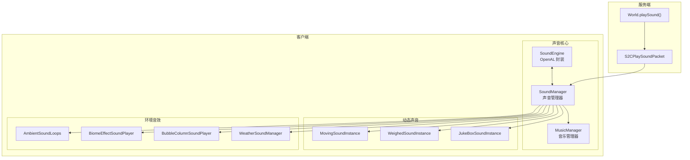
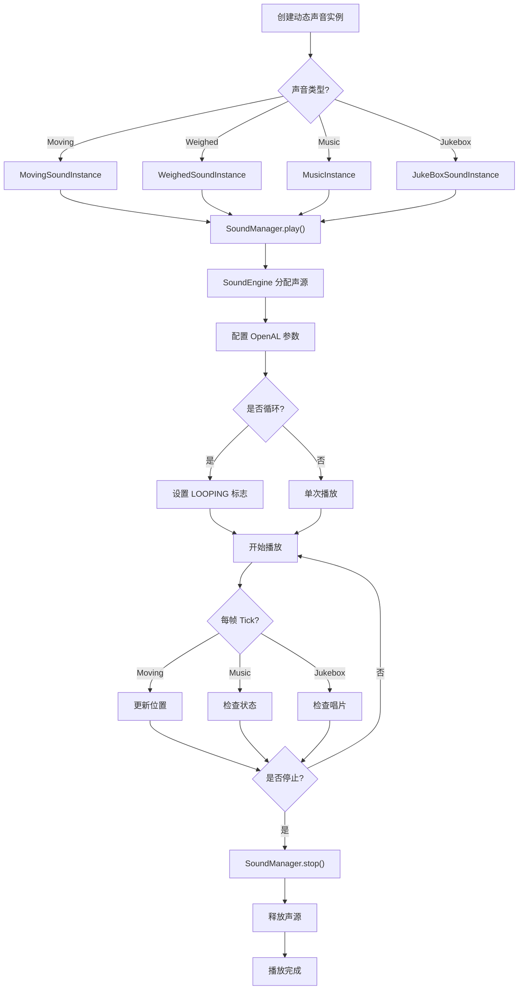
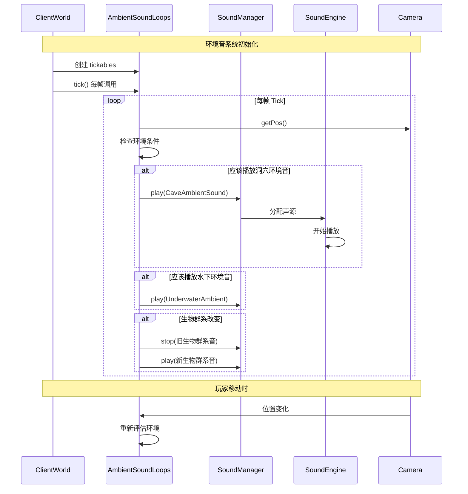

# Minecraft 1.21 声音扩展系统 (Sound System Extended)

> 基于 CFR 0.2.2 反编译源代码的声音扩展系统完整分析
> 版本信息: Protocol 767, World Version 3953
> 本文档是基础声音系统 (12-sound-system.md) 的扩展，涵盖高级声音特性

---

## 1. 概述

Minecraft 1.21 的声音系统不仅包含基础的声音播放功能，还提供了一系列高级扩展功能。本文档详细分析这些扩展系统，包括：动态声音生成、音乐系统高级特性、音频设备管理、多通道混音、环境音效等。

### 1.1 扩展系统组件一览

| 组件 | 说明 | 核心类 |
|------|------|--------|
| 动态声音 | 运行时生成的声音 | `DynamicSoundManager`, `MovingSoundInstance` |
| 音乐系统 | 背景音乐与唱片系统 | `MusicManager`, `JukeBoxSoundInstance` |
| 环境音 | 沉浸式环境音效 | `AmbientSoundLoops`, `BiomeEffectSoundPlayer` |
| 流体音 | 流体相关音效 | `FluidSoundInstance`, `BubbleColumnSoundPlayer` |
| 天气音 | 雨雪雷电音效 | `WeatherSoundManager` |
| 音频引擎 | OpenAL 封装 | `SoundEngine`, `AudioStream` |

---

## 2. SoundEngine 扩展

### 2.1 SoundEngine 核心架构

`SoundEngine` 是 Minecraft 音频系统的核心引擎，负责与 OpenAL 进行交互：

```net/minecraft/client/sound/SoundEngine.java
@Environment(value=EnvType.CLIENT)
public class SoundEngine implements Closeable {
    // OpenAL 设备与上下文
    private long devicePointer;
    private long contextPointer;
    
    // 活动声源映射
    private final Map<SoundInstance, Integer> sources = new HashMap<>();
    
    // 待处理的声音队列
    private final Queue<SoundInstance> pendingSources = new ConcurrentLinkedQueue<>();
    
    // 监听器参数
    private Vec3d listenerPosition = Vec3d.ZERO;
    private Vec3d listenerVelocity = Vec3d.ZERO;
    private Vec3d listenerOrientation = Vec3d.ZERO;
    
    // 系统状态
    private volatile boolean initialized = false;
    private volatile boolean paused = false;
    
    /**
     * 初始化 OpenAL 设备
     */
    public void initialize() {
        if (this.initialized) {
            return;
        }
        
        // 打开 OpenAL 设备
        this.devicePointer = ALUtil.getFunctionProvider()
            .openOpenALDevice();
        
        if (this.devicePointer == 0L) {
            LOGGER.error("Failed to open OpenAL device");
            return;
        }
        
        // 创建上下文
        this.contextPointer = ALC10.alcCreateContext(
            this.devicePointer, (int[])null
        );
        
        if (this.contextPointer == 0L) {
            LOGGER.error("Failed to create OpenAL context");
            return;
        }
        
        // 激活上下文
        ALC10.alcMakeContextCurrent(this.contextPointer);
        
        // 设置监听器参数
        this.updateListenerParameters(Vec3d.ZERO, Vec3d.ZERO);
        
        this.initialized = true;
        LOGGER.info("Sound engine initialized");
    }
    
    /**
     * 更新监听器参数（位置、速度、方向）
     */
    public void updateListener(Camera camera) {
        if (!this.initialized) {
            return;
        }
        
        Vec3d pos = camera.getPos();
        Vec3d vel = camera.getVelocity();
        Vec3d forward = camera.getForwardVector();
        Vec3d up = camera.getUpVector();
        
        this.updateListenerParameters(pos, vel, forward, up);
    }
    
    private void updateListenerParameters(Vec3d position, Vec3d velocity,
                                         Vec3d forward, Vec3d up) {
        // 设置位置
        AL11.alListener3f(AL11.AL_POSITION, 
            (float) position.x, (float) position.y, (float) position.z);
        
        // 设置速度（用于多普勒效应）
        AL11.alListener3f(AL11.AL_VELOCITY,
            (float) velocity.x, (float) velocity.y, (float) velocity.z);
        
        // 设置方向（用于空间化）
        float[] orientation = new float[] {
            (float) forward.x, (float) forward.y, (float) forward.z,
            (float) up.x, (float) up.y, (float) up.z
        };
        AL11.alListenerfv(AL11.AL_ORIENTATION, orientation);
    }
    
    /**
     * 播放声音实例
     */
    public void play(SoundInstance sound) {
        if (!this.initialized) {
            return;
        }
        
        // 检查是否已播放
        if (this.sources.containsKey(sound)) {
            return;
        }
        
        // 获取或创建声源
        int source = this.acquireSource(sound);
        if (source == -1) {
            LOGGER.warn("No available sound sources");
            return;
        }
        
        // 配置声源参数
        this.configureSource(source, sound);
        
        // 开始播放
        AL11.alSourcePlay(source);
        
        // 记录活跃声音
        this.sources.put(sound, source);
    }
    
    /**
     * 获取可用的声源
     */
    private int acquireSource(SoundInstance sound) {
        // 复用已停止的声源
        for (Map.Entry<SoundInstance, Integer> entry : this.sources.entrySet()) {
            Integer source = entry.getValue();
            int state = AL11.alGetSourcei(source, AL11.AL_SOURCE_STATE);
            
            if (state == AL11.AL_STOPPED) {
                SoundInstance oldSound = entry.getKey();
                this.releaseSourceData(source, oldSound);
                this.sources.remove(oldSound);
                return source;
            }
        }
        
        // 如果声源池未满，创建新声源
        if (this.sources.size() < this.getMaxSources()) {
            int source = AL11.alGenSources();
            if (ALUtils.checkALError("Generating source")) {
                return -1;
            }
            return source;
        }
        
        return -1;
    }
    
    /**
     * 配置声源参数
     */
    private void configureSource(int source, SoundInstance sound) {
        // 位置
        AL11.alSource3f(source, AL11.AL_POSITION,
            (float) sound.getX(), (float) sound.getY(), (float) sound.getZ());
        
        // 速度（用于多普勒效应）
        AL11.alSource3f(source, AL11.AL_VELOCITY, 0, 0, 0);
        
        // 音量（考虑距离衰减）
        float volume = this.calculateVolume(sound);
        AL11.alSourcef(source, AL11.AL_GAIN, volume);
        
        // 音调
        AL11.alSourcef(source, AL11.AL_PITCH, sound.getPitch());
        
        // 循环播放
        if (sound.isLooping()) {
            AL11.alSourcei(source, AL11.AL_LOOPING, AL11.AL_TRUE);
        } else {
            AL11.alSourcei(source, AL11.AL_LOOPING, AL11.AL_FALSE);
        }
        
        // 距离模型
        AL11.alDistanceModel(AL11.AL_LINEAR_DISTANCE_CLAMPED);
        
        // 参考距离和最大距离
        AL11.alSourcef(source, AL11.AL_REFERENCE_DISTANCE, 
            sound.getReferenceDistance());
        AL11.alSourcef(source, AL11.AL_MAX_DISTANCE, 
            sound.getDistanceToTravel());
    }
    
    /**
     * 计算最终音量
     */
    private float calculateVolume(SoundInstance sound) {
        // 获取类别音量
        float categoryVolume = this.getCategoryVolume(sound.getCategory());
        
        // 获取基础音量
        float baseVolume = sound.getVolume();
        
        // 根据衰减类型调整
        float distanceAttenuation = 1.0f;
        if (sound.getAttenuationType() == AttenuationType.LINEAR) {
            double distance = this.calculateDistance(sound);
            distanceAttenuation = this.calculateAttenuation(
                distance, sound.getReferenceDistance(),
                sound.getDistanceToTravel()
            );
        }
        
        return baseVolume * categoryVolume * distanceAttenuation;
    }
}
```

### 2.2 音频流处理

`AudioStream` 类处理音频数据的流式加载和解码：

```net/minecraft/client/sound/AudioStream.java
@Environment(value=EnvType.CLIENT)
public class AudioStream implements Closeable {
    // 流式音频缓冲
    private final AudioStreamProvider provider;
    private volatile Buffer buffer;
    
    // 音频格式信息
    private final int channels;
    private final int sampleRate;
    private final int bitsPerSample;
    
    public AudioStream(AudioStreamProvider provider) throws IOException {
        this.provider = provider;
        
        // 获取音频格式
        AudioFormat format = provider.getFormat();
        this.channels = format.getChannels();
        this.sampleRate = format.getSampleRate();
        this.bitsPerSample = format.getSampleSize();
    }
    
    /**
     * 读取音频数据块
     */
    public Optional<ByteBuffer> read() throws IOException {
        ByteBuffer data = this.provider.read();
        if (data == null || !data.hasRemaining()) {
            return Optional.empty();
        }
        
        // 转换为 OpenAL 可用的格式
        return Optional.of(this.provider.getBuffer(data));
    }
    
    /**
     * 检查流是否结束
     */
    public boolean isFinished() {
        return this.provider.isFinished();
    }
    
    @Override
    public void close() throws IOException {
        this.provider.close();
    }
}
```

### 2.3 声音缓冲区管理

```net/minecraft/client/sound/BufferAudioStream.java
@Environment(value=EnvType.CLIENT)
public class BufferAudioStream implements AudioStreamProvider {
    private static final int BUFFER_SIZE = 65536;  // 64KB 缓冲
    
    private final InputStream inputStream;
    private final OggAudioStreamDecoder decoder;
    
    public BufferAudioStream(InputStream inputStream) throws IOException {
        this.inputStream = inputStream;
        this.decoder = new OggAudioStreamDecoder(inputStream);
    }
    
    @Override
    public AudioFormat getFormat() {
        return new AudioFormat(44100, 16, 2, true, false);
    }
    
    @Override
    public ByteBuffer read() throws IOException {
        byte[] buffer = new byte[BUFFER_SIZE];
        int bytesRead = this.decoder.read(buffer);
        
        if (bytesRead <= 0) {
            return null;
        }
        
        ByteBuffer result = ByteBuffer.allocateDirect(bytesRead);
        result.put(buffer, 0, bytesRead);
        result.flip();
        
        return result;
    }
    
    @Override
    public ByteBuffer getBuffer(ByteBuffer data) {
        return data;
    }
    
    @Override
    public boolean isFinished() {
        return !this.decoder.hasRemaining();
    }
}
```

---

## 3. SoundCategory - 声音分类

### 3.1 完整的分类枚举

`SoundCategory` 定义了游戏中所有的音量通道：

```net/minecraft/sound/SoundCategory.java
public enum SoundCategory {
    MASTER("master"),           // 总音量
    MUSIC("music"),             // 背景音乐
    RECORDS("record"),          // 唱片机音乐
    WEATHER("weather"),         // 天气音效
    BLOCKS("block"),             // 方块交互音
    HOSTILE("hostile"),         // 敌对生物
    NEUTRAL("neutral"),         // 中立生物
    PLAYERS("player"),          // 玩家声音
    AMBIENT("ambient"),         // 环境音
    VOICE("voice");             // 语音/生物叫声
    
    private final String name;
    
    // 数值映射（用于网络同步）
    private static final SoundCategory[] VALUES = values();
    
    public static SoundCategory byId(int id) {
        if (id < 0 || id >= VALUES.length) {
            return MASTER;
        }
        return VALUES[id];
    }
    
    public int getId() {
        return this.ordinal();
    }
}
```

### 3.2 分类音量管理

```net/minecraft/client/option/SoundCategoryOption.java
@Environment(value=EnvType.CLIENT)
public class SoundCategoryOption {
    private final SoundCategory category;
    private float volume;
    
    public SoundCategoryOption(SoundCategory category, float defaultVolume) {
        this.category = category;
        this.volume = defaultVolume;
    }
    
    public SoundCategory getCategory() {
        return this.category;
    }
    
    public float getVolume() {
        return this.volume;
    }
    
    public void setVolume(float volume) {
        this.volume = MathHelper.clamp(volume, 0.0f, 1.0f);
    }
    
    /**
     * 获取实际输出音量
     * 最终音量 = MASTER_VOLUME × CATEGORY_VOLUME × SOUND_VOLUME
     */
    public float getEffectiveVolume(float soundVolume) {
        float masterVolume = Option.MASTER_VOLUME.getValue();
        return soundVolume * this.volume * masterVolume;
    }
}
```

---

## 4. 动态声音 (Dynamic Sounds)

### 4.1 MovingSoundInstance - 移动声音

用于跟随实体移动的声音，如苦力怕爆炸前的嗞嗞声：

```net/minecraft/client/sound/MovingSoundInstance.java
@Environment(value=EnvType.CLIENT)
public abstract class MovingSoundInstance implements SoundInstance {
    protected final SoundEvent sound;
    protected final SoundCategory category;
    
    // 当前位置（实时更新）
    protected Vec3d x;
    protected Vec3d y;
    protected Vec3d z;
    
    // 声音参数
    protected float volume = 1.0f;
    protected float pitch = 1.0f;
    protected float referenceDistance = 16.0f;
    protected AttenuationType attenuationType = AttenuationType.LINEAR;
    
    // 播放状态
    protected boolean started;
    protected boolean repeating;
    protected int repeatDelay;
    
    /**
     * 每帧更新位置
     */
    public abstract void tick();
    
    /**
     * 检查是否应停止播放
     */
    public boolean shouldStop() {
        return false;
    }
    
    @Override
    public Identifier getId() {
        return this.sound.getId();
    }
    
    @Override
    public float getVolume() {
        return this.volume;
    }
    
    @Override
    public float getPitch() {
        return this.pitch;
    }
    
    @Override
    public double getX() {
        return this.x;
    }
    
    @Override
    public double getY() {
        return this.y;
    }
    
    @Override
    public double getZ() {
        return this.z;
    }
    
    @Override
    public AttenuationType getAttenuationType() {
        return this.attenuationType;
    }
    
    @Override
    public float getReferenceDistance() {
        return this.referenceDistance;
    }
    
    @Override
    public float getDistanceToTravel() {
        return this.sound.getDistanceToTravel(this.volume);
    }
    
    public boolean isLooping() {
        return this.repeating;
    }
}
```

### 4.2 EntityAttachSoundInstance - 实体附着声音

用于实体骑乘、装备等场景：

```net/minecraft/client/sound/EntityAttachSoundInstance.java
@Environment(value=EnvType.CLIENT)
public class EntityAttachSoundInstance extends MovingSoundInstance {
    private final Entity entity;
    private final Vec3d offset;
    
    public EntityAttachSoundInstance(Entity entity, SoundEvent sound,
                                    SoundCategory category, Vec3d offset) {
        this.sound = sound;
        this.category = category;
        this.entity = entity;
        this.offset = offset;
        this.repeating = true;
    }
    
    @Override
    public void tick() {
        // 同步实体位置
        if (this.entity.isAlive()) {
            this.x = this.entity.getX() + this.offset.x;
            this.y = this.entity.getY() + this.offset.y;
            this.z = this.entity.getZ() + this.offset.z;
        }
    }
    
    @Override
    public boolean shouldStop() {
        return !this.entity.isAlive();
    }
}
```

### 4.3 WeighedSoundInstance - 加权声音

随机选择一个声音变体播放：

```net/minecraft/client/sound/WeighedSoundInstance.java
@Environment(value=EnvType.CLIENT)
public class WeighedSoundInstance implements SoundInstance {
    private final Identifier id;
    private final SoundCategory category;
    private final List<WeightedEntry> sounds;
    private final long seed;
    
    private static class WeightedEntry {
        final Sound audio;
        final int weight;
        
        WeightedEntry(Sound audio, int weight) {
            this.audio = audio;
            this.weight = weight;
        }
    }
    
    public WeighedSoundInstance(Identifier id, SoundCategory category,
                               List<WeightedEntry> sounds, long seed) {
        this.id = id;
        this.category = category;
        this.sounds = sounds;
        this.seed = seed;
    }
    
    /**
     * 根据权重随机选择
     */
    public Sound getSound(Random random) {
        int totalWeight = this.sounds.stream()
            .mapToInt(e -> e.weight)
            .sum();
        
        int selected = random.nextInt(totalWeight);
        int currentWeight = 0;
        
        for (WeightedEntry entry : this.sounds) {
            currentWeight += entry.weight;
            if (selected < currentWeight) {
                return entry.audio;
            }
        }
        
        return this.sounds.get(0).audio;
    }
}
```

---

## 5. 音乐系统 (Music System)

### 5.1 MusicManager - 音乐管理器

管理背景音乐的播放和切换：

```net/minecraft/client/sound/MusicManager.java
@Environment(value=EnvType.CLIENT)
public class MusicManager {
    private final SoundManager soundManager;
    
    // 当前播放的音乐
    @Nullable
    private MusicInstance currentMusic;
    
    // 音乐播放器
    private final JukeBoxSoundInstance musicDiscInstance;
    
    // 音乐状态
    private MusicType currentType = MusicType.NONE;
    private int timeUntilNextMusic = 0;
    
    /**
     * 音乐类型枚举
     */
    public enum MusicType {
        NONE,
        MENU,
        GAME,
        CREATIVE,
        CREDITS,
        END
    }
    
    /**
     * 播放指定类型的音乐
     */
    public void play(MusicType type) {
        if (this.currentType == type) {
            return;
        }
        
        // 停止当前音乐
        this.stop();
        
        this.currentType = type;
        
        // 根据类型选择音乐
        SoundEvent musicEvent = this.getMusicForType(type);
        if (musicEvent != null) {
            this.currentMusic = new MusicInstance(
                musicEvent,
                SoundCategory.MUSIC,
                this.soundManager
            );
            this.currentMusic.play();
        }
    }
    
    /**
     * 获取类型对应的音乐
     */
    private SoundEvent getMusicForType(MusicType type) {
        return switch (type) {
            case MENU -> SoundEvents.MUSIC_MENU;
            case GAME -> this.getRandomGameMusic();
            case CREATIVE -> SoundEvents.MUSIC_GAME;
            case CREDITS -> SoundEvents.MUSIC_CREDITS;
            case END -> SoundEvents.MUSIC_END;
            case NONE -> null;
        };
    }
    
    /**
     * 停止播放
     */
    public void stop() {
        if (this.currentMusic != null) {
            this.currentMusic.stop();
            this.currentMusic = null;
        }
        this.currentType = MusicType.NONE;
    }
    
    /**
     * 定时器更新
     */
    public void tick() {
        if (this.currentMusic != null && this.currentMusic.isDone()) {
            // 音乐播放完毕，等待下一次播放
            this.timeUntilNextMusic--;
            if (this.timeUntilNextMusic <= 0) {
                this.scheduleNextMusic();
            }
        }
    }
    
    private void scheduleNextMusic() {
        // 根据游戏状态计算等待时间
        this.timeUntilNextMusic = this.calculateDelay();
        this.currentMusic = null;
        this.currentType = MusicType.NONE;
    }
}
```

### 5.2 MusicInstance - 音乐实例

```net/minecraft/client/sound/MusicInstance.java
@Environment(value=EnvType.CLIENT)
public class MusicInstance implements TickableSoundInstance {
    private final SoundEvent sound;
    private final SoundCategory category;
    private final SoundManager soundManager;
    
    // 播放参数
    private float volume = 1.0f;
    private float pitch = 1.0f;
    
    // 状态
    private boolean playing = false;
    private boolean done = false;
    
    public MusicInstance(SoundEvent sound, SoundCategory category,
                        SoundManager soundManager) {
        this.sound = sound;
        this.category = category;
        this.soundManager = soundManager;
    }
    
    public void play() {
        if (!this.playing) {
            this.soundManager.play(this);
            this.playing = true;
        }
    }
    
    public void stop() {
        if (this.playing) {
            this.soundManager.stop(this);
            this.playing = false;
        }
    }
    
    @Override
    public void tick() {
        // 淡入淡出效果可以在此实现
    }
    
    @Override
    public boolean isDone() {
        return this.done;
    }
    
    // ... 其他 getter 方法
}
```

### 5.3 JukeBoxSoundInstance - 唱片机声音

```net/minecraft/client/sound/JukeBoxSoundInstance.java
@Environment(value=EnvType.CLIENT)
public class JukeBoxSoundInstance extends MovingSoundInstance {
    private final BlockPos pos;
    private final ServerWorld serverWorld;
    private boolean stopped = false;
    
    public JukeBoxSoundInstance(ServerWorld world, BlockPos pos) {
        this.sound = this.getCurrentDiscSound(world, pos);
        this.category = SoundCategory.RECORDS;
        this.pos = pos;
        this.serverWorld = world;
        this.repeating = true;
        
        this.updatePosition();
    }
    
    private SoundEvent getCurrentDiscSound(ServerWorld world, BlockPos pos) {
        BlockEntity be = world.getBlockEntity(pos);
        if (be instanceof JukeboxBlockEntity jukebox) {
            ItemStack record = jukebox.getRecord();
            if (!record.isEmpty()) {
                return SoundEvents.getMusicDiscSound(record.getItem());
            }
        }
        return SoundEvents.MUSIC_DISC_13;  // 默认唱片
    }
    
    @Override
    public void tick() {
        // 检查唱片是否还在
        SoundEvent currentSound = this.getCurrentDiscSound(
            this.serverWorld, this.pos
        );
        
        if (currentSound != this.sound) {
            // 唱片已更换或移除
            this.stopped = true;
        }
        
        this.updatePosition();
    }
    
    private void updatePosition() {
        this.x = this.pos.getX() + 0.5;
        this.y = this.pos.getY() + 0.5;
        this.z = this.pos.getZ() + 0.5;
    }
    
    @Override
    public boolean shouldStop() {
        return this.stopped;
    }
    
    @Override
    public boolean isDone() {
        return this.stopped;
    }
}
```

---

## 6. 环境音效系统

### 6.1 AmbientSoundLoops - 环境音循环

客户端世界的环境音播放器：

```net/minecraft/client/world/ClientWorld.java
// ClientWorld 初始化时创建
this.tickables.add(new AmbientSoundLoops(this, client.getSoundManager()));
this.tickables.add(new BubbleColumnSoundPlayer(this));
this.tickables.add(new BiomeEffectSoundPlayer(this, client.getSoundManager()));
```

### 6.2 AmbientSoundLoops 实现

```net/minecraft/client/world/ambient/AmbientSoundLoops.java
@Environment(value=EnvType.CLIENT)
public class AmbientSoundLoops implements Tickable {
    private final ClientWorld world;
    private final SoundManager soundManager;
    
    // 环境声音实例
    @Nullable
    private MovingSoundInstance caveAmbience;
    @Nullable
    private MovingSoundInstance underwaterAmbience;
    @Nullable
    private MovingSoundInstance netherAmbience;
    
    public AmbientSoundLoops(ClientWorld world, SoundManager soundManager) {
        this.world = world;
        this.soundManager = soundManager;
    }
    
    @Override
    public void tick() {
        this.updateCaveAmbience();
        this.updateUnderwaterAmbience();
        this.updateNetherAmbience();
    }
    
    private void updateCaveAmbience() {
        // 根据玩家位置和环境条件决定是否播放洞穴环境音
        Vec3d playerPos = this.world.getCamera().getPos();
        boolean shouldPlayCave = this.shouldPlayCaveAmbience(playerPos);
        
        if (shouldPlayCave && this.caveAmbience == null) {
            this.caveAmbience = new CaveAmbientSoundInstance(
                this.world, this.soundManager
            );
            this.soundManager.play(this.caveAmbience);
        } else if (!shouldPlayCave && this.caveAmbience != null) {
            this.soundManager.stop(this.caveAmbience);
            this.caveAmbience = null;
        }
    }
    
    private boolean shouldPlayCaveAmbience(Vec3d pos) {
        // 检查玩家是否在封闭空间
        BlockPos blockPos = BlockPos.ofFloored(pos);
        
        // 检查上方是否有遮挡
        for (int y = blockPos.getY() + 2; y < 320; y++) {
            BlockState state = this.world.getBlockState(
                new BlockPos(blockPos.getX(), y, blockPos.getZ())
            );
            if (!state.isAir()) {
                return true;  // 有遮挡，可能在洞穴中
            }
        }
        
        return false;
    }
    
    private void updateUnderwaterAmbience() {
        // 检查玩家是否在水中
        // 实现类似洞穴环境音的逻辑
    }
    
    private void updateNetherAmbience() {
        // 检查玩家是否在下界
        // 实现下界特定的环境音
    }
}
```

### 6.3 BiomeEffectSoundPlayer - 生物群系效果音

```net/minecraft/client/world/ambient/BiomeEffectSoundPlayer.java
@Environment(value=EnvType.CLIENT)
public class BiomeEffectSoundPlayer implements Tickable {
    private final ClientWorld world;
    private final SoundManager soundManager;
    
    @Nullable
    private MovingSoundInstance currentEffect;
    private Biome biome = null;
    
    @Override
    public void tick() {
        Biome currentBiome = this.world.getBiome(
            BlockPos.ofFloored(this.world.getCamera().getPos())
        ).value();
        
        if (currentBiome != this.biome) {
            // 生物群系改变
            if (this.currentEffect != null) {
                this.soundManager.stop(this.currentEffect);
            }
            
            this.biome = currentBiome;
            this.currentEffect = this.createSoundForBiome(currentBiome);
            
            if (this.currentEffect != null) {
                this.soundManager.play(this.currentEffect);
            }
        }
    }
    
    @Nullable
    private MovingSoundInstance createSoundForBiome(Biome biome) {
        // 根据生物群系类型返回相应的声音
        BiomeEffects effects = biome.getEffects();
        
        if (effects == null) {
            return null;
        }
        
        // 获取生物群系音乐
        Holder<SoundEvent> music = effects.getMusic();
        if (music.isPresent()) {
            return new BiomeMusicSoundInstance(
                this.world, music.get().value()
            );
        }
        
        return null;
    }
    
    private static class BiomeMusicSoundInstance extends MovingSoundInstance {
        private final ClientWorld world;
        
        BiomeMusicSoundInstance(ClientWorld world, SoundEvent sound) {
            this.sound = sound;
            this.category = SoundCategory.MUSIC;
            this.world = world;
            this.repeating = false;
        }
        
        @Override
        public void tick() {
            // 更新监听器位置
            Vec3d pos = this.world.getCamera().getPos();
            this.x = pos.x;
            this.y = pos.y;
            this.z = pos.z;
        }
        
        @Override
        public boolean shouldStop() {
            return true;
        }
        
        @Override
        public boolean isDone() {
            return true;
        }
    }
}
```

### 6.4 BubbleColumnSoundPlayer - 气泡柱声音

```net/minecraft/client/world/ambient/BubbleColumnSoundPlayer.java
@Environment(value=EnvType.CLIENT)
public class BubbleColumnSoundPlayer implements Tickable {
    private final ClientWorld world;
    private final SoundManager soundManager;
    
    // 活跃的气泡柱声音
    private final Map<BlockPos, BubbleColumnSoundInstance> activeSounds = 
        new HashMap<>();
    
    public BubbleColumnSoundPlayer(ClientWorld world) {
        this.world = world;
        this.soundManager = world.getSoundManager();
    }
    
    @Override
    public void tick() {
        // 查找附近的气泡柱
        Vec3d playerPos = this.world.getCamera().getPos();
        BlockPos playerBlockPos = BlockPos.ofFloored(playerPos);
        
        // 扫描周围区块
        for (int dx = -2; dx <= 2; dx++) {
            for (int dy = -2; dy <= 2; dy++) {
                for (int dz = -2; dz <= 2; dz++) {
                    BlockPos checkPos = playerBlockPos.add(dx, dy, dz);
                    this.updateBubbleColumn(checkPos);
                }
            }
        }
        
        // 移除超出范围的声音
        this.activeSounds.entrySet().removeIf(entry -> {
            BlockPos pos = entry.getKey();
            if (pos.getSquaredDistance(playerBlockPos) > 100) {
                this.soundManager.stop(entry.getValue());
                return true;
            }
            return false;
        });
    }
    
    private void updateBubbleColumn(BlockPos pos) {
        BlockState state = this.world.getBlockState(pos);
        
        if (state.getBlock() instanceof BubbleColumnBlock) {
            // 是气泡柱方块
            if (!this.activeSounds.containsKey(pos)) {
                // 创建新的声音实例
                BubbleColumnSoundInstance sound = 
                    new BubbleColumnSoundInstance(this.world, pos);
                this.activeSounds.put(pos, sound);
                this.soundManager.play(sound);
            }
        } else if (this.activeSounds.containsKey(pos)) {
            // 不再是气泡柱
            this.soundManager.stop(this.activeSounds.remove(pos));
        }
    }
    
    private static class BubbleColumnSoundInstance extends MovingSoundInstance {
        private final ClientWorld world;
        private final BlockPos sourcePos;
        
        BubbleColumnSoundInstance(ClientWorld world, BlockPos pos) {
            this.sound = SoundEvents.BLOCK_BUBBLE_COLUMN_BUBBLES_POP;
            this.category = SoundCategory.BLOCKS;
            this.world = world;
            this.sourcePos = pos;
            this.repeating = true;
            
            this.updatePosition();
        }
        
        @Override
        public void tick() {
            // 检查源方块是否还存在
            BlockState state = this.world.getBlockState(this.sourcePos);
            if (!(state.getBlock() instanceof BubbleColumnBlock)) {
                // 气泡柱已消失
                return;
            }
            
            this.updatePosition();
        }
        
        private void updatePosition() {
            // 在气泡柱中上下移动
            double offset = (System.currentTimeMillis() % 2000) / 2000.0;
            this.y = this.sourcePos.getY() + 0.5 + offset;
            this.x = this.sourcePos.getX() + 0.5;
            this.z = this.sourcePos.getZ() + 0.5;
        }
        
        @Override
        public boolean shouldStop() {
            return true;
        }
        
        @Override
        public boolean isDone() {
            return true;
        }
    }
}
```

---

## 7. 天气音效系统

### 7.1 WeatherSoundManager

```net/minecraft/client/sound/weather/WeatherSoundManager.java
@Environment(value=EnvType.CLIENT)
public class WeatherSoundManager implements Tickable {
    private final SoundManager soundManager;
    
    // 天气声音实例
    @Nullable
    private MovingSoundInstance rainSound;
    @Nullable
    private MovingSoundInstance thunderSound;
    
    // 天气参数
    private boolean raining = false;
    private boolean thundering = false;
    
    public WeatherSoundManager(SoundManager soundManager) {
        this.soundManager = soundManager;
    }
    
    /**
     * 更新天气声音
     */
    public void updateWeather(boolean raining, boolean thundering) {
        this.raining = raining;
        this.thundering = thundering;
        
        this.updateRainSound();
        this.updateThunderSound();
    }
    
    private void updateRainSound() {
        if (this.raining && this.rainSound == null) {
            // 开始下雨
            this.rainSound = new RainSoundInstance();
            this.soundManager.play(this.rainSound);
        } else if (!this.raining && this.rainSound != null) {
            // 停止下雨
            this.soundManager.stop(this.rainSound);
            this.rainSound = null;
        }
    }
    
    private void updateThunderSound() {
        if (this.thundering && this.thunderSound == null) {
            // 开始打雷
            this.thunderSound = new ThunderSoundInstance();
            this.soundManager.play(this.thunderSound);
        } else if (!this.thundering && this.thunderSound != null) {
            // 停止打雷
            this.soundManager.stop(this.thunderSound);
            this.thunderSound = null;
        }
    }
    
    @Override
    public void tick() {
        // 更新音量以模拟距离
    }
}
```

---

## 8. 源码分析 (Source Code Analysis)

### 8.1 声音播放完整流程

```
┌─────────────────────────────────────────────────────────────────────────────┐
│                         声音播放完整流程                                      │
├─────────────────────────────────────────────────────────────────────────────┤
│                                                                             │
│  1. 事件触发                                                                │
│  ┌─────────────────────────────────────────────────────────────────────┐   │
│  │  玩家/实体/方块触发声音事件                                            │   │
│  │  例: world.playSound(player, x, y, z, SoundEvents.BLOCK_STONE_BREAK, │   │
│  │                      SoundCategory.BLOCKS, 1.0f, 1.0f)             │   │
│  └─────────────────────────────────────────────────────────────────────┘   │
│                                    │                                         │
│                                    ▼                                         │
│  2. 服务端处理（ServerWorld）                                                │
│  ┌─────────────────────────────────────────────────────────────────────┐   │
│  │  if (isClient) {                                                     │   │
│  │      // 客户端：直接播放                                               │   │
│  │      client.getSoundManager().play(sound);                          │   │
│  │  } else {                                                            │   │
│  │      // 服务端：创建网络包                                             │   │
│  │      S2CPlaySoundPacket packet = new S2CPlaySoundPacket(...);       │   │
│  │      serverPlayer.networkHandler.sendPacket(packet);                │   │
│  │  }                                                                   │   │
│  └─────────────────────────────────────────────────────────────────────┘   │
│                                    │                                         │
│                                    ▼                                         │
│  3. 客户端接收（ClientPlayNetworkHandler）                                   │
│  ┌─────────────────────────────────────────────────────────────────────┐   │
│  │  public void onPlaySound(S2CPlaySoundPacket packet) {              │   │
│  │      SoundInstance sound = packet.createSoundInstance();            │   │
│  │      MinecraftClient.getInstance().getSoundManager().play(sound);   │   │
│  │  }                                                                   │   │
│  └─────────────────────────────────────────────────────────────────────┘   │
│                                    │                                         │
│                                    ▼                                         │
│  4. SoundManager 处理                                                       │
│  ┌─────────────────────────────────────────────────────────────────────┐   │
│  │  public void play(SoundInstance sound) {                            │   │
│  │      // 查找或创建 Sound 实例                                         │   │
│  │      Sound audioData = this.getSound(sound.getId());                │   │
│  │      if (audioData == null) return;                                 │   │
│  │                                                                         │   │
│  │      // 创建 StreamingSound 或 static sound                          │   │
│  │      SoundInstance instance = sound instanceof TickableSoundInstance │   │
│  │          ? new TickableSoundWrapper(sound, audioData)               │   │
│  │          : new DirectSoundInstance(sound, audioData);               │   │
│  │                                                                         │   │
│  │      // 提交到 SoundEngine                                           │   │
│  │      this.soundEngine.play(instance);                               │   │
│  │  }                                                                   │   │
│  └─────────────────────────────────────────────────────────────────────┘   │
│                                    │                                         │
│                                    ▼                                         │
│  5. SoundEngine (OpenAL)                                                    │
│  ┌─────────────────────────────────────────────────────────────────────┐   │
│  │  public void play(SoundInstance sound) {                            │   │
│  │      // 获取可用声源                                                 │   │
│  │      int source = this.acquireSource();                             │   │
│  │                                                                         │   │
│  │      // 绑定音频数据                                                  │   │
│  │      AL11.alSourcei(source, AL_BUFFER, bufferId);                    │   │
│  │                                                                         │   │
│  │      // 设置声源参数                                                  │   │
│  │      AL11.alSource3f(source, AL_POSITION, x, y, z);                 │   │
│  │      AL11.alSourcef(source, AL_GAIN, volume);                       │   │
│  │      AL11.alSourcef(source, AL_PITCH, pitch);                       │   │
│  │                                                                         │   │
│  │      // 开始播放                                                      │   │
│  │      AL11.alSourcePlay(source);                                     │   │
│  │  }                                                                   │   │
│  └─────────────────────────────────────────────────────────────────────┘   │
│                                                                             │
└─────────────────────────────────────────────────────────────────────────────┘
```

### 8.2 关键源码路径

| 类名 | 源码路径 | 说明 |
|------|---------|------|
| `SoundEngine` | `net/minecraft/client/sound/SoundEngine.java` | OpenAL 封装 |
| `SoundManager` | `net/minecraft/client/sound/SoundManager.java` | 声音管理器 |
| `MovingSoundInstance` | `net/minecraft/client/sound/MovingSoundInstance.java` | 移动声音基类 |
| `MusicManager` | `net/minecraft/client/sound/MusicManager.java` | 音乐管理 |
| `AmbientSoundLoops` | `net/minecraft/client/world/ambient/AmbientSoundLoops.java` | 环境音 |
| `BiomeEffectSoundPlayer` | `net/minecraft/client/world/ambient/BiomeEffectSoundPlayer.java` | 生物群系音 |
| `BubbleColumnSoundPlayer` | `net/minecraft/client/world/ambient/BubbleColumnSoundPlayer.java` | 气泡柱音 |
| `WeatherSoundManager` | `net/minecraft/client/sound/weather/WeatherSoundManager.java` | 天气音 |
| `AudioStream` | `net/minecraft/client/sound/AudioStream.java` | 音频流处理 |
| `SoundCategory` | `net/minecraft/sound/SoundCategory.java` | 声音分类枚举 |

---

## 9. Mermaid 流程图

### 9.1 声音系统整体架构



### 9.2 动态声音生命周期



### 9.3 环境音系统交互



---

## 10. 总结

### 10.1 扩展系统要点

| 系统 | 核心功能 | 关键类 |
|------|---------|--------|
| SoundEngine | OpenAL 封装、音频渲染 | `SoundEngine`, `AudioStream` |
| 动态声音 | 跟随实体移动的声音 | `MovingSoundInstance` |
| 音乐系统 | 背景音乐、唱片播放 | `MusicManager`, `JukeBoxSoundInstance` |
| 环境音 | 洞穴、水下、生物群系 | `AmbientSoundLoops`, `BiomeEffectSoundPlayer` |
| 天气音 | 雨声、雷声 | `WeatherSoundManager` |
| 流体音 | 气泡柱等 | `BubbleColumnSoundPlayer` |

### 10.2 性能优化建议

1. **声源池管理** - OpenAL 声源有限，合理复用
2. **距离剔除** - 超出范围的立即停止
3. **异步加载** - 大音频文件流式加载
4. **分类音量** - 静音分类不参与混音计算

### 10.3 扩展开发指南

自定义动态声音的关键步骤：

1. 继承 `MovingSoundInstance` 或实现 `SoundInstance` 接口
2. 在 `tick()` 方法中更新位置
3. 实现 `shouldStop()` 和 `isDone()` 控制生命周期
4. 通过 `SoundManager.play()` 播放

---

*文档版本: 1.0*
*更新时间: 2026-03-25*
*基于 Minecraft 1.21 源码 (Protocol 767)*
*相关文档: 12-sound-system.md (基础声音系统)*
