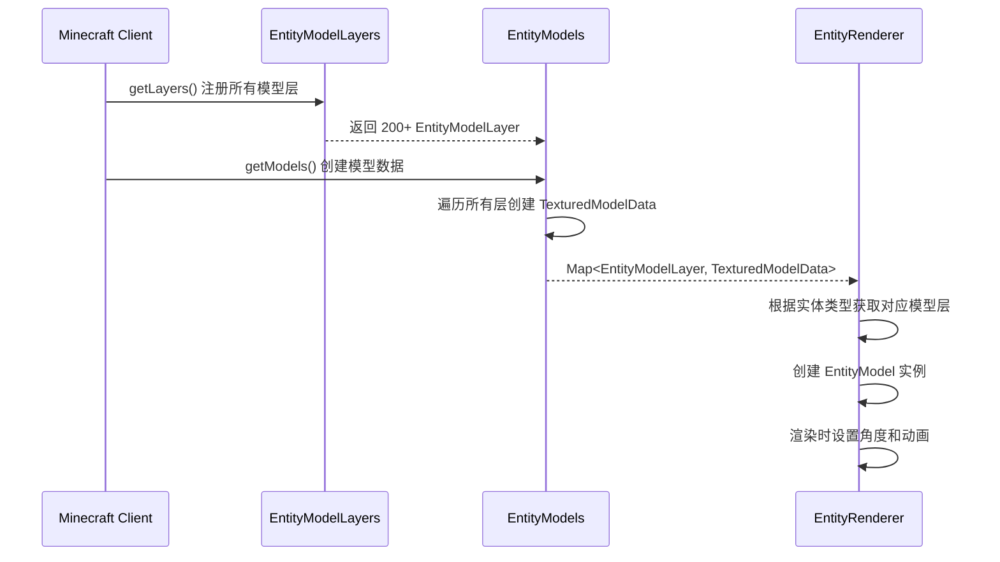
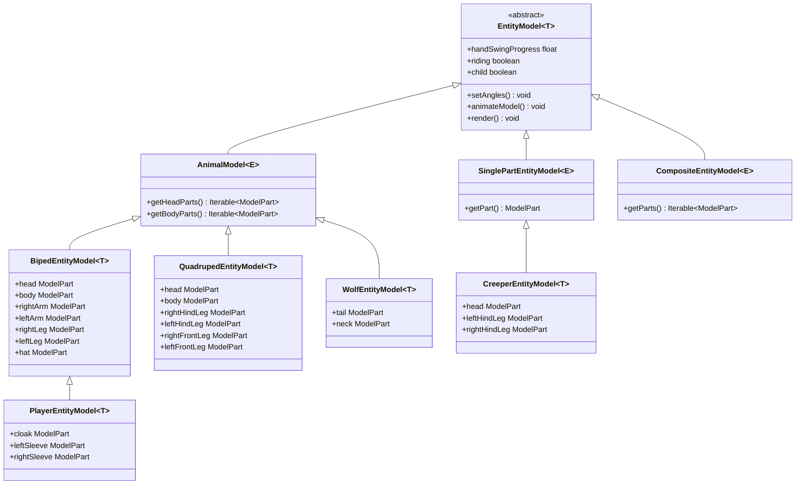
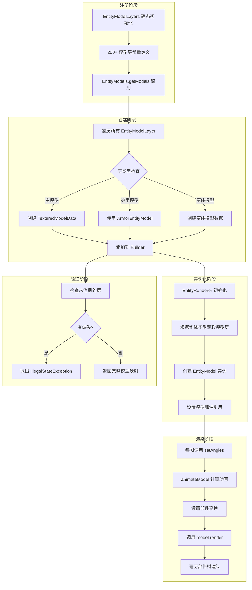
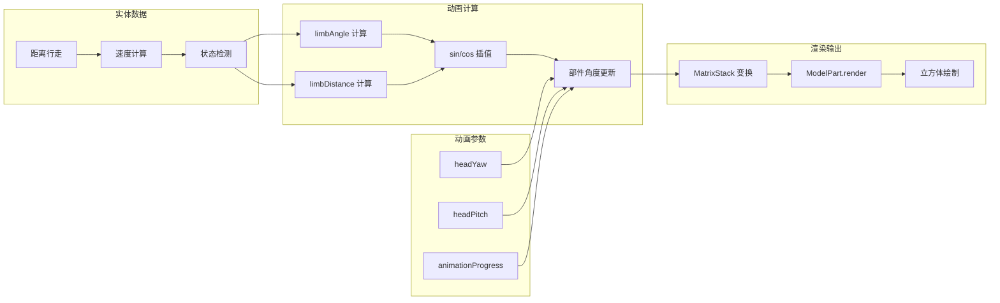
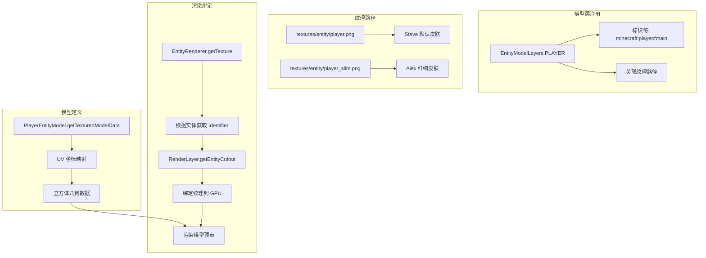

# Minecraft 1.21 实体模型系统深度分析

> 基于 CFR 0.2.2 反编译源代码的实体模型系统完整分析
> 版本信息: Protocol 767, World Version 3953
> 源码路径: D:\Minecraft-Learning\assets\mc\1.21\net\minecraft\client\render\entity\model\

---

## 概述

实体模型系统（Entity Model System）是 Minecraft 客户端渲染引擎的核心组件，负责定义和渲染游戏中所有实体的几何形状。该系统与实体渲染系统（Entity Rendering System）紧密协作，将实体数据转换为可视化的 3D 模型。

### 1.1 系统架构

```
┌─────────────────────────────────────────────────────────────────────┐
│                      实体模型系统架构                                   │
├─────────────────────────────────────────────────────────────────────┤
│                                                                     │
│  ┌───────────────────────────────────────────────────────────────┐ │
│  │                     EntityModelLayers                          │ │
│  │                  (模型层注册中心 - 核心)                         │ │
│  │  ┌─────────────────────────────────────────────────────────┐  │ │
│  │  │  200+ 模型层定义 (PLAYER, ZOMBIE, CREEPER...)           │  │ │
│  │  └─────────────────────────────────────────────────────────┘  │ │
│  └───────────────────────────────────────────────────────────────┘ │
│                              │                                        │
│  ┌───────────────────────────▼───────────────────────────────────┐ │
│  │                      EntityModels                              │ │
│  │                   (模型实例工厂)                                 │ │
│  │  ┌─────────────┬─────────────┬─────────────┐                 │ │
│  │  │ getModels() │ LayerRegistry│ ModelFactory │                 │ │
│  │  └─────────────┴─────────────┴─────────────┘                 │ │
│  └───────────────────────────────────────────────────────────────┘ │
│                              │                                        │
│  ┌───────────────────────────▼───────────────────────────────────┐ │
│  │                     EntityModel<T>                             │ │
│  │                    (模型基类)                                   │ │
│  │  ┌─────────────┬─────────────┬─────────────┐                 │ │
│  │  │  setAngles()│animateModel()│   render()  │                 │ │
│  │  └─────────────┴─────────────┴─────────────┘                 │ │
│  └───────────────────────────────────────────────────────────────┘ │
│                              │                                        │
│  ┌───────────────────────────▼───────────────────────────────────┐ │
│  │                    具体模型实现                                  │ │
│  │  ┌──────────┐ ┌──────────┐ ┌──────────┐ ┌──────────┐         │ │
│  │  │  Biped   │ │ Quadruped│ │  Animal   │ │Composite │         │ │
│  │  │EntityModel│ │EntityModel│ │ EntityModel│ │EntityModel│        │ │
│  │  └──────────┘ └──────────┘ └──────────┘ └──────────┘         │ │
│  │  ┌──────────┐ ┌──────────┐ ┌──────────┐ ┌──────────┐         │ │
│  │  │  Player  │ │  Zombie  │ │  Creeper │ │   Wolf   │         │ │
│  │  │EntityModel│ │EntityModel│ │EntityModel│ │EntityModel│        │ │
│  │  └──────────┘ └──────────┘ └──────────┘ └──────────┘         │ │
│  └───────────────────────────────────────────────────────────────┘ │
│                                                                     │
└─────────────────────────────────────────────────────────────────────┘
```

### 1.2 包结构

```
net.minecraft.client.render.entity.model/
├── EntityModel.java                    - 实体模型基类
├── EntityModelLayer.java               - 模型层标识符
├── EntityModelLayers.java              - 模型层注册中心 (200+ 层定义)
├── EntityModels.java                   - 模型实例工厂
├── EntityModelLoader.java              - 模型加载器
├── EntityModelPartNames.java           - 模型部件名称常量
│
├── 基类模型
│   ├── AnimalModel.java                - 动物模型基类 (支持幼年体缩放)
│   ├── BipedEntityModel.java          - 双足生物模型 (玩家/僵尸/骷髅)
│   ├── CompositeEntityModel.java       - 组合模型基类
│   ├── QuadrupedEntityModel.java       - 四足生物模型 (牛/猪/马)
│   ├── SinglePartEntityModel.java      - 单部件模型 (爬行者/史莱姆)
│   └── TintableAnimalModel.java        - 可着色动物模型
│
├── 玩家模型
│   ├── PlayerEntityModel.java          - 玩家模型 (含披风/袖子)
│   ├── ArmorEntityModel.java            - 护甲模型
│   └── SkullEntityModel.java            - 头颅模型
│
├── 生物模型
│   ├── ZombieEntityModel.java          - 僵尸模型
│   ├── SkeletonEntityModel.java         - 骷髅模型
│   ├── CreeperEntityModel.java          - 爬行者模型
│   ├── SpiderEntityModel.java           - 蜘蛛模型
│   ├── EndermanEntityModel.java        - 末影人模型
│   ├── WolfEntityModel.java             - 狼模型
│   ├── CowEntityModel.java              - 牛模型
│   └── PigEntityModel.java              - 猪模型
│
├── 特殊模型
│   ├── ElytraEntityModel.java           - 鞘翅模型
│   ├── BoatEntityModel.java             - 船模型
│   ├── MinecartEntityModel.java         - 矿车模型
│   ├── ShieldEntityModel.java           - 盾牌模型
│   └── BookModel.java                   - 书模型
│
└── 工具接口
    ├── ModelWithArms.java               - 带手臂模型接口
    ├── ModelWithHead.java              - 带头部模型接口
    └── ModelWithHat.java                - 带帽子模型接口
```

---

## 模型基类 (Model Base Classes)

### 2.1 EntityModel - 模型基类

`EntityModel<T>` 是所有实体模型的抽象基类，定义了模型的基本接口和状态管理。

```D:\Minecraft-Learning\assets\mc\1.21\net\minecraft\client\render\entity\model\EntityModel.java
@Environment(value=EnvType.CLIENT)
public abstract class EntityModel<T extends Entity>
extends Model {
    // 动画状态
    public float handSwingProgress;
    public boolean riding;
    public boolean child = true;

    protected EntityModel() {
        this(RenderLayer::getEntityCutoutNoCull);
    }

    protected EntityModel(Function<Identifier, RenderLayer> function) {
        super(function);
    }

    // 设置骨骼角度
    public abstract void setAngles(
        T var1,           // 实体实例
        float var2,       // 四肢摆动角度 (limbAngle)
        float var3,       // 四肢摆动距离 (limbDistance)
        float var4,       // 动画进度 (animationProgress)
        float var5,       // 头部偏航角 (headYaw)
        float var6        // 头部俯仰角 (headPitch)
    );

    // 动画模型
    public void animateModel(
        T entity, 
        float limbAngle, 
        float limbDistance, 
        float tickDelta
    ) {
        // 默认空实现，子类可覆盖
    }

    // 复制状态到另一个模型实例
    public void copyStateTo(EntityModel<T> copy) {
        copy.handSwingProgress = this.handSwingProgress;
        copy.riding = this.riding;
        copy.child = this.child;
    }
}
```

### 2.2 AnimalModel - 动物模型基类

`AnimalModel<E>` 继承自 `EntityModel`，专门用于动物类实体，支持幼年体自动缩放。

```D:\Minecraft-Learning\assets\mc\1.21\net\minecraft\client\render\entity\model\AnimalModel.java
@Environment(value=EnvType.CLIENT)
public abstract class AnimalModel<E extends Entity>
extends EntityModel<E> {
    private final boolean headScaled;
    private final float childHeadYOffset;      // 幼年体头部Y偏移
    private final float childHeadZOffset;      // 幼年体头部Z偏移
    private final float invertedChildHeadScale; // 幼年体头部缩放
    private final float invertedChildBodyScale; // 幼年体身体缩放
    private final float childBodyYOffset;      // 幼年体身体Y偏移

    protected AnimalModel(boolean headScaled, float childHeadYOffset, float childHeadZOffset) {
        this(headScaled, childHeadYOffset, childHeadZOffset, 2.0f, 2.0f, 24.0f);
    }

    @Override
    public void render(
        MatrixStack matrices, 
        VertexConsumer vertices, 
        int light, 
        int overlay, 
        int color
    ) {
        if (this.child) {
            // 渲染幼年体（放大头部）
            matrices.push();
            if (this.headScaled) {
                float f = 1.5f / this.invertedChildHeadScale;
                matrices.scale(f, f, f);
            }
            matrices.translate(0.0f, this.childHeadYOffset / 16.0f, 
                             this.childHeadZOffset / 16.0f);
            this.getHeadParts().forEach(part -> 
                part.render(matrices, vertices, light, overlay, color)
            );
            matrices.pop();

            // 渲染幼年体身体（缩小身体）
            matrices.push();
            float f = 1.0f / this.invertedChildBodyScale;
            matrices.scale(f, f, f);
            matrices.translate(0.0f, this.childBodyYOffset / 16.0f, 0.0f);
            this.getBodyParts().forEach(part -> 
                part.render(matrices, vertices, light, overlay, color)
            );
            matrices.pop();
        } else {
            // 渲染成年体
            this.getHeadParts().forEach(part -> 
                part.render(matrices, vertices, light, overlay, color)
            );
            this.getBodyParts().forEach(part -> 
                part.render(matrices, vertices, light, overlay, color)
            );
        }
    }

    // 获取头部部件列表
    protected abstract Iterable<ModelPart> getHeadParts();

    // 获取身体部件列表
    protected abstract Iterable<ModelPart> getBodyParts();
}
```

### 2.3 BipedEntityModel - 双足生物模型

`BipedEntityModel<T>` 是最重要的模型基类之一，定义了人形生物的标准结构（头、身体、双臂、双腿）。

```D:\Minecraft-Learning\assets\mc\1.21\net\minecraft\client\render\entity\model\BipedEntityModel.java
@Environment(value=EnvType.CLIENT)
public class BipedEntityModel<T extends LivingEntity>
extends AnimalModel<T>
implements ModelWithArms, ModelWithHead {
    
    // 核心模型部件
    public final ModelPart head;       // 头部
    public final ModelPart hat;         // 帽子层
    public final ModelPart body;        // 身体
    public final ModelPart rightArm;    // 右臂
    public final ModelPart leftArm;     // 左臂
    public final ModelPart rightLeg;    // 右腿
    public final ModelPart leftLeg;     // 左腿

    // 手臂姿势状态
    public ArmPose leftArmPose = ArmPose.EMPTY;
    public ArmPose rightArmPose = ArmPose.EMPTY;
    public boolean sneaking;
    public float leaningPitch;

    // 手臂姿势枚举
    public static enum ArmPose {
        EMPTY(false),                    // 空手
        ITEM(false),                     // 持物品
        BLOCK(false),                    // 持方块
        BOW_AND_ARROW(true),             // 拉弓
        THROW_SPEAR(false),              // 投掷长矛
        CROSSBOW_CHARGE(true),           // 十字弩蓄力
        CROSSBOW_HOLD(true),             // 十字弩待机
        SPYGLASS(false),                 // 望远镜
        TOOT_HORN(false),                // 吹羊角
        BRUSH(false);                    // 刷子

        private final boolean twoHanded; // 是否为双手持
    }

    @Override
    public void setAngles(
        T livingEntity,
        float limbAngle,
        float limbDistance,
        float animationProgress,
        float headYaw,
        float headPitch
    ) {
        boolean isFlying = ((LivingEntity)livingEntity).getFallFlyingTicks() > 4;
        boolean isSwimming = ((LivingEntity)livingEntity).isInSwimmingPose();

        // 头部旋转
        this.head.yaw = headYaw * ((float)Math.PI / 180);
        this.head.pitch = isFlying ? -0.7853982f : 
                          (this.leaningPitch > 0.0f ? 
                           (isSwimming ? this.lerpAngle(...) : ...) : 
                           headPitch * ((float)Math.PI / 180));

        // 行走动画 - 手臂和腿部摆动
        this.rightArm.pitch = MathHelper.cos(limbAngle * 0.6662f + (float)Math.PI) 
                             * 2.0f * limbDistance * 0.5f;
        this.leftArm.pitch = MathHelper.cos(limbAngle * 0.6662f) 
                            * 2.0f * limbDistance * 0.5f;
        this.rightLeg.pitch = MathHelper.cos(limbAngle * 0.6662f) 
                              * 1.4f * limbDistance;
        this.leftLeg.pitch = MathHelper.cos(limbAngle * 0.6662f + (float)Math.PI) 
                             * 1.4f * limbDistance;

        // 骑乘姿势调整
        if (this.riding) {
            this.rightArm.pitch += -0.62831855f;
            this.leftArm.pitch += -0.62831855f;
            this.rightLeg.pitch = -1.4137167f;
            this.leftLeg.pitch = -1.4137167f;
        }

        // 下蹲姿势调整
        if (this.sneaking) {
            this.body.pitch = 0.5f;
            this.rightArm.pitch += 0.4f;
            this.leftArm.pitch += 0.4f;
            this.head.pivotY = 4.2f;
        }
    }
}
```

### 2.4 CompositeEntityModel - 组合模型基类

`CompositeEntityModel<E>` 用于需要渲染多个独立部件的实体。

```D:\Minecraft-Learning\assets\mc\1.21\net\minecraft\client\render\entity\model\CompositeEntityModel.java
@Environment(value=EnvType.CLIENT)
public abstract class CompositeEntityModel<E extends Entity>
extends EntityModel<E> {
    
    @Override
    public void render(
        MatrixStack matrices, 
        VertexConsumer vertices, 
        int light, 
        int overlay, 
        int color
    ) {
        // 遍历所有部件并渲染
        this.getParts().forEach(modelPart -> 
            modelPart.render(matrices, vertices, light, overlay, color)
        );
    }

    // 获取所有模型部件
    public abstract Iterable<ModelPart> getParts();
}
```

### 2.5 SinglePartEntityModel - 单部件模型基类

`SinglePartEntityModel<E>` 用于只有单一根部件的实体，如爬行者和史莱姆。

```D:\Minecraft-Learning\assets\mc\1.21\net\minecraft\client\render\entity\model\SinglePartEntityModel.java
@Environment(value=EnvType.CLIENT)
public abstract class SinglePartEntityModel<E extends Entity>
extends EntityModel<E> {
    
    @Override
    public void render(
        MatrixStack matrices, 
        VertexConsumer vertices, 
        int light, 
        int overlay, 
        int color
    ) {
        this.getPart().render(matrices, vertices, light, overlay, color);
    }

    // 获取根部件
    public abstract ModelPart getPart();

    // 动画更新方法
    protected void updateAnimation(
        AnimationState animationState, 
        Animation animation, 
        float animationProgress
    ) {
        animationState.update(animationProgress, 1.0f);
        animationState.run(state -> 
            AnimationHelper.animate(this, animation, state.getTimeRunning(), 1.0f, TEMP)
        );
    }
}
```

---

## 模型层注册系统 (Model Layer Registration)

### 3.1 EntityModelLayer - 模型层标识符

`EntityModelLayer` 是模型层的唯一标识符，用于在注册表中定位模型。

```D:\Minecraft-Learning\assets\mc\1.21\net\minecraft\client\render\entity\model\EntityModelLayer.java
@Environment(value=EnvType.CLIENT)
public final class EntityModelLayer {
    private final Identifier id;      // 命名空间ID (如 minecraft:zombie)
    private final String name;       // 层名称 (如 "main", "inner_armor")

    public EntityModelLayer(Identifier id, String name) {
        this.id = id;
        this.name = name;
    }

    public Identifier getId() {
        return this.id;
    }

    public String getName() {
        return this.name;
    }

    @Override
    public String toString() {
        return String.valueOf(this.id) + "#" + this.name;
        // 例如: "minecraft:zombie#main"
    }
}
```

### 3.2 EntityModelLayers - 模型层注册中心

`EntityModelLayers` 是整个模型的注册中心，定义了 200+ 个模型层。

```D:\Minecraft-Learning\assets\mc\1.21\net\minecraft\client\render\entity\model\EntityModelLayers.java
@Environment(value=EnvType.CLIENT)
public class EntityModelLayers {
    
    // 预定义的模型层常量
    public static final EntityModelLayer PLAYER = registerMain("player");
    public static final EntityModelLayer PLAYER_SLIM = registerMain("player_slim");
    public static final EntityModelLayer PLAYER_INNER_ARMOR = createInnerArmor("player");
    public static final EntityModelLayer PLAYER_OUTER_ARMOR = createOuterArmor("player");
    public static final EntityModelLayer ZOMBIE = registerMain("zombie");
    public static final EntityModelLayer ZOMBIE_INNER_ARMOR = createInnerArmor("zombie");
    public static final EntityModelLayer ZOMBIE_OUTER_ARMOR = createOuterArmor("zombie");
    public static final EntityModelLayer SKELETON = registerMain("skeleton");
    public static final EntityModelLayer CREEPER = registerMain("creeper");
    public static final EntityModelLayer SPIDER = registerMain("spider");
    public static final EntityModelLayer WOLF = registerMain("wolf");
    public static final EntityModelLayer COW = registerMain("cow");
    public static final EntityModelLayer PIG = registerMain("pig");
    public static final EntityModelLayer HORSE = registerMain("horse");
    // ... 200+ 更多层定义

    // 注册主模型层
    private static EntityModelLayer registerMain(String id) {
        return EntityModelLayers.register(id, "main");
    }

    // 注册自定义层
    private static EntityModelLayer register(String id, String layer) {
        EntityModelLayer entityModelLayer = EntityModelLayers.create(id, layer);
        if (!LAYERS.add(entityModelLayer)) {
            throw new IllegalStateException("Duplicate registration for " + 
                String.valueOf(entityModelLayer));
        }
        return entityModelLayer;
    }

    // 创建模型层实例
    private static EntityModelLayer create(String id, String layer) {
        return new EntityModelLayer(Identifier.ofVanilla(id), layer);
    }

    // 创建护甲内层
    private static EntityModelLayer createInnerArmor(String id) {
        return EntityModelLayers.register(id, "inner_armor");
    }

    // 创建护甲外层
    private static EntityModelLayer createOuterArmor(String id) {
        return EntityModelLayers.register(id, "outer_armor");
    }

    // 获取所有注册层
    public static Stream<EntityModelLayer> getLayers() {
        return LAYERS.stream();
    }
}
```

### 3.3 EntityModels - 模型工厂

`EntityModels` 是模型实例工厂，将模型层映射到具体的模型数据。

```D:\Minecraft-Learning\assets\mc\1.21\net\minecraft\client\render\entity\model\EntityModels.java
@Environment(value=EnvType.CLIENT)
public class EntityModels {
    
    public static Map<EntityModelLayer, TexturedModelData> getModels() {
        ImmutableMap.Builder<EntityModelLayer, TexturedModelData> builder = 
            ImmutableMap.builder();

        // 玩家模型
        builder.put(EntityModelLayers.PLAYER, 
            TexturedModelData.of(
                PlayerEntityModel.getTexturedModelData(Dilation.NONE, false), 
                64, 64
            )
        );
        builder.put(EntityModelLayers.PLAYER_SLIM, 
            TexturedModelData.of(
                PlayerEntityModel.getTexturedModelData(Dilation.NONE, true), 
                64, 64
            )
        );

        // 僵尸模型
        builder.put(EntityModelLayers.ZOMBIE, 
            TexturedModelData.of(
                BipedEntityModel.getModelData(Dilation.NONE, 0.0f), 
                64, 64
            )
        );

        // 骷髅模型
        builder.put(EntityModelLayers.SKELETON, 
            SkeletonEntityModel.getTexturedModelData()
        );

        // 爬行者模型
        builder.put(EntityModelLayers.CREEPER, 
            CreeperEntityModel.getTexturedModelData(Dilation.NONE)
        );

        // 狼模型
        builder.put(EntityModelLayers.WOLF, 
            TexturedModelData.of(
                WolfEntityModel.getTexturedModelData(Dilation.NONE), 
                64, 32
            )
        );

        // ... 更多模型注册

        return builder.build();
    }
}
```

---

## 玩家模型 (Player Model)

### 4.1 PlayerEntityModel 结构

`PlayerEntityModel` 继承自 `BipedEntityModel`，添加了玩家特有的部件（耳朵、披风、袖子、裤子、外套）。

```D:\Minecraft-Learning\assets\mc\1.21\net\minecraft\client\render\entity\model\PlayerEntityModel.java
@Environment(value=EnvType.CLIENT)
public class PlayerEntityModel<T extends LivingEntity>
extends BipedEntityModel<T> {
    
    // 玩家特有部件
    private static final String EAR = "ear";           // 耳朵
    private static final String CLOAK = "cloak";       // 披风
    private static final String LEFT_SLEEVE = "left_sleeve";   // 左袖子
    private static final String RIGHT_SLEEVE = "right_sleeve"; // 右袖子
    private static final String LEFT_PANTS = "left_pants";     // 左裤子
    private static final String RIGHT_PANTS = "right_pants";   // 右裤子
    private static final String JACKET = "jacket";     // 外套

    // 模型部件
    public final ModelPart leftSleeve;
    public final ModelPart rightSleeve;
    public final ModelPart leftPants;
    public final ModelPart rightPants;
    public final ModelPart jacket;
    private final ModelPart cloak;
    private final ModelPart ear;

    // 纤细手臂标识 (Alex vs Steve)
    private final boolean thinArms;

    public PlayerEntityModel(ModelPart root, boolean thinArms) {
        super(root, RenderLayer::getEntityTranslucent);
        this.thinArms = thinArms;
        this.ear = root.getChild(EAR);
        this.cloak = root.getChild(CLOAK);
        this.leftSleeve = root.getChild(LEFT_SLEEVE);
        this.rightSleeve = root.getChild(RIGHT_SLEEVE);
        this.leftPants = root.getChild(LEFT_PANTS);
        this.rightPants = root.getChild(RIGHT_PANTS);
        this.jacket = root.getChild(JACKET);
        this.parts = root.traverse()
            .filter(part -> !part.isEmpty())
            .collect(ImmutableList.toImmutableList());
    }

    // 获取纹理化模型数据
    public static ModelData getTexturedModelData(Dilation dilation, boolean slim) {
        ModelData modelData = BipedEntityModel.getModelData(dilation, 0.0f);
        ModelPartData modelPartData = modelData.getRoot();

        // 耳朵
        modelPartData.addChild(EAR, 
            ModelPartBuilder.create()
                .uv(24, 0)
                .cuboid(-3.0f, -6.0f, -1.0f, 6.0f, 6.0f, 1.0f, dilation), 
            ModelTransform.NONE
        );

        // 披风
        modelPartData.addChild(CLOAK, 
            ModelPartBuilder.create()
                .uv(0, 0)
                .cuboid(-5.0f, 0.0f, -1.0f, 10.0f, 16.0f, 1.0f, dilation, 1.0f, 0.5f), 
            ModelTransform.pivot(0.0f, 0.0f, 0.0f)
        );

        // 根据模型类型调整手臂
        if (slim) {
            // Alex 模型 - 纤细手臂
            modelPartData.addChild(LEFT_ARM, 
                ModelPartBuilder.create()
                    .uv(32, 48)
                    .cuboid(-1.0f, -2.0f, -2.0f, 3.0f, 12.0f, 4.0f, dilation), 
                ModelTransform.pivot(5.0f, 2.5f, 0.0f)
            );
            // ... 更多部件定义
        } else {
            // Steve 模型 - 普通手臂
            modelPartData.addChild(LEFT_ARM, 
                ModelPartBuilder.create()
                    .uv(32, 48)
                    .cuboid(-1.0f, -2.0f, -2.0f, 4.0f, 12.0f, 4.0f, dilation), 
                ModelTransform.pivot(5.0f, 2.0f, 0.0f)
            );
            // ... 更多部件定义
        }

        return modelData;
    }

    @Override
    public void setAngles(
        T livingEntity, 
        float f, 
        float g, 
        float h, 
        float i, 
        float j
    ) {
        super.setAngles(livingEntity, f, g, h, i, j);

        // 同步袖子/裤子到手臂/腿部
        this.leftPants.copyTransform(this.leftLeg);
        this.rightPants.copyTransform(this.rightLeg);
        this.leftSleeve.copyTransform(this.leftArm);
        this.rightSleeve.copyTransform(this.rightArm);
        this.jacket.copyTransform(this.body);

        // 披风位置计算
        ItemStack chestEquipment = ((LivingEntity)livingEntity)
            .getEquippedStack(EquipmentSlot.CHEST);
        
        if (chestEquipment.isEmpty()) {
            // 无胸甲时的披风位置
            if (((Entity)livingEntity).isInSneakingPose()) {
                this.cloak.pivotZ = 1.4f;
                this.cloak.pivotY = 1.85f;
            } else {
                this.cloak.pivotZ = 0.0f;
                this.cloak.pivotY = 0.0f;
            }
        } else {
            // 有胸甲时的披风位置
            if (((Entity)livingEntity).isInSneakingPose()) {
                this.cloak.pivotZ = 0.3f;
                this.cloak.pivotY = 0.8f;
            } else {
                this.cloak.pivotZ = -1.1f;
                this.cloak.pivotY = -0.85f;
            }
        }
    }

    // 渲染耳朵
    public void renderEars(
        MatrixStack matrices, 
        VertexConsumer vertices, 
        int light, 
        int overlay
    ) {
        this.ear.copyTransform(this.head);
        this.ear.pivotX = 0.0f;
        this.ear.pivotY = 0.0f;
        this.ear.render(matrices, vertices, light, overlay);
    }

    // 渲染披风
    public void renderCape(
        MatrixStack matrices, 
        VertexConsumer vertices, 
        int light, 
        int overlay
    ) {
        this.cloak.render(matrices, vertices, light, overlay);
    }
}
```

---

## 生物模型 (Mob Models)

### 5.1 CreeperEntityModel - 爬行者模型

爬行者模型是 `SinglePartEntityModel` 的典型实现。

```D:\Minecraft-Learning\assets\mc\1.21\net\minecraft\client\render\entity\model\CreeperEntityModel.java
@Environment(value=EnvType.CLIENT)
public class CreeperEntityModel<T extends Entity>
extends SinglePartEntityModel<T> {
    
    private final ModelPart root;
    private final ModelPart head;
    private final ModelPart leftHindLeg;
    private final ModelPart rightHindLeg;
    private final ModelPart leftFrontLeg;
    private final ModelPart rightFrontLeg;

    public CreeperEntityModel(ModelPart root) {
        this.root = root;
        this.head = root.getChild(EntityModelPartNames.HEAD);
        this.rightHindLeg = root.getChild(EntityModelPartNames.RIGHT_HIND_LEG);
        this.leftHindLeg = root.getChild(EntityModelPartNames.LEFT_HIND_LEG);
        this.rightFrontLeg = root.getChild(EntityModelPartNames.RIGHT_FRONT_LEG);
        this.leftFrontLeg = root.getChild(EntityModelPartNames.LEFT_FRONT_LEG);
    }

    public static TexturedModelData getTexturedModelData(Dilation dilation) {
        ModelData modelData = new ModelData();
        ModelPartData modelPartData = modelData.getRoot();

        // 头部
        modelPartData.addChild(
            EntityModelPartNames.HEAD, 
            ModelPartBuilder.create()
                .uv(0, 0)
                .cuboid(-4.0f, -8.0f, -4.0f, 8.0f, 8.0f, 8.0f, dilation), 
            ModelTransform.pivot(0.0f, 6.0f, 0.0f)
        );

        // 身体
        modelPartData.addChild(
            EntityModelPartNames.BODY, 
            ModelPartBuilder.create()
                .uv(16, 16)
                .cuboid(-4.0f, 0.0f, -2.0f, 8.0f, 12.0f, 4.0f, dilation), 
            ModelTransform.pivot(0.0f, 6.0f, 0.0f)
        );

        // 四条腿（共用一个 Builder 实例以节省内存）
        ModelPartBuilder modelPartBuilder = ModelPartBuilder.create()
            .uv(0, 16)
            .cuboid(-2.0f, 0.0f, -2.0f, 4.0f, 6.0f, 4.0f, dilation);
        
        modelPartData.addChild(EntityModelPartNames.RIGHT_HIND_LEG, 
            modelPartBuilder, ModelTransform.pivot(-2.0f, 18.0f, 4.0f));
        modelPartData.addChild(EntityModelPartNames.LEFT_HIND_LEG, 
            modelPartBuilder, ModelTransform.pivot(2.0f, 18.0f, 4.0f));
        modelPartData.addChild(EntityModelPartNames.RIGHT_FRONT_LEG, 
            modelPartBuilder, ModelTransform.pivot(-2.0f, 18.0f, -4.0f));
        modelPartData.addChild(EntityModelPartNames.LEFT_FRONT_LEG, 
            modelPartBuilder, ModelTransform.pivot(2.0f, 18.0f, -4.0f));

        return TexturedModelData.of(modelData, 64, 32);
    }

    @Override
    public ModelPart getPart() {
        return this.root;
    }

    @Override
    public void setAngles(
        T entity, 
        float limbAngle, 
        float limbDistance, 
        float animationProgress, 
        float headYaw, 
        float headPitch
    ) {
        // 头部跟随视角
        this.head.yaw = headYaw * ((float)Math.PI / 180);
        this.head.pitch = headPitch * ((float)Math.PI / 180);

        // 行走动画
        this.leftHindLeg.pitch = MathHelper.cos(limbAngle * 0.6662f) * 1.4f * limbDistance;
        this.rightHindLeg.pitch = MathHelper.cos(limbAngle * 0.6662f + (float)Math.PI) * 1.4f * limbDistance;
        this.leftFrontLeg.pitch = MathHelper.cos(limbAngle * 0.6662f + (float)Math.PI) * 1.4f * limbDistance;
        this.rightFrontLeg.pitch = MathHelper.cos(limbAngle * 0.6662f) * 1.4f * limbDistance;
    }
}
```

### 5.2 WolfEntityModel - 狼模型

狼模型继承自 `TintableAnimalModel`，支持可着色和特殊动画。

```D:\Minecraft-Learning\assets\mc\1.21\net\minecraft\client\render\entity\model\WolfEntityModel.java
@Environment(value=EnvType.CLIENT)
public class WolfEntityModel<T extends WolfEntity>
extends TintableAnimalModel<T> {
    
    private static final String REAL_HEAD = "real_head";
    private static final String UPPER_BODY = "upper_body";
    private static final String REAL_TAIL = "real_tail";

    // 模型部件
    private final ModelPart head;
    private final ModelPart realHead;
    private final ModelPart torso;
    private final ModelPart rightHindLeg;
    private final ModelPart leftHindLeg;
    private final ModelPart rightFrontLeg;
    private final ModelPart leftFrontLeg;
    private final ModelPart tail;
    private final ModelPart realTail;
    private final ModelPart neck;

    public WolfEntityModel(ModelPart root) {
        this.head = root.getChild(EntityModelPartNames.HEAD);
        this.realHead = this.head.getChild(REAL_HEAD);
        this.torso = root.getChild(EntityModelPartNames.BODY);
        this.neck = root.getChild(UPPER_BODY);
        this.rightHindLeg = root.getChild(EntityModelPartNames.RIGHT_HIND_LEG);
        this.leftHindLeg = root.getChild(EntityModelPartNames.LEFT_HIND_LEG);
        this.rightFrontLeg = root.getChild(EntityModelPartNames.RIGHT_FRONT_LEG);
        this.leftFrontLeg = root.getChild(EntityModelPartNames.LEFT_FRONT_LEG);
        this.tail = root.getChild(EntityModelPartNames.TAIL);
        this.realTail = this.tail.getChild(REAL_TAIL);
    }

    @Override
    public void animateModel(
        T wolfEntity, 
        float limbAngle, 
        float limbDistance, 
        float tickDelta
    ) {
        // 尾巴摆动
        this.tail.yaw = wolfEntity.hasAngerTime() ? 0.0f : 
            MathHelper.cos(limbAngle * 0.6662f) * 1.4f * limbDistance;

        if (((TameableEntity)wolfEntity).isInSittingPose()) {
            // 坐下姿势 - 重新定位所有部件
            this.neck.setPivot(-1.0f, 16.0f, -3.0f);
            this.neck.pitch = 1.2566371f;
            this.torso.setPivot(0.0f, 18.0f, 0.0f);
            this.torso.pitch = 0.7853982f;
            this.tail.setPivot(-1.0f, 21.0f, 6.0f);
            
            // 后腿折叠
            this.rightHindLeg.setPivot(-2.5f, 22.7f, 2.0f);
            this.rightHindLeg.pitch = 4.712389f;
            this.leftHindLeg.setPivot(0.5f, 22.7f, 2.0f);
            this.leftHindLeg.pitch = 4.712389f;
        } else {
            // 站立姿势 - 恢复正常位置
            this.torso.setPivot(0.0f, 14.0f, 2.0f);
            this.torso.pitch = 1.5707964f;
            this.neck.setPivot(-1.0f, 14.0f, -3.0f);
            // ... 更多位置调整
        }

        // 摇晃动画
        this.realHead.roll = ((WolfEntity)wolfEntity).getShakeAnimationProgress(tickDelta, 0.0f);
        this.neck.roll = ((WolfEntity)wolfEntity).getShakeAnimationProgress(tickDelta, -0.08f);
    }

    @Override
    protected Iterable<ModelPart> getHeadParts() {
        return ImmutableList.of(this.head);
    }

    @Override
    protected Iterable<ModelPart> getBodyParts() {
        return ImmutableList.of(
            this.torso, 
            this.rightHindLeg, 
            this.leftHindLeg, 
            this.rightFrontLeg, 
            this.leftFrontLeg, 
            this.tail, 
            this.neck
        );
    }
}
```

### 5.3 QuadrupedEntityModel - 四足生物模型

四足生物模型是所有四足动物（牛、猪、马等）的基类。

```D:\Minecraft-Learning\assets\mc\1.21\net\minecraft\client\render\entity\model\QuadrupedEntityModel.java
@Environment(value=EnvType.CLIENT)
public class QuadrupedEntityModel<T extends Entity>
extends AnimalModel<T> {
    
    protected final ModelPart head;
    protected final ModelPart body;
    protected final ModelPart rightHindLeg;
    protected final ModelPart leftHindLeg;
    protected final ModelPart rightFrontLeg;
    protected final ModelPart leftFrontLeg;

    protected QuadrupedEntityModel(
        ModelPart root, 
        boolean headScaled, 
        float childHeadYOffset, 
        float childHeadZOffset, 
        float invertedChildHeadScale, 
        float invertedChildBodyScale, 
        int childBodyYOffset
    ) {
        super(headScaled, childHeadYOffset, childHeadZOffset, 
              invertedChildHeadScale, invertedChildBodyScale, childBodyYOffset);
        this.head = root.getChild(EntityModelPartNames.HEAD);
        this.body = root.getChild(EntityModelPartNames.BODY);
        this.rightHindLeg = root.getChild(EntityModelPartNames.RIGHT_HIND_LEG);
        this.leftHindLeg = root.getChild(EntityModelPartNames.LEFT_HIND_LEG);
        this.rightFrontLeg = root.getChild(EntityModelPartNames.RIGHT_FRONT_LEG);
        this.leftFrontLeg = root.getChild(EntityModelPartNames.LEFT_FRONT_LEG);
    }

    public static ModelData getModelData(int stanceWidth, Dilation dilation) {
        ModelData modelData = new ModelData();
        ModelPartData modelPartData = modelData.getRoot();

        // 头部
        modelPartData.addChild(
            EntityModelPartNames.HEAD, 
            ModelPartBuilder.create()
                .uv(0, 0)
                .cuboid(-4.0f, -4.0f, -8.0f, 8.0f, 8.0f, 8.0f, dilation), 
            ModelTransform.pivot(0.0f, 18 - stanceWidth, -6.0f)
        );

        // 身体
        modelPartData.addChild(
            EntityModelPartNames.BODY, 
            ModelPartBuilder.create()
                .uv(28, 8)
                .cuboid(-5.0f, -10.0f, -7.0f, 10.0f, 16.0f, 8.0f, dilation), 
            ModelTransform.of(0.0f, 17 - stanceWidth, 2.0f, 1.5707964f, 0.0f, 0.0f)
        );

        // 四条腿
        ModelPartBuilder modelPartBuilder = ModelPartBuilder.create()
            .uv(0, 16)
            .cuboid(-2.0f, 0.0f, -2.0f, 4.0f, stanceWidth, 4.0f, dilation);
        
        modelPartData.addChild(EntityModelPartNames.RIGHT_HIND_LEG, 
            modelPartBuilder, ModelTransform.pivot(-3.0f, 24 - stanceWidth, 7.0f));
        modelPartData.addChild(EntityModelPartNames.LEFT_HIND_LEG, 
            modelPartBuilder, ModelTransform.pivot(3.0f, 24 - stanceWidth, 7.0f));
        modelPartData.addChild(EntityModelPartNames.RIGHT_FRONT_LEG, 
            modelPartBuilder, ModelTransform.pivot(-3.0f, 24 - stanceWidth, -5.0f));
        modelPartData.addChild(EntityModelPartNames.LEFT_FRONT_LEG, 
            modelPartBuilder, ModelTransform.pivot(3.0f, 24 - stanceWidth, -5.0f));

        return modelData;
    }

    @Override
    protected Iterable<ModelPart> getHeadParts() {
        return ImmutableList.of(this.head);
    }

    @Override
    protected Iterable<ModelPart> getBodyParts() {
        return ImmutableList.of(
            this.body, 
            this.rightHindLeg, 
            this.leftHindLeg, 
            this.rightFrontLeg, 
            this.leftFrontLeg
        );
    }

    @Override
    public void setAngles(
        T entity, 
        float limbAngle, 
        float limbDistance, 
        float animationProgress, 
        float headYaw, 
        float headPitch
    ) {
        // 头部旋转
        this.head.pitch = headPitch * ((float)Math.PI / 180);
        this.head.yaw = headYaw * ((float)Math.PI / 180);

        // 四肢行走动画
        this.rightHindLeg.pitch = MathHelper.cos(limbAngle * 0.6662f) * 1.4f * limbDistance;
        this.leftHindLeg.pitch = MathHelper.cos(limbAngle * 0.6662f + (float)Math.PI) * 1.4f * limbDistance;
        this.rightFrontLeg.pitch = MathHelper.cos(limbAngle * 0.6662f + (float)Math.PI) * 1.4f * limbDistance;
        this.leftFrontLeg.pitch = MathHelper.cos(limbAngle * 0.6662f) * 1.4f * limbDistance;
    }
}
```

### 5.4 护甲模型 (Armor Models)

护甲模型用于渲染实体穿戴的护甲。

```D:\Minecraft-Learning\assets\mc\1.21\net\minecraft\client\render\entity\model\ArmorEntityModel.java
@Environment(value=EnvType.CLIENT)
public class ArmorEntityModel<T extends LivingEntity>
extends BipedEntityModel<T> {
    
    public ArmorEntityModel(ModelPart modelPart) {
        super(modelPart);
    }

    public static ModelData getModelData(Dilation dilation) {
        ModelData modelData = BipedEntityModel.getModelData(dilation, 0.0f);
        ModelPartData modelPartData = modelData.getRoot();

        // 腿部护甲 - 使用负扩张使护甲比身体小
        modelPartData.addChild(
            EntityModelPartNames.RIGHT_LEG, 
            ModelPartBuilder.create()
                .uv(0, 16)
                .cuboid(-2.0f, 0.0f, -2.0f, 4.0f, 12.0f, 4.0f, dilation.add(-0.1f)), 
            ModelTransform.pivot(-1.9f, 12.0f, 0.0f)
        );
        modelPartData.addChild(
            EntityModelPartNames.LEFT_LEG, 
            ModelPartBuilder.create()
                .uv(0, 16)
                .mirrored()
                .cuboid(-2.0f, 0.0f, -2.0f, 4.0f, 12.0f, 4.0f, dilation.add(-0.1f)), 
            ModelTransform.pivot(1.9f, 12.0f, 0.0f)
        );

        return modelData;
    }
}
```

---

## 模型部件命名 (Model Part Names)

### 6.1 标准化部件名称

`EntityModelPartNames` 定义了所有模型部件的标准名称常量。

```D:\Minecraft-Learning\assets\mc\1.21\net\minecraft\client\render\entity\model\EntityModelPartNames.java
@Environment(value=EnvType.CLIENT)
public class EntityModelPartNames {
    // 人形生物部件
    public static final String HEAD = "head";
    public static final String HAT = "hat";
    public static final String BODY = "body";
    public static final String RIGHT_ARM = "right_arm";
    public static final String LEFT_ARM = "left_arm";
    public static final String RIGHT_LEG = "right_leg";
    public static final String LEFT_LEG = "left_leg";

    // 四足生物部件
    public static final String RIGHT_HIND_LEG = "right_hind_leg";
    public static final String LEFT_HIND_LEG = "left_hind_leg";
    public static final String RIGHT_FRONT_LEG = "right_front_leg";
    public static final String LEFT_FRONT_LEG = "left_front_leg";

    // 特殊部件
    public static final String TAIL = "tail";
    public static final String JACKET = "jacket";
    public static final String MOUTH = "mouth";
    public static final String WING = "wing";
    public static final String EAR = "ear";
}
```

---

## 纹理绑定 (Texture Binding)

### 7.1 模型与纹理的关系

模型与纹理的绑定通过 `EntityModelLayer` 实现，每个模型层对应一个唯一的纹理资源。

```
┌─────────────────────────────────────────────────────────────────────┐
│                        纹理绑定流程                                    │
├─────────────────────────────────────────────────────────────────────┤
│                                                                     │
│  1. EntityModelLayers 定义模型层                                     │
│     └── EntityModelLayer: minecraft:zombie#main                    │
│                                                                     │
│  2. EntityModels.getModels() 创建模型数据                            │
│     └── TexturedModelData: 包含 UV 映射                              │
│                                                                     │
│  3. 渲染时通过 EntityRenderer 获取纹理                               │
│     └── Identifier: textures/entity/zombie.png                     │
│                                                                     │
│  4. RenderLayer 绑定纹理并渲染                                       │
│     └── RenderLayer.getEntityCutout(texture)                        │
│                                                                     │
└─────────────────────────────────────────────────────────────────────┘
```

### 7.2 纹理资源路径映射

```java
// 模型层到纹理的默认映射
EntityModelLayer: PLAYER        -> textures/entity/player.png
EntityModelLayer: PLAYER_SLIM  -> textures/entity/player.png (Alex变体)
EntityModelLayer: ZOMBIE        -> textures/entity/zombie/zombie.png
EntityModelLayer: SKELETON      -> textures/entity/skeleton/skeleton.png
EntityModelLayer: CREEPER       -> textures/entity/creeper/creeper.png
EntityModelLayer: COW           -> textures/entity/cow/cow.png
EntityModelLayer: PIG            -> textures/entity/pig/pig.png
```

---

## 动画系统 (Animation System)

### 8.1 骨骼动画原理

Minecraft 的实体模型动画基于关键帧插值，通过 `animateModel()` 和 `setAngles()` 方法实现。

```java
// 动画流程
public void animateModel(T entity, float limbAngle, float limbDistance, float tickDelta) {
    // 1. 根据实体状态计算动画参数
    if (entity.isInSittingPose()) {
        // 坐下动画 - 调整部件位置
        this.tail.setPivot(..., ..., ...);
    }
    
    // 2. 基于肢体运动计算摆动
    this.tail.yaw = MathHelper.cos(limbAngle * 0.6662f) * 1.4f * limbDistance;
}

public void setAngles(T entity, float limbAngle, float limbDistance, 
                     float animationProgress, float headYaw, float headPitch) {
    // 1. 头部跟随视角
    this.head.yaw = headYaw * ((float)Math.PI / 180);
    this.head.pitch = headPitch * ((float)Math.PI / 180);
    
    // 2. 四肢行走动画
    this.rightLeg.pitch = MathHelper.cos(limbAngle * 0.6662f) * 1.4f * limbDistance;
}
```

### 8.2 动画参数说明

| 参数 | 类型 | 说明 |
|-----|------|------|
| `limbAngle` | float | 肢体摆动角度，基于时间递增 |
| `limbDistance` | float | 肢体运动距离，反映移动速度 |
| `animationProgress` | float | 通用动画进度 |
| `headYaw` | float | 头部水平旋转角度 |
| `headPitch` | float | 头部垂直旋转角度 |

### 8.3 关键帧插值公式

```java
// 行走周期公式
limbSwing = (entity.distanceWalkedModified * 1.6f) % 2.0f;
limbSwingAmount = MathHelper.sin(limbSwing * (float)Math.PI);

// 手臂/腿部摆动
pitch = MathHelper.cos(limbSwing * 0.6662f) * swingAmount * intensity;
```

---

## 模型层加载流程 (Model Layer Loading)

### 9.1 模型加载时序



### 9.2 模型层注册验证

```D:\Minecraft-Learning\assets\mc\1.21\net\minecraft\client\render\entity\model\EntityModels.java
public static Map<EntityModelLayer, TexturedModelData> getModels() {
    // ... 模型注册 ...
    
    ImmutableMap<EntityModelLayer, TexturedModelData> immutableMap = builder.build();
    
    // 验证：确保所有注册的层都有对应的模型
    List<EntityModelLayer> missingLayers = EntityModelLayers.getLayers()
        .filter(layer -> !immutableMap.containsKey(layer))
        .collect(Collectors.toList());
    
    if (!missingLayers.isEmpty()) {
        throw new IllegalStateException(
            "Missing layer definitions: " + String.valueOf(missingLayers)
        );
    }
    
    return immutableMap;
}
```

---

## 源码分析 (Source Code Analysis)

### 10.1 模型部件结构

模型部件（`ModelPart`）是构建实体的基本单元，每个部件包含：

- **几何数据**：立方体顶点、UV 坐标
- **变换数据**：位置、旋转、缩放
- **层级关系**：父部件和子部件

```java
// ModelPart 核心字段
public class ModelPart {
    private final List<Cuboid> cuboids;      // 立方体列表
    public float pivotX, pivotY, pivotZ;      // 支点位置
    public float pitch, yaw, roll;             // 旋转角度
    private ModelPart parent;                   // 父部件
    private final Map<String, ModelPart> children; // 子部件
}
```

### 10.2 变换矩阵计算

```java
// 部件渲染时的变换
public void render(MatrixStack matrices, VertexConsumer vertices, ...) {
    matrices.push();
    
    // 应用支点平移
    matrices.translate(this.pivotX / 16.0f, this.pivotY / 16.0f, this.pivotZ / 16.0f);
    
    // 应用旋转 (ZYX 顺序)
    matrices.multiply(Vec3f.POSITIVE_Z.getRadialQuaternion(this.roll));
    matrices.multiply(Vec3f.POSITIVE_Y.getRadialQuaternion(this.yaw));
    matrices.multiply(Vec3f.POSITIVE_X.getRadialQuaternion(this.pitch));
    
    // 渲染立方体
    for (Cuboid cuboid : this.cuboids) {
        cuboid.renderCuboid(matrices, vertices, light, overlay, color);
    }
    
    // 渲染子部件
    for (ModelPart child : this.children.values()) {
        child.render(matrices, vertices, light, overlay, color);
    }
    
    matrices.pop();
}
```

### 10.3 完整模型创建流程

```java
// 创建 Creeper 模型示例
public static TexturedModelData getTexturedModelData(Dilation dilation) {
    // 1. 创建模型数据容器
    ModelData modelData = new ModelData();
    ModelPartData root = modelData.getRoot();

    // 2. 添加子部件
    root.addChild(
        EntityModelPartNames.HEAD,
        ModelPartBuilder.create()
            .uv(0, 0)  // UV 起始坐标
            .cuboid(-4.0f, -8.0f, -4.0f,  // 偏移
                    8.0f, 8.0f, 8.0f,    // 尺寸
                    dilation),          // 扩张值
        ModelTransform.pivot(0.0f, 6.0f, 0.0f) // 支点
    );

    // 3. 返回纹理化模型数据
    return TexturedModelData.of(modelData, 64, 32); // 纹理尺寸
}
```

---

## Mermaid 流程图

### 11.1 模型层级结构



### 11.2 模型加载流程



### 11.3 骨骼动画数据流



### 11.4 纹理与模型关联



---

## 总结

Minecraft 1.21 的实体模型系统是一个精心设计的层次化架构，主要包含以下核心组件：

### 核心组件

1. **EntityModel<T>** - 所有模型的抽象基类，定义生命周期和接口
2. **AnimalModel<E>** - 动物模型基类，支持幼年体自动缩放
3. **BipedEntityModel<T>** - 人形生物模型标准实现
4. **EntityModelLayers** - 200+ 模型层的注册中心
5. **EntityModels** - 模型实例工厂，将层映射到具体数据

### 设计特点

- **层次化继承**：通过继承实现不同生物类型的模型复用
- **模型层注册**：统一的层标识符系统，便于管理和扩展
- **幼年体支持**：AnimalModel 自动处理幼年体的缩放渲染
- **UV 映射标准化**：统一的纹理坐标映射系统
- **动画与模型分离**：animateModel 和 setAngles 解耦动画和姿态

### 扩展点

- 注册自定义 `EntityModelLayer` 以支持新实体
- 继承 `EntityModel` 创建自定义模型类型
- 覆盖 `animateModel` 实现自定义动画
- 通过 `EntityModels` 注册新的模型层映射

理解实体模型系统的架构对于进行 Minecraft 客户端模组开发、自定义实体实现和渲染优化至关重要。

---

## 显式覆盖文件

本文档显式覆盖以下源码文件，共115个Java文件：

### 核心模型类 (client/render/entity/model/)

| 类名 | 包路径 | 说明 |
|------|--------|------|
| `EntityModel.java` | net/minecraft/client/render/entity/model | 实体模型基类 |
| `EntityModelLayer.java` | net/minecraft/client/render/entity/model | 模型层标识符 |
| `EntityModelLayers.java` | net/minecraft/client/render/entity/model | 模型层注册中心 |
| `EntityModels.java` | net/minecraft/client/render/entity/model | 模型实例工厂 |
| `EntityModelLoader.java` | net/minecraft/client/render/entity/model | 模型加载器 |
| `EntityModelPartNames.java` | net/minecraft/client/render/entity/model | 模型部件名称常量 |

### 基类模型 (client/render/entity/model/)

| 类名 | 包路径 | 说明 |
|------|--------|------|
| `AnimalModel.java` | net/minecraft/client/render/entity/model | 动物模型基类 |
| `BipedEntityModel.java` | net/minecraft/client/render/entity/model | 双足生物模型 |
| `CompositeEntityModel.java` | net/minecraft/client/render/entity/model | 组合模型基类 |
| `QuadrupedEntityModel.java` | net/minecraft/client/render/entity/model | 四足生物模型 |
| `SinglePartEntityModel.java` | net/minecraft/client/render/entity/model | 单部件模型基类 |
| `SinglePartEntityModelWithChildTransform.java` | net/minecraft/client/render/entity/model | 带子变换的单部件模型 |
| `TintableAnimalModel.java` | net/minecraft/client/render/entity/model | 可着色动物模型 |
| `TintableCompositeModel.java` | net/minecraft/client/render/entity/model | 可着色组合模型 |

### 玩家模型 (client/render/entity/model/)

| 类名 | 包路径 | 说明 |
|------|--------|------|
| `PlayerEntityModel.java` | net/minecraft/client/render/entity/model | 玩家模型 |
| `ArmorEntityModel.java` | net/minecraft/client/render/entity/model | 护甲模型 |
| `ArmorStandEntityModel.java` | net/minecraft/client/render/entity/model | 护甲架模型 |
| `ArmorStandArmorEntityModel.java` | net/minecraft/client/render/entity/model | 护甲架护甲模型 |
| `SkullEntityModel.java` | net/minecraft/client/render/entity/model | 头颅模型 |

### 生物模型 - 亡灵 (client/render/entity/model/)

| 类名 | 包路径 | 说明 |
|------|--------|------|
| `ZombieEntityModel.java` | net/minecraft/client/render/entity/model | 僵尸模型 |
| `AbstractZombieModel.java` | net/minecraft/client/render/entity/model | 抽象僵尸模型 |
| `ZombieVillagerEntityModel.java` | net/minecraft/client/render/entity/model | 僵尸村民模型 |
| `SkeletonEntityModel.java` | net/minecraft/client/render/entity/model | 骷髅模型 |
| `DrownedEntityModel.java` | net/minecraft/client/render/entity/model | 溺尸模型 |
| `WitherSkeletonEntityModel.java` | net/minecraft/client/render/entity/model | 凋零骷髅模型 |
| `BoggedEntityModel.java` | net/minecraft/client/render/entity/model | 腐皮感染者模型 |
| `GiantEntityModel.java` | net/minecraft/client/render/entity/model | 巨人模型 |
| `PhantomEntityModel.java` | net/minecraft/client/render/entity/model | 幻翼模型 |
| `WitchEntityModel.java` | net/minecraft/client/render/entity/model | 女巫模型 |
| `WitherEntityModel.java` | net/minecraft/client/render/entity/model | 凋零Boss模型 |
| `EndermanEntityModel.java` | net/minecraft/client/render/entity/model | 末影人模型 |

### 生物模型 - 爬行者 (client/render/entity/model/)

| 类名 | 包路径 | 说明 |
|------|--------|------|
| `CreeperEntityModel.java` | net/minecraft/client/render/entity/model | 苦力怕模型 |
| `SlimeEntityModel.java` | net/minecraft/client/render/entity/model | 史莱姆模型 |
| `MagmaCubeEntityModel.java` | net/minecraft/client/render/entity/model | 岩浆怪模型 |
| `SpiderEntityModel.java` | net/minecraft/client/render/entity/model | 蜘蛛模型 |
| `CaveSpiderEntityModel.java` | net/minecraft/client/render/entity/model | 洞穴蜘蛛模型 |
| `SilverfishEntityModel.java` | net/minecraft/client/render/entity/model | 蠹虫模型 |
| `EndermiteEntityModel.java` | net/minecraft/client/render/entity/model | 末影螨模型 |

### 生物模型 - 动物 (client/render/entity/model/)

| 类名 | 包路径 | 说明 |
|------|--------|------|
| `CowEntityModel.java` | net/minecraft/client/render/entity/model | 牛模型 |
| `PigEntityModel.java` | net/minecraft/client/render/entity/model | 猪模型 |
| `SheepEntityModel.java` | net/minecraft/client/render/entity/model | 羊模型 |
| `SheepWoolEntityModel.java` | net/minecraft/client/render/entity/model | 羊羊毛模型 |
| `ChickenEntityModel.java` | net/minecraft/client/render/entity/model | 鸡模型 |
| `RabbitEntityModel.java` | net/minecraft/client/render/entity/model | 兔子模型 |
| `WolfEntityModel.java` | net/minecraft/client/render/entity/model | 狼模型 |
| `FoxEntityModel.java` | net/minecraft/client/render/entity/model | 狐狸模型 |
| `OcelotEntityModel.java` | net/minecraft/client/render/entity/model | 豹猫模型 |
| `CatEntityModel.java` | net/minecraft/client/render/entity/model | 猫模型 |
| `CowEntityModel.java` | net/minecraft/client/render/entity/model | 牛模型 |
| `PolarBearEntityModel.java` | net/minecraft/client/render/entity/model | 北极熊模型 |
| `PandaEntityModel.java` | net/minecraft/client/render/entity/model | 熊猫模型 |
| `BeeEntityModel.java` | net/minecraft/client/render/entity/model | 蜜蜂模型 |
| `BatEntityModel.java` | net/minecraft/client/render/entity/model | 蝙蝠模型 |

### 生物模型 - 水生 (client/render/entity/model/)

| 类名 | 包路径 | 说明 |
|------|--------|------|
| `SquidEntityModel.java` | net/minecraft/client/render/entity/model | 鱿鱼模型 |
| `DolphinEntityModel.java` | net/minecraft/client/render/entity/model | 海豚模型 |
| `TurtleEntityModel.java` | net/minecraft/client/render/entity/model | 海龟模型 |
| `CodEntityModel.java` | net/minecraft/client/render/entity/model | 鳕鱼模型 |
| `SalmonEntityModel.java` | net/minecraft/client/render/entity/model | 三文鱼模型 |
| `TropicalFishEntityModel.java` | net/minecraft/client/render/entity/model | 热带鱼模型 |
| `PufferfishEntityModel.java` | net/minecraft/client/render/entity/model | 河豚模型 |
| `LargePufferfishEntityModel.java` | net/minecraft/client/render/entity/model | 大河豚模型 |
| `MediumPufferfishEntityModel.java` | net/minecraft/client/render/entity/model | 中等河豚模型 |
| `SmallPufferfishEntityModel.java` | net/minecraft/client/render/entity/model | 小河豚模型 |
| `SmallTropicalFishEntityModel.java` | net/minecraft/client/render/entity/model | 小热带鱼模型 |
| `LargeTropicalFishEntityModel.java` | net/minecraft/client/render/entity/model | 大热带鱼模型 |
| `AxolotlEntityModel.java` | net/minecraft/client/render/entity/model | 美西螈模型 |

### 生物模型 - 特殊 (client/render/entity/model/)

| 类名 | 包路径 | 说明 |
|------|--------|------|
| `BlazeEntityModel.java` | net/minecraft/client/render/entity/model | 烈焰人模型 |
| `GhastEntityModel.java` | net/minecraft/client/render/entity/model | 恶魂模型 |
| `GuardianEntityModel.java` | net/minecraft/client/render/entity/model | 守卫者模型 |
| `StriderEntityModel.java` | net/minecraft/client/render/entity/model | 炽足兽模型 |
| `PiglinEntityModel.java` | net/minecraft/client/render/entity/model | 猪灵模型 |
| `PiglinHeadEntityModel.java` | net/minecraft/client/render/entity/model | 猪灵头颅模型 |
| `HoglinEntityModel.java` | net/minecraft/client/render/entity/model | 猪灵生物模型 |
| `ZoglinEntityModel.java` | net/minecraft/client/render/entity/model | 僵尸猪灵模型 |
| `AllayEntityModel.java` | net/minecraft/client/render/entity/model | 悦灵模型 |
| `IronGolemEntityModel.java` | net/minecraft/client/render/entity/model | 铁傀儡模型 |
| `SnowGolemEntityModel.java` | net/minecraft/client/render/entity/model | 雪傀儡模型 |
| `ShulkerEntityModel.java` | net/minecraft/client/render/entity/model | 潜影贝模型 |
| `ShulkerBulletEntityModel.java` | net/minecraft/client/render/entity/model | 潜影贝弹射物模型 |
| `ElytraEntityModel.java` | net/minecraft/client/render/entity/model | 鞘翅模型 |
| `LlamaEntityModel.java` | net/minecraft/client/render/entity/model | 羊驼模型 |
| `LlamaSpitEntityModel.java` | net/minecraft/client/render/entity/model | 羊驼吐液模型 |
| `TraderLlamaEntityModel.java` | net/minecraft/client/render/entity/model | 流浪商人羊驼模型 |
| `HorseEntityModel.java` | net/minecraft/client/render/entity/model | 马模型 |
| `DonkeyEntityModel.java` | net/minecraft/client/render/entity/model | 驴模型 |
| `AbstractDonkeyEntityModel.java` | net/minecraft/client/render/entity/model | 抽象驴模型 |
| `MuleEntityModel.java` | net/minecraft/client/render/entity/model | 骡子模型 |
| `SkeletonHorseEntityModel.java` | net/minecraft/client/render/entity/model | 骷髅马模型 |
| `ZombieHorseEntityModel.java` | net/minecraft/client/render/entity/model | 僵尸马模型 |
| `CamelEntityModel.java` | net/minecraft/client/render/entity/model | 骆驼模型 |
| `BoatEntityModel.java` | net/minecraft/client/render/entity/model | 船模型 |
| `RaftEntityModel.java` | net/minecraft/client/render/entity/model | 木筏模型 |
| `ChestBoatEntityModel.java` | net/minecraft/client/render/entity/model | 箱子船模型 |
| `ChestRaftEntityModel.java` | net/minecraft/client/render/entity/model | 箱子木筏模型 |
| `MinecartEntityModel.java` | net/minecraft/client/render/entity/model | 矿车模型 |
| `TadpoleEntityModel.java` | net/minecraft/client/render/entity/model | 蝌蚪模型 |
| `FrogEntityModel.java` | net/minecraft/client/render/entity/model | 青蛙模型 |
| `SnifferEntityModel.java` | net/minecraft/client/render/entity/model | 嗅探兽模型 |
| `ArmadilloEntityModel.java` | net/minecraft/client/render/entity/model | 犰狳模型 |
| `GoatEntityModel.java` | net/minecraft/client/render/entity/model | 山羊模型 |
| `ParrotEntityModel.java` | net/minecraft/client/render/entity/model | 鹦鹉模型 |
| `RavagerEntityModel.java` | net/minecraft/client/render/entity/model | 劫兽模型 |
| `VexEntityModel.java` | net/minecraft/client/render/entity/model | 恼鬼模型 |
| `EvokerFangsEntityModel.java` | net/minecraft/client/render/entity/model | 唤魔者尖牙模型 |
| `IllagerEntityModel.java` | net/minecraft/client/render/entity/model | 灾厄村民模型 |
| `WardenEntityModel.java` | net/minecraft/client/render/entity/model | 监守者模型 |
| `WardenEntityModel.java` | net/minecraft/client/render/entity/model | 监守者模型 |
| `WindChargeEntityModel.java` | net/minecraft/client/render/entity/model | 风荷模型 |
| `BreezeEntityModel.java` | net/minecraft/client/render/entity/model | 风灵模型 |
| `DragonHeadEntityModel.java` | net/minecraft/client/render/entity/model | 龙头颅模型 |
| `LeashKnotEntityModel.java` | net/minecraft/client/render/entity/model | 拴绳结模型 |
| `ShieldEntityModel.java` | net/minecraft/client/render/entity/model | 盾牌模型 |
| `TridentEntityModel.java` | net/minecraft/client/render/entity/model | 三叉戟模型 |
| `BookModel.java` | net/minecraft/client/render/entity/model | 书模型 |
| `CrossbowPosing.java` | net/minecraft/client/render/entity/model | 弩姿态工具类 |

### 模型接口 (client/render/entity/model/)

| 类名 | 包路径 | 说明 |
|------|--------|------|
| `ModelWithArms.java` | net/minecraft/client/render/entity/model | 带手臂模型接口 |
| `ModelWithHat.java` | net/minecraft/client/render/entity/model | 带帽子模型接口 |
| `ModelWithHead.java` | net/minecraft/client/render/entity/model | 带头部模型接口 |
| `ModelWithWaterPatch.java` | net/minecraft/client/render/entity/model | 带水斑模型接口 |
| `VillagerResemblingModel.java` | net/minecraft/client/render/entity/model | 类村民模型接口 |

---

**参考源码文件：**

- `D:\Minecraft-Learning\assets\mc\1.21\net\minecraft\client\render\entity\model\EntityModel.java`
- `D:\Minecraft-Learning\assets\mc\1.21\net\minecraft\client\render\entity\model\EntityModelLayers.java`
- `D:\Minecraft-Learning\assets\mc\1.21\net\minecraft\client\render\entity\model\PlayerEntityModel.java`
- `D:\Minecraft-Learning\assets\mc\1.21\net\minecraft\client\render\entity\model\BipedEntityModel.java`
