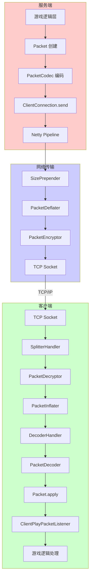
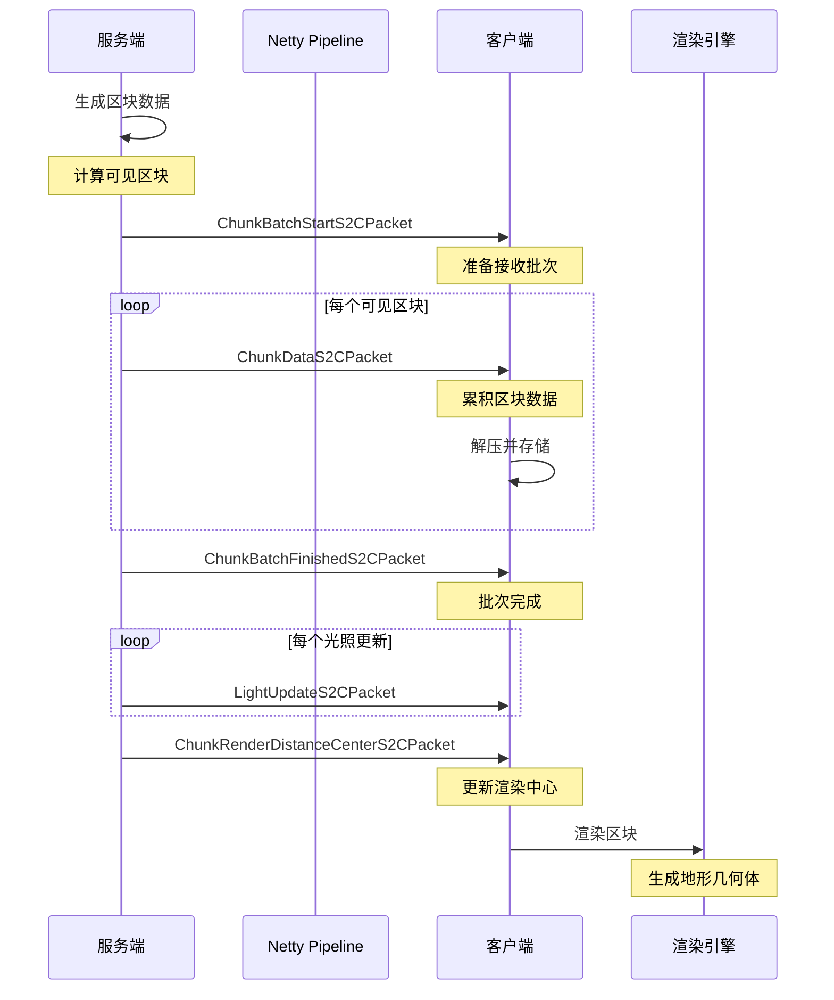
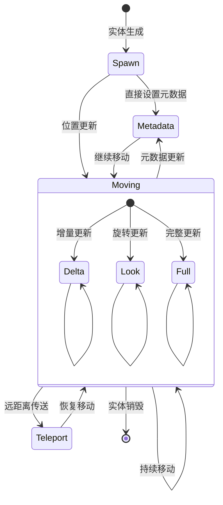

# S2C游戏数据包详解 (S2C Play Packets)

## 概述

S2C（Server-to-Client）数据包是 Minecraft 1.21 网络协议中服务端主动推送给客户端的游戏状态更新信息。在 Play 阶段，这些数据包构成了客户端游戏世界的核心同步机制，覆盖了从玩家加入游戏到离开的整个过程。

S2C 数据包由 `ClientPlayPacketListener` 接口定义，每个数据包都有对应的回调方法。服务端通过 `ClientConnection.send()` 方法将数据包发送到客户端，客户端接收后由 `PacketDecoder` 解码，最后调用对应的监听器方法处理。

Minecraft 1.21 的 S2C 数据包系统具有以下特点：

| 特性 | 描述 |
|------|------|
| **方向** | 服务端 → 客户端 |
| **协议阶段** | Play 阶段（CONFIGURATION 阶段之后） |
| **传输频率** | 根据数据包类型从单次到高频不等 |
| **压缩支持** | 支持 Zlib 压缩，可配置阈值 |
| **捆绑机制** | 支持数据包捆绑减少协议开销 |

Play 阶段是网络连接生命周期中持续时间最长的阶段，从玩家成功登录后开始，直到玩家断开连接或服务端关闭为止。在这个阶段，数据包的传输量最大、频率最高，服务端需要高效地管理数据包的发送以保证游戏流畅性。

## 数据包分类

### 分类体系

Minecraft 1.21 的 S2C 数据包可以按照功能分为以下几个主要类别：

```
S2C Play Packets
├── 世界同步包 (World Sync Packets)
│   ├── 区块数据包 (Chunk Data)
│   ├── 方块更新包 (Block Updates)
│   └── 区块批次包 (Chunk Batch)
├── 实体同步包 (Entity Sync Packets)
│   ├── 实体生成包 (Entity Spawn)
│   ├── 实体移动包 (Entity Movement)
│   └── 实体销毁包 (Entity Destroy)
├── 粒子与效果包 (Particle & Effect Packets)
│   ├── 粒子包 (Particles)
│   ├── 效果包 (Effects)
│   └── 爆炸包 (Explosions)
├── UI相关包 (UI Related Packets)
│   ├── 窗口物品包 (Window Items)
│   ├── 进度条包 (Progress Bar)
│   └── 标题/动作条包 (Titles/Actionbar)
├── 玩家状态包 (Player State Packets)
│   ├── 玩家列表包 (Player List)
│   ├── 玩家属性包 (Player Attributes)
│   └── 玩家能力包 (Player Abilities)
└── 游戏事件包 (Game Event Packets)
    ├── 游戏事件包 (Game Events)
    ├── 分数板包 (Scoreboard)
    └── 统计信息包 (Statistics)
```

### 核心数据包类型对照表

| 数据包类型 | Packet ID | 功能描述 | 传输频率 |
|-----------|-----------|----------|----------|
| `SpawnEntityS2CPacket` | 0x00 | 生成实体 | 中频 |
| `PlayerListS2CPacket` | 0x01 | 玩家列表更新 | 低频 |
| `GameJoinS2CPacket` | 0x02 | 游戏加入 | 单次 |
| `ChunkDataS2CPacket` | 0x03 | 区块数据 | 高频 |
| `BlockChangedS2CPacket` | 0x04 | 方块变化 | 高频 |
| `BundleS2CPacket` | 0x05 | 数据包捆绑 | 高频 |
| `DisconnectS2CPacket` | 0x06 | 断开连接 | 低频 |
| `EntityEventS2CPacket` | 0x07 | 实体事件 | 中频 |
| `AcknowledgeBlockChangesS2CPacket` | 0x08 | 确认方块变化 | 高频 |
| `BlockEntityUpdateS2CPacket` | 0x09 | 方块实体更新 | 中频 |
| `ChatMessageS2CPacket` | 0x0A | 聊天消息 | 中频 |
| `GameEventS2CPacket` | 0x0B | 游戏事件 | 中频 |
| `ExplosionS2CPacket` | 0x0C | 爆炸效果 | 低频 |
| `WorldEventS2CPacket` | 0x0D | 世界事件 | 低频 |
| `WorldParticlesS2CPacket` | 0x0E | 世界粒子 | 中频 |
| `LoginPlayS2CPacket` | 0x0F | 登录数据包 | 单次 |

## 世界同步包

世界同步是 S2C 数据包中最重要的部分，负责将服务端世界的状态完整地同步到客户端。

### ChunkDataS2CPacket - 区块数据包

区块数据包是游戏中最庞大的数据包之一，包含了区块内的所有方块状态和实体数据。

```java
D:\Minecraft-Learning\assets\mc\1.21\net\minecraft\network\packet\s2c\play\ChunkDataS2CPacket.java
```

**数据包结构：**

```
ChunkDataS2CPacket
├── chunkX: int          // 区块 X 坐标
├── chunkZ: int          // 区块 Z 坐标
├── chunkData: byte[]     // 压缩后的区块数据
├── blockEntities: List   // 方块实体数据
├── BiomeData: byte[]    // 生物群系数据
└── blockEntityCount: int // 方块实体数量
```

**区块批次机制：**

Minecraft 1.21 使用批次机制优化区块同步：

```java
// ChunkBatchStartS2CPacket - 批次开始
public class ChunkBatchStartS2CPacket implements Packet<ClientPlayPacketListener> {
    private final int chunkX;
    private final int chunkZ;
    private final int chunkCount;  // 预期区块数量

    public ChunkBatchStartS2CPacket(int chunkX, int chunkZ, int chunkCount) {
        this.chunkX = chunkX;
        this.chunkZ = chunkZ;
        this.chunkCount = chunkCount;
    }
}

// ChunkBatchFinishedS2CPacket - 批次完成
public class ChunkBatchFinishedS2CPacket implements Packet<ClientPlayPacketListener> {
    private final int chunkX;
    private final int chunkZ;
    private final int chunksLoaded;  // 实际加载的区块数

    public ChunkBatchFinishedS2CPacket(int chunkX, int chunkZ, int chunksLoaded) {
        this.chunkX = chunkX;
        this.chunkZ = chunkZ;
        this.chunksLoaded = chunksLoaded;
    }
}
```

### BlockChangedS2CPacket - 方块变化数据包

用于同步单个方块的更新变化。

```java
D:\Minecraft-Learning\assets\mc\1.21\net\minecraft\network\packet\s2c\play\BlockChangedS2CPacket.java
```

**数据包结构：**

```
BlockChangedS2CPacket
├── position: BlockPos     // 方块位置
├── blockState: BlockState // 新的方块状态
└── flags: int            // 更新标志
```

### ChunkRenderDistanceCenterS2CPacket - 渲染距离中心

通知客户端渲染距离和中心点的变化。

```java
D:\Minecraft-Learning\assets\mc\1.21\net\minecraft\network\packet\s2c\play\ChunkRenderDistanceCenterS2CPacket.java
```

## 实体同步包

实体同步包负责将服务端的所有实体状态同步到客户端。

### SpawnEntityS2CPacket - 实体生成包

这是最常用的实体同步数据包之一，用于通知客户端创建一个新的实体。

```java
D:\Minecraft-Learning\assets\mc\1.21\net\minecraft\network\packet\s2c\play\SpawnEntityS2CPacket.java
```

**数据包结构：**

```
SpawnEntityS2CPacket
├── entityId: int           // 实体 ID
├── entityUuid: UUID         // 实体 UUID
├── type: EntityType         // 实体类型
├── position: Vec3d          // 位置
├── yaw: float               // 偏航角
├── pitch: float             // 俯仰角
├── headYaw: float           // 头部偏航角
├── velocity: Vec3d          // 速度
└── metadata: EntityMetadata // 元数据
```

### EntityS2CPacket - 实体状态更新包

用于更新已存在的实体状态，包括位置、旋转、速度等。

```java
D:\Minecraft-Learning\assets\mc\1.21\net\minecraft\network\packet\s2c\play\EntityS2CPacket.java
```

**实体更新类型：**

| 类型 | 描述 | 数据字段 |
|------|------|----------|
| `TELEPORT` | 远距离传送 | 位置 |
| `DELTA` | 增量移动 | 位置差值 |
| `LOOK` | 旋转更新 | 偏航角、俯仰角 |
| `HEAD_YAW` | 头部旋转 | 头部偏航角 |
| `VELOCITY` | 速度更新 | 速度向量 |

```java
// 实体移动数据包的多种变体
public class EntityS2CPacket {
    
    // 增量位置更新 (Delta Update)
    public static class Delta extends EntityS2CPacket {
        private final byte deltaX;
        private final byte deltaY;
        private final byte deltaZ;
        private final boolean onGround;
    }
    
    // 旋转更新 (Look Update)
    public static class Look extends EntityS2CPacket {
        private final float yaw;
        private final float pitch;
        private final boolean onGround;
    }
}
```

### EntityDestroyS2CPacket - 实体销毁包

通知客户端销毁一个或多个实体。

```java
D:\Minecraft-Learning\assets\mc\1.21\net\minecraft\network\packet\s2c\play\EntityDestroyS2CPacket.java
```

**数据包结构：**

```
EntityDestroyS2CPacket
├── count: int      // 销毁的实体数量
└── entityIds: int[] // 实体 ID 数组
```

### PlayerLookAtS2CPacket - 玩家看向目标包

通知客户端某个玩家正在看向某个实体或位置。

```java
D:\Minecraft-Learning\assets\mc\1.21\net\minecraft\network\packet\s2c\play\PlayerLookAtS2CPacket.java
```

## 方块同步包

### BlockEntityUpdateS2CPacket - 方块实体更新包

用于同步方块实体（如箱子、熔炉、告示牌等）的 NBT 数据。

```java
D:\Minecraft-Learning\assets\mc\1.21\net\minecraft\network\packet\s2c\play\BlockEntityUpdateS2CPacket.java
```

**数据包结构：**

```
BlockEntityUpdateS2CPacket
├── position: BlockPos      // 方块位置
├── type: BlockEntityType   // 方块实体类型
├── nbt: NbtCompound        // 方块实体数据
└── operationType: int      // 操作类型 (CREATE/UPDATE/REMOVE)
```

### QueryBlockNbtS2CPacket - 查询方块NBT包

服务端响应客户端查询方块实体 NBT 的请求。

```java
D:\Minecraft-Learning\assets\mc\1.21\net\minecraft\network\packet\s2c\play\QueryBlockNbtS2CPacket.java
```

### LightUpdateS2CPacket - 光照更新包

更新区块的光照数据。

```java
D:\Minecraft-Learning\assets\mc\1.21\net\minecraft\network\packet\s2c\play\LightUpdateS2CPacket.java
```

## 粒子与效果

### WorldParticlesS2CPacket - 世界粒子包

发送粒子效果到客户端。

```java
D:\Minecraft-Learning\assets\mc\1.21\net\minecraft\network\packet\s2c\play\WorldParticlesS2CPacket.java
```

**数据包结构：**

```
WorldParticlesS2CPacket
├── particleId: int          // 粒子类型 ID
├── longDistance: boolean    // 是否长距离
├── position: Vec3d          // 位置
├── offset: Vec3d            // 随机偏移
├── speed: float             // 速度
├── count: int               // 粒子数量
├── data: ParticleParameters // 粒子参数
└── overrideLimiter: boolean // 是否覆盖限制器
```

### ExplosionS2CPacket - 爆炸包

同步爆炸效果。

```java
D:\Minecraft-Learning\assets\mc\1.21\net\minecraft\network\packet\s2c\play\ExplosionS2CPacket.java
```

**数据包结构：**

```
ExplosionS2CPacket
├── position: Vec3d              // 爆炸中心
├── radius: float                // 爆炸半径
├── affectedBlocks: List<BlockPos> // 受影响的方块位置
├── playerMotionX: float         // 玩家运动 X
├── playerMotionY: float         // 玩家运动 Y
├── playerMotionZ: float         // 玩家运动 Z
└── blockInteraction: int        // 方块交互类型
```

### WorldEventS2CPacket - 世界事件包

发送世界级别的事件效果。

```java
D:\Minecraft-Learning\assets\mc\1.21\net\minecraft\network\packet\s2c\play\WorldEventS2CPacket.java
```

**常用世界事件 ID：**

| 事件 ID | 描述 | 参数 |
|---------|------|------|
| 1000 | 播放音效 | 音效 ID、位置、音量 |
| 1001 | 播放修改音效 | 音效 ID、位置、音量 |
| 1002 | 播放音乐 | 音乐 ID、位置、音量 |
| 1003 | 自定义音乐 | 音乐 ID、位置、音量 |
| 2000 | 粒子效果 | 粒子 ID、位置、偏移、数据 |
| 2001 | 天空变暗 | 参数 |
| 2002 | 播放音乐_disc | 唱片 ID、位置、音量 |
| 2003 | 自定义歌 | 唱片 ID、位置、音量 |

### EntityEventS2CPacket - 实体事件包

发送与特定实体相关的事件。

```java
D:\Minecraft-Learning\assets\mc\1.21\net\minecraft\network\packet\s2c\play\EntityEventS2CPacket.java
```

**常用实体事件 ID：**

| 事件 ID | 描述 | 触发条件 |
|---------|------|----------|
| 0x00 | 实体伤害 | 实体受到伤害 |
| 0x01 | 实体死亡 | 实体死亡 |
| 0x02 | 凋零骷髅头颅 | 凋零骷髅头动画 |
| 0x03 | 动物驯服 | 动物被驯服 |
| 0x06 | 末影龙电子 | 末影龙死亡 |
| 0x0A | 铁傀儡赠送 | 铁傀儡给予雏菊 |
| 0x0B | 心跳 | 村民繁殖成功 |
| 0x22 | 村民繁殖 | 村民获得爱慕效果 |
| 0x26 | 村民庆祝 | 村民获得好感 |
| 0x30 | 蜜蜂愤怒 | 蜜蜂变得愤怒 |
| 0x36 | 美人鱼哭泣 | 迷之海豚哭泣 |
| 0x3A | 豹猫嘶嘶声 | 豹猫发出嘶嘶声 |
| 0x50 | 玩家受伤 | 玩家受到伤害 |

### GameEventS2CPacket - 游戏事件包

发送游戏状态相关的全局事件。

```java
D:\Minecraft-Learning\assets\mc\1.21\net\minecraft\network\packet\s2c\play\GameEventS2CPacket.java
```

**游戏事件类型：**

| 事件 ID | 描述 | 客户端处理 |
|---------|------|------------|
| 0 | 无效 | 无 |
| 1 | 开始下雨 | 启动雨效 |
| 2 | 停止下雨 | 停止雨效 |
| 3 | 更改游戏模式 | 更新 HUD |
| 4 | 退出游戏 | 显示断开界面 |
| 5 | 获胜 | 显示胜利画面 |
| 6 | 死亡 | 显示死亡画面 |
| 7 | 初始化界边 | 发送边界数据 |
| 8 | 缩放 | 更新视场角 |
| 9 | 奖励提示 | 显示提示文本 |
| 10 | 箭头/追踪点 | 显示追踪箭头 |
| 11 | 播放内置效果 | 播放效果 |
| 12 | 增殖阈值 | 更新增殖状态 |

## UI相关包

### InventoryS2CPacket - 物品栏数据包

同步容器（如箱子、玩家物品栏）的物品。

```java
D:\Minecraft-Learning\assets\mc\1.21\net\minecraft\network\packet\s2c\play\InventoryS2CPacket.java
```

**数据包结构：**

```
InventoryS2CPacket
├── syncId: int            // 同步 ID
├── stateId: int          // 状态 ID (用于确认)
├── slots: List<ItemStack> // 槽位物品
├── carriedItem: ItemStack // 鼠标携带的物品
└── mode: InventoryMode    // 同步模式
```

### OpenScreenS2CPacket - 打开窗口包

通知客户端打开一个 GUI 界面。

```java
D:\Minecraft-Learning\assets\mc\1.21\net\minecraft\network\packet\s2c\play\OpenScreenS2CPacket.java
```

**数据包结构：**

```
OpenScreenS2CPacket
├── syncId: int                // 窗口同步 ID
├── type: ScreenHandlerType   // 窗口类型
├── title: Component          // 窗口标题
└── slots: int                // 槽位数量
```

### SetSlotS2CPacket - 设置槽位包

更新单个物品槽位。

```java
D:\Minecraft-Learning\assets\mc\1.21\net\minecraft\network\packet\s2c\play\SetSlotS2CPacket.java
```

### ChatMessageS2CPacket - 聊天消息包

发送聊天消息到客户端。

```java
D:\Minecraft-Learning\assets\mc\1.21\net\minecraft\network\packet\s2c\play\ChatMessageS2CPacket.java
```

**数据包结构：**

```
ChatMessageS2CPacket
├── message: Component          // 消息内容
├── signedContent: String        // 签名内容
├── unsignedContent: Component   // 未签名内容
├── timestamp: long             // 时间戳
├── salt: long                   // 盐值
├── signature: byte[]            // 签名数据
├── lastSeenMessages: List      // 最后查看的消息
└── filterMask: int             // 过滤掩码
```

### PlayerListS2CPacket - 玩家列表包

添加、更新或移除 Tab 列表中的玩家条目。

```java
D:\Minecraft-Learning\assets\mc\1.21\net\minecraft\network\packet\s2c\play\PlayerListS2CPacket.java
```

### TitleS2CPacket - 标题数据包

显示、设置或重置标题/副标题。

```java
D:\Minecraft-Learning\assets\mc\1.21\net\minecraft\network\packet\s2c\play\TitleS2CPacket.java
```

**数据包结构：**

```
TitleS2CPacket
├── action: TitleAction      // 操作类型
├── title: Component         // 标题文本
├── subtitle: Component      // 副标题文本
├── fadeIn: int               // 淡入时间
├── stay: int                 // 停留时间
├── fadeOut: int              // 淡出时间
└── animationTimes: int[]    // 动画时间
```

**标题操作类型：**

| 操作 | 描述 |
|------|------|
| `SET_TITLE` | 设置主标题 |
| `SET_SUBTITLE` | 设置副标题 |
| `SET_ACTION_BAR` | 设置动作栏文本 |
| `SET_TIMES` | 设置动画时间 |
| `HIDE` | 隐藏标题 |
| `RESET` | 重置为默认 |

### ScoreboardObjectiveS2CPacket - 记分板目标包

创建、更新或删除记分板目标。

```java
D:\Minecraft-Learning\assets\mc\1.21\net\minecraft\network\packet\s2c\play\ScoreboardObjectiveS2CPacket.java
```

### ScoreboardScoreS2CPacket - 记分板分数包

更新记分板上的分数。

```java
D:\Minecraft-Learning\assets\mc\1.21\net\minecraft\network\packet\s2c\play\ScoreboardScoreS2CPacket.java
```

### HealthS2CPacket - 生命值数据包

同步玩家的生命值、饱食度和饱和度。

```java
D:\Minecraft-Learning\assets\mc\1.21\net\minecraft\network\packet\s2c\play\HealthS2CPacket.java
```

**数据包结构：**

```
HealthS2CPacket
├── health: float    // 当前生命值
├── food: int        // 饱食度
└── saturation: float // 饱和度
```

### SetExperienceS2CPacket - 经验值数据包

同步玩家的经验等级和进度。

```java
D:\Minecraft-Learning\assets\mc\1.21\net\minecraft\network\packet\s2c\play\SetExperienceS2CPacket.java
```

## 源码分析

### 数据包注册机制

S2C 数据包通过 `PlayPackets` 类进行注册和管理：

```java
D:\Minecraft-Learning\assets\mc\1.21\net\minecraft\network\packet\PlayPackets.java

public final class PlayPackets {
    
    // 私有构造函数，外部无法实例化
    private PlayPackets() {}
    
    // S2C 数据包注册方法
    private static <T extends Packet<ClientPlayPacketListener>> PacketType<T> s2c(
        String id,
        IntFunction<T> packetConstructor
    ) {
        return new PacketType(
            NetworkSide.CLIENTBOUND,
            Identifier.ofVanilla(id),
            packetConstructor
        );
    }
    
    // S2C 数据包类型常量
    public static final PacketType<SpawnEntityS2CPacket> SPAWN_ENTITY = 
        s2c("spawn_entity", SpawnEntityS2CPacket::new);
    
    public static final PacketType<ChunkDataS2CPacket> CHUNK_DATA = 
        s2c("chunk_data", ChunkDataS2CPacket::new);
    
    public static final PacketType<PlayerListS2CPacket> PLAYER_LIST = 
        s2c("player_list", PlayerListS2CPacket::new);
    
    // ... 更多数据包
}
```

### 数据包监听器接口

`ClientPlayPacketListener` 接口定义了所有 S2C 数据包的回调方法：

```java
D:\Minecraft-Learning\assets\mc\1.21\net\minecraft\network\listener\ClientPlayPacketListener.java

public interface ClientPlayPacketListener extends PacketListener {
    
    // 世界同步
    void onChunkData(ChunkDataS2CPacket packet);
    void onBlockChanged(BlockChangedS2CPacket packet);
    void onLightUpdate(LightUpdateS2CPacket packet);
    
    // 实体同步
    void onEntitySpawn(SpawnEntityS2CPacket packet);
    void onEntityUpdate(EntityS2CPacket packet);
    void onEntityDestroy(EntityDestroyS2CPacket packet);
    
    // 粒子与效果
    void onWorldParticles(WorldParticlesS2CPacket packet);
    void onExplosion(ExplosionS2CPacket packet);
    void onWorldEvent(WorldEventS2CPacket packet);
    
    // UI 相关
    void onInventory(InventoryS2CPacket packet);
    void onOpenScreen(OpenScreenS2CPacket packet);
    void onChatMessage(ChatMessageS2CPacket packet);
    
    // 游戏状态
    void onGameEvent(GameEventS2CPacket packet);
    void onPlayerList(PlayerListS2CPacket packet);
    void onHealth(HealthS2CPacket packet);
}
```

### 数据包编码器

每个 S2C 数据包都实现了自己的编解码逻辑：

```java
D:\Minecraft-Learning\assets\mc\1.21\net\minecraft\network\packet\s2c\play\SpawnEntityS2CPacket.java

public class SpawnEntityS2CPacket implements Packet<ClientPlayPacketListener> {
    
    // 数据包编解码器
    public static final PacketCodec<PacketByteBuf, SpawnEntityS2CPacket> CODEC = 
        PacketCodec.of(
            SpawnEntityS2CPacket::write,
            SpawnEntityS2CPacket::new
        );
    
    private static void write(PacketByteBuf buf, SpawnEntityS2CPacket packet) {
        buf.writeVarInt(packet.entityId);
        buf.writeUuid(packet.uuid);
        buf.writeVarInt(packet.entityType);
        buf.writeDouble(packet.x);
        buf.writeDouble(packet.y);
        buf.writeDouble(packet.z);
        buf.writeByte(packet.pitch);
        buf.writeByte(packet.yaw);
        buf.writeByte(packet.headYaw);
        buf.writeShort(packet.velocityX);
        buf.writeShort(packet.velocityY);
        buf.writeShort(packet.velocityZ);
    }
    
    private SpawnEntityS2CPacket(PacketByteBuf buf) {
        this.entityId = buf.readVarInt();
        this.uuid = buf.readUuid();
        this.entityType = buf.readVarInt();
        this.x = buf.readDouble();
        this.y = buf.readDouble();
        this.z = buf.readDouble();
        this.pitch = buf.readByte();
        this.yaw = buf.readByte();
        this.headYaw = buf.readByte();
        this.velocityX = buf.readShort();
        this.velocityY = buf.readShort();
        this.velocityZ = buf.readShort();
    }
    
    @Override
    public void apply(ClientPlayPacketListener listener) {
        listener.onEntitySpawn(this);
    }
}
```

### 数据包发送机制

服务端发送 S2C 数据包通过 `ClientPlayPacketListener` 的实现类：

```java
D:\Minecraft-Learning\assets\mc\1.21\net\minecraft\network\handler\ClientPlayPacketHandler.java

public class ClientPlayPacketHandler implements ClientPlayPacketListener {
    
    private final ClientConnection connection;
    private final MinecraftClient client;
    
    // 发送区块数据
    public void sendChunkData(ChunkDataS2CPacket packet) {
        this.connection.send(packet);
    }
    
    // 发送实体更新
    public void sendEntityUpdate(EntityS2CPacket packet) {
        this.connection.send(packet);
    }
}
```

### 数据包处理流程

客户端接收和处理 S2C 数据包的流程如下：

```
1. 网络层接收字节流
       ↓
2. PacketInflater 解压
       ↓
3. PacketDecoder 根据 ID 查找数据包类型
       ↓
4. 创建数据包实例并调用 Codec.decode()
       ↓
5. 调用 packet.apply(listener)
       ↓
6. 监听器执行相应的业务逻辑
```

### BundlePacket 捆绑机制

1.21 版本引入的数据包捆绑机制允许将多个小数据包合并传输：

```java
D:\Minecraft-Learning\assets\mc\1.21\net\minecraft\network\packet\s2c\play\BundleS2CPacket.java

public class BundleS2CPacket extends Packet<ClientPlayPacketListener> {
    
    private final Iterable<Packet<? super ClientPlayPacketListener>> packets;
    
    public BundleS2CPacket(Iterable<Packet<? super ClientPlayPacketListener>> packets) {
        this.packets = packets;
    }
    
    public Iterable<Packet<? super ClientPlayPacketListener>> getPackets() {
        return this.packets;
    }
    
    @Override
    public void apply(ClientPlayPacketListener listener) {
        for (Packet<? super ClientPlayPacketListener> packet : this.packets) {
            packet.apply(listener);
        }
    }
}
```

## Mermaid Diagram

### S2C 数据包处理流程



### S2C 数据包分类总览

```mermaid
flowchart TB
    S2C["S2C Play Packets"] --> World["世界同步包"]
    S2C --> Entity["实体同步包"]
    S2C --> Particle["粒子与效果包"]
    S2C --> UI["UI相关包"]
    S2C --> Game["游戏事件包"]

    World --> W1["ChunkDataS2CPacket"]
    World --> W2["BlockChangedS2CPacket"]
    World --> W3["LightUpdateS2CPacket"]
    World --> W4["ChunkBatchStartS2CPacket"]

    Entity --> E1["SpawnEntityS2CPacket"]
    Entity --> E2["EntityS2CPacket"]
    Entity --> E3["EntityDestroyS2CPacket"]
    Entity --> E4["EntityTrackerUpdateS2CPacket"]

    Particle --> P1["WorldParticlesS2CPacket"]
    Particle --> P2["ExplosionS2CPacket"]
    Particle --> P3["WorldEventS2CPacket"]
    Particle --> P4["EntityEventS2CPacket"]

    UI --> U1["InventoryS2CPacket"]
    UI --> U2["ChatMessageS2CPacket"]
    UI --> U3["TitleS2CPacket"]
    UI --> U4["HealthS2CPacket"]

    Game --> G1["GameEventS2CPacket"]
    Game --> G2["ScoreboardObjectiveS2CPacket"]
    Game --> G3["PlayerListS2CPacket"]
    Game --> G4["GameJoinS2CPacket"]

    style S2C fill:#ff9999
    style World fill:#ffcc99
    style Entity fill:#ffff99
    style Particle fill:#99ff99
    style UI fill:#99ffff
    style Game fill:#ff99ff
```



### 区块同步完整流程



### 实体同步状态机



## 关键文件路径

| 文件 | 路径 | 描述 |
|------|------|------|
| PlayPackets | `D:\Minecraft-Learning\assets\mc\1.21\net\minecraft\network\packet\PlayPackets.java` | 数据包类型注册 |
| ClientPlayPacketListener | `D:\Minecraft-Learning\assets\mc\1.21\net\minecraft\network\listener\ClientPlayPacketListener.java` | 客户端数据包监听器 |
| ClientPlayPacketHandler | `D:\Minecraft-Learning\assets\mc\1.21\net\minecraft\network\handler\ClientPlayPacketHandler.java` | 客户端数据包处理器 |
| ChunkDataS2CPacket | `D:\Minecraft-Learning\assets\mc\1.21\net\minecraft\network\packet\s2c\play\ChunkDataS2CPacket.java` | 区块数据包 |
| SpawnEntityS2CPacket | `D:\Minecraft-Learning\assets\mc\1.21\net\minecraft\network\packet\s2c\play\SpawnEntityS2CPacket.java` | 实体生成包 |
| EntityS2CPacket | `D:\Minecraft-Learning\assets\mc\1.21\net\minecraft\network\packet\s2c\play\EntityS2CPacket.java` | 实体更新包 |
| BundleS2CPacket | `D:\Minecraft-Learning\assets\mc\1.21\net\minecraft\network\packet\s2c\play\BundleS2CPacket.java` | 数据包捆绑包 |
| InventoryS2CPacket | `D:\Minecraft-Learning\assets\mc\1.21\net\minecraft\network\packet\s2c\play\InventoryS2CPacket.java` | 物品栏数据包 |
| ChatMessageS2CPacket | `D:\Minecraft-Learning\assets\mc\1.21\net\minecraft\network\packet\s2c\play\ChatMessageS2CPacket.java` | 聊天消息包 |

## 性能优化建议

### 1. 数据包捆绑

将多个高频小数据包捆绑传输，减少协议开销：

```java
// 服务端示例
public void sendBundledPackets(List<Packet<ClientPlayPacketListener>> packets) {
    BundleS2CPacket bundle = new BundleS2CPacket(packets);
    connection.send(bundle);
}
```

### 2. 区块批次优化

合理使用区块批次机制，减少客户端渲染触发次数：

| 场景 | 推荐批次大小 |
|------|-------------|
| 首次加载 | 64-128 区块 |
| 区块迁移 | 16-32 区块 |
| 单区块更新 | 1 区块 |

### 3. 增量更新优先

对于实体移动，优先使用增量更新（Delta）而非完整位置更新：

| 更新类型 | 字节数 | 适用场景 |
|---------|--------|----------|
| Delta | 1-6 字节 | 常规移动 |
| Look | 3 字节 | 仅旋转 |
| Full | 14 字节 | 远距离传送 |

### 4. 压缩阈值配置

根据服务器性能和网络条件调整压缩阈值：

```java
// 推荐配置
connection.setCompressionThreshold(256);  // 小于此值不压缩
```

## 模组开发注意事项

### 发送自定义 S2C 数据包

```java
// 创建自定义数据包
public class CustomS2CPacket implements Packet<ClientPlayPacketListener> {
    
    private final String message;
    
    public CustomS2CPacket(String message) {
        this.message = message;
    }
    
    public static final PacketCodec<PacketByteBuf, CustomS2CPacket> CODEC = 
        Packet.codec(CustomS2CPacket::new, CustomS2CPacket::write);
    
    private static void write(PacketByteBuf buf, CustomS2CPacket packet) {
        buf.writeString(packet.message);
    }
    
    private CustomS2CPacket(PacketByteBuf buf) {
        this.message = buf.readString();
    }
    
    @Override
    public void apply(ClientPlayPacketListener listener) {
        listener.onCustomPacket(this);
    }
}

// 发送数据包
connection.send(new CustomS2CPacket("Hello Client!"));
```

### 拦截 S2C 数据包

通过事件总线拦截和处理 S2C 数据包：

```java
@SubscribeEvent
public void onPacketReceived(PacketEvent.Incoming<ChunkDataS2CPacket> event) {
    ChunkDataS2CPacket packet = event.getPacket();
    // 处理区块数据
}
```

## 总结

S2C 数据包是 Minecraft 1.21 网络协议中服务端向客户端同步游戏状态的核心机制。通过合理地组织和使用各类数据包，客户端能够实时地渲染和更新游戏世界。

关键设计要点：

1. **类型安全**：通过泛型和接口实现数据包类型的编译时检查
2. **高效编码**：VarInt 和增量更新减少带宽占用
3. **批次机制**：区块批次传输优化大规模区块加载性能
4. **捆绑传输**：数据包捆绑减少协议开销
5. **分层设计**：PacketCodec 抽象层允许灵活的序列化策略

理解 S2C 数据包系统的工作原理，对于开发高质量的网络模组、调试连接问题、以及优化服务器性能都至关重要。
