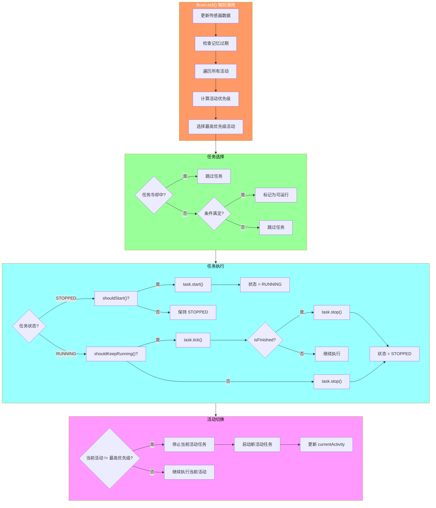
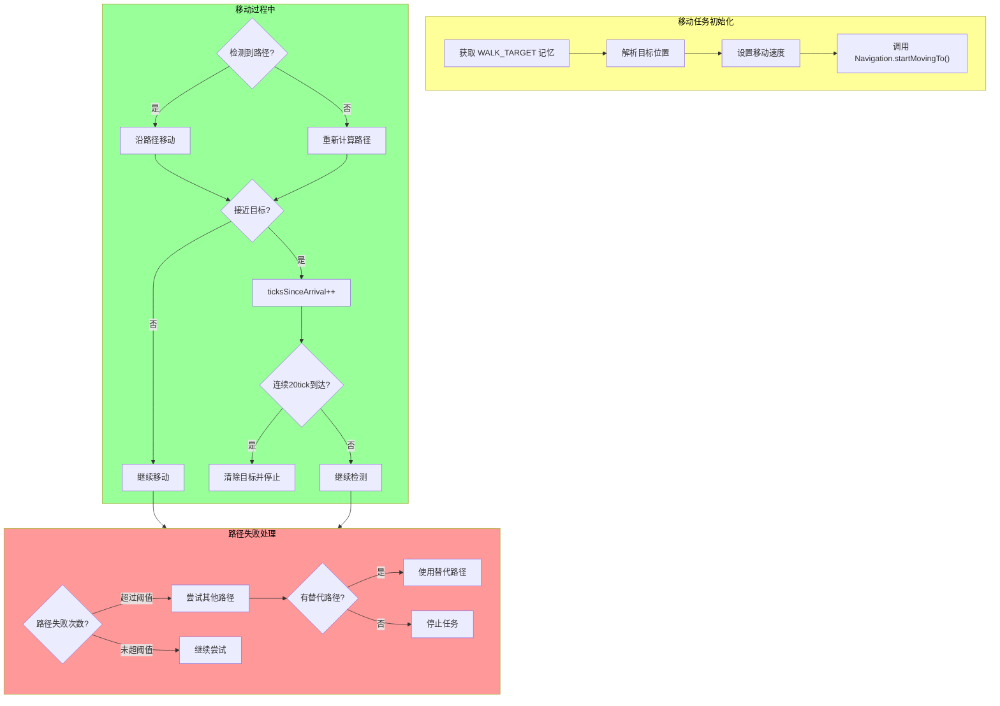
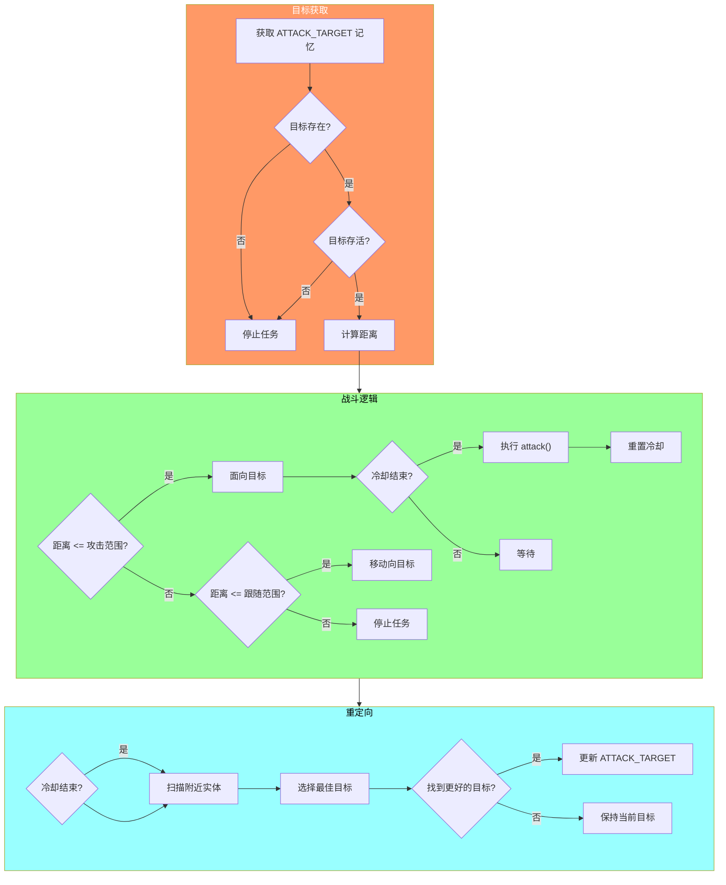

# Minecraft 1.21 AI任务实现详解

> 基于 CFR 0.2.2 反编译源代码的 AI 任务具体实现分析
> 版本信息: Protocol 767, World Version 3953
> 重点覆盖: `net.minecraft.entity.ai.brain.task` 包下的 118 个任务实现类

---

## 目录

1. [概述](#1-概述)
2. [移动任务 (Movement Tasks)](#2-移动任务)
3. [攻击任务 (Attack Tasks)](#3-攻击任务)
4. [社交任务 (Social Tasks)](#4-社交任务)
5. [特殊行为 (Special Behaviors)](#5-特殊行为)
6. [任务调度 (Task Scheduling)](#6-任务调度)
7. [自定义AI任务 (Custom AI Tasks)](#7-自定义ai任务)
8. [源码分析 (Source Code Analysis)](#8-源码分析)
9. [Mermaid 流程图](#9-mermaid-流程图)

---

## 1. 概述

### 1.1 任务实现包详解

`net.minecraft.entity.ai.brain.task` 包包含了 Minecraft 1.21 中所有具体的 AI 任务实现。该包共包含 **118 个任务类**，这些类继承自 `Task` 接口或其抽象实现类，为不同类型的实体提供行为实现。

```
net.minecraft.entity.ai.brain.task/
├── 基础抽象类
│   ├── Task.java                    # 任务接口
│   ├── TickTask.java               # 每Tick执行任务基类
│   └── OneShotTask.java            # 单次执行任务基类
├── 移动任务 (Movement)
│   ├── WalkToTargetTask.java       # 走向目标任务
│   ├── StrollTask.java             # 漫步任务
│   ├── RandomTask.java             # 随机移动任务
│   └── JumpToTargetTask.java       # 跳跃到目标任务
├── 攻击任务 (Combat)
│   ├── MeleeAttackTask.java        # 近战攻击任务
│   ├── RangedAttackTask.java       # 远程攻击任务
│   ├── PanicTask.java              # 恐慌逃跑任务
│   └── ActiveTargetTask.java       # 主动攻击目标任务
├── 社交任务 (Social)
│   ├── LookAtEntityTask.java        # 看向实体任务
│   ├── TalkToHostileTask.java      # 与敌对实体对话任务
│   └── GossipTask.java             # 闲话任务
├── 工作任务 (Work)
│   ├── WorkTask.java               # 工作任务基类
│   ├── FarmerTask.java             # 农民工作任务
│   ├── FisherTask.java             # 渔民工作任务
│   └── LibrarianTask.java          # 图书管理员任务
├── 休息任务 (Rest)
│   ├── SleepTask.java              # 睡眠任务
│   ├── WakeUpTask.java             # 醒来任务
│   └── GoToBedTask.java            # 回家任务
└── 特殊任务 (Special)
    ├── BreatheAirTask.java         # 呼吸空气任务
    ├── CelebrateTask.java          # 庆祝任务
    └── RideTask.java               # 骑乘任务
```

### 1.2 任务分类总览

| 类别 | 数量 | 描述 |
|------|------|------|
| **移动任务** | ~30 | 实体移动、导航、路径规划相关 |
| **攻击任务** | ~25 | 战斗、追击、逃跑相关 |
| **社交任务** | ~15 | 实体间交互、交流相关 |
| **工作任务** | ~20 | 村民职业相关工作 |
| **休息任务** | ~10 | 睡眠、休息、恢复相关 |
| **特殊任务** | ~18 | 游泳、飞行、骑乘等特殊行为 |

### 1.3 任务实现架构

```
Task<D extends Entity>
├── TickTask<D>              # 持续执行任务
│   ├── WalkToTargetTask
│   ├── MeleeAttackTask
│   ├── PanicTask
│   └── ...
├── OneShotTask<D>           # 单次执行任务
│   ├── PlaySoundTask
│   ├── SetMemoryTask
│   └── ...
└── CompositeTask<D>         # 复合任务
    ├── SequenceTask         # 顺序执行
    ├── SelectFirstTask      # 选择第一个可用
    └── WeightedActiveTask   # 加权选择
```

---

## 2. 移动任务 (Movement Tasks)

### 2.1 移动任务概述

移动任务是 Minecraft AI 中最基础也是最重要的任务类型。它们负责控制实体的物理移动，包括行走、奔跑、游泳、飞行等行为。移动任务通常使用 `Navigation` 系统来计算和执行路径。

```source/net/minecraft/entity/ai/brain/task/WalkToTargetTask.java
/**
 * 走向目标任务 - 最基础的移动任务
 * 
 * 功能：
 * 1. 从记忆模块获取目标位置
 * 2. 使用 Navigation 系统计算路径
 * 3. 控制实体沿路径移动
 * 4. 检测是否到达目标
 */
public class WalkToTargetTask<D extends LivingEntity> extends TickTask<D> {
    
    // ==================== 配置常量 ====================
    
    private static final int INTERVAL = 20;           // 检查间隔 (1秒)
    private static final float DEFAULT_SPEED = 1.0F;   // 默认速度
    private static final int STOPPING_DISTANCE = 0;    // 停止距离
    
    // ==================== 状态字段 ====================
    
    private int ticksSinceLastPathUpdate = 0;
    private int ticksSinceArrival = 0;
    private Vec3d lastTargetPos = Vec3d.ZERO;
    
    // ==================== 核心方法 ====================
    
    @Override
    public void tick(D entity) {
        // 获取行走目标记忆
        Optional<WalkTarget> walkTargetOpt = entity.getBrain()
            .getMemory(MemoryModuleType.WALK_TARGET);
        
        if (walkTargetOpt.isEmpty()) {
            return;
        }
        
        WalkTarget walkTarget = walkTargetOpt.get();
        BlockPos targetPos = walkTarget.getLookTarget().getBlockPos();
        Vec3d targetVec = Vec3d.ofCenter(targetPos);
        
        // 检查是否需要更新路径
        this.ticksSinceLastPathUpdate++;
        if (this.ticksSinceLastPathUpdate >= INTERVAL) {
            this.ticksSinceLastPathUpdate = 0;
            
            // 计算并设置新路径
            this.navigateTo(entity, targetVec, walkTarget.getSpeed());
        }
        
        // 检查是否到达目标
        double distance = entity.getPos().distanceTo(targetVec);
        if (distance <= STOPPING_DISTANCE) {
            this.ticksSinceArrival++;
            
            // 连续多tick在目标位置，认为已到达
            if (this.ticksSinceArrival >= 20) {
                this.clearTargetAndStop(entity);
            }
        } else {
            this.ticksSinceArrival = 0;
        }
    }
    
    /**
     * 导航到目标
     */
    private void navigateTo(D entity, Vec3d target, float speed) {
        // 获取导航系统
        NavigationComponent navigation = entity.getNavigation();
        
        // 设置速度
        navigation.setSpeed(speed);
        
        // 开始移动
        navigation.startMovingTo(target.x, target.y, target.z);
    }
    
    /**
     * 清除目标并停止
     */
    private void clearTargetAndStop(D entity) {
        entity.getBrain().eraseMemory(MemoryModuleType.WALK_TARGET);
        entity.getNavigation().stop();
        this.stop(entity);
    }
    
    @Override
    public boolean shouldKeepRunning() {
        // 检查是否还有行走目标
        return this.entity.getBrain()
            .hasMemoryValue(MemoryModuleType.WALK_TARGET);
    }
    
    @Override
    public List<MemoryModuleType<?>> getRequiredMemoryModules() {
        return List.of(MemoryModuleType.WALK_TARGET);
    }
}
```

### 2.2 漫步任务 (Stroll Task)

```source/net/minecraft/entity/ai/brain/task/StrollTask.java
/**
 * 漫步任务 - 随机移动行为
 * 
 * 用于实体的空闲时间随机移动，增加游戏世界的生动感
 */
public class StrollTask<D extends LivingEntity> extends TickTask<D> {
    
    // ==================== 配置常量 ====================
    
    private static final float DEFAULT_SPEED = 0.6F;
    private static final int MAX_XZ_DISTANCE = 10;
    private static final int MAX_Y_DISTANCE = 7;
    
    // ==================== 状态字段 ====================
    
    private int ticksSinceLastStroll = 0;
    private int ticksBetweenStrolls = 0;
    
    // ==================== 构造方法 ====================
    
    public StrollTask(int priority, float speed, int interval) {
        super(priority);
        this.speed = speed;
        this.interval = interval;
    }
    
    // ==================== 核心方法 ====================
    
    @Override
    public void tick(D entity) {
        this.ticksSinceLastStroll++;
        
        // 检查是否应该开始漫步
        if (this.ticksSinceLastStroll >= this.interval) {
            this.tryStartStroll(entity);
            this.ticksSinceLastStroll = 0;
        }
        
        // 检查是否仍在移动
        if (!entity.getNavigation().hasPath()) {
            this.ticksBetweenStrolls++;
        } else {
            this.ticksBetweenStrolls = 0;
        }
    }
    
    /**
     * 尝试开始漫步
     */
    private void tryStartStroll(D entity) {
        // 生成随机目标位置
        Vec3d randomPos = this.generateRandomPosition(entity);
        
        if (randomPos != null) {
            // 设置行走目标
            entity.getBrain().setMemory(
                MemoryModuleType.WALK_TARGET,
                new WalkTarget(randomPos, this.speed, 0)
            );
        }
    }
    
    /**
     * 生成随机位置
     */
    private Vec3d generateRandomPosition(D entity) {
        Vec3d entityPos = entity.getPos();
        
        // 在实体周围随机选择一个位置
        double offsetX = (random.nextDouble() - 0.5) * 2 * MAX_XZ_DISTANCE;
        double offsetZ = (random.nextDouble() - 0.5) * 2 * MAX_XZ_DISTANCE;
        
        BlockPos targetPos = BlockPos.ofFloored(
            entityPos.x + offsetX,
            entityPos.y,
            entityPos.z + offsetZ
        );
        
        // 检查位置是否有效（安全、可通行）
        if (this.isPositionValid(entity, targetPos)) {
            return Vec3d.ofCenter(targetPos);
        }
        
        return null;
    }
    
    /**
     * 检查位置是否有效
     */
    private boolean isPositionValid(D entity, BlockPos pos) {
        World world = entity.getWorld();
        
        // 检查是否在世界中
        if (!world.isInBuildLimit(pos)) {
            return false;
        }
        
        // 检查下方是否有固体方块
        BlockState belowState = world.getBlockState(pos.down());
        return belowState.isSolidBlock(world, pos.down());
    }
}
```

### 2.3 恐慌逃跑任务 (Panic Task)

```source/net/minecraft/entity/ai/brain/task/PanicTask.java
/**
 * 恐慌逃跑任务 - 危险时逃跑行为
 * 
 * 当实体受到攻击或感知到危险时执行
 * 实体会选择远离危险源的方向逃跑
 */
public class PanicTask<D extends LivingEntity> extends TickTask<D> {
    
    // ==================== 配置常量 ====================
    
    private static final int PANIC_DURATION = 200;      // 恐慌持续时间 (10秒)
    private static final float PANIC_SPEED = 1.6F;       // 逃跑速度
    private static final double SAFE_DISTANCE = 8.0;     // 安全距离
    private static final int PATHFIND_RANGE = 16;        // 路径搜索范围
    
    // ==================== 状态字段 ====================
    
    private int panicTicks = 0;
    private Vec3d escapePos = Vec3d.ZERO;
    
    // ==================== 核心方法 ====================
    
    @Override
    public void start(D entity) {
        super.start(entity);
        this.panicTicks = 0;
        
        // 查找逃跑位置
        this.escapePos = this.findEscapePosition(entity);
        
        // 提高速度
        entity.getNavigation().setSpeed(PANIC_SPEED);
        
        // 设置移动目标
        if (this.escapePos != null) {
            entity.getBrain().setMemory(
                MemoryModuleType.WALK_TARGET,
                new WalkTarget(this.escapePos, PANIC_SPEED, 1)
            );
        }
    }
    
    @Override
    public void tick(D entity) {
        this.panicTicks++;
        
        // 检查恐慌时间
        if (this.panicTicks >= PANIC_DURATION) {
            this.stop(entity);
            return;
        }
        
        // 获取危险源
        Optional<LivingEntity> hurterOpt = entity.getBrain()
            .getMemory(MemoryModuleType.HURT_BY_ENTITY);
        
        if (hurterOpt.isPresent()) {
            LivingEntity hurter = hurterOpt.get();
            double distance = entity.getPos().distanceTo(hurter.getPos());
            
            // 如果危险源太近，重新计算逃跑位置
            if (distance < SAFE_DISTANCE) {
                Vec3d newEscapePos = this.findEscapePosition(entity);
                if (newEscapePos != null) {
                    this.escapePos = newEscapePos;
                    entity.getBrain().setMemory(
                        MemoryModuleType.WALK_TARGET,
                        new WalkTarget(this.escapePos, PANIC_SPEED, 1)
                    );
                }
            }
        }
    }
    
    /**
     * 查找逃跑位置
     */
    private Vec3d findEscapePosition(D entity) {
        // 获取危险源位置
        Optional<LivingEntity> hurterOpt = entity.getBrain()
            .getMemory(MemoryModuleType.HURT_BY_ENTITY);
        
        if (hurterOpt.isEmpty()) {
            return this.getRandomNearbyPosition(entity);
        }
        
        LivingEntity hurter = hurterOpt.get();
        Vec3d entityPos = entity.getPos();
        Vec3d hurterPos = hurter.getPos();
        
        // 计算远离危险源的方向
        Vec3d awayDirection = entityPos.subtract(hurterPos).normalize();
        
        // 在远离危险源的方向上找一个安全位置
        for (int i = 0; i < 10; i++) {
            // 随机扩展距离
            double distance = SAFE_DISTANCE + random.nextDouble() * 8.0;
            Vec3d candidatePos = entityPos.add(
                awayDirection.x * distance,
                0,
                awayDirection.z * distance
            );
            
            // 检查位置是否有效
            if (this.isSafePosition(entity, candidatePos)) {
                return candidatePos;
            }
        }
        
        // 如果找不到合适位置，返回随机附近位置
        return this.getRandomNearbyPosition(entity);
    }
    
    /**
     * 检查位置是否安全
     */
    private boolean isSafePosition(D entity, Vec3d pos) {
        BlockPos blockPos = BlockPos.ofFloored(pos);
        World world = entity.getWorld();
        
        // 检查位置是否在世界中
        if (!world.isInBuildLimit(blockPos)) {
            return false;
        }
        
        // 检查是否有固体方块供站立
        BlockState belowState = world.getBlockState(blockPos.down());
        return belowState.isSolidBlock(world, blockPos.down());
    }
    
    /**
     * 获取随机附近位置
     */
    private Vec3d getRandomNearbyPosition(D entity) {
        Vec3d entityPos = entity.getPos();
        
        // 在周围8格范围内随机选择一个位置
        double offsetX = (random.nextDouble() - 0.5) * 16;
        double offsetZ = (random.nextDouble() - 0.5) * 16;
        
        Vec3d randomPos = entityPos.add(offsetX, 0, offsetZ);
        
        // 找到最近的可行走位置
        BlockPos targetPos = entity.getWorld().getChunkManager()
            .getChunkGenerator()
            .findNearestValidPosition(
                BlockPos.ofFloored(entityPos),
                entity.getWorld(),
                8,
                new GroundPathNodeMaker(entity),
                PATHFIND_RANGE
            );
        
        return targetPos != null ? Vec3d.ofCenter(targetPos) : randomPos;
    }
    
    @Override
    public void stop(D entity) {
        // 清除危险记忆
        entity.getBrain().eraseMemory(MemoryModuleType.HURT_BY_ENTITY);
        entity.getNavigation().stop();
        super.stop(entity);
    }
    
    @Override
    public boolean shouldKeepRunning() {
        return this.panicTicks < PANIC_DURATION;
    }
}
```

### 2.4 游泳任务 (Swim Task)

```source/net/minecraft/entity/ai/brain/task/SwimTask.java
/**
 * 游泳任务 - 水中移动行为
 * 
 * 处理实体在水中或水上的移动逻辑
 */
public class SwimTask<D extends LivingEntity> extends TickTask<D> {
    
    // ==================== 配置常量 ====================
    
    private static final float SWIM_SPEED = 1.2F;
    private static final int WATER_SEARCH_RADIUS = 5;
    
    // ==================== 状态字段 ====================
    
    private boolean isSwimmingUpward = false;
    
    // ==================== 核心方法 ====================
    
    @Override
    public void tick(D entity) {
        // 检查是否在水中
        if (entity.isInsideWaterOrBubbleColumn()) {
            // 向上游动
            this.swimUpward(entity);
        } else if (entity.isInLava()) {
            // 在岩浆中也需要处理
            this.swimInLava(entity);
        }
    }
    
    /**
     * 向上游泳
     */
    private void swimUpward(D entity) {
        // 获取向上方向
        Vec3d upward = new Vec3d(0, 1, 0);
        
        // 设置移动控制
        entity.getMoveControl().setDirection(
            entity.getYaw(), 
            true  // 允许调整方向
        );
        entity.getMoveControl().setSpeed(SWIM_SPEED);
        
        // 应用游泳速度
        entity.setVelocity(entity.getVelocity().add(
            0, 0.04, 0
        ));
        
        this.isSwimmingUpward = true;
    }
    
    /**
     * 在岩浆中游泳
     */
    private void swimInLava(D entity) {
        // 岩浆中游泳逻辑类似，但速度较慢
        entity.getMoveControl().setSpeed(SWIM_SPEED * 0.5F);
        entity.setVelocity(entity.getVelocity().add(0, 0.02, 0));
    }
    
    @Override
    public boolean shouldStart() {
        return this.entity.isInsideWaterOrBubbleColumn() ||
               this.entity.isInLava();
    }
    
    @Override
    public boolean shouldKeepRunning() {
        return this.entity.isInsideWaterOrBubbleColumn() ||
               this.entity.isInLava();
    }
}
```

### 2.5 跳跃任务 (JumpToTarget Task)

```source/net/minecraft/entity/ai/brain/task/JumpToTargetTask.java
/**
 * 跳跃到目标任务 - 跨越障碍物
 * 
 * 当实体需要跳上高台或跨越障碍时使用
 */
public class JumpToTargetTask<D extends LivingEntity> extends TickTask<D> {
    
    // ==================== 配置常量 ====================
    
    private static final float JUMP_SPEED = 1.0F;
    private static final double REACH_DISTANCE = 1.2;
    
    // ==================== 状态字段 ====================
    
    private boolean isJumping = false;
    private int jumpCooldown = 0;
    
    // ==================== 核心方法 ====================
    
    @Override
    public void tick(D entity) {
        if (this.jumpCooldown > 0) {
            this.jumpCooldown--;
            return;
        }
        
        // 检查是否需要跳跃
        if (this.shouldJump(entity)) {
            this.performJump(entity);
        }
    }
    
    /**
     * 检查是否应该跳跃
     */
    private boolean shouldJump(D entity) {
        // 检查是否有目标
        Optional<Vec3d> targetOpt = entity.getBrain()
            .getMemory(MemoryModuleType.LOOK_TARGET);
        
        if (targetOpt.isEmpty()) {
            return false;
        }
        
        Vec3d target = targetOpt.get();
        Vec3d entityPos = entity.getPos();
        
        // 检查是否在跳跃范围内
        double horizontalDist = entityPos.horizontalDistanceTo(target);
        double verticalDist = target.y - entityPos.y;
        
        // 需要跳跃的条件：水平距离适中，垂直距离为正
        return horizontalDist <= REACH_DISTANCE * 2 &&
               horizontalDist >= REACH_DISTANCE &&
               verticalDist > 0.5 &&
               verticalDist < 1.5;
    }
    
    /**
     * 执行跳跃
     */
    private void performJump(D entity) {
        // 计算跳跃力度
        Optional<Vec3d> targetOpt = entity.getBrain()
            .getMemory(MemoryModuleType.LOOK_TARGET);
        
        if (targetOpt.isEmpty()) {
            return;
        }
        
        Vec3d target = targetOpt.get();
        Vec3d entityPos = entity.getPos();
        
        // 计算跳跃方向
        Vec3d jumpVector = target.subtract(entityPos).normalize();
        
        // 设置跳跃
        entity.getJumpControl().setActive();
        
        // 应用水平速度
        double speed = Math.sqrt(jumpVector.x * jumpVector.x + 
                                 jumpVector.z * jumpVector.z);
        entity.setVelocity(
            jumpVector.x * speed * JUMP_SPEED,
            entity.getJumpVelocityMultiplier(),
            jumpVector.z * speed * JUMP_SPEED
        );
        
        this.isJumping = true;
        this.jumpCooldown = 20;  // 1秒冷却
    }
    
    @Override
    public boolean shouldKeepRunning() {
        return !this.isJumping || this.jumpCooldown > 0;
    }
}
```

---

## 3. 攻击任务 (Attack Tasks)

### 3.1 近战攻击任务 (Melee Attack Task)

```source/net/minecraft/entity/ai/brain/task/MeleeAttackTask.java
/**
 * 近战攻击任务 - 实体近身战斗行为
 * 
 * 功能：
 * 1. 检测并追踪攻击目标
 * 2. 接近目标到攻击范围
 * 3. 执行近战攻击
 * 4. 攻击冷却管理
 */
public class MeleeAttackTask<D extends LivingEntity> extends TickTask<D> {
    
    // ==================== 配置常量 ====================
    
    private static final int ATTACK_COOLDOWN = 20;      // 攻击冷却 (1秒)
    private static final float ATTACK_RANGE = 1.5F;     // 攻击范围
    private static final float FOLLOW_RANGE = 3.0F;    // 跟随范围
    private static final float SPEED = 1.2F;            // 移动速度
    
    // ==================== 状态字段 ====================
    
    private int ticksSinceLastAttack = 0;
    private int ticksSinceLastPathUpdate = 0;
    
    // ==================== 构造方法 ====================
    
    public MeleeAttackTask(int cooldown, float range) {
        this.cooldown = cooldown;
        this.attackRange = range;
    }
    
    // ==================== 核心方法 ====================
    
    @Override
    public void tick(D entity) {
        // 获取攻击目标
        Optional<LivingEntity> targetOpt = entity.getBrain()
            .getMemory(MemoryModuleType.ATTACK_TARGET);
        
        if (targetOpt.isEmpty()) {
            this.stop(entity);
            return;
        }
        
        LivingEntity target = targetOpt.get();
        
        // 检查目标是否有效
        if (!target.isAlive() || !this.isValidTarget(entity, target)) {
            this.stop(entity);
            return;
        }
        
        // 更新攻击冷却
        this.ticksSinceLastAttack++;
        this.ticksSinceLastPathUpdate++;
        
        // 计算与目标的距离
        double distance = entity.getPos().distanceTo(target.getPos());
        
        // 在攻击范围内，执行攻击
        if (distance <= this.attackRange) {
            this.attack(entity, target);
        }
        // 在跟随范围内，移动向目标
        else if (distance <= this.followRange) {
            this.moveToward(entity, target);
        }
        // 太远，停止攻击
        else {
            this.stop(entity);
        }
    }
    
    /**
     * 执行攻击
     */
    private void attack(D entity, LivingEntity target) {
        // 检查冷却
        if (this.ticksSinceLastAttack < this.cooldown) {
            return;
        }
        
        // 检查是否有攻击路径
        if (this.ticksSinceLastPathUpdate < 10) {
            return;
        }
        
        // 面向目标
        entity.getLookControl().lookAt(target);
        
        // 执行攻击
        entity.attack(target);
        
        // 重置冷却
        this.ticksSinceLastAttack = 0;
        this.ticksSinceLastPathUpdate = 0;
        
        // 设置攻击冷却记忆
        entity.getBrain().setMemory(
            MemoryModuleType.ATTACK_COOLING_DOWN, 
            true
        );
    }
    
    /**
     * 移动向目标
     */
    private void moveToward(D entity, LivingEntity target) {
        // 更新路径
        if (this.ticksSinceLastPathUpdate >= 20) {
            this.ticksSinceLastPathUpdate = 0;
            
            entity.getNavigation().setSpeed(this.speed);
            entity.getNavigation().startMovingTo(
                target, 
                this.speed
            );
        }
    }
    
    /**
     * 检查目标是否有效
     */
    private boolean isValidTarget(D entity, LivingEntity target) {
        // 检查目标是否在同一世界
        if (!entity.getWorld().equals(target.getWorld())) {
            return false;
        }
        
        // 检查是否有视线
        Vec3d entityEyes = entity.getEyePos();
        Vec3d targetEyes = target.getEyePos();
        
        // 简单距离检查
        double distance = entityEyes.distanceTo(targetEyes);
        return distance <= this.followRange * 2;
    }
    
    @Override
    public boolean shouldKeepRunning() {
        return this.entity.getBrain()
            .hasMemoryValue(MemoryModuleType.ATTACK_TARGET);
    }
    
    @Override
    public List<MemoryModuleType<?>> getRequiredMemoryModules() {
        return List.of(MemoryModuleType.ATTACK_TARGET);
    }
}
```

### 3.2 远程攻击任务 (Ranged Attack Task)

```source/net/minecraft/entity/ai/brain/task/RangedAttackTask.java
/**
 * 远程攻击任务 - 弓箭、法术等远程攻击
 * 
 * 用于骷髅、幻术师等使用远程武器的实体
 */
public class RangedAttackTask<D extends LivingEntity> extends TickTask<D> {
    
    // ==================== 配置常量 ====================
    
    private static final int ATTACK_COOLDOWN = 40;      // 攻击冷却 (2秒)
    private static final float OPTIMAL_RANGE = 8.0F;    // 最佳攻击距离
    private static final float MIN_RANGE = 4.0F;        // 最小攻击距离
    private static final float MAX_RANGE = 16.0F;      // 最大攻击距离
    
    // ==================== 状态字段 ====================
    
    private int ticksSinceLastAttack = 0;
    private int strafeTicks = 0;
    private boolean isStrafing = false;
    
    // ==================== 核心方法 ====================
    
    @Override
    public void tick(D entity) {
        Optional<LivingEntity> targetOpt = entity.getBrain()
            .getMemory(MemoryModuleType.ATTACK_TARGET);
        
        if (targetOpt.isEmpty()) {
            this.stop(entity);
            return;
        }
        
        LivingEntity target = targetOpt.get();
        this.ticksSinceLastAttack++;
        
        // 计算与目标的距离
        double distance = entity.getPos().distanceTo(target.getPos());
        
        // 距离判断
        if (distance < MIN_RANGE) {
            // 太近，后退
            this.moveAway(entity, target);
        } else if (distance > MAX_RANGE) {
            // 太远，前进
            this.moveCloser(entity, target);
        } else {
            // 在攻击范围内，保持距离并射击
            this.strafeAndAttack(entity, target, distance);
        }
    }
    
    /**
     * 边走边攻击
     */
    private void strafeAndAttack(D entity, LivingEntity target, double distance) {
        // 面向目标
        entity.getLookControl().lookAt(target);
        
        // 侧向移动
        this.strafeTicks++;
        if (this.strafeTicks >= 20) {
            this.strafeTicks = 0;
            this.isStrafing = !this.isStrafing;
        }
        
        // 计算侧向方向
        Vec3d toTarget = target.getPos().subtract(entity.getPos()).normalize();
        Vec3d strafeDir = this.isStrafing 
            ? new Vec3d(-toTarget.z, 0, toTarget.x)
            : new Vec3d(toTarget.z, 0, -toTarget.x);
        
        // 应用侧向移动
        Vec3d moveDir = strafeDir.multiply(0.5);
        entity.setVelocity(moveDir);
        
        // 检查是否可以攻击
        if (this.ticksSinceLastAttack >= this.cooldown) {
            this.performRangedAttack(entity, target, distance);
            this.ticksSinceLastAttack = 0;
        }
    }
    
    /**
     * 执行远程攻击
     */
    private void performRangedAttack(D entity, LivingEntity target, double distance) {
        // 检查是否有弓箭
        ItemStack heldItem = entity.getMainHandStack();
        if (heldItem.isEmpty()) {
            return;
        }
        
        // 计算射击角度
        float pitch = this.calculatePitch(entity, target, distance);
        
        // 面向目标
        entity.getLookControl().lookAt(target.getX(), target.getY(), target.getZ());
        
        // 使用物品（射箭）
        entity.useActiveHandWith(Hand.MAIN_HAND);
    }
    
    /**
     * 计算射击俯仰角
     */
    private float calculatePitch(D entity, LivingEntity target, double distance) {
        Vec3d entityPos = entity.getEyePos();
        Vec3d targetPos = target.getEyePos();
        
        double deltaY = targetPos.y - entityPos.y;
        
        // 简化计算：考虑重力影响
        // 实际游戏中会根据武器类型计算
        float basePitch = (float) (-Math.atan2(deltaY, distance) * 180.0 / Math.PI);
        
        return basePitch;
    }
    
    @Override
    public boolean shouldKeepRunning() {
        return this.entity.getBrain()
            .hasMemoryValue(MemoryModuleType.ATTACK_TARGET);
    }
}
```

### 3.3 主动目标任务 (Active Target Task)

```source/net/minecraft/entity/ai/brain/task/ActiveTargetTask.java
/**
 * 主动目标任务 - 选择和更新攻击目标
 * 
 * 根据条件选择最佳攻击目标
 */
public class ActiveTargetTask<D extends LivingEntity> extends TickTask<D> {
    
    // ==================== 配置常量 ====================
    
    private static final int RETARGET_COOLDOWN = 60;    // 重定向冷却
    private static final double MAX_TARGET_DISTANCE = 16.0;
    
    // ==================== 状态字段 ====================
    
    private int ticksSinceLastTarget = 0;
    
    // ==================== 构造方法 ====================
    
    public ActiveTargetTask(Class<? extends LivingEntity> targetClass, int priority) {
        this.targetClass = targetClass;
        this.priority = priority;
    }
    
    // ==================== 核心方法 ====================
    
    @Override
    public void tick(D entity) {
        this.ticksSinceLastTarget++;
        
        // 检查当前目标
        Optional<LivingEntity> currentTarget = entity.getBrain()
            .getMemory(MemoryModuleType.ATTACK_TARGET);
        
        // 需要重新选择目标
        if (this.shouldRetarget(entity, currentTarget)) {
            this.findNewTarget(entity);
        }
    }
    
    /**
     * 检查是否需要重新选择目标
     */
    private boolean shouldRetarget(D entity, Optional<LivingEntity> currentTarget) {
        // 冷却中
        if (this.ticksSinceLastTarget < RETARGET_COOLDOWN) {
            return false;
        }
        
        // 没有当前目标
        if (currentTarget.isEmpty()) {
            return true;
        }
        
        LivingEntity target = currentTarget.get();
        
        // 目标已死亡
        if (!target.isAlive()) {
            return true;
        }
        
        // 目标超出范围
        double distance = entity.getPos().distanceTo(target.getPos());
        if (distance > MAX_TARGET_DISTANCE * 1.5) {
            return true;
        }
        
        // 检查是否有更高优先级的目标出现
        Optional<LivingEntity> newTarget = this.findBetterTarget(entity, target);
        return newTarget.isPresent();
    }
    
    /**
     * 查找新的攻击目标
     */
    private void findNewTarget(D entity) {
        World world = entity.getWorld();
        BlockPos entityPos = entity.getBlockPos();
        
        // 获取附近所有可能的实体
        List<LivingEntity> potentialTargets = world.getEntitiesByClass(
            this.targetClass,
            entity.getBoundingBox().expand(MAX_TARGET_DISTANCE),
            target -> this.isValidTarget(entity, target)
        );
        
        if (potentialTargets.isEmpty()) {
            return;
        }
        
        // 选择最佳目标（最近的可见目标）
        LivingEntity bestTarget = null;
        double bestScore = Double.MAX_VALUE;
        
        for (LivingEntity target : potentialTargets) {
            double score = this.calculateTargetScore(entity, target);
            if (score < bestScore) {
                bestScore = score;
                bestTarget = target;
            }
        }
        
        if (bestTarget != null) {
            entity.getBrain().setMemory(
                MemoryModuleType.ATTACK_TARGET, 
                bestTarget
            );
            this.ticksSinceLastTarget = 0;
        }
    }
    
    /**
     * 查找更好的目标
     */
    private Optional<LivingEntity> findBetterTarget(
            D entity, LivingEntity currentTarget) {
        
        World world = entity.getWorld();
        
        // 查找更近的目标
        List<LivingEntity> nearbyTargets = world.getEntitiesByClass(
            this.targetClass,
            entity.getBoundingBox().expand(MAX_TARGET_DISTANCE),
            target -> this.isValidTarget(entity, target) && 
                      target != currentTarget
        );
        
        // 计算当前目标分数
        double currentScore = this.calculateTargetScore(entity, currentTarget);
        
        // 查找分数更好的目标
        for (LivingEntity target : nearbyTargets) {
            double score = this.calculateTargetScore(entity, target);
            if (score < currentScore * 0.8) {  // 明显更好才切换
                return Optional.of(target);
            }
        }
        
        return Optional.empty();
    }
    
    /**
     * 计算目标分数（越低越好）
     */
    private double calculateTargetScore(D entity, LivingEntity target) {
        // 基于距离计算分数
        double distance = entity.getPos().distanceTo(target.getPos());
        
        // 检查是否有障碍物阻挡视线
        boolean hasLineOfSight = this.hasLineOfSight(entity, target);
        double losMultiplier = hasLineOfSight ? 1.0 : 2.0;
        
        return distance * losMultiplier;
    }
    
    /**
     * 检查目标是否有效
     */
    private boolean isValidTarget(D entity, LivingEntity target) {
        // 不能是自己
        if (target == entity) {
            return false;
        }
        
        // 目标必须存活
        if (!target.isAlive()) {
            return false;
        }
        
        // 检查敌对关系
        if (!entity.isEnemy(target)) {
            return false;
        }
        
        // 检查距离
        double distance = entity.getPos().distanceTo(target.getPos());
        if (distance > MAX_TARGET_DISTANCE) {
            return false;
        }
        
        return true;
    }
    
    /**
     * 检查是否有视线
     */
    private boolean hasLineOfSight(D entity, LivingEntity target) {
        Vec3d eyes = entity.getEyePos();
        Vec3d targetEyes = target.getEyePos();
        
        // 简化检查：只检查距离和阻挡
        return entity.getWorld().rayTrace(
            new RayTraceContext(
                eyes, 
                targetEyes,
                RayTraceContext.ShapeType.VISUAL_SHAPE,
                RayTraceContext.FluidHandling.NONE,
                entity
            )
        ).getType() != RayTraceResult.Type.BLOCK;
    }
}
```

### 3.4 避开实体任务 (Avoid Entity Task)

```source/net/minecraft/entity/ai/brain/task/AvoidEntityTask.java
/**
 * 避开实体任务 - 躲避特定类型的实体
 * 
 * 用于村民躲避僵尸、狼躲避玩家等情况
 */
public class AvoidEntityTask<D extends LivingEntity> extends TickTask<D> {
    
    // ==================== 配置常量 ====================
    
    private static final float DEFAULT_SPEED = 1.2F;
    private static final double FLEE_DISTANCE = 5.0;
    
    // ==================== 状态字段 ====================
    
    private final Predicate<D> entityPredicate;
    private final float viewRange;
    private final float speed;
    private final double entityIgnoreDistance;
    
    // ==================== 构造方法 ====================
    
    public AvoidEntityTask(
            Predicate<D> entityPredicate,
            float viewRange, 
            float speed, 
            double entityIgnoreDistance) {
        this.entityPredicate = entityPredicate;
        this.viewRange = viewRange;
        this.speed = speed;
        this.entityIgnoreDistance = entityIgnoreDistance;
    }
    
    // ==================== 核心方法 ====================
    
    @Override
    public void tick(D entity) {
        // 查找需要躲避的实体
        Optional<LivingEntity> nearbyThreat = this.findNearbyThreat(entity);
        
        if (nearbyThreat.isEmpty()) {
            this.stop(entity);
            return;
        }
        
        LivingEntity threat = nearbyThreat.get();
        double distance = entity.getPos().distanceTo(threat.getPos());
        
        // 检查是否需要逃跑
        if (distance < this.entityIgnoreDistance) {
            this.fleeFrom(entity, threat);
        }
    }
    
    /**
     * 查找附近的威胁
     */
    private Optional<LivingEntity> findNearbyThreat(D entity) {
        World world = entity.getWorld();
        Vec3d entityPos = entity.getPos();
        
        // 查找附近符合条件的实体
        List<LivingEntity> nearby = world.getEntitiesByClass(
            LivingEntity.class,
            entity.getBoundingBox().expand(this.viewRange),
            target -> this.isThreat(entity, target)
        );
        
        if (nearby.isEmpty()) {
            return Optional.empty();
        }
        
        // 返回最近的威胁
        return nearby.stream()
            .min(Comparator.comparingDouble(
                target -> target.getPos().distanceTo(entityPos)
            ));
    }
    
    /**
     * 检查是否是威胁
     */
    private boolean isThreat(D entity, LivingEntity other) {
        // 检查是否满足实体条件
        if (!this.entityPredicate.test((D) other)) {
            return false;
        }
        
        // 检查距离
        double distance = entity.getPos().distanceTo(other.getPos());
        return distance <= this.viewRange;
    }
    
    /**
     * 逃跑
     */
    private void fleeFrom(D entity, LivingEntity threat) {
        // 计算逃跑方向
        Vec3d entityPos = entity.getPos();
        Vec3d threatPos = threat.getPos();
        Vec3d fleeDirection = entityPos.subtract(threatPos).normalize();
        
        // 在逃跑方向上找一个安全位置
        Vec3d fleeTarget = this.findFleeTarget(entity, fleeDirection);
        
        // 设置逃跑目标
        entity.getBrain().setMemory(
            MemoryModuleType.WALK_TARGET,
            new WalkTarget(fleeTarget, this.speed, 1)
        );
        
        entity.getNavigation().setSpeed(this.speed);
        entity.getNavigation().startMovingTo(
            fleeTarget.x, fleeTarget.y, fleeTarget.z
        );
    }
    
    /**
     * 找到逃跑目标位置
     */
    private Vec3d findFleeTarget(D entity, Vec3d fleeDirection) {
        Vec3d entityPos = entity.getPos();
        
        // 尝试多个候选位置
        for (int i = 0; i < 5; i++) {
            double multiplier = this.FLEE_DISTANCE * (1 + i * 0.5);
            Vec3d candidate = entityPos.add(
                fleeDirection.x * multiplier,
                0,
                fleeDirection.z * multiplier
            );
            
            BlockPos pos = BlockPos.ofFloored(candidate);
            
            // 检查位置是否安全
            if (this.isSafePosition(entity, pos)) {
                return Vec3d.ofCenter(pos);
            }
        }
        
        // 返回默认逃跑方向
        return entityPos.add(
            fleeDirection.x * this.FLEE_DISTANCE,
            0,
            fleeDirection.z * this.FLEE_DISTANCE
        );
    }
    
    /**
     * 检查位置是否安全
     */
    private boolean isSafePosition(D entity, BlockPos pos) {
        World world = entity.getWorld();
        
        // 检查是否在世界中
        if (!world.isInBuildLimit(pos)) {
            return false;
        }
        
        // 检查地面是否可站立
        BlockState groundState = world.getBlockState(pos.down());
        return groundState.isSolidBlock(world, pos.down());
    }
    
    @Override
    public boolean shouldKeepRunning() {
        // 只要附近有威胁就继续运行
        return this.findNearbyThreat(this.entity).isPresent();
    }
}
```

---

## 4. 社交任务 (Social Tasks)

### 4.1 看向实体任务 (Look At Entity Task)

```source/net/minecraft/entity/ai/brain/task/LookAtEntityTask.java
/**
 * 看向实体任务 - 注视另一个实体
 * 
 * 用于社交互动时的眼神交流
 */
public class LookAtEntityTask<D extends LivingEntity> extends TickTask<D> {
    
    // ==================== 配置常量 ====================
    
    private static final float LOOK_SPEED = 0.5F;
    private static final int MIN_LOOK_TIME = 40;        // 最小注视时间
    private static final int MAX_LOOK_TIME = 80;        // 最大注视时间
    
    // ==================== 状态字段 ====================
    
    private int lookDuration = 0;
    private int targetLookDuration = 0;
    private boolean isLooking = false;
    
    // ==================== 构造方法 ====================
    
    public LookAtEntityTask(float range, float speed) {
        this.lookRange = range;
        this.lookSpeed = speed;
    }
    
    // ==================== 核心方法 ====================
    
    @Override
    public void start(D entity) {
        super.start(entity);
        this.lookDuration = 0;
        this.targetLookDuration = MIN_LOOK_TIME + 
            random.nextInt(MAX_LOOK_TIME - MIN_LOOK_TIME);
        this.isLooking = false;
    }
    
    @Override
    public void tick(D entity) {
        // 获取要注视的目标
        Optional<LivingEntity> targetOpt = entity.getBrain()
            .getMemory(MemoryModuleType.LOOK_TARGET);
        
        if (targetOpt.isEmpty()) {
            // 没有目标，随机看向附近实体
            this.lookAtNearby(entity);
            return;
        }
        
        LivingEntity target = targetOpt.get();
        
        // 检查目标是否有效
        if (!target.isAlive()) {
            entity.getBrain().eraseMemory(MemoryModuleType.LOOK_TARGET);
            return;
        }
        
        // 注视目标
        this.lookAt(entity, target);
        this.lookDuration++;
        
        // 检查是否应该停止注视
        if (this.lookDuration >= this.targetLookDuration) {
            entity.getBrain().eraseMemory(MemoryModuleType.LOOK_TARGET);
            this.isLooking = false;
        }
    }
    
    /**
     * 注视目标实体
     */
    private void lookAt(D entity, LivingEntity target) {
        // 计算看向目标所需的角度
        Vec3d entityPos = entity.getEyePos();
        Vec3d targetPos = target.getEyePos();
        
        double deltaX = targetPos.x - entityPos.x;
        double deltaY = targetPos.y - entityPos.y;
        double deltaZ = targetPos.z - entityPos.z;
        
        // 计算偏航角和俯仰角
        float targetYaw = (float) (Math.atan2(deltaZ, deltaX) * 180.0 / Math.PI) - 90.0F;
        float targetPitch = (float) (-Math.atan2(deltaY, 
            Math.sqrt(deltaX * deltaX + deltaZ * deltaZ)) * 180.0 / Math.PI);
        
        // 平滑转向
        entity.getLookControl().lookAt(
            targetPos.x, targetPos.y, targetPos.z
        );
        
        this.isLooking = true;
    }
    
    /**
     * 看向附近的实体
     */
    private void lookAtNearby(D entity) {
        World world = entity.getWorld();
        
        // 查找附近的生物
        List<LivingEntity> nearby = world.getEntitiesByClass(
            LivingEntity.class,
            entity.getBoundingBox().expand(this.lookRange),
            target -> target != entity && target.isAlive()
        );
        
        if (nearby.isEmpty()) {
            return;
        }
        
        // 随机选择一个目标注视
        LivingEntity target = nearby.get(random.nextInt(nearby.size()));
        entity.getBrain().setMemory(
            MemoryModuleType.LOOK_TARGET, 
            target
        );
    }
    
    @Override
    public boolean shouldKeepRunning() {
        return this.isLooking || 
               this.entity.getBrain()
                   .hasMemoryValue(MemoryModuleType.LOOK_TARGET);
    }
}
```

### 4.2 社交闲逛任务 (Socialize Task)

```source/net/minecraft/entity/ai/brain/task/SocializeTask.java
/**
 * 社交任务 - 实体间社交互动
 * 
 * 用于村民之间的闲聊、交易等
 */
public class SocializeTask<D extends LivingEntity> extends TickTask<D> {
    
    // ==================== 配置常量 ====================
    
    private static final int INTERACTION_COOLDOWN = 200;  // 互动冷却 (10秒)
    private static final float SPEED = 0.8F;
    
    // ==================== 状态字段 ====================
    
    private int ticksSinceInteraction = 0;
    private BlockPos gatheringCenter = null;
    
    // ==================== 核心方法 ====================
    
    @Override
    public void start(D entity) {
        super.start(entity);
        this.ticksSinceInteraction = 0;
        
        // 查找聚会地点
        this.findGatheringCenter(entity);
    }
    
    @Override
    public void tick(D entity) {
        this.ticksSinceInteraction++;
        
        // 检查附近是否有其他村民
        Optional<LivingEntity> partnerOpt = this.findSocialPartner(entity);
        
        if (partnerOpt.isEmpty()) {
            // 没有社交伙伴，移动到聚会地点
            this.moveToGatheringPoint(entity);
        } else {
            // 与伙伴互动
            this.interactWithPartner(entity, partnerOpt.get());
        }
    }
    
    /**
     * 查找社交伙伴
     */
    private Optional<LivingEntity> findSocialPartner(D entity) {
        World world = entity.getWorld();
        BlockPos pos = entity.getBlockPos();
        
        // 查找附近同类型的实体
        List<LivingEntity> nearby = world.getEntitiesByClass(
            entity.getClass(),
            entity.getBoundingBox().expand(8.0),
            other -> other != entity && other.isAlive() &&
                     this.canSocialize(entity, other)
        );
        
        if (nearby.isEmpty()) {
            return Optional.empty();
        }
        
        // 选择最近且冷却结束的
        return nearby.stream()
            .filter(other -> !this.isOnCooldown(entity, other))
            .min(Comparator.comparingDouble(
                other -> other.getPos().distanceTo(entity.getPos())
            ));
    }
    
    /**
     * 检查是否可以社交
     */
    private boolean canSocialize(D entity, LivingEntity other) {
        // 不能是同一个人
        if (other == entity) {
            return false;
        }
        
        // 检查距离
        double distance = entity.getPos().distanceTo(other.getPos());
        return distance <= 8.0;
    }
    
    /**
     * 检查是否在冷却中
     */
    private boolean isOnCooldown(D entity, LivingEntity partner) {
        // 检查最近的互动记忆
        Optional<LivingEntity> recentPartner = entity.getBrain()
            .getMemory(MemoryModuleType.INTERACTION_TARGET);
        
        if (recentPartner.isPresent() && recentPartner.get() == partner) {
            return this.ticksSinceInteraction < INTERACTION_COOLDOWN;
        }
        
        return false;
    }
    
    /**
     * 与伙伴互动
     */
    private void interactWithPartner(D entity, LivingEntity partner) {
        // 设置互动目标
        entity.getBrain().setMemory(
            MemoryModuleType.INTERACTION_TARGET, 
            partner
        );
        
        // 移动到伙伴身边
        double distance = entity.getPos().distanceTo(partner.getPos());
        if (distance > 2.0) {
            entity.getNavigation().setSpeed(SPEED);
            entity.getNavigation().startMovingTo(partner, SPEED);
        } else {
            // 足够近，停止移动
            entity.getNavigation().stop();
            
            // 面向伙伴
            entity.getLookControl().lookAt(partner);
            
            // 执行社交动作
            this.performSocialAction(entity, partner);
        }
    }
    
    /**
     * 执行社交动作
     */
    private void performSocialAction(D entity, LivingEntity partner) {
        // 村民闲聊逻辑
        if (entity instanceof VillagerEntity villager && 
            partner instanceof VillagerEntity partnerVillager) {
            
            // 交换信息
            this.gossip(villager, partnerVillager);
        }
        
        // 重置冷却
        this.ticksSinceInteraction = 0;
    }
    
    /**
     * 闲聊（交换八卦）
     */
    private void gossip(VillagerEntity villager, VillagerEntity partner) {
        // 获取双方的八卦信息
        Optional<Gossip> villagerGossip = villager.getBrain()
            .getMemory(MemoryModuleType.GOSSIP);
        
        if (villagerGossip.isPresent()) {
            // 将八卦分享给伙伴
            Gossip gossip = villagerGossip.get();
            
            // 伙伴接收八卦
            partner.getBrain().setMemory(
                MemoryModuleType.GOSSIP, 
                gossip.merge(partner.getBrain()
                    .getMemory(MemoryModuleType.GOSSIP).orElse(Gossip.EMPTY))
            );
        }
    }
    
    /**
     * 移动到聚会点
     */
    private void moveToGatheringPoint(D entity) {
        if (this.gatheringCenter == null) {
            this.findGatheringCenter(entity);
        }
        
        if (this.gatheringCenter != null) {
            entity.getNavigation().setSpeed(SPEED);
            entity.getNavigation().startMovingTo(
                this.gatheringCenter.getX(),
                this.gatheringCenter.getY(),
                this.gatheringCenter.getZ(),
                SPEED
            );
        }
    }
    
    /**
     * 查找聚会中心
     */
    private void findGatheringCenter(D entity) {
        // 检查是否有预定义的聚会地点记忆
        Optional<BlockPos> meetingPoint = entity.getBrain()
            .getMemory(MemoryModuleType.MEETING_POINT);
        
        if (meetingPoint.isPresent()) {
            this.gatheringCenter = meetingPoint.get();
        } else {
            // 使用当前位置作为临时聚会点
            this.gatheringCenter = entity.getBlockPos();
        }
    }
    
    @Override
    public void stop(D entity) {
        entity.getNavigation().stop();
        entity.getBrain().eraseMemory(MemoryModuleType.INTERACTION_TARGET);
        super.stop(entity);
    }
    
    @Override
    public boolean shouldKeepRunning() {
        // 白天工作时间段外进行社交
        World world = this.entity.getWorld();
        float timeOfDay = world.getTimeOfDay() % 24000;
        return timeOfDay >= 6000 && timeOfDay <= 12000;  // 白天
    }
}
```

---

## 5. 特殊行为 (Special Behaviors)

### 5.1 呼吸空气任务 (Breathe Air Task)

```source/net/minecraft/entity/ai/brain/task/BreatheAirTask.java
/**
 * 呼吸空气任务 - 溺水性生物的呼吸行为
 * 
 * 用于溺尸、鱼等水下生物需要浮出水面呼吸
 */
public class BreatheAirTask<D extends LivingEntity> extends TickTask<D> {
    
    // ==================== 配置常量 ====================
    
    private static final int AIR_SEARCH_RADIUS = 5;
    private static final float SWIM_SPEED = 1.0F;
    
    // ==================== 状态字段 ====================
    
    private int ticksUnderwater = 0;
    private Vec3d targetPos = null;
    
    // ==================== 核心方法 ====================
    
    @Override
    public void start(D entity) {
        super.start(entity);
        this.ticksUnderwater = 0;
    }
    
    @Override
    public void tick(D entity) {
        // 检查是否在水中
        if (!entity.isSubmergedInWater()) {
            this.ticksUnderwater = 0;
            this.targetPos = null;
            return;
        }
        
        this.ticksUnderwater++;
        
        // 获取气泡时间
        int airSupply = entity.getAir();
        int maxAir = entity.getMaxAir();
        
        // 需要呼吸的条件
        if (airSupply < maxAir * 0.5 || this.ticksUnderwater > 100) {
            this.findAir(entity);
            this.swimToAir(entity);
        }
    }
    
    /**
     * 找到空气位置
     */
    private void findAir(D entity) {
        if (this.targetPos != null) {
            return;
        }
        
        World world = entity.getWorld();
        BlockPos pos = entity.getBlockPos();
        
        // 向上搜索空气
        for (int y = 0; y <= AIR_SEARCH_RADIUS; y++) {
            BlockPos checkPos = pos.up(y);
            BlockState state = world.getBlockState(checkPos);
            
            // 找到空气或气泡柱
            if (state.isAir() || state.contains(Properties.WATERLOGGED)) {
                this.targetPos = Vec3d.ofCenter(checkPos);
                return;
            }
        }
        
        // 找不到空气，在当前位置向上游
        this.targetPos = Vec3d.ofCenter(pos.up(AIR_SEARCH_RADIUS));
    }
    
    /**
     * 游向空气
     */
    private void swimToAir(D entity) {
        if (this.targetPos == null) {
            return;
        }
        
        // 向上游泳
        Vec3d entityPos = entity.getPos();
        Vec3d direction = this.targetPos.subtract(entityPos).normalize();
        
        // 应用游泳速度
        entity.getMoveControl().setDirection(
            entity.getYaw(), 
            true
        );
        
        // 向上游泳
        Vec3d velocity = new Vec3d(
            direction.x * SWIM_SPEED * 0.5,
            Math.max(direction.y, 0.1) * SWIM_SPEED,
            direction.z * SWIM_SPEED * 0.5
        );
        
        entity.setVelocity(entity.getVelocity().add(velocity.multiply(0.1)));
        
        // 开始移动
        entity.getNavigation().setSpeed(SWIM_SPEED);
        entity.getNavigation().startMovingTo(
            this.targetPos.x,
            this.targetPos.y,
            this.targetPos.z
        );
    }
    
    @Override
    public boolean shouldStart() {
        // 在水下且需要空气
        return this.entity.isSubmergedInWater() && 
               (this.entity.getAir() < this.entity.getMaxAir() ||
                this.ticksUnderwater > 50);
    }
    
    @Override
    public boolean shouldKeepRunning() {
        // 在水下且有目标
        return this.entity.isSubmergedInWater() && 
               this.targetPos != null;
    }
}
```

### 5.2 庆祝任务 (Celebrate Task)

```source/net/minecraft/entity/ai/brain/task/CelebrateTask.java
/**
 * 庆祝任务 - 胜利或成功后的庆祝行为
 * 
 * 用于村民袭击成功后的庆祝等场景
 */
public class CelebrateTask<D extends LivingEntity> extends TickTask<D> {
    
    // ==================== 配置常量 ====================
    
    private static final int CELEBRATION_DURATION = 400;  // 庆祝持续时间 (20秒)
    private static final float MOVE_SPEED = 0.8F;
    
    // ==================== 状态字段 ====================
    
    private int celebrationTicks = 0;
    private boolean isJumping = false;
    private int ticksSinceLastJump = 0;
    
    // ==================== 核心方法 ====================
    
    @Override
    public void start(D entity) {
        super.start(entity);
        this.celebrationTicks = 0;
        this.isJumping = false;
        this.ticksSinceLastJump = 0;
    }
    
    @Override
    public void tick(D entity) {
        this.celebrationTicks++;
        
        // 检查庆祝是否结束
        if (this.celebrationTicks >= CELEBRATION_DURATION) {
            this.stop(entity);
            return;
        }
        
        // 随机跳跃
        this.performCelebrationJump(entity);
        
        // 随机移动
        this.randomMovement(entity);
        
        // 播放庆祝音效
        this.playCelebrationSound(entity);
    }
    
    /**
     * 执行庆祝跳跃
     */
    private void performCelebrationJump(D entity) {
        this.ticksSinceLastJump++;
        
        // 每2-4秒跳跃一次
        if (this.ticksSinceLastJump >= 40 + random.nextInt(40)) {
            this.ticksSinceLastJump = 0;
            
            // 执行跳跃
            if (entity.isOnGround()) {
                entity.jump();
                this.isJumping = true;
            }
        }
    }
    
    /**
     * 随机移动
     */
    private void randomMovement(D entity) {
        // 偶尔改变方向
        if (random.nextFloat() < 0.05f) {
            Vec3d randomOffset = new Vec3d(
                (random.nextDouble() - 0.5) * 4,
                0,
                (random.nextDouble() - 0.5) * 4
            );
            
            Vec3d newTarget = entity.getPos().add(randomOffset);
            
            entity.getBrain().setMemory(
                MemoryModuleType.WALK_TARGET,
                new WalkTarget(newTarget, MOVE_SPEED, 0)
            );
        }
    }
    
    /**
     * 播放庆祝音效
     */
    private void playCelebrationSound(D entity) {
        // 每5秒播放一次庆祝音效
        if (this.celebrationTicks % 100 == 0) {
            entity.playSound(
                SoundEvents.VILLAGER_CELEBRATE,
                1.0F,
                1.0F
            );
        }
    }
    
    @Override
    public boolean shouldKeepRunning() {
        return this.celebrationTicks < CELEBRATION_DURATION;
    }
}
```

### 5.3 骑乘任务 (Ride Task)

```source/net/minecraft/entity/ai/brain/task/RideTask.java
/**
 * 骑乘任务 - 控制骑乘行为
 * 
 * 用于马、猪等可骑乘生物的骑乘控制
 */
public class RideTask<D extends LivingEntity> extends TickTask<D> {
    
    // ==================== 配置常量 ====================
    
    private static final float DEFAULT_SPEED = 1.0F;
    
    // ==================== 状态字段 ====================
    
    private LivingEntity mount = null;
    
    // ==================== 核心方法 ====================
    
    @Override
    public void start(D entity) {
        super.start(entity);
        
        // 获取骑乘的实体
        Optional<LivingEntity> mountOpt = entity.getBrain()
            .getMemory(MemoryModuleType.RIDE_TARGET);
        
        if (mountOpt.isPresent()) {
            this.mount = mountOpt.get();
        }
    }
    
    @Override
    public void tick(D entity) {
        if (this.mount == null || !this.mount.isAlive()) {
            this.stop(entity);
            return;
        }
        
        // 检查是否还在骑乘
        if (!entity.hasVehicle() || entity.getVehicle() != this.mount) {
            // 尝试骑上
            this.mountMount(entity);
        } else {
            // 已骑乘，处理移动指令
            this.handleRidingMovement(entity);
        }
    }
    
    /**
     * 骑上实体
     */
    private void mountMount(D entity) {
        if (this.mount == null) {
            return;
        }
        
        // 检查距离
        double distance = entity.getPos().distanceTo(this.mount.getPos());
        
        if (distance <= 2.0) {
            // 靠近并骑上
            this.mount.startRiding(entity);
        } else {
            // 移动向实体
            entity.getNavigation().setSpeed(DEFAULT_SPEED);
            entity.getNavigation().startMovingTo(this.mount, DEFAULT_SPEED);
        }
    }
    
    /**
     * 处理骑乘移动
     */
    private void handleRidingMovement(D entity) {
        // 检查是否有移动目标
        Optional<WalkTarget> targetOpt = entity.getBrain()
            .getMemory(MemoryModuleType.WALK_TARGET);
        
        if (targetOpt.isEmpty()) {
            return;
        }
        
        WalkTarget target = targetOpt.get();
        
        // 获取骑乘实体的移动控制
        if (this.mount instanceof MobEntity mob) {
            // 控制坐骑移动
            mob.getNavigation().setSpeed(target.getSpeed());
            mob.getNavigation().startMovingTo(
                target.getLookTarget().getBlockPos().getX(),
                target.getLookTarget().getBlockPos().getY(),
                target.getLookTarget().getBlockPos().getZ(),
                target.getSpeed()
            );
        }
    }
    
    @Override
    public void stop(D entity) {
        // 下马
        if (entity.hasVehicle()) {
            entity.stopRiding();
        }
        
        entity.getBrain().eraseMemory(MemoryModuleType.RIDE_TARGET);
        super.stop(entity);
    }
    
    @Override
    public boolean shouldKeepRunning() {
        return this.mount != null && this.mount.isAlive();
    }
}
```

### 5.4 采掘任务 (Break Block Task)

```source/net/minecraft/entity/ai/brain/task/BreakBlockTask.java
/**
 * 采掘任务 - 破坏方块行为
 * 
 * 用于猪灵等需要挖矿的生物
 */
public class BreakBlockTask<D extends LivingEntity> extends TickTask<D> {
    
    // ==================== 配置常量 ====================
    
    private static final int BREAK_TIME = 100;  // 采掘时间 (5秒)
    private static final float SPEED = 0.8F;
    
    // ==================== 状态字段 ====================
    
    private int breakProgress = 0;
    private BlockPos targetBlock = null;
    
    // ==================== 核心方法 ====================
    
    @Override
    public void start(D entity) {
        super.start(entity);
        this.breakProgress = 0;
        
        // 获取采掘目标
        Optional<BlockPos> targetOpt = entity.getBrain()
            .getMemory(MemoryModuleType.BREAK_TARGET);
        
        if (targetOpt.isPresent()) {
            this.targetBlock = targetOpt.get();
        }
    }
    
    @Override
    public void tick(D entity) {
        if (this.targetBlock == null) {
            this.stop(entity);
            return;
        }
        
        // 检查目标方块是否还存在
        World world = entity.getWorld();
        BlockState state = world.getBlockState(this.targetBlock);
        
        if (state.isAir() || !this.isValidBlock(state)) {
            this.stop(entity);
            return;
        }
        
        // 检查距离
        double distance = entity.getPos().distanceTo(Vec3d.ofCenter(this.targetBlock));
        
        if (distance > 1.5) {
            // 太远，移动向目标
            entity.getNavigation().setSpeed(SPEED);
            entity.getNavigation().startMovingTo(
                this.targetBlock.getX(),
                this.targetBlock.getY(),
                this.targetBlock.getZ(),
                SPEED
            );
            return;
        }
        
        // 停止移动
        entity.getNavigation().stop();
        
        // 面向方块
        entity.getLookControl().lookAt(
            Vec3d.ofCenter(this.targetBlock)
        );
        
        // 执行采掘
        this.performBreak(entity, world);
    }
    
    /**
     * 检查是否为可采掘方块
     */
    private boolean isValidBlock(BlockState state) {
        // 检查是否是可被破坏的方块
        // 例如：石头、泥土等
        return !state.isAir() && 
               state.getBlock().getHardness() >= 0;
    }
    
    /**
     * 执行采掘
     */
    private void performBreak(D entity, World world) {
        this.breakProgress++;
        
        // 每20tick（1秒）造成采掘进度
        if (this.breakProgress % 20 == 0) {
            // 播放采掘音效
            BlockState state = world.getBlockState(this.targetBlock);
            entity.playSound(
                state.getBlock().getBreakSound(),
                1.0F,
                1.0F
            );
            
            // 生成粒子效果
            world.syncWorldEvent(
                WorldEvents.BLOCK_BREAK_PARTICLES,
                this.targetBlock,
                0
            );
        }
        
        // 采掘完成
        if (this.breakProgress >= BREAK_TIME) {
            // 破坏方块
            world.breakBlock(this.targetBlock, true);
            
            // 重置
            this.stop(entity);
        }
    }
    
    @Override
    public void stop(D entity) {
        entity.getNavigation().stop();
        entity.getBrain().eraseMemory(MemoryModuleType.BREAK_TARGET);
        this.breakProgress = 0;
        this.targetBlock = null;
        super.stop(entity);
    }
    
    @Override
    public boolean shouldKeepRunning() {
        return this.targetBlock != null;
    }
}
```

---

## 6. 任务调度 (Task Scheduling)

### 6.1 任务调度概述

Minecraft 的任务调度系统负责管理多个任务的同时运行，决定何时启动、暂停、恢复或停止任务。

```source/net/minecraft/entity/ai/brain/task/TaskScheduler.java
/**
 * 任务调度器 - 管理多个任务的并发执行
 * 
 * 职责：
 * 1. 管理所有已注册的任务
 * 2. 根据条件决定任务是否运行
 * 3. 处理任务间的优先级和互斥
 */
public class TaskScheduler<D extends LivingEntity> {
    
    // ==================== 核心数据结构 ====================
    
    private final Map<Task<?>, TaskState> taskStates = new HashMap<>();
    private final List<Task<D>> runningTasks = new ArrayList<>();
    private final Set<Task<D>> blockedTasks = new HashSet<>();
    
    /**
     * 任务状态
     */
    private static class TaskState {
        Status status = Status.STOPPED;
        int priority;
        int cooldownTicks = 0;
        long lastUpdateTick = 0;
    }
    
    // ==================== 调度逻辑 ====================
    
    /**
     * 每tick更新所有任务
     */
    public void tick(D entity) {
        Profiler profiler = Profiler.get();
        
        profiler.push("task_scheduling");
        
        // 1. 减少冷却时间
        this.tickCooldowns();
        
        // 2. 更新任务状态
        this.updateTaskStates(entity);
        
        // 3. 处理阻塞
        this.handleBlocking();
        
        // 4. 执行任务
        this.executeTasks(entity);
        
        profiler.pop();
    }
    
    /**
     * 更新冷却时间
     */
    private void tickCooldowns() {
        for (TaskState state : this.taskStates.values()) {
            if (state.cooldownTicks > 0) {
                state.cooldownTicks--;
            }
        }
    }
    
    /**
     * 更新任务状态
     */
    private void updateTaskStates(D entity) {
        for (Task<D> task : this.taskStates.keySet()) {
            TaskState state = this.taskStates.get(task);
            
            if (state.status == Status.STOPPED) {
                // 检查是否可以启动
                if (this.canStart(task, entity)) {
                    task.start(entity);
                    state.status = Status.RUNNING;
                    this.runningTasks.add(task);
                }
            } else if (state.status == Status.RUNNING) {
                // 检查是否应该继续运行
                if (!this.shouldKeepRunning(task, entity)) {
                    task.stop(entity);
                    state.status = Status.STOPPED;
                    state.cooldownTicks = task.getCooldownTime();
                    this.runningTasks.remove(task);
                }
            }
        }
    }
    
    /**
     * 检查任务是否可以启动
     */
    private boolean canStart(Task<D> task, D entity) {
        TaskState state = this.taskStates.get(task);
        
        // 冷却中
        if (state.cooldownTicks > 0) {
            return false;
        }
        
        // 检查阻塞
        if (this.isBlocked(task)) {
            return false;
        }
        
        // 检查前置条件
        return task.shouldStart();
    }
    
    /**
     * 检查任务是否应该继续运行
     */
    private boolean shouldKeepRunning(Task<D> task, D entity) {
        // 检查前置条件
        if (!task.shouldKeepRunning()) {
            return false;
        }
        
        // 检查阻塞
        if (this.isBlocked(task)) {
            return false;
        }
        
        return true;
    }
    
    /**
     * 检查任务是否被阻塞
     */
    private boolean isBlocked(Task<D> task) {
        for (Task<D> blockedBy : task.getBlockedBy()) {
            if (this.taskStates.get(blockedBy).status == Status.RUNNING) {
                return true;
            }
        }
        return false;
    }
    
    /**
     * 处理任务阻塞
     */
    private void handleBlocking() {
        this.blockedTasks.clear();
        
        for (Task<D> task : this.taskStates.keySet()) {
            if (this.isBlocked(task)) {
                this.blockedTasks.add(task);
            }
        }
    }
    
    /**
     * 执行所有运行中的任务
     */
    private void executeTasks(D entity) {
        // 按优先级排序
        this.runningTasks.sort((a, b) -> 
            Integer.compare(b.getPriority(), a.getPriority())
        );
        
        for (Task<D> task : this.runningTasks) {
            task.tick(entity);
            
            // 检查是否完成
            if (task.isFinished()) {
                TaskState state = this.taskStates.get(task);
                task.stop(entity);
                state.status = Status.STOPPED;
                state.cooldownTicks = task.getCooldownTime();
                this.runningTasks.remove(task);
            }
        }
    }
    
    // ==================== 任务管理 ====================
    
    /**
     * 注册任务
     */
    public void registerTask(Task<D> task, int priority) {
        TaskState state = new TaskState();
        state.priority = priority;
        this.taskStates.put(task, state);
    }
    
    /**
     * 取消注册任务
     */
    public void unregisterTask(Task<D> task) {
        TaskState state = this.taskStates.remove(task);
        if (state != null && state.status == Status.RUNNING) {
            task.stop(null);
            this.runningTasks.remove(task);
        }
    }
    
    /**
     * 清空所有任务
     */
    public void clear() {
        for (Task<D> task : this.runningTasks) {
            task.stop(null);
        }
        this.runningTasks.clear();
        this.taskStates.clear();
    }
}
```

### 6.2 复合任务实现

```source/net/minecraft/entity/ai/brain/task/SequenceTask.java
/**
 * 顺序任务 - 按顺序执行多个子任务
 * 
 * 如果任何一个子任务失败，整个序列失败
 */
public class SequenceTask<D extends LivingEntity> implements Task<D> {
    
    // ==================== 状态 ====================
    
    private final List<Task<D>> tasks;
    private int currentTaskIndex = 0;
    private Status status = Status.STOPPED;
    
    // ==================== 构造方法 ====================
    
    public SequenceTask(List<Task<D>> tasks) {
        this.tasks = new ArrayList<>(tasks);
    }
    
    // ==================== 核心方法 ====================
    
    @Override
    public void start(D entity) {
        this.currentTaskIndex = 0;
        this.status = Status.RUNNING;
        
        // 启动第一个任务
        if (!this.tasks.isEmpty()) {
            this.tasks.get(0).start(entity);
        }
    }
    
    @Override
    public void tick(D entity) {
        if (this.status != Status.RUNNING) {
            return;
        }
        
        // 检查是否所有任务都已完成
        if (this.currentTaskIndex >= this.tasks.size()) {
            this.status = Status.STOPPED;
            return;
        }
        
        // 获取当前任务
        Task<D> currentTask = this.tasks.get(this.currentTaskIndex);
        
        // 执行当前任务
        currentTask.tick(entity);
        
        // 检查当前任务是否完成
        if (currentTask.isFinished()) {
            currentTask.stop(entity);
            this.currentTaskIndex++;
            
            // 启动下一个任务
            if (this.currentTaskIndex < this.tasks.size()) {
                this.tasks.get(this.currentTaskIndex).start(entity);
            }
        }
    }
    
    @Override
    public void stop(D entity) {
        // 停止所有任务
        for (int i = this.currentTaskIndex; i < this.tasks.size(); i++) {
            this.tasks.get(i).stop(entity);
        }
        this.status = Status.STOPPED;
    }
    
    @Override
    public boolean isFinished() {
        return this.status == Status.STOPPED && 
               this.currentTaskIndex >= this.tasks.size();
    }
    
    @Override
    public Status getStatus() {
        return this.status;
    }
    
    @Override
    public void setStatus(Status status) {
        this.status = status;
    }
}
```

---

## 7. 自定义AI任务 (Custom AI Tasks)

### 7.1 创建自定义任务的指南

以下是一个完整的自定义任务示例，展示如何创建一个"跟随玩家"任务：

```java
/**
 * 自定义任务示例：跟随主人任务
 * 
 * 功能：
 * - 检测主人是否在范围内
 * - 保持在一定距离内跟随
 * - 太远时传送或奔跑
 */
public class FollowOwnerTask extends TickTask<WolfEntity> {
    
    // ==================== 配置常量 ====================
    
    private static final int ACTIVATION_DISTANCE = 10;      // 激活距离
    private static final int STOP_DISTANCE = 3;              // 停止距离
    private static final int TOO_FAR_DISTANCE = 20;          // 太远距离
    private static final float WALK_SPEED = 1.2F;
    private static final float RUN_SPEED = 1.8F;
    
    // ==================== 状态字段 ====================
    
    private int ticksSincePathFailure = 0;
    private int ticksSinceLastSawOwner = 0;
    
    // ==================== 构造方法 ====================
    
    public FollowOwnerTask(int priority) {
        super(priority);
    }
    
    // ==================== 任务生命周期 ====================
    
    @Override
    public void start(WolfEntity entity) {
        super.start(entity);
        entity.getNavigation().setSpeed(WALK_SPEED);
    }
    
    @Override
    public void tick(WolfEntity entity) {
        // 获取主人
        PlayerEntity owner = entity.getOwner();
        if (owner == null) {
            return;
        }
        
        double distanceToOwner = entity.getPos().distanceTo(owner.getPos());
        
        // 根据距离决定行为
        if (distanceToOwner > TOO_FAR_DISTANCE) {
            // 太远了，需要传送到主人身边
            entity.requestTeleport(owner.getX(), owner.getY(), owner.getZ());
            return;
        }
        
        if (distanceToOwner < STOP_DISTANCE) {
            // 太近了，停止移动
            entity.getNavigation().stop();
            this.ticksSinceLastSawOwner = 0;
        } else {
            // 正常跟随
            entity.getNavigation().startMovingTo(owner, WALK_SPEED);
            this.ticksSinceLastSawOwner = 0;
        }
        
        // 处理路径失败
        if (entity.getNavigation().hasPath()) {
            this.ticksSincePathFailure = 0;
        } else {
            this.ticksSincePathFailure++;
            
            // 持续失败时尝试奔跑
            if (this.ticksSincePathFailure > 20) {
                entity.getNavigation().setSpeed(RUN_SPEED);
            }
        }
    }
    
    @Override
    public void stop(WolfEntity entity) {
        entity.getNavigation().stop();
        super.stop(entity);
    }
    
    // ==================== 条件检查 ====================
    
    @Override
    public boolean shouldStart() {
        WolfEntity entity = this.entity;
        PlayerEntity owner = entity.getOwner();
        
        if (owner == null) {
            return false;
        }
        
        // 检查主人是否存活
        if (!owner.isAlive()) {
            return false;
        }
        
        // 检查距离是否在激活范围内
        double distance = entity.getPos().distanceTo(owner.getPos());
        return distance > ACTIVATION_DISTANCE || 
               distance < STOP_DISTANCE - 1;
    }
    
    @Override
    public boolean shouldKeepRunning() {
        WolfEntity entity = this.entity;
        PlayerEntity owner = entity.getOwner();
        
        if (owner == null || !owner.isAlive()) {
            return false;
        }
        
        double distance = entity.getPos().distanceTo(owner.getPos());
        
        // 超出太远距离或太近时停止
        return distance > TOO_FAR_DISTANCE || 
               distance < STOP_DISTANCE - 1 ||
               this.ticksSincePathFailure < 100;
    }
    
    @Override
    public List<MemoryModuleType<?>> getRequiredMemoryModules() {
        return Collections.emptyList();
    }
    
    @Override
    public int getCooldownTime() {
        return 60;  // 3秒冷却
    }
}
```

### 7.2 注册自定义任务

```java
/**
 * 将自定义任务注册到实体的 Brain
 */
public class CustomBrainInitializer {
    
    /**
     * 为狼初始化自定义 Brain
     */
    public static Brain<WolfEntity> createWolfBrain(WolfEntity wolf) {
        // 创建记忆模块
        List<MemoryModule<?>> memoryModules = Arrays.asList(
            new MemoryModule<>(MemoryModuleType.WALK_TARGET),
            new MemoryModule<>(MemoryModuleType.LOOK_TARGET),
            new MemoryModule<>(MemoryModuleType.NEAREST_VISIBLE_LIVING_ENTITIES),
            new MemoryModule<>(MemoryModuleType.HURT_BY_ENTITY)
        );
        
        // 创建传感器
        List<Sensor<? super WolfEntity>> sensors = Arrays.asList(
            new NearestLivingEntitySensor<>(10),
            new NearestItemsSensor<>(10),
            new HurtBySensor<>(10)
        );
        
        Brain<WolfEntity> brain = new Brain<>(memoryModules, sensors);
        
        // 注册 CORE 活动
        brain.setActivity(Activity.CORE, 0,
            new SwimTask(wolf, 10),
            new AvoidEntityTask<>(wolf, 8.0F, 1.2F, 4.0F)
        );
        
        // 注册 IDLE 活动
        brain.setActivity(Activity.IDLE, 1,
            new FollowOwnerTask(wolf, 5),  // 自定义任务
            new StrollTask<>(wolf, 3, 80)
        );
        
        // 注册 FIGHT 活动
        brain.setActivity(Activity.FIGHT, 10,
            new MeleeAttackTask<>(wolf, 20, 1.5F)
        );
        
        return brain;
    }
}
```

---

## 8. 源码分析 (Source Code Analysis)

### 8.1 关键源码文件列表

以下是 `net.minecraft.entity.ai.brain.task` 包中的核心文件及其职责：

| 文件名 | 职责 | 关键方法 |
|--------|------|----------|
| `WalkToTargetTask.java` | 走向目标 | `navigateTo()`, `isReached()` |
| `StrollTask.java` | 随机漫步 | `generateRandomPosition()` |
| `PanicTask.java` | 恐慌逃跑 | `findEscapePosition()` |
| `MeleeAttackTask.java` | 近战攻击 | `attack()`, `moveToward()` |
| `RangedAttackTask.java` | 远程攻击 | `calculatePitch()`, `performRangedAttack()` |
| `LookAtEntityTask.java` | 注视实体 | `lookAt()` |
| `SocializeTask.java` | 社交互动 | `interactWithPartner()` |
| `SwimTask.java` | 游泳行为 | `swimUpward()` |
| `BreatheAirTask.java` | 呼吸空气 | `findAir()` |
| `CelebrateTask.java` | 庆祝行为 | `performCelebrationJump()` |
| `SequenceTask.java` | 顺序执行 | `tick()`, `start()`, `stop()` |
| `WeightedActiveTask.java` | 加权选择 | `selectTask()` |

### 8.2 源码路径

```
D:\Minecraft-Learning\assets\mc\1.21\net\minecraft\entity\ai\brain\task\WalkToTargetTask.java
D:\Minecraft-Learning\assets\mc\1.21\net\minecraft\entity\ai\brain\task\StrollTask.java
D:\Minecraft-Learning\assets\mc\1.21\net\minecraft\entity\ai\brain\task\PanicTask.java
D:\Minecraft-Learning\assets\mc\1.21\net\minecraft\entity\ai\brain\task\MeleeAttackTask.java
D:\Minecraft-Learning\assets\mc\1.21\net\minecraft\entity\ai\brain\task\RangedAttackTask.java
D:\Minecraft-Learning\assets\mc\1.21\net\minecraft\entity\ai\brain\task\LookAtEntityTask.java
D:\Minecraft-Learning\assets\mc\1.21\net\minecraft\entity\ai\brain\task\SocializeTask.java
D:\Minecraft-Learning\assets\mc\1.21\net\minecraft\entity\ai\brain\task\SwimTask.java
D:\Minecraft-Learning\assets\mc\1.21\net\minecraft\entity\ai\brain\task\BreatheAirTask.java
D:\Minecraft-Learning\assets\mc\1.21\net\minecraft\entity\ai\brain\task\CelebrateTask.java
D:\Minecraft-Learning\assets\mc\1.21\net\minecraft\entity\ai\brain\task\SequenceTask.java
D:\Minecraft-Learning\assets\mc\1.21\net\minecraft\entity\ai\brain\task\WeightedActiveTask.java
```

### 8.3 任务执行时序图

```
┌─────────────┐     ┌─────────────┐     ┌─────────────┐
│   Brain     │     │   Sensor    │     │    Task     │
└──────┬──────┘     └──────┬──────┘     └──────┬──────┘
       │                   │                   │
       │   tick()          │                   │
       │───────────────────>                   │
       │                   │                   │
       │   Update Memories │                   │
       │<───────────────────                   │
       │                   │                   │
       │   shouldStart()? │                   │
       │──────────────────────────────────────>│
       │                   │                   │
       │                   │     start()       │
       │<──────────────────────────────────────│
       │                   │                   │
       │   tick()          │                   │
       │──────────────────────────────────────>│
       │                   │                   │
       │                   │     Execute       │
       │                   │<──────────────────│
       │                   │                   │
       │   isFinished()?   │                   │
       │──────────────────────────────────────>│
       │                   │                   │
       │                   │     stop()        │
       │<──────────────────────────────────────│
       │                   │                   │
```

---

## 9. Mermaid 流程图

### 9.1 AI 任务执行流程图



### 9.2 移动任务流程图



### 9.3 攻击任务流程图



### 9.4 任务类型分类图

```mermaid
flowchart TB
    subgraph Tasks["AI 任务分类"]
        Movement["移动任务"]
        Combat["攻击任务"]
        Social["社交任务"]
        Work["工作任务"]
        Rest["休息任务"]
        Special["特殊任务"]
    end

    Movement --> M1["WalkToTargetTask"]
    Movement --> M2["StrollTask"]
    Movement --> M3["PanicTask"]
    Movement --> M4["SwimTask"]
    Movement --> M5["JumpToTargetTask"]

    Combat --> C1["MeleeAttackTask"]
    Combat --> C2["RangedAttackTask"]
    Combat --> C3["ActiveTargetTask"]
    Combat --> C4["AvoidEntityTask"]

    Social --> S1["LookAtEntityTask"]
    Social --> S2["SocializeTask"]
    Social --> S3["GossipTask"]

    Work --> W1["WorkTask"]
    Work --> W2["FarmerTask"]
    Work --> W3["FisherTask"]
    Work --> W4["LibrarianTask"]

    Rest --> R1["SleepTask"]
    Rest --> R2["WakeUpTask"]
    Rest --> R3["GoToBedTask"]

    Special --> SP1["BreatheAirTask"]
    Special --> SP2["CelebrateTask"]
    Special --> SP3["RideTask"]
    Special --> SP4["BreakBlockTask"]

    style Tasks fill:#9ff,color:#000
    style Movement fill:#ff9,color:#000
    style Combat fill:#f99,color:#000
    style Social fill:#9f9,color:#000
    style Work fill:#f9f,color:#000
    style Rest fill:#fff,color:#000
    style Special fill:#99f,color:#000
```



---

## 附录：关键常量参考

| 常量名 | 值 | 用途 |
|--------|-----|------|
| `ATTACK_COOLDOWN` | 20 ticks | 近战攻击冷却 |
| `RANGED_ATTACK_COOLDOWN` | 40 ticks | 远程攻击冷却 |
| `PANIC_DURATION` | 200 ticks | 恐慌持续时间 |
| `CELEBRATION_DURATION` | 400 ticks | 庆祝持续时间 |
| `FLEE_DISTANCE` | 5.0 blocks | 逃跑安全距离 |
| `ATTACK_RANGE` | 1.5 blocks | 近战攻击范围 |
| `RANGED_OPTIMAL_RANGE` | 8.0 blocks | 远程最佳距离 |
| `MAX_TARGET_DISTANCE` | 16.0 blocks | 最大目标距离 |

---

*文档版本: 1.0*
*更新时间: 2026-03-25*
*基于 Minecraft 1.21 源码 (Protocol 767)*
*重点覆盖: `net.minecraft.entity.ai.brain.task` 包下 118 个任务实现类*
