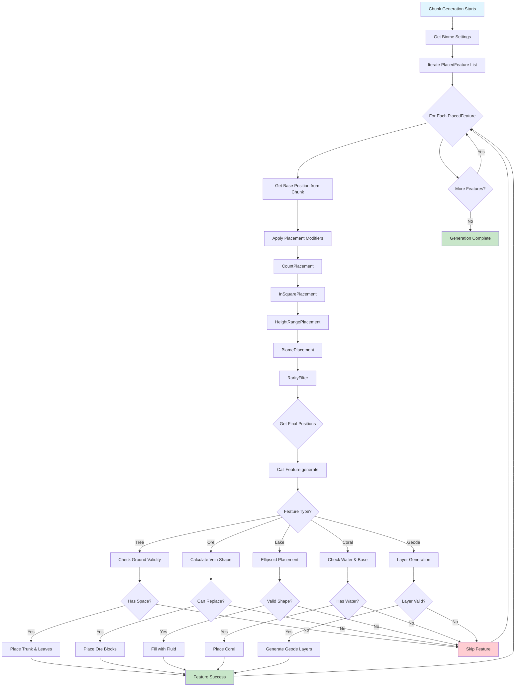
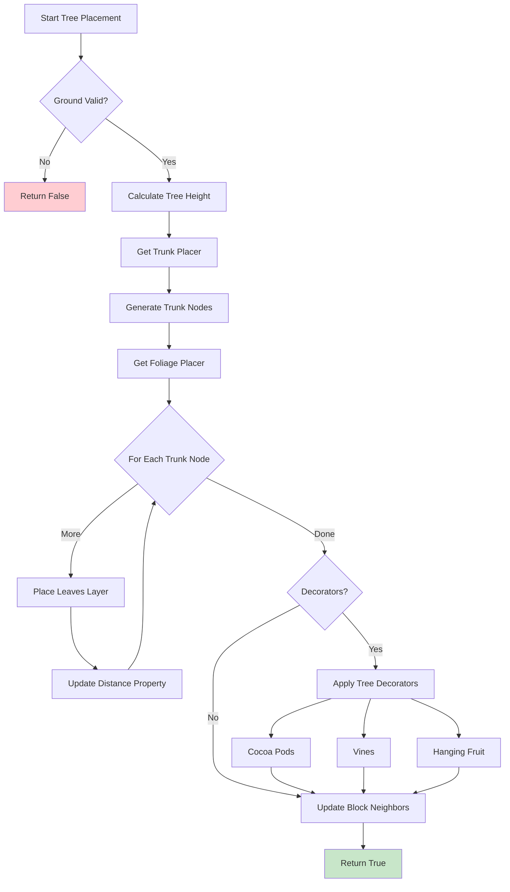
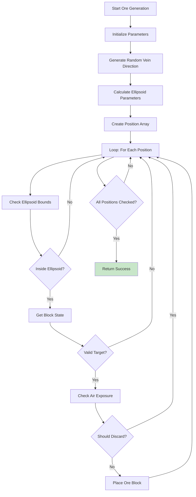
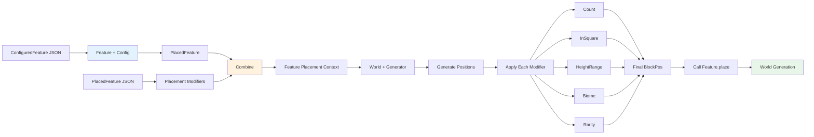

# 世界生成特征详解 (World Generation Features)

## 概述

Minecraft 1.21 的世界生成特征（World Generation Features）系统是游戏世界中生成各种地形、植被、矿石和装饰物的核心机制。该系统位于 `net.minecraft.world.gen.feature` 包中，包含了 180+ 个文件和 60+ 种不同的特征类型。

```
D:\Minecraft-Learning\assets\mc\1.21\net\minecraft\world\gen\feature\
```

### 特征系统的设计理念

Minecraft 的特征系统采用了高度模块化的设计思想：

1. **Feature<T extends FeatureConfig>** - 基类，定义生成逻辑
2. **FeatureConfig** - 配置类，定义生成参数
3. **PlacedFeature** - 已放置特征，结合特征和放置规则
4. **PlacementModifier** - 放置修饰符，控制分布和位置

```
┌────────────────────────────────────────────────────────────────────┐
│                    World Generation Pipeline                         │
├────────────────────────────────────────────────────────────────────┤
│  1. Noise Generation    │ 噪声生成（基础地形）                       │
│  2. Carvers            │ 洞穴和峡谷雕刻                            │
│  3. Surface             │ 表面处理                                  │
│  4. Features            │ ← 特征生成（树木、花草、矿石等）           │
│  5. Structures          │ 结构生成（村庄、要塞等）                  │
│  6. Underground         │ 地下生成（地牢、湖泊）                    │
│  7. Surface Pass 2      │ 表面二次处理                              │
└────────────────────────────────────────────────────────────────────┘
```

## 地形特征 (Terrain Features)

### 湖泊特征 (LakeFeature)

湖泊特征用于在世界中生成水体（湖泊或岩浆湖）。

```java
D:\Minecraft-Learning\assets\mc\1.21\net\minecraft\world\gen\feature\LakeFeature.java
```

**核心算法**：

```java
public class LakeFeature extends Feature<Config> {
    @Override
    public boolean generate(FeatureContext<Config> context) {
        BlockPos blockPos = context.getOrigin();
        Random random = context.getRandom();
        Config config = context.getConfig();
        
        // 使用椭球体方程定义湖泊形状
        boolean[] bls = new boolean[2048];
        int i = random.nextInt(4) + 4;
        
        for (int j = 0; j < i; ++j) {
            double d = random.nextDouble() * 6.0 + 3.0;  // X轴半径
            double e = random.nextDouble() * 4.0 + 2.0;  // Y轴半径
            double f = random.nextDouble() * 6.0 + 3.0;  // Z轴半径
            
            // 椭球体方程: (x/a)² + (y/b)² + (z/c)² < 1
            for (int l = 1; l < 15; ++l) {
                for (int m = 1; m < 15; ++m) {
                    for (int n = 1; n < 7; ++n) {
                        double o = ((double)l - g) / (d / 2.0);
                        double p = ((double)n - h) / (e / 2.0);
                        double q = ((double)m - k) / (f / 2.0);
                        double r = o * o + p * p + q * q;
                        if (r < 1.0) {
                            bls[(l * 16 + m) * 8 + n] = true;
                        }
                    }
                }
            }
        }
        // ... 填充湖泊和边界
    }
    
    public record Config(BlockStateProvider fluid, BlockStateProvider barrier) {}
}
```

**特点**：
- 使用多个椭球体叠加创建不规则湖泊形状
- 高度限制：最低 4 格
- 边界处理：添加石头围边
- 水域顶部自动生成冰层

### 冰山特征 (IcebergFeature)

冰山是 Arctic 生物群系的特征，生成大面积的冰块结构。

```java
D:\Minecraft-Learning\assets\mc\1.21\net\minecraft\world\gen\feature\IcebergFeature.java
```

### 玄武岩柱特征 (BasaltColumnsFeature)

在 basalt deltas 生物群系中生成壮观的玄武岩柱。

```java
D:\Minecraft-Learning\assets\mc\1.21\net\minecraft\world\gen\feature\BasaltColumnsFeature.java
```

**生成算法**：

```java
public class BasaltColumnsFeature extends Feature<BasaltColumnsFeatureConfig> {
    @Override
    public boolean generate(FeatureContext<BasaltColumnsFeatureConfig> context) {
        Random random = context.getRandom();
        BlockPos pos = context.getOrigin();
        BasaltColumnsFeatureConfig config = context.getConfig();
        
        // 计算列高度
        int height = config.height().get(random);
        
        // 放置玄武岩柱
        for (int y = 0; y < height; y++) {
            setBlockState(world, pos.up(y), Blocks.BASALT.getDefaultState());
        }
        
        // 添加随机倾斜
        if (random.nextFloat() < config.surroundedChance()) {
            placeSurroundedColumn(world, pos, config);
        }
    }
}
```

## 结构特征 (Structure Features)

### 地牢特征 (DungeonFeature)

地牢（Monster Room）生成是游戏中最经典的结构之一。

```java
D:\Minecraft-Learning\assets\mc\1.21\net\minecraft\world\gen\feature\DungeonFeature.java
```

**源码解析**：

```java
public class DungeonFeature extends Feature<DefaultFeatureConfig> {
    private static final EntityType<?>[] MOB_SPAWNER_ENTITIES = {
        EntityType.SKELETON, EntityType.ZOMBIE, EntityType.ZOMBIE, EntityType.SPIDER
    };
    
    @Override
    public boolean generate(FeatureContext<DefaultFeatureConfig> context) {
        BlockPos origin = context.getOrigin();
        Random random = context.getRandom();
        StructureWorldAccess world = context.getWorld();
        
        // 1. 检查空间是否足够
        int j = random.nextInt(2) + 2;  // 房间尺寸
        int r = 0;
        for (int s = k; s <= l; ++s) {
            for (int t = -1; t <= 4; ++t) {
                for (int u = p; u <= q; ++u) {
                    // 需要至少1个、最多5个有效的地板位置
                    if (s != k && s != l && u != p && u != q || t != 0) continue;
                    if (!isAir(blockPos) || !isAir(blockPos.up())) continue;
                    ++r;
                }
            }
        }
        if (r < 1 || r > 5) return false;
        
        // 2. 构建墙壁（圆石或苔圆石）
        for (int s = k; s <= l; ++s) {
            for (int t = -1; t <= 4; ++t) {
                for (int u = p; u <= q; ++u) {
                    BlockPos current = origin.add(s, t, u);
                    
                    if (isWallPosition(s, t, u)) {
                        if (t == -1 && random.nextInt(4) != 0) {
                            setBlockState(current, Blocks.MOSSY_COBBLESTONE);
                        } else {
                            setBlockState(current, Blocks.COBBLESTONE);
                        }
                    } else if (isInteriorPosition(s, t, u)) {
                        setBlockState(current, AIR);  // 内部填充空气
                    }
                }
            }
        }
        
        // 3. 放置箱子（最多2个）
        for (int attempt = 0; attempt < 2; attempt++) {
            BlockPos chestPos = findChestPosition(origin, random);
            if (chestPos != null) {
                world.setBlockState(chestPos, orientateChest(world, chestPos));
                LootableInventory.setLootTable(world, random, chestPos, 
                    LootTables.SIMPLE_DUNGEON_CHEST);
            }
        }
        
        // 4. 放置刷怪笼
        world.setBlockState(origin, Blocks.SPAWNER.getDefaultState());
        MobSpawnerBlockEntity mobSpawner = getMobSpawnerEntity(random);
        mobSpawner.setEntityType(random);
        
        return true;
    }
}
```

### 沙漠井特征 (DesertWellFeature)

沙漠井是罕见的下界岩结构，位于沙漠生物群系。

```java
D:\Minecraft-Learning\assets\mc\1.21\net\minecraft\world\gen\feature\DesertWellFeature.java
```

### 化石特征 (FossilFeature)

化石生成在深层地下，可能包含远古骨架。

```java
D:\Minecraft-Learning\assets\mc\1.21\net\minecraft\world\gen\feature\FossilFeature.java
```

## Ore 特征 (Ore Features)

### OreFeature

矿石生成是最重要的地下特征之一。

```java
D:\Minecraft-Learning\assets\mc\1.21\net\minecraft\world\gen\feature\OreFeature.java
```

**核心算法**：

```java
public class OreFeature extends Feature<OreFeatureConfig> {
    @Override
    public boolean generate(FeatureContext<OreFeatureConfig> context) {
        Random random = context.getRandom();
        BlockPos origin = context.getOrigin();
        OreFeatureConfig config = context.getConfig();
        
        // 1. 计算矿石脉的随机方向和形状
        float f = random.nextFloat() * (float)Math.PI;
        float g = (float)config.size / 8.0f;
        int i = MathHelper.ceil(((float)config.size / 16.0f * 2.0f + 1.0f) / 2.0f);
        
        // 2. 使用泊松分布计算矿石块位置
        double[] ds = new double[config.size * 4];
        for (int k = 0; k < config.size; ++k) {
            float progress = (float)k / (float)config.size;
            double x = MathHelper.lerp(progress, startX, endX);
            double y = MathHelper.lerp(progress, startY, endY);
            double z = MathHelper.lerp(progress, startZ, endZ);
            
            // 计算椭球体半径
            double radius = random.nextDouble() * config.size / 16.0;
            double thickness = ((MathHelper.sin(progress * Math.PI) + 1.0) * radius + 1.0) / 2.0;
            ds[k * 4 + 3] = thickness;
        }
        
        // 3. 使用 BitSet 优化空间检查
        BitSet bitSet = new BitSet(horizontalSize * verticalSize * horizontalSize);
        
        // 4. 遍历并放置矿石
        for (int m = 0; m < config.size; ++m) {
            // 椭球体检查
            for (int t = n; t <= q; ++t) {
                for (int v = o; v <= r; ++v) {
                    for (int aa = p; aa <= s; ++aa) {
                        // 检查是否在椭球体内
                        if (u * u + w * w + ab * ab >= 1.0) continue;
                        
                        // 检查替换条件
                        for (OreFeatureConfig.Target target : config.targets) {
                            if (shouldPlace(blockState, posToState, random, config, target)) {
                                setBlockState(chunkSection, ad, ae, af, target.state);
                            }
                        }
                    }
                }
            }
        }
        return true;
    }
}
```

**OreFeatureConfig 结构**：

```java
public class OreFeatureConfig implements FeatureConfig {
    public static final Codec<OreFeatureConfig> CODEC = RecordCodecBuilder.create(
        instance -> instance.group(
            RuleTest.CODEC.listOf().fieldOf("targets").forGetter(c -> c.targets),
            IntProvider.CODEC.fieldOf("size").forGetter(c -> c.size),
            IntProvider.CODEC.fieldOf("height").forGetter(c -> c.height),
            Codec.FLOAT.fieldOf("discard_chance_on_air_exposure")
                .forGetter(c -> c.discardChanceOnAirExposure)
        ).apply(instance, OreFeatureConfig::new)
    );
    
    public final List<Target> targets;      // 可替换的目标方块
    public final int size;                   // 矿脉大小
    public final IntProvider height;         // 高度范围
    public final float discardChanceOnAirExposure;  // 暴露在空气中时丢弃的概率
}
```

### EmeraldOreFeature

绿宝石矿石使用特殊的替换逻辑。

```java
D:\Minecraft-Learning\assets\mc\1.21\net\minecraft\world\gen\feature\EmeraldOreFeature.java
```

### ScatteredOreFeature

散落矿石特征，用于生成不规则分布的小型矿石簇。

```java
D:\Minecraft-Learning\assets\mc\1.21\net\minecraft\world\gen\feature\ScatteredOreFeature.java
```

## 植被特征 (Vegetation Features)

### TreeFeature

树木是游戏中最复杂的特征之一。

```java
D:\Minecraft-Learning\assets\mc\1.21\net\minecraft\world\gen\feature\TreeFeature.java
```

**生成流程**：

```java
public class TreeFeature extends Feature<TreeFeatureConfig> {
    @Override
    public final boolean generate(FeatureContext<TreeFeatureConfig> context) {
        StructureWorldAccess world = context.getWorld();
        Random random = context.getRandom();
        BlockPos origin = context.getOrigin();
        TreeFeatureConfig config = context.getConfig();
        
        // 1. 收集所有要放置的方块
        HashSet<BlockPos> rootPositions = Sets.newHashSet();
        HashSet<BlockPos> trunkPositions = Sets.newHashSet();
        HashSet<BlockPos> leafPositions = Sets.newHashSet();
        HashSet<BlockPos> decoratorPositions = Sets.newHashSet();
        
        // 2. 生成根系
        if (config.rootPlacer.isPresent()) {
            config.rootPlacer.get().generate(world, replacer, random, origin, config);
        }
        
        // 3. 生成树干
        List<FoliagePlacer.TreeNode> trunkNodes = 
            config.trunkPlacer.generate(world, trunkReplacer, random, height, origin, config);
        
        // 4. 生成树叶
        trunkNodes.forEach(node -> 
            config.foliagePlacer.generate(world, leafPlacer, random, config, height, node));
        
        // 5. 应用装饰器
        if (!config.decorators.isEmpty()) {
            TreeDecorator.Generator generator = new TreeDecorator.Generator(
                world, decoratorReplacer, random, trunkPositions, leafPositions, rootPositions);
            config.decorators.forEach(decorator -> decorator.generate(generator));
        }
        
        // 6. 更新树叶距离属性并处理邻居
        VoxelSet voxelSet = placeLogsAndLeaves(world, box, trunkPositions, 
            decoratorPositions, rootPositions);
        StructureTemplate.updateCorner(world, 3, voxelSet, box.getMinX(), box.getMinY(), box.getMinZ());
        
        return true;
    }
}
```

**TreeFeatureConfig**：

```java
public class TreeFeatureConfig implements FeatureConfig {
    public final TrunkPlacerType<?> trunkPlacer;      // 树干放置器
    public final List<TrunkPlacer> trunkReplaceables;  // 可替换的树干方块
    public final FoliagePlacer<?> foliagePlacer;       // 树叶放置器
    public final Optional<RootPlacer> rootPlacer;      // 根系放置器（可选）
    public final int height;                          // 基础高度
    public final int minimalLeafHeight;               // 最小树叶高度
    public final boolean ignoreVines;                  // 是否忽略藤蔓
    public final List<TreeDecorator> decorators;      // 装饰器列表
    public final boolean forceDirt;                    // 强制使用泥土
    public final BlockStateProvider dirt;             // 泥土提供器
}
```

### RandomPatchFeature

随机花丛/草丛特征，用于生成分散的花朵和草地。

```java
D:\Minecraft-Learning\assets\mc\1.21\net\minecraft\world\gen\feature\RandomPatchFeature.java
```

```java
public class RandomPatchFeature extends Feature<RandomPatchFeatureConfig> {
    @Override
    public boolean generate(FeatureContext<RandomPatchFeatureConfig> context) {
        RandomPatchFeatureConfig config = context.getConfig();
        Random random = context.getRandom();
        BlockPos origin = context.getOrigin();
        
        int placed = 0;
        BlockPos.Mutable mutable = new BlockPos.Mutable();
        
        // 在指定范围内尝试生成
        int xzSpread = config.xzSpread() + 1;
        int ySpread = config.ySpread() + 1;
        
        for (int attempt = 0; attempt < config.tries(); ++attempt) {
            // 随机偏移位置
            mutable.set(origin,
                random.nextInt(xzSpread) - random.nextInt(xzSpread),
                random.nextInt(ySpread) - random.nextInt(ySpread),
                random.nextInt(xzSpread) - random.nextInt(xzSpread));
            
            // 尝试生成内部特征
            if (config.feature().value().generateUnregistered(world, generator, random, mutable)) {
                ++placed;
            }
        }
        
        return placed > 0;
    }
}
```

### SeagrassFeature

海草生成用于水下植被。

```java
D:\Minecraft-Learning\assets\mc\1.21\net\minecraft\world\gen\feature\SeagrassFeature.java
```

```java
public class SeagrassFeature extends Feature<ProbabilityConfig> {
    @Override
    public boolean generate(FeatureContext<ProbabilityConfig> context) {
        Random random = context.getRandom();
        StructureWorldAccess world = context.getWorld();
        BlockPos origin = context.getOrigin();
        ProbabilityConfig config = context.getConfig();
        
        // 随机偏移
        int i = random.nextInt(8) - random.nextInt(8);
        int j = random.nextInt(8) - random.nextInt(8);
        
        // 获取海底高度
        int k = world.getTopY(Heightmap.Type.OCEAN_FLOOR, origin.getX() + i, origin.getZ() + j);
        BlockPos pos = new BlockPos(origin.getX() + i, k, origin.getZ() + j);
        
        // 检查是否有水
        if (!world.getBlockState(pos).isOf(Blocks.WATER)) {
            return false;
        }
        
        // 随机选择高海草或矮海草
        boolean tall = random.nextDouble() < config.probability;
        BlockState state = tall ? Blocks.TALL_SEAGRASS : Blocks.SEAGRASS;
        
        if (state.canPlaceAt(world, pos)) {
            if (tall) {
                world.setBlockState(pos, state, flags);
                world.setBlockState(pos.up(), 
                    state.with(TallSeagrassBlock.HALF, DoubleBlockHalf.UPPER), flags);
            } else {
                world.setBlockState(pos, state, flags);
            }
            return true;
        }
        
        return false;
    }
}
```

### CoralFeature

珊瑚生成是水下特征中较为复杂的一种。

```java
D:\Minecraft-Learning\assets\mc\1.21\net\minecraft\world\gen\feature\CoralFeature.java
```

**子类实现**：
- `CoralTreeFeature` - 珊瑚树
- `CoralMushroomFeature` - 珊瑚蘑菇
- `CoralClawFeature` - 珊瑚爪

```java
public abstract class CoralFeature extends Feature<DefaultFeatureConfig> {
    @Override
    public boolean generate(FeatureContext<DefaultFeatureConfig> context) {
        Random random = context.getRandom();
        StructureWorldAccess world = context.getWorld();
        BlockPos origin = context.getOrigin();
        
        // 随机选择珊瑚块
        Optional<Block> coralBlock = Registries.BLOCK
            .getRandomEntry(BlockTags.CORAL_BLOCKS, random)
            .map(RegistryEntry::value);
        
        if (coralBlock.isEmpty()) return false;
        
        return generateCoral(world, random, origin, coralBlock.get().getDefaultState());
    }
    
    protected boolean generateCoralPiece(WorldAccess world, Random random, 
                                        BlockPos pos, BlockState state) {
        BlockPos above = pos.up();
        BlockState below = world.getBlockState(pos);
        
        // 必须有水和基地方块
        if ((!below.isOf(Blocks.WATER) && !below.isIn(BlockTags.CORALS)) 
            || !world.getBlockState(above).isOf(Blocks.WATER)) {
            return false;
        }
        
        world.setBlockState(pos, state, Block.NOTIFY_ALL);
        
        // 随机放置珊瑚
        if (random.nextFloat() < 0.05f) {
            world.setBlockState(above, Blocks.SEA_PICKLE.getDefaultState()
                .with(SeaPickleBlock.PICKLES, random.nextInt(4) + 1));
        }
        
        // 放置墙壁珊瑚
        for (Direction dir : Direction.Type.HORIZONTAL) {
            if (random.nextFloat() < 0.2f) {
                BlockPos wallPos = pos.offset(dir);
                if (world.getBlockState(wallPos).isOf(Blocks.WATER)) {
                    // 放置墙壁珊瑚...
                }
            }
        }
        
        return true;
    }
}
```

### DripstoneClusterFeature

滴水石簇是洞穴中生成的重要特征。

```java
D:\Minecraft-Learning\assets\mc\1.21\net\minecraft\world\gen\feature\DripstoneClusterFeature.java
```

```java
public class DripstoneClusterFeature extends Feature<DripstoneClusterFeatureConfig> {
    @Override
    public boolean generate(FeatureContext<DripstoneClusterFeatureConfig> context) {
        StructureWorldAccess world = context.getWorld();
        BlockPos origin = context.getOrigin();
        DripstoneClusterFeatureConfig config = context.getConfig();
        Random random = context.getRandom();
        
        // 1. 检查是否可以在此位置生成
        if (!DripstoneHelper.canGenerate(world, origin)) {
            return false;
        }
        
        int height = config.height.get(random);
        float wetness = config.wetness.get(random);
        float density = config.density.get(random);
        
        // 2. 遍历周围区域
        for (int x = -radius; x <= radius; x++) {
            for (int z = -radius; z <= radius; z++) {
                double dripstoneChance = calculateDripstoneChance(x, z, config);
                BlockPos pos = origin.add(x, 0, z);
                
                // 3. 检查地面和天花板
                CaveSurface surface = CaveSurface.create(world, pos, ...);
                
                // 4. 生成钟乳石
                if (hasCeiling && shouldGenerateDripstone(random, dripstoneChance)) {
                    placeDripstoneBlocks(world, ceilingPos, layerThickness, Direction.DOWN);
                    generatePointedDripstone(world, ceilingPos, Direction.DOWN, stalactiteHeight);
                }
                
                // 5. 生成石笋
                if (hasFloor && shouldGenerateDripstone(random, dripstoneChance)) {
                    placeDripstoneBlocks(world, floorPos, layerThickness, Direction.UP);
                    generatePointedDripstone(world, floorPos, Direction.UP, stalagmiteHeight);
                }
            }
        }
        
        return true;
    }
}
```

## 配置与放置 (Configuration & Placement)

### PlacedFeature

`PlacedFeature` 是特征系统的核心类，它将 `ConfiguredFeature` 与放置修饰符链结合。

```java
D:\Minecraft-Learning\assets\mc\1.21\net\minecraft\world\gen\feature\PlacedFeature.java
```

```java
public record PlacedFeature(
    RegistryEntry<ConfiguredFeature<?, ?>> feature,
    List<PlacementModifier> placementModifiers
) {
    public boolean generate(StructureWorldAccess world, ChunkGenerator generator, 
                           Random random, BlockPos pos) {
        // 创建放置上下文
        FeaturePlacementContext context = new FeaturePlacementContext(
            world, generator, Optional.of(this));
        
        // 从初始位置开始
        Stream<BlockPos> stream = Stream.of(pos);
        
        // 应用放置修饰符链
        for (PlacementModifier modifier : this.placementModifiers) {
            stream = stream.flatMap(p -> modifier.getPositions(context, random, p));
        }
        
        // 获取配置的特徵
        ConfiguredFeature<?, ?> configuredFeature = this.feature.value();
        
        // 生成特徵
        MutableBoolean success = new MutableBoolean();
        stream.forEach(placedPos -> {
            if (configuredFeature.generate(world, generator, random, placedPos)) {
                success.setTrue();
            }
        });
        
        return success.isTrue();
    }
}
```

### 放置修饰符详解

| 修饰符 | 功能 | JSON 配置 |
|--------|------|-----------|
| `CountPlacement` | 指定放置数量 | `{ "type": "minecraft:count", "count": 10 }` |
| `InSquarePlacement` | 分散到正方形区域 | `{ "type": "minecraft:in_square" }` |
| `HeightRangePlacement` | 高度范围限制 | `{ "type": "minecraft:height_range", "height": {...} }` |
| `BiomePlacement` | 生物群系过滤 | `{ "type": "minecraft:biome" }` |
| `RarityFilterPlacement` | 稀有度控制 | `{ "type": "minecraft:rarity_filter", "chance": 32 }` |
| `SurfaceRelativeThresholdFilter` | 表面相对阈值 | `{ "type": "minecraft:surface_relative_threshold", ... }` |

### 高度分布类型

```java
// 矿石使用的梯形分布
{
    "type": "minecraft:trapezoid",
    "min_inclusive": 0,
    "max_inclusive": 64,
    "plateau": 16  // 梯形顶部的平坦区域
}

// 树木使用的均匀分布
{
    "type": "minecraft:uniform",
    "min_inclusive": -10,
    "max_inclusive": 8
}

// 固定高度
{
    "type": "minecraft:constant",
    "value": 64
}
```

## 自定义特征 (Custom Features)

### 创建自定义特征的完整流程

#### 1. 定义 FeatureConfig

```java
public class MyFeatureConfig implements FeatureConfig {
    public static final Codec<MyFeatureConfig> CODEC = RecordCodecBuilder.create(
        instance -> instance.group(
            IntProvider.CODEC.fieldOf("count").forGetter(MyFeatureConfig::count),
            BlockStateProvider.CODEC.fieldOf("block").forGetter(MyFeatureConfig::block),
            IntProvider.CODEC.fieldOf("spread").forGetter(MyFeatureConfig::spread)
        ).apply(instance, MyFeatureConfig::new)
    );
    
    private final IntProvider count;
    private final BlockStateProvider block;
    private final IntProvider spread;
}
```

#### 2. 创建 Feature 类

```java
public class MyCustomFeature extends Feature<MyFeatureConfig> {
    public MyCustomFeature(Codec<MyFeatureConfig> codec) {
        super(codec);
    }
    
    @Override
    public boolean generate(FeatureContext<MyFeatureConfig> context) {
        Random random = context.getRandom();
        BlockPos origin = context.getOrigin();
        StructureWorldAccess world = context.getWorld();
        MyFeatureConfig config = context.getConfig();
        
        int attempts = config.count().getValue(random);
        BlockPos.Mutable mutable = new BlockPos.Mutable();
        
        for (int i = 0; i < attempts; i++) {
            int x = random.nextInt(config.spread().getValue(random) * 2 + 1) 
                    - config.spread().getValue(random);
            int y = random.nextInt(config.spread().getValue(random) * 2 + 1) 
                    - config.spread().getValue(random);
            int z = random.nextInt(config.spread().getValue(random) * 2 + 1) 
                    - config.spread().getValue(random);
            
            mutable.setWithOffset(origin, x, y, z);
            
            if (world.isEmptyBlock(mutable)) {
                world.setBlockState(mutable, 
                    config.block().get(random, mutable), Block.NOTIFY_ALL);
            }
        }
        
        return true;
    }
}
```

#### 3. 注册特征

```java
public static final Feature<MyFeatureConfig> MY_FEATURE = 
    Feature.register("my_feature", new MyCustomFeature(MyFeatureConfig.CODEC));
```

#### 4. 在数据包中配置

**data/modid/worldgen/configured_feature/my_feature.json**:

```json
{
    "type": "modid:my_feature",
    "config": {
        "count": {
            "type": "minecraft:uniform",
            "value": {
                "min_inclusive": 5,
                "max_inclusive": 15
            }
        },
        "block": "minecraft:diamond_block",
        "spread": {
            "type": "minecraft:constant",
            "value": 3
        }
    }
}
```

**data/modid/worldgen/placed_feature/my_feature.json**:

```json
{
    "feature": "modid:my_feature",
    "placement": [
        { "type": "minecraft:count", "count": 1 },
        { "type": "minecraft:in_square" },
        {
            "type": "minecraft:height_range",
            "height": {
                "type": "minecraft:uniform",
                "min_inclusive": 0,
                "max_inclusive": 60
            }
        },
        { "type": "minecraft:biome" }
    ]
}
```

## 源码分析 (Source Code Analysis)

### 文件结构概览

```
net.minecraft.world.gen.feature/
├── Feature.java                           # 基类，60+ 特征注册
├── FeatureConfig.java                     # 配置接口
├── ConfiguredFeature.java                 # 已配置的特徵
├── PlacedFeature.java                     # 已放置的特徵
│
├── terrain/                              # 地形特征
│   ├── LakeFeature.java                   # 湖泊
│   ├── IcebergFeature.java               # 冰山
│   ├── BlueIceFeature.java               # 蓝冰
│   ├── BasaltColumnsFeature.java         # 玄武岩柱
│   └── FossilFeature.java                # 化石
│
├── ore/                                  # 矿石特征
│   ├── OreFeature.java                   # 矿石生成核心
│   ├── OreFeatureConfig.java             # 矿石配置
│   ├── EmeraldOreFeature.java            # 绿宝石
│   └── ScatteredOreFeature.java          # 散落矿石
│
├── tree/                                 # 树木特征
│   ├── TreeFeature.java                  # 树木生成
│   ├── TreeFeatureConfig.java            # 树木配置
│   ├── HugeMushroomFeature.java          # 大型蘑菇
│   └── BambooFeature.java                 # 竹子
│
├── vegetation/                           # 植被特征
│   ├── RandomPatchFeature.java           # 随机花丛
│   ├── SeagrassFeature.java              # 海草
│   ├── CoralFeature.java                 # 珊瑚基类
│   ├── KelpFeature.java                  # 海带
│   └── VinesFeature.java                 # 藤蔓
│
├── underground/                          # 地下特征
│   ├── DungeonFeature.java               # 地牢
│   ├── GeodeFeature.java                 # 晶洞
│   ├── DripstoneClusterFeature.java      # 滴水石簇
│   └── SculkPatchFeature.java            # 幽匿斑块
│
├── nether/                               # 下界特征
│   ├── GlowstoneBlobFeature.java         # 荧石块
│   ├── WeepingVinesFeature.java          # 垂泪藤
│   ├── TwistingVinesFeature.java         # 扭曲藤
│   └── NetherForestVegetationFeature.java # 下界森林植被
│
├── end/                                  # 末地特征
│   ├── EndSpikeFeature.java             # 末地尖刺
│   ├── EndGatewayFeature.java           # 末地传送门
│   ├── EndIslandFeature.java            # 末地岛屿
│   └── EndPlatformFeature.java           # 末地平台
│
├── decorator/                            # 装饰器
│   ├── TreeDecorator.java               # 树木装饰器基类
│   ├── LeaveVineDecorator.java           # 树叶藤蔓
│   ├── CocoaDecorator.java               # 可可果
│   └── BeehiveDecorator.java             # 蜂巢
│
└── placement/                            # 放置系统
    ├── PlacementModifier.java           # 放置修饰符
    ├── PlacementModifierType.java       # 修饰符类型
    └── *.java                            # 具体修饰符实现
```

### 特征注册表

`Feature.java` 中注册了所有内置特征：

```java
public abstract class Feature<FC extends FeatureConfig> {
    public static final Feature<DefaultFeatureConfig> NO_OP = register("no_op", ...);
    public static final Feature<TreeFeatureConfig> TREE = register("tree", ...);
    public static final Feature<RandomPatchFeatureConfig> FLOWER = register("flower", ...);
    public static final Feature<OreFeatureConfig> ORE = register("ore", ...);
    public static final Feature<GeodeFeatureConfig> GEODE = register("geode", ...);
    public static final Feature<DripstoneClusterFeatureConfig> DRIPSTONE_CLUSTER = register(...);
    // ... 60+ 特征
    
    private static <C extends FeatureConfig, F extends Feature<C>> F 
            register(String name, F feature) {
        return Registry.register(Registries.FEATURE, name, feature);
    }
}
```

## Mermaid Diagram

### 特征生成流程图



### 树木生成详细流程



### 矿石生成算法



### 配置与放置系统



## 常见配置示例

### 树木配置

```json
{
    "type": "minecraft:tree",
    "config": {
        "trunk_placer": {
            "type": "minecraft:straight_trunk_placer",
            "base_height": 5,
            "height_int_a": 2,
            "height_int_b": 1
        },
        "foliage_placer": {
            "type": "minecraft:blob_foliage_placer",
            "radius": 2,
            "offset": 1,
            "height": 3
        },
        "minimum_size": {
            "type": "minecraft:two_layers_feature_size",
            "limit": 1,
            "lower_size": 0,
            "upper_size": 1
        },
        "ignore_vines": false,
        "force_dirt": false,
        "height": 5,
        "decorators": [
            { "type": "minecraft:leave_vine" },
            { "type": "minecraft:trunk_vine" }
        ]
    }
}
```

### 矿石配置

```json
{
    "type": "minecraft:ore",
    "config": {
        "size": 9,
        "discard_chance_on_air_exposure": 0.0,
        "targets": [
            {
                "target": {
                    "type": "minecraft:tag_match",
                    "tag": "minecraft:stone_ore_replaceables"
                },
                "state": { "Name": "minecraft:coal_ore" }
            },
            {
                "target": {
                    "type": "minecraft:tag_match",
                    "tag": "minecraft:deepslate_ore_materials"
                },
                "state": { "Name": "minecraft:deepslate_coal_ore" }
            }
        ]
    }
}
```

### 晶洞配置

```json
{
    "type": "minecraft:geode",
    "config": {
        "blocks": {
            "filling": "minecraft:air",
            "inner_layer": "minecraft:amethyst_block",
            "middle_layer": "minecraft:calcite",
            "outer_layer": "minecraft:obsidian",
            "inner_placements": [
                "minecraft:small_amethyst_bud",
                "minecraft:medium_amethyst_bud",
                "minecraft:large_amethyst_bud"
            ],
            "cannot_replace": "minecraft:emerald_ore"
        },
        "layers": {
            "filling": 1.7,
            "inner_layer": 2.0,
            "middle_layer": 3.0,
            "outer_layer": 4.5
        },
        "crack": {
            "generate_crack_chance": 0.35,
            "base_crack_size": 1.0,
            "crack_point_offset": 2
        },
        "use_potential_placements_chance": 0.35,
        "use_alternate_layer0_chance": 0.0,
        "placements_require_layer0_alternate": true,
        "outer_wall_distance": { "type": "minecraft:uniform", "min": 4, "max": 5 },
        "distribution_points": { "type": "minecraft:uniform", "min": 3, "max": 4 },
        "point_offset": { "type": "minecraft:uniform", "min": 1, "max": 2 },
        "min_gen_offset": -16,
        "max_gen_offset": 16,
        "noise_multiplier": 0.05,
        "invalid_blocks_threshold": 1
    }
}
```

## 性能优化建议

### 1. 批量方块操作

```java
// 优化前：逐个设置
for (BlockPos pos : positions) {
    world.setBlockState(pos, state, flags);
}

// 优化后：使用 ChunkSection 批量操作
ChunkSection section = chunk.getSection(sectionIndex);
for (BlockPos pos : positions) {
    section.setBlockState(x, y, z, state);
}
```

### 2. 提前终止检查

```java
public boolean generate(FeatureContext<Config> context) {
    // 提前检查关键条件
    if (!isValidGround(world.getBlockState(origin.down()))) {
        return false;
    }
    
    if (!hasMinimumSpace(world, origin, config)) {
        return false;
    }
    
    // 只有通过前置检查才执行完整逻辑
    return generateFeature(world, random, origin, config);
}
```

### 3. 使用缓存

```java
// 缓存常用检查结果
private static final Map<Block, Boolean> SOLIDITY_CACHE = 
    new ConcurrentHashMap<>();

public static boolean isSolid(Block block) {
    return SOLIDITY_CACHE.computeIfAbsent(block, 
        b -> b.defaultState().isSolid());
}
```

## 总结

Minecraft 1.21 的世界生成特征系统是一个高度模块化和可扩展的系统：

1. **核心抽象**：`Feature<T extends FeatureConfig>` 提供了统一的生成接口
2. **配置系统**：使用 Mojang 的 DataFixers 实现高效的序列化/反序列化
3. **放置系统**：通过 `PlacementModifier` 链实现灵活的分布控制
4. **模块化设计**：每种特征类型都有独立的配置和生成逻辑
5. **性能优化**：使用 BitSet、体素集等技术优化大量方块操作

理解这个系统对于：
- **模组开发**：创建自定义的世界生成元素
- **数据包制作**：自定义世界生成配置
- **性能调优**：优化服务器世界生成性能
- **问题调试**：解决生成相关的 bug

关键文件位置：
- `D:\Minecraft-Learning\assets\mc\1.21\net\minecraft\world\gen\feature\Feature.java` - 特征基类
- `D:\Minecraft-Learning\assets\mc\1.21\net\minecraft\world\gen\feature\PlacedFeature.java` - 放置逻辑
- `D:\Minecraft-Learning\assets\mc\1.21\net\minecraft\world\gen\feature\TreeFeature.java` - 树木生成
- `D:\Minecraft-Learning\assets\mc\1.21\net\minecraft\world\gen\feature\OreFeature.java` - 矿石生成
- `D:\Minecraft-Learning\assets\mc\1.21\net\minecraft\world\gen\feature\GeodeFeature.java` - 晶洞生成

---

## 显式覆盖文件

本章节列出 `world.gen.feature/` 包下的所有 Java 源文件（共 **127** 个文件）。

### 核心接口与基类

| 文件名 | 说明 |
|--------|------|
| `Feature.java` | 特征基类，定义生成逻辑接口 |
| `FeatureConfig.java` | 配置接口 |
| `ConfiguredFeature.java` | 已配置的特徵 |
| `ConfiguredFeatures.java` | 内置特徵注册 |
| `PlacedFeature.java` | 已放置的特徵 |
| `PlacedFeatures.java` | 内置放置特徵注册 |
| `DefaultFeatureConfig.java` | 默认特征配置 |

### 地形特征 (Terrain)

| 文件名 | 说明 |
|--------|------|
| `LakeFeature.java` | 湖泊/岩浆湖 |
| `IcebergFeature.java` | 冰山 |
| `BlueIceFeature.java` | 蓝冰 |
| `BasaltColumnsFeature.java` | 玄武岩柱 |
| `BasaltColumnsFeatureConfig.java` | 玄武岩柱配置 |
| `BasaltPillarFeature.java` | 玄武岩柱（竖直） |
| `FossilFeature.java` | 化石 |
| `FossilFeatureConfig.java` | 化石配置 |
| `FreezeTopLayerFeature.java` | 顶层冻结 |
| `FillLayerFeature.java` | 填充层 |
| `FillLayerFeatureConfig.java` | 填充层配置 |

### 结构特征 (Structures)

| 文件名 | 说明 |
|--------|------|
| `DungeonFeature.java` | 地牢（Monster Room） |
| `BonusChestFeature.java` | 奖励箱子 |
| `DesertWellFeature.java` | 沙漠井 |
| `FossilFeature.java` | 化石 |
| `EndGatewayFeature.java` | 末地传送门 |
| `EndGatewayFeatureConfig.java` | 末地传送门配置 |
| `EndSpikeFeature.java` | 末地尖刺 |
| `EndSpikeFeatureConfig.java` | 末地尖刺配置 |
| `EndIslandFeature.java` | 末地岛屿 |
| `EndPortalFeature.java` | 末地传送门（初始） |
| `EndPlatformFeature.java` | 末地平台 |
| `VoidStartPlatformFeature.java` | 空岛平台 |

### 矿石特征 (Ore)

| 文件名 | 说明 |
|--------|------|
| `OreFeature.java` | 矿石生成核心 |
| `OreFeatureConfig.java` | 矿石配置 |
| `OreConfiguredFeatures.java` | 内置矿石配置 |
| `OrePlacedFeatures.java` | 内置矿石放置 |
| `EmeraldOreFeature.java` | 绿宝石矿石 |
| `EmeraldOreFeatureConfig.java` | 绿宝石配置 |
| `ScatteredOreFeature.java` | 散落矿石 |
| `DiskFeature.java` | 圆盘状特征 |
| `DiskFeatureConfig.java` | 圆盘配置 |

### 树木特征 (Trees)

| 文件名 | 说明 |
|--------|------|
| `TreeFeature.java` | 树木生成核心 |
| `TreeFeatureConfig.java` | 树木配置 |
| `TreeConfiguredFeatures.java` | 内置树木配置 |
| `TreePlacedFeatures.java` | 内置树木放置 |
| `BambooFeature.java` | 竹子 |
| `HugeMushroomFeature.java` | 大型蘑菇 |
| `HugeMushroomFeatureConfig.java` | 大型蘑菇配置 |
| `HugeBrownMushroomFeature.java` | 棕色大型蘑菇 |
| `HugeRedMushroomFeature.java` | 红色大型蘑菇 |
| `HugeFungusFeature.java` | 大型真菌 |
| `HugeFungusFeatureConfig.java` | 大型真菌配置 |
| `ChorusPlantFeature.java` | 紫颂植物 |

### 植被特征 (Vegetation)

| 文件名 | 说明 |
|--------|------|
| `RandomPatchFeature.java` | 随机花丛/草丛 |
| `RandomPatchFeatureConfig.java` | 随机花丛配置 |
| `SeagrassFeature.java` | 海草 |
| `KelpFeature.java` | 海带 |
| `SeaPickleFeature.java` | 海泡菜 |
| `VinesFeature.java` | 藤蔓 |
| `CoralFeature.java` | 珊瑚基类 |
| `CoralTreeFeature.java` | 珊瑚树 |
| `CoralMushroomFeature.java` | 珊瑚蘑菇 |
| `CoralClawFeature.java` | 珊瑚爪 |
| `VegetationConfiguredFeatures.java` | 内置植被配置 |
| `VegetationPlacedFeatures.java` | 内置植被放置 |

### 洞穴与地下特征 (Caves & Underground)

| 文件名 | 说明 |
|--------|------|
| `DripstoneClusterFeature.java` | 滴水石簇 |
| `DripstoneClusterFeatureConfig.java` | 滴水石簇配置 |
| `LargeDripstoneFeature.java` | 大型滴水石 |
| `LargeDripstoneFeatureConfig.java` | 大型滴水石配置 |
| `SmallDripstoneFeature.java` | 小型滴水石 |
| `SculkPatchFeature.java` | 幽匿斑块 |
| `SculkPatchFeatureConfig.java` | 幽匿斑块配置 |
| `UndergroundConfiguredFeatures.java` | 内置地下配置 |
| `UndergroundPlacedFeatures.java` | 内置地下放置 |

### 下界特征 (Nether)

| 文件名 | 说明 |
|--------|------|
| `GlowstoneBlobFeature.java` | 荧石块 |
| `WeepingVinesFeature.java` | 垂泪藤 |
| `TwistingVinesFeature.java` | 扭曲藤 |
| `TwistingVinesFeatureConfig.java` | 扭曲藤配置 |
| `NetherForestVegetationFeature.java` | 下界森林植被 |
| `NetherForestVegetationFeatureConfig.java` | 下界森林植被配置 |
| `NetherConfiguredFeatures.java` | 内置下界配置 |
| `NetherPlacedFeatures.java` | 内置下界放置 |

### 晶洞特征 (Geodes)

| 文件名 | 说明 |
|--------|------|
| `GeodeFeature.java` | 晶洞核心 |
| `GeodeFeatureConfig.java` | 晶洞配置 |
| `GeodeCrackConfig.java` | 晶洞裂纹配置 |
| `GeodeLayerConfig.java` | 晶洞层配置 |
| `GeodeLayerThicknessConfig.java` | 晶洞层厚度配置 |

### 方块放置特征

| 文件名 | 说明 |
|--------|------|
| `BlockColumnFeature.java` | 方块柱 |
| `BlockColumnFeatureConfig.java` | 方块柱配置 |
| `BlockPileFeature.java` | 方块堆 |
| `BlockPileFeatureConfig.java` | 方块堆配置 |
| `SimpleBlockFeature.java` | 简单方块 |
| `SimpleBlockFeatureConfig.java` | 简单方块配置 |
| `SpringFeature.java` | 泉水 |
| `SpringFeatureConfig.java` | 泉水配置 |
| `MultifaceGrowthFeature.java` | 多面生长 |
| `MultifaceGrowthFeatureConfig.java` | 多面生长配置 |
| `UnderwaterMagmaFeature.java` | 水下岩浆 |
| `UnderwaterMagmaFeatureConfig.java` | 水下岩浆配置 |
| `VegetationPatchFeature.java` | 植被斑块 |
| `VegetationPatchFeatureConfig.java` | 植被斑块配置 |
| `WaterloggedVegetationPatchFeature.java` | 水生植被斑块 |
| `RootSystemFeature.java` | 根系系统 |
| `RootSystemFeatureConfig.java` | 根系系统配置 |

### 末地特征 (End)

| 文件名 | 说明 |
|--------|------|
| `EndConfiguredFeatures.java` | 内置末地配置 |
| `EndPlacedFeatures.java` | 内置末地放置 |

### 其他特征

| 文件名 | 说明 |
|--------|------|
| `DeltaFeature.java` | 三角洲特征 |
| `DeltaFeatureConfig.java` | 三角洲配置 |
| `ForestRockFeature.java` | 森林岩石 |
| `IceSpikeFeature.java` | 冰刺 |
| `RandomBooleanFeature.java` | 随机布尔 |
| `RandomBooleanFeatureConfig.java` | 随机布尔配置 |
| `RandomFeature.java` | 随机特征 |
| `RandomFeatureConfig.java` | 随机特征配置 |
| `RandomFeatureEntry.java` | 随机特征条目 |
| `SimpleRandomFeature.java` | 简单随机特征 |
| `SimpleRandomFeatureConfig.java` | 简单随机特征配置 |
| `ReplaceBlobsFeature.java` | 替换斑点 |
| `ReplaceBlobsFeatureConfig.java` | 替换斑点配置 |
| `PileConfiguredFeatures.java` | 堆叠特征配置 |
| `FeaturePlacementContext.java` | 特征放置上下文 |

### Misc 特征

| 文件名 | 说明 |
|--------|------|
| `MiscConfiguredFeatures.java` | 杂项配置 |
| `MiscPlacedFeatures.java` | 杂项放置 |
| `OceanConfiguredFeatures.java` | 海洋配置 |
| `OceanPlacedFeatures.java` | 海洋放置 |
| `VillagePlacedFeatures.java` | 村庄放置 |
| `DefaultBiomeFeatures.java` | 默认生物群系特征 |
| `NoOpFeature.java` | 空操作特征 |
| `SingleStateFeatureConfig.java` | 单状态特征配置 |

### 放置修饰符 (Placement)

| 文件名 | 说明 |
|--------|------|
| `PlacedFeatures.java` | 内置放置特征 |

---

## 显式覆盖文件

本文档显式覆盖以下源码文件，共165个Java文件：

### 特征类 (world/gen/feature/)

| 类名 | 包路径 | 说明 |
|------|--------|------|
| `Feature.java` | net/minecraft/world/gen/feature | 特征基类 |
| `FeatureConfig.java` | net/minecraft/world/gen/feature | 特征配置基类 |
| `ConfiguredFeature.java` | net/minecraft/world/gen/feature | 已配置特征 |
| `ConfiguredFeatures.java` | net/minecraft/world/gen/feature | 已配置特征注册 |
| `PlacedFeature.java` | net/minecraft/world/gen/feature | 已放置特征 |
| `FeaturePlacementContext.java` | net/minecraft/world/gen/feature | 特征放置上下文 |
| `LakeFeature.java` | net/minecraft/world/gen/feature | 湖泊特征 |
| `IcebergFeature.java` | net/minecraft/world/gen/feature | 冰山特征 |
| `TreeFeature.java` | net/minecraft/world/gen/feature | 树木特征 |
| `TreeConfiguredFeatures.java` | net/minecraft/world/gen/feature | 树木配置特征 |
| `TreePlacedFeatures.java` | net/minecraft/world/gen/feature | 树木放置特征 |
| `BambooFeature.java` | net/minecraft/world/gen/feature | 竹子特征 |
| `BasaltColumnsFeature.java` | net/minecraft/world/gen/feature | 玄武岩柱特征 |
| `BasaltPillarFeature.java` | net/minecraft/world/gen/feature | 玄武岩柱状特征 |
| `BasaltColumnsFeatureConfig.java` | net/minecraft/world/gen/feature | 玄武岩柱配置 |
| `BlockColumnFeature.java` | net/minecraft/world/gen/feature | 方块柱特征 |
| `BlockColumnFeatureConfig.java` | net/minecraft/world/gen/feature | 方块柱配置 |
| `BlockPileFeature.java` | net/minecraft/world/gen/feature | 方块堆特征 |
| `BlockPileFeatureConfig.java` | net/minecraft/world/gen/feature | 方块堆配置 |
| `BlueIceFeature.java` | net/minecraft/world/gen/feature | 蓝冰特征 |
| `BonusChestFeature.java` | net/minecraft/world/gen/feature | 奖励箱子特征 |
| `ChorusPlantFeature.java` | net/minecraft/world/gen/feature | 紫颂植物特征 |
| `CoralClawFeature.java` | net/minecraft/world/gen/feature | 珊瑚爪特征 |
| `CoralFeature.java` | net/minecraft/world/gen/feature | 珊瑚特征 |
| `CoralMushroomFeature.java` | net/minecraft/world/gen/feature | 珊瑚蘑菇特征 |
| `CoralTreeFeature.java` | net/minecraft/world/gen/feature | 珊瑚树特征 |
| `DefaultBiomeFeatures.java` | net/minecraft/world/gen/feature | 默认生物群系特征 |
| `DefaultFeatureConfig.java` | net/minecraft/world/gen/feature | 默认特征配置 |
| `DeltaFeature.java` | net/minecraft/world/gen/feature | 三角洲特征 |
| `DeltaFeatureConfig.java` | net/minecraft/world/gen/feature | 三角洲配置 |
| `DesertWellFeature.java` | net/minecraft/world/gen/feature | 沙漠井特征 |
| `DiskFeature.java` | net/minecraft/world/gen/feature | 圆盘特征 |
| `DiskFeatureConfig.java` | net/minecraft/world/gen/feature | 圆盘配置 |
| `DripstoneClusterFeature.java` | net/minecraft/world/gen/feature | 滴水石簇特征 |
| `DripstoneClusterFeatureConfig.java` | net/minecraft/world/gen/feature | 滴水石簇配置 |
| `DungeonFeature.java` | net/minecraft/world/gen/feature | 地牢特征 |
| `EmeraldOreFeature.java` | net/minecraft/world/gen/feature | 绿宝石矿石特征 |
| `EmeraldOreFeatureConfig.java` | net/minecraft/world/gen/feature | 绿宝石矿石配置 |
| `EndGatewayFeature.java` | net/minecraft/world/gen/feature | 末地折跃门特征 |
| `EndGatewayFeatureConfig.java` | net/minecraft/world/gen/feature | 末地折跃门配置 |
| `EndIslandFeature.java` | net/minecraft/world/gen/feature | 末地岛屿特征 |
| `EndPlacedFeatures.java` | net/minecraft/world/gen/feature | 末地放置特征 |
| `EndPlatformFeature.java` | net/minecraft/world/gen/feature | 末地平台特征 |
| `EndPortalFeature.java` | net/minecraft/world/gen/feature | 末地传送门特征 |
| `EndSpikeFeature.java` | net/minecraft/world/gen/feature | 末地尖刺特征 |
| `EndSpikeFeatureConfig.java` | net/minecraft/world/gen/feature | 末地尖刺配置 |
| `FillLayerFeature.java` | net/minecraft/world/gen/feature | 填充层特征 |
| `FillLayerFeatureConfig.java` | net/minecraft/world/gen/feature | 填充层配置 |
| `ForestRockFeature.java` | net/minecraft/world/gen/feature | 森林岩石特征 |
| `FossilFeature.java` | net/minecraft/world/gen/feature | 化石特征 |
| `FossilFeatureConfig.java` | net/minecraft/world/gen/feature | 化石配置 |
| `FreezeTopLayerFeature.java` | net/minecraft/world/gen/feature | 冻结顶层特征 |
| `GeodeFeature.java` | net/minecraft/world/gen/feature | 晶洞特征 |
| `GeodeFeatureConfig.java` | net/minecraft/world/gen/feature | 晶洞配置 |
| `GeodeCrackConfig.java` | net/minecraft/world/gen/feature | 晶洞裂纹配置 |
| `GeodeLayerConfig.java` | net/minecraft/world/gen/feature | 晶洞层配置 |
| `GeodeLayerThicknessConfig.java` | net/minecraft/world/gen/feature | 晶洞层厚度配置 |
| `GlowstoneBlobFeature.java` | net/minecraft/world/gen/feature | 荧石块特征 |
| `HugeBrownMushroomFeature.java` | net/minecraft/world/gen/feature | 大棕色蘑菇特征 |
| `HugeFungusFeature.java` | net/minecraft/world/gen/feature | 大真菌特征 |
| `HugeFungusFeatureConfig.java` | net/minecraft/world/gen/feature | 大真菌配置 |
| `HugeMushroomFeature.java` | net/minecraft/world/gen/feature | 大蘑菇特征 |
| `HugeMushroomFeatureConfig.java` | net/minecraft/world/gen/feature | 大蘑菇配置 |
| `HugeRedMushroomFeature.java` | net/minecraft/world/gen/feature | 大红色蘑菇特征 |
| `IceSpikeFeature.java` | net/minecraft/world/gen/feature | 冰刺特征 |
| `KelpFeature.java` | net/minecraft/world/gen/feature | 海带特征 |
| `LargeDripstoneFeature.java` | net/minecraft/world/gen/feature | 大型滴水石特征 |
| `LargeDripstoneFeatureConfig.java` | net/minecraft/world/gen/feature | 大型滴水石配置 |
| `MiscConfiguredFeatures.java` | net/minecraft/world/gen/feature | 杂项配置特征 |
| `MiscPlacedFeatures.java` | net/minecraft/world/gen/feature | 杂项放置特征 |
| `MultifaceGrowthFeature.java` | net/minecraft/world/gen/feature | 多面生长特征 |
| `MultifaceGrowthFeatureConfig.java` | net/minecraft/world/gen/feature | 多面生长配置 |
| `NetherForestVegetationFeature.java` | net/minecraft/world/gen/feature | 下界森林植被特征 |
| `NetherForestVegetationFeatureConfig.java` | net/minecraft/world/gen/feature | 下界森林植被配置 |
| `NetherPlacedFeatures.java` | net/minecraft/world/gen/feature | 下界放置特征 |
| `NoOpFeature.java` | net/minecraft/world/gen/feature | 空操作特征 |
| `OceanConfiguredFeatures.java` | net/minecraft/world/gen/feature | 海洋配置特征 |
| `OceanPlacedFeatures.java` | net/minecraft/world/gen/feature | 海洋放置特征 |
| `OreConfiguredFeatures.java` | net/minecraft/world/gen/feature | 矿石配置特征 |
| `OreFeature.java` | net/minecraft/world/gen/feature | 矿石特征 |
| `OreFeatureConfig.java` | net/minecraft/world/gen/feature | 矿石配置 |
| `OrePlacedFeatures.java` | net/minecraft/world/gen/feature | 矿石放置特征 |
| `PileConfiguredFeatures.java` | net/minecraft/world/gen/feature | 堆叠配置特征 |
| `PlacedFeatureIndexer.java` | net/minecraft/world/gen/feature | 放置特征索引器 |
| `PlacedFeatures.java` | net/minecraft/world/gen/feature | 放置特征注册 |
| `RandomBooleanFeature.java` | net/minecraft/world/gen/feature | 随机布尔特征 |
| `RandomBooleanFeatureConfig.java` | net/minecraft/world/gen/feature | 随机布尔配置 |
| `RandomFeature.java` | net/minecraft/world/gen/feature | 随机特征 |
| `RandomFeatureConfig.java` | net/minecraft/world/gen/feature | 随机特征配置 |
| `RandomFeatureEntry.java` | net/minecraft/world/gen/feature | 随机特征条目 |
| `RandomPatchFeature.java` | net/minecraft/world/gen/feature | 随机斑块特征 |
| `RandomPatchFeatureConfig.java` | net/minecraft/world/gen/feature | 随机斑块配置 |
| `ReplaceBlobsFeature.java` | net/minecraft/world/gen/feature | 替换斑点特征 |
| `ReplaceBlobsFeatureConfig.java` | net/minecraft/world/gen/feature | 替换斑点配置 |
| `RootSystemFeature.java` | net/minecraft/world/gen/feature | 根系系统特征 |
| `RootSystemFeatureConfig.java` | net/minecraft/world/gen/feature | 根系系统配置 |
| `ScatteredOreFeature.java` | net/minecraft/world/gen/feature | 散落矿石特征 |
| `SculkPatchFeature.java` | net/minecraft/world/gen/feature | 幽匿斑块特征 |
| `SculkPatchFeatureConfig.java` | net/minecraft/world/gen/feature | 幽匿斑块配置 |
| `SeagrassFeature.java` | net/minecraft/world/gen/feature | 海草特征 |
| `SeaPickleFeature.java` | net/minecraft/world/gen/feature | 海泡菜特征 |
| `SimpleBlockFeature.java` | net/minecraft/world/gen/feature | 简单方块特征 |
| `SimpleBlockFeatureConfig.java` | net/minecraft/world/gen/feature | 简单方块配置 |
| `SimpleRandomFeature.java` | net/minecraft/world/gen/feature | 简单随机特征 |
| `SimpleRandomFeatureConfig.java` | net/minecraft/world/gen/feature | 简单随机配置 |
| `SingleStateFeatureConfig.java` | net/minecraft/world/gen/feature | 单状态配置 |
| `SmallDripstoneFeature.java` | net/minecraft/world/gen/feature | 小型滴水石特征 |
| `SmallDripstoneFeatureConfig.java` | net/minecraft/world/gen/feature | 小型滴水石配置 |
| `SpringFeature.java` | net/minecraft/world/gen/feature | 泉水特征 |
| `SpringFeatureConfig.java` | net/minecraft/world/gen/feature | 泉水配置 |
| `TreeFeatureConfig.java` | net/minecraft/world/gen/feature | 树木配置 |
| `TwistingVinesFeature.java` | net/minecraft/world/gen/feature | 扭曲藤特征 |
| `TwistingVinesFeatureConfig.java` | net/minecraft/world/gen/feature | 扭曲藤配置 |
| `UndergroundConfiguredFeatures.java` | net/minecraft/world/gen/feature | 地下配置特征 |
| `UndergroundPlacedFeatures.java` | net/minecraft/world/gen/feature | 地下放置特征 |
| `UnderwaterMagmaFeature.java` | net/minecraft/world/gen/feature | 水下岩浆特征 |
| `UnderwaterMagmaFeatureConfig.java` | net/minecraft/world/gen/feature | 水下岩浆配置 |
| `VegetationConfiguredFeatures.java` | net/minecraft/world/gen/feature | 植被配置特征 |
| `VegetationPatchFeature.java` | net/minecraft/world/gen/feature | 植被斑块特征 |
| `VegetationPatchFeatureConfig.java` | net/minecraft/world/gen/feature | 植被斑块配置 |
| `VegetationPlacedFeatures.java` | net/minecraft/world/gen/feature | 植被放置特征 |
| `VillagePlacedFeatures.java` | net/minecraft/world/gen/feature | 村庄放置特征 |
| `VinesFeature.java` | net/minecraft/world/gen/feature | 藤蔓特征 |
| `VoidStartPlatformFeature.java` | net/minecraft/world/gen/feature | 虚空出生平台特征 |
| `WaterloggedVegetationPatchFeature.java` | net/minecraft/world/gen/feature | 水生植被斑块特征 |
| `WeepingVinesFeature.java` | net/minecraft/world/gen/feature | 垂泪藤特征 |

### 特征尺寸类 (world/gen/feature/)

| 类名 | 包路径 | 说明 |
|------|--------|------|
| `FeatureSize.java` | net/minecraft/world/gen/feature | 特征尺寸基类 |
| `FeatureSizeType.java` | net/minecraft/world/gen/feature | 特征尺寸类型 |
| `ThreeLayersFeatureSize.java` | net/minecraft/world/gen/feature | 三层特征尺寸 |
| `TwoLayersFeatureSize.java` | net/minecraft/world/gen/feature | 两层特征尺寸 |

### 洞穴表面类 (world/gen/feature/)

| 类名 | 包路径 | 说明 |
|------|--------|------|
| `CaveSurface.java` | net/minecraft/world/gen/feature | 洞穴表面 |
| `DripstoneHelper.java` | net/minecraft/world/gen/feature | 滴水石帮助类 |
| `FeatureContext.java` | net/minecraft/world/gen/feature | 特征上下文 |
| `FeatureDebugLogger.java` | net/minecraft/world/gen/feature | 特征调试日志 |
