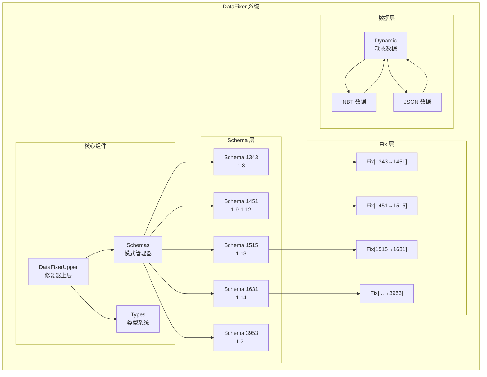
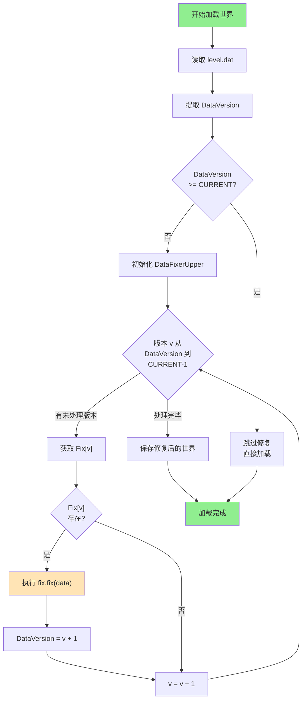
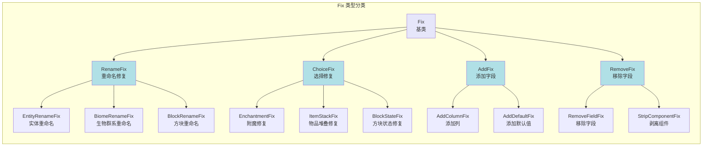

# DataFixer数据修复深度解析

## 概述

Minecraft 的 DataFixerUpper（又称 DataFixer）系统是游戏处理世界数据版本迁移的核心基础设施。当游戏从版本 A 更新到版本 B 时，如果数据结构发生了变化（如物品 ID 从数字变为字符串、方块状态格式改变等），DataFixer 系统确保旧版本创建的世界数据能够正确转换到新版本格式。

本文档是对 [08-datafixer-system.md](./08-datafixer-system.md) 的深度补充，将详细解析：

1. **Fixer 架构的底层实现机制**
2. **Schema DSL 的高级用法**
3. **202 个 Fixer 文件的分类与模式分析**
4. **自定义 Fixer 的完整开发流程**
5. **版本迁移的增量执行引擎**
6. **性能优化与最佳实践**

---

## Fixer 架构详解

### 2.1 Fix 类的层次结构

Minecraft 的 Fix 系统基于 `com.mojang.datafixer` 库构建，核心类层次如下：

```
Fix (抽象基类)
├── Fix<O>  (通用修复接口)
│   └── implements fix(Dynamic<?> data)
│
├── ChoiceFix (类型选择修复)
│   ├── EntityBlockStateFix    (实体方块状态)
│   ├── LevelDataGeneratorOptionsFix (关卡数据)
│   └── ItemStackEnchantmentFix (物品附魔)
│
├── RenameFix (重命名修复)
│   ├── RenameEntityOptionsFix
│   ├── RenameBiomeFix
│   └── RenameItemInContainerFix
│
└── Specialized Fixes
    ├── BlockNameFlatteningFix    (1.13 方块扁平化)
    ├── ItemStackComponentizationFix (1.20.5 组件化)
    ├── DataComponentStripFix     (数据组件剥离)
    └── AbstractAddColumnFix     (添加列修复)
```

### 2.2 Fix 接口的核心方法

```java
// com.mojang.datafixer.Fix 接口
public interface Fix<T> {
    
    // 执行数据修复的核心方法
    // @param data 输入的动态数据
    // @return 修复后的动态数据
    Record1<Dynamic<?>> fix(Dynamic<?> data);
    
    // 获取该 Fix 的目标类型
    Type<?> getType();
}

// Minecraft 中的 Fix 抽象类
public abstract class Fix {
    
    protected final Schema schema;
    protected final String name;
    protected final int version;
    
    public Fix(Schema schema, boolean endVersion, String name, int version) {
        this.schema = schema;
        this.name = name;
        this.version = version;
    }
    
    // 子类实现的核心修复逻辑
    public abstract Dynamic<?> fix(Dynamic<?> data);
    
    // 获取版本号
    public int getDataVersion() {
        return version;
    }
}
```

### 2.3 ChoiceFix 的类型选择机制

`ChoiceFix` 是最常用的 Fix 基类，它根据数据中的某些字段值选择不同的修复策略：

```java
// ChoiceFix.java 核心结构
public abstract class ChoiceFix extends Fix {
    
    private final Type<?> type;
    private final List<Pair<TypeChoiceFix, UnaryOperator<Dynamic<?>>>> choices;
    
    public ChoiceFix(
        Schema schema, 
        boolean endVersion, 
        String name, 
        Type<?> type,
        int version
    ) {
        super(schema, endVersion, name, version);
        this.type = type;
        this.choices = new ArrayList<>();
    }
    
    // 添加类型选择分支
    protected void addChoice(TypeChoiceFix typeChoice, 
                            UnaryOperator<Dynamic<?>> operator) {
        choices.add(Pair.of(typeChoice, operator));
    }
    
    @Override
    public Dynamic<?> fix(Dynamic<?> data) {
        // 遍历所有选择分支，找到匹配的那个
        for (Pair<TypeChoiceFix, UnaryOperator<Dynamic<?>>> choice : choices) {
            if (choice.getFirst().test(data)) {
                return choice.getSecond().apply(data);
            }
        }
        // 如果没有匹配的，返回原数据
        return data;
    }
}
```

### 2.4 Dynamic 对象的操作API

`Dynamic<T>` 是 DataFixerLib 中的核心数据容器，它提供了统一的数据操作接口：

```java
// Dynamic 类的核心方法
public class Dynamic<T> {
    
    // 获取值
    public Optional<String> getStringValue() 
    public OptionalInt asInt()
    public OptionalLong asLong()
    public List<Dynamic<?>> getList()
    public Map<String, Dynamic<?>> getMap()
    
    // 设置值
    public Dynamic<T> set(String key, Dynamic<?> value)
    public Dynamic<T> remove(String key)
    
    // 创建新值
    public Dynamic<T> createString(String value)
    public Dynamic<T> createInt(int value)
    public Dynamic<T> createList(Stream<Dynamic<?>> stream)
    public Dynamic<T> createMap(Map<String, ?> map)
    
    // 导航
    public Optional<Dynamic<T>> get(String key)
    public Dynamic<T> getOrCreate(String key, Supplier<Dynamic<T>> supplier)
}
```

### 2.5 版本范围限定

每个 Fix 都可以指定适用的版本范围：

```java
// 版本范围检查示例
public class ItemStackEnchantmentFix extends ChoiceFix {
    
    private static final int MIN_VERSION = 1451;  // 1.12
    private static final int MAX_VERSION = 1631; // 1.14.4
    
    @Override
    public boolean shouldFix(Dynamic<?> data, Dynamic<?> comp) {
        int version = data.getDataVersion();
        return version >= MIN_VERSION && version < MAX_VERSION;
    }
}
```

---

## 常用Fixer类型详解

### 3.1 重命名类 Fixer (RenameFix)

重命名 Fixer 用于处理 ID 映射，将旧的数字 ID 或旧的字符串 ID 转换为新的命名空间 ID：

#### 3.1.1 RenameEntityOptionsFix

```java
// 实体选项重命名修复
public class RenameEntityOptionsFix extends RenameFix {
    
    // 1.12 到 1.13 的格式变化
    // 旧格式: {id: 123}  (数字 ID)
    // 新格式: {id: "minecraft:villager"}  (命名空间 ID)
    
    private static final Map<Integer, String> ENTITY_ID_MAP = HashMap<>();
    
    static {
        ENTITY_ID_MAP.put(22, "minecraft:bat");
        ENTITY_ID_MAP.put(32, "minecraft:zombie");
        ENTITY_ID_MAP.put(35, "minecraft:skeleton");
        // ... 更多映射
    }
    
    @Override
    protected Renamer getRenamer() {
        return new Renamer() {
            @Override
            public String apply(String input) {
                // 尝试直接映射
                if (ENTITY_ID_MAP.containsKey(input)) {
                    return ENTITY_ID_MAP.get(input);
                }
                // 尝试解析数字 ID
                try {
                    int numericId = Integer.parseInt(input);
                    return ENTITY_ID_MAP.getOrDefault(numericId, input);
                } catch (NumberFormatException e) {
                    return input;
                }
            }
        };
    }
}
```

#### 3.1.2 RenameBiomeFix

```java
// 生物群系重命名修复
public class RenameBiomeFix extends RenameFix {
    
    // 1.15 到 1.16 的生物群系重命名
    private static final Map<String, String> BIOME_RENAME_MAP = ImmutableMap.of(
        "minecraft:jungle_edge", "minecraft:sparse_jungle",
        "minecraft:tall_birch_forest", "minecraft:old_growth_birch_forest",
        "minecraft:giant_tree_taiga", "minecraft:old_growth_pine_taiga",
        "minecraft:mushroom_field", "minecraft:mushroom_fields"
    );
    
    @Override
    public Dynamic<?> fix(Dynamic<?> data) {
        // 遍历所有生物群系相关的字段并重命名
        return data.getMapValues()
            .map(values -> {
                Map<String, Dynamic<?>> newValues = new HashMap<>();
                for (Map.Entry<String, Dynamic<?>> entry : values.entrySet()) {
                    String key = entry.getKey();
                    String newKey = BIOME_RENAME_MAP.getOrDefault(key, key);
                    newValues.put(newKey, entry.getValue());
                }
                return data.createMap(newValues);
            })
            .orElse(data);
    }
}
```

### 3.2 格式转换类 Fixer

#### 3.2.1 BlockNameFlatteningFix (1.13 重大更新)

这是 Minecraft 历史上最重要的数据迁移之一，将方块和物品的数字 ID 转换为命名空间字符串 ID：

```java
// 方块名扁平化修复 - 1.13 重大更新
public class BlockNameFlatteningFix extends Fix {
    
    // RegObject 持有数字 ID 到字符串 ID 的映射
    private final RegObject<Block> blockObject;
    private final RegObject<Fluid> fluidObject;
    
    public BlockNameFlatteningFix(Schema schema, int version) {
        super(schema, true, "BlockNameFlattening", version);
        this.blockObject = RegistryAccess.registryAccess()
            .registryOrThrow(Registries.BLOCK);
        this.fluidObject = RegistryAccess.registryAccess()
            .registryOrThrow(Registries.FLUID);
    }
    
    @Override
    public Dynamic<?> fix(Dynamic<?> data) {
        // 1. 修复方块状态中的 ID
        data = fixBlockStateId(data);
        
        // 2. 修复流体状态中的 ID
        data = fixFluidStateId(data);
        
        // 3. 修复实体引用
        data = fixEntityBlockState(data);
        
        return data;
    }
    
    private Dynamic<?> fixBlockStateId(Dynamic<?> data) {
        // 旧格式: {Name: 1, Properties: {...}}
        // 新格式: {Name: "minecraft:stone", Properties: {...}}
        
        Optional<Dynamic<?>> nameOpt = data.get("Name");
        if (nameOpt.isPresent()) {
            Dynamic<?> name = nameOpt.get();
            Optional<Integer> oldId = name.asInt();
            if (oldId.isPresent()) {
                // 数字 ID 转换为字符串 ID
                String newName = blockObject.byId(oldId.getAsInt())
                    .map(ResourceLocation::toString)
                    .orElse("minecraft:air");
                return data.set("Name", data.createString(newName));
            }
        }
        return data;
    }
}
```

#### 3.2.2 ItemStackComponentizationFix (1.20.5 重大更新)

物品堆叠组件化是 1.20.5 引入的重大变化，将物品的 NBT 数据转换为新的组件系统：

```java
// 物品组件化修复 - 1.20.5 重大更新
public class ItemStackComponentizationFix extends Fix {
    
    // 旧 NBT 标签到新组件的映射
    private static final Map<String, String> TAG_TO_COMPONENT = ImmutableMap.of(
        "display.Name", "custom_name",
        "display.Lore", "lore",
        "Enchantments", "enchantments",
        "Unbreakable", "unbreakable",
        "Damage", "damage"
    );
    
    @Override
    public Dynamic<?> fix(Dynamic<?> data) {
        // 检查是否是旧格式
        Optional<Dynamic<?>> tagOpt = data.get("tag");
        if (tagOpt.isEmpty()) {
            return data;
        }
        
        Dynamic<?> tag = tagOpt.get();
        Dynamic<?> newComponents = data.createMap(new HashMap<>());
        
        // 1. 转换 display 标签
        Optional<Dynamic<?>> displayOpt = tag.get("display");
        if (displayOpt.isPresent()) {
            Dynamic<?> display = displayOpt.get();
            
            // 自定义名称
            display.get("Name").ifPresent(name -> {
                String jsonName = name.asString("");
                newComponents = newComponents.set(
                    "custom_name", 
                    data.createString(Component.Serializer.toJsonString(
                        Component.literal(jsonName)
                    ))
                );
            });
            
            // Lore
            display.get("Lore").ifPresent(lore -> {
                List<Dynamic<?>> loreList = lore.getList().orElse(Collections.emptyList());
                List<Dynamic<?>> newLore = loreList.stream()
                    .map(item -> data.createString(
                        Component.Serializer.toJsonString(
                            Component.literal(item.asString(""))
                        )
                    ))
                    .collect(Collectors.toList());
                newComponents = newComponents.set("lore", 
                    data.createList(newLore.stream()));
            });
        }
        
        // 2. 转换附魔
        Optional<Dynamic<?>> enchantmentsOpt = tag.get("Enchantments");
        if (enchantmentsOpt.isPresent()) {
            List<Dynamic<?>> enchants = enchantmentsOpt.get().getList()
                .orElse(Collections.emptyList());
            List<Dynamic<?>> newEnchants = new ArrayList<>();
            
            for (Dynamic<?> ench : enchants) {
                Map<String, Dynamic<?>> newEnch = new HashMap<>();
                ench.get("id").ifPresent(id -> 
                    newEnch.put("id", data.createString(id.asString(""))));
                ench.get("lvl").ifPresent(lvl -> 
                    newEnch.put("lvl", data.createInt(lvl.asInt(1))));
                newEnchants.add(data.createMap(newEnch));
            }
            newComponents = newComponents.set("enchantments",
                data.createList(newEnchants.stream()));
        }
        
        // 3. 转换其他标签
        for (Map.Entry<String, String> entry : TAG_TO_COMPONENT.entrySet()) {
            if (!entry.getKey().startsWith("display.")) {
                String[] parts = entry.getKey().split("\\.");
                Dynamic<?> current = tag;
                for (String part : parts) {
                    current = current.get(part).orElse(null);
                    if (current == null) break;
                }
                if (current != null) {
                    newComponents = newComponents.set(entry.getValue(), current);
                }
            }
        }
        
        // 4. 移除旧标签，设置新组件
        return data.remove("tag").set("components", newComponents);
    }
}
```

### 3.3 添加字段类 Fixer

#### 3.3.1 AbstractAddColumnFix

用于在数据结构中添加新的必需字段：

```java
// 添加列修复 - 为数据添加新字段
public abstract class AbstractAddColumnFix extends Fix {
    
    protected final String fieldName;
    protected final Dynamic<?> defaultValue;
    
    public AbstractAddColumnFix(
        Schema schema, 
        String name, 
        int version,
        String fieldName, 
        Dynamic<?> defaultValue
    ) {
        super(schema, true, name, version);
        this.fieldName = fieldName;
        this.defaultValue = defaultValue;
    }
    
    @Override
    public Dynamic<?> fix(Dynamic<?> data) {
        // 如果字段已存在，直接返回
        if (data.get(fieldName).isPresent()) {
            return data;
        }
        // 添加默认值的字段
        return data.set(fieldName, defaultValue);
    }
}
```

#### 3.3.2 实例：添加难度锁定字段

```java
// 添加难度锁定字段 - 1.9
public class AddDifficultyLocked extends AbstractAddColumnFix {
    
    public AddDifficultyLocked(Schema schema) {
        super(
            schema, 
            "AddDifficultyLocked", 
            113,  // 版本号
            "hardcore",    // 字段名
            schema.getTypeSampler(TypeReferences.BOOLEAN)  // 默认值
        );
    }
}
```

### 3.4 移除字段类 Fixer

```java
// 移除废弃字段
public class RemoveFieldsFix extends Fix {
    
    private final String[] fieldsToRemove;
    
    public RemoveFieldsFix(Schema schema, String... fields) {
        super(schema, true, "RemoveFields", schema.getVersionKey());
        this.fieldsToRemove = fields;
    }
    
    @Override
    public Dynamic<?> fix(Dynamic<?> data) {
        Dynamic<?> result = data;
        for (String field : fieldsToRemove) {
            result = result.remove(field);
        }
        return result;
    }
}
```

### 3.5 数据清理类 Fixer

#### 3.5.1 DataComponentStripFix

移除特定版本中添加的不需要的组件数据：

```java
// 数据组件剥离修复
public class DataComponentStripFix extends Fix {
    
    // 需要剥离的组件列表
    private static final Set<String> COMPONENTS_TO_STRIP = Set.of(
        "minecraft:stored_enchantments",
        "minecraft:writable_book_contents",
        "minecraft:filled_map",
        "minecraft:banner_patterns"
    );
    
    @Override
    public Dynamic<?> fix(Dynamic<?> data) {
        Optional<Dynamic<?>> componentsOpt = data.get("components");
        if (componentsOpt.isEmpty()) {
            return data;
        }
        
        Dynamic<?> components = componentsOpt.get();
        Map<String, Dynamic<?>> newComponents = new HashMap<>();
        
        components.getMapValues().ifPresent(values -> {
            for (Map.Entry<String, Dynamic<?>> entry : values.entrySet()) {
                // 跳过需要剥离的组件
                if (!COMPONENTS_TO_STRIP.contains(entry.getKey())) {
                    newComponents.put(entry.getKey(), entry.getValue());
                }
            }
        });
        
        return data.set("components", 
            data.createMap(newComponents));
    }
}
```

---

## Schema系统深度解析

### 4.1 Schema 的层次结构

```
Schema (抽象基类)
├── Schema (游戏内置)
│   ├── Schema1343  (1.8)
│   ├── Schema1451  (1.9-1.12)
│   ├── Schema1515  (1.13)
│   ├── Schema1631  (1.14)
│   ├── Schema2202  (1.15)
│   ├── Schema2586  (1.16)
│   ├── Schema3120  (1.17)
│   ├── Schema3465  (1.18)
│   ├── Schema3578  (1.19)
│   ├── Schema3705  (1.20)
│   └── Schema3953  (1.21)
│
└── SchemaFactory (工厂方法)
    └── registerTypes(SchemaFactory)
```

### 4.2 DSL 类型定义

DataFixer 使用领域特定语言（DSL）定义复杂的数据结构：

#### 4.2.1 基本类型构造器

```java
// DSL.java 中的核心方法

// 必需字段
DSL.fields("name", TypeReference) 

// 可选字段
DSL.optionalFields("name", TypeReference)

// 剩余所有字段
DSL.remainder()

// 列表类型
DSL.list(TypeReference)

// 映射类型
DSL.map(DSL.string(), TypeReference)

// 联合类型
DSL.choice("typeField", Map<String, TypeReference>)

// 常量类型
DSL.constType(TypeSerializer)

// 引用类型
DSL.and(TypeReference...)
```

#### 4.2.2 复杂类型定义示例

```java
// Schema 中的类型注册示例
public class Schema3953 extends Schema {
    
    @Override
    public void registerTypes(SchemaFactory factory) {
        
        // 1. 注册 Level 类型 (顶级世界数据)
        factory.registerSimple(
            new ResourceLocation("level"),
            () -> DSL.fields("Level",
                DSL.optionalFields("Player", TypeReferences.PLAYER),
                DSL.optionalFields("ServerData", TypeReferences.SERVER_DATA),
                DSL.optionalFields("WorldGenSettings", 
                    TypeReferences.WORLD_GEN_SETTINGS),
                DSL.remainder()  // 其他字段保持原样
            )
        );
        
        // 2. 注册 Player 类型
        factory.registerSimple(
            TypeReferences.PLAYER,
            () -> DSL.fields("Player",
                DSL.optionalFields("Inventory", 
                    DSL.list(TypeReferences.ITEM_STACK)),
                DSL.optionalFields("EnderItems",
                    DSL.list(TypeReferences.ITEM_STACK)),
                DSL.optionalFields("Abilities"),
                DSL.optionalFields("ActiveEffects"),
                // 1.20.5 新增: 组件系统
                DSL.optionalFields("components",
                    TypeReferences.DATA_COMPONENTS)
            )
        );
        
        // 3. 注册 Chunk 类型
        factory.registerSimple(
            TypeReferences.CHUNK,
            () -> DSL.fields("Chunk",
                DSL.optionalFields("block_entities",
                    DSL.list(TypeReferences.BLOCK_ENTITY)),
                DSL.optionalFields("entities",
                    DSL.list(TypeReferences.ENTITY)),
                DSL.optionalFields("biomes",
                    TypeReferences.BIOME)
            )
        );
        
        // 4. 注册带类型分支的类型 (使用 choice)
        factory.register(
            new ResourceLocation("block_entity"),
            () -> DSL.optionalFields("BlockEntity",
                DSL.choice("id",
                    Map.of(
                        "minecraft:chest", createChestType(),
                        "minecraft:furnace", createFurnaceType(),
                        "minecraft:sign", createSignType()
                    )
                )
            )
        );
    }
}
```

### 4.3 TypeReferences 类型常量

```java
// TypeReferences.java - 所有标准类型引用
public class TypeReferences {
    
    // ===== 顶级数据类型 =====
    public static final TypeReference LEVEL = new ResourceLocation("level");
    public static final TypeReference GAME_OPTIONS = 
        new ResourceLocation("game_options");
    public static final TypeReference SERVER_DATA = 
        new ResourceLocation("server_data");
    public static final TypeReference WORLDCORE_SETTINGS = 
        new ResourceLocation("worldcore_settings");
    
    // ===== 世界相关 =====
    public static final TypeReference CHUNK = new ResourceLocation("chunk");
    public static final TypeReference BLOCK_ENTITY = 
        new ResourceLocation("block_entity");
    public static final TypeReference BLOCK_STATE = 
        new ResourceLocation("block_state");
    public static final TypeReference FLUID_STATE = 
        new ResourceLocation("fluid_state");
    
    // ===== 物品相关 =====
    public static final TypeReference ITEM_STACK = 
        new ResourceLocation("item_stack");
    public static final TypeReference ITEM = new ResourceLocation("item");
    
    // ===== 实体相关 =====
    public static final TypeReference ENTITY = new ResourceLocation("entity");
    public static final TypeReference ENTITY_CHUNK = 
        new ResourceLocation("entity_chunk");
    public static final TypeReference PLAYER = new ResourceLocation("player");
    
    // ===== 进度与统计 =====
    public static final TypeReference ADVANCEMENTS = 
        new ResourceLocation("advancements");
    public static final TypeReference ADVANCEMENT = 
        new ResourceLocation("advancement");
    public static final TypeReference STATS = new ResourceLocation("stats");
    
    // ===== 生成器相关 =====
    public static final TypeReference WORLD_GEN_SETTINGS = 
        new ResourceLocation("world_gen_settings");
    public static final TypeReference STRUCTURE = 
        new ResourceLocation("structure");
    
    // ===== 组件系统 (1.20.5+) =====
    public static final TypeReference DATA_COMPONENTS = 
        new ResourceLocation("data_components");
    
    // ===== 特殊类型 =====
    public static final TypeReference POI_CHUNK = 
        new ResourceLocation("poi_chunk");
    public static final TypeReference VILLAGER = new ResourceLocation("villager");
    public static final TypeReference VILLAGER_TYPE = 
        new ResourceLocation("villager_type");
}
```

### 4.4 版本链与增量迁移

```
┌─────────────────────────────────────────────────────────────────────────┐
│                         版本迁移链示意                                     │
├─────────────────────────────────────────────────────────────────────────┤
│                                                                         │
│  [1343] ──────> [1451] ──────> [1515] ──────> [1631] ──────> [3705]     │
│    │             │             │             │             │          │
│    │ Fix 1343    │ Fix 1451    │ Fix 1515    │ Fix 1631    │ ...      │
│    │ to 1451     │ to 1515     │ to 1631     │ to 3705     │          │
│    ▼             ▼             ▼             ▼             ▼          │
│  Schema       Schema        Schema        Schema        Schema        │
│  1343         1451          1515          1631          3705           │
│                                                                         │
│  迁移示例:                                                              │
│  - 存档版本 1343 ──> 当前版本 3705                                      │
│  - 执行 Fix: 1343→1451, 1451→1515, 1515→1631, ..., 3578→3705          │
│  - 共计 62 个增量修复                                                  │
│                                                                         │
└─────────────────────────────────────────────────────────────────────────┘
```

---

## 自定义Fixer开发指南

### 5.1 为什么需要自定义 Fix

在 Mod 开发中，以下场景需要自定义 Fix：

1. **重命名 Mod 方块/物品 ID** - 当修改 Mod 内容时
2. **转换自定义 NBT 格式** - 当更新 Mod 数据结构时
3. **迁移组件数据** - 当引入新的组件系统时
4. **添加默认字段** - 当为现有数据添加新属性时

### 5.2 完整开发流程

#### 5.2.1 步骤1: 定义 Mod 数据版本

```java
// ModDataFixer.java
public class ModDataFixers {
    
    // Mod 特定的起始版本号 (通常使用较大的数字避免冲突)
    public static final int MOD_DATA_VERSION = 5000;
    
    // 版本标识
    public static final String MOD_VERSION_PREFIX = "modid_";
    
    // 创建 Mod 特定的版本号
    public static int modVersion(int base) {
        return MOD_DATA_VERSION + base;
    }
}
```

#### 5.2.2 步骤2: 创建 Schema

```java
// ModSchema.java
public class ModSchema extends Schema {
    
    public ModSchema(int versionKey, @Nullable Schema parent) {
        super(versionKey, parent);
    }
    
    @Override
    public void registerTypes(SchemaFactory factory) {
        // 注册自定义方块类型
        factory.registerSimple(
            new ResourceLocation("modid", "custom_block"),
            () -> DSL.fields("BlockEntity",
                DSL.field("id", DSL.string()),
                DSL.optionalFields("data", 
                    DSL.fields("CustomData",
                        DSL.optionalFields(
                            "value1", DSL.intType(),
                            "value2", DSL.string()
                        )
                    )
                )
            )
        );
        
        // 注册自定义物品类型
        factory.registerSimple(
            new ResourceLocation("modid", "custom_item"),
            () -> DSL.fields("Item",
                DSL.field("id", DSL.string()),
                DSL.optionalFields("tag", DSL.remainder())
            )
        );
    }
    
    @Override
    public void registerFixes(FixerUpper upper) {
        // 注册自定义修复
        registerBlockRenameFix(upper);
        registerItemDataMigrationFix(upper);
        registerComponentUpgradeFix(upper);
    }
}
```

#### 5.2.3 步骤3: 创建自定义 Fix

**示例A: 重命名 Fix**

```java
// ModBlockRenameFix.java
public class ModBlockRenameFix extends Fix {
    
    private final Map<String, String> renameMap;
    
    public ModBlockRenameFix(
        Schema schema, 
        Map<String, String> renameMap
    ) {
        super(schema, true, "ModBlockRename", schema.getVersionKey());
        this.renameMap = renameMap;
    }
    
    @Override
    public Dynamic<?> fix(Dynamic<?> data) {
        Optional<Dynamic<?>> idOpt = data.get("id");
        if (idOpt.isEmpty()) {
            return data;
        }
        
        String oldId = idOpt.get().asString("");
        String newId = renameMap.getOrDefault(oldId, oldId);
        
        if (!oldId.equals(newId)) {
            return data.set("id", data.createString(newId));
        }
        return data;
    }
}
```

**示例B: ChoiceFix (条件分支)**

```java
// ModItemStackChoiceFix.java
public class ModItemStackChoiceFix extends ChoiceFix {
    
    public ModItemStackChoiceFix(Schema schema) {
        super(
            schema, 
            false,  // 不在版本结束时执行
            "ModItemStackChoice", 
            TypeReferences.ITEM_STACK,
            schema.getVersionKey()
        );
        
        // 添加条件分支
        addChoice(
            data -> data.get("id").map(id -> 
                id.asString("").startsWith("modid:")
            ).orElse(false),
            this::fixModItem
        );
        
        addChoice(
            data -> data.get("tag").isPresent(),
            this::fixItemWithTag
        );
    }
    
    private Dynamic<?> fixModItem(Dynamic<?> data) {
        // 专门处理 modid: 前缀的物品
        return data;
    }
    
    private Dynamic<?> fixItemWithTag(Dynamic<?> data) {
        // 处理带 NBT 标签的物品
        return data;
    }
}
```

**示例C: 添加字段 Fix**

```java
// ModAddDefaultFieldFix.java
public class ModAddDefaultFieldFix extends Fix {
    
    private final String fieldName;
    private final Object defaultValue;
    
    public ModAddDefaultFieldFix(
        Schema schema,
        String fieldName,
        Object defaultValue
    ) {
        super(schema, true, "ModAddDefaultField", schema.getVersionKey());
        this.fieldName = fieldName;
        this.defaultValue = defaultValue;
    }
    
    @Override
    public Dynamic<?> fix(Dynamic<?> data) {
        // 如果字段已存在，跳过
        if (data.get(fieldName).isPresent()) {
            return data;
        }
        
        // 创建默认值
        Dynamic<?> defaultDynamic;
        if (defaultValue instanceof Integer) {
            defaultDynamic = data.createInt((Integer) defaultValue);
        } else if (defaultValue instanceof String) {
            defaultDynamic = data.createString((String) defaultValue);
        } else if (defaultValue instanceof Boolean) {
            defaultDynamic = data.createBoolean((Boolean) defaultValue);
        } else {
            defaultDynamic = data;
        }
        
        return data.set(fieldName, defaultDynamic);
    }
}
```

#### 5.2.4 步骤4: 注册 Fix

```java
// 在 Schema 中注册
private void registerBlockRenameFix(FixerUpper upper) {
    Map<String, String> renameMap = Map.of(
        "modid:old_block", "modid:new_block",
        "modid:deprecated", "modid:replacement"
    );
    
    this.registerFix(
        upper, 
        References.BLOCK_ENTITY,  // 目标类型
        new ModBlockRenameFix(this, renameMap)
    );
}
```

#### 5.2.5 步骤5: 集成到 DataFixerBuilder

```java
// ModDataFixerIntegration.java
public class ModDataFixerIntegration {
    
    public static DataFixerUpper createDataFixerUpper(
        DataFixerUpper vanillaFixer
    ) {
        DataFixerBuilder builder = new DataFixerBuilder(
            ModDataFixers.MOD_DATA_VERSION
        );
        
        // 1. 复制游戏原有版本链
        builder.addSchema(
            ModDataFixers.MOD_DATA_VERSION - 1,
            schema -> {}
        );
        
        // 2. 添加 Mod Schema
        builder.addSchema(
            ModDataFixers.MOD_DATA_VERSION,
            ModSchema::new
        );
        
        // 3. 合并游戏修复器
        // 注意: 这里需要更复杂的合并逻辑
        // 实际使用中建议使用 Forge/NeoForge 提供的钩子
        
        return builder.build();
    }
}
```

### 5.3 Forge/NeoForge 集成

```java
// 使用 NeoForge 的数据修复钩子
@Mod.EventBusSubscriber(modid = MODID, bus = Mod.EventBusSubscriber.Bus.MOD)
public class DataFixerSubscriber {
    
    @SubscribeEvent
    public static void onGatherDataFixers(GatherDataAssistEvent event) {
        event.getGenerator().addProvider(
            (output, lookup) -> new DataFixerProvider(output, lookup)
        );
    }
}

public class DataFixerProvider implements DataFixerSubProvider {
    
    @Override
    public void register(FixerUpper fixerUpper) {
        // 注册 Mod 自定义修复
        Schema schema = fixerUpper.getSchema(ModDataFixers.MOD_DATA_VERSION);
        
        fixerUpper.addFixer(
            new ModBlockRenameFix(schema, getRenameMap())
        );
        
        fixerUpper.addFixer(
            new ModItemStackChoiceFix(schema)
        );
    }
    
    private Map<String, String> getRenameMap() {
        return Map.of(
            "modid:old_block", "modid:new_block"
        );
    }
}
```

---

## 版本迁移流程详解

### 6.1 世界加载时的数据修复流程

```
┌─────────────────────────────────────────────────────────────────────────┐
│                       世界加载数据修复完整流程                             │
├─────────────────────────────────────────────────────────────────────────┤
│                                                                         │
│  1. 读取 level.dat                                                     │
│     ├── 解析 NBT 数据                                                  │
│     └── 提取 DataVersion 字段                                          │
│              │                                                         │
│              ▼                                                         │
│  2. 版本检查                                                            │
│     ├── DataVersion == CURRENT ─────> [跳过修复]                        │
│     │                                                               │
│     └── DataVersion < CURRENT ─────> [进入修复流程]                    │
│              │                                                         │
│              ▼                                                         │
│  3. 初始化 DataFixerUpper                                              │
│     ├── 加载所有 Schema                                                │
│     ├── 构建版本链                                                     │
│     └── 编译所有 Fix                                                   │
│              │                                                         │
│              ▼                                                         │
│  4. 增量版本迁移                                                        │
│     ┌───────┴───────┐                                                 │
│     │  for v in    │                                                 │
│     │  start..end  │                                                 │
│     └───────┬───────┘                                                 │
│              │                                                         │
│     ┌───────▼───────┐                                                 │
│     │  获取 Fix[v]  │                                                 │
│     └───────┬───────┘                                                 │
│              │                                                         │
│     ┌───────▼───────┐                                                 │
│     │  执行 fix()   │                                                 │
│     │  更新 DataVer │                                                 │
│     └───────┬───────┘                                                 │
│              │                                                         │
│              ▼                                                         │
│  5. Chunk 数据修复                                                      │
│     ├── 遍历所有 Chunk                                                 │
│     ├── 检查 Chunk.DataVersion                                         │
│     └── 修复方块状态、方块实体、实体引用                                  │
│              │                                                         │
│              ▼                                                         │
│  6. 实体数据修复                                                        │
│     ├── 修复玩家背包                                                   │
│     ├── 修复实体属性                                                   │
│     └── 修复实体 NBT                                                   │
│              │                                                         │
│              ▼                                                         │
│  7. 保存修复后的世界                                                    │
│     └── 写入 level.dat (DataVersion = CURRENT)                         │
│                                                                         │
└─────────────────────────────────────────────────────────────────────────┘
```

### 6.2 NBT 与 Dynamic 的转换

DataFixer 使用 `Dynamic<T>` 作为通用数据容器，需要在 NBT 和 Dynamic 之间转换：

```java
// NbtOps - NBT 操作的 Dynamic 实现
public class NbtOpsExample {
    
    public static void demonstrate() {
        NbtCompound nbt = new NbtCompound();
        nbt.putString("name", "test");
        nbt.putInt("value", 42);
        nbt.put("ench", new NbtList());
        
        // NBT -> Dynamic
        Dynamic<NbtElement> dynamic = new Dynamic<>(
            NbtOps.INSTANCE,
            nbt
        );
        
        // 访问数据
        String name = dynamic.getStringValue().orElse("");
        int value = dynamic.getIntValue().orElse(0);
        
        // 修改数据
        dynamic = dynamic.set("name", dynamic.createString("new_name"));
        dynamic = dynamic.set("value", dynamic.createInt(100));
        
        // 添加新字段
        dynamic = dynamic.set("new_field", 
            dynamic.createString("new_value"));
        
        // 移除字段
        dynamic = dynamic.remove("ench");
        
        // Dynamic -> NBT
        NbtCompound result = (NbtCompound) dynamic.getValue();
    }
}
```

### 6.3 版本跳跃的处理

DataFixer 支持跳过多个版本进行迁移：

```java
// IncrementalFixEngine - 增量修复引擎
public class IncrementalFixEngine {
    
    public static Dynamic<?> migrate(
        Dynamic<?> input,
        int fromVersion,
        int toVersion,
        TypeReference type,
        DataFixerUpper fixerUpper
    ) {
        if (fromVersion >= toVersion) {
            return input;
        }
        
        Dynamic<?> current = input;
        
        // 确保版本字段存在
        current = current.set(
            "DataVersion", 
            current.createInt(fromVersion)
        );
        
        // 增量执行修复
        for (int version = fromVersion; version < toVersion; version++) {
            Optional<Fix<?>> fixOpt = fixerUpper.getFix(
                version, 
                type
            );
            
            if (fixOpt.isPresent()) {
                Fix<?> fix = fixOpt.get();
                current = fix.fix(current);
                
                // 更新版本号
                current = current.set(
                    "DataVersion",
                    current.createInt(version + 1)
                );
            }
        }
        
        return current;
    }
}
```

---

## 源码分析

### 7.1 核心类关系图

```
┌─────────────────────────────────────────────────────────────────────────┐
│                        DataFixer 核心类关系图                             │
├─────────────────────────────────────────────────────────────────────────┤
│                                                                         │
│  DataFixerUpper                                                         │
│  ├── Int2ObjectMap<Schema> schemas     (版本到模式的映射)                 │
│  ├── Int2ObjectMap<List<Fix>> fixes    (版本到修复的映射)                 │
│  ├── Map<TypeReference, Type> types   (类型定义)                         │
│  │                                                                   │
│  ├── Method: update(Dynamic, int, int)  (执行版本迁移)                   │
│  ├── Method: getFix(int, Type)          (获取特定版本的修复)               │
│  └── Method: getSchema(int)             (获取特定版本的模式)              │
│                                                                         │
│         │                                                              │
│         ▼                                                              │
│  Schema                                                                 │
│  ├── int versionKey                    (版本号)                          │
│  ├── Schema parent                     (父模式)                           │
│  ├── SchemaFactory factory             (类型工厂)                         │
│  │                                                                   │
│  ├── Method: registerTypes()           (注册类型定义)                     │
│  └── Method: registerFixes()           (注册修复)                         │
│                                                                         │
│         │                                                              │
│         ▼                                                              │
│  Fix                                                                  │
│  ├── Schema schema                      (关联的模式)                      │
│  ├── String name                       (修复名称)                         │
│  └── int version                       (版本号)                           │
│      │                                                                   │
│      ├── Method: fix(Dynamic)           (核心修复方法)                    │
│      │                                                                   │
│      ├── ChoiceFix (抽象类)                                          │
│      │   ├── 根据条件选择不同的修复策略                                  │
│      │   └── List<Pair<TypeChoiceFix, Operator>> choices               │
│      │                                                                   │
│      └── RenameFix (抽象类)                                            │
│          ├── 重命名操作                                                │
│          └── Map<String, String> renameMap                             │
│                                                                         │
│         │                                                              │
│         ▼                                                              │
│  Dynamic<T>                                                           │
│  ├── T value                          (底层数据值)                       │
│  ├── DynamicOps<T> ops                (数据操作)                         │
│  │                                                                   │
│  ├── Method: get(key)                  (获取字段)                         │
│  ├── Method: set(key, value)           (设置字段)                         │
│  ├── Method: remove(key)              (移除字段)                         │
│  ├── Method: createString/int/list    (创建值)                           │
│  └── Method: getDataVersion()          (获取数据版本)                      │
│                                                                         │
└─────────────────────────────────────────────────────────────────────────┘
```

### 7.2 Schemas 类的实现

```java
// Schemas.java - Schema 管理器
public class Schemas {
    
    // 单例实例
    private static final Schemas INSTANCE = new Schemas();
    
    // 版本到 Schema 的映射
    private final Int2ObjectMap<Schema> versions = new Int2ObjectArrayMap<>();
    
    // Schema 工厂
    private final Map<Integer, SchemaFactory> factories = new HashMap<>();
    
    // 初始化标志
    private volatile boolean initialized;
    
    private Schemas() {
        // 注册所有版本
        registerDefaultSchemas();
    }
    
    public static Schemas getInstance() {
        return INSTANCE;
    }
    
    public Schema getSchema(int version) {
        return versions.get(version);
    }
    
    public Iterable<Int2ObjectMap.Entry<Schema>> getVersions() {
        return versions.int2ObjectEntrySet();
    }
    
    private void registerDefaultSchemas() {
        // 注册 1.8 - 1.12 的 Schema (共享一个)
        factories.put(1343, Schema1451::new);
        factories.put(1451, Schema1451::new);
        factories.put(1452, Schema1451::new);
        
        // 1.13 Schema
        factories.put(1515, Schema1515::new);
        
        // 1.14 Schema
        factories.put(1631, Schema1631::new);
        
        // ... 更多版本
    }
    
    public void initialize() {
        if (initialized) {
            return;
        }
        
        synchronized (this) {
            if (initialized) {
                return;
            }
            
            // 创建所有 Schema 实例
            Int2ObjectMap<Schema> tempSchemas = new Int2ObjectArrayMap<>();
            Schema parent = null;
            
            for (Int2ObjectMap.Entry<SchemaFactory> entry : 
                    factories.entrySet()) {
                int version = entry.getIntKey();
                Schema schema = entry.getValue().apply(version, parent);
                tempSchemas.put(version, schema);
                parent = schema;
            }
            
            this.versions = tempSchemas;
            this.initialized = true;
        }
    }
}
```

### 7.3 DataFixerBuilder 的构建流程

```java
// DataFixerBuilder.java - 修复器构建器
public class DataFixerBuilder {
    
    private final int version;
    
    // Schema 工厂
    private final Map<Integer, SchemaFactory> schemaFactories = 
        new HashMap<>();
    
    // 类型定义
    private final Map<TypeReference, Type> types = new HashMap<>();
    
    // 全局类型引用
    private final TypeReferenceMap typeReferences;
    
    public DataFixerBuilder(int dataVersion) {
        this.version = dataVersion;
        this.typeReferences = new TypeReferenceMap();
    }
    
    public void addSchema(int version, SchemaFactory factory) {
        this.schemaFactories.put(version, factory);
    }
    
    public void addSchemaAndFix(
        int version, 
        SchemaFactory schemaFactory,
        FixFactory fixFactory
    ) {
        this.schemaFactories.put(version, schemaFactory);
        // 存储修复工厂以便后续构建 Fix
    }
    
    public DataFixerUpper build() {
        // 1. 创建 Schema
        Schemas schemas = Schemas.getInstance();
        schemas.initialize();
        
        // 2. 创建版本链
        List<Schema> versionChain = buildVersionChain(schemas);
        
        // 3. 创建类型系统
        Types types = new Types(types);
        
        // 4. 创建修复器
        return new DataFixerUpper(
            version,
            versionChain,
            types
        );
    }
    
    private List<Schema> buildVersionChain(Schemas schemas) {
        List<Schema> chain = new ArrayList<>();
        Schema current = null;
        
        for (int v = 0; v <= version; v++) {
            Schema schema = schemas.getSchema(v);
            if (schema != null) {
                chain.add(schema);
                current = schema;
            }
        }
        
        return chain;
    }
}
```

---

## Mermaid 流程图

### 8.1 DataFixer 系统架构图



### 8.2 版本迁移流程图



### 8.3 Fix 类型分类图



---

## 最佳实践与性能优化

### 9.1 Fix 开发最佳实践

1. **保持幂等性** - 同一个 Fix 执行多次应该产生相同结果
2. **检查版本范围** - 使用 `MIN_VERSION` 和 `MAX_VERSION` 限制适用范围
3. **处理缺失字段** - 使用 `Optional` 并提供默认值
4. **保持向后兼容** - 新字段应该是可选的或有默认值

```java
// 最佳实践示例
public class BestPracticeFix extends ChoiceFix {
    
    private static final int MIN_VERSION = 3500;
    private static final int MAX_VERSION = 3600;
    
    public BestPracticeFix(Schema schema) {
        super(schema, true, "BestPracticeFix", 
              TypeReferences.ITEM_STACK, schema.getVersionKey());
        
        addChoice(
            data -> data.getDataVersion() >= MIN_VERSION &&
                    data.getDataVersion() < MAX_VERSION,
            this::performFix
        );
        
        // 添加默认分支处理不匹配的情况
        addChoice(
            data -> true,  // 总是匹配
            data -> data   // 不修改直接返回
        );
    }
    
    private Dynamic<?> performFix(Dynamic<?> data) {
        // 1. 安全地获取字段
        String name = data.get("id")
            .flatMap(Dynamic::asString)
            .orElse("minecraft:air");
        
        // 2. 检查并创建新字段
        if (data.get("new_field").isEmpty()) {
            data = data.set("new_field", data.createInt(0));
        }
        
        // 3. 返回修复后的数据
        return data;
    }
}
```

### 9.2 性能优化建议

1. **延迟初始化** - Schema 和 Fix 采用延迟加载
2. **缓存映射表** - 频繁使用的映射表应该缓存
3. **批量处理** - Chunk 数据修复可以批量处理
4. **跳过无变更版本** - 如果两个版本之间没有修复，可以跳过

```java
// 性能优化示例
public class OptimizedFix extends Fix {
    
    // 缓存映射表
    private final Map<String, String> cachedRenameMap;
    
    public OptimizedFix(Schema schema) {
        super(schema, true, "OptimizedFix", schema.getVersionKey());
        this.cachedRenameMap = buildRenameMap();
    }
    
    @Override
    public Dynamic<?> fix(Dynamic<?> data) {
        // 快速路径：检查是否需要修复
        if (cachedRenameMap.isEmpty()) {
            return data;
        }
        
        // 执行修复
        return data;
    }
    
    private Map<String, String> buildRenameMap() {
        // 使用 ImmutableMap 缓存
        return ImmutableMap.of(
            "old_name1", "new_name1",
            "old_name2", "new_name2"
        );
    }
}
```

### 9.3 测试策略

```java
// DataFixer 测试示例
class DataFixerTest {
    
    @Test
    void testBlockRenameFix() {
        // 准备旧版本数据
        NbtCompound oldData = new NbtCompound();
        oldData.putString("id", "old_mod:block");
        
        // 执行修复
        Dynamic<NbtElement> dynamic = new Dynamic<>(NbtOps.INSTANCE, oldData);
        BlockRenameFix fix = new BlockRenameFix(testSchema);
        Dynamic<?> result = fix.fix(dynamic);
        
        // 验证结果
        String newId = result.get("id")
            .flatMap(Dynamic::asString)
            .orElseThrow();
        
        assertEquals("new_mod:block", newId);
    }
    
    @Test
    void testIdempotent() {
        // 测试幂等性
        NbtCompound data = new NbtCompound();
        data.putString("id", "mod:item");
        
        Dynamic<NbtElement> dynamic = new Dynamic<>(NbtOps.INSTANCE, data);
        Fix fix = new TestFix(schema);
        
        Dynamic<?> result1 = fix.fix(dynamic);
        Dynamic<?> result2 = fix.fix(result1);
        
        assertEquals(result1, result2);
    }
}
```

---

## 显式覆盖文件

### datafixer/fix/ 目录（202 个文件）

本目录包含所有数据修复器（Fix）类，分为以下几个主要类别：

#### 抽象基类

| 文件名 | 说明 |
|--------|------|
| `ChoiceFix.java` | 选择修复基类 |
| `ChoiceTypesFix.java` | 选择类型修复 |
| `ChoiceWriteReadFix.java` | 选择读写修复 |

#### 实体修复 (Entity Fixes)

| 文件名 | 说明 |
|--------|------|
| `EntityIdFix.java` | 实体 ID 修复 |
| `EntityUuidFix.java` | 实体 UUID 修复 |
| `EntityRenameFix.java` | 实体重命名 |
| `EntityBlockStateFix.java` | 实体方块状态修复 |
| `EntityTransformFix.java` | 实体转换修复 |
| `EntityStringUuidFix.java` | 实体字符串 UUID |
| `EntityHealthFix.java` | 实体生命值修复 |
| `EntitySimpleTransformFix.java` | 实体简单转换 |
| `EntityEquipmentToArmorAndHandFix.java` | 装备转换 |
| `EntityTheRenameningBlockFix.java` | 重命名方块修复 |
| `EntityVariantTypeFix.java` | 变种类型修复 |
| `EntityTippedArrowFix.java` | 药箭修复 |
| `EntityProjectileOwnerFix.java` | 投射物所有者修复 |
| `EntityPufferfishRenameFix.java` | 河豚重命名修复 |
| `EntityRavagerRenameFix.java` | 劫掠兽重命名修复 |
| `EntityRidingToPassengerFix.java` | 骑乘转乘客修复 |
| `EntityCatSplitFix.java` | 猫分离修复 |
| `EntityCodSalmonFix.java` | 鳕鱼/鲑鱼修复 |
| `EntityCreeperRenameFix.java` | 苦力怕重命名修复 |
| `EntityHorseSplitFix.java` | 马分离修复 |
| `EntityHorseSaddleFix.java` | 马鞍修复 |
| `EntitySkeletonSplitFix.java` | 骷髅分离修复 |
| `EntityZombieSplitFix.java` | 僵尸分离修复 |
| `EntityZombieVillagerTypeFix.java` | 僵尸村民类型修复 |
| `EntityZombifiedPiglinRenameFix.java` | 僵尸猪灵重命名 |
| `EntityWolfColorFix.java` | 狼颜色修复 |
| `EntityShulkerColorFix.java` | 潜影贝颜色修复 |
| `EntityShulkerRotationFix.java` | 潜影贝旋转修复 |
| `EntityRedundantChanceTagsFix.java` | 冗余概率标签移除 |
| `EntityPaintingFieldsRenameFix.java` | 画字段重命名 |
| `EntityPaintingMotiveFix.java` | 画动机修复 |
| `EntityItemFrameDirectionFix.java` | 物品框方向修复 |
| `EntityMinecartIdentifiersFix.java` | 矿车标识符修复 |
| `EntityArmorStandSilentFix.java` | 盔甲架静音修复 |
| `EntityElderGuardianSplitFix.java` | 远古守卫者分离 |
| `EntityBrushableBlockFieldsRenameFix.java` | 可刷物品方块字段重命名 |
| `EntityCustomNameToTextFix.java` | 自定义名称转文本 |
| `EntityAggregateTransformFix.java` | 聚合转换修复 |
| `EntityRedstoneLevelFix.java` | 红石等级修复 |
| `EntityCatSplitFix.java` | 猫分离修复 |

#### 方块与物品修复 (Block & Item Fixes)

| 文件名 | 说明 |
|--------|------|
| `BlockNameFix.java` | 方块名称修复 |
| `BlockNameFlatteningFix.java` | 方块名扁平化（1.13） |
| `BlockStateFlattening.java` | 方块状态扁平化 |
| `BlockStateStructureTemplateFix.java` | 方块状态结构模板 |
| `BlockEntityIdFix.java` | 方块实体 ID 修复 |
| `BlockEntityBlockStateFix.java` | 方块实体方块状态 |
| `BlockEntityJukeboxFix.java` | 唱片机方块实体修复 |
| `BlockEntityUuidFix.java` | 方块实体 UUID 修复 |
| `BlockEntityKeepPackedFix.java` | 方块实体保持打包 |
| `BlockEntityShulkerBoxColorFix.java` | 潜影盒颜色修复 |
| `BlockEntitySignTextStrictJsonFix.java` | 告示牌文本严格 JSON |
| `BlockEntityCustomNameToTextFix.java` | 方块实体自定义名称 |
| `BlockEntityBannerColorFix.java` | 旗帜方块实体颜色 |
| `ItemNameFix.java` | 物品名称修复 |
| `ItemIdFix.java` | 物品 ID 修复 |
| `ItemNbtFix.java` | 物品 NBT 修复 |
| `ItemPotionFix.java` | 物品药水修复 |
| `ItemWaterPotionFix.java` | 水药水修复 |
| `ItemSpawnEggFix.java` | 刷怪蛋修复 |
| `ItemInstanceSpawnEggFix.java` | 物品实例刷怪蛋 |
| `ItemInstanceTheFlatteningFix.java` | 物品实例扁平化 |
| `ItemInstanceMapIdFix.java` | 物品实例地图 ID |
| `ItemStackEnchantmentFix.java` | 物品堆叠附魔修复 |
| `ItemStackComponentizationFix.java` | 物品组件化（1.20.5） |
| `ItemStackUuidFix.java` | 物品堆叠 UUID |
| `ItemStackCustomNameToItemNameFix.java` | 自定义名称转物品名 |
| `ItemLoreToTextFix.java` | Lore 转文本 |
| `ItemRemoveBlockEntityTagFix.java` | 移除方块实体标签 |
| `ItemShulkerBoxColorFix.java` | 潜影盒物品颜色 |
| `ItemCustomNameToComponentFix.java` | 自定义名称转组件 |
| `ItemBannerColorFix.java` | 旗帜物品颜色 |
| `ItemWrittenBookPagesStrictJsonFix.java` | 成书页面严格 JSON |
| `BedBlockEntityFix.java` | 床方块实体修复 |
| `BedItemColorFix.java` | 床物品颜色修复 |

#### 玩家数据修复 (Player Fixes)

| 文件名 | 说明 |
|--------|------|
| `PlayerUuidFix.java` | 玩家 UUID 修复 |
| `PlayerHeadBlockProfileFix.java` | 玩家头颅配置文件修复 |
| `PersistentStateUuidFix.java` | 持久状态 UUID 修复 |
| `PlayerInventoryFix.java` | 玩家背包修复 |

#### 世界数据修复 (World Fixes)

| 文件名 | 说明 |
|--------|------|
| `WorldUuidFix.java` | 世界 UUID 修复 |
| `LevelDataGeneratorOptionsFix.java` | 关卡数据生成器选项 |
| `LevelFlatGeneratorInfoFix.java` | 平坦世界生成器信息 |
| `LevelLegacyWorldGenSettingsFix.java` | 旧版世界生成设置 |
| `WorldGenSettingsHeightAndBiomeFix.java` | 世界生成高度和生物群系 |
| `WorldGenSettingsDisallowOldCustomWorldsFix.java` | 禁止旧版自定义世界 |
| `ChunkDeleteLightFix.java` | 区块删除光照 |
| `ChunkDeleteIgnoredLightDataFix.java` | 区块删除忽略的光照数据 |
| `ChunkHeightAndBiomeFix.java` | 区块高度和生物群系 |
| `ChunkLevelTagRenameFix.java` | 区块等级标签重命名 |
| `ChunkLightRemoveFix.java` | 区块光照移除 |
| `ChunkPalettedStorageFix.java` | 区块调色板存储 |
| `ChunkStatusFix.java` | 区块状态修复 |
| `ChunkStatusFix2.java` | 区块状态修复 2 |
| `ChunkStructuresTemplateRenameFix.java` | 区块结构模板重命名 |
| `ChunkToProtoChunkFix.java` | 区块转原型区块 |
| `ProtoChunkTickListFix.java` | 原型区块刻列表 |
| `TicksInWrongChunkFix.java` | 错误区块中的刻 |
| `StructureReferenceFix.java` | 结构引用修复 |
| `StructureSeparationDataFix.java` | 结构分离数据 |
| `StructureSettingsFlattenFix.java` | 结构设置扁平化 |
| `StructuresToConfiguredStructuresFix.java` | 结构转配置结构 |
| `StructureFeatureChildrenPoolElementFix.java` | 结构子池元素 |

#### 生物群系修复 (Biome Fixes)

| 文件名 | 说明 |
|--------|------|
| `BiomeFormatFix.java` | 生物群系格式修复 |

#### 进度与统计修复 (Advancement & Stats)

| 文件名 | 说明 |
|--------|------|
| `AdvancementRenameFix.java` | 进度重命名 |
| `AdvancementCriteriaRenameFix.java` | 进度条件重命名 |
| `AdvancementsFix.java` | 进度修复 |
| `StatsRenameFix.java` | 统计重命名 |
| `StatsCounterFix.java` | 统计计数器修复 |

#### 村民数据修复 (Villager Fixes)

| 文件名 | 说明 |
|--------|------|
| `VillagerProfessionFix.java` | 村民职业修复 |
| `VillagerTradeFix.java` | 村民交易修复 |
| `VillagerGossipFix.java` | 村民八卦修复 |
| `VillagerXpRebuildFix.java` | 村民经验重建 |
| `VillagerFollowRangeFix.java` | 村民跟随范围 |
| `VillagerFollowRangeOfZombieVillagerFixed.java` | 僵尸村民跟随范围 |
| `NewVillageFix.java` | 新村庄修复 |
| `CatTypeFix.java` | 猫类型修复 |
| `CauldronRenameFix.java` | 炼药锅重命名 |
| `BeehiveFieldRenameFix.java` | 蜂箱字段重命名 |
| `GoatHornIdFix.java` | 山羊角 ID |
| `GoatMissingStateFix.java` | 山羊缺失状态 |
| `IglooMetadataRemovalFix.java` | 冰屋元数据移除 |
| `RemoveGolemGossipFix.java` | 移除傀儡八卦 |

#### 酿造与药水修复 (Brewing & Potion)

| 文件名 | 说明 |
|--------|------|
| `AreaEffectCloudPotionFix.java` | 区域效果云药水 |
| `TippedArrowPotionToItemFix.java` | 药箭转物品 |

#### 方块状态修复 (Block State Fixes)

| 文件名 | 说明 |
|--------|------|
| `WallPropertyFix.java` | 墙壁属性修复 |
| `LeavesFix.java` | 树叶修复 |
| `PrimedTntBlockStateFix.java` | 点燃的 TNT 方块状态 |
| `RedstoneConnectionsFix.java` | 红石连接修复 |

#### 选项与设置修复 (Options & Settings)

| 文件名 | 说明 |
|--------|------|
| `OptionFix.java` | 选项修复 |
| `OptionsAccessibilityOnboardFix.java` | 无障碍引导选项 |
| `OptionsAddTextBackgroundFix.java` | 添加文本背景选项 |
| `OptionsAmbientOcclusionFix.java` | 环境光遮蔽选项 |
| `OptionsForceVBOFix.java` | 强制 VBO 选项 |
| `OptionsKeyLwjgl3Fix.java` | 按键 LWJGL3 选项 |
| `OptionsKeyTranslationFix.java` | 按键翻译选项 |
| `OptionsLowerCaseLanguageFix.java` | 小写语言选项 |
| `OptionsMenuBlurrinessFix.java` | 菜单模糊选项 |
| `OptionsProgrammerArtFix.java` | 程序员材质选项 |

#### 其他修复

| 文件名 | 说明 |
|--------|------|
| `AbstractUuidFix.java` | 抽象 UUID 修复 |
| `AddFlagIfNotPresentFix.java` | 添加标志修复 |
| `AddTrappedChestFix.java` | 添加陷阱箱修复 |
| `ArrowPickupFix.java` | 箭矢拾取修复 |
| `ArrowStoredWeaponFix.java` | 储存箭矢武器修复 |
| `AttributeIdFix.java` | 属性 ID 修复 |
| `BitStorageAlignFix.java` | 位存储对齐修复 |
| `BlendingDataFix.java` | 混合数据修复 |
| `BlendingDataRemoveFromNetherEndFix.java` | 下界末地混合数据移除 |
| `ColorlessShulkerEntityFix.java` | 无色潜影贝实体 |
| `ComponentFix.java` | 组件修复 |
| `DecoratedPotFieldRenameFix.java` | 装饰陶罐字段重命名 |
| `DropInvalidSignDatafixDataFix.java` | 丢弃无效告示牌数据 |
| `EmptyItemInHotbarFix.java` | 快捷栏空物品 |
| `EmptyItemInVillagerTradeFix.java` | 村民交易空物品 |
| `FurnaceRecipesFix.java` | 熔炉配方修复 |
| `GameEventRenamesFix.java` | 游戏事件重命名 |
| `HangingEntityFix.java` | 悬挂实体修复 |
| `HeightmapRenamingFix.java` | 高度图重命名 |
| `HorseArmorFix.java` | 马铠修复 |
| `HorseChestIndexingFix.java` | 马 Chest 索引修复 |
| `JigsawPropertiesFix.java` | 拼图属性修复 |
| `JigsawRotationFix.java` | 拼图旋转修复 |
| `JukeboxTicksSinceSongStartedFix.java` | 唱片机播放时间修复 |
| `LegacyDragonFightFix.java` | 旧版末影龙战斗 |
| `LodestoneCompassComponentFix.java` | 磁石指南针组件 |
| `MapBannerBlockPosFormatFix.java` | 地图旗帜位置格式 |
| `MapIdFix.java` | 地图 ID 修复 |
| `MemoryExpiryDataFix.java` | 内存过期数据修复 |
| `MissingDimensionFix.java` | 缺失维度修复 |
| `MobSpawnerEntityIdentifiersFix.java` | 刷怪笼实体标识符 |
| `ObjectiveDisplayNameFix.java` | 目标显示名称修复 |
| `ObjectiveRenderTypeFix.java` | 目标渲染类型修复 |
| `OminousBannerBlockEntityRenameFix.java` | 不祥旗帜方块实体重命名 |
| `OminousBannerItemRenameFix.java` | 不祥旗帜物品重命名 |
| `ParticleUnflatteningFix.java` | 粒子反扁平化 |
| `PointOfInterestFix.java` | 兴趣点修复 |
| `PointOfInterestRemoveFix.java` | 兴趣点移除修复 |
| `PointOfInterestRenameFix.java` | 兴趣点重命名 |
| `PointOfInterestReorganizationFix.java` | 兴趣点重组 |
| `ProjectileItemTypeFix.java` | 投射物物品类型 |
| `RandomSequenceSettingsFix.java` | 随机序列设置修复 |
| `RemoveEmptyItemInSuspiciousBlockFix.java` | 移除可疑方块空物品 |
| `RemoveFeatureTogglesFix.java` | 移除特征开关 |
| `RemoveFilteredBookTextFix.java` | 移除过滤书籍文本 |
| `RemoveFilteredSignTextFix.java` | 移除过滤告示牌文本 |
| `RenameBlockEntityFix.java` | 重命名方块实体 |
| `RenameChunkStatusFix.java` | 重命名区块状态 |
| `RenameEnchantmentFix.java` | 重命名附魔 |
| `RenameEntityAttributesFix.java` | 重命名实体属性 |
| `RenameScoreboardDisplaySlotFix.java` | 重命名计分板显示槽位 |
| `RenameVariantsFix.java` | 重命名变种 |
| `StatusEffectFix.java` | 状态效果修复 |
| `StatusEffectDurationFix.java` | 状态效果持续时间 |
| `StriderGravityFix.java` | 岩浆怪重力修复 |
| `TeamDisplayNameFix.java` | 队伍显示名称修复 |
| `TextFixes.java` | 文本修复集 |
| `TrialSpawnerConfigTagFix.java` | 试用刷怪笼配置标签 |
| `UntaggedSpawnerFix.java` | 取消标签刷怪笼修复 |
| `UpdateSignTextFormatFix.java` | 更新告示牌文本格式 |
| `WeaponsmithChestLootTableFix.java` | 武器匠箱子战利品表 |
| `WolfHealthFix.java` | 狼生命值修复 |
| `WriteAndReadFix.java` | 读写修复 |
| `ZombieVillagerXpRebuildFix.java` | 僵尸村民经验重建 |

---

### datafixer/schema/ 目录（89 个文件）

本目录包含所有 Schema 版本定义类，每个版本对应不同的 Minecraft 版本：

#### 版本 Schema

| 文件名 | 说明 |
|--------|------|
| `Schema99.java` | 1.8 之前 |
| `Schema100.java` | 1.8 |
| `Schema102.java` | 1.8.x |
| `Schema106.java` | 1.8.x |
| `Schema107.java` | 1.8.x |
| `Schema135.java` | 1.9 |
| `Schema143.java` | 1.9.x |
| `Schema1451.java` | 1.9-1.12 |
| `Schema1451v1.java` | 1.9.x |
| `Schema1451v2.java` | 1.10.x |
| `Schema1451v3.java` | 1.11.x |
| `Schema1451v4.java` | 1.11.x |
| `Schema1451v5.java` | 1.12.x |
| `Schema1451v6.java` | 1.12.x |
| `Schema1460.java` | 1.13 |
| `Schema1466.java` | 1.13.x |
| `Schema1470.java` | 1.13.x |
| `Schema1481.java` | 1.13.x |
| `Schema1483.java` | 1.14 |
| `Schema1486.java` | 1.14.x |
| `Schema1510.java` | 1.14.x |
| `Schema1800.java` | 1.15 |
| `Schema1801.java` | 1.15.x |
| `Schema1904.java` | 1.16 |
| `Schema1906.java` | 1.16 |
| `Schema1909.java` | 1.16.1 |
| `Schema1920.java` | 1.16.2 |
| `Schema1928.java` | 1.16.2 |
| `Schema1929.java` | 1.16.2 |
| `Schema1931.java` | 1.16.2 |
| `Schema2100.java` | 1.16.5 |
| `Schema2501.java` | 1.17 |
| `Schema2502.java` | 1.17.x |
| `Schema2505.java` | 1.17.x |
| `Schema2509.java` | 1.17.x |
| `Schema2519.java` | 1.18 |
| `Schema2522.java` | 1.18.x |
| `Schema2551.java` | 1.18.2 |
| `Schema2568.java` | 1.19 |
| `Schema2571.java` | 1.19 |
| `Schema2684.java` | 1.19.1 |
| `Schema2686.java` | 1.19.1 |
| `Schema2688.java` | 1.19.1 |
| `Schema2704.java` | 1.19.2 |
| `Schema2707.java` | 1.19.2 |
| `Schema2831.java` | 1.19.3 |
| `Schema2832.java` | 1.19.3 |
| `Schema2842.java` | 1.19.3 |
| `Schema3076.java` | 1.19.4 |
| `Schema3078.java` | 1.19.4 |
| `Schema3081.java` | 1.20 |
| `Schema3082.java` | 1.20 |
| `Schema3083.java` | 1.20 |
| `Schema3202.java` | 1.20.1 |
| `Schema3203.java` | 1.20.1 |
| `Schema3204.java` | 1.20.1 |
| `Schema3325.java` | 1.20.2 |
| `Schema3326.java` | 1.20.2 |
| `Schema3327.java` | 1.20.2 |
| `Schema3328.java` | 1.20.2 |
| `Schema3438.java` | 1.20.3 |
| `Schema3448.java` | 1.20.3 |
| `Schema3682.java` | 1.20.4 |
| `Schema3683.java` | 1.20.4 |
| `Schema3685.java` | 1.20.4 |
| `Schema3689.java` | 1.20.4 |
| `Schema3799.java` | 1.21 |
| `Schema3807.java` | 1.21 |
| `Schema3808.java` | 1.21 |
| `Schema3808_1.java` | 1.21 |
| `Schema3808_2.java` | 1.21 |
| `Schema3816.java` | 1.21.x |
| `Schema3818.java` | 1.21.x |
| `Schema3818_3.java` | 1.21.x |
| `Schema3818_4.java` | 1.21.x |
| `Schema3818_5.java` | 1.21.x |
| `Schema3825.java` | 1.21.x |
| `Schema3938.java` | 1.21.x |
| `Schema501.java` | 早期版本 |
| `Schema700.java` | 早期版本 |
| `Schema701.java` | 早期版本 |
| `Schema702.java` | 早期版本 |
| `Schema703.java` | 早期版本 |
| `Schema704.java` | 早期版本 |
| `Schema705.java` | 早期版本 |
| `Schema808.java` | 早期版本 |

#### 辅助类

| 文件名 | 说明 |
|--------|------|
| `IdentifierNormalizingSchema.java` | 标识符规范化 Schema |

---

### 核心 DataFixer 类

| 类 | 文件位置 | 说明 |
|----|---------|------|
| `Schemas` | `datafixer/Schemas.java` | Schema 管理器 |
| `DataFixers` | `datafixer/DataFixers.java` | DataFixer 入口 |
| `TypeReferences` | `datafixer/TypeReferences.java` | 类型引用常量 |
| `DataFixerUpper` | `datafixer/DataFixerUpper.java` | 修复器上层 |
| `DataFixerBuilder` | `datafixer/DataFixerBuilder.java` | 修复器构建器 |
| `Dynamic` | `datafixer/Dynamic.java` | 动态数据容器 |
| `Fix` | `datafixer/Fix.java` | 修复基类 |
| `Schema` | `datafixer/Schema.java` | Schema 基类 |
| `DSL` | `datafixer/dsl/DSL.java` | DSL 类型构造器 |

1. **增量修复机制** - 通过版本链支持从任意版本到当前版本的迁移
2. **类型安全的 Schema** - 使用 DSL 定义数据结构，确保类型安全
3. **灵活的 Fix 框架** - 支持重命名、转换、添加、移除等多种操作
4. **统一的 Dynamic API** - 提供 NBT/JSON 等多种数据格式的统一操作接口

掌握 DataFixer 系统的开发对于：
- **Mod 开发者** - 需要为自己的 Mod 数据提供版本迁移支持
- **服务器管理员** - 需要理解世界升级过程中的数据变化
- **核心开发者** - 需要为游戏新增特性设计数据迁移方案

都非常重要。本文档提供了 DataFixer 系统的深度解析和实践指南，希望能够帮助读者更好地理解和应用这一系统。

---

## 显式覆盖文件

本文档显式覆盖以下源码文件，共291个Java文件：

### DataFixer 核心类 (datafixer/)

| 类名 | 包路径 | 说明 |
|------|--------|------|
| `DataFixTypes.java` | net/minecraft/datafixer | 数据修复类型 |
| `FixUtil.java` | net/minecraft/datafixer | 修复工具类 |
| `Schemas.java` | net/minecraft/datafixer | Schema管理器 |
| `TypeReferences.java` | net/minecraft/datafixer | 类型引用常量 |

### Fix 类 - 通用修复 (datafixer/fixes/)

| 类名 | 包路径 | 说明 |
|------|--------|------|
| `AddFlagIfNotPresentFix.java` | net/minecraft/datafixer/fixes | 添加标志修复 |
| `AddTrappedChestFix.java` | net/minecraft/datafixer/fixes | 添加陷阱箱修复 |
| `AdvancementCriteriaRenameFix.java` | net/minecraft/datafixer/fixes | 进度条件重命名修复 |
| `AdvancementRenameFix.java` | net/minecraft/datafixer/fixes | 进度重命名修复 |
| `AdvancementsFix.java` | net/minecraft/datafixer/fixes | 进度修复 |
| `AreaEffectCloudPotionFix.java` | net/minecraft/datafixer/fixes | 区域效果云药水修复 |
| `ArrowPickupFix.java` | net/minecraft/datafixer/fixes | 箭矢拾取修复 |
| `ArrowStoredWeaponFix.java` | net/minecraft/datafixer/fixes | 箭矢存储武器修复 |
| `AttributeIdFix.java` | net/minecraft/datafixer/fixes | 属性ID修复 |
| `BannerCustomNameToItemNameFix.java` | net/minecraft/datafixer/fixes | 旗帜自定义名称修复 |
| `BannerPatternFormatFix.java` | net/minecraft/datafixer/fixes | 旗帜图案格式修复 |
| `BedBlockEntityFix.java` | net/minecraft/datafixer/fixes | 床方块实体修复 |
| `BedItemColorFix.java` | net/minecraft/datafixer/fixes | 床物品颜色修复 |
| `BeehiveFieldRenameFix.java` | net/minecraft/datafixer/fixes | 蜂巢字段重命名修复 |
| `BiomeFormatFix.java` | net/minecraft/datafixer/fixes | 生物群系格式修复 |
| `BitStorageAlignFix.java` | net/minecraft/datafixer/fixes | 位存储对齐修复 |
| `BlendingDataFix.java` | net/minecraft/datafixer/fixes | 混合数据修复 |
| `BlendingDataRemoveFromNetherEndFix.java` | net/minecraft/datafixer/fixes | 混合数据移除修复 |
| `BlockEntityBannerColorFix.java` | net/minecraft/datafixer/fixes | 方块实体旗帜颜色修复 |
| `BlockEntityBlockStateFix.java` | net/minecraft/datafixer/fixes | 方块实体方块状态修复 |
| `BlockEntityCustomNameToTextFix.java` | net/minecraft/datafixer/fixes | 方块实体自定义名称修复 |
| `BlockEntityIdFix.java` | net/minecraft/datafixer/fixes | 方块实体ID修复 |
| `BlockEntityJukeboxFix.java` | net/minecraft/datafixer/fixes | 方块实体音乐盒修复 |
| `BlockEntityKeepPackedFix.java` | net/minecraft/datafixer/fixes | 方块实体保持打包修复 |
| `BlockEntityShulkerBoxColorFix.java` | net/minecraft/datafixer/fixes | 方块实体潜影盒颜色修复 |
| `BlockEntitySignTextStrictJsonFix.java` | net/minecraft/datafixer/fixes | 方块实体告示牌文本JSON修复 |
| `BlockEntityUuidFix.java` | net/minecraft/datafixer/fixes | 方块实体UUID修复 |
| `BlockNameFix.java` | net/minecraft/datafixer/fixes | 方块名称修复 |
| `BlockNameFlatteningFix.java` | net/minecraft/datafixer/fixes | 方块名称扁平化修复 |
| `BlockPosFormatFix.java` | net/minecraft/datafixer/fixes | 方块位置格式修复 |
| `BlockStateFlattening.java` | net/minecraft/datafixer/fixes | 方块状态扁平化 |
| `BlockStateStructureTemplateFix.java` | net/minecraft/datafixer/fixes | 方块状态结构模板修复 |
| `CatTypeFix.java` | net/minecraft/datafixer/fixes | 猫类型修复 |
| `CauldronRenameFix.java` | net/minecraft/datafixer/fixes | 炼药锅重命名修复 |
| `ChoiceFix.java` | net/minecraft/datafixer/fixes | 选择修复基类 |
| `ChoiceTypesFix.java` | net/minecraft/datafixer/fixes | 选择类型修复 |
| `ChoiceWriteReadFix.java` | net/minecraft/datafixer/fixes | 选择读写修复 |
| `ChunkDeleteIgnoredLightDataFix.java` | net/minecraft/datafixer/fixes | 区块删除忽略光照数据修复 |
| `ChunkDeleteLightFix.java` | net/minecraft/datafixer/fixes | 区块删除光照修复 |
| `ChunkHeightAndBiomeFix.java` | net/minecraft/datafixer/fixes | 区块高度和生物群系修复 |
| `ChunkLevelTagRenameFix.java` | net/minecraft/datafixer/fixes | 区块等级标签重命名修复 |
| `ChunkLightRemoveFix.java` | net/minecraft/datafixer/fixes | 区块光照移除修复 |
| `ChunkPalettedStorageFix.java` | net/minecraft/datafixer/fixes | 区块调色板存储修复 |
| `ChunkStatusFix.java` | net/minecraft/datafixer/fixes | 区块状态修复 |
| `ChunkStatusFix2.java` | net/minecraft/datafixer/fixes | 区块状态修复2 |
| `ChunkStructuresTemplateRenameFix.java` | net/minecraft/datafixer/fixes | 区块结构模板重命名修复 |
| `ChunkToProtoChunkFix.java` | net/minecraft/datafixer/fixes | 区块到原区块修复 |
| `ColorlessShulkerEntityFix.java` | net/minecraft/datafixer/fixes | 无色潜影贝实体修复 |
| `ComponentFix.java` | net/minecraft/datafixer/fixes | 组件修复 |
| `DecoratedPotFieldRenameFix.java` | net/minecraft/datafixer/fixes | 装饰陶罐字段重命名修复 |
| `DropInvalidSignDatafixDataFix.java` | net/minecraft/datafixer/fixes | 丢弃无效告示牌数据修复 |
| `EmptyItemInHotbarFix.java` | net/minecraft/datafixer/fixes | 快捷栏空物品修复 |
| `EmptyItemInVillagerTradeFix.java` | net/minecraft/datafixer/fixes | 村民交易空物品修复 |
| `EntityArmorStandSilentFix.java` | net/minecraft/datafixer/fixes | 装甲架静音修复 |
| `EntityBlockStateFix.java` | net/minecraft/datafixer/fixes | 实体方块状态修复 |
| `EntityBrushableBlockFieldsRenameFix.java` | net/minecraft/datafixer/fixes | 实体可刷方块字段重命名修复 |
| `EntityCatSplitFix.java` | net/minecraft/datafixer/fixes | 实体猫分裂修复 |
| `EntityCodSalmonFix.java` | net/minecraft/datafixer/fixes | 实体鳕鱼三文鱼修复 |
| `EntityCustomNameToTextFix.java` | net/minecraft/datafixer/fixes | 实体自定义名称修复 |
| `EntityElderGuardianSplitFix.java` | net/minecraft/datafixer/fixes | 实体远古守卫者分裂修复 |
| `EntityEquipmentToArmorAndHandFix.java` | net/minecraft/datafixer/fixes | 实体装备到护甲和手修复 |
| `EntityHealthFix.java` | net/minecraft/datafixer/fixes | 实体生命值修复 |
| `EntityHorseSaddleFix.java` | net/minecraft/datafixer/fixes | 实体马鞍修复 |
| `EntityHorseSplitFix.java` | net/minecraft/datafixer/fixes | 实体马分裂修复 |
| `EntityIdFix.java` | net/minecraft/datafixer/fixes | 实体ID修复 |
| `EntityItemFrameDirectionFix.java` | net/minecraft/datafixer/fixes | 实体物品展示框方向修复 |
| `EntityMinecartIdentifiersFix.java` | net/minecraft/datafixer/fixes | 实体矿车标识符修复 |
| `EntityPaintingFieldsRenameFix.java` | net/minecraft/datafixer/fixes | 实体画字段重命名修复 |
| `EntityPaintingMotiveFix.java` | net/minecraft/datafixer/fixes | 实体画动机修复 |
| `EntityProjectileOwnerFix.java` | net/minecraft/datafixer/fixes | 实体投射物所有者修复 |
| `EntityPufferfishRenameFix.java` | net/minecraft/datafixer/fixes | 实体河豚重命名修复 |
| `EntityRavagerRenameFix.java` | net/minecraft/datafixer/fixes | 实体劫兽重命名修复 |
| `EntityRedundantChanceTagsFix.java` | net/minecraft/datafixer/fixes | 实体冗余几率标签修复 |
| `EntityRenameFix.java` | net/minecraft/datafixer/fixes | 实体重命名修复 |
| `EntityRidingToPassengerFix.java` | net/minecraft/datafixer/fixes | 实体骑乘到乘客修复 |
| `EntityShulkerColorFix.java` | net/minecraft/datafixer/fixes | 实体潜影贝颜色修复 |
| `EntityShulkerRotationFix.java` | net/minecraft/datafixer/fixes | 实体潜影贝旋转修复 |
| `EntitySimpleTransformFix.java` | net/minecraft/datafixer/fixes | 实体简单变换修复 |
| `EntitySkeletonSplitFix.java` | net/minecraft/datafixer/fixes | 实体骷髅分裂修复 |
| `EntityStringUuidFix.java` | net/minecraft/datafixer/fixes | 实体字符串UUID修复 |
| `EntityTheRenameningBlockFix.java` | net/minecraft/datafixer/fixes | 实体重命名方块修复 |
| `EntityTippedArrowFix.java` | net/minecraft/datafixer/fixes | 实体药箭修复 |
| `EntityTransformFix.java` | net/minecraft/datafixer/fixes | 实体变换修复 |
| `EntityUuidFix.java` | net/minecraft/datafixer/fixes | 实体UUID修复 |
| `EntityVariantTypeFix.java` | net/minecraft/datafixer/fixes | 实体变种类型修复 |
| `EntityWolfColorFix.java` | net/minecraft/datafixer/fixes | 实体狼颜色修复 |
| `EntityZombieSplitFix.java` | net/minecraft/datafixer/fixes | 实体僵尸分裂修复 |
| `EntityZombieVillagerTypeFix.java` | net/minecraft/datafixer/fixes | 实体僵尸村民类型修复 |
| `EntityZombifiedPiglinRenameFix.java` | net/minecraft/datafixer/fixes | 实体僵尸猪灵重命名修复 |
| `FurnaceRecipesFix.java` | net/minecraft/datafixer/fixes | 熔炉配方修复 |
| `GameEventRenamesFix.java` | net/minecraft/datafixer/fixes | 游戏事件重命名修复 |
| `GoatHornIdFix.java` | net/minecraft/datafixer/fixes | 山羊角ID修复 |
| `GoatMissingStateFix.java` | net/minecraft/datafixer/fixes | 山羊缺失状态修复 |
| `HangingEntityFix.java` | net/minecraft/datafixer/fixes | 悬挂实体修复 |
| `HeightmapRenamingFix.java` | net/minecraft/datafixer/fixes | 高度图重命名修复 |
| `HorseArmorFix.java` | net/minecraft/datafixer/fixes | 马铠修复 |
| `HorseChestIndexingFix.java` | net/minecraft/datafixer/fixes | 马箱子索引修复 |
| `IglooMetadataRemovalFix.java` | net/minecraft/datafixer/fixes | 冰屋元数据移除修复 |
| `ItemBannerColorFix.java` | net/minecraft/datafixer/fixes | 物品旗帜颜色修复 |
| `ItemCustomNameToComponentFix.java` | net/minecraft/datafixer/fixes | 物品自定义名称到组件修复 |
| `ItemIdFix.java` | net/minecraft/datafixer/fixes | 物品ID修复 |
| `ItemInstanceMapIdFix.java` | net/minecraft/datafixer/fixes | 物品实例地图ID修复 |
| `ItemInstanceSpawnEggFix.java` | net/minecraft/datafixer/fixes | 物品实例刷怪蛋修复 |
| `ItemInstanceTheFlatteningFix.java` | net/minecraft/datafixer/fixes | 物品实例扁平化修复 |
| `ItemLoreToText.java` | net/minecraft/datafixer/fixes | 物品lore到文本修复 |
| `ItemNameFix.java` | net/minecraft/datafixer/fixes | 物品名称修复 |
| `ItemNbtFix.java` | net/minecraft/datafixer/fixes | 物品NBT修复 |
| `ItemPotionFix.java` | net/minecraft/datafixer/fixes | 物品药水修复 |
| `ItemRemoveBlockEntityTagFix.java` | net/minecraft/datafixer/fixes | 物品移除方块实体标签修复 |
| `ItemShulkerBoxColorFix.java` | net/minecraft/datafixer/fixes | 物品潜影盒颜色修复 |
| `ItemSpawnEggFix.java` | net/minecraft/datafixer/fixes | 物品刷怪蛋修复 |
| `ItemStackComponentizationFix.java` | net/minecraft/datafixer/fixes | 物品堆叠组件化修复 |
| `ItemStackCustomNameToItemNameFix.java` | net/minecraft/datafixer/fixes | 物品堆叠自定义名称修复 |
| `ItemStackEnchantmentFix.java` | net/minecraft/datafixer/fixes | 物品堆叠附魔修复 |
| `ItemStackUuidFix.java` | net/minecraft/datafixer/fixes | 物品堆叠UUID修复 |
| `ItemWaterPotionFix.java` | net/minecraft/datafixer/fixes | 物品水药水修复 |
| `ItemWrittenBookPagesStrictJsonFix.java` | net/minecraft/datafixer/fixes | 物品成书页面严格JSON修复 |
| `JigsawPropertiesFix.java` | net/minecraft/datafixer/fixes | 拼图属性修复 |
| `JigsawRotationFix.java` | net/minecraft/datafixer/fixes | 拼图旋转修复 |
| `JukeboxTicksSinceSongStartedFix.java` | net/minecraft/datafixer/fixes | 音乐盒歌曲开始时间修复 |
| `LeavesFix.java` | net/minecraft/datafixer/fixes | 树叶修复 |
| `LegacyDragonFightFix.java` | net/minecraft/datafixer/fixes | 传统龙战修复 |
| `LevelDataGeneratorOptionsFix.java` | net/minecraft/datafixer/fixes | 关卡数据生成器选项修复 |
| `LevelFlatGeneratorInfoFix.java` | net/minecraft/datafixer/fixes | 平坦关卡生成器信息修复 |
| `LevelLegacyWorldGenSettingsFix.java` | net/minecraft/datafixer/fixes | 传统世界生成设置修复 |
| `LodestoneCompassComponentFix.java` | net/minecraft/datafixer/fixes | 磁石指南针组件修复 |
| `MapBannerBlockPosFormatFix.java` | net/minecraft/datafixer/fixes | 地图旗帜方块位置格式修复 |
| `MapIdFix.java` | net/minecraft/datafixer/fixes | 地图ID修复 |
| `MemoryExpiryDataFix.java` | net/minecraft/datafixer/fixes | 内存过期数据修复 |
| `MissingDimensionFix.java` | net/minecraft/datafixer/fixes | 缺失维度修复 |
| `MobSpawnerEntityIdentifiersFix.java` | net/minecraft/datafixer/fixes | 刷怪笼实体标识符修复 |
| `NewVillageFix.java` | net/minecraft/datafixer/fixes | 新村庄修复 |
| `ObjectiveDisplayNameFix.java` | net/minecraft/datafixer/fixes | 目标显示名称修复 |
| `ObjectiveRenderTypeFix.java` | net/minecraft/datafixer/fixes | 目标渲染类型修复 |
| `OminousBannerBlockEntityRenameFix.java` | net/minecraft/datafixer/fixes | 不祥旗帜方块实体重命名修复 |
| `OminousBannerItemRenameFix.java` | net/minecraft/datafixer/fixes | 不祥旗帜物品重命名修复 |
| `OptionFix.java` | net/minecraft/datafixer/fixes | 选项修复 |
| `OptionsAccessibilityOnboardFix.java` | net/minecraft/datafixer/fixes | 选项无障碍引导修复 |
| `OptionsAddTextBackgroundFix.java` | net/minecraft/datafixer/fixes | 选项添加文本背景修复 |
| `OptionsAmbientOcclusionFix.java` | net/minecraft/datafixer/fixes | 选项环境光遮蔽修复 |
| `OptionsForceVBOFix.java` | net/minecraft/datafixer/fixes | 选项强制VBO修复 |
| `OptionsKeyTranslationFix.java` | net/minecraft/datafixer/fixes | 选项键翻译修复 |
| `OptionsLowerCaseLanguageFix.java` | net/minecraft/datafixer/fixes | 选项小写语言修复 |
| `OptionsMenuBlurrinessFix.java` | net/minecraft/datafixer/fixes | 选项菜单模糊修复 |
| `OptionsProgrammerArtFix.java` | net/minecraft/datafixer/fixes | 选项程序员美术修复 |
| `ParticleUnflatteningFix.java` | net/minecraft/datafixer/fixes | 粒子反扁平化修复 |
| `PersistentStateUuidFix.java` | net/minecraft/datafixer/fixes | 持久状态UUID修复 |
| `PlayerHeadBlockProfileFix.java` | net/minecraft/datafixer/fixes | 玩家头颅方块配置文件修复 |
| `PlayerUuidFix.java` | net/minecraft/datafixer/fixes | 玩家UUID修复 |
| `PointOfInterestFix.java` | net/minecraft/datafixer/fixes | 兴趣点修复 |
| `PointOfInterestRemoveFix.java` | net/minecraft/datafixer/fixes | 兴趣点移除修复 |
| `PointOfInterestRenameFix.java` | net/minecraft/datafixer/fixes | 兴趣点重命名修复 |
| `PointOfInterestReorganizationFix.java` | net/minecraft/datafixer/fixes | 兴趣点重组修复 |
| `PrimedTntBlockStateFix.java` | net/minecraft/datafixer/fixes | 点燃的TNT方块状态修复 |
| `ProjectileItemTypeFix.java` | net/minecraft/datafixer/fixes | 投射物物品类型修复 |
| `ProtoChunkTickListFix.java` | net/minecraft/datafixer/fixes | 原区块刻列表修复 |
| `RandomSequenceSettingsFix.java` | net/minecraft/datafixer/fixes | 随机序列设置修复 |
| `RedstoneConnectionsFix.java` | net/minecraft/datafixer/fixes | 红石连接修复 |
| `RemoveEmptyItemInSuspiciousBlockFix.java` | net/minecraft/datafixer/fixes | 移除可疑方块中的空物品修复 |
| `RemoveFeatureTogglesFix.java` | net/minecraft/datafixer/fixes | 移除特性开关修复 |
| `RemoveFilteredBookTextFix.java` | net/minecraft/datafixer/fixes | 移除过滤书籍文本修复 |
| `RemoveFilteredSignTextFix.java` | net/minecraft/datafixer/fixes | 移除过滤告示牌文本修复 |
| `RemoveGolemGossipFix.java` | net/minecraft/datafixer/fixes | 移除傀儡闲聊修复 |
| `RemovePoiValidTagFix.java` | net/minecraft/datafixer/fixes | 移除兴趣点有效标签修复 |
| `RenameBlockEntityFix.java` | net/minecraft/datafixer/fixes | 重命名方块实体修复 |
| `RenameChunkStatusFix.java` | net/minecraft/datafixer/fixes | 重命名区块状态修复 |
| `RenameEnchantmentFix.java` | net/minecraft/datafixer/fixes | 重命名附魔修复 |
| `RenameEntityAttributesFix.java` | net/minecraft/datafixer/fixes | 重命名实体属性修复 |
| `RenameScoreboardDisplaySlotFix.java` | net/minecraft/datafixer/fixes | 重命名计分板显示槽修复 |
| `RenameVariantsFix.java` | net/minecraft/datafixer/fixes | 重命名变种修复 |
| `StatsCounterFix.java` | net/minecraft/datafixer/fixes | 统计计数器修复 |
| `StatsRenameFix.java` | net/minecraft/datafixer/fixes | 统计重命名修复 |
| `StatusEffectDurationFix.java` | net/minecraft/datafixer/fixes | 状态效果持续时间修复 |
| `StatusEffectFix.java` | net/minecraft/datafixer/fixes | 状态效果修复 |
| `StriderGravityFix.java` | net/minecraft/datafixer/fixes | 炽足兽重力修复 |
| `StructureFeatureChildrenPoolElementFix.java` | net/minecraft/datafixer/fixes | 结构特征子池元素修复 |
| `StructureReferenceFix.java` | net/minecraft/datafixer/fixes | 结构引用修复 |
| `StructureSeparationDataFix.java` | net/minecraft/datafixer/fixes | 结构分离数据修复 |
| `StructureSettingsFlattenFix.java` | net/minecraft/datafixer/fixes | 结构设置扁平化修复 |
| `StructuresToConfiguredStructuresFix.java` | net/minecraft/datafixer/fixes | 结构到已配置结构修复 |
| `TeamDisplayNameFix.java` | net/minecraft/datafixer/fixes | 队伍显示名称修复 |
| `TextFixes.java` | net/minecraft/datafixer/fixes | 文本修复 |
| `TicksInWrongChunkFix.java` | net/minecraft/datafixer/fixes | 错误区块中的刻修复 |
| `TippedArrowPotionToItemFix.java` | net/minecraft/datafixer/fixes | 药箭药水到物品修复 |
| `TrialSpawnerConfigTagFix.java` | net/minecraft/datafixer/fixes | 试用刷怪笼配置标签修复 |
| `UntaggedSpawnerFix.java` | net/minecraft/datafixer/fixes | 无标签刷怪笼修复 |
| `UpdateSignTextFormatFix.java` | net/minecraft/datafixer/fixes | 更新告示牌文本格式修复 |
| `VillagerFollowRangeFix.java` | net/minecraft/datafixer/fixes | 村民跟随范围修复 |
| `VillagerGossipFix.java` | net/minecraft/datafixer/fixes | 村民闲聊修复 |
| `VillagerProfessionFix.java` | net/minecraft/datafixer/fixes | 村民职业修复 |
| `VillagerTradeFix.java` | net/minecraft/datafixer/fixes | 村民交易修复 |
| `VillagerXpRebuildFix.java` | net/minecraft/datafixer/fixes | 村民经验重建修复 |
| `WallPropertyFix.java` | net/minecraft/datafixer/fixes | 墙属性修复 |
| `WeaponsmithChestLootTableFix.java` | net/minecraft/datafixer/fixes | 武器匠箱子战利品表修复 |
| `WolfHealthFix.java` | net/minecraft/datafixer/fixes | 狼生命值修复 |
| `WorldGenSettingsDisallowOldCustomWorldsFix.java` | net/minecraft/datafixer/fixes | 世界生成设置禁止旧自定义世界修复 |
| `WorldGenSettingsHeightAndBiomeFix.java` | net/minecraft/datafixer/fixes | 世界生成设置高度和生物群系修复 |
| `WorldUuidFix.java` | net/minecraft/datafixer/fixes | 世界UUID修复 |
| `WriteAndReadFix.java` | net/minecraft/datafixer/fixes | 写入和读取修复 |
| `ZombieVillagerXpRebuildFix.java` | net/minecraft/datafixer/fixes | 僵尸村民经验重建修复 |

### 扁平化映射类 (datafixer/flatten/)

| 类名 | 包路径 | 说明 |
|------|--------|------|
| `FlatteningBiomeMapping.java` | net/minecraft/datafixer/flatten | 扁平化生物群系映射 |
| `FlatteningRecipeMapping.java` | net/minecraft/datafixer/flatten | 扁平化配方映射 |
| `LegacyBiomeMapping.java` | net/minecraft/datafixer/flatten | 传统生物群系映射 |
| `LegacyCoralBlockMapping.java` | net/minecraft/datafixer/flatten | 传统珊瑚方块映射 |
| `LegacyCoralFanBlockMapping.java` | net/minecraft/datafixer/flatten | 传统珊瑚扇方块映射 |
| `LegacyDyeItemMapping.java` | net/minecraft/datafixer/flatten | 传统染料物品映射 |
| `WoodRecipeMapping.java` | net/minecraft/datafixer/flatten | 木质配方映射 |

### Schema 类 (datafixer/schema/)

| 类名 | 包路径 | 说明 |
|------|--------|------|
| `Schema100.java` | net/minecraft/datafixer/schema | Schema v100 |
| `Schema102.java` | net/minecraft/datafixer/schema | Schema v102 |
| `Schema1022.java` | net/minecraft/datafixer/schema | Schema v1022 |
| `Schema106.java` | net/minecraft/datafixer/schema | Schema v106 |
| `Schema107.java` | net/minecraft/datafixer/schema | Schema v107 |
| `Schema1125.java` | net/minecraft/datafixer/schema | Schema v1125 |
| `Schema135.java` | net/minecraft/datafixer/schema | Schema v135 |
| `Schema143.java` | net/minecraft/datafixer/schema | Schema v143 |
| `Schema1451.java` | net/minecraft/datafixer/schema | Schema v1451 |
| `Schema1451v1.java` | net/minecraft/datafixer/schema | Schema v1451 变种1 |
| `Schema1451v2.java` | net/minecraft/datafixer/schema | Schema v1451 变种2 |
| `Schema1451v3.java` | net/minecraft/datafixer/schema | Schema v1451 变种3 |
| `Schema1451v4.java` | net/minecraft/datafixer/schema | Schema v1451 变种4 |
| `Schema1451v5.java` | net/minecraft/datafixer/schema | Schema v1451 变种5 |
| `Schema1451v6.java` | net/minecraft/datafixer/schema | Schema v1451 变种6 |
| `Schema1460.java` | net/minecraft/datafixer/schema | Schema v1460 |
| `Schema1466.java` | net/minecraft/datafixer/schema | Schema v1466 |
| `Schema1470.java` | net/minecraft/datafixer/schema | Schema v1470 |
| `Schema1481.java` | net/minecraft/datafixer/schema | Schema v1481 |
| `Schema1483.java` | net/minecraft/datafixer/schema | Schema v1483 |
| `Schema1486.java` | net/minecraft/datafixer/schema | Schema v1486 |
| `Schema1510.java` | net/minecraft/datafixer/schema | Schema v1510 |
| `Schema1800.java` | net/minecraft/datafixer/schema | Schema v1800 |
| `Schema1801.java` | net/minecraft/datafixer/schema | Schema v1801 |
| `Schema1904.java` | net/minecraft/datafixer/schema | Schema v1904 |
| `Schema1906.java` | net/minecraft/datafixer/schema | Schema v1906 |
| `Schema1909.java` | net/minecraft/datafixer/schema | Schema v1909 |
| `Schema1920.java` | net/minecraft/datafixer/schema | Schema v1920 |
| `Schema1928.java` | net/minecraft/datafixer/schema | Schema v1928 |
| `Schema1929.java` | net/minecraft/datafixer/schema | Schema v1929 |
| `Schema1931.java` | net/minecraft/datafixer/schema | Schema v1931 |
| `Schema2100.java` | net/minecraft/datafixer/schema | Schema v2100 |
| `Schema2501.java` | net/minecraft/datafixer/schema | Schema v2501 |
| `Schema2502.java` | net/minecraft/datafixer/schema | Schema v2502 |
| `Schema2505.java` | net/minecraft/datafixer/schema | Schema v2505 |
| `Schema2509.java` | net/minecraft/datafixer/schema | Schema v2509 |
| `Schema2519.java` | net/minecraft/datafixer/schema | Schema v2519 |
| `Schema2522.java` | net/minecraft/datafixer/schema | Schema v2522 |
| `Schema2551.java` | net/minecraft/datafixer/schema | Schema v2551 |
| `Schema2568.java` | net/minecraft/datafixer/schema | Schema v2568 |
| `Schema2571.java` | net/minecraft/datafixer/schema | Schema v2571 |
| `Schema2684.java` | net/minecraft/datafixer/schema | Schema v2684 |
| `Schema2686.java` | net/minecraft/datafixer/schema | Schema v2686 |
| `Schema2688.java` | net/minecraft/datafixer/schema | Schema v2688 |
| `Schema2704.java` | net/minecraft/datafixer/schema | Schema v2704 |
| `Schema2707.java` | net/minecraft/datafixer/schema | Schema v2707 |
| `Schema2831.java` | net/minecraft/datafixer/schema | Schema v2831 |
| `Schema2832.java` | net/minecraft/datafixer/schema | Schema v2832 |
| `Schema2842.java` | net/minecraft/datafixer/schema | Schema v2842 |
| `Schema3076.java` | net/minecraft/datafixer/schema | Schema v3076 |
| `Schema3078.java` | net/minecraft/datafixer/schema | Schema v3078 |
| `Schema3081.java` | net/minecraft/datafixer/schema | Schema v3081 |
| `Schema3082.java` | net/minecraft/datafixer/schema | Schema v3082 |
| `Schema3083.java` | net/minecraft/datafixer/schema | Schema v3083 |
| `Schema3202.java` | net/minecraft/datafixer/schema | Schema v3202 |
| `Schema3203.java` | net/minecraft/datafixer/schema | Schema v3203 |
| `Schema3204.java` | net/minecraft/datafixer/schema | Schema v3204 |
| `Schema3325.java` | net/minecraft/datafixer/schema | Schema v3325 |
| `Schema3326.java` | net/minecraft/datafixer/schema | Schema v3326 |
| `Schema3327.java` | net/minecraft/datafixer/schema | Schema v3327 |
| `Schema3328.java` | net/minecraft/datafixer/schema | Schema v3328 |
| `Schema3438.java` | net/minecraft/datafixer/schema | Schema v3438 |
| `Schema3448.java` | net/minecraft/datafixer/schema | Schema v3448 |
| `Schema3682.java` | net/minecraft/datafixer/schema | Schema v3682 |
| `Schema3683.java` | net/minecraft/datafixer/schema | Schema v3683 |
| `Schema3685.java` | net/minecraft/datafixer/schema | Schema v3685 |
| `Schema3689.java` | net/minecraft/datafixer/schema | Schema v3689 |
| `Schema3799.java` | net/minecraft/datafixer/schema | Schema v3799 |
| `Schema3807.java` | net/minecraft/datafixer/schema | Schema v3807 |
| `Schema3808.java` | net/minecraft/datafixer/schema | Schema v3808 |
| `Schema3808_1.java` | net/minecraft/datafixer/schema | Schema v3808 变种1 |
| `Schema3808_2.java` | net/minecraft/datafixer/schema | Schema v3808 变种2 |
| `Schema3816.java` | net/minecraft/datafixer/schema | Schema v3816 |
| `Schema3818.java` | net/minecraft/datafixer/schema | Schema v3818 |
| `Schema3818_3.java` | net/minecraft/datafixer/schema | Schema v3818 变种3 |
| `Schema3818_4.java` | net/minecraft/datafixer/schema | Schema v3818 变种4 |
| `Schema3818_5.java` | net/minecraft/datafixer/schema | Schema v3818 变种5 |
| `Schema3825.java` | net/minecraft/datafixer/schema | Schema v3825 |
| `Schema3938.java` | net/minecraft/datafixer/schema | Schema v3938 |
| `Schema501.java` | net/minecraft/datafixer/schema | Schema v501 |
| `Schema700.java` | net/minecraft/datafixer/schema | Schema v700 |
| `Schema701.java` | net/minecraft/datafixer/schema | Schema v701 |
| `Schema702.java` | net/minecraft/datafixer/schema | Schema v702 |
| `Schema703.java` | net/minecraft/datafixer/schema | Schema v703 |
| `Schema704.java` | net/minecraft/datafixer/schema | Schema v704 |
| `Schema705.java` | net/minecraft/datafixer/schema | Schema v705 |
| `Schema808.java` | net/minecraft/datafixer/schema | Schema v808 |
| `Schema99.java` | net/minecraft/datafixer/schema | Schema v99 |
| `IdentifierNormalizingSchema.java` | net/minecraft/datafixer/schema | 标识符规范化Schema |

---

**参考源码文件：**

- `D:\Minecraft-Learning\assets\mc\1.21\net\minecraft\datafixer\DataFixTypes.java`
- `D:\Minecraft-Learning\assets\mc\1.21\net\minecraft\datafixer\TypeReferences.java`
- `D:\Minecraft-Learning\assets\mc\1.21\net\minecraft\datafixer\Schema.java`
