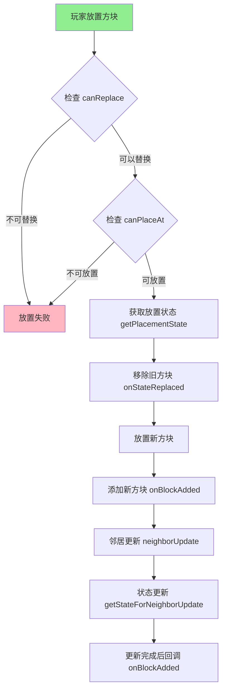
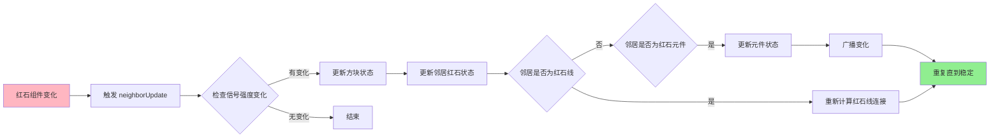

# Minecraft 1.21 方块实现详解 (Block Implementations)

## 目录

1. [概述](#概述)
2. [方块类层次结构](#方块类层次结构)
3. [基础方块类型](#基础方块类型)
4. [功能方块](#功能方块)
5. [红石系统](#红石系统)
6. [植物方块](#植物方块)
7. [自定义方块](#自定义方块)
8. [源码分析](#源码分析)
9. [Mermaid 流程图](#mermaid-流程图)

---

## 概述

Minecraft 1.21 的方块系统是游戏世界的基础构建单元。在 `net.minecraft.block` 包中，共有超过 300 个 Java 文件定义和实现了各种方块类型。本文档深入分析这些方块实现的架构设计、核心机制和代码模式。

**源码路径：** `D:\Minecraft-Learning\assets\mc\1.21\net\minecraft\block\`

**核心设计理念：**

- **单例模式**：每种方块类型在游戏中只有一个实例
- **状态驱动**：通过 `BlockState` 表示方块的运行时变体
- **接口组合**：使用 Java 接口实现行为的灵活组合
- **工厂方法**：通过 `BlockEntityProvider` 接口创建方块实体

---

## 方块类层次结构

### 继承树概览

```
AbstractBlock
├── Block (核心方块类)
│   ├── AirBlock (空气方块)
│   ├── LeavesBlock (树叶方块)
│   ├── WoodBlock (木头方块)
│   ├── CropBlock (作物方块)
│   ├── PlantBlock (植物基类)
│   │   ├── SaplingBlock (树苗)
│   │   └── FlowerBlock (花朵)
│   ├── RedstoneWireBlock (红石线)
│   ├── PistonBlock (活塞)
│   ├── ChestBlock (箱子)
│   ├── DoorBlock (门)
│   ├── SignBlock (告示牌)
│   ├── PressurePlateBlock (压力板)
│   ├── RepeaterBlock (中继器)
│   └── FurnaceBlock (熔炉)
└── BlockWithEntity (带方块实体的方块)
    ├── AbstractChestBlock
    │   └── ChestBlock / TrappedChestBlock
    ├── AbstractFurnaceBlock
    │   └── FurnaceBlock / BlastFurnaceBlock / SmokerBlock
    └── [其他功能方块...]
```

### Block 类的核心职责

```1:290:D:\Minecraft-Learning\assets\mc\1.21\net\minecraft\block\Block.java
public class Block
extends AbstractBlock
implements ItemConvertible,
FabricBlock {
    
    // 注册表条目 - 每个方块类型对应一个注册表引用
    private final RegistryEntry.Reference<Block> registryEntry = Registries.BLOCK.createEntry(this);
    
    // 方块状态管理器
    protected final StateManager<Block, BlockState> stateManager;
    private BlockState defaultState;
    
    // 方块状态ID映射
    public static final IdList<BlockState> STATE_IDS = new IdList();
    
    // 通知标志位
    public static final int NOTIFY_NEIGHBORS = 1;
    public static final int NOTIFY_LISTENERS = 2;
    public static final int NO_REDRAW = 4;
    public static final int REDRAW_ON_MAIN_THREAD = 8;
    // ...
    
    public Block(AbstractBlock.Settings settings) {
        super(settings);
        StateManager.Builder<Block, BlockState> builder = 
            new StateManager.Builder<Block, BlockState>(this);
        this.appendProperties(builder);
        this.stateManager = builder.build(Block::getDefaultState, BlockState::new);
        this.setDefaultState(this.stateManager.getDefaultState());
    }
}
```

**Block 类的核心方法：**

| 方法 | 用途 |
|------|------|
| `getDefaultState()` | 获取默认方块状态 |
| `getStateForNeighborUpdate()` | 邻居更新时返回新状态 |
| `onBlockAdded()` | 方块被放置时调用 |
| `onStateReplaced()` | 方块状态被替换时调用 |
| `neighborUpdate()` | 邻居方块更新时调用 |
| `randomTick()` | 随机刻执行（需要启用） |
| `scheduledTick()` | 计划刻执行 |
| `appendProperties()` | 注册方块属性 |

---

## 基础方块类型

### AirBlock - 空气方块

最简化的方块实现示例，仅覆盖必要的渲染和行为：

```17:38:D:\Minecraft-Learning\assets\mc\1.21\net\minecraft\block\AirBlock.java
public class AirBlock
extends Block {
    public static final MapCodec<AirBlock> CODEC = AirBlock.createCodec(AirBlock::new);

    public MapCodec<AirBlock> getCodec() {
        return CODEC;
    }

    public AirBlock(AbstractBlock.Settings settings) {
        super(settings);
    }

    @Override
    protected BlockRenderType getRenderType(BlockState state) {
        return BlockRenderType.INVISIBLE;
    }

    @Override
    protected VoxelShape getOutlineShape(BlockState state, BlockView world, BlockPos pos, ShapeContext context) {
        return VoxelShapes.empty();
    }
}
```

**特点：**
- 不可见（`BlockRenderType.INVISIBLE`）
- 无碰撞箱（`VoxelShapes.empty()`）
- 作为空白占位符使用

### LeavesBlock - 树叶方块

树叶方块展示了方块状态管理的典型模式：

```33:156:D:\Minecraft-Learning\assets\mc\1.21\net\minecraft\block\LeavesBlock.java
public class LeavesBlock
extends Block
implements Waterloggable {
    public static final MapCodec<LeavesBlock> CODEC = LeavesBlock.createCodec(LeavesBlock::new);
    public static final int MAX_DISTANCE = 7;
    public static final IntProperty DISTANCE = Properties.DISTANCE_1_7;
    public static final BooleanProperty PERSISTENT = Properties.PERSISTENT;
    public static final BooleanProperty WATERLOGGED = Properties.WATERLOGGED;

    public LeavesBlock(AbstractBlock.Settings settings) {
        super(settings);
        this.setDefaultState((BlockState)((BlockState)((BlockState)((BlockState)this.stateManager.getDefaultState())
            .with(DISTANCE, 7))
            .with(PERSISTENT, false))
            .with(WATERLOGGED, false));
    }

    @Override
    protected boolean hasRandomTicks(BlockState state) {
        return state.get(DISTANCE) == 7 && state.get(PERSISTENT) == false;
    }

    @Override
    protected void randomTick(BlockState state, ServerWorld world, BlockPos pos, Random random) {
        if (this.shouldDecay(state)) {
            LeavesBlock.dropStacks(state, world, pos);
            world.removeBlock(pos, false);
        }
    }

    @Override
    protected BlockState getStateForNeighborUpdate(BlockState state, Direction direction, 
            BlockState neighborState, WorldAccess world, BlockPos pos, BlockPos neighborPos) {
        if (state.get(WATERLOGGED).booleanValue()) {
            world.scheduleFluidTick(pos, Fluids.WATER, Fluids.WATER.getTickRate(world));
        }
        int i = LeavesBlock.getDistanceFromLog(neighborState) + 1;
        if (i != 1 || state.get(DISTANCE) != i) {
            world.scheduleBlockTick(pos, this, 1);
        }
        return state;
    }
}
```

**树叶方块的特性：**
- **DISTANCE 属性**：记录距离最近原木的格子数（1-7）
- **PERSISTENT 属性**：防止自然衰减
- **WATERLOGGED 属性**：支持含水状态
- **距离衰减机制**：当远离原木时会自然消失

---

## 功能方块

### ChestBlock - 箱子方块

箱子展示了复杂方块实体交互的实现模式：

```65:390:D:\Minecraft-Learning\assets\mc\1.21\net\minecraft\block\ChestBlock.java
public class ChestBlock
extends AbstractChestBlock<ChestBlockEntity>
implements Waterloggable {
    public static final DirectionProperty FACING = HorizontalFacingBlock.FACING;
    public static final EnumProperty<ChestType> CHEST_TYPE = Properties.CHEST_TYPE;
    public static final BooleanProperty WATERLOGGED = Properties.WATERLOGGED;
    
    protected static final VoxelShape SINGLE_SHAPE = Block.createCuboidShape(1.0, 0.0, 1.0, 15.0, 14.0, 15.0);
    
    @Override
    protected BlockRenderType getRenderType(BlockState state) {
        return BlockRenderType.ENTITYBLOCK_ANIMATED;
    }

    @Override
    public BlockEntity createBlockEntity(BlockPos pos, BlockState state) {
        return new ChestBlockEntity(pos, state);
    }

    @Override
    protected ActionResult onUse(BlockState state, World world, BlockPos pos, 
            PlayerEntity player, BlockHitResult hit) {
        if (world.isClient) {
            return ActionResult.SUCCESS;
        }
        NamedScreenHandlerFactory factory = this.createScreenHandlerFactory(state, world, pos);
        if (factory != null) {
            player.openHandledScreen(factory);
            player.incrementStat(this.getOpenStat());
            PiglinBrain.onGuardedBlockInteracted(player, true);
        }
        return ActionResult.CONSUME;
    }

    @Override
    protected boolean hasComparatorOutput(BlockState state) {
        return true;
    }

    @Override
    protected int getComparatorOutput(BlockState state, World world, BlockPos pos) {
        return ScreenHandler.calculateComparatorOutput(
            ChestBlock.getInventory(this, state, world, pos, false));
    }
}
```

**箱子方块的关键特性：**
- **双箱合并**：两个相邻同朝向箱子自动合并为大箱子
- **方块实体**：`ChestBlockEntity` 存储物品
- **GUI 交互**：玩家右键打开库存界面
- **比较器输出**：输出基于库存满度的红石信号
- **猪灵防护**：打开箱子时猪灵会愤怒

### DoorBlock - 门方块

门展示了多部分方块的管理模式：

```49:289:D:\Minecraft-Learning\assets\mc\1.21\net\minecraft\block\DoorBlock.java
public class DoorBlock
extends Block {
    public static final DirectionProperty FACING = HorizontalFacingBlock.FACING;
    public static final BooleanProperty OPEN = Properties.OPEN;
    public static final EnumProperty<DoorHinge> HINGE = Properties.DOOR_HINGE;
    public static final BooleanProperty POWERED = Properties.POWERED;
    public static final EnumProperty<DoubleBlockHalf> HALF = Properties.DOUBLE_BLOCK_HALF;
    
    protected static final VoxelShape NORTH_SHAPE = Block.createCuboidShape(0.0, 0.0, 0.0, 16.0, 16.0, 3.0);
    protected static final VoxelShape SOUTH_SHAPE = Block.createCuboidShape(0.0, 0.0, 13.0, 16.0, 16.0, 16.0);
    protected static final VoxelShape EAST_SHAPE = Block.createCuboidShape(13.0, 0.0, 0.0, 16.0, 16.0, 16.0);
    protected static final VoxelShape WEST_SHAPE = Block.createCuboidShape(0.0, 0.0, 0.0, 3.0, 16.0, 16.0);
    
    private final BlockSetType blockSetType;

    @Override
    public BlockState getPlacementState(ItemPlacementContext ctx) {
        BlockPos blockPos = ctx.getBlockPos();
        World world = ctx.getWorld();
        if (blockPos.getY() < world.getTopY() - 1 && world.getBlockState(blockPos.up()).canReplace(ctx)) {
            boolean bl = world.isReceivingRedstonePower(blockPos) || 
                         world.isReceivingRedstonePower(blockPos.up());
            return (BlockState)((BlockState)((BlockState)((BlockState)((BlockState)this.getDefaultState()
                .with(FACING, ctx.getHorizontalPlayerFacing()))
                .with(HINGE, this.getHinge(ctx)))
                .with(POWERED, bl))
                .with(OPEN, bl))
                .with(HALF, DoubleBlockHalf.LOWER);
        }
        return null;
    }

    @Override
    public void onPlaced(World world, BlockPos pos, BlockState state, 
            LivingEntity placer, ItemStack itemStack) {
        world.setBlockState(pos.up(), (BlockState)state.with(HALF, DoubleBlockHalf.UPPER), 
            Block.NOTIFY_ALL);
    }

    @Override
    protected BlockState getStateForNeighborUpdate(BlockState state, Direction direction, 
            BlockState neighborState, WorldAccess world, BlockPos pos, BlockPos neighborPos) {
        DoubleBlockHalf doubleBlockHalf = state.get(HALF);
        if (direction.getAxis() == Direction.Axis.Y && 
            doubleBlockHalf == DoubleBlockHalf.LOWER == (direction == Direction.UP)) {
            if (neighborState.getBlock() instanceof DoorBlock && neighborState.get(HALF) != doubleBlockHalf) {
                return (BlockState)neighborState.with(HALF, doubleBlockHalf);
            }
            return Blocks.AIR.getDefaultState();
        }
        // ...
    }

    @Override
    protected ActionResult onUse(BlockState state, World world, BlockPos pos, 
            PlayerEntity player, BlockHitResult hit) {
        if (!this.blockSetType.canOpenByHand()) {
            return ActionResult.PASS;
        }
        state = (BlockState)state.cycle(OPEN);
        world.setBlockState(pos, state, Block.NOTIFY_LISTENERS | Block.REDRAW_ON_MAIN_THREAD);
        this.playOpenCloseSound(player, world, pos, state.get(OPEN));
        world.emitGameEvent((Entity)player, this.isOpen(state) ? 
            GameEvent.BLOCK_OPEN : GameEvent.BLOCK_CLOSE, pos);
        return ActionResult.success(world.isClient);
    }
}
```

**门方块的核心概念：**
- **HALF 属性**：`LOWER` 和 `UPPER` 表示门的上下两部分
- **铰链方向**：自动检测周围方块确定左开还是右开
- **红石控制**：通电时自动开关
- **声音反馈**：开门关门播放不同音效

### FurnaceBlock - 熔炉方块

熔炉展示了带方块实体功能方块的典型结构：

```26:79:D:\Minecraft-Learning\assets\mc\1.21\net\minecraft\block\FurnaceBlock.java
public class FurnaceBlock
extends AbstractFurnaceBlock {
    public static final MapCodec<FurnaceBlock> CODEC = FurnaceBlock.createCodec(FurnaceBlock::new);

    @Override
    public BlockEntity createBlockEntity(BlockPos pos, BlockState state) {
        return new FurnaceBlockEntity(pos, state);
    }

    @Override
    public <T extends BlockEntity> BlockEntityTicker<T> getTicker(World world, 
            BlockState state, BlockEntityType<T> type) {
        return FurnaceBlock.validateTicker(world, type, BlockEntityType.FURNACE);
    }

    @Override
    protected void openScreen(World world, BlockPos pos, PlayerEntity player) {
        BlockEntity blockEntity = world.getBlockEntity(pos);
        if (blockEntity instanceof FurnaceBlockEntity) {
            player.openHandledScreen((NamedScreenHandlerFactory)((Object)blockEntity));
            player.incrementStat(Stats.INTERACT_WITH_FURNACE);
        }
    }

    @Override
    public void randomDisplayTick(BlockState state, World world, BlockPos pos, Random random) {
        if (!state.get(LIT).booleanValue()) {
            return;
        }
        double d = (double)pos.getX() + 0.5;
        double e = pos.getY();
        double f = (double)pos.getZ() + 0.5;
        if (random.nextDouble() < 0.1) {
            world.playSound(d, e, f, SoundEvents.BLOCK_FURNACE_FIRE_CRACKLE, 
                SoundCategory.BLOCKS, 1.0f, 1.0f, false);
        }
        Direction direction = state.get(FACING);
        Direction.Axis axis = direction.getAxis();
        double g = 0.52;
        double h = random.nextDouble() * 0.6 - 0.3;
        double i = axis == Direction.Axis.X ? (double)direction.getOffsetX() * 0.52 : h;
        double j = random.nextDouble() * 6.0 / 16.0;
        double k = axis == Direction.Axis.Z ? (double)direction.getOffsetZ() * 0.52 : h;
        world.addParticle(ParticleTypes.SMOKE, d + i, e + j, f + k, 0.0, 0.0, 0.0);
        world.addParticle(ParticleTypes.FLAME, d + i, e + j, f + k, 0.0, 0.0, 0.0);
    }
}
```

**熔炉方块的特性：**
- **方块实体**：`FurnaceBlockEntity` 管理燃料槽、输入槽、输出槽
- **Tick 系统**：通过 `BlockEntityTicker` 每刻处理烧炼逻辑
- **GUI 交互**：右键打开熔炉界面
- **粒子效果**：点燃时在客户端生成火焰和烟雾粒子

---

## 红石系统

### RedstoneWireBlock - 红石线

红石线是红石系统中最复杂的组件之一：

```47:485:D:\Minecraft-Learning\assets\mc\1.21\net\minecraft\block\RedstoneWireBlock.java
public class RedstoneWireBlock
extends Block {
    public static final EnumProperty<WireConnection> WIRE_CONNECTION_NORTH = Properties.NORTH_WIRE_CONNECTION;
    public static final EnumProperty<WireConnection> WIRE_CONNECTION_EAST = Properties.EAST_WIRE_CONNECTION;
    public static final EnumProperty<WireConnection> WIRE_CONNECTION_SOUTH = Properties.SOUTH_WIRE_CONNECTION;
    public static final EnumProperty<WireConnection> WIRE_CONNECTION_WEST = Properties.WEST_WIRE_CONNECTION;
    public static final IntProperty POWER = Properties.POWER;
    
    private static final VoxelShape DOT_SHAPE = Block.createCuboidShape(3.0, 0.0, 3.0, 13.0, 1.0, 13.0);
    private static final Map<Direction, VoxelShape> DIRECTION_TO_SIDE_SHAPE = Maps.newEnumMap(
        ImmutableMap.of(Direction.NORTH, Block.createCuboidShape(3.0, 0.0, 0.0, 13.0, 1.0, 13.0), ...));
    private static final Map<Direction, VoxelShape> DIRECTION_TO_UP_SHAPE = Maps.newEnumMap(...);
    private static final Map<BlockState, VoxelShape> SHAPES = Maps.newHashMap();
    
    private final BlockState dotState;
    private boolean wiresGivePower = true;

    @Override
    protected BlockState getStateForNeighborUpdate(BlockState state, Direction direction, 
            BlockState neighborState, WorldAccess world, BlockPos pos, BlockPos neighborPos) {
        if (direction == Direction.DOWN) {
            if (!this.canRunOnTop(world, neighborPos, neighborState)) {
                return Blocks.AIR.getDefaultState();
            }
            return state;
        }
        if (direction == Direction.UP) {
            return this.getPlacementState(world, state, pos);
        }
        WireConnection wireConnection = this.getRenderConnectionType(world, pos, direction);
        // ... 处理连接更新
        return this.getPlacementState(world, state, pos);
    }

    @Override
    protected int getStrongRedstonePower(BlockState state, BlockView world, 
            BlockPos pos, Direction direction) {
        if (!this.wiresGivePower) {
            return 0;
        }
        return state.getWeakRedstonePower(world, pos, direction);
    }

    @Override
    protected int getWeakRedstonePower(BlockState state, BlockView world, 
            BlockPos pos, Direction direction) {
        if (!this.wiresGivePower || direction == Direction.DOWN) {
            return 0;
        }
        int i = state.get(POWER);
        if (i == 0) {
            return 0;
        }
        if (direction == Direction.UP || 
            this.getPlacementState(world, state, pos).get(
                DIRECTION_TO_WIRE_CONNECTION_PROPERTY.get(direction.getOpposite())).isConnected()) {
            return i;
        }
        return 0;
    }

    @Override
    protected boolean emitsRedstonePower(BlockState state) {
        return this.wiresGivePower;
    }
}
```

**红石线的核心机制：**
- **四向连接**：每个方向可以是 `NONE`、`SIDE`、`UP`
- **信号强度**：0-15 的红石信号等级
- **衰减规则**：每格红石线信号强度减 1
- **动态形状**：根据连接状态渲染不同的碰撞箱

### PistonBlock - 活塞方块

```51:374:D:\Minecraft-Learning\assets\mc\1.21\net\minecraft\block\PistonBlock.java
public class PistonBlock
extends FacingBlock {
    public static final BooleanProperty EXTENDED = Properties.EXTENDED;
    private final boolean sticky;
    
    protected static final VoxelShape EXTENDED_EAST_SHAPE = Block.createCuboidShape(0.0, 0.0, 0.0, 12.0, 16.0, 16.0);
    // ... 其他方向的伸展形状

    @Override
    protected boolean onSyncedBlockEvent(BlockState state, World world, 
            BlockPos pos, int type, int data) {
        Direction direction = state.get(FACING);
        BlockState blockState = (BlockState)state.with(EXTENDED, true);
        
        if (type == 0) {  // 伸展
            if (!this.move(world, pos, direction, true)) return false;
            world.setBlockState(pos, blockState, Block.NOTIFY_ALL | Block.MOVED);
            world.playSound(null, pos, SoundEvents.BLOCK_PISTON_EXTEND, ...);
            world.emitGameEvent(GameEvent.BLOCK_ACTIVATE, pos, GameEvent.Emitter.of(blockState));
            return true;
        } else {  // 收缩
            // ... 收缩逻辑
            if (this.sticky) {
                // 粘性活塞：拉回前方的方块
                PistonBlockEntity pistonBlockEntity;
                BlockEntity blockEntity2;
                BlockPos blockPos = pos.add(direction.getOffsetX() * 2, ...);
                BlockState blockState3 = world.getBlockState(blockPos);
                // 处理拉回逻辑
            }
        }
        return true;
    }

    public static boolean isMovable(BlockState state, World world, BlockPos pos, 
            Direction direction, boolean canBreak, Direction pistonDir) {
        if (pos.getY() < world.getBottomY() || pos.getY() > world.getTopY() - 1) {
            return false;
        }
        if (state.isAir()) return true;
        if (state.isOf(Blocks.OBSIDIAN) || state.isOf(Blocks.CRYING_OBSIDIAN) || ...) {
            return false;
        }
        // 检查方块是否可以推动
        switch (state.getPistonBehavior()) {
            case BLOCK: return false;
            case DESTROY: return canBreak;
            case PUSH_ONLY: return direction == pistonDir;
        }
        return !state.hasBlockEntity();
    }
}
```

**活塞的工作机制：**
- **伸展/收缩**：通过同步方块事件触发
- **可推动检查**：`isMovable()` 判断方块是否可被推动
- **粘性活塞**：可拉回前方的方块
- **移动实体**：使用 `PistonExtensionBlock` 和 `PistonHandler` 管理

### RepeaterBlock - 红石中继器

```28:106:D:\Minecraft-Learning\assets\mc\1.21\net\minecraft\block\RepeaterBlock.java
public class RepeaterBlock
extends AbstractRedstoneGateBlock {
    public static final BooleanProperty LOCKED = Properties.LOCKED;
    public static final IntProperty DELAY = Properties.DELAY;

    @Override
    protected int getUpdateDelayInternal(BlockState state) {
        return state.get(DELAY) * 2;
    }

    @Override
    public boolean isLocked(WorldView world, BlockPos pos, BlockState state) {
        return this.getMaxInputLevelSides(world, pos, state) > 0;
    }

    @Override
    protected boolean getSideInputFromGatesOnly() {
        return true;
    }

    @Override
    public void randomDisplayTick(BlockState state, World world, BlockPos pos, Random random) {
        if (!state.get(POWERED).booleanValue()) return;
        Direction direction = state.get(FACING);
        double d = (double)pos.getX() + 0.5 + (random.nextDouble() - 0.5) * 0.2;
        double e = (double)pos.getY() + 0.4 + (random.nextDouble() - 0.5) * 0.2;
        double f = (double)pos.getZ() + 0.5 + (random.nextDouble() - 0.5) * 0.2;
        float g = -5.0f;
        if (random.nextBoolean()) {
            g = state.get(DELAY) * 2 - 1;
        }
        double h = (g /= 16.0f) * (float)direction.getOffsetX();
        double i = g * (float)direction.getOffsetZ();
        world.addParticle(DustParticleEffect.DEFAULT, d + h, e, f + i, 0.0, 0.0, 0.0);
    }
}
```

**中继器的特性：**
- **延迟属性**：1-4 红石刻（2-8 游戏刻）
- **锁定功能**：侧向输入可锁定中继器状态
- **信号增强**：输出固定 15 信号强度
- **粒子效果**：通电时发射红石粒子

### PressurePlateBlock - 压力板

```22:60:D:\Minecraft-Learning\assets\mc\1.21\net\minecraft\block\PressurePlateBlock.java
public class PressurePlateBlock
extends AbstractPressurePlateBlock {
    public static final BooleanProperty POWERED = Properties.POWERED;

    @Override
    protected int getRedstoneOutput(BlockState state) {
        return state.get(POWERED) != false ? 15 : 0;
    }

    @Override
    protected BlockState setRedstoneOutput(BlockState state, int rsOut) {
        return (BlockState)state.with(POWERED, rsOut > 0);
    }

    @Override
    protected int getRedstoneOutput(World world, BlockPos pos) {
        Class<Entity> class_ = switch (this.blockSetType.pressurePlateSensitivity()) {
            case BlockSetType.ActivationRule.EVERYTHING -> Entity.class;
            case BlockSetType.ActivationRule.MOBS -> LivingEntity.class;
        };
        return PressurePlateBlock.getEntityCount(world, BOX.offset(pos), class_) > 0 ? 15 : 0;
    }
}
```

**压力板的特性：**
- **灵敏度配置**：可通过 `BlockSetType` 配置检测对象
- **信号输出**：检测到实体时输出 15，否则输出 0
- **权重压力板**：支持可变信号强度（轻/重）

---

## 植物方块

### CropBlock - 作物方块

```33:190:D:\Minecraft-Learning\assets\mc\1.21\net\minecraft\block\CropBlock.java
public class CropBlock
extends PlantBlock
implements Fertilizable {
    public static final int MAX_AGE = 7;
    public static final IntProperty AGE = Properties.AGE_7;
    private static final VoxelShape[] AGE_TO_SHAPE = new VoxelShape[]{
        Block.createCuboidShape(0.0, 0.0, 0.0, 16.0, 2.0, 16.0),
        Block.createCuboidShape(0.0, 0.0, 0.0, 16.0, 4.0, 16.0),
        Block.createCuboidShape(0.0, 0.0, 0.0, 16.0, 6.0, 16.0),
        // ... 直至 AGE 7
    };

    @Override
    protected VoxelShape getOutlineShape(BlockState state, BlockView world, 
            BlockPos pos, ShapeContext context) {
        return AGE_TO_SHAPE[this.getAge(state)];
    }

    @Override
    protected boolean canPlantOnTop(BlockState floor, BlockView world, BlockPos pos) {
        return floor.isOf(Blocks.FARMLAND);
    }

    protected IntProperty getAgeProperty() {
        return AGE;
    }

    public int getMaxAge() {
        return 7;
    }

    public int getAge(BlockState state) {
        return state.get(this.getAgeProperty());
    }

    public BlockState withAge(int age) {
        return (BlockState)this.getDefaultState().with(this.getAgeProperty(), age);
    }

    public final boolean isMature(BlockState state) {
        return this.getAge(state) >= this.getMaxAge();
    }

    @Override
    protected boolean hasRandomTicks(BlockState state) {
        return !this.isMature(state);
    }

    @Override
    protected void randomTick(BlockState state, ServerWorld world, BlockPos pos, Random random) {
        float f;
        int i;
        if (world.getBaseLightLevel(pos, 0) >= 9 && 
            (i = this.getAge(state)) < this.getMaxAge() && 
            random.nextInt((int)(25.0f / (f = CropBlock.getAvailableMoisture(this, world, pos))) + 1) == 0) {
            world.setBlockState(pos, this.withAge(i + 1), Block.NOTIFY_LISTENERS);
        }
    }

    protected static float getAvailableMoisture(Block block, BlockView world, BlockPos pos) {
        float f = 1.0f;
        BlockPos blockPos = pos.down();
        for (int i = -1; i <= 1; ++i) {
            for (int j = -1; j <= 1; ++j) {
                float g = 0.0f;
                BlockState blockState = world.getBlockState(blockPos.add(i, 0, j));
                if (blockState.isOf(Blocks.FARMLAND)) {
                    g = 1.0f;
                    if (blockState.get(FarmlandBlock.MOISTURE) > 0) {
                        g = 3.0f;
                    }
                }
                // 距离衰减和邻接作物检查
            }
        }
        return f;
    }

    @Override
    public boolean isFertilizable(WorldView world, BlockPos pos, BlockState state) {
        return !this.isMature(state);
    }

    @Override
    public void grow(ServerWorld world, Random random, BlockPos pos, BlockState state) {
        this.applyGrowth(world, pos, state);
    }
}
```

**作物方块的生长机制：**
- **年龄属性**：0-7 表示生长阶段
- **生长条件**：需要足够光照（>=9）和水分
- **随机刻**：每刻有一定概率生长
- **骨粉支持**：实现 `Fertilizable` 接口支持骨粉施肥

### SaplingBlock - 树苗方块

```27:85:D:\Minecraft-Learning\assets\mc\1.21\net\minecraft\block\SaplingBlock.java
public class SaplingBlock
extends PlantBlock
implements Fertilizable {
    public static final IntProperty STAGE = Properties.STAGE;
    protected static final float field_31236 = 6.0f;
    protected static final VoxelShape SHAPE = Block.createCuboidShape(2.0, 0.0, 2.0, 14.0, 12.0, 14.0);
    protected final SaplingGenerator generator;

    @Override
    protected void randomTick(BlockState state, ServerWorld world, BlockPos pos, Random random) {
        if (world.getLightLevel(pos.up()) >= 9 && random.nextInt(7) == 0) {
            this.generate(world, pos, state, random);
        }
    }

    public void generate(ServerWorld world, BlockPos pos, BlockState state, Random random) {
        if (state.get(STAGE) == 0) {
            world.setBlockState(pos, (BlockState)state.cycle(STAGE), Block.NO_REDRAW);
        } else {
            this.generator.generate(world, world.getChunkManager().getChunkGenerator(), 
                pos, state, random);
        }
    }

    @Override
    public boolean isFertilizable(WorldView world, BlockPos pos, BlockState state) {
        return true;
    }

    @Override
    public boolean canGrow(World world, Random random, BlockPos pos, BlockState state) {
        return (double)world.random.nextFloat() < 0.45;
    }

    @Override
    public void grow(ServerWorld world, Random random, BlockPos pos, BlockState state) {
        this.generate(world, pos, state, random);
    }
}
```

**树苗的生成机制：**
- **阶段属性**：0 表示小树苗，1 表示准备生成
- **生长条件**：上方光照等级 >= 9
- **树形生成器：`SaplingGenerator` 负责生成具体树形
- **随机性**：每刻 1/7 概率尝试生长

---

## 自定义方块

### BlockEntityProvider 接口

任何需要持久化数据的方块都需要实现此接口：

```30:92:D:\Minecraft-Learning\assets\mc\1.21\net\minecraft\block\BlockEntityProvider.java
public interface BlockEntityProvider {
    /**
     * 创建方块实体实例
     */
    @Nullable
    public BlockEntity createBlockEntity(BlockPos var1, BlockState var2);

    /**
     * 获取方块实体的 Ticker（每刻调用）
     */
    @Nullable
    default public <T extends BlockEntity> BlockEntityTicker<T> getTicker(
            World world, BlockState state, BlockEntityType<T> type) {
        return null;
    }

    /**
     * 获取游戏事件监听器
     */
    @Nullable
    default public <T extends BlockEntity> GameEventListener getGameEventListener(
            ServerWorld world, T blockEntity) {
        if (blockEntity instanceof GameEventListener.Holder) {
            return ((GameEventListener.Holder)blockEntity).getEventListener();
        }
        return null;
    }
}
```

### 创建自定义方块的步骤

1. **定义方块类**
```java
public class MyCustomBlock extends Block {
    public static final BooleanProperty ACTIVATED = BooleanProperty.of("activated");
    
    public MyCustomBlock(AbstractBlock.Settings settings) {
        super(settings);
        setDefaultState(getDefaultState().with(ACTIVATED, false));
    }
    
    @Override
    protected void appendProperties(StateManager.Builder<Block, BlockState> builder) {
        builder.add(ACTIVATED);
    }
}
```

2. **实现 BlockEntityProvider**
```java
public class MyCustomBlock extends Block implements BlockEntityProvider {
    @Override
    public BlockEntity createBlockEntity(BlockPos pos, BlockState state) {
        return new MyCustomBlockEntity(pos, state);
    }
    
    @Override
    public <T extends BlockEntity> BlockEntityTicker<T> getTicker(
            World world, BlockState state, BlockEntityType<T> type) {
        return MyCustomBlock.validateTicker(type, MyBlockEntities.MY_CUSTOM, 
            MyCustomBlockEntity::tick);
    }
}
```

3. **注册方块和方块实体**
```java
public class MyMod {
    public static final Block MY_CUSTOM_BLOCK = Registry.register(
        Registries.BLOCK,
        Identifier.of("mymod", "my_custom_block"),
        new MyCustomBlock(AbstractBlock.Settings.copy(Blocks.STONE))
    );
    
    public static final BlockEntityType<MyCustomBlockEntity> MY_CUSTOM = 
        BlockEntityType.Builder.create(MyCustomBlock::new, MY_CUSTOM_BLOCK)
            .build(dispenser());
}

public class MyCustomBlockEntity extends BlockEntity {
    public MyCustomBlockEntity(BlockPos pos, BlockState state) {
        super(MyBlockEntities.MY_CUSTOM, pos, state);
    }
    
    public static void tick(World world, BlockPos pos, BlockState state, 
            MyCustomBlockEntity blockEntity) {
        // 每刻执行的逻辑
    }
}
```

---

## 源码分析

### 方块注册表

所有方块通过 `Registries.BLOCK` 注册表统一管理：

```java
// Blocks.java 中的注册示例
public class Blocks {
    public static final Block AIR = new AirBlock(AbstractBlock.Settings.create()
        .allowsSpawning(Blocks::never)
        .solidBlock(Blocks::never)
        .suffocates(Blocks::never)
        .blockVision(Blocks::never));
    
    public static final Block STONE = new Block(AbstractBlock.Settings.copy(STONE));
    
    // 箱子使用特殊的 BlockSetType
    public static final Block CHEST = new ChestBlock(
        AbstractBlock.Settings.copy(STONE), 
        () -> BlockEntityType.CHEST
    );
    
    static {
        // 注册到注册表
        register(Registries.BLOCK, Identifier.ofVanilla("chest"), CHEST);
    }
}
```

### 方块属性系统

方块状态由 `StateManager` 管理：

```java
// 方块属性定义
public static final BooleanProperty POWERED = BooleanProperty.of("powered");
public static final IntProperty AGE = IntProperty.of("age", 0, 7);
public static final EnumProperty<Direction> FACING = DirectionProperty.create("facing", 
    Direction.NORTH, Direction.SOUTH, Direction.EAST, Direction.WEST);
public static final EnumProperty<ChestType> CHEST_TYPE = EnumProperty.of("type", ChestType.class);

// 注册属性
@Override
protected void appendProperties(StateManager.Builder<Block, BlockState> builder) {
    builder.add(POWERED, FACING, CHEST_TYPE);
}
```

### 方块渲染类型

| 渲染类型 | 用途 | 示例 |
|---------|------|------|
| `MODEL` | 标准方块模型 | 石头、草方块 |
| `ENTITYBLOCK_ANIMATED` | 带动画的方块实体 | 箱子、熔炉、活塞 |
| `INVISIBLE` | 不可见 | 空气、移动中的活塞头 |
| `TRANSLUCENT` | 半透明 | 染色玻璃、冰 |
| `CUTOUT` | 裁剪透明 | 树叶、旗帜 |

---

## Mermaid 流程图

### 方块放置流程



### 红石信号传播流程



### 方块实体生命周期

```mermaid
stateDiagram-v2
    [*] --> 创建: createBlockEntity
    创建 --> 加载: 从 NBT 恢复数据
    创建 --> 空状态: 新放置
    加载 --> 活跃: markDirty 调用 save
    空状态 --> 活跃: 玩家交互
    活跃 --> 活跃: 每刻 tick
    活跃 --> 保存: 世界保存/区块卸载
    活跃 --> 销毁: 方块被破坏
    保存 --> 加载: 世界重新加载
    销毁 --> [*]
    
    note right of 活跃: Ticker 每刻调用
    note right of 保存: 触发 toUpdatePacket
```



---

## 总结

Minecraft 1.21 的方块系统展现了高度模块化和可扩展的设计：

1. **继承层次清晰**：从 `AbstractBlock` 到具体方块类，逐层添加功能
2. **接口组合灵活**：通过 `Waterloggable`、`Fertilizable` 等接口添加可选行为
3. **状态驱动设计**：使用 `BlockState` 属性系统表示方块的运行时变体
4. **方块实体分离**：需要持久化数据的方块通过 `BlockEntityProvider` 创建方块实体
5. **事件系统完善**：通过 `syncedBlockEvent` 实现客户端-服务器同步
6. **渲染类型多样**：支持不同渲染模式以实现各种视觉效果

这套系统为 Mod 开发提供了清晰的扩展点，同时也保持了游戏的核心性能。理解这些设计模式对于深入学习 Minecraft 源码和进行 Mod 开发都至关重要。

---

## 显式覆盖文件

本文档显式覆盖以下 `net.minecraft.block` 包下的源码文件：

### 核心基类 (block/)

| 类名 | 包路径 | 说明 |
|------|--------|------|
| `Block.java` | net/minecraft/block | 方块基类，定义方块通用行为 |
| `AbstractBlock.java` | net/minecraft/block | 抽象方块实现，包含方块状态管理 |
| `BlockState.java` | net/minecraft/block | 方块状态类，存储方块运行时属性 |
| `Blocks.java` | net/minecraft/block | 所有方块实例的注册表 |
| `BlockRenderType.java` | net/minecraft/block | 方块渲染类型枚举 |
| `BlockSetType.java` | net/minecraft/block | 方块套装类型 |
| `BlockTypes.java` | net/minecraft/block | 方块类型定义 |
| `BlockWithEntity.java` | net/minecraft/block | 带方块实体的方块基类 |
| `BlockEntityProvider.java` | net/minecraft/block | 方块实体提供者接口 |
| `BlockKeys.java` | net/minecraft/block | 方块快捷键定义 |

### 抽象方块类 (block/)

| 类名 | 包路径 | 说明 |
|------|--------|------|
| `AbstractBannerBlock.java` | net/minecraft/block | 旗帜方块抽象 |
| `AbstractCandleBlock.java` | net/minecraft/block | 蜡烛方块抽象 |
| `AbstractCauldronBlock.java` | net/minecraft/block | 炼药锅抽象 |
| `AbstractChestBlock.java` | net/minecraft/block | 箱子方块抽象 |
| `AbstractFireBlock.java` | net/minecraft/block | 火方块抽象 |
| `AbstractFurnaceBlock.java` | net/minecraft/block | 熔炉方块抽象 |
| `AbstractPlantBlock.java` | net/minecraft/block | 植物方块抽象 |
| `AbstractPressurePlateBlock.java` | net/minecraft/block | 压力板抽象 |
| `AbstractRailBlock.java` | net/minecraft/block | 铁轨方块抽象 |
| `AbstractRedstoneGateBlock.java` | net/minecraft/block | 红石门抽象 |
| `AbstractSignBlock.java` | net/minecraft/block | 告示牌抽象 |
| `AbstractSkullBlock.java` | net/minecraft/block | 头颅方块抽象 |
| `AbstractTorchBlock.java` | net/minecraft/block | 火把抽象 |

### 功能方块 (block/)

| 类名 | 包路径 | 说明 |
|------|--------|------|
| `AirBlock.java` | net/minecraft/block | 空气方块 |
| `ChestBlock.java` | net/minecraft/block | 箱子方块 |
| `FurnaceBlock.java` | net/minecraft/block | 熔炉方块 |
| `BlastFurnaceBlock.java` | net/minecraft/block | 高炉方块 |
| `SmokerBlock.java` | net/minecraft/block | 烟熏炉方块 |
| `DoorBlock.java` | net/minecraft/block | 门方块 |
| `TrapdoorBlock.java` | net/minecraft/block | 活板门方块 |
| `BedBlock.java` | net/minecraft/block | 床方块 |
| `BarrelBlock.java` | net/minecraft/block | 木桶方块 |
| `BeaconBlock.java` | net/minecraft/block | 信标方块 |
| `AnvilBlock.java` | net/minecraft/block | 铁砧方块 |
| `GrindstoneBlock.java` | net/minecraft/block | 砂轮方块 |
| `SmithingTableBlock.java` | net/minecraft/block | 锻造台方块 |
| `CartographyTableBlock.java` | net/minecraft/block | 制图台方块 |
| `FletchingTableBlock.java` | net/minecraft/block | 弓箭台方块 |
| `LoomBlock.java` | net/minecraft/block | 织布机方块 |
| `StonecutterBlock.java` | net/minecraft/block | 切石机方块 |
| `EnchantingTableBlock.java` | net/minecraft/block | 附魔台方块 |
| `BrewingStandBlock.java` | net/minecraft/block | 酿造台方块 |
| `CauldronBlock.java` | net/minecraft/block | 炼药锅方块 |
| `ComposterBlock.java` | net/minecraft/block | 堆肥桶方块 |
| `CrafterBlock.java` | net/minecraft/block | 合成器方块 |
| `ChiseledBookshelfBlock.java` | net/minecraft/block | 书架方块 |
| `DecoratedPotBlock.java` | net/minecraft/block | 装饰陶罐方块 |
| `JukeboxBlock.java` | net/minecraft/block | 音乐盒方块 |
| `LecternBlock.java` | net/minecraft/block | 讲台方块 |
| `NoteBlock.java` | net/minecraft/block | 音符盒方块 |
| `CraftingTableBlock.java` | net/minecraft/block | 工作台方块 |

### 红石方块 (block/)

| 类名 | 包路径 | 说明 |
|------|--------|------|
| `RedstoneWireBlock.java` | net/minecraft/block | 红石线方块 |
| `RedstoneTorchBlock.java` | net/minecraft/block | 红石火把方块 |
| `RedstoneBlock.java` | net/minecraft/block | 红石方块 |
| `RedstoneOreBlock.java` | net/minecraft/block | 红石矿方块 |
| `RedstoneLampBlock.java` | net/minecraft/block | 红石灯方块 |
| `PistonBlock.java` | net/minecraft/block | 活塞方块 |
| `PistonHeadBlock.java` | net/minecraft/block | 活塞头方块 |
| `PistonExtensionBlock.java` | net/minecraft/block | 活塞伸展方块 |
| `RepeaterBlock.java` | net/minecraft/block | 红石中继器方块 |
| `ComparatorBlock.java` | net/minecraft/block | 红石比较器方块 |
| `PressurePlateBlock.java` | net/minecraft/block | 压力板方块 |
| `WeightedPressurePlateBlock.java` | net/minecraft/block | 权重压力板方块 |
| `ButtonBlock.java` | net/minecraft/block | 按钮方块 |
| `LeverBlock.java` | net/minecraft/block | 拉杆方块 |
| `TripwireHookBlock.java` | net/minecraft/block | 绊线钩方块 |
| `TripwireBlock.java` | net/minecraft/block | 绊线方块 |
| `ObserverBlock.java` | net/minecraft/block | 观察者方块 |
| `TargetBlock.java` | net/minecraft/block | 标靶方块 |
| `DaylightDetectorBlock.java` | net/minecraft/block | 阳光探测器方块 |
| `HopperBlock.java` | net/minecraft/block | 漏斗方块 |
| `DispenserBlock.java` | net/minecraft/block | 投掷器方块 |
| `DropperBlock.java` | net/minecraft/block | 投掷器(无发射)方块 |
| `TrappedChestBlock.java` | net/minecraft/block | 陷阱箱方块 |
| `CommandBlock.java` | net/minecraft/block | 命令方块 |
| `ChainBlock.java` | net/minecraft/block | 锁链方块 |
| `LightningRodBlock.java` | net/minecraft/block | 避雷针方块 |
| `SculkSensorBlock.java` | net/minecraft/block | 幽匿传感器方块 |
| `CalibratedSculkSensorBlock.java` | net/minecraft/block | 校准幽匿传感器方块 |
| `SculkCatalystBlock.java` | net/minecraft/block | 幽匿催泪体方块 |
| `SculkShriekerBlock.java` | net/minecraft/block | 幽匿尖啸体方块 |
| `TrialSpawnerBlock.java` | net/minecraft/block | 试用刷怪笼方块 |
| `VaultBlock.java` | net/minecraft/block | 保险库方块 |

### 容器方块 (block/)

| 类名 | 包路径 | 说明 |
|------|--------|------|
| `ShulkerBoxBlock.java` | net/minecraft/block | 潜影盒方块 |
| `EnderChestBlock.java` | net/minecraft/block | 末影箱方块 |
| `HopperBlock.java` | net/minecraft/block | 漏斗方块 |

### 植物与农业方块 (block/)

| 类名 | 包路径 | 说明 |
|------|--------|------|
| `CropBlock.java` | net/minecraft/block | 作物方块基类 |
| `SaplingBlock.java` | net/minecraft/block | 树苗方块 |
| `SaplingGenerator.java` | net/minecraft/block | 树苗生成器 |
| `FlowerBlock.java` | net/minecraft/block | 花朵方块 |
| `TallFlowerBlock.java` | net/minecraft/block | 高花朵方块 |
| `PlantBlock.java` | net/minecraft/block | 植物方块基类 |
| `GrassBlock.java` | net/minecraft/block | 草方块 |
| `MyceliumBlock.java` | net/minecraft/block | 菌丝方块 |
| `NyliumBlock.java` | net/minecraft/block | 下界岩方块 |
| `PodzolBlock.java` | net/minecraft/block | 灰化土方块 |
| `RootsBlock.java` | net/minecraft/block | 根部方块 |
| `MossBlock.java` | net/minecraft/block | 苔藓方块 |
| `MangroveLeavesBlock.java` | net/minecraft/block | 红树树叶方块 |
| `CherryLeavesBlock.java` | net/minecraft/block | 樱花树叶方块 |
| `LeavesBlock.java` | net/minecraft/block | 树叶方块 |
| `SugarCaneBlock.java` | net/minecraft/block | 甘蔗方块 |
| `KelpBlock.java` | net/minecraft/block | 海带方块 |
| `SeagrassBlock.java` | net/minecraft/block | 海草方块 |
| `BambooBlock.java` | net/minecraft/block | 竹子方块 |
| `CactusBlock.java` | net/minecraft/block | 仙人掌方块 |
| `CakeBlock.java` | net/minecraft/block | 蛋糕方块 |
| `FarmlandBlock.java` | net/minecraft/block | 耕地方块 |
| `NetherWartBlock.java` | net/minecraft/block | 下界疣方块 |
| `CaveVinesBlock.java` | net/minecraft/block | 洞穴藤蔓方块 |
| `SporeBlossomBlock.java` | net/minecraft/block | 孢子花方块 |
| `BigDripleafBlock.java` | net/minecraft/block | 大滴水叶方块 |
| `SmallDripleafBlock.java` | net/minecraft/block | 小滴水叶方块 |
| `HangingRootsBlock.java` | net/minecraft/block | 垂根方块 |
| `PitcherCropBlock.java` | net/minecraft/block | 紫颂花方块 |
| `TorchflowerBlock.java` | net/minecraft/block | 火把花方块 |

### 矿物与石材方块 (block/)

| 类名 | 包路径 | 说明 |
|------|--------|------|
| `AmethystBlock.java` | net/minecraft/block | 紫水晶方块 |
| `AmethystClusterBlock.java` | net/minecraft/block | 紫水晶簇方块 |
| `BuddingAmethystBlock.java` | net/minecraft/block | 萌芽紫水晶方块 |
| `CobblestoneBlock.java` | net/minecraft/block | 圆石方块 |
| `StoneBlock.java` | net/minecraft/block | 石头方块 |
| `DeepslateBlock.java` | net/minecraft/block | 深板岩方块 |
| `AndesiteBlock.java` | net/minecraft/block | 安山岩方块 |
| `DioriteBlock.java` | net/minecraft/block | 闪长岩方块 |
| `GraniteBlock.java` | net/minecraft/block | 花岗岩方块 |
| `TuffBlock.java` | net/minecraft/block | 凝灰岩方块 |
| `CalciteBlock.java` | net/minecraft/block | 霰石方块 |
| `DripstoneBlock.java` | net/minecraft/block | 滴水石方块 |
| `PointedDripstoneBlock.java` | net/minecraft/block | 滴水石锥方块 |
| `MagmaBlock.java` | net/minecraft/block | 岩浆块方块 |
| `NetherrackBlock.java` | net/minecraft/block | 下界岩方块 |
| `BasaltBlock.java` | net/minecraft/block | 玄武岩方块 |
| `BlackstoneBlock.java` | net/minecraft/block | 黑石方块 |
| `CryingObsidianBlock.java` | net/minecraft/block | 哭泣的黑曜石方块 |
| `ObsidianBlock.java` | net/minecraft/block | 黑曜石方块 |
| `CoalOreBlock.java` | net/minecraft/block | 煤矿石方块 |
| `IronOreBlock.java` | net/minecraft/block | 铁矿石方块 |
| `GoldOreBlock.java` | net/minecraft/block | 金矿石方块 |
| `CopperOreBlock.java` | net/minecraft/block | 铜矿石方块 |
| `LapisOreBlock.java` | net/minecraft/block | 青金石矿石方块 |
| `RedstoneOreBlock.java` | net/minecraft/block | 红石矿石方块 |
| `EmeraldOreBlock.java` | net/minecraft/block | 绿宝石矿石方块 |
| `DiamondOreBlock.java` | net/minecraft/block | 钻石矿石方块 |
| `NetherGoldOreBlock.java` | net/minecraft/block | 下界金矿石方块 |
| `NetherQuartzOreBlock.java` | net/minecraft/block | 下界石英矿石方块 |

### 建筑方块 (block/)

| 类名 | 包路径 | 说明 |
|------|--------|------|
| `StairsBlock.java` | net/minecraft/block | 楼梯方块 |
| `SlabBlock.java` | net/minecraft/block | 半砖方块 |
| `WallBlock.java` | net/minecraft/block | 墙方块 |
| `FenceBlock.java` | net/minecraft/block | 栅栏方块 |
| `FenceGateBlock.java` | net/minecraft/block | 栅栏门方块 |
| `GateBlock.java` | net/minecraft/block | 门方块(通用) |
| `PaneBlock.java` | net/minecraft/block | 板状方块 |
| `IronBarsBlock.java` | net/minecraft/block | 铁栏杆方块 |
| `GlassBlock.java` | net/minecraft/block | 玻璃方块 |
| `TintedGlassBlock.java` | net/minecraft/block | 染色玻璃方块 |
| `GlassPaneBlock.java` | net/minecraft/block | 玻璃板方块 |
| `StainedGlassBlock.java` | net/minecraft/block | 染色玻璃方块 |
| `StainedGlassPaneBlock.java` | net/minecraft/block | 染色玻璃板方块 |
| `GlazedTerracottaBlock.java` | net/minecraft/block | 釉陶方块 |
| `ConcreteBlock.java` | net/minecraft/block | 混凝土方块 |
| `ConcretePowderBlock.java` | net/minecraft/block | 混凝土粉末方块 |
| `TerracottaBlock.java` | net/minecraft/block | 陶瓦方块 |
| `BrickBlock.java` | net/minecraft/block | 砖方块 |
| `HayBlock.java` | net/minecraft/block | 干草块方块 |
| `SnowBlock.java` | net/minecraft/block | 雪块方块 |
| `IceBlock.java` | net/minecraft/block | 冰方块 |
| `PackedIceBlock.java` | net/minecraft/block | 浮冰方块 |
| `BlueIceBlock.java` | net/minecraft/block | 蓝冰方块 |
| `FrostedIceBlock.java` | net/minecraft/block | 霜冰方块 |
| `PowderSnowBlock.java` | net/minecraft/block | 细雪方块 |
| `SpongeBlock.java` | net/minecraft/block | 海绵方块 |
| `WetSpongeBlock.java` | net/minecraft/block | 湿海绵方块 |
| `CarpetBlock.java` | net/minecraft/block | 地毯方块 |
| `DyedCarpetBlock.java` | net/minecraft/block | 染色地毯方块 |
| `BedrockBlock.java` | net/minecraft/block | 基岩方块 |
| `BarrierBlock.java` | net/minecraft/block | 屏障方块 |

### 特殊方块 (block/)

| 类名 | 包路径 | 说明 |
|------|--------|------|
| `SignBlock.java` | net/minecraft/block | 告示牌方块 |
| `HangingSignBlock.java` | net/minecraft/block | 悬挂告示牌方块 |
| `WallSignBlock.java` | net/minecraft/block | 墙上告示牌方块 |
| `WallHangingSignBlock.java` | net/minecraft/block | 墙上悬挂告示牌方块 |
| `SkullBlock.java` | net/minecraft/block | 头颅方块 |
| `PlayerSkullBlock.java` | net/minecraft/block | 玩家头颅方块 |
| `WallSkullBlock.java` | net/minecraft/block | 墙上头颅方块 |
| `WallPlayerSkullBlock.java` | net/minecraft/block | 墙上玩家头颅方块 |
| `WitherSkullBlock.java` | net/minecraft/block | 凋零头颅方块 |
| `WallWitherSkullBlock.java` | net/minecraft/block | 墙上凋零头颅方块 |
| `WallPiglinHeadBlock.java` | net/minecraft/block | 墙上猪灵头颅方块 |
| `BannerBlock.java` | net/minecraft/block | 旗帜方块 |
| `WallBannerBlock.java` | net/minecraft/block | 墙上旗帜方块 |
| `EndRodBlock.java` | net/minecraft/block | 末影烛方块 |
| `DragonEggBlock.java` | net/minecraft/block | 龙蛋方块 |
| `EndPortalBlock.java` | net/minecraft/block | 末地传送门方块 |
| `EndPortalFrameBlock.java` | net/minecraft/block | 末地传送门框架方块 |
| `EndGatewayBlock.java` | net/minecraft/block | 末地折跃门方块 |
| `NetherPortalBlock.java` | net/minecraft/block | 下界传送门方块 |
| `Portal.java` | net/minecraft/block | 传送门工具类 |
| `RespawnAnchorBlock.java` | net/minecraft/block | 重生锚方块 |
| `BedrockBlock.java` | net/minecraft/block | 基岩方块 |
| `StructureBlock.java` | net/minecraft/block | 结构方块 |
| `StructureVoidBlock.java` | net/minecraft/block | 结构空位方块 |
| `JigsawBlock.java` | net/minecraft/block | 拼图方块 |
| `LightBlock.java` | net/minecraft/block | 光源方块 |
| `LightWeightedPressurePlateBlock.java` | net/minecraft/block | 轻量级压力板方块 |
| `HeavyCoreBlock.java` | net/minecraft/block | 重核方块 |
| `MovingBlock.java` | net/minecraft/block | 移动中的方块 |
| `OperatorBlock.java` | net/minecraft/block | 管理员方块 |
| `BubbleColumnBlock.java` | net/minecraft/block | 气泡柱方块 |

### 辅助接口与工具类 (block/)

| 类名 | 包路径 | 说明 |
|------|--------|------|
| `Waterloggable.java` | net/minecraft/block | 可注水接口 |
| `Fertilizable.java` | net/minecraft/block | 可施肥接口 |
| `Degradable.java` | net/minecraft/block | 可降解接口 |
| `Stainable.java` | net/minecraft/block | 可染色接口 |
| `InventoryProvider.java` | net/minecraft/block | 库存提供者接口 |
| `ExperienceDroppingBlock.java` | net/minecraft/block | 经验掉落方块接口 |
| `FluidFillable.java` | net/minecraft/block | 可填充液体接口 |
| `FluidDrainable.java` | net/minecraft/block | 可排出液体接口 |
| `ConnectingBlock.java` | net/minecraft/block | 连接方块工具类 |
| `HorizontalConnectingBlock.java` | net/minecraft/block | 水平连接方块工具类 |
| `FacingBlock.java` | net/minecraft/block | 朝向方块工具类 |
| `HorizontalFacingBlock.java` | net/minecraft/block | 水平朝向方块工具类 |
| `WallMountedBlock.java` | net/minecraft/block | 墙上安装方块工具类 |
| `PillarBlock.java` | net/minecraft/block | 柱状方块工具类 |
| `FallingBlock.java` | net/minecraft/block | 掉落方块工具类 |
| `ColoredFallingBlock.java` | net/minecraft/block | 染色掉落方块 |
| `MultifaceGrowthBlock.java` | net/minecraft/block | 多面生长方块 |
| `SpreadableBlock.java` | net/minecraft/block | 可蔓延方块 |
| `ScaffoldBlock.java` | net/minecraft/block | 脚手架方块 |
| `LadderBlock.java` | net/minecraft/block | 梯子方块 |
| `VineBlock.java` | net/minecraft/block | 藤蔓方块 |
| `VineLogic.java` | net/minecraft/block | 藤蔓逻辑工具类 |
| `LanternBlock.java` | net/minecraft/block | 灯笼方块 |
| `SoulFireBlock.java` | net/minecraft/block | 灵魂火方块 |
| `FireBlock.java` | net/minecraft/block | 火方块 |
| `TorchBlock.java` | net/minecraft/block | 火把方块 |
| `WallTorchBlock.java` | net/minecraft/block | 墙上火把方块 |
| `SoulTorchBlock.java` | net/minecraft/block | 灵魂火把方块 |
| `SoulWallTorchBlock.java` | net/minecraft/block | 墙上灵魂火把方块 |
| `CampfireBlock.java` | net/minecraft/block | 营火方块 |
| `CandleBlock.java` | net/minecraft/block | 蜡烛方块 |
| `CandleCakeBlock.java` | net/minecraft/block | 蛋糕蜡烛方块 |
| `CakeBlock.java` | net/minecraft/block | 蛋糕方块 |
| `CakeBlock.java` | net/minecraft/block | 蛋糕方块 |
| `HoneyBlock.java` | net/minecraft/block | 蜂蜜方块 |
| `SlimeBlock.java` | net/minecraft/block | 史莱姆方块 |
| `TntBlock.java` | net/minecraft/block | TNT方块 |
| `FlowerPotBlock.java` | net/minecraft/block | 花盆方块 |
| `BrushableBlock.java` | net/minecraft/block | 可刷方块 |
| `CocoaBlock.java` | net/minecraft/block | 可可豆方块 |
| `StemBlock.java` | net/minecraft/block | 藤蔓方块 |
| `AttachedStemBlock.java` | net/minecraft/block | 连接的藤蔓方块 |
| `KelpPlantBlock.java` | net/minecraft/block | 海带植物方块 |
| `KelpBlock.java` | net/minecraft/block | 海带方块 |
| `WeepingVinesBlock.java` | net/minecraft/block | 垂滴藤蔓方块 |
| `WeepingVinesPlantBlock.java` | net/minecraft/block | 垂滴藤蔓植物方块 |
| `TwistingVinesBlock.java` | net/minecraft/block | 缠怨藤蔓方块 |
| `TwistingVinesPlantBlock.java` | net/minecraft/block | 缠怨藤蔓植物方块 |
| `LilyPadBlock.java` | net/minecraft/block | 睡莲叶方块 |
| `MushroomBlock.java` | net/minecraft/block | 蘑菇方块 |
| `MushroomPlantBlock.java` | net/minecraft/block | 蘑菇植物方块 |
| `FungusBlock.java` | net/minecraft/block | 真菌方块 |
| `WarpedFungusBlock.java` | net/minecraft/block | 扭曲真菌方块 |
| `CrimsonFungusBlock.java` | net/minecraft/block | 绯红真菌方块 |
| `NetherSproutsBlock.java` | net/minecraft/block | 下界苗方块 |
| `WeepingVinesBlock.java` | net/minecraft/block | 垂滴藤蔓方块 |
| `SoulSandBlock.java` | net/minecraft/block | 灵魂沙方块 |
| `SoulSoilBlock.java` | net/minecraft/block | 灵魂土方块 |
| `GrateBlock.java` | net/minecraft/block | 栅格方块 |
| `SculkBlock.java` | net/minecraft/block | 幽匿方块 |
| `SculkVeinBlock.java` | net/minecraft/block | 幽匿藤蔓方块 |
| `SculkSpreadable.java` | net/minecraft/block | 幽匿可蔓延接口 |
| `ConduitBlock.java` | net/minecraft/block | 海灵核心方块 |
| `TurtleEggBlock.java` | net/minecraft/block | 海龟蛋方块 |
| `SnifferEggBlock.java` | net/minecraft/block | 嗅探兽蛋方块 |
| `BeehiveBlock.java` | net/minecraft/block | 蜂巢方块 |
| `BeeGrownBlock.java` | net/minecraft/block | 蜜蜂授粉方块接口 |
| `CobwebBlock.java` | net/minecraft/block | 蜘蛛网方块 |
| `CoralBlock.java` | net/minecraft/block | 珊瑚方块 |
| `CoralBlockBlock.java` | net/minecraft/block | 珊瑚方块 |
| `CoralFanBlock.java` | net/minecraft/block | 珊瑚扇方块 |
| `CoralParentBlock.java` | net/minecraft/block | 珊瑚父方块 |
| `CoralWallFanBlock.java` | net/minecraft/block | 墙上珊瑚扇方块 |
| `DeadCoralBlock.java` | net/minecraft/block | 死亡珊瑚方块 |
| `DeadCoralFanBlock.java` | net/minecraft/block | 死亡珊瑚扇方块 |
| `DeadCoralWallFanBlock.java` | net/minecraft/block | 死亡墙上珊瑚扇方块 |
| `SeaPickleBlock.java` | net/minecraft/block | 海泡菜方块 |
| `BrainCoralBlock.java` | net/minecraft/block | 脑纹珊瑚方块 |
| `TubeCoralBlock.java` | net/minecraft/block | 管珊瑚方块 |
| `BubbleCoralBlock.java` | net/minecraft/block | 气泡珊瑚方块 |
| `FireCoralBlock.java` | net/minecraft/block | 火珊瑚方块 |
| `HornCoralBlock.java` | net/minecraft/block | 角珊瑚方块 |
| `SpongeBlock.java` | net/minecraft/block | 海绵方块 |
| `WetSpongeBlock.java` | net/minecraft/block | 湿海绵方块 |
| `LavaCauldronBlock.java` | net/minecraft/block | 岩浆炼药锅方块 |
| `LeveledCauldronBlock.java` | net/minecraft/block | 可调液面炼药锅方块 |
| `InfestedBlock.java` | net/minecraft/block | 虫蚀方块 |
| `RotatedInfestedBlock.java` | net/minecraft/block | 旋转虫蚀方块 |
| `MudBlock.java` | net/minecraft/block | 泥巴方块 |
| `MuddyMangroveRootsBlock.java` | net/minecraft/block | 泥泞红树根方块 |
| `MangroveRootsBlock.java` | net/minecraft/block | 红树根方块 |
| `RootedDirtBlock.java` | net/minecraft/block | 生根泥土方块 |
| `AzaleaBlock.java` | net/minecraft/block | 杜鹃花方块 |
| `FloweringAzaleaBlock.java` | net/minecraft/block | 开花杜鹃花方块 |
| `GlowLichenBlock.java` | net/minecraft/block | 发光地衣方块 |
| `SmallDripleafBlock.java` | net/minecraft/block | 小滴水叶方块 |
| `BigDripleafStemBlock.java` | net/minecraft/block | 大滴水叶茎方块 |
| `PitcherCropBlock.java` | net/minecraft/block | 紫颂花方块 |
| `FrogspawnBlock.java` | net/minecraft/block | 青蛙卵方块 |
| `MangrovePropaguleBlock.java` | net/minecraft/block | 红树繁殖体方块 |
| `HangingRootsBlock.java` | net/minecraft/block | 垂根方块 |
| `SculkCatalystBlock.java` | net/minecraft/block | 幽匿催泪体方块 |
| `SculkShriekerBlock.java` | net/minecraft/block | 幽匿尖啸体方块 |
| `TrialSpawnerBlock.java` | net/minecraft/block | 试用刷怪笼方块 |
| `VaultBlock.java` | net/minecraft/block | 保险库方块 |
| `BellBlock.java` | net/minecraft/block | 钟方块 |
| `ChainBlock.java` | net/minecraft/block | 锁链方块 |
| `LightningRodBlock.java` | net/minecraft/block | 避雷针方块 |
| `SculkSensorBlock.java` | net/minecraft/block | 幽匿传感器方块 |
| `CalibratedSculkSensorBlock.java` | net/minecraft/block | 校准幽匿传感器方块 |
| `TripwireBlock.java` | net/minecraft/block | 绊线方块 |
| `TripwireHookBlock.java` | net/minecraft/block | 绊线钩方块 |
| `SpawnerBlock.java` | net/minecraft/block | 刷怪笼方块 |
| `MobSpawnerBlock.java` | net/minecraft/block | 生物刷怪笼方块 |

### 方块枚举 (block/enums/)

| 枚举类 | 包路径 | 说明 |
|--------|--------|------|
| `Attachment.java` | net/minecraft/block/enums | 悬挂附件类型 |
| `BambooLeaves.java` | net/minecraft/block/enums | 竹叶类型 |
| `BedPart.java` | net/minecraft/block/enums | 床部件类型 |
| `BlockFace.java` | net/minecraft/block/enums | 方块面类型 |
| `BlockHalf.java` | net/minecraft/block/enums | 方块半部分类型 |
| `CameraSubmersionType.java` | net/minecraft/block/enums | 相机浸没类型 |
| `ChestType.java` | net/minecraft/block/enums | 箱子类型 |
| `ComparatorMode.java` | net/minecraft/block/enums | 比较器模式 |
| `DoorHinge.java` | net/minecraft/block/enums | 门铰链方向 |
| `DoubleBlockHalf.java` | net/minecraft/block/enums | 双方块半部分 |
| `NoteBlockInstrument.java` | net/minecraft/block/enums | 音符盒乐器类型 |
| `Orientation.java` | net/minecraft/block/enums | 取向类型 |
| `PistonType.java` | net/minecraft/block/enums | 活塞类型 |
| `RailShape.java` | net/minecraft/block/enums | 铁轨形状 |
| `SculkSensorPhase.java` | net/minecraft/block/enums | 幽匿传感器阶段 |
| `SlabType.java` | net/minecraft/block/enums | 半砖类型 |
| `StairShape.java` | net/minecraft/block/enums | 楼梯形状 |
| `StructureBlockMode.java` | net/minecraft/block/enums | 结构方块模式 |
| `Thickness.java` | net/minecraft/block/enums | 厚度类型 |
| `Tilt.java` | net/minecraft/block/enums | 倾斜状态 |
| `TrialSpawnerState.java` | net/minecraft/block/enums | 试用刷怪笼状态 |
| `VaultState.java` | net/minecraft/block/enums | 保险库状态 |
| `WallShape.java` | net/minecraft/block/enums | 墙形状 |
| `WireConnection.java` | net/minecraft/block/enums | 红石线连接类型 |

### 方块实体 (block/entity/)

| 类名 | 包路径 | 说明 |
|------|--------|------|
| `BlockEntity.java` | net/minecraft/block/entity | 方块实体基类 |
| `BlockEntityType.java` | net/minecraft/block/entity | 方块实体类型 |
| `BlockEntityTicker.java` | net/minecraft/block/entity | 方块实体Tick接口 |
| `ChestBlockEntity.java` | net/minecraft/block/entity | 箱子方块实体 |
| `TrappedChestBlockEntity.java` | net/minecraft/block/entity | 陷阱箱方块实体 |
| `FurnaceBlockEntity.java` | net/minecraft/block/entity | 熔炉方块实体 |
| `BlastFurnaceBlockEntity.java` | net/minecraft/block/entity | 高炉方块实体 |
| `SmokerBlockEntity.java` | net/minecraft/block/entity | 烟熏炉方块实体 |
| `HopperBlockEntity.java` | net/minecraft/block/entity | 漏斗方块实体 |
| `Hopper.java` | net/minecraft/block/entity | 漏斗接口 |
| `DispenserBlockEntity.java` | net/minecraft/block/entity | 投掷器方块实体 |
| `DropperBlockEntity.java` | net/minecraft/block/entity | 投掷器(无发射)方块实体 |
| `BarrelBlockEntity.java` | net/minecraft/block/entity | 木桶方块实体 |
| `BeaconBlockEntity.java` | net/minecraft/block/entity | 信标方块实体 |
| `EnchantingTableBlockEntity.java` | net/minecraft/block/entity | 附魔台方块实体 |
| `BrewingStandBlockEntity.java` | net/minecraft/block/entity | 酿造台方块实体 |
| `AnvilBlockEntity.java` | net/minecraft/block/entity | 铁砧方块实体 |
| `ChiseledBookshelfBlockEntity.java` | net/minecraft/block/entity | 书架方块实体 |
| `CrafterBlockEntity.java` | net/minecraft/block/entity | 合成器方块实体 |
| `DecoratedPotBlockEntity.java` | net/minecraft/block/entity | 装饰陶罐方块实体 |
| `JukeboxBlockEntity.java` | net/minecraft/block/entity | 音乐盒方块实体 |
| `LecternBlockEntity.java` | net/minecraft/block/entity | 讲台方块实体 |
| `NoteBlockEntity.java` | net/minecraft/block/entity | 音符盒方块实体 |
| `ComparatorBlockEntity.java` | net/minecraft/block/entity | 比较器方块实体 |
| `DaylightDetectorBlockEntity.java` | net/minecraft/block/entity | 阳光探测器方块实体 |
| `RedstoneWireBlockEntity.java` | net/minecraft/block/entity | 红石线方块实体 |
| `PistonBlockEntity.java` | net/minecraft/block/entity | 活塞方块实体 |
| `ShulkerBoxBlockEntity.java` | net/minecraft/block/entity | 潜影盒方块实体 |
| `EnderChestBlockEntity.java` | net/minecraft/block/entity | 末影箱方块实体 |
| `MobSpawnerBlockEntity.java` | net/minecraft/block/entity | 刷怪笼方块实体 |
| `Spawner.java` | net/minecraft/block/entity | 刷怪笼接口 |
| `BedBlockEntity.java` | net/minecraft/block/entity | 床方块实体 |
| `BellBlockEntity.java` | net/minecraft/block/entity | 钟方块实体 |
| `BannerBlockEntity.java` | net/minecraft/block/entity | 旗帜方块实体 |
| `BannerPattern.java` | net/minecraft/block/entity | 旗帜图案 |
| `BannerPatterns.java` | net/minecraft/block/entity | 旗帜图案定义 |
| `SignBlockEntity.java` | net/minecraft/block/entity | 告示牌方块实体 |
| `HangingSignBlockEntity.java` | net/minecraft/block/entity | 悬挂告示牌方块实体 |
| `SignText.java` | net/minecraft/block/entity | 告示牌文本 |
| `SkullBlockEntity.java` | net/minecraft/block/entity | 头颅方块实体 |
| `BeehiveBlockEntity.java` | net/minecraft/block/entity | 蜂巢方块实体 |
| `BrushableBlockEntity.java` | net/minecraft/block/entity | 可刷方块实体 |
| `CampfireBlockEntity.java` | net/minecraft/block/entity | 营火方块实体 |
| `CauldronBlockEntity.java` | net/minecraft/block/entity | 炼药锅方块实体 |
| `LeveledCauldronBlockEntity.java` | net/minecraft/block/entity | 可调液面炼药锅方块实体 |
| `ConduitBlockEntity.java` | net/minecraft/block/entity | 海灵核心方块实体 |
| `EndGatewayBlockEntity.java` | net/minecraft/block/entity | 末地折跃门方块实体 |
| `EndPortalBlockEntity.java` | net/minecraft/block/entity | 末地传送门方块实体 |
| `CommandBlockBlockEntity.java` | net/minecraft/block/entity | 命令方块实体 |
| `StructureBlockBlockEntity.java` | net/minecraft/block/entity | 结构方块实体 |
| `JigsawBlockEntity.java` | net/minecraft/block/entity | 拼图方块实体 |
| `SculkSensorBlockEntity.java` | net/minecraft/block/entity | 幽匿传感器方块实体 |
| `CalibratedSculkSensorBlockEntity.java` | net/minecraft/block/entity | 校准幽匿传感器方块实体 |
| `SculkCatalystBlockEntity.java` | net/minecraft/block/entity | 幽匿催泪体方块实体 |
| `SculkShriekerBlockEntity.java` | net/minecraft/block/entity | 幽匿尖啸体方块实体 |
| `SculkSpreadManager.java` | net/minecraft/block/entity | 幽匿传播管理器 |
| `SculkShriekerWarningManager.java` | net/minecraft/block/entity | 幽匿尖啸警告管理器 |
| `TrialSpawnerBlockEntity.java` | net/minecraft/block/entity | 试用刷怪笼方块实体 |
| `VaultBlockEntity.java` | net/minecraft/block/entity | 保险库方块实体 |
| `ViewerCountManager.java` | net/minecraft/block/entity | 查看计数管理器 |
| `LockableContainerBlockEntity.java` | net/minecraft/block/entity | 可锁容器方块实体基类 |
| `LootableContainerBlockEntity.java` | net/minecraft/block/entity | 可战利品容器方块实体基类 |
| `ChestLidAnimator.java` | net/minecraft/block/entity | 箱子盖动画器 |
| `LidOpenable.java` | net/minecraft/block/entity | 盖子可开接口 |
| `Sherds.java` | net/minecraft/block/entity | 陶罐碎片定义 |

### 投掷器行为 (block/dispenser/)

| 类名 | 包路径 | 说明 |
|------|--------|------|
| `DispenserBehavior.java` | net/minecraft/block/dispenser | 投掷器行为接口 |
| `ItemDispenserBehavior.java` | net/minecraft/block/dispenser | 物品投掷行为接口 |
| `FallibleItemDispenserBehavior.java` | net/minecraft/block/dispenser | 可失败物品投掷行为 |
| `ProjectileDispenserBehavior.java` | net/minecraft/block/dispenser | 投射物投掷行为 |
| `BlockPlacementDispenserBehavior.java` | net/minecraft/block/dispenser | 方块放置投掷行为 |
| `BoatDispenserBehavior.java` | net/minecraft/block/dispenser | 船投掷行为 |
| `ShearsDispenserBehavior.java` | net/minecraft/block/dispenser | 剪刀投掷行为 |

### 炼药锅行为 (block/cauldron/)

| 类名 | 包路径 | 说明 |
|------|--------|------|
| `CauldronBehavior.java` | net/minecraft/block/cauldron | 炼药锅行为接口 |

### 音乐盒 (block/jukebox/)

| 类名 | 包路径 | 说明 |
|------|--------|------|
| `JukeboxManager.java` | net/minecraft/block/jukebox | 音乐盒管理器 |
| `JukeboxSong.java` | net/minecraft/block/jukebox | 音乐盒歌曲 |
| `JukeboxSongs.java` | net/minecraft/block/jukebox | 音乐盒歌曲定义 |

### 方块模式 (block/pattern/)

| 类名 | 包路径 | 说明 |
|------|--------|------|
| `BlockPattern.java` | net/minecraft/block/pattern | 方块模式匹配 |
| `BlockPatternBuilder.java` | net/minecraft/block/pattern | 方块模式构建器 |
| `CachedBlockPosition.java` | net/minecraft/block/pattern | 缓存方块位置 |

### 活塞系统 (block/piston/)

| 类名 | 包路径 | 说明 |
|------|--------|------|
| `PistonBehavior.java` | net/minecraft/block/piston | 活塞行为枚举 |
| `PistonHandler.java` | net/minecraft/block/piston | 活塞处理器 |

### 刷怪系统 (block/spawner/)

| 类名 | 包路径 | 说明 |
|------|--------|------|
| `EntityDetector.java` | net/minecraft/block/spawner | 实体检测器 |
| `MobSpawnerEntry.java` | net/minecraft/block/spawner | 刷怪条目 |
| `MobSpawnerLogic.java` | net/minecraft/block/spawner | 刷怪逻辑 |
| `TrialSpawnerConfig.java` | net/minecraft/block/spawner | 试用刷怪笼配置 |
| `TrialSpawnerData.java` | net/minecraft/block/spawner | 试用刷怪笼数据 |
| `TrialSpawnerLogic.java` | net/minecraft/block/spawner | 试用刷怪笼逻辑 |

### 保险库系统 (block/vault/)

| 类名 | 包路径 | 说明 |
|------|--------|------|
| `VaultClientData.java` | net/minecraft/block/vault | 保险库客户端数据 |
| `VaultConfig.java` | net/minecraft/block/vault | 保险库配置 |
| `VaultServerData.java` | net/minecraft/block/vault | 保险库服务端数据 |
| `VaultSharedData.java` | net/minecraft/block/vault | 保险库共享数据 |

---

## 显式覆盖文件

本文档显式覆盖以下源码文件，共413个Java文件：

### 核心类 (block/)

| 类名 | 包路径 | 说明 |
|------|--------|------|
| `AbstractBannerBlock.java` | net/minecraft/block | 旗帜方块抽象 |
| `AbstractBlock.java` | net/minecraft/block | 抽象方块基类 |
| `AbstractCandleBlock.java` | net/minecraft/block | 蜡烛方块抽象 |
| `AbstractCauldronBlock.java` | net/minecraft/block | 炼药锅抽象 |
| `AbstractChestBlock.java` | net/minecraft/block | 箱子方块抽象 |
| `AbstractFireBlock.java` | net/minecraft/block | 火方块抽象 |
| `AbstractFurnaceBlock.java` | net/minecraft/block | 熔炉方块抽象 |
| `AbstractPlantBlock.java` | net/minecraft/block | 植物方块抽象 |
| `AbstractPlantPartBlock.java` | net/minecraft/block | 植物部分方块抽象 |
| `AbstractPlantStemBlock.java` | net/minecraft/block | 植物茎方块抽象 |
| `AbstractPressurePlateBlock.java` | net/minecraft/block | 压力板抽象 |
| `AbstractRailBlock.java` | net/minecraft/block | 铁轨方块抽象 |
| `AbstractRedstoneGateBlock.java` | net/minecraft/block | 红石门抽象 |
| `AbstractSignBlock.java` | net/minecraft/block | 告示牌抽象 |
| `AbstractSkullBlock.java` | net/minecraft/block | 头颅方块抽象 |
| `AbstractTorchBlock.java` | net/minecraft/block | 火把抽象 |
| `AirBlock.java` | net/minecraft/block | 空气方块 |
| `AmethystBlock.java` | net/minecraft/block | 紫水晶方块 |
| `AmethystClusterBlock.java` | net/minecraft/block | 紫水晶簇方块 |
| `AnvilBlock.java` | net/minecraft/block | 铁砧方块 |
| `AttachedStemBlock.java` | net/minecraft/block | 连接的茎方块 |
| `AzaleaBlock.java` | net/minecraft/block | 杜鹃花丛方块 |
| `BambooBlock.java` | net/minecraft/block | 竹方块 |
| `BambooShootBlock.java` | net/minecraft/block | 竹笋方块 |
| `BannerBlock.java` | net/minecraft/block | 旗帜方块 |
| `BarrelBlock.java` | net/minecraft/block | 木桶方块 |
| `BarrierBlock.java` | net/minecraft/block | 屏障方块 |
| `BeaconBlock.java` | net/minecraft/block | 信标方块 |
| `BedBlock.java` | net/minecraft/block | 床方块 |
| `BeehiveBlock.java` | net/minecraft/block | 蜂巢方块 |
| `BeetrootsBlock.java` | net/minecraft/block | 甜菜根方块 |
| `BellBlock.java` | net/minecraft/block | 钟方块 |
| `BigDripleafBlock.java` | net/minecraft/block | 大滴液叶方块 |
| `BigDripleafStemBlock.java` | net/minecraft/block | 大滴液叶茎方块 |
| `BlastFurnaceBlock.java` | net/minecraft/block | 高炉方块 |
| `Block.java` | net/minecraft/block | 方块基类 |
| `BlockEntityProvider.java` | net/minecraft/block | 方块实体提供者接口 |
| `BlockKeys.java` | net/minecraft/block | 方块快捷键定义 |
| `BlockRenderType.java` | net/minecraft/block | 方块渲染类型枚举 |
| `BlockSetType.java` | net/minecraft/block | 方块套装类型 |
| `BlockState.java` | net/minecraft/block | 方块状态类 |
| `BlockTypes.java` | net/minecraft/block | 方块类型定义 |
| `Blocks.java` | net/minecraft/block | 所有方块实例注册表 |
| `BlockWithEntity.java` | net/minecraft/block | 带方块实体的方块基类 |
| `BrewingStandBlock.java` | net/minecraft/block | 酿造台方块 |
| `BrushableBlock.java` | net/minecraft/block | 可刷方块 |
| `BubbleColumnBlock.java` | net/minecraft/block | 气泡柱方块 |
| `BuddingAmethystBlock.java` | net/minecraft/block | 紫水晶母岩方块 |
| `BulbBlock.java` | net/minecraft/block | 灯泡方块 |
| `ButtonBlock.java` | net/minecraft/block | 按钮方块 |
| `CactusBlock.java` | net/minecraft/block | 仙人掌方块 |
| `CakeBlock.java` | net/minecraft/block | 蛋糕方块 |
| `CalibratedSculkSensorBlock.java` | net/minecraft/block | 校准幽匿传感器方块 |
| `CampfireBlock.java` | net/minecraft/block | 营火方块 |
| `CandleBlock.java` | net/minecraft/block | 蜡烛方块 |
| `CandleCakeBlock.java` | net/minecraft/block | 蜡烛蛋糕方块 |
| `CarpetBlock.java` | net/minecraft/block | 地毯方块 |
| `CarrotsBlock.java` | net/minecraft/block | 胡萝卜方块 |
| `CartographyTableBlock.java` | net/minecraft/block | 制图台方块 |
| `CarvedPumpkinBlock.java` | net/minecraft/block | 南瓜头方块 |
| `CauldronBlock.java` | net/minecraft/block | 炼药锅方块 |
| `CaveVines.java` | net/minecraft/block | 洞穴藤蔓 |
| `CaveVinesBodyBlock.java` | net/minecraft/block | 洞穴藤蔓身体方块 |
| `CaveVinesHeadBlock.java` | net/minecraft/block | 洞穴藤蔓头部方块 |
| `ChainBlock.java` | net/minecraft/block | 锁链方块 |
| `CherryLeavesBlock.java` | net/minecraft/block | 樱花树叶方块 |
| `ChestBlock.java` | net/minecraft/block | 箱子方块 |
| `ChiseledBookshelfBlock.java` | net/minecraft/block | 书架方块 |
| `ChorusFlowerBlock.java` | net/minecraft/block | 紫颂花方块 |
| `ChorusPlantBlock.java` | net/minecraft/block | 紫颂植物方块 |
| `CobwebBlock.java` | net/minecraft/block | 蜘蛛网方块 |
| `CocoaBlock.java` | net/minecraft/block | 可可豆方块 |
| `ColoredFallingBlock.java` | net/minecraft/block | 彩色掉落方块 |
| `CommandBlock.java` | net/minecraft/block | 命令方块 |
| `ComparatorBlock.java` | net/minecraft/block | 红石比较器方块 |
| `ComposterBlock.java` | net/minecraft/block | 堆肥桶方块 |
| `ConcretePowderBlock.java` | net/minecraft/block | 混凝土粉末方块 |
| `ConduitBlock.java` | net/minecraft/block | 潮涌核心方块 |
| `ConnectingBlock.java` | net/minecraft/block | 连接方块基类 |
| `CoralBlock.java` | net/minecraft/block | 珊瑚方块 |
| `CoralBlockBlock.java` | net/minecraft/block | 珊瑚块方块 |
| `CoralFanBlock.java` | net/minecraft/block | 珊瑚扇方块 |
| `CoralParentBlock.java` | net/minecraft/block | 珊瑚母体方块 |
| `CoralWallFanBlock.java` | net/minecraft/block | 珊瑚墙扇方块 |
| `CrafterBlock.java` | net/minecraft/block | 合成器方块 |
| `CraftingTableBlock.java` | net/minecraft/block | 工作台方块 |
| `CropBlock.java` | net/minecraft/block | 作物方块基类 |
| `CryingObsidianBlock.java` | net/minecraft/block | 哭泣黑曜石方块 |
| `DaylightDetectorBlock.java` | net/minecraft/block | 阳光探测器方块 |
| `DeadBushBlock.java` | net/minecraft/block | 枯灌木方块 |
| `DeadCoralBlock.java` | net/minecraft/block | 死珊瑚方块 |
| `DeadCoralFanBlock.java` | net/minecraft/block | 死珊瑚扇方块 |
| `DeadCoralWallFanBlock.java` | net/minecraft/block | 死珊瑚墙扇方块 |
| `DecoratedPotBlock.java` | net/minecraft/block | 装饰陶罐方块 |
| `DecoratedPotPattern.java` | net/minecraft/block | 装饰陶罐图案 |
| `DecoratedPotPatterns.java` | net/minecraft/block | 装饰陶罐图案注册 |
| `Degradable.java` | net/minecraft/block | 可降解接口 |
| `DetectorRailBlock.java` | net/minecraft/block | 检测铁轨方块 |
| `DirtPathBlock.java` | net/minecraft/block | 土径方块 |
| `DispenserBlock.java` | net/minecraft/block | 投掷器方块 |
| `DoorBlock.java` | net/minecraft/block | 门方块 |
| `DoubleBlockProperties.java` | net/minecraft/block | 双方块属性 |
| `DragonEggBlock.java` | net/minecraft/block | 龙蛋方块 |
| `DropperBlock.java` | net/minecraft/block | 投掷器(无发射)方块 |
| `DyedCarpetBlock.java` | net/minecraft/block | 染色地毯方块 |
| `EnchantingTableBlock.java` | net/minecraft/block | 附魔台方块 |
| `EnderChestBlock.java` | net/minecraft/block | 末影箱方块 |
| `EndGatewayBlock.java` | net/minecraft/block | 末地折跃门方块 |
| `EndPortalBlock.java` | net/minecraft/block | 末地传送门方块 |
| `EndPortalFrameBlock.java` | net/minecraft/block | 末地传送门框架方块 |
| `EndRodBlock.java` | net/minecraft/block | 末地烛方块 |
| `EntityShapeContext.java` | net/minecraft/block | 实体形状上下文 |
| `ExperienceDroppingBlock.java` | net/minecraft/block | 经验掉落方块接口 |
| `FacingBlock.java` | net/minecraft/block | 朝向方块接口 |
| `FallingBlock.java` | net/minecraft/block | 掉落方块基类 |
| `FarmlandBlock.java` | net/minecraft/block | 耕地方块 |
| `FenceBlock.java` | net/minecraft/block | 栅栏方块 |
| `FenceGateBlock.java` | net/minecraft/block | 栅栏门方块 |
| `Fertilizable.java` | net/minecraft/block | 可施肥接口 |
| `FireBlock.java` | net/minecraft/block | 火方块 |
| `FletchingTableBlock.java` | net/minecraft/block | 弓箭台方块 |
| `FlowerbedBlock.java` | net/minecraft/block | 花坛方块 |
| `FlowerBlock.java` | net/minecraft/block | 花朵方块 |
| `FlowerPotBlock.java` | net/minecraft/block | 花盆方块 |
| `FluidBlock.java` | net/minecraft/block | 流体方块 |
| `FluidDrainable.java` | net/minecraft/block | 可排流体接口 |
| `FluidFillable.java` | net/minecraft/block | 可填充流体接口 |
| `FrogspawnBlock.java` | net/minecraft/block | 蛙卵方块 |
| `FrostedIceBlock.java` | net/minecraft/block | 霜冰方块 |
| `FungusBlock.java` | net/minecraft/block | 真菌方块 |
| `FurnaceBlock.java` | net/minecraft/block | 熔炉方块 |
| `GlazedTerracottaBlock.java` | net/minecraft/block | 釉陶方块 |
| `GlowLichenBlock.java` | net/minecraft/block | 发光地衣方块 |
| `GrassBlock.java` | net/minecraft/block | 草方块 |
| `GrateBlock.java` | net/minecraft/block | 栅格方块 |
| `GrindstoneBlock.java` | net/minecraft/block | 砂轮方块 |
| `HangingRootsBlock.java` | net/minecraft/block | 垂根方块 |
| `HangingSignBlock.java` | net/minecraft/block | 悬挂告示牌方块 |
| `HayBlock.java` | net/minecraft/block | 干草方块 |
| `HeavyCoreBlock.java` | net/minecraft/block | 重心方块 |
| `HoneyBlock.java` | net/minecraft/block | 蜂蜜方块 |
| `HopperBlock.java` | net/minecraft/block | 漏斗方块 |
| `HorizontalConnectingBlock.java` | net/minecraft/block | 水平连接方块 |
| `HorizontalFacingBlock.java` | net/minecraft/block | 水平朝向方块 |
| `IceBlock.java` | net/minecraft/block | 冰方块 |
| `InfestedBlock.java` | net/minecraft/block | 虫蚀方块 |
| `InventoryProvider.java` | net/minecraft/block | 库存提供者接口 |
| `JigsawBlock.java` | net/minecraft/block | 拼图方块 |
| `JukeboxBlock.java` | net/minecraft/block | 音乐盒方块 |
| `KelpBlock.java` | net/minecraft/block | 海带方块 |
| `KelpPlantBlock.java` | net/minecraft/block | 海带植物方块 |
| `LadderBlock.java` | net/minecraft/block | 梯子方块 |
| `LandingBlock.java` | net/minecraft/block | 落地方块接口 |
| `LanternBlock.java` | net/minecraft/block | 灯笼方块 |
| `LavaCauldronBlock.java` | net/minecraft/block | 岩浆炼药锅方块 |
| `LeavesBlock.java` | net/minecraft/block | 树叶方块 |
| `LecternBlock.java` | net/minecraft/block | 讲台方块 |
| `LeveledCauldronBlock.java` | net/minecraft/block | 分级炼药锅方块 |
| `LeverBlock.java` | net/minecraft/block | 拉杆方块 |
| `LichenGrower.java` | net/minecraft/block | 地衣生长器接口 |
| `LightBlock.java` | net/minecraft/block | 光源方块 |
| `LightningRodBlock.java` | net/minecraft/block | 避雷针方块 |
| `LilyPadBlock.java` | net/minecraft/block | 睡莲叶方块 |
| `LoomBlock.java` | net/minecraft/block | 织布机方块 |
| `MagmaBlock.java` | net/minecraft/block | 岩浆块方块 |
| `MangroveLeavesBlock.java` | net/minecraft/block | 红树林树叶方块 |
| `MangroveRootsBlock.java` | net/minecraft/block | 红树根方块 |
| `MapColor.java` | net/minecraft/block | 地图颜色枚举 |
| `MossBlock.java` | net/minecraft/block | 苔藓方块 |
| `MudBlock.java` | net/minecraft/block | 泥方块 |
| `MultifaceGrowthBlock.java` | net/minecraft/block | 多面生长方块 |
| `MushroomBlock.java` | net/minecraft/block | 蘑菇方块 |
| `MushroomPlantBlock.java` | net/minecraft/block | 蘑菇植物方块 |
| `MyceliumBlock.java` | net/minecraft/block | 菌丝方块 |
| `NetherPortalBlock.java` | net/minecraft/block | 下界传送门方块 |
| `NetherrackBlock.java` | net/minecraft/block | 下界岩方块 |
| `NetherWartBlock.java` | net/minecraft/block | 下界疣方块 |
| `NoteBlock.java` | net/minecraft/block | 音符盒方块 |
| `NyliumBlock.java` | net/minecraft/block | 下界菌岩方块 |
| `ObserverBlock.java` | net/minecraft/block | 观察者方块 |
| `OperatorBlock.java` | net/minecraft/block | 操作员方块 |
| `Oxidizable.java` | net/minecraft/block | 可氧化接口 |
| `OxidizableBlock.java` | net/minecraft/block | 可氧化方块 |
| `OxidizableBulbBlock.java` | net/minecraft/block | 可氧化灯泡方块 |
| `OxidizableDoorBlock.java` | net/minecraft/block | 可氧化门方块 |
| `OxidizableGrateBlock.java` | net/minecraft/block | 可氧化栅格方块 |
| `OxidizableSlabBlock.java` | net/minecraft/block | 可氧化台阶方块 |
| `OxidizableStairsBlock.java` | net/minecraft/block | 可氧化楼梯方块 |
| `OxidizableTrapdoorBlock.java` | net/minecraft/block | 可氧化活板门方块 |
| `PaneBlock.java` | net/minecraft/block | 板玻璃方块 |
| `PillarBlock.java` | net/minecraft/block | 柱子方块 |
| `PistonBlock.java` | net/minecraft/block | 活塞方块 |
| `PistonExtensionBlock.java` | net/minecraft/block | 活塞伸展方块 |
| `PistonHeadBlock.java` | net/minecraft/block | 活塞头方块 |
| `PitcherCropBlock.java` | net/minecraft/block | 捕人草作物方块 |
| `PlantBlock.java` | net/minecraft/block | 植物方块基类 |
| `PlayerSkullBlock.java` | net/minecraft/block | 玩家头颅方块 |
| `PointedDripstoneBlock.java` | net/minecraft/block | 滴水石锥方块 |
| `Portal.java` | net/minecraft/block | 传送门工具类 |
| `PotatoesBlock.java` | net/minecraft/block | 土豆方块 |
| `PowderSnowBlock.java` | net/minecraft/block | 粉雪方块 |
| `PoweredRailBlock.java` | net/minecraft/block | 充能铁轨方块 |
| `PressurePlateBlock.java` | net/minecraft/block | 压力板方块 |
| `PropaguleBlock.java` | net/minecraft/block | 繁殖体方块 |
| `PumpkinBlock.java` | net/minecraft/block | 南瓜方块 |
| `RailBlock.java` | net/minecraft/block | 铁轨方块 |
| `RailPlacementHelper.java` | net/minecraft/block | 铁轨放置助手 |
| `RedstoneBlock.java` | net/minecraft/block | 红石方块 |
| `RedstoneLampBlock.java` | net/minecraft/block | 红石灯方块 |
| `RedstoneOreBlock.java` | net/minecraft/block | 红石矿方块 |
| `RedstoneTorchBlock.java` | net/minecraft/block | 红石火把方块 |
| `RedstoneWireBlock.java` | net/minecraft/block | 红石线方块 |
| `RepeaterBlock.java` | net/minecraft/block | 红石中继器方块 |
| `RespawnAnchorBlock.java` | net/minecraft/block | 重生锚方块 |
| `RodBlock.java` | net/minecraft/block | 棒方块 |
| `RootedDirtBlock.java` | net/minecraft/block | 缠根泥土方块 |
| `RootsBlock.java` | net/minecraft/block | 根方块 |
| `RotatedInfestedBlock.java` | net/minecraft/block | 旋转虫蚀方块 |
| `SaplingBlock.java` | net/minecraft/block | 树苗方块 |
| `SaplingGenerator.java` | net/minecraft/block | 树苗生成器 |
| `ScaffoldingBlock.java` | net/minecraft/block | 脚手架方块 |
| `SculkBlock.java` | net/minecraft/block | 幽匿方块 |
| `SculkCatalystBlock.java` | net/minecraft/block | 幽匿催泪体方块 |
| `SculkSensorBlock.java` | net/minecraft/block | 幽匿传感器方块 |
| `SculkShriekerBlock.java` | net/minecraft/block | 幽匿尖啸体方块 |
| `SculkSpreadable.java` | net/minecraft/block | 幽匿可扩散接口 |
| `SculkVeinBlock.java` | net/minecraft/block | 幽匿脉络方块 |
| `SeagrassBlock.java` | net/minecraft/block | 海草方块 |
| `SeaPickleBlock.java` | net/minecraft/block | 海泡菜方块 |
| `ShapeContext.java` | net/minecraft/block | 形状上下文 |
| `ShortPlantBlock.java` | net/minecraft/block | 短植物方块 |
| `ShulkerBoxBlock.java` | net/minecraft/block | 潜影盒方块 |
| `SideShapeType.java` | net/minecraft/block | 侧面形状类型枚举 |
| `SignBlock.java` | net/minecraft/block | 告示牌方块 |
| `SkullBlock.java` | net/minecraft/block | 头颅方块 |
| `SlabBlock.java` | net/minecraft/block | 台阶方块 |
| `SlimeBlock.java` | net/minecraft/block | 黏液块方块 |
| `SmallDripleafBlock.java` | net/minecraft/block | 小滴液叶方块 |
| `SmithingTableBlock.java` | net/minecraft/block | 锻造台方块 |
| `SmokerBlock.java` | net/minecraft/block | 烟熏炉方块 |
| `SnifferEggBlock.java` | net/minecraft/block | 嗅探兽蛋方块 |
| `SnowBlock.java` | net/minecraft/block | 雪方块 |
| `SnowyBlock.java` | net/minecraft/block | 积雪接口 |
| `SoulFireBlock.java` | net/minecraft/block | 灵魂火方块 |
| `SoulSandBlock.java` | net/minecraft/block | 灵魂沙方块 |
| `SpawnerBlock.java` | net/minecraft/block | 刷怪笼方块 |
| `SpongeBlock.java` | net/minecraft/block | 海绵方块 |
| `SporeBlossomBlock.java` | net/minecraft/block | 孢子花方块 |
| `SpreadableBlock.java` | net/minecraft/block | 可扩散方块接口 |
| `SproutsBlock.java` | net/minecraft/block | 新芽方块 |
| `Stainable.java` | net/minecraft/block | 可染色接口 |
| `StainedGlassBlock.java` | net/minecraft/block | 染色玻璃方块 |
| `StainedGlassPaneBlock.java` | net/minecraft/block | 染色玻璃板方块 |
| `StairsBlock.java` | net/minecraft/block | 楼梯方块 |
| `StemBlock.java` | net/minecraft/block | 茎方块 |
| `StonecutterBlock.java` | net/minecraft/block | 切石机方块 |
| `StructureBlock.java` | net/minecraft/block | 结构方块 |
| `StructureVoidBlock.java` | net/minecraft/block | 结构空隙方块 |
| `SugarCaneBlock.java` | net/minecraft/block | 甘蔗方块 |
| `SuspiciousStewIngredient.java` | net/minecraft/block | 可疑炖菜成分接口 |
| `SweetBerryBushBlock.java` | net/minecraft/block | 甜浆果丛方块 |
| `TallFlowerBlock.java` | net/minecraft/block | 高花朵方块 |
| `TallPlantBlock.java` | net/minecraft/block | 高植物方块 |
| `TallSeagrassBlock.java` | net/minecraft/block | 高海草方块 |
| `TargetBlock.java` | net/minecraft/block | 标靶方块 |
| `TintedGlassBlock.java` | net/minecraft/block | 染色玻璃方块 |
| `TntBlock.java` | net/minecraft/block | TNT方块 |
| `TorchBlock.java` | net/minecraft/block | 火把方块 |
| `TorchflowerBlock.java` | net/minecraft/block | 火把花方块 |
| `TranslucentBlock.java` | net/minecraft/block | 半透明方块 |
| `TransparentBlock.java` | net/minecraft/block | 透明方块 |
| `TrapdoorBlock.java` | net/minecraft/block | 活板门方块 |
| `TrappedChestBlock.java` | net/minecraft/block | 陷阱箱方块 |
| `TrialSpawnerBlock.java` | net/minecraft/block | 试用刷怪笼方块 |
| `TripwireBlock.java` | net/minecraft/block | 绊线方块 |
| `TripwireHookBlock.java` | net/minecraft/block | 绊线钩方块 |
| `TurtleEggBlock.java` | net/minecraft/block | 海龟蛋方块 |
| `TwistingVinesBlock.java` | net/minecraft/block | 缠怨藤方块 |
| `TwistingVinesPlantBlock.java` | net/minecraft/block | 缠怨藤植物方块 |
| `VaultBlock.java` | net/minecraft/block | 保险库方块 |
| `VineBlock.java` | net/minecraft/block | 藤蔓方块 |
| `VineLogic.java` | net/minecraft/block | 藤蔓逻辑工具类 |
| `WallBannerBlock.java` | net/minecraft/block | 墙旗帜方块 |
| `WallBlock.java` | net/minecraft/block | 墙方块 |
| `WallHangingSignBlock.java` | net/minecraft/block | 墙悬挂告示牌方块 |
| `WallMountedBlock.java` | net/minecraft/block | 墙挂方块 |
| `WallPiglinHeadBlock.java` | net/minecraft/block | 墙猪灵头颅方块 |
| `WallPlayerSkullBlock.java` | net/minecraft/block | 墙玩家头颅方块 |
| `WallRedstoneTorchBlock.java` | net/minecraft/block | 墙红石火把方块 |
| `WallSignBlock.java` | net/minecraft/block | 墙告示牌方块 |
| `WallSkullBlock.java` | net/minecraft/block | 墙头颅方块 |
| `WallTorchBlock.java` | net/minecraft/block | 墙火把方块 |
| `WallWitherSkullBlock.java` | net/minecraft/block | 墙凋零骷髅头颅方块 |
| `Waterloggable.java` | net/minecraft/block | 可注水接口 |
| `WearableCarvedPumpkinBlock.java` | net/minecraft/block | 可穿戴南瓜头方块 |
| `WeepingVinesBlock.java` | net/minecraft/block | 垂泪藤方块 |
| `WeepingVinesPlantBlock.java` | net/minecraft/block | 垂泪藤植物方块 |
| `WeightedPressurePlateBlock.java` | net/minecraft/block | 权重压力板方块 |
| `WetSpongeBlock.java` | net/minecraft/block | 湿海绵方块 |
| `WitherRoseBlock.java` | net/minecraft/block | 凋零玫瑰方块 |
| `WitherSkullBlock.java` | net/minecraft/block | 凋零骷髅头颅方块 |
| `WoodType.java` | net/minecraft/block | 木材类型枚举 |

### 方块实体类 (block/entity/)

| 类名 | 包路径 | 说明 |
|------|--------|------|
| `AbstractFurnaceBlockEntity.java` | net/minecraft/block/entity | 抽象熔炉方块实体 |
| `BannerBlockEntity.java` | net/minecraft/block/entity | 旗帜方块实体 |
| `BannerPattern.java` | net/minecraft/block/entity | 旗帜图案枚举 |
| `BannerPatterns.java` | net/minecraft/block/entity | 旗帜图案注册 |
| `BarrelBlockEntity.java` | net/minecraft/block/entity | 木桶方块实体 |
| `BeaconBlockEntity.java` | net/minecraft/block/entity | 信标方块实体 |
| `BedBlockEntity.java` | net/minecraft/block/entity | 床方块实体 |
| `BeehiveBlockEntity.java` | net/minecraft/block/entity | 蜂巢方块实体 |
| `BellBlockEntity.java` | net/minecraft/block/entity | 钟方块实体 |
| `BlastFurnaceBlockEntity.java` | net/minecraft/block/entity | 高炉方块实体 |
| `BlockEntity.java` | net/minecraft/block/entity | 方块实体基类 |
| `BlockEntityTicker.java` | net/minecraft/block/entity | 方块实体心跳接口 |
| `BlockEntityType.java` | net/minecraft/block/entity | 方块实体类型 |
| `BrewingStandBlockEntity.java` | net/minecraft/block/entity | 酿造台方块实体 |
| `BrushableBlockEntity.java` | net/minecraft/block/entity | 可刷方块实体 |
| `CalibratedSculkSensorBlockEntity.java` | net/minecraft/block/entity | 校准幽匿传感器方块实体 |
| `CampfireBlockEntity.java` | net/minecraft/block/entity | 营火方块实体 |
| `ChestBlockEntity.java` | net/minecraft/block/entity | 箱子方块实体 |
| `ChestLidAnimator.java` | net/minecraft/block/entity | 箱子盖动画器 |
| `ChiseledBookshelfBlockEntity.java` | net/minecraft/block/entity | 书架方块实体 |
| `CommandBlockBlockEntity.java` | net/minecraft/block/entity | 命令方块实体 |
| `ComparatorBlockEntity.java` | net/minecraft/block/entity | 红石比较器方块实体 |
| `ConduitBlockEntity.java` | net/minecraft/block/entity | 潮涌核心方块实体 |
| `CrafterBlockEntity.java` | net/minecraft/block/entity | 合成器方块实体 |
| `DaylightDetectorBlockEntity.java` | net/minecraft/block/entity | 阳光探测器方块实体 |
| `DecoratedPotBlockEntity.java` | net/minecraft/block/entity | 装饰陶罐方块实体 |
| `DispenserBlockEntity.java` | net/minecraft/block/entity | 投掷器方块实体 |
| `DropperBlockEntity.java` | net/minecraft/block/entity | 投掷器方块实体 |
| `EnchantingTableBlockEntity.java` | net/minecraft/block/entity | 附魔台方块实体 |
| `EnderChestBlockEntity.java` | net/minecraft/block/entity | 末影箱方块实体 |
| `EndGatewayBlockEntity.java` | net/minecraft/block/entity | 末地折跃门方块实体 |
| `EndPortalBlockEntity.java` | net/minecraft/block/entity | 末地传送门方块实体 |
| `FurnaceBlockEntity.java` | net/minecraft/block/entity | 熔炉方块实体 |
| `HangingSignBlockEntity.java` | net/minecraft/block/entity | 悬挂告示牌方块实体 |
| `Hopper.java` | net/minecraft/block/entity | 漏斗工具类 |
| `HopperBlockEntity.java` | net/minecraft/block/entity | 漏斗方块实体 |
| `JigsawBlockEntity.java` | net/minecraft/block/entity | 拼图方块实体 |
| `JukeboxBlockEntity.java` | net/minecraft/block/entity | 音乐盒方块实体 |
| `LecternBlockEntity.java` | net/minecraft/block/entity | 讲台方块实体 |
| `LidOpenable.java` | net/minecraft/block/entity | 盖子可开接口 |
| `LockableContainerBlockEntity.java` | net/minecraft/block/entity | 可锁容器方块实体基类 |
| `LootableContainerBlockEntity.java` | net/minecraft/block/entity | 可战利品容器方块实体基类 |
| `MobSpawnerBlockEntity.java` | net/minecraft/block/entity | 刷怪笼方块实体 |
| `PistonBlockEntity.java` | net/minecraft/block/entity | 活塞方块实体 |
| `SculkCatalystBlockEntity.java` | net/minecraft/block/entity | 幽匿催泪体方块实体 |
| `SculkSensorBlockEntity.java` | net/minecraft/block/entity | 幽匿传感器方块实体 |
| `SculkShriekerBlockEntity.java` | net/minecraft/block/entity | 幽匿尖啸体方块实体 |
| `SculkShriekerWarningManager.java` | net/minecraft/block/entity | 幽匿尖啸体警告管理器 |
| `SculkSpreadManager.java` | net/minecraft/block/entity | 幽匿扩散管理器 |
| `Sherds.java` | net/minecraft/block/entity | 陶罐碎片定义 |
| `ShulkerBoxBlockEntity.java` | net/minecraft/block/entity | 潜影盒方块实体 |
| `SignBlockEntity.java` | net/minecraft/block/entity | 告示牌方块实体 |
| `SignText.java` | net/minecraft/block/entity | 告示牌文本 |
| `SkullBlockEntity.java` | net/minecraft/block/entity | 头颅方块实体 |
| `SmokerBlockEntity.java` | net/minecraft/block/entity | 烟熏炉方块实体 |
| `Spawner.java` | net/minecraft/block/entity | 刷怪工具类 |
| `StructureBlockBlockEntity.java` | net/minecraft/block/entity | 结构方块实体 |
| `TrappedChestBlockEntity.java` | net/minecraft/block/entity | 陷阱箱方块实体 |
| `TrialSpawnerBlockEntity.java` | net/minecraft/block/entity | 试用刷怪笼方块实体 |
| `VaultBlockEntity.java` | net/minecraft/block/entity | 保险库方块实体 |
| `ViewerCountManager.java` | net/minecraft/block/entity | 查看计数管理器 |

### 投掷器行为 (block/dispenser/)

| 类名 | 包路径 | 说明 |
|------|--------|------|
| `BlockPlacementDispenserBehavior.java` | net/minecraft/block/dispenser | 方块放置投掷行为 |
| `BoatDispenserBehavior.java` | net/minecraft/block/dispenser | 船投掷行为 |
| `DispenserBehavior.java` | net/minecraft/block/dispenser | 投掷器行为接口 |
| `FallibleItemDispenserBehavior.java` | net/minecraft/block/dispenser | 可失败物品投掷行为 |
| `ItemDispenserBehavior.java` | net/minecraft/block/dispenser | 物品投掷行为接口 |
| `ProjectileDispenserBehavior.java` | net/minecraft/block/dispenser | 投射物投掷行为 |
| `ShearsDispenserBehavior.java` | net/minecraft/block/dispenser | 剪刀投掷行为 |

### 炼药锅行为 (block/cauldron/)

| 类名 | 包路径 | 说明 |
|------|--------|------|
| `CauldronBehavior.java` | net/minecraft/block/cauldron | 炼药锅行为接口 |

### 音乐盒 (block/jukebox/)

| 类名 | 包路径 | 说明 |
|------|--------|------|
| `JukeboxManager.java` | net/minecraft/block/jukebox | 音乐盒管理器 |
| `JukeboxSong.java` | net/minecraft/block/jukebox | 音乐盒歌曲 |
| `JukeboxSongs.java` | net/minecraft/block/jukebox | 音乐盒歌曲注册 |

### 方块模式 (block/pattern/)

| 类名 | 包路径 | 说明 |
|------|--------|------|
| `BlockPattern.java` | net/minecraft/block/pattern | 方块模式匹配 |
| `BlockPatternBuilder.java` | net/minecraft/block/pattern | 方块模式构建器 |
| `CachedBlockPosition.java` | net/minecraft/block/pattern | 缓存方块位置 |

### 活塞系统 (block/piston/)

| 类名 | 包路径 | 说明 |
|------|--------|------|
| `EntityDetector.java` | net/minecraft/block/spawner | 实体检测器 |
| `MobSpawnerEntry.java` | net/minecraft/block/spawner | 刷怪条目 |
| `MobSpawnerLogic.java` | net/minecraft/block/spawner | 刷怪逻辑 |
| `PistonBehavior.java` | net/minecraft/block/piston | 活塞行为枚举 |
| `PistonHandler.java` | net/minecraft/block/piston | 活塞处理器 |
| `TrialSpawnerConfig.java` | net/minecraft/block/spawner | 试用刷怪笼配置 |
| `TrialSpawnerData.java` | net/minecraft/block/spawner | 试用刷怪笼数据 |
| `TrialSpawnerLogic.java` | net/minecraft/block/spawner | 试用刷怪笼逻辑 |

### 保险库系统 (block/vault/)

| 类名 | 包路径 | 说明 |
|------|--------|------|
| `VaultClientData.java` | net/minecraft/block/vault | 保险库客户端数据 |
| `VaultConfig.java` | net/minecraft/block/vault | 保险库配置 |
| `VaultServerData.java` | net/minecraft/block/vault | 保险库服务端数据 |
| `VaultSharedData.java` | net/minecraft/block/vault | 保险库共享数据 |

### 枚举类 (block/enums/)

| 类名 | 包路径 | 说明 |
|------|--------|------|
| `Attachment.java` | net/minecraft/block/enums | 悬挂附件枚举 |
| `BambooLeaves.java` | net/minecraft/block/enums | 竹叶类型枚举 |
| `BedPart.java` | net/minecraft/block/enums | 床部分枚举 |
| `BlockFace.java` | net/minecraft/block/enums | 方块面枚举 |
| `BlockHalf.java` | net/minecraft/block/enums | 方块半枚举 |
| `CameraSubmersionType.java` | net/minecraft/block/enums | 相机浸没类型枚举 |
| `ChestType.java` | net/minecraft/block/enums | 箱子类型枚举 |
| `ComparatorMode.java` | net/minecraft/block/enums | 比较器模式枚举 |
| `DoorHinge.java` | net/minecraft/block/enums | 门铰链枚举 |
| `DoubleBlockHalf.java` | net/minecraft/block/enums | 双方块半枚举 |
| `NoteBlockInstrument.java` | net/minecraft/block/enums | 音符盒乐器枚举 |
| `Orientation.java` | net/minecraft/block/enums | 方向枚举 |
| `PistonType.java` | net/minecraft/block/enums | 活塞类型枚举 |
| `RailShape.java` | net/minecraft/block/enums | 铁轨形状枚举 |
| `SculkSensorPhase.java` | net/minecraft/block/enums | 幽匿传感器阶段枚举 |
| `SlabType.java` | net/minecraft/block/enums | 台阶类型枚举 |
| `StairShape.java` | net/minecraft/block/enums | 楼梯形状枚举 |
| `StructureBlockMode.java` | net/minecraft/block/enums | 结构方块模式枚举 |
| `Thickness.java` | net/minecraft/block/enums | 厚度枚举 |
| `Tilt.java` | net/minecraft/block/enums | 倾斜状态枚举 |
| `TrialSpawnerState.java` | net/minecraft/block/enums | 试用刷怪笼状态枚举 |
| `VaultState.java` | net/minecraft/block/enums | 保险库状态枚举 |
| `WallShape.java` | net/minecraft/block/enums | 墙形状枚举 |
| `WireConnection.java` | net/minecraft/block/enums | 红石线连接枚举 |

---

**参考源码文件：**

- `D:\Minecraft-Learning\assets\mc\1.21\net\minecraft\block\Block.java`
- `D:\Minecraft-Learning\assets\mc\1.21\net\minecraft\block\AbstractBlock.java`
- `D:\Minecraft-Learning\assets\mc\1.21\net\minecraft\block\ChestBlock.java`
- `D:\Minecraft-Learning\assets\mc\1.21\net\minecraft\block\RedstoneWireBlock.java`
- `D:\Minecraft-Learning\assets\mc\1.21\net\minecraft\block\PistonBlock.java`
- `D:\Minecraft-Learning\assets\mc\1.21\net\minecraft\block\CropBlock.java`
